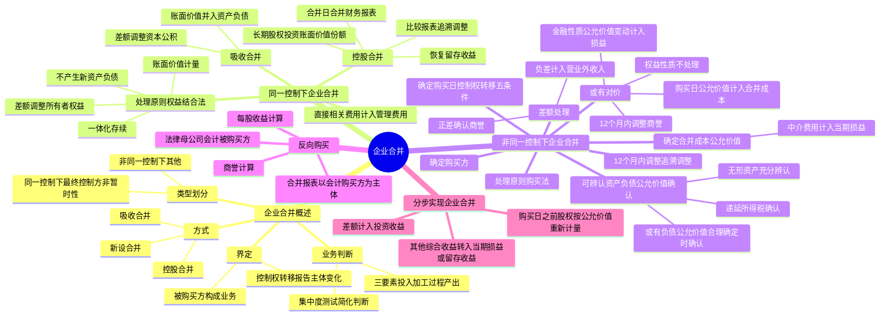

## 📍 章节定位

| 项目 | 信息 |
|------|------|
| **所属科目** | 📒 会计 |
| **难度等级** | ⭐⭐⭐⭐⭐ |
| **历年分值** | 8-10分 |
| **建议学时** | 10-12h |

## 📝 考情分析

本章是会计科目的核心重难点章节，历年分值约 8-10 分，是考试中必考的主观题章节，常以综合题形式考查，并广泛结合长期股权投资、合并财务报表、所得税、差错更正等章节出题。命题热点集中在：

1. **企业合并的界定与类型划分**：业务的判断（投入、加工处理过程、产出三要素；集中度测试）、企业合并的方式（控股合并、吸收合并、新设合并）、同一控制下与非同一控制下企业合并的区分（最终控制方是否存在、控制是否非暂时性——1 年以上）。
2. **同一控制下企业合并的处理**：权益结合法的应用（账面价值计量、不产生新资产负债、差额调整所有者权益——资本公积→盈余公积→未分配利润、一体化存续原则）、控股合并下长期股权投资初始投资成本的确定（被合并方所有者权益在最终控制方合并财务报表中的账面价值的份额）、合并日合并财务报表的编制（恢复留存收益）、吸收合并的会计处理。
3. **非同一控制下企业合并的处理**：购买法的应用、购买方的确定、购买日的确定（控制权转移五条件）、企业合并成本的确定（公允价值，中介费用计入当期损益）、可辨认资产和负债的确认（公允价值计量）、合并成本与可辨认净资产公允价值份额差额的处理（正差确认商誉，负差计入营业外收入）。
4. **购买日后 12 个月内的调整**：暂时确定价值的追溯调整（视同在购买日发生）、递延所得税资产的调整（冲减商誉，不足部分计入所得税费用）。
5. **或有对价的会计处理**：同一控制下（按或有事项准则处理）、非同一控制下（购买日按公允价值计入合并成本；12 个月内因购买日已存在情况调整商誉；其他情况权益性质不处理，金融资产/负债按公允价值计量计入当期损益）。
6. **反向购买**：法律上母公司与会计上购买方的区分、合并财务报表的编制原则（以会计上购买方为合并主体）、商誉的计算、每股收益的计算。
7. **分步实现企业合并**：购买日之前持有的被购买方股权按公允价值重新计量，差额计入投资收益。

考生需重点掌握：同一控制下企业合并采用**权益结合法**，按**账面价值**计量，差额调整所有者权益，视同一体化存续；非同一控制下企业合并采用**购买法**，按**公允价值**计量，合并成本 > 可辨认净资产公允价值份额确认**商誉**，合并成本 < 可辨认净资产公允价值份额计入**营业外收入**；同受国家控制的企业之间合并不仅因为受国家控制就作为同一控制下企业合并；购买日后 12 个月内对购买日已存在情况的调整应追溯调整商誉；或有对价中权益性质的不进行会计处理，金融性质的按公允价值计量变动计入当期损益。

## 🧠 知识框架



## 📖 核心精讲

### 一、企业合并概述

**企业合并**是将两个或两个以上单独的企业（主体）合并形成一个报告主体的交易或事项。是否构成企业合并主要关注两个方面：①被购买方是否构成**业务**；②交易前后是否涉及控制权的转移。

#### （一）业务的判断

**业务**是指企业内部某些生产经营活动或资产负债的组合，该组合具有**投入、加工处理过程和产出**能力，能够独立计算其成本费用或所产生的收入。

| 要素 | 内容 |
|------|------|
| **投入** | 原材料、人工、必要的生产技术等无形资产以及机器设备等长期资产 |
| **加工处理过程** | 具有一定管理能力、运营过程，能组织投入形成产出能力的系统、标准、协议、惯例或规则 |
| **产出** | 为客户提供产品或服务、为投资者或债权人提供股利或利息等投资收益 |

构成业务应至少同时具有**一项投入和一项实质性加工处理过程**，且二者相结合对产出能力有显著贡献。是否有实际产出并非必要条件。

**集中度测试**（非同一控制下可选择采用）：如果购买方取得的总资产的公允价值几乎相当于其中某一单独可辨认资产或一组类似可辨认资产的公允价值，则通过集中度测试，判断为**不构成业务**。

#### （二）企业合并的方式

| 方式 | 特征 | 被合并方法人资格 |
|------|------|----------------|
| **控股合并** | 取得控制权，被合并方成为子公司 | 维持独立法人资格 |
| **吸收合并** | 取得全部净资产，并入合并方 | 注销被合并方法人资格 |
| **新设合并** | 参与合并各方法人资格均注销，重新注册新企业 | 均注销，新企业成立 |

#### （三）企业合并类型的划分

| 类型 | 定义 | 核心要素 |
|------|------|---------|
| **同一控制下企业合并** | 参与合并各方在合并前后均受同一方或相同多方最终控制且该控制并非暂时性 | ①合并前后受同一方/相同多方最终控制；②该控制非暂时性（1 年以上） |
| **非同一控制下企业合并** | 同一控制下企业合并以外的其他企业合并 | 不存在最终控制方 |

> **重要**：同受国家控制的企业之间发生的合并，不应仅因为参与合并各方在合并前后均受国家控制而将其作为同一控制下企业合并。

### 二、同一控制下企业合并的处理

#### （一）处理原则（权益结合法）

同一控制下企业合并采用**权益结合法**，将企业合并看作两个或两个以上参与合并企业权益的重新整合。核心原则：

1. 合并方确认取得的被合并方资产、负债**局限于被合并方账面上原已确认的资产和负债**，不产生新的资产和负债（不确认新的商誉，但被合并方原已确认的商誉应作为合并中取得的资产确认）。
2. 合并中取得的被合并方各项资产、负债应维持其**原账面价值**不变。会计政策不一致的应先统一。被合并方是最终控制方以前从第三方收购来的，应以被合并方资产、负债（包括最终控制方收购时形成的商誉）在**最终控制方合并财务报表中的账面价值**为基础。
3. 合并方取得的净资产入账价值与支付的对价账面价值之间的差额，应当**调整所有者权益**（不计入损益）。首先调整资本公积（资本溢价或股本溢价），不足冲减的依次冲减盈余公积和未分配利润。
4. **一体化存续原则**：视同合并后形成的报告主体自最终控制方开始实施控制时一直是一体化存续下来的。合并利润表和合并现金流量表反映自合并当期期初至合并日的损益及现金流量；比较报表应追溯调整。

#### （二）控股合并的会计处理

**1. 长期股权投资的确认和计量**

合并方在合并日按照**被合并方所有者权益在最终控制方合并财务报表中的账面价值的份额**作为长期股权投资的初始投资成本。

- 初始投资成本与支付对价账面价值的差额，调整资本公积（资本溢价或股本溢价），不足冲减的依次冲减盈余公积和未分配利润。
- 合并方以发行权益性证券作为对价的，按发行股份面值总额作为股本，长期股权投资初始投资成本与股本差额调整资本公积。

**2. 合并日合并财务报表的编制**

同一控制下控股合并形成母子公司关系的，合并方一般应在合并日编制合并财务报表。

- **合并资产负债表**：被合并方资产、负债以其在最终控制方合并财务报表中的账面价值并入。合并方与被合并方在合并日及以前期间发生的交易应作为内部交易抵销。
- **恢复留存收益**：被合并方在企业合并前实现的留存收益（盈余公积和未分配利润）中归属于合并方的部分，自合并方的资本公积转入盈余公积和未分配利润（以资本公积贷方余额为限）。
- **合并利润表**：包含合并方及被合并方自合并当期期初至合并日实现的损益。
- **比较报表**：视同合并后报告主体在以前期间一直存在，追溯调整。

#### （三）吸收合并的会计处理

合并方在合并日取得被合并方各项资产、负债按**账面价值**入账，支付的对价与取得净资产账面价值的差额调整资本公积（资本溢价或股本溢价），不足冲减的依次冲减盈余公积和未分配利润。

#### （四）直接相关费用的处理

合并方为进行企业合并发生的审计费用、资产评估费用、法律咨询费用等**直接相关费用**，应于发生时**费用化**计入当期损益（管理费用）。但以下例外：
- 发行债券方式的佣金、手续费按金融工具准则处理。
- 发行权益性证券的佣金、手续费按金融工具准则处理（冲减资本公积）。

### 三、非同一控制下企业合并的处理

#### （一）处理原则（购买法）

非同一控制下企业合并采用**购买法**，从购买方角度出发，确认取得的资产和承担的负债（包括被购买方原来未予确认的），按**公允价值**计量。

#### （二）确定购买方

购买方是取得对另一方或多方控制权的一方。判断考虑因素：①支付现金、转让非现金资产或承担负债的一方一般为购买方；②合并后主体相对投票权较高的一方；③管理层主导能力；④公允价值较大的一方；⑤付出现金或其他资产的一方；⑥发行权益性证券的一方通常为购买方（反向购买除外）。

#### （三）确定购买日

购买日是购买方获得对被购买方控制权的日期。同时满足下列条件时一般可认为实现了控制权转移：

1. 合并合同或协议已获股东会等内部权力机构通过；
2. 需要国家有关主管部门审批的，已获得批准；
3. 参与合并各方已办理了必要的财产权交接手续；
4. 购买方已支付购买价款的大部分（一般超过 50%），且有能力支付剩余款项；
5. 购买方实际上已经控制了被购买方的财务和生产经营政策。

#### （四）确定企业合并成本

企业合并成本包括购买方为进行企业合并支付的现金或非现金资产、发生或承担的债务、发行的权益性证券等在**购买日的公允价值**。

- 审计、法律服务、评估咨询等**中介费用及其他管理费用计入当期损益**。
- 作为合并对价发行的权益性证券或债务性证券的交易费用按金融工具准则处理。

#### （五）可辨认资产和负债的确认

购买方在购买日取得的被购买方各项可辨认资产和负债，应当按**公允价值**确认：

| 项目 | 确认条件 |
|------|---------|
| 各项资产（无形资产除外） | 未来经济利益预期能流入企业且公允价值能可靠计量 |
| 各项负债（或有负债除外） | 履行义务预期导致经济利益流出企业且公允价值能可靠计量 |
| **无形资产** | 符合无形资产定义且公允价值能可靠计量；应充分辨认被购买方拥有但未确认的无形资产（源于合同性权利或法定权利，或能够分离划分） |
| **或有负债** | 公允价值能够合理确定时即确认为负债（即使经济利益流出的可能性较小） |
| **递延所得税** | 计税基础与账面价值不同形成暂时性差异的，确认递延所得税资产或负债 |

> 注意：被购买方在合并前已确认的商誉和递延所得税项目不予考虑。

#### （六）合并成本与可辨认净资产公允价值份额差额的处理

| 情形 | 差额 | 会计处理 |
|------|------|---------|
| 合并成本 **>** 可辨认净资产公允价值份额 | 正差 | 确认为**商誉**（控股合并在合并报表列示；吸收合并在个别报表确认） |
| 合并成本 **<** 可辨认净资产公允价值份额 | 负差 | 计入合并当期损益（**营业外收入**），复核后确认 |

**商誉**在确认后持有期间不要求摊销，按资产减值准则进行减值测试。

#### （七）购买日后 12 个月内的调整

合并当期期末以暂时确定的价值为基础核算的，自购买日算起 **12 个月内**取得进一步信息需要调整的，**视同在购买日发生**，进行追溯调整（包括调整商誉）。超过 12 个月的调整作为前期差错处理。

**递延所得税资产的特殊调整**：购买日不符合递延所得税资产确认条件的可抵扣暂时性差异，购买日后 12 个月内取得新信息表明购买日已存在相关情况的，应确认递延所得税资产，同时**冲减商誉**，商誉不足冲减的差额计入当期所得税费用。

#### （八）或有对价的会计处理

| 类型 | 会计处理 |
|------|---------|
| **同一控制下** | 按或有事项准则判断是否确认预计负债或资产，不影响合并处理 |
| **非同一控制下——购买日** | 或有对价按购买日公允价值计入企业合并成本 |
| **非同一控制下——12 个月内** | 因购买日已存在情况的新的或进一步证据需要调整的，确认并**调整原计入合并商誉的金额** |
| **非同一控制下——其他时点（权益性质）** | **不进行会计处理** |
| **非同一控制下——其他时点（金融资产/负债性质）** | 按公允价值计量，公允价值变动计入**当期损益** |

### 四、反向购买的处理

**反向购买**是指通过权益互换实现的企业合并中，发行权益性证券的一方（法律上的母公司）在合并后被参与合并的另一方（法律上的子公司）控制，则法律上的母公司实际上是会计上的被购买方，法律上的子公司是会计上的购买方。

**合并财务报表编制原则**：
- 法律上母公司（会计上被购买方）遵从以下原则编制合并报表：
- 合并报表中的**留存收益**反映法律上子公司（会计上购买方）在合并前的留存收益。
- 合并报表中的**股本**金额 = 法律上子公司（会计上购买方）合并前发行在外的股份面值 × 假定确定该项企业合并成本而新发行的权益性证券数量 + 法律上子公司在编制合并财务报表中的股本。
- 合并报表中**权益性工具的金额**应为法律上子公司在合并前发行在外的股份面值。
- **商誉** = 会计上购买方（法律上子公司）的合并成本 − 会计上被购买方（法律上母公司）可辨认净资产公允价值份额。
- 法律上母公司的有关可辨认资产、负债按购买日公允价值并入。

**每股收益**：发生反向购买当期，用于计算每股收益的发行在外普通股加权平均数为：
- 自当期期初至购买日，发行在外的法律上母公司普通股数量；
- 自购买日至期末，发行在外的法律上母公司普通股的假定数量（按反向购买后法律上母公司向法律上子公司股东发行的普通股数量计算）。

### 五、分步实现企业合并

通过多次交易分步实现非同一控制下企业合并的：

| 步骤 | 会计处理 |
|------|---------|
| **购买日个别报表** | 以购买日之前所持被购买方股权的**账面价值**与购买日新增投资**公允价值**之和，作为长期股权投资初始投资成本（成本法） |
| **购买日合并报表** | 购买日之前持有的被购买方股权按**公允价值重新计量**，公允价值与账面价值的差额计入**投资收益** |
| **其他综合收益** | 购买日之前持有的股权涉及其他综合收益的，购买日转入当期投资收益（可转损益的）或留存收益（不可转损益的，如指定为 FVOCI 的权益工具投资） |

### 六、被购买方的会计处理

非同一控制下的企业合并中，被购买方在合并后仍保持法人资格的，不需要进行会计处理（仅股东变更）。被购买方在吸收合并中失去法人资格的，其会计处理由购买方按公允价值重新确认各项资产、负债。

## 💡 典型例题

**【例题 1】（基础题，单选题）**

下列关于同一控制下企业合并的表述中，正确的是（　　）。
A. 合并方应以支付的合并对价的公允价值作为长期股权投资的初始投资成本
B. 合并方在合并中取得的被合并方各项资产、负债应按公允价值计量
C. 合并方取得的净资产入账价值与支付对价账面价值的差额应调整所有者权益
D. 合并方为进行企业合并发生的中介费用应计入长期股权投资成本

**答案**：C

**解析**：A 错误，同一控制下企业合并以被合并方所有者权益在最终控制方合并财务报表中的账面价值的份额作为初始投资成本；B 错误，同一控制下按账面价值计量，非同一控制下才按公允价值计量；C 正确，同一控制下企业合并不确认损益，差额调整所有者权益（资本公积→盈余公积→未分配利润）；D 错误，中介费用应于发生时计入管理费用。

**【例题 2】（进阶题，单选题）**

下列关于非同一控制下企业合并中商誉的表述中，正确的是（　　）。
A. 企业合并成本小于合并中取得的被购买方可辨认净资产公允价值份额的差额确认为商誉
B. 商誉在确认后应按使用寿命摊销
C. 购买日后 12 个月内对购买日已存在情况进行调整的，应追溯调整商誉金额
D. 控股合并下商誉在购买方个别财务报表中确认

**答案**：C

**解析**：A 错误，合并成本大于可辨认净资产公允价值份额的差额才确认为商誉，小于的差额计入营业外收入；B 错误，商誉不要求摊销，但应进行减值测试；C 正确，购买日后 12 个月内因购买日已存在情况的新的或进一步证据需要调整的，应追溯调整商誉；D 错误，控股合并下商誉在合并财务报表中列示，吸收合并下商誉在购买方个别财务报表中确认。

**【例题 3】（计算题，同一控制下控股合并）**

A 公司和 B 公司分别为 C 公司控制下的两家子公司。A 公司于 2×20 年 3 月 10 日自母公司 C 处取得 B 公司 100% 的股权，合并后 B 公司仍维持独立法人资格。为进行该项企业合并，A 公司发行了 600 万股本公司普通股（每股面值 1 元）作为对价。合并日，B 公司所有者权益在最终控制方 C 公司合并财务报表中的账面价值为 2 200 万元，其中股本 600 万元，资本公积 200 万元，盈余公积 200 万元，未分配利润 1 200 万元。A 公司资本公积（资本溢价）余额为 1 000 万元。

要求：计算 A 公司长期股权投资的初始投资成本并编制个别报表会计分录。

**答案**：

- 长期股权投资初始投资成本 = B 公司所有者权益在最终控制方合并财务报表中的账面价值 × 持股比例 = 2 200 × 100% = **2 200（万元）**
- 发行股份面值 = 600 × 1 = 600（万元）
- 差额 = 2 200 − 600 = 1 600（万元），调整资本公积（资本溢价）

```
借：长期股权投资                22 000 000
    贷：股本                     6 000 000
        资本公积——资本溢价      16 000 000
```

**解析**：同一控制下控股合并，长期股权投资初始投资成本为被合并方所有者权益在最终控制方合并财务报表中的账面价值的份额，与支付对价账面价值的差额调整资本公积。

**【例题 4】（计算题，非同一控制下吸收合并）**

A 公司于 2×21 年 6 月 30 日以银行存款 3 500 万元取得 B 公司 100% 净资产（吸收合并），A 公司与 B 公司此前不存在关联方关系。购买日，B 公司可辨认资产公允价值为 4 000 万元，可辨认负债公允价值为 1 200 万元。A 公司发生审计、评估等中介费用 50 万元。

要求：计算 A 公司应确认的商誉金额并编制相关会计分录。

**答案**：

- 可辨认净资产公允价值 = 4 000 − 1 200 = 2 800（万元）
- 合并成本 = 3 500（万元）（中介费用 50 万元计入管理费用，不计入合并成本）
- 商誉 = 合并成本 − 可辨认净资产公允价值份额 = 3 500 − 2 800 = **700（万元）**

```
借：相关资产类科目              40 000 000
    商誉                         7 000 000
    管理费用                      500 000
    贷：相关负债类科目           12 000 000
        银行存款                 35 500 000
```

**解析**：非同一控制下企业合并按公允价值计量，合并成本 > 可辨认净资产公允价值份额的差额确认商誉。中介费用计入管理费用，不构成合并成本。吸收合并下商誉在购买方个别报表中确认。

**【例题 5】（综合题，或有对价）**

A 上市公司于 2×24 年 1 月 1 日以 4 000 万元收购 B 公司 100% 股权（非同一控制下企业合并）。合并协议约定，如果 B 公司 2×24 年净利润低于 500 万元，B 公司原股东将以现金退还 A 公司 2 000 万元。购买日，A 公司估计 B 公司能够实现承诺利润，或有对价估计为 0。B 公司可辨认净资产公允价值为 3 000 万元。2×24 年末，B 公司实际净利润为 300 万元。A 公司 2×24 年末估计或有对价公允价值为 2 000 万元。

要求：说明 A 公司购买日及 2×24 年末或有对价的会计处理。

**答案**：

（1）购买日（2×24 年 1 月 1 日）：
- 合并成本 = 4 000 + 0（或有对价公允价值）= 4 000（万元）
- 商誉 = 4 000 − 3 000 = 1 000（万元）
- 或有对价估计为 0，不调整合并成本。

（2）2×24 年末：
- B 公司未实现预期利润属于购买日**以后新发生**的情况（非购买日已存在情况），因此**不调整商誉**。
- 或有对价为金融负债性质（现金退还义务），按公允价值计量，公允价值变动计入当期损益。
- 确认或有对价公允价值变动 2 000 万元，计入公允价值变动损益。

```
借：公允价值变动损益           20 000 000
    贷：交易性金融负债           20 000 000
```

**解析**：或有对价在购买日按公允价值计入合并成本。购买日后 12 个月内因购买日已存在情况调整的才调整商誉；因新发生情况变化的，权益性质不处理，金融性质按公允价值计量变动计入当期损益。

**【例题 6】（综合题，分步实现企业合并）**

A 公司于 2×23 年 1 月 1 日以 1 000 万元取得 B 公司 20% 股权（重大影响，权益法核算），2×24 年 1 月 1 日再以 3 500 万元取得 B 公司 40% 股权，达到控制（非同一控制下企业合并）。2×23 年 12 月 31 日，B 公司可辨认净资产公允价值为 5 500 万元（与账面价值一致），A 公司 20% 股权账面价值为 1 100 万元（1 000 + 100 投资收益确认）。2×24 年 1 月 1 日，B 公司可辨认净资产公允价值为 6 000 万元，A 公司原持有 20% 股权公允价值为 1 200 万元。

要求：计算合并成本、商誉及合并报表中应确认的投资收益。

**答案**：

（1）合并成本 = 原持有股权公允价值 + 新增投资公允价值 = 1 200 + 3 500 = **4 700（万元）**

（2）商誉 = 合并成本 − 可辨认净资产公允价值份额 = 4 700 − 6 000 × 60% = 4 700 − 3 600 = **1 100（万元）**

（3）合并报表中应确认的投资收益 = 原持有股权公允价值 − 原账面价值 = 1 200 − 1 100 = **100（万元）**

**解析**：分步实现非同一控制下企业合并，在合并报表中，购买日之前持有的股权按公允价值重新计量，差额计入投资收益。合并成本 = 原股权公允价值 + 新增投资公允价值。个别报表中以原股权账面价值 + 新增投资公允价值作为初始投资成本（成本法核算）。

## 🎯 记忆口诀

- **同一控制 vs 非同一控制**："同控账面调权益，非同公允确认商誉"——同一控制下按账面价值计量，差额调整所有者权益；非同一控制下按公允价值计量，正差确认商誉。
- **权益结合法四原则**："账面价值、不生新资产、差额调权益、一体化存续"——按账面价值计量、不产生新资产负债、差额调整所有者权益、视同一体化存续。
- **长期股权投资初始成本（同一控制）**："最终控制方合并报表账面价值份额"——不是被合并方个别报表账面价值，而是最终控制方合并财务报表中的账面价值。
- **购买日五条件**："内部批准、外部审批、产权交接、支付过半、控制实现"——股东会通过、主管部门批准、财产权交接、价款支付超 50%、实际控制财务和经营政策。
- **商誉 vs 营业外收入**："大于商誉小于收入"——合并成本 > 可辨认净资产公允价值份额确认商誉；< 计入营业外收入。
- **中介费用**："计入管理费用不计成本"——审计、评估、法律咨询等中介费用计入当期损益，不构成合并成本。
- **12 个月调整**："12 个月内追溯调商誉，12 个月后前期差错"——购买日后 12 个月内因购买日已存在情况调整的追溯调整商誉，超过 12 个月按前期差错处理。
- **或有对价**："权益不处理，金融调损益，12 月内调商誉"——权益性质或有对价不进行会计处理；金融性质按公允价值计量变动计入当期损益；12 个月内因购买日已存在情况调整的调整商誉。
- **反向购买**："法律母公司会计被购买方，合并报表以会计购买方为主体"——发行权益性证券的一方为法律上母公司，但会计上为被购买方。
- **分步实现**："合并报表原股权按公允重新计量，差额入投资收益"——购买日之前持有股权按公允价值重新计量，差额计入投资收益。

## ✅ 同步练习

1. （基础题）企业合并的界定，业务的判断（三要素、集中度测试），企业合并的方式（控股、吸收、新设），同一控制下与非同一控制下的区分。提示：参见《必刷 550 题》企业合并基础题。
2. （进阶题）同一控制下企业合并的会计处理原则（权益结合法），控股合并下长期股权投资初始投资成本的确定，合并日合并财务报表的编制（恢复留存收益）。提示：参见《必刷 550 题》企业合并进阶题。
3. （易错题）非同一控制下企业合并购买日的确定，合并成本的确定（中介费用处理），可辨认资产负债的公允价值确认，商誉的计算。提示：参见《必刷 550 题》企业合并易错题。
4. （计算题）同一控制下控股合并的会计处理（个别报表和合并报表），吸收合并的会计处理，比较报表的追溯调整。提示：参见《必刷 550 题》企业合并计算题。
5. （真题改编）非同一控制下企业合并的会计处理（合并成本、商誉、可辨认资产负债确认），购买日后 12 个月内的追溯调整。提示：参见历年真题综合题。
6. （综合题）或有对价的会计处理（同一控制下 vs 非同一控制下，权益性质 vs 金融性质，12 个月内 vs 其他时点），反向购买的合并报表编制和每股收益计算。提示：参见历年真题综合题。
7. 综合复习分步实现企业合并（个别报表 vs 合并报表，原股权公允价值重新计量，其他综合收益处理），补偿性资产的会计处理。
