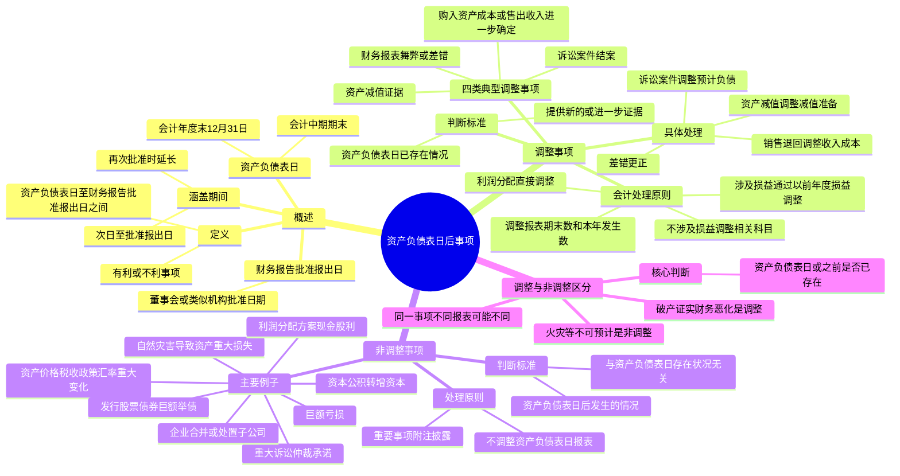

## 1. 章节定位

| 项目 | 信息 |
|------|------|
| 所属科目 | 会计 |
| 难度等级 | 3 |
| 历年分值 | 6-10 分 |
| 建议学时 | 6-8 小时 |
| 知识关联章节 | 第17章 收入（销售退回）、第19章 所得税（应交所得税与递延所得税调整）、第23章 财务报告（报表调整）、第24章 会计政策变更与差错更正（日后期间发现差错）、第10章 职工薪酬与第13章 或有事项（预计负债调整） |

## 2. 考情分析

本章是会计科目的重要章节，历年分值约 6-10 分，几乎每年必考主观题，常以综合题或计算分析题形式出现，并与收入、所得税、或有事项、差错更正等章节联动考查，是典型的"工具型"章节。

**命题规律**：本章核心是调整事项与非调整事项的区分及调整事项的会计处理。主观题常以业务情境为载体，要求考生判断各事项属于调整事项还是非调整事项，并对调整事项完成账务处理、报表调整与附注披露。客观题则集中在概念判断、涵盖期间确定、调整与非调整的区分。

**高频考点分布**：

1. **资产负债表日后事项的定义与涵盖期间**：资产负债表日（会计年度末和会计中期期末）、财务报告批准报出日（董事会或类似机构批准报出的日期）、涵盖期间（自资产负债表日次日起至财务报告批准报出日止）。
2. **调整事项与非调整事项的区分**：判断标准是事项表明的情况在资产负债表日或之前是否已经存在。已存在的为调整事项，日后新发生的为非调整事项。
3. **调整事项的会计处理**：通过"以前年度损益调整"科目核算涉及损益的事项，调整资产负债表日财务报表相关项目。四类典型调整事项：诉讼案件结案、资产减值证据、购入资产成本或售出资产收入进一步确定、财务报表舞弊或差错。
4. **非调整事项的披露**：重要的非调整事项应在附注中披露性质、内容及其对财务状况和经营成果的影响。
5. **销售退回的特殊处理**：区分估计偏差（调整事项）与日后条件改变（非调整事项）。
6. **利润分配方案的处理**：资产负债表日后利润分配方案中拟分配的及经审议批准宣告发放的股利或利润属于非调整事项，不调整报表但需披露。

**联动考查方式**：
- 与收入章节结合：资产负债表日后销售退回的会计处理；
- 与所得税章节结合：调整事项中应交所得税与递延所得税的调整、汇算清缴前后的处理差异；
- 与或有事项结合：诉讼案件结案后预计负债的调整；
- 与差错更正结合：日后期间发现的报告年度差错作为调整事项处理。

**备考建议**：
- 牢记区分核心：事项在资产负债表日或之前是否已经存在；
- 调整事项账务处理三步走：涉及损益通过"以前年度损益调整"、结转未分配利润、调整盈余公积；
- 注意汇算清缴前后差异：汇算清缴前调整报告年度应交所得税，汇算清缴后调整本年度应交所得税；
- 利润分配方案（现金股利）是非调整事项，不调整报表仅披露；
- 区分"以前年度损益调整"科目在差错更正与日后事项中的不同使用背景。

## 3. 知识框架



## 4. 核心精讲

### 4.1 资产负债表日后事项的定义

**资产负债表日后事项**，是指资产负债表日至财务报告批准报出日之间发生的有利或不利事项。资产负债表日后事项不是在这个特定期间内发生的全部事项，而是与资产负债表日存在状况有关的事项，或虽然与资产负债表日存在状况无关，但对企业财务状况具有重大影响的事项。理解这一定义，需要注意以下方面：

**（1）资产负债表日**

资产负债表日是指会计年度末和会计中期期末。中期是指短于一个完整的会计年度的报告期间，包括半年度、季度和月度。按照《中华人民共和国会计法》规定，会计年度自公历 1 月 1 日起至 12 月 31 日止。因此，年度资产负债表日是指每年的 12 月 31 日，中期资产负债表日是指各会计中期期末。例如，提供第一季度财务报告时，资产负债表日是该年度的 3 月 31 日；提供半年度财务报告时，资产负债表日是该年度的 6 月 30 日。

如果母公司或者子公司在国外，无论该母公司或子公司如何确定会计年度和会计中期，其向国内提供的财务报告都应根据《中华人民共和国会计法》和企业会计准则的要求确定资产负债表日。

**（2）财务报告批准报出日**

财务报告批准报出日是指董事会或类似机构批准财务报告报出的日期，通常是指对财务报告的内容负有法律责任的单位或个人批准财务报告对外公布的日期。财务报告的批准者包括所有者、所有者中的多数、董事会或类似的管理单位、部门和个人。实务中，公司制企业的财务报告通常由董事会批准报出，非公司制企业的财务报告通常由经理（厂长）会议或类似机构批准报出。对于设置董事会的公司制企业，财务报告批准报出日是指董事会批准财务报告报出的日期；对于其他企业，财务报告批准报出日一般是指经理（厂长）会议或类似机构批准财务报告报出的日期。

**（3）有利事项和不利事项**

资产负债表日后事项包括有利事项和不利事项。有利或不利事项，是指资产负债表日后对企业财务状况、经营成果等具有一定影响（既包括有利影响也包括不利影响）的事项。如果某些事项的发生对企业并无任何影响，那么这些事项既不是有利事项，也不是不利事项，也就不属于这里所说的资产负债表日后事项。

### 4.2 资产负债表日后事项涵盖的期间

资产负债表日后事项涵盖的期间是自资产负债表日次日起至财务报告批准报出日止的一段时间。对上市公司而言，这一期间内涉及几个日期，包括完成财务报告编制日、注册会计师出具审计报告日、董事会批准财务报告可以对外公布日、实际对外公布日等。具体而言，资产负债表日后事项涵盖的期间应当包括：

**（1）报告期间下一期间的第一天至董事会或类似机构批准财务报告对外公布的日期。**

**（2）财务报告批准报出以后、实际报出之前又发生与资产负债表日或其后事项有关的事项**，并由此影响财务报告对外公布日期的，应以董事会或类似机构再次批准财务报告对外公布的日期为截止日期。

例如，某上市公司 2×25 年的年度财务报告于 2×26 年 2 月 20 日编制完成，注册会计师签署审计报告日期为 2×26 年 4 月 17 日，董事会批准财务报告对外公布的日期为 2×26 年 4 月 17 日，财务报告实际对外报出的日期为 2×26 年 4 月 23 日。该公司 2×25 年年报资产负债表日后事项涵盖的期间为 2×26 年 1 月 1 日至 2×26 年 4 月 17 日。如果在 4 月 17 日至 23 日之间发生了重大事项，需要调整财务报表相关项目的数字或需要在财务报表附注中披露，经调整或说明后的财务报告再经董事会批准报出的日期为 2×26 年 4 月 25 日，则资产负债表日后事项涵盖的期间延长为 2×26 年 1 月 1 日至 2×26 年 4 月 25 日。

### 4.3 调整事项与非调整事项的内容及区分

资产负债表日后事项包括资产负债表日后调整事项（以下简称调整事项）和资产负债表日后非调整事项（以下简称非调整事项）。

**（1）调整事项**

资产负债表日后调整事项，是指对资产负债表日已经存在的情况提供了新的或进一步证据的事项。如果资产负债表日及所属会计期间已经存在某种情况，但当时并不知道其存在或者不能知道确切结果，资产负债表日后发生的事项能够证实该情况的存在或者确切结果，则该事项属于调整事项。如果资产负债表日后事项对资产负债表日的情况提供了进一步的证据，证据表明的情况与原来的估计和判断不完全一致，则需要对原来的会计处理进行调整。

企业发生的调整事项，通常包括下列各项：
- ①资产负债表日后诉讼案件结案，法院判决证实了企业在资产负债表日已经存在现时义务，需要调整原先确认的与该诉讼案件相关的预计负债，或确认一项新负债；
- ②资产负债表日后取得确凿证据，表明某项资产在资产负债表日发生了减值或者需要调整该项资产原先确认的减值金额；
- ③资产负债表日后进一步确定了资产负债表日前购入资产的成本或售出资产的收入；
- ④资产负债表日后发现了财务报表舞弊或差错。

**（2）非调整事项**

非调整事项，是指表明资产负债表日后发生的情况的事项。非调整事项的发生不影响资产负债表日企业的财务报表数字，只说明资产负债表日后发生了某些情况。其中重要的非调整事项虽然不影响资产负债表日的财务报表数字，但可能影响资产负债表日以后的财务状况和经营成果，不加以说明将会影响财务报告使用者作出正确估计和决策，因此需要适当披露。企业发生的非调整事项，通常包括资产负债表日后发生重大诉讼、仲裁、承诺，资产负债表日后资产价格、税收政策、外汇汇率发生重大变化，资产负债表日后因自然灾害导致资产发生重大损失等。

**（3）调整事项与非调整事项的区分**

资产负债表日后发生的某一事项究竟是调整事项还是非调整事项，取决于该事项表明的情况在资产负债表日或资产负债表日以前是否已经存在。**若该情况在资产负债表日或之前已经存在，则属于调整事项；反之，则属于非调整事项。**这是因为，在会计期间假设下，调整事项虽然发生在资产负债表日的下一会计期间，但其指向的情况在资产负债表日已经存在，资产负债表日后所获得的证据只为资产负债表日已经存在状况提供了进一步证据，为便于真实、公允反映企业财务状况和经营成果，需要对资产负债表日的财务报表进行调整。

在区分调整事项与非调整事项时，还需注意以下两个方面：

第一，调整事项和非调整事项是一个广泛的概念，同一性质的事项对于不同的财务报表而言，可能是调整事项，也可能是非调整事项，这取决于该事项所表明的情况是在资产负债表日或以前已经存在或发生，还是在资产负债表日后才发生的。

第二，企业会计准则中分别列举了部分调整事项和非调整事项，但并非全部。实务中，企业应按照资产负债表日后事项的判断原则，确定资产负债表日后发生的事项中哪些属于调整事项，哪些属于非调整事项。

**典型案例对比**：甲公司 2×16 年 10 月向乙公司出售一批原材料，价款 2000 万元，至 2×16 年 12 月 31 日乙公司尚未付款。情况（1）：2×16 年 12 月 31 日甲公司判断乙公司有可能破产，估计 20% 无法收回，按 20% 计提坏账；2×17 年 1 月 20 日乙公司被宣告破产，甲公司估计 70% 无法收回。情况（2）：2×16 年 12 月 31 日乙公司财务状况良好，甲公司预计可按时收回；2×17 年 1 月 20 日乙公司发生重大火灾，导致 50% 应收账款无法收回。

情况（1）中，导致应收账款无法收回的事实是乙公司财务状况恶化，该事实在资产负债表日已经存在，乙公司被宣告破产只是证实了这一情况，因此属于调整事项。情况（2）中，导致应收账款损失的因素是火灾，火灾是不可预计的，应收账款发生损失这一事实在资产负债表日以后才发生，因此属于非调整事项。

### 4.4 调整事项的处理原则

企业发生的调整事项，应当调整资产负债表日的财务报表。对于年度财务报告而言，由于资产负债表日后事项发生在报告年度的次年，报告年度的有关账目已经结转，特别是损益类科目在结账后已无余额。因此，年度资产负债表日后发生的调整事项，应具体分别以下情况进行处理：

**（1）涉及损益的事项**，通过"以前年度损益调整"科目核算。调整增加以前年度利润或调整减少以前年度亏损的事项，记入"以前年度损益调整"科目的贷方；调整减少以前年度利润或调整增加以前年度亏损的事项，记入"以前年度损益调整"科目的借方。

涉及损益的调整事项，在企业所得税方面应按税收有关法律法规要求进行处理，可能会调整报告年度应纳税所得额、应纳所得税税额；也可能会调整本年度（即报告年度的次年）应纳税所得额、应纳所得税税额。由于以前年度损益调整增加的所得税费用，记入"以前年度损益调整"科目的借方，同时贷记"应交税费——应交所得税"等科目；由于以前年度损益调整减少的所得税费用，记入"以前年度损益调整"科目的贷方，同时借记"应交税费——应交所得税"等科目。调整完成后，将"以前年度损益调整"科目的贷方或借方余额，转入"利润分配——未分配利润"科目。

**（2）涉及利润分配调整的事项**，直接在"利润分配——未分配利润"科目核算。

**（3）不涉及损益及利润分配的事项**，调整相关科目。

**（4）通过上述账务处理后，还应同时调整财务报表相关项目的数字**，包括：①资产负债表日编制的财务报表相关项目的期末数或本年发生数；②当期编制的财务报表相关项目的期初数或上年数；③经过上述调整后，如果涉及报表附注内容的，还应当作出相应调整。

### 4.5 调整事项的具体会计处理方法

为简化处理，如无特殊说明，本章所有的例子均假定如下：财务报告批准报出日是次年 4 月 30 日，所得税税率为 25%，按净利润的 10% 提取法定盈余公积，提取法定盈余公积后不再作其他分配；调整事项按税法规定均可调整应交纳的所得税；涉及递延所得税资产的，均假定未来期间很可能取得用来抵扣暂时性差异的应纳税所得额；不考虑报表附注中有关现金流量表项目的数字。

**（1）资产负债表日后诉讼案件结案**

这一事项是指导致诉讼的事项在资产负债表日已经发生，但尚不具备确认负债的条件而未确认，资产负债表日后至财务报告批准报出日之间获得了新的或进一步的证据（法院判决结果），表明符合负债的确认条件。因此，应在财务报告中确认为一项新负债；或者在资产负债表日虽已确认，但需要根据判决结果调整已确认负债的金额。

**典型业务**：甲公司与乙公司签订销售合同，甲公司应于 2×16 年 8 月销售给乙公司一批物资，因甲公司未能按合同发货致使乙公司发生重大经济损失。2×16 年 12 月乙公司将甲公司告上法庭，要求赔偿 450 万元。2×16 年 12 月 31 日法院尚未判决，甲公司确认预计负债 300 万元。2×17 年 2 月 10 日，法院判决甲公司赔偿 400 万元，甲、乙双方均服从判决，当日支付赔偿款。甲、乙公司 2×16 年所得税汇算清缴均在 2×17 年 3 月 20 日完成（假定预计负债产生的损失不允许在预计时税前扣除，只有在损失实际发生时才允许税前扣除）。

**甲公司账务处理要点**：
- 调整预计负债金额：借记"以前年度损益调整"100 万元，贷记"其他应付款"100 万元（赔偿额由 300 万增至 400 万）；
- 调整应交所得税（汇算清缴前）：借记"应交税费——应交所得税"100 万元（400×25%），贷记"以前年度损益调整"100 万元（实际发生损失允许税前扣除）；
- 冲销原确认的递延所得税资产：借记"以前年度损益调整"75 万元，贷记"递延所得税资产"75 万元（300×25%，原预计负债确认的递延所得税资产不再存在）；
- 结转预计负债至其他应付款：借记"预计负债"300 万元，贷记"其他应付款"300 万元；
- 支付赔偿款：借记"其他应付款"400 万元，贷记"银行存款"400 万元；
- 结转"以前年度损益调整"余额 75 万元至未分配利润：借记"利润分配——未分配利润"75 万元，贷记"以前年度损益调整"75 万元；
- 调整盈余公积：借记"盈余公积"7.5 万元，贷记"利润分配——未分配利润"7.5 万元。

**报表调整**：资产负债表年末数中调减递延所得税资产 75 万元，调增其他应付款 400 万元，调减应交税费 100 万元，调减预计负债 300 万元，调减盈余公积 7.5 万元，调减未分配利润 67.5 万元；利润表调增营业外支出 100 万元，调减所得税费用 25 万元，调减净利润 75 万元。

**乙公司账务处理要点**：借记"其他应收款"400 万元，贷记"以前年度损益调整"400 万元；借记"以前年度损益调整"100 万元（400×25%），贷记"应交税费——应交所得税"100 万元；收到赔款借记"银行存款"400 万元贷记"其他应收款"400 万元；结转"以前年度损益调整"余额 300 万元至未分配利润；补提盈余公积 30 万元。报表调整：调增其他应收款 400 万元，调增应交税费 100 万元，调增盈余公积 30 万元，调增未分配利润 270 万元；利润表调增营业外收入 400 万元，调增所得税费用 100 万元，调增净利润 300 万元。

**（2）资产负债表日后取得确凿证据，表明某项资产在资产负债表日发生了减值或者需要调整该项资产原先确认的减值金额**

这一事项是指在资产负债表日，根据当时的资料判断某项资产可能发生了损失或减值，但没有最后确定是否会发生，因而按照当时的最佳估计金额反映在财务报表中。但在资产负债表日后至财务报告批准报出日之间，所取得的确凿证据能证明该事实成立，即某项资产已经发生了损失或减值，则应对资产负债表日所作的估计予以修正。

**（3）资产负债表日后进一步确定了资产负债表日前购入资产的成本或售出资产的收入**

这类调整事项包括两方面内容：①若资产负债表日前购入的资产已经按暂估金额入账，资产负债表日后获得证据，可以进一步确定该资产的成本，则应对已入账的资产成本进行调整；②企业在资产负债表日已根据收入确认条件确认资产销售收入，但资产负债表日后获得关于资产销售收入的进一步证据，如可变对价相关的后续变化等，此时也应调整财务报表相关项目的金额。

企业销售商品附有销售退回条件的，在确认商品销售收入时应根据收入准则对预计退回的部分作出合理估计。资产负债表日后至财务报告批准报出日之间发生的销售退回如果与之前预计的情况不一致，如属于估计偏差，即企业在资产负债表日应该能够合理预见相关情况的，实际退回的金额为资产负债表日已存在的退回条款的影响提供了进一步证据，应予以调整；但如果属于资产负债表日后退回条件有所改变，或市场突发难以预期的重大变化导致的，则不应调整。例如，由于资产负债表日后外汇汇率突然发生此前不可预期的重大变化导致出口产品的退回比例大幅高于在资产负债表日合理估计的退回比例，可能属于资产负债表日后非调整事项。

企业销售商品未附有退回条件，也未有允许退回的惯例和预期，但资产负债表日后实际发生了退回的，应分析具体原因，如属于商品质量问题，应作为调整事项处理，如属于合同变更，则作为非调整事项处理。

**销售退回调整事项典型业务**：甲公司 2×16 年 11 月 8 日销售一批商品给乙公司，取得收入 120 万元（不含税，增值税税率 13%），已确认收入并结转成本 100 万元。2×17 年 1 月 12 日，乙公司因质量问题返回所购商品。甲公司账务处理：①调整销售收入：借记"以前年度损益调整"120 万元、"应交税费——应交增值税（销项税额）"15.6 万元，贷记"应收账款"135.6 万元；②调整销售成本：借记"库存商品"100 万元，贷记"以前年度损益调整"100 万元；③调整应交所得税：借记"应交税费——应交所得税"5 万元，贷记"以前年度损益调整"5 万元（(120-100)×25%）；④结转余额 15 万元至未分配利润；⑤调整盈余公积 1.5 万元。

**（4）资产负债表日后发现了财务报表舞弊或差错**

这一事项是指资产负债表日后发现的财务报表舞弊或差错，属于调整事项，应按前期差错更正的方法（追溯重述法）进行处理，并调整报告年度财务报表相关项目。这一类调整事项与第 24 章前期差错更正紧密相关，当差错在资产负债表日后期间发现时，即作为资产负债表日后调整事项处理。

### 4.6 非调整事项的处理原则与具体办法

**（1）非调整事项的处理原则**

资产负债表日后发生的非调整事项，是表明资产负债表日后发生的情况的事项，与资产负债表日存在状况无关，不应当调整资产负债表日的财务报表。但有的非调整事项对财务报告使用者具有重大影响，如不加以说明，将不利于财务报告使用者作出正确估计和决策。因此，应在附注中进行披露。

**（2）非调整事项的具体会计处理办法**

资产负债表日后发生的非调整事项，应当在报表附注中披露每项重要的资产负债表日后非调整事项的性质、内容及其对财务状况和经营成果的影响。无法作出估计的，应当说明原因。

资产负债表日后非调整事项的主要例子有：

1. **资产负债表日后发生重大诉讼、仲裁、承诺**。如与企业资产负债表日已存在的现实义务无关，但对企业影响较大，应当在报表附注中披露。
2. **资产负债表日后资产价格、税收政策、外汇汇率发生重大变化**。虽然不影响资产负债表日财务报表相关项目的数据，但对企业资产负债表日后期间的财务状况和经营成果有重大影响，应当披露。如发电企业资产负债表日后发生的上网电价的调整。
3. **资产负债表日后因自然灾害导致资产发生重大损失**。
4. **资产负债表日后发行股票和债券以及其他巨额举债**。这一事项的披露能使财务报告使用者了解与此有关的情况及可能带来的影响。
5. **资产负债表日后资本公积转增资本**。将会改变企业的资本（或股本）结构，影响较大，应当披露。
6. **资产负债表日后发生巨额亏损**。将会对企业报告期以后的财务状况和经营成果产生重大影响，应当及时披露。
7. **资产负债表日后发生企业合并或处置子公司**。可以影响股权结构、经营范围等方面，对企业未来的生产经营活动将产生重大影响，应当披露。
8. **资产负债表日后，企业利润分配方案中拟分配的以及经审议批准宣告发放的现金股利或利润**。该事项并不会导致企业在资产负债表日形成现时义务，虽然该事项的发生可导致企业负有支付股利或利润的义务，但支付义务在资产负债表日尚不存在，不应该调整资产负债表日的财务报告。因此，该事项为非调整事项。但为便于财务报告使用者更充分地了解相关信息，企业需要在财务报告中适当披露该信息。

此外，下列事项通常也属于资产负债表日后非调整事项：

- 对于在报告期资产负债表日已经存在的债务，在其资产负债表日后期间与债权人达成的债务重组协议不属于资产负债表日后调整事项，不能据以调整报告期资产、负债项目的确认和计量。
- 如果企业于资产负债表日对金融资产计提损失准备，资产负债表日至财务报告批准报出日之间，该笔金融资产到期并全额收回。如果企业在资产负债表日考虑所有合理且有依据的信息，已采用预期信用损失法基于有关过去事项、当前状况以及未来经济状况预测计提了信用减值准备，不能仅因资产负债表日后实际情况与之前估计不同而认为已计提的减值准备不合理，并进而调整资产负债表日的财务报表。企业在资产负债表日后终止确认金融资产，属于表明资产负债表日后发生的情况的事项，即非调整事项。

资产负债表日后事项除本章所述的有关披露要求外，企业还应当在附注中披露与资产负债表日后事项有关的财务报告批准报出者和财务报告批准报出日。按照有关法律、行政法规等规定，企业所有者或其他方面有权对报出的财务报告进行修改的，应当披露这一情况。同时，企业在资产负债表日后取得了影响资产负债表日存在情况的新的或进一步的证据，应当调整与之相关的披露信息。

### 4.7 汇算清缴前后所得税处理的差异

调整事项中涉及所得税的处理是一个重要考点，需要区分汇算清缴前后两种情况：

**（1）报告年度所得税汇算清缴前**（即调整事项发生在汇算清缴日之前）：如果按税法规定可调整报告年度的应纳税所得额和应纳所得税税额，应调整"应交税费——应交所得税"科目。例如，上述诉讼案件结案例题中，甲、乙公司 2×16 年所得税汇算清缴均在 2×17 年 3 月 20 日完成，而法院判决在 2×17 年 2 月 10 日，发生在汇算清缴前，因此调整报告年度（2×16 年）的应交所得税。

**（2）报告年度所得税汇算清缴后**（即调整事项发生在汇算清缴日之后）：如果按税法规定可调整本年度（报告年度的次年）的应纳税所得额和应纳所得税税额，应调整本年度的"应交税费——应交所得税"科目，而不是调整报告年度的应交所得税。

这一差异在考题中经常出现，考生需要特别注意调整事项发生的时间与汇算清缴日的关系，以正确确定应交所得税调整的期间。

### 4.8 递延所得税资产在调整事项中的处理

当调整事项涉及原已确认的递延所得税资产或负债时，需要相应调整。以上述诉讼案件为例：

甲公司在 2×16 年末因确认预计负债 300 万元时，按 25% 税率确认了相应的递延所得税资产 75 万元（300×25%）。资产负债表日后法院判决证实该义务已成为现实义务且金额确定为 400 万元，预计负债不再存在（转为其他应付款），故原确认的递延所得税资产 75 万元应予冲销（借记"以前年度损益调整"75 万元，贷记"递延所得税资产"75 万元）。

这是因为，预计负债对应的递延所得税资产是基于未来税法允许税前扣除的预期，而当法院判决后，损失实际发生且可在报告年度税前扣除（汇算清缴前），递延所得税资产已无存在基础，应转为当期应交所得税的减少。

## 5. 典型例题

**例 25-1（涵盖期间确定）**：某上市公司 2×25 年的年度财务报告于 2×26 年 2 月 20 日编制完成，注册会计师签署审计报告日期为 2×26 年 4 月 17 日，董事会批准财务报告对外公布的日期为 2×26 年 4 月 17 日，财务报告实际对外报出的日期为 2×26 年 4 月 23 日，股东大会召开日期为 2×26 年 5 月 10 日。

**要求**：确定资产负债表日后事项涵盖的期间。

**解答**：该公司 2×25 年年报资产负债表日后事项涵盖的期间为 2×26 年 1 月 1 日至 2×26 年 4 月 17 日（董事会批准报出日）。如果在 4 月 17 日至 23 日之间发生了重大事项，需要调整财务报表或附注披露，经调整后董事会再次批准报出的日期为 4 月 25 日，则涵盖期间延长为 2×26 年 1 月 1 日至 2×26 年 4 月 25 日。

**例 25-2（调整与非调整事项判断）**：甲公司 2×16 年 10 月向乙公司出售一批原材料，价款 2000 万元，至 2×16 年 12 月 31 日乙公司尚未付款。2×17 年 3 月 15 日甲公司财务报告经批准对外公布。存在两种情况：（1）2×16 年 12 月 31 日甲公司判断乙公司有可能破产，估计 20% 无法收回，按 20% 计提坏账；2×17 年 1 月 20 日乙公司被宣告破产，甲公司估计 70% 无法收回。（2）2×16 年 12 月 31 日乙公司财务状况良好，甲公司预计可按时收回；2×17 年 1 月 20 日乙公司发生重大火灾，导致 50% 应收账款无法收回。

**要求**：判断两种情况属于调整事项还是非调整事项。

**解答**：

（1）属于调整事项。导致应收账款无法收回的事实是乙公司财务状况恶化，该事实在资产负债表日已经存在，乙公司被宣告破产只是证实了资产负债表日乙公司财务状况恶化的情况。

（2）属于非调整事项。导致应收账款损失的因素是火灾，火灾是不可预计的，应收账款发生损失这一事实在资产负债表日以后才发生。

**例 25-3（诉讼案件结案综合题）**：甲公司与乙公司签订销售合同，因甲公司未能按合同发货致使乙公司发生重大经济损失。2×16 年 12 月乙公司起诉甲公司要求赔偿 450 万元。2×16 年 12 月 31 日法院尚未判决，甲公司确认预计负债 300 万元。2×17 年 2 月 10 日法院判决甲公司赔偿 400 万元，双方服从判决，当日支付赔偿款。甲、乙公司 2×16 年所得税汇算清缴均在 2×17 年 3 月 20 日完成（预计负债产生的损失不允许在预计时税前扣除，只在损失实际发生时允许税前扣除）。所得税税率 25%，按净利润 10% 提取法定盈余公积。

**要求**：编制甲公司和乙公司的调整分录，说明报表调整。

**甲公司解答**：

①调整预计负债金额：
借：以前年度损益调整 1 000 000
　贷：其他应付款 1 000 000

②调整应交所得税（汇算清缴前，实际发生损失允许税前扣除）：
借：应交税费——应交所得税 1 000 000
　贷：以前年度损益调整 1 000 000

③冲销原递延所得税资产：
借：以前年度损益调整 750 000
　贷：递延所得税资产 750 000

④结转预计负债至其他应付款：
借：预计负债 3 000 000
　贷：其他应付款 3 000 000

⑤支付赔偿款：
借：其他应付款 4 000 000
　贷：银行存款 4 000 000

⑥结转余额：
借：利润分配——未分配利润 750 000
　贷：以前年度损益调整 750 000

⑦调整盈余公积：
借：盈余公积 75 000
　贷：利润分配——未分配利润 75 000

报表调整：资产负债表年末数调减递延所得税资产 75 万元、调增其他应付款 400 万元、调减应交税费 100 万元、调减预计负债 300 万元、调减盈余公积 7.5 万元、调减未分配利润 67.5 万元；利润表调增营业外支出 100 万元、调减所得税费用 25 万元、调减净利润 75 万元。

**乙公司解答**：

①记录收到赔款：
借：其他应收款 4 000 000
　贷：以前年度损益调整 4 000 000

②调整应交所得税：
借：以前年度损益调整 1 000 000
　贷：应交税费——应交所得税 1 000 000

③收到赔款：
借：银行存款 4 000 000
　贷：其他应收款 4 000 000

④结转余额：
借：以前年度损益调整 3 000 000
　贷：利润分配——未分配利润 3 000 000

⑤补提盈余公积：
借：利润分配——未分配利润 300 000
　贷：盈余公积 300 000

报表调整：调增其他应收款 400 万元，调增应交税费 100 万元，调增盈余公积 30 万元，调增未分配利润 270 万元；利润表调增营业外收入 400 万元，调增所得税费用 100 万元，调增净利润 300 万元。

**例 25-4（销售退回调整事项）**：甲公司 2×16 年 11 月 8 日销售一批商品给乙公司，取得收入 120 万元（不含税，增值税税率 13%），已确认收入并结转成本 100 万元（不附退回条款）。2×16 年 12 月 31 日货款尚未收到，未计提坏账准备。2×17 年 1 月 12 日，乙公司因质量问题返回所购商品。按税法规定该销售退回应调整 2×16 年度应纳税所得额。所得税税率 25%，按净利润 10% 提取法定盈余公积。

**要求**：编制甲公司的调整分录。

**解答**：

①调整销售收入：
借：以前年度损益调整 1 200 000
　应交税费——应交增值税（销项税额） 156 000
　贷：应收账款 1 356 000

②调整销售成本：
借：库存商品 1 000 000
　贷：以前年度损益调整 1 000 000

③调整应交所得税（汇算清缴前）：
借：应交税费——应交所得税 50 000
　贷：以前年度损益调整 50 000

④结转余额：
借：利润分配——未分配利润 150 000
　贷：以前年度损益调整 150 000

⑤调整盈余公积：
借：盈余公积 15 000
　贷：利润分配——未分配利润 15 000

**例 25-5（利润分配方案非调整事项）**：甲公司 2×16 年度财务报告于 2×17 年 4 月 30 日批准报出。2×17 年 3 月 16 日董事会决议，拟以 2×16 年 12 月 31 日的股份为基准向全体股东每 10 股分配股利 0.5 元（含税），共计分配股利 12 亿元。该股利分配预案尚待股东会批准。

**要求**：说明该事项的会计处理。

**解答**：该利润分配方案属于资产负债表日后非调整事项，不应当调整 2×16 年资产负债表日的财务报表。但为便于财务报告使用者了解相关信息，企业需要在财务报告附注中适当披露该信息，包括分配方案的内容、金额及尚待股东会批准的情况。

## 6. 记忆口诀

**日后事项定义清**：资产负债表日后，至批准报出日止，有利不利都算数，无关事项不包括。

**涵盖期间要记准**：次日起到批准日，重大事项再延长，再次批准为截止。

**调整非调整区分**：资产负债表日已存在，提供证据是调整；日后新发的情况，非调整只披露。

**调整事项四类分**：诉讼结案调负债，资产减值调准备，购入售出进一步定，舞弊差错按重述。

**调整处理三步走**：损益通过以前年度调，结转未分配利润，再调盈余公积。

**所得税处理看时点**：汇算清缴前调报告年度，汇算清缴后调本年度；递延所得税相应转回。

**销售退回分原因**：估计偏差是调整，日后突变非调整；质量问题是调整，合同变更非调整。

**利润分配非调整**：现金股利不调表，附注披露要充分，支付义务日后生。

**破产火灾对比记**：破产证实财务恶化，资产负债表日已存在，调整事项要调表；火灾不可预计，日后新发非调整，附注披露影响大。

## 7. 同步练习

**1.（单选题）** 甲上市公司2×20年的财务报告于2×21年2月15日编制完成，注册会计师完成年度财务报表审计工作并签署审计报告的日期为2×21年3月10日，董事会批准财务报告对外报出日期为2×21年3月15日。2×21年3月17日，甲公司发生重大事项，需要调整财务报表中相关项目的列报数字并进行报表附注的披露，经过调整后，财务报告再经董事会批准报出的日期为2×21年4月1日，实际报出日期为2×21年4月5日。不考虑其他因素，甲公司资产负债表日后事项涵盖的期间为（　）。

A. 2×21年1月1日至2×21年3月10日
B. 2×21年1月1日至2×21年3月15日
C. 2×21年1月1日至2×21年4月1日
D. 2×21年1月1日至2×21年4月5日

---

**2.（单选题）** 在报告年度资产负债表日后期间发生的下列事项中，属于调整事项的是（　）。

A. 在日后期间对报告年度产生的某项债务进行债务重组
B. 日后期间取得新证据表明报告年度资产负债表日对固定资产计提的减值准备存在重大差错
C. 报告年度所取得的交易性金融资产的公允价值在日后期间发生大幅变动
D. 外汇汇率在日后期间发生较大变动

---

**3.（单选题）** A公司2×22年4月30日批准对外报出其2×21年的财务报告。2×22年3月1日，A公司一项未决诉讼判决，A公司应支付合同款220万元，并承担违约金40万元，承担诉讼费10万元。A公司服从判决，并支付价款。该未决诉讼资料如下：A公司2×21年8月被甲公司起诉，称其未按照建造合同约定支付工程款项，要求偿付合同款220万元并支付违约金50万元。A公司律师预计很可能败诉并承担赔偿违约金是35万元。至2×21年年末法院尚未判决。不考虑其他因素，A公司关于该未决诉讼的处理，说法正确的是（　）。

A. 作为日后事项，调整2×21年的财务报表
B. 作为差错更正处理，并追溯调整2×21年的财务报告
C. 直接调整2×22年第一季度的财务报告
D. 作为会计政策变更，追溯调整2×21年的财务报告

---

**4.（单选题）** 甲公司20×8年12月31日应收乙公司账款2000万元，按照当时估计已计提坏账准备200万元。20×9年2月20日，甲公司获悉乙公司自20×8年下半年开始出现严重的财务困难，已于20×9年2月18日向法院申请破产。甲公司估计应收乙公司账款全部无法收回。甲公司按照净利润的10%提取法定盈余公积，不提取任意盈余公积。20×8年度财务报表于20×9年4月20日经董事会批准对外报出。不考虑其他因素。甲公司因该资产负债表日后事项减少20×8年12月31日未分配利润的金额是（　）。

A. 180万元
B. 1620万元
C. 1800万元
D. 2000万元

---

**5.（单选题）** 甲公司发生下列相关交易或事项：①2×20年1月1日支付3000万元取得丁公司80%股权。2×20年丁公司实现净利润500万元，甲公司确认了投资收益400万元。假定甲公司和丁公司均属于居民企业；②甲公司在2×20年12月出售给乙公司一批货物，确认收入200万元，结转成本120万元，款项尚未收到，2×21年1月5日因质量问题退回了其中的10%。假定按照有关税收法律法规要求，该销售退回事项，应调整2×20年度的应纳税所得额、应纳所得税税额。甲公司2×20年报表于2×21年3月15日报出，所得税税率为25%，不考虑增值税等其他因素，甲公司因上述资产负债表日后事项应调减2×20年利润表中净利润的金额为（　）。

A. 306万元
B. 400万元
C. 406万元
D. 408万元

---

**6.（单选题）** 下列关于资产负债表日后事项的说法中，正确的是（　）。

A. 资产负债表日后调整事项，如果涉及损益调整，直接在"利润分配——未分配利润"科目核算
B. 资产负债表日后期间，前期或有事项变为确定的事项，应依据资产负债表日后调整事项准则做出相应处理
C. 资产负债表日后调整事项，在调整报表项目相关数字之后，还要在财务报告附注中进行披露
D. 公司董事会于报告年度资产负债表日后期间提出现金股利分派方案的，该公司应相应调整报告年度财务报表相关项目金额

---

**7.（单选题）**（2023年）甲公司2×22年度财务报告经董事会批准于2×23年3月15日报出，下列有关甲公司会计处理正确的是（　）。

A. 2×22年末甲公司违反了长期借款协议，银行有权随时要求甲公司清偿相关借款。2×23年2月，经甲公司与银行协商，银行同意不会在未来1年内要求清偿。甲公司于2×22年末将该借款划分为非流动负债
B. 2×23年2月，甲公司产品的市场价格出现波动，导致毛利为负数，但甲公司并未因此计提2×22年末的存货跌价准备
C. 2×23年1月，甲公司决定出售某事业部的全部资产，并于2×23年3月10日签订了出售协议，甲公司于2×22年末将上述资产组划分为持有待售类别
D. 2×23年1月，甲公司被环保部门检查，根据2×22年度已颁布的规定，甲公司一贯使用的排污方法不符合环保标准，需要进行整改，甲公司未在2×22年末就预计整改支出计提预计负债

---

**8.（单选题）**（2021年）甲公司2×19年度财务报告经批准于2×20年4月1日对外报出。下列各项关于甲公司发生的交易或事项中，需要调整2×19年度财务报表的是（　）。

A. 2×20年1月15日签订购买子公司的协议，2×20年3月28日完成股权过户登记手续
B. 2×20年3月1日发行新股
C. 2×20年3月15日存货市场价格下跌
D. 2×20年3月21日发现重要的前期差错

---

**9.（单选题）** 下列关于资产负债表日后事项的表述中，正确的是（　）。

A. 企业因日后调整事项进行追溯调整时，可能调整报告年度资产负债表的年初数和年末数
B. 企业在报告年度资产负债表日至批准报出日前，取得确凿证据表明某项资产在报告日已发生减值的，应作为非调整事项处理
C. 企业在报告年度资产负债表日至批准报出日前，因商品质量问题被退回的，应作为非调整事项处理
D. 资产负债表日后事项可能涉及的报表有资产负债表、所有者权益变动表、现金流量表正表，同时如果上述调整涉及附注内容，还应当调整附注相关项目

---

**10.（单选题）** A公司适用的所得税税率为25%，2×20年财务报告批准报出日为2×21年4月30日，A公司在2×21年1月1日至4月30日发生下列事项：①2×21年4月15日，A公司在一起历时半年的违约诉讼中败诉（终审判决），支付赔偿金400万元，A公司在2×20年年末已确认预计负债420万元。税法规定该诉讼损失在实际发生时允许税前扣除。②2×21年4月20日，因产品质量原因，客户将2×20年12月10日购入的一批大额商品退回，全部价款为500万元（客户尚未支付款项），成本为400万元。退回商品已验收入库。假定对于日后调整事项中需要调整应交所得税的事项，按相关法律规定允许调整报告年度的应交所得税。不考虑其他因素，下列有关A公司对资产负债表日后事项会计处理的表述中，正确的是（　）。

A. 法院判决违约损失，应在2×20年资产负债表中调整增加预计负债20万元
B. 法院判决违约损失，应在2×20年资产负债表中调整增加递延所得税资产105万元
C. 因产品退回，应冲减2×20年度利润表营业收入500万元、营业成本400万元
D. 因产品退回，应调整增加2×20年度利润表所得税费用25万元

---

**11.（多选题）** 某公司2×19年3月在对2×18年报表审计时发现其2×18年末库存商品账面余额为305万元（未计提存货跌价准备）。经检查，该批产品的预计售价为270万元，预计销售费用和相关税金为15万元。当时，由于疏忽，将预计售价误记为340万元，未计提存货跌价准备。该公司适用的所得税税率为25%，其2×18年财务报告将于2×19年4月25日经批准对外报出。该公司按照净利润的10%提取法定盈余公积，不提取任意盈余公积。不考虑其他因素，下列处理中正确的有（　）。

A. 调减2×18年存货项目金额50万元
B. 调增2×18年递延所得税资产项目金额12.5万元
C. 调减2×18年存货项目金额35万元
D. 调增2×18年递延所得税资产项目金额8.75万元

---

**12.（多选题）** 某上市公司2×20年度财务报告批准报出日为2×21年4月30日，该公司2×20年12月31日结账后至次年4月30日发生以下事项，其中一定属于非调整事项的有（　）。

A. 2×21年1月5日给予2×20年12月25日销售的货物2%的现金折扣，该公司在2×20年12月25日确认收入时预计客户享有的现金折扣比例为1%
B. 2×21年2月28日因外汇汇率突然发生不可预测的重大变化，导致出口产品退回比例大幅高于资产负债表日合理估计的退回比例
C. 2×21年2月15日收到因税收优惠退回的报告年度以前的所得税100万元
D. 2×21年2月20日由于报告年度推向市场的新产品涉及侵权而被起诉

---

**13.（多选题）** 下列各项业务中，需要调整当期期初留存收益的有（　）。

A. 当期（非日后期间）发现以前期间漏记了管理用固定资产折旧300万元
B. 当期（非日后期间）发现上年度以现金结算的股份支付确认了成本费用和资本公积300万元
C. 因固定资产经济利益实现方式发生变化，将固定资产折旧方法由年限平均法变为年数总和法
D. 日后期间因产品质量问题发生销售退回，原报告年度销售确认收入1000万元，结转成本600万元

---

**14.（多选题）**（2020年）下列各项资产负债表日至财务报表批准报出日之间发生的事项中，不应作为调整事项调整资产负债表日所属年度财务报表相关项目的有（　）。

A. 发生同一控制下企业合并
B. 因产品质量问题发生销售退回
C. 发现报告年度财务报表存在重要差错
D. 拟出售固定资产在资产负债表日后事项期间满足划分为持有待售类别的条件

---

**15.（多选题）** 下列关于重要的资产负债表日后非调整事项的披露，表述正确的有（　）。

A. 非调整事项的性质应该进行披露
B. 非调整事项的内容应该进行披露
C. 应披露非调整事项对经营成果的影响
D. 对于无法作出估计的非调整事项应披露其未来期间的处理

---

**16.（计算分析题）**（2017年）甲公司为境内上市公司，2×16年度财务报表于2×17年2月28日经董事会批准对外报出。2×16年，甲公司发生的有关交易或事项如下：

（1）甲公司历年来对所售乙产品实行"三包"服务，根据产品质量保证条款，乙产品出售后两年内如发生质量问题，甲公司将负责免费维修、调换等（不包括非正常损坏）。甲公司2×16年年初与"三包"服务相关的预计负债账面余额为60万元，当年实际发生"三包"服务费用45万元。

按照以往惯例，较小质量问题发生的维修等费用为当期销售乙产品收入总额的0.5%；较大质量问题发生的维修等费用为当期销售乙产品收入总额的2%；严重质量问题发生的维修等费用为当期销售乙产品收入总额的1%。根据乙产品质量检测及历年发生"三包"服务等情况，甲公司预计2×16年度销售乙产品中的75%不会发生质量问题，20%可能发生较小质量问题，4%可能发生较大质量问题，1%可能发生严重质量问题。甲公司2×16年销售乙产品收入总额为50000万元。该公司提供的上述承诺属于保证类质量保证，不构成单项履约义务。

（2）2×17年1月20日，甲公司收到其客户丁公司通知，因丁公司所在地于2×17年1月18日发生自然灾害，导致丁公司财产发生重大损失，无法偿付所欠甲公司货款1200万元的60%。甲公司已对该应收账款于2×16年年末计提200万元的坏账准备。假定本事项中货币时间价值因素可忽略不计。

（3）根据甲公司与丙公司签订的协议，甲公司应于2×16年9月20日向丙公司销售一批乙产品，因甲公司未能按期交付，导致丙公司延迟向其客户交付商品而发生违约损失1000万元。为此，丙公司于2×16年10月8日向法院提起诉讼，要求甲公司按合同约定支付违约金950万元以及由此导致的丙公司违约损失1000万元。

截至2×16年12月31日，双方拟进行和解，和解协议正在商定过程中。甲公司经咨询其法律顾问后，预计很可能赔偿金额在950万元至1000万元之间。为此，甲公司于年末预计975万元损失并确认为预计负债。2×17年2月10日，甲公司与丙公司达成和解，甲公司同意支付违约金950万元和丙公司的违约损失300万元，丙公司同意撤诉。甲公司于2×17年3月20日通过银行转账支付上述款项。

本题不考虑相关税费及其他因素。

要求：

（1）根据资料（1），说明甲公司"三包"服务有关的预计负债确定最佳估计数时的原则，计算甲公司2×16年应计提的产品"三包"服务费用；并计算甲公司2×16年12月31日与产品"三包"服务有关的预计负债年末余额。

（2）根据资料（2）和（3），分别说明与甲公司有关的事项属于资产负债表日后调整事项还是非调整事项，并说明理由；如为调整事项，分别计算甲公司应调整2×16年年末留存收益的金额；如为非调整事项，说明其会计处理方法。

---

**17.（综合题）** H公司为上市公司，系增值税一般纳税人，适用的增值税税率为13%，假定不考虑所得税影响因素；按照净利润的10%提取法定盈余公积，不提取任意盈余公积。2×20年度的财务报告批准报出日为2×21年4月20日。

XYZ会计师事务所在2×21年3月对H公司2×20年度财务报表进行审计时，对以下交易或事项提出质疑：

（1）H公司于2×20年5月1日以现金2000万元从非关联方处取得A公司30%股权，能够对A公司施加重大影响。当日A公司可辨认净资产公允价值与账面价值均为8000万元。A公司2×20年实现净利润3000万元，确认其他综合收益税后净额1500万元。2×20年年末，H公司确认长期股权投资的账面价值为3350万元，其中投资成本2000万元，损益调整900万元，其他综合收益450万元。

（2）H公司于2×20年7月10日以一批库存商品和一项交易性金融资产从集团内部取得B公司60%股权，能够控制B公司。该批库存商品的成本为1000万元，市场价格为1500万元，消费税税率为5%，交易性金融资产的账面价值为1500万元（其中成本为1200万元，公允价值变动收益300万元）。合并日B公司所有者权益相对于最终控制方而言的账面价值为5000万元。H公司的会计处理如下：

```text
借：长期股权投资 3000
贷：库存商品 1000
　　应交税费——应交增值税（销项税额） 195
　　交易性金融资产——成本 1200
　　——公允价值变动 300
　　资本公积——股本溢价 305
借：税金及附加 75
贷：应交税费——应交消费税 75
```

（3）H公司2×20年2月1日以银行存款200万元从非关联方处取得C公司10%股权，将其指定为以公允价值计量且其变动计入其他综合收益的金融资产。2×20年10月31日又以银行存款300万元从另一非关联方处取得C公司10%股权，从而对C公司持股比例达到20%，能够对C公司施加重大影响。当日，原持有的金融资产的公允价值为300万元。2×20年10月31日，C公司可辨认净资产公允价值与账面价值均为2500万元。H公司在2×20年10月31日的会计处理如下：

```text
借：长期股权投资——投资成本 500
贷：其他权益工具投资——成本 200
　　银行存款 300
```

（4）H公司于2×20年度以银行存款200万元取得D公司10%股权，同时H公司的子公司持有D公司10%股权，因此能够对D公司施加重大影响。投资日，D公司可辨认净资产公允价值为1800万元。D公司2×20年度实现净利润1000万元，D公司持有的其他债权投资因公允价值上升产生其他综合收益200万元（已扣除所得税影响）。H公司期末的会计处理如下：

```text
借：长期股权投资——损益调整 200
　　——其他综合收益 40
贷：投资收益 200
　　其他综合收益 40
```

要求：根据资料（1）~（4），逐项判断H公司的会计处理是否正确，并简要说明判断依据。对于不正确的会计处理，编制相应的更正分录。（不考虑编制将以前年度损益调整转为利润分配——未分配利润的分录。）

---

**18.（综合题）** 甲公司为上市公司，适用的所得税税率为25%，2×20年所得税汇算清缴尚未完成，假定汇算清缴前涉及损益的调整事项需要调整应交所得税的，按相关法律规定允许调整报告年度的应交所得税。2×20年财务报表批准报出前，XYZ注册会计师事务所于2×21年年初对该公司2×20年度财务报表进行审计时，对以下交易或事项的会计处理提出疑问，并要求甲公司会计部门更正。

（1）因战略调整，经董事会批准，甲公司2×20年9月30日与A公司签订一项不可撤销的销售合同，将位于郊区的办公用房转让给A公司。合同约定，办公用房转让价格为55000万元，A公司应于2×21年1月15日前支付上述款项；甲公司应协助A公司于2×21年2月1日前完成办公用房所有权的转移手续。

甲公司办公用房系2×15年3月达到预定可使用状态并投入使用，成本为73500万元，预计使用年限为20年，预计净残值为1500万元，采用年限平均法计提折旧，至2×20年9月30日签订销售合同时未计提减值准备。假定税法规定固定资产持有待售期间照提折旧。

2×20年度，甲公司对该办公用房共计提了3600万元折旧，相关会计处理如下：

```text
借：管理费用 3600
贷：累计折旧 3600
```

（2）2×20年4月1日，甲公司与B公司签订资产置换合同，将作为投资性房地产的位于市中心的办公楼与B公司位于郊区的500亩土地使用权置换，投资性房地产的原值为20000万元，已计提投资性房地产累计折旧1000万元，公允价值为25000万元，B公司土地使用权的公允价值为24000万元，甲公司收到补价1000万元。甲公司收到土地使用权作为无形资产入账，预计尚可使用年限为30年。该交换具有商业实质，甲公司对投资性房地产采用成本模式进行后续计量。假定税法认可成本模式下投资性房地产的折旧以及按照会计准则规定对无形资产的摊销。不考虑除所得税外的其他相关税费。

甲公司2×20年对上述交易或事项的会计处理如下：

```text
借：无形资产 18000
　　银行存款 1000
　　投资性房地产累计折旧 1000
贷：投资性房地产 20000
借：管理费用 450
贷：累计摊销 450（18000/30×9/12）
```

（3）2×20年4月25日，甲公司与C公司签订债务重组协议，约定将甲公司应收C公司货款450万元转为对C公司的投资。经股东会批准，C公司于4月30日完成股权登记手续。债务转为资本后，甲公司持有C公司20%股权，对C公司的财务和经营政策具有重大影响。

该应收款项系甲公司向C公司销售产品形成，至2×20年4月30日甲公司未计提坏账准备。4月30日，甲公司该债权的公允价值为360万元，C公司可辨认净资产公允价值为1500万元（含甲公司债权转增资本增加的价值），除100台库存商品（账面价值总额为75万元、公允价值总额为150万元）外，其他可辨认资产和负债的公允价值均与账面价值相同。

2×20年5月至12月，C公司净亏损为30万元，除所发生的30万元亏损外，未发生其他引起所有者权益变动的交易或事项。甲公司取得投资时C公司持有的上述100台库存商品至2×20年末已出售40台。

2×20年12月31日，因对C公司投资出现减值迹象，甲公司对该项投资进行减值测试，确定其可收回金额为330万元。

假定税法规定，债务重组损失允许税前扣除，投资方确认被投资单位发生的净亏损在企业所得税中不允许扣除。假定权益法下计算调整后净利润时，不考虑所得税影响。甲公司拟长期持有该项投资。

甲公司对上述交易或事项的会计处理为：

```text
借：长期股权投资 300
　　投资收益 150
贷：应收账款 450
借：投资收益 6
贷：长期股权投资——损益调整 6
```

（4）甲公司的X设备于2×17年10月20日购入，用于生产产品，取得成本为900万元，预计使用年限为5年，预计净残值为零，按年限平均法计提折旧。

2×19年12月31日，甲公司对X设备计提了减值准备102万元，并确认递延所得税资产25.5万元。计提减值准备后，固定资产的预计使用年限、预计净残值以及采用的折旧方法等不发生改变。

2×20年12月31日，X设备的市场价格减去处置费用后的净额为204万元，预计设备使用及处置过程中所产生的未来现金流量现值为180万元。

甲公司在对该设备计提折旧的基础上，于2×20年12月31日计提了减值准备50万元，假定税法规定的设备折旧年限、预计净残值以及折旧方法与会计均一致。

甲公司2×20年对上述交易或事项会计处理如下：

```text
借：制造费用 144
贷：累计折旧 144
借：资产减值损失 50
贷：固定资产减值准备 50
借：递延所得税资产 12.5（50×25%）
贷：以前年度损益调整——调整所得税费用 12.5
```

（5）2×20年12月31日，甲公司有以下两份尚未履行的合同。

2×20年2月，甲公司与E公司签订一份不可撤销合同，约定在2×21年3月以每箱1.8万元的价格向E公司销售100箱Q产品；E公司预付定金20万元，若甲公司违约，需双倍返还定金。

2×20年12月31日，甲公司的库存中没有Q产品及生产该产品所需原材料。因原材料价格大幅上涨，甲公司预计每箱Q产品的生产成本为2.07万元。

2×20年8月，甲公司与F公司签订一份W产品销售合同，该合同为不可撤销合同，约定在2×21年2月底以每件0.45万元的价格向F公司销售300件W产品，违约金为合同总价款的20%。

2×20年12月31日，甲公司库存W产品300件，每件成本0.6万元，总额为180万元，按目前市场价格每件0.7万元计算的市价总额为210万元。

假定甲公司销售Q、W产品不发生销售费用。

因上述合同至2×20年12月31日尚未完全履行，甲公司2×20年将收到的E公司定金确认为合同负债，未进行其他会计处理。假定税法规定，纳税义务产生时点和会计准则规定的收入确认时点相同，违约金损失于实际发生时允许税前扣除。其会计处理如下：

```text
借：银行存款 20
贷：合同负债 20
```

要求：对上述注册会计师指出的事项逐项进行判断甲公司处理是否正确，并对不正确的事项编制更正分录。（不需要编制将以前年度损益调整转入留存收益的分录）

---

**19.（综合题）** 甲股份有限公司（以下简称甲公司）为上市公司，主要经营高端服装的设计、生产和销售业务，旗下有两个子公司W、T。甲、W和T公司2×20年度财务会计报告批准报出日均为2×21年3月31日。甲、W和T公司在2×20年度资产负债表日至财务报告批准报出日之间发生了以下交易或事项：

（1）甲公司在2×20年12月1日将持有的其他权益工具投资以600万元的价格出售，同时与购买方签订一项协议，协议约定甲公司于2×21年5月1日将此资产按照当日的公允价值购回。该项其他权益工具投资于出售时的账面价值为400万元（成本300万元，公允价值变动100万元）。甲公司于出售时确认了其他应付款600万元，未进行其他处理。年末该项其他权益工具投资的公允价值为600万元，甲公司确认了相关公允价值变动。

（2）1月30日，法院判决甲公司赔偿乙公司经济损失680万元，并支付诉讼费10万元，双方均服从判决，款项已通过银行存款支付。该项诉讼系甲公司2×20年违约产生，造成乙公司重大经济损失，乙公司遂向法院提起诉讼。甲公司通过咨询律师已在2×20年末确认预计负债506万元（包括诉讼费用6万元），以及营业外支出500万元、管理费用6万元。

（3）2×20年国庆期间，甲公司针对一女款羽绒服进行促销，促销活动约定顾客支付600元即可购买该羽绒服并获得甲公司60积分，积分有效期至2×21年年末。顾客凭60积分外加200元可在甲公司三款针织衫中任选一件，这三款针织衫售价均为320元。甲公司2×20年销售羽绒服2600件，授予积分156000分，预计将有80%的积分会被使用。甲公司在销售羽绒服2600件时确认了主营业务收入156万元。

（4）W公司为大中型煤矿企业，属于高瓦斯的矿井，按照国家规定该煤炭生产企业按原煤实际产量每吨煤15元从成本中提取。2×20年末，W公司"专项储备——安全生产费"科目余额为8000万元。W公司将"专项储备"科目余额在资产负债表所有者权益项下"减：库存股"和"其他综合收益"之间增设"专项储备"项目列示。

（5）T公司为房地产开发企业。2×20年2月1日，T公司与丁公司签订了一份住宅建造合同，合同总价款为24000万元，建造期限2年，丁公司于开工时预付30%的合同价款。T公司于2×20年3月1日开工建设，估计工程总成本为22000万元。至2×20年12月31日，T公司实际发生成本10000万元。由于建筑材料价格和人工成本上涨，T公司预计完成合同尚需发生成本15000万元。T公司按照成本法（累计发生成本占预计总成本的比例）确定履约进度。2×20年末，按照完工进度确认了收入9600万元，结转成本10000万元，并确认了1000万元的减值。

T公司2×20年确认收入、结转成本以及确认减值分录如下（假定实际发生成本与结算款项的分录略）：

```text
借：主营业务成本 10000
贷：合同履约成本 10000
借：合同结算——收入结转 9600
贷：主营业务收入 9600
借：主营业务成本 1000
贷：预计负债 1000
```

注册会计师在审计时对该事项提出了疑问。

其他资料：①已知甲公司按照净利润的10%提取法定盈余公积，不提取任意盈余公积。②假设不考虑增值税、所得税及其他因素影响。

要求：

（1）根据资料（1）~（3），判断上述业务是否属于调整事项；如果属于调整事项，请编制相关的调整分录。（无需编制将以前年度损益调整转入留存收益的分录）

（2）根据资料（4），判断其是否属于W公司的调整事项，若属于调整事项，简要说明应如何进行调整处理。

（3）根据资料（5），判断T公司的会计处理是否正确并说明理由；若不正确，请编制差错更正的会计分录。

---

**练习答案**：1.答案缺失　2.答案缺失　3.答案缺失　4.答案缺失　5.答案缺失　6.答案缺失　7.答案缺失　8.答案缺失　9.答案缺失　10.答案缺失　11.答案缺失　12.答案缺失　13.答案缺失　14.答案缺失　15.答案缺失　16.答案缺失　17.答案缺失　18.答案缺失　19.答案缺失（本章答案缺失，可参考09历年真题板块）
