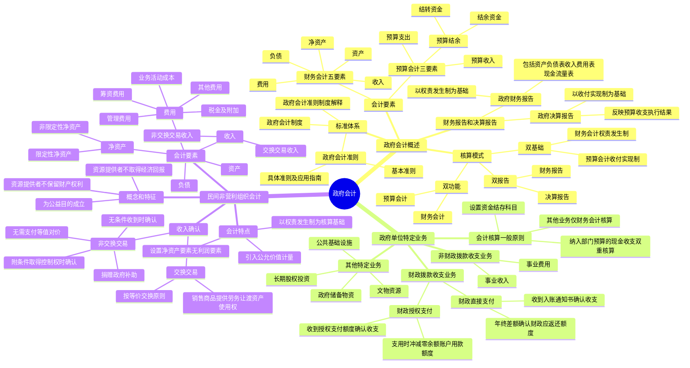

## 📍 章节定位

| 项目 | 信息 |
|------|------|
| **所属科目** | 📒 会计 |
| **难度等级** | ⭐ |
| **历年分值** | 1-2分 |
| **建议学时** | 3-4h |

## 📝 考情分析

本章是会计科目的基础章节，历年分值约 1-2 分，常以客观题形式考查，命题热点集中在：

1. **政府会计标准体系**：由政府会计准则（基本准则、具体准则及应用指南）、政府会计制度和政府会计准则制度解释等组成。
2. **政府会计核算模式**：预算会计和财务会计"适度分离并相互衔接"，体现为"双功能"（预算会计和财务会计双重功能）、"双基础"（预算会计收付实现制、财务会计权责发生制）、"双报告"（决算报告和财务报告）。
3. **政府会计要素**：预算会计要素（预算收入、预算支出、预算结余）和财务会计要素（资产、负债、净资产、收入、费用）。
4. **政府财务报告和决算报告**：财务报告以权责发生制为基础，决算报告以收付实现制为基础。
5. **单位会计核算一般原则**：纳入年度部门预算管理的现金收支业务进行双重核算（财务会计+预算会计），其他业务仅进行财务会计核算。
6. **财政拨款收支业务**：财政直接支付和财政授权支付的会计处理。
7. **民间非营利组织的特征**：为公益目的成立、资源提供者不取得经济回报、不保留财产权利。
8. **民间非营利组织会计要素**：资产、负债、净资产（分为限定性净资产和非限定性净资产）、收入、费用。
9. **民间非营利组织收入的确认**：区分交换交易和非交换交易形成的收入。

考生需重点掌握：政府会计"**双功能、双基础、双报告**"的核算模式；预算会计实行**收付实现制**，财务会计实行**权责发生制**；政府财务报告以**权责发生制**为基础，决算报告以**收付实现制**为基础；纳入年度部门预算管理的现金收支业务进行**双重核算**；民间非营利组织会计以**权责发生制**为核算基础，净资产分为**限定性净资产**和**非限定性净资产**。

## 🧠 知识框架

## 📖 核心精讲

### 一、政府会计概述

#### （一）政府会计标准体系

我国的政府会计标准体系由以下部分组成：

| 组成部分 | 内容 |
|---------|------|
| **政府会计准则** | 包括基本准则（规范目标、主体、信息质量要求、核算基础、要素定义等）、具体准则及应用指南 |
| **政府会计制度** | 规定政府会计科目设置、账务处理、报表体系等，主要由政府财政总会计制度和政府单位会计制度组成 |
| **政府会计准则制度解释** | 财政部适时出台，回应和解决准则制度执行中的问题 |

> **政府会计主体**：主要包括各级政府、各部门、各单位。军队、已纳入企业财务管理体系的单位和执行《民间非营利组织会计制度》的社会团体，不适用政府会计准则制度。

#### （二）政府会计核算模式——"双功能、双基础、双报告"

政府会计由**预算会计**和**财务会计**构成，实现"适度分离并相互衔接"：

| 要点 | 预算会计 | 财务会计 |
|------|---------|---------|
| **功能**（双功能） | 反映预算收入、预算支出、预算结余等预算执行信息 | 反映资产、负债、净资产、收入、费用等财务信息 |
| **基础**（双基础） | **收付实现制**（国务院另有规定的从其规定） | **权责发生制** |
| **报告**（双报告） | 决算报告（以收付实现制为基础） | 财务报告（以权责发生制为基础） |

> "适度分离"不是要求分别建立两套账，而是要求预算会计要素和财务会计要素相互协调，决算报告和财务报告相互补充。

#### （三）政府会计要素

**1. 预算会计要素（3 个）**

| 要素 | 定义 | 确认 |
|------|------|------|
| **预算收入** | 预算年度内依法取得并纳入预算管理的现金流入 | 一般在实际收到时确认，以实际收到金额计量 |
| **预算支出** | 预算年度内依法发生并纳入预算管理的现金流出 | 一般在实际支付时确认，以实际支付金额计量 |
| **预算结余** | 预算年度内预算收入扣除预算支出后的资金余额，及历年滚存余额 | 包括结余资金（年度终了剩余）和结转资金（下年需按原用途继续使用） |

**2. 财务会计要素（5 个）**

| 要素 | 定义 | 计量 |
|------|------|------|
| **资产** | 过去的经济业务或事项形成的、由政府会计主体控制的、预期能够产生服务潜力或带来经济利益流入的经济资源 | 一般采用**历史成本**；无法采用的采用**名义金额**（人民币 1 元） |
| **负债** | 过去的经济业务或事项形成的、预期会导致经济资源流出的现时义务 | 一般采用**历史成本** |
| **净资产** | 资产扣除负债后的净额 | 金额取决于资产和负债的计量 |
| **收入** | 报告期内导致净资产增加的、含有服务潜力或经济利益的经济资源流入 | 同时满足：很可能流入、导致资产增加或负债减少、金额可靠计量 |
| **费用** | 报告期内导致净资产减少的、含有服务潜力或经济利益的经济资源流出 | 同时满足：很可能流出、导致资产减少或负债增加、金额可靠计量 |

> **资产的特殊性**：政府资产强调"**服务潜力**"（利用资产提供公共产品和服务以履行政府职能的潜在能力），这是与企业资产的重要区别。

#### （四）政府财务报告和决算报告

| 报告类型 | 编制基础 | 内容 |
|---------|---------|------|
| **政府财务报告** | 权责发生制 | 反映某一特定日期的财务状况和某一会计期间的运行情况和现金流量；会计报表至少包括资产负债表、收入费用表和现金流量表 |
| **政府决算报告** | 收付实现制 | 综合反映年度预算收支执行结果 |

### 二、政府单位特定业务的会计核算

#### （一）单位会计核算一般原则

单位会计核算具备财务会计与预算会计**双重功能**，实现"适度分离并相互衔接"：

| 业务类型 | 核算方式 |
|---------|---------|
| 纳入年度部门预算管理的**现金收支业务** | 进行财务会计核算的**同时**进行预算会计核算（双重核算） |
| 其他业务 | 仅进行财务会计核算 |

> **"资金结存"科目**：为了保证预算会计要素单独循环，单位应当设置"资金结存"科目，核算纳入年度部门预算管理的资金的流入、流出、调整和滚存等情况，下设"零余额账户用款额度""货币资金""财政应返还额度"三个明细科目。年末预算收支结转后，"资金结存"科目借方余额与预算结转结余科目贷方余额相等。

> **不需进行预算会计处理的情形**：单位受托代理的现金以及不纳入部门预算管理的暂收暂付款项（如应上缴、应转拨或应退回的资金），仅进行财务会计处理。

#### （二）财政拨款收支业务

财政资金的支付方式包括**财政直接支付**和**财政授权支付**。

**1. 财政直接支付**

| 时点 | 财务会计 | 预算会计 |
|------|---------|---------|
| 收到"财政直接支付入账通知书"时 | 借：库存物品/固定资产/应付职工薪酬/业务活动费用等　贷：财政拨款收入 | 借：行政支出/事业支出等　贷：财政拨款预算收入 |
| 年末（预算指标数与实际支出数的差额） | 借：财政应返还额度　贷：财政拨款收入 | 借：资金结存-财政应返还额度　贷：财政拨款预算收入 |
| 下年度恢复额度后实际支出时 | 借：库存物品/固定资产等　贷：财政应返还额度 | 借：行政支出/事业支出等　贷：资金结存-财政应返还额度 |

**2. 财政授权支付**

| 时点 | 财务会计 | 预算会计 |
|------|---------|---------|
| 收到授权支付额度时 | 借：零余额账户用款额度　贷：财政拨款收入 | 借：资金结存-零余额账户用款额度　贷：财政拨款预算收入 |
| 支用额度时 | 借：库存物品/业务活动费用等　贷：零余额账户用款额度 | 借：行政支出/事业支出等　贷：资金结存-零余额账户用款额度 |

#### （三）费用类科目

| 科目 | 适用主体 | 核算内容 |
|------|---------|---------|
| **业务活动费用** | 行政单位、事业单位 | 为实现职能目标、依法履职或开展专业业务活动及其辅助活动发生的各项费用 |
| **单位管理费用** | 仅事业单位 | 本级行政及后勤管理部门开展管理活动发生的各项费用 |

> 行政单位不使用"单位管理费用"科目，其所有费用均记入"业务活动费用"科目。事业单位同时使用两个科目。

### 三、民间非营利组织会计

#### （一）民间非营利组织的概念和特征

**民间非营利组织**是指通过筹集社会民间资金举办的、不以营利为目的，从事教育、科技、文化、卫生、宗教等社会公益事业、提供公共产品的社会服务组织。

适用于《民间非营利组织会计制度》的组织应当**同时具备以下三个特征**：

1. **为公益目的或其他非营利目的成立**（强调非营利性，但不排除获取相应收入）
2. **资源提供者向该组织投入资源不取得经济回报**（出资者不能从组织中获取回报）
3. **资源提供者对该组织的财产不保留或享有任何财产权利**（不再保留或享有相关财产的任何权利）

> 第 3 个特征将民间非营利组织与行政事业单位区分开来，因为国家对行政事业单位及其净资产拥有所有权。

#### （二）民间非营利组织会计的特点

1. **以权责发生制为会计核算基础**
2. 在采用历史成本计价的基础上，引入**公允价值**计量基础（如接受捐赠取得的资产可能无法确定实际成本）
3. 会计要素不包括所有者权益和利润，而是设置了**净资产**这一要素

#### （三）民间非营利组织的会计要素

**1. 反映财务状况的会计要素**

| 要素 | 内容 |
|------|------|
| **资产** | 按流动性分为流动资产、长期投资、固定资产、在建工程、文物资源、无形资产和受托代理资产等 |
| **负债** | 按流动性分为流动负债、长期负债和受托代理负债等 |
| **净资产** | 资产减去负债后的余额，按是否受到限制分为**限定性净资产**和**非限定性净资产** |

**净资产的分类**：

| 类别 | 定义 |
|------|------|
| **限定性净资产** | 资产或资产所产生的经济利益的使用受到资产提供者或国家有关法律、行政法规所设置的**时间限制**或（和）**用途限制** |
| **非限定性净资产** | 除限定性净资产以外的其他净资产 |

> **限制的判断**：限制是由民间非营利组织**之外**的资产提供者或国家法律法规设置的；组织理事会或类似权力机构对净资产使用所作的限定性决策属于内部管理限制，不属于此处所称的"限制"。

**2. 反映业务活动情况的会计要素**

| 要素 | 分类 |
|------|------|
| **收入** | 按来源分为捐赠收入、会费收入、提供服务收入、政府补助收入、投资收益、商品销售收入、总部拨款收入等；按是否存在限定分为限定性收入和非限定性收入 |
| **费用** | 按功能分为业务活动成本、税金及附加、管理费用、筹资费用、资产减值损失、所得税费用和其他费用等 |

#### （四）收入的确认——交换交易与非交换交易

| 类型 | 定义 | 确认条件 |
|------|------|---------|
| **交换交易** | 按照等价交换原则从事的交易（如销售商品、提供劳务） | 商品销售收入：风险报酬转移、不保留控制、经济利益流入、金额可靠计量；提供劳务收入：按完工进度或完成的工作量确认 |
| **非交换交易** | 除交换交易之外的交易（如捐赠、政府补助） | 同时满足：资源能够流入并为其控制或债务解除、引起净资产增加、金额可靠计量 |

> **捐赠收入和政府补助收入的确认**：无条件的捐赠或政府补助，在**收到时**确认收入；附条件的捐赠或政府补助，在**取得资产控制权时**确认收入。

> **政府购买服务**：民间非营利组织承接政府购买服务属于**交换交易**，取得的相关收入应当记入"提供服务收入"科目，不应当记入"政府补助收入"科目。

## 💡 典型例题

**【例题 1】（基础题，单选题）**

下列关于政府会计核算模式的表述中，不正确的是（　　）。
A. 政府会计由预算会计和财务会计构成
B. 预算会计实行收付实现制，财务会计实行权责发生制
C. 政府决算报告以权责发生制为基础编制
D. 政府财务报告以权责发生制为基础编制

**答案**：C

**解析**：A、B、D 均正确。C 错误，政府决算报告以**收付实现制**为基础编制（以预算会计核算生成的数据为准），政府财务报告以权责发生制为基础编制。

**【例题 2】（基础题，单选题）**

下列各项中，属于民间非营利组织特征的是（　　）。
A. 以营利为目的
B. 资源提供者向该组织投入资源可以取得经济回报
C. 资源提供者对该组织的财产不保留或享有任何财产权利
D. 国家对组织及其净资产拥有所有权

**答案**：C

**解析**：民间非营利组织应当同时具备三个特征：为公益目的或其他非营利目的成立；资源提供者向该组织投入资源不取得经济回报；资源提供者对该组织的财产不保留或享有任何财产权利。A 错误（非营利目的）；B 错误（不取得经济回报）；D 错误（这是行政事业单位的特征，不是民间非营利组织的特征）。

**【例题 3】（进阶题，单选题）**

下列关于政府单位会计核算的表述中，正确的是（　　）。
A. 单位对所有业务均应当进行财务会计和预算会计双重核算
B. 单位受托代理的现金也应当进行预算会计核算
C. 纳入年度部门预算管理的现金收支业务，应当进行财务会计和预算会计双重核算
D. "资金结存"科目属于财务会计科目

**答案**：C

**解析**：A 错误，单位对于纳入年度部门预算管理的现金收支业务进行双重核算，其他业务仅进行财务会计核算；B 错误，单位受托代理的现金以及不纳入部门预算管理的暂收暂付款项，仅进行财务会计处理，不需要进行预算会计处理；C 正确；D 错误，"资金结存"属于预算会计科目，核算纳入年度部门预算管理的资金的流入、流出、调整和滚存等情况。

**【例题 4】（基础题，多选题）**

下列各项中，属于政府预算会计要素的有（　　）。
A. 预算收入
B. 预算支出
C. 预算结余
D. 净资产

**答案**：ABC

**解析**：政府预算会计要素包括预算收入、预算支出、预算结余三个。净资产属于政府财务会计要素（资产、负债、净资产、收入、费用五个）。

## 🎯 记忆口诀

**政府会计核算模式口诀**：
> 双功能双基础双报告，预算财务两分离；
> 预算收付实现制，财务权责发生制；
> 决算报告看预算，财务报告看财务。

**政府会计要素口诀**：
> 预算会计三要素：收入支出加结余；
> 财务会计五要素：资产负债净资产，收入费用记心间。

**单位双重核算口诀**：
> 部门预算现金收支，双重核算不能少；
> 其他业务仅财务，受托代理不预算。

**民间非营利组织特征口诀**：
> 公益目的非营利，投入资源无回报；
> 财产权利不保留，三大特征记心头。

**净资产分类口诀**：
> 限定非限看限制，外设限制是限定；
> 内部决策非限制，时间用途两限制。

**收入确认口诀**：
> 交换非交换要分清，等价交换是交换；
> 捐赠补助非交换，无条件收到确认，
> 附条件控制权确认，政府购买属交换。

## ✅ 同步练习

**1. （单选题）下列关于政府会计的表述中，不正确的是（　　）。**

A. 政府会计由预算会计和财务会计构成
B. 政府预算会计实行收付实现制
C. 政府财务会计实行权责发生制
D. 政府会计主体应当分别建立预算会计和财务会计两套账

**2. （单选题）政府财务报告的编制基础是（　　）。**

A. 收付实现制
B. 权责发生制
C. 历史成本
D. 公允价值

**3. （单选题）民间非营利组织接受捐赠取得的资产，难以确定实际成本时，应当采用的计量基础是（　　）。**

A. 历史成本
B. 重置成本
C. 公允价值
D. 名义金额

**4. （多选题）下列各项中，属于民间非营利组织会计特点的有（　　）。**

A. 以权责发生制为会计核算基础
B. 以收付实现制为会计核算基础
C. 引入公允价值计量基础
D. 会计要素中设置净资产，不包括利润

**5. （判断题）民间非营利组织承接政府购买服务取得的相关收入，应当记入"政府补助收入"科目。（　　）**

**6. （判断题）政府单位对于纳入年度部门预算管理的现金收支业务，在采用财务会计核算的同时应当进行预算会计核算；对于其他业务，仅需进行财务会计核算。（　　）**

📋 参考答案

**1. D**。政府预算会计和财务会计"适度分离"，并不是要求政府会计主体分别建立预算会计和财务会计两套账，而是要求预算会计要素和财务会计要素相互协调，决算报告和财务报告相互补充。

**2. B**。政府财务报告的编制主要以权责发生制为基础，以财务会计核算生成的数据为准。政府决算报告的编制主要以收付实现制为基础。

**3. C**。民间非营利组织在采用历史成本计价的基础上，引入公允价值计量基础。公允价值的引入是由民间非营利组织的特殊业务活动所决定的，如通过接受捐赠等业务取得的资产，可能很难或者根本无法确定其实际成本，此时采用公允价值可以解决资产计量问题。

**4. ACD**。民间非营利组织会计的特点包括：以权责发生制为会计核算基础；在采用历史成本计价的基础上，引入公允价值计量基础；会计要素中设置净资产，不包括所有者权益和利润。B 错误，民间非营利组织以权责发生制为核算基础。

**5. ×**。民间非营利组织承接政府购买服务属于**交换交易**（按照等价交换原则提供劳务），取得的相关收入应当记入"**提供服务收入**"等收入类科目，不应当记入"政府补助收入"科目。政府补助收入属于非交换交易形成的收入。

**6. √**。这是政府单位会计核算的一般原则：对于纳入年度部门预算管理的现金收支业务，在采用财务会计核算的同时应当进行预算会计核算（双重核算）；对于其他业务，仅需进行财务会计核算。

