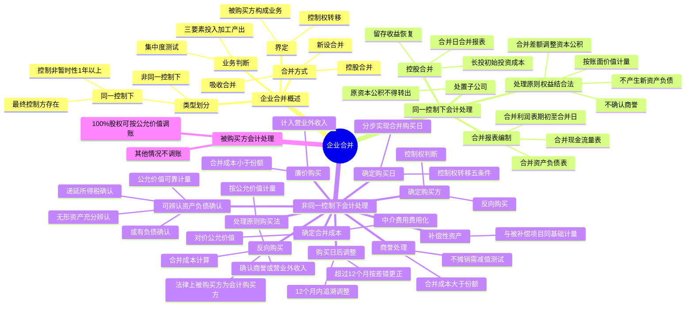

## 1. 章节定位

| 项目 | 信息 |
|------|------|
| 所属科目 | 会计 |
| 难度等级 | 5 |
| 历年分值 | 8-12 分 |
| 建议学时 | 10-12 小时 |
| 知识关联章节 | 第6章 长期股权投资（合并形成的长投初始投资成本）、第19章 所得税（合并中递延所得税）、第24章 会计政策变更与差错更正（购买日后12个月调整）、第27章 合并财务报表（合并日合并报表编制）、第29章 公允价值计量（合并对价与可辨认资产负债公允价值） |

## 2. 考情分析

本章是会计科目的核心重难点章节，历年分值约 8-12 分，几乎每年必考主观题，常以综合题或计算分析题形式出现，并与长期股权投资、合并财务报表、所得税等章节联动考查，是会计科目中难度最高的章节之一。

**命题规律**：本章核心是同一控制下企业合并（权益结合法）与非同一控制下企业合并（购买法）两种会计处理方法的对比与应用。主观题常以企业合并业务情境为载体，要求考生完成合并日/购买日的账务处理、合并财务报表编制、商誉计算等。客观题则集中在合并类型判断、业务判断、购买日确定、商誉计算等概念。

**高频考点分布**：

1. **企业合并的界定与业务判断**：被购买方是否构成业务（投入、加工处理过程、产出三要素）、控制权是否转移、集中度测试的应用。
2. **同一控制下企业合并的会计处理**：权益结合法、按账面价值计量、合并差额调整资本公积、合并日合并财务报表编制（留存收益恢复）。
3. **非同一控制下企业合并的会计处理**：购买法、按公允价值计量、购买方与购买日的确定、合并成本的确定、可辨认资产和负债的确认、商誉的计算、廉价购买的处理。
4. **商誉的确认与计量**：合并成本大于取得的可辨认净资产公允价值份额的差额确认为商誉；合并成本小于份额的差额计入当期损益（营业外收入）。
5. **购买日后12个月内的调整**：对合并成本或可辨认资产负债公允价值的暂时性价值进行追溯调整。
6. **反向购买**：法律上被购买方为会计上购买方的特殊处理。
7. **多次交易分步实现企业合并**：购买日的确定、合并成本的计算。
8. **同一控制与非同一控制的区分**：最终控制方是否存在、控制是否非暂时性（1年以上）。

**联动考查方式**：
- 与长期股权投资结合：合并形成的长期股权投资初始投资成本的确定；
- 与合并财务报表结合：合并日/购买日合并财务报表的编制、商誉在合并报表中的列示；
- 与所得税结合：合并中可辨认资产负债公允价值与计税基础差异形成的递延所得税；
- 与公允价值计量结合：合并对价及可辨认资产负债公允价值的确定。

**备考建议**：
- 牢记两种方法的本质区别：同一控制按账面价值（权益结合法），非同一控制按公允价值（购买法）；
- 同一控制下合并差额调整资本公积（资本溢价或股本溢价），不确认商誉、不计入损益；
- 非同一控制下合并差额：大于部分确认商誉，小于部分计入营业外收入；
- 购买日五条件：合同获批、审批通过、财产交接、支付大部分对价、实际控制；
- 商誉不摊销但需减值测试；
- 同一控制下处置子公司丧失控制权时，原合并日调整的资本公积不得转出。

## 3. 知识框架

## 4. 核心精讲

### 4.1 企业合并的界定

**企业合并**是将两个或两个以上单独的企业（主体）合并形成一个报告主体的交易或事项。从会计角度，交易是否构成企业合并，进而是否能够按照《企业会计准则第 20 号——企业合并》进行会计处理，主要应关注以下两个方面：

**（1）被购买方是否构成业务**

企业合并本质上是一种购买行为，但其不同于单项资产的购买，而是一组有内在联系、为了某一既定的生产经营目的存在的多项资产组合或是多项资产、负债构成的净资产的购买。要形成会计意义上的"企业合并"，前提是被购买的资产或资产负债组合要形成"业务"。如果一个企业取得了对另一个或一个以上企业的控制权，而被购买方并不构成业务，则该交易或事项不形成企业合并。

区分业务的购买与不构成业务的资产购买的意义在于其会计处理存在实质上的差异：
- 企业取得了不形成业务的一组资产或资产、负债组合时，应识别并确认所取得的单独可辨认资产及承担的负债，将购买成本基于购买日所取得各项可辨认资产、负债的相对公允价值进行分配，不按照企业合并准则处理，不产生商誉或购买利得。
- 在被购买资产构成业务时，合并中取得的各项可辨认资产、负债应当按照购买日的公允价值计量，合并成本大于取得的可辨认净资产公允价值份额的差额确认为商誉；合并成本小于份额的差额计入当期损益。
- 交易费用在购买资产交易中通常资本化为所购买资产成本的一部分；而在企业合并中，交易费用应被费用化。
- 业务合并中购买的资产和承担的债务因账面价值与计税基础不同形成的暂时性差异应确认递延所得税影响；非业务合并则不确认。

**（2）交易发生前后是否涉及对标的业务控制权的转移**

在交易事项发生以后，投资方拥有对被投资方的权力，通过参与被投资方的相关活动享有可变回报，且有能力运用对被投资方的权力影响其回报金额的，投资方对被投资方具有控制，形成母子公司关系，则涉及控制权的转移，该交易构成企业合并。

### 4.2 企业合并的方式

企业合并按合并方式划分，包括控股合并、吸收合并和新设合并。

**（1）控股合并**：合并方通过企业合并交易或事项取得对被合并方的控制权，被合并方在企业合并后仍维持其独立法人资格继续经营的，为控股合并。该类企业合并中，被合并方成为合并方的子公司，应当纳入合并方合并财务报表的编制范围。

**（2）吸收合并**：合并方在企业合并中取得被合并方的全部净资产，并将有关资产、负债并入合并方自身生产经营活动中。企业合并完成后，注销被合并方的法人资格，由合并方持有合并中取得的被合并方的资产、负债，在新的基础上继续经营。

**（3）新设合并**：参与合并的各方在企业合并后法人资格均被注销，重新注册成立一家新的企业，由新注册成立的企业持有参与合并各企业的资产、负债在新的基础上经营。

### 4.3 企业合并类型的划分

我国《企业会计准则第 20 号——企业合并》将企业合并划分为两大基本类型：同一控制下的企业合并与非同一控制下的企业合并。

**（1）同一控制下的企业合并**

同一控制下的企业合并，是指参与合并的企业在合并前后均受同一方或相同的多方最终控制且该控制并非暂时性的。同一控制下企业合并的定义蕴含两个核心要素：一是合并方与被合并方在合并前后受同一方或相同的多方最终控制；二是该最终控制并非暂时性的（通常指 1 年以上）。

具体要求：①参与合并各方在合并日之前在最终控制方的控制时间一般在 1 年以上（含 1 年）；②企业合并后所形成的报告主体在最终控制方的控制时间也应达到 1 年以上（含 1 年）。

同受国家控制的企业之间发生的合并，不应仅仅因为参与合并各方在合并前后均受国家控制而将其作为同一控制下的企业合并。

**（2）非同一控制下的企业合并**

非同一控制下的企业合并，是指参与合并各方在合并前后不受同一方或相同的多方最终控制的合并交易，即同一控制下企业合并以外的其他企业合并。

### 4.4 业务的判断

**业务**是指企业内部某些生产经营活动或资产负债的组合，该组合具有投入、加工处理过程和产出能力，能够独立计算其成本费用或所产生的收入。

**（1）构成业务的要素**

业务通常应具有三个要素：
- **投入**：指原材料、人工、必要的生产技术等无形资产以及构成产出能力的机器设备等其他长期资产的投入。
- **加工处理过程**：指具有一定的管理能力、运营过程，能够组织投入形成产出能力的系统、标准、协议、惯例或规则。
- **产出**：包括为客户提供的产品或服务、为投资者或债权人提供的股利或利息等投资收益，以及企业日常活动产生的其他收益。

**（2）构成业务的判断条件**

合并方在合并中取得的组合应当至少同时具有一项投入和一项实质性加工处理过程，且二者相结合对产出能力有显著贡献，该组合才构成业务。合并方在合并中取得的组合是否有实际产出并不是判断其构成业务的必要条件。

**（3）集中度测试**

集中度测试是非同一控制下企业合并的购买方在判断取得的组合是否构成业务时可以选择采用的一种简化判断方式。如果购买方取得的总资产的公允价值几乎相当于其中某一单独可辨认资产或一组类似可辨认资产的公允价值，则该组合通过集中度测试，应判断为不构成业务；如果未通过集中度测试，购买方仍应按照构成业务的判断条件进行判断。

下列情形通常不能作为一组类似资产：①有形资产和无形资产；②不同类别的有形资产（如存货和机器设备）；③不同类别的可辨认无形资产（如商标权和特许权）；④金融资产和非金融资产；⑤不同类别的金融资产（如应收款项和权益工具投资）；⑥同一类别但风险特征存在重大差异的可辨认资产。

### 4.5 同一控制下企业合并的处理原则

对于同一控制下的企业合并，其会计处理方法类似于**权益结合法**。该方法下，将企业合并看作两个或两个以上参与合并企业权益的重新整合，由于最终控制方的存在，从最终控制方的角度，该类企业合并一定程度上并不会造成企业集团整体的经济利益流入和流出，有关交易事项不应视为出售或购买。

**处理原则要点**：

**（1）** 合并方在合并中确认取得的被合并方的资产、负债仅限于被合并方账面上原已确认的资产和负债，合并中不产生新的资产和负债。同一控制下的企业合并中一般不产生新的商誉因素，但被合并方在企业合并前账面上原已确认的商誉应作为合并中取得的资产确认。

**（2）** 合并方在合并中取得的被合并方各项资产、负债应维持其在被合并方的原账面价值不变。被合并方在企业合并前采用的会计政策和会计期间与合并方不一致的，应基于重要性原则，首先统一会计政策和会计期间。在被合并方是最终控制方以前年度从第三方收购来的情况下，应以被合并方的资产、负债（包括最终控制方收购被合并方而形成的商誉）在最终控制方财务报表中的账面价值为基础进行相关会计处理。

**（3）** 合并方在合并中取得的净资产的入账价值与为进行企业合并支付的对价账面价值之间的差额，应当调整所有者权益相关项目，不计入企业合并当期损益。应首先调整资本公积（资本溢价或股本溢价），资本公积余额不足冲减的，依次冲减盈余公积和未分配利润。

**（4）** 企业处置原通过同一控制下企业合并取得的子公司并丧失控制权时，原合并日长期股权投资初始投资成本与合并对价账面价值差额调整的资本公积，在个别财务报表和合并财务报表中不得转出至当期损益或留存收益。

**（5）** 对于同一控制下的控股合并，应视同合并后形成的报告主体自最终控制方开始实施控制时一直是一体化存续下来的。合并利润表、合并现金流量表均反映的是由母子公司构成的报告主体自合并当期期初至合并日实现的损益及现金流量情况。

### 4.6 同一控制下控股合并的会计处理

**（1）长期股权投资的确认和计量**

同一控制下企业合并形成的长期股权投资，合并方应当在合并日按照被合并方所有者权益在最终控制方合并财务报表中的账面价值的份额作为长期股权投资的初始投资成本。初始投资成本与支付对价账面价值的差额调整资本公积（资本溢价或股本溢价），资本公积余额不足冲减的，依次冲减盈余公积和未分配利润。

**（2）合并日合并财务报表的编制**

同一控制下的企业合并形成母子公司关系的，合并方一般应在合并日编制合并财务报表。

**合并资产负债表**：被合并方的有关资产、负债应以其在最终控制方合并财务报表中的账面价值并入合并财务报表。对于被合并方在企业合并前实现的留存收益（盈余公积和未分配利润之和）中归属于合并方的部分，应自合并方的资本公积转入盈余公积和未分配利润。在合并工作底稿中，借记"资本公积"项目，贷记"盈余公积"和"未分配利润"项目。如果合并方资本公积（资本溢价或股本溢价）贷方余额小于被合并方在合并前实现的留存收益中归属于合并方的部分，应以合并方资本公积贷方余额为限进行恢复。

**合并利润表**：应包含合并方及被合并方自合并当期期初至合并日实现的净利润。双方在当期发生的交易应进行抵销。合并方在合并利润表中的"净利润"项下应单列"其中：被合并方在合并前实现的净利润"项目。

**合并现金流量表**：应包含合并方及被合并方自合并当期期初至合并日产生的现金流量。

**典型案例**：A、B 公司分别为 C 公司控制下的两家子公司。A 公司于 2×20 年 3 月 10 日自母公司 C 处取得 B 公司 100% 的股权，A 公司发行了 600 万股本公司普通股（每股面值 1 元）作为对价。合并日 B 公司所有者权益账面价值合计 2000 万元（股本 600 万、资本公积 200 万、盈余公积 400 万、未分配利润 800 万）。

A 公司账务处理：借记"长期股权投资——投资成本——B 公司"2000 万元，贷记"股本"600 万元、"资本公积——股本溢价"1400 万元。

合并工作底稿中留存收益恢复：B 公司合并前留存收益 1200 万元（400+800），归属于 A 公司的部分为 1200 万元（100% 股权），自资本公积转入：借记"资本公积"1200 万元，贷记"盈余公积"400 万元、"未分配利润"800 万元。

### 4.7 非同一控制下企业合并的处理原则

对于非同一控制下的企业合并采用**购买法**进行会计处理。购买法是从购买方的角度出发，购买方取得了被购买方的净资产或是对净资产的控制权，应确认所取得的资产以及应当承担的债务，包括被购买方原来未予确认的资产和负债。

**（1）确定购买方**

购买方是指在企业合并中取得对另一方或多方控制权的一方。应当根据合并财务报表关于控制的定义和所涉及的相关要素等有关规定，在综合考虑所有相关事实和情况的基础上确定购买方。在具体判断时可考虑的因素包括：支付现金、转让非现金资产或承担负债的一方一般为购买方；股东在合并后主体具有相对较高投票比例的一方一般为购买方；公允价值较大的一方很可能为购买方等。

通过权益互换实现的企业合并，发行权益性证券的一方通常为购买方。但如果有证据表明发行权益性证券的一方在合并后被参与合并的另一方控制，则其应为被购买方，参与合并的另一方为购买方，该类合并通常称为**反向购买**。

**（2）确定购买日**

购买日是购买方获得对被购买方控制权的日期。同时满足下列条件时，一般可认为实现了控制权的转移，形成购买日：

1. 企业合并合同或协议已获股东会等内部权力机构通过；
2. 按照规定，合并事项需要经过国家有关主管部门审批的，已获得相关部门的批准；
3. 参与合并各方已办理了必要的财产权交接手续；
4. 购买方已支付了购买价款的大部分（一般应超过 50%），并且有能力、有计划支付剩余款项；
5. 购买方实际上已经控制了被购买方的财务和生产经营政策，享有相应的收益并承担相应的风险。

企业合并涉及一次以上交易的（分步实现企业合并），购买日是指按照有关标准判断购买方最终取得对被购买企业控制权的日期。

**（3）确定企业合并成本**

企业合并成本包括购买方为进行企业合并支付的现金或非现金资产、发生或承担的债务、发行的权益性证券等在购买日的公允价值。购买方为企业合并发生的审计、法律服务、评估咨询等中介费用以及其他相关管理费用，应当于发生时计入当期损益（管理费用）；购买方作为合并对价发行的权益性证券或债务性证券的交易费用，应按照金融工具准则的有关规定进行会计处理。

### 4.8 非同一控制下企业合并可辨认资产和负债的确认

**（1）确认条件**

购买方在企业合并中取得的被购买方各项可辨认资产和负债，要作为本企业的资产、负债进行确认，在购买日应当满足资产、负债的确认条件：
- 各项资产（无形资产除外）所带来的未来经济利益预期能够流入企业且公允价值能够可靠计量的，应单独作为资产确认。
- 各项负债（或有负债除外）履行有关的义务预期会导致经济利益流出企业且公允价值能够可靠计量的，应单独作为负债确认。

**（2）无形资产的确认**

购买方在企业合并中取得的无形资产应符合无形资产的定义且其在购买日的公允价值能够可靠计量。满足下列条件之一的，应确认为无形资产：①源于合同性权利或其他法定权利；②能够从被购买方中分离或者划分出来，并能单独或与相关合同、资产和负债一起用于出售、转移、授予许可、租赁或交换。

公允价值能够可靠计量的情况下，应区别于商誉单独确认的无形资产一般包括：商标、版权及与其相关的许可协议、特许权、分销权等类似权利、专利技术、专有技术等。

**（3）或有负债的确认**

对于购买方在企业合并时可能需要代被购买方承担的或有负债，在购买日，即使相关的或有事项导致经济利益流出企业的可能性还比较小，但其公允价值能够合理确定的情况下，也需要作为合并中取得的负债确认。

**（4）递延所得税的处理**

对于被购买方在企业合并之前已经确认的商誉和递延所得税项目，购买方在对企业合并成本进行分配时不应予以考虑。在按规定确定了合并中应予确认的各项可辨认资产、负债的公允价值后，其计税基础与账面价值不同形成暂时性差异的，应当按照所得税准则的规定确认相应的递延所得税资产或递延所得税负债。

### 4.9 商誉的确认与廉价购买

购买方对于企业合并成本与确认的被购买方可辨认净资产公允价值份额的差额，应视情况分别处理：

**（1）企业合并成本大于合并中取得的被购买方可辨认净资产公允价值份额的差额，应确认为商誉。** 视企业合并方式不同，控股合并情况下，该差额是指合并财务报表中应列示的商誉；吸收合并情况下，该差额是购买方在其账簿及个别财务报表中应确认的商誉。商誉在确认以后，持有期间不要求摊销，企业应当按照资产减值准则的规定对其进行减值测试，对于可收回金额低于账面价值的部分，应计提减值准备。

**（2）企业合并成本小于合并中取得的被购买方可辨认净资产公允价值份额的差额（廉价购买），应计入合并当期损益。** 要对合并中取得的各项可辨认资产、负债的公允价值、作为合并对价的非现金资产或发行的权益性证券等的公允价值进行复核，复核结果表明各项公允价值及企业合并成本是恰当的，应将差额计入合并当期的营业外收入，并在报表附注中予以说明。

### 4.10 购买日后价值量的调整

按照购买法核算的企业合并，如果在购买日或合并当期期末因各种因素影响无法合理确定公允价值，购买方应以暂时确定的价值为基础对企业合并进行核算。

**（1）购买日后 12 个月内对有关价值量的调整**：自购买日算起 12 个月内取得进一步的信息表明需对原暂时确定的价值进行调整的，应视同在购买日发生，进行追溯调整，同时对以暂时性价值为基础提供的比较报表信息也进行相关调整。

例如，A 企业于 2×21 年 11 月 20 日对 B 公司进行吸收合并，合并中取得的一项固定资产暂估 30 万元，确认商誉 120 万元。2×22 年 3 月取得评估报告确认该固定资产价值为 45 万元。则 A 企业应视同在购买日确定的固定资产公允价值为 45 万元，相应调整 2×21 年比较报表中的商誉价值（调减 15 万元）及折旧费用（调增 0.25 万元）。

**（2）超过 12 个月后的价值量调整**：自购买日算起 12 个月以后对企业合并成本或合并中取得可辨认资产负债价值的调整，应当按照会计政策、会计估计变更和差错更正的原则进行处理，即作为前期差错处理。

**（3）递延所得税资产的调整**：购买日取得的被购买方在以前期间发生的未弥补亏损等可抵扣暂时性差异，在购买日不符合递延所得税资产确认条件的不应确认。购买日后 12 个月内，如果取得新的信息表明相关情况在购买日已经存在，预期可抵扣暂时性差异带来的经济利益能够实现的，购买方应当确认相关的递延所得税资产，同时减少商誉，商誉不足冲减的，差额部分确认为当期损益（所得税费用）。

### 4.11 反向购买

反向购买是指通过权益互换实现的企业合并中，发行权益性证券的一方（法律上的购买方）在合并后被参与合并的另一方（法律上的被购买方）控制，则发行权益性证券的一方为会计上的被购买方，参与合并的另一方为会计上的购买方。

在反向购买中，会计上的购买方（法律上的被购买方）的计算原则是：以法律上的被购买方的股权在购买日的公允价值为基础，计算其如果向法律上的购买方原股东发行普通股以获取对法律上的购买方的控制权所需发行的普通股数量，据此计算反向购买中会计上购买方的合并成本。

反向购买中，合并财务报表由法律上的购买方（会计上的被购买方）编制。法律上的被购买方的资产、负债按照其账面价值并入合并财务报表，法律上的购买方的资产、负债按照购买日的公允价值并入合并财务报表。

### 4.12 被购买方的会计处理

非同一控制下的企业合并中，购买方通过企业合并取得被购买方 100% 股权的，被购买方可以按照合并中确定的可辨认资产、负债的公允价值确认其账面价值。除此之外，其他情况下被购买方不应因企业合并改记有关资产、负债的账面价值。

## 5. 典型例题

**例 26-1（合并类型判断）**：A 公司为某省国资委控制的国有企业，2×13 年 10 月，因该省国资系统出于整合同类业务的需要，由 A 公司通过定向发行其普通股的方式给 B 公司部分股东，取得对 B 公司控制权。该项交易前，B 公司的股权由该省国资委下属 C 投资公司持有并控制。A 公司普通股作价 5 元/股，向 C 投资公司发行 3700 万股取得 B 公司 46% 股权。

**要求**：判断 A 公司对 B 公司的合并类型。

**解答**：虽然该项交易是国资委出于整合同类业务的需要安排的，但交易中作价是完全按照市场价格确定的。同时，《企业会计准则第 20 号——企业合并》中明确，同受国家控制的两个企业进行合并，不能仅因为其为国有企业即作为同一控制下企业合并。该项合并应当作为非同一控制下企业合并处理。

**例 26-2（同一控制下控股合并）**：A、B 公司分别为 C 公司控制下的两家子公司。A 公司于 2×20 年 3 月 10 日自母公司 C 处取得 B 公司 100% 的股权，A 公司发行了 600 万股本公司普通股（每股面值 1 元）作为对价。合并日 B 公司所有者权益账面价值合计 2000 万元（股本 600 万、资本公积 200 万、盈余公积 400 万、未分配利润 800 万），A 公司资本公积（股本溢价）余额 1000 万元。

**要求**：编制 A 公司合并日的账务处理和合并报表调整分录。

**解答**：

（1）A 公司个别财务报表：
借：长期股权投资——投资成本——B 公司 20 000 000
　贷：股本 6 000 000
　　　资本公积——股本溢价 14 000 000

（2）合并工作底稿留存收益恢复（B 公司合并前留存收益 1200 万元，100% 归属于 A 公司，A 公司资本公积股本溢价余额 2400 万元，大于 1200 万元，可全额恢复）：
借：资本公积 12 000 000
　贷：盈余公积 4 000 000
　　　未分配利润 8 000 000

**例 26-3（同一控制下合并以非现金资产作为对价）**：A 公司以一项账面价值为 280 万元的固定资产（原价 400 万元，累计折旧 120 万元）和一项账面价值为 320 万元的无形资产（原价 500 万元，累计摊销 180 万元）为对价取得同一集团内另一家全资企业 B 公司 100% 的股权。B 公司所有者权益账面价值合计 1000 万元（股本 200 万、资本公积 200 万、盈余公积 300 万、未分配利润 300 万），A 公司资本公积（股本溢价）余额 100 万元。

**要求**：编制 A 公司合并日的账务处理。

**解答**：

借：固定资产清理 2 800 000
　累计折旧 1 200 000
　贷：固定资产 4 000 000

借：长期股权投资——投资成本——B 公司 10 000 000
　累计摊销 1 800 000
　贷：固定资产清理 2 800 000
　　　无形资产 5 000 000
　　　资本公积——股本溢价 4 000 000

合并工作底稿留存收益恢复：B 公司合并前留存收益 600 万元，100% 归属于 A 公司，A 公司资本公积股本溢价余额 500 万元（100+400），小于 600 万元，以 500 万元为限恢复：
借：资本公积 5 000 000
　贷：盈余公积 2 500 000
　　　未分配利润 2 500 000

**例 26-4（非同一控制下企业合并商誉计算）**：A 公司通过公开发行普通股 1000 万股（每股公允价值 10 元）取得 B 公司 100% 股权，构成非同一控制下企业合并。购买日 B 公司可辨认净资产的公允价值为 8500 万元。

**要求**：计算商誉金额并编制账务处理。

**解答**：

合并成本 = 1000×10 = 10000 万元
商誉 = 合并成本 - 可辨认净资产公允价值份额 = 10000 - 8500 = 1500 万元

A 公司个别财务报表：
借：长期股权投资——投资成本——B 公司 100 000 000
　贷：股本 10 000 000
　　　资本公积——股本溢价 90 000 000

合并财务报表中确认商誉 1500 万元。

**例 26-5（廉价购买）**：A 公司以银行存款 7000 万元取得 B 公司 100% 股权，构成非同一控制下企业合并。购买日 B 公司可辨认净资产的公允价值为 8500 万元。经复核，各项可辨认资产负债的公允价值及合并成本是恰当的。

**要求**：说明差额的处理。

**解答**：合并成本 7000 万元小于可辨认净资产公允价值份额 8500 万元，差额 1500 万元为廉价购买，计入合并当期营业外收入。在控股合并情况下，该差额体现在合并当期的合并利润表中；在吸收合并情况下，该差额计入购买方的个别利润表。

## 6. 记忆口诀

**企业合并两类型**：同一控制权益结合，非同控制购买法；前者按账面价值，后者按公允价值。

**同一控制四原则**：账面价值不入新，合并差额调公积，不确认商誉不损益，一体化存续编报表。

**非同控制购买法**：确定购买方和日，合并成本公允价，可辨认资产负债，公允价值可靠计。

**购买日五条件**：合同获批审批过，财产交接已完成，价款支付超五成，实际控制才算定。

**商誉处理要记牢**：成本大于份额计商誉，不摊销来需减值；成本小于份额廉价购，计入营业外收入。

**业务判断三要素**：投入加工加产出，至少一投一加工，二者结合显贡献，才算构成一业务。

**集中度测试简化判**：总资产公允价，几乎相当单一资产，通过测试非业务，未通过再按条件判。

**反向购买要分清**：法律购买方会计被购，法律被购方会计购买，报表由法律购买方编，账面公允分别用。

**同一控制处置子**：原调资本公积不转出，无论交易对手是谁，个别合并都不转。

**购买日后调价值**：十二个月内追溯调，视同购买日发生；超过十二个月差错更正，前期差错来处理。

## 7. 同步练习

**1.（单选题）** A上市公司（以下简称A公司）2×23年1月2日以银行存款3亿元自B公司购买其持有的C公司100%股权，并于当日向C公司董事会派出成员，主导其财务和生产经营决策。股权转让协议约定，B公司就C公司在收购完成后的经营业绩向A公司作出承诺：C公司2×23年、2×24年、2×25年度经审计归属于母公司股东的净利润分别不低于2000万元、3000万元和4000万元。如果C公司未达到承诺业绩，B公司将在C公司每一相应年度的审计报告出具后30日内，按C公司实际实现的净利润与承诺利润的差额，以现金方式对A公司进行补偿。购买日，A公司根据C公司所处市场状况及行业竞争力等情况判断，预计C公司能够完成承诺期利润。2×23年，C公司实现净利润2200万元。2×24年，由于整体宏观经济形势变化，C公司实现净利润2400万元，且预期2×25年该趋势将持续，预计能够实现净利润约2600万元，A公司预计将来获得补偿金额的公允价值为2000万元。A公司与B公司、C公司在交易前不存在关联方关系。不考虑其他因素，A公司进行的下列会计处理中，正确的是（　）。

A. 购买日，A公司应当确认对C公司的长期股权投资成本为32000万元
B. 2×23年，A公司应确认其他应收款2000万元
C. 2×24年，A公司应确认其他应收款2000万元
D. 2×24年，A公司应确认以公允价值计量且其变动计入当期损益的金融资产2000万元

---

**2.（单选题）** 2×24年甲公司和其控股股东P公司以及无关联第三方丙公司签订协议，分别从P公司处购买其持有乙公司60%股权，以发行1800万股股票作为对价，发行价为每股4元；从丙公司处购买乙公司少数股权40%，以银行存款支付5000万元。7月1日办理完毕交接手续，改选董事会成员。当日乙公司所有者权益在最终控制方P公司合并财务报表中的账面价值8000万元（其中股本2000万元，资本公积3200万元，盈余公积1600万元，未分配利润1200万元）。不考虑其他因素，甲公司下列会计处理表述不正确的是（　）。

A. 甲公司从P公司处购买其持有乙公司60%股权属于同一控制下企业合并
B. 甲公司从丙公司处购买乙公司少数股权40%有关股权投资成本应按照实际支付的购买价款确定
C. 甲公司对乙公司长期股权投资的初始投资成本为9800万元
D. 甲公司合并财务报表确认的商誉为1800万元

---

**3.（单选题）** 下列关于同一控制下吸收合并的会计处理方法的表述中，不正确的是（　）。

A. 合并方对同一控制下吸收合并中取得的资产、负债应当按照相关资产、负债在最终控制方合并财务报表中的账面价值入账
B. 以发行权益性证券方式进行的该类合并，所确认的净资产入账价值与发行股份面值总额的差额，应计入资本公积——股本溢价（或资本溢价），资本公积——股本溢价（或资本溢价）的余额不足冲减的，依次冲减盈余公积和未分配利润
C. 如果合并方在合并当期期末仅需要编制个别财务报表，不需要编制合并财务报表，则合并方在编制前期比较报表时，不需要对以前期间已经编制的比较报表进行调整
D. 合并方为进行企业合并发生的审计费用、评估费用、法律服务费用等，应当于发生时计入合并成本

---

**4.（单选题）** A公司2×19年1月1日购买了其母公司甲公司控制的另一子公司B公司100%股权投资，形成同一控制下企业合并。由于B公司以自行研发新技术为主，其盈利具有不确定性，A公司与其母公司甲公司协商决定，交易价格为5000万元，其中4000万元于2×19年1月1日支付，剩余1000万元待未来事项进一步证实B公司的研发能力时支付。B公司正在进行一项新技术的研发，相较于其他项目，该项目已进入最终研究阶段。鉴于此，如果该技术可以按照预期达到相应的效果，则A公司支付剩余的价款，否则，剩余1000万元不再支付。经评估，该研发项目的公允价值为2000万元，而类似研发成功的项目的公允价值为2500万元。A公司预计该项目很可能研发成功，并达到预期效果。B公司的可辨认净资产公允价值为6000万元，相对于最终控制方而言的所有者权益的账面价值为3500万元。假定A公司有足够的资本公积。不考虑其他因素，A公司因取得B公司股权投资进行的下列会计处理，正确的是（　）。

A. 将对B公司的投资确认为长期股权投资，并按照5000万元进行初始计量
B. 在合并日，对于尚未支付的1000万元应作为购买无形资产的对价进行确认
C. 若该研发项目研发成功，并达到预期效果，A公司支付的1000万元应冲减资本公积
D. 若该研发项目未达到预期，A公司应冲销预计负债，并将该或有对价调整至资本公积

---

**5.（单选题）** 甲公司和乙公司为同一集团内的两个全资子公司，2×24年6月30日，甲公司向乙公司的股东定向增发2000万股普通股（每股面值为1元，市价为3元），对乙公司进行吸收合并。乙公司资产、负债和所有者权益的账面价值与其在最终控制方合并财务报表中的账面价值一致，"货币资金""存货""固定资产""应付账款"项目的账面价值分别为180万元、220万元、3100万元、1000万元，除此之外，乙公司无其他资产或负债。不考虑其他因素，则下列表述中不正确的是（　）。

A. 针对该项企业合并，甲公司所取得的存货的入账价值为220万元
B. 针对该项企业合并，甲公司应确认商誉3500万元
C. 针对该项企业合并，甲公司应确认资本公积（股本溢价）500万元
D. 针对该项企业合并，甲公司所取得的应付账款的入账价值为1000万元

---

**6.（单选题）** （2020年）2×16年12月30日，甲公司以发行新股作为对价，购买乙公司所持丙公司60%股份。乙公司在股权转让协议中承诺，在本次交易完成后的3年内（2×17年至2×19年）丙公司每年净利润不低于5000万元，若丙公司实际利润低于承诺利润，乙公司将按照两者之间的差额及甲公司作为对价发行时的股票价格计算应返还给甲公司的股份数量，并在承诺期满后一次性予以返还。2×17年，丙公司实际利润低于承诺利润，经双方确认，乙公司应返还甲公司相应的股份数量。已知在交易前甲公司和乙公司之间没有关联方关系。不考虑其他因素，下列各项关于甲公司应收取乙公司返还的股份在2×17年12月31日计入的会计科目是（　）。

A. 债权投资
B. 其他债权投资
C. 交易性金融资产
D. 其他权益工具投资

---

**7.（单选题）** 2×22年1月1日，甲公司通过向乙公司股东定向增发1500万股普通股（每股面值为1元，市价为6元），取得乙公司80%股权，并控制乙公司，另以银行存款支付财务顾问费300万元。双方约定，如果乙公司未来3年平均净利润增长率超过8%，甲公司需要另外向乙公司股东支付100万元的合并对价；当日，甲公司预计乙公司未来3年平均净利润增长率很可能达到10%。该项交易前，甲公司与乙公司及其控股股东不存在关联关系。不考虑其他因素，甲公司该项企业合并的合并成本为（　）。

A. 9000万元
B. 9100万元
C. 9300万元
D. 9400万元

---

**8.（单选题）** 甲、乙公司系同属于A集团公司下的两家子公司，甲公司于2×21年12月29日以银行存款1000万元取得对乙公司30%股权，能够对乙公司施加重大影响，投资当日乙公司可辨认净资产公允价值总额为2500万元，与账面价值相等。2×22年12月25日甲公司又以一项账面价值为1400万元、公允价值为1600万元的固定资产自乙公司的其他股东处取得乙公司40%股权。乙公司自甲公司第一次投资日开始实现净利润1500万元，无其他所有者权益变动。追加投资当日乙公司可辨认净资产公允价值为5000万元。假定A集团合并报表中不存在与乙公司相关的商誉，且该交易不属于一揽子交易，不考虑其他因素，甲公司合并财务报表中应确认的合并成本为（　）。

A. 2400万元
B. 3500万元
C. 2600万元
D. 2800万元

---

**9.（多选题）** 甲公司与乙公司均为丙公司的子公司。2×22年6月1日，甲公司以银行存款1000万元和一项无形资产（专利权）作为对价，取得丙公司持有的乙公司60%股权，能够对乙公司实施控制。当日，该项无形资产的账面价值为700万元，公允价值为800万元；乙公司相对于丙公司而言的所有者权益账面价值总额为2400万元，可辨认净资产公允价值为2500万元。假定丙公司合并报表中不存在与乙公司相关的商誉。不考虑其他因素，下列关于甲公司对上述事项的处理的表述中，正确的有（　）。

A. 甲公司在合并财务报表中应确认商誉300万元
B. 编制合并财务报表时，甲公司应以其资本公积余额为限，将乙公司合并前实现的留存收益、其他综合收益中归属于甲公司的部分予以恢复
C. 甲公司在合并日编制合并财务报表时，不需要编制合并利润表
D. 甲公司与乙公司在2×22年6月份以前发生的交易，应当按照合并财务报表的有关原则予以抵销

---

**10.（多选题）** 下列关于反向购买的表述中，不正确的有（　）。

A. 反向购买是同一控制下企业合并
B. 企业实现反向购买后，应该将法律上子公司的资产、负债按照公允价值纳入合并报表
C. 企业实现反向购买后对外提供比较合并财务报表的，其比较前期合并财务报表中的基本每股收益与法律上母公司个别报表的基本每股收益相同
D. 企业实现反向购买后，不会产生新的资产或负债

---

**11.（多选题）** 甲公司2×22年1月1日对同一集团内乙公司进行吸收合并，支付合并对价为银行存款80万元以及账面价值200万元、公允价值250万元的无形资产。合并日，乙公司资产的账面价值为2100万元，公允价值为2200万元，其差额是由乙公司一项固定资产公允价值与账面价值不一致所致；负债的账面价值为1800万元，等于其公允价值。不考虑其他因素，下列关于甲公司对上述事项的处理的表述中，不正确的有（　）。

A. 甲公司应确认无形资产处置损益50万元
B. 甲公司吸收合并业务取得净资产的入账价值为400万元
C. 甲公司吸收合并业务影响所有者权益的金额为20万元
D. 甲公司吸收合并业务影响当期损益的金额为70万元

---

**12.（多选题）** 甲公司为上市公司，2×19年1月1日以银行存款1320万元为对价自A公司处取得乙公司80%股权投资，对其形成控制。甲公司、A公司交易之前不存在关联方关系。当日，乙公司可辨认净资产公允价值为1500万元。同时，双方合同约定，如果乙公司自购买日起未来三年累计营业收入达到8000万元，甲公司将于2×21年末再向A公司支付对价200万元。购买日，甲公司预计乙公司很可能不能达到预期目标。2×19年12月31日，乙公司实现营业收入1000万元，预计很可能不能达到预期目标。2×20年12月31日，乙公司两年累计实现营业收入8500万元。假定不考虑其他因素，甲公司会计处理正确的有（　）。

A. 2×19年1月1日应确认合并成本1320万元
B. 2×19年12月31日合并财务报表中合并商誉列报金额为120万元
C. 2×20年12月31日应确认交易性金融负债200万元
D. 2×20年12月31日应调整长期股权投资和合并商誉

---

**13.（多选题）** 下列有关非同一控制下企业合并购买日会计处理的表述中，正确的有（　）。

A. 购买方在购买日取得被购买方的金融资产和金融负债、衍生工具、嵌入衍生工具等，可能需要对其恰当地进行重新分类或指定
B. 当企业合并合同或协议中表明了可以视未来或有事项的发生而对合并成本进行调整时，符合《企业会计准则第13号——或有事项》准则规定的确认条件的，应确认的支出也应作为企业合并成本的一部分
C. 非同一控制下企业合并中为进行合并而发生的审计费用、法律服务费用、咨询费用等应当计入企业合并成本
D. 对于购买方在企业合并时需要代被购买方承担的或有负债，在购买日，相关的或有事项导致经济利益流出企业的可能性较小，但其公允价值能够合理确定的情况下，需要作为合并中取得的负债确认

---

**14.（多选题）** 下列关于非同一控制下企业合并中购买方与被购买方的处理，表述正确的有（　）。

A. 被购买方在企业合并后仍持续经营的，如购买方取得被购买方100%股权，被购买方可以按合并中确定的有关资产、负债的公允价值调账
B. 对于控股合并来说，购买方长期股权投资的成本小于合并中取得的被购买方可辨认净资产公允价值份额的差额体现在合并资产负债表上，应调整合并资产负债表的留存收益
C. 对于吸收合并来说，购买方应当在购买日将合并中取得的符合确认条件的各项可辨认资产、负债，按其账面价值确认为本企业的资产和负债
D. 作为合并对价付出的各项资产的公允价值或被购买方各项可辨认资产、负债的公允价值无法合理确定的，购买方应在合并当期期末以暂时确定的价值为基础对企业合并进行核算

---

**15.（多选题）** 下列关于非同一控制下的企业合并中企业合并成本大于合并中取得的被购买方可辨认净资产公允价值份额的差额的处理，表述正确的有（　）。

A. 控股合并的情况下，购买方在其账簿及个别财务报表中应确认商誉
B. 吸收合并的情况下，购买方在合并财务报表中列示商誉
C. 控股合并的情况下，购买方在合并财务报表中应列示商誉
D. 吸收合并的情况下，购买方在其账簿及个别财务报表中应确认商誉

---

**16.（综合题）** 甲公司为境内上市公司，专门从事能源生产业务。2×22年，甲公司发生的企业合并及相关交易或事项如下：

（1）2×22年2月20日，甲公司召开董事会，审议通过了以换股方式购买专门从事新能源开发业务的乙公司80%股权的议案。2×22年3月10日，甲公司、乙公司及其控股股东丙公司各自内部决策机构批准了该项交易方案。2×22年6月18日，证券监管机构核准了甲公司以换股方式购买乙公司80%股权的方案。

2×22年6月30日，甲公司以3:1的比例向丙公司发行6000万股普通股，取得乙公司80%股权，有关股份登记和股东变更手续当日完成；同日，甲公司、乙公司的董事会进行了改选，丙公司开始控制甲公司，甲公司开始控制乙公司。甲公司、乙公司普通股每股面值均为1元，2×22年6月30日，甲公司普通股的公允价值为每股3元，乙公司普通股的公允价值为每股9元。

2×22年7月16日，甲公司支付为实施上述换股合并而发生的会计师、律师、评估师等费用350万元，支付财务顾问费1200万元。

（2）甲公司、乙公司资产、负债等情况如下：

2×22年6月30日，甲公司账面资产总额17200万元，其中固定资产账面价值4500万元，无形资产账面价值1500万元；账面负债总额9000万元；账面所有者权益（股东权益）合计8200万元，其中：股本5000万元（每股面值1元），资本公积1200万元，盈余公积600万元，未分配利润1400万元。2×22年6月30日，甲公司除一项无形资产外，其他资产、负债的公允价值与其账面价值相同，该无形资产为一项商标权，账面价值1000万元，公允价值3000万元，按直线法摊销，预计尚可使用5年，预计净残值为零。

2×22年6月30日，乙公司账面资产总额34400万元，其中固定资产账面价值8000万元，无形资产账面价值3500万元；账面负债总额13400万元；账面所有者权益（股东权益）合计21000万元，其中，股本2500万元（每股面值1元），资本公积500万元，盈余公积1800万元，未分配利润16200万元。2×22年6月30日，乙公司除一项固定资产外，其他资产、负债的公允价值与其账面价值相同，该固定资产为一栋办公楼，账面价值3500万元，公允价值6000万元，按年限平均法计提折旧，预计尚可使用20年，预计净残值为零。

（3）2×22年12月20日，甲公司向乙公司销售一批产品，销售价格（不含增值税）为100万元，成本为80万元，款项已收取。截至2×22年12月31日，乙公司从甲公司购入的产品已对外出售50%，其余50%形成存货。

其他资料：

（1）合并前，丙公司、丁公司分别持有乙公司80%、20%股权，甲公司与乙公司、丙公司、丁公司不存在任何关联方联系；合并后，甲公司与乙公司除资料（3）所述内部交易外，不存在其他任何内部交易。

（2）甲公司和乙公司均按照年度净利润的10%计提法定盈余公积，不计提任意盈余公积。企业合并后，甲公司和乙公司没有向股东分配利润。

（3）甲公司和乙公司适用的企业所得税税率均为25%。甲公司以换股方式购买乙公司80%股权的交易适用特殊税务处理规定，即收购企业、被收购企业的原有各项资产和负债的计税基础保持不变，甲公司和乙公司合并前的各项资产、负债的账面价值与其计税基础相同，不存在其他未确认暂时性差异所得税影响的事项。甲公司和乙公司预计未来年度均有足够的应纳税所得额用以抵扣暂时性差异。

（4）除所得税外，不考虑增值税及其他相关税费，不考虑其他因素。

要求：

（1）根据资料（1）~（2）及其他有关资料，判断该项企业合并的类型及会计上的购买方和被购买方，并说明理由。

（2）根据资料（1）~（2）及其他有关资料，确定该项企业合并的购买日（或合并日），并说明理由。

（3）根据资料（1）~（2）及其他有关资料，计算甲公司取得乙公司80%股权投资的成本，并编制相关会计分录。

（4）根据资料（1）~（2）及其他有关资料，假设不考虑少数股权的因素，计算该项企业合并的合并成本和商誉（如有）。

（5）根据资料（1）~（2）及其他有关资料，计算甲公司购买日（或合并日）合并资产负债表中固定资产、无形资产、递延所得税资产、递延所得税负债、盈余公积和未分配利润的列报金额。

（6）根据资料（3），编制甲公司2×22年度合并财务报表相关的抵销分录。

---

**练习答案**：1.答案缺失　2.答案缺失　3.答案缺失　4.答案缺失　5.答案缺失　6.答案缺失　7.答案缺失　8.答案缺失　9.答案缺失　10.答案缺失　11.答案缺失　12.答案缺失　13.答案缺失　14.答案缺失　15.答案缺失　16.答案缺失（本章答案缺失，可参考09历年真题板块）
