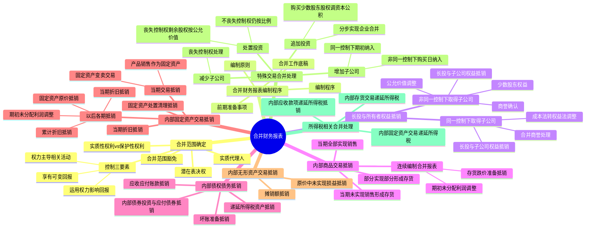

## 1. 章节定位

| 项目 | 信息 |
|------|------|
| 所属科目 | 会计 |
| 难度等级 | 5 |
| 历年分值 | 10-15 分 |
| 建议学时 | 12-15 小时 |
| 知识关联章节 | 第6章 长期股权投资（长投与权益抵销）、第19章 所得税（合并中递延所得税）、第26章 企业合并（合并日/购买日合并报表）、第7章 资产减值（商誉减值） |

## 2. 考情分析

本章是会计科目的核心重难点章节，也是分值最高的章节之一，历年分值约 10-15 分，几乎每年必考综合题，常与长期股权投资、企业合并、所得税等章节联动考查，是会计科目中难度最高、综合性最强的章节。

**命题规律**：本章核心是合并财务报表的编制，包括合并范围的确定、长期股权投资与所有者权益的抵销、内部交易的抵销处理、特殊交易的会计处理等。主观题常以企业集团业务情境为载体，要求考生编制合并工作底稿中的调整分录和抵销分录。客观题则集中在控制三要素的判断、合并范围的确定、内部交易抵销处理。

**高频考点分布**：

1. **合并范围的确定**：控制三要素（权力、可变回报、运用权力影响回报金额的能力）、实质性权利与保护性权利的区分、潜在表决权、实质代理人。
2. **长期股权投资与所有者权益的抵销**：同一控制下和非同一控制下取得子公司后合并报表的编制、长期股权投资由成本法调整为权益法、母公司对子公司长期股权投资与子公司所有者权益的抵销。
3. **内部商品交易的抵销**：当期内部销售收入的抵销、期末存货中未实现内部销售损益的抵销、连续编制合并报表时期初未分配利润的调整。
4. **内部债权债务的抵销**：内部应收应付账款的抵销、内部应收账款计提坏账准备的抵销、相应递延所得税资产的抵销。
5. **内部固定资产交易的抵销**：内部固定资产交易当期及以后各期的抵销、固定资产原价中未实现内部销售损益的抵销、折旧中未实现内部销售损益的抵销。
6. **内部无形资产交易的抵销**：与固定资产类似的无形资产摊销的抵销。
7. **特殊交易**：母公司购买子公司少数股东股权、分步实现企业合并、处置子公司丧失控制权、因子公司少数股东增资导致母公司股权稀释等。
8. **所得税会计相关的合并处理**：内部交易抵销导致的暂时性差异及递延所得税的确认。

**备考建议**：
- 牢记控制三要素：权力、可变回报、运用权力影响回报的能力，三者缺一不可；
- 长投与所有者权益抵销是核心，掌握成本法转权益法的调整；
- 内部交易抵销三步走：抵销当期销售收入和成本、抵销期末存货/固定资产中未实现内部销售损益、连续编制时调整期初未分配利润；
- 内部固定资产交易涉及多期抵销，要理清固定资产原价、折旧、累计折旧中未实现损益的抵销；
- 少数股东权益和少数股东损益的计算要准确；
- 特殊交易中处置子公司丧失控制权的处理是高频考点。

## 3. 知识框架

## 4. 核心精讲

### 4.1 合并范围的确定

合并财务报表的合并范围应当以**控制**为基础予以确定。控制，是指投资方拥有对被投资方的权力，通过参与被投资方的相关活动享有可变回报，并且有能力运用对被投资方的权力影响其回报金额。

投资方要实现控制，必须同时具备以下**三个要素**：

**（1）投资方拥有对被投资方的权力**

权力是指投资方主导被投资方相关活动的现时能力。相关活动是指对被投资方的回报产生重大影响的活动，通常包括商品或劳务的销售和购买、金融资产的管理、资产的购买和处置、研究与开发活动、确定资本结构和获取融资等。

权力具有以下特征：①权力只表明投资方主导被投资方相关活动的现时能力，并不要求投资方实际行使其权力；②权力是一种实质性权利，而不是保护性权利；③权力是为自己行使的，而不是代其他方行使；④权力通常表现为表决权，但有时也可能表现为其他合同安排。

通常情况下，持有半数以上表决权的投资方控制被投资方。但如果章程或其他协议有特殊约定（如需 2/3 以上表决权通过），拥有半数以上表决权并不意味着必然能够控制。

**实质性权利**是指持有人在对相关活动进行决策时，有实际能力行使的可执行权利。判断一项权利是否为实质性权利，应当综合考虑所有相关因素，包括但不限于：①权利持有人行使权利是否存在经济或其他方面的障碍（如财务处罚、行权价产生财务障碍、行权时间严格限制、缺乏行权机制等）；②当权利由多方持有或行权需要多方同意时，是否存在实际可行的一致行动机制；③权利持有人能否从行使权利中获利（如实现协同效应）。

**保护性权利**是指仅为了保护持有人的利益而没有赋予持有人对被投资方相关活动的决策权的权利。仅持有保护性权利的投资方不拥有对被投资方的权力，也不能阻止其他方对被投资方实施控制。典型的保护性权利包括：贷款方限制借款方从事损害贷款方利益活动的权利、少数股东批准超过正常经营范围的资本性支出的权利、贷款方在借款方违约时扣押资产的权利等。

**潜在表决权**是获得被投资方表决权的权利，如可转换工具、认股权证、远期股权购买合同或期权所产生的权利。在分析控制时，仅考虑满足实质性权利要求的潜在表决权。例如，深度价外期权使得买方行权获利的可能性极小，不构成实质性权利；而价外但非深度价外、且持有人能通过行权实现协同效应的可转换债券，则构成实质性权利。

**（2）投资方通过参与被投资方的相关活动而享有可变回报**

可变回报是指不固定的、可能随被投资方业绩而变动的回报，可以是正面的（如股利、利息、资本增值等），也可以是负面的（如损失）。投资方需判断其回报是否随被投资方的业绩而变动。

**（3）投资方有能力运用对被投资方的权力影响其回报金额**

投资方不仅要有权力和可变回报，还要有能力运用其权力来影响回报的金额。当投资方拥有权力、享有可变回报，且有能力运用权力影响其回报金额时，才控制被投资方。

#### 4.1.1 权力的一般来源——表决权

通常情况下，当被投资方具有一系列对回报产生重要影响的经营及财务活动，且需要就这些活动连续地进行实质性决策时，表决权或类似权利本身或结合其他安排，将赋予投资者权力。

**（1）通过直接或间接拥有半数以上表决权而拥有权力**：当被投资方的相关活动由持有半数以上表决权的投资方表决决定，或者主导相关活动的权力机构的多数成员由持有半数以上表决权的投资方指派时，持有半数以上表决权的投资方拥有对被投资方的权力。

**（2）持有半数以上表决权但并无权力**：在被投资方相关活动被政府、法院、管理人、接管人、清算人或监管人等其他方主导时，投资方无法凭借其拥有的表决权主导被投资方的相关活动。此外，如果章程规定相关活动决策需 2/3 以上表决权通过，则持有半数以上但不足 2/3 表决权的投资方不一定拥有权力。

**（3）持有半数或半数以下表决权但仍然拥有权力**：应综合考虑下列因素：①投资方持有的表决权相对于其他投资方持有表决权份额的大小及分散程度；②与其他表决权持有人的协议（需确保投资方能够主导其他表决权持有人的表决）；③其他合同安排产生的权利；④其他事实或情况（如任命关键管理人员、决定重大交易、控制董事会任命程序等）。

#### 4.1.2 权力来自表决权以外的其他权利——结构化主体

**结构化主体**是指在确定其控制方时没有将表决权或类似权利作为决定因素而设计的主体，如合伙企业、资产管理计划、资产支持证券、基金、理财产品等。结构化主体通常具有下列特征：①业务活动范围受限；②有具体明确的目的，且目的比较单一；③股本（如有）不足以支撑其业务活动，必须依靠其他次级财务支持；④通过向投资者发行不同等级的证券（如分级产品）等金融工具进行融资。

投资方在判断能否控制结构化主体时，需要结合下列四项因素进行分析：①在设立被投资方时所作出的决策及投资方对其设立活动的参与度；②考虑其他相关合同安排（如看涨期权、看跌期权、清算权等）；③考虑仅在特定情况或事项发生时开展的活动；④投资方对被投资方作出的承诺。

**商业银行理财产品的合并**：商业银行应当判断是否控制其发行的理财产品。在分析可变回报时，至少应当关注管理费、直接投资收益、信用增级或支持而获得的补偿或承担的损失等。如果商业银行在没有合同义务的情况下对过去发行的具有类似特征的理财产品提供过信用增级或支持，应当重新评估是否对该理财产品形成控制。

**合并范围的豁免**：投资性主体（如基金）通常不需要将其子公司纳入合并范围，但应将子公司中属于投资性主体的部分排除在合并范围之外。

**纳入合并范围的特殊情况——对被投资方可分割部分的控制**：投资方在判断是否控制被投资方时，应当考虑被投资方设立的目的和设计，以及可能导致投资方主导被投资方相关活动的情形。如果被投资方的一部分资产和负债（即可分割部分）单独满足控制三要素，投资方应当将该部分视为单独的可分割主体进行会计处理。

### 4.2 合并财务报表的编制程序

#### 4.2.1 合并财务报表的编制原则

合并财务报表作为财务报表，必须符合财务报表编制的一般原则和基本要求（真实可靠、内容完整）。与个别财务报表相比，合并财务报表还应当遵循以下原则：

1. **以个别财务报表为基础编制**：合并财务报表并不是直接根据母公司和子公司的账簿编制，而是利用母公司和子公司编制的反映各自财务状况和经营成果的财务报表提供的数据，通过合并财务报表的特有方法进行编制，这是客观性原则在合并财务报表编制时的具体体现。
2. **一体性原则**：合并财务报表反映的是企业集团的财务状况和经营成果，在编制时应当将母公司和所有子公司作为整体来看待，视为一个会计主体。母公司和子公司发生的经营活动都应当从企业集团这一整体的角度进行考虑，视同同一会计主体内部业务处理。
3. **重要性原则**：合并财务报表涉及多个法人主体，经营范围往往跨越不同行业。在编制时特别强调重要性原则的运用，对一些项目在企业集团中某一企业具有重要性、但对整个企业集团不一定具有重要性的，应根据重要性要求进行取舍；对整个企业集团财务状况和经营成果影响不大的内部经济业务，为简化合并手续也可不编制抵销分录。

#### 4.2.2 合并财务报表的构成

合并财务报表至少包括：①合并资产负债表（反映企业集团某一特定日期财务状况）；②合并利润表（反映企业集团整体在一定期间内经营成果）；③合并现金流量表（反映企业集团在一定期间现金流入、流出量及现金净增减变动情况）；④合并所有者权益变动表（反映企业集团在一定期间内所有者权益增减变动情况）；⑤附注。

合并资产负债表在所有者权益项目下增加"归属于母公司所有者权益合计"和"少数股东权益"项目；合并利润表在"净利润"项目下增加"归属于母公司所有者的净利润"和"少数股东损益"项目。

#### 4.2.3 合并财务报表编制的前期准备事项

1. **统一母子公司的会计政策**：统一要求子公司所采用的会计政策与母公司保持一致。对境外子公司确实无法使其会计政策与母公司保持一致的，应当要求其按照母公司所采用的会计政策重新编报财务报表，或由母公司对子公司报送的财务报表进行调整。
2. **统一母子公司的资产负债表日及会计期间**：使子公司的资产负债表日和会计期间与母公司保持一致。境外子公司因当地法律限制不能一致的，母公司应当按照自身的资产负债表日和会计期间对子公司财务报表进行调整。
3. **对子公司以外币表示的财务报表进行折算**：将以外币作为记账本位币的境外子公司的财务报表折算为母公司所采用的记账本位币表示的财务报表。
4. **收集编制合并财务报表的相关资料**：包括子公司相应期间的财务报表、与母公司及与其他子公司之间发生的内部购销交易及债权债务等资料、子公司所有者权益变动和利润分配的有关资料、非同一控制下企业合并购买日的公允价值资料等。

#### 4.2.4 合并财务报表的编制程序

合并财务报表的编制程序一般包括：

1. **设置合并工作底稿**：将母公司和纳入合并范围的子公司个别财务报表各项目的数据过入合并工作底稿，并加总计算得出合计数额。
2. **编制调整分录**：将母公司对子公司的长期股权投资由成本法调整为权益法（同一控制下也需统一会计政策和会计期间）；非同一控制下还需将子公司可辨认资产负债由账面价值调整为公允价值。
3. **编制抵销分录**：抵销母公司对子公司长期股权投资与子公司所有者权益、内部交易等。编制调整分录与抵销分录是合并财务报表编制的关键和主要内容。
4. **计算合并财务报表各项目的合并金额**：
   - 资产类项目合并数 = 加总数额 + 借方发生额 − 贷方发生额
   - 负债类和所有者权益类项目合并数 = 加总数额 − 借方发生额 + 贷方发生额
   - 收益类项目合并数 = 加总数额 − 借方发生额 + 贷方发生额
   - 成本费用类和利润分配项目合并数 = 加总数额 + 借方发生额 − 贷方发生额
5. **填列合并财务报表**：根据合并工作底稿中计算得出的合并金额填列合并财务报表。

### 4.3 长期股权投资与所有者权益的合并处理

#### 4.3.1 同一控制下取得子公司合并财务报表的编制

同一控制下企业合并增加的子公司，在编制合并财务报表时，视同合并后形成的企业集团报告主体自最终控制方开始实施控制时一直是一体化存续下来的。

合并资产负债表中被合并方的资产、负债以其在最终控制方合并财务报表中的账面价值并入。合并利润表和合并现金流量表应包含合并方及被合并方自合并当期期初至合并日实现的损益和现金流量。

#### 4.3.2 非同一控制下取得子公司合并财务报表的编制

**（1）购买日合并财务报表的编制**

在购买日，母公司应编制合并资产负债表。非同一控制下企业合并取得的子公司各项可辨认资产、负债及或有负债应当以公允价值在合并财务报表中列示。母公司合并成本大于取得的子公司可辨认净资产公允价值份额的差额，作为合并商誉在合并资产负债表中列示；合并成本小于份额的差额计入当期损益（营业外收入）。

**按公允价值对子公司财务报表进行调整**：在非同一控制下取得子公司的情况下，子公司作为持续经营主体，一般不将估值而产生的资产负债公允价值变动登记入账，其对外提供的财务报表仍以原账面价值为基础。母公司编制购买日合并财务报表时，必须按照购买日子公司资产负债的公允价值对其财务报表项目进行调整（通过在合并工作底稿中编制调整分录进行）。

【例】甲公司 2×21 年 1 月 1 日以定向增发普通股股票的方式，购买取得 A 公司 70% 的股权。甲公司定向增发普通股股票 10 000 万股（每股面值 1 元），市场价格每股 2.95 元。A 公司购买日资产负债表显示：存货账面价值 20 000 万元、公允价值 21 100 万元；固定资产账面价值 18 000 万元、公允价值 21 000 万元；应收账款账面价值 3 920 万元、公允价值 3 820 万元。

甲公司长期股权投资初始投资成本 = 10 000 × 2.95 = 29 500（万元）

借：长期股权投资——A 公司 29 500
　贷：股本 10 000
　　　资本公积 19 500

按公允价值调整 A 公司资产负债（假设不考虑递延所得税影响）：

借：存货 1 100
　　固定资产 3 000
　贷：应收账款 100
　　　资本公积 4 000

调整后 A 公司资本公积 = 8 000 + 4 000 = 12 000（万元）；调整后 A 公司股东权益总额 = 32 000 + 4 000 = 36 000（万元）。

合并商誉 = 29 500 − 36 000 × 70% = 4 300（万元）

少数股东权益 = 36 000 × 30% = 10 800（万元）

抵销分录：

借：股本 20 000
　　资本公积 12 000
　　盈余公积 1 200
　　未分配利润 2 800
　　商誉 4 300
　贷：长期股权投资——A 公司 29 500
　　　少数股东权益 10 800

**（2）购买日后合并财务报表的编制**

在购买日后编制合并财务报表时，需要进行以下调整和抵销：

**调整分录一：将子公司可辨认资产负债由账面价值调整为购买日公允价值为基础持续计算的金额**

购买日后第一年末编制合并财务报表时，应将购买日公允价值与账面价值的差额对本年净利润的影响进行调整。例如，固定资产公允价值高于账面价值 3 000 万元，按 20 年摊销，每年调整增加管理费用 150 万元；应收账款公允价值低于账面价值 100 万元（已于上年实际收回），存货公允价值高于账面价值 1 100 万元（已于上年全部售出），这两项在上年已全部实现，不涉及对本年净利润的影响。

**调整分录二：将母公司对子公司的长期股权投资由成本法调整为权益法**

将成本法核算的结果调整为权益法核算的结果时，应当自取得对子公司长期股权投资的年度起，逐年按照子公司当年实现的净利润中属于母公司享有的份额，调增长期股权投资金额，并调增当年投资收益；对于子公司当期分派的现金股利中母公司享有的份额，调减长期股权投资账面价值，并调减投资收益。

子公司除净损益以外所有者权益的其他变动（计入资本公积或其他综合收益），也应按母公司所享有的金额调整长期股权投资。

**抵销分录**：
- 抵销母公司对子公司的长期股权投资与子公司所有者权益：借记"股本""资本公积""盈余公积""未分配利润""商誉"等，贷记"长期股权投资"（母公司享有份额）和"少数股东权益"（少数股东享有份额）。
- 抵销母公司对子公司的投资收益与子公司利润分配：借记"投资收益"（母公司享有份额）"少数股东损益""年初未分配利润"，贷记"提取盈余公积""对股东的分配""年末未分配利润"。
- 抵销内部应收股利与应付股利：借记"其他应付款——应付股利"，贷记"其他应收款——应收股利"。

### 4.4 内部商品交易的合并处理

内部商品交易是指企业集团内部母公司与子公司、子公司相互之间发生的商品购销活动。编制合并财务报表时，应将内部销售收入和内部销售成本予以抵销。

**（1）当期内部购进商品全部实现对外销售**

抵销分录：借记"营业收入"（内部销售方确认的收入），贷记"营业成本"（内部购买方结转的成本）。

**（2）当期内部购进商品未实现对外销售，形成期末存货**

从企业集团整体看，内部购销活动只是商品存放地点变动，未真正实现销售。存货价值中包含的销售企业的销售毛利属于未实现内部销售损益，应予抵销。

抵销分录：借记"营业收入"（内部销售收入），贷记"营业成本"（内部销售成本），贷记"存货"（未实现内部销售损益）。

例如，甲公司向 A 公司销售商品收入 2000 万元，成本 1400 万元，毛利率 30%，A 公司当期未实现对外销售。抵销分录：借记"营业收入"2000 万元，贷记"营业成本"1400 万元，贷记"存货"600 万元。

**（3）当期内部购进商品部分实现销售、部分形成存货**

可将内部购进商品分解为两部分处理，合并编制抵销分录：借记"营业收入"（全部内部销售收入），贷记"营业成本"（已实现销售部分成本 + 未实现销售部分对应的内部销售成本），贷记"存货"（未实现部分对应的毛利）。

**（4）连续编制合并财务报表时的抵销处理**

在以后各期连续编制合并财务报表时，期初未分配利润中包含的上期内部购进存货中未实现内部销售损益应予以调整。

抵销分录：借记"未分配利润——年初"（上期未实现内部销售损益），贷记"存货"（仍形成期末存货的部分）/贷记"营业成本"（已对外销售的部分）。

同时，对于本期新发生的内部商品交易，按上述（1）-（3）的方法进行抵销。

**（5）存货跌价准备的抵销**

当内部购进存货期末发生跌价时，个别财务报表中计提的存货跌价准备可能包含了未实现内部销售损益的影响。从企业集团整体看，存货跌价准备应以该存货对企业集团的成本为基础计算。如果个别财务报表中计提的跌价准备大于企业集团应计提的金额，差额应予以抵销。

### 4.5 内部债权债务的合并处理

母公司与子公司、子公司相互之间的债权和债务项目应当予以抵销，主要包括应收账款与应付账款、预付账款与预收账款、应收票据与应付票据、长期债券投资与应付债券等。

**（1）内部应收账款与应付账款的抵销**

抵销分录：借记"应付账款"，贷记"应收账款"。

**（2）内部应收账款计提坏账准备的抵销**

在抵销内部应收账款的同时，还应抵销对该应收账款计提的坏账准备。企业对于包括应收账款、应收票据以及其他应收款在内的所有应收款项，应当根据其预计可收回金额变动情况，确认信用减值损失，计提坏账准备。

**当期抵销分录**：借记"应收账款——坏账准备"，贷记"信用减值损失"。

**连续编制合并报表时的抵销处理**（三种情况）：

在连续编制合并财务报表时，首先将内部应收款项与应付款项予以抵销；其次，将上期信用减值损失中抵销的各内部应收款项计提的相应坏账准备对本期期初未分配利润的影响予以抵销；最后，对于本期各内部应收款项在个别财务报表中补提或冲销的相应坏账准备数额予以抵销。

**情况一：内部应收款项坏账准备本期余额与上期余额相等时**

借：应收账款（上期坏账准备）
　　应收票据（上期坏账准备）
　贷：未分配利润——年初（上期坏账准备合计）

同时抵销内部应收应付账款：

借：应付账款
　贷：应收账款

借：应付票据
　贷：应收票据

**情况二：内部应收款项坏账准备本期余额大于上期余额时（本期补提）**

①抵销上期内部应收款项计提的坏账准备，调整期初未分配利润：

借：应收账款（上期坏账准备）
　　应收票据（上期坏账准备）
　贷：未分配利润——年初（上期坏账准备合计）

②内部应收应付抵销（同上）

③抵销本期补提的坏账准备与信用减值损失：

借：应收账款（本期补提部分）
　　应收票据（本期补提部分）
　贷：信用减值损失（本期补提合计）

**情况三：内部应收款项坏账准备本期余额小于上期余额时（本期冲回）**

①抵销上期内部应收款项计提的坏账准备，调整期初未分配利润（同情况二①）

②内部应收应付抵销（同上）

③抵销本期冲销的坏账准备与信用减值损失：

借：信用减值损失（本期冲销合计）
　贷：应收账款（本期冲销部分）
　　　应收票据（本期冲销部分）

**（3）相应递延所得税资产的抵销**

随着内部应收账款及坏账准备的抵销，个别财务报表中因坏账准备形成的暂时性差异所确认的递延所得税资产也应予以抵销。

抵销分录：借记"所得税费用"，贷记"递延所得税资产"（坏账准备×所得税税率）。

### 4.6 内部固定资产交易的合并处理

内部固定资产交易是指企业集团内部发生的与固定资产有关的购销业务。根据销售企业销售的是产品还是固定资产，可将内部固定资产交易划分为三种类型：①企业集团内部企业将自身使用的固定资产变卖给其他企业作为固定资产使用；②企业集团内部企业将自身生产的产品销售给其他企业作为固定资产使用；③企业集团内部企业将自身使用的固定资产变卖给其他企业作为普通商品销售（极少发生）。

由于固定资产取得并投入使用后往往跨越若干会计期间，并且在使用过程中通过计提折旧将其价值转移到产品生产成本或各会计期间费用中，因而其抵销处理比一般内部商品交易复杂得多，涉及期初未分配利润的调整、每期折旧中未实现损益的抵销以及累计折旧中未实现损益的抵销。

**（1）当期内部固定资产交易的抵销（未计提折旧）**

**固定资产变卖交易**：按转让价格与原账面价值的差额抵销。借记"资产处置收益"，贷记"固定资产原价"（转让价格高于账面价值的差额）。

【例】A 公司和 B 公司为甲公司控制下的两个子公司。A 公司将其净值为 1 280 万元的某厂房，以 1 500 万元的价格变卖给 B 公司作为固定资产使用。A 公司因该内部固定资产交易实现收益 220 万元。

抵销分录：

借：资产处置收益 220
　贷：固定资产原价 220

**产品销售作为固定资产交易**：借记"营业收入"（销售收入），贷记"营业成本"（销售成本），贷记"固定资产原价"（未实现内部销售损益）。

例如，A 公司将自己生产的产品销售给 B 公司作为固定资产使用，销售收入 1680 万元，成本 1200 万元。抵销分录：借记"营业收入"1680 万元，贷记"营业成本"1200 万元，贷记"固定资产原价"480 万元。

**（2）当期计提折旧的抵销**

内部交易固定资产当期计提的折旧中包含的未实现内部销售损益应予以抵销。购买企业以取得成本（包含未实现内部销售损益）作为原价计提折旧，各期折旧额中也包含未实现内部销售损益的摊销金额，必须将多计提的折旧费用和累计折旧予以抵销。

抵销分录：借记"固定资产——累计折旧"（当期折旧中包含的未实现内部销售损益），贷记"管理费用"等。

【例】A 公司于 2×21 年 1 月 1 日将自己生产的产品销售给 B 公司作为固定资产使用，销售收入 1 680 万元，销售成本 1 200 万元。B 公司以 1 680 万元作为固定资产原价入账，用于公司行政管理，当月投入使用，折旧年限 4 年，预计净残值为 0，假定交易当年按 12 个月计提折旧。

①抵销固定资产原价中包含的未实现内部销售损益：

借：营业收入 1 680
　贷：营业成本 1 200
　　　固定资产原价 480

②抵销当年计提折旧中包含的未实现内部销售损益：

每年计提折旧 = 1 680 ÷ 4 = 420（万元）
每年折旧中包含的未实现内部销售损益 = 480 ÷ 4 = 120（万元）

借：固定资产——累计折旧 120
　贷：管理费用 120

**（3）以后各期连续编制合并报表时的抵销**

- 抵销固定资产原价中未实现内部销售损益对期初未分配利润的影响：借记"未分配利润——年初"，贷记"固定资产原价"。
- 抵销以前期间累计折旧中包含的未实现内部销售损益：借记"固定资产——累计折旧"，贷记"未分配利润——年初"。
- 抵销当期折旧中包含的未实现内部销售损益：借记"固定资产——累计折旧"，贷记"管理费用"等。

承上例，2×22 年（第二年）编制合并财务报表时：

①抵销固定资产原价中未实现内部销售损益：

借：未分配利润——年初 480
　贷：固定资产原价 480

②抵销以前期间累计折旧中包含的未实现内部销售损益：

借：固定资产——累计折旧 120
　贷：未分配利润——年初 120

③抵销当期折旧中包含的未实现内部销售损益：

借：固定资产——累计折旧 120
　贷：管理费用 120

**（4）固定资产处置期间的抵销**

当内部交易固定资产在处置或清理期间，将固定资产原价和累计折旧中未实现内部销售损益转入"营业外收入"或"资产处置收益"等项目进行调整。在固定资产清理期间，购买企业将固定资产原价和累计折旧转入"资产处置收益"或"营业外收入"等，因此抵销分录中"固定资产原价"和"累计折旧"项目应替换为"资产处置收益"或"营业外收入"项目。

**（5）固定资产减值准备的抵销**

内部交易固定资产在个别财务报表中计提的减值准备，如果从企业集团整体角度看不应计提或应计提金额小于个别报表已计提金额，差额应予以抵销。抵销分录：借记"固定资产——固定资产减值准备"，贷记"资产减值损失"。

### 4.7 内部无形资产交易的合并处理

内部无形资产交易的抵销处理与内部固定资产交易类似。

**（1）当期取得无形资产时**：借记"资产处置收益"或"营业收入"，贷记"无形资产"（未实现内部销售损益）。

**（2）当期摊销时**：借记"无形资产——累计摊销"（摊销中包含的未实现损益），贷记"管理费用"等。

**（3）以后各期连续编制时**：借记"未分配利润——年初"（未实现损益），贷记"无形资产"；借记"无形资产——累计摊销"（以前期间累计摊销中未实现损益），贷记"未分配利润——年初"；借记"无形资产——累计摊销"（当期摊销中未实现损益），贷记"管理费用"等。

### 4.8 特殊交易在合并财务报表中的会计处理

#### 4.8.1 本期增加子公司

**同一控制下企业合并增加的子公司**：视同合并后形成的企业集团报告主体自最终控制方开始实施控制时一直是一体化存续下来的。编制合并资产负债表时调整期初数；合并利润表和合并现金流量表应将该子公司自合并当期期初至报告期末的收入、费用、利润和现金流量纳入。

**非同一控制下企业合并增加的子公司**：编制合并资产负债表时不调整期初数；合并利润表和合并现金流量表应将该子公司自购买日至报告期末的收入、费用、利润和现金流量纳入。

#### 4.8.2 母公司购买子公司少数股东股权

母公司购买子公司少数股东拥有的子公司股权时，在合并财务报表中，子公司的资产、负债应以购买日或合并日所确定的净资产价值开始持续计算的金额反映。因购买少数股权新取得的长期股权投资（支付的对价）与按照新增持股比例计算应享有子公司自购买日或合并日开始持续计算的净资产份额之间的差额，应当调整合并财务报表中的资本公积（资本溢价或股本溢价），资本公积不足冲减的，依次冲减盈余公积和未分配利润。

#### 4.8.3 分步实现企业合并

企业因追加投资等原因通过多次交易分步实现非同一控制下企业合并的，在合并财务报表中：

- **首先判断分步交易是否属于"一揽子交易"**。
- 如不属于"一揽子交易"，对于购买日之前持有的被购买方的股权，应当按照该股权在购买日的公允价值进行重新计量。公允价值与账面价值之间的差额计入当期投资收益（或留存收益，如原指定为以公允价值计量且其变动计入其他综合收益的金融资产）。
- 购买日之前持有的股权涉及权益法核算下的其他综合收益，应当在购买日采用与被投资方直接处置相关资产或负债相同的基础进行会计处理。

**一揽子交易的判断标准**（符合一种或多种情况通常应作为"一揽子交易"处理）：
1. 这些交易是同时或者在考虑了彼此影响的情况下订立的；
2. 这些交易整体才能达成一项完整的商业结果；
3. 一项交易的发生取决于至少一项其他交易的发生；
4. 一项交易单独看是不经济的，但是和其他交易一并考虑时是经济的。

如果分步取得对子公司股权投资直至取得控制权的各项交易属于"一揽子交易"，应当将各项交易作为一项取得子公司控制权的交易进行会计处理。

【例】2×11 年 1 月 1 日，甲公司以每股 3 元的价格购入 A 上市公司股票 500 万股，持有 A 公司 5% 股权，指定为以公允价值计量且其变动计入其他综合收益的金融资产。2×13 年 1 月 1 日，甲公司以现金 2.2 亿元为对价，向 A 公司大股东收购 A 公司 55% 的股权，从而取得对 A 公司的控制权；A 公司当日股价为每股 4 元，A 公司可辨认净资产的公允价值为 3 亿元。甲公司购买 A 公司 5% 股权和后续购买 55% 的股权不构成"一揽子交易"。

①原持有股权按公允价值重新计量：公允价值 = 500 × 4 = 2 000（万元），与账面价值相等（其他权益工具投资按公允价值计量），不存在差额。同时将原计入其他综合收益的累计公允价值变动 500 万元 [500 × (4−3)] 转入合并留存收益。

②合并对价 = 原持有股权购买日公允价值 2 000 万元 + 新支付对价 22 000 万元 = 24 000（万元）

③购买日形成的商誉 = 24 000 − 30 000 × 60% = 6 000（万元）= 0.6 亿元

#### 4.8.4 处置子公司投资丧失控制权

母公司因处置部分股权投资等原因丧失了对被投资方的控制权时，在合并财务报表中应当进行如下会计处理：

1. 终止确认相关资产负债、商誉等的账面价值，并终止确认少数股东权益（包括属于少数股东的其他综合收益）的账面价值。
2. 按照丧失控制权日的公允价值进行重新计量剩余股权，按剩余股权对被投资方的影响程度，将剩余股权作为长期股权投资或金融工具进行核算。
3. 处置股权取得的对价与剩余股权的公允价值之和，减去按原持股比例计算应享有原有子公司自购买日开始持续计算的净资产账面价值份额与商誉之和，形成的差额计入丧失控制权当期的投资收益。
4. 与原有子公司的股权投资相关的其他综合收益，应当在丧失控制权时采用与原有子公司直接处置相关资产或负债相同的基础进行会计处理；与原有子公司相关的涉及权益法核算下的其他所有者权益变动应当在丧失控制权时转入当期损益。
5. 处置原通过同一控制下企业合并取得的子公司并丧失控制权时，原合并日长期股权投资初始投资成本与合并对价账面价值差额调整的资本公积，在合并财务报表中不得转出至当期损益或留存收益。

**多次交易分步处置子公司直至丧失控制权**：首先应判断分步交易是否属于"一揽子交易"。如果不属于"一揽子交易"，则在丧失控制权以前的各项交易，按照不丧失控制权情况下部分处置对子公司长期股权投资的规定进行会计处理。如果属于"一揽子交易"，则应将各项交易作为一项处置原有子公司并丧失控制权的交易进行会计处理，其中对于丧失控制权之前的每一次交易，处置价款与处置投资对应的享有该子公司自购买日开始持续计算的净资产账面价值份额之间的差额，在合并财务报表中应当计入其他综合收益，在丧失控制权时一并转入丧失控制权当期的损益。

【例】甲公司计划剥离辅业，处置全资子公司 A 公司。2×11 年 11 月 20 日，甲公司与乙公司签订不可撤销的转让协议，约定甲公司向乙公司转让其持有的 A 公司 100% 股权，对价总额为 7 000 万元。双方协议约定：乙公司应在 2×11 年 12 月 31 日之前支付 3 000 万元，以先取得 A 公司 30% 股权；乙公司应在 2×12 年 12 月 31 日之前支付 4 000 万元，以取得 A 公司剩余 70% 股权。2×11 年 12 月 31 日，A 公司自购买日持续计算的净资产账面价值为 5 000 万元；2×12 年 9 月 30 日，A 公司自购买日持续计算的净资产账面价值为 6 000 万元；2×12 年 1 月 1 日至 9 月 30 日，A 公司实现净利润 1 000 万元。

经分析，两次交易构成"一揽子交易"。

①2×11 年 12 月 31 日，甲公司转让 A 公司 30% 股权，仍控制 A 公司：
- 处置价款 3 000 万元 − 处置 30% 股权对应的净资产份额 1 500 万元（5 000 × 30%）= 1 500 万元，计入其他综合收益。
- 少数股东权益增加 1 500 万元。

②2×12 年 1 月 1 日至 9 月 30 日，A 公司实现净利润 1 000 万元中归属于乙公司的份额 300 万元（1 000 × 30%），确认少数股东损益。

③2×12 年 9 月 30 日，甲公司转让剩余 70% 股权，丧失控制权：
- 处置价款 4 000 万元 − 享有的 A 公司净资产份额 4 200 万元（6 000 × 70%）= −200 万元，计入当期损益（投资收益）。
- 同时，将第一次交易计入其他综合收益的 1 500 万元转入当期损益。

#### 4.8.5 不丧失控制权情况下处置部分子公司股权

母公司在不丧失控制权的情况下部分处置对子公司的长期股权投资时，在合并财务报表中，可以把子公司净资产分为两部分：一是归属于母公司的所有者权益（包含子公司净资产和商誉）；二是少数股东权益（包含子公司净资产，但不包含商誉）。母公司购买或出售子公司部分股权时，为两类所有者之间的交易。

处置价款与处置长期股权投资相对应享有子公司自购买日或合并日开始持续计算的净资产份额之间的差额，应当调整合并财务报表中的资本公积（资本溢价或股本溢价），资本公积不足冲减的，依次冲减盈余公积和未分配利润。母公司不丧失控制权情况下处置子公司部分股权时，不应当终止确认所处置股权对应的商誉。

#### 4.8.6 因子公司少数股东增资导致母公司股权稀释

如果由于其他股东对子公司进行增资，导致母公司股权稀释但母公司仍控制子公司，母公司应当按照增资前的股权比例计算其在增资前子公司自购买日（合并日）开始持续计算的净资产账面价值中的份额，该份额与增资后按母公司持股比例计算的在增资后子公司净资产账面价值份额之间的差额计入资本公积，资本公积不足冲减的，依次冲减盈余公积和未分配利润。

【例】2×12 年 1 月 1 日，甲公司和乙公司分别出资 800 万元和 200 万元设立 A 公司，甲公司、乙公司的持股比例分别为 80% 和 20%。2×13 年 1 月 1 日，乙公司对 A 公司增资 400 万元，增资后占 A 公司股权比例为 30%。增资完成后，甲公司仍控制 A 公司。A 公司自成立日至增资前实现净利润 1 000 万元。

- 增资前，甲公司按 80% 持股比例享有的 A 公司净资产账面价值 = (800 + 200 + 1 000) × 80% = 1 600（万元）
- 增资后，甲公司按 70% 持股比例享有的净资产账面价值 = (2 000 + 1 000 + 400) × 70% = 1 680（万元）
- 两者之间的差额 80 万元，在甲公司合并资产负债表中应调增资本公积。

如果由于其他股东对子公司进行增资，导致母公司股权稀释并丧失对子公司的控制权，应按照处置对子公司长期股权投资而丧失控制权进行会计处理。

#### 4.8.7 交叉持股的合并处理

**交叉持股**是指在由母公司和子公司组成的企业集团中，母公司持有子公司一定比例股份，能够对其实施控制，同时子公司也持有母公司一定比例股份，即相互持有对方的股份。

在编制合并财务报表时：
- 对于母公司持有的子公司股权，与通常情况下母公司长期股权投资与子公司所有者权益的合并抵销处理相同。
- 对于子公司持有的母公司股权，应当按照子公司取得母公司股权日所确认的长期股权投资的初始投资成本，将其转为合并财务报表中的库存股，作为所有者权益的减项，在合并资产负债表中所有者权益项目下以"减：库存股"项目列示。
- 对于子公司持有母公司股权所确认的投资收益（如利润分配或现金股利），应当进行抵销处理。子公司将所持有的母公司股权分类为以公允价值计量且其变动计入当期损益或其他综合收益的金融资产，按照公允价值计量的，同时冲销子公司累计确认的公允价值变动。
- 子公司相互之间持有的长期股权投资，应当比照母公司对子公司的股权投资的抵销方法，将长期股权投资与其对应的子公司所有者权益中所享有的份额相互抵销。

#### 4.8.8 逆流交易的合并处理

如果母子公司之间发生逆流交易，即子公司向母公司出售资产，则所发生的未实现内部交易损益，应当按照母公司对该子公司的分配比例在"归属于母公司所有者的净利润"和"少数股东损益"之间分配抵销。

【例】甲公司是 A 公司的母公司，持有 A 公司 80% 的股份。2×13 年 5 月 1 日，A 公司向甲公司销售商品 1 000 万元，商品销售成本为 700 万元，甲公司将购进的该批商品作为存货核算。截至 2×13 年 12 月 31 日，该批商品仍有 20% 未实现对外销售。

①抵销内部销售收入和存货中包含的未实现内部销售损益：

未实现内部销售损益 = (1 000 − 700) × 20% = 60（万元）

借：营业收入 1 000
　贷：营业成本 940
　　　存货 60

②由于该交易为逆流交易，将存货中包含的未实现内部销售损益在甲公司和 A 公司少数股东之间进行分摊：

归属于少数股东的未实现内部销售损益 = 60 × 20% = 12（万元）

借：少数股东权益 12
　贷：少数股东损益 12

子公司之间出售资产所发生的未实现内部交易损益，应当按照母公司对出售方子公司的持股比例在"归属于母公司所有者的净利润"和"少数股东损益"之间分配抵销。

### 4.9 所得税会计相关的合并处理

在编制合并财务报表时，由于对企业集团内部交易进行合并抵销处理，可能导致合并财务报表中反映的资产、负债账面价值与其计税基础不一致，需要确认相应的递延所得税资产或递延所得税负债。为了使合并财务报表全面反映所得税相关的影响，特别是当期所负担的所得税费用情况，应当进行所得税会计核算。

**（1）内部应收款项相关所得税的合并处理**

随着内部应收账款及坏账准备的抵销，合并财务报表中该内部应收账款已不存在，由内部应收账款账面价值与计税基础之间差异所形成的暂时性差异也不能存在，对个别财务报表中因该暂时性差异确认的递延所得税资产需要进行抵销处理。

【例】甲公司为 A 公司的母公司。甲公司本期个别资产负债表应收账款中有 1 700 万元为应收 A 公司账款，该应收账款账面余额为 1 800 万元，甲公司当年对其计提坏账准备 100 万元。A 公司本期个别资产负债表中列示有应付甲公司账款 1 800 万元。甲公司和 A 公司适用的所得税税率均为 25%。

甲公司在其个别财务报表中，对应收 A 公司账款计提坏账准备 100 万元，应收 A 公司账款的账面价值为 1 700 万元，计税基础为 1 800 万元，账面价值与计税基础之间的差额 100 万元形成暂时性差异，应当确认递延所得税资产 25 万元（100 × 25%）。

合并抵销处理：

①抵销内部应收应付账款：

借：应付账款 1 800
　贷：应收账款 1 800

②抵销坏账准备：

借：应收账款——坏账准备 100
　贷：信用减值损失 100

③抵销递延所得税资产：

借：所得税费用 25
　贷：递延所得税资产 25

**（2）内部存货交易相关所得税的合并处理**

随着内部存货交易中未实现内部销售损益的抵销，存货账面价值（合并数）低于其计税基础（个别报表数），形成可抵扣暂时性差异，应确认递延所得税资产。

抵销分录：借记"递延所得税资产"（未实现内部销售损益×所得税税率），贷记"所得税费用"。

【例】甲公司拥有 A 公司 80% 股权。甲公司向 A 公司销售商品 2 000 万元，销售成本 1 400 万元，毛利率 30%。A 公司当期未实现对外销售，期末存货中包含 2 000 万元从甲公司购进的商品，未实现内部销售损益为 600 万元。甲公司和 A 公司适用所得税税率均为 25%。

①抵销内部销售收入和存货中包含的未实现内部销售损益：

借：营业收入 2 000
　贷：营业成本 1 400
　　　存货 600

②确认递延所得税资产：

借：递延所得税资产 150
　贷：所得税费用 150

**（3）内部固定资产交易相关所得税的合并处理**

与内部存货交易类似，内部固定资产交易抵销后，固定资产账面价值（合并数）与其计税基础之间形成暂时性差异，应确认递延所得税资产或负债。

【例】A 公司将自己生产的产品销售给 B 公司作为固定资产使用，销售收入 1 680 万元，销售成本 1 200 万元，未实现内部销售损益 480 万元。B 公司以 1 680 万元作为固定资产原价入账，折旧年限 4 年，预计净残值为 0，当年按 12 个月计提折旧。适用所得税税率 25%。

①抵销固定资产原价中包含的未实现内部销售损益：

借：营业收入 1 680
　贷：营业成本 1 200
　　　固定资产原价 480

②抵销当年折旧中包含的未实现内部销售损益：

借：固定资产——累计折旧 120
　贷：管理费用 120

③确认递延所得税资产：

年末固定资产账面价值（合并数）= (1 680 − 480) − (420 − 120) = 1 200 − 300 = 900（万元）
年末固定资产计税基础 = 1 680 − 420 = 1 260（万元）
可抵扣暂时性差异 = 1 260 − 900 = 360（万元）（即固定资产原价中未实现内部销售损益 480 − 当年通过折旧已实现部分 120 = 360 万元）

递延所得税资产 = 360 × 25% = 90（万元）

借：递延所得税资产 90
　贷：所得税费用 90

**（4）连续编制合并财务报表时递延所得税的处理**

在连续编制合并财务报表时，对于以前期间确认的递延所得税资产，应随着相应资产（如存货、固定资产）中未实现内部销售损益的抵销一并调整期初未分配利润。

## 5. 典型例题

**例 27-1（内部商品交易全部实现销售）**：甲公司拥有 A 公司 70% 的股权。甲公司本期营业收入中有 3000 万元系向 A 公司销售产品取得的，该产品销售成本为 2100 万元。A 公司在本期将该产品全部售出，销售收入 3750 万元，销售成本 3000 万元。

**要求**：编制合并财务报表的抵销分录。

**解答**：

借：营业收入 3 000
　贷：营业成本 3 000

**例 27-2（内部商品交易未实现销售形成存货）**：甲公司系 A 公司的母公司。甲公司本期营业收入中有 2000 万元系向 A 公司销售商品实现的收入，商品成本 1400 万元，毛利率 30%。A 公司本期从甲公司购入的商品均未实现销售，期末存货中包含 2000 万元从甲公司购进的商品。

**要求**：编制合并财务报表的抵销分录。

**解答**：

未实现内部销售损益 = 2000 - 1400 = 600 万元

借：营业收入 2 000
　贷：营业成本 1 400
　　　存货 600

**例 27-3（内部商品交易部分实现销售）**：甲公司本期营业收入中有 5000 万元系向 A 公司销售产品取得的，销售成本 3500 万元，毛利率 30%。A 公司将 60% 实现销售（销售收入 3750 万元，销售成本 3000 万元），40% 形成期末存货（2000 万元）。

**要求**：编制合并财务报表的抵销分录。

**解答**：

借：营业收入 5 000
　贷：营业成本 4 400
　　　存货 600

**例 27-4（内部固定资产交易）**：A 公司和 B 公司为甲公司控制下的两个子公司。A 公司将自己生产的产品销售给 B 公司作为固定资产使用，销售收入 1680 万元，销售成本 1200 万元。B 公司以 1680 万元作为固定资产原价入账。

**要求**：编制合并财务报表的抵销分录。

**解答**：

未实现内部销售损益 = 1680 - 1200 = 480 万元

借：营业收入 1 680
　贷：营业成本 1 200
　　　固定资产原价 480

**例 27-5（内部应收账款及坏账准备的抵销）**：甲公司为 A 公司的母公司。甲公司本期应收账款中有 1700 万元为应收 A 公司账款（账面余额 1800 万元，已计提坏账准备 100 万元）。甲公司和 A 公司适用所得税税率均为 25%。

**要求**：编制合并财务报表的抵销分录。

**解答**：

①抵销内部应收应付账款：
借：应付账款 1 800
　贷：应收账款 1 800

②抵销坏账准备：
借：应收账款——坏账准备 100
　贷：信用减值损失 100

③抵销递延所得税资产：
借：所得税费用 25
　贷：递延所得税资产 25

**例 27-6（购买少数股东股权）**：甲公司 2×12 年以 7000 万元取得 A 公司 60% 股权（非同一控制下企业合并），购买日 A 公司可辨认净资产公允价值 9000 万元。2×13 年甲公司以公允价值 2000 万元（原账面价值 1600 万元）的固定资产为对价，自 A 公司少数股东取得 15% 股权。2×13 年 12 月 A 公司自购买日开始持续计算的净资产账面价值 10000 万元。

**要求**：编制合并财务报表的会计处理。

**解答**：

在合并财务报表中，A 公司净资产按自购买日持续计算的价值 10000 万元反映。新增 15% 股权对应净资产份额 = 10000×15% = 1500 万元，与支付对价 2000 万元的差额 500 万元调整资本公积。

调整分录：
借：资本公积——资本溢价 500
　贷：长期股权投资 500

固定资产公允价值 2000 万元与账面价值 1600 万元的差额 400 万元计入资产处置收益（在个别报表中处理）。

**例 27-7（非同一控制下购买日合并报表编制）**：甲公司 2×21 年 1 月 1 日以定向增发普通股股票的方式，购买取得 A 公司 70% 的股权。甲公司定向增发普通股股票 10 000 万股（每股面值 1 元），市场价格每股 2.95 元。A 公司购买日资产负债表显示：股本 20 000 万元，资本公积 8 000 万元，盈余公积 1 200 万元，未分配利润 2 800 万元；存货账面价值 20 000 万元、公允价值 21 100 万元；固定资产账面价值 18 000 万元、公允价值 21 000 万元；应收账款账面价值 3 920 万元、公允价值 3 820 万元。假设不考虑递延所得税影响。

**要求**：编制购买日合并财务报表的调整分录和抵销分录。

**解答**：

①甲公司长期股权投资初始投资成本 = 10 000 × 2.95 = 29 500（万元）

②按公允价值调整 A 公司资产负债：

借：存货 1 100
　　固定资产 3 000
　贷：应收账款 100
　　　资本公积 4 000

调整后 A 公司股东权益总额 = 32 000 + 4 000 = 36 000（万元）

③合并商誉 = 29 500 − 36 000 × 70% = 4 300（万元）

少数股东权益 = 36 000 × 30% = 10 800（万元）

④抵销分录：

借：股本 20 000
　　资本公积 12 000
　　盈余公积 1 200
　　未分配利润 2 800
　　商誉 4 300
　贷：长期股权投资——A 公司 29 500
　　　少数股东权益 10 800

**例 27-8（内部固定资产交易连续编制合并报表）**：A 公司于 2×21 年 1 月 1 日将自己生产的产品销售给 B 公司作为固定资产使用，销售收入 1 680 万元，销售成本 1 200 万元。B 公司以 1 680 万元作为固定资产原价入账，用于公司行政管理，当月投入使用，折旧年限 4 年，预计净残值为 0，按 12 个月计提折旧。

**要求**：编制 2×21 年、2×22 年合并财务报表的抵销分录。

**解答**：

每年计提折旧 = 1 680 ÷ 4 = 420（万元）
每年折旧中包含的未实现内部销售损益 = 480 ÷ 4 = 120（万元）

**2×21 年（交易当年）**：

①抵销固定资产原价中包含的未实现内部销售损益：

借：营业收入 1 680
　贷：营业成本 1 200
　　　固定资产原价 480

②抵销当年折旧中包含的未实现内部销售损益：

借：固定资产——累计折旧 120
　贷：管理费用 120

**2×22 年（第二年）**：

①抵销固定资产原价中未实现内部销售损益对期初未分配利润的影响：

借：未分配利润——年初 480
　贷：固定资产原价 480

②抵销以前期间累计折旧中包含的未实现内部销售损益：

借：固定资产——累计折旧 120
　贷：未分配利润——年初 120

③抵销当期折旧中包含的未实现内部销售损益：

借：固定资产——累计折旧 120
　贷：管理费用 120

**例 27-9（连续编制合并报表时内部应收账款坏账准备三种情况）**：甲公司为 A 公司的母公司。2×21 年甲公司应收账款中有应收 A 公司账款账面余额 600 万元，计提坏账准备 20 万元；应收 A 公司票据账面余额 400 万元，计提坏账准备 10 万元。

**要求**：分别编制 2×22 年下列三种情况下合并财务报表的抵销分录。
情况一：2×22 年甲公司对 A 公司应收账款账面余额仍为 600 万元，应收票据账面余额仍为 400 万元，坏账准备余额不变。
情况二：2×22 年甲公司对 A 公司应收账款账面余额为 800 万元，累计计提坏账准备 65 万元（其中上期结转 20 万元，本期补提 45 万元）；应收票据账面余额为 900 万元，累计计提坏账准备 25 万元（其中上期结转 10 万元，本期补提 15 万元）。
情况三：2×22 年甲公司对 A 公司应收账款账面余额为 550 万元，累计计提坏账准备 12 万元（其中上期结转 20 万元，本期冲销 8 万元）；应收票据账面余额为 380 万元，累计计提坏账准备 6 万元（其中上期结转 10 万元，本期冲销 4 万元）。

**解答**：

**情况一（坏账准备本期余额与上期余额相等）**：

①抵销上期坏账准备，调整期初未分配利润：

借：应收账款 20
　　应收票据 10
　贷：未分配利润——年初 30

②抵销内部应收应付：

借：应付账款 600
　贷：应收账款 600

借：应付票据 400
　贷：应收票据 400

**情况二（坏账准备本期余额大于上期余额，本期补提）**：

①抵销上期坏账准备，调整期初未分配利润：

借：应收账款 20
　　应收票据 10
　贷：未分配利润——年初 30

②抵销内部应收应付：

借：应付账款 800
　贷：应收账款 800

借：应付票据 900
　贷：应收票据 900

③抵销本期补提的坏账准备：

借：应收账款 45
　　应收票据 15
　贷：信用减值损失 60

**情况三（坏账准备本期余额小于上期余额，本期冲销）**：

①抵销上期坏账准备，调整期初未分配利润：

借：应收账款 20
　　应收票据 10
　贷：未分配利润——年初 30

②抵销内部应收应付：

借：应付账款 550
　贷：应收账款 550

借：应付票据 380
　贷：应收票据 380

③抵销本期冲销的坏账准备：

借：信用减值损失 12
　贷：应收账款 8
　　　应收票据 4

**例 27-10（分步实现企业合并）**：2×11 年 1 月 1 日，甲公司以现金 4 000 万元取得 A 公司 20% 股权并具有重大影响，按权益法进行核算。当日，A 公司可辨认净资产公允价值为 1.8 亿元。2×13 年 1 月 1 日，甲公司另支付现金 9 000 万元取得 A 公司 35% 股权，并取得对 A 公司的控制权。2×13 年 1 月 1 日，甲公司原持有的对 A 公司 20% 股权的公允价值为 5 000 万元，账面价值为 4 600 万元（其中，与 A 公司权益法核算相关的累计净损益为 150 万元、被指定为以公允价值计量且其变动计入其他综合收益的金融资产公允价值变动产生的累计其他综合收益为 450 万元）；A 公司可辨认净资产公允价值为 2.2 亿元。假设不考虑所得税等影响，且两次交易不构成"一揽子交易"。

**要求**：编制甲公司 2×13 年 1 月 1 日取得控制权时合并财务报表的会计处理。

**解答**：

①原持有股权按公允价值重新计量：

公允价值与账面价值的差额 = 5 000 − 4 600 = 400（万元），计入合并当期投资收益。

同时，将原计入其他综合收益的 450 万元转入合并留存收益。

②合并对价 = 原持有股权购买日公允价值 5 000 万元 + 新支付对价 9 000 万元 = 14 000（万元）= 1.4 亿元

③购买日形成的商誉 = 14 000 − 22 000 × 55% = 14 000 − 12 100 = 1 900（万元）= 0.19 亿元

**例 27-11（丧失控制权剩余股权按公允价值重新计量）**：2×11 年 1 月 1 日，甲公司以 30 000 万元取得 A 公司 80% 股权，购买日 A 公司可辨认净资产公允价值为 32 000 万元。2×13 年 6 月 30 日，甲公司将其持有的 A 公司 60% 股权出售给第三方，取得价款 28 000 万元；剩余 20% 股权的公允价值为 9 000 万元。当日，A 公司自购买日开始持续计算的净资产账面价值为 36 000 万元。假设不考虑所得税等影响。

**要求**：编制甲公司丧失控制权时合并财务报表的会计处理。

**解答**：

①处置 60% 股权取得的对价 = 28 000 万元

②剩余 20% 股权按丧失控制权日公允价值重新计量 = 9 000 万元

③按原持股比例（80%）计算应享有原子公司自购买日开始持续计算的净资产份额 = 36 000 × 80% = 28 800（万元）

④合并商誉 = 30 000 − 32 000 × 80% = 30 000 − 25 600 = 4 400（万元）

⑤丧失控制权当期的投资收益 = 处置对价 28 000 + 剩余股权公允价值 9 000 − (应享有净资产份额 28 800 + 商誉 4 400) = 37 000 − 33 200 = 3 800（万元）

在合并财务报表中确认投资收益 3 800 万元，同时将剩余股权作为金融资产（或其他权益工具投资）按公允价值 9 000 万元计量。

**例 27-12（逆流交易合并处理）**：甲公司是 A 公司的母公司，持有 A 公司 80% 的股份。2×13 年 5 月 1 日，A 公司向甲公司销售商品 1 000 万元，商品销售成本为 700 万元，甲公司将购进的该批商品作为存货核算。截至 2×13 年 12 月 31 日，该批商品仍有 20% 未实现对外销售。2×13 年末，甲公司对存货进行检查，发现未发生存货跌价损失。假设不考虑所得税等影响。

**要求**：编制 2×13 年合并财务报表的抵销分录。

**解答**：

①抵销内部销售收入和存货中包含的未实现内部销售损益：

未实现内部销售损益 = (1 000 − 700) × 20% = 60（万元）

借：营业收入 1 000
　贷：营业成本 940
　　　存货 60

②由于该交易为逆流交易，将存货中包含的未实现内部销售损益在甲公司和 A 公司少数股东之间进行分摊：

归属于少数股东的未实现内部销售损益 = 60 × 20% = 12（万元）

借：少数股东权益 12
　贷：少数股东损益 12

## 6. 记忆口诀

**控制三要素**：拥有权力主导活动，享有可变回报，运用权力影响回报；三者缺一不可，才算控制入合并。

**合并编制五步走**：工作底稿先建立，调整分录转权益法，抵销分录去重复，合并金额来计算，最后填列合并表。

**内部商品抵销**：全部实现借收贷本，未实现借收贷本贷存，部分实现综合处理，连续编制调期初。

**内部债权抵销**：应收应付先抵销，坏账准备再抵销，递延所得税跟着销。

**内部固定资产抵销**：原价损益先抵销，当期折旧要抵销，连续编制调期初，累计折旧逐期销，处置清理转损益。

**特殊交易要分清**：增加子公同期初，非同控制购买日；购买少数调公积，分步合并重新量；丧失控制按公允，不丧失调资本公积。

**一揽子交易四判断**：同时订立考虑彼此，整体达成商业结果，一项取决于他项发生，单独不经济合并经济。

**交叉持股抵销法**：母持子股正常抵，子持母股转库存股；投资收益要抵销，公允变动冲销掉。

**逆流交易分摊要记牢**：子公司向母公司卖，未实现损益按比例；少数股东分一份，借少数权益贷损益。

**所得税跟着抵销走**：内部交易抵销后，账面计税有差异，递延所得税要调整，方向跟着抵销走。

**少数股东权益计算**：子公司净资产账面价值，乘以少数股东持股比例，合并资产负债表列示。

**商誉只在合并表**：合并成本大于份额，确认为商誉不摊销，减值测试年年做，可收回低计提减。

**少数股东增资稀释**：增资前份额减增资后份额，差额计入资本公积；不足冲减依次减，盈余公积未分配。

**丧失控制权五步走**：终止确认资产负债，剩余股权按公允重新量，对价加公允减净资产份额加商誉，其他综合收益转损益，同控合并资本公积不转出。

## 7. 同步练习

**1.（单选题）** 甲公司于2×24年1月7日取得乙公司30%股权，支付款项1200万元，并对所取得的投资采用权益法核算，当日乙公司可辨认净资产公允价值为4200万元，当年末确认对乙公司的投资收益100万元，乙公司当年没有确认其他综合收益。2×25年1月，甲公司又出资2300万元取得乙公司另外40%股权。购买日，乙公司可辨认净资产公允价值为5500万元，原取得30%股权的公允价值为1700万元。假定甲公司、乙公司交易前不存在任何关联关系。不考虑其他因素，甲公司合并报表确认的合并成本是（　）。

A. 3500万元
B. 3560万元
C. 3660万元
D. 4000万元

---

**2.（单选题）** 甲公司2×18年4月2日自其子公司乙公司购进一项无形资产，该无形资产的原值为90万元，已摊销20万元，售价100万元。甲公司购入后作为无形资产并于当月投入使用，预计尚可使用5年，净残值为零，采用直线法摊销。税法规定无形资产预计尚可使用5年，净残值为零，采用直线法摊销。甲公司和乙公司适用的所得税税率均为25%。假定甲公司持有乙公司100%股权。不考虑其他因素，下列有关甲公司2×19年末编制合并财务报表时的抵销处理，不正确的是（　）。

A. 抵销交易发生日无形资产价值包含的未实现内部销售利润30万元
B. 抵销无形资产多计提的摊销额10.5万元
C. 递延所得税资产期末余额1.5万元
D. 确认所得税费用1.5万元

---

**3.（单选题）** 关于企业合并的会计处理，下列表述中不正确的是（　）。

A. 非同一控制下企业合并中，对于被购买方在企业合并之前已经确认的商誉和递延所得税项目，购买方在对企业合并成本进行分配、确认合并中取得可辨认资产和负债时不应予以考虑
B. 对于非同一控制下企业合并来说，购买方在购买日不需要编制合并利润表
C. 企业专设的并购部门（且该部门不与某企业合并直接相关）发生的日常管理费用，一般不属于与企业合并直接相关的费用，应当于发生时费用化计入当期损益
D. 对于同一控制下企业合并来说，合并方与被合并方在合并日及以前期间发生的交易不应予以抵销

---

**4.（单选题）** 甲公司2×18年初取得乙公司90%股权，形成非同一控制下的企业合并，初始投资成本为2520万元，采用成本法核算，乙公司当日可辨认净资产公允价值为2800万元（与账面价值一致），乙公司当年实现净利润350万元，其他综合收益50万元。2×19年1月1日甲公司处置了乙公司20%股权，取得价款800万元，处置后对乙公司仍拥有控制权。不考虑其他因素，该处置业务合并报表中调整资本公积的金额是（　）。

A. 160万元
B. 170万元
C. 220万元
D. 300万元

---

**5.（单选题）** 甲公司是乙公司的母公司。2×23年12月31日甲公司应收乙公司账款余额为600万元，2×23年年初应收乙公司账款余额为500万元。假定在2×23年期初和期末甲公司的坏账准备计提比例均为5%。假定两公司均采用资产负债表债务法核算所得税，所得税税率为25%。税法规定，各项资产计提的减值损失只有在实际发生时才允许从应纳税所得额中扣除。不考虑其他因素，2×23年内部债权债务的抵销对当年合并营业利润的影响是（　）。

A. -5万元
B. 5万元
C. 6.25万元
D. 3.75万元

---

**6.（单选题）** 甲公司拥有对四家公司的控制权，其下属子公司的会计政策和会计估计均符合会计准则规定，不考虑其他因素，甲公司在编制2×16年合并财务报表时，对其子公司进行的下述调整中，正确的是（　）。

A. 将子公司（乙公司）保证类质量保证费的计提比例由3%调整为与甲公司相同的计提比例5%
B. 对2×16年通过同一控制下企业合并取得的子公司（丁公司），将其固定资产、无形资产的折旧和摊销年限按照与甲公司相同的期限进行调整
C. 将子公司（丙公司）投资性房地产的后续计量模式由成本模式调整为与甲公司相同的公允价值模式
D. 将子公司（戊公司）闲置不用但没有明确处置计划的机器设备由固定资产调整为持有待售非流动资产并相应调整后续计量模式

---

**7.（单选题）** 甲公司于2018年1月2日以50000万元取得对乙公司70%股权，能够对乙公司实施控制。当日，乙公司可辨认净资产公允价值总额为62500万元。2018年12月31日，甲公司又出资18750万元自乙公司的少数股东处取得乙公司20%股权。2018年乙公司实现净利润6250万元。各公司按年度净利润的10%提取法定盈余公积。假设在2018年1月2日以前，甲公司和乙公司之间没有关联方关系，不考虑其他因素，下列有关甲公司对乙公司长期股权投资的会计处理的表述中，不正确的是（　）。

A. 2018年1月2日取得对乙公司70%股权属于企业合并
B. 2018年1月2日长期股权投资的入账价值为50000万元
C. 2018年12月31日甲公司取得乙公司20%股权属于企业合并
D. 2018年12月31日取得20%股权的入账价值为18750万元

---

**8.（多选题）** 假设甲公司持有某企业50%以上的表决权即可获得对该企业的控制，不考虑其他特殊因素，下列被投资企业中，应当纳入甲公司合并财务报表合并范围的有（　）。

A. 甲公司在报告年度购入其57%股份的境外被投资企业
B. 甲公司持有其40%股份，且受托代管B公司持有其30%股份的被投资企业
C. 甲公司持有其43%股份，且甲公司的子公司A公司持有其8%股份的被投资企业
D. 甲公司持有其40%股份，且甲公司的母公司乙公司持有其11%股份的被投资企业

---

**9.（多选题）** 下列关于多次交易分步实现非同一控制下企业合并的会计处理，表述正确的有（　）。

A. 原股权投资由权益法增资变为成本法（且不属于一揽子交易），在个别财务报表中，应当以购买日之前所持有被购买方的股权投资的账面价值与购买日新增投资成本之和，作为该项投资的初始投资成本
B. 原股权投资由权益法增资变为成本法（且不属于一揽子交易），在个别财务报表中，购买日之前持有的被购买方的股权投资涉及其他综合收益的，应当在处置该项投资时采用与被投资单位直接处置相关资产或负债相同的基础进行会计处理
C. 原股权投资由权益法增资变为成本法（且不属于一揽子交易的），在合并财务报表中，对于购买日之前持有的被购买方的股权投资，应当按照该股权在购买日的公允价值进行重新计量，公允价值与其账面价值的差额计入当期投资收益
D. 购买方以"一揽子交易"方式分步取得对被投资单位的控制权，双方协议约定，若购买方最终未取得控制权，"一揽子交易"将整体撤销，并返还购买方已支付价款。在这种情况下，购买方应按照相关规定恰当确定购买日和企业合并成本，在取得控制权时确认长期股权投资，取得控制权之前已支付的款项应作为预付投资款项处理

---

**10.（多选题）** A公司于2×21年1月1日以一项公允价值为1400万元的固定资产对B公司投资，取得B公司80%股份，购买日B公司可辨认净资产公允价值为1600万元（与账面价值相等）。2×21年B公司实现净利润400万元，无其他所有者权益变动。2×22年1月2日，A公司以450万元的价款出售B公司20%股权，出售20%股权后A公司持有B公司60%股权，仍能够对B公司实施控制。A公司与B公司在交易前没有关联方关系。不考虑其他因素，下列关于A公司出售股权的会计处理的表述中，正确的有（　）。

A. A公司个别财务报表中应确认股权处置损益100万元
B. A公司个别财务报表中剩余股权投资应该依旧按照成本法核算
C. A公司合并财务报表中不确认股权的处置损益
D. A公司合并财务报表中应调整增加的资本公积金额为20万元

---

**11.（多选题）** （2024年）甲公司为非投资性主体，持有乙公司100%股权，持有丙公司40%股权。乙公司为投资性主体，持有丁公司70%股权，持有戊公司50%股权，其中仅有戊公司为乙公司的相关活动提供服务，下列各项中应纳入甲公司合并范围的有（　）。

A. 乙公司
B. 戊公司
C. 丙公司
D. 丁公司

---

**12.（多选题）** （2023年）企业在判断对被投资方是否具有控制时，应分析其是否通过参与被投资方的相关活动而享有可变回报。下列各项有关可变回报的表述中，正确的有（　）。

A. 可变回报包括随被投资方业绩变化而获得的利润和承担的损失
B. 投资方将自身资产与被投资方的资产整合以达到节约成本的效果，节约的成本属于可变回报
C. 投资方向被投资方提供运营管理服务，按实际运营收益收取固定比例的管理费，该管理费属于可变回报
D. 投资方开办的学校受限于法律法规的相关规定不能分配利润，但可以带来品牌宣传效应，还可以为投资方提供培训和人才储备，因此投资方能够通过投资该学校享有可变回报

---

**13.（多选题）** 2021年1月1日，甲公司和乙公司分别出资750万元和250万元设立丙公司，甲公司、乙公司的持股比例分别为75%、25%，丙公司为甲公司的子公司。2022年1月1日，乙公司对丙公司增资800万元，增资后占丙公司股权比例为35%。交易完成后，甲公司仍控制丙公司。丙公司自成立日至增资前实现净利润1200万元，除此以外，不存在其他影响丙公司净资产变动的事项（不考虑所得税等影响）。下列表述中正确的有（　）。

A. 因丙公司的少数股东对丙公司进行增资，导致甲公司持有的股权稀释但未丧失控制权，不需要确认处置损益
B. 母公司按照增资前的持股比例计算的享有的子公司账面净资产的份额与按照增资后持股比例计算的金额的差额计入资本公积，资本公积不足冲减的，依次冲减盈余公积和未分配利润
C. 母公司按照增资前的持股比例计算的享有的子公司账面净资产的份额与按照增资后持股比例计算的金额的差额计入投资收益
D. 甲公司2022年1月1日合并资产负债表应当调整资本公积的金额为80万元

---

**14.（多选题）** 2×22年甲公司与其子公司（乙公司）发生的有关交易或事项如下：①甲公司收到乙公司分派的现金股利600万元；②甲公司将其生产的产品出售给乙公司用于对外销售，收到价款及增值税565万元；③乙公司偿还上年度自甲公司购买产品的货款900万元；④乙公司将土地使用权及其地上厂房出售给甲公司用于其生产，收到现金3500万元。不考虑其他因素，下列各项关于甲公司上述交易或事项在编制合并现金流量表应予抵销的表述中，正确的有（　）。

A. 甲公司投资活动收到的现金900万元与乙公司筹资活动支付的现金900万元抵销
B. 甲公司经营活动收到的现金1465万元与乙公司经营活动支付的现金1465万元抵销
C. 甲公司投资活动支付的现金3500万元与乙公司投资活动收到的现金3500万元抵销
D. 甲公司投资活动收到的现金600万元与乙公司筹资活动支付的现金600万元抵销

---

**15.（多选题）** 关于母公司在报告期内增减子公司在合并财务报表的反映，下列说法中正确的有（　）。

A. 母公司本期丧失对子公司的控制权的，该子公司从丧失控制权日开始不应继续纳入合并财务报表的合并范围，编制合并资产负债表时不应当调整合并资产负债表的期初数
B. 因非同一控制下企业合并增加的子公司，在编制合并现金流量表时，应当将该子公司自取得控制权日起至报告期末止的现金流量纳入合并现金流量表
C. 本期减少子公司的，在编制处置当年合并财务报表时，应当对母公司与该子公司或业务自处置当期期初至处置日之间的内部交易进行抵销处理
D. 因同一控制下企业合并增加的子公司，在编制合并资产负债表时，应当调整合并资产负债表相关项目的期初数，但不应当对比较报表的相关项目进行调整

---

**16.（综合题）** （2024年）甲公司2023年至2024年发生的与投资有关的业务如下：

（1）2023年12月31日，甲公司持有乙公司30%股权，对乙公司具有重大影响，账面价值为3000万元，其中"长期股权投资——投资成本"金额为2800万元，"长期股权投资——其他综合收益"金额为200万元（因乙公司分类为以公允价值计量且其变动计入其他综合收益的金融资产公允价值变动而确认的其他综合收益）。2023年12月31日，甲公司拟将持有乙公司股权的2/3对外出售，已经签署合同并约定售价为1800万元（假定不存在出售费用，下同），出售股权后对被投资方不具有控制、共同控制或者重大影响；当日剩余股权的预计未来现金流量现值为1000万元，公允价值为950万元。

（2）2024年1月1日，甲公司按合同对外出售持有的乙公司20%股权，剩余部分指定为以公允价值计量且其变动计入其他综合收益的金融资产核算，且其公允价值与去年年末相同。

（3）2023年1月1日，甲公司从个人股东L手中取得丙公司70%股权，支付银行存款15000万元。丙公司可辨认净资产的账面价值为7000万元，其中股本为1000万元，资本公积为3000万元，盈余公积为2000万元，未分配利润为1000万元。当日，丙公司有一项管理用土地使用权的账面价值为2000万元，公允价值为4000万元，还有一项没有确认的M专利技术的公允价值为3000万元。土地使用权剩余使用年限为40年，专利技术使用年限为10年。在投资时，甲公司与L商定如果丙公司未来两年利润合计达不到目标，则L股东给予补贴。2023年1月1日，甲公司认为丙公司能够达到利润目标；2023年12月31日，由于丙公司预计不能达到利润目标，L预计需补贴甲公司300万元，甲公司预计能够收到；2024年12月31日，丙公司没有达到利润目标，L总共需补贴甲公司500万元，甲公司预计能够收到。

（4）2023年6月，甲公司发现M专利技术无法发挥作用，经协商，L股东退回2000万元。

（5）2023年8月，甲公司将400万元的商品以600万元的价格卖给丙公司，至年末丙公司将其中一半对外出售；另外一半用于资产的建造，相关资产尚处于建设过程中。

（6）2023年丙公司的账面净利润为700万元，无其他所有者权益的变动。

（7）2024年9月30日，丙公司承诺1年后以25元/股的价格回购L持有的丙公司股票100万股，丙公司当年净利润为700万元。甲公司当年净利润为-1000万元。丙公司普通股股票9月30日到年末的平均股价为10元/股。

其他资料：①交易前甲公司与L之间没有关联方关系。②甲公司按照净利润的10%计提法定盈余公积，不计提任意盈余公积。③不考虑所得税等其他因素。

要求：

（1）根据资料（1），说明甲公司对乙公司股权的会计处理方法，并编制2023年12月31日相关的会计分录。

（2）根据资料（2），编制2024年1月1日相关的会计分录。

（3）根据资料（3），编制2023年1月1日甲公司个别报表和合并报表的会计分录。

（4）根据资料（4），判断L股东的返还款对商誉是否有影响，如果有，重新计算商誉；编制甲公司收到返还款相关的会计分录。

（5）根据资料（3）至资料（6），编制2023年12月31日合并报表的调整和抵销分录。

（6）根据资料（3），编制甲公司2023年12月31日至2024年12月31日与L补贴相关的会计分录。

（7）根据资料（7），计算丙公司计算稀释每股收益时对分母调整的股数；判断丙公司回购股份对于甲公司每股收益的计算有没有稀释性影响，并说明理由。

---

**17.（综合题）** （2024年）甲公司是上市公司，戊公司是甲公司的全资子公司，丙公司是乙公司的全资子公司，甲公司、乙公司都需要编制合并报表。2022年至2024年发生的企业合并及相关交易或事项如下：

（1）2022年1月1日，甲公司以5800万元的交易价格购买了乙公司20%股权，款项以银行存款支付，对乙公司产生重大影响，以权益法进行核算。乙公司当日的可辨认净资产公允价值为30000万元，账面价值为20000万元，除以下三项资产外，其余资产、负债的公允价值和账面价值相同：乙公司专利权A评估增值3000万元，剩余使用年限为5年；乙公司专利权B评估增值5000万元，剩余使用年限为20年；丙公司专利权C评估增值2000万元，剩余使用寿命为10年。乙公司2022年实现合并净利润4800万元。

（2）2023年1月1日，甲公司以银行存款14000万元从乙公司处取得丙公司100%股权，实现企业合并，当日丙公司可辨认净资产公允价值为10800万元，账面价值为9000万元（其中：股本1000万元，资本公积3000万元，盈余公积200万元，未分配利润4800万元），公允价值与账面价值之间的差额为上述专利权C评估增值1800万元，剩余使用寿命为9年，其余资产、负债的账面价值与其公允价值的金额相同。2023年，乙公司合并报表实现净利润8000万元（含乙公司向甲公司出售丙公司股权确认的投资收益），丙公司实现净利润1700万元。

（3）2023年7月10日，甲公司与乙公司之间发生交易，乙公司把自产的产品以200万元的价格卖给甲公司，产品成本100万元。至2023年12月31日，甲公司仍未将从乙公司处取得的产品对外出售。

（4）2024年1月1日，甲公司与无关联关系的丁公司达成协议，向丁公司出售持有的丙公司30%股权，甲公司收到丁公司支付的对价5200万元，存入银行。出售完成后，甲公司对丙公司未丧失控制权。丙公司在2024年实现的净利润为2100万元。

（5）2024年末，戊公司以发行股票的方式从甲公司处取得甲公司持有的丙公司70%股权，戊公司发行了1000万股普通股，每股面值为1元，原戊公司的股本为800万元。

其他资料：①在甲公司购买乙公司20%股权之前，甲公司、乙公司不存在关联方关系；②甲公司和乙公司、丙公司均按照净利润的10%计提法定盈余公积，不计提任意盈余公积；③不考虑相关税费的影响。

要求：

（1）计算2022年甲公司因取得和持有对乙公司的长期股权投资对损益的影响金额，并编制2022年与取得和持有乙公司股权投资相关的会计分录。

（2）计算2023年甲公司因持有乙公司股权而应确认的投资收益金额，并编制相关会计分录。

（3）计算甲公司合并丙公司形成的商誉；判断甲公司在合并报表中是否需要抵销乙公司出售丙公司股权产生的损益，并说明理由；分别编制2023年1月1日和12月31日合并报表相关的调整或抵销分录。

（4）甲公司出售丙公司30%股权时，说明甲公司如何在合并报表中进行会计处理，并计算合并报表中少数股东权益的金额。

（5）判断戊公司对丙公司的合并类型，并说明理由；计算戊公司对丙公司长期股权投资的入账金额。

（6）甲公司向戊公司转让持有的丙公司70%股权后，计算戊公司应当调整的资本公积金额，并编制戊公司取得股权相关的会计分录。

---

**18.（综合题）** （2020年）甲公司为一家主要从事不动产和股权投资的公司，2×17年、2×18年和2×19年发生的相关交易或事项如下：

（1）2×17年12月20日，甲公司以4000万元的价格购买乙公司30%股权，款项已通过银行存款支付，乙公司股东变更登记手续已办理完成。取得股权日，乙公司净资产账面价值为12000万元，除一项无形资产外，乙公司各项资产、负债的公允价值与账面价值相同。该无形资产为乙公司生产经营而自行开发形成的非专利技术，其账面价值为零，公允价值为3000万元，该非专利技术采用直线法摊销，自甲公司取得乙公司股权之日起预计使用10年，预计净残值为零。取得乙公司股权后，甲公司向乙公司派驻两位董事，能够对乙公司施加重大影响，乙公司主要从事房地产开发业务。

2×18年1月，乙公司将其开发的成本为800万元的商铺以1000万元的市场价格销售给甲公司，甲公司将购买的商铺作为投资性房地产对外出租，并对投资性房地产采用公允价值模式进行后续计量。2×18年12月31日该商铺公允价值为900万元。

2×18年度，乙公司实现净利润3600万元，作为存货的房地产转换为以公允价值计量的投资性房地产时，公允价值大于账面价值产生的其他综合收益为400万元。

（2）2×18年2月，甲公司与丙银行签署应收账款转让协议，将8000万元应收账款转让给丙银行，转让价为7500万元。双方约定，甲公司为转让的应收账款未来坏账损失提供担保，担保额2000万元，实际坏账损失超过担保余额的部分由丙银行承担；未经甲公司同意，丙银行不能将该应收账款转让给其他方，未来期间若甲公司收到转让应收账款的款项，须立即支付给丙银行。甲公司所提供担保在该日的公允价值为300万元。当日，甲公司收到丙银行支付的应收账款转让款7500万元。

（3）2×18年4月1日，甲公司将原本用于出售的一处商铺出租给丁公司，租期为3年，租金分为两部分：①固定租金：按季度支付租金，每季度租金为300万元；②变动租金：按照丁公司当年营业收入的1%收取，于每年年初收取上年变动租金。由于受到疫情影响，为了鼓励丁公司的承租活动，甲公司免除丁公司2×18年第二季度租金。2×18年度，丁公司实现营业收入2500万元。

（4）甲公司2×18年设立一家全资子公司戊公司，向其投入一项固定资产。2×19年1月1日，甲公司将戊公司49%股权转让给A公司，转让价款为3亿元，转让取得的价款专门用于戊公司一项工程的建造。A公司不能转让该股权投资；2年以后，甲公司需要按照10%利率确定的复利终值3.63亿元将该股权回购。

当日，甲公司将取得的3亿元款项借给戊公司，用于上述工程的建设，借款期限两年，年利率为5%，到期一次归还本息；至年末该工程尚未完工。戊公司当期为进行工程建造发生支出2000万元，闲置资金进行投资取得收益450万元。

其他资料：本题不考虑税费及其他因素。

要求：

（1）根据资料（1），计算甲公司对乙公司股权投资的初始投资成本，以及2×18年应确认的投资收益金额，并编制相关分录。

（2）根据资料（2），判断甲公司是否应当终止确认所转让的应收账款，说明理由，并编制相关分录。

（3）根据资料（3），计算甲公司2×18年应确认租金收入的金额，并编制相关会计分录。

（4）根据资料（4），判断甲公司该业务属于股权转让还是股权质押融资，说明理由，并编制2×19年会计分录。

（5）根据资料（4），计算2×19年该笔借款资本化的金额，并编制合并报表中与借款以及借款费用资本化相关的调整、抵销分录。

---

**19.（综合题）** 甲公司为一家上市公司，A公司是其母公司，该公司发生股权投资相关事项如下：

（1）2×17年1月1日从A公司手中取得其持有的乙公司90%股权，支付银行存款5000万元。当日，乙公司可辨认净资产公允价值为4500万元；甲公司的资本公积（股本溢价）的余额为3000万元。

乙公司该90%股权为A公司于2×16年1月1日从集团外部取得，支付购买价款4800万元，当日乙公司可辨认净资产账面价值为4200万元（其中，股本1500万元，资本公积700万元，盈余公积800万元，未分配利润1200万元），公允价值为5000万元，差额为以下两项资产引起：①乙公司一项管理用固定资产公允价值大于账面价值，差额500万元，尚可使用10年，采用年限平均法计提折旧，预计净残值为零。②乙公司一项库存商品公允价值大于账面价值300万元（至2×16年年末已对外出售50%）。A公司取得乙公司投资后，乙公司当年实现净利润900万元，计提盈余公积90万元，未发生其他引起所有者权益变动的事项；未发生内部交易。

（2）2×17年5月1日，甲公司将一批库存商品销售给乙公司，该产品成本为300万元，销售价款为500万元，货物已经发出，款项已经收到。至年末，乙公司已对外出售该产品的60%。

（3）2×17年初，甲公司存在一笔应收乙公司款项100万元，系向其销售某材料形成，已计提坏账准备2万元；2×17年10月1日甲公司继续向其销售材料，应收其货款50万元。甲公司在2×17年末对应收乙公司的款项补提了坏账准备4万元。

（4）甲公司于2×17年12月30日向P公司发行1.2亿股普通股股票，购买P公司持有的丙公司60%股权，交易完成后，P公司持有甲公司股份占甲公司全部发行在外普通股股份的8%。当日甲公司股票收盘价为每股9.5元（公允价值）；交易各方于当日办理了丙公司股权过户登记手续，甲公司对丙公司董事会进行改组。改组后丙公司董事会由7名董事组成，其中甲公司派出5名，对丙公司实施控制；当日，丙公司可辨认净资产公允价值为18.5亿元（有关可辨认资产、负债的公允价值与账面价值相同）。

协议约定，P公司承诺本次交易完成后的2×18年、2×19年和2×20年三个会计年度丙公司实现的净利润分别不低于10000万元、12000万元和20000万元。丙公司实现的净利润低于上述承诺利润的，P公司将按照出售股权比例乘以未达到的净利润金额，以现金对甲公司进行补偿。各年度利润补偿单独计算，且已经支付的补偿不予退还。2×17年12月30日，甲公司基本确认丙公司在2×18年至2×20年期间能够实现承诺利润，发生业绩补偿的可能性较小。

（5）丙公司2×18年实现净利润5000万元，较原承诺利润少5000万元。2×18年末，根据丙公司利润实现情况及市场预期，甲公司估计丙公司未实现承诺利润是暂时性的，2×19年、2×20年仍能够完成承诺利润；经测试该时点商誉未发生减值。2×19年2月10日，甲公司收到P公司2×18年业绩补偿款3000万元。

其他资料：

（1）本题中甲公司与丙公司、P公司在并购交易发生前不存在关联关系。

（2）本题中有关公司均按净利润的10%提取法定盈余公积，不计提任意盈余公积。

（3）各公司适用的所得税税率均为25%，未来存在足够的应纳税额抵减可抵扣暂时性差异；假定税法认可各项资产、负债在交易前个别财务报表中的账面价值。

（4）假定不考虑所得税以外其他因素。

要求：

（1）计算甲公司取得乙公司股权的初始投资成本，做出合并日编制合并财务报表时的相关调整、抵销分录；做出甲公司编制2×17年比较报表时在合并工作底稿上的调整分录。

（2）根据资料（2），编制甲公司2×17年与乙公司内部商品交易相关抵销分录，简述甲公司相关抵销调整对递延所得税的影响。

（3）根据资料（3），简述甲公司2×17年年末对该内部债权的会计处理原则，并编制相关抵销分录。

（4）对于因丙公司2×18年未实现承诺利润，说明甲公司应进行的会计处理及理由，并编制相关会计分录（本小问不考虑所得税因素）。

---

**练习答案**：1.答案缺失　2.答案缺失　3.答案缺失　4.答案缺失　5.答案缺失　6.答案缺失　7.答案缺失　8.答案缺失　9.答案缺失　10.答案缺失　11.答案缺失　12.答案缺失　13.答案缺失　14.答案缺失　15.答案缺失　16.答案缺失　17.答案缺失　18.答案缺失　19.答案缺失（本章答案缺失，可参考09历年真题板块）
