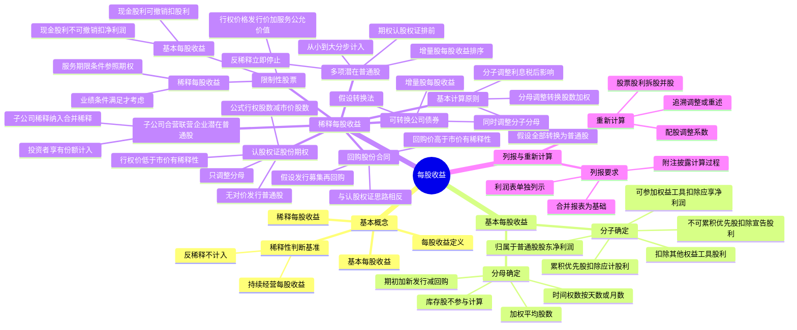

## 1. 章节定位

| 项目 | 信息 |
|------|------|
| 所属科目 | 会计 |
| 难度等级 | 3 |
| 历年分值 | 3-5 分 |
| 建议学时 | 4-5 小时 |
| 知识关联章节 | 第10章 职工薪酬（股份支付）、第22章 金融工具（可转债分拆）、第26章 企业合并（合并每股收益）、第27章 合并财务报表（少数股东与每股收益）、第19章 所得税（税后影响额） |

## 2. 考情分析

本章是会计科目的次重点章节，历年分值约 3-5 分，多以客观题或计算分析题形式出现，常与金融工具、股份支付、合并财务报表等章节联动考查。近年考试频率有所上升，主要原因是企业融资工具日益多样化，潜在普通股的稀释性判断成为命题热点。

**命题规律**：本章内容相对独立但计算性强，主观题常以"多项潜在普通股综合计算稀释每股收益"为命题模式，要求考生在多种稀释性工具并存时正确排序、判断反稀释。客观题则集中在分子分母调整、稀释性判断、列报原则等概念辨析。

**高频考点分布**：

1. **基本每股收益的计算**：分子的确定（归属于普通股股东的净利润，扣除其他权益工具股利）、分母的确定（加权平均股数的计算，新发行、回购的时间权数）。
2. **稀释性潜在普通股的判断**：稀释性与反稀释性的判断标准（以持续经营每股收益为基准），潜在普通股的种类（可转债、认股权证、股份期权、限制性股票）。
3. **可转换公司债券的稀释每股收益计算**：假设转换法、增量股每股收益的计算（分子调整税后利息、分母调整转换股数）。
4. **认股权证、股份期权的稀释每股收益计算**：无对价发行普通股股数的计算公式、无需调整分子。
5. **限制性股票的每股收益处理**：等待期内基本每股收益（现金股利可撤销 vs 不可撤销）、稀释每股收益（服务期限条件 vs 业绩条件）、行权价格的确定。
6. **多项潜在普通股的排序与反稀释判断**：按增量股每股收益从小到大排序、分步计入、遇反稀释则停止。
7. **子公司、合营企业、联营企业发行的潜在普通股**：合并稀释每股收益的特殊处理。
8. **每股收益的列报与重新计算**：派发股票股利、拆股并股、配股的重新计算，追溯调整或重述。

**联动考查方式**：
- 与金融工具结合：可转换公司债券负债和权益成分的分拆、实际利率法摊销；
- 与股份支付结合：限制性股票的公允价值、等待期内服务确定；
- 与合并财务报表结合：合并每股收益中子公司净利润的归属、少数股东权益的处理；
- 与所得税结合：稀释每股收益中利息的税后影响额。

**备考建议**：
- 牢记"分子净利润、分母股数"的双轨调整思路，每种稀释工具的调整项目不同；
- 可转债同时调整分子和分母，认股权证和股份期权只调整分母（无对价发行部分）；
- 限制性股票的关键在于"现金股利可撤销与否"决定分子扣除项目，"解锁条件"决定稀释性判断；
- 多项潜在普通股按增量股每股收益从小到大排序，遇到反稀释立即停止；
- 配股重新计算的核心是计算"调整系数"。

## 3. 知识框架

## 4. 核心精讲

### 4.1 每股收益的基本概念

**每股收益**是指普通股股东每持有一股普通股所能享有的企业净利润或需承担的企业净亏损。每股收益可用于反映企业的经营成果，衡量普通股的获利水平及投资风险，是投资者、债权人等信息使用者评价企业盈利能力、预测企业成长潜力并作出相关经济决策的一项重要财务指标。

每股收益包括**基本每股收益**和**稀释每股收益**两类。

- **基本每股收益**仅考虑当期实际发行在外的普通股股份；
- **稀释每股收益**的计算和列报主要是为了避免每股收益虚增可能带来的信息误导。例如，公司发行可转换公司债券融资，在转股之前不会增加普通股股数，尽管可转债名义利率通常低于普通债券利率，但可行使的转股权意味着有更多潜在普通股股东有权参与分享相关期间的利润，转股很可能会导致每股收益下降，因此转股权具有稀释性。要求计算稀释每股收益，就是为信息使用者提供一个更可比、更有用的财务指标。

### 4.2 基本每股收益

基本每股收益只考虑当期实际发行在外的普通股股份，按照归属于普通股股东的当期净利润除以当期实际发行在外普通股的加权平均数计算确定。

**计算公式**：

$$\text{基本每股收益} = \frac{\text{归属于普通股股东的当期净利润}}{\text{当期发行在外普通股的加权平均数}}$$

#### 4.2.1 分子的确定

计算基本每股收益时，分子为**归属于普通股股东的当期净利润**，即企业当期实现的可供普通股股东分配的净利润或应由普通股股东分担的净亏损金额。发生亏损的企业，每股收益以负数列示。

**以合并财务报表为基础计算的每股收益**，分子应当是归属于母公司普通股股东的当期合并净利润，即扣减少数股东损益后的余额。

**企业存在发行在外的除普通股以外的权益工具的**，在计算基本每股收益时，归属于普通股股东的净利润不应包含其他权益工具的股利或利息：

| 其他权益工具类型 | 分子扣除处理 |
|------|------|
| 不可累积优先股等其他权益工具 | 扣除当期宣告发放的股利 |
| 累积优先股等其他权益工具 | 无论当期是否宣告发放股利，均应扣除归属于其他权益工具持有者的股利 |
| 可参加剩余利润分配的其他权益工具 | 归属于普通股股东的净利润不应包含根据可参加机制计算的应归属于其他权益工具持有者的净利润 |

#### 4.2.2 分母的确定

计算基本每股收益时，分母为**当期发行在外普通股的加权平均数**，即期初发行在外普通股股数根据当期新发行或回购的普通股股数与相应时间权数的乘积进行调整后的股数。

**注意**：公司库存股不属于发行在外的普通股，且无权参与利润分配，应当在计算分母时扣除。

**加权平均股数计算公式**：

$$\text{加权平均股数} = \text{期初发行在外股数} + \text{新发行股数} \times \frac{\text{已发行时间}}{\text{报告期时间}} - \text{回购股数} \times \frac{\text{已回购时间}}{\text{报告期时间}}$$

其中，作为权数的已发行时间、报告期时间和已回购时间通常按**天数**计算，在不影响计算结果合理性的前提下，也可以采用简化的计算方法，如按**月数**计算。

**新发行普通股股数的确定原则**（根据发行合同的具体条款，从应收或实收对价之日起计算确定）：

1. 为收取现金而发行的普通股股数，从应收现金之日起计算；
2. 因债务转资本而发行的普通股股数，从停止计提债务利息之日或结算日起计算；
3. 非同一控制下的企业合并，作为对价发行的普通股股数，从购买日起计算；同一控制下的企业合并，作为对价发行的普通股股数，应当计入与合并净利润口径一致的相关各列报期间普通股的加权平均数；
4. 为购买非现金资产而发行的普通股股数，从确认所购买的资产之日起计算。

### 4.3 稀释每股收益

#### 4.3.1 基本计算原则

**稀释每股收益**是以基本每股收益为基础，假设企业所有发行在外的稀释性潜在普通股均已转换为普通股，从而分别调整归属于普通股股东的当期净利润以及发行在外普通股的加权平均数计算而得的每股收益。

**（一）稀释性潜在普通股**

**潜在普通股**是指赋予其持有者在报告期或以后期间享有取得普通股权利的一种金融工具或其他合同。我国企业发行的潜在普通股主要有：可转换公司债券、认股权证、股份期权等。

**稀释性潜在普通股**，是指假设当期转换为普通股会减少每股收益或增加每股亏损的潜在普通股。计算稀释每股收益时**只考虑稀释性潜在普通股**的影响，而不考虑不具有稀释性的潜在普通股。

**关键判断标准**：潜在普通股是否具有稀释性，应看其对**持续经营每股收益**的影响——假定潜在普通股当期转换为普通股，如果会减少持续经营每股收益或增加持续经营每股亏损，表明具有稀释性，否则具有反稀释性。如果企业存在终止经营的情况，应当按照扣除终止经营净利润以后的当期归属于普通股股东的**持续经营净利润**进行计算。

**（二）分子的调整**

计算稀释每股收益时，应当根据下列事项对归属于普通股股东的当期净利润进行调整：

1. 当期已确认为费用的稀释性潜在普通股的利息；
2. 稀释性潜在普通股转换时将产生的收益或费用。

上述调整应当考虑相关的**所得税影响**。对于包含负债和权益成分的金融工具，仅需调整属于金融负债部分的相关利息、利得或损失。

**（三）分母的调整**

计算稀释每股收益时，当期发行在外普通股的加权平均数应当为计算基本每股收益时普通股的加权平均数与假定稀释性潜在普通股转换为已发行普通股而增加的普通股股数的加权平均数之和。

**转换假设的时间确定**：

| 潜在普通股情形 | 假设转换时间 |
|------|------|
| 以前期间发行的稀释性潜在普通股 | 假设在当期期初转换为普通股 |
| 当期发行的稀释性潜在普通股 | 假设在发行日转换为普通股 |
| 当期被注销或终止的稀释性潜在普通股 | 按照当期发行在外的时间加权平均计入稀释每股收益 |
| 当期被转换或行权的稀释性潜在普通股 | 从当期期初至转换日（或行权日）计入稀释每股收益，从转换日起所转换的普通股则计入基本每股收益 |

当存在不止一种转换基础时，应当假定会采取从潜在普通股持有者角度看**最有利的转换率或执行价格**。

#### 4.3.2 可转换公司债券

**可转换公司债券**是指公司依法发行的、在一定期间内依据约定的条件可以转换成股份的公司债券。对于可转换公司债券，可以采用**假设转换法**判断其稀释性，并计算稀释每股收益。

**计算步骤**：

1. **假设转换**：假设这部分可转换公司债券在当期期初（或发行日）即已转换成普通股，从而一方面增加了发行在外的普通股股数，另一方面节约了公司债券的利息费用，增加了归属于普通股股东的当期净利润。
2. **计算增量股每股收益**：用增加的净利润除以增加的普通股股数，得出增量股的每股收益，与原来的每股收益进行比较。
3. **判断稀释性**：如果增量股的每股收益小于原每股收益，则说明该可转换公司债券具有稀释作用，应当计入稀释每股收益的计算中。

**调整项目**：

- **分子调整**：当期已确认为费用的利息等的**税后影响额**；
- **分母调整**：假定可转换公司债券当期期初（以前期间发行的可转债）或发行日（当期发行的可转债）转换为普通股的股数加权平均数。

**稀释每股收益公式**：

$$\text{稀释每股收益} = \frac{\text{基本每股收益分子} + \text{假设转换增加的净利润}}{\text{基本每股收益分母} + \text{假设转换增加的普通股股数}}$$

#### 4.3.3 认股权证、股份期权

**认股权证**是指公司发行的、约定持有人有权在履约期间内或特定到期日按约定价格向本公司购买新股的有价证券。**股份期权**是指公司授予持有人在未来一定期限内以预先确定的价格和条件购买本公司一定数量股份的权利。

**稀释性判断**：

- 对于**盈利企业**，认股权证、股份期权等的行权价格低于当期普通股平均市场价格时，具有稀释性；
- 对于**亏损企业**，其自身发行的认股权证、股份期权的假设行权一般不影响净亏损，但增加普通股股数，从而导致每股亏损金额减少，实际上产生了**反稀释**的作用，因此这种情况下不应当计算稀释每股收益。

**计算特点**：对于稀释性认股权证、股份期权，计算稀释每股收益时一般**无须调整分子**净利润金额，只需要对分母普通股加权平均数进行调整。

**分母调整的四个步骤**：

1. 假设这些认股权证、股份期权在当期期初（或发行日）已经行权，计算按约定行权价格发行普通股将取得的股款金额；
2. 假设按照当期普通股平均市场价格发行股票，计算需发行多少普通股能够带来上述相同的股款金额；
3. 比较行使股份期权、认股权证将发行的普通股股数与按照平均市场价格发行的普通股股数，差额部分相当于**无对价发行的普通股**，作为发行在外普通股股数的净增加；
4. 将净增加的普通股股数乘以其假设发行在外的时间权数，据此调整计算稀释每股收益的分母数。

**核心公式**：

$$\text{增加的普通股股数} = \text{行权时转换的普通股股数} - \text{行权价格} \times \frac{\text{行权时转换的普通股股数}}{\text{当期普通股平均市场价格}}$$

**理解**：认股权证、股份期权行权时发行的普通股可以视为两部分——一部分是按照平均市场价格发行的普通股（按市价发行，企业经济资源流入与普通股股数同比例增加，既没有稀释作用也没有反稀释作用）；另一部分是无对价发行的普通股（企业可利用的经济资源没有增加，但发行在外普通股股数增加，因此具有稀释性）。

**普通股平均市场价格的计算**：理论上应当包括该普通股每次交易的价格，实务中通常对每周或每月具有代表性的股票交易价格进行简单算术平均即可。股票价格平稳时，可采用每周或每月股票的收盘价；股票价格波动较大时，可采用每周或每月股票最高价与最低价的平均值。**一经确定，不得随意变更**。

#### 4.3.4 授予员工的限制性股票或股份期权

上市公司采取授予限制性股票的方式进行股权激励的，常见安排是上市公司以非公开发行的方式向激励对象授予一定数量的公司股票，并规定锁定期和解锁期，在锁定期和解锁期内，不得上市流通及转让。达到解锁条件，可以解锁；如果全部或部分股票未被解锁而失效或作废，通常由上市公司按照事先约定的价格立即进行回购。在上述股权激励的等待期内应当按照以下原则计算每股收益。

**（一）等待期内基本每股收益的计算**

基本每股收益仅考虑发行在外的普通股。限制性股票由于未来可能被回购，实质上属于或有可发行股票，因此在计算基本每股收益时**不应当包括在内**。等待期内基本每股收益的计算，应视其发放的现金股利是否可撤销采取不同的方法：

| 现金股利类型 | 含义 | 分子处理 | 分母处理 |
|------|------|---------|---------|
| 现金股利可撤销 | 未达到解锁条件时，被回购限制性股票的持有者将无法获得（或需要退回）其在等待期内应收（或已收）的现金股利 | 应扣除当期分配给预计未来可解锁限制性股票持有者的现金股利 | 不应包含限制性股票的股数 |
| 现金股利不可撤销 | 不论是否达到解锁条件，限制性股票持有者仍有权获得（或不得被要求退回）其在等待期内应收（或已收）的现金股利 | 应扣除归属于预计未来可解锁限制性股票的净利润 | 不应包含限制性股票的股数 |

**现金股利不可撤销的处理原理**：即使未来没有解锁，已分配的现金股利也无须退回，表明在分配利润时这些股票享有了与普通股相同的权利，因此属于与普通股股东一起参加剩余利润分配的其他权益工具。

**（二）等待期内稀释每股收益的计算**

应视解锁条件不同采取不同的方法：

**1. 解锁条件仅为服务期限条件的**：

公司应假设资产负债表日尚未解锁的限制性股票已于当期期初（或晚于期初的授予日）全部解锁，并参照股份期权的有关规定考虑限制性股票的稀释性。**行权价格低于公司当期普通股平均市场价格时**，应当考虑其稀释性，计算稀释每股收益。

**行权价格的确定**：

$$\text{行权价格} = \text{限制性股票的发行价格} + \text{资产负债表日尚未取得的职工服务的公允价值}$$

其中，尚未取得的职工服务的公允价值按照《企业会计准则第 11 号——股份支付》有关规定计算确定。

**稀释每股收益公式**：

$$\text{稀释每股收益} = \frac{\text{当期净利润}}{\text{普通股加权平均数} + \text{调整增加的普通股加权平均数}}$$

$$= \frac{\text{当期净利润}}{\text{普通股加权平均数} + \left(\text{限制性股票股数} - \text{行权价格} \times \frac{\text{限制性股票股数}}{\text{当期普通股平均市场价格}}\right)}$$

注：限制性股票若为当期发行的，则还需考虑时间权数计算加权平均数。

锁定期内计算稀释每股收益时，分子应加回计算基本每股收益分子时已扣除的当期分配给预计未来可解锁限制性股票持有者的现金股利或归属于预计未来可解锁限制性股票的净利润。

**2. 解锁条件包含业绩条件的**：

公司应假设资产负债表日即为解锁日并据以判断资产负债表日的实际业绩情况是否满足解锁要求的业绩条件：

- 若**满足业绩条件**的，应当参照上述解锁条件仅为服务期限条件的有关规定计算稀释性每股收益；
- 若**不满足业绩条件**的，计算稀释性每股收益时不必考虑此限制性股票的影响。

**企业授予员工股份期权的**，也可区分行权条件仅为服务条件，还是同时包含业绩条件，根据上述原则判断是否需要考虑其稀释性。如果需要考虑稀释性，其计算原理与限制性股票一致。对于股份期权而言，分子通常不涉及股利的调整。分母计算稀释性潜在普通股时使用的行权价格为：**期权的行权价 + 资产负债表日尚未取得的职工服务按照《企业会计准则第 11 号——股份支付》有关规定计算确定的公允价值之和**。

#### 4.3.5 企业承诺将回购其股份的合同

企业承诺将回购其股份的合同中规定的**回购价格高于当期普通股平均市场价格时**，应当考虑其稀释性。计算稀释每股收益时，与认股权证、股份期权的计算思路**恰好相反**。

**计算步骤**：

1. **假设发行**：假设企业于期初按照当期普通股平均市场价格发行普通股，以募集足够的资金来履行回购合同；合同日晚于期初的，则假设企业于合同日按照自合同日至期末的普通股平均市场价格发行足量的普通股。该假设前提下，由于是按照市价发行普通股，导致企业经济资源流入与普通股股数同比例增加，每股收益金额不变。
2. **假设回购**：假设回购合同已于当期期初（或合同日）履行，按照约定的行权价格回购本企业股票。
3. **计算净增加**：比较假设发行的普通股股数与假设回购的普通股股数，差额部分作为净增加的发行在外普通股股数，再乘以相应的时间权数，据此调整计算稀释每股收益的分母数。

**核心公式**（注意与认股权证对比）：

$$\text{增加的普通股股数} = \text{回购价格} \times \frac{\text{承诺回购的普通股股数}}{\text{当期普通股平均市场价格}} - \text{承诺回购的普通股股数}$$

#### 4.3.6 多项潜在普通股

企业对外发行不同潜在普通股的，单独考察其中某潜在普通股可能具有稀释作用，但如果和其他潜在普通股一并考察时可能恰恰变为反稀释作用。因此，为了反映潜在普通股**最大的稀释作用**，应当按照各潜在普通股的稀释程度从大到小的顺序计入稀释每股收益，直至稀释每股收益达到最小值。

**稀释程度的衡量**：稀释程度根据**增量股的每股收益**衡量，即假定稀释性潜在普通股转换为普通股的情况下，将增加的归属于普通股股东的当期净利润除以增加的普通股股数的金额。**增量股每股收益越小，稀释程度越大**。

**重要原则**：企业每次发行的潜在普通股应当视作不同的潜在普通股，分别判断其稀释性，而不能将其作为一个总体考虑。通常情况下，**股份期权和认股权证排在前面计算**，因为其假设行权一般不影响净利润。

**计算步骤**：

1. 列出企业在外发行的各潜在普通股；
2. 假设各潜在普通股已于当期期初或发行日转换为普通股，确定其对归属于普通股股东当期净利润的影响金额（可转债一般会增加净利润，期权和认股权证一般不影响净利润）；
3. 确定各潜在普通股假设转换后将增加的普通股股数（稀释性股份期权和认股权证假设行权后，应为无对价发行部分的普通股股数）；
4. 计算各潜在普通股的增量股每股收益，判断其稀释性；
5. 按照潜在普通股稀释程度从大到小的顺序，将各稀释性潜在普通股分别计入稀释每股收益中。分步计算过程中，如果下一步得出的每股收益**小于**上一步得出的每股收益，表明新计入的潜在普通股具有稀释作用，应当计入稀释每股收益中；反之，则表明具有**反稀释**作用，**不计入**稀释每股收益中；
6. 最后得出的**最小**每股收益金额即为稀释每股收益。

#### 4.3.7 子公司、合营企业或联营企业发行的潜在普通股

子公司、合营企业、联营企业发行能够转换成其普通股的稀释性潜在普通股，不仅应当包括在其稀释每股收益计算中，而且还应当包括在**合并稀释每股收益**以及**投资者稀释每股收益**的计算中。

因此，当企业的子公司、合营企业、联营企业存在稀释性潜在普通股时，合并层面或投资者层面哪怕现为亏损，也应当考虑计算稀释每股收益，因为企业应分享的子公司、合营企业、联营企业的净利润可能由于相关子公司、合营企业、联营企业存在稀释性潜在普通股而稀释减少，从而进一步扩大合并层面归属于母公司普通股股东的亏损。

**合并稀释每股收益的计算思路**：

- 子公司稀释每股收益中归属于母公司普通股股东的部分，按照母公司持股比例计算；
- 子公司稀释每股收益中归属于稀释性潜在普通股且由母公司享有的部分，按照母公司持有该潜在普通股的比例计算；
- 合并稀释每股收益 = (母公司净利润 + 子公司净利润中归属于母公司部分 + 子公司净利润中归属于母公司享有的潜在普通股部分) / 母公司发行在外普通股加权平均数。

### 4.4 每股收益的列报

#### 4.4.1 列报要求

对于普通股或潜在普通股已公开交易的企业以及正处于公开发行普通股或潜在普通股过程中的企业：

- 如果**不存在**稀释性潜在普通股，则应当在利润表中单独列示**基本每股收益**；
- 如果**存在**稀释性潜在普通股，则应当在利润表中单独列示**基本每股收益和稀释每股收益**。

**比较财务报表的特殊要求**：编制比较财务报表时，各列报期间中只要有一个期间列示了稀释每股收益，那么所有列报期间均应当列示稀释每股收益，即使其金额与基本每股收益相等。

**合并财务报表的列报**：企业对外提供合并财务报表的，仅要求其以合并财务报表为基础计算每股收益，并在合并财务报表中予以列报；与合并财务报表一同提供的母公司财务报表中不要求计算和列报每股收益，如果企业自行选择列报的，应以母公司个别财务报表为基础计算每股收益，并在其个别财务报表中予以列报。

**附注披露内容**：

1. 基本每股收益和稀释每股收益分子、分母的计算过程；
2. 列报期间不具有稀释性但以后期间很可能具有稀释性的潜在普通股；
3. 在资产负债表日至财务报告批准报出日之间，企业发行在外普通股或潜在普通股发生重大变化的情况。

**终止经营的披露**：企业如有终止经营的情况，应当在附注中分别**持续经营**和**终止经营**披露基本每股收益和稀释每股收益。

#### 4.4.2 重新计算

**（一）派发股票股利、公积金转增资本、拆股和并股**

企业派发股票股利、公积金转增资本、拆股或并股等，会增加或减少其发行在外普通股或潜在普通股的数量，但**并不影响所有者权益金额**，这既不影响企业所拥有或控制的经济资源，也不改变企业的盈利能力，即意味着同样的损益现在要由扩大或缩小了的股份规模来享有或分担。因此，为了保持会计指标的前后期可比性，企业应当在相关报批手续全部完成后，按调整后的情况**重新计算各列报期间的每股收益**。

上述变化发生于**资产负债表日至财务报告批准报出日之间**的，应当以调整后的股数重新计算各列报期间的每股收益。

**（二）配股**

配股在计算每股收益时比较特殊，因为它是向全部现有股东以低于当前股票市价的价格发行普通股，实际上可以理解为**按市价发行股票和无对价送股的混合体**。配股中包含的送股因素具有与股票股利类似的效果，导致发行在外普通股股数增加的同时，却没有相应的经济资源流入。因此，计算基本每股收益时，应当考虑配股中的送股因素，将这部分无对价的送股视同列报最早期间期初就已发行在外，并据以调整各列报期间发行在外普通股的加权平均数。

**配股重新计算的关键——调整系数**：

$$\text{每股理论除权价格} = \frac{\text{行权前发行在外普通股的公允价值总额} + \text{配股收取的款项}}{\text{行权后发行在外的普通股股数}}$$

$$\text{调整系数} = \frac{\text{行权前发行在外普通股的每股公允价值}}{\text{每股理论除权价格}}$$

$$\text{因配股重新计算的上年度基本每股收益} = \text{上年度基本每股收益} \div \text{调整系数}$$

$$\text{本年度基本每股收益} = \frac{\text{归属于普通股股东的当期净利润}}{\text{配股前股数} \times \text{调整系数} \times \text{配股前时间权重} + \text{配股后发行在外普通股加权平均数}}$$

**特别说明**：企业向特定对象以低于当前市价的价格发行股票，虽然与配股具有相似的特征（发行价格低于市价），但配股属于向非特定对象增发股票，而向特定对象发行往往是出于战略考虑或其他动机，或者特定对象除认购股份以外还需以其他形式予以补偿。因此，向特定对象发行股票的行为可以视为**不存在送股因素**，视同发行新股处理。

**（三）以前年度损益的追溯调整或追溯重述**

按照《企业会计准则第 28 号——会计政策、会计估计变更和差错更正》的规定对以前年度损益进行追溯调整或追溯重述的，应当**重新计算各列报期间的每股收益**。

## 5. 典型例题

**【例题 1】（基本每股收益——加权平均股数的计算）**

某公司 2×24 年期初发行在外的普通股为 30 000 万股；5 月 1 日新发行普通股 16 200 万股；12 月 1 日回购普通股 7 200 万股，以备将来奖励职工之用。该公司当年度实现净利润为 16 250 万元。假定该公司按月数计算每股收益的时间权重。

要求：计算该公司 2×24 年度的基本每股收益。

**答案**：

发行在外普通股加权平均数 = 30 000 × 12/12 + 16 200 × 8/12 − 7 200 × 1/12 = 30 000 + 10 800 − 600 = **40 200（万股）**

基本每股收益 = 16 250 ÷ 40 200 = **0.40（元/股）**

**解析**：加权平均股数的计算关键在于时间权数的确定——新发行股数从发行日起计算至期末（5 月 1 日至 12 月 31 日共 8 个月）；回购股数从回购日起计算至期末（12 月 1 日至 12 月 31 日共 1 个月）。也可以分段计算：30 000 × 4/12 + 46 200 × 7/12 + 39 000 × 1/12 = 40 200（万股），结果一致。

**【例题 2】（基本每股收益——存在优先股的分子调整）**

甲公司 2×24 年度实现净利润为 200 000 万元，发行在外普通股加权平均数为 250 000 万股。2×24 年 1 月 1 日，甲公司按票面金额平价发行 600 万股优先股，每股优先股每股票面金额为 100 元。该批优先股股息不可累积。2×24 年 12 月 31 日，甲公司宣告并以现金全额发放当年优先股股息，股息率为 6%。根据该优先股合同条款规定，甲公司将该批优先股分类为权益工具，优先股股息不在所得税前列支。

要求：计算甲公司 2×24 年度的基本每股收益。

**答案**：

归属于普通股股东的净利润 = 200 000 − 100 × 600 × 6% = 200 000 − 3 600 = **196 400（万元）**

基本每股收益 = 196 400 ÷ 250 000 = **0.79（元/股）**

**解析**：优先股分类为权益工具，但其股利仍应从分子中扣除。不可累积优先股的扣除原则是"扣除当期宣告发放的股利"——本题中当年宣告并全额发放，故扣除金额 = 100 × 600 × 6% = 3 600 万元。由于优先股股息不在所得税前列支，因此不需要考虑所得税影响。

**【例题 3】（可转换公司债券的稀释每股收益）**

某上市公司 2×24 年归属于普通股股东的净利润为 38 200 万元，期初发行在外普通股股数 20 000 万股，年内普通股股数未发生变化。2×24 年 1 月 1 日，公司按面值发行 60 000 万元的三年期可转换公司债券，债券每张面值 100 元，票面固定年利率为 2%，利息自发行之日起每年支付一次。该批可转换公司债券自发行结束 12 个月以后即可转换为公司股票，转股价格为每股 10 元，即每 100 元债券可转换为 10 股面值为 1 元的普通股。债券利息不符合资本化条件，直接计入当期损益，所得税税率为 25%。假设不具备转股权的类似债券的市场利率为 3%。公司在对该批可转换公司债券初始确认时，将负债和权益成分进行了分拆。

要求：计算该公司 2×24 年度的基本每股收益和稀释每股收益。

**答案**：

（1）基本每股收益 = 38 200 ÷ 20 000 = **1.91（元/股）**

（2）计算稀释每股收益：

每年支付利息 = 60 000 × 2% = 1 200（万元）

负债成分公允价值 = 1 200/(1+3%) + 1 200/(1+3%)² + 61 200/(1+3%)³ = **58 302.83（万元）**

权益成分公允价值 = 60 000 − 58 302.83 = **1 697.17（万元）**

假设转换所增加的净利润 = 58 302.83 × 3% × (1 − 25%) = **1 311.81（万元）**

假设转换所增加的普通股股数 = 60 000 ÷ 10 = **6 000（万股）**

增量股的每股收益 = 1 311.81 ÷ 6 000 = **0.22（元/股）**

增量股的每股收益 0.22 元 < 基本每股收益 1.91 元，可转换公司债券具有稀释作用。

稀释每股收益 = (38 200 + 1 311.81) ÷ (20 000 + 6 000) = 39 511.81 ÷ 26 000 = **1.52（元/股）**

**解析**：可转换公司债券稀释每股收益的关键在于：①对可转债进行负债和权益成分分拆，分子调整的是负债成分的利息（按实际利率 3% 计算，而非票面利率 2%）；②利息需考虑所得税影响，乘以 (1 − 25%)；③增量股每股收益与基本每股收益比较，判断稀释性；④具有稀释性的，按调整后分子分母计算稀释每股收益。

**【例题 4】（认股权证的稀释每股收益）**

某公司 2×24 年度归属于普通股股东的净利润为 2 750 万元，发行在外普通股加权平均数为 5 000 万股，该普通股平均每股市场价格为 8 元。2×24 年 1 月 1 日，该公司对外发行 1 000 万份认股权证，行权日为 2×25 年 3 月 1 日，每份认股权证可以在行权日以 7 元的价格认购本公司 1 股新发行的股份。

要求：计算该公司 2×24 年度的基本每股收益和稀释每股收益。

**答案**：

（1）基本每股收益 = 2 750 ÷ 5 000 = **0.55（元/股）**

（2）计算稀释每股收益：

行权价格 7 元 < 当期普通股平均市场价格 8 元，认股权证具有稀释性。

调整增加的普通股股数 = 1 000 − 1 000 × 7/8 = 1 000 − 875 = **125（万股）**

稀释每股收益 = 2 750 ÷ (5 000 + 125) = 2 750 ÷ 5 125 = **0.54（元/股）**

**解析**：认股权证和股份期权的稀释每股收益计算特点——**无须调整分子**净利润，只调整分母。分母调整的核心是"无对价发行的普通股股数"，即按行权价格发行的股数（1 000 × 7/8 = 875 万股）与总行权股数（1 000 万股）的差额（125 万股）。这 125 万股相当于企业无对价发行的，具有稀释性。

**【例题 5】（多项潜在普通股的稀释每股收益）**

某公司 2×24 年度归属于普通股股东的净利润为 5 625 万元，发行在外普通股加权平均数为 18 750 万股。年初已发行在外的潜在普通股有：

1. 认股权证 7 200 万份，每份认股权证可以在行权日以 8 元的价格认购 1 股本公司新发股票；
2. 按面值发行的 5 年期可转换公司债券 75 000 万元，债券每张面值 100 元，票面年利率为 2.6%，转股价格为每股 12.5 元，即每 100 元债券可转换为 8 股面值为 1 元的普通股；
3. 按面值发行的 3 年期可转换公司债券 150 000 万元，债券每张面值 100 元，票面年利率为 1.4%，转股价格为每股 10 元，即每 100 元债券可转换为 10 股面值为 1 元的普通股。

当期普通股平均市场价格为 12 元，年度内没有认股权证被行权，也没有可转换公司债券被转换或赎回，所得税税率为 25%。假设不考虑可转换公司债券在负债和权益成分的分拆，且债券票面利率等于实际利率。

要求：计算该公司 2×24 年度的稀释每股收益。

**答案**：

（1）基本每股收益 = 5 625 ÷ 18 750 = **0.30（元/股）**

（2）计算各潜在普通股的增量股每股收益并排序：

| 项目 | 净利润增加（万元） | 股数增加（万股） | 增量股每股收益（元） |
|------|------|------|------|
| 认股权证 | 0 | 7 200 − 7 200 × 8/12 = 2 400 | — |
| 1.4% 债券 | 150 000 × 1.4% × (1 − 25%) = 1 575 | 150 000 ÷ 10 = 15 000 | 1 575 ÷ 15 000 = 0.11 |
| 2.6% 债券 | 75 000 × 2.6% × (1 − 25%) = 1 462.5 | 75 000 ÷ 12.5 = 6 000 | 1 462.5 ÷ 6 000 = 0.24 |

稀释程度排序：认股权证（最大，无增量净利润）> 1.4% 债券（0.11）> 2.6% 债券（0.24）。

（3）分步计入稀释每股收益：

| 项目 | 净利润（万元） | 股数（万股） | 每股收益（元） | 稀释性 |
|------|------|------|------|------|
| 基本每股收益 | 5 625 | 18 750 | 0.30 | — |
| 认股权证 | 5 625 | 21 150 | 0.27 | 稀释 |
| 1.4% 债券 | 7 200 | 36 150 | 0.20 | 稀释 |
| 2.6% 债券 | 8 662.5 | 42 150 | 0.21 | **反稀释** |

因此，稀释每股收益为 **0.20 元/股**。

**解析**：多项潜在普通股的稀释每股收益是本章最综合的题型。关键步骤：①分别计算每种潜在普通股的增量股每股收益；②按增量股每股收益从小到大排序（认股权证一般排最前，因其不影响净利润）；③分步计入，每计入一步都比较新每股收益与上一步——若小于上一步则稀释，计入；若大于上一步则反稀释，停止。本题中计入 2.6% 债券后每股收益从 0.20 反弹至 0.21，说明 2.6% 债券在此情境下具有反稀释性，不应计入。

**【例题 6】（配股的重新计算）**

某企业 2×24 年度归属于普通股股东的净利润为 23 500 万元，2×24 年 1 月 1 日发行在外普通股股数为 8 000 万股，2×24 年 6 月 10 日，该企业发布增资配股公告，向截止到 2×24 年 6 月 30 日（股权登记日）所有登记在册的老股东配股，配股比例为每 4 股配 1 股，配股价格为每股 6 元，除权交易基准日为 2×24 年 7 月 1 日。假设行权前一日的市价为每股 11 元，2×23 年度基本每股收益为 2.64 元。

要求：计算 2×24 年度比较利润表中基本每股收益。

**答案**：

（1）配股数量 = 8 000 ÷ 4 = 2 000（万股）

（2）计算每股理论除权价格和调整系数：

每股理论除权价格 = (11 × 8 000 + 6 × 2 000) ÷ (8 000 + 2 000) = (88 000 + 12 000) ÷ 10 000 = **10（元）**

调整系数 = 11 ÷ 10 = **1.1**

（3）因配股重新计算的 2×23 年度基本每股收益 = 2.64 ÷ 1.1 = **2.4（元/股）**

（4）2×24 年度基本每股收益：

配股前时间权重 = 6/12（1 月 1 日至 6 月 30 日）；配股后时间权重 = 6/12（7 月 1 日至 12 月 31 日）

2×24 年度基本每股收益 = 23 500 ÷ (8 000 × 1.1 × 6/12 + 10 000 × 6/12) = 23 500 ÷ (4 400 + 5 000) = 23 500 ÷ 9 400 = **2.5（元/股）**

**解析**：配股重新计算的核心是"调整系数"，本质是配股中包含的"无对价送股因素"。调整系数 = 行权前每股公允价值 ÷ 每股理论除权价格，本例中为 11 ÷ 10 = 1.1。配股前的股数需乘以调整系数（视同这些无对价送股在最早期间期初就已发行在外），配股后的股数按实际发行在外加权平均数计算。

## 6. 记忆口诀

**每股收益两类**："基本只看实际股，稀释假设全转换"——基本每股收益只考虑实际发行在外的普通股；稀释每股收益假设所有稀释性潜在普通股已转换。

**基本每股收益公式**："分子归属净利润，分母加权平均数"——分子是归属于普通股股东的当期净利润，分母是发行在外普通股的加权平均数。

**分子优先股扣除**："不可累积扣宣告，累积优先扣应计，可参加者扣净利润"——三种其他权益工具的扣除原则。

**加权平均股数**："期初加新发行减回购，时间权数按天月"——期初股数 + 新发行股数 × 时间权数 − 回购股数 × 时间权数，时间权数按天数或月数计算。

**稀释性判断**："减少每股收益是稀释，增加每股收益是反稀释"——以持续经营每股收益为基准判断。

**可转债调整**："分子加税后利息，分母加转换股数"——同时调整分子和分母，利息按实际利率计算并考虑所得税。

**认股权证和期权**："行权价低于市价有稀释，无对价股数调分母，分子净利润不调整"——只调整分母，增加股数 = 行权股数 − 行权价格 × 行权股数 ÷ 市场价格。

**限制性股票**："现金股利可撤销扣股利，不可撤销扣净利润；服务期限参照期权，业绩条件满足才考虑；行权价格发行价加服务公允"——等待期内基本和稀释每股收益的处理。

**回购合同**："回购价高于市价有稀释，思路与期权相反"——假设按市价发行募集，再按回购价回购，净增加 = 回购价格 × 回购股数 ÷ 市价 − 回购股数。

**多项潜在普通股**："增量股每股收益排序，从小到大分步计，遇反稀释立即停，期权认股权证排最前"——按稀释程度从大到小（增量股每股收益从小到大）分步计入。

**合并稀释每股收益**："子公司稀释纳入合并，母公司按比例享净利润"——子公司稀释每股收益中归属于母公司的部分计入合并稀释每股收益。

**重新计算两类**："股票股利拆并股追溯调整，配股计算调整系数"——股本变动不影响权益金额的，重新计算各列报期间每股收益；配股需计算调整系数。

**配股调整系数**："理论除权价格算加权市价，调整系数是除权前市价除理论价"——调整系数 = 行权前每股公允价值 ÷ 每股理论除权价格。

**列报原则**："有稀释列两个，无稀释列一个；比较报表有一期列稀释则全部列"——存在稀释性潜在普通股的，利润表列示基本和稀释；不存在只列基本；比较报表中只要有一期列稀释，所有期间都列。

**附注披露三内容**："计算过程、潜在稀释、股本变化"——基本和稀释每股收益分子分母计算过程；列报期间不具稀释性但以后很可能具稀释性的潜在普通股；资产负债表日至财务报告批准报出日之间股本重大变化。
