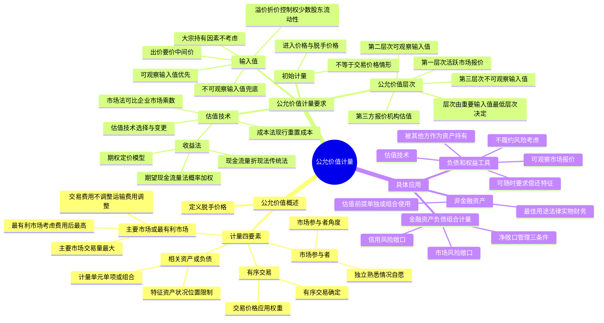

## 1. 章节定位

| 项目 | 信息 |
|------|------|
| 所属科目 | 会计 |
| 难度等级 | 3 |
| 历年分值 | 2-4 分 |
| 建议学时 | 3-4 小时 |
| 知识关联章节 | 第3章 存货（可变现净值vs公允价值）、第7章 资产减值（可收回金额）、第22章 金融工具（公允价值计量）、第26章 企业合并（可辨认资产负债公允价值）、第14章 租赁（使用权资产与租赁负债） |

## 2. 考情分析

本章是会计科目的次重点章节，历年分值约 2-4 分，主要以客观题形式出现，偶有计算分析题。本章理论性强、概念密集，与金融工具、企业合并、资产减值等章节联系紧密。

**命题规律**：本章考查以概念判断、辨析为主，主观题较少但综合性强。近年考试频率有所上升，主要考查公允价值层次划分、估值技术的选择、最佳用途的判断等核心概念。

**高频考点分布**：

1. **公允价值的定义与基本要求**：公允价值是脱手价格，四个基本要求（相关资产或负债、有序交易、主要市场或最有利市场、市场参与者）。
2. **有序交易的判断**：有序交易与非有序交易的区分、有序交易价格的应用权重。
3. **主要市场与最有利市场**：主要市场的识别（交易量最大、活跃程度最高）、最有利市场的确定（考虑交易费用和运输费用后能以最高金额出售）、交易费用与运输费用的处理。
4. **估值技术的三种方法**：市场法、收益法（现金流量折现法的传统法与期望现金流量法、期权定价模型）、成本法（现行重置成本、折旧贬值）。
5. **输入值的分类**：可观察输入值与不可观察输入值，公允价值计量中相关的溢价和折价（控制权溢价、少数股东权益折价、流动性折价），大宗持有因素不考虑。
6. **公允价值层次**：第一层次（活跃市场未经调整报价）、第二层次（直接或间接可观察输入值）、第三层次（不可观察输入值），层次由对公允价值计量整体而言重要的输入值所属的最低层次决定。
7. **非金融资产的公允价值计量**：最佳用途的判断（法律上允许、实物上可能、财务上可行）、估值前提（单独使用或组合使用）。
8. **负债和企业自身权益工具的公允价值计量**：确定方法（可观察市场报价、被其他方作为资产持有、估值技术）、不履约风险的考虑、具有可随时要求偿还特征的金融负债。
9. **市场风险或信用风险可抵销的金融资产和金融负债的组合计量**：组合计量的三个条件。

**联动考查方式**：
- 与金融工具结合：以公允价值计量且其变动计入当期损益/其他综合收益的金融资产；
- 与企业合并结合：非同一控制下企业合并中取得的可辨认资产负债以公允价值计量；
- 与资产减值结合：可收回金额以公允价值减去处置费用后的净额确定；
- 与投资性房地产结合：以公允价值进行后续计量的投资性房地产。

**备考建议**：
- 牢记公允价值是"脱手价格"（exit price），区别于交易价格的"进入价格"（entry price）；
- 理解公允价值层次的核心——由"重要的输入值"所属的"最低层次"决定，而非估值技术本身；
- 区分交易费用（不考虑调整公允价值）与运输费用（需调整公允价值）；
- 最佳用途的三个判断条件——法律上允许、实物上可能、财务上可行；
- 非金融资产考虑"最佳用途"，负债考虑"不履约风险"。

## 3. 知识框架

## 4. 核心精讲

### 4.1 公允价值的定义

**公允价值**，是指市场参与者在计量日发生的有序交易中，出售一项资产所能收到或者转移一项负债所需支付的价格。

理解公允价值的定义需要把握以下要点：

1. **市场参与者角度**：公允价值是基于市场参与者的视角，而非企业自身的视角；
2. **计量日**：公允价值是计量日当天的价格；
3. **有序交易**：在当前市场情况下的有序交易，而非被迫清算或抛售；
4. **脱手价格**：公允价值是出售资产所能收到或转移负债所需支付的价格，即"脱手价格"，区别于企业取得资产时支付的"进入价格"（交易价格）。

**适用范围**：涉及公允价值计量的资产或负债包括以公允价值进行后续计量的投资性房地产、生物资产、企业年金基金投资、非货币性资产形式的政府补助、非同一控制下企业合并中取得的可辨认资产负债及作为合并对价发行的权益工具、以公允价值计量且其变动计入当期损益或其他综合收益的金融资产或金融负债等。

**不适用情况**：存货的可变现净值、资产减值中的预计未来现金流量现值等计量属性，与公允价值类似但不遵循公允价值计量准则；股份支付和租赁业务相关的计量也不遵循公允价值计量的有关规定。

### 4.2 公允价值计量的基本要求

#### 4.2.1 相关资产或负债

企业以公允价值计量相关资产或负债，应当考虑该资产或负债的特征以及该资产或负债是以单项还是以组合的方式进行计量等因素。

**（1）相关资产或负债的特征**

相关资产或负债的特征，是指市场参与者在计量日对该资产或负债进行定量时考虑的特征，包括资产状况及所在位置、对资产出售或者使用的限制等。

- **资产状况和所在位置**：市场参与者以公允价值计量一项非金融资产时，通常会考虑该资产的地理位置和环境、使用功能、结构、新旧程度、可使用状况等。
- **对资产出售或使用的限制**：企业应当区分该限制是针对资产持有者的，还是针对该资产本身的。
  - 如果该限制是针对相关**资产本身**的，则此类限制是该资产具有的一项特征，任何持有该资产的企业都会受到影响，企业以公允价值计量该资产时应当考虑该限制特征。例如，限售股具有在指定期间内无法在公开市场上出售的特征。
  - 如果该限制是针对**资产持有者**的，则此类限制并不是该资产的特征，只会影响当前持有该资产的企业，企业以公允价值计量该资产时不需考虑针对该资产持有者的限制因素。例如，甲公司将土地使用权作为借款抵押，承诺偿还借款前不转让该土地使用权，该承诺是针对甲公司的限制，不会转移给其他市场参与者，故甲公司确定该土地使用权公允价值时不需考虑该限制。

**（2）计量单元**

计量单元，是指相关资产或负债以单独或者组合方式进行计量的最小单位。企业以公允价值计量相关资产或负债，该资产或负债可以是单项资产或负债，也可以是资产组合、负债组合或者资产和负债的组合，例如由多台设备构成的一条生产线，又如企业合并中规范的业务。对于市场风险或信用风险可抵销的金融资产、金融负债和其他合同，在符合条件的情况下，可以将该金融资产、金融负债和其他合同的组合作为计量单元。

#### 4.2.2 有序交易

企业以公允价值计量相关资产或负债，应当假定市场参与者在计量日出售资产或者转移负债的交易，是当前市场情况下的**有序交易**。有序交易是在计量日前一段时期内该资产或负债具有惯常市场活动的交易，不包括被迫清算和抛售。

**（1）有序交易的确定**

企业应当基于可获取的信息，如市场环境变化、交易规则和习惯、价格波动幅度、交易量波动幅度、交易发生的频率、交易对手信息、交易原因、交易场所等，运用专业判断对交易行为和交易价格进行分析。

存在下列情况时，相关资产或负债的交易活动**通常不应作为有序交易**：

1. 在当前市场情况下，市场在计量日之前一段时间内不存在相关资产或负债的惯常市场交易活动；
2. 在计量日之前，相关资产或负债存在惯常的市场交易，但资产出售方或负债转移方仅与单一的市场参与者进行交易；
3. 资产出售方或负债转移方处于或者接近于破产或托管状态，即资产出售方或负债转移方已陷入财务困境；
4. 资产出售方为满足法律或者监管规定而被要求出售资产，即被迫出售；
5. 与相同或类似资产或负债近期发生的其他交易相比，出售资产或转移负债的价格是一个异常值。

**（2）有序交易价格的应用**

| 交易性质 | 公允价值计量处理 |
|------|------|
| 判定为有序交易 | 以交易价格为基础确定该资产或负债的公允价值，考虑交易量、可比性、临近程度等因素 |
| 判定不是有序交易 | 不应考虑该交易的价格，或者应赋予该交易价格较低权重 |
| 不足以判定是否为有序交易 | 应当考虑该交易的价格，但不应将其作为唯一依据或主要依据，相对于其他有序交易价格赋予权重较低 |

#### 4.2.3 主要市场或最有利市场

企业以公允价值计量相关资产或负债，应当假定出售资产或者转移负债的有序交易在该资产或负债的**主要市场**进行。不存在主要市场的，企业应当假定该交易在相关资产或负债的**最有利市场**进行。

- **主要市场**，是指相关资产或负债**交易量最大和交易活跃程度最高**的市场。
- **最有利市场**，是指在考虑交易费用和运输费用后，能够以**最高金额**出售相关资产或者以**最低金额**转移相关负债的市场。

**（1）主要市场或最有利市场的识别**

企业根据可合理取得的信息，能够在交易日确定相关资产或负债交易量最大和交易活跃程度最高的市场的，应当将该市场作为主要市场。无法确定的，应当在考虑交易费用和运输费用后，将能够以最高金额出售该资产或者以最低金额转移该负债的市场作为最有利市场。

通常情况下，如果不存在相反的证据，企业正常进行资产出售或者负债转移的市场可以视为主要市场或最有利市场。相关资产或负债的主要市场（或最有利市场）应当是企业**可进入**的市场，但不要求企业于计量日在该市场上实际出售资产或者转移负债。企业应当从自身角度，而非市场参与者角度，判定主要市场或最有利市场。

**不同的企业可以进入不同的市场**，对相同资产或负债而言，不同企业可能具有不同的主要市场（或最有利市场）。

**（2）主要市场或最有利市场的应用**

企业应当以主要市场上相关资产或负债的价格为基础，计量该资产或负债的公允价值。即使企业能够于计量日在主要市场以外的另一个市场上获得更高的出售价格或更低的转移价格，企业也仍然应当以主要市场上相关资产或负债的价格为基础计量公允价值。

不存在主要市场或者无法确定主要市场的，企业应当以相关资产或负债最有利市场的价格为基础计量其公允价值。

**交易费用与运输费用的处理**：

| 费用类型 | 含义 | 对公允价值的处理 |
|------|------|------|
| 交易费用 | 企业发生的可直接归属于资产出售或者负债转移的不可避免的费用，与特定交易有关 | **不根据交易费用对价格进行调整**；交易费用不属于相关资产或负债的特征 |
| 运输费用 | 将该资产从当前位置转移到主要市场（或最有利市场）的费用 | **应当根据运输费用对价格进行调整**；相关资产所在地理位置是该资产的特征 |

**举例**：甲公司委托某证券公司购买乙上市公司 100 万股普通股，购买价格为每股 10 元，甲公司共支付 1 002 万元，其中 2 万元是支付给证券公司的手续费。甲公司初始计量该交易性金融资产时，每股股票的公允价值应当是 10 元，而不是 10.02 元（手续费属于交易费用，不调整公允价值）。

#### 4.2.4 市场参与者

企业以公允价值计量相关资产或负债，应当充分考虑市场参与者之间的交易，采用市场参与者在对该资产或负债定价时为实现其经济利益最大化所使用的假设。

**（1）市场参与者的特征**

市场参与者，是指在相关资产或负债的主要市场（或最有利市场）中，相互独立的、熟悉资产或负债情况的、能够且愿意进行资产或负债交易的买方和卖方。市场参与者应当具备下列特征：

1. 相互独立，不存在关联方关系（关联方交易按市场条款达成的可作为市场参与者之间的交易）；
2. 熟悉情况，根据可获得的信息对相关资产或负债以及交易具备合理认知；
3. 有能力并自愿进行相关资产或负债的交易，而非被迫或以其他强制方式进行交易。

**（2）市场参与者的应用**

企业应当从市场参与者角度计量相关资产或负债的公允价值，而不应考虑企业自身持有资产、清偿或者以其他方式履行负债的意图和能力。例如，甲公司取得了竞争对手乙公司 100% 的股权，乙公司声誉良好，原有商标具有商业价值，但甲公司决定不再使用乙公司的商标。甲公司以公允价值计量该商标时，应当基于将该商标出售给熟悉情况、有意愿且有能力进行交易的其他市场参与者的价格，而不能因为自愿放弃使用该商标而将其公允价值确定为零。

### 4.3 公允价值计量要求

#### 4.3.1 公允价值初始计量

企业在取得资产或者承担负债的交易中，**交易价格**是取得该资产所支付或者承担该负债所收到的价格，即**进入价格**。而相关资产或负债的**公允价值**是**脱手价格**，即出售该资产所能收到的价格或者转移该负债所需支付的价格。

在大多数情况下，相关资产或负债的进入价格等于其脱手价格。但企业未必以取得资产时所支付的价格出售该资产，因此进入价格不一定等于脱手价格。在下列情况下，企业以公允价值对相关资产或负债进行初始计量的，**不应将取得资产或者承担负债的交易价格作为该资产或负债的公允价值**：

1. **关联方之间的交易**（但有证据表明按市场条款进行的，交易价格可作为确定公允价值的基础）；
2. **被迫进行的交易**，或者资产出售方（或负债转移方）在交易中被迫接受价格的交易；
3. **交易价格所代表的计量单元不同**于以公允价值计量的相关资产或负债的计量单元；
4. **进行交易的市场不是该资产或负债的主要市场**（或最有利市场）。

企业以公允价值对相关资产或负债进行初始计量，并且交易价格与公允价值不相等的，交易价格与公允价值的差额应当按照会计准则的要求进行处理。如果会计准则对此未作出明确规定，企业应当将该差额计入当期损益。

#### 4.3.2 估值技术

企业以公允价值计量相关资产或负债，应当使用适用于当前情况的估值技术，目的是估计市场参与者在计量日当前市场情况下的有序交易中出售资产或者转移负债的价格。

估值技术通常包括**市场法、收益法和成本法**，企业应当根据实际情况从这三种方法中选择一种或多种估值技术。相关资产或负债存在活跃市场公开报价的，企业应当**优先使用该报价**确定该资产或负债的公允价值。除上述情况外，企业选择三种估值方法中的哪种或哪几种确定公允价值**不存在优先顺序**。

**（1）市场法**

市场法是利用相同或类似的资产、负债或资产和负债组合的价格以及其他相关市场交易信息进行估值的技术。

企业在使用市场法时，应当以市场参与者在相同或类似资产出售中能够收到或者转移相同或类似负债需要支付的公开报价为基础，并根据资产或负债的特征（当前状况、地理位置、出售和使用的限制等）对相同或类似资产或负债的市场价格进行调整。

**市场乘数法**：包括上市公司比较法、交易案例比较法等。可使用的市场乘数包括市盈率、市净率、企业价值/税息折旧及摊销前利润（EV/EBITDA）乘数等。

**（2）收益法**

收益法是企业将未来金额转换成单一现值的估值技术。企业使用收益法时，应当反映市场参与者在计量日对未来现金流量或者收入费用等金额的预期。企业使用的收益法包括**现金流量折现法、多期超额收益折现法、期权定价模型**等估值方法。

**现金流量折现法**包括传统法（折现率调整法）和期望现金流量法：

| 方法 | 现金流量 | 折现率 | 特点 |
|------|------|------|------|
| 传统法 | 在估计金额范围内最有可能的现金流量（合同现金流量、承诺现金流量或最有可能的现金流量），以特定事项为前提条件 | 经风险调整的折现率（来自市场上交易的类似资产或负债的可观察回报率） | 风险调整通过折现率反映 |
| 期望现金流量法 | 经风险调整的期望现金流量（对所有可能的现金流量进行概率加权，不再以特定事项为前提条件） | 无风险利率（第一种方法，从期望现金流量中扣除风险溢价得到确定等值现金流量，按无风险利率折现）；或包含风险溢价的期望回报率（第二种方法，在无风险利率之上增加风险溢价） | 风险调整可通过现金流量或折现率反映，两种方法结果相同 |

**期权定价模型**：包括布莱克-斯科尔斯模型、二叉树模型、蒙特卡洛模拟法等。布莱克-斯科尔斯模型可用于认股权证和具有转换特征的金融工具的简单估值；蒙特卡洛模拟法适用于包含可变行权价格或转换价格、对行权时间具有限制条款等复杂属性的认股权证或具有转换特征的金融工具。

**（3）成本法**

成本法，是反映当前要求重置相关资产服务能力所需金额的估值技术，通常是指现行重置成本。在成本法下，企业应当根据**折旧贬值**情况，对市场参与者获得或构建具有相同服务能力的替代资产的成本进行调整。折旧贬值包括：

- **实体性损耗**：资产物理上的损耗；
- **功能性贬值**：技术进步等导致资产功能相对落后；
- **经济性贬值**：外部环境变化导致资产价值下降。

**（4）估值技术的选择**

企业在某些情况下使用单项估值技术是恰当的，但在有些情况下可能需要使用多种估值技术以进行交叉检验。企业应当运用职业判断，确定恰当的估值技术。至少应当考虑下列因素：

1. 根据企业可获得的市场数据和其他信息，其中一种估值技术是否比其他估值技术更恰当；
2. 其中一种估值技术所使用的输入值是否更容易在市场上观察到或者只需作更少的调整；
3. 其中一种估值技术得到的估值结果区间是否在其他估值技术的估值结果区间内；
4. 市场法和收益法结果存在较大差异的，应进一步分析存在较大差异的原因。

**校准**：企业以相关资产或负债的交易价格作为其初始确认时的公允价值，并在公允价值后续计量中使用了不可观察输入值的，应当校正后续计量中运用的估值技术，以使得用该估值技术确定的初始确认结果与初始确认时的交易价格相等。企业通过校准估值技术，能够确保估值技术反映当前市场情况。

**估值技术一经确定，不得随意变更**，除非变更估值技术或其应用方法能使计量结果在当前情况下同样或者更能代表公允价值（如出现新的市场、可以取得新的信息、无法再取得以前使用的信息、改进了估值技术、市场状况发生变化等）。企业变更估值技术及其应用方法的，应当按照会计估计变更处理，并对变更进行披露。

#### 4.3.3 输入值

企业以公允价值计量相关资产或负债，应当考虑市场参与者在对相关资产或负债进行定价时所使用的假设，即**输入值**，可分为可观察输入值和不可观察输入值。

**优先使用原则**：企业使用估值技术时，应当**优先使用可观察输入值**，仅当相关可观察输入值无法取得或取得不切实可行时才使用不可观察输入值。企业通常可以从交易所市场、做市商市场、经纪人市场、直接交易市场获得可观察输入值。

**（1）公允价值计量中相关的溢价和折价**

企业应当选择市场参与者在相关资产或负债交易中会考虑的、反映该资产或负债特征的输入值。如果企业能够获得相同或类似资产或负债在活跃市场中的报价且市场参与者将考虑与相关资产或负债的特征相关的溢价或折价时，企业应当根据这些溢价或折价，如**控制权溢价、少数股东权益折价、流动性折价**等，对相同或类似资产或负债的市场交易价格进行调整。

**大宗持有因素不考虑**：企业不应考虑与计量单元不一致的溢价或折价，如反映企业持有规模特征即"大宗持有因素"的溢价或折价。大宗持有因素是与交易相关的特定因素，因企业交易该资产的方式不同而有所不同，不是该资产的特征。

**（2）以出价和要价为基础的输入值**

当相关资产或负债存在出价和要价时，企业应当以在出价和要价之间最能代表当前情况下公允价值的价格确定该资产或负债的公允价值。

- **出价**：经纪人或做市商购买一项资产或处置一项负债所愿意支付的价格；
- **要价**：经纪人或做市商出售一项资产或承担一项负债所愿意收取的价格。

企业可使用出价计量资产头寸，使用要价计量负债头寸，也可使用市场参与者在实务中使用的在出价和要价之间的中间价或其他定价惯例计量相关资产或负债。**无论如何，企业不应使用与公允价值计量假定不一致的方法**，例如对资产使用要价、对负债使用出价。

#### 4.3.4 公允价值层次

为提高公允价值计量和相关披露的一致性和可比性，企业应当将估值技术所使用的输入值划分为三个层次，并**首先使用第一层次输入值，其次使用第二层次输入值，最后使用第三层次输入值**。

**（1）第一层次输入值**

第一层次输入值是企业在计量日能够取得的**相同资产或负债在活跃市场上未经调整的报价**。

**活跃市场**是指相关资产或负债交易量及交易频率足以持续提供定价信息的市场。在活跃市场中，交易对象具有同质性，可随时找到自愿交易的买方和卖方，并且市场价格信息是公开的。

企业使用相同资产或负债在活跃市场的公开报价对该资产或负债进行公允价值计量时，通常不应进行调整。但下列情况除外：

1. 企业持有大量类似但不相同的以公允价值计量的资产或负债，难以获得每项资产或负债在计量日单独的定价信息，可使用不完全依赖于单个报价的其他定价方法，由此取得的公允价值计量结果应当划入第二或第三层次；
2. 因发生影响公允价值计量的重大事件等导致活跃市场的报价不代表计量日的公允价值，企业应当根据新信息对报价进行调整，公允价值计量应当划入第二或第三层次；
3. 不存在相同或类似负债或企业自身权益工具报价但其他方将其作为资产持有、企业以该资产的公允价值为基础确定该负债或自身权益工具的公允价值的，如果无须对资产报价进行调整，则公允价值计量结果为第一层次，否则应当划入第二或第三层次。

**（2）第二层次输入值**

第二层次输入值是除第一层次输入值外相关资产或负债**直接或间接可观察的输入值**。对于具有合同期限等特定期限的相关资产或负债，第二层次输入值必须在其几乎整个期限内是可观察的。第二层次输入值包括：

1. 活跃市场中类似资产或负债的报价；
2. 非活跃市场中相同或类似资产或负债的报价；
3. 除报价以外的其他可观察输入值，包括在正常报价间隔期间可观察的利率和收益率曲线等；
4. 市场验证的输入值（通过相关性分析或其他手段，主要来源于可观察市场数据的输入值或者经过可观察市场数据验证的输入值）。

企业需要根据相关资产或负债的特征，对第二层次输入值进行调整。**企业使用重要的不可观察输入值对第二层次输入值进行调整，且该调整对公允价值计量整体而言是重大的，那么公允价值计量结果应当划分为第三层次。**

**（3）第三层次输入值**

第三层次输入值是相关资产或负债的**不可观察输入值**，包括不能直接观察和无法由可观察市场数据验证的利率、股票波动率、企业合并中承担的弃置义务的未来现金流量、企业使用自身数据作出的财务预测等。

企业只有在相关资产或负债几乎很少存在市场交易活动，导致相关可观察输入值无法取得或取得不切实可行的情况下，才能使用第三层次输入值。企业使用不可观察输入值仍应当反映市场参与者给资产或负债定价时使用的假设，包括有关风险的假设。

如果市场参与者在对相关资产或负债定价时考虑了风险调整，而企业在公允价值计量时没有考虑该风险调整，那么该计量就不能代表公允价值。

**（4）公允价值计量结果所属的层次**

**公允价值计量结果所属的层次，由对公允价值计量整体而言重要的输入值所属的最低层次决定。** 企业应当在考虑相关资产或负债特征的基础上判断输入值的重要性，并考虑公允价值计量本身，而不是公允价值的变动以及这些变动的会计处理。

**关键原则**：公允价值计量结果所属的层次，**取决于估值技术的输入值，而不是估值技术本身**。当企业使用的所有输入值都属于同一层次时，公允价值计量结果所属的层次比较容易确定。但如果企业在公允价值计量中所使用的输入值属于不同层次，企业评价某一输入值对公允价值计量整体的重要性需要运用职业判断。如果企业使用不可观察输入值对可观察输入值进行调整，并且该调整引起相关资产或负债公允价值计量结果显著增加或显著减少，则公允价值计量结果应当划入第三层次。

**（5）第三方报价机构的估值**

企业使用经纪人、做市商等第三方报价机构提供的出价或要价计量相关资产或负债公允价值的，应当确保该第三方报价机构提供的出价或要价遵循了公允价值计量的要求。

**企业即使使用了第三方报价机构提供的估值，也不应简单将该公允价值计量结果划入第三层次输入值**。企业应当了解估值服务中应用到的输入值，并根据该输入值的可观察性和重要性，确定相关资产或负债公允价值计量结果的层次。

### 4.4 公允价值计量的具体应用

#### 4.4.1 非金融资产的公允价值计量

**（1）非金融资产的最佳用途**

企业以公允价值计量非金融资产，应当考虑市场参与者通过直接将该资产用于最佳用途产生经济利益的能力，或者通过将该资产出售给能够用于最佳用途的其他市场参与者产生经济利益的能力。

**最佳用途**，是指市场参与者实现一项非金融资产或其所属的一组资产和负债的价值最大化时该非金融资产的用途。企业判定非金融资产的最佳用途，应当考虑该用途是否满足以下三个条件：

| 条件 | 含义 |
|------|------|
| 法律上允许 | 市场参与者在对该非金融资产定价时所考虑的资产使用在法律上的限制。企业在计量日对非金融资产的使用必须未被法律禁止 |
| 实物上可能 | 市场参与者在对该非金融资产定价时所考虑的资产实物特征，例如一栋建筑物是否能够作为仓库使用 |
| 财务上可行 | 在法律上允许且实物上可能的情况下，市场参与者通过使用该非金融资产能否产生足够的收益或现金流量，从而在补偿将该非金融资产用于这一用途所发生的成本之后，仍然能够满足市场参与者所要求的投资回报 |

即使企业已经或者计划将非金融资产用于不同于市场参与者的用途，企业仍然应当从市场参与者的角度确定非金融资产的最佳用途。通常情况下，企业对非金融资产的当前用途可视为最佳用途，除非市场因素或者其他因素表明市场参与者按照其他用途使用该非金融资产可以实现价值最大化。

**举例**：甲公司拥有一块土地，当前作为工业用地用于出租，价值 600 万元。邻近土地被开发为住宅用地后，市场参与者考虑将该土地用于建造住宅，价值 1 000 万元，但需要发生拆除厂房成本及其他成本 250 万元。比较两项价值：工业用途 600 万元 vs 住宅用途 1 000 − 250 = 750 万元。该土地的最佳用途为住宅用途，公允价值为 750 万元。

**（2）非金融资产的估值前提**

企业以公允价值计量非金融资产，应当在最佳用途的基础上确定该非金融资产的估值前提，即**单独使用**该非金融资产还是将其**与其他资产或负债组合使用**。

- 通过**单独使用**实现非金融资产最佳用途的，该非金融资产的公允价值应当是将该资产出售给同样单独使用该资产的市场参与者的当前交易价格。
- 通过**与其他资产或负债组合使用**实现非金融资产最佳用途的，该非金融资产的公允价值应当是将该资产出售给以同样组合方式使用资产的市场参与者的当前交易价格，并且**假定市场参与者可以取得组合中的其他资产或负债**。

即使已知该资产通过与其他资产或与其他资产和负债组合使用能够实现最佳用途，但该资产的计量单元是单项资产，企业在以公允价值对其进行计量时，仍应当假设该资产按照与计量单元相一致的方式出售，并假定市场参与者已取得了使该资产正常运作的组合中的其他资产和负债。

#### 4.4.2 负债和企业自身权益工具的公允价值计量

企业以公允价值计量负债，应当假定在计量日将该负债**转移**给市场参与者，而且该负债在转移后继续存在，由作为受让方的市场参与者履行相关义务。同样，企业以公允价值计量自身权益工具，应当假定在计量日将该自身权益工具转移给市场参与者，而且该自身权益工具在转移后继续存在。

**（1）确定负债或企业自身权益工具公允价值的方法**

| 方法 | 适用情形 |
|------|------|
| 具有可观察市场报价的相同或类似负债或企业自身权益工具 | 以该报价为基础确定公允价值 |
| 被其他方作为资产持有的负债或企业自身权益工具 | 从持有对应资产的市场参与者角度，以对应资产的公允价值为基础确定 |
| 未被其他方作为资产持有的负债或企业自身权益工具 | 从承担负债或发行权益工具的市场参与者角度，采用估值技术确定 |

对于**被其他方作为资产持有**的负债或企业自身权益工具：

1. 如果对应资产存在活跃市场的报价，并且企业能够获得该报价，企业应当以对应资产的报价为基础确定该负债或企业自身权益工具的公允价值；
2. 如果对应资产不存在活跃市场的报价，或者企业无法获得该报价，企业可使用其他可观察的输入值；
3. 如果上述可观察价格或输入值都不存在，企业应使用收益法、市场法等其他估值技术。

对应资产的某些特征不适用于负债或企业自身权益工具的，企业应当对该资产的市场报价进行调整，包括：对应资产的出售受到限制；与对应资产相关的负债或企业自身权益工具与所计量负债或企业自身权益工具类似但不相同；对应资产的计量单元与负债或企业自身权益工具的计量单元不完全相同；其他需要调整的因素。

**（2）不履约风险**

企业以公允价值计量相关负债，应当考虑**不履约风险**，并假定不履约风险在负债转移前后保持不变。不履约风险，是指企业不履行义务的风险，包括但不限于企业自身信用风险。

企业以公允价值计量相关负债时，应当考虑其信用状况的影响，以及其他可能影响负债履行的因素。负债附有不可分离的第三方信用增级（如第三方的债务担保），且该信用增级与负债是分别进行会计处理的，企业估计该负债公允价值时，**不应考虑该信用增级的影响**，而仅应当考虑企业自身的信用状况。

**（3）负债或企业自身权益工具转移受限**

企业以公允价值计量负债或自身权益工具，并且该负债或自身权益工具存在限制转移因素的，如果企业在公允价值计量的输入值中已经考虑了这些因素，则不应再单独设置相关输入值，也不应对其他输入值进行相关调整。但如果对于负债或自身权益工具转移的限制未反映在交易价格或用于计量公允价值计量的其他输入值中，企业应当对输入值进行调整，以反映该限制。

**（4）具有可随时要求偿还特征的金融负债**

具有可随时要求偿还特征的金融负债的公允价值，**不应低于债权人要求偿还时的应付金额**，即从可要求偿还第一天起折现的现值。例如，银行吸收的客户活期存款是具有可随时要求偿还特征的金融负债，该活期存款的公允价值不应低于随时要求偿还的金额。

#### 4.4.3 市场风险或信用风险可抵销的金融资产和金融负债的公允价值计量

企业基于其市场风险或特定交易对手信用风险的净敞口来管理其金融资产和金融负债时，在满足要求的情况下，可以在当前市场情况下市场参与者之间于计量日进行的有序交易中，以出售特定风险敞口的净多头（即资产）所能收到的价格或转移特定风险敞口的净空头（即负债）所需支付的价格为基础，计量该组金融资产和金融负债的公允价值。

**（1）金融资产和金融负债组合计量的条件**

企业以公允价值计量金融资产和金融负债组合的，应当**同时满足**下列条件：

1. 企业在风险管理或投资策略的正式书面文件中已载明，以特定市场风险或特定对于信用风险的净敞口为基础，管理金融资产和金融负债的组合；
2. 企业以特定市场风险或特定对手信用风险的净敞口为基础，向企业关键管理人员报告金融资产和金融负债组合的信息；
3. 企业在每个资产负债表日持续以公允价值计量组合中的金融资产和金融负债。

**（2）金融资产和金融负债的市场风险敞口**

企业以公允价值计量基于特定市场风险的净敞口管理的金融资产和金融负债，金融资产和金融负债应当具有**实质上相同的特定市场风险敞口**和特定市场风险的期限。企业应当使用出价和要价价差内最能代表当前市场环境下公允价值的价格作为公允价值。

期限不同而导致在一段时期市场风险未被抵销的，企业应当分别计量其市场风险被抵销时期的市场风险净敞口，以及在市场风险未被抵销的时期的市场风险总敞口。

**（3）金融资产和金融负债的信用风险敞口**

企业以公允价值计量相关资产或负债，如果已与交易对手达成了在出现违约情况下将考虑所有能够缓释信用风险敞口的安排，例如与交易对手订立的总互抵协议，或者要求基于各方对另一方信用风险的净敞口交换担保品的协议，则应在公允价值计量中考虑交易对手信用风险的净敞口或者该交易对手对企业信用风险的净敞口。

企业为管理一个或多个特定市场风险净敞口而进行组合管理的金融资产和金融负债，可以不同于企业为管理其特定交易对手信用风险净敞口而进行组合管理的金融资产和金融负债，因为企业所有合同不可能均与相同的交易对手订立。

## 5. 典型例题

**【例题 1】（交易费用与运输费用对公允价值的影响）**

甲公司在非同一控制下的企业合并业务中获得 500 吨原材料，在购买日，甲公司以公允价值计量这批原材料。甲公司分别在 A 市场和 B 市场两个活跃交易市场中交易过该原材料，交易量分别为 3 000 万吨和 50 万吨，交易价格分别为 26 万元/吨和 28 万元/吨。甲公司在 A 市场中出售该批原材料需要支付 1 500 万元相关税费，将该批原材料运抵 A 市场需要花费 100 万元的运输成本；甲公司在 B 市场中出售该批原材料需要支付 1 600 万元相关税费，将该批原材料运抵 B 市场需要花费 200 万元的运输成本。

要求：确定该批原材料的公允价值。

**答案**：

（1）确定主要市场：

A 市场交易量 3 000 万吨，B 市场交易量 50 万吨，A 市场拥有最大交易量、交易活跃程度最高，判定 A 市场为甲公司销售该原材料的主要市场。

（2）计算公允价值：

该批原材料的公允价值 = 交易价格 − 运输成本 = (500 × 26) − 100 = 13 000 − 100 = **12 900（万元）**

**解析**：主要市场的确定基于交易量和活跃程度，而非考虑费用后的净额。公允价值以主要市场的价格为基础，但需要根据运输费用调整（运输费用是资产位置特征），不需要根据交易费用调整（交易费用不属于资产特征）。本题中 A 市场为主要市场，故使用 A 市场的交易价格 26 万元/吨，扣除运输成本 100 万元，得到公允价值 12 900 万元。注意不能使用 B 市场更高的价格 28 万元/吨。

**【例题 2】（公允价值层次的判断）**

甲公司 2×22 年 12 月 31 日购买了乙公司（非上市股份公司）20 万股普通股股票，占乙公司所有发行在外股份的 5%。甲公司共支付 720 万元，假定该交易价格等于该投资在 2×22 年 12 月 31 日的公允价值。甲公司决定使用可比公司估值技术计量这些股权的公允价值，并在该估值技术中使用乙公司业绩衡量指标、流动性折价（10%）等不可观察输入值。假定乙公司 2×22 年 12 月 31 日的税息折旧及摊销前利润为 1 600 万元，从市场上获得可比公司的企业价值/税息折旧及摊销前利润（EV/EBITDA）乘数为 10 倍。

要求：计算该股权投资的公允价值，并判断其所属的公允价值层次。

**答案**：

（1）计算公允价值：

乙公司价值 = 1 600 × 10 = 16 000（万元）

5% 股权所占份额 = 16 000 × 5% = 800（万元）

流动性折价调整 = 800 × 10% = 80（万元）

2×22 年 12 月 31 日该股权估计价值 = 800 − 80 = **720（万元）**

（2）公允价值层次判断：

该估值技术使用了 EV/EBITDA 乘数（可观察输入值，来自可比公司市场数据）和流动性折价（不可观察输入值，10%）。如果流动性折价这一不可观察输入值对公允价值计量整体而言是重大的（本题中调整金额 80 万元，占调整前价值 800 万元的 10%，属于重大调整），则该公允价值计量结果应当划入**第三层次**。

**解析**：公允价值计量结果所属的层次，由对公允价值计量整体而言重要的输入值所属的最低层次决定。本题中虽然使用了可比公司乘数（可观察输入值），但因使用重要的不可观察输入值（流动性折价 10%）进行了调整，且该调整对公允价值计量整体而言是重大的，故应划入第三层次。此外，甲公司应以 720 万元的交易价格对后续使用的估值模型进行校准，以使该估值模型计算取得的投资初始估计值等于交易价格。

**【例题 3】（非金融资产的最佳用途）**

甲软件公司拥有一组资产，包括向客户收取许可证费用的收费软件资产和配套使用的数据库支持系统，这两项资产结合使用。2×22 年，由于市场上出现新的可替代软件，甲公司需要对该资产组进行减值测试，确定该资产组公允价值减去处置费用后的净额。市场参与者有两种类型：同行业企业（拥有配套资产，软件资产只在有限过渡期内使用，估价为 350 万元）和投资公司（未拥有配套资产及替代资产，软件资产将在整个剩余经济寿命内被使用，估价为 340 万元）。两类买家对配套资产的定价相同，均为 290 万元。

要求：确定该软件资产和配套系统组合的公允价值。

**答案**：

该资产组的最佳用途是其当前用途（与其他资产结合使用），因为同行业企业愿意为整个资产组合支付的价格高于投资公司的价格。

- 同行业企业愿意支付：350 + 290 = 640（万元）
- 投资公司愿意支付：340 + 290 = 630（万元）

由于同行业企业愿意为整个资产组合支付的价格更高，该软件资产和配套系统组合的公允价值应基于同行业企业对整个资产组合的使用来确定，即 **640 万元**。

**解析**：最佳用途的判断关键在于比较不同用途下的价值，选择能实现价值最大化的用途。本题中，两类买家对配套资产定价相同（290 万元），但对软件资产的估价不同（同行业企业 350 万元 > 投资公司 340 万元），因此最佳用途是基于同行业企业的使用方式，组合公允价值为 640 万元。

**【例题 4】（弃置义务的公允价值计量——期望现金流量法）**

甲企业通过非同一控制下的企业合并取得乙公司的控制权。乙公司为在东海海域开采石油建立了一个钻井平台，根据相关法律要求，乙公司在平台寿命期（预计 10 年）结束后将其拆除。甲企业使用期望现金流量法计量该弃置义务的公允价值，所使用的重大假设包括：

1. 预计人工成本：未来人工成本流出现金流为 2 亿元、2.5 亿元、3.5 亿元的概率分别为 25%、50%、25%，由此计算取得预计人工成本的期望现金流为 2.625 亿元；
2. 应分摊的间接费用和设备运行成本：采用人工成本的 80% 估计，即 2.1 亿元；
3. 承包商的利润加成：人工成本及分摊的内部成本的 20%，即 0.945 亿元；
4. 10 年期 4% 通货膨胀率的系数为 1.4802；
5. 市场风险溢价：期望现金流量的 5%；
6. 折现率：10 年期无风险利率 5% + 不履约风险溢价 3.5% = 8.5%，对应的 10 年期折现系数为 0.4423。

要求：计算该弃置义务在合并日的公允价值。

**答案**：

（1）通货膨胀调整前的期望现金流量 = 26 250 + 21 000 + 9 450 = 56 700（万元）

（2）通货膨胀调整后的期望现金流量 = 56 700 × 1.4802 = 83 927（万元）

（3）市场风险溢价 = 83 927 × 5% = 4 196（万元）

（4）市场风险调整后的期望现金流量 = 83 927 + 4 196 = 88 123（万元）

（5）折现后的期望现值 = 88 123 × 0.4423 = **38 977（万元）**

该弃置义务在合并日的公允价值为 **38 977 万元**。

**解析**：弃置义务的公允价值计量是收益法（期望现金流量法）的典型应用。关键步骤：①使用概率加权计算期望现金流量；②考虑间接费用和利润加成；③考虑通货膨胀调整；④加上市场风险溢价；⑤使用反映不履约风险的折现率折现。本题中折现率为 8.5%（无风险利率 5% + 不履约风险溢价 3.5%），体现了负债公允价值计量需考虑不履约风险的要求。

## 6. 记忆口诀

**公允价值定义**："市场参与者计量日有序交易脱手价格"——四个核心要素：市场参与者、计量日、有序交易、脱手价格（出售资产收到或转移负债支付）。

**计量四要素**："相关资产负债有序交易主要市场市场参与者"——相关资产或负债、有序交易、主要市场或最有利市场、市场参与者。

**资产出售使用限制**："限制针对资产本身要考虑，针对持有者不考虑"——区分限制是针对资产本身还是针对资产持有者。

**主要市场 vs 最有利市场**："主要市场交易量大，最有利市场净额高；有主用主无主用最有利"——优先使用主要市场，无主要市场才使用最有利市场。

**交易费用与运输费用**："交易费用不调整，运输费用要调整"——交易费用不属于资产特征，运输费用是资产位置特征需调整。

**估值技术三方法**："市场法用可比，收益法折现值，成本法重置成本"——市场法利用相同或类似资产价格；收益法将未来金额折现；成本法反映重置成本。

**现金流量折现法两方法**："传统法最可能流量加风险调整折现率，期望法概率加权加无风险或期望回报率"——风险调整可通过现金流量或折现率反映。

**成本法三贬值**："实体损耗功能贬值经济贬值"——折旧贬值包括实体性损耗、功能性贬值、经济性贬值。

**输入值优先顺序**："可观察优先，不可观察兜底"——优先使用可观察输入值，仅当可观察输入值无法取得或取得不切实可行时才使用不可观察输入值。

**溢价折价考虑**："控制权溢价少数股东折价流动性折价要考虑，大宗持有因素不考虑"——反映资产特征的溢价折价要考虑，反映企业持有规模特征的大宗持有因素不考虑。

**出价要价**："资产用出价负债用要价，中间价也可用，但不能资产用要价负债用出价"——出价是买方愿意支付的价格，要价是卖方愿意收取的价格。

**公允价值三层次**："一层次活跃市场未调整报价，二层次可观察输入值，三层次不可观察输入值"——由低到高，优先使用第一层次。

**层次判断原则**："层次由重要输入值最低层次决定，不由估值技术决定"——公允价值计量结果所属的层次取决于输入值，而不是估值技术本身。

**非金融资产最佳用途**："法律允许实物可能财务可行三条件"——最佳用途需同时满足法律上允许、实物上可能、财务上可行。

**负债公允价值**："考虑不履约风险，第三方信用增级不考虑"——负债的公允价值需考虑企业自身信用风险，但不可分离的第三方信用增级的影响不考虑。

**可随时要求偿还特征**："公允价值不低于应付金额"——具有可随时要求偿还特征的金融负债的公允价值不应低于债权人要求偿还时的应付金额。

**组合计量三条件**："书面文件载明净敞口管理、向关键管理人员报告、持续以公允价值计量"——金融资产负债组合以公允价值计量需同时满足三个条件。
