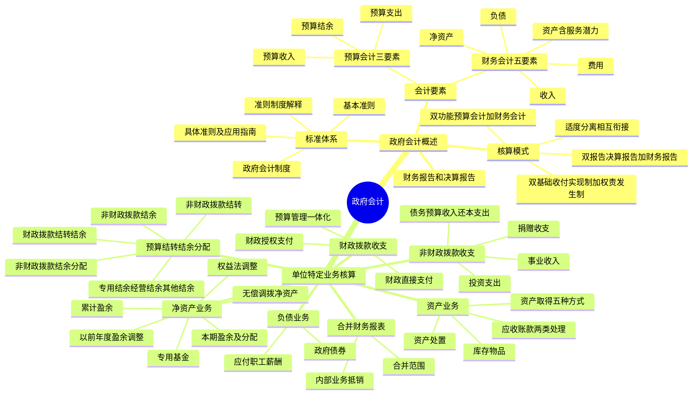

## 1. 章节定位

| 项目 | 信息 |
|------|------|
| 所属科目 | 会计 |
| 难度等级 | 2 |
| 历年分值 | 2-4 分 |
| 建议学时 | 3-4 小时 |
| 知识关联章节 | 第1章 总论（会计要素）、第8章 负债（职工薪酬）、第10章 职工薪酬、第22章 金融工具（投资） |

## 2. 考情分析

本章是会计科目的次要章节，历年分值约 2-4 分，主要以客观题形式出现，偶有计算分析题。本章内容相对独立，与企业会计差异较大，需要建立"双体系"思维。

**命题规律**：本章考查以概念判断和分录辨析为主，主观题集中在财政拨款收支、预算结转结余、净资产等核心业务的账务处理。

**高频考点分布**：

1. **政府会计核算模式**：双功能（预算会计+财务会计）、双基础（收付实现制+权责发生制）、双报告（决算报告+财务报告），"适度分离并相互衔接"的内涵。
2. **政府会计要素**：预算会计三要素（预算收入、预算支出、预算结余）、财务会计五要素（资产、负债、净资产、收入、费用），资产的定义（含"服务潜力"概念）。
3. **单位会计核算一般原则**：纳入部门预算管理的现金收支业务同时进行财务会计和预算会计核算，"资金结存"科目的设置。
4. **财政拨款收支业务**：财政直接支付和财政授权支付的账务处理，年末指标与实际支出差额的处理，"财政应返还额度"科目的运用。
5. **非财政拨款收支业务**：事业收入（财政专户返还方式、预收款方式、应收款方式）、捐赠收支、债务预算收入和债务还本支出、投资支出。
6. **预算结转结余及分配业务**：财政拨款结转结余（基本支出结转、项目支出结转）、非财政拨款结转、非财政拨款结余、专用结余、经营结余、其他结余、非财政拨款结余分配。
7. **净资产业务**：本期盈余及本年盈余分配、专用基金、无偿调拨净资产、权益法调整、以前年度盈余调整、累计盈余。
8. **资产业务**：资产取得方式（外购、自行建造、接受捐赠、无偿调入、置换换入）、资产处置、应收账款（收回后是否上缴财政的不同处理）、库存物品。
9. **部门（单位）合并财务报表**：合并范围、合并程序、内部业务抵销。

**联动考查方式**：
- 与企业会计对比：政府会计没有"利润"要素，净资产称为"累计盈余"等；
- 与预算管理结合：财政拨款收支、预算结转结余的核算；
- 与资产减值结合：事业单位对收回后不需上缴财政的应收账款计提坏账准备。

**备考建议**：
- 牢记"双功能、双基础、双报告"的核心框架；
- 理解"适度分离并相互衔接"——不是两套账，而是同一笔业务在财务会计和预算会计中分别反映；
- 区分财政拨款结转结余和非财政拨款结转结余的核算；
- 掌握财政直接支付和财政授权支付的账务处理差异；
- 注意"资金结存"科目是预算会计的"枢纽"科目。

## 3. 知识框架

## 4. 核心精讲

### 4.1 政府会计概述

#### 4.1.1 政府会计标准体系

我国的政府会计标准体系由政府会计准则（包括基本准则、具体准则及应用指南）、政府会计制度和政府会计准则制度解释等组成。

**（1）政府会计准则**

- **基本准则**：用于规范政府会计目标、政府会计主体、政府会计信息质量要求、政府会计核算基础，以及政府会计要素定义、确认和计量原则、列报要求等原则事项。2015 年 10 月 23 日，财政部制定发布了《政府会计准则——基本准则》（财政部令第 78 号）。
- **具体准则**：依据基本准则制定，用于规范政府发生的经济业务或事项的会计处理原则。2016 年以来，财政部相继出台了存货、投资、固定资产、无形资产、公共基础设施、政府储备物资、会计调整、负债、财务报表编制和列报、文物资源等具体准则，以及相关会计准则应用指南。

**（2）政府会计制度**

政府会计制度依据基本准则、具体准则制定，主要规定政府会计科目的设置、应用及账务处理、报表体系及编制说明等。按照政府会计主体不同，政府会计制度主要由政府财政总会计制度和政府单位会计制度组成。

**（3）政府会计准则制度解释**

为了及时回应和解决政府会计准则制度执行中的问题，财政部还适时出台了政府会计准则制度解释。财政部自 2019 年以来印发了多项政府会计准则制度解释。

**政府会计主体的范围**：根据《基本准则》，政府会计主体主要包括各级政府、各部门、各单位。各级政府指各级政府财政总会计。各部门、各单位是指与本级政府财政部门直接或者间接发生预算拨款关系的国家机关、军队、政党组织、社会团体、事业单位和其他单位。军队、已纳入企业财务管理体系的单位和执行《民间非营利组织会计制度》的社会团体，其会计核算不适用政府会计准则制度。

#### 4.1.2 政府会计核算模式

政府会计由**预算会计**和**财务会计**构成。政府会计核算应当实现预算会计与财务会计**适度分离并相互衔接**，全面、清晰反映政府财务信息和预算执行信息。

**（一）"适度分离"——双功能、双基础、双报告**

| 要素 | 内容 |
|------|------|
| **双功能** | 政府会计应当实现预算会计和财务会计双重功能。预算会计准确完整反映政府预算收入、预算支出和预算结余等预算执行信息；财务会计全面准确反映政府的资产、负债、净资产、收入、费用等财务信息 |
| **双基础** | 预算会计实行**收付实现制**（国务院另有规定的，从其规定）；财务会计实行**权责发生制** |
| **双报告** | 政府会计主体应当编制决算报告和财务报告。政府决算报告的编制主要以收付实现制为基础，以预算会计核算生成的数据为准；政府财务报告的编制主要以权责发生制为基础，以财务会计核算生成的数据为准 |

**（二）"相互衔接"**

政府预算会计和财务会计"适度分离"，并不是要求政府会计主体分别建立预算会计和财务会计两套账，对同一笔经济业务或事项进行会计核算，而是要求政府预算会计要素和财务会计要素相互协调，决算报告和财务报告相互补充，共同反映政府会计主体的预算执行信息和财务信息。

#### 4.1.3 政府会计要素及其确认和计量

**（一）政府预算会计要素**

政府预算会计要素包括预算收入、预算支出与预算结余。

1. **预算收入**：政府会计主体在预算年度内依法取得并纳入预算管理的现金流入。预算收入一般在实际收到时予以确认，以实际收到的金额计量。
2. **预算支出**：政府会计主体在预算年度内依法发生并纳入预算管理的现金流出。预算支出一般在实际支付时予以确认，以实际支付的金额计量。
3. **预算结余**：政府会计主体预算年度内预算收入扣除预算支出后的资金余额，以及历年滚存的资金余额。预算结余包括结余资金和结转资金：
   - **结余资金**：年度预算执行终了，预算收入实际完成数扣除预算支出和结转资金后剩余的资金；
   - **结转资金**：预算安排项目的支出年终尚未执行完毕或者因故未执行，且下年需要按原用途继续使用的资金。

**（二）政府财务会计要素**

政府财务会计要素包括资产、负债、净资产、收入和费用。

1. **资产**：政府会计主体过去的经济业务或者事项形成的，由政府会计主体控制的，预期能够产生**服务潜力**或者带来**经济利益流入**的经济资源。
   - **服务潜力**是指政府会计主体利用资产提供公共产品和服务以履行政府职能的潜在能力；
   - **经济利益流入**表现为现金及现金等价物的流入，或者现金及现金等价物流出的减少。
   - 确认条件：一是与该经济资源相关的服务潜力很可能实现或者经济利益很可能流入；二是该经济资源的成本或者价值能够可靠地计量。
   - 计量属性：主要包括历史成本、重置成本、现值、公允价值和名义金额。一般应当采用历史成本；无法采用前四种计量属性的，采用名义金额（即人民币 1 元）计量。

2. **负债**：政府会计主体过去的经济业务或者事项形成的，预期会导致经济资源流出政府会计主体的**现时义务**。
   - 确认条件：一是履行该义务很可能导致含有服务潜力或者经济利益的经济资源流出；二是该义务的金额能够可靠地计量。
   - 计量属性：主要包括历史成本、现值和公允价值。一般应当采用历史成本。

3. **净资产**：政府会计主体资产扣除负债后的净额，其金额取决于资产和负债的计量。

4. **收入**：报告期内导致政府会计主体净资产增加的、含有服务潜力或者经济利益的经济资源的流入。
   - 确认条件：一是与收入相关的经济资源很可能流入；二是经济资源流入会导致资产增加或者负债减少；三是流入金额能够可靠地计量。

5. **费用**：报告期内导致政府会计主体净资产减少的、含有服务潜力或者经济利益的经济资源的流出。
   - 确认条件：一是与费用相关的经济资源很可能流出；二是经济资源流出会导致资产减少或者负债增加；三是流出金额能够可靠地计量。

#### 4.1.4 政府财务报告和决算报告

**（一）政府财务报告**

政府财务报告是反映政府会计主体某一特定日期的财务状况和某一会计期间的运行情况和现金流量等信息的文件。财务报表包括会计报表和附注。会计报表至少应当包括**资产负债表、收入费用表和现金流量表**。

政府财务报告主要分为**政府部门财务报告**和**政府综合财务报告**：政府部门编制部门财务报告，反映本部门的财务状况和运行情况；财政部门编制政府综合财务报告，反映政府整体的财务状况、运行情况和财政中长期可持续性。

**（二）政府决算报告**

政府决算报告是综合反映政府会计主体年度预算收支执行结果的文件。政府决算报告应当包括决算报表和其他应当在决算报告中反映的相关信息和资料。

### 4.2 政府单位特定业务的会计核算

#### 4.2.1 单位会计核算一般原则

单位财务会计通过资产、负债、净资产、收入、费用五个要素，全面反映单位财务状况、运行情况和现金流量情况。单位预算会计通过预算收入、预算支出和预算结余三个要素，全面反映单位预算收支执行情况。

**"资金结存"科目**：为了保证单位预算会计要素单独循环，在日常核算时，单位应当设置"资金结存"科目，核算纳入年度部门预算管理的资金的流入、流出、调整和滚存等情况。根据资金支付方式及资金形态，"资金结存"科目应设置"零余额账户用款额度""货币资金""财政应返还额度"三个明细科目。年末预算收支结转后，"资金结存"科目借方余额与预算结转结余科目贷方余额相等。

**双轨核算原则**：单位对于**纳入年度部门预算管理的现金收支业务**，在采用财务会计核算的同时应当进行预算会计核算；对于其他业务，仅需进行财务会计核算。年末结账前，单位应当对暂收暂付款项进行全面清理，并对于纳入本年度部门预算管理的暂收暂付款项进行预算会计处理，确认相关预算收支。

**"现金"的范围**：包括库存现金、银行存款、其他货币资金、零余额账户用款额度、财政应返还额度，以及通过财政直接支付方式支付的款项。对于单位受托代理的现金以及不纳入部门预算管理的暂收暂付款项（如应上缴、应转拨或应退回的资金），仅需要进行财务会计处理，不需要进行预算会计处理。

**费用科目设置**：行政单位不使用"单位管理费用"科目，其为实现其职能目标发生的各项费用均记入"业务活动费用"科目。事业单位应当同时使用"业务活动费用"和"单位管理费用"科目——业务部门开展专业业务活动及其辅助活动发生的各项费用记入"业务活动费用"科目，本级行政及后勤管理部门发生的各项费用以及由单位统一负担的费用记入"单位管理费用"科目。

#### 4.2.2 财政拨款收支业务

财政拨款收支业务是绝大多数单位的主要业务。实行国库集中支付的单位，财政资金的支付方式包括**财政直接支付**和**财政授权支付**。单位核算国库集中支付业务，应当在进行预算会计核算的同时进行财务会计核算。

**（一）财政直接支付业务**

在财政直接支付方式下：

1. **单位收到"财政直接支付入账通知书"时**：
   - 预算会计：借记"行政支出""事业支出"等科目，贷记"财政拨款预算收入"科目；
   - 财务会计：借记"库存物品""固定资产""应付职工薪酬""业务活动费用""单位管理费用"等科目，贷记"财政拨款收入"科目。

2. **年末，根据本年度财政直接支付预算指标数与当年财政直接支付实际支出数的差额**：
   - 预算会计：借记"资金结存——财政应返还额度"科目，贷记"财政拨款预算收入"科目；
   - 财务会计：借记"财政应返还额度"科目，贷记"财政拨款收入"科目。

3. **下年度恢复财政直接支付额度后，单位以财政直接支付方式发生实际支出时**：
   - 预算会计：借记"行政支出""事业支出"等科目，贷记"资金结存——财政应返还额度"科目；
   - 财务会计：借记"库存物品""固定资产""应付职工薪酬""业务活动费用""单位管理费用"等科目，贷记"财政应返还额度"科目。

**（二）财政授权支付业务**

在财政授权支付方式下：

1. **单位收到代理银行盖章的"授权支付到账通知书"时**：
   - 预算会计：借记"资金结存——零余额账户用款额度"科目，贷记"财政拨款预算收入"科目；
   - 财务会计：借记"零余额账户用款额度"科目，贷记"财政拨款收入"科目。

2. **按规定支用额度时**：
   - 预算会计：借记"行政支出""事业支出"等科目，贷记"资金结存——零余额账户用款额度"科目；
   - 财务会计：借记"库存物品""固定资产""应付职工薪酬""业务活动费用""单位管理费用"等科目，贷记"零余额账户用款额度"科目。

3. **年末注销额度**：
   - 预算会计：借记"资金结存——财政应返还额度"科目，贷记"资金结存——零余额账户用款额度"科目；
   - 财务会计：借记"财政应返还额度"科目，贷记"零余额账户用款额度"科目。

4. **年末，财政授权支付预算指标数大于零余额账户用款额度下达数（未下达的用款额度）**：
   - 预算会计：借记"资金结存——财政应返还额度"科目，贷记"财政拨款预算收入"科目；
   - 财务会计：借记"财政应返还额度"科目，贷记"财政拨款收入"科目。

5. **下年年初恢复额度时**：
   - 预算会计：借记"资金结存——零余额账户用款额度"科目，贷记"资金结存——财政应返还额度"科目；
   - 财务会计：借记"零余额账户用款额度"科目，贷记"财政应返还额度——财政授权支付"科目。

#### 4.2.3 非财政拨款收支业务

**（一）事业（预算）收入**

事业收入是指事业单位开展专业业务活动及其辅助活动实现的收入，不包括从同级政府财政部门取得的各类财政拨款。单位在预算会计中应当设置"事业预算收入"科目（收付实现制核算），在财务会计中应当设置"事业收入"科目（权责发生制核算）。

事业收入的确认方式：

1. **财政专户返还方式**：实现应上缴财政专户的事业收入时，借记"银行存款""应收账款"等科目，贷记"应缴财政款"科目；向财政专户上缴款项时，借记"应缴财政款"科目，贷记"银行存款"等科目；收到从财政专户返还的事业收入时，借记"银行存款"等科目，贷记"事业收入"科目，同时借记"资金结存——货币资金"科目，贷记"事业预算收入"科目。
2. **预收款方式**：实际收到预收款项时，借记"银行存款"等科目，贷记"预收账款"科目，同时借记"资金结存——货币资金"科目，贷记"事业预算收入"科目；以合同完成进度确认事业收入时，借记"预收账款"科目，贷记"事业收入"科目。
3. **应收款方式**：根据合同完成进度计算本期应收的款项，借记"应收账款"科目，贷记"事业收入"科目；实际收到款项时，借记"银行存款"等科目，贷记"应收账款"科目，同时借记"资金结存——货币资金"科目，贷记"事业预算收入"科目。
4. **其他方式**：按照实际收到的金额，借记"银行存款""库存现金"等科目，贷记"事业收入"科目，同时借记"资金结存——货币资金"科目，贷记"事业预算收入"科目。

**（二）捐赠（预算）收入和支出**

1. **捐赠收入**：单位接受捐赠的货币资金，按照实际收到的金额，借记"银行存款""库存现金"等科目，贷记"捐赠收入"科目，同时借记"资金结存——货币资金"科目，贷记"其他预算收入——捐赠预算收入"科目。单位接受捐赠的存货、固定资产等非现金资产，应当根据相关会计准则确定的初始入账成本，借记"库存物品""固定资产"等科目，按照发生的相关税费、运输费等，贷记"银行存款"等科目，按照其差额，贷记"捐赠收入"科目；同时在预算会计中，按照发生的相关税费、运输费等支出金额，借记"其他支出"科目，贷记"资金结存——货币资金"科目。

2. **捐赠支出**：单位对外捐赠现金资产的，借记"其他费用"科目，贷记"银行存款""库存现金"等科目，同时借记"其他支出"科目，贷记"资金结存——货币资金"科目。单位对外捐赠库存物品、固定资产等非现金资产的，应当将资产的账面价值转入"资产处置费用"科目；如未以货币资金支付相关费用，预算会计不作账务处理。

**（三）债务预算收入和债务还本支出**

事业单位借入各种短期借款、长期借款时，按照实际借入的金额，借记"资金结存——货币资金"科目，贷记"债务预算收入"科目，同时借记"银行存款"科目，贷记"短期借款""长期借款"科目。按期计提长期借款的利息时，借记"其他费用"或"在建工程"科目，贷记"应付利息"或"长期借款——应计利息"科目；实际支付利息时，借记"应付利息"科目，贷记"银行存款"等科目，同时借记"其他支出"等科目，贷记"资金结存——货币资金"科目。偿还借款本金时，借记"债务还本支出"科目，贷记"资金结存——货币资金"科目，同时借记"短期借款""长期借款"科目，贷记"银行存款"科目。

**（四）投资支出**

事业单位以货币资金对外投资时，按照投资金额和所支付的相关税费金额的合计数，借记"投资支出"科目，贷记"资金结存——货币资金"科目，同时借记"短期投资""长期股权投资""长期债券投资"等科目，贷记"银行存款"等科目。

**注意**：单位按规定出资成立非营利法人单位（如事业单位、社会团体、基金会等），不应按照投资业务进行会计处理，在出资时应当按照出资金额，借记"其他费用"科目，贷记"银行存款"等科目，同时借记"其他支出"科目，贷记"资金结存"科目。

#### 4.2.4 预算结转结余及分配业务

单位应当严格区分**财政拨款结转结余**和**非财政拨款结转结余**。财政拨款结转结余不参与事业单位的结余分配，单独设置"财政拨款结转"和"财政拨款结余"科目核算。非财政拨款结转结余通过设置"非财政拨款结转""非财政拨款结余""专用结余""经营结余""非财政拨款结余分配"等科目核算。

**（一）财政拨款结转结余的核算**

1. **财政拨款结转**：单位应当在预算会计中设置"财政拨款结转"科目，核算滚存的财政拨款结转资金。年末，将财政拨款收入和对应的财政拨款支出结转入"财政拨款结转"科目——借记"财政拨款预算收入"科目，贷记"财政拨款结转——本年收支结转"科目；借记"财政拨款结转——本年收支结转"科目，贷记各项支出（财政拨款支出）科目。年末完成财政拨款收支结转后，对财政拨款各明细项目执行情况进行分析，按照有关规定将符合财政拨款结余性质的项目余额转入财政拨款结余。

2. **财政拨款结余**：单位在预算会计中应当设置"财政拨款结余"科目，核算单位滚存的财政拨款项目支出结余资金。年末，对财政拨款结转各明细项目执行情况进行分析，按照有关规定将符合财政拨款结余性质的项目余额转入财政拨款结余，借记"财政拨款结转——累计结转"科目，贷记"财政拨款结余——结转转入"科目。

**（二）非财政拨款结转的核算**

非财政拨款结转资金是指单位除财政拨款收支、经营收支以外的各非同级财政拨款专项资金收入与其相关支出相抵后剩余滚存的、须按规定用途使用的结转资金。年末，将事业预算收入、上级补助预算收入、附属单位上缴预算收入、非同级财政拨款预算收入、债务预算收入、其他预算收入本年发生额中的专项资金收入转入"非财政拨款结转"科目；将行政支出、事业支出、其他支出本年发生额中的非财政拨款专项资金支出转入"非财政拨款结转"科目。年末完成结转后，对非财政拨款专项结转资金各项目情况进行分析，将留归本单位使用的非财政拨款专项（项目已完成）剩余资金转入非财政拨款结余。

**（三）非财政拨款结余的核算**

非财政拨款结余指单位历年滚存的非限定用途的非同级财政拨款结余资金。年末，将留归本单位使用的非财政拨款专项（项目已完成）剩余资金转入"非财政拨款结余"科目。年末，事业单位将"非财政拨款结余分配"科目余额转入非财政拨款结余；行政单位将"其他结余"科目余额转入非财政拨款结余。

**（四）专用结余、经营结余、其他结余及非财政拨款结余分配的核算**

1. **专用结余**：事业单位按照规定从非财政拨款结余中提取的具有专门用途的资金。从本年度非财政拨款结余或经营结余中提取专用基金的，借记"非财政拨款结余分配"科目，贷记"专用结余"科目，同时借记"本年盈余分配"科目，贷记"专用基金"科目。

2. **经营结余**：事业单位本年度经营活动收支相抵后余额弥补以前年度经营亏损后的余额。期末结转本期经营收支，年末如"经营结余"科目为贷方余额，将余额转入"非财政拨款结余分配"科目；如为借方余额，为经营亏损，**不予结转**。

3. **其他结余**：单位本年度除财政拨款收支、非同级财政专项资金收支和经营收支以外各项收支相抵后的余额。年末，行政单位将"其他结余"科目余额转入"非财政拨款结余——累计结余"科目；事业单位将"其他结余"科目余额转入"非财政拨款结余分配"科目。

4. **非财政拨款结余分配**：事业单位本年度非财政拨款结余分配的情况和结果。年末，将"其他结余"科目余额和"经营结余"科目贷方余额转入"非财政拨款结余分配"科目。根据有关规定提取专用基金的，借记"非财政拨款结余分配"科目，贷记"专用结余"科目，同时借记"本年盈余分配"科目，贷记"专用基金"科目。然后，将"非财政拨款结余分配"科目余额转入非财政拨款结余。

#### 4.2.5 净资产业务

单位财务会计中净资产的来源主要包括累计实现的盈余和无偿调拨的净资产。在日常核算中，单位应当在财务会计中设置"累计盈余""专用基金""无偿调拨净资产""权益法调整""本期盈余""本年盈余分配""以前年度盈余调整"等科目。

**（一）本期盈余及本年盈余分配**

1. **本期盈余**：反映单位本期各项收入、费用相抵后的余额。期末，将各类收入科目的本期发生额转入本期盈余；将各类费用科目本期发生额（不含使用从非财政拨款结余或经营结余中提取的专用基金形成的费用）转入本期盈余。年末，将"本期盈余"科目余额转入"本年盈余分配"科目。

2. **本年盈余分配**：年末，将"本期盈余"科目余额转入"本年盈余分配"科目。根据有关规定从本年度非财政拨款结余或经营结余中提取专用基金的，借记"本年盈余分配"科目，贷记"专用基金"科目。然后，将"本年盈余分配"科目余额转入"累计盈余"科目。

**（二）专用基金**

专用基金是指事业单位按照规定提取或设置的具有专门用途的净资产，主要包括职工福利基金、科技成果转换基金等。从本年度非财政拨款结余或经营结余中提取专用基金的，在财务会计"专用基金"科目核算的同时，还应在预算会计"专用结余"科目进行核算。

**（三）无偿调拨净资产**

按照行政事业单位资产管理相关规定，经批准政府单位之间可以无偿调拨资产。通常情况下，无偿调拨非现金资产不涉及资金业务，因此不需要进行预算会计核算（除非以现金支付相关费用等）。

- **无偿调入资产**：按照相关资产在调出方的账面价值加相关税费、运输费等确定的金额，借记"库存物品""固定资产"等科目，按照调入过程中发生的归属于调入方的相关费用，贷记"零余额账户用款额度""银行存款"等科目，按照其差额，贷记"无偿调拨净资产"科目。
- **无偿调出资产**：按照调出资产的账面余额或账面价值，借记"无偿调拨净资产"科目，按照相关资产已计提的累计折旧或累计摊销金额，借记"固定资产累计折旧"等科目，按照调出资产的账面余额，贷记相关资产科目。
- **年末**：将"无偿调拨净资产"科目余额转入累计盈余。

**（四）权益法调整**

"权益法调整"科目核算事业单位持有的长期股权投资采用权益法核算时，按照被投资单位除净损益和利润分配以外的所有者权益变动份额调整长期股权投资账面余额而计入净资产的金额。

**（五）以前年度盈余调整**

"以前年度盈余调整"科目核算单位本年度发生的调整以前年度盈余的事项，包括本年度发生的重要前期差错更正涉及调整以前年度盈余的事项。调整后，将"以前年度盈余调整"科目余额转入累计盈余。

**（六）累计盈余**

累计盈余反映单位历年实现的盈余扣除盈余分配后滚存的金额，以及因无偿调入调出资产产生的净资产变动额。年末，将"本年盈余分配"科目余额和"无偿调拨净资产"科目余额转入累计盈余。

#### 4.2.6 资产业务

**（一）资产业务的几个共性内容**

1. **资产取得**：单位资产取得的方式包括外购、自行加工或自行建造、接受捐赠、无偿调入、置换换入、租赁等。资产在取得时按照成本进行初始计量。

| 取得方式 | 成本确定 |
|------|------|
| 外购 | 购买价款 + 相关税费（不含可抵扣增值税进项税额）+ 使资产达到目前场所和状态或交付使用前所发生的归属于该项资产的其他费用 |
| 自行加工或自行建造 | 该项资产至验收入库或交付使用前所发生的全部必要支出 |
| 接受捐赠 | 凭据注明金额 / 评估价值 / 同类或类似资产市场价格 + 相关税费；均无法可靠取得的，按名义金额（人民币 1 元）入账（投资、政府储备物资、保障性住房等经管资产不能采用名义金额计量） |
| 无偿调入 | 调出方账面价值 + 相关税费；调出方账面价值为零或账面余额为名义金额的，相关税费计入当期费用 |
| 置换换入 | 换出资产的评估价值 + 支付的补价（或−收到的补价）+ 为换入资产发生的其他相关支出 |

2. **资产处置**：资产处置的形式包括无偿调拨、出售、出让、转让、置换、对外捐赠、报废、毁损以及货币性资产损失核销等。通常情况下，单位应当将被处置资产账面价值转销计入资产处置费用，并按照"收支两条线"将处置净收益上缴财政。对于无偿调出的资产，单位应当在转销被处置资产账面价值时冲减无偿调拨净资产。

**（二）应收账款**

单位的应收账款是指单位因出租资产、出售物资等应收取的款项以及事业单位提供服务、销售产品等应收取的款项。单位应视应收账款收回后是否需要上缴财政进行不同的会计处理。

| 类型 | 发生时 | 收回时 | 减值处理 |
|------|------|------|------|
| 收回后不需上缴财政 | 借记"应收账款"，贷记"事业收入"等 | 借记"银行存款"，贷记"应收账款"；同时借记"资金结存——货币资金"，贷记"事业预算收入"等 | 年末全面检查，计提坏账准备，借记"其他费用"，贷记"坏账准备" |
| 收回后需上缴财政 | 借记"应收账款"，贷记"应缴财政款" | 借记"银行存款"，贷记"应收账款"；上缴时借记"应缴财政款"，贷记"银行存款" | 不计提坏账准备；账龄超过规定年限确认无法收回的，报经批准后核销 |

**注意**：我国政府会计核算中除了对事业单位收回后不需上缴财政的应收账款和其他应收款进行减值处理外，对于其他资产均未考虑减值。

**（三）库存物品**

库存物品是指单位在开展业务活动及其他活动中为耗用或出售而储存的各种材料、产品、包装物、低值易耗品，以及达不到固定资产标准的用具、装具、动植物等的成本。

**核算范围区分**：单位控制的政府储备物资，应当通过"政府储备物资"科目核算；单位受托存储保管的物资和受托转赠的物资，应当通过"受托代理资产"科目核算；单位为在建工程购买和使用的材料物资，应当通过"工程物资"科目核算——以上均不通过"库存物品"科目核算。

### 4.3 部门（单位）合并财务报表

部门（单位）合并财务报表，是指以政府部门（单位）本级作为合并主体，将部门（单位）本级及其合并范围内全部被合并主体的财务报表进行合并后形成的，反映部门（单位）整体财务状况与运行情况的财务报表。

**（一）合并范围**

部门（单位）合并财务报表的合并范围一般应当以**财政预算拨款关系**为基础予以确定。有下级预算单位的部门（单位）为合并主体，其下级预算单位为被合并主体。

**纳入合并范围**的会计主体：纳入本部门预决算管理的行政事业单位和社会组织；部门（单位）所属的未纳入部门预决算管理的事业单位；部门（单位）所属的纳入企业财务管理体系执行企业类会计准则制度的事业单位；财政部规定的其他会计主体。

**不纳入合并范围**的会计主体：部门（单位）所属的企业，以及所属企业下属的事业单位；与行政机关脱钩的行业协会商会；部门（单位）财务部门按规定单独建账核算的会计主体（如工会经费、党费、团费和土地储备资金、住房公积金等资金（基金）会计主体）；挂靠部门（单位）的没有财政预算拨款关系的社会组织以及非法人性质的学术团体、研究会等。

**（二）合并程序**

编制部门（单位）合并资产负债表时，需要抵销的内部业务或事项包括部门（单位）本级和其被合并主体之间、被合并主体相互之间的债权（含应收款项坏账准备）、债务项目，以及其他业务或事项对部门（单位）合并资产负债表的影响。编制部门（单位）合并收入费用表时，需要抵销部门（单位）本级和其被合并主体之间、被合并主体相互之间的收入、费用项目。

## 5. 典型例题

**【例题 1】（财政直接支付业务）**

2×22 年 10 月 9 日，某事业单位根据经过批准的部门预算和用款计划，向同级财政部门申请支付第三季度水费 105 000 元。10 月 18 日，财政部门经审核后，以财政直接支付方式向自来水公司支付了该单位的水费 105 000 元。10 月 23 日，该事业单位收到了"财政直接支付入账通知书"。

要求：编制该事业单位的账务处理。

**答案**：

收到"财政直接支付入账通知书"时：

预算会计：

借：事业支出 105 000

　　贷：财政拨款预算收入 105 000

同时，财务会计：

借：单位管理费用 105 000

　　贷：财政拨款收入 105 000

**解析**：财政直接支付方式下，单位收到"财政直接支付入账通知书"时，应同时进行预算会计和财务会计核算。预算会计确认预算支出和财政拨款预算收入，财务会计确认费用和财政拨款收入。

**【例题 2】（财政授权支付业务——年末注销与下年恢复）**

2×21 年 12 月 31 日，某事业单位经与代理银行提供的对账单核对无误后，将 150 000 元零余额账户用款额度予以注销。另外，本年度财政授权支付预算指标数大于零余额账户用款额度下达数，未下达的用款额度为 200 000 元。2×22 年度，该单位收到代理银行提供的额度恢复到账通知书及财政部门批复的上年末未下达零余额账户用款额度。

要求：编制该事业单位年末注销、补记指标、下年恢复及收到未下达额度的账务处理。

**答案**：

（1）注销额度：

预算会计：借：资金结存——财政应返还额度 150 000　贷：资金结存——零余额账户用款额度 150 000

财务会计：借：财政应返还额度——财政授权支付 150 000　贷：零余额账户用款额度 150 000

（2）补记指标数：

预算会计：借：资金结存——财政应返还额度 200 000　贷：财政拨款预算收入 200 000

财务会计：借：财政应返还额度——财政授权支付 200 000　贷：财政拨款收入 200 000

（3）恢复额度：

预算会计：借：资金结存——零余额账户用款额度 150 000　贷：资金结存——财政应返还额度 150 000

财务会计：借：零余额账户用款额度 150 000　贷：财政应返还额度——财政授权支付 150 000

（4）收到财政部门批复的上年末未下达的额度：

预算会计：借：资金结存——零余额账户用款额度 200 000　贷：资金结存——财政应返还额度 200 000

财务会计：借：零余额账户用款额度 200 000　贷：财政应返还额度——财政授权支付 200 000

**解析**：财政授权支付业务的年末处理包括两部分——注销已下达但未使用的额度，以及补记未下达的用款额度。下年恢复时，将注销的额度和批复的上年末未下达额度分别恢复为零余额账户用款额度。预算会计和财务会计需平行记账。

**【例题 3】（接受捐赠非现金资产）**

2×22 年 3 月 12 日，某事业单位接受甲公司捐赠的一批实验材料，甲公司所提供的凭据表明其价值为 100 000 元，该事业单位以银行存款支付了运输费 1 000 元。假设不考虑相关税费。

要求：编制该事业单位的账务处理。

**答案**：

财务会计：

借：库存物品 101 000

　　贷：捐赠收入 100 000

　　　　银行存款 1 000

同时，预算会计：

借：其他支出 1 000

　　贷：资金结存——货币资金 1 000

**解析**：接受捐赠的非现金资产，按确定的成本（凭据金额 100 000 + 运输费 1 000 = 101 000）借记"库存物品"科目，按发生的相关税费运输费等贷记"银行存款"科目，按差额贷记"捐赠收入"科目。由于支付运输费涉及现金流出且纳入预算管理，需同时进行预算会计核算，确认其他支出。

**【例题 4】（无偿调拨净资产——调入资产）**

2×22 年 5 月 5 日，某行政单位接受其他部门无偿调入物资一批，该批物资在调出方的账面价值为 20 000 元，经验收合格后入库。物资调入过程中该单位以银行存款支付了运输费 1 000 元。不考虑相关税费。

要求：编制该行政单位的账务处理。

**答案**：

财务会计：

借：库存物品 21 000

　　贷：银行存款 1 000

　　　　无偿调拨净资产 20 000

同时，预算会计：

借：其他支出 1 000

　　贷：资金结存——货币资金 1 000

**解析**：无偿调入非现金资产，按调出方账面价值（20 000）加相关税费运输费（1 000）确定的金额借记"库存物品"科目，按调入过程中发生的相关费用贷记"银行存款"科目，按差额（20 000）贷记"无偿调拨净资产"科目。因支付运输费涉及现金流出，需同时进行预算会计核算。年末"无偿调拨净资产"科目余额转入"累计盈余"科目。

**【例题 5】（预算结转结余——非财政拨款结转）**

2×22 年 1 月，某事业单位启动一项科研项目。当年收到上级主管部门拨付的非财政专项资金 5 000 000 元，为该项目发生事业支出 4 800 000 元。2×22 年 12 月，项目结项，经上级主管部门批准，该项目的结余资金留归事业单位使用。

要求：编制该事业单位相关账务处理。

**答案**：

（1）收到上级主管部门拨付款项时：

财务会计：借：银行存款 5 000 000　贷：上级补助收入 5 000 000

预算会计：借：资金结存——货币资金 5 000 000　贷：上级补助预算收入 5 000 000

（2）发生业务活动费用（事业支出）时：

财务会计：借：业务活动费用 4 800 000　贷：银行存款 4 800 000

预算会计：借：事业支出 4 800 000　贷：资金结存——货币资金 4 800 000

（3）年末结转上级补助预算收入中该科研专项资金收入：

预算会计：借：上级补助预算收入 5 000 000　贷：非财政拨款结转——本年收支结转 5 000 000

（4）年末结转事业支出中该科研专项支出：

预算会计：借：非财政拨款结转——本年收支结转 4 800 000　贷：事业支出——非财政专项资金支出 4 800 000

（5）经批准确定结余资金留归本单位使用时：

预算会计：借：非财政拨款结转——累计结转 200 000　贷：非财政拨款结余——结转转入 200 000

**解析**：非财政拨款结转的核算关键是区分专项资金和非专项资金。专项资金收入和支出年末转入"非财政拨款结转"科目，项目完成后留归本单位使用的剩余资金转入"非财政拨款结余"科目。本例中结余 = 5 000 000 − 4 800 000 = 200 000 元。

**【例题 6】（经营结余与其他结余的年末分配）**

2×22 年年终结账时，某事业单位当年经营结余的贷方余额为 30 000 元，其他结余的贷方余额为 40 000 元。该事业单位按照有关规定提取职工福利基金 10 000 元。

要求：编制该事业单位年末结余分配的账务处理。

**答案**：

（1）结转其他结余：

预算会计：借：其他结余 40 000　贷：非财政拨款结余分配 40 000

（2）结转经营结余：

预算会计：借：经营结余 30 000　贷：非财政拨款结余分配 30 000

（3）提取专用基金：

预算会计：借：非财政拨款结余分配 10 000　贷：专用结余——职工福利基金 10 000

同时，财务会计：借：本年盈余分配 10 000　贷：专用基金——职工福利基金 10 000

（4）将"非财政拨款结余分配"的余额转入非财政拨款结余：

预算会计：借：非财政拨款结余分配 60 000　贷：非财政拨款结余 60 000

**解析**：事业单位年末结余分配的顺序：①将"其他结余"科目余额和"经营结余"科目贷方余额转入"非财政拨款结余分配"科目；②根据规定提取专用基金（同时进行预算会计和财务会计处理）；③将"非财政拨款结余分配"科目余额转入非财政拨款结余。注意经营结余如为借方余额（经营亏损），不予结转。

## 6. 记忆口诀

**政府会计核算模式**："双功能双基础双报告"——预算会计+财务会计；收付实现制+权责发生制；决算报告+财务报告。

**适度分离相互衔接**："不是两套账，是同一笔业务双轨核算"——预算会计和财务会计要素相互协调，决算报告和财务报告相互补充。

**预算会计三要素**："预算收入预算支出预算结余"——实际收到/支付时确认，以实际金额计量。

**财务会计五要素**："资产负债净资产收入费用"——与企业会计相比，没有"利润"要素，多了"服务潜力"概念。

**资产定义关键**："服务潜力或经济利益流入"——政府会计资产除经济利益外，还包括提供服务潜力。

**资金结存三明细**："零余额账户货币资金财政应返还"——预算会计的枢纽科目，反映纳入部门预算管理的资金。

**双轨核算原则**："纳入预算的现金收支双轨核算，其他业务只做财务会计"——纳入年度部门预算管理的现金收支业务同时进行财务会计和预算会计核算。

**财政直接支付**："收到入账通知书确认收入，年末差额记返还额度"——借记支出贷记财政拨款预算收入，年末差额借记资金结存——财政应返还额度。

**财政授权支付**："收到到账通知书确认额度，支用额度记支出"——借记资金结存——零余额账户用款额度，贷记财政拨款预算收入。

**事业收入四种方式**："财政专户返还预收款应收款其他方式"——财政专户返还方式上缴后才确认预算收入。

**捐赠收支**："现金捐赠双轨核算，非现金捐赠只做财务会计"——接受捐赠非现金资产时，相关税费运输费在预算会计确认其他支出。

**预算结转结余两类**："财政拨款不参与分配，非财政拨款参与分配"——财政拨款结转结余单独核算；非财政拨款结转结余通过结余分配处理。

**财政拨款结转 vs 结余**："项目未完成是结转，项目完成剩余是结余"——结转资金下年继续使用，结余资金按规定处理。

**非财政拨款结转结余**："专项资金是结转，非专项是结余"——专项资金收支相抵后剩余滚存为结转，项目完成后留归本单位转入结余。

**经营结余**："贷方余额转入分配，借方余额经营亏损不结转"——经营亏损不予结转。

**净资产科目六类**："累计盈余专用基金无偿调拨权益法调整本期盈余以前年度调整"——净资产来源包括累计盈余和无偿调拨净资产。

**无偿调拨净资产**："调入贷记无偿调拨，调出借记无偿调拨，年末转入累计盈余"——政府单位之间无偿调拨资产引起的净资产变动。

**应收账款两类**："收回不需上缴财政计提坏账，收回需上缴财政不计提"——事业单位对收回后不需上缴财政的应收账款计提坏账准备。

**资产取得五方式**："外购自建接受捐赠无偿调入置换换入"——按成本初始计量，接受捐赠无法确定成本用名义金额。

**合并范围基础**："财政预算拨款关系为基础"——有下级预算单位的为合并主体，下级预算单位为被合并主体。
