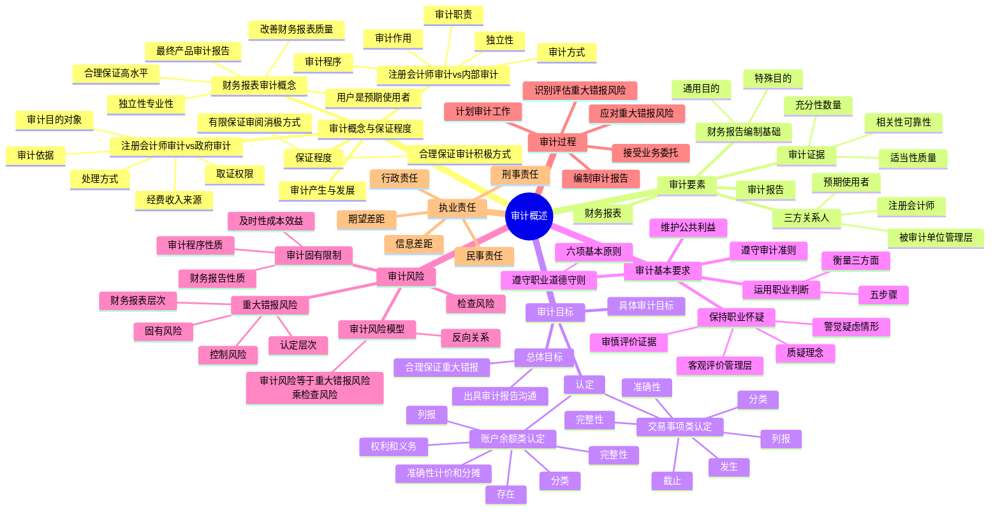

## 1. 章节定位

| 项目 | 信息 |
|------|------|
| 所属科目 | 审计 |
| 难度等级 | 3 |
| 历年分值 | 5-8 分 |
| 建议学时 | 8-10 小时 |
| 知识关联章节 | 第2章 职业道德基本原则、第3章 独立性要求、第6章 审计计划、第7章 风险评估、第8章 风险应对、第19章 完成审计工作、第20章 审计报告 |

## 2. 考情分析

本章是审计科目的入门章节，历年分值约 5-8 分，以客观题为主，主观题中也可能涉及认定的运用、审计风险的判断等知识点。本章为后续章节奠定理论基础，许多概念在风险评估、风险应对、审计报告等章节都会反复运用。

**命题规律**：本章以概念辨析、对比判断为主，客观题集中在保证程度的区别、审计要素的识别、认定的归类、审计风险模型的运用等。命题人喜欢设置易混淆选项（如合理保证与有限保证、注册会计师审计与政府审计、固有风险与控制风险）。

**高频考点分布**：

1. **财务报表审计的概念与五个方面理解**：用户是预期使用者、目的是改善财务报表质量、合理保证是高水平保证、基础是独立性和专业性、最终产品是审计报告。
2. **合理保证与有限保证的区别**：目标、证据收集程序、所需证据数量、检查风险、财务报表可信性、提出结论方式（积极方式 vs 消极方式）。
3. **审计要素五项**：三方关系人、财务报表、财务报告编制基础、审计证据、审计报告；其中三方关系人（注册会计师、管理层、预期使用者）的识别是高频考点。
4. **认定的分类**：交易、事项及相关披露的认定（发生、完整性、准确性、截止、分类、列报）；期末账户余额及相关披露的认定（存在、权利和义务、完整性、准确性计价和分摊、分类、列报）。
5. **具体审计目标与认定的对应关系**：能够根据具体情境判断违反了哪项认定。
6. **审计风险模型**：审计风险 = 重大错报风险 × 检查风险；重大错报风险 = 固有风险 × 控制风险；检查风险与重大错报风险呈反向关系。
7. **审计的固有限制**：财务报告的性质、审计程序的性质、及时性与成本效益的权衡。
8. **职业怀疑与职业判断**：职业怀疑的四方面理解、职业判断的五步骤、衡量职业判断质量的三方面。
9. **注册会计师审计与政府审计、内部审计的区别**。

**联动考查方式**：
- 认定与第7章风险评估、第10-13章各业务循环审计结合考查；
- 审计风险模型与第6章审计计划、第8章风险应对结合考查；
- 职业怀疑与舞弊审计（第17章）结合考查。

**备考建议**：
- 牢记"合理保证 = 高水平保证 ≠ 绝对保证"，审计只能提供合理保证，不能提供绝对保证；
- 区分"积极方式"（认为...）与"消极方式"（没有注意到任何事项使我们相信...）；
- 认定的归类要分清"交易事项类"和"账户余额类"，注意"发生"对应"存在"、"准确性"对应"准确性计价和分摊"；
- 审计风险模型是反向关系：评估的重大错报风险越高，可接受的检查风险越低；
- 理解三方关系人中"管理层可能成为预期使用者之一，但不是唯一"。

## 3. 知识框架

## 4. 核心精讲

### 4.1 审计的产生与发展

现代公司制度成型于 19 世纪中期，注册会计师制度也产生于这一时期。注册会计师制度源于企业所有权和经营权的分离：所有者不再直接参与企业的日常经营管理，产生了对经营者（管理层）行为进行监督和控制的需要，由此产生了经营者定期通过财务报表向所有者报告财务状况和经营成果的需要。由于财务报表由管理层编制，其自身利益通常与企业的财务状况和经营成果挂钩，需要由独立的第三方——注册会计师对财务报表进行审计，出具客观、公正的审计报告。

我国注册会计师制度出现于 20 世纪初。中华人民共和国成立初期，随着对资本主义工商业社会主义改造的完成，建立起高度集中的计划经济体制，注册会计师制度一度中断。1980 年 12 月，我国开始重建注册会计师制度。经过 40 多年的发展，注册会计师在促进会计信息质量提高、维护市场经济秩序、推动企业改革等方面发挥了巨大作用。

### 4.2 财务报表审计的概念

**财务报表审计**是指注册会计师对财务报表是否不存在重大错报提供合理保证，以积极方式提出意见，增强除管理层之外的预期使用者对财务报表信赖的程度。

上述概念可以从以下五个方面理解：

1. **审计的用户是财务报表的预期使用者**，即审计可以用来有效满足财务报表预期使用者的需求。
2. **审计的目的是改善财务报表的质量**，增强除管理层之外的预期使用者对财务报表的信赖程度，即以合理保证的方式提高财务报表的可信度，而不涉及为如何利用信息提供建议。
3. **合理保证是一种高水平保证**。当注册会计师获取充分、适当的审计证据将审计风险降至可接受的低水平时，就获取了合理保证。由于审计存在固有限制，注册会计师得出审计结论和形成审计意见依据的大多数审计证据是说服性而非结论性的，因此审计只能提供合理保证，而不能提供绝对保证。
4. **审计的基础是注册会计师的独立性和专业性**。注册会计师执行审计业务时，不仅应当具备专业胜任能力，还应当独立于被审计单位。
5. **审计的最终产品是审计报告**。注册会计师针对财务报表是否在所有重大方面按照财务报告编制基础编制并实现公允反映发表审计意见，并以审计报告的形式予以传达。

### 4.3 保证程度

注册会计师执行的业务分为鉴证业务和相关服务两类。鉴证业务包括审计、审阅和其他鉴证业务；相关服务包括代编财务信息、对财务信息实施商定程序、税务咨询和管理咨询等。

鉴证业务的保证程度分为**合理保证**和**有限保证**。审计属于合理保证（高水平保证）的鉴证业务，注册会计师将审计业务风险降至审计业务环境下可接受的低水平，以此作为以积极方式提出审计意见的基础。审阅属于有限保证（低于审计业务的保证水平）的鉴证业务，注册会计师将审阅业务风险降至审阅业务环境下可接受的水平，以此作为以消极方式提出审阅结论的基础。

**合理保证与有限保证的区别**如下表：

| 项目 | 合理保证（审计） | 有限保证（审阅） |
|------|----------------|----------------|
| 目标 | 在可接受的低审计风险下，以积极方式对财务报表整体发表审计意见，提供高水平的保证 | 在可接受的审阅风险下，以消极方式对财务报表整体发表审阅意见，提供低于高水平的保证 |
| 证据收集程序 | 通过不断修正、系统化的执业过程，获取充分、适当的证据；程序包括检查记录或文件、检查有形资产、观察、询问、函证、重新计算、重新执行、分析程序等 | 通过不断修正、系统化的执业过程，获取充分、适当的证据；程序受到有意地限制，主要采用询问和分析程序获取证据 |
| 所需证据数量 | 较多 | 较少 |
| 检查风险 | 较低 | 较高 |
| 财务报表的可信性 | 较高 | 较低 |
| 提出结论的方式 | 积极方式："我们认为，ABC 公司财务报表在所有重大方面按照企业会计准则的规定编制，公允反映了..." | 消极方式："根据我们的审阅，我们没有注意到任何事项使我们相信，ABC 公司财务报表没有按照企业会计准则的规定编制..." |

### 4.4 注册会计师审计、政府审计与内部审计

#### 4.4.1 注册会计师审计与政府审计的区别

| 区别点 | 注册会计师审计 | 政府审计 |
|--------|--------------|--------|
| 审计目的和对象 | 对被审计单位财务报表或内部控制发表审计意见；对象是除政府审计对象以外的事项 | 监督财政收支或财务收支的真实、合法、效益；对象是国务院各部门和地方各级人民政府及其各部门的财政收支、国有金融机构和企业事业组织的财务收支等 |
| 审计依据 | 《注册会计师法》和注册会计师审计准则等 | 《审计法》和国家审计准则等 |
| 经费或收入来源 | 市场行为，有偿服务，费用由双方协商确定 | 行政行为，经费列入同级财政预算 |
| 取证权限 | 依赖企业及相关单位配合，无行政强制力 | 具有更大强制力，有关单位和个人应当支持、协助 |
| 对发现问题的处理方式 | 无行政强制力，只能出具非无保留意见、解除业务约定或向监管机构报告 | 可在职权范围内作出审计决定或向有关主管机关提出处理、处罚意见 |

#### 4.4.2 注册会计师审计与内部审计的区别

| 区别点 | 注册会计师审计 | 内部审计 |
|--------|--------------|--------|
| 审计独立性 | 由独立于被审计单位的第三方进行，较强独立性 | 受所在单位直接领导，独立性受限 |
| 审计方式 | 接受委托进行 | 单位根据自身经营管理需要安排 |
| 审计程序 | 严格按照执业准则规定程序进行 | 可根据业务目的和需要选择程序 |
| 审计职责 | 对被审计单位和社会负责 | 只对本单位负责 |
| 审计作用 | 起鉴证作用，阅读对象不限于被审计单位 | 结论作为本单位改善工作的参考，对外不起鉴证作用 |

**联系**：注册会计师在执行业务时可以利用被审计单位的内部审计工作，内部审计应当做好与注册会计师审计的沟通和合作等协调工作，以提高审计效率和效果。

### 4.5 审计要素

注册会计师通过收集充分、适当的证据来评价财务报表编制是否在所有重大方面符合适用的财务报告编制基础，并出具审计报告，从而提高财务报表的可信性。审计业务要素包括：审计业务的三方关系人、财务报表、财务报告编制基础、审计证据和审计报告。

#### 4.5.1 审计业务的三方关系人

三方关系人分别是**注册会计师**、**被审计单位管理层（责任方）**和**财务报表预期使用者**。注册会计师对由被审计单位管理层负责的财务报表发表审计意见，以增强除管理层之外的预期使用者对财务报表的信赖程度。是否存在三方关系是判断某项业务是否属于审计业务的重要标准之一。

**（1）注册会计师**

注册会计师是指取得注册会计师证书并在会计师事务所执业的人员，通常是指项目合伙人或项目组其他成员，有时也指其所在的会计师事务所。对财务报表发表审计意见是注册会计师的责任。注册会计师应当遵守相关职业道德要求，按照审计准则的规定计划和实施审计工作，获取充分、适当的审计证据，并根据获取的审计证据得出合理的审计结论，发表恰当的审计意见。注册会计师通过签署审计报告确认其责任。

如果审计业务涉及的特殊知识和技能超出了注册会计师的能力，可以利用专家协助执行审计业务，但应当确信包括专家在内的项目组整体已具备执行该项审计业务所需的知识和技能。

**（2）被审计单位管理层（责任方）**

管理层是指对被审计单位经营活动的执行负有经营管理责任的人员，对财务报表编制负责。治理层是指对被审计单位战略方向以及管理层履行经营管理责任负有监督责任的人员或组织，其责任包括监督财务报告的产生过程。

**执行审计工作的前提**是指管理层和治理层（如适用）认可并理解其应当承担下列责任，这些责任构成注册会计师按照审计准则的规定执行审计工作的基础：
1. 按照适用的财务报告编制基础编制财务报表，并使其实现公允反映；
2. 设计、执行和维护必要的内部控制，以使财务报表不存在舞弊或错误导致的重大错报；
3. 向注册会计师提供必要的工作条件，包括允许注册会计师接触与编制财务报表相关的所有信息，提供审计所需的其他信息，允许注册会计师在获取审计证据时不受限制地接触其认为必要的内部人员和其他相关人员。

**重要原则**：财务报表审计并不能减轻管理层或治理层的责任。财务报表编制和财务报表审计是财务信息生成链条上的不同环节，两者各司其职。即使注册会计师在审计过程中向管理层提出调整建议，甚至在不违反独立性的前提下为管理层编制财务报表提供某些咨询或协助，管理层仍然对编制财务报表承担完全责任。如果财务报表存在重大错报而注册会计师通过审计没有能够发现，也不能因为财务报表已经被审计这一事实而减轻管理层和治理层对财务报表的责任。

**（3）预期使用者**

预期使用者是指预期使用审计报告和财务报表的组织或人员。如果审计业务服务于特定的使用者或具有特殊目的，注册会计师可以很容易地识别预期使用者（如银行要求企业提供经审计的财务报表，银行就是预期使用者）。

一般情况下，注册会计师可能无法识别预期使用审计报告的所有组织和人员。此时，预期使用者主要是指那些与财务报表有重要和共同利益的主要利益相关者。例如，在上市公司财务报表审计中，预期使用者主要是指上市公司的股东。

**关键理解**：管理层可能成为预期使用者之一，但不是唯一的预期使用者。例如，管理层是审计报告的预期使用者之一，但同时预期使用者还包括企业的股东、债权人、监管机构等。

#### 4.5.2 财务报表

在财务报表审计中，审计对象是历史的财务状况、经营成果（财务业绩）和现金流量，审计对象信息（即审计对象的载体）是财务报表。

**财务报表**是指依据某一财务报告编制基础对被审计单位历史财务信息作出的结构性表述，旨在反映某一时点的经济资源或义务或者某一时期经济资源或义务的变化。财务报表通常是指整套财务报表，有时也指单一财务报表。披露是财务报表不可分割的组成部分，主要在财务报表附注中反映。

整套财务报表通常包括资产负债表、利润表、现金流量表、所有者权益（或股东权益）变动表和相关附注。

财务报表可以按照某一财务报告编制基础编制，旨在满足下列需求之一：
1. 广大财务报表使用者共同的财务信息需求（即通用目的财务报表的目标）；
2. 财务报表特定使用者的财务信息需求（即特殊目的财务报表的目标）。

#### 4.5.3 财务报告编制基础

**适用的财务报告编制基础**是指法律法规要求采用的财务报告编制基础；或者管理层和治理层（如适用）在编制财务报表时，针对被审计单位性质和财务报表目标，采用的可接受的财务报告编制基础。

财务报告编制基础分为：
- **通用目的编制基础**：旨在满足广大财务报表使用者共同的财务信息需求，在我国主要是指企业会计准则和相关会计制度。
- **特殊目的编制基础**：旨在满足财务报表特定使用者对财务信息需求，包括计税核算基础、监管机构的报告要求和合同的约定等。

#### 4.5.4 审计证据

**审计证据**是指注册会计师为了得出审计结论和形成审计意见而使用的必要信息。审计证据在性质上具有累积性，主要是在审计过程中通过实施审计程序获取的，还可能包括从其他来源获取的信息（如以前审计中获取的信息，或会计师事务所接受与保持客户或业务时实施质量管理程序获取的信息）。审计证据既包括支持和佐证管理层认定的信息，也包括与这些认定相矛盾的信息。在某些情况下，信息的缺乏（如管理层拒绝提供注册会计师要求的声明）本身也构成审计证据。

审计证据的**充分性**和**适当性**相互关联：

| 特征 | 含义 | 影响因素 |
|------|------|---------|
| 充分性 | 对审计证据数量的衡量 | 受重大错报风险评估影响（评估风险越高，需要的证据越多）；受审计证据质量影响（质量越高，需要的证据越少） |
| 适当性 | 对审计证据质量的衡量，即相关性和可靠性 | 相关性受获取证据与审计目的的关系影响；可靠性受证据来源和性质影响，取决于获取证据的具体环境 |

**重要原则**：注册会计师仅靠获取更多的审计证据可能无法弥补其质量上的缺陷。注册会计师可以考虑获取证据的成本与所获取信息有用性之间的关系，但不应仅以获取证据的困难和成本为由减少不可替代的程序。

#### 4.5.5 审计报告

注册会计师应当对财务报表在所有重大方面是否符合适用的财务报告编制基础，以书面报告的形式发表能够提供合理保证程度的意见。

- **无保留意见**：使用"财务报表在所有重大方面按照[适用的财务报告编制基础]编制，公允反映了..."的措辞。
- **非无保留意见**：存在下列情形之一时发表：(1) 根据获取的审计证据，得出财务报表整体存在重大错报的结论；(2) 无法获取充分、适当的审计证据，不能得出财务报表整体不存在重大错报的结论。

### 4.6 审计目标

审计目标分为审计总体目标和具体审计目标。

#### 4.6.1 审计总体目标

在执行财务报表审计工作时，注册会计师的总体目标是：
1. 对财务报表整体是否不存在舞弊或错误导致的重大错报获取合理保证，使得注册会计师能够对财务报表是否在所有重大方面按照适用的财务报告编制基础编制发表审计意见；
2. 按照审计准则的规定，根据审计结果对财务报表出具审计报告，并与管理层和治理层沟通。

在任何情况下，如果不能获取合理保证，并且在审计报告中发表保留意见也不足以实现向预期使用者报告的目的，注册会计师应当按照审计准则的规定出具无法表示意见的审计报告，或者在法律法规允许的情况下终止审计业务或解除业务约定。

#### 4.6.2 认定

**认定**是指管理层针对财务报表要素的确认、计量和列报（包括披露）作出一系列明确或暗含的意思表达。注册会计师在识别、评估和应对重大错报风险的过程中，将管理层的认定用于考虑可能发生的不同类型的错报。

管理层在财务报表上的认定有些是明确表达的，有些则是暗含的。例如，管理层在资产负债表中列报存货及其金额，意味着作出下列明确的认定：(1) 记录的存货是存在的；(2) 存货以恰当的金额包括在财务报表中，与之相关的计价或分摊调整已恰当记录。同时，管理层也作出下列暗含的认定：(1) 所有应当记录的存货均已记录；(2) 记录的存货都由被审计单位所有。

**（1）关于所审计期间各类交易、事项及相关披露的认定**

| 认定 | 含义 |
|------|------|
| 发生 | 记录或披露的交易和事项已发生，且这些交易和事项与被审计单位有关 |
| 完整性 | 所有应当记录的交易和事项均已记录，所有应当包括在财务报表中的相关披露均已包括 |
| 准确性 | 与交易和事项有关的金额及其他数据已恰当记录，相关披露已得到恰当计量和描述 |
| 截止 | 交易和事项已记录于正确的会计期间 |
| 分类 | 交易和事项已记录于恰当的账户 |
| 列报 | 交易和事项已被恰当地汇总或分解且表述清楚，相关披露在适用的财务报告编制基础下是相关的、可理解的 |

**（2）关于期末账户余额及相关披露的认定**

| 认定 | 含义 |
|------|------|
| 存在 | 记录的资产、负债和所有者权益是存在的 |
| 权利和义务 | 记录的资产由被审计单位拥有或控制，记录的负债是被审计单位应当履行的偿还义务 |
| 完整性 | 所有应当记录的资产、负债和所有者权益均已记录，所有应当包括在财务报表中的相关披露均已包括 |
| 准确性、计价和分摊 | 资产、负债和所有者权益以恰当的金额包括在财务报表中，与之相关的计价或分摊调整已恰当记录，相关披露已得到恰当计量和描述 |
| 分类 | 资产、负债和所有者权益已记录于恰当的账户 |
| 列报 | 资产、负债和所有者权益已被恰当地汇总或分解且表述清楚，相关披露在适用的财务报告编制基础下是相关的、可理解的 |

**两类认定的对应关系**：交易事项类的"发生"对应账户余额类的"存在"；交易事项类的"准确性"对应账户余额类的"准确性、计价和分摊"。发生针对高估（多记虚构），完整性针对低估（漏记）。

#### 4.6.3 具体审计目标

注册会计师了解认定后，就容易相对应地确定每个项目的具体审计目标，并以此作为识别和评估重大错报风险以及设计和实施应对措施的基础。

**与各类交易、事项及相关披露相关的审计目标**：

| 认定 | 审计目标 | 违反示例 |
|------|---------|---------|
| 发生 | 确认已记录的交易是真实的 | 没有发生销售交易，但在销售日记账中记录了一笔销售 |
| 完整性 | 确认已发生的交易确实已经记录 | 发生了销售交易，但没有在销售明细账和总账中记录 |
| 准确性 | 确认已记录的交易是按正确金额反映的 | 发出商品的数量与账单上的数量不符，或开账单时使用了错误的销售价格 |
| 截止 | 确认接近于资产负债表日的交易记录于恰当的期间 | 本期交易推到下期，或下期交易提到本期 |
| 分类 | 确认被审计单位记录的交易经过适当分类 | 将出售经营性固定资产所得的收入记录为营业收入 |
| 列报 | 确认交易和事项已被恰当地汇总或分解且表述清楚 | — |

**与期末账户余额及相关披露相关的审计目标**：

| 认定 | 审计目标 | 违反示例 |
|------|---------|---------|
| 存在 | 确认记录的金额确实存在 | 不存在某客户的应收账款，在应收账款明细表中却列入了对该客户的应收账款 |
| 权利和义务 | 确认资产归属于被审计单位，负债属于被审计单位的义务 | 将他人寄存商品列入被审计单位的存货中 |
| 完整性 | 确认已存在的金额均已记录 | 存在某客户的应收账款，而应收账款明细表中却没有列入 |
| 准确性、计价和分摊 | 资产、负债和所有者权益以恰当的金额包括在财务报表中 | 以净值记录应收款项而未恰当披露 |
| 分类 | 资产、负债和所有者权益已记录于恰当的账户 | — |
| 列报 | 资产、负债和所有者权益已被恰当地汇总或分解且表述清楚 | — |

**认定、审计目标和审计程序之间的关系举例**：

| 认定 | 审计目标 | 审计程序 |
|------|---------|---------|
| 存在 | 资产负债表列示的存货存在 | 实施存货监盘程序 |
| 完整性 | 销售收入包括了所有已发货的交易 | 检查发货单和销售发票的编号以及销售明细账 |
| 准确性 | 销售业务是否基于正确的价格和数量，计算是否准确 | 比较价格清单与发票上的价格、发货单与销售订单上的数量是否一致，重新计算发票上的金额 |
| 截止 | 销售业务记录在恰当的期间 | 比较上一年度最后几天和下一年度最初几天的发货单日期与记账日期 |
| 权利和义务 | 资产负债表中的固定资产确实为公司所有 | 查阅所有权证书、购货合同、结算单和保险单 |
| 准确性、计价和分摊 | 以净值记录应收款项 | 检查应收账款账龄分析表、评估计提的坏账准备是否充足 |

### 4.7 审计基本要求

#### 4.7.1 维护公共利益

注册会计师行业是国家财会监督体系的重要专业力量，注册会计师审计提供的是一种公共产品，维护公共利益是注册会计师行业的天职和初心使命。注册会计师是资本市场的"看门人"，投资者是注册会计师的真正委托人，维护公共利益是注册会计师行业的立身之本。

公共利益可以定义为那些可能依赖注册会计师工作的组织或人员的整体利益，包括投资者、债权人、政府机构、社会公众等其他可能依赖注册会计师提供的信息以作出相关决策的组织或人员。

#### 4.7.2 遵守审计准则

审计准则是衡量注册会计师执行财务报表审计业务的权威性标准，涵盖从接受业务委托到出具审计报告的整个过程。《注册会计师法》第二十一条规定，注册会计师执行审计业务，必须按照执业准则、规则确定的工作程序出具报告。

每项审计准则通常包括总则、定义、目标、要求（以"应当"表述）和附则。每项审计准则还配有应用指南，应用指南本身并不对注册会计师提出额外要求，但与恰当执行审计准则对注册会计师提出的要求是相关的。

#### 4.7.3 遵守职业道德守则

注册会计师受到与财务报表审计相关的职业道德要求（包括与独立性相关的要求）的约束。根据职业道德守则，注册会计师应当遵循的基本原则包括六项：

1. **诚信**；
2. **独立性**；
3. **客观公正**；
4. **专业胜任能力和勤勉尽责**；
5. **保密**；
6. **良好职业行为**。

独立性包括实质上的独立性和形式上的独立性。注册会计师独立于被审计单位，能够保护其形成适当审计意见的能力，使其在发表审计意见时免受不当影响。

#### 4.7.4 保持职业怀疑

**职业怀疑**是指注册会计师执行审计业务的一种态度，包括采取质疑的思维方式，对可能表明舞弊或错误导致错报的情况保持警觉，以及对审计证据进行审慎评价。职业怀疑应当从下列四方面理解：

1. **本质上要求秉持质疑的理念**：促使注册会计师在考虑获取的相关信息和得出结论时采取质疑的思维方式，摒弃"存在即合理"的逻辑思维，寻求事物的真实情况。职业怀疑与职业道德基本原则相互关联，保持独立性可以增强注册会计师在审计中保持职业怀疑的能力。
2. **要求对引起疑虑的情形保持警觉**：包括相互矛盾的审计证据；引起对文件记录、对询问的答复的可靠性产生怀疑的信息；表明可能存在舞弊的情况；表明需要实施除审计准则规定外的其他审计程序的情形。
3. **要求审慎评价审计证据**：质疑相互矛盾的审计证据的可靠性。在怀疑信息的可靠性或存在舞弊迹象时，注册会计师需要作出进一步调查，并确定需要修改哪些审计程序或实施哪些追加的审计程序。审计中的困难、时间或成本等事项本身，不能作为省略不可替代的审计程序或满足于说服力不足的审计证据的理由。
4. **要求客观评价管理层和治理层**：即使以前正直、诚信的管理层和治理层也可能发生变化。注册会计师不应依赖以往对管理层和治理层诚信形成的判断。即使认为管理层和治理层是正直、诚实的，也不能降低保持职业怀疑的要求。

**职业怀疑在审计过程中的作用**：
- 在识别和评估重大错报风险时，有助于设计恰当的风险评估程序，对引起疑虑的情形保持警觉；
- 在设计和实施进一步审计程序时，有助于恰当设计审计程序的性质、时间安排和范围，对可能存在未识别的重大错报风险的情形保持警觉；
- 在评价审计证据时，有助于评价是否已获取充分、适当的审计证据，纠正仅获取最容易获取的审计证据、忽视相互矛盾的审计证据的偏向。

#### 4.7.5 运用职业判断

**职业判断**是指在审计准则、财务报告编制基础和职业道德要求的框架下，注册会计师综合运用相关知识、技能和经验，作出适合审计业务具体情况、有根据的行动决策。职业判断是注册会计师执业的精髓。

职业判断对于作出下列决策尤为重要：(1) 确定重要性，识别和评估重大错报风险；(2) 确定所需实施的审计程序的性质、时间安排和范围；(3) 评价是否已获取充分、适当的审计证据；(4) 评价管理层在运用适用的财务报告编制基础时作出的判断；(5) 根据已获取的审计证据得出结论；(6) 运用职业道德概念框架识别、评估和应对影响职业道德基本原则的不利因素。

**职业判断的决策过程通常划分为五个步骤**：
1. 确定职业判断的问题和目标；
2. 收集和评价相关信息；
3. 识别可能采取的解决方案；
4. 评价可供选择的方案；
5. 得出职业判断结论并作出书面记录。

**衡量职业判断质量的三个方面**：
1. **准确性或意见一致性**：职业判断结论与特定标准或客观事实的相符程度，或者不同职业判断主体针对同一问题所作判断彼此认同的程度；
2. **决策一贯性和稳定性**：同一注册会计师针对同一项目的不同判断问题所作判断之间是否符合应有的内在逻辑，以及针对相同问题在不同时点所作判断是否结论相同或相似；
3. **可辩护性**：注册会计师是否能够证明自己的工作，理由的充分性、思维的逻辑性和程序的合规性是可辩护性的基础。

注册会计师需要对职业判断作出适当的书面记录，包括：对职业判断问题和目标的描述；解决职业判断相关问题的思路；收集到的相关信息；得出的结论以及得出结论的理由；就决策结论与被审计单位进行沟通的方式和时间。

### 4.8 审计风险

**审计风险**是指当财务报表存在重大错报时，注册会计师发表不恰当审计意见的可能性。审计风险是一个与审计过程相关的技术术语，并不是指注册会计师执行业务的法律后果。审计风险取决于重大错报风险和检查风险。

#### 4.8.1 重大错报风险

**重大错报风险**是指财务报表在审计前存在重大错报的可能性。重大错报风险与被审计单位的风险相关，且独立于财务报表审计而存在。

**（1）两个层次的重大错报风险**

| 层次 | 特征 | 影响 |
|------|------|------|
| 财务报表层次重大错报风险 | 与财务报表整体存在广泛联系，可能影响多项认定；通常与控制环境有关，也可能与经济景气度等其他因素有关 | 难以界定于某类交易、账户余额和披露的具体认定，但增大了认定层次发生重大错报的可能性；与注册会计师考虑舞弊引起的风险尤其相关 |
| 认定层次重大错报风险 | 各类交易、账户余额和披露认定层次的重大错报风险 | 直接有助于注册会计师确定认定层次上实施的进一步审计程序的性质、时间安排和范围 |

**（2）固有风险和控制风险**

认定层次的重大错报风险可以进一步细分为固有风险和控制风险：

> **重大错报风险 = 固有风险 × 控制风险**

- **固有风险**是指在不考虑控制的情况下，某类交易、账户余额或披露的某一认定易于发生错报（该错报单独或连同其他错报可能是重大的）的可能性。固有风险的高低受固有风险因素的影响，包括事项或情况的复杂性、主观性、变化、不确定性，以及管理层偏向和其他舞弊风险因素。例如，复杂的计算比简单计算更可能出错；受重大计量不确定性影响的会计估计发生错报的可能性较大。
- **控制风险**是指某类交易、账户余额或披露的某一认定发生错报，该错报单独或连同其他错报是重大的，但没有被内部控制及时防止或发现并纠正的可能性。控制风险取决于与财务报表编制有关的内部控制的设计和运行的有效性。由于控制的固有局限性，某种程度的控制风险始终存在。

**重要规定**：审计准则规定，对于识别出的认定层次重大错报风险，注册会计师应当分别评估固有风险和控制风险。

#### 4.8.2 检查风险

**检查风险**是指如果存在某一错报，该错报单独或连同其他错报可能是重大的，注册会计师为将审计风险降至可接受的低水平而实施程序后没有发现这种错报的风险。检查风险取决于审计程序设计的合理性和实施的有效性。

由于注册会计师通常并不对所有的交易、账户余额和披露进行检查，以及其他原因（如选择了不恰当的审计程序、审计过程执行不当，或者错误解读了审计结论），检查风险不可能降低为零。这些因素可以通过适当计划、在项目组成员之间进行恰当的职责分配、保持职业怀疑态度以及监督、指导和复核项目组成员执行的审计工作得以解决。

#### 4.8.3 审计风险模型与检查风险和重大错报风险的关系

在既定的审计风险水平下，注册会计师针对某一认定确定的可接受检查风险水平与注册会计师对认定层次重大错报风险的评估结果呈**反向关系**：评估的重大错报风险越高，可接受的检查风险越低；评估的重大错报风险越低，可接受的检查风险就越高。

> **审计风险 = 重大错报风险 × 检查风险**

举例：假设针对某一认定，注册会计师将可接受的审计风险水平设定为 5%，实施风险评估程序后将重大错报风险评估为 25%，则根据这一模型，可接受的检查风险为 20%。注册会计师根据确定的可接受检查风险（20%）设计审计程序的性质、时间安排和范围。

实务中，注册会计师不一定用绝对数量表达这些风险水平，而是选用"高""中""低"等文字进行定性描述。

#### 4.8.4 审计的固有限制

注册会计师不可能将审计风险降至零，因此不能对财务报表是否不存在舞弊或错误导致的重大错报获取绝对保证。审计的固有限制源于三个方面：

**（1）财务报告的性质**

管理层编制财务报表需要根据被审计单位的事实和情况运用适用的财务报告编制基础的规定，在这一过程中需要作出判断。许多财务报表项目涉及主观决策、评估或一定程度的不确定性，并且可能存在一系列可接受的解释或判断。因此，某些财务报表项目的金额本身就存在一定的变动幅度，这种变动幅度不能通过实施追加的审计程序来消除（如某些会计估计）。

**（2）审计程序的性质**

注册会计师获取审计证据的能力受到实务和法律上的限制：
- 管理层或其他人员可能有意或无意地不提供与财务报表编制相关的或注册会计师要求的全部信息，即使实施了旨在保证获取所有相关信息的审计程序，也不能保证信息的完整性；
- 舞弊可能涉及精心策划和蓄意实施以进行隐瞒（如串通伪造文件），用以收集审计证据的审计程序可能对于发现舞弊是无效的；
- 审计不是对行政执法部门涉嫌违法行为的专门调查，注册会计师没有被授予特定的法律权力（如搜查权）。

**（3）财务报告的及时性和成本效益的权衡**

信息的相关性及其价值会随着时间的推移而降低，所以需在信息的可靠性和成本之间进行权衡。为了在合理的时间内以合理的成本对财务报表形成审计意见，注册会计师有必要：(1) 计划审计工作，以使审计工作以有效的方式得到执行；(2) 将审计资源投向最可能存在重大错报风险的领域；(3) 运用测试和其他方法检查总体中存在的错报。

**重要原则**：审计中的困难、时间或成本等事项本身，不能作为注册会计师省略不可替代的审计程序或满足于说服力不足的审计证据的正当理由。即使按照审计准则的规定适当地计划和执行审计工作，也不可避免地存在财务报表的某些重大错报可能未被发现的风险。完成审计工作后发现舞弊或错误导致的财务报表重大错报，其本身并不表明注册会计师没有按照审计准则的规定执行审计工作。

### 4.9 审计过程

审计方法的创新经历了账项基础审计、制度基础审计到风险导向审计等阶段。风险导向审计模式要求注册会计师在审计过程中，以重大错报风险的识别、评估和应对作为工作主线。审计过程大致可分为以下五个阶段：

| 阶段 | 主要工作 | 详见章节 |
|------|---------|---------|
| 接受业务委托 | 实施客户接受与保持的程序，获取客户诚信、专业胜任能力、职业道德遵守情况等信息；与客户就审计约定条款达成一致意见 | 第6章 |
| 计划审计工作 | 开展初步业务活动；制定总体审计策略；制定具体审计计划 | 第6章 |
| 识别和评估重大错报风险 | 实施风险评估程序，了解被审计单位及其环境、适用的财务报告编制基础和内部控制体系各要素；识别和评估财务报表层次和认定层次的重大错报风险 | 第7章 |
| 应对重大错报风险 | 针对财务报表层次重大错报风险确定总体应对措施；针对认定层次重大错报风险设计和实施进一步审计程序（控制测试和实质性程序） | 第8章 |
| 编制审计报告 | 完成审计工作，根据所获取的审计证据形成审计意见，编制审计报告 | 第19、20章 |

**接受业务委托阶段**的考量因素：(1) 考虑客户的诚信，没有信息表明客户缺乏诚信；(2) 具有执行业务必要的素质、专业胜任能力、时间和资源；(3) 能够遵守相关职业道德要求。

### 4.10 注册会计师审计的执业责任

#### 4.10.1 执业责任的三种类型

**（1）行政责任**

根据《注册会计师法》的规定，会计师事务所违反法律法规、执业准则、规则等，将可能受到财政部门的行政处罚，包括警告、没收违法所得（可以并处罚款）；情节严重的，可以暂停其经营业务或者予以撤销。注册会计师违反法律法规、执业准则、规则等，将可能受到警告；情节严重的，可以暂停其执行业务或者吊销注册会计师证书。

根据《证券法》的规定，对于从事证券期货业务的会计师事务所未勤勉尽责，所制作、出具的文件有虚假记载、误导性陈述或者重大遗漏的，责令改正，没收业务收入，并处以业务收入 1 倍以上 10 倍以下的罚款；情节严重的，并处暂停或者禁止从事证券服务业务。对直接负责的主管人员和其他直接责任人员给予警告，并处以 20 万元以上 200 万元以下的罚款。

**（2）民事责任**

《注册会计师法》第四十二条规定，会计师事务所违反本法规定，给委托人、其他利害关系人造成损失的，应当依法承担赔偿责任。《证券法》第一百六十三条规定，证券服务机构制作、出具的文件有虚假记载、误导性陈述或者重大遗漏，给他人造成损失的，应当与委托人承担连带赔偿责任，但是能够证明自己没有过错的除外。

**（3）刑事责任**

《刑法》第二百二十九条规定，承担资产评估、验资、验证、会计、审计等职责的中介组织的人员故意提供虚假证明文件，情节严重的，处 5 年以下有期徒刑或者拘役，并处罚金；有下列情形之一的，处 5 年以上 10 年以下有期徒刑，并处罚金：(1) 提供与证券发行相关的虚假的资产评估、会计、审计、法律服务、保荐等证明文件，情节特别严重的；(2) 提供与重大资产交易相关的虚假的资产评估、会计、审计等证明文件，情节特别严重的。严重不负责任，出具的证明文件有重大失实，造成严重后果的，处 3 年以下有期徒刑或者拘役，并处或者单处罚金。

**判断勤勉尽责的核心标准**是会计师事务所和注册会计师是否遵守了法律法规和职业准则。工作底稿能够证明会计师事务所和注册会计师按照职业准则和相关法律法规的规定计划和执行了审计工作。

#### 4.10.2 执业责任与期望差距

**期望差距**是指社会公众与注册会计师职业界在对职业责任的认识上存在的差距。在过去，注册会计师职业界曾认为他们的责任是通过审计发现财务报表中存在的重大非故意错报，而不负责通过审计发现财务报表中存在的重大故意错报；社会公众则期望注册会计师通过审计能发现并报告被审计单位的重大故意和非故意的错报。了解期望差距并尽可能缩小期望差距是注册会计师职业界继续生存并更好地服务于社会公众的前提和努力方向。

#### 4.10.3 审计报告和信息差距

**信息差距**是指财务报表使用者作出理智投资和信托决策需要的信息，与他们从审计报告和已审计财务报表中得到的信息之间存在着较大的差距。短式标准审计报告模式具有格式统一、要素一致、内容简洁、意见明确等优点，但也存在信息含量低、相关性差等缺点。

2015 年，国际审计与鉴证准则理事会（IAASB）发布新制定和修订的审计报告系列准则，改革审计报告模式，增加审计报告要素，特别是增加**关键审计事项**部分，使得财务报表使用者可以了解与被审计单位和财务报表审计更为相关、决策有用的信息。2016 年，我国借鉴国际审计报告改革的最新成果，对审计报告相关准则进行修订，提高了审计报告的相关性和决策有用性，缩小了"信息差距"。

## 5. 典型例题

**【例题 1】（认定的判断）**

甲公司 2×24 年度财务报表审计中，注册会计师注意到下列事项：
(1) 资产负债表列示的存货中，包含一批已销售但尚未发货的商品。
(2) 12 月 28 日签发的销售发票 200 万元，对应商品于次年 1 月 5 日发货，但已确认为本年销售收入。
(3) 资产负债表中应收账款余额为 5 000 万元，经查发现有一笔已破产客户的应收账款 100 万元未计提坏账准备。
(4) 一笔 80 万元的银行借款到期未偿还，但仍在"短期借款"科目列示。

要求：分别指出上述事项违反了哪项认定（交易事项类或账户余额类）。

**答案**：

(1) 违反**发生**认定（交易事项类）。已销售商品的所有权已转移，不应再列入存货，记录的存货不真实，违反账户余额类的"存在"认定；若同时确认了销售收入，则销售交易已发生且与被审计单位有关，但存货的列示违反了"存在"认定。本题核心是存货记录不真实，违反账户余额类的"存在"认定。

(2) 违反**截止**认定（交易事项类）。商品于次年 1 月 5 日发货，但销售确认为本年，交易未记录于正确的会计期间。

(3) 违反**准确性、计价和分摊**认定（账户余额类）。已破产客户的应收账款 100 万元可收回性存在重大问题，未计提坏账准备导致应收账款未能以恰当的金额包括在财务报表中。

(4) 违反**分类**认定（账户余额类）。到期未偿还的短期借款应重分类为流动负债中的"一年内到期的非流动负债"或其他适当科目，仍在"短期借款"科目列示属于分类错误。

**解析**：认定的判断首先要分清是交易事项类还是账户余额类。涉及资产负债表项目的，通常考虑账户余额类认定（存在、权利和义务、完整性、准确性计价和分摊、分类、列报）；涉及利润表交易和事项的，考虑交易事项类认定（发生、完整性、准确性、截止、分类、列报）。

**【例题 2】（审计风险模型的运用）**

注册会计师在对 ABC 公司财务报表进行审计时，将可接受的审计风险水平设定为 5%。经过风险评估程序后，注册会计师评估 ABC 公司销售收入确认相关的重大错报风险为 25%。

要求：
(1) 计算注册会计师可接受的检查风险水平。
(2) 如果注册会计师评估的重大错报风险提高到 50%，可接受的检查风险水平如何变化？
(3) 简述检查风险与重大错报风险的关系及其对审计程序设计的影响。

**答案**：

(1) 根据审计风险模型：审计风险 = 重大错报风险 × 检查风险

可接受的检查风险 = 审计风险 ÷ 重大错报风险 = 5% ÷ 25% = **20%**

(2) 当重大错报风险提高到 50% 时：

可接受的检查风险 = 5% ÷ 50% = **10%**

(3) 检查风险与重大错报风险呈**反向关系**：评估的重大错报风险越高，可接受的检查风险越低；评估的重大错报风险越低，可接受的检查风险越高。

对审计程序设计的影响：当评估的重大错报风险较高时，可接受的检查风险较低，注册会计师应当设计更加详细、广泛的审计程序（如增加样本量、实施更多的实质性程序、选择资产负债表日前后更接近的日期执行截止测试等），以将检查风险降至可接受的低水平；当评估的重大错报风险较低时，可接受的检查风险较高，注册会计师可以设计相对简化的审计程序。

**解析**：审计风险模型是审计的理论基础，反映了"评估风险越高，应对越严格"的逻辑。实务中，注册会计师通常用"高""中""低"等定性描述，但模型揭示的反向关系是设计的核心。

**【例题 3】（合理保证与有限保证的区别）**

关于审计和审阅业务，下列说法中正确的有（多项选择题）：

A. 审计提供合理保证，审阅提供有限保证
B. 审计以积极方式提出结论，审阅以消极方式提出结论
C. 审计所需的证据数量较多，审阅所需的证据数量较少
D. 审计的检查风险较低，审阅的检查风险较高
E. 审计和审阅都能提供绝对保证

**答案**：A、B、C、D

**解析**：

A 正确。审计属于合理保证（高水平保证）的鉴证业务；审阅属于有限保证（低于审计业务的保证水平）的鉴证业务。
B 正确。审计以积极方式提出结论（"我们认为..."）；审阅以消极方式提出结论（"我们没有注意到任何事项使我们相信..."）。
C 正确。审计证据收集程序更广泛，所需证据数量较多；审阅主要采用询问和分析程序，所需证据数量较少。
D 正确。由于审计获取的证据更多、程序更广泛，检查风险较低；审阅程序受限，检查风险较高。
E 错误。由于审计的固有限制（财务报告的性质、审计程序的性质、及时性和成本效益权衡），审计和审阅都不能提供绝对保证，审计只能提供合理保证。

## 6. 记忆口诀

**审计概念五方面**："用户预期使用者、目的改善质量、合理高水平、基础独立性专业性、产品审计报告"——审计用户的预期使用者、审计目的是改善财务报表质量、合理保证是高水平保证、基础是独立性和专业性、最终产品是审计报告。

**合理保证 vs 有限保证**："合理高水平积极方式证据多检查风险低可信性高；有限低水平消极方式证据少检查风险高可信性低"——六大区别对比记忆。

**审计要素五项**："三方关系人、财务报表、编制基础、审计证据、审计报告"——五要素缺一不可。

**三方关系人**："注册会计师发表意见、管理层负责编制、预期使用者使用报告"——管理层可能成为预期使用者之一，但不是唯一。

**管理层三责任（执行审计工作的前提）**："按基础编制并公允反映、设内控防错报、提供工作条件"——三个责任构成审计基础。

**两类认定对比**："发生对应存在、准确性对应准确性计价和分摊、完整性对应完整性"——交易事项类和账户余额类的对应关系。

**交易事项类六认定**："发完准截分类报"——发生、完整性、准确性、截止、分类、列报。

**账户余额类六认定**："存权完准分类报"——存在、权利和义务、完整性、准确性计价和分摊、分类、列报。

**发生 vs 完整性**："发生防高估多记虚构，完整性防低估漏记"——发生针对高估，完整性针对低估。

**审计风险模型**："审计风险 = 重大错报风险 × 检查风险；重大错报风险 = 固有风险 × 控制风险"——两个公式。

**反向关系**："重大错报风险高，可接受检查风险低；重大错报风险低，可接受检查风险高"——反向关系决定审计程序设计。

**职业怀疑四方面**："质疑理念、警觉疑虑、审慎评价、客观评价管理层"——四方面理解职业怀疑。

**职业判断五步骤**："确定问题目标、收集评价信息、识别解决方案、评价方案、得出结论记录"——五步骤决策过程。

**职业判断质量三方面**："准确性意见一致性、决策一贯性稳定性、可辩护性"——三方面衡量职业判断质量。

**审计固有限制三来源**："财务报告性质、审计程序性质、及时性成本效益"——三来源导致只能提供合理保证。

**审计过程五阶段**："接受委托、计划工作、识别评估风险、应对风险、编制报告"——五阶段对应第6、7、8、19、20章。

**职业道德六项基本原则**："诚信、独立性、客观公正、专业胜任能力和勤勉尽责、保密、良好职业行为"——六项原则。

**执业责任三类型**："行政责任警告暂停吊销、民事责任连带赔偿、刑事责任五年以下五年以上十年以下"——三种责任的处罚力度递增。

**期望差距与信息差距**："期望差距是责任认识差距，信息差距是报告信息含量差距"——两个差距的概念区分。
