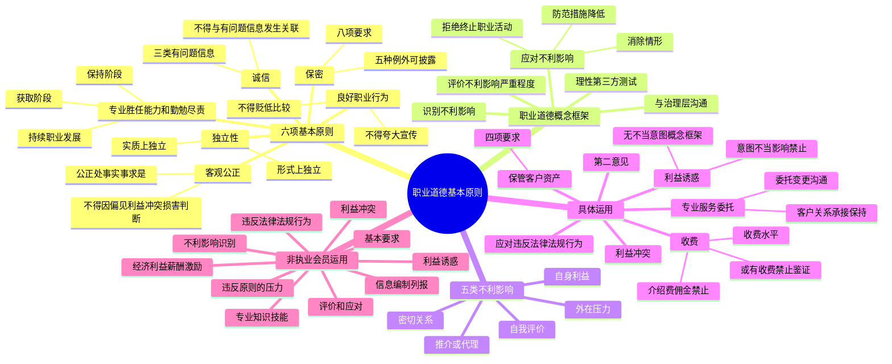

## 1. 章节定位

| 项目 | 信息 |
|------|------|
| 所属科目 | 审计 |
| 难度等级 | 3 |
| 历年分值 | 3-6 分 |
| 建议学时 | 6-8 小时 |
| 知识关联章节 | 第1章 审计概述（审计基本要求）、第3章 审计业务的独立性要求、第24章 会计师事务所质量管理 |

## 2. 考情分析

本章是审计科目的职业道德基础章节，历年分值约 3-6 分，以客观题为主，主观题中常与第3章独立性结合考查简答题。本章为后续职业道德相关章节奠定概念基础。

**命题规律**：本章以概念辨析、情形判断为主，命题人喜欢设置具体情形让考生判断违反了哪项职业道德基本原则、产生了哪类不利影响、应采取何种防范措施。

**高频考点分布**：

1. **六项职业道德基本原则**：诚信、客观公正、独立性、专业胜任能力和勤勉尽责、保密、良好职业行为。每项原则的含义、要求是基础考点。
2. **职业道德概念框架的内涵**：识别不利影响、评价不利影响严重程度、应对不利影响（消除、降低至可接受水平、拒绝或终止特定职业活动）。
3. **五类不利影响**：自身利益、自我评价、推介或代理、密切关系、外在压力。能够根据具体情形判断属于哪类不利影响是高频考点。
4. **保密原则的例外**：五种可以披露涉密信息的情形。
5. **利益冲突**：产生利益冲突的情形、识别和应对。
6. **专业服务委托的变更**：与现任或前任注册会计师的沟通。
7. **第二意见**：提供第二意见时的不利影响及防范措施。
8. **收费**：收费水平、或有收费（鉴证服务不得采用或有收费）、介绍费或佣金（不得收取或支付）。
9. **利益诱惑（包括礼品和款待）**：意图不当影响行为的利益诱惑和无不当影响行为意图的利益诱惑的处理。
10. **保管客户资产**：四个要求。
11. **应对违反法律法规行为**：注册会计师的目标和采取的行动。

**联动考查方式**：
- 与第3章独立性结合考查简答题（独立性属于六项基本原则之一，第3章专门展开）；
- 与第1章审计基本要求中的"遵守职业道德守则"结合考查；
- 与第24章会计师事务所质量管理结合考查。

**备考建议**：
- 牢记六项基本原则的名称和含义，特别是诚信、客观公正、保密的例外情形；
- 五类不利影响要能够准确归类，命题人常设置具体情形让考生判断；
- 区分"可以消除不利影响的防范措施"和"可以将不利影响降低至可接受水平的防范措施"；
- 或有收费和介绍费/佣金是高频考点：鉴证服务不得采用或有收费，不得收取或支付介绍费/佣金；
- 利益诱惑的两种情形（意图不当影响 vs 无不当影响意图）的处理方式不同。

## 3. 知识框架

## 4. 核心精讲

### 4.1 注册会计师行业职业道德概述

注册会计师行业需要更高的道德水准，理由有三：

1. **维护公众利益是行业的宗旨**，这决定了行业的会员需要超越个人、客户或所在单位的利益和法律法规的最低要求，恪守更高的职业道德要求；
2. **诚信是注册会计师行业核心价值之一**，也是行业的立身之本，行业会员只有展现出较高的道德水准才能取信于社会公众；
3. **注册会计师行业是专业性很强的行业**，其工作的技术复杂性决定了社会公众很难判断其执业质量，制定并贯彻严格的职业道德规范有助于社会公众增强对行业的信心。

中国注册会计师协会制定了《中国注册会计师职业道德守则》和《中国注册会计师协会非执业会员职业道德守则》（以下统称"职业道德守则"），规定了职业道德基本原则和解决职业道德问题的基本思路（即职业道德概念框架）。

### 4.2 职业道德基本原则

会员为实现执业目标，必须遵守六项基本原则：诚信、客观公正、独立性、专业胜任能力和勤勉尽责、保密、良好职业行为。

#### 4.2.1 诚信

**诚信**是指诚实、守信，一个人言行与内心思想一致，不虚假；能够履行与别人的约定而取得对方的信任。诚信原则要求会员应当在所有的职业活动中保持正直、诚实可信。

会员如果认为业务报告、申报资料、沟通函件或其他方面的信息存在下列问题，**不得与这些有问题的信息发生关联**：

1. 含有虚假记载、误导性陈述；
2. 含有缺乏充分根据的陈述或信息；
3. 存在遗漏或含糊其辞的信息，而这种遗漏或含糊其辞可能会产生误导。

**可能导致上述问题出现的情形**：(1) 引起重大风险的事项，如舞弊行为；(2) 财务信息存在重大错报而客户未对此作出调整或反映；(3) 导致在实施审计程序时出现重大困难的情况；(4) 与会计准则或其他相关规定的选择、应用和一致性相关的重大发现和问题，而客户未对此在其报告或申报资料中反映；(5) 在出具审计报告时，未解决的重大审计差异。

会员如果注意到已与有问题的信息发生关联，应当采取措施消除关联。例如，在鉴证业务中，如果注册会计师依据职业准则的规定出具了恰当的业务报告（如出具恰当的非无保留意见审计报告），则不被视为违反上述要求。

#### 4.2.2 客观公正

**客观**是指按照事物的本来面目去考察，不添加个人的偏见。**公正**是指公平、正直、不偏袒。客观公正原则要求会员应当公正处事、实事求是，不得由于偏见、利益冲突或他人的不当影响而损害自己的职业判断。

**重要规定**：如果存在对职业判断产生过度不当影响的情形，会员不得从事与之相关的职业活动。

#### 4.2.3 独立性

**独立性**是指不受外来力量控制、支配，按照一定之规行事。独立性原则通常是对注册会计师提出的要求。在执行鉴证业务时，注册会计师必须保持独立性。

注册会计师的独立性包括两个方面：

| 类型 | 含义 |
|------|------|
| 实质上的独立 | 注册会计师在执业过程中保持的一种内心状态，使其能够基于客观公正的判断形成结论 |
| 形式上的独立 | 一个理性且掌握充分信息的第三方，在权衡所有相关事实和情况后，很可能认为会计师事务所或项目组成员的诚信、客观公正或职业怀疑已经受到损害 |

会计师事务所在承接审计和审阅业务、其他鉴证业务时，应当从会计师事务所整体层面和具体业务层面采取措施，以保持会计师事务所和项目团队的独立性。独立性要求的详细内容见第3章。

#### 4.2.4 专业胜任能力和勤勉尽责

**专业胜任能力和勤勉尽责原则**要求会员通过教育、培训和执业实践获取和保持专业胜任能力。会员应当持续了解并掌握当前法律、技术和实务的发展变化，将专业知识和技能始终保持在应有的水平。

专业胜任能力可分为两个独立阶段：
1. **专业胜任能力的获取**：通过教育、培训和执业实践获得；
2. **专业胜任能力的保持**：通过持续职业发展（CPD）保持。

**勤勉尽责**要求会员遵守法律法规、相关职业准则的要求并保持应有的职业怀疑，认真、全面、及时地完成工作任务。会员应当采取适当措施以确保在其授权下从事专业服务的人员得到应有的培训和督导。在适当时，会员应当使客户、工作单位和专业服务的其他使用者了解专业服务的固有局限。

#### 4.2.5 保密

**保密原则**要求会员应当对职业活动中获知的涉密信息保密。会员应当遵守下列八项要求：

1. 警觉无意中泄密的可能性，包括在社会交往中无意中泄密的可能性，特别要警觉无意中向关系密切的商业伙伴或近亲属泄密的可能性（近亲属是指配偶、父母、子女、兄弟姐妹、祖父母、外祖父母、孙子女、外孙子女）；
2. 对所在会计师事务所、工作单位内部的涉密信息保密；
3. 对职业活动中获知的涉及国家安全的信息保密；
4. 对拟承接的客户、拟受雇的工作单位向其披露的涉密信息保密；
5. 在未经客户、工作单位授权的情况下，不得向会计师事务所、工作单位以外的第三方披露其所获知的涉密信息，除非法律法规或职业准则规定会员在这种情况下有权利或义务进行披露；
6. 不得利用因职业关系而获知的涉密信息为自己或第三方谋取利益；
7. 不得在职业关系结束后利用或披露因该职业关系获知的涉密信息；
8. 采取适当措施，确保下级员工以及为会员提供建议和帮助的人员履行保密义务。

**保密原则的五种例外情形**（可以披露涉密信息）：

| 情形 | 说明 |
|------|------|
| 1 | 法律法规允许披露，并且取得客户或工作单位的授权 |
| 2 | 法律法规要求披露，例如为法律诉讼、仲裁准备文件或提供证据，以及向有关监管机构报告发现的违法行为 |
| 3 | 法律法规允许的情况下，在法律诉讼、仲裁中维护自己的合法权益 |
| 4 | 接受注册会计师协会或监管机构的执业质量检查，答复其询问和调查 |
| 5 | 法律法规、执业准则和职业道德规范规定的其他情形 |

#### 4.2.6 良好职业行为

会员应当遵守相关法律法规，避免发生任何可能损害职业声誉的行为。如果某些法律法规的规定与职业道德守则的相关条款不一致，会员应当注意到这些差异。除非法律法规禁止，会员应当按照较为严格的规定执行。

会员在向公众传递信息以及推介自己和工作时，应当客观、真实、得体，不得损害职业形象。会员应当诚实、实事求是，**不得有下列行为**：
1. 夸大宣传提供的服务、拥有的资质或获得的经验；
2. 贬低或无根据地比较他人的工作。

### 4.3 职业道德概念框架

#### 4.3.1 职业道德概念框架的内涵

实务中，会员会遇到的许多情形（如职业活动、利益和关系）都可能对遵循职业道德基本原则产生不利影响。在职业道德守则中，不可能对各式各样的情形予以逐一界定并给出相应的应对措施。因此，职业道德守则提出**职业道德概念框架**，以指导会员遵循职业道德基本原则，履行维护公众利益的职责。

**职业道德概念框架是解决职业道德问题的基本思路**，用以指导会员：
1. 识别对职业道德基本原则的不利影响；
2. 评价不利影响的严重程度；
3. 必要时采取防范措施消除不利影响或将其降低至可接受的水平。

**重要原则**：职业道德概念框架适用于各种可能对职业道德基本原则产生不利影响的情形。会员如果遇到职业道德守则未作出明确规定的情形，应当运用职业道德概念框架识别、评价和应对各种可能产生的不利影响，**而不能想当然地认为职业道德守则未明确禁止的情形就是允许的**。

#### 4.3.2 识别、评价和应对不利影响

**（1）识别对职业道德基本原则的不利影响**

一种情形可能产生多种不利影响，一种不利影响也可能影响多项职业道德基本原则。可能对职业道德基本原则产生不利影响的因素包括五类：

| 不利影响类型 | 含义 |
|------------|------|
| 自身利益 | 由于某项经济利益或其他利益可能不当影响会员的判断或行为，而产生的不利影响 |
| 自我评价 | 会员在执行当前业务的过程中，其判断需要依赖其本人（或所在会计师事务所或工作单位的其他人员）以往执行业务时作出的判断或得出的结论，而该会员可能不恰当地评价这些以往的判断或结论，从而产生的不利影响 |
| 推介或代理 | 会员倾向客户或工作单位的立场，导致该会员的客观公正原则受到损害而产生的不利影响 |
| 密切关系 | 会员由于与客户或工作单位存在长期或密切的关系，导致过于偏向他们的利益或过于认可他们的工作，从而产生的不利影响 |
| 外在压力 | 会员迫于实际存在的或可感知到的压力，导致无法客观行事而产生的不利影响 |

**（2）评价不利影响的严重程度**

如果识别出对职业道德基本原则的不利影响，会员应当评价该不利影响的严重程度是否处于可接受的水平。

**可接受的水平**是指会员针对识别出的不利影响实施理性且掌握充分信息的第三方测试之后，很可能得出其行为并未违反职业道德基本原则的结论时，该不利影响的严重程度所处的水平。

在评价不利影响的严重程度时，会员应当从**性质**和**数量**两个方面予以考虑。如果存在多项不利影响，应当将多项不利影响组合起来一并考虑。

**（3）应对不利影响**

如果会员确定识别出的不利影响超出可接受的水平，应当通过消除该不利影响或将其降低至可接受的水平来予以应对。会员应当通过采取下列措施应对不利影响：

1. **消除产生不利影响的情形**，包括利益或关系；
2. **采取可行并有能力采取的防范措施**将不利影响降低至可接受的水平；
3. **拒绝或终止特定的职业活动**。

**防范措施**是指会员为了将对职业道德基本原则的不利影响有效降低至可接受的水平而采取的行动，该行动可能是单项行动，也可能是一系列行动。

**重要原则**：在某些情况下，产生不利影响的情形无法被消除，并且会员也无法通过采取防范措施将不利影响降低至可接受的水平，此时，不利影响仅能够通过拒绝、终止特定的职业活动或向工作单位提出辞职予以应对。

#### 4.3.3 与治理层的沟通

会员在识别、评价和应对不利影响时，应当根据职业判断，就有关事项与治理层进行沟通，并确定与客户或工作单位治理结构中的哪些适当人员进行沟通。如果会员与治理层的下设组织（如审计委员会）或个人沟通，应当确定是否还需要与治理层整体进行沟通，以使治理层所有成员充分知情。

在确定具体沟通对象时，会员可能需要考虑下列事项：
1. 具体情况的性质和重要程度；
2. 拟沟通的事项。

在某些情况下，治理层全部成员均参与管理（如小企业中仅有一名业主管理该企业）。在这些情况下，如果与同时承担管理层职责和治理层职责的人员沟通，可认为会员已满足与治理层沟通的要求。

### 4.4 注册会计师对职业道德概念框架的具体运用

在运用职业道德概念框架时，注册会计师应当运用职业判断，对新信息、事实和情况的变化保持警觉，以及实施**理性且掌握充分信息的第三方测试**。

**理性且掌握充分信息的第三方测试**是指注册会计师考虑：假设存在一个理性且掌握充分信息的第三方，在权衡了注册会计师于得出结论的时点可以了解到的所有具体事实和情况后，是否很可能得出与注册会计师相同的结论。理性且掌握充分信息的第三方不一定是注册会计师，但需要具备相关的知识和经验。

#### 4.4.1 识别对职业道德基本原则的不利影响（具体情形）

**（1）因自身利益产生不利影响的情形**主要包括：
1. 注册会计师在客户中拥有直接经济利益；
2. 会计师事务所的收入过分依赖某一客户；
3. 会计师事务所以较低的报价获得新业务，而该报价过低，可能导致注册会计师难以按照适用的职业准则要求执行业务；
4. 注册会计师与客户之间存在密切的商业关系；
5. 注册会计师能够接触到涉密信息，而该涉密信息可能被用于谋取个人私利；
6. 注册会计师在评价所在会计师事务所以往提供的专业服务时，发现了重大错误。

**（2）因自我评价产生不利影响的情形**主要包括：
1. 注册会计师在对客户提供财务系统的设计或实施服务后，又对系统的运行有效性出具鉴证报告；
2. 注册会计师为客户编制用于生成有关记录的原始数据，而这些记录是鉴证业务的对象。

**（3）因推介或代理产生不利影响的情形**主要包括：
1. 注册会计师推介客户的产品、股份或其他利益；
2. 当客户与第三方发生诉讼或纠纷时，注册会计师为该客户辩护；
3. 注册会计师站在客户的立场上影响某项法律法规的制定。

**（4）因密切关系产生不利影响的情形**主要包括：
1. 审计项目团队成员的近亲属担任审计客户的董事或高级管理人员；
2. 鉴证客户的董事、高级管理人员，或所处职位能够对鉴证对象施加重大影响的员工，最近曾担任注册会计师所在会计师事务所的项目合伙人；
3. 审计项目团队成员与审计客户之间存在长期业务关系。

**近亲属的范围**：包括主要近亲属和其他近亲属。主要近亲属是指配偶、父母和子女；其他近亲属是指兄弟姐妹、祖父母、外祖父母、孙子女、外孙子女。

**审计项目团队成员**是指所有审计项目组成员和会计师事务所中能够直接影响审计业务结果的其他人员，以及网络事务所中能够直接影响审计业务结果的所有人员。

**（5）因外在压力导致不利影响的情形**主要包括：
1. 注册会计师因对专业事项持有不同意见而受到客户解除业务关系或被会计师事务所解雇的威胁；
2. 由于客户对所沟通的事项更具有专长，注册会计师面临服从该客户判断的压力；
3. 注册会计师被告知，除非其同意审计客户某项不恰当的会计处理，否则计划中的晋升将受到影响；
4. 注册会计师接受了客户赠予的重要礼品，并被威胁将公开其收受礼品的事情。

#### 4.4.2 应对不利影响的防范措施

在特定情况下可能能够应对不利影响的防范措施包括：

| 防范措施 | 可应对的不利影响 |
|---------|----------------|
| 向已承接的项目分配更多时间和有胜任能力的人员 | 自身利益 |
| 由项目组以外的适当复核人员复核已执行的工作或在必要时提供建议 | 自我评价 |
| 向鉴证客户提供非鉴证服务时，指派鉴证业务项目团队以外的其他合伙人和项目组，并确保鉴证业务项目组和非鉴证服务项目组分别向各自的业务主管报告工作 | 自我评价、推介或代理或密切关系 |
| 由其他会计师事务所执行或重新执行业务的某些部分 | 自身利益、自我评价、推介或代理、密切关系或外在压力 |
| 由不同项目组分别应对具有保密性质的事项 | 自身利益 |

注册会计师应当就其已采取或拟采取的行动是否能够消除不利影响或将其降低至可接受的水平形成总体结论。在形成总体结论时，注册会计师应当：(1) 复核所作出的重大判断或得出的结论；(2) 实施理性且掌握充分信息的第三方测试。

#### 4.4.3 利益冲突

**（1）产生利益冲突的情形**

注册会计师不得因利益冲突损害其职业判断。利益冲突通常对客观公正原则产生不利影响，也可能对其他职业道德基本原则产生不利影响。

可能产生利益冲突的情形包括：
1. 向某一客户提供交易咨询服务，该客户拟收购注册会计师的某一审计客户，而注册会计师已在审计过程中获知了可能与该交易相关的涉密信息；
2. 同时为两家客户提供建议，而这两家客户是收购同一家公司的竞争对手；
3. 在同一项交易中同时向买卖双方提供服务；
4. 同时为两方提供某项资产的估值服务，而这两方针对该资产处于对立状态；
5. 针对同一事项同时代表两个客户，而这两个客户正处于法律纠纷中；
6. 针对某项许可证协议，就应收的特许权使用费为许可证授予方出具鉴证报告，并同时向被许可方就应付金额提供建议；
7. 建议客户投资一家企业，而注册会计师的主要近亲属在该企业拥有经济利益；
8. 建议客户买入一项产品或服务，但同时与该产品或服务的潜在卖方订立佣金协议。

**（2）评价和应对利益冲突产生的不利影响**

注册会计师提供的专业服务与产生利益冲突的事项之间关系越直接，不利影响的严重程度越有可能超出可接受的水平。

在评价因利益冲突产生的不利影响时，注册会计师需要考虑是否存在相关保密措施（如会计师事务所内部设置单独工作空间、限制访问客户文档、签署保密协议、物理和电子隔离、专门培训等）。

**防范措施**可能包括：
1. 由不同的项目组分别提供服务，并且这些项目组已被明确要求遵守涉及保密性的政策和程序；
2. 由未参与提供服务或不受利益冲突影响的适当人员复核已执行的工作。

注册会计师应当根据利益冲突的性质和严重程度，运用职业判断确定是否有必要向客户具体披露利益冲突的情况，并获取客户明确同意其可以承接或继续提供专业服务。

#### 4.4.4 专业服务委托

**（1）客户关系和业务的承接与保持**

在接受客户关系前，注册会计师应当确定接受客户关系是否对职业道德基本原则产生不利影响。如果注册会计师知悉客户存在某些问题（如涉嫌违反法律法规、缺乏诚信、存在可疑的财务报告问题等），可能对诚信、良好职业行为原则产生不利影响。

如果项目组不具备或不能获得恰当执行业务所必需的胜任能力，将因自身利益对专业胜任能力和勤勉尽责原则产生不利影响。

**防范措施**可能包括：(1) 分派足够的、具有必要胜任能力的项目组成员；(2) 就执行业务的合理时间安排与客户达成一致意见；(3) 在必要时利用专家的工作。

**（2）专业服务委托的变更**

当注册会计师遇到下列情况时，应当确定是否有理由拒绝承接该项业务：
1. 潜在客户要求其取代另一注册会计师；
2. 考虑以投标方式接替另一注册会计师执行的业务；
3. 考虑执行某些工作作为对另一注册会计师工作的补充。

**防范措施**可能包括：
1. 要求现任或前任注册会计师提供其已知的信息，这些信息是指现任或前任注册会计师认为，拟接任注册会计师在作出是否承接业务的决定前需要了解的信息；
2. 从其他渠道获取信息，例如通过向第三方进行询问，或者对客户的高级管理层或治理层实施背景调查。

**重要规定**：在与现任或前任注册会计师沟通前，拟接任注册会计师通常需要征得客户同意，最好能够征得客户的书面同意。当被要求对拟接任注册会计师的沟通作出答复时，现任或前任注册会计师应当遵守相关法律法规的要求，实事求是、清晰明了地提供相关信息。现任或前任注册会计师需要遵循保密原则。

#### 4.4.5 第二意见

注册会计师可能被要求就某实体或以其名义运用相关准则处理特定交易或事项的情况提供第二意见，而这一实体并非注册会计师的现有客户。向非现有客户提供第二意见可能因自身利益或其他原因对职业道德基本原则产生不利影响。

**不利影响的情形**：如果第二意见不是以现任或前任注册会计师所获得的相同事实为基础，或依据的证据不充分，可能因自身利益对专业胜任能力和勤勉尽责原则产生不利影响。

**防范措施**可能包括：
1. 征得客户同意与现任或前任注册会计师沟通；
2. 在与客户沟通中说明注册会计师发表专业意见的局限性；
3. 向现任或前任注册会计师提供第二意见的副本。

**重要规定**：如果要求提供第二意见的实体不允许与现任或前任注册会计师沟通，注册会计师应当决定是否提供第二意见。

#### 4.4.6 收费

**（1）收费水平**

会计师事务所在确定收费时应当主要考虑：专业服务所需的知识和技能、所需专业人员的水平和经验、各级别专业人员提供服务所需的时间和提供专业服务所需承担的责任。

如果收费报价水平过低，以致注册会计师难以按照适用的职业准则执行业务，则可能因自身利益对专业胜任能力和勤勉尽责原则产生不利影响。

**（2）或有收费**

| 规定 | 说明 |
|------|------|
| 鉴证服务 | 除法律法规允许外，注册会计师**不得**以或有收费方式提供鉴证服务，收费与否或收费多少不得以鉴证工作结果或实现特定目的为条件 |
| 非鉴证服务 | 某些非鉴证服务可以采用或有收费的形式，但仍然可能对职业道德基本原则产生不利影响，特别是在某些情况下可能因自身利益对客观公正原则产生不利影响 |

**防范措施**可能包括：(1) 由未参与提供非鉴证服务的适当复核人员复核注册会计师已执行的工作；(2) 预先就收费的基础与客户达成书面协议。

**（3）介绍费或佣金**

| 行为 | 规定 |
|------|------|
| 收取介绍费或佣金 | 注册会计师**不得**收取与客户相关的介绍费或佣金（因自身利益对客观公正、专业胜任能力和勤勉尽责原则产生非常严重的不利影响，**没有防范措施**能够消除或降低） |
| 支付业务介绍费 | 注册会计师**不得**向客户或其他方支付业务介绍费（同上，没有防范措施） |

#### 4.4.7 利益诱惑（包括礼品和款待）

**利益诱惑**是指影响其他人员行为的物质、事件或行为，但利益诱惑并不一定具有不当影响该人员行为的意图。利益诱惑可能采取多种形式，例如：礼品、款待、娱乐活动、捐助、意图建立友好关系、工作岗位或其他商业机会、特殊待遇权利或优先权。

**（1）意图不当影响行为的利益诱惑**

注册会计师**不得**提供或接受，或者授意他人提供或接受任何意图不当影响接受方或其他人员行为的利益诱惑，无论这种利益诱惑是存在不当影响行为的意图，还是注册会计师认为理性且掌握充分信息的第三方很可能会视为存在不当影响行为的意图。

在确定是否存在或被认为存在不当影响行为的意图时，注册会计师需要考虑的因素包括：利益诱惑的性质、频繁程度、价值和累积影响；提供利益诱惑的时间；是否符合具体情形下的惯例或习俗；是否从属于专业服务；是否仅限于个别接受方还是可以提供给更为广泛的群体；提供或接受人员在会计师事务所或客户中担任的角色和职位；是否知悉接受将违反客户的政策和程序；透明程度；是否由接受方要求或索取；提供方以往的行为或声誉。

**重要规定**：如果注册会计师知悉被提供的利益诱惑存在或被认为存在不当影响行为的意图，即使注册会计师拒绝接受利益诱惑，仍可能对职业道德基本原则产生不利影响。

**防范措施**可能包括：(1) 就该利益诱惑的情况告知会计师事务所的高级管理层或客户治理层；(2) 调整或终止与客户之间的业务关系。

注册会计师应当对其近亲属向现有或潜在客户提供利益诱惑或者接受利益诱惑的情况保持警觉。

**（2）无不当影响行为意图的利益诱惑**

如果注册会计师认为某项利益诱惑不存在不当影响接受方或其他人员行为的意图，应当运用职业道德概念框架识别、评价和应对可能因该利益诱惑产生的不利影响。

**可能消除不利影响的防范措施**：
1. 拒绝接受或不提供利益诱惑；
2. 将向客户提供专业服务的责任移交给其他人员（前提是注册会计师没有理由相信该人员在提供专业服务时可能会受到不利影响）。

**可能将不利影响降低至可接受水平的防范措施**：
1. 与会计师事务所或客户的高级管理层保持信息对称；
2. 在由会计师事务所高级管理层或其他负责职业道德合规性的人员监控的记录中登记该利益诱惑；
3. 针对提供利益诱惑的客户，由未参与提供专业服务的适当复核人员复核注册会计师已执行的工作或作出的决策；
4. 在接受利益诱惑之后将其捐赠给慈善机构，并适当披露；
5. 支付与所接受利益诱惑同等价值的价款；
6. 在收到利益诱惑后尽快将其返还给提供者。

#### 4.4.8 保管客户资产

除非法律法规允许或要求，并且满足相关条件，注册会计师不得提供保管客户资金或其他资产的服务。保管客户资产可能因自身利益或其他原因而对客观公正、良好职业行为原则产生不利影响。

注册会计师如果保管客户资金或其他资产，应当符合下列四项要求：
1. 遵守所有与保管资产和履行报告义务相关的法律法规；
2. 将客户资金或其他资产与其个人或会计师事务所的资产分开；
3. 仅按照预定用途使用客户资金或其他资产；
4. 随时准备向相关人员报告资产状况及产生的收入、红利或利得。

**重要规定**：在承接某项业务时，对于可能涉及保管客户资金或其他资产，注册会计师应当询问资产的来源，并考虑应履行的相关法定义务。如果客户资金或其他资产来源于非法活动（如洗钱），注册会计师不得提供保管资产服务。

#### 4.4.9 应对违反法律法规行为

**违反法律法规行为**包括客户、客户的治理层和管理层，以及为客户工作或在客户指令下工作的人员有意或无意作出的与现行法律法规不符的疏漏或违法行为。主要涉及的法律法规方面包括：舞弊、腐败和贿赂；国家安全、洗钱和犯罪所得；证券市场和交易；银行业务、其他金融产品和服务；信息安全；税务、社会保障；环境保护；公共健康与安全。

当注册会计师知悉或怀疑存在这种违反或涉嫌违反法律法规的行为时，可能因自身利益或外在压力对诚信和良好职业行为原则产生不利影响。

**注册会计师的目标**：
1. 遵循诚信和良好职业行为原则；
2. 通过提醒客户的管理层或治理层（如适用），使其能够纠正违反法律法规或涉嫌违反法律法规行为或减轻其可能造成的后果，或者阻止尚未发生的违反法律法规行为；
3. 采取有助于维护公众利益的进一步措施。

**采取的行动**：如果注册会计师识别出或怀疑存在已经发生或可能发生的违反法律法规行为，应当与适当级别的管理层和治理层沟通。注册会计师可以采取的进一步行动包括：
1. 向适当机构报告该事项，即使法律法规没有要求进行报告；
2. 在法律法规允许的情况下，解除业务约定。

### 4.5 非执业会员对职业道德概念框架的运用

**非执业会员**是指加入中国注册会计师协会，除执业注册会计师以外的其他个人会员。非执业会员可能是其所在工作单位的正式或非正式员工，如企业的董事、高级管理人员、正式员工、临时员工、志愿者等。非执业会员与工作单位之间关系的法律形式不影响其应承担的职业道德责任。

非执业会员的职位越高，越能够获取更多的信息，也越有机会和能力影响工作单位其他人员制定的政策、作出的决策和采取的行动。处于相关职位的非执业会员应当在工作单位中倡导以道德为基础的文化。

**非执业会员可能面临的不利影响**（同样适用五类不利影响分类）：

| 不利影响 | 情形举例 |
|---------|---------|
| 自身利益 | 在工作单位中拥有经济利益、参与激励性薪酬计划、能将工作单位资产挪为私用、接受供应商提供的礼品或款待 |
| 自我评价 | 负责设计和运行内部控制又对其评价、负责会计处理又执行内部审计、对收购决策可行性研究后又确定合并的会计处理方法 |
| 推介或代理 | 以虚假或误导性方式宣传工作单位形象、推介工作单位股份产品服务、操纵招股说明书信息 |
| 密切关系 | 负责财务报告而近亲属可以作出影响财务报告的决策、与能影响经营决策的人员存在长期业务交往、接受可能影响客观公正的礼品或款待 |
| 外在压力 | 与工作单位在会计政策选择存在分歧时受到解聘或更换职位的威胁、上级主管试图影响决策过程 |

**信息的编制和列报**：非执业会员在编制和列报信息时，应当遵守下列要求：
1. 按照适用的财务报告编制基础的规定编制和列报信息；
2. 编制和列报信息的方式不得误导或者不当影响合同或监管结果；
3. 运用职业判断，以在所有重大方面准确、完整地反映事实；
4. 不得遗漏任何内容以使信息存在误导性。

**自由裁量权可能被滥用的情形**：作出估计（如利用公允价值会计估计粉饰损益）；选择或更改会计政策（如针对长期合同随意选择以粉饰损益）；确定交易的时间安排（如接近期末进行资产销售）；确定交易的结构（如安排融资交易结构歪曲分类）；选择性披露（如遗漏或模糊披露风险信息）。

**应对违反法律法规行为**：高级非执业会员应当采取的措施包括与治理层沟通、遵循法律法规要求向适当机构报告、纠正或减轻后果、设法阻止尚未发生的违反法律法规行为。其他非执业会员应当告知其直接上级，如果该直接上级可能涉及该事项中，则应当告知工作单位内更高一级的机构或向适当机构报告。

## 5. 典型例题

**【例题 1】（不利影响的分类判断）**

下列各项中，属于因自我评价对职业道德基本原则产生不利影响的情形有（多项选择题）：

A. 注册会计师在客户中拥有直接经济利益
B. 注册会计师在对客户提供财务系统的设计或实施服务后，又对系统的运行有效性出具鉴证报告
C. 审计项目团队成员的近亲属担任审计客户的董事
D. 注册会计师为客户编制用于生成有关记录的原始数据，而这些记录是鉴证业务的对象
E. 注册会计师推介客户的产品

**答案**：B、D

**解析**：

A 错误。注册会计师在客户中拥有直接经济利益，属于因**自身利益**产生的不利影响，而非自我评价。
B 正确。注册会计师设计或实施财务系统后又对该系统出具鉴证报告，需要依赖自己以往的工作结果进行评价，属于因**自我评价**产生的不利影响。
C 错误。审计项目团队成员的近亲属担任审计客户的董事，属于因**密切关系**产生的不利影响。
D 正确。注册会计师为客户编制原始数据，而这些数据又是鉴证业务的对象，需要评价自己编制的数据，属于因**自我评价**产生的不利影响。
E 错误。注册会计师推介客户的产品，属于因**推介或代理**产生的不利影响。

**解题技巧**：自我评价的核心特征是"自己评价自己的工作"。判断时看注册会计师是否需要依赖自己（或所在事务所其他人员）以往执行业务时作出的判断或结论来执行当前业务。

**【例题 2】（收费相关规定的判断）**

关于注册会计师的收费，下列说法中正确的有（多项选择题）：

A. 会计师事务所以较低的报价获得新业务，可能导致注册会计师难以按照适用的职业准则要求执行业务
B. 除法律法规允许外，注册会计师不得以或有收费方式提供鉴证服务
C. 注册会计师不得收取与客户相关的介绍费或佣金
D. 注册会计师可以向客户支付业务介绍费以获得客户
E. 或有收费可以用于所有鉴证服务和非鉴证服务

**答案**：A、B、C

**解析**：

A 正确。收费报价过低可能导致注册会计师难以按照职业准则执行业务，因自身利益对专业胜任能力和勤勉尽责原则产生不利影响。
B 正确。除法律法规允许外，注册会计师不得以或有收费方式提供鉴证服务。
C 正确。注册会计师不得收取与客户相关的介绍费或佣金，因为这种不利影响非常严重，没有防范措施能够消除或降低。
D 错误。注册会计师不得向客户或其他方支付业务介绍费，理由同 C 选项。
E 错误。或有收费不得用于鉴证服务（除法律法规允许外）；某些非鉴证服务可以采用或有收费，但仍可能对职业道德基本原则产生不利影响。

**【例题 3】（利益诱惑的处理）**

注册会计师在审计客户 ABC 公司期间，遇到以下情形：
(1) 客户的财务总监邀请注册会计师参加一次普通商务午餐，价值 200 元；
(2) 客户在春节前向注册会计师赠送价值 5 000 元的购物卡，并暗示希望注册会计师在审计中对某项会计处理"通融"；
(3) 客户邀请注册会计师全家前往海南度假 5 天，全部费用由客户承担。

要求：分别说明上述情形中注册会计师应当如何处理。

**答案**：

(1) 普通商务午餐属于与商务会议有关的正常款待，且价值较低，通常不存在不当影响行为的意图。注册会计师可以接受，但应当运用职业道德概念框架识别、评价和应对可能的不利影响。如果认为不存在不当影响意图，且不利影响不严重，可以接受；如有疑虑，应当告知会计师事务所高级管理层。

(2) 价值 5 000 元的购物卡且暗示希望"通融"，明显存在不当影响注册会计师行为的意图。注册会计师**不得接受**该购物卡。即使注册会计师拒绝接受，仍可能对职业道德基本原则产生不利影响。注册会计师应当就该利益诱惑的情况告知会计师事务所的高级管理层或客户治理层，必要时调整或终止与客户之间的业务关系。同时，注册会计师应当保持职业怀疑，对客户的相关会计处理进行审慎评价。

(3) 邀请注册会计师全家前往海南度假 5 天，费用由客户承担，价值较大，理性且掌握充分信息的第三方很可能会认为存在不当影响注册会计师行为的意图。注册会计师**不得接受**该邀请。注册会计师应当运用职业道德概念框架识别、评价和应对不利影响，可以拒绝接受邀请，或将该情况告知会计师事务所高级管理层。

**解析**：利益诱惑的处理分为两种情形：(1) 意图不当影响行为的利益诱惑——不得提供或接受，即使拒绝仍可能产生不利影响；(2) 无不当影响意图的利益诱惑——运用概念框架识别、评价和应对。判断的关键是利益诱惑的价值、性质、频繁程度、提供时间、是否符合惯例等因素。

## 6. 记忆口诀

**六项基本原则**："诚信、客观公正、独立性、专业胜任能力和勤勉尽责、保密、良好职业行为"——六项原则记牢。

**诚信三不得关联**："虚假记载误导性陈述、缺乏充分根据的陈述、遗漏含糊其辞可能误导"——三类有问题的信息不得发生关联。

**独立性两方面**："实质上的独立内心状态，形式上的独立第三方视角"——实质独立 + 形式独立。

**专业胜任能力两阶段**："获取靠教育培训实践，保持靠持续职业发展"——获取和保持两个阶段。

**保密八项要求**："警觉无意泄密、内部保密、国家安全保密、拟承接客户保密、未经授权不得披露、不得谋取利益、职业关系结束后不得利用披露、确保下级员工保密"——八项要求。

**保密五种例外**："授权披露、法规要求披露、诉讼维权、协会监管检查、其他法定情形"——五种可以披露涉密信息的情形。

**五类不利影响**："自身利益、自我评价、推介或代理、密切关系、外在压力"——五类不利影响。

**不利影响判断技巧**："自身利益看经济利益，自我评价看评价自己工作，推介代理看倾向客户立场，密切关系看长期密切关系，外在压力看实际或感知压力"——五类不利影响的核心特征。

**概念框架三步骤**："识别不利影响、评价严重程度、应对消除降低拒绝"——识别、评价、应对。

**应对不利影响三措施**："消除产生不利影响的情形、采取防范措施降低至可接受水平、拒绝或终止特定职业活动"——三种应对措施。

**或有收费**："鉴证服务不得或有收费，非鉴证服务可以但仍需评价"——鉴证服务禁止，非鉴证服务可以但需评价。

**介绍费佣金**："不得收取不得支付，没有防范措施"——收取和支付都禁止，没有防范措施。

**利益诱惑两类**："意图不当影响不得接受，无不当意图运用概念框架"——两类处理方式不同。

**保管客户资产四要求**："遵守法规、分开资产、按预定用途使用、随时报告资产状况"——四项要求。

**专业服务委托变更**："拟接任先征得客户同意，与现任前任沟通了解信息"——委托变更的沟通要求。

**第二意见三防范**："征得同意与现任前任沟通、说明意见局限性、提供第二意见副本"——三项防范措施。

**理性第三方测试**："理性掌握充分信息的第三方，权衡所有事实情况，是否很可能得出相同结论"——概念框架的检验方法。

**近亲属范围**："主要近亲属配偶父母子女，其他近亲属兄弟姐妹祖父母外祖父母孙子女外孙子女"——近亲属的范围。

**审计项目团队成员**："项目组成员 + 事务所中能直接影响审计业务结果的其他人员 + 网络事务所中能直接影响审计业务结果的所有人员"——三类人员。

## 7. 同步练习

**509.（单选题）** 下列关于专业胜任能力和勤勉尽责的说法中，错误的是（　）。

A. 专业胜任能力和勤勉尽责原则要求会员通过教育、培训和执业实践获取和保持专业胜任能力
B. 在应用专业知识和技能时，会员通常不运用职业判断
C. 专业胜任能力可以分为两个独立阶段，即专业胜任能力的获取和专业胜任能力的保持
D. 勤勉尽责，要求会员遵守法律法规、相关职业准则的要求并保持应有的职业怀疑，认真、全面、及时地完成工作任务

**510.（单选题）** 下列关于职业道德基本原则的保密原则的说法中，错误的是（　）。

A. 会员应当对所在会计师事务所、工作单位内部的涉密信息保密
B. 在法律法规或职业准则允许时，会员可以不经客户授权，向会计师事务所、工作单位以外的第三方披露其所获知的涉密信息
C. 会员接受注册会计师协会或监管机构的执业质量检查时，应在征得客户的同意后，才能答复协会或监管机构的询问和调查
D. 法律法规允许的情况下，在法律诉讼、仲裁中维护自己的合法权益时，会员可以披露涉密信息

**511.（单选题）** 因与被审计单位之间长期的工作或存在的亲密关系，使得会计师事务所在审计时过于照顾他们的利益，或无原则的认可他们的工作，将产生（　）。

A. 自身利益不利影响
B. 自我评价不利影响
C. 推介或代理不利影响
D. 密切关系不利影响

**512.（单选题）** 下列各项中，不属于主要因密切关系对职业道德基本原则产生不利影响的情形是（　）。

A. 审计项目团队成员的近亲属担任审计客户的董事或高级管理人员
B. 审计客户的董事或高级管理人员最近曾担任会计师事务所的项目合伙人
C. 审计项目团队成员与审计客户之间存在长期业务关系
D. 审计项目团队成员与审计客户之间存在密切的商业关系

**513.（单选题）** 下列情形中，注册会计师违反了保密原则的是（　）。

A. 法律法规允许，并且在取得客户授权的前提下，对涉密信息进行披露
B. 根据法律法规的要求，为法律诉讼、仲裁准备文件或提供证据
C. 接受注册会计师协会或监管机构的执业质量检查，答复其询问和调查
D. 在职业关系结束后利用或披露因该职业关系获知的涉密信息

**514.（单选题）** 会计师事务所和注册会计师应当考虑外在压力对独立性的不利影响，下列事项中不属于外在压力导致对独立性产生不利影响的是（　）。

A. 会计师事务所受到被审计单位解除业务关系的威胁
B. 客户对所沟通的事项更具有专长
C. 注册会计师被告知，除非其同意审计客户某项不恰当的会计处理，否则计划中的晋升将受到影响
D. 审计项目团队成员与审计客户之间存在长期业务关系

**515.（单选题）** 下列关于收费的说法中，错误的是（　）。

A. 除法律法规允许外，注册会计师不得以或有收费的方式提供鉴证服务
B. 非鉴证服务也不得采取或有收费的形式
C. 收费报价水平可能影响注册会计师按照职业准则提供专业服务的能力
D. 在专业服务得到良好的计划、监督及管理的前提下，收费通常以每一专业人员适当的小时收费标准或日收费标准为基础计算

**516.（单选题）** 下列关于评价和应对利益冲突产生的不利影响的说法中，错误的是（　）。

A. 一般来说，注册会计师提供的专业服务与产生利益冲突的事项之间关系越直接，不利影响的严重程度越有可能超出可接受的水平
B. 在评价因利益冲突产生的不利影响的严重程度时，注册会计师需要考虑是否存在相关保密措施
C. 会计师事务所合伙人和员工签署的保密协议能在一定程度上防止未经授权而披露涉密信息
D. 在应对因利益冲突产生的不利影响时，注册会计师应当根据利益冲突的性质和严重程度向客户具体披露利益冲突的情况

**517.（单选题）** 下列关于利益诱惑的说法中，错误的是（　）。

A. 利益诱惑一定具有不当影响该人员行为的意图
B. 注册会计师提供或接受利益诱惑，可能因自身利益、密切关系或外在压力对职业道德基本原则产生不利影响
C. 注册会计师不得提供或接受，或者授意他人提供或接受任何意图不当影响接受方或其他人员行为的利益诱惑
D. 如果注册会计师知悉被提供的利益诱惑存在或被认为存在不当影响行为的意图，即使注册会计师拒绝接受利益诱惑，仍可能对职业道德基本原则产生不利影响

**518.（多选题）** 下列选项中，属于与职业道德有关的基本原则的有（　）。

A. 诚信
B. 客观公正
C. 专业胜任能力和勤勉尽责
D. 保密

**519.（多选题）** 如果被要求提供第二意见，注册会计师应当评价产生不利影响的严重程度。下列各项中，可能能够应对此类不利影响的防范措施有（　）。

A. 在与客户沟通中说明注册会计师发表专业意见的局限性
B. 征得客户同意与前任注册会计师沟通
C. 在审计报告中提及前任注册会计师的工作
D. 向前任注册会计师提供第二意见的副本

**520.（多选题）** 下列选项中，属于针对利益冲突采取的防范措施的有（　）。

A. 由不同的项目组分别提供服务，并且这些项目组已被明确要求遵守涉及保密性的政策和程序
B. 由未参与提供服务的适当人员复核已执行的工作，以评估关键判断和结论是否适当
C. 在进行披露或在会计师事务所、网络内部分享相关信息以及寻求第三方指导时，遵守保密原则
D. 由不受利益冲突影响的适当人员复核已执行的工作，以评估关键判断和结论是否适当

**521.（多选题）** 在非执业会员履行职责时，可能对专业胜任能力和勤勉尽责原则产生不利影响的情形有（　）。

A. 缺乏足够的时间完成相关职责
B. 在履行职责的过程中获取的信息不完整、不充分或范围受到限制
C. 缺乏应有的经验、培训或教育
D. 在履行职责的过程中缺乏足够的资源

**522.（简答题）** ABC会计师事务所拟承接以下客户2024年度财务报表审计工作。假定存在以下情形：

(1) 甲公司2024年度的财务报表由XYZ会计师事务所审计并出具了报告。近日因XYZ会计师事务所的注册会计师受到相关部门的处罚，甲公司拟另行委托ABC会计师事务所审计其2024年的财务报表并出具审计报告。甲公司只同意ABC会计师事务所与承接2023年财务报表审计的DEF会计师事务所沟通。
(2) 乙公司是ABC会计师事务所的常年审计客户，事务所在2019年承接乙公司的审计业务时评估了对职业道德基本原则的不利影响，并采取措施将其降低至可接受的水平，会计师事务所认为乙公司为优质客户，继续承接了其2024年度财务报表审计业务，并认为可以长期保持客户关系。
(3) 注册会计师为承接丙公司2024年度财务报表审计业务，向丙公司报价的审计费用明显低于其他会计师事务所。为保证业务质量、遵守执业准则和相关职业道德要求，会计师事务所制定了一系列规范。
(4) 丁公司委托ABC会计师事务所审计其2024年财务报表，现因急需为取得银行贷款要求ABC会计师事务所加快进度完成审计工作，承诺一旦如期完成，将安排项目合伙人去欧洲旅游。
(5) 戊公司为一家公益组织，2024年初ABC会计师事务所接受委托为其管理的公益基金的收支设计内部控制，现接受委托审计2024年度的财务报表，为此，双方另行签订了业务约定书。

要求：针对上述事项第(1)至(5)项，逐项指出是否存在违反中国注册会计师职业道德守则的情况，并简要说明理由。

---

**练习答案**：

**单选题**：509.B（在应用专业知识和技能时，会员应当合理运用职业判断）　510.C（接受注册会计师协会或监管机构的执业质量检查时，可以披露涉密信息、答复询问和调查，无需征得客户同意）　511.D（长期或亲密关系导致客观性受损，产生密切关系不利影响）　512.D（密切的商业关系属于因自身利益或外在压力产生的不利影响）　513.D（不得在职业关系结束后利用或披露因该职业关系获知的涉密信息）　514.D（属于密切关系导致对独立性产生的不利影响）　515.B（某些非鉴证服务可以采取或有收费的形式）　516.D（应当运用职业判断确定是否有必要向客户具体披露利益冲突的情况）　517.A（利益诱惑并不一定具有不当影响该人员行为的意图）

**多选题**：518.ABCD（除此之外还有独立性和良好的职业行为）　519.ABD（C不属于应对第二意见不利影响的防范措施）　520.ABD（C属于披露信息时遵守保密原则的要求）　521.ABCD

**522.（简答题）** (1) 违反。XYZ会计师事务所为前任注册会计师，如果要求提供第二意见的实体不允许与现任或前任注册会计师沟通，注册会计师应当决定是否提供第二意见。(2) 违反。在连续业务中，注册会计师应当定期评价是否继续保持该业务。(3) 不违反。如果收费报价明显低于前任注册会计师或其他会计师事务所的相应报价，会计师事务所应当确保在提供专业服务时遵守执业准则和相关职业道德规范的要求，使工作质量不受损害，并使客户了解专业服务的范围和收费基础。(4) 违反。安排项目合伙人到欧洲旅游，超出了业务活动中的正常往来，将对诚信、良好职业行为、客观公正原则产生不利影响，注册会计师应当拒绝接受。(5) 违反。在财务报表审计中对内部控制评价是一项重要的程序，如果既设计内部控制又对内部控制进行评价，会产生因自我评价导致的不利影响。
