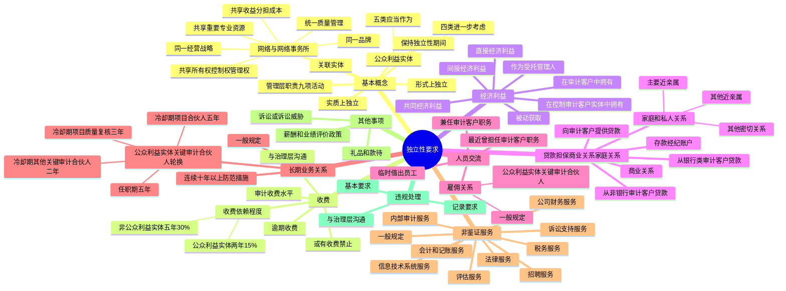

## 1. 章节定位

| 项目 | 信息 |
|------|------|
| 所属科目 | 审计 |
| 难度等级 | 5 |
| 历年分值 | 6-10 分 |
| 建议学时 | 10-12 小时 |
| 知识关联章节 | 第1章 审计概述（审计基本要求）、第2章 职业道德基本原则（独立性是六项基本原则之一）、第24章 会计师事务所质量管理 |

## 2. 考情分析

本章是审计科目最重要的章节之一，历年分值约 6-10 分，几乎每年必考简答题，也可能涉及客观题。本章内容繁多、规则细致，是简答题的核心命题章节。

**命题规律**：本章以情形判断为主，命题人喜欢设置具体情形让考生判断是否损害独立性、应采取何种防范措施。公众利益实体的特殊要求、关键审计合伙人轮换、非鉴证服务的禁止情形是高频考点。

**高频考点分布**：

1. **独立性的基本概念**：实质上的独立性和形式上的独立性；网络与网络事务所的判断（六个判断标准）；公众利益实体的识别；关联实体；保持独立性的期间；管理层职责的界定。
2. **收费**：审计收费水平的考虑因素；或有收费（审计服务不得采用或有收费）；逾期收费；收费的依赖程度（非公众利益实体连续五年超过 30%、公众利益实体连续两年超过 15%）；与公众利益实体审计客户治理层沟通收费信息。
3. **经济利益**：直接经济利益与间接经济利益的区分；在审计客户中拥有经济利益的禁止情形；在控制审计客户的实体中拥有经济利益；被动获取经济利益的处理。
4. **贷款和担保以及商业关系、家庭和私人关系**：从银行或类似金融机构审计客户取得贷款、从非银行审计客户取得贷款、向审计客户提供贷款的不同处理；商业关系的禁止情形；家庭和私人关系（主要近亲属、其他近亲属、其他密切关系）。
5. **与审计客户之间的人员交流**：雇佣关系（一般规定、公众利益实体的关键审计合伙人加入审计客户）；临时借出员工；最近曾担任审计客户的董事、监事、高级管理人员或特定员工；兼任审计客户的董事、监事或高级管理人员。
6. **与审计客户长期存在业务关系**：一般规定；公众利益实体的关键审计合伙人轮换（任职期五年、冷却期不同）；连续执行审计业务达到十年或以上的防范措施。
7. **为审计客户提供非鉴证服务**：一般规定；会计和记账服务；评估服务；税务服务；内部审计服务；信息技术系统服务；诉讼支持服务；法律服务；招聘服务；公司财务服务。公众利益实体审计客户的特殊禁止规定。
8. **影响独立性的其他事项**：薪酬和业绩评价政策；礼品和款待；诉讼或诉讼威胁。
9. **违反独立性要求时会计师事务所应当采取的措施**：基本要求；与治理层的沟通；相关记录要求。

**联动考查方式**：
- 简答题常将多种情形组合考查（如经济利益 + 家庭关系 + 非鉴证服务）；
- 与第2章职业道德基本原则结合考查（独立性是六项基本原则之一）；
- 与第24章会计师事务所质量管理结合考查。

**备考建议**：
- 区分"非常严重的不利影响，没有防范措施"与"可能产生不利影响，需要评价和应对"两种情形；
- 公众利益实体的要求通常比非公众利益实体更严格，注意区分；
- 关键审计合伙人轮换的任职期和冷却期是必考点，要牢记不同职务的年限；
- 直接经济利益和间接经济利益的区分取决于能否控制投资工具或影响投资决策；
- 管理层职责的九项活动要熟悉，会计师事务所不得承担管理层职责。

## 3. 知识框架

## 4. 核心精讲

### 4.1 基本概念和要求

#### 4.1.1 独立性

独立性包括实质上的独立性和形式上的独立性：

| 类型 | 含义 |
|------|------|
| 实质上的独立性 | 注册会计师在作出职业判断和提出结论时，发自内心地遵循了诚信原则、客观公正原则，保持了职业怀疑 |
| 形式上的独立性 | 注册会计师在理性且充分知情的第三方看来是否独立，即理性且充分知情的第三方在权衡所有相关事实和情况后，认为会计师事务所、审计项目团队成员等相关人员遵循了诚信原则、客观公正原则，保持了职业怀疑 |

会计师事务所及其相关人员应当恪守独立性原则，识别可能对独立性产生不利影响的因素（自身利益、自我评价、密切关系、外在压力、推介或代理），并采取三个步骤：(1) 识别对独立性的不利影响；(2) 评价不利影响的严重程度；(3) 必要时，采取防范措施消除不利影响或将其降低至可接受的水平。

#### 4.1.2 网络与网络事务所

**网络**是指由多个实体组成，旨在通过合作实现下列一个或多个目的的联合体：(1) 共享收益、分担成本；(2) 共享所有权、控制权或管理权；(3) 执行统一的质量管理政策和程序；(4) 执行同一经营战略；(5) 使用同一品牌；(6) 共享重要的专业资源。

**网络事务所**是指与某会计师事务所处于同一网络的其他会计师事务所或实体。如果会计师事务所属于某一网络，应当与网络事务所的审计客户保持独立。

**网络确定的要点**：
- 分担的成本不重要，或分担的成本仅限于与开发审计方法、编制审计手册或提供培训课程有关的成本，不视为网络；
- 共享的资源仅限于共同的审计手册或审计方法、仅限于培训资源（不交流人员客户信息）、不涉及人员或信息交流的，视为不重要。

#### 4.1.3 公众利益实体

注册会计师应当将下列实体作为公众利益实体：
1. 公开交易实体；
2. 以吸收公众存款作为其主要职能的实体；
3. 以向公众提供保险作为其主要职能的实体；
4. 中央企业集团公司；
5. 根据法律法规的规定，应当视为公众利益实体的实体。

除上述实体外，注册会计师还应当进一步考虑是否将下列实体作为公众利益实体：面向公众投资者的证券、基金、期货、信托、理财等金融产品涉及的主体；非上市金融机构（但其资金并非来源于公众且不具有大量利益相关者的除外）；利益相关者众多的国有企业；其他拥有大量利益相关者的实体。

#### 4.1.4 关联实体

**关联实体**是指与客户存在下列任一关系的实体：
1. 能够对客户施加直接或间接控制的实体，并且客户对该实体重要；
2. 在客户中拥有直接经济利益的实体，并且该实体对客户具有重大影响，在客户中拥有的直接经济利益对该实体重要；
3. 受到客户直接或间接控制的实体；
4. 客户（或受到客户直接或间接控制的实体）拥有其直接经济利益的实体，并且客户能够对该实体施加重大影响，在实体中拥有的直接经济利益对客户和受到客户直接或间接控制的实体均重要；
5. 与客户处于同一控制下的实体，并且客户和该实体对于其控制方均重要。

**重要规定**：如果审计客户是公开交易实体，本章所称审计客户包括该客户的所有关联实体；如果审计客户不是公开交易实体，则本章所称审计客户仅包括该客户直接或间接控制的关联实体。

#### 4.1.5 保持独立性的期间

会计师事务所及其相关人员应当在**审计业务期间**和**财务报表涵盖的期间**独立于审计客户。

- **审计业务期间**：会计师事务所承接审计业务之日至业务结束日的期间。承接审计业务之日以签订业务约定书或审计项目组开始执行审计业务二者时间孰早为准；业务结束日以其中一方通知解除业务关系或出具最终审计报告二者时间孰晚为准。
- **财务报表涵盖的期间**：财务报表所反映的会计期间。

如果会计师事务所承接审计业务的时点在财务报表涵盖的期间或之后，应当确定下列因素是否对独立性产生不利影响：(1) 在财务报表涵盖的期间或之后且在承接审计业务之前，与审计客户之间存在的经济利益或商业关系；(2) 会计师事务所以往向该审计客户提供的专业服务。

**公众利益实体的特殊规定**：在承接公众利益实体的审计业务之前，曾向该实体提供影响独立性的非鉴证服务，除非同时满足下列条件，不得承接该审计业务：(1) 在承接审计业务之前，已终止提供该非鉴证服务；(2) 已采取防范措施消除不利影响或将其降低至可接受的水平；(3) 确定理性且充分知情的第三方看来，不利影响能够被消除或降低至可接受的水平。

#### 4.1.6 合并与收购

如果由于合并或收购，某一实体成为审计客户的关联实体，会计师事务所应当识别和评价其与该关联实体以往和目前存在的利益或关系。

如果治理层要求会计师事务所继续执行审计业务，只有在同时满足下列条件时才能同意：(1) 在合并或收购生效日起的六个月内，尽快终止该利益或关系；(2) 存在该利益或关系的人员不得作为审计项目组成员，也不得负责项目质量复核；(3) 拟采取适当的过渡性措施，并就此与治理层讨论。

#### 4.1.7 管理层职责

承担审计客户的管理层职责，将因自身利益、自我评价、密切关系、推介或代理对独立性产生**非常严重的不利影响，导致没有防范措施**能够将其降低至可接受的水平。会计师事务所及其相关人员**不得**承担审计客户的管理层职责。

**通常被视为承担管理层职责的活动**：
1. 制定政策和战略方针；
2. 招聘或解雇员工；
3. 指导员工与工作有关的行动并对其行动负责；
4. 对交易进行授权；
5. 控制或管理银行账户或投资；
6. 确定采纳会计师事务所或其他第三方提出的建议；
7. 代表管理层向治理层报告；
8. 负责按照适用的财务报告编制基础编制财务报表；
9. 负责设计、执行、监督和维护内部控制。

### 4.2 收费

#### 4.2.1 审计收费水平

会计师事务所在确定审计收费水平时应当主要考虑：审计业务所需的知识和技能、所需审计人员的水平和经验、各级别审计人员提供服务所需的时间、执行审计业务所需承担的责任。

会计师事务所不得因向审计客户提供审计以外的服务而影响审计收费。如果向审计客户提供审计以外的服务收取的费用占向该审计客户收取的全部费用比例很大，可能对独立性产生不利影响。

#### 4.2.2 或有收费

| 服务类型 | 规定 |
|---------|------|
| 审计服务 | 会计师事务所在提供审计服务时，以直接或间接形式取得或有收费，将因自身利益产生非常严重的不利影响，**没有防范措施**。会计师事务所**不得**以或有收费方式提供审计服务 |
| 非鉴证服务（公众利益实体） | 会计师事务所及其网络事务所**不得**以或有收费方式为审计客户提供非鉴证服务的三种情形：(1) 非鉴证服务的收费由对财务报表发表审计意见的会计师事务所取得，且该收费对事务所影响重大；(2) 非鉴证服务的收费由参与大部分审计工作的网络事务所取得，且该收费对网络事务所影响重大；(3) 非鉴证服务的结果以及收费金额，取决于与财务报表重大金额审计相关的未来或当期的判断 |
| 非鉴证服务（非公众利益实体） | 可能因自身利益产生不利影响，需评价并采取防范措施 |

#### 4.2.3 逾期收费

如果审计客户长期未支付应付的费用，尤其是相当部分的费用在出具下一年度审计报告前仍未支付，可能因自身利益产生不利影响。

如果应从审计客户收取的相当部分的费用长期逾期或者逾期费用较高时，会计师事务所应当确定：(1) 逾期收费是否可能被视同向客户提供贷款；(2) 会计师事务所是否继续接受委托或继续执行审计业务。

#### 4.2.4 收费的依赖程度

| 客户类型 | 比例标准 | 防范措施 |
|---------|---------|---------|
| 非公众利益实体审计客户 | 连续五年从某一客户收取的全部费用占收费总额的比例超过 30% | 在对第五年度财务报表发表审计意见之前或之后、第六年度之前，由其他会计师事务所独立复核第五年度的审计工作；五年后持续超过 30%，自第六年度起每年采取上述任一防范措施 |
| 公众利益实体审计客户 | 连续两年从某一客户收取的全部费用占收费总额的比例超过 15% | 确定在对第二年度财务报表发表审计意见之前，由其他会计师事务所实施相当于项目质量复核的复核（发表审计意见前复核）是否能够将不利影响降低至可接受的水平，如果不能则终止该审计业务；连续三年持续出现该收费情形，应当在对第三年度财务报表发表审计意见之后终止审计业务 |

### 4.3 经济利益

#### 4.3.1 经济利益的分类

| 类型 | 含义 |
|------|------|
| 直接经济利益 | (1) 个人或实体直接拥有并控制的经济利益（包括授权他人管理的经济利益）；(2) 个人或实体通过基金、期货、信托、理财或第三方等方式实质拥有的经济利益，并且有能力实施控制，或影响其投资决策 |
| 间接经济利益 | 个人或实体通过基金、期货、信托、理财或第三方等方式实质拥有的经济利益，但没有能力控制这些投资工具，也没有能力影响其投资决策 |

**区分关键**：确定经济利益是直接的还是间接的，取决于受益人能否控制投资工具或具有影响投资决策的能力。

#### 4.3.2 在审计客户中拥有经济利益

下列各方**不得**在审计客户中拥有直接经济利益或重大间接经济利益：
1. 会计师事务所及其合伙人；
2. 审计项目团队成员及其主要近亲属；
3. 与执行审计业务的项目合伙人同处一个分部的其他合伙人的主要近亲属；
4. 为审计客户提供非审计服务的其他合伙人和管理人员，以及这些人员的主要近亲属。

**例外**：上述第(3)项和第(4)项中的主要近亲属可以在审计客户中拥有直接经济利益或重大间接经济利益的条件：(1) 该主要近亲属作为审计客户的员工有权（如通过退休金或股票期权计划）取得该经济利益，并且会计师事务所在必要时能够应对；(2) 该主要近亲属拥有处置该经济利益的权利或者有权行使股票期权时，能够尽快处置或放弃该经济利益。

**重要原则**：会计师事务所所有合伙人其本人均不得在审计客户中拥有直接经济利益或重大间接经济利益，无论该合伙人是否与项目合伙人处于同一分部。

#### 4.3.3 在控制审计客户的实体中拥有经济利益

当一个实体在审计客户中拥有控制性的权益，并且审计客户对该实体重要时，会计师事务所、审计项目团队成员及其主要近亲属**不得**在该实体中拥有直接经济利益或重大间接经济利益（非常严重的不利影响，没有防范措施）。

#### 4.3.4 被动获取的经济利益

如果通过继承、受赠，或者因企业合并或类似情况，从审计客户获得直接经济利益或重大间接经济利益，而根据规定不允许拥有此类经济利益，应当采取下列措施：
1. 如果会计师事务所、审计项目团队成员或其主要近亲属获得经济利益，应当**立即**处置全部经济利益，或处置全部直接经济利益并处置足够数量的间接经济利益，以使剩余经济利益不再重大；
2. 如果审计项目团队以外的人员或其主要近亲属获得经济利益，应当在**合理期限内尽快**处置；在完成处置前，会计师事务所应当在必要时采取防范措施消除不利影响。

### 4.4 贷款和担保以及商业关系、家庭和私人关系

#### 4.4.1 贷款和担保

| 情形 | 规定 |
|------|------|
| 从银行或类似金融机构审计客户取得贷款或贷款担保 | 按照正常的程序、条款和条件进行的，可以；如果该贷款对审计客户或取得贷款的会计师事务所是重要的，可能因自身利益对独立性产生不利影响，需评价并采取防范措施 |
| 从不属于银行或类似金融机构审计客户取得贷款或贷款担保 | **不得**取得（非常严重的不利影响，没有防范措施） |
| 向审计客户提供贷款或为其提供担保 | **不得**提供（非常严重的不利影响，没有防范措施） |
| 在银行或类似金融机构审计客户开立存款或经纪账户 | 按照正常的商业条件开立的，可以 |

#### 4.4.2 商业关系

会计师事务所、审计项目团队成员或其主要近亲属与审计客户或其董事、监事、高级管理人员之间，由于商务关系或共同的经济利益而存在密切的商业关系，可能因自身利益或外在压力对独立性产生不利影响。

**商业关系的例子**：
1. 与客户或其控股股东、董事、监事、高级管理人员共同开办企业；
2. 按照协议，将会计师事务所的产品或服务与客户的产品或服务结合在一起，并以双方名义捆绑销售；
3. 按照协议，会计师事务所销售或推广客户的产品或服务，或者客户销售或推广会计师事务所的产品或服务。

**重要规定**：会计师事务所、审计项目团队成员**不得**与审计客户或其董事、监事、高级管理人员建立密切的商业关系。如果存在此类商业关系，应当予以终止；如果涉及审计项目团队成员，应当将该成员调离审计项目团队。

**从审计客户购买商品或服务**：按照正常的商业程序公平交易，通常不会对独立性产生不利影响；如果交易性质特殊或金额较大，可能因自身利益产生不利影响。

#### 4.4.3 家庭和私人关系

**主要近亲属**包括配偶、父母和子女；**其他近亲属**包括兄弟姐妹、祖父母、外祖父母、孙子女、外孙子女。

**（1）审计项目团队成员的主要近亲属**

如果审计项目团队成员的主要近亲属是审计客户的董事、监事、高级管理人员，或能够对财务报表或会计记录的编制施加重大影响的员工（特定员工），或者在审计业务期间或财务报表涵盖的期间曾担任上述职务，将对独立性产生**非常严重的不利影响，没有防范措施**。拥有此类关系的人员**不得**成为审计项目团队成员。

如果主要近亲属在审计客户中所处职位不是上述职位，但能够对客户的财务状况、经营成果和现金流量施加重大影响，可能因自身利益、密切关系或外在压力对独立性产生不利影响。

**（2）审计项目团队成员的其他近亲属**

如果审计项目团队成员的其他近亲属是审计客户的董事、监事、高级管理人员或特定员工，将因自身利益、密切关系或外在压力对独立性产生不利影响。防范措施可能包括：将该成员调离审计项目团队；合理安排职责使该成员的工作不涉及其他近亲属的职责范围。

**（3）审计项目团队成员的其他密切关系**

如果审计项目团队成员与审计客户的董事、监事、高级管理人员或特定员工存在其他密切关系，也将因自身利益、密切关系或外在压力对独立性产生不利影响。

**（4）审计项目团队成员以外人员的家庭和私人关系**

会计师事务所中审计项目团队以外的合伙人或员工，与审计客户的董事、监事、高级管理人员或特定员工之间存在家庭关系或私人关系，可能因自身利益、密切关系或外在压力对独立性产生不利影响。

### 4.5 与审计客户之间的人员交流

#### 4.5.1 与审计客户发生雇佣关系

**（1）一般规定**

如果审计客户的董事、监事、高级管理人员或特定员工，曾经是审计项目团队的成员或会计师事务所的合伙人，可能因密切关系或外在压力对独立性产生不利影响。

**审计项目团队前任成员或会计师事务所前任合伙人担任审计客户的重要职位且与事务所保持重要联系**：如果会计师事务所与该类人员仍保持关联，除非同时满足下列条件，否则将产生非常严重的不利影响，没有防范措施：
1. 该人员无权从会计师事务所获取报酬或福利，除非该报酬或福利是按照预先确定的固定金额支付的；
2. 应付该人员的金额对会计师事务所不重要；
3. 该人员未继续参与，并且在外界看来未参与会计师事务所的经营活动或职业活动。

**审计项目团队成员拟加入审计客户**：如果审计项目团队某一成员参与审计业务，当知道自己在未来某一时间将要或有可能加入审计客户时，将因自身利益产生不利影响。会计师事务所应当制定政策和程序，要求审计项目团队成员在与审计客户协商受雇于该客户时，向会计师事务所报告。

**（2）属于公众利益实体的审计客户**

**关键审计合伙人加入审计客户担任重要职位**：关键审计合伙人是指审计项目组中负责对财务报表审计所涉及的重大事项作出关键决策或判断的合伙人，包括项目合伙人、项目质量复核人员、其他关键审计合伙人。

除非同时满足下列条件，为公众利益实体审计客户执行审计业务的关键审计合伙人**不得**加入该审计客户担任董事、监事、高级管理人员或特定员工：
1. 该合伙人不再担任该公众利益实体审计业务的关键审计合伙人后，该公众利益实体发布了涵盖期间不少于十二个月的已审计财务报表；
2. 该合伙人未参与该财务报表的审计。

**前任管理合伙人加入审计客户**：会计师事务所前任管理合伙人（或同等职位）**不得**加入公众利益实体审计客户担任董事、监事、高级管理人员或特定员工，除非该管理合伙人（或同等职位）不再担任该职位已超过十二个月。

#### 4.5.2 临时借出员工

如果会计师事务所向审计客户借出员工，可能因自我评价、密切关系、推介或代理等行为产生不利影响。

除非同时满足下列条件，否则会计师事务所**不得**向审计客户借出员工：
1. 仅在短期内向客户借出员工；
2. 借出的员工不承担审计客户的管理层职责，且审计客户负责指导和监督该员工的活动；
3. 借出的员工提供的专业服务对会计师事务所独立性产生的不利影响已被消除或降低至可接受的水平；
4. 借出的员工不参与禁止会计师事务所提供的专业服务。

#### 4.5.3 最近曾担任审计客户的董事、监事、高级管理人员或特定员工

| 时间 | 规定 |
|------|------|
| 在审计报告涵盖的期间 | 曾担任审计客户的董事、监事、高级管理人员或特定员工的人员**不得**担任审计项目团队成员（非常严重的不利影响，没有防范措施） |
| 在审计报告涵盖的期间之前 | 可能因自身利益、自我评价或密切关系产生不利影响，需评价并采取防范措施 |

#### 4.5.4 兼任审计客户的董事、监事或高级管理人员

会计师事务所的合伙人或员工**不得**兼任审计客户的董事、监事或高级管理人员（非常严重的不利影响，没有防范措施）。

### 4.6 与审计客户长期存在业务关系

#### 4.6.1 一般规定

会计师事务所长期委派同一名合伙人或高级员工执行某一客户的审计业务，将因密切关系和自身利益对独立性产生不利影响。

**防范措施**可能包括：
1. 将与审计客户长期存在业务关系的人员轮换出审计项目团队；
2. 变更人员在审计项目团队中担任的角色或其所实施任务的性质和范围；
3. 由审计项目团队以外的适当复核人员复核所执行的工作；
4. 定期对该业务实施独立的内部或外部质量复核。

#### 4.6.2 属于公众利益实体的审计客户

**（1）连续十年以上的防范措施**

如果会计师事务所为某一公众利益实体审计客户连续执行审计业务的时间达到十年或以上，应当评价对独立性产生的不利影响，并在事务所层面采取防范措施：
1. 扩大审计项目团队成员轮换的范围；
2. 除项目质量复核外，由独立于审计项目团队的人员实施第二轮质量复核或外部质量复核；
3. 指定专门岗位或人员定期评价轮换情况；
4. 与被审计单位治理层书面沟通。

如果无法消除不利影响或将其降低至可接受的水平，**不得**继续执行审计业务。

**（2）关键审计合伙人轮换的任职期规定**

如果审计客户属于公众利益实体，会计师事务所任何人员担任下列职务的累计时间**不得超过五年**：
1. 项目合伙人（包括其他签字注册会计师）；
2. 项目质量复核人员；
3. 其他关键审计合伙人。

**（3）关键审计合伙人轮换的冷却期规定**

| 职务 | 任职期 | 冷却期 |
|------|-------|-------|
| 项目合伙人（包括其他签字注册会计师） | 累计五年 | 连续五年 |
| 项目质量复核人员 | 累计五年 | 连续三年 |
| 其他关键审计合伙人 | 累计五年 | 连续二年 |

**相继担任多项关键审计合伙人职责的冷却期计算**：
- 担任项目合伙人累计达到三年或以上，冷却期为连续五年；
- 担任项目质量复核人员累计达到三年或以上，冷却期为连续三年；
- 担任项目合伙人和项目质量复核人员累计达到三年或以上，但累计担任项目合伙人未达到三年，冷却期为连续三年；
- 担任多项关键审计合伙人职责，且不符合上述各项情况，冷却期为连续二年。

**（4）客户成为公众利益实体后的轮换**

如果审计客户成为公众利益实体之前，合伙人作为关键审计合伙人已为该客户服务的时间：
- 不超过三年：还可以继续服务的年限为五年减去已经服务的年限；
- 超过三年：在取得客户治理层同意的前提下，最多还可以继续服务二年。

**首次公开发行股票的公司**：关键审计合伙人在该公司发行股票或上市后连续执行审计业务的期限，**不得超过两个完整会计年度**。

**（5）冷却期内的禁止行为**

在冷却期内，关键审计合伙人**不得**：
1. 成为审计项目组成员或为审计项目提供项目质量管理；
2. 就有关技术或行业特定问题、交易或事项向审计项目组或审计客户提供咨询（如果与审计项目组沟通仅限于该人员任职期间的最后一个年度所执行的工作或得出的结论，并且该工作和结论与审计业务仍然相关，则不违反）；
3. 负责领导或协调会计师事务所向审计客户提供的专业服务，或者监控会计师事务所与审计客户的关系；
4. 执行涉及审计客户且导致该人员与审计客户高级管理层或治理层进行重大或频繁的互动、对审计业务的结果施加直接影响的职责或活动。

### 4.7 为审计客户提供非鉴证服务

#### 4.7.1 一般规定

向审计客户提供非鉴证服务，可能对独立性产生不利影响。在评价不利影响时需要考虑的因素包括：非鉴证服务的性质、范围和目的；审计业务对该非鉴证服务结果的依赖程度；相关的法律和监管环境；非鉴证服务的结果是否影响财务报表中的相关事项；客户管理层和员工的专长水平；客户针对重大判断事项的参与程度；对会计记录、财务报表、财务报告内部控制相关系统所产生影响的性质和程度；客户是否属于公众利益实体。

**重要原则**：如果提供非鉴证服务可能因自我评价对财务报表审计产生不利影响，则会计师事务所**不得**向公众利益实体审计客户提供该非鉴证服务。

#### 4.7.2 会计和记账服务

| 客户类型 | 规定 |
|---------|------|
| 非公众利益实体审计客户 | 除非同时满足下列条件，**不得**提供：(1) 该服务是日常性或机械性的；(2) 能够采取防范措施应对超出可接受水平的不利影响 |
| 公众利益实体审计客户 | **不得**提供会计和记账服务，包括编制单一财务报表、编制财务报表特定要素、编制财务报表附注、编制合并财务报表等方面的服务 |

#### 4.7.3 评估服务

- 如果评估结果具有高度的主观性，并且评估服务对会计师事务所将发表意见的财务报表具有重大影响，会计师事务所**不得**向审计客户提供评估服务。
- 对于向公众利益实体审计客户提供的评估服务，如果可能因自我评价对独立性产生不利影响，**不得**提供该服务。

#### 4.7.4 税务服务

税务服务通常包括：编制纳税申报表；为进行会计处理计算税额；税务策划和其他税务咨询服务；与评估有关的税务服务；协助解决税务纠纷。

**重要禁止规定**：
- 会计师事务所**不得**向公众利益实体审计客户提供计算当期所得税或递延所得税负债（或资产）的服务；
- 如果同时存在下列情形，**不得**向审计客户提供税务咨询和税务策划服务：(1) 税务建议的有效性取决于特定会计处理或财务报表列报；(2) 审计项目团队对相关会计处理或财务报表列报的适当性存有疑问；
- 对于向公众利益实体审计客户提供的税务咨询和税务策划服务、基于税务目的的评估服务、协助解决税务纠纷的税务服务，如果可能因自我评价对独立性产生不利影响，**不得**提供该服务。

#### 4.7.5 内部审计服务

如果会计师事务所人员在为审计客户提供内部审计服务时承担管理层职责，将产生非常严重的不利影响，没有防范措施。**涉及承担管理层职责的内部审计服务**主要包括：
1. 制定内部审计政策或内部审计活动的战略方针；
2. 指导该客户内部审计员工的工作并对其负责；
3. 决定应执行来源于内部审计活动的建议；
4. 代表管理层向治理层报告内部审计活动的结果；
5. 执行构成内部控制组成部分的程序；
6. 负责设计、执行、监督和维护内部控制；
7. 实施企业内部控制评价工作；
8. 提供内部审计外包服务（包括全部内部审计外包服务和重要内部审计外包服务），并且负责确定内部审计工作的范围。

对于向公众利益实体审计客户提供的内部审计服务，如果可能因自我评价对独立性产生不利影响，**不得**提供该服务。

#### 4.7.6 其他非鉴证服务

| 服务类型 | 公众利益实体审计客户的规定 |
|---------|------------------------|
| 信息技术系统服务 | 如果可能因自我评价对独立性产生不利影响，**不得**提供 |
| 诉讼支持服务 | 如果可能因自我评价对独立性产生不利影响，**不得**提供 |
| 法律服务 | 如果可能因自我评价对独立性产生不利影响，**不得**提供；会计师事务所的合伙人或员工**不得**担任审计客户的法律顾问；**不得**为公众利益实体审计客户在仲裁、调解、裁决等非诉纠纷解决机制和诉讼中担任代理人或辩护人 |
| 招聘服务 | 如果审计客户拟招聘董事、监事、高级管理人员或特定员工，**不得**提供寻找或筛选候选人、对候选人实施背景调查、推荐拟任命的人员、建议特定候选人的雇佣条款薪酬或相关福利等服务 |
| 公司财务服务 | 如果可能因自我评价对独立性产生不利影响，**不得**提供；**不得**提供涉及推荐或承销审计客户股票、债券或其他金融工具的公司财务服务，也不得对此类股票、债券或其他金融工具提供投资建议 |

### 4.8 影响独立性的其他事项

#### 4.8.1 薪酬和业绩评价政策

如果某一审计项目团队成员的薪酬或业绩评价与其向审计客户推销的非鉴证服务挂钩，将因自身利益产生不利影响。

**重要规定**：**关键审计合伙人的薪酬或业绩评价不得与其向审计客户推销的非鉴证服务直接挂钩**。这一规定并不禁止会计师事务所合伙人之间正常的利润分享安排。

#### 4.8.2 礼品和款待

- **礼品**：会计师事务所、审计项目团队成员**不得**接受审计客户的礼品（非常严重的不利影响，没有防范措施）。
- **款待**：应当评价接受款待产生不利影响的严重程度；如果款待超出业务活动中的正常往来，应当拒绝接受；如果款待具有不当影响注册会计师行为的意图，即使从性质和金额上来说均明显不重要，也不得接受。

#### 4.8.3 诉讼或诉讼威胁

如果会计师事务所或审计项目团队成员与审计客户发生诉讼或很可能发生诉讼，将因自身利益和外在压力产生不利影响。

### 4.9 违反独立性要求时会计师事务所应当采取的措施

如果会计师事务所认为已发生违反独立性要求（以下简称"违规"）的情况，应当采取下列措施：
1. 终止、暂停或消除引发违规的利益或关系，并处理违规后果；
2. 考虑是否存在适用于该违规行为的法律法规，如果存在，遵守该法律法规的规定，并考虑向相关监管机构报告该违规行为；
3. 按照会计师事务所的政策和程序，立即就该违规行为与相关人员沟通（项目合伙人、负责独立性相关政策和程序的人员、会计师事务所和网络中的其他相关人员、需要采取适当行动的人员）；
4. 评价违规行为的严重程度及其对会计师事务所的客观公正和出具审计报告能力的影响；
5. 根据违规行为的严重程度，确定是否终止审计业务，或者是否能够采取适当行动以妥善处理违规后果。

**与治理层的沟通**：如果会计师事务所确定能够采取措施妥善处理违规后果，应当与审计客户治理层沟通下列事项：违规的严重程度；违规是如何发生以及如何识别出的；已采取或拟采取的措施；会计师事务所根据职业判断认为客观公正并未受到损害及其理由；用于降低进一步违规风险的措施。

如果会计师事务所确定无法采取行动妥善处理违规后果，应当尽快通知治理层，并在法律法规允许的情况下终止审计业务。如果审计客户治理层认为已采取或拟采取的措施不能够妥善处理违规后果，会计师事务所应当终止审计业务。

## 5. 典型例题

**【例题 1】（经济利益的判断）**

ABC 会计师事务所审计甲上市公司（属于公众利益实体）2×24 年度财务报表。审计项目组成员张三的配偶是甲公司的财务总监。张三的父亲持有甲公司股票 10 万股。ABC 会计师事务所合伙人李四（非项目合伙人）持有甲公司股票 5 万股。

要求：分别说明上述情形对独立性的影响及应当采取的措施。

**答案**：

(1) 张三的配偶是甲公司的财务总监，属于能够对财务报表编制施加重大影响的特定员工。审计项目团队成员的主要近亲属是审计客户的董事、监事、高级管理人员或特定员工，将对独立性产生非常严重的不利影响，没有防范措施。张三**不得**担任审计项目团队成员，应当将其调离审计项目团队。

(2) 张三的父亲属于张三的其他近亲属。如果审计项目团队成员的其他近亲属在审计客户中拥有直接经济利益，可能因自身利益对独立性产生不利影响。防范措施可能包括：其他近亲属尽快处置全部经济利益，或将张三调离审计项目团队，或由审计项目团队以外的适当复核人员复核张三已执行的工作。

(3) 李四是 ABC 会计师事务所合伙人（非项目合伙人），根据规定，会计师事务所所有合伙人其本人均不得在审计客户中拥有直接经济利益或重大间接经济利益，无论该合伙人是否与项目合伙人处于同一分部。李四应当立即处置所持有的甲公司股票。

**解析**：经济利益的判断要分清人员身份（合伙人、审计项目团队成员、主要近亲属、其他近亲属）和经济利益类型（直接、间接）。合伙人均不得拥有直接经济利益或重大间接经济利益；审计项目团队成员的主要近亲属如果是特定员工，没有防范措施；其他近亲属则需要评价和应对。

**【例题 2】（关键审计合伙人轮换）**

ABC 会计师事务所审计甲上市公司（属于公众利益实体）财务报表。注册会计师王五自 2×19 年度起担任甲公司审计项目合伙人，至 2×23 年度已连续担任五年。

要求：
(1) 说明王五在 2×24 年度是否可以继续担任甲公司审计项目合伙人。
(2) 如果王五在 2×24 年度改为担任甲公司审计项目质量复核人员，是否符合规定？
(3) 说明王五的冷却期。

**答案**：

(1) 王五**不得**在 2×24 年度继续担任甲公司审计项目合伙人。审计客户属于公众利益实体，会计师事务所任何人员担任项目合伙人的累计时间不得超过五年。王五已连续担任五年，任职期结束，应当遵守冷却期规定。

(2) 王五在 2×24 年度改为担任甲公司审计项目质量复核人员**不符合**规定。根据规定，在任职期内，如果某人员继担任项目合伙人之后立即或不久担任项目质量复核人员，可能因自我评价对客观公正原则产生不利影响，该人员在两年内不得担任该审计业务的项目质量复核人员。王五在 2×23 年度担任项目合伙人，2×24 年度（即两年内）不得担任项目质量复核人员。

(3) 王五担任项目合伙人累计达到五年，冷却期应当为连续五年。在冷却期内，王五不得：成为审计项目组成员或为审计项目提供项目质量管理；就有关技术或行业特定问题向审计项目组或审计客户提供咨询；负责领导或协调会计师事务所向审计客户提供的专业服务，或者监控会计师事务所与审计客户的关系；执行涉及审计客户且导致与审计客户高级管理层或治理层进行重大或频繁的互动、对审计业务的结果施加直接影响的职责或活动。

**解析**：关键审计合伙人轮换是高频考点。任职期均为五年，但冷却期因职务不同而不同：项目合伙人五年、项目质量复核人员三年、其他关键审计合伙人二年。继担任项目合伙人之后立即或不久担任项目质量复核人员，两年内不得担任。

**【例题 3】（非鉴证服务的判断）**

ABC 会计师事务所审计甲公司（非公众利益实体）2×24 年度财务报表。在审计期间，ABC 会计师事务所向甲公司提供下列服务：
(1) 编制甲公司财务报表及附注；
(2) 代编甲公司纳税申报表；
(3) 为甲公司设计并运行内部控制；
(4) 协助甲公司招聘财务总监，包括寻找和筛选候选人、对候选人实施背景调查、推荐拟任命的人员。

要求：分别说明上述服务是否损害独立性，并说明理由。

**答案**：

(1) 编制甲公司财务报表及附注属于会计和记账服务。对于非公众利益实体审计客户，除非同时满足下列条件，否则不得提供：(1) 该服务是日常性或机械性的；(2) 能够采取防范措施应对超出可接受水平的不利影响。编制财务报表及附注通常不属于日常性或机械性的服务，可能因自我评价对独立性产生不利影响，ABC 会计师事务所**不得**提供该服务。

(2) 代编纳税申报表通常属于日常性或机械性的税务服务，按照正常程序提供通常不会对独立性产生不利影响。ABC 会计师事务所可以提供该服务，但应当评价不利影响并在必要时采取防范措施。

(3) 为甲公司设计并运行内部控制属于承担管理层职责的活动。根据规定，负责设计、执行、监督和维护内部控制是管理层职责，会计师事务所及其相关人员不得承担审计客户的管理层职责。ABC 会计师事务所**不得**提供该服务。

(4) 协助甲公司招聘财务总监（属于高级管理人员），根据规定，如果审计客户拟招聘董事、监事、高级管理人员或特定员工，会计师事务所不得提供寻找或筛选候选人、对候选人实施背景调查、推荐拟任命的人员、建议特定候选人的雇佣条款薪酬或相关福利等服务。ABC 会计师事务所**不得**提供该服务。

**解析**：非鉴证服务的判断要区分客户类型（公众利益实体 vs 非公众利益实体）和服务类型。承担管理层职责的服务一律禁止；招聘董事、监事、高级管理人员或特定员工的服务禁止特定项目；会计和记账服务对公众利益实体禁止，对非公众利益实体有条件允许。

## 6. 记忆口诀

**独立性两方面**："实质上独立内心遵循诚信客观公正职业怀疑，形式上独立第三方视角"——实质独立 + 形式独立。

**网络六判断**："共享收益分担成本、共享所有权控制权管理权、统一质量管理、同一经营战略、同一品牌、共享重要专业资源"——六个判断标准。

**公众利益实体五类**："公开交易实体、吸收公众存款实体、向公众提供保险实体、中央企业集团公司、法规规定实体"——五类应当作为公众利益实体。

**管理层职责九项**："制定政策战略、招聘解雇员工、指导员工行动、授权交易、控制银行账户投资、确定采纳建议、代表管理层报告、编制财务报表、设计执行监督维护内控"——九项不得承担的活动。

**或有收费**："审计服务不得或有收费没有防范措施，非鉴证服务有条件允许"——审计服务禁止，非鉴证服务有条件。

**收费依赖程度**："非公众利益实体五年30%独立复核，公众利益实体两年15%发表审计意见前复核三年终止"——比例标准和防范措施。

**经济利益禁止主体**："事务所合伙人、项目团队成员及主要近亲属、同分部其他合伙人主要近亲属、非审计服务合伙人管理人员及主要近亲属"——四类主体不得拥有直接经济利益或重大间接经济利益。

**直接 vs 间接经济利益**："能否控制投资工具或影响投资决策是关键"——能控制或影响为直接，不能为间接。

**贷款担保**："银行类正常程序可以非银行类禁止，向审计客户提供禁止，存款账户正常商业条件可以"——贷款的处理规则。

**家庭关系**："主要近亲属配偶父母子女，其他近亲属兄弟姐妹祖父母外祖父母孙子女外孙子女"——近亲属范围。

**主要近亲属是特定员工**："非常严重不利影响没有防范措施不得成为项目团队成员"——核心禁止情形。

**关键审计合伙人任职期**："项目合伙人五年、项目质量复核人员五年、其他关键审计合伙人五年"——任职期均为五年。

**关键审计合伙人冷却期**："项目合伙人五年、项目质量复核人员三年、其他关键审计合伙人二年"——冷却期不同。

**继任项目质量复核人员限制**："项目合伙人之后两年内不得担任项目质量复核人员"——防止自我评价。

**首次公开发行股票**："关键审计合伙人不得超过两个完整会计年度"——IPO 公司的特殊规定。

**连续十年以上**："事务所层面防范措施，扩大轮换范围、第二轮质量复核、定期评价、与治理层沟通"——十年以上的防范。

**非鉴证服务公众利益实体禁止原则**："可能因自我评价对独立性产生不利影响的非鉴证服务不得提供"——公众利益实体的严格规定。

**会计记账服务**："公众利益实体禁止，非公众利益实体日常机械性有条件允许"——区分客户类型。

**招聘服务禁止**："招聘董事监事高级管理人员特定员工不得寻找筛选候选人背景调查推荐建议雇佣条款"——四项禁止。

**礼品款待**："礼品不得接受没有防范措施，款待超出正常往来拒绝，意图不当影响即使不重要也不得接受"——礼品和款待的处理。

**违规处理五步骤**："终止暂停消除利益关系、考虑法律法规报告、立即沟通相关人员、评价严重程度、确定是否终止审计业务"——五个步骤。

**关键审计合伙人定义**："项目合伙人、项目质量复核人员、其他关键审计合伙人"——三类关键审计合伙人。
