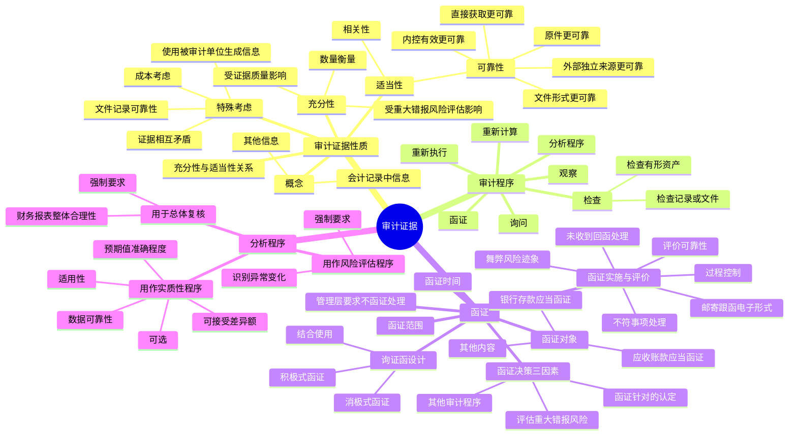

## 1. 章节定位

| 项目 | 信息 |
|------|------|
| 所属科目 | 审计 |
| 难度等级 | 4 |
| 历年分值 | 5-8 分 |
| 建议学时 | 8-10 小时 |
| 知识关联章节 | 第1章 审计概述（审计要素、认定）、第7章 风险评估（风险评估程序）、第8章 风险应对（控制测试和实质性程序）、第10-13章 各业务循环审计 |

## 2. 考情分析

本章是审计科目的核心章节之一，历年分值约 5-8 分，以客观题和简答题为主。本章内容是后续各章审计程序设计的基础，函证程序和分析程序是高频考点。

**命题规律**：本章以概念理解、程序判断为主，函证的决策、设计、实施和评价是简答题的常见命题点，分析程序的三种运用目的及特点也常考。

**高频考点分布**：

1. **审计证据的性质**：审计证据的充分性（数量）和适当性（相关性 + 可靠性）；充分性和适当性的关系；可靠性的五个判断原则。
2. **审计程序的种类**：检查、观察、询问、函证、重新计算、重新执行、分析程序，七种程序的含义及其能够提供的审计证据。
3. **函证决策**：评估的认定层次重大错报风险、函证程序针对的认定、实施除函证以外的其他审计程序三个因素的考虑。
4. **函证的对象**：银行存款（应当函证，除非不重要且风险很低）、应收账款（应当函证，除非不重要或函证很可能无效）、其他可以函证的内容。
5. **询证函的设计**：积极式函证与消极式函证的区分和适用条件；设计询证函需要考虑的因素。
6. **函证的实施与评价**：对函证过程的控制（邮寄、跟函、电子形式）；积极式函证未收到回函时的处理；评价函证的可靠性；对不符事项的处理；舞弊风险迹象。
7. **分析程序**：用作风险评估程序（强制）、用作实质性程序（可选）、用于总体复核（强制）三种目的及特点；实质性分析程序的适用性、数据的可靠性、预期值的准确程度、可接受的差异额。

**联动考查方式**：
- 函证与第10章销售与收款循环、第11章采购与付款循环结合考查；
- 分析程序与第7章风险评估、第8章风险应对结合考查；
- 审计证据的充分性和适当性与第5章审计抽样结合考查。

**备考建议**：
- 牢记可靠性的五个判断原则（外部独立来源、内控有效、直接获取、文件形式、原件）；
- 区分积极式函证（必须回函）和消极式函证（仅在不同意时回函），消极式函证的四个适用条件；
- 银行存款和应收账款的函证是"应当"函证，除非有特定例外情形；
- 分析程序在风险评估阶段和总体复核阶段是强制要求，在实质性程序阶段是可选的；
- 理解"函证回函不可靠"的情形和应对措施。

## 3. 知识框架

## 4. 核心精讲

### 4.1 审计证据的性质

#### 4.1.1 审计证据的概念

**审计证据**是指注册会计师为了得出审计结论、形成审计意见而使用的所有信息。审计证据包括构成财务报表基础的会计记录所含有的信息和其他的信息。

**（1）会计记录中含有的信息**

会计记录主要包括原始凭证、记账凭证、总分类账和明细分类账、未在记账凭证中反映的对财务报表的其他调整，以及支持成本分配、计算、调节和披露的手工计算表和电子数据表。这些会计记录是编制财务报表的基础，构成注册会计师执行财务报表审计业务所需获取的审计证据的重要部分。

**（2）其他的信息**

会计记录中含有的信息本身并不足以提供充分的审计证据，注册会计师还应当获取用作审计证据的其他的信息，包括：
- 从被审计单位内部或外部获取的会计记录以外的信息（如会议记录、内部控制手册、询证函的回函、分析师的报告等）；
- 通过询问、观察和检查等审计程序获取的信息；
- 自身编制或获取的可以通过合理推断得出结论的信息（如各种计算表、分析表等）。

**重要原则**：财务报表依据的会计记录中包含的信息和其他的信息共同构成了审计证据，两者缺一不可。如果没有前者，审计工作将无法进行；如果没有后者，可能无法识别重大错报风险。

#### 4.1.2 审计证据的充分性

**审计证据的充分性**是对审计证据数量的衡量，主要与注册会计师确定的样本量有关。

注册会计师需要获取的审计证据的数量受下列因素影响：
- **重大错报风险评估**：评估的重大错报风险越高，需要的审计证据可能越多；
- **审计证据质量**：审计证据质量越高，需要的审计证据可能越少。

**重要原则**：注册会计师仅靠获取更多的审计证据可能无法弥补其质量上的缺陷。

#### 4.1.3 审计证据的适当性

**审计证据的适当性**是对审计证据质量的衡量，即审计证据在支持审计意见所依据的结论方面具有的相关性和可靠性。

**（1）相关性**

相关性是指用作审计证据的信息与审计程序的目的和所考虑的相关认定之间的逻辑联系。用作审计证据的信息的相关性可能受测试方向的影响。

- 测试应付账款的多计错报：测试已记录的应付账款是相关的；
- 测试应付账款的漏记错报：测试已记录的应付账款很可能不是相关的，相关程序可能是测试期后支出、未支付发票、供应商结算单以及发票未到的收货报告单等。

特定审计程序可能只为某些认定提供相关审计证据，而与其他认定无关。有关某一特定认定的审计证据不能替代与其他认定相关的审计证据。

**（2）可靠性**

审计证据的可靠性是指证据的可信程度。注册会计师在判断审计证据的可靠性时，通常考虑下列五个原则：

| 原则 | 说明 | 例子 |
|------|------|------|
| 外部独立来源更可靠 | 从外部独立来源获取的审计证据比从其他来源获取的更可靠 | 银行询证函回函、应收账款询证函回函、保险公司出具的证明 |
| 内控有效时更可靠 | 内部控制有效时内部生成的审计证据比内部控制薄弱时内部生成的更可靠 | 销售内控有效时，销售发票和发货单更可靠 |
| 直接获取更可靠 | 直接获取的审计证据比间接获取或推论得出的更可靠 | 观察内部控制运行比询问内部控制运行更可靠 |
| 文件形式更可靠 | 以文件、记录形式存在的审计证据比口头形式的更可靠 | 会议的同步书面记录比事后的口头表述更可靠 |
| 原件更可靠 | 从原件获取的审计证据比从传真件或复印件获取的更可靠 | 审查原件是否有被涂改或伪造的迹象 |

**例外情况**：审计证据虽然是从独立的外部来源获得，但如果该证据是由不知情者或不具备资格者提供，也可能是不可靠的。如果注册会计师不具备评价证据的专业能力，即使是直接获取的证据也可能不可靠。

**（3）充分性和适当性之间的关系**

充分性和适当性是审计证据的两个重要特征，两者缺一不可。审计证据的适当性会影响审计证据的充分性（质量越高，需要的数量可能越少）。但如果审计证据的质量存在缺陷，仅靠获取更多的审计证据可能无法弥补其质量上的缺陷。

#### 4.1.4 评价充分性和适当性时的特殊考虑

**（1）对文件记录可靠性的考虑**

审计工作通常不涉及鉴定文件记录的真伪，但应当考虑用作审计证据的信息的可靠性，并考虑与这些信息生成和维护相关控制的有效性。如果在审计过程中识别出的情况使其认为文件记录可能是伪造的，或文件记录中的某些条款已发生变动，注册会计师应当作出进一步调查，包括直接向第三方询证，或考虑利用专家的工作以评价文件记录的真伪。

**（2）使用被审计单位生成信息时的考虑**

实施审计程序时使用的被审计单位生成的信息需要足够完整和准确。如果针对这类信息的完整性和准确性获取审计证据是所实施审计程序本身不可分割的组成部分，可以与对这些信息实施的审计程序同时进行；在其他情况下，通过测试针对生成和维护这些信息的控制获得审计证据。

**（3）证据相互矛盾时的考虑**

如果从不同来源获取的审计证据或获取的不同性质的审计证据能够相互印证，与该项认定相关的审计证据具有更强的说服力。如果不一致，表明某项审计证据可能不可靠，注册会计师应当追加必要的审计程序。

**（4）获取审计证据时对成本的考虑**

注册会计师可以考虑获取审计证据的成本与所获取信息的有用性之间的关系，但**不应以获取审计证据的困难和成本为理由减少不可替代的审计程序**。例如，存货监盘是证实存货"存在"认定的不可替代的审计程序，不得以检查成本高和难以实施为由而不实施。

### 4.2 审计程序

#### 4.2.1 审计程序的概念和作用

**审计程序**是指注册会计师在审计过程中的某个时间，对将要获取的某类审计证据如何进行收集的详细指令。注册会计师利用审计程序获取审计证据涉及以下四个方面的决策：(1) 选用何种审计程序；(2) 对选定的审计程序，应当选取多大的样本规模；(3) 应当从总体中选取哪些项目；(4) 何时实施这些程序。

#### 4.2.2 审计程序的种类

在审计过程中，注册会计师可根据需要单独或综合运用以下七种审计程序：

| 审计程序 | 含义 | 能够提供的审计证据 |
|---------|------|------------------|
| 检查 | 对被审计单位内部或外部生成的，以纸质、电子或其他介质形式存在的记录和文件进行审查，或对资产进行实物审查 | 检查记录或文件提供可靠程度不同的证据；检查有形资产可为"存在"认定提供可靠证据，但不一定能为"权利和义务"或"准确性、计价和分摊"认定提供可靠证据 |
| 观察 | 查看相关人员正在从事的活动或实施的程序 | 提供执行有关过程或实施程序的证据，但仅限于观察发生的时点，且被观察人员行为可能因被观察而受影响 |
| 询问 | 以书面或口头方式，向被审计单位内部或外部的知情人员获取财务信息和非财务信息，并对答复进行评价的过程 | 提供尚未获悉的信息或佐证证据，也可能提供与已获取信息存在重大差异的信息 |
| 函证 | 直接从第三方（被询证者）获取书面答复以作为审计证据的过程 | 为与特定账户余额及其项目相关的认定提供证据，如"存在"及"权利和义务"认定 |
| 重新计算 | 对记录或文件中的数据计算的准确性进行核对 | 验证计算的准确性 |
| 重新执行 | 独立执行原本作为被审计单位内部控制组成部分的程序或控制 | 评价内部控制运行有效性 |
| 分析程序 | 通过分析不同财务数据之间以及财务数据与非财务数据之间的内在关系，对财务信息作出评价 | 用作风险评估程序、实质性程序和总体复核 |

上述审计程序基于审计的不同阶段和目的单独或组合起来，可用作**风险评估程序、控制测试和实质性程序**。

### 4.3 函证

#### 4.3.1 函证决策

注册会计师应当确定是否有必要实施函证以获取认定层次的充分、适当的审计证据。在作出决策时，应当考虑以下三个因素：

**（1）评估的认定层次重大错报风险**

评估的认定层次重大错报风险水平越高，注册会计师对通过实质性程序获取的审计证据的相关性和可靠性的要求越高，函证程序的运用对于提供充分、适当的审计证据可能是有效的。

如果认为某项风险属于特别风险，注册会计师需要考虑是否通过函证特定事项以降低检查风险。

**（2）函证程序针对的认定**

函证可以为某些认定提供审计证据，但对不同的认定，函证的证明力是不同的。例如，在函证应收账款时，函证可能为"存在"及"权利和义务"认定提供相关可靠的审计证据，但是不能为"准确性、计价和分摊"认定（应收账款涉及的坏账准备计提）提供证据。

**（3）实施除函证以外的其他审计程序**

针对同一项认定可以从不同来源获取审计证据或获取不同性质的审计证据。注册会计师应当考虑被审计单位的经营环境、内部控制的有效性、账户或交易的性质、被询证者处理询证函的习惯做法及回函的可能性等。

除上述三个因素外，注册会计师还可以考虑：被询证者对函证事项的了解；预期被询证者回复询证函的能力或意愿；预期被询证者的客观性。

#### 4.3.2 函证的内容

**（1）函证的对象**

| 对象 | 规定 |
|------|------|
| 银行存款、借款及与金融机构往来的其他重要信息 | **应当**实施函证程序，除非有充分证据表明某一银行存款、借款及与金融机构往来的其他重要信息对财务报表不重要且与之相关的重大错报风险很低。如果不实施函证，应当在审计工作底稿中说明理由 |
| 应收账款 | **应当**实施函证程序，除非有充分证据表明应收账款对财务报表不重要，或函证很可能无效。如果认为函证很可能无效，应当实施替代审计程序。如果不实施函证，应当在审计工作底稿中说明理由 |
| 其他内容 | 可以根据具体情况和实际需要实施函证：交易性金融资产、应收票据、其他应收款、预付账款、由其他单位代为保管加工或销售的存货、长期股权投资、应付账款、预收账款、保证抵押或质押、或有事项、重大或异常的交易 |

**（2）函证程序实施的范围**

如果采用审计抽样的方式确定函证程序的范围，选取的样本应当足以代表总体。选取的特定项目可能包括：金额较大的项目；账龄较长的项目；交易频繁但期末余额较小的项目；重大关联方交易；重大或异常的交易；可能存在争议、舞弊或错误的交易。

**（3）函证的时间**

注册会计师通常以资产负债表日为截止日，在资产负债表日后适当时间内实施函证。如果重大错报风险评估为低水平，可选择资产负债表日前适当日期为截止日实施函证，并对所函证项目自该截止日起至资产负债表日止发生的变动实施实质性程序。

**（4）管理层要求不实施函证时的处理**

当管理层要求对拟函证的某些账户余额或其他信息不实施函证时，注册会计师应当考虑该项要求是否合理，并获取审计证据予以支持。

- 如果认为管理层的要求合理：应当实施替代审计程序；
- 如果认为管理层的要求不合理，且被其阻挠而无法实施函证：应当视为审计范围受到限制，并考虑对审计报告可能产生的影响。

分析管理层要求不实施函证的原因时，应当保持职业怀疑态度，考虑：管理层是否诚信；是否可能存在重大的舞弊或错误；替代审计程序能否提供充分、适当的审计证据。

#### 4.3.3 询证函的设计

**（1）设计询证函的总体要求**

注册会计师应当根据特定审计目标设计询证函。在针对账户余额的"存在"认定获取审计证据时，应当在询证函中列明相关信息，要求对方核对确认；在针对账户余额的"完整性"认定获取审计证据时，需要改变询证函的内容设计（如不列出账户余额，要求被询证者提供余额信息）。

**（2）积极式函证与消极式函证**

| 类型 | 含义 | 特点 |
|------|------|------|
| 积极式函证 | 要求被询证者必须回函，确认询证函所列示信息是否正确，或填列询证函要求的信息 | 只有收到回函才能为财务报表认定提供审计证据；未收到回函不能证明所函证信息是否正确 |
| 消极式函证 | 只要求被询证者仅在不同意询证函列示信息的情况下才予以回函 | 未收到回函不能明确表明预期的被询证者已经收到询证函或已核实信息的准确性；提供的审计证据远不如积极式函证有说服力 |

**积极式函证的两种形式**：
1. 列明拟函证的账户余额或其他信息，要求被询证者确认（回复能提供可靠的审计证据，但被询证者可能不验证就回函确认）；
2. 不列明账户余额或其他信息，要求被询证者填写有关信息或提供进一步信息（要求被询证者作出更多努力，可能导致回函率降低）。

**消极式函证的四个适用条件**（同时存在）：
1. 重大错报风险评估为低水平；
2. 涉及大量余额较小的账户；
3. 预期不存在大量的错误；
4. 没有理由相信被询证者不认真对待函证。

**两种方式的结合使用**：可以对大额应收账款采用积极式函证，对小额应收账款采用消极式函证。

#### 4.3.4 函证的实施与评价

**（1）对函证过程的控制**

注册会计师应当对函证的全过程保持控制。询证函经被审计单位盖章后，应当由注册会计师直接发出。

**通过不同方式发出询证函时的控制措施**：

| 方式 | 控制措施 |
|------|---------|
| 邮寄 | 不使用被审计单位本身的邮寄设施，独立寄发询证函（如直接在邮局投递） |
| 跟函 | 注册会计师独自或在被审计单位员工陪伴下亲自将询证函送至被询证者；如需陪伴，保持对询证函的控制，对串通舞弊风险保持警觉 |
| 电子形式 | 评估使用不同平台的安全可靠性；对第三方电子询证函平台考虑独立性、安全性风险；采用加密技术、电子数码签名技术、网页真实性认证程序 |

**（2）积极式函证未收到回函时的处理**

如果在合理的时间内没有收到询证函回函，应当考虑必要时再次向被询证者寄发询证函。如果未能得到被询证者的回应，应当实施替代审计程序。

**重要规定**：在某些情况下，取得积极式函证回函是获取充分、适当的审计证据的必要程序（可获取的佐证管理层认定的信息只能从被审计单位外部获得；存在特定舞弊风险因素）。如果认为取得积极式函证回函是必要程序，则替代程序不能提供所需要的审计证据，如果未获取回函，应当确定其对审计工作和审计意见的影响。

**（3）评价函证的可靠性**

在评价函证的可靠性时，注册会计师应当考虑：对询证函的设计、发出及收回的控制情况；被询证者的胜任能力、独立性、授权回函情况、对函证项目的了解及其客观性；被审计单位施加的限制或回函中的限制。

**验证回函可靠性的程序**：

| 回函方式 | 验证程序 |
|---------|---------|
| 邮寄方式收到的回函 | 验证是否原件、是否由被询证者直接寄给注册会计师、回邮信封的发件方名称地址是否一致、邮戳显示发出城市是否一致、印章签名是否一致 |
| 跟函方式收到的回函 | 了解处理函证的通常流程和处理人员、确认处理人员的身份和权限、观察处理人员是否按正常流程处理 |
| 电子形式收到的回函 | 由于回函者身份及授权难以确定，可靠性存在风险；采用加密技术、电子数码签名技术、网页真实性认证程序；可以与被询证者联系核实回函的来源及内容 |
| 口头回复 | 不是直接书面回复，不能作为可靠的审计证据；要求被询证者提供直接书面回复；如仍未收到，实施替代程序 |

**回函中免责或其他限制条款的处理**：
- 对回函可靠性不产生影响的条款：格式化的免责条款（如"提供本信息仅出于礼貌"）；与所测试认定无关的限制条款。
- 对回函可靠性产生影响的限制条款：如"本信息是从电子数据库中取得，可能不包括全部信息"；"接收人不能依赖函证中的信息"。如果限制条款使回函作为可靠审计证据的程度受到限制，可能需要实施额外的或替代审计程序。

**（4）对不符事项的处理**

**不符事项**是指被询证者提供的信息与询证函要求确认的信息不一致，或与被审计单位记录的信息不一致。注册会计师应当调查不符事项，以确定是否表明存在错报。某些不符事项并不表明存在错报（如由于函证程序的时间安排、计量或书写错误造成的差异）。

**（5）实施函证时需要关注的舞弊风险迹象**

舞弊风险迹象的情形包括：管理层不允许寄发询证函；管理层过度热情配合函证程序；管理层试图干预、拦截、篡改询证函或回函；被询证者将回函寄至被审计单位转交注册会计师；从私人电子信箱发送的回函；收到同一日期发回的、相同笔迹的多份回函；不正常的回函率；被询证者缺乏独立性等。

### 4.4 分析程序

#### 4.4.1 分析程序的目的

**分析程序**是指注册会计师通过分析不同财务数据之间以及财务数据与非财务数据之间的内在关系，对财务信息作出评价。分析程序还包括在必要时对识别出的、与其他相关信息不一致或与预期值差异重大的波动或关系进行调查。

注册会计师实施分析程序的目的包括三种：

| 目的 | 是否强制 | 说明 |
|------|---------|------|
| 用作风险评估程序 | **强制** | 以了解被审计单位及其环境等方面情况，识别和评估重大错报风险 |
| 用作实质性程序 | **可选** | 当使用分析程序比细节测试能更有效地将认定层次的检查风险降至可接受的水平时使用 |
| 用于总体复核 | **强制** | 在临近审计结束时对财务报表进行总体复核，确定财务报表整体是否与其对被审计单位的了解一致 |

#### 4.4.2 用作风险评估程序

注册会计师在实施风险评估程序时，**应当**运用分析程序。在这个阶段运用分析程序是强制要求。

**具体运用**：将分析程序与询问、检查和观察程序结合运用，重点关注关键的账户余额、趋势和财务比率关系等方面，对其形成一个合理的预期，并与被审计单位记录的金额、依据记录金额计算的比率或趋势相比较。

**特点**：所使用的数据汇总性比较强，其对象主要是财务报表中账户余额及其相互之间的关系；所使用的分析程序通常包括对账户余额变化的分析，并辅之以趋势分析和比率分析。与实质性分析程序相比，风险评估过程中使用的分析程序的比较性质、预期值精确度、分析和调查的范围都并不足以提供充分、适当的审计证据。

**注意**：注册会计师无需在了解被审计单位及其环境的每一方面时都实施分析程序。例如，在对内部控制的了解中，一般不会运用分析程序。

#### 4.4.3 用作实质性程序

**实质性分析程序**是指用作实质性程序的分析程序。当使用分析程序比细节测试能更有效地将认定层次的检查风险降至可接受的水平时，可以考虑单独或结合细节测试运用实质性分析程序。

**重要原则**：相对于细节测试而言，实质性分析程序能够达到的精确度可能受到限制，所提供的证据在很大程度上是间接证据，证明力相对较弱。注册会计师不能仅依赖实质性分析程序，而忽略对细节测试的运用。

**设计和实施实质性分析程序时应当**：
1. 考虑针对所涉及认定评估的重大错报风险和实施的细节测试（如有），确定特定实质性分析程序对这些认定的适用性；
2. 考虑可获得信息的来源、可比性、性质和相关性以及与信息编制相关的控制，评价在对已记录的金额或比率作出预期时使用数据的可靠性；
3. 对已记录的金额或比率作出预期，并评价预期值是否足够精确以识别重大错报；
4. 确定已记录金额与预期值之间可接受的、且无须做进一步调查的差异额。

**（1）实质性分析程序对特定认定的适用性**

实质性分析程序通常更适用于在一段时期内存在预期关系的大量交易。某一分析程序的适用性，取决于注册会计师评价该分析程序在发现某一错报可能引起财务报表存在重大错报时的有效性。

**（2）数据的可靠性**

数据的可靠性直接影响根据数据形成的预期值。数据的可靠性受其信息来源和性质的影响。确定数据可靠性时考虑的因素：可获得信息的来源；可获得信息的可比性；可获得信息的性质和相关性；与信息编制相关的控制。

**（3）评价预期值的准确程度**

分析程序的有效性很大程度上取决于注册会计师形成的预期值的准确性。预期值的准确性越高，注册会计师通过分析程序获取的保证水平将越高。考虑因素：对实质性分析程序的预期结果作出预测的准确性；信息可分解的程度（数据可分解程度越高，预期值准确性越高）；财务和非财务信息的可获得性。

**（4）已记录金额与预期值之间可接受的差异额**

注册会计师评估的风险越高，越需要获取有说服力的审计证据，可接受的、无须作进一步调查的差异额将会降低。

#### 4.4.4 用于总体复核

在临近审计结束时，注册会计师**应当**运用分析程序，这是强制要求。

**特点**：在总体复核阶段实施的分析程序主要在于强调并解释财务报表项目自上个会计期间以来发生的重大变化，以证实财务报表中列报的所有信息与注册会计师对被审计单位及其环境等方面情况的了解一致。总体复核阶段的分析程序集中在财务报表层次，并不如实质性分析程序那样详细和具体。

**再评估重大错报风险**：如果识别出以前未识别的重大错报风险，注册会计师应当重新考虑对全部或部分各类交易、账户余额和披露评估的风险是否恰当，并在此基础上重新评价之前计划的审计程序是否充分，是否有必要追加审计程序。

## 5. 典型例题

**【例题 1】（审计证据可靠性的判断）**

下列关于审计证据可靠性的说法中，正确的有（多项选择题）：

A. 从外部独立来源获取的审计证据比从被审计单位内部获取的审计证据更可靠
B. 内部控制有效时内部生成的审计证据比内部控制薄弱时内部生成的审计证据更可靠
C. 直接获取的审计证据比间接获取或推论得出的审计证据更可靠
D. 以文件、记录形式存在的审计证据比口头形式的审计证据更可靠
E. 从复印件获取的审计证据比从原件获取的审计证据更可靠

**答案**：A、B、C、D

**解析**：

A 正确。从外部独立来源获取的审计证据未经被审计单位有关职员之手，减少了伪造、更改凭证或业务记录的可能性，证明力最强。
B 正确。如果被审计单位内部控制有效，会计记录的可信赖程度将会增加。
C 正确。直接获取的审计证据（如观察内部控制运行）比间接获取或推论得出的审计证据（如询问内部控制运行）更可靠。
D 正确。以文件、记录形式存在的审计证据比口头形式的审计证据更可靠。
E 错误。从原件获取的审计证据比从传真件或复印件获取的审计证据更可靠，因为复印件容易是篡改或伪造的结果。

**【例题 2】（函证程序的处理）**

ABC 会计师事务所审计甲公司 2×24 年度财务报表。在审计过程中，遇到以下与函证相关的事项：
(1) 甲公司管理层以"客户关系敏感"为由，要求注册会计师不向某重要客户函证应收账款；
(2) 注册会计师对某客户发出积极式询证函，未收到回函，实施了替代审计程序；
(3) 注册会计师收到某客户的回函，回函中注明"本信息是从电子数据库中取得，可能不包括被询证方所拥有的全部信息"；
(4) 注册会计师收到银行回函，发现回函上的发件地址与被审计单位记录的银行地址不一致。

要求：分别说明注册会计师应当如何处理上述事项。

**答案**：

(1) 管理层要求不实施函证时，注册会计师应当考虑该项要求是否合理，并获取审计证据予以支持。应当保持职业怀疑态度，考虑管理层是否诚信、是否可能存在重大的舞弊或错误、替代审计程序能否提供充分适当的审计证据。如果认为管理层的要求合理，应当实施替代审计程序；如果认为管理层的要求不合理，且被其阻挠而无法实施函证，应当视为审计范围受到限制，并考虑对审计报告可能产生的影响。本题中"客户关系敏感"的理由可能不合理，注册会计师应当进一步调查原因，如认为不合理且被阻挠，应视为审计范围受到限制。

(2) 积极式函证未收到回函时，应当考虑必要时再次向被询证者寄发询证函。如果仍未得到回应，应当实施替代审计程序（如检查期后收回的款项、检查销售合同、销售发票、发货单等原始凭证）。但需要注意，如果认为取得积极式函证回函是获取充分适当审计证据的必要程序，则替代程序不能提供所需要的审计证据，应当确定其对审计工作和审计意见的影响。

(3) 回函中"本信息是从电子数据库中取得，可能不包括全部信息"属于对回函可靠性产生影响的限制条款。注册会计师可能需要实施额外的或替代审计程序，这些程序的性质和范围取决于财务报表项目的性质、所测试的认定、限制条款的性质和实质，以及通过其他审计程序获取的相关证据等因素。如果不能通过替代或额外的审计程序获取充分适当的审计证据，应当按照非无保留意见的规定确定其对审计工作和审计意见的影响。

(4) 回函上的发件地址与被审计单位记录的银行地址不一致，属于舞弊风险迹象。注册会计师应当保持职业怀疑，实施进一步调查，包括：验证被询证者是否存在、是否与被审计单位之间缺乏独立性；将从其他来源得到的被询证者的地址相比较；将被审计单位档案中有关被询证者的签名样本、公司公章与回函核对；必要时前往被询证者工作地点验证其是否存在；考虑从金融机构获得被审计单位的信用记录等。

**解析**：函证程序的处理是高频考点。要区分管理层要求不函证的处理、未收到回函的处理、回函可靠性受限的处理、舞弊风险迹象的应对等不同情形。

**【例题 3】（分析程序的运用）**

关于分析程序的运用，下列说法中正确的有（多项选择题）：

A. 注册会计师在实施风险评估程序时应当运用分析程序
B. 注册会计师在实施实质性程序时应当运用分析程序
C. 注册会计师在临近审计结束时应当运用分析程序对财务报表进行总体复核
D. 实质性分析程序通常更适用于在一段时期内存在预期关系的大量交易
E. 注册会计师评估的风险越高，可接受的、无须作进一步调查的差异额将会降低

**答案**：A、C、D、E

**解析**：

A 正确。在实施风险评估程序时运用分析程序是强制要求。
B 错误。在实施实质性程序时运用分析程序是可选的，不是强制要求。"应当"一词错误，应为"可以"。
C 正确。在临近审计结束时运用分析程序进行总体复核是强制要求。
D 正确。实质性分析程序通常更适用于在一段时期内存在预期关系的大量交易。
E 正确。评估的风险越高，越需要获取有说服力的审计证据，可接受的差异额将会降低。

## 6. 记忆口诀

**审计证据两特征**："充分性数量适当性质量，相关性加可靠性"——充分性是数量，适当性是质量（相关性 + 可靠性）。

**可靠性五原则**："外部独立、内控有效、直接获取、文件形式、原件"——五个判断可靠性的原则。

**充分性与适当性关系**："质量影响数量，但数量弥补不了质量缺陷"——质量越高需要的数量越少，但数量弥补不了质量缺陷。

**七种审计程序**："检查观察询问函证，重新计算重新执行，分析程序"——七种审计程序。

**函证决策三因素**："评估重大错报风险、函证针对的认定、其他审计程序"——三个因素。

**应当函证的对象**："银行存款应当函证除非不重要且风险低，应收账款应当函证除非不重要或很可能无效"——银行存款和应收账款的函证规定。

**积极式 vs 消极式函证**："积极式必须回函，消极式仅在不同意时回函"——两种函证方式的核心区别。

**消极式函证四条件**："风险低水平、大量小额账户、预期无大量错误、被询证者认真对待"——四个条件同时满足。

**管理层不函证处理**："合理则替代程序，不合理且阻挠则范围受限"——两种处理方式。

**函证过程控制**："注册会计师直接发出，邮寄不used被审计单位设施，跟函保持控制，电子形式评估安全"——三种发出方式的控制。

**回函可靠性验证**："邮寄验证原件地址邮戳印章，跟函确认身份权限观察流程，电子形式加密签名认证，口头回复不可靠需书面"——四种回函方式的验证。

**分析程序三目的**："风险评估强制、实质性程序可选、总体复核强制"——三种目的的强制性和可选性。

**实质性分析程序四要素**："适用性、数据可靠性、预期值准确程度、可接受差异额"——四个设计和实施要素。

**不可替代程序**："不以困难成本为由减少不可替代程序，存货监盘是典型"——成本不能作为减少不可替代程序的理由。

**证据相互矛盾**："相互印证更有说服力，不一致追加审计程序"——证据一致和不一致的处理。

**函证回函限制条款**："格式化免责不影响可靠性，实质性限制影响可靠性需额外程序"——两种限制条款的处理。

**舞弊风险迹象**："管理层不允许、过度热情、干预拦截、回函寄至被审计单位、私人邮箱、相同笔迹、不正常回函率、缺乏独立性"——常见的舞弊风险迹象。
