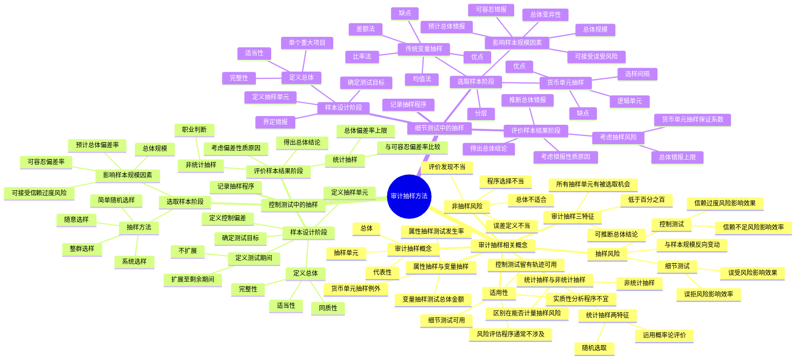

## 1. 章节定位

| 项目 | 信息 |
|------|------|
| 所属科目 | 审计 |
| 难度等级 | 4 |
| 历年分值 | 5-8 分 |
| 建议学时 | 8-10 小时 |
| 知识关联章节 | 第4章 审计证据（审计程序、样本规模）、第7章 风险评估（控制测试）、第8章 风险应对（控制测试和细节测试）、第10-13章 各业务循环审计 |

## 2. 考情分析

本章是审计科目的重要章节，历年分值约 5-8 分，以客观题、简答题为主，也常结合综合题考查。本章内容是审计程序设计与实施的关键工具，控制测试和细节测试中的抽样应用是高频考点。

**命题规律**：本章以概念辨析、抽样方法选择、样本结果评价为主，抽样风险的分类及影响、货币单元抽样与传统变量抽样的优缺点比较、样本结果评价的计算是简答题的常见命题点。

**高频考点分布**：

1. **审计抽样的概念与特征**：审计抽样的三个基本特征（低于百分之百、所有抽样单元都有被选取机会、可以推断总体结论）；代表性的含义；审计抽样的适用性（风险评估程序通常不涉及、控制测试留有轨迹时可使用、细节测试可使用、实质性分析程序不宜使用）。
2. **抽样风险与非抽样风险**：控制测试中的两类抽样风险（信赖过度风险影响效果、信赖不足风险影响效率）；细节测试中的两类抽样风险（误受风险影响效果、误拒风险影响效率）；非抽样风险的成因；抽样风险与样本规模的反向变动关系。
3. **统计抽样与非统计抽样**：统计抽样的两个特征（随机选取、运用概率论评价）；非统计抽样的特点；两者最重要的区别（能否客观计量抽样风险）。
4. **属性抽样与变量抽样**：属性抽样测试发生率、变量抽样测试总体金额；货币单元抽样运用属性抽样原理得出以金额表示的结论。
5. **控制测试中的审计抽样**：样本设计阶段（总体适当性完整性、抽样单元、控制偏差定义、测试期间）；选取样本阶段（简单随机选样、系统选样、随意选样、整群选样；影响样本规模的因素）；评价样本结果阶段（统计抽样用总体偏差率上限、非统计抽样用职业判断；考虑偏差性质和原因）。
6. **细节测试中的审计抽样**：货币单元抽样（优缺点、选样间隔、逻辑单元）；传统变量抽样（均值法、差额法、比率法）；影响样本规模的因素；评价样本结果（推断错报、考虑抽样风险、货币单元抽样的保证系数与总体错报上限）。
7. **样本结果评价的计算**：货币单元抽样中总体错报上限的计算（基本精确度、保证系数增量）；传统变量抽样中均值法、差额法、比率法的计算公式。

**联动考查方式**：
- 审计抽样与第4章审计证据（充分性和适当性）结合考查；
- 控制测试中的抽样与第8章风险应对（控制测试）结合考查；
- 细节测试中的抽样与第10-13章各业务循环审计（应收账款函证、存货测试）结合考查；
- 抽样风险与审计风险模型（审计风险=重大错报风险×检查风险）结合考查。

**备考建议**：
- 牢记四类抽样风险的分类及其对审计效果/效率的影响（"过受影响效果，不足拒影响效率"）；
- 区分统计抽样与非统计抽样的关键（能否计量抽样风险），统计抽样必须同时具备随机选取和概率论评价两个特征；
- 掌握货币单元抽样的核心特点（以货币单元为抽样单元、大金额更易被选中、无需分层、不适用于测试低估）；
- 熟练掌握货币单元抽样总体错报上限的计算（基本精确度+推断错报×保证系数增量+事实错报）；
- 理解可容忍偏差率（控制测试）与可容忍错报（细节测试）的区别；
- 记住影响样本规模各因素与样本规模的方向关系（可接受风险反向、可容忍反向、预计总体同向、总体规模影响小、变异性同向）。

## 3. 知识框架

## 4. 核心精讲

### 4.1 审计抽样的相关概念

#### 4.1.1 审计抽样的概念与特征

**审计抽样**是指注册会计师对具有审计相关性的总体中低于百分之百的项目实施审计程序，使所有抽样单元都有被选取的机会，为注册会计师针对整个总体得出结论提供合理基础。

- **总体**：注册会计师从中选取样本并期望据此得出结论的整个数据集合。
- **抽样单元**：构成总体的个体项目。

**审计抽样应当同时具备三个基本特征**：

1. 对具有审计相关性的总体中低于百分之百的项目实施审计程序；
2. 所有抽样单元都有被选取的机会；
3. 可以根据样本项目的测试结果推断出有关总体的结论。

**代表性**是指在既定的风险水平下，注册会计师根据样本得出的结论，与对整个总体实施与样本相同的审计程序得出的结论类似。代表性与整个样本相关，与样本中的单个项目无关；与如何选取样本相关，与样本规模无关；与错报的发生率相关，与错报的特定性质无关（异常误差不具有代表性）。如果样本的选取是无偏向的，该样本通常就具有了代表性。

**三种选取项目测试的方法**：

1. 对某总体包含的全部项目进行测试（全查，如资本公积项目）；
2. 对选出的特定项目进行测试，但不推断总体（非审计抽样）；
3. 审计抽样，以样本结果推断总体结论。

#### 4.1.2 审计抽样的适用性

审计抽样并非在所有审计程序中都可使用：

| 审计程序类型 | 能否使用审计抽样 | 说明 |
|------------|----------------|------|
| 风险评估程序 | 通常不涉及 | 若了解控制的同时计划和实施控制测试，则可能涉及，但仅适用于控制测试部分 |
| 控制测试（留有轨迹） | 可以使用 | 当控制的运行留下轨迹时，可以考虑使用审计抽样 |
| 控制测试（未留轨迹） | 不宜使用 | 通常实施询问、观察等程序 |
| 细节测试 | 可以使用 | 在实施细节测试时可以使用审计抽样验证认定或独立估计 |
| 实质性分析程序 | 不宜使用 | 目的不是根据样本推断总体结论 |

审计抽样可以与其他选取测试项目的方法结合进行。例如，在审计应收账款时，可以使用选取特定项目的方法将单个重大项目挑选出来单独测试，再针对剩余的应收账款余额进行抽样。

#### 4.1.3 抽样风险与非抽样风险

在使用审计抽样时，审计风险既可能受到抽样风险的影响，又可能受到非抽样风险的影响。

**（一）抽样风险**

抽样风险是指注册会计师根据样本得出的结论，不同于对整个总体实施与样本相同的审计程序得出的结论的可能性。抽样风险是由抽样引起的，与样本规模和抽样方法相关。

| 测试类型 | 抽样风险种类 | 含义 | 影响 | 关注程度 |
|---------|------------|------|------|---------|
| 控制测试 | 信赖过度风险 | 推断的控制有效性高于其实际有效性 | 影响审计效果 | 更应关注 |
| 控制测试 | 信赖不足风险 | 推断的控制有效性低于其实际有效性 | 影响审计效率 | 影响较小 |
| 细节测试 | 误受风险 | 推断某一重大错报不存在而实际上存在 | 影响审计效果 | 更应关注 |
| 细节测试 | 误拒风险 | 推断某一重大错报存在而实际上不存在 | 影响审计效率 | 影响较大 |

**核心规律**：
- 影响审计效果的抽样风险（信赖过度风险、误受风险）更容易导致发表不恰当的审计意见，注册会计师更应予以关注；
- 影响审计效率的抽样风险（信赖不足风险、误拒风险）虽导致审计过度但影响相对较小；
- 抽样风险与样本规模是反向变动关系：样本规模越小，抽样风险越大；样本规模越大，抽样风险越小；
- 只要使用了审计抽样，抽样风险总会存在；如果对总体中的所有项目都实施检查，就不存在抽样风险。

**（二）非抽样风险**

非抽样风险是指注册会计师由于任何与抽样风险无关的原因而得出错误结论的可能性。非抽样风险是由人为因素造成的，主要成因包括：

1. 注册会计师选择了不适于实现特定目标的审计程序（如依赖应收账款函证来揭露未入账的应收账款）；
2. 注册会计师选择的总体不适合于测试目标（如测试销售收入"完整性"时将主营业务收入日记账界定为总体）；
3. 注册会计师未能适当地定义误差（如测试现金支付授权控制时未将签字人未得到适当授权的情况界定为控制偏差）；
4. 注册会计师未能适当地评价审计发现的情况（如错误解读审计证据，或对误差重要性的判断有误）。

非抽样风险难以量化，但通过采取适当的质量管理政策和程序，对审计工作进行适当的指导、监督和复核，仔细设计审计程序，可以将非抽样风险降至可接受的水平。

#### 4.1.4 统计抽样与非统计抽样

| 项目 | 统计抽样 | 非统计抽样 |
|------|---------|----------|
| 特征1 | 随机选取样本项目 | 不一定随机选取 |
| 特征2 | 运用概率论评价样本结果（包括计量抽样风险） | 不运用概率论评价 |
| 抽样风险计量 | 可客观计量并通过调整样本规模精确控制 | 无法精确测定 |
| 成本 | 需特殊专业技能，成本较高 | 成本较低 |
| 职业判断 | 仍需运用 | 仍需运用 |

**关键区分**：
- 统计抽样必须同时具备"随机选取"和"运用概率论评价样本结果"两个特征；
- 如果注册会计师严格按照随机原则选取样本，却没有对样本结果进行统计评估，属于非统计抽样；
- 如果基于非随机选样进行统计评估，也不能认为使用了统计抽样；
- 两者最重要的区别是：统计抽样能够客观地计量抽样风险，并通过调整样本规模精确地控制风险；
- 不管哪种方法，都要求注册会计师在设计、选取和评价样本时运用职业判断；
- 对选取的样本项目实施的审计程序通常与使用的抽样方法无关。

#### 4.1.5 属性抽样与变量抽样

| 项目 | 属性抽样 | 变量抽样 |
|------|---------|---------|
| 结论对象 | 总体中某一事件发生率 | 总体金额 |
| 常见用途 | 测试某一既定控制的偏差率 | 进行细节测试，确定记录金额是否合理 |
| 权重 | 每次发生或偏离同等权重，不管交易金额大小 | 关注金额 |
| 适用测试 | 控制测试 | 细节测试 |

**重要例外**：变量抽样中的货币单元抽样，运用属性抽样的原理得出以金额表示的结论。

### 4.2 审计抽样在控制测试中的应用

在控制测试中应用审计抽样有两种方法：

1. **发现抽样**：注册会计师预计控制高度有效时使用，预计总体偏差率为0，一旦发现一个控制偏差就立即停止抽样。如果样本中没有发现控制偏差，则可以得出总体偏差率可以接受的结论。
2. **属性估计抽样**：用以估计被测试控制的偏差发生率，或控制未有效运行的频率。本节以第二种方法为主。

在控制测试中使用审计抽样可以分为**样本设计、选取样本和评价样本结果**三个阶段。

#### 4.2.1 样本设计阶段

**（一）确定测试目标**

注册会计师实施控制测试的目标是提供关于控制运行有效性的审计证据，以支持计划的重大错报风险评估水平。控制测试主要关注：控制在所审计期间的相关时点是如何运行的；控制是否得到一贯执行；控制由谁或以何种方式执行。

**（二）定义总体**

注册会计师在界定总体时，应当确保总体的适当性和完整性。

1. **适当性**：总体应适合于特定的审计目标，包括适合于测试的方向。
   - 测试"保证所有发运商品都已开单"的控制：应从所有已发运的项目中抽取样本（不能从已开单的项目中抽取，否则不能发现已发运但未开单的偏差）；
   - 测试"现金支付授权控制"：应从所有已支付的项目中抽取样本（不能从已得到授权的项目中抽取）。

2. **完整性**：注册会计师应当从总体项目内容和涉及时间等方面确定总体的完整性。如果对某一控制活动在财务报告期间是否有效运行得出结论，总体应包括来自整个报告期间的所有相关项目。

3. **同质性**：总体中的所有项目应具有同样的特征。例如，出口和内销业务处理方式不同，应分别评价，出现两个独立的总体；各分支机构由不同的人运行且注册会计师对每个分支机构的内部控制感兴趣，可以将每个分支机构作为一个独立的总体对待。

**关于控制变更的处理**：如果某控制（旧控制）被用于实现相同控制目标的另一控制（新控制）所取代，注册会计师需要确定是否测试这两个控制的运行有效性，或只测试新控制。在新控制与旧控制差异很大时，通常需要分别进行测试，出现两个独立的总体。

**（三）定义抽样单元**

抽样单元通常是能够提供控制运行证据的一份文件资料、一个记录或其中一行，每个抽样单元构成了总体中的一个项目。对抽样单元的定义过于宽泛可能导致缺乏效率。

**（四）定义控制偏差的构成条件**

在控制测试中，控制偏差是指偏离对既定控制的预期执行。注册会计师应根据对内部控制的了解，确定哪些特征能够显示被测试控制的运行情况，然后据此定义控制偏差的构成条件。

**（五）定义测试期间**

注册会计师通常在期中实施控制测试。由于期中测试获取的证据只与控制截至期中测试时点的运行有关，注册会计师需要确定如何获取关于剩余期间的证据：

1. **将测试扩展至在剩余期间发生的交易**：总体由整个被审计期间的所有交易组成。
   - 初始测试：可以估计总体中剩余期间将发生的交易的数量，并在期末审计时对所有发生在期中测试之后的被选取交易进行检查。
   - 估计总体规模时，可能高估或低估剩余项目的数量。高估时，可以用其他交易代替；低估时，需要重新定义总体或实施替代程序。

2. **不将测试扩展至在剩余期间发生的交易**：总体只包括从年初到期中测试日为止的交易，测试结果也只能针对这个期间进行推断，可以使用替代方法测试剩余期间的控制有效性。

确定是否需要针对剩余期间获取额外证据时考虑的因素：评估的认定层次重大错报风险的严重程度；期中测试的特定控制和测试结果及控制发生的重大变动；在期中获取的审计证据的程度；剩余期间的长度；在信赖控制的基础上拟缩小实质性程序的范围；控制环境。

#### 4.2.2 选取样本阶段

**（一）确定抽样方法**

选取样本的基本方法包括：

| 选样方法 | 含义 | 适用范围 | 特点 |
|---------|------|---------|------|
| 简单随机选样 | 相同数量的抽样单元组成的每种组合被选取的概率都相等 | 统计抽样和非统计抽样 | 使用计算机或随机数表 |
| 系统选样 | 确定选样间隔，在第一个间隔中确定随机起点，按间隔顺序选取 | 非统计抽样和统计抽样 | 要求总体必须是随机排列的，否则代表性可能较差 |
| 随意选样 | 避免任何有意识的偏向或可预见性 | 仅适用于非统计抽样 | 使用统计抽样时不恰当，无法量化选取概率 |
| 整群选样 | 从总体中选取一群（或多群）连续的项目 | 通常不能在审计抽样中使用 | 连续项目可能具有相同特征，极少作为适当方法 |

**系统选样的缺点及克服办法**：如果抽样单元在总体内的分布具有某种规律性，样本的代表性就可能较差。例如，建筑公司员工工资清单按项目组分类，每个项目组按1个负责人和9个成员的顺序排列，如果选样间隔为10，样本要么包括所有负责人，要么一个都不包括。克服办法：一是增加随机起点的个数；二是在确定选样方法之前对总体特征的分布进行观察。

**（二）确定样本规模**

样本规模过小，不能反映总体特征，审计结论可靠性大打折扣；样本规模过大，增加审计工作量，造成浪费。

**影响控制测试样本规模的因素**：

| 影响因素 | 与样本规模的关系 | 说明 |
|---------|----------------|------|
| 可接受的抽样风险（信赖过度风险） | 反向变动 | 越愿意接受低风险，样本规模越大；通常确定在5%-10% |
| 可容忍偏差率 | 反向变动 | 计划评估的控制有效性越高，可容忍偏差率越低，样本规模越大；最高为20% |
| 预计总体偏差率 | 同向变动 | 预计偏差率越高，样本规模越大；不应超过可容忍偏差率 |
| 总体规模 | 影响几乎为零 | 超过2000个抽样单元的总体视为大规模总体 |

**可容忍偏差率与计划评估的控制有效性关系**：

| 计划评估的控制有效性 | 可容忍偏差率 |
|-------------------|------------|
| 高 | 3-7% |
| 中 | 6-12% |
| 低 | 11-20% |
| 最低 | 不进行控制测试 |

在实务中，当偏差率为3%以下时，控制有效性的估计水平较高；偏差率超过20%时，由于估计控制运行无效，注册会计师不需进行控制测试。

#### 4.2.3 评价样本结果阶段

**（一）计算总体偏差率**

总体偏差率 = 样本中发现的控制偏差数量 ÷ 样本规模

**（二）考虑抽样风险**

1. **使用统计抽样方法**：计算总体偏差率上限，与可容忍偏差率比较。
   - 总体偏差率上限 ≥ 可容忍偏差率：总体不能接受，样本结果不支持计划评估的控制有效性；
   - 总体偏差率上限 < 可容忍偏差率（且不接近）：总体可以接受；
   - 总体偏差率上限 < 可容忍偏差率（但接近）：结合其他审计程序结果考虑是否接受总体，考虑是否扩大测试范围。

2. **使用非统计抽样方法**：将估计的总体偏差率（即样本偏差率）与可容忍偏差率比较，运用职业判断。
   - 总体偏差率 > 可容忍偏差率：总体不能接受；
   - 总体偏差率 大大低于 可容忍偏差率：总体可以接受；
   - 总体偏差率 低于但接近 可容忍偏差率：实际偏差率高于可容忍偏差率的抽样风险很高，总体不可接受；
   - 差额不是很大也不是很小：考虑扩大样本规模或实施其他测试。

**（三）考虑控制偏差的性质和原因**

注册会计师应当调查识别出的所有控制偏差的性质和原因，并评价其对审计程序的目的和审计的其他方面可能产生的影响。分析内容包括：是有意的还是无意的？是误解了规定还是粗心大意？是经常发生还是偶然发生？是系统的还是随机的？

如果发现许多控制偏差具有相同特征（如交易类型、地点、生产线或时期），应考虑该特征是不是引起控制偏差的原因，将具有该共同特征的全部项目划分为一层，并对该层中的所有项目实施审计程序，以发现潜在的系统性控制偏差。

如果发现拟信赖的控制出现偏差，注册会计师应当确定：已实施的控制测试是否为信赖这些控制提供了适当的基础；是否有必要实施追加的控制测试；是否需要针对重大错报风险实施实质性程序。如果对控制偏差的分析表明是故意违背了既定的内部控制政策或程序，应考虑存在重大舞弊的可能性。

**处理控制偏差的两种办法**：
1. 扩大样本规模，以进一步收集证据（追加测试的样本量通常至少与初始样本量相同）；
2. 认为控制没有有效运行，提高重大错报风险评估水平，增加实质性程序。

**重要例外**：如果确定控制偏差是系统性控制偏差或舞弊导致，扩大样本规模通常无效，需要直接采用第二种处理办法。

**（四）得出总体结论**

- 如果样本结果支持计划评估的控制有效性：注册会计师可能不需要修改计划的实质性程序；
- 如果样本结果不支持：两种选择——进一步测试其他控制（如补偿性控制）；提高重大错报风险评估水平，并相应修改计划的实质性程序的性质、时间安排和范围。

**（五）统计抽样示例**

假设注册会计师使用统计抽样方法测试现金支付授权控制运行的有效性：
- 总体：所有已支付现金的项目
- 抽样单元：现金支付单据上的每一行
- 控制偏差：没有授权人签字的发票和验收报告等证明文件的现金支付
- 可接受信赖过度风险：10%
- 可容忍偏差率：7%
- 预计总体偏差率：1.75%

根据样本规模表，所需样本规模为55。

**情形1**：55个项目中未发现控制偏差，风险系数为2.3，总体最大偏差率为4.18%，低于可容忍偏差率7%，总体可以接受。

**情形2**：55个样本中发现2个控制偏差，总体最大偏差率为9.64%，高于可容忍偏差率7%，总体不能接受。

#### 4.2.4 记录抽样程序

在控制测试中使用审计抽样时，注册会计师通常记录：对所测试的既定控制的描述；与抽样相关的控制目标，包括相关认定；对总体和抽样单元的定义；对控制偏差的构成条件的定义；可接受的信赖过度风险、可容忍偏差率、预计总体偏差率；确定样本规模的方法；选样方法；选取的样本项目；对如何实施抽样程序的描述；对样本的评价及总体结论摘要。

### 4.3 审计抽样在细节测试中的应用

与控制测试相同，在细节测试中实施审计抽样也分为**样本设计、选取样本和评价样本结果**三个主要阶段。

#### 4.3.1 样本设计阶段

**（一）确定测试目标**

细节测试的目的是识别财务报表中各类交易、账户余额和披露中存在的重大错报。在细节测试中，审计抽样通常用来测试有关财务报表金额的一项或多项认定（如应收账款的存在）的合理性。

**（二）定义总体**

1. **适当性**：注册会计师应确信总体适合于特定的审计目标。
   - 测试低估错报时，应从包含被隐瞒项目的来源选取样本。例如，对期后的现金支付进行抽样以测试由隐瞒采购所导致的应付账款低估；对装运单据进行抽样以发现由已装运但未确认为销售的交易所导致的销售收入低估。
   - 不同性质的交易可能导致借方余额、贷方余额和零余额多种情况并存，需要根据风险、相关认定和审计目标进行不同的考虑。如应收账款账户借方余额关心存在性，贷方余额关心完整性，可以分别测试。

2. **完整性**：总体的完整性包括代表总体的实物的完整性。如果代表总体的实物和总体不一致，注册会计师可能对总体得出错误的结论。注册会计师通常通过加总或计算来完成这一工作（如将发票金额总数与已记入总账的销售收入金额总数进行核对）。

3. **单个重大项目**：某一项目可能由于金额较大或存在较高的重大错报风险而被视为单个重大项目，注册会计师应当对单个重大项目实施100%检查，所有单个重大项目都不构成总体。如果剩余项目加总起来是重要的，需要实施细节测试，这些剩余项目就构成了抽样总体。

**重要提示**：销售收入和销售成本通常被视为两个独立的总体。为了减少样本量而仅将毛利率作为一个总体是不恰当的，因为收入错报并非总能被成本错报抵消。例如，当存在舞弊时，被审计单位记录了虚构的销售收入，该笔收入并没有与之相匹配的销售成本。

**（三）定义抽样单元**

在细节测试中，抽样单元可能是一个账户余额、一笔交易或交易中的一个记录（如销售发票中的单个项目），甚至是每个货币单元。选择的标准是，如何定义抽样单元能使审计抽样实现最佳的效率和效果。

**（四）界定错报**

注册会计师应根据审计目标界定错报。例如，在对应收账款存在的细节测试中（如函证），客户在函证信息针对的截止日之前已支付而被审计单位在该日之后才收到的款项不构成错报；被审计单位在不同客户之间误登明细账也不影响应收账款总账余额，在评价应收账款函证程序的样本结果时不宜将其判定为错报。

#### 4.3.2 选取样本阶段

**（一）确定抽样方法**

注册会计师在细节测试中常用的统计抽样方法包括货币单元抽样和传统变量抽样。

**1. 货币单元抽样**

货币单元抽样是一种运用属性抽样原理对货币金额而不是对发生率得出结论的统计抽样方法，是概率比例规模抽样方法的分支。以货币单元作为抽样单元，总体中的每个货币单元被选中的机会相同，项目被选中的概率等于该项目的金额与总体金额的比率，项目金额越大，被选中的概率就越大。注册会计师检查的不是货币单元本身，而是包含被选取货币单元的账户余额或交易，即**逻辑单元**。

**货币单元抽样的优点**：
1. 以属性抽样原理为基础，易于计算样本规模和评价样本结果，通常比传统变量抽样更易于使用；
2. 确定样本规模时无需直接考虑总体的特征（变异性），因为每个货币单元都有相同的规模；
3. 项目被选取的概率与其货币金额大小成比例，无需通过分层减少变异性；
4. 使用系统选样法时，如果项目金额等于或大于选样间距，将自动识别所有单个重大项目；
5. 如果预计不存在错报，样本规模通常比传统变量抽样更小；
6. 样本更容易设计，且可在能够获得完整的最终总体之前开始选取样本。

**货币单元抽样的缺点**：
1. 不适用于测试总体的低估，因为账面金额小但被严重低估的项目被选中的概率低；
2. 对零余额或负余额的选取需要在设计时予以特别考虑；
3. 当发现错报时，如果风险水平一定，可能高估抽样风险的影响，导致更可能拒绝一个可接受的总体账面金额；
4. 通常需要逐个累计总体金额，以确定总体是否完整并与财务报表一致（如果以电子形式储存则不会增加大量成本）；
5. 当预计总体错报的金额增加时，所需样本规模也会增加，可能大于传统变量抽样所需的规模。

**2. 传统变量抽样**

传统变量抽样运用正态分布理论，根据样本结果推断总体的特征，涉及难度较大、较为复杂的数学计算，通常使用计算机程序确定样本规模。

**传统变量抽样的优点**：
1. 如果账面金额与审定金额之间存在较多差异，可能只需较小的样本规模；
2. 注册会计师关注总体的低估时，使用传统变量抽样比货币单元抽样更合适；
3. 需要在每一层追加选取额外的样本项目时，更易于扩大样本规模；
4. 对零余额或负余额项目的选取，不需要在设计时予以特别考虑。

**传统变量抽样的缺点**：
1. 比货币单元抽样更复杂，通常需要借助计算机程序；
2. 确定样本规模时需要估计总体特征的标准差，这种估计往往难以作出；
3. 如果存在非常大的项目，或者总体的账面金额与审定金额之间存在非常大的差异，且样本规模比较小，正态分布理论可能不适用；
4. 如果几乎不存在错报，差额法和比率法将无法使用。

**传统变量抽样的三种方法**：

| 方法 | 计算公式 | 适用情形 |
|------|---------|---------|
| 均值法 | 样本审定金额平均值 = 样本审定金额 ÷ 样本规模；估计总体金额 = 样本审定金额平均值 × 总体规模；推断总体错报 = 总体账面金额 - 估计总体金额 | 未对总体进行分层时通常不使用，因所需样本规模可能太大 |
| 差额法 | 样本平均错报 = (样本账面金额 - 样本审定金额) ÷ 样本规模；推断总体错报 = 样本平均错报 × 总体规模；估计总体金额 = 总体账面金额 - 推断总体错报 | 错报金额与项目的数量紧密相关时使用；要求样本项目存在错报 |
| 比率法 | 比率 = 样本审定金额 ÷ 样本账面金额；估计总体金额 = 总体账面金额 × 比率；推断总体错报 = 总体账面金额 - 估计总体金额 | 错报金额与项目的金额紧密相关时使用；要求样本项目存在错报 |

**关键提示**：比率法和差额法都要求样本项目存在错报，如果样本项目的审定金额和账面金额之间没有差异，这两种方法会导致错误的结论。如果注册会计师决定使用统计抽样，且预计没有差异或只有少量差异，就不应使用比率法和差额法，而考虑使用均值法或货币单元抽样。

**（二）确定样本规模**

**影响细节测试样本规模的因素**：

| 影响因素 | 与样本规模的关系 | 说明 |
|---------|----------------|------|
| 可接受的误受风险 | 反向变动 | 评估的重大错报风险越高，可接受误受风险越低，样本规模越大；实务中审计风险通常为5%-10% |
| 可容忍错报 | 反向变动 | 可容忍错报降低，样本规模增加；可能等于或低于实际执行的重要性 |
| 预计总体错报 | 同向变动 | 预计错报金额和频率越大，样本规模越大；不应超过可容忍错报 |
| 总体规模 | 影响很小 | 按总体固定百分比确定样本规模通常缺乏效率 |
| 总体的变异性 | 同向变动 | 变异性越低，样本规模越小；可通过分层降低变异性 |

**关于可容忍错报**：可容忍错报是实际执行的重要性在抽样程序中的运用，可能等于或低于实际执行的重要性，取决于：事实错报和推断错报的预期金额；被审计单位对建议调整所持的态度；金额需要估计的账户数量；经营场所、分支机构数量；测试项目占账户全部项目的比例。

**关于分层**：分层是指将总体划分为多个子总体的过程，每个子总体由一组具有相同特征的抽样单元组成。分层可以降低每一层中项目的变异性，从而在抽样风险没有成比例增加的前提下减小样本规模，提高审计效率。分层后的每一组子总体被称为一层，每层分别独立选取样本，对某一层中的样本项目实施审计程序的结果，只能用于推断构成该层的项目。

**货币单元抽样的样本规模确定**：
- 可使用样本规模表（基于误受风险、可容忍错报与总体账面金额之比、预计总体错报与可容忍错报之比）；
- 也可使用公式：样本规模 = 保证系数 ÷ (可容忍错报与总体账面金额之比)；
- 例如，误受风险10%，预计总体错报与可容忍错报之比为0.20，保证系数为3.41，可容忍错报与总体账面金额之比为5%，样本规模为69（3.41÷5%≈68.2，出于谨慎确定为69）。

**货币单元抽样的选样**：
- 确定选样间隔 = 总体账面金额 ÷ 样本规模；
- 在第一个间隔中确定一个随机起点，按选样间隔顺序选取样本；
- 如果逻辑单元的账面金额大于或等于选样间隔，该项目一定会被挑选出来；
- 如果逻辑单元的账面金额是选样间隔的数倍，该项目将不止一次被挑选出来；
- 为简化样本评价工作，可能对账面金额大于或等于选样间隔的项目实施100%检查，而不将其纳入总体。

#### 4.3.3 评价样本结果阶段

**（一）推断总体的错报**

注册会计师应当根据样本结果推断总体的错报。如果在期中实施细节测试时用到审计抽样，只能根据样本结果推断从中选取样本的总体的错报金额，需要实施进一步审计程序，以确定能否将期中测试得出的结论合理延伸至期末。

**重要提示**：消极式函证未收到回函不能证明被询证者已收到询证函并验证其中包含的信息是正确的，因此注册会计师不能根据未回函的消极式询证函推断总体的错报。

**货币单元抽样法推断错报**：
- 如果逻辑单元的账面金额 ≥ 选样间隔：推断错报 = 该逻辑单元的实际错报金额；
- 如果逻辑单元的账面金额 < 选样间隔：推断错报 = 错报百分比 × 选样间隔。

**示例**：选样间隔为3000元，发现3个高估错报，项目账面金额分别为100元、200元和5000元，审定金额分别为0元、150元和4000元，则推断错报金额为4750元（100%×3000 + 25%×3000 + 1000）。

**（二）考虑抽样风险**

在非统计抽样中，注册会计师运用职业判断和经验考虑抽样风险：
- 推断的总体错报 远远低于 可容忍错报：抽样风险很低，可以接受；
- 推断的错报总额 接近或超过 可容忍错报：通常得出总体实际错报超过可容忍错报的结论；
- 差额既不很小又不很大：仔细考虑风险是否高到无法接受，可能扩大样本规模。

**货币单元抽样中总体错报上限的计算**：

使用保证系数表（基于误受风险和高估错报数量），计算总体错报的上限：

1. **样本中没有发现错报**：总体错报上限 = 保证系数 × 选样间隔（即"基本精确度"）。
   - 例如，误受风险5%，选样间隔3000元，未发现错报，总体错报上限 = 3.0 × 3000 = 9000元。

2. **账面金额 ≥ 选样间隔的逻辑单元中发现错报**：总体错报上限 = 事实错报 + 基本精确度。
   - 例如，误受风险5%，选样间隔3000元，发现1个错报（账面5000元，审定4000元），总体错报上限 = 1000 + 3×3000 = 10000元。

3. **样本（排除账面金额 ≥ 选样间隔的逻辑单元）中发现错报百分比为100%的错报**：总体错报上限 = 保证系数 × 选样间隔。
   - 例如，误受风险5%，选样间隔3000元，发现1个错报（账面20元，审定0元），总体错报上限 = 4.75 × 3000 = 14250元。

4. **样本中发现错报百分比低于100%的错报**：总体错报上限 = 推断错报 × 保证系数的增量 + 基本精确度。
   - 将推断错报按金额降序排列，分别乘以对应的保证系数增量（特定数量高估错报对应的保证系数与上一行保证系数之间的差异）。
   - 例如，误受风险5%，选样间隔3000元，发现2个错报：账户A（账面2000元，审定1500元，推断错报750元）；账户B（账面1000元，审定200元，推断错报2400元）。按金额降序排列，账户A对应的保证系数增量为1.55，账户B对应的保证系数增量为1.75。总体错报上限 = 750×1.55 + 2400×1.75 + 3×3000 = 14363元。

**综合情形**：如果样本中既有账面金额 ≥ 选样间隔的逻辑单元，又有账面金额 < 选样间隔的逻辑单元，且错报百分比不同：
- 第一组（账面金额 ≥ 选样间隔）：计算事实错报；
- 第二组（账面金额 < 选样间隔）：计算各项目的推断错报，按金额降序排列，分别乘以对应的保证系数增量，累计起来；
- 总体错报上限 = 第二组累计结果 + 基本精确度 + 第一组事实错报。

**评价结论**：
- 总体错报上限 < 可容忍错报：初步得出结论，样本结果支持总体的账面金额；
- 注册会计师还应将推断错报（排除管理层已更正的事实错报）与其他事实错报和推断错报汇总，以评价财务报表整体是否可能存在重大错报。

**（三）考虑错报的性质和原因**

注册会计师还应当考虑：错报的性质和原因（是原则还是应用方面的差异？是错误还是舞弊导致？是误解指令还是粗心大意所致？）；错报与审计工作其他阶段之间可能存在的关系。

**（四）得出总体结论**

- 如果样本结果不支持总体账面金额，且认为账面金额可能存在错报：建议被审计单位对错报进行调查，并在必要时调整账面记录；
- 依据已更正的错报对推断的总体错报额进行调整后，将剩余的推断错报与其他交易或账户余额中的错报总额累计起来，以评价财务报表整体是否存在重大错报；
- 无论样本结果是否表明错报总额超过了可容忍错报，都应当要求管理层记录已发现的事实错报（除非明显微小）；
- 如果样本结果表明作出抽样计划时依据的假设有误（如发现的错报金额或频率大于预期），需要考虑重大错报风险的评估水平是否仍然适当。

#### 4.3.4 非统计抽样示例

注册会计师使用非统计抽样方法，通过函证测试ABC公司应收账款余额的"存在"认定：
- 应收账款账户共935个，借方账户905个（账面4250000元），贷方账户30个（账面5000元）；
- 单独测试30个贷方账户，5个借方账户为单个重大项目（100%检查）；
- 剩余900个借方账户为总体，账面3750000元；
- 分两层：第一层250个账户（≥5000元，账面2500000元）；第二层650个账户（<5000元，账面1250000元）；
- 可接受误受风险10%，可容忍错报150000元，预计总体错报30000元；
- 根据样本规模表，样本量86，分配：第一层58个，第二层28个；
- 收到80个询证函回函，11个未回函实施替代程序，4个存在高估（笔误导致，不涉及舞弊）。

**错报情况**：单个重大账户错报1000元；第一层样本错报300元；第二层样本错报150元。

**使用比率法评价**（错报金额与项目的金额紧密相关）：
- 第一层推断错报 = 300÷739000×2500000 ≈ 1015元；
- 第二层推断错报 = 150÷62500×1250000 ≈ 3000元；
- 推断错报总额 = 1000 + 1015 + 3000 = 5015元；
- 管理层同意更正1450元事实错报，剩余推断错报 = 5015 - 1450 = 3565元；
- 剩余推断错报（3565元）远远低于可容忍错报（150000元），抽样风险很低，总体可以接受。

#### 4.3.5 统计抽样示例

注册会计师使用货币单元抽样法，通过函证测试XYZ公司应收账款余额的"存在"认定：
- 应收账款账户共602个，借方账户600个（账面2300000元），贷方账户2个（账面3000元）；
- 单独测试2个贷方账户，6个借方账户为单个重大项目（100%检查）；
- 剩余594个借方账户为总体，账面2000000元；
- 可接受误受风险10%，可容忍错报40000元，预计总体错报8000元；
- 根据样本规模表，样本量171，选样间隔 = 2000000÷171 ≈ 11695元；
- 收到155个询证函回函，16个未回函实施替代程序，4个存在高估。

**推断错报汇总**：

| 账户 | 账面金额 | 审定金额 | 错报金额 | 错报百分比 | 选样间隔 | 推断错报 |
|------|---------|---------|---------|----------|---------|---------|
| A1 | 200 | 190 | 10 | 5% | 11695 | 585 |
| A2 | 50 | 40 | 10 | 20% | 11695 | 2339 |
| A3 | 3000 | 2700 | 300 | 10% | 11695 | 1170 |
| A4 | 16000 | 15000 | 1000 | 不适用 | 不适用 | 1000 |
| 合计 | | | | | | 5094 |

**计算总体错报上限**（10%误受风险，保证系数2.31、3.89、5.33...，增量1.58、1.44、1.36...）：

| 推断错报 | 保证系数增量 | 推断错报×保证系数增量 |
|---------|------------|-------------------|
| 2339元 | 1.58 | 3696元 |
| 1170元 | 1.44 | 1685元 |
| 585元 | 1.36 | 796元 |
| 小计 | | 6177元 |
| 加：基本精确度（2.31×11695） | | 27015元 |
| 加：账户A4中的事实错报 | | 1000元 |
| 总体错报上限 | | 34192元 |

由于总体错报上限（34192元）< 可容忍错报（40000元），样本结果支持应收账款账面金额。

#### 4.3.6 记录抽样程序

在细节测试中使用审计抽样时，注册会计师通常记录：测试的目标、受到影响的账户和认定；对总体和抽样单元的定义；对错报的定义；可接受的误受风险；可接受的误拒风险（如涉及）；估计的错报及可容忍错报；使用的审计抽样方法；确定样本规模的方法；选样方法；选取的样本项目；对如何实施抽样程序的描述及发现的错报清单；对样本的评价；总体结论概要；进行样本评估和作出职业判断时认为重要的性质因素。

## 5. 典型例题

**【例题 1】（抽样风险的分类及影响）**

注册会计师在审计过程中使用审计抽样时，可能面临不同的抽样风险。请说明控制测试和细节测试中分别存在哪些抽样风险，并指出哪些抽样风险影响审计效果，哪些影响审计效率。

**答案**：

控制测试中的抽样风险包括信赖过度风险和信赖不足风险。信赖过度风险是指推断的控制有效性高于其实际有效性的可能性，影响审计效果，更容易导致注册会计师发表不恰当的审计意见，注册会计师更应予以关注。信赖不足风险是指推断的控制有效性低于其实际有效性的可能性，影响审计效率，可能导致注册会计师增加不必要的实质性程序。

细节测试中的抽样风险包括误受风险和误拒风险。误受风险是指注册会计师推断某一重大错报不存在而实际上存在的可能性，影响审计效果，容易导致注册会计师发表不恰当的审计意见，注册会计师更应予以关注。误拒风险是指注册会计师推断某一重大错报存在而实际上不存在的可能性，影响审计效率，可能导致注册会计师扩大细节测试的范围。

**解析**：影响审计效果的抽样风险（信赖过度风险、误受风险）更容易导致发表不恰当的审计意见；影响审计效率的抽样风险（信赖不足风险、误拒风险）导致审计过度但影响相对较小。抽样风险与样本规模是反向变动关系，可以通过扩大样本规模降低抽样风险。

**【例题 2】（统计抽样与非统计抽样的区分）**

下列关于统计抽样和非统计抽样的说法中，正确的是哪些？

（1）注册会计师严格按照随机原则选取样本，但没有对样本结果进行统计评估，属于非统计抽样。

（2）注册会计师基于非随机选样进行统计评估，可以认为使用了统计抽样。

（3）统计抽样能够客观地计量抽样风险，并通过调整样本规模精确地控制风险。

（4）非统计抽样不需要注册会计师在设计、选取和评价样本时运用职业判断。

（5）如果设计适当，非统计抽样也能提供与统计抽样方法同样有效的结果。

**答案**：

正确的说法是（1）（3）（5）。

（1）正确：统计抽样必须同时具备"随机选取"和"运用概率论评价样本结果"两个特征，仅随机选取而不进行统计评估，属于非统计抽样。

（2）错误：基于非随机选样进行统计评估，不能认为使用了统计抽样，因为不满足"随机选取"这一特征。

（3）正确：统计抽样与非统计抽样最重要的区别就是能否客观地计量抽样风险，统计抽样可以精确控制风险。

（4）错误：不管统计抽样还是非统计抽样，都要求注册会计师在设计、选取和评价样本时运用职业判断。

（5）正确：如果设计适当，非统计抽样也能提供与统计抽样方法同样有效的结果。

**解析**：统计抽样的两个基本特征缺一不可——随机选取样本项目和运用概率论评价样本结果（包括计量抽样风险）。两者最重要的区别是能否客观计量抽样风险。不管哪种方法，都需要运用职业判断。

**【例题 3】（控制测试中样本结果评价——统计抽样）**

注册会计师使用统计抽样方法测试现金支付授权控制运行的有效性，相关参数如下：
- 可接受信赖过度风险：10%
- 可容忍偏差率：7%
- 预计总体偏差率：1.75%
- 样本规模：55

注册会计师实施审计程序后，在55个样本中未发现控制偏差。根据样本结果评价表，风险系数为2.3。请计算总体最大偏差率，并说明注册会计师应得出什么结论。

**答案**：

总体最大偏差率 = 风险系数 ÷ 样本规模 = 2.3 ÷ 55 ≈ 4.18%

由于总体最大偏差率（4.18%）< 可容忍偏差率（7%），且不接近可容忍偏差率，注册会计师可以得出结论：总体偏差率上限低于可容忍偏差率，总体可以接受。样本结果支持计划评估的控制有效性，从而支持计划的重大错报风险评估水平。

**解析**：在统计抽样中，使用总体偏差率上限与可容忍偏差率比较。如果总体偏差率上限低于且不接近可容忍偏差率，则总体可以接受；如果总体偏差率上限高于或等于可容忍偏差率，则总体不能接受，应修正重大错报风险评估水平并增加实质性程序。

**【例题 4】（细节测试中货币单元抽样——总体错报上限的计算）**

注册会计师使用货币单元抽样法测试XYZ公司应收账款余额的"存在"认定，相关参数如下：
- 可接受误受风险：5%
- 选样间隔：3000元
- 在样本中发现2个错报：
  - 账户A：账面金额2000元，审定金额1500元（错报百分比25%）
  - 账户B：账面金额1000元，审定金额200元（错报百分比80%）
- 5%误受风险对应的保证系数：0个错报为3.00，1个错报为4.75，2个错报为6.30

请计算推断错报、总体错报上限，并说明结论（假设可容忍错报为15000元）。

**答案**：

（1）计算推断错报：
- 账户A推断错报 = 错报百分比 × 选样间隔 = 25% × 3000 = 750元；
- 账户B推断错报 = 错报百分比 × 选样间隔 = 80% × 3000 = 2400元。

（2）将推断错报按金额降序排列：账户B（2400元）> 账户A（750元）。

（3）计算保证系数增量：
- 第1个错报对应的保证系数增量 = 4.75 - 3.00 = 1.75；
- 第2个错报对应的保证系数增量 = 6.30 - 4.75 = 1.55。

（4）计算总体错报上限：
- 基本精确度 = 3.00 × 3000 = 9000元；
- 账户B：2400 × 1.75 = 4200元；
- 账户A：750 × 1.55 = 1162.5元；
- 总体错报上限 = 9000 + 4200 + 1162.5 = 14362.5元。

（5）结论：由于总体错报上限（14362.5元）< 可容忍错报（15000元），注册会计师可以初步得出结论，样本结果支持应收账款账面金额。注册会计师还应将推断错报与其他事实错报和推断错报汇总，以评价财务报表整体是否可能存在重大错报。

**解析**：货币单元抽样评价样本结果时，将推断错报按金额降序排列，分别乘以对应的保证系数增量（从最大推断错报开始，对应第1个保证系数增量），再加上基本精确度。如果总体错报上限小于可容忍错报，则样本结果支持总体账面金额。

**【例题 5】（传统变量抽样——比率法的计算）**

注册会计师使用传统变量抽样中的比率法测试存货账面金额的合理性，相关数据如下：
- 总体规模：1000个项目
- 总体账面金额：1040000元
- 样本规模：200个项目
- 样本账面金额：208000元
- 样本审定金额：196000元

请使用比率法计算估计的总体金额和推断的总体错报。

**答案**：

（1）计算比率：
比率 = 样本审定金额 ÷ 样本账面金额 = 196000 ÷ 208000 = 0.94

（2）计算估计的总体金额：
估计的总体金额 = 总体账面金额 × 比率 = 1040000 × 0.94 = 977600元

（3）计算推断的总体错报：
推断的总体错报 = 总体账面金额 - 估计的总体金额 = 1040000 - 977600 = 62400元

**解析**：比率法适用于错报金额与项目的金额紧密相关的情形。计算公式：比率 = 样本审定金额 ÷ 样本账面金额；估计的总体金额 = 总体账面金额 × 比率；推断的总体错报 = 总体账面金额 - 估计的总体金额。需要注意的是，比率法和差额法都要求样本项目存在错报，如果样本项目的审定金额和账面金额之间没有差异，这两种方法会导致错误的结论。

**【例题 6】（影响样本规模的因素）**

请说明在细节测试中影响样本规模的因素及其与样本规模的关系，并解释为什么货币单元抽样无需对总体进行分层。

**答案**：

在细节测试中影响样本规模的因素及关系如下：

1. 可接受的误受风险：反向变动。可接受的误受风险越低，所需的样本规模越大。评估的重大错报风险越高，可接受误受风险越低，样本规模越大。

2. 可容忍错报：反向变动。可容忍错报降低，所需的样本规模增加。可容忍错报可能等于或低于实际执行的重要性。

3. 预计总体错报：同向变动。预计总体错报的金额和频率越大，所需的样本规模越大。预计总体错报不应超过可容忍错报。

4. 总体规模：影响很小。按总体的固定百分比确定样本规模通常缺乏效率。

5. 总体的变异性：同向变动。总体项目的变异性越低，样本规模越小。可以通过分层降低变异性。

货币单元抽样无需对总体进行分层的原因：货币单元抽样以货币单元作为抽样单元，总体中的每一个货币单元都有相同的规模，项目被选取的概率与其货币金额大小成比例，因此无需通过分层减少变异性。而传统变量抽样的样本规模是在总体项目共有特征的变异性或标准差的基础上计算的，通常需要对总体进行分层以减小样本规模。

**解析**：分层是传统变量抽样中降低样本规模的手段，但货币单元抽样由于其设计特点（每个货币单元同规模、大金额更易被选中），天然具有"自动分层"的效果，因此无需额外分层。

## 6. 记忆口诀

**审计抽样三特征**："低于全、都有份、能推断"——对总体中低于百分之百的项目实施程序、所有抽样单元都有被选取机会、可以推断总体结论。

**四类抽样风险**："过受影响效果，不足拒影响效率"——信赖过度风险和误受风险影响审计效果（更应关注），信赖不足风险和误拒风险影响审计效率。

**抽样风险与样本规模**："风险越小样本越大"——抽样风险与样本规模反向变动，扩大样本规模可以降低抽样风险。

**统计抽样两特征**："随机选+概率评"——随机选取样本项目、运用概率论评价样本结果（包括计量抽样风险），缺一不可。

**统计与非统计区别**："统计能计量，非统计靠判断"——统计抽样能客观计量抽样风险并精确控制，非统计抽样无法精确测定，这是最重要的区别。

**属性 vs 变量抽样**："属性测发生率，变量测总金额"——属性抽样对总体中某一事件发生率得出结论，变量抽样对总体金额得出结论。

**货币单元抽样例外**："货币单元是变量，却用属性原理"——货币单元抽样属于变量抽样，但运用属性抽样原理得出以金额表示的结论。

**控制测试影响样本规模四因素**："风险反向、容忍反向、预计同向、规模无关"——可接受信赖过度风险反向、可容忍偏差率反向、预计总体偏差率同向、总体规模影响几乎为零。

**细节测试影响样本规模五因素**："风险反向、容忍反向、预计同向、规模无关、变异同向"——可接受误受风险反向、可容忍错报反向、预计总体错报同向、总体规模影响很小、总体变异性同向。

**可容忍偏差率与控制有效性**："高3-7，中6-12，低11-20，超过20不测试"——计划评估的控制有效性越高，可容忍偏差率越低。

**选样方法适用范围**："简单随机两适用，系统选样两适用，随意选样非统计，整群选样不能用"——简单随机选样和系统选样适用于统计抽样和非统计抽样，随意选样仅适用于非统计抽样，整群选样通常不能在审计抽样中使用。

**货币单元抽样优缺点**："大金额易选中、无需分层、不适用低估"——货币单元抽样的核心特点：项目金额越大被选中概率越大、无需分层、不适用于测试总体的低估。

**传统变量抽样三方法**："均值法用平均、差额法用错报、比率法用比率"——均值法用样本审定金额平均值估计总体，差额法用样本平均错报推断总体错报，比率法用样本审定与账面金额比率估计总体。

**比率法 vs 差额法选择**："金额相关用比率，数量相关用差额"——错报金额与项目金额紧密相关选比率法，与项目数量紧密相关选差额法。

**货币单元抽样总体错报上限**："基本精度+推断×增量+事实错报"——总体错报上限 = 基本精确度 + 推断错报×保证系数增量 + 事实错报（账面≥选样间隔的逻辑单元）。

**基本精确度**："无错报时上限=保证系数×间隔"——样本中没有发现错报时，总体错报上限 = 保证系数 × 选样间隔，即基本精确度。

**保证系数增量排列**："推断错报降序排，从大开始配增量"——将推断错报按金额降序排列，从最大的推断错报开始，依次配以第1个、第2个保证系数增量。

**期中测试剩余期间**："扩展全期或仅期中，根据风险和证据判断"——将测试扩展至剩余期间交易（总体为全期交易）或不扩展（总体仅为期中之前交易）。

**单个重大项目**："重大项目100%查，不构成总体单独测"——单个重大项目实施100%检查，不构成抽样总体，只能单独得出结论。

**控制偏差处理两办法**："扩大样本或提风险"——发现控制偏差时，扩大样本规模进一步收集证据，或提高重大错报风险评估水平增加实质性程序。系统性偏差或舞弊导致时，扩大样本无效，直接采用第二种办法。

## 7. 同步练习

**83.（单选题）** 下列关于审计抽样的说法中，错误的是（　）。

A. 审计抽样是指注册会计师对某类交易或账户余额中低于百分之百的项目实施审计程序，使所有抽样单元都有被选取的机会
B. 如果未对总体进行分层，注册会计师通常不使用均值法
C. 细节测试中通常出现的是信赖过度风险和误受风险，影响审计效果
D. 使用系统选样方法要求总体必须是随机排列的

**84.（单选题）** 下列各项中，不属于审计抽样的基本特征的是（　）。

A. 所有抽样单元都有被选取的机会
B. 可以根据样本项目的测试结果推断出有关抽样总体的结论
C. 对具有审计相关性的总体中低于百分之百的项目实施审计程序
D. 所有抽样单元被选取的机会相等

**85.（单选题）** 下列关于信赖过度风险的说法，正确的是（　）。

A. 信赖过度风险影响审计效率
B. 信赖过度风险属于非抽样风险
C. 注册会计师可以通过扩大样本规模降低信赖过度风险
D. 信赖过度风险与控制测试和细节测试均相关

**86.（单选题）** 在运用审计抽样实施控制测试时，下列各项因素中，不影响样本规模的是（　）。

A. 控制的类型
B. 可容忍偏差率
C. 控制运行的相关期间的长短
D. 选取样本的方法

**87.（单选题）** 下列关于细节测试中运用非统计抽样评价样本结果的相关说法中，错误的是（　）。

A. 如果调整后的总体错报小于可容忍错报，总体可以接受
B. 如果调整后的总体错报远远小于可容忍错报，总体可以接受
C. 如果调整后的总体错报大于可容忍错报，不接受总体
D. 如果调整后的总体错报虽然小于可容忍错报但两者之间的差距既不很小又不很大时，此时应当仔细考虑是否能够接受

**88.（单选题）** 下列有关统计抽样和非统计抽样的说法中，错误的是（　）。

A. 注册会计师应当根据具体情况并运用职业判断，确定使用统计抽样或非统计抽样方法，以最有效率地获取审计证据
B. 注册会计师在统计抽样与非统计抽样方法之间进行选择时主要考虑成本效益
C. 非统计抽样如果设计适当，也能提供与统计抽样方法同样有效的结果
D. 如果注册会计师严格按照随机原则选取样本，即便没有对样本结果进行统计评估，也视为使用了统计抽样

**89.（单选题）** 下列情形中，在运用审计抽样实施细节测试时，对总体进行分层可以提高抽样效率的是（　）。

A. 总体规模较大
B. 总体变异性较大
C. 误拒风险较高
D. 预计总体错报较高

**90.（单选题）** 下列选取样本的基本方法中，仅适用于非统计抽样的是（　）。

A. 随意选样
B. 系统选样
C. 整群选样
D. 简单随机选样

**91.（单选题）** 下列有关非抽样风险的说法中，错误的是（　）。

A. 非抽样风险不能量化
B. 非抽样风险影响审计风险
C. 注册会计师可以通过扩大样本规模降低非抽样风险
D. 注册会计师可以通过采取适当的质量管理政策和程序降低非抽样风险

**92.（单选题）** 下列各项风险中，对注册会计师审计工作的效率和效果均会产生影响的是（　）。

A. 信赖过度风险
B. 信赖不足风险
C. 误拒风险
D. 非抽样风险

**93.（单选题）** 下列关于在控制测试中使用统计抽样评价样本结果的说法中，错误的是（　）。

A. 注册会计师除了评价控制偏差发生的频率之外，还要对控制偏差进行定性分析
B. 如果控制偏差产生的原因是故意违背了内部控制政策，注册会计师应考虑存在重大舞弊的可能性
C. 控制偏差一定导致财务报表中的金额错报
D. 样本偏差率就是注册会计师对总体偏差率的最佳估计

**94.（单选题）** 在使用审计抽样实施控制测试时，下列情形中，注册会计师不能另外选取替代样本的是（　）。

A. 单据丢失
B. 单据无效
C. 单据未使用
D. 单据不适用

**95.（单选题）** 下列有关控制测试中运用统计抽样方法评价样本结果的说法中，错误的是（　）。

A. 如果总体偏差率上限大于或等于可容忍偏差率，总体不能接受
B. 如果总体偏差率低于可容忍偏差率，但两者很接近，注册会计师通常认为总体不可接受
C. 如果总体偏差率上限低于且不接近可容忍偏差率，总体可以接受
D. 如果总体偏差率上限大于或等于可容忍偏差率，注册会计师可以得出结论，样本结果不支持计划评估的控制有效性

**96.（单选题）**（2024年）下列有关抽样风险的说法中，错误的是（　）。

A. 抽样风险可以分为影响审计效果和影响审计效率的两类风险
B. 无论控制测试还是细节测试，注册会计师均可以通过扩大样本规模来降低抽样风险
C. 抽样风险与抽样方法相关
D. 抽样风险可以被客观计量

**97.（单选题）**（2023年）下列有关货币单元抽样和传统变量抽样的说法中，错误的是（　）。

A. 因账面金额小但被严重低估的项目被选中的概率低，因此货币单元抽样不适用测试总体的低估
B. 货币单元抽样确定样本规模时无须考虑总体的变异性，传统变量抽样需要对总体进行分层以减少样本规模
C. 当预计总体错报的金额增加时，传统变量抽样所需的样本规模可能大于货币单元抽样的样本规模
D. 如果预计总体没有错报或只有少量错报，货币单元抽样和均值法可能比差额法和比率法更合适

**98.（单选题）**（2023年）下列有关统计抽样与非统计抽样的说法中，正确的是（　）。

A. 相比于非统计抽样，统计抽样可能发生额外的成本
B. 统计抽样是随机选取样本项目，非统计抽样不是随机选取样本项目
C. 统计抽样考虑抽样风险，非统计抽样无需考虑抽样风险
D. 统计抽样提供的结果的有效性高于非统计抽样

**99.（单选题）**（2023年）下列有关注册会计师运用统计抽样的说法中，错误的是（　）。

A. 采用属性抽样实施控制测试
B. 基于随意选样对样本结果进行统计评估
C. 计量抽样风险
D. 利用概率论评价样本结果

**100.（单选题）** 下列有关注册会计师在实施控制测试时使用非统计抽样方法确定总体是否可以接受的说法中，错误的是（　）。

A. 如果总体偏差率高于可容忍偏差率，则总体不可以接受
B. 如果总体偏差率低于可容忍偏差率，但两者非常接近，注册会计师通常认为实际的总体偏差率高于可容忍偏差率的抽样风险很高，因而总体不可接受
C. 如果总体偏差率低于可容忍偏差率，但差额不是很大也不是很小，注册会计师通常认为总体可以接受
D. 如果总体偏差率大大低于可容忍偏差率，注册会计师通常认为总体可以接受

**101.（多选题）** 下列关于整群选样的说法中，正确的有（　）。

A. 注册会计师从总体中选取一群或多群连续的项目
B. 注册会计师极少将整群选样作为适当的选样方法
C. 整群选样通常不能在审计抽样中使用
D. 整群选样不是选取样本的基本方法

**102.（多选题）** 下列各项中，会导致非抽样风险的有（　）。

A. 注册会计师设计的审计程序不适当
B. 注册会计师未能适当地定义误差
C. 注册会计师未对总体中的所有项目进行测试
D. 注册会计师未能适当地评价审计发现的情况

**103.（多选题）** 下列有关属性抽样和变量抽样的说法中，正确的有（　）。

A. 属性抽样和变量抽样都是统计抽样方法
B. 属性抽样得出的结论与总体的金额有关
C. 变量抽样是一种用来对总体中某一事件发生率得出结论的统计抽样方法
D. 变量抽样中的货币单元抽样，是运用属性抽样的原理得出以金额表示的结论

**104.（多选题）** 在控制测试中使用审计抽样时，下列各项中，注册会计师通常在审计工作底稿中记录的有（　）。

A. 对测试的设定控制的描述
B. 与抽样相关的控制目标
C. 注册会计师如何考虑总体的完整性
D. 选样方法

**105.（多选题）** 下列有关审计抽样的适用性的说法中，正确的有（　）。

A. 风险评估程序通常不涉及审计抽样
B. 实施应收账款函证时不能使用审计抽样
C. 实施实质性分析程序时，不宜使用审计抽样
D. 控制的运行没有留下轨迹，测试控制有效性时不宜使用审计抽样

**106.（多选题）** 下列各项审计目标中，货币单元抽样方法不能有效实现的有（　）。

A. 应收账款的存在
B. 应付账款的完整性
C. 存货的准确性、计价和分摊
D. 销售交易的截止

**107.（多选题）** 下列选取样本的方法中，在统计抽样和非统计抽样中均可以使用的有（　）。

A. 随机数表选样
B. 系统选样
C. 随意选样
D. 计算机辅助审计技术选样

**108.（多选题）** 下列审计程序中，通常不宜使用审计抽样的有（　）。

A. 了解被审计单位的内部控制体系各要素
B. 测试自动化信息处理控制的运行有效性
C. 了解留下运行轨迹的人工控制
D. 对收入实施实质性分析程序

**109.（多选题）**（2024年）在实施控制测试时，下列有关抽样单元的说法中，正确的有（　）。

A. 注册会计师定义的抽样单元应与审计测试目标相适应
B. 对抽样单元的定义过于宽泛会影响审计效果
C. 抽样单元是构成总体的个体项目
D. 抽样单元可以是一个账户余额、一笔交易，甚至是每个货币单元

**110.（多选题）**（2023年）下列各项中，可能导致非抽样风险的有（　）。

A. 注册会计师选择了不适合于实现特定目标的审计程序
B. 注册会计师错误解读审计证据导致没有发现误差
C. 注册会计师未能适当地定义误差
D. 注册会计师选择的总体不适合于测试目标

**111.（多选题）**（2023年）下列有关抽样风险的说法中，正确的有（　）。

A. 相比信赖不足风险，注册会计师应当更加关注信赖过度风险
B. 信赖不足风险与抽样方法有关
C. 信赖过度风险与样本规模无关
D. 信赖不足风险影响注册会计师得出审计结论的正确性

---

**练习答案**：

**单选题**：83.C（细节测试中出现的是误拒风险和误受风险，信赖过度风险是控制测试中的抽样风险）　84.D（基本特征为低于百分之百、有被选取机会、可推断总体结论，不要求机会相等）　85.C（信赖过度风险影响审计效果、属于抽样风险，仅在控制测试中出现）　86.D（选取样本的方法不影响控制测试的样本规模）　87.A（调整后的总体错报须远远小于可容忍错报时总体才能接受）　88.D（严格随机选取但未对样本结果进行统计评估的，不视为统计抽样）　89.B（总体变异性较大时，分层可降低每层变异性，在抽样风险不增加的前提下减小样本规模）　90.A（随意选样仅适用于非统计抽样）　91.C（扩大样本规模降低的是抽样风险而非非抽样风险）　92.D（信赖过度风险只影响效果，信赖不足风险和误拒风险只影响效率，非抽样风险对效率和效果均有影响）　93.C（控制偏差并不必然导致财务报表金额错报）　94.A（单据丢失且无法实施替代程序时，不能另选替代样本）　95.B（总体偏差率上限低于但接近可容忍偏差率时，应结合其他审计程序结果考虑是否接受总体并考虑是否扩大测试范围）　96.D（抽样风险不一定能被客观计量，只有统计抽样能客观计量）　97.C（预计总体错报金额增加时，货币单元抽样所需样本规模可能大于传统变量抽样）　98.A（非统计抽样也可能随机选取；非统计抽样也需考虑抽样风险；两者结果的有效性相同）　99.B（随意选样仅适用于非统计抽样，不能基于随意选样对样本结果进行统计评估）　100.C（差额不大也不小时，应考虑扩大样本规模或实施其他测试，而非直接认定总体可以接受）

**多选题**：101.ABC（整群选样是选取样本的四种基本方法之一，D错误）　102.ABD（未对总体中所有项目进行测试导致的是抽样风险，C错误）　103.AD（属性抽样结论与发生率有关，B错误；变量抽样对总体金额得出结论，C错误）　104.ABCD　105.ACD（应收账款函证可以使用审计抽样，B错误）　106.BCD（货币单元抽样对存在/高估认定有效，不适用于测试低估和截止）　107.ABD（随意选样仅适用于非统计抽样，C错误）　108.ABCD　109.AC（抽样单元定义过于宽泛影响的是效率而非效果，B错误；账户余额、每笔货币单元是细节测试中的抽样单元，D错误）　110.ABCD　111.AB（信赖过度风险与样本规模相关、样本规模越大风险越小，C错误；信赖不足风险影响审计效率，D错误）
