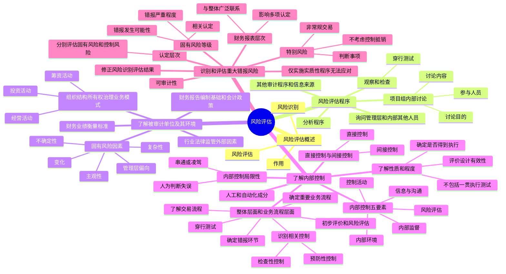

## 1. 章节定位

| 项目 | 信息 |
|------|------|
| 所属科目 | 审计 |
| 难度等级 | 5 |
| 历年分值 | 8-12 分 |
| 建议学时 | 10-12 小时 |
| 知识关联章节 | 第1章 审计概述（审计风险模型）、第6章 审计计划（重要性）、第8章 风险应对（总体应对措施和进一步审计程序）、第4章 审计证据（风险评估程序） |

## 2. 考情分析

本章是审计科目的核心章节，历年分值约 8-12 分，以客观题、简答题和综合题为主。本章内容是风险导向审计的基础，内部控制五要素、重大错报风险的识别和评估是高频考点。

**命题规律**：本章以概念理解、风险识别判断、内部控制评价为主，风险评估程序、内部控制要素、特别风险的确定、固有风险等级的评估是简答题和综合题的常见命题点。

**高频考点分布**：

1. **风险评估程序**：询问管理层和内部其他人员、分析程序、观察和检查（穿行测试）三种风险评估程序；项目组内部讨论的目的、内容和参与人员。
2. **了解被审计单位及其环境**：组织结构、所有权结构、治理结构、业务模式；行业形势、法律环境、监管环境及其他外部因素；财务业绩的衡量标准；适用的财务报告编制基础和会计政策。
3. **固有风险因素**：复杂性、主观性、变化、不确定性、管理层偏向和其他舞弊风险因素五个固有风险因素的概念及影响。
4. **内部控制五要素**：内部环境（控制环境）、风险评估、信息与沟通、控制活动、内部监督；各要素的内容和了解要点。
5. **直接控制与间接控制**：直接控制（足以精准防止、发现或纠正认定层次错报，主要是信息系统与沟通及控制活动中的控制）；间接控制（不足以精准防止、发现或纠正认定层次错报，主要是内部环境、风险评估和内部监督中的控制）。
6. **了解内部控制的性质和程度**：评价控制设计的有效性和确定控制是否得到执行（不包括测试控制是否得到一贯执行）；人工控制和自动化成分；内部控制的固有限制。
7. **在整体层面和业务流程层面了解内部控制**：确定重要业务流程和相关交易类别；了解相关交易流程；确定可能发生错报的环节；识别和了解相关控制（预防性控制和检查性控制）；实施穿行测试；初步评价和风险评估。
8. **识别和评估重大错报风险**：财务报表层次和认定层次重大错报风险的识别和评估；相关认定和相关交易类别、账户余额和披露的确定；评估固有风险和控制风险；确定特别风险；仅实施实质性程序无法应对的重大错报风险。
9. **固有风险等级**：错报发生的可能性和严重程度综合影响；固有风险等级的评估。
10. **特别风险**：非常规交易和判断事项导致的特别风险；与特别风险相关的控制。

**联动考查方式**：
- 风险评估与第8章风险应对（总体应对措施和进一步审计程序）结合考查，是综合题的核心；
- 内部控制与第8章控制测试结合考查；
- 固有风险因素与第4章审计证据（审计证据的充分性和适当性）结合考查；
- 特别风险与第8章风险应对（针对特别风险的应对措施）结合考查。

**备考建议**：
- 牢记风险评估程序的三种类型（询问、分析程序、观察和检查）；
- 掌握内部控制五要素及其内容，区分直接控制和间接控制；
- 理解了解内部控制与测试控制运行有效性的区别（前者评价设计和是否得到执行，后者测试是否得到一贯执行）；
- 熟练掌握重大错报风险的两个层次（财务报表层次和认定层次）及评估方法；
- 掌握固有风险因素五个类型（复杂性、主观性、变化、不确定性、管理层偏向）；
- 理解特别风险的确定标准（固有风险评估达到或接近最高级，或准则规定）；
- 记住预防性控制（防止错报发生）和检查性控制（发现已发生的错报）的区别。

## 3. 知识框架

## 4. 核心精讲

### 4.1 风险识别和评估概述

**风险识别和评估**是指注册会计师通过设计、实施风险评估程序，识别和评估财务报表层次及认定层次的重大错报风险。

- **风险识别**：找出财务报表层次和认定层次的重大错报风险；
- **风险评估**：对重大错报发生的可能性和后果严重程度进行评估。

风险识别和评估是审计风险控制流程的起点，获得的了解为注册会计师在下列关键环节作出职业判断提供重要基础：确定重要性水平；考虑会计政策的选择和运用；识别需要特别考虑的领域；确定分析程序使用的预期值；设计和实施进一步审计程序；评价审计证据的充分性和适当性。

### 4.2 风险评估程序、信息来源及项目组讨论

#### 4.2.1 风险评估程序和信息来源

注册会计师应当实施下列风险评估程序，以了解被审计单位及其环境等方面的情况：

**（一）询问管理层和被审计单位内部其他合适人员**

询问是了解被审计单位及其环境的一个重要信息来源。可以询问管理层、负责财务报告的人员，以及治理层、负责生成处理复杂交易的员工、内部法律顾问、营销人员、风险管理职能部门、信息技术人员、内部审计人员等不同层级和职责的适当人员。

**（二）实施分析程序**

分析程序有助于注册会计师识别不一致的情形、异常的交易或事项，以及可能对审计产生影响的金额、比率和趋势。识别出的异常不符合预期的关系可以帮助注册会计师识别重大错报风险，特别是舞弊导致的重大错报风险。

实施分析程序时可以：
1. 同时使用财务信息和非财务信息（如分析销售额与卖场面积或已出售商品数量的关系）；
2. 使用高度汇总的数据。

**（三）观察和检查**

观察和检查程序可以支持对管理层和其他相关人员的询问结果，包括：
1. 观察被审计单位的经营活动；
2. 检查内部文件、记录和内部控制手册；
3. 阅读由管理层和治理层编制的报告；
4. 实地察看被审计单位的生产经营场所和厂房设备；
5. 追踪交易在财务报告信息系统中的处理过程（穿行测试）；
6. 检查外部来源的信息。

**关键提示**：注册会计师在设计和实施风险评估程序时，不应当偏向于获取佐证性的审计证据，也不应当排斥相矛盾的审计证据。

#### 4.2.2 其他审计程序和信息来源

- **其他审计程序**：从被审计单位外部获取信息（如监管机构、公开信息、外部法律顾问等）。
- **其他信息来源**：评价客户关系和审计业务的接受或保持过程中获取的信息；连续审计业务中以往经验和以前审计获取的信息（需确定是否已发生变化，评价是否依然相关和可靠）。

#### 4.2.3 项目组内部的讨论

项目组内部的讨论在所有业务阶段都非常必要，项目合伙人和项目组其他关键成员应当讨论被审计单位财务报表易于发生重大错报的可能性。

**讨论的目的**：
1. 使经验较丰富的项目成员有机会分享见解，共享信息；
2. 使项目组成员讨论被审计单位面临的经营风险、固有风险因素如何影响各类交易账户余额和披露易于发生错报的可能性；
3. 帮助项目组成员更好地了解各自负责领域中潜在的财务报表重大错报；
4. 为项目组成员交流和分享新信息提供基础。

**讨论的内容**包括三个主要领域：分享了解的信息（被审计单位性质、舞弊因素、易于发生重大错报的项目等）；分享审计思路和方法（管理层如何编报虚假财务报告、如何侵占资产、应对评估风险的审计程序等）；为项目组指明审计方向（保持职业怀疑、识别警示信号、增加不可预见性等）。

**参与讨论的人员**：项目组的关键成员应当参与讨论，信息技术或其他特殊技能的专家可根据需要参与。不要求所有成员每次都参与讨论。

### 4.3 了解被审计单位及其环境和适用的财务报告编制基础

注册会计师应当实施风险评估程序，了解三个方面：
1. 被审计单位及其环境（组织结构、所有权和治理结构、业务模式；行业形势、法律环境、监管环境和其他外部因素；财务业绩的衡量标准）；
2. 适用的财务报告编制基础、会计政策以及变更会计政策的原因；
3. 被审计单位内部控制体系各要素。

#### 4.3.1 组织结构、所有权和治理结构、业务模式

- **组织结构**：复杂的组织结构通常更有可能导致特定的重大错报风险（如财务报表合并、商誉、长期股权投资核算等）。
- **所有权结构**：了解所有者与其他人员或实体的关系，包括关联方；了解控股母公司的情况及其对被审计单位的影响。
- **治理结构**：良好的治理结构可以降低财务报表发生重大错报的风险。了解治理层是否能够在独立于管理层的情况下对被审计单位事务包括财务报告作出客观判断。
- **业务模式**：了解业务模式主要是为了了解和评价被审计单位经营风险可能对财务报表重大错报风险产生的影响。了解被审计单位的经营活动、投资活动和筹资活动。

**经营风险**是指可能对被审计单位实现目标和实施战略的能力产生不利影响的重要状况、事项、情况、作为（或不作为）所导致的风险。并非所有的经营风险都会导致重大错报风险，注册会计师没有责任了解或识别所有的经营风险。

#### 4.3.2 行业形势、法律环境、监管环境及其他外部因素

- **行业形势**：市场需求、生产能力和价格竞争；生产经营的季节性和周期性；生产技术发展；能源供应与成本。
- **法律环境与监管环境**：适用的财务报告编制基础；受管制行业的法规框架；对经营活动产生重大影响的法律法规；税收法律法规；政府政策；环保要求。
- **其他外部因素**：总体经济情况、利率、融资的可获得性、通货膨胀水平或币值变动。

#### 4.3.3 财务业绩的衡量标准

了解用于评价被审计单位财务业绩的衡量标准，有助于注册会计师考虑这些内部或外部的衡量标准是否会导致被审计单位面临实现业绩目标的压力。可关注：关键业绩指标、关键比率、趋势和经营统计数据；同期财务业绩比较分析；预算、预测、差异分析；员工业绩考核与激励性报酬政策；与竞争对手的业绩比较。

**关注内部财务业绩衡量的结果**：内部财务业绩衡量可能显示未预期到的结果或趋势。异常的增长率或盈利水平，如果与业绩奖金或激励性报酬等因素结合，可能显示管理层在编制财务报表时存在某种倾向的错报风险。

#### 4.3.4 固有风险因素

**固有风险因素**是指在不考虑内部控制的情况下，导致交易类别、账户余额和披露的某一认定易于发生错报的因素。固有风险因素可能是定性或定量的，包括：

| 固有风险因素 | 含义 | 示例 |
|------------|------|------|
| 复杂性 | 由信息的性质或编制方式导致的 | 计算供应商返利准备、复杂过程的会计计量、表外融资和特殊目的实体 |
| 主观性 | 知识或信息可获得性受限，需要管理层作出选择或主观判断 | 会计估计有多种可能衡量标准、估值技术或模型的选择 |
| 变化 | 随时间变化，经营、经济环境、会计、监管等方面的事项或情况产生变化 | 经济不稳定的国家开展业务、供应链变化、开发新产品、关键人员变动、信息技术环境变化、采用新会计准则 |
| 不确定性 | 不能仅通过直接观察可验证的充分精确和全面的数据编制所需信息 | 涉及重大计量不确定性的事项或交易、未决诉讼和或有负债 |
| 管理层偏向和其他舞弊风险因素 | 管理层有意或无意地在信息编制过程中未保持中立 | 管理层编制虚假财务报告的机会、从事重大关联方交易、大额非常规交易、按管理层特定意图记录的交易 |

**关键规律**：
- 某类交易、账户余额和披露由于其复杂性或主观性而导致易于发生错报的可能性，通常与其变化或不确定性的程度密切相关；
- 如果复杂性、主观性、变化或不确定性导致易于发生错报，这些固有风险因素可能为管理层偏向创造了机会；
- 某类交易、账户余额和披露由于其复杂性或主观性而导致易于发生错报的可能性越大，注册会计师越有必要保持职业怀疑。

### 4.4 了解被审计单位内部控制体系各要素

#### 4.4.1 内部控制的概念和要素

**内部控制**是指被审计单位为实现控制目标所制定的政策和程序。**内部控制体系**包含以下五个相互关联的要素：

1. **内部环境（控制环境）**：包括治理职能和管理职能，以及治理层和管理层对内部控制体系及其重要性的态度、认识和行动。内部环境设定了被审计单位的内部控制基调，为其他要素的运行奠定总体基础。
2. **风险评估**：被审计单位识别、评估和管理影响其实现经营目标能力的各种风险的过程。
3. **信息与沟通（信息系统与沟通）**：与财务报表编制相关的信息系统（生成、记录、处理和报告交易的活动）和沟通（使员工了解各自角色和职责）。
4. **控制活动**：有助于确保管理层指令得以执行的政策和程序，包括授权和批准、调节、验证、实物或逻辑控制、职责分离等。
5. **内部监督**：评价内部控制一段时间内运行有效性的过程，包括持续性评价和单独评价。

#### 4.4.2 直接控制和间接控制

| 控制类型 | 含义 | 主要所属要素 | 影响层次 |
|---------|------|------------|---------|
| 直接控制 | 足以精准防止、发现或纠正认定层次错报的内部控制 | 信息系统与沟通、控制活动 | 更可能影响认定层次重大错报风险的识别和评估 |
| 间接控制 | 不足以精准防止、发现或纠正认定层次错报的内部控制 | 内部环境、风险评估、内部监督 | 更可能影响财务报表层次重大错报风险的识别和评估 |

**重要提示**：内部环境为内部控制体系其他要素的运行奠定总体基础，不能直接防止、发现并纠正错报，但可能影响其他要素中控制的有效性。内部环境、风险评估和内部监督中的某些控制也可能是直接控制。

#### 4.4.3 了解内部控制的性质和程度

**了解内部控制的目的**：评价控制设计的有效性以及控制是否得到执行。

- **评价控制设计的有效性**：考虑该控制单独或连同其他控制是否能够有效防止或发现并纠正重大错报；
- **控制得到执行**：某项控制存在且被审计单位正在使用。

**了解内部控制的程序**：询问被审计单位人员；观察特定控制的运用；检查文件和报告；追踪交易在财务报告信息系统中的处理过程（穿行测试）。询问本身并不足以评价控制设计的有效性以及确定其是否得到执行，应当将询问与其他风险评估程序结合使用。

**了解内部控制与测试控制运行有效性的关系**：

| 项目 | 了解内部控制 | 控制测试 |
|------|------------|---------|
| 目的 | 评价控制设计有效性和确定是否得到执行 | 测试控制是否得到一贯执行 |
| 阶段 | 风险评估阶段 | 进一步审计程序阶段 |
| 例外 | 自动化控制可能同时实现两个目的 | - |

**关键提示**：除非存在某些可以使控制得到一贯运行的自动化控制，否则注册会计师对控制的了解并不足以测试控制运行的有效性。获取某一人工控制在某一时点得到执行的审计证据，并不能证明该控制在所审计期间内的其他时点也有效运行。但由于信息技术处理流程的内在一贯性，实施审计程序确定某项自动化控制是否得到执行，也可能实现对控制运行有效性测试的目标。

#### 4.4.4 内部控制的局限性

内部控制无论如何有效，都只能为被审计单位实现财务报告目标提供合理保证。固有限制包括：

1. 在决策时人为判断可能出现错误和因人为失误而导致内部控制失效；
2. 控制可能由于两个或更多的人员串通或管理层不当地凌驾于内部控制之上而被规避；
3. 行使控制职能的人员素质不适应岗位要求；
4. 成本效益问题；
5. 内部控制一般针对经常而重复发生的业务设置，未预计到的业务可能不适用。

#### 4.4.5 内部环境（控制环境）

内部环境包括以下方面：

1. **对诚信和道德价值观念的沟通与落实**：行为规范、企业文化、管理层身体力行、对违反行为的惩罚措施。
2. **对胜任能力的重视**：财务人员和信息管理人员的胜任能力和培训。
3. **治理层的参与程度**：董事会、审计委员会的独立性和监督能力。
4. **管理层的理念和经营风格**：对内部控制的重视程度、风险偏好还是风险规避、会计政策选择激进还是保守。
5. **职权与责任的分配**：组织结构、职责划分、授权机制。
6. **人力资源政策与实务**：招聘、培训、考核、咨询、晋升和薪酬等方面。

**关键提示**：内部环境本身并不能防止或发现并纠正认定层次的重大错报，注册会计师在评估重大错报风险时，应当将内部环境连同其他内部控制要素产生的影响一并考虑。令人满意的内部环境是一个积极的因素，但内部环境中存在的弱点可能削弱控制的有效性。

#### 4.4.6 控制活动

控制活动包括以下类型：

1. **授权和批准**：确认交易是有效的（具有经济实质或符合政策）。
2. **调节**：将两项或多项数据要素进行比较，发现差异则采取措施使数据相一致。应对所处理交易的完整性或准确性。
3. **验证**：将两个或多个项目互相比较，或将某个项目与政策进行比较。应对所处理交易的完整性、准确性或有效性。
4. **实物或逻辑控制**：应对资产安全的控制，包括保证资产实物安全、对接触计算机程序和数据文档设置授权、定期盘点并核对。
5. **职责分离**：将交易授权、交易记录以及资产保管等不相容职责分配给不同员工，降低同一员工在正常履行职责过程中实施并隐瞒舞弊或错误的可能性。

#### 4.4.7 在整体层面和业务流程层面了解内部控制

在实务中，注册会计师应当从被审计单位整体层面和业务流程层面分别了解和评价内部控制。

**在业务流程层面了解内部控制的步骤**：
1. 确定被审计单位的重要业务流程和相关交易类别；
2. 了解相关交易类别的流程，并记录获得的了解；
3. 确定可能发生错报的环节；
4. 识别和了解相关控制（预防性控制和检查性控制）；
5. 实施穿行测试，证实对交易流程和相关控制的了解；
6. 进行初步评价和风险评估。

**预防性控制与检查性控制**：

| 控制类型 | 目的 | 示例 |
|---------|------|------|
| 预防性控制 | 防止错报的发生 | 计算机程序自动生成收货报告同时更新采购档案；销货发票价格根据价格清单确定 |
| 检查性控制 | 发现流程中可能发生的错报 | 定期编制银行存款余额调节表；系统每天比较运出货物数量和开票数量 |

**控制目标**：完整性（所有有效交易都已记录）、发生（每项已记录交易均真实）、适当计量交易、恰当确定交易生成的会计期间（截止）、恰当分类、正确汇总和过账。

**初步评价的结论**：
1. 所设计的控制单独或连同其他控制能够防止或发现并纠正重大错报，并得到执行；
2. 控制本身的设计是合理的，但没有得到执行；
3. 控制本身的设计就是无效的或缺乏必要的控制。

### 4.5 识别和评估重大错报风险

#### 4.5.1 识别和评估重大错报风险的步骤

1. 利用实施风险评估程序所了解的信息；
2. 识别两个层次的重大错报风险（财务报表层次和认定层次）；
3. 评估两个层次的重大错报风险；
4. 评价审计证据的适当性；
5. 修正识别或评估的结果。

**关键原则**：
- 注册会计师应当在考虑相关控制之前识别重大错报风险（即固有风险）；
- 对于识别出的认定层次重大错报风险，注册会计师应当分别评估固有风险和控制风险；
- 对于识别出的财务报表层次重大错报风险，审计准则未明确规定应当分别评估还是合并评估；
- 注册会计师不应当偏向于获取佐证性的审计证据，而排斥相矛盾的审计证据。

#### 4.5.2 识别和评估财务报表层次重大错报风险

**识别**：如果判断某风险与财务报表整体存在广泛联系，并可能影响多项认定，注册会计师应当将其识别为财务报表层次重大错报风险。

**示例**：在经济不稳定的国家和地区开展业务、资产流动性出现问题、重要客户流失、融资能力受限等可能导致对持续经营能力产生重大疑虑；管理层缺乏诚信、承受异常压力、凌驾于内部控制之上可能引发舞弊风险。

**评估**：
1. 评价这些风险对财务报表整体产生的影响；
2. 确定这些风险是否影响对认定层次风险的评估结果。

**关键提示**：财务报表层次重大错报风险受到对内部环境、风险评估和内部监督（这三要素主要属于间接控制）了解的影响。财务报表层次的重大错报风险还可能源于内部环境存在的缺陷或某些外部事项或情况。

#### 4.5.3 识别和评估认定层次重大错报风险

**识别**：如果判断某固有风险因素可能导致某项认定发生重大错报，但与财务报表整体不存在广泛联系，注册会计师应当将其识别为认定层次的重大错报风险。

**相关认定**：如果注册会计师识别出交易类别、账户余额和披露的某项认定存在重大错报风险，那么该项认定是"相关认定"。存在相关认定的交易类别、账户余额和披露被称为"相关交易类别、账户余额和披露"。

**关键提示**：注册会计师识别确定某项认定是否属于相关认定，应当依据其固有风险，而不考虑相关控制的影响。识别出相关认定后，在评估认定层次重大错报风险时，才应当考虑相关控制的影响。

**评估**：
1. **评估固有风险**：通过评估错报发生的可能性和严重程度来评估固有风险。考虑固有风险因素如何以及在何种程度上影响相关认定易于发生错报的可能性；财务报表层次重大错报风险如何以及在何种程度上影响认定层次重大错报风险中固有风险的评估。
2. **评估控制风险**：在拟测试控制运行有效性的情况下，应当评估控制风险。如果拟不测试控制运行的有效性，则应当将固有风险的评估结果作为重大错报风险的评估结果。
3. **确定特别风险**：注册会计师应当确定评估的重大错报风险是否为特别风险。

#### 4.5.4 评估固有风险等级

注册会计师应使用错报发生的可能性和严重程度综合起来的影响程度，确定固有风险等级。

- **错报发生的可能性**：基于对固有风险因素的考虑，评估错报发生的概率；
- **错报的严重程度**：考虑错报的定性和定量两个方面；
- **综合影响程度**：综合起来的影响程度越高，评估的固有风险等级越高。

**重要规律**：评估的固有风险等级较高，并不意味着评估的错报发生的可能性和严重程度都较高。较低的错报发生可能性和极高的严重程度可能导致评估的固有风险等级较高。

#### 4.5.5 特别风险

**特别风险**是指注册会计师识别出的符合下列特征之一的重大错报风险：
1. 根据固有风险因素对错报发生的可能性和错报的严重程度的影响，注册会计师将固有风险评估为达到或接近固有风险等级的最高级（上限）；
2. 根据其他审计准则的规定，注册会计师应当将其作为特别风险。

**可能导致特别风险的事项**：
1. 交易具有多种可接受的会计处理，因此涉及主观性；
2. 会计估计具有高度不确定性或模型复杂；
3. 支持账户余额的数据收集和处理较为复杂；
4. 账户余额或定量披露涉及复杂的计算；
5. 对会计政策存在不同的理解；
6. 被审计单位业务的变化涉及会计处理发生变化，如合并和收购。

**关键提示**：在判断哪些风险是特别风险时，注册会计师不应考虑识别出的控制对相关风险的抵销效果。

**非常规交易和判断事项导致的特别风险**：

| 类型 | 特征 | 导致更高重大错报风险的原因 |
|------|------|------------------------|
| 非常规交易 | 由于金额或性质异常而不经常发生的交易（如企业购并、债务重组、重大或有事项） | 管理层更多干预会计处理；数据收集和处理受到更多人工干预；复杂的计算或会计处理方法；难以实施有效控制 |
| 判断事项 | 作出的会计估计具有计量的重大不确定性（如资产减值准备、公允价值计量） | 对会计原则存在不同理解；所要求的判断主观和复杂，需要对未来事项作出假设 |

**与特别风险相关的控制**：对特别风险，注册会计师应当评价相关控制的设计情况，并确定其是否已经得到执行。如果管理层未能实施控制以恰当应对特别风险，注册会计师应当认为内部控制存在值得关注的内部控制缺陷，并考虑其对风险评估的影响，就此类事项与治理层沟通。

#### 4.5.6 仅实施实质性程序无法应对的重大错报风险

如果认为仅实施实质性程序获取的审计证据无法应对认定层次的重大错报风险，注册会计师应当评价被审计单位针对这些风险设计的控制，并确定其执行情况。

**典型情形**：在被审计单位对日常交易采用高度自动化处理的情况下，审计证据可能仅以电子形式存在，其充分性和适当性通常取决于自动化信息系统相关控制的有效性。

#### 4.5.7 考虑财务报表的可审计性

如果通过对内部控制的了解发现下列情况，并对财务报表局部或整体的可审计性产生疑问，注册会计师应当考虑出具保留意见或无法表示意见的审计报告：
1. 被审计单位会计记录的状况和可靠性存在重大问题，不能获取充分、适当的审计证据以发表无保留意见；
2. 对管理层的诚信存在严重疑虑。

必要时，注册会计师应当考虑解除业务约定。

#### 4.5.8 修正风险识别或评估结果

识别或评估重大错报风险是一个连续和动态的过程。如果通过实施进一步审计程序获取的审计证据与初始识别或评估获取的审计证据相矛盾，注册会计师应当修正风险识别或评估结果，并相应修改原计划实施的进一步审计程序。

## 5. 典型例题

**【例题 1】（风险评估程序）**

请说明注册会计师应当实施哪些风险评估程序以了解被审计单位及其环境等方面的情况，并说明在设计和实施风险评估程序时应注意什么。

**答案**：

注册会计师应当实施下列风险评估程序：

1. 询问管理层和被审计单位内部其他合适人员，包括内部审计人员。可以询问管理层和负责财务报告的人员，以及治理层、负责生成处理复杂交易的员工、内部法律顾问、营销人员、风险管理职能部门、信息技术人员、内部审计人员等。

2. 实施分析程序。通过研究不同财务数据之间以及财务数据与非财务数据之间的内在关系，对财务信息作出评价，有助于识别不一致的情形、异常的交易或事项，以及可能对审计产生影响的金额、比率和趋势。

3. 观察和检查。包括观察被审计单位的经营活动、检查内部文件记录和内部控制手册、阅读由管理层和治理层编制的报告、实地察看生产经营场所和厂房设备、追踪交易在财务报告信息系统中的处理过程（穿行测试）、检查外部来源的信息。

在设计和实施风险评估程序时，注册会计师不应当偏向于获取佐证性的审计证据，也不应当排斥相矛盾的审计证据。不带倾向性地设计和实施风险评估程序以获取支持重大错报风险识别和评估的审计证据，可以帮助注册会计师识别潜在的相矛盾的信息，进而帮助注册会计师在识别和评估重大错报风险时保持职业怀疑。

**解析**：风险评估程序是了解被审计单位及其环境、识别和评估重大错报风险的基础。三种风险评估程序可以单独或综合使用，但在了解每一方面时无需实施所有程序。关键是要保持职业怀疑，不偏向佐证性证据，不排斥相矛盾的证据。

**【例题 2】（直接控制与间接控制）**

请说明直接控制和间接控制的区别，以及它们分别主要属于内部控制体系的哪些要素，对重大错报风险评估的影响有何不同。

**答案**：

直接控制是指足以精准防止、发现或纠正认定层次错报的内部控制，间接控制是指不足以精准防止、发现或纠正认定层次错报的内部控制。直接控制和间接控制对防止、发现或纠正认定层次错报分别产生直接影响和间接影响。

信息系统与沟通以及控制活动要素中的控制主要为直接控制。注册会计师对这些要素的了解和评价更有可能影响其对认定层次重大错报风险的识别和评估。实务中，注册会计师需要投入充足的资源对这类要素中的控制进行了解和评价。

内部环境、风险评估和内部监督中的控制主要是间接控制，该类控制虽不足以精准地防止、发现或纠正认定层次的错报，但可以支持其他控制，因此可能间接影响及时发现或防止错报发生的可能性。由于内部环境、风险评估和内部监督是被审计单位内部控制体系的基础，其运行中的任何缺陷都可能对财务报表的编制产生广泛的影响。注册会计师对这些要素的了解和评价，更有可能影响其对财务报表层次重大错报风险的识别和评估，也可能影响对认定层次重大错报风险的识别和评估。

需要说明的是，内部环境、风险评估和内部监督中的某些控制也可能是直接控制。

**解析**：直接控制和间接控制的区分有助于注册会计师识别和评估财务报表层次以及认定层次的重大错报风险。直接控制主要影响认定层次风险评估，间接控制主要影响财务报表层次风险评估。但两者并非完全对应，间接控制要素中的某些控制也可能是直接控制。

**【例题 3】（了解内部控制与控制测试的区别）**

请说明了解内部控制与控制测试（测试控制运行有效性）的区别，以及在什么情况下了解自动化控制可能同时实现控制测试的目的。

**答案**：

了解内部控制与控制测试的区别：

| 项目 | 了解内部控制 | 控制测试 |
|------|------------|---------|
| 目的 | 评价控制设计的有效性和确定控制是否得到执行 | 测试控制是否得到一贯执行 |
| 阶段 | 风险评估阶段 | 进一步审计程序阶段 |
| 程序 | 询问、观察、检查、穿行测试 | 询问、观察、检查、重新执行 |
| 关注点 | 控制是否存在、是否正在使用、设计是否合理 | 控制在整个期间内是否一贯有效运行 |

了解内部控制评价的是控制设计的有效性以及控制是否得到执行（某项控制存在且被审计单位正在使用），不包括对控制是否得到一贯执行的测试。评价设计有效的控制是否得到执行，与测试控制运行的有效性即控制是否得到一贯执行，是有区别的。前者是了解内部控制的目的，后者是控制测试的目的。

在什么情况下了解自动化控制可能同时实现控制测试的目的：

除非存在某些可以使控制得到一贯运行的自动化控制，否则注册会计师对控制的了解并不足以测试控制运行的有效性。但是，信息技术可以使被审计单位持续一贯地对大量数据进行处理，提高监督控制活动运行情况的能力，还可以通过安全控制实现有效的职责划分。由于信息技术处理流程的内在一贯性，实施审计程序确定某项自动化控制是否得到执行，也可能实现对控制运行有效性测试的目标，这取决于注册会计师对控制（如针对程序变更的控制）的评估和测试。

对于人工控制，获取某一人工控制在某一时点得到执行的审计证据，并不能证明该控制在所审计期间内的其他时点也有效运行，因此了解人工控制不能代替控制测试。

**解析**：了解内部控制与控制测试的核心区别在于"是否得到执行"与"是否得到一贯执行"。自动化控制由于信息技术处理流程的内在一贯性，了解其是否得到执行可能同时实现控制测试的目的，但人工控制则不能。

**【例题 4】（特别风险的确定）**

请说明什么是特别风险，确定特别风险的标准是什么，并举例说明哪些情况可能导致特别风险。

**答案**：

特别风险是指注册会计师识别出的符合下列特征之一的重大错报风险：
1. 根据固有风险因素对错报发生的可能性和错报的严重程度的影响，注册会计师将固有风险评估为达到或接近固有风险等级的最高级（上限）；
2. 根据其他审计准则的规定，注册会计师应当将其作为特别风险。

确定特别风险时，注册会计师不应考虑识别出的控制对相关风险的抵销效果。也就是说，特别风险的确定基于固有风险评估，不考虑控制的影响。

可能导致特别风险的情况包括：
1. 交易具有多种可接受的会计处理，因此涉及主观性；
2. 会计估计具有高度不确定性或模型复杂；
3. 支持账户余额的数据收集和处理较为复杂；
4. 账户余额或定量披露涉及复杂的计算；
5. 对会计政策存在不同的理解；
6. 被审计单位业务的变化涉及会计处理发生变化，如合并和收购。

特别风险通常与重大的非常规交易和判断事项有关：

非常规交易（如企业购并、债务重组、重大或有事项）由于金额或性质异常而不经常发生，其特征包括管理层更多地干预会计处理、数据收集和处理受到更多的人工干预、复杂的计算或会计处理方法、非常规交易的性质可能使被审计单位难以实施有效控制。

判断事项（如资产减值准备金额的估计、公允价值计量）通常涉及会计估计具有计量的重大不确定性，其特征包括对会计原则存在不同理解、所要求的判断主观和复杂，需要对未来事项作出假设。

**示例**：
- 被审计单位正在洽谈出售业务分部，注册会计师在考虑该事项对商誉减值的影响时，可能认为由于主观性、不确定性、管理层偏向等固有风险因素，错报发生的可能性和严重程度均较高，因此将商誉减值确定为特别风险。
- 相比之下，对于超市零售商的现金，虽然错报发生的可能性较高（现金易被盗用），但严重程度通常非常低（商店中处理的实物现金较少），这两个因素的组合不太可能导致现金的存在性被确定为特别风险。

**解析**：特别风险是风险评估中的重要概念，其核心是基于固有风险评估（不考虑控制抵销效果）达到或接近最高级的风险。非常规交易和判断事项是特别风险的常见来源。确定特别风险后，注册会计师应评价相关控制的设计并确定是否得到执行，并针对特别风险实施特定应对措施。

**【例题 5】（财务报表层次与认定层次重大错报风险）**

请说明财务报表层次重大错报风险和认定层次重大错报风险的区别，以及识别和评估两者时的不同要求。

**答案**：

财务报表层次重大错报风险和认定层次重大错报风险的区别：

| 项目 | 财务报表层次 | 认定层次 |
|------|------------|---------|
| 与财务报表的关系 | 与财务报表整体存在广泛联系，可能影响多项认定 | 与财务报表整体不存在广泛联系，针对特定认定 |
| 风险来源 | 内部环境缺陷、外部事项或情况、管理层凌驾于内部控制之上、舞弊 | 固有风险因素导致某项认定易于发生错报 |
| 评估方法 | 审计准则未明确规定分别评估还是合并评估 | 应当分别评估固有风险和控制风险 |
| 应对措施 | 总体应对措施 | 进一步审计程序的性质、时间安排和范围 |

识别和评估两者的不同要求：

**财务报表层次重大错报风险的识别和评估**：
- 识别：如果判断某风险与财务报表整体存在广泛联系，并可能影响多项认定，应当将其识别为财务报表层次重大错报风险。
- 评估：从两方面评估——评价这些风险对财务报表整体产生的影响；确定这些风险是否影响对认定层次风险的评估结果。
- 受到对内部环境、风险评估和内部监督（主要属于间接控制）了解的影响。

**认定层次重大错报风险的识别和评估**：
- 识别：如果判断某固有风险因素可能导致某项认定发生重大错报，但与财务报表整体不存在广泛联系，应当将其识别为认定层次重大错报风险。识别相关认定时应当依据其固有风险，而不考虑相关控制的影响。
- 评估：应当分别评估固有风险和控制风险。在拟测试控制运行有效性的情况下评估控制风险；如果拟不测试控制运行的有效性，则将固有风险的评估结果作为重大错报风险的评估结果。
- 确定特别风险：应当确定评估的重大错报风险是否为特别风险。

两个层次之间存在相互影响：某些认定层次重大错报风险可能与财务报表整体存在广泛联系，影响多项认定，此时应更新对财务报表层次重大错报风险的识别；如果财务报表层次重大错报风险可以识别出受影响的特定认定，应当在评估认定层次重大错报风险的固有风险时考虑这些风险。

**解析**：财务报表层次和认定层次重大错报风险是风险评估的核心分类。财务报表层次风险影响广泛，需要总体应对措施；认定层次风险针对特定认定，需要进一步审计程序。两者的识别和评估方法不同，且存在相互影响。关键区别在于认定层次风险应当分别评估固有风险和控制风险，而财务报表层次风险的评估方法由注册会计师自行选择。

**【例题 6】（预防性控制与检查性控制）**

请说明预防性控制和检查性控制的区别，并分别举例说明。

**答案**：

预防性控制和检查性控制的区别：

| 控制类型 | 目的 | 作用时机 | 特点 |
|---------|------|---------|------|
| 预防性控制 | 防止错报的发生 | 在交易处理之前或之中 | 用于正常业务流程的每一项交易 |
| 检查性控制 | 发现流程中可能发生的错报 | 在交易处理之后 | 监督流程和预防性控制的有效性 |

预防性控制示例：
1. 计算机程序自动生成收货报告，同时也更新采购档案——防止出现购货漏记账的情况；
2. 在更新采购档案之前要有收货报告——防止记录了未收到购货的情况；
3. 销货发票上的价格根据价格清单上的信息确定——防止销货计价错误；
4. 系统将各凭证上的账户号码与会计科目表对比，然后进行一系列的逻辑测试——防止出现分类错报。

检查性控制示例：
1. 定期编制银行存款余额调节表，跟踪调查挂账的项目——查找存入银行但没有记入日记账的现金收入、未记录的银行现金支付或虚构入账的不真实的银行现金收入或支付等；
2. 将预算与实际费用间的差异列入计算机编制的报告中并由部门经理复核——查找本月发生的重大分类错报或没有记录及没有发生的大笔收入、支出等；
3. 系统每天比较运出货物的数量和开票数量，如果发现差异产生报告由开票主管复核——查找没有开票和记录的出库货物，以及与真实发货无关的发票；
4. 每季度复核应收账款贷方余额并找出原因——查找未予入账的发票和销售与现金收入中的分类错误。

业务流程中对相关交易类别的有效控制，通常同时包括预防性控制和检查性控制。缺乏有效的预防性控制增加了发生错报的风险，因此需要建立更为敏感的检查性控制。

如果确信存在以下情况，可以将检查性控制作为主要手段合理保证某特定认定发生重大错报的可能性较小：控制所检查的数据是完整、可靠的；控制对于发现重大错报足够敏感；发现的所有重大错报都将被纠正。

**解析**：预防性控制重在"防"，在交易处理前或处理中防止错报发生；检查性控制重在"查"，在交易处理后发现可能发生的错报。有效的内部控制体系通常同时包含两种控制，缺乏预防性控制时需要更敏感的检查性控制来弥补。

## 6. 记忆口诀

**风险评估程序三类型**："询问、分析、观察检查"——询问管理层和内部其他人员、实施分析程序、观察和检查（含穿行测试）。

**项目组讨论三目的**："分享见解、讨论风险、指明方向"——分享了解的信息、讨论固有风险因素影响、为项目组指明审计方向。

**内部控制五要素**："环境、评估、信息沟通、活动、监督"——内部环境、风险评估、信息与沟通、控制活动、内部监督。

**直接控制与间接控制**："直接精准防认定，间接支持影响广"——直接控制足以精准防止发现纠正认定层次错报（信息系统与沟通、控制活动），间接控制不足以精准防止但支持其他控制（内部环境、风险评估、内部监督）。

**了解内控两目的**："评价设计有效性，确定是否得到执行"——了解内部控制的目的不包括测试控制是否得到一贯执行。

**了解内控与控制测试区别**："了解看设计和执行，测试看一贯运行"——了解内部控制评价设计有效性和是否得到执行，控制测试测试是否得到一贯执行。

**自动化控制例外**："自动化一贯运行，了解可能即测试"——信息技术处理流程的内在一贯性，使了解自动化控制是否得到执行可能同时实现控制测试目的。

**内部控制三局限**："人为判断会失误、串通凌驾被规避、成本效益有限制"——人为判断可能出现错误和失误、人员串通或管理层凌驾被规避、成本效益问题和非常规业务不适用。

**固有风险因素五个**："复杂、主观、变化、不确定、管理层偏向"——复杂性、主观性、变化、不确定性、管理层偏向和其他舞弊风险因素。

**控制活动五类型**："授权批准、调节、验证、实物逻辑、职责分离"——授权和批准、调节、验证、实物或逻辑控制、职责分离。

**预防性 vs 检查性控制**："预防防止错报发生，检查发现已发错报"——预防性控制用于防止错报的发生，检查性控制用于发现流程中可能发生的错报。

**重大错报风险两层次**："报表层次影响广，认定层次针对特定"——财务报表层次与整体广泛联系影响多项认定，认定层次针对特定认定。

**认定层次评估两风险**："固有风险和控制风险分别评估"——对于认定层次重大错报风险，应当分别评估固有风险和控制风险。

**相关认定识别依据**："依据固有风险，不考虑控制"——识别相关认定应当依据其固有风险，而不考虑相关控制的影响。

**固有风险等级评估**："可能性×严重程度=综合影响"——使用错报发生的可能性和严重程度综合起来的影响程度确定固有风险等级。

**特别风险两标准**："固有风险达上限，或准则规定"——固有风险评估达到或接近固有风险等级最高级，或根据其他审计准则规定应当作为特别风险。

**特别风险不考虑控制**："确定特别风险不看控制抵销"——在判断哪些风险是特别风险时，不应考虑识别出的控制对相关风险的抵销效果。

**非常规交易和判断事项**："非常规交易人为干预多，判断事项主观复杂"——非常规交易管理层更多干预和人工干预，判断事项涉及主观复杂判断和未来假设。

**仅实施实质性程序无法应对**："高度自动化仅电子证据，依赖控制有效性"——高度自动化处理下审计证据仅以电子形式存在，取决于自动化控制有效性。

**业务流程了解六步骤**："定流程、记流程、找错报、识控制、穿行测试、初步评价"——确定重要业务流程、了解交易流程、确定错报环节、识别相关控制、实施穿行测试、初步评价和风险评估。

**控制目标六项**："完整、发生、计量、截止、分类、汇总过账"——完整性、发生、适当计量、恰当截止、恰当分类、正确汇总和过账。

**可审计性两情况**："会计记录不可靠出保留，管理层诚信存疑虑"——会计记录状况可靠性存在重大问题考虑保留意见或无法表示意见，对管理层诚信存在严重疑虑考虑解除业务约定。

## 7. 同步练习

**145.（单选题）** 下列各项控制中，通常属于直接控制的是（　）。

A. 内部环境
B. 信息系统与沟通
C. 内部监督
D. 风险评估

**146.（单选题）** 下列有关项目组内部的讨论的说法中，错误的是（　）。

A. 拥有信息技术或其他特殊技能的专家可能参与项目组的讨论
B. 在跨地区审计中，每个重要地区项目组的关键成员都应该参加讨论
C. 应当运用职业判断确定项目组内部参与讨论的成员
D. 由项目经理确定向未参与项目组讨论的人员通报哪些事项

**147.（单选题）** 下列有关识别和评估两个层次重大错报风险的说法中，错误的是（　）。

A. 注册会计师对内部监督的了解与评价，更可能对认定层次重大错报风险的识别和评估产生影响
B. 注册会计师对控制活动的了解，更可能对认定层次重大错报风险的识别和评估产生影响
C. 注册会计师对内部环境的了解，更可能对财务报表层次重大错报风险的识别和评估产生影响
D. 注册会计师对风险评估的了解，更可能对财务报表层次重大错报风险的识别和评估产生影响

**148.（单选题）** 下列有关经营风险对重大错报风险的影响的说法中，错误的是（　）。

A. 多数经营风险最终都会产生财务后果，从而可能导致重大错报风险
B. 经营风险通常不会对财务报表层次重大错报风险产生直接影响
C. 经营风险可能对认定层次重大错报风险产生直接影响
D. 注册会计师在评估重大错报风险时，没有责任识别或评估财务报表没有重大影响的经营风险

**149.（单选题）** 在了解被审计单位财务业绩的衡量和评价时，下列各项中，注册会计师无需考虑的信息是（　）。

A. 与竞争对手的业绩比较
B. 被审计单位的涉诉情况
C. 外部机构对被审计单位财务业绩的分析报告
D. 员工业绩考核与激励性报酬政策

**150.（单选题）** 下列有关了解被审计单位及其环境等方面情况的说法中，正确的是（　）。

A. 注册会计师无需在审计完成阶段了解被审计单位及其环境等方面情况
B. 对小型被审计单位，注册会计师可以不了解被审计单位及其环境等方面情况
C. 注册会计师对被审计单位及其环境等方面情况了解的程度，取决于会计师事务所的质量管理体系
D. 注册会计师对被审计单位及其环境等方面情况了解的程度，低于管理层为经营管理企业而对被审计单位及其环境等方面情况需要了解的程度

**151.（单选题）** 下列有关了解固有风险因素的说法中，错误的是（　）。

A. 了解被审计单位及其环境和适用的财务报告编制基础，有助于注册会计师识别可能导致认定易于发生错报的固有风险因素
B. 了解固有风险因素在何种程度上影响认定易于发生错报的可能性，有助于在评估固有风险时评估错报发生的可能性和严重程度
C. 与适用的财务报告编制基础要求的信息编制相关的固有风险因素包括复杂性、主观性、变化和不确定性
D. 注册会计师对重大错报风险的识别和认定层次固有风险的评估，受到固有风险因素之间相互关系的影响

**152.（单选题）** 下列关于经营风险对重大错报风险的影响的说法中，错误的是（　）。

A. 多数经营风险最终都会导致财务后果，从而影响财务报表
B. 经营风险都会导致财务报表存在重大错报风险
C. 了解影响财务报表的经营风险有助于注册会计师识别重大错报风险
D. 注册会计师没有责任了解或识别所有的经营风险

**153.（单选题）** 下列有关风险评估的说法中，错误的是（　）。

A. 了解被审计单位及其环境等方面情况是一个连续和动态地收集、更新与分析信息的过程，贯穿于整个审计过程的始终
B. 注册会计师应当运用职业判断确定需要了解被审计单位及其环境等方面情况的程度
C. 注册会计师应当了解被审计单位及其环境等方面情况，以充分识别和评估财务报表重大错报风险，设计和实施进一步审计程序
D. 风险评估程序并不是必须实施的，注册会计师可以根据职业判断作出选择

**154.（单选题）** 下列有关与审计相关的内部控制的说法中，错误的是（　）。

A. 与财务报表审计相关的内部控制一定与财务报告相关
B. 注册会计师需要了解和评价的内部控制，只是与财务报表审计相关的内部控制，并非被审计单位所有的内部控制
C. 与审计相关的控制可分为直接控制和间接控制
D. 信息系统与沟通以及控制活动要素中的控制主要为直接控制

**155.（单选题）** 下列关于特别风险的说法中，错误的是（　）。

A. 注册会计师应当将固有风险评估为达到或接近固有风险等级的最高级的重大错报风险确定为特别风险
B. 哪些风险是特别风险，通常需要注册会计师运用职业判断
C. 会计估计具有高度不确定性导致的重大错报风险为特别风险
D. 注册会计师应当了解针对特别风险的控制

**156.（单选题）** 注册会计师可以通过询问被审计单位内部不同层级和职责的适当人员获取信息，以识别和评估重大错报风险。下列有关询问的说法中，错误的是（　）。

A. 直接询问治理层，可能有助于注册会计师了解治理层对管理层编制财务报表的监督程度
B. 直接询问内部审计人员，可能有助于注册会计师在识别和评估风险时了解被审计单位及其环境以及内部控制体系
C. 直接询问营销或销售人员，可能有助于注册会计师评价被审计单位选择和运用某项会计政策的恰当性
D. 直接询问风险管理职能部门或人员，可能有助于注册会计师了解可能影响财务报告的经营和监管风险

**157.（单选题）**（2023年）下列有关注册会计师识别和评估重大错报风险的说法中，错误的是（　）。

A. 注册会计师可能考虑修正之前的重大错报风险的识别和评估结果
B. 注册会计师对于识别出的重大错报风险应当分别评估固有风险和控制风险
C. 注册会计师在评估重大错报风险时应当考虑相关控制的影响
D. 注册会计师应当在考虑相关控制之前识别重大错报风险

**158.（单选题）**（2023年）下列有关固有风险等级的说法中，错误的是（　）。

A. 在确定固有风险等级时，注册会计师应当考虑错报发生的可能性和严重程度
B. 评估的固有风险等级较高，意味着错报发生的可能性和严重程度均较高
C. 评估的固有风险等级接近或达到最高级时，识别的重大错报风险应确认为特别风险
D. 拟不测试控制运行的有效性时，应将固有风险的评估结果作为重大错报风险的评估结果

**159.（单选题）** 下列有关内部环境的说法中，错误的是（　）。

A. 良好的、令人满意的内部环境可以防止舞弊的发生
B. 内部环境的好坏影响注册会计师对财务报表层次重大错报风险的评估
C. 内部环境影响被审计单位内部生成的审计证据的可信赖程度
D. 内部环境影响实质性程序的性质、时间安排和范围

**160.（单选题）** 下列各项中，通常不属于被审计单位内部环境要素的是（　）。

A. 管理层如何识别和评估与财务报告相关的经营风险
B. 管理层的理念和经营风格
C. 管理层对胜任能力的重视
D. 被审计单位的人力资源政策与实务

**161.（多选题）** 下列各项中，属于注册会计师执行穿行测试要确认的内容的有（　）。

A. 是否正确了解了内部控制并且书面记录准确
B. 识别交易流程中与财务报表有关的可能发生错报的环节
C. 所获取的有关流程中的预防性控制和检查性控制信息的准确性
D. 评估控制设计的有效性并确认控制执行的有效性

**162.（多选题）** 下列各项中，通常不会导致注册会计师对财务报表整体的可审计性产生怀疑的有（　）。

A. 被审计单位会计记录的状况和可靠性存在重大问题，不能获取充分、适当的审计证据以发表无保留意见
B. 被审计单位的内部控制存在值得关注的内部控制缺陷
C. 注册会计师对被审计单位的持续经营能力产生重大疑虑
D. 注册会计师识别出重大错报，管理层拒绝更正

**163.（多选题）** 下列各项中，应当参与或根据需要参与审计项目组内部讨论的人员有（　）。

A. 审计项目合伙人
B. 关键审计人员
C. 聘请的特定领域专家
D. 项目质量复核人员

**164.（多选题）** 下列各项控制中，属于预防性控制的有（　）。

A. 财务总监复核并批准财务经理提出撤销银行账号的申请
B. 出纳不能兼任收入或支出的记账工作
C. 财务经理复核会计编制的银行存款余额调节表
D. 财务经理根据其权限复核并批准相关付款

**165.（多选题）** 下列各项中，属于注册会计师在了解被审计单位内部控制时可以实施的审计程序有（　）。

A. 询问管理层以及被审计单位内部其他合适人员
B. 穿行测试
C. 观察和检查
D. 分析程序

**166.（多选题）** 下列重大错报风险中，注册会计师应当认定为特别风险的有（　）。

A. 超出被审计单位正常经营过程的关联方交易导致的风险
B. 管理层凌驾于控制之上的风险
C. 与管理层舞弊相关的风险
D. 高度估计不确定性的风险

**167.（多选题）** 下列各项因素中，可能导致财务报表层次重大错报风险的有（　）。

A. 被审计单位管理层承受异常压力
B. 被审计单位信息技术一般控制薄弱
C. 被审计单位投资了多家联营企业
D. 被审计单位融资能力受限导致持续经营能力存在重大疑虑

**168.（多选题）** 下列有关识别和评估重大错报风险的表述中，正确的有（　）。

A. 如果拟不测试控制运行的有效性，则应当将固有风险的评估结果作为认定层次重大错报风险的评估结果
B. 评估重大错报风险时，不应考虑控制对风险的抵销和遏制作用
C. 对于识别出的认定层次重大错报风险，注册会计师可以合并评估固有风险和控制风险
D. 如果管理层未能实施控制以恰当应对特别风险，注册会计师应当认为内部控制存在值得关注的内部控制缺陷

**169.（多选题）** 在判断哪些风险是特别风险时，下列各项中属于注册会计师考虑的内容的有（　）。

A. 被审计单位业务的变化涉及会计处理发生变化
B. 是否设置了相关的内部控制
C. 会计估计具有高度不确定性或模型复杂
D. 对会计政策存在不同的理解

**170.（多选题）** 下列关于识别和评估认定层次重大错报风险的说法中，正确的有（　）。

A. 某类交易、账户余额和披露越易于发生错报，评估的固有风险可能越高
B. 即使拟不测试控制运行的有效性，注册会计师仍应当评估控制风险
C. 注册会计师识别确定某项认定是否属于相关认定，应当依据其固有风险
D. 对于识别出的认定层次重大错报风险，注册会计师应当分别评估固有风险和控制风险

**171.（多选题）**（2023年）下列各项中，属于固有风险因素的有（　）。

A. 事项或情况的变化
B. 事项或情况的不确定性
C. 内部控制的固有局限性
D. 管理层偏向

---

**练习答案**：

**单选题**：145.B（内部环境、风险评估和内部监督中的控制主要为间接控制；信息系统与沟通和控制活动主要为直接控制）　146.D（由项目合伙人确定向未参与讨论的项目组成员通报哪些事项）　147.A（内部环境、风险评估和内部监督更可能影响财务报表层次；信息系统与沟通和控制活动更可能影响认定层次）　148.B（经营风险可能对认定层次或财务报表层次重大错报风险产生直接影响）　149.B（被审计单位的涉诉情况不属于财务业绩衡量和评价需考虑的信息）　150.D（了解过程贯穿审计始终，A错误；小型被审计单位也需了解，B错误；了解程度取决于是否足以识别和评估重大错报风险，C错误）　151.C（固有风险因素还包括管理层偏向和其他舞弊风险因素）　152.B（并非所有经营风险都会导致重大错报风险）　153.D（风险评估程序是必须实施的程序）　154.A（与审计相关的内部控制并非均与财务报告相关，如预算控制等也可能与审计相关）　155.C（高度不确定性导致的重大错报风险"可能"被确定为特别风险）　156.C（应直接询问负责生成、处理或记录复杂或异常交易的员工，以评价会计政策运用的恰当性）　157.B（仅对识别出的认定层次重大错报风险应当分别评估固有风险和控制风险）　158.B（固有风险等级较高不意味着错报发生的可能性和严重程度均较高）　159.A（良好的内部环境不能防止舞弊，但有助于降低舞弊风险）　160.A（内部环境要素包括对诚信和道德价值观念的沟通与落实、对胜任能力的重视、治理层的参与程度、管理层的理念和经营风格、职权与责任的分配、人力资源政策与实务）

**多选题**：161.ABC（确认控制是否有效运行属于控制测试范畴，穿行测试是了解内部控制的程序，D错误）　162.BCD（会计记录状况和可靠性存在重大问题才会导致对可审计性产生疑问，A不选）　163.ABC（项目质量复核人员不属于项目组成员，D错误）　164.ABD（复核银行存款余额调节表属于检查性控制，C错误）　165.ABC（分析程序不适用于了解内部控制，D错误）　166.BC（应加"重大"二字，超出正常经营过程的重大关联方交易才应确定为特别风险，A错误；高度估计不确定性风险是否为特别风险需职业判断，D错误）　167.ABD（投资多家联营企业与认定层次重大错报风险有关，C错误）　168.AD（评估重大错报风险时应考虑控制对风险的抵销和遏制作用，B错误；认定层次重大错报风险应分别评估固有风险和控制风险，C错误）　169.ACD（判断特别风险时不应考虑识别出的控制对相关风险的抵销效果，B错误）　170.ACD（拟不测试控制运行有效性时，应将固有风险评估结果作为重大错报风险评估结果，无需评估控制风险，B错误）　171.ABD（内部控制的固有局限性不属于固有风险因素，C错误）
