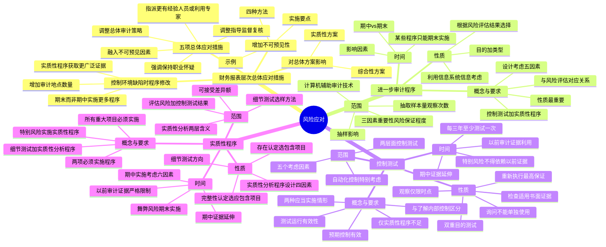

## 1. 章节定位

| 项目 | 信息 |
|------|------|
| 所属科目 | 审计 |
| 难度等级 | 4 |
| 历年分值 | 5-8 分 |
| 建议学时 | 6-8 小时 |
| 知识关联章节 | 第6章 审计计划（重要性、审计资源调配）、第7章 风险评估（重大错报风险识别与评估）、第9章 信息技术对审计的影响（自动化控制测试）、第10-12章 各业务循环审计（控制测试与实质性程序的具体运用） |

## 2. 考情分析

本章是审计科目的核心章节之一，历年分值约 5-8 分，以客观题和简答题为主，常与风险评估、各业务循环审计结合考查综合题。本章是风险导向审计"风险评估→风险应对"链条的下半段，与第7章构成完整的风险审计逻辑。

**命题规律**：本章以概念理解、程序判断和情景分析为主，控制测试与实质性程序的区分、进一步审计程序的性质/时间/范围的选择是高频命题点，期中审计证据的延伸、以前审计证据的利用也常考简答题。

**高频考点分布**：

1. **财务报表层次重大错报风险的总体应对措施**：五项总体应对措施的内容、增加审计程序不可预见性的四种方法及实施要点、总体应对措施对进一步审计程序总体方案（实质性方案 vs 综合性方案）的影响。
2. **进一步审计程序的总体要求**：进一步审计程序的概念（控制测试 + 实质性程序）、设计与评估的重大错报风险的对应关系、设计时考虑的五个因素、性质是最重要的方面。
3. **进一步审计程序的性质**：性质的概念（目的 + 类型）、性质选择的考虑因素、利用被审计单位信息系统生成信息时的考虑。
4. **进一步审计程序的时间**：期中与期末实施审计程序的权衡、影响时间选择的因素、某些程序只能在期末实施。
5. **进一步审计程序的范围**：范围的概念、确定范围时考虑的三个因素、计算机辅助审计技术的作用、抽样对范围的影响。
6. **控制测试**：控制测试的概念（与了解内部控制的区分）、控制测试的要求（两种应当实施情形）、控制测试的性质（询问、观察、检查、重新执行四种程序及其特点）、控制测试的时间（期中证据延伸、以前审计证据利用、特别风险不得依赖以前证据）、控制测试的范围（五个考虑因素、自动化控制的特别考虑）。
7. **实质性程序**：实质性程序的概念（细节测试 + 实质性分析程序）、必须实施的两项程序、针对特别风险的实质性程序、实质性程序的性质（细节测试方向、实质性分析程序设计因素）、实质性程序的时间（期中证据、以前审计证据的严格限制）、实质性程序的范围。

**联动考查方式**：
- 与第7章风险评估结合：风险评估的结果直接决定风险应对的措施和程序；
- 与第10-12章业务循环审计结合：控制测试和实质性程序的具体运用；
- 与第5章审计抽样结合：控制测试和细节测试中抽样方法的应用；
- 与第9章信息技术结合：自动化控制的测试。

**备考建议**：
- 牢记"风险评估→风险应对"的逻辑链条，总体应对措施应对财务报表层次风险，进一步审计程序应对认定层次风险；
- 区分控制测试与了解内部控制：前者测试运行有效性，后者评价设计并确定是否得到执行；
- 掌握四种控制测试程序的特点：询问不能单独使用、观察仅限观察时点、检查适用于留有书面证据的控制、重新执行获取最高保证；
- 理解期中审计证据延伸至期末的两项程序和六个考虑因素；
- 特别风险的相关控制不得依赖以前审计证据，必须在每次审计中测试；以前审计实质性程序获取的证据通常对本期没有证据效力；
- 无论风险评估结果如何，都必须对所有重大交易类别、账户余额和披露实施实质性程序。

## 3. 知识框架

## 4. 核心精讲

### 4.1 风险应对的总体框架

风险导向审计要求注册会计师围绕重大错报风险的识别、评估和应对，计划和实施审计工作。《中国注册会计师审计准则第1231号——针对评估的重大错报风险采取的应对措施》规范了注册会计师针对评估的重大错报风险确定总体应对措施，设计和实施进一步审计程序。

风险应对分为两个层次：

| 层次 | 风险类型 | 应对措施 |
|------|---------|---------|
| 财务报表层次 | 与财务报表整体广泛相关，影响多项认定 | 总体应对措施 |
| 认定层次 | 与特定的某类交易、账户余额和披露的认定相关 | 进一步审计程序（控制测试 + 实质性程序） |

注册会计师应当针对评估的重大错报风险实施程序，以将审计风险降至可接受的低水平。

### 4.2 针对财务报表层次重大错报风险的总体应对措施

#### 4.2.1 总体应对措施的内容

注册会计师应当针对评估的财务报表层次重大错报风险确定下列**五项总体应对措施**：

1. **向项目组强调保持职业怀疑的必要性**。职业怀疑是防范审计风险的基础态度。
2. **指派更有经验或具有特殊技能的审计人员，或利用专家的工作**。审计项目组成员中应有一定比例的人员曾经参与过被审计单位以前年度的审计，或具有被审计单位所处特定行业的相关审计经验。必要时，要考虑利用信息技术、税务、评估、精算等方面的专家的工作。
3. **对指导和监督项目组成员并复核其工作的性质、时间安排和范围作出调整**。对于财务报表层次重大错报风险较高的审计项目，项目合伙人、项目经理等经验较丰富的人员要对其他成员提供更详细、更经常、更及时的指导和监督，并加强项目质量复核。
4. **在选择拟实施的进一步审计程序时融入更多的不可预见的因素**。避免被审计单位管理层熟悉审计套路后采取规避手段掩盖舞弊行为。
5. **对总体审计策略或对拟实施的审计程序作出调整**。财务报表层次的重大错报风险很可能源于薄弱的控制环境，注册会计师应当采取总体应对措施。

#### 4.2.2 控制环境存在缺陷时的程序修改

有效的控制环境可以增强注册会计师对内部控制和被审计单位内部产生证据的信赖程度。如果控制环境存在缺陷，注册会计师在对拟实施审计程序的性质、时间安排和范围作出总体修改时应当考虑：

| 修改方向 | 具体措施 | 原因 |
|---------|---------|------|
| 时间 | 在期末而非期中实施更多的审计程序 | 控制环境的缺陷通常会削弱期中获得的审计证据的可信赖程度 |
| 范围 | 通过实施实质性程序获取更广泛的审计证据 | 控制环境存在缺陷通常会削弱其他控制要素的作用，导致可能无法信赖内部控制 |
| 地点 | 增加拟纳入审计范围的经营地点的数量 | 扩大覆盖面以应对广泛影响 |

#### 4.2.3 增加审计程序不可预见性的方法

**（1）增加不可预见性的四种方法**

1. 对某些以前未测试的低于设定的重要性水平或风险较小的账户余额和认定实施实质性程序；
2. 调整实施审计程序的时间，使其超出被审计单位的预期；
3. 采取不同的审计抽样方法，使当年抽取的测试样本与以前有所不同；
4. 选取不同的地点实施审计程序，或预先不告知被审计单位所选定的测试地点。

**（2）实施要点**

- 注册会计师需要与被审计单位管理层事先沟通要求实施具有不可预见性的审计程序，但**不能告知其具体内容**；
- 对于不可预见性程度没有量化的规定，审计项目组可根据对舞弊风险的评估等确定；
- 项目合伙人需要安排项目组成员有效实施，同时避免使项目组成员处于困难境地。

**（3）不可预见性示例**

| 审计领域 | 具有不可预见性的审计程序示例 |
|---------|--------------------------|
| 存货 | 向以前接触不多的员工询问；不事先通知选择未曾到过的盘点地点进行存货监盘 |
| 销售和应收账款 | 改变实施实质性分析程序的对象；延长截止测试期间；函证销售条款；测试以前未曾函证过的账户余额；改变函证日期 |
| 采购和应付账款 | 向供应商函证确认余额；对以前未曾测试的采购项目进行细节测试；使用计算机辅助审计技术 |
| 现金和银行存款 | 多选几个月的银行存款余额调节表进行测试 |
| 固定资产 | 对以前未曾测试的固定资产进行测试，如实地盘查价值较低的固定资产 |
| 集团审计 | 修改组成部分审计工作的范围或区域 |

#### 4.2.4 总体应对措施对进一步审计程序总体方案的影响

财务报表层次重大错报风险具有难以限于某类交易、账户余额和披露的特点，可能对财务报表的多项认定产生广泛影响。拟实施进一步审计程序的**总体审计方案**包括两种：

| 方案类型 | 含义 | 适用情形 |
|---------|------|---------|
| 实质性方案 | 注册会计师实施的进一步审计程序以实质性程序为主 | 评估的财务报表层次重大错报风险属于高风险水平时 |
| 综合性方案 | 注册会计师在实施进一步审计程序时，将控制测试与实质性程序结合使用 | 通常情况下，出于成本效益的考虑 |

当评估的财务报表层次重大错报风险属于高风险水平（并相应采取更强调审计程序不可预见性以及重视调整审计程序的性质、时间安排和范围等总体应对措施）时，拟实施进一步审计程序的总体方案往往更倾向于**实质性方案**。

### 4.3 针对认定层次重大错报风险的进一步审计程序

#### 4.3.1 进一步审计程序的概念和要求

**进一步审计程序**相对于风险评估程序而言，是指注册会计师针对评估的各类交易、账户余额和披露认定层次重大错报风险实施的审计程序，包括**控制测试和实质性程序**。

**核心要求**：注册会计师设计和实施的进一步审计程序的性质、时间安排和范围，应当与评估的认定层次重大错报风险具备**明确的对应关系**。注册会计师实施的审计程序应具有目的性和针对性，有的放矢地配置审计资源。

**性质是最重要的**：在应对评估的认定层次重大错报风险时，虽然性质、时间安排和范围都应当确保具有针对性，但其中进一步审计程序的**性质是最重要的**。只有首先确保进一步审计程序的性质与特定风险相关时，扩大审计程序的范围才是有效的。

**设计进一步审计程序时考虑的五个因素**：

1. **风险的重要性**：风险造成的后果越严重，越需要精心设计有针对性的进一步审计程序；
2. **重大错报发生的可能性**：发生的可能性越大，越需要精心设计；
3. **涉及的各类交易、账户余额和披露的特征**：不同对象的重大错报风险存在差异，适用的审计程序也有差别；
4. **被审计单位采用的特定控制的性质**：不同性质的控制（人工控制或自动化控制）对设计进一步审计程序具有重要影响；
5. **是否拟获取审计证据以确定内部控制有效性**：如果预期内部控制运行有效，随后拟实施的进一步审计程序就应当包括控制测试。

**总体方案的选用**：注册会计师应根据对认定层次重大错报风险的评估结果，恰当选用实质性方案或综合性方案。

- 通常情况下，出于成本效益的考虑可以采用**综合性方案**；
- 在某些情况下（如仅通过实质性程序无法应对重大错报风险），必须通过实施控制测试才可能有效应对；
- 在另一些情况下（如风险评估程序未能识别出与认定相关的任何控制，或认为控制测试很可能不符合成本效益原则），可能认为仅实施实质性程序就是适当的；
- 小型被审计单位可能不存在能够被识别的控制活动，进一步审计程序可能主要是实质性程序。

**重要原则**：无论选择何种方案，注册会计师都应当对所有重大交易类别、账户余额和披露设计和实施**实质性程序**。这是因为风险评估是一种主观判断，可能无法充分识别所有的重大错报风险，同时内部控制存在固有局限性（特别是存在管理层凌驾于内部控制之上的可能性）。

#### 4.3.2 进一步审计程序的性质

**进一步审计程序的性质**是指进一步审计程序的目的和类型。

- **目的**：通过实施控制测试以确定内部控制运行的有效性；通过实施实质性程序以发现认定层次的重大错报；
- **类型**：检查、观察、询问、函证、重新计算、重新执行和分析程序。

**性质选择的考虑因素**：

注册会计师首先需要考虑认定层次重大错报风险的评估结果。评估的认定层次重大错报风险越高，对通过实质性程序获取的审计证据的相关性和可靠性的要求越高。

在确定拟实施的审计程序时，还应当考虑评估的认定层次重大错报风险产生的原因，包括考虑各类交易、账户余额和披露的具体特征以及内部控制。例如：
- 某特定交易类别即使在不存在相关控制的情况下发生重大错报的风险仍较低，可能仅实施实质性程序即可；
- 经由信息系统日常处理的交易，如果预期内部控制运行有效，可能决定先实施控制测试。

**利用被审计单位信息系统生成信息时的考虑**：如果在实施进一步审计程序时拟利用被审计单位信息系统生成的信息，注册会计师应当就信息的**准确性和完整性**获取审计证据。例如，在实施实质性分析程序时使用被审计单位生成的非财务信息或预算数据，应当获取关于这些信息准确性和完整性的审计证据。

#### 4.3.3 进一步审计程序的时间

**进一步审计程序的时间**是指注册会计师何时实施进一步审计程序，或审计证据适用的期间或时点。

**两个层面的选择问题**：

| 层面 | 核心问题 |
|------|---------|
| 第一层面 | 选择在何时实施进一步审计程序（期中 vs 期末） |
| 第二层面 | 选择获取什么期间或时点的审计证据（期中证据 vs 期末证据；以前审计证据 vs 本期审计证据） |

**期中实施审计程序的利弊**：

| 优势 | 局限 |
|------|------|
| 有助于在审计工作初期识别重大事项并及时解决 | 难以仅凭期中程序获取有关期中以前的充分、适当的审计证据 |
| 针对重大事项制定有效的实质性方案或综合性方案 | 从期中到期末的剩余期间还可能发生重大交易或事项 |
| — | 管理层可能在期中程序之后对相关会计记录作出调整甚至篡改 |

如果在期中实施了进一步审计程序，注册会计师还应当**针对剩余期间获取审计证据**。

**影响时间选择的其他因素**：

1. **控制环境**：良好的控制环境可以抵销在期中实施进一步审计程序的一些局限性，使注册会计师在确定实施时间时有更大的灵活度；
2. **何时能得到相关信息**：某些控制活动可能仅在期中或期中以前发生，某些电子化文档如未能及时取得可能被覆盖；
3. **错报风险的性质**：如被审计单位可能为保证盈利目标实现而伪造销售合同虚增收入，需要在期末获取所有销售合同及相关资料；
4. **审计证据适用的期间或时点**：如获取资产负债表日的存货余额证据，不宜在间隔过长的期中时点实施存货监盘；
5. **编制财务报表的时间**：某些披露为报表金额提供进一步解释。

**只能在期末或期末以后实施的程序**：某些审计程序只能在期末或期末以后实施，包括将财务报表中的信息与其所依据会计记录相核对或调节，检查财务报表编制过程中所作的会计调整等。如果被审计单位在期末或接近期末发生了重大交易，或重大交易在期末尚未完成，应当考虑交易的发生或截止等认定可能存在的重大错报风险，并在期末或期末以后检查此类交易。

#### 4.3.4 进一步审计程序的范围

**进一步审计程序的范围**是指实施进一步审计程序（含控制测试和实质性程序）所涉及的数量多少，包括抽取的样本量、对某项控制活动的观察次数等。

**确定范围时考虑的三个因素**：

| 因素 | 影响 |
|------|------|
| 确定的重要性水平 | 重要性水平越低，实施进一步审计程序的范围越广 |
| 评估的重大错报风险 | 评估的重大错报风险越高，实施进一步审计程序的范围越广 |
| 计划获取的保证程度 | 计划获取的保证程度越高，实施进一步审计程序的范围越广 |

**重要原则**：只有当审计程序本身与特定风险相关时，扩大审计程序的范围才是有效的。

**计算机辅助审计技术的作用**：注册会计师可以使用计算机辅助审计技术对电子化的交易和账户文档进行更广泛的测试，包括从主要电子文档中选取交易样本，或按照某一特征对交易进行分类，或对总体而非样本进行测试。

**抽样对范围的影响**：如果存在下列情形，注册会计师依据样本得出的结论可能与对总体实施同样的审计程序得出的结论不同，出现不可接受的风险：(1) 从总体中选择的样本量过小；(2) 选择的抽样方法对实现特定目标不适当；(3) 未对发现的例外事项进行恰当的追查。

### 4.4 控制测试

#### 4.4.1 控制测试的概念和要求

**（1）控制测试的概念**

**控制测试**是指用于评价内部控制在防止或发现并纠正认定层次重大错报方面的运行有效性的审计程序。

**控制测试与了解内部控制的区分**：

| 项目 | 了解内部控制 | 控制测试 |
|------|------------|---------|
| 含义 | 评价控制的设计 + 确定控制是否得到执行 | 测试控制运行的有效性 |
| 获取证据 | 某项控制是否存在、是否正在使用 | 控制在所审计期间相关时点如何运行、是否一贯执行、由谁或以何种方式执行 |
| 抽取数量 | 抽取少量交易进行检查或观察某几个时点 | 抽取足够数量的交易进行检查或对多个不同时点进行观察 |

测试控制运行有效性强调的是控制能够在各个不同时点按照既定设计得以**一贯执行**。

**举例说明**：某被审计单位财务经理每月审核实际销售收入和销售费用并与预算数和上年同期数比较，差异超过5%的项目进行分析并编制分析报告；销售经理审阅该报告并采取适当跟进措施。注册会计师抽查了最近3个月的分析报告，看到管理人员在报告上签字确认，证明该控制已经得到执行。但在与销售经理的讨论中发现他对分析报告中明显异常的数据并不了解其原因，从而显示该控制**并未得到有效运行**。

**两者联系**：为评价控制设计和确定控制是否得到执行而实施的某些风险评估程序并非专为控制测试而设计，但可能提供有关控制运行有效性的审计证据，注册会计师可以考虑在评价控制设计和获取其得到执行的审计证据的同时测试控制运行有效性，以提高审计效率。

**（2）控制测试的要求**

控制测试并非在任何情况下都需要实施。当存在下列情形**之一**时，注册会计师**应当**实施控制测试：

1. **在评估认定层次重大错报风险时，预期控制的运行是有效的**——出于成本效益的考虑，如果相关控制在不同时点都得到了一贯执行，与该项控制有关的认定发生重大错报的可能性就不会很大，也就不需要实施很多的实质性程序；
2. **仅实施实质性程序并不能够提供认定层次充分、适当的审计证据**——例如在被审计单位对日常交易采用高度自动化处理的情况下，审计证据可能仅以电子形式存在，此时审计证据是否充分和适当通常取决于自动化信息系统相关控制的有效性。

对于第二种情形，控制测试已经不再是单纯出于成本效益的考虑，而是**必须**获取的一类审计证据。

#### 4.4.2 控制测试的性质

**（1）控制测试的性质的概念**

**控制测试的性质**是指控制测试所使用的审计程序的类型及其组合。计划从控制测试中获取的保证水平是决定控制测试性质的主要因素之一。对控制有效性的信赖程度越高，注册会计师应当获取越有说服力的审计证据。

控制测试采用四种审计程序：

| 程序 | 特点 | 适用情形 | 局限 |
|------|------|---------|------|
| 询问 | 向适当员工询问内部控制运行情况 | 获取相关信息 | **不能单独**为控制运行有效性提供充分证据，需要印证 |
| 观察 | 测试不留下书面记录的控制（如职责分离） | 观察存货盘点控制、实物控制 | 仅限于观察发生的**时点**，被观察时可能未被执行 |
| 检查 | 对运行情况留有书面证据的控制 | 检查销售发票是否有复核人员签字 | — |
| 重新执行 | 注册会计师独立执行原本作为内部控制组成部分的程序 | 检查复核人员是否认真执行核对 | 如需大量重新执行，需考虑效率 |

**重要原则**：
- 询问本身并不足以测试控制运行的有效性，必须和其他测试手段结合使用；
- 观察提供的证据仅限于观察发生的时点；
- 将询问与检查或重新执行结合使用，可能比仅实施询问和观察获取更高水平的保证。

**（2）确定控制测试性质时的要求**

1. **考虑特定控制的性质**：根据特定控制的性质选择所需实施审计程序的类型。某些控制存在反映控制运行有效性的文件记录，可以检查这些文件记录；某些控制不存在文件记录（如自动化控制活动），应考虑实施检查以外的其他审计程序或借助计算机辅助审计技术。
2. **考虑测试与认定直接相关和间接相关的控制**：不仅应当考虑与认定直接相关的控制，还应当考虑这些控制所依赖的与认定间接相关的控制。例如，测试超出信用额度的例外赊销交易报告和审核制度时，不仅应当考虑审核的有效性，还应当考虑与例外赊销报告中信息准确性有关的控制是否有效运行。
3. **如何对自动化信息处理控制实施控制测试**：由于信息技术处理过程的内在一贯性，注册会计师可以利用该项控制得以执行的审计证据和信息技术一般控制（特别是对系统变动的控制）运行有效性的审计证据，作为支持该项控制在相关期间运行有效性的重要审计证据。

**（3）实施控制测试时对双重目的的实现**

控制测试的目的是评价控制是否有效运行；细节测试的目的是发现认定层次的重大错报。尽管两者目的不同，但注册会计师可以考虑针对同一交易同时实施控制测试和细节测试，以实现**双重目的**。例如，通过检查某笔交易的发票可以确定其是否经过适当的授权（控制测试），也可以获取关于该交易的金额、发生时间等细节证据（细节测试）。如果拟实施双重目的测试，应当仔细设计和评价测试程序。

**（4）实施实质性程序的结果对控制测试结果的影响**

- 通过实施实质性程序**未发现**某项认定存在错报，这本身**并不能说明**与该认定有关的控制是有效运行的；
- 通过实施实质性程序**发现**某项认定存在错报，注册会计师应当在评价相关控制的运行有效性时予以考虑，如降低对相关控制的信赖程度、调整实质性程序的性质、扩大实质性程序的范围等；
- 如果实施实质性程序发现被审计单位没有识别出的重大错报，通常表明内部控制存在**值得关注的缺陷**，应当就这些缺陷与管理层和治理层进行沟通。

#### 4.4.3 控制测试的时间

**（1）控制测试的时间的概念**

控制测试的时间包含两层含义：一是**何时实施控制测试**；二是**测试所针对的控制适用的时点或期间**。

**基本原理**：
- 如果测试特定时点的控制，仅得到该时点控制运行有效性的审计证据；
- 如果测试某一期间的控制，可获取控制在该期间有效运行的审计证据。

如果需要获取控制在某一期间有效运行的审计证据，仅获取与时点相关的审计证据是不充分的，注册会计师应当辅以其他控制测试，包括**测试被审计单位对控制的监督**。被审计单位对控制的监督起到检验相关控制在所有相关时点是否都有效运行的作用。

**（2）如何考虑期中审计证据**

对于控制测试，在期中实施此类程序具有更积极的作用。但即使已获取有关控制在期中运行有效性的审计证据，仍然需要考虑如何将期中运行有效性的审计证据合理延伸至期末。

如果已获取有关控制在期中运行有效性的审计证据，并拟利用该证据，注册会计师应当实施下列**两项审计程序**：

| 程序 | 内容 |
|------|------|
| 第一项 | 获取这些控制在剩余期间发生重大变化的审计证据（如未发生变化，可决定信赖期中证据；如发生变化，需了解并测试控制变化对期中审计证据的影响） |
| 第二项 | 确定针对剩余期间还需获取的补充审计证据 |

**确定剩余期间补充证据时考虑的六个因素**：

1. 评估的认定层次重大错报风险的严重程度——影响越大，补充证据越多；
2. 在期中测试的特定控制，以及自期中测试后发生的重大变动——自动化控制更可能测试信息技术一般控制；
3. 在期中对有关控制运行有效性获取的审计证据的程度——期中证据越充分，补充证据可适当减少；
4. 剩余期间的长度——剩余期间越长，补充证据越多；
5. 在信赖控制的基础上拟缩小实质性程序的范围——信赖程度越高，拟减少实质性程序范围越大，补充证据越多；
6. 控制环境——控制环境越薄弱，补充证据越多。

**（3）如何考虑以前审计获取的审计证据**

**基本思路**：考虑拟信赖的以前审计中测试的控制在本期是否发生变化。

注册会计师应当通过实施询问并结合观察或检查程序，获取这些控制是否已经发生变化的审计证据。可能面临两种结果：

**情形一：控制在本期发生变化时**

注册会计师应当考虑以前审计获取的有关控制运行有效性的审计证据是否与本期审计相关。如果拟信赖的控制自上次测试后已发生**实质性变化**，以致影响以前审计所获取证据的相关性，应当在本期审计中测试这些控制的运行有效性。

**情形二：控制在本期未发生变化时**

如果拟信赖的控制自上次测试后未发生变化，且**不属于旨在减轻特别风险的控制**，注册会计师应当运用职业判断确定是否在本期审计中测试其运行有效性，以及本次测试与上次测试的时间间隔，但**每三年至少对控制测试一次**。

注册会计师应当在每次审计时从中选取足够数量的控制测试其运行有效性；**不应将所有拟信赖控制的测试集中于某一次审计**，而在之后的两次审计中不进行任何测试。

**确定利用以前审计证据是否适当及再次测试时间间隔时考虑的因素**：

1. 内部控制其他要素的有效性（控制环境、对控制的监督、风险评估过程）——控制环境或对控制的监督薄弱时，应缩短间隔或完全不依赖；
2. 控制特征（人工控制还是自动化控制）产生的风险——人工控制稳定性较差，可能决定本期继续测试；
3. 信息技术一般控制的有效性——薄弱时更少依赖以前审计证据；
4. 影响内部控制的重大人事变动——发生重大人事变动时可能不依赖；
5. 由于环境发生变化而特定控制缺乏相应变化导致的风险——环境变化需要控制变动但控制未变动时，不应再依赖；
6. 重大错报的风险和对控制的信赖程度——风险较大或信赖程度较高时，应缩短间隔或完全不依赖。

**（4）不得依赖以前审计所获取证据的情形**

对于**旨在减轻特别风险的控制**，不论该控制在本期是否发生变化，注册会计师都**不应依赖以前审计获取的证据**，而应在本期审计中测试这些控制的运行有效性。所有关于该控制运行有效性的审计证据必须来自当年的控制测试，注册会计师应当在每次审计中都测试这类控制。

#### 4.4.4 控制测试的范围

**控制测试的范围**主要是指某项控制活动的测试次数。注册会计师应当设计控制测试，以获取控制在整个拟信赖的期间有效运行的充分、适当的审计证据。

**确定控制测试范围的五个考虑因素**：

| 因素 | 影响 |
|------|------|
| 在拟信赖期间被审计单位执行控制的频率 | 执行频率越高，控制测试范围越大 |
| 拟信赖控制运行有效性的时间长度 | 拟信赖期间越长，控制测试范围越大 |
| 控制的预计偏差率 | 预计偏差率越高，控制测试范围越大；过高时可能控制测试无效 |
| 通过测试与认定相关的其他控制获取的审计证据的范围 | 其他控制证据充分适当性较高时，该控制测试范围可适当缩小 |
| 拟获取的有关认定层次控制运行有效性的审计证据的相关性和可靠性 | 证据相关性和可靠性较高时，测试范围可适当缩小 |

**对自动化控制的测试范围的特别考虑**：

除非系统（包括系统使用的表格、文档或其他永久性数据）发生变动，注册会计师通常**不需要增加**自动化控制的测试范围。对于一项自动化信息处理控制，一旦确定被审计单位正在执行该控制，通常无需扩大控制测试的范围，但需要考虑实施下列测试以确定该控制持续有效运行：

1. 测试与该信息处理控制有关的信息技术一般控制的运行有效性；
2. 确定系统是否发生变动，如果发生变动，是否存在适当的系统变动控制；
3. 确定对交易的处理是否使用授权批准的软件版本。

**测试两个层面控制时注意的问题**：

| 层面 | 特点 | 记录方式 | 测试时间 |
|------|------|---------|---------|
| 整体层面控制 | 通常更加主观（如管理层对胜任能力的重视） | 文件备忘录和支持性证据 | 审计早期测试 |
| 业务流程层面控制 | 如检查付款是否得到授权 | 较易记录 | — |

整体层面控制和信息技术一般控制的评价通常记录的是文件备忘录和支持性证据。注册会计师最好在审计的早期测试整体层面控制，因为这些控制测试的结果会影响其他计划审计程序的性质和范围。

### 4.5 实质性程序

#### 4.5.1 实质性程序的概念和要求

**（1）实质性程序的概念**

**实质性程序**是指用于发现认定层次重大错报的审计程序，包括对各类交易、账户余额和披露的**细节测试**以及**实质性分析程序**。

注册会计师实施的实质性程序应当包括下列与财务报表编制完成阶段相关的审计程序：

1. **将财务报表中的信息与其所依据的会计记录进行核对或调节**，包括核对或调节披露中的信息，无论该信息是从总账和明细账中获取，还是从总账和明细账之外的其他途径获取；
2. **检查财务报表编制过程中作出的重大会计分录和其他调整**。检查的性质和范围取决于被审计单位财务报告过程的性质和复杂程度以及由此产生的重大错报风险。

**重要原则**：无论评估的重大错报风险结果如何，注册会计师都应当针对**所有重大交易类别、账户余额和披露**实施实质性程序。这是因为风险评估是一种判断，可能无法充分识别所有的重大错报风险，并且内部控制存在固有局限性。但注册会计师无需测试重大交易类别、账户余额和披露中的所有认定。

**（2）针对特别风险实施的实质性程序**

如果认为评估的认定层次重大错报风险是**特别风险**，注册会计师应当专门针对该风险实施实质性程序。例如，如果认为管理层面临实现盈利指标的压力而可能提前确认收入，注册会计师在设计询证函时不仅应当考虑函证应收账款的账户余额，还应当考虑询证销售协议的细节条款（如交货、结算及退货条款）。

**特别风险实质性程序的要求**：

- 如果针对特别风险实施的程序仅为实质性程序，这些程序应当包括**细节测试**，或将细节测试和实质性分析程序结合使用；
- **仅实施实质性分析程序不足以**获取有关特别风险的充分、适当的审计证据。

#### 4.5.2 实质性程序的性质

**（1）实质性程序的性质的概念**

**实质性程序的性质**是指实质性程序的类型及其组合。实质性程序包括两类：

| 类型 | 含义 | 目的 | 适用 |
|------|------|------|------|
| 细节测试 | 对各类交易、账户余额和披露的具体细节进行测试 | 直接识别认定是否存在错报 | 对各类交易、账户余额和披露认定的测试，尤其是存在或发生、计价认定的测试 |
| 实质性分析程序 | 通过研究数据间关系评价信息 | 识别认定是否存在错报 | 在一段时间内存在可预期关系的大量交易 |

**（2）细节测试的方向**

注册会计师应当针对评估的风险设计细节测试，获取充分、适当的审计证据，以达到认定层次所计划的保证水平。

| 认定 | 细节测试方向 |
|------|------------|
| 存在或发生认定 | 选择**包含在财务报表金额中**的项目，并获取相关审计证据 |
| 完整性认定 | 选择有证据表明**应包含在财务报表金额中**的项目，并调查这些项目是否确实包括在内 |

例如，为应对被审计单位漏记本期应付账款的风险（完整性认定），注册会计师可以检查期后付款记录。

**（3）设计实质性分析程序时考虑的因素**

1. 对特定认定使用实质性分析程序的适当性；
2. 对已记录的金额或比率作出预期时，所依据的内部或外部数据的可靠性；
3. 作出预期的准确程度是否足以在计划的保证水平上识别重大错报；
4. 已记录金额与预期值之间可接受的差异额。

如果使用被审计单位编制的信息，注册会计师应当考虑测试与信息编制相关的控制，以及这些信息是否在本期或前期经过审计。

#### 4.5.3 实质性程序的时间

实质性程序的时间选择与控制测试的时间选择有共同点，也有很大差异。

| 对比维度 | 控制测试 | 实质性程序 |
|---------|---------|-----------|
| 期中实施 | 期中实施控制测试具有"常态"意义 | 期中实施更需考虑成本效益权衡 |
| 以前审计证据 | 拟信赖以前审计证据已受到很大限制 | 采取更加慎重的态度和更严格的限制 |

**（1）如何考虑是否在期中实施实质性程序**

在期中实施实质性程序，一方面消耗审计资源，另一方面期中获取的审计证据又不能直接作为期末财务报表认定的审计证据，仍需消耗进一步审计资源使期中证据合理延伸至期末。下列**六个因素**可能对是否在期中实施实质性程序产生影响：

1. **控制环境和其他相关的控制**——越薄弱，越不宜在期中实施；
2. **实施审计程序所需信息在期中之后的可获得性**——如期中之后可能难以获取，应考虑在期中实施；
3. **实质性程序的目的**——如目的就包括获取认定的期中审计证据，应在期中实施；
4. **评估的重大错报风险**——风险越高，越应考虑将实质性程序集中于期末（或接近期末）实施；
5. **特定交易类别、账户余额和披露认定的性质**——如收入"截止"认定、未决诉讼等特殊性质决定了必须在期末（或接近期末）实施；
6. **针对剩余期间能否降低期末存在错报而未被发现的风险**——如能较有把握地降低，可考虑在期中实施；如需消耗大量审计资源或没有把握，不宜在期中实施。

**（2）如何考虑期中审计证据**

如果在期中实施了实质性程序，注册会计师应当针对剩余期间实施进一步的实质性程序，或将实质性程序和控制测试结合使用，以将期中测试得出的结论合理延伸至期末。

**两种延伸选择**：
- 其一，针对剩余期间实施进一步的实质性程序；
- 其二，将实质性程序和控制测试结合使用。

如果拟将期中测试得出的结论延伸至期末，应当考虑针对剩余期间仅实施实质性程序是否足够。如认为实施实质性程序本身不充分，还应测试剩余期间相关控制运行的有效性或针对期末实施实质性程序。

**舞弊导致的重大错报风险**（作为一类重要的特别风险）：被审计单位存在故意错报或操纵的可能性，如果已识别出舞弊导致的重大错报风险，为将期中得出的结论延伸至期末而实施的审计程序通常是**无效的**，注册会计师应当考虑在期末或者接近期末实施实质性程序。

**（3）如何考虑以前审计获取的审计证据**

在以前审计中实施实质性程序获取的审计证据，通常对本期只有**很弱的证据效力或没有证据效力**，不足以应对本期的重大错报风险。

只有当以前获取的审计证据及其相关事项**未发生重大变动**时，以前获取的审计证据才可能用做本期的有效审计证据。但即便如此，如果拟利用以前审计中实施实质性程序获取的审计证据，注册会计师应当在本期实施审计程序，以确定这些审计证据是否具有**持续相关性**。

#### 4.5.4 实质性程序的范围

评估的认定层次重大错报风险和实施控制测试的结果是注册会计师在确定实质性程序的范围时的重要考虑因素。

| 因素 | 影响 |
|------|------|
| 评估的认定层次重大错报风险 | 风险越高，实施实质性程序的范围越广 |
| 实施控制测试的结果 | 对控制测试结果不满意时，可能需要扩大实质性程序的范围 |

**细节测试的范围**：除了从样本量的角度考虑测试范围外，还要考虑选样方法的有效性等因素。例如，从总体中选取大额或异常项目，而不是进行代表性抽样或分层抽样。

**实质性分析程序的范围**有两层含义：

| 层次 | 含义 | 考虑 |
|------|------|------|
| 第一层 | 对什么层次上的数据进行分析 | 可选择在高度汇总的财务数据层次分析，也可根据重大错报风险的性质和水平调整分析层次（如按不同产品线、不同季节或月份、不同经营地点等） |
| 第二层 | 需要对什么幅度或性质的差异展开进一步调查 | 可容忍或可接受的差异额（即预期差异额）越大，进一步调查的范围越小 |

在设计实质性分析程序时，注册会计师应当确定已记录金额与预期值之间**可接受的差异额**。在确定该差异额时，应当主要考虑各类交易、账户余额和披露认定的重要性和计划的保证水平。

## 5. 典型例题

### 例题1：总体应对措施（简答题）

**题目**：A 注册会计师在审计 X 公司财务报表时，评估的财务报表层次重大错报风险属于高水平。请回答：(1) 注册会计师应当采取哪些总体应对措施？(2) 当控制环境存在缺陷时，注册会计师对拟实施审计程序的性质、时间安排和范围应当如何作出总体修改？

**参考答案**：

(1) 注册会计师应当针对评估的财务报表层次重大错报风险确定下列五项总体应对措施：①向项目组强调保持职业怀疑的必要性；②指派更有经验或具有特殊技能的审计人员，或利用专家的工作；③对指导和监督项目组成员并复核其工作的性质、时间安排和范围作出调整；④在选择拟实施的进一步审计程序时融入更多的不可预见的因素；⑤对总体审计策略或对拟实施的审计程序作出调整。

(2) 当控制环境存在缺陷时，注册会计师应当考虑：①在期末而非期中实施更多的审计程序；②通过实施实质性程序获取更广泛的审计证据；③增加拟纳入审计范围的经营地点的数量。

### 例题2：控制测试的要求（简答题）

**题目**：B 注册会计师在审计 Y 公司过程中，识别出 Y 公司对日常交易采用高度自动化处理，审计证据仅以电子形式存在。请说明 B 注册会计师是否必须实施控制测试，并说明理由。

**参考答案**：

B 注册会计师**必须**实施控制测试。理由：当仅实施实质性程序并不能够提供认定层次充分、适当的审计证据时，注册会计师应当实施控制测试。在被审计单位对日常交易或与财务报表相关的其他数据采用高度自动化处理的情况下，审计证据可能仅以电子形式存在，此时审计证据是否充分和适当通常取决于自动化信息系统相关控制的有效性。如果信息的生成、记录、处理和报告均通过电子格式进行而没有适当有效的控制，则生成不正确信息或信息被不恰当修改的可能性就会大大增加。在这种情况下，控制测试已经不再是单纯出于成本效益的考虑，而是必须获取的一类审计证据。

### 例题3：以前审计获取的审计证据（选择题）

**题目**：下列关于注册会计师利用以前审计获取的有关控制运行有效性审计证据的说法中，正确的是（ ）。

A. 对于所有控制，注册会计师都可以利用以前审计获取的审计证据
B. 如果控制在本期未发生变化，注册会计师无需在本期测试其运行有效性
C. 对于旨在减轻特别风险的控制，不论本期是否发生变化，都不应依赖以前审计获取的证据
D. 注册会计师应每两年至少对控制测试一次

**参考答案**：C

**解析**：选项A错误，对于旨在减轻特别风险的控制，不应依赖以前审计获取的证据。选项B错误，即使控制未发生变化，且不属于旨在减轻特别风险的控制，注册会计师也应运用职业判断确定是否在本期测试，且每三年至少对控制测试一次。选项C正确，对于旨在减轻特别风险的控制，不论该控制在本期是否发生变化，都不应依赖以前审计获取的证据，应在每次审计中测试。选项D错误，应当是每三年至少对控制测试一次，而非每两年。

### 例题4：实质性程序的时间（简答题）

**题目**：C 注册会计师在审计 Z 公司时，于期中实施了实质性程序。请说明 C 注册会计师如何将期中测试得出的结论合理延伸至期末，并说明对于舞弊导致的重大错报风险应如何处理。

**参考答案**：

(1) 将期中测试结论延伸至期末的两种选择：①针对剩余期间实施进一步的实质性程序；②将实质性程序和控制测试结合使用。如果拟将期中测试得出的结论延伸至期末，注册会计师应当考虑针对剩余期间仅实施实质性程序是否足够。如认为实施实质性程序本身不充分，还应测试剩余期间相关控制运行的有效性或针对期末实施实质性程序。

(2) 对于舞弊导致的重大错报风险（作为一类重要的特别风险），被审计单位存在故意错报或操纵的可能性，为将期中得出的结论延伸至期末而实施的审计程序通常是无效的，注册会计师应当考虑在期末或者接近期末实施实质性程序。

## 6. 记忆口诀

**总体应对五措施**：职业怀疑（强调）+ 经验技能（指派/利用）+ 指导监督（调整）+ 不可预见（融入）+ 审计策略（调整）。

**控制环境缺陷三修改**：期末实施（时间）+ 实质性广（范围）+ 地点增（地点）。

**不可预见四方法**：测小额（未测过的小金额）+ 调时间（超出预期）+ 换方法（不同抽样）+ 换地点（不告知）。

**进一步程序三要素**：性质（最重要）+ 时间（期中/期末）+ 范围（样本量）。设计考虑五因素：重要性 + 可能性 + 特征 + 控制性质 + 是否测内控。

**控制测试两应当**：预期有效（成本效益）+ 仅实质不足（必须测试）。

**控制测试四程序**：询问（不能单独）+ 观察（仅限时点）+ 检查（书面证据）+ 重新执行（最高保证）。

**期中证据延伸两程序**：查变化（剩余期间是否变化）+ 补证据（剩余期间补充）。补充证据六因素：风险严重 + 特定控制 + 期中程度 + 剩余长度 + 信赖程度 + 控制环境。

**以前审计证据两情形**：变化→本期测；未变化→职业判断，三年至少一次。特别风险→每次必测，不依赖以前。

**实质性程序两类型**：细节测试（存在/发生、计价）+ 实质性分析（可预期关系大量交易）。

**细节测试方向**：存在认定→选包含项目；完整性认定→选应包含项目。

**期中实质程序六因素**：控制环境 + 信息可得 + 程序目的 + 风险评估 + 认定性质 + 剩余期间风险。舞弊风险→期末实施。

**以前实质证据**：通常很弱或无效；未变动可做有效证据但需确定持续相关性。

**两条铁律**：无论风险如何，所有重大项目必须实施实质性程序；特别风险必须实施实质性程序且仅实质性分析程序不足。

## 7. 同步练习

**172.（单选题）** 下列各项措施中，不能应对财务报表层次重大错报风险的是（　）。

A. 扩大控制测试的范围
B. 在期末而非期中实施更多的审计程序
C. 增加审计程序的不可预见性
D. 增加拟纳入审计范围的经营地点数量

**173.（单选题）** 下列关于特别风险的表述中，正确的是（　）。

A. 注册会计师应当将控制风险评估为达到或接近最高等级的风险确认为特别风险
B. 注册会计师应当将重大非常规交易评估为存在特别风险
C. 管理层未能实施控制以恰当应对特别风险，并不一定表明内部控制存在值得关注的缺陷的迹象
D. 对于舞弊导致的特别风险，注册会计师在期末或者接近期末实施实质性程序更有效

**174.（单选题）** 下列有关进一步审计程序的范围的说法中，正确的是（　）。

A. 计划的保证程度越低，进一步审计程序的范围越小
B. 可接受的审计风险越低，进一步审计程序的范围越小
C. 重要性水平越低，进一步审计程序的范围越小
D. 评估的重大错报风险越低，进一步审计程序的范围越大

**175.（单选题）** 下列有关实质性程序的说法中，错误的是（　）。

A. 注册会计师针对特别风险实施的实质性程序应当包括细节测试
B. 注册会计师应当针对所有重大交易类别、账户余额和披露实施实质性程序
C. 仅实施实质性分析程序不足以获取有关特别风险的充分、适当的审计证据
D. 如果在期中实施了实质性程序，注册会计师应当对剩余期间实施进一步实质性程序，也可以将实质性程序和控制测试结合使用

**176.（单选题）** 下列有关控制测试考虑期中获取的审计证据的说法中，错误的是（　）。

A. 控制环境越薄弱，注册会计师需要获取的剩余期间的补充证据越多
B. 对于自动化运行的控制，注册会计师可能测试信息技术一般控制的运行有效性，以获取控制在剩余期间运行有效性的审计证据
C. 测试被审计单位对控制的监督，有益于注册会计师将控制在期中运行有效性的审计证据合理延伸至期末
D. 在信赖控制的基础上，拟缩小实质性程序的范围越大，注册会计师需要获取的剩余期间的补充证据越少

**177.（单选题）** 下列有关控制测试和实质性程序的说法中，错误的是（　）。

A. 无论是否实施控制测试，注册会计师均应当对所有重大交易类别、账户余额和披露实施实质性程序
B. 如果仅通过实施实质性程序无法获取充分、适当的审计证据，注册会计师应当实施控制测试
C. 注册会计师可以同时实施控制测试和实质性程序，以达到双重目的
D. 注册会计师应当针对特别风险同时实施控制测试和实质性程序

**178.（单选题）** 下列有关实质性程序的范围的说法中，错误的是（　）。

A. 实施控制测试的结果会影响实质性程序的范围
B. 注册会计师评估的认定层次的重大错报风险越高，需要实施实质性程序的范围越大
C. 如果以前审计中通过实质性程序获取了审计证据，应当在本期缩小实质性程序的范围
D. 可容忍错报越高，实质性程序的范围越小

**179.（单选题）** 下列关于控制测试的说法中，错误的是（　）。

A. 注册会计师可以考虑针对同一交易同时实施控制测试和细节测试，以实现双重目的
B. 如果通过实施实质性程序未发现某项认定存在错报，这说明与该认定相关的控制是有效运行的
C. 如果通过实施实质性程序发现某项认定存在错报，注册会计师应当在评价相关控制的运行有效性时予以考虑
D. 如果实施实质性程序发现被审计单位没有识别出的重大错报，通常表明内部控制存在值得关注的缺陷，注册会计师应当就这些缺陷与管理层和治理层进行沟通

**180.（单选题）** 对于财务报表审计业务，在确定利用以前审计获取的有关控制运行有效性的审计证据是否适当以及再次测试控制的时间间隔时，注册会计师应当考虑的因素或情况不包括（　）。

A. 控制是人工控制还是自动化控制
B. 控制发生的频率
C. 是否发生了影响内部控制的重大人事变动
D. 控制环境、对控制的监督以及被审计单位的风险评估过程的有效性

**181.（单选题）**（2024年）下列关于注册会计师增加审计程序不可预见性的说法中，错误的是（　）。

A. 注册会计师可以通过调整实施审计程序的时间安排和范围，实施具有不可预见性的审计程序
B. 注册会计师可以在审计工作底稿中，汇集记录已实施的具有不可预见性的审计程序
C. 注册会计师在签订审计业务约定书时，应当向管理层明确提出实施具有不可预见性的审计程序的要求
D. 项目合伙人在安排项目组成员进行具有不可预见性的审计程序时，需要尽量避免使项目组成员处于困难境地

**182.（单选题）**（2022年）下列有关注册会计师拟实施进一步审计程序的总体审计方案的说法中，错误的是（　）。

A. 如果仅通过实质性程序无法应对重大错报风险，注册会计师应当采用综合性方案设计进一步审计程序
B. 注册会计师出于成本效益的考虑通常可以采用综合性方案设计进一步审计程序
C. 如果注册会计师的风险评估程序未能识别出与认定相关的任何控制，注册会计师可能认为采用实质性方案设计进一步审计程序是适当的
D. 当评估的财务报表层次重大错报风险属于高风险水平，注册会计师拟实施进一步审计程序的总体方案往往更倾向于综合性方案

**183.（多选题）** 下列各项审计程序中，注册会计师在实施控制测试和实质性程序时均可以采用的有（　）。

A. 询问
B. 分析程序
C. 检查
D. 函证

**184.（多选题）** 下列有关注册会计师实施进一步审计程序的时间的说法中，正确的有（　）。

A. 注册会计师在确定何时实施进一步审计程序时需要考虑能够获取相关信息的时间
B. 如果评估的重大错报风险为低水平，注册会计师可以选择资产负债表日前适当日期为截止日实施函证
C. 对于被审计单位发生的重大交易，注册会计师应当在期末或期末以后实施实质性程序
D. 如果被审计单位的控制环境良好，注册会计师可以更多地在期中实施进一步审计程序

**185.（多选题）** 下列有关特别风险的说法中，正确的有（　）。

A. 将特别风险所影响的财务报表项目与具体认定相联系
B. 对于管理层应对特别风险的控制，无论是否信赖，都需要进行了解
C. 应当专门针对识别的特别风险实施实质性程序
D. 对于管理层应对特别风险的控制，无论是否信赖，都需要进行测试

**186.（多选题）** 下列有关控制测试的说法中，错误的有（　）。

A. 控制测试适用的审计程序有观察、检查、询问、分析程序和重新执行
B. 如果拟信赖的控制自上次测试后已发生变化，注册会计师应当在本期审计中测试这些控制的运行有效性
C. 如果拟信赖的控制自上次测试后未发生变化且不属于旨在减轻特别风险的控制，注册会计师无需在本期审计中测试这些控制的运行有效性
D. 如果拟信赖旨在减轻特别风险的控制，注册会计师应当在本期审计中进行控制测试

**187.（多选题）** 注册会计师在设计针对收入确认特别风险的实质性程序时，下列选项正确的有（　）。

A. 在仅实施实质性程序时，必须使用细节测试
B. 在实施实质性程序时，必须使用实质性分析程序
C. 在实施函证程序时考虑询证销售协议的细节条款
D. 在对销售协议上的变动情况询问被审计单位的非财务人员

**188.（多选题）** 下列各项因素中，注册会计师实施控制测试的范围通常与之同向变动的有（　）。

A. 控制的预计偏差
B. 注册会计师拟信赖控制运行有效性的时间长度
C. 拟获取的控制运行有效性的审计证据的相关性和可靠性
D. 通过测试与认定相关的其他控制获取的审计证据的充分性和适当性

**189.（多选题）** 下列有关细节测试的说法中，正确的有（　）。

A. 细节测试可以用于对各类交易、账户余额和披露的测试
B. 相对于在控制测试中利用以前测试结论而言，注册会计师对在细节测试中利用以前细节测试的结论和证据更加谨慎
C. 注册会计师可以根据审计成本的要求用实质性分析程序代替细节测试
D. 将财务报表与相关财务记录相核对、检查财务报表编制过程中作出的重大会计分录和其他重大会计调整均属于细节测试

**190.（多选题）**（2024年）下列各项中，影响进一步审计程序的范围的因素有（　）。

A. 实际执行的重要性
B. 审计程序与特定风险的相关性
C. 计划获取的保证程度
D. 评估的重大错报风险

**191.（多选题）**（2023年）如果注册会计师已获取有关控制在期中运行有效性的审计证据，并拟利用该证据，下列情形中，注册会计师需要针对剩余期间获取更多补充证据的有（　）。

A. 评估的认定层次重大错报风险较高
B. 在信赖控制的基础上拟缩小实质性程序的范围较大
C. 剩余期间的长度较短
D. 控制环境薄弱

**192.（多选题）**（2022年）下列各项中，影响进一步审计程序的时间的因素有（　）。

A. 被审计单位的控制环境
B. 错报风险的性质
C. 审计证据适用的期间或时点
D. 编制财务报表的时间

**193.（多选题）** 下列有关实质性程序的时间安排的说法中，正确的有（　）。

A. 相比控制测试，在期中实施实质性程序更需要考虑其成本效益的权衡
B. 注册会计师评估的某项认定的重大错报风险越高，越应当考虑将实质性程序集中在期末或接近期末实施
C. 如果实施实质性程序所需信息在期中之后难以获取，注册会计师应考虑在期中实施实质性程序
D. 如果在期中实施了实质性程序，注册会计师应当针对剩余期间实施控制测试，以将期中测试得出的结论合理延伸至期末

---

**练习答案**：

**单选题**：172.A（扩大控制测试的范围属于进一步审计程序，应对的是认定层次重大错报风险；B、C、D均为应对财务报表层次风险的措施）　173.D（A应为将固有风险评估为达到或接近最高级；B重大非常规交易"可能"存在特别风险；C管理层未能实施控制以恰当应对特别风险，应当认为内部控制存在值得关注的缺陷）　174.A（B可接受的审计风险越低范围越大；C重要性水平越低范围越大；D评估的重大错报风险越低范围越小）　175.A（仅当针对特别风险实施的程序仅为实质性程序时，这些程序才应当包括细节测试；如果已实施控制测试，实质性程序可以仅为实质性分析程序）　176.D（在信赖控制的基础上，拟缩小实质性程序的范围越大，需要获取的剩余期间补充证据越多）　177.D（当预期针对特别风险的控制无效而不拟信赖时，注册会计师可以仅实施实质性程序）　178.C（以前审计通过实质性程序获取的审计证据对本期通常只有很弱的证据效力或没有证据效力，不能据此在本期缩小实质性程序范围）　179.B（通过实质性程序未发现某项认定存在错报，本身不能说明相关控制有效运行）　180.B（应考虑的因素包括控制特征（人工或自动化）、信息技术一般控制有效性、重大人事变动、环境变化、重大错报风险和对控制的信赖程度、内部控制其他要素有效性，不包括控制发生频率）　181.C（是"可以"而非"应当"在签订审计业务约定书时向管理层提出实施具有不可预见性的审计程序的要求）　182.D（财务报表层次重大错报风险为高风险水平时，总体方案往往更倾向于实质性方案）

**多选题**：183.AC（分析程序仅用于实质性程序；函证主要用于实质性程序）　184.ABD（重大交易应在期末或接近期末实施实质性程序，而非期末以后，C错误）　185.ABC（对特别风险的控制测试不是必须的，D错误）　186.ABC（A分析程序不适用于控制测试，重新执行专属于控制测试；B应为"实质性变化"；C还应考虑这些控制最近两年是否被测试过）　187.ACD（实质性分析程序不是必须使用的，尤其应对特别风险时可以全部实施细节测试，B错误）　188.AB（C证据相关性和可靠性较高时测试范围可适当缩小；D针对其他控制获取证据充分性适当性较高时测试该控制的范围可适当缩小，均为反向变动）　189.ABD（不能出于成本考虑用实质性分析程序代替不可替代的细节测试，C错误）　190.ABCD　191.ABD（剩余期间越短，需要获取的剩余期间补充证据越少，C错误）　192.ABCD　193.ABC（期中实施实质性程序后，应当针对剩余期间实施进一步实质性程序，也可以将实质性程序和控制测试结合使用，而非必须实施控制测试，D错误）
