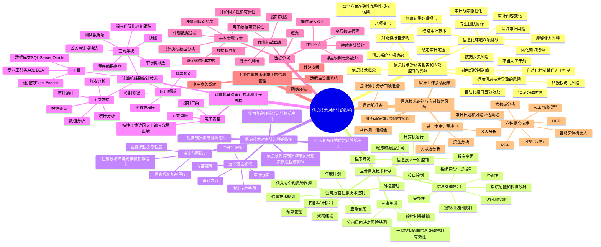

## 1. 章节定位

| 项目 | 信息 |
|------|------|
| 所属科目 | 审计 |
| 难度等级 | 3 |
| 历年分值 | 3-5 分 |
| 建议学时 | 4-6 小时 |
| 知识关联章节 | 第7章 风险评估（了解内部控制）、第8章 风险应对（控制测试、自动化控制测试范围）、第5章 审计抽样（计算机辅助审计技术）、第14章 舞弊和法律法规（信息技术识别舞弊风险） |

## 2. 考情分析

本章是审计科目的次重点章节，历年分值约 3-5 分，以客观题为主，部分年份涉及简答题。随着信息技术在审计实务中的广泛应用，本章的重要性逐年提升。

**命题规律**：本章以概念理解、分类辨析为主，信息技术一般控制四个领域、信息处理控制的要素、计算机辅助审计技术的分类和应用、数据分析的步骤是常见命题点，运用信息技术识别与应对舞弊风险是近年新增热点。

**高频考点分布**：

1. **信息技术对企业内部控制的影响**：自动化控制的好处（5点）、运用信息技术导致的风险（4点）、注册会计师在信息化环境下面临的挑战（8点）。
2. **三类信息技术控制**：信息技术一般控制（4个领域：程序开发、程序变更、程序和数据访问、计算机运行）、信息处理控制（完整性、准确性、授权和访问限制）、公司层面信息技术控制；三者之间的关系。
3. **信息技术对审计过程的影响**：对审计线索、审计技术手段、内部控制、审计内容、注册会计师五个方面的影响；信息技术审计范围的确定（业务流程复杂程度、信息系统复杂程度、信息技术环境规模和复杂程度三个方面）。
4. **不太复杂 vs 较为复杂信息技术环境下的审计**："绕过计算机进行审计" vs "穿过计算机进行审计"。
5. **计算机辅助审计技术**：面向系统的CAATs（平行模拟法、测试数据法、嵌入审计模块法等）和面向数据的CAATs；CAATs的应用领域和工具。
6. **电子表格**：电子表格的特性、风险（输入错误、逻辑错误、接口错误、未经授权访问、其他错误）、控制考虑。
7. **数据分析**：数据分析的概念和作用、基本步骤（5步）、面临的主要挑战（4点）。
8. **不同信息技术环境下的信息管理**：网络环境、数据库管理系统、电子商务系统、外包安排。
9. **运用信息技术识别与应对舞弊风险**：6种信息技术（RPA、可视化分析、OCR、大数据分析、人工智能模型、智能实体机器人）；运用前的准备工作；业务承接前、审计计划与风险评估阶段、进一步审计程序中的运用；审计工作底稿记录要求。

**备考建议**：
- 牢记信息技术一般控制的四个领域及其目标，这是本章最核心的考点；
- 区分信息技术一般控制（间接贡献，基础性）、信息处理控制（直接相关，应用层面）和公司层面信息技术控制（整体环境，风险基调）三者关系；
- 掌握计算机辅助审计技术的两类划分（面向系统 vs 面向数据）及各自包含的方法；
- 理解"绕过计算机审计"与"穿过计算机审计"的适用条件；
- 关注运用信息技术应对舞弊风险的三个领域（收入分析、资金分析、关联方分析）。

## 3. 知识框架

## 4. 核心精讲

### 4.1 信息技术对企业财务报告和内部控制的影响

#### 4.1.1 信息技术的概念

**信息技术**是指利用电子计算机和现代通信手段实现获取信息、传递信息、存储信息、处理信息、展示信息、分配信息等的相关技术。现代信息技术以微电子技术、计算机技术、软件技术、通信技术为核心。

#### 4.1.2 信息技术对企业财务报告的影响

企业可以运用信息系统来**创建、记录、处理和报告**各项交易。信息系统的使用会给企业带来八项重要变化：①计算机输入和输出代替了人工记录；②计算机显示屏和电子影像代替了纸质凭证；③计算机文档代替了纸质日记账和分类账；④网络通信和电子邮件代替了公司间的邮寄；⑤管理需求固化到应用程序之中；⑥灵活多样的报告代替了固定格式的报告；⑦数据更加充分，信息更容易实现共享；⑧系统性问题比偶然性误差更为普遍。

**有效信息系统需实现的五项功能**：①识别和记录全部经授权的交易；②及时、详细记录交易内容，并在财务报告中恰当分类；③衡量交易价值，并在财务报告中恰当体现；④确定交易发生的期间，记录在恰当的会计期间；⑤将有关交易信息在财务报告中作恰当披露。

注册会计师如果拟依赖相关信息系统生成的信息和报告，需要考虑整个过程中信息的**准确性、完整性、授权和访问限制**四个方面。

#### 4.1.3 信息技术对企业内部控制的影响

在信息技术环境下，传统的人工控制越来越多地被自动化控制所替代。信息系统对控制的影响，取决于被审计单位对信息系统的依赖程度。

**自动化控制带来的五项好处**：

1. 能够有效处理大量交易和数据；
2. 比较不容易被绕过；
3. 信息系统、数据库及操作系统的相关安全控制可以实现有效的职责分离；
4. 可以提高信息的及时性、准确性，并使信息更易获取；
5. 可以提高管理层对企业业务活动及相关政策的监督水平。

#### 4.1.4 运用信息技术导致的风险

信息技术在改进内部控制的同时，也产生了**四项特定风险**：

1. 信息系统或相关程序可能会对数据进行错误处理，也可能会去处理那些本身就错误的数据；
2. 自动化信息系统、数据库及操作系统的相关安全控制如果无效，会增加对数据非授权访问的风险；
3. 数据丢失风险或数据无法访问风险（如系统瘫痪等）；
4. 不适当的人工干预，或人为绕过自动化控制。

#### 4.1.5 注册会计师在信息化环境下面临的挑战

注册会计师在信息化环境下面临**八项挑战**：

1. **对业务流程开展和内部控制运作的理解**——相当部分内部控制环节转移到信息系统中自动执行；
2. **对信息系统相关审计风险的认识**——需要充分识别和评估信息技术导致的风险；
3. **审计范围的确定**——受困于信息技术的复杂性和专业性；
4. **审计内容的变化**——审计内容可能包括对信息系统中相关自动化控制的测试；
5. **审计线索的隐性化**——传统审计线索全面隐性化，信息系统封装了信息处理过程；
6. **改进审计技术的必要性**——传统审计技术在抽样针对性和样本覆盖程度方面的局限性越来越突出；
7. **知识结构有待优化**——不仅需要会计、审计等知识，还必须对信息技术有所掌握；
8. **与专业团队的充分协作**——引入相关技术专业人员参与审计工作已成为有效手段。

### 4.2 信息技术一般控制、信息处理控制和公司层面信息技术控制

在信息技术环境下，对于自动化控制，需要从**信息技术一般控制、信息处理控制以及公司层面信息技术控制**三方面考虑。

#### 4.2.1 信息技术一般控制

**信息技术一般控制**是指为了保证信息系统的安全，对整个信息系统以及外部各种环境要素实施的、对所有的应用或控制模块具有普遍影响的控制措施。信息技术一般控制通常会对实现部分或全部财务报表认定作出**间接贡献**，但在某些情况下也可能作出**直接贡献**。

与财务报告相关的信息技术一般控制通常涉及**四个领域**：

| 领域 | 目标 | 主要要素 |
|------|------|---------|
| 程序开发 | 确保系统的开发、配置和实施能够实现管理层的信息处理控制目标 | 管理方法、项目启动分析和设计、测试和质量确保、数据迁移、程序实施和应急计划、流程更新和用户培训、变更管理、职责分离 |
| 程序变更 | 确保对程序和相关基础组件的变更是经过请求、授权、执行、测试和实施的 | 变更维护管理、变更请求规范授权跟踪、测试和质量确保、程序实施、紧急变更管理、流程更新和用户培训、职责分离 |
| 程序和数据访问 | 确保分配的访问程序和数据的权限是经过用户身份认证并经过授权的 | 安全活动管理、应用系统用户授权、高权限用户管理、职责分工和权限管理、认证和密码控制、用户监控、数据安全管理、操作系统安全管理、物理访问和环境控制、网络访问控制 |
| 计算机运行 | 确保业务系统根据管理层的控制目标完整准确地运行 | 系统作业管理、问题和故障管理、数据备份和恢复、备份介质的异地存放、灾难恢复 |

#### 4.2.2 信息处理控制

**信息处理控制**是指与被审计单位信息系统中下列两方面相关的控制：①信息技术应用程序进行的信息处理；②人工进行的信息处理。信息处理控制一般要经过**输入、处理及输出**等环节。

信息处理控制关注的要素包括：

| 要素 | 含义 | 举例 |
|------|------|------|
| 完整性 | 系统处理数据的完整性 | 各系统之间数据传输的完整性、销售订单自动记录的完整性、总账数据的完整性 |
| 准确性 | 系统运算逻辑的准确性 | 金融机构利息计提逻辑的准确性、生产企业的物料成本运算逻辑的准确性、应收账款账龄的准确性 |
| 授权和访问限制 | 信息系统相关的逻辑校验控制 | 限制检查、合理性检查、存在检查和格式检查；入账审批管理的权限设定和授予 |

**常见的信息处理控制审计关注点**：①系统自动生成报告（账龄报告、贷款逾期报告、业务和财务数据核对差异报告等）；②系统配置和科目映射（数据完整性校验、录入合法性编辑检查、边界阈值设定、财务科目映射关系等）；③接口控制（各业务系统之间、业务和财务系统之间、企业内部系统和合作伙伴之间的接口数据传输）；④访问和权限（各部门、各团队甚至各岗位访问权限的合理性）。

#### 4.2.3 公司层面信息技术控制

常见的**公司层面信息技术控制**包括：①信息技术规划的制定；②信息技术年度计划的制定；③信息技术内部审计机制的建立；④信息技术外包管理；⑤信息技术预算管理；⑥信息安全和风险管理；⑦信息技术应急预案的制定；⑧信息系统架构建设和信息技术复杂性的考虑。

注册会计师通常针对公司层面信息技术控制**单独执行审计**，以评估企业信息技术的整体控制环境，确定信息技术一般控制和信息处理控制的审计重点、风险等级、审计测试方法等。

#### 4.2.4 三类控制之间的关系

| 控制类型 | 角色 | 影响 |
|---------|------|------|
| 公司层面信息技术控制 | 整体控制环境，决定风险基调 | 影响一般控制和信息处理控制的部署和落实 |
| 信息技术一般控制 | 基础 | 有效与否直接关系到信息处理控制的有效性是否能够信任 |
| 信息处理控制 | 应用层面 | 直接与具体审计目标相联系 |

**举例说明**：如果在带有关键的编辑检查功能的应用系统所依赖的计算机环境中发现了信息技术一般控制的缺陷，注册会计师可能就不能信赖上述编辑检查功能按设计发挥作用。例如，程序变更控制缺陷可能导致未授权人员对检查录入数据字段格式的编程逻辑进行修改，以至于系统接受不准确的数据录入。

### 4.3 信息技术对审计过程的影响

#### 4.3.1 信息技术对审计的五个方面影响

信息技术在企业中的应用并不改变注册会计师制定审计目标、实施风险评估和了解内部控制的原则性要求，但系统的设计和运行对审计有直接影响。信息技术对审计过程的影响主要体现在五个方面：

| 影响方面 | 具体内容 |
|---------|---------|
| 对审计线索的影响 | 传统审计线索（凭证、日记账、分类账和报表）变为数据存储介质、存取方式以及处理程序 |
| 对审计技术手段的影响 | 需要把信息技术当作一种有用的审计工具 |
| 对内部控制的影响 | 影响被审计单位设计和执行内部控制体系的方式，每一要素都能在一定程度上运用信息技术 |
| 对审计内容的影响 | 审计内容包括对信息化系统的处理和相关控制功能的审查 |
| 对注册会计师的影响 | 要求注册会计师具备相关信息技术方面的知识，成为知识全面的复合型人才 |

#### 4.3.2 信息技术审计范围的确定

注册会计师在确定审计策略时，需要结合**三个方面**对信息技术审计范围进行适当考虑。信息技术审计的范围与被审计单位在业务流程及信息系统相关方面的复杂程度成**正相关关系**。

**（1）评估业务流程的复杂程度**——考虑因素包括：①是否涉及过多人员及部门且关系复杂；②是否涉及大量操作及决策活动；③数据处理是否涉及复杂的公式和大量数据录入；④是否需要对信息进行人工处理；⑤对系统生成的报告的依赖程度。

**（2）评估信息系统的复杂程度**——对于商业软件，考虑系统复杂程度、参数设置范围、客制化程度；对于自行研发系统，考虑系统复杂程度、距离上一次系统架构重大变更的时间、系统变更对财务系统的影响结果、系统变更后的运行情况及运行期间。还需考虑系统生成的交易数量、信息和复杂计算的数量。

**（3）信息技术环境的规模和复杂程度**——主要考虑产生财务数据的信息系统数量、信息系统接口以及数据传输方式、信息部门的结构与规模、网络规模、用户数量、外包及访问方式。

**注册会计师判断信息技术关键风险的标准**：①被审计单位是否包含信息技术关键风险；②实质性程序是否无法完全应对该风险。如果符合上述情况，应将信息技术审计纳入审计计划。此外，如果计划依赖系统自动化控制，或依赖以自动化系统生成的信息为基础的人工控制或业务流程审阅结果，也需要对信息技术相关控制进行评估。

#### 4.3.3 信息技术控制对控制风险和实质性程序的影响

**信息技术一般控制对控制风险的影响**：无效的一般控制增加了信息处理控制不能防止或发现并纠正认定层次重大错报的可能性。如果一般控制有效，注册会计师可以更多地信赖信息处理控制，测试这些控制的运行有效性，并将控制风险评估为低于"最高"水平。注册会计师通常**优先评估**公司层面信息技术控制和信息技术一般控制的有效性。

**信息处理控制对控制风险和实质性程序的影响**：注册会计师需要将控制与具体的审计目标相联系。但对于一般控制而言，由于其影响广泛，注册会计师通常**不将控制与具体的审计目标相联系**。如果针对某一具体审计目标，注册会计师能够识别出有效的信息处理控制，在通过测试确定其运行有效后，可以适当减少实质性程序。

#### 4.3.4 不同复杂程度信息技术环境下的审计

| 环境类型 | 审计方式 | 特点 |
|---------|---------|------|
| 不太复杂的信息技术环境 | "绕过计算机进行审计" | 仍需了解信息技术一般控制和信息处理控制，但不需要测试其运行有效性，更多依赖非信息技术类审计方法 |
| 较为复杂的信息技术环境 | "穿过计算机进行审计" | 需要更多运用各项审计技术和审计工具开展具体的审计工作 |

### 4.4 计算机辅助审计技术和电子表格的运用

#### 4.4.1 计算机辅助审计技术

**计算机辅助审计技术（CAATs）**是指利用计算机和相关软件，使审计测试工作实现自动化的技术。通常分为两类：

**（1）面向系统的计算机辅助审计技术**——用来测试程序和系统：

| 方法 | 含义 |
|------|------|
| 平行模拟法 | 注册会计师使用自身的应用软件，运用与被审计单位同样的数据文件，执行同样的操作，以确定自动化控制的有效性或账户余额的准确性 |
| 测试数据法 | 注册会计师使用被审计单位的计算机系统和应用软件处理自身准备的测试数据，以确定自动化控制是否正确处理测试数据 |
| 嵌入审计模块法 | 在被审计单位的应用软件系统中嵌入审计模块，以识别特定类型的交易 |
| 程序编码审查 | 使用专业的编码审查工具，进行开发编码的独立审查，发现冗余代码、错误代码、恶意代码等 |
| 程序代码比较和跟踪 | 使用专业的代码比较工具，进行开发代码的比对 |
| 快照 | 使用专业的工具，将系统运行过程中的某一状态进行快照记录，进行横向比较 |

**（2）面向数据的计算机辅助审计技术**——用于分析电子数据：包括数据查询、账表分析、审计抽样、统计分析、数值分析等方法。

**CAATs提高审计效率和效果的两个方面**：①将现有人工执行的审计测试自动化；②在人工方式不可行的情况下执行测试或分析（如审计大量和非正常的销售交易）。

**CAATs的应用领域**：

| 应用领域 | 说明 |
|---------|------|
| 实质性程序 | 最广泛的应用领域，特别是实质性分析程序；可以对系统中每一笔交易进行测试 |
| 控制测试 | 选择少量交易在系统中进行穿行测试，或开发集成测试工具；优势是可以对每一笔交易进行测试 |
| 舞弊检查 | 有助于详细审计海量数据，如审计非正常的日记账 |

**计算机辅助审计工具**：①通用类（Excel、Access等）；②数据库类（SQL Server、Oracle等）；③专业工具类（ACL、DEA等）。

#### 4.4.2 电子表格

即使在信息化程度极高的环境下，财务信息和财务报告的生成往往还需要借助电子表格来完成。

**电子表格的特性**：开放的访问、人工输入数据和容易出错，以及编制并使用电子表格的环境的特性（用户开发不正式、开发文档不完整、保存在局域网或本地磁盘而不是受控的信息系统环境中），增加了电子表格所生成数据存在错误的风险。

**电子表格面临的五类风险**：

| 风险类型 | 说明 |
|---------|------|
| 输入错误 | 由错误数据录入、错误引用或其他简单的剪贴功能造成的错误 |
| 逻辑错误 | 创建错误的公式从而生成了错误的结果 |
| 接口错误 | 与其他系统传输数据时产生的错误 |
| 未经授权访问风险 | 对表格和表格内容未经授权的访问和修改 |
| 其他错误 | 单元格范围定义不当、单元格参考错误或电子表格链接不当 |

**电子表格控制的三类内容**：①对电子表格执行的、类似于信息系统一般控制的控制；②内嵌在电子表格中的控制（类似于一个自动化信息处理控制）；③针对电子表格数据输入和输出的人工控制。

### 4.5 数据分析

#### 4.5.1 数据分析的概念

对审计而言，**数据分析**是注册会计师获取审计证据的一种手段，是指注册会计师在计划和执行审计工作时，通过对内部或外部数据进行分析、建模或可视化处理，以发现其中隐含的模式、偏差或不一致，从而揭示出对审计有用的信息的方法。

#### 4.5.2 数据分析的作用

1. 能够帮助注册会计师以快速、低成本的方式实现对被审计单位**整套完整数据**（而非运用抽样技术抽出的样本数据）进行检查，提高审计的效率和效果；
2. 运用数据分析技术可以提高注册会计师**识别舞弊**的能力，降低审计风险；
3. 利用数据分析技术，进行**持续的审计和监控**，能够帮助注册会计师及时识别出偏差；
4. 可以帮助注册会计师向治理层提供更加深入和更有针对性的**观点和建议**。

#### 4.5.3 数据分析的基本步骤

数据分析可总结为五个步骤：

| 步骤 | 内容 |
|------|------|
| 1. 计划数据分析 | 确定数据分析所针对的财务报表账户、披露和相关认定，总体目标和具体目标，选择数据、程序及具体步骤 |
| 2. 获取和整理数据 | 从不同信息系统获取数据，整理数据以识别错误，校验采集数据的准确性和完整性（数据一致性校验、处理无效值和缺失值等） |
| 3. 评价所用数据的相关性和可靠性 | 相关性是信息与审计程序目的和相关认定的逻辑关系；可靠性考虑数据的准确性和完整性、来源和性质、获取环境、与数据生成和维护相关的控制 |
| 4. 具体执行数据分析 | 重新定义数据特征进行数据分析；将异常项目分为若干子集，针对每一个子集设计并实施有针对性的审计程序 |
| 5. 评价和应对数据分析结果 | 得出执行数据分析的目的是否已实现的结论 |

#### 4.5.4 数据分析面临的主要挑战

1. **审计对象信息或审计证据的数字化程度**——大量业务文件仍以纸质形式存在，外部审计证据也以纸质形式存在；
2. **电子数据的可获得性**——不同企业的财务数据接口可能不一致，出现信息"孤岛化"；
3. **数据标准的统一**——不同企业甚至同一企业的不同业务之间，可能缺乏统一的数据标准；
4. **被审计单位的信息技术一般控制和信息处理控制存在缺陷**——提取的数据可能不准确、不完整。

### 4.6 不同信息技术环境下的信息管理

| 环境 | 特点 | 内部控制相关问题 |
|------|------|----------------|
| 网络环境 | 应用软件和数据文件可能分布于不同位置但互相连接的计算机设备上 | 分布于不同位置的服务器的安全、数据和信息的分布及同步、管理监督以及兼容性问题 |
| 数据库管理系统（DBMS） | 操纵和管理数据库的大型软件，实现不同应用软件之间的数据共享，减少数据冗余 | 多重使用者能够访问和修改共享数据的风险；需要严格的数据库管理和接触控制，以及数据安全备份制度 |
| 电子商务系统 | 交易信息在网上传输，买卖双方不谋面 | 交易信息容易被拦截、篡改或不当获取；会计信息系统可能与交易对方系统相连接，产生互相依赖的风险 |
| 外包安排 | 将全部或部分信息技术职能外包给应用软件服务提供商或云计算服务商 | 需要参照《中国注册会计师审计准则第1241号》办理；了解服务机构控制、获取控制运行有效性证据 |

**外包安排下注册会计师应实施的程序**：①了解服务机构中与内部控制相关的控制以及针对服务机构活动所实施的控制；②获取相关控制运行有效性的证据。

**获取控制运行有效性证据的方式**：①了解服务机构注册会计师对服务机构内部控制有效性出具的报告或与控制测试相关的商定程序报告；②测试被审计单位对服务机构活动的控制；③对服务机构实施控制测试。

### 4.7 运用信息技术识别与应对舞弊风险

#### 4.7.1 可用于识别与应对舞弊风险的信息技术

| 技术 | 含义 | 应用 |
|------|------|------|
| 机器人流程自动化（RPA） | 使用软件机器人模拟并集成人工在数字系统中交互以执行任务的技术 | 减少人为错误，对数据监控与分析或自动报告等流程快速响应 |
| 可视化分析工具和技术 | 将大量复杂的数据转化为易于理解的视觉格式 | 数据挖掘和交互式分析、审计分析、交互式报告；常用工具有Power BI、Tableau、帆软等 |
| 光学字符识别技术（OCR） | 将不同形式文档中的印刷或手写文本转换为机器可编辑的文本格式的技术 | 文档识别和自动化数据提取，协助文档审查、数据对比、记录核对 |
| 大数据分析技术 | 从大规模数据集提取有价值信息的一系列方法、工具和流程 | 业财核对、时间序列分析、相关性分析、异常分布情况等 |
| 人工智能模型和算法 | 通过回归算法、聚类算法、敏感性分析、时间序列模型等提取和学习舞弊数据模式 | 利用历史舞弊案例进行数据训练，构建舞弊检测模型；自然语言处理技术审查文档 |
| 智能实体机器人应用技术 | 如无人机盘点 | 协助快速且精确的库存盘点，减少人为干预 |

#### 4.7.2 运用信息技术前的准备工作

**（1）会计师事务所的准备工作**（四项）：

1. **信息技术内部认证**——确保拟运用的信息技术经过充分的内部测试和认证，包括对技术可靠性、安全性、有效性以及数据保密性等方面的评估；
2. **培养运用信息技术的胜任能力**——可能需要进行相关教育和培训，必要时利用相关领域专家的工作；
3. **避免自动化零错误的认知偏差**——自动化零错误即倾向于相信信息系统自动生成的结果，即使该结果有悖于人的常识推理或与其他方面的信息存在冲突；可能影响注册会计师保持职业怀疑；
4. **建立相关的基础设施并投入充足的资源**——如存储和算力资源、数据传输安全保障体系等。

**（2）审计项目组的准备工作**：需要与被审计单位就信息技术的使用进行充分沟通，必要时在审计业务约定书中约定相关条款。需要沟通的内容包括数据的提供方式（如导出数据还是通过API接口获取数据等）、范围、格式和质量要求，以及提请被审计单位理解并同意运用信息技术进行审计。

#### 4.7.3 各阶段运用信息技术识别与应对舞弊风险

**（1）业务承接前**——汇集多维度财务与非财务数据，构建层级式指标或规则体系，设置不同行业分析框架，识别企业疑似高风险、高舞弊行为特征点。关注：财务风险指标预警、财务报表主要项目速览、负面舆情及监管处罚预警、舞弊动机及异常特征点识别、智能可视化行业分析。

**（2）审计计划和风险评估阶段**——根据对被审计单位及其环境的了解，选择适当的信息技术识别、评估和量化风险。针对不同类型企业（面向企业客户、通过经销商销售、面向个人消费者如电商或互联网企业），关注不同舞弊风险。

**（3）进一步审计程序中**——基于财务指标分析，有针对性地设计和实施审计程序，应对三个舞弊易发高发领域：

| 领域 | 信息技术应用 |
|------|------------|
| 收入分析 | 大数据分析和RPA综合应用（客户和供应商背景调查，识别异常情形）；机器学习和大数据分析（搭建行为分析模型，核查用户行为真实性，如互联网平台销售、零售药店会员销售） |
| 资金分析 | OCR和人工智能模型综合运用（银行流水自动清洗合并，重新计算余额与原始流水比对，识别虚假或不完整流水；银行流水与财务序时账数据一一匹配）；大数据分析和人工智能（对手方分析，检查交易规模是否匹配，识别第三方销售回款、关联方资金往来、非工作日频繁或大额资金交易等异常情况） |
| 关联方分析 | 机器学习与智能对比技术（分析交易对手方及其股东在工商登记信息上是否存在人物关系、联系方式、股权投资等重合，自动识别隐性关联方关系） |

#### 4.7.4 在审计工作底稿中记录对信息技术的运用

注册会计师通常需要在审计工作底稿中记录以下内容：

1. 运用信息技术执行的程序、获取的证据和得出的结论；
2. 所用信息技术的名称；
3. 所用源数据文件的相关信息（如类型、名称和日期等）。

具体可能需要记录：①所执行的分析程序（包括可视化图像或表格）；②执行分析程序的思路以及所应用的筛选条件；③数据采集有关的文件、数据提取和交付过程、验证和对账程序；④所运用信息技术的类型和版本；⑤不一致信息的考虑和结论；⑥其他相关记录（如信息技术生成的报告）。

对于常用的信息技术，其验证工作一般在会计师事务所层面实施。如果运用的信息技术未被会计师事务所验证，注册会计师需要执行验证并记录在审计工作底稿中。

## 5. 典型例题

### 例题1：信息技术一般控制（选择题）

**题目**：下列各项中，不属于信息技术一般控制领域的是（ ）。

A. 程序开发
B. 程序变更
C. 系统自动生成报告
D. 计算机运行

**参考答案**：C

**解析**：与财务报告相关的信息技术一般控制通常涉及程序开发、程序变更、程序和数据访问以及计算机运行四个领域。选项C"系统自动生成报告"属于信息处理控制的审计关注点，不属于信息技术一般控制领域。

### 例题2：计算机辅助审计技术（选择题）

**题目**：下列计算机辅助审计技术中，属于面向系统（测试程序和系统）的是（ ）。

A. 数据查询
B. 平行模拟法
C. 账表分析
D. 统计分析

**参考答案**：B

**解析**：计算机辅助审计技术分为两类：面向系统的和面向数据的。面向系统的包括平行模拟法、测试数据法、嵌入审计模块法、程序编码审查、程序代码比较和跟踪、快照等方法。面向数据的包括数据查询、账表分析、审计抽样、统计分析、数值分析等方法。选项A、C、D均属于面向数据的技术，只有选项B属于面向系统的技术。

### 例题3：三类控制关系（简答题）

**题目**：请说明公司层面信息技术控制、信息技术一般控制和信息处理控制三者之间的关系，并举例说明信息技术一般控制缺陷对信息处理控制的影响。

**参考答案**：

(1) 三者关系：①公司层面信息技术控制是公司信息技术整体控制环境，决定了信息技术一般控制和信息处理控制的风险基调；②信息技术一般控制是基础，信息技术一般控制的有效与否会直接关系到信息处理控制的有效性是否能够信任；③信息处理控制是设计在计算机应用系统中、有助于达到信息处理目标的控制，直接与具体审计目标相联系。注册会计师通常优先评估公司层面信息技术控制和信息技术一般控制的有效性。

(2) 举例：如果在带有关键的编辑检查功能的应用系统所依赖的计算机环境中发现了信息技术一般控制的缺陷，注册会计师可能就不能信赖上述编辑检查功能按设计发挥作用。例如，程序变更控制缺陷可能导致未授权人员对检查录入数据字段格式的编程逻辑进行修改，以至于系统接受不准确的数据录入。此外，与安全和访问权限相关的控制缺陷可能导致数据录入不恰当地绕过合理性检查，而该合理性检查原本应能使系统拒绝处理金额超过最大容差范围的支付操作。

### 例题4：自动化零错误的认知偏差（简答题）

**题目**：什么是"自动化零错误的认知偏差"？注册会计师在运用信息技术识别和应对舞弊风险时，如何避免这种认知偏差？

**参考答案**：

自动化零错误，即倾向于相信信息系统自动生成的结果，即使该结果有悖于人的常识推理或与其他方面的信息存在冲突因而导致其可靠性或适用性存疑。例如，注册会计师在审计成本项目时，一旦获取了系统自动生成的成本计算表，往往容易自动认为成本计算合理准确，而忽视对成本系统设置、数据归集以及计算结转等方面的测试。

自动化零错误的认知偏差可能影响注册会计师保持职业怀疑，从而影响其职业判断的合理性。因此，在运用信息技术识别和应对舞弊风险时，运用信息技术的人员需要时刻警惕和避免自动化零错误的认知偏差。

## 6. 记忆口诀

**信息技术一般控制四领域**：开发（程序开发）+ 变更（程序变更）+ 访问（程序和数据访问）+ 运行（计算机运行）。

**信息处理控制三要素**：完整性 + 准确性 + 授权和访问限制。

**三类控制关系**：公司层面（风险基调）→ 一般控制（基础）→ 信息处理控制（应用）。优先评估公司层面和一般控制。

**信息技术导致四风险**：错误处理 + 非授权访问 + 数据丢失 + 不当干预。

**信息化环境八挑战**：理解流程 + 认识风险 + 确定范围 + 内容变化 + 线索隐性化 + 改进技术 + 优化知识 + 团队协作。

**审计范围三方面**：业务流程复杂 + 信息系统复杂 + 环境规模复杂（正相关）。

**两种审计方式**：不太复杂→绕过计算机（了解不测试）；较为复杂→穿过计算机（运用技术和工具）。

**CAATs两类**：面向系统（平行模拟、测试数据、嵌入模块、编码审查、代码比较、快照）+ 面向数据（查询、账表、抽样、统计、数值）。应用三领域：实质性（最广）+ 控制测试 + 舞弊检查。

**电子表格五风险**：输入 + 逻辑 + 接口 + 未授权访问 + 其他（单元格）。

**数据分析五步骤**：计划 + 获取整理 + 评价相关可靠 + 执行 + 评价应对。面临四挑战：数字化程度 + 可获得性 + 标准统一 + 控制缺陷。

**舞弊风险六技术**：RPA + 可视化 + OCR + 大数据 + AI模型 + 智能机器人。

**事务所准备四项**：内部认证 + 胜任能力 + 避免零错误偏差 + 基础设施资源。

**舞弊三领域**：收入分析（背景调查、行为分析）+ 资金分析（银行流水匹配、对手方分析）+ 关联方分析（工商信息重合识别）。

## 7. 同步练习

**112.（单选题）** 下列各项关于注册会计师在信息化环境下面临的挑战的说法中，正确的是（　）。

A. 面对海量的交易、数据和财务信息，传统的审计技术在抽样针对性和样本覆盖程度方面的局限性越来越不明显
B. 信息技术的广泛运用突破了注册会计师审计准则的规定
C. 信息技术的运用，并不影响注册会计师的知识结构
D. 信息化环境下，注册会计师应该积极引入相关技术专业人员参与审计工作

**113.（单选题）** 下列有关注册会计师评估被审计单位信息系统的复杂度的说法中，错误的是（　）。

A. 评估信息系统的复杂度，需要考虑系统生成的交易数量
B. 信息技术环境复杂，意味着信息系统也是复杂的
C. 对信息系统复杂度的评估，受被审计单位所使用的系统类型的影响
D. 评估信息系统的复杂度，需要考虑系统中进行的复杂计算的数量

**114.（单选题）** 下列有关数据分析的说法中，错误的是（　）。

A. 数据分析的总体目标取决于审计的具体阶段
B. 整理数据主要是为了识别数据中的错误，以及校验所采集数据的准确性和完整性
C. 在许多情况下，对数据进行有意义的分析之前，需要先评价所用数据的相关性和可靠性
D. 对于同一套数据，在不同审计目标下，对相关性的考虑可能不同

**115.（单选题）** 当被审计单位采用高度集成化信息技术系统时，无论依赖程度的高低，注册会计师都必须执行的程序是（　）。

A. 了解、验证系统一般控制
B. 了解与评估系统环境
C. 验证系统信息处理控制
D. 验证人工控制

**116.（单选题）** 下列关于信息技术一般控制和信息处理控制的说法中，正确的是（　）。

A. 信息技术一般控制对实现部分或全部财务报表认定作出间接贡献
B. 信息处理控制是基础，其有效与否直接关系到信息技术一般控制的有效性
C. 信息处理控制比信息技术一般控制重要
D. 信息处理控制一般要经过输入、处理及输出等环节

**117.（单选题）** 下列关于在不同的IT环境下审计的表述，正确是（　）。

A. 当面临不太复杂的IT环境时，注册会计师可以"绕过计算机进行审计"
B. 当面临较为复杂的IT环境时，注册会计师可以"绕过计算机进行审计"
C. 当面临不太复杂的IT环境时，注册会计师需要更多运用计算机辅助审计技术进行审计
D. 当面临较为复杂的IT环境时，注册会计师更多的审计工作将依赖非信息技术类审计方法

**118.（单选题）** 下列关于数据分析的表述中，错误的是（　）。

A. 数据分析广泛应用于各类鉴证业务
B. 数据分析应用于审计的不同阶段
C. 数据分析的应用受被审计单位的信息技术一般控制和应用控制的影响
D. 数据分析主要可以提升审计效率，而非审计效果

**119.（单选题）** 下列关于信息技术一般控制、信息处理控制与公司层面控制三者之间的关系的说法中，错误的是（　）。

A. 公司层面信息技术控制情况代表了该公司的信息技术控制的整体环境，会影响该公司的信息技术一般控制和信息处理控制的部署和落实
B. 根据目前信息技术审计的业内最佳实践，注册会计师在执行信息技术一般控制和信息处理控制审计之前，会首先执行配套的公司层面信息技术控制审计
C. 信息技术一般控制通常会对实现部分或全部财务报表认定作出直接贡献
D. 公司层面信息技术控制是公司信息技术整体控制环境，决定了信息技术一般控制和信息处理控制的风险基调

**120.（多选题）** 下列有关信息系统审计范围的说法中，错误的有（　）。

A. 注册会计师计划依赖自动化控制，需要适当扩大信息技术审计的范围
B. 信息系统越复杂，对信息系统的审计范围越小
C. 信息技术环境的规模越大，对信息系统的审计范围越小
D. 某流程越涉及大量操作及决策活动，对该流程的审计范围越小

**121.（多选题）** 下列有关信息技术对审计的影响的说法中，正确的有（　）。

A. 审计线索受被审计单位信息技术应用情况的影响
B. 在信息技术环境下，审计工作与注册会计师对信息系统的依赖程度间接关联
C. 被审计单位对信息技术的运用会影响被审计单位设计和执行内部控制体系的方式
D. 如果注册会计师计划依赖自动化控制生成的信息，就需要适当扩大信息技术审计的范围

**122.（多选题）** 下列审计程序中，可应用数据分析的有（　）。

A. 风险评估
B. 控制测试
C. 实质性程序
D. 了解内部控制

**123.（多选题）** 被审计单位将全部或部分的信息技术职能外包给专门的应用软件服务提供商或云计算服务商等计算机服务机构，则注册会计师应当实施的与服务机构活动相关的程序有（　）。

A. 了解被审计单位内部控制的设计
B. 获取相关控制运行有效性的证据
C. 了解服务机构中与内部控制相关的控制以及针对服务机构活动所实施的控制
D. 了解被审计单位内部控制的运行是否有效

**124.（多选题）**（2023年）下列有关信息技术对审计的影响的说法中，正确的有（　）。

A. 无论被审计单位运用信息技术的程度如何，注册会计师均需了解与审计相关的信息技术一般控制和信息处理控制
B. 如果信息技术一般控制有效，注册会计师就可以减少实质性程序
C. 信息技术审计范围与被审计单位在业务流程及信息系统相关方面的复杂程度成正比
D. 当面临不太复杂的信息技术环境时，注册会计师可采取传统方式进行审计

**125.（多选题）**（2022年）在确定信息技术审计范围时，注册会计师需要考虑的因素有（　）。

A. 系统生成的交易数量
B. 业务对系统的依赖程度
C. 业务流程的复杂程度
D. 复杂计算的数量

---

**练习答案**：

**单选题**：112.D（A传统审计技术在抽样针对性和样本覆盖程度方面的局限性越来越突出；B信息技术运用与审计准则不冲突；C对注册会计师知识结构提出新要求）　113.B（信息技术环境复杂与信息系统复杂没有必然联系）　114.C（对数据进行有意义的分析之前，需要先整理数据）　115.B（了解与评估信息系统环境是信息系统审计的第一步，属于强制性程序）　116.D（A一般控制通常作间接贡献，但在某些情况下也可能作直接贡献；B一般控制才是基础；C两者无法简单比较谁更重要）　117.A（较为复杂的IT环境下"绕过计算机进行审计"不可行，需要"穿过计算机进行审计"）　118.D（数据分析不仅能提升审计效率，也有助于提高审计效果）　119.C（信息技术一般控制通常会对实现部分或全部财务报表认定作出间接贡献）

**多选题**：120.BCD（信息技术审计范围与信息系统复杂程度、信息技术环境规模和复杂程度、流程涉及的操作及决策活动数量成正比，B、C、D说法均错误）　121.ACD（在信息技术环境下，审计工作与注册会计师对信息系统的依赖程度直接关联，B错误）　122.ABCD（数据分析可应用于风险评估、了解和测试内部控制、实质性程序等审计的不同阶段）　123.BC（A、D是针对被审计单位内部控制的程序，不符合题意）　124.ACD（只有针对具体审计目标识别出有效的信息处理控制并经测试确定其运行有效后，才能适当减少实质性程序，B错误）　125.ABCD
