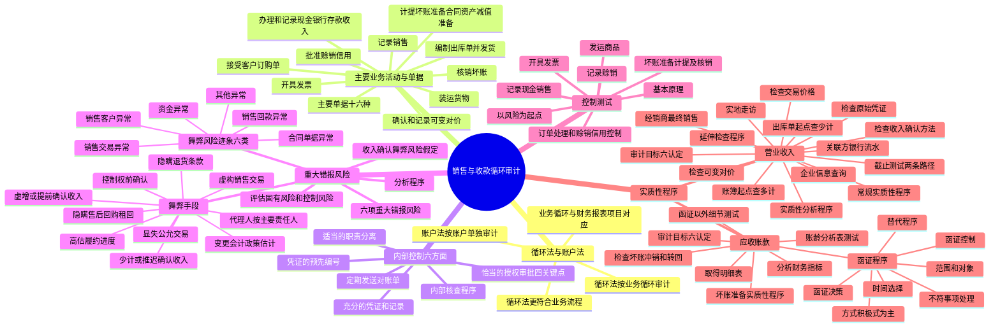

## 1. 章节定位

| 项目 | 信息 |
|------|------|
| 所属科目 | 审计 |
| 难度等级 | 4 |
| 历年分值 | 6-10 分 |
| 建议学时 | 8-10 小时 |
| 知识关联章节 | 第2章 职业道德（独立性）、第4章 审计证据（函证程序）、第7章 风险评估（重大错报风险识别）、第8章 风险应对（控制测试和实质性程序）、第11-12章 其他业务循环审计、第14章 舞弊和法律法规（收入确认舞弊风险假定） |

## 2. 考情分析

本章是审计科目的核心重难点章节，历年分值约 6-10 分，几乎每年必考主观题，常以综合题或简答题形式出现。收入确认是审计的高风险领域，中国注册会计师审计准则要求注册会计师基于收入确认存在舞弊风险的假定，评价哪些类型的收入、收入交易或认定存在舞弊风险。

**命题规律**：本章综合性强，常将风险评估、控制测试和实质性程序串联考查。收入确认舞弊手段的识别、截止测试的审计路径、应收账款函证程序的设计和实施、延伸检查程序的运用是高频命题点。

**高频考点分布**：

1. **业务循环与账户法**：循环法优于账户法的原因、业务循环与主要财务报表项目的对应关系。
2. **销售与收款循环的主要业务活动**：十项业务活动（接受客户订购单→批准赊销信用→编制出库单并发货→装运货物→开具发票→记录销售→办理和记录现金银行存款收入→确认和记录可变对价→计提坏账准备→核销坏账）及其涉及的主要单据与会计记录。
3. **内部控制六个方面**：适当的职责分离、恰当的授权审批（四个关键点）、充分的凭证和记录、凭证的预先编号、定期发送对账单、内部核查程序。
4. **重大错报风险**：六项重大错报风险、收入确认舞弊风险假定、识别与收入确认相关的舞弊风险。
5. **常用的收入确认舞弊手段**：虚增收入或提前确认收入（虚构销售交易、实施显失公允的交易、在客户取得控制权前确认收入、隐瞒退货条款、隐瞒售后回购或售后租回、代理人按主要责任人确认、高估履约进度、随意变更会计政策或估计等）；少计收入或推迟确认收入。
6. **舞弊风险迹象**：销售客户方面、销售交易方面、销售合同单据方面、销售回款方面、资金方面、其他方面六类异常情况。
7. **控制测试**：以风险为起点的控制测试（订单处理和赊销的信用控制、发运商品、开具发票、记录赊销、记录现金销售、坏账准备计提及坏账核销）。
8. **营业收入的实质性程序**：常规实质性程序（实质性分析程序、检查收入确认方法、检查交易价格、检查原始凭证与会计分录、截止测试两条审计路径、检查可变对价）、延伸检查程序（实地走访、企业信息查询、检查经销商最终销售、检查关联方银行流水）。
9. **应收账款的实质性程序**：应收账款函证（函证决策、范围和对象、方式、时间选择、控制、不符事项处理、替代程序）、坏账准备实质性程序、账龄分析表测试。

**备考建议**：
- 牢记收入确认存在舞弊风险的假定，但并非所有认定都存在舞弊风险（高估收入关注"发生"认定，隐瞒收入关注"完整性"认定，调节收入关注"截止"认定）；
- 掌握截止测试的两条审计路径：以账簿记录为起点（查多计）和以出库单为起点（查少计）；
- 理解应收账款函证是"应当"实施，除非有特定例外情形；
- 区分应收账款（仅承担信用风险）与合同资产（承担信用风险+其他风险）；
- 掌握延伸检查程序的适用情形和具体方法。

## 3. 知识框架

## 4. 核心精讲

### 4.1 财务报表审计的组织方式

财务报表审计的组织方式大致有两种：

| 方式 | 含义 | 优缺点 |
|------|------|-------|
| 账户法 | 对财务报表的每个账户余额单独进行审计 | 与账户设置体系及财务报表格式吻合，操作方便；但将紧密联系的相关账户人为分割，容易造成审计工作脱节和重复 |
| 循环法 | 将紧密联系的各类交易和账户余额归入同一循环中，按业务循环组织实施审计 | 更符合业务流程和内部控制设计的实际情况，加深对经济业务的理解，增强审计人员分工合理性，有助于提高效率与效果 |

由于控制测试通常按循环法实施，为便于实质性程序与控制测试的衔接，**提倡采用循环法**。本教材将交易和账户余额划分为：销售与收款循环、采购与付款循环、生产与存货循环、人力资源与工薪循环、投资与筹资循环。货币资金与多个业务循环密切相关，单独作为一章。

### 4.2 销售与收款循环的特点

#### 4.2.1 涉及的主要单据与会计记录

在内部控制较为健全的企业，处理销售与收款业务通常需要使用多种单据与会计记录，主要包括：

1. **客户订购单**——客户提出的书面购货要求；
2. **销售单**——列示客户所订商品的名称、规格、数量等信息的凭证，作为企业内部处理客户订购单的凭据；
3. **出库单**——仓库确认商品已出库发运的凭证；
4. **销售发票**——包含已销售商品的名称、规格、数量、价格、销售金额等内容；
5. **商品价目表**——列示已经授权批准的、可供销售的各种商品的价格清单；
6. **贷项通知单**——表示因销售退回或经批准的折让而导致应收货款减少的单据；
7. 应收票据/应收款项融资/应收账款/合同资产预期信用损失计算表；
8. 应收票据/应收款项融资/应收账款/合同资产明细账；
9. 主营业务收入明细账；
10. 可变对价相关会计记录；
11. **汇款通知书**——与销售发票一起寄给客户，由客户在付款时再寄回企业的凭证；
12. 现金日记账和银行存款日记账；
13. 坏账核销审批表；
14. 客户对账单——定期发送给客户的用于购销双方核对账目的文件；
15. 转账凭证；
16. 现金和银行凭证。

#### 4.2.2 主要业务活动

以一般制造业企业为例，销售与收款循环包含两类重要交易（销售、收款），涉及的主要业务活动如下：

**（1）接受客户订购单**——整个销售与收款循环的起点。仅接受符合管理层授权标准的订购单，销售单是证明销售交易"发生"认定的凭据之一。

**（2）批准赊销信用**——由信用管理部门根据经管理层批准的赊销政策，在每个客户的已授权的信用额度内进行批准。设计信用批准控制的目的是降低信用损失风险，与应收账款账面余额的"准确性、计价和分摊"认定相关。

**（3）根据销售单编制出库单并发货**——仓库管理人员只有在收到经过批准的销售单后才能编制出库单并安排发货，旨在防止未经授权擅自发货。

**（4）按出库单装运货物**——产品配送人员在发货时清点货物，确认与出库单一致后签字确认。

**（5）向客户开具发票**——涉及三个主要问题：是否对所有发运的货物均已开具发票（"完整性"）；是否仅对实际发运的货物开具发票（"发生"）；是否按已授权批准的商品价目表开具发票（"准确性"）。

**（6）记录销售**——区分赊销、现销，编制转账凭证或现金、银行存款收款凭证，据以登记明细账或日记账。

**（7）办理和记录现金、银行存款收入**——涉及货款收回，最关心的是货币资金的安全。

**（8）确认和记录可变对价的估计和结算情况**——每一资产负债表日重新估计应计入交易价格的可变对价金额。

**（9）计提坏账准备/合同资产减值准备**——月末对应收账款的预期信用损失/合同资产的减值损失进行估计。

**（10）核销坏账**——如有证据表明某项货款已无法收回，通过适当的审批程序核销。

### 4.3 销售与收款循环的内部控制

企业通常从以下**六个方面**设计和执行内部控制：

#### 4.3.1 适当的职责分离

适当的职责分离不仅是预防舞弊的必要手段，也有助于防止各种无意的错误。基本要求包括：
- 分别设立办理销售、发货、收款三项业务的部门（或岗位）；
- 谈判人员至少两人以上，并与订立合同的人员相分离；
- 编制销售发票通知单的人员与开具销售发票的人员相互分离；
- 销售人员应当避免接触销货现款；
- 应收票据的取得和贴现必须经由保管票据以外的主管人员书面批准。

#### 4.3.2 恰当的授权审批

注册会计师应当关注**四个关键点**上的审批程序：

| 关键点 | 目的 |
|--------|------|
| 在销售发生之前，赊销已经恰当审批 | 防止向虚构的或无力支付货款的客户发货 |
| 非经恰当审批，不得发出货物 | 防止向虚构的或无力支付货款的客户发货 |
| 销售价格、销售条件、运费、折扣等必须经过审批 | 保证销售交易按照企业定价政策规定的价格开票收款 |
| 审批人应当在授权范围内进行审批，不得超越审批权限 | 防止因审批人决策失误而造成严重损失 |

#### 4.3.3 充分的凭证和记录

充分的凭证和记录有助于企业执行各项控制以实现控制目标。例如，通过定期清点销售单和销售发票，可以避免漏开发票或漏记销售的情况。

#### 4.3.4 凭证的预先编号

对凭证预先进行编号，旨在防止销售以后遗漏向客户开具发票或登记入账，也可防止重复开具发票或重复记账。定期检查全部凭证的编号，并调查凭证缺号或重号的原因，是实施这项控制的关键点。

#### 4.3.5 定期发送对账单

由不负责现金出纳和销售及应收账款记账的人员定期向客户发送对账单，能促使客户在发现对账不符后及时反馈有关信息。

#### 4.3.6 内部核查程序

由内部审计人员或其他独立人员核查销售与收款交易的处理和记录。检查内容包括：岗位及人员设置情况、授权批准制度执行情况、销售管理情况、收款管理情况、销售退回管理情况。

### 4.4 销售与收款循环的重大错报风险

#### 4.4.1 重大错报风险

以一般制造业的赊销销售为例，注册会计师识别出的重大错报风险通常包括：

1. 已记录的收入交易未真实发生；
2. 未完整记录所有已发生的收入交易；
3. 收入交易的复杂性可能导致的错报；
4. 期末发生的交易可能未计入正确的期间，包括销售退回交易的截止错误；
5. 收款未及时入账或记入不正确的账户；
6. 应收账款坏账准备/合同资产减值准备的计提不准确。

#### 4.4.2 收入确认舞弊风险假定

中国注册会计师审计准则要求注册会计师**基于收入确认存在舞弊风险的假定**，评价哪些类型的收入、收入交易或认定存在舞弊风险。

**重要理解**：假定收入确认存在舞弊风险，并不意味着应当将与收入确认相关的所有认定都假定为存在舞弊风险。注册会计师需要结合对被审计单位及其环境等方面情况的了解，考虑收入确认舞弊可能如何发生：

| 管理层动机/压力 | 涉及的认定 |
|----------------|-----------|
| 高估收入（如业绩承诺或对赌条款） | 收入的"发生"认定存在舞弊风险 |
| 隐瞒收入降低税负 | 收入的"完整性"认定存在舞弊风险 |
| 将本期收入推迟至下一年度 | 收入的"截止"认定存在舞弊风险 |

**例外情形**：当被审计单位仅存在一种简单的收入交易（如单一租赁资产的租赁收入）时，注册会计师可能认为在收入确认方面不存在舞弊导致的重大错报风险。如果认为收入确认存在舞弊风险的假定不适用于业务的具体情况，应当在审计工作底稿中记录得出该结论的理由。

#### 4.4.3 常用的收入确认舞弊手段

**（1）为了粉饰财务报表而虚增收入或提前确认收入**：

- **虚构销售交易**：①无存货实物流转情况下，通过签订虚假购销合同、伪造单据、虚开发票虚构收入；②多方串通情况下，通过存货实物流转、真实交易单证和资金流转配合虚构收入；③根据行业特点虚构销售交易（如网络游戏运营业务）。
  - 虚构收入后无货款回笼：虚增的应收账款通过日后不当计提减值准备或核销等方式消化；
  - 虚构收入后有货款回笼：使用货币资金配合，可能涉及虚假存货采购套取资金、虚假预付款项套取资金、虚增长期资产采购金额、通过被投资单位套取投资资金、对负债不入账或虚减负债套取资金、伪造回款单据、关联方提供资金等多种方式。

- **实施显失公允的交易**：与未披露的关联方或真实非关联方进行显失公允的交易；通过出售关联方股权使之形式上不再构成关联方但仍进行显失公允的交易；与同一客户调节各次交易价格。

- **在客户取得相关商品控制权前确认销售收入**：如委托代销安排下在向受托方转移商品时确认收入；伪造出库单、发运单、验收单等单据提前确认收入。

- **通过隐瞒退货条款，在发货时全额确认销售收入**。

- **通过隐瞒不符合收入确认条件的售后回购或售后租回协议**，将以售后回购或售后租回方式发出的商品作为销售商品确认收入。

- **在被审计单位属于代理人的情况下，按主要责任人确认收入**。

- **对于属于在某一时段内履约的销售交易，通过高估履约进度的方法实现当期多确认收入**。

- **随意变更会计政策或会计估计方法**；**选择与销售模式不匹配的收入确认会计政策**；**调整与单独售价或可变对价等相关的会计估计**。

- **未对多项履约义务单独核算**，整体作为单项履约义务一次性确认收入；或**将应整体作为单项履约义务的销售交易拆分**，达到提前确认收入的目的。

**（2）为了降低税负或转移利润等目的而少计收入或推迟确认收入**：
- 满足收入确认条件后不确认收入，将收到的货款作为负债挂账；
- 以旧换新以差价确认收入；
- 应采用总额法却采用净额法确认收入；
- 时段履约未按实际履约进度确认收入，或采用时点法确认收入；
- 时点履约未在客户取得控制权时确认收入，推迟确认时点；
- 调整与单独售价或可变对价等相关的会计估计。

#### 4.4.4 表明可能存在舞弊风险的迹象

舞弊风险迹象是注册会计师在实施审计过程中发现的、需要引起对舞弊风险警觉的事实或情况。存在舞弊风险迹象并不必然表明发生了舞弊。通常表明被审计单位在收入确认方面可能存在舞弊风险的迹象主要有**六类**：

1. **销售客户方面出现异常情况**——销售情况与客户所处行业状况不符；与同一客户同时发生销售和采购交易；交易标的对交易对方不具有合理用途；主要客户自身规模与交易规模不匹配；与新成立或之前缺乏相关业务经历的客户发生大量或大额交易；与关联方或疑似关联方客户发生大量或大额交易等。
2. **销售交易方面出现异常情况**——临近期末时发生了大量或大额的交易；实际销售情况与订单不符；未经客户同意在发货期之前发送商品；销售价格异常；已经销售的商品在期后有大量退回；交易之后长期不进行结算等。
3. **销售合同、单据方面出现异常情况**——销售合同未签字盖章或公章不属于指定客户；重要条款缺失或含糊；部分条款不同于标准销售合同；日期被更改；实际发货前开具销售发票等。
4. **销售回款方面出现异常情况**——付款单位与购买方不一致，存在较多代付款；银行回单摘要与销售业务无关；不同客户的应收款项从同一付款单位收回；经常采用多方债权债务抵销方式。
5. **资金方面出现异常情况**——通过虚构交易套取资金；异常大量现金交易；货币资金充足仍大额举债；连续几个年度大额分红；工程实际付款进度快于合同约定；与关联方大额资金往来等。
6. **其他方面出现异常情况**——采用异常于行业惯例的收入确认方法；业务流程或内部控制异常变化；非财务人员过度参与会计政策选择；分析程序发现异常趋势；询证函回函重大差异；管理层不允许接触特定员工、客户、供应商等。

#### 4.4.5 评估固有风险和控制风险

**评估固有风险**：通过评估错报发生的可能性和严重程度来评估固有风险。例如，连锁超市现金收入因易被侵占，发生错报可能性较高，但因现金支付占比小，严重程度低，综合评估为低水平。又如，与包含多项履约义务的新客户重大合同，因复杂性、主观性、不确定性等固有风险因素，错报可能性高且严重程度高，评估为特别风险。

**评估控制风险**：如果计划测试相关控制的运行有效性，应当评估控制风险。如果拟不测试控制运行的有效性，应当将固有风险的评估结果作为重大错报风险的评估结果。

#### 4.4.6 根据重大错报风险评估结果设计进一步审计程序

注册会计师根据重大错报风险的评估结果，制定实施进一步审计程序的总体方案（综合性方案或实质性方案）。常见的风险与总体方案对应关系如下：

| 风险描述 | 相关认定 | 固有风险 | 控制风险 | 总体方案 |
|---------|---------|---------|---------|---------|
| 销售收入可能未真实发生 | 营业收入：发生；应收账款：存在 | 最高 | 高 | 实质性方案 |
| 销售收入记录可能不完整 | 营业收入：完整性；应收账款：完整性 | 中 | 最高 | 实质性方案 |
| 期末收入交易可能未计入正确期间 | 营业收入：截止；应收账款：存在/完整性 | 高 | 最高 | 实质性方案 |
| 收入交易未能准确记录 | 营业收入：准确性；应收账款：准确性、计价和分摊 | 低 | 中 | 综合性方案 |
| 坏账准备计提不准确 | 应收账款：准确性、计价和分摊 | 中 | 最高 | 实质性方案 |

### 4.5 销售与收款循环的控制测试

#### 4.5.1 控制测试的基本原理

在对销售与收款循环的相关内部控制实施测试时，注册会计师需要注意：

1. 控制测试所使用的审计程序的类型主要包括询问、观察、检查和重新执行，其提供的保证程度**依次递增**；
2. 如果在期中实施了控制测试，应当在年末审计时实施适当的前推程序；
3. 控制测试的范围取决于需要通过控制测试获取的保证程度；
4. 如果拟信赖的内部控制是由计算机执行的自动化控制，还需要就相关的信息技术一般控制的运行有效性获取审计证据；如果人工控制利用了系统生成的信息或报告，还需就系统生成的信息或报告的可靠性获取审计证据。

#### 4.5.2 以风险为起点的控制测试

注册会计师通常以识别的重大错报风险为起点，选取拟测试的控制并实施控制测试。主要控制测试领域包括：

| 控制测试领域 | 风险 | 相关认定 | 典型控制 | 典型控制测试程序 |
|------------|------|---------|---------|----------------|
| 订单处理和赊销的信用控制 | 可能向没有获得赊销授权或超出信用额度的客户赊销 | 营业收入：发生；应收账款：存在 | 系统自动检查客户代码和信用额度 | 检查销售单生成逻辑；检查系统外授权审批的销售单 |
| 发运商品 | 可能在没有批准发货的情况下发出商品 | 营业收入：发生；应收账款：存在 | 系统自动生成连续编号的出库单 | 检查出库单生成逻辑及连续编号；观察保安人员放行检查 |
| 发运商品 | 发运商品的种类、数量与销售单可能不一致 | 营业收入：准确性；应收账款：准确性、计价和分摊 | 系统将出库单与销售单比对，打印例外报告 | 检查例外报告和暂缓发货清单 |
| 开具发票 | 商品发运可能未开具销售发票或已开发票没有出库单支持 | 营业收入：发生/完整性；应收账款：存在/完整性/权利和义务 | 系统根据出库单自动生成连续编号的销售发票 | 检查系统生成发票的逻辑；检查例外报告及跟进情况 |
| 开具发票 | 定价或产品摘要不正确 | 营业收入：准确性；应收账款：准确性、计价和分摊 | 通过登录限制控制定价主文档的更改 | 检查价格更改是否经授权；重新执行以确定价格一致性 |
| 记录赊销 | 销售发票入账的会计期间可能不正确 | 营业收入：截止/发生；应收账款：存在/完整性/权利和义务 | 系统根据销售发票自动汇总生成当期销售入账记录 | 检查销售截止检查程序；重新执行销售截止检查程序 |
| 记录现金销售 | 登记入账的现金收入与实际收到的现金不符 | 营业收入：完整性/发生/截止/准确性；货币资金：完整性/存在 | 通过收银机集中收款并自动打印销售小票 | 观察收款过程；检查盘点记录和结算记录；检查银行存款余额调节表 |
| 坏账准备计提及坏账核销 | 坏账准备的计提可能不充分 | 应收账款：准确性、计价和分摊 | 系统自动生成账龄分析表；管理层复核并签字 | 检查账龄分析表计算规则；检查复核人员签字；检查坏账核销审批 |

### 4.6 销售与收款循环的实质性程序

#### 4.6.1 营业收入的实质性程序

**（1）营业收入的审计目标**

营业收入项目反映企业在销售商品、提供劳务等主营业务活动中所产生的收入。审计目标包括六项认定：发生、完整性、准确性、截止、分类、列报。

**（2）主营业务收入的常规实质性程序**

1. **获取主营业务收入明细表**，复核加计是否正确，并与总账数和明细账合计数核对。
2. **实施实质性分析程序**：
   - 将账面销售收入、销售清单和销售增值税销项清单进行核对；
   - 将本期销售收入金额与以前可比期间或预算数进行比较；
   - 分析月度或季度销售量、销售单价、销售收入金额、毛利率变动趋势；
   - 将销售收入变动幅度与销售商品及提供劳务收到的现金、应收账款/合同资产、存货、税金等项目的变动幅度进行比较；
   - 将关键财务指标与可比期间数据、预算数或同行业数据进行比较；
   - 分析销售收入等财务信息与投入产出率、劳动生产率、产能、水电能耗、运输数量等非财务信息之间的关系；
   - 分析销售收入与销售费用之间的关系。
3. **检查主营业务收入确认方法**是否符合企业会计准则的规定。判断合同履约义务是在某一时段内履行还是某一时点履行，测试被审计单位是否按照既定会计政策确认收入。对于特定收入交易（附有销售退回条款的销售、附有质量保证条款的销售、售后回购交易等），评价收入确认方法是否符合规定。
4. **检查交易价格**：询问管理层对交易价格的确定方法；选取和阅读部分合同，确定合同条款是否表明需要将交易价格分摊至各单项履约义务；检查管理层的处理是否恰当。
5. **检查与收入交易相关的原始凭证与会计分录**：以主营业务收入明细账中的会计分录为起点，检查相关原始凭证（订购单、销售单、出库单、发票等），评价已入账的营业收入是否真实发生（"发生"认定）。
6. **从出库单（客户签收联）中选取样本，追查至主营业务收入明细账**，以确定是否存在遗漏事项（"完整性"认定）。
7. **结合对应收账款/合同资产实施的函证程序**，选择客户函证本期销售额。
8. **实施销售截止测试**（详见下文）。
9. **检查销售退回**，检查相关手续是否符合规定，结合原始销售凭证检查会计处理是否正确。
10. **检查可变对价的会计处理**：获取可变对价明细表；检查估计是否恰当；检查计入交易价格的可变对价金额是否满足限制条件；检查资产负债表日是否重新估计。
11. **检查主营业务收入在财务报表中的列报和披露**。

**（3）销售截止测试**

截止测试的目的在于确定被审计单位主营业务收入的会计记录归属期是否正确。注册会计师可考虑选择**两条审计路径**实施截止测试：

| 审计路径 | 起点 | 方向 | 目的 | 优点 | 缺点 |
|---------|------|------|------|------|------|
| 以账簿记录为起点 | 资产负债表日前后若干天的账簿记录 | 追查至记账凭证和客户签收的出库单 | 证实已入账收入是否在同一期间已发货并由客户签收，有无多记收入 | 直观，容易追查；连续审计时检查跨期收入便捷 | 缺乏全面性和连贯性，只能检查多记，无法检查漏记 |
| 以出库单为起点 | 资产负债表日前后若干天已客户签收的出库单 | 查至账簿记录 | 确定主营业务收入是否已记入恰当的会计期间 | 可以检查少计收入 | — |

两条审计路径在实务中均被广泛采用，可以并用。

**（4）营业收入的"延伸检查"程序**

如果识别出被审计单位收入真实性存在重大异常情况，且通过常规审计程序无法获取充分、适当的审计证据，注册会计师需要考虑实施**"延伸检查"程序**，即对检查范围进行合理延伸，以应对识别出的舞弊风险。

延伸检查程序举例：
1. **对相关供应商、客户进行实地走访**，关注：被访谈对象身份真实性和适当性；是否存在关联方关系；交易规模与生产经营规模是否匹配；采购的商业理由；采购商品的用途和去向；商品库存情况；是否存在"抽屉协议"等。
2. **利用企业信息查询工具**，查询主要供应商和客户的股东至其最终控制人，以识别关联方关系。
3. **在采用经销模式的情况下，检查经销商的最终销售实现情况**。
4. **获取并检查相关关联方的银行账户资金流水**，关注是否存在与被审计单位相关供应商或客户的异常资金往来。

如果"延伸检查"程序是必要的但受条件限制无法实施，或实施后仍不足以获取充分、适当的审计证据，应当考虑审计范围是否受限，并考虑对审计报告意见类型的影响或解除业务约定。

#### 4.6.2 应收账款的实质性程序

**（1）应收账款的审计目标**

应收账款是企业无条件收取合同对价的权利。应收账款与合同资产的主要区别：应收款项仅承担信用风险，而合同资产除信用风险外，还可能承担其他风险。审计目标包括六项认定：存在、完整性、权利和义务、准确性/计价和分摊、分类、列报。

**（2）应收账款的常规实质性程序**

1. **取得应收账款明细表**：复核加计正确并与总账数和明细账合计数核对；检查非记账本位币应收账款的折算汇率；分析有贷方余额的项目；结合其他往来项目调查异常余额。
2. **分析与应收账款相关的财务指标**：复核应收账款借方累计发生额与主营业务收入关系；计算应收账款周转率、应收账款周转天数等指标。
3. **对应收账款实施函证程序**（详见下文）。
4. **对应收账款余额实施函证以外的细节测试**。
5. **检查坏账的冲销和转回**。
6. **确定应收账款的列报是否恰当**。

**（3）应收账款函证程序**

**函证决策**：除非有充分证据表明应收账款对财务报表而言是不重要的，或者函证很可能是无效的，否则注册会计师**应当**对应收账款进行函证。如果不函证，应当在审计工作底稿中说明理由。如果认为函证很可能是无效的，应当实施替代审计程序。

**函证的范围和对象**——影响函证范围的因素：①应收账款在全部资产中的重要程度；②被审计单位内部控制的有效性；③以前期间的函证结果。选择函证项目时，除金额较大的项目，还需考虑风险较高的项目：账龄较长的项目；与债务人发生纠纷的项目；重大关联方项目；主要客户项目；新增客户项目；交易频繁但期末余额较小甚至余额为零的项目；可能产生重大错报或舞弊的非正常项目。

**函证的方式**：由于应收账款通常存在高估风险，且与之相关的收入确认存在舞弊风险假定，实务中通常对应收账款采用**积极的函证方式**。

**积极式询证函的两种格式**：
- 格式一：列明拟函证的账户余额或其他信息，要求被询证者确认（回复能提供可靠的审计证据，但被询证者可能不验证就回函确认）；
- 格式二：不列明账户余额或其他信息，要求被询证者填写有关信息或提供进一步信息（要求被询证者作出更多努力，可能导致回函率降低）。

**函证时间的选择**：通常以资产负债表日为截止日，在资产负债表日后适当时间内实施函证。如果重大错报风险评估为低水平，可选择资产负债表日前适当日期为截止日实施函证，并对所函证项目自该截止日起至资产负债表日止发生的变动实施其他实质性程序。

**函证的控制**：注册会计师应当对函证全过程保持控制，包括确定需要确认或填列的信息、选择适当的被询证者、设计询证函以及发出和跟进（包括收回）询证函。

**对不符事项的处理**：对回函中出现的不符事项，需要调查核实原因，确定其是否构成错报。不能仅通过询问被审计单位相关人员得出结论，而要检查相关的原始凭证和文件资料予以证实。应收账款不符事项主要表现为：①客户已经付款，被审计单位尚未收到货款；②被审计单位的货物已经发出并已做销售记录，但货物仍在途中；③客户将货物退回，而被审计单位尚未收到；④客户对收到的货物的数量、质量及价格等方面有异议而全部或部分拒付货款。

**对未回函项目实施替代程序**：
- 检查资产负债表日后收回的货款（查看相关收款单据，证实付款方确为该客户且确与资产负债表日的应收账款相关）；
- 检查相关的销售合同、销售单、出库单等文件；
- 检查被审计单位与客户之间的往来邮件。

**重要规定**：在某些情况下，取得积极式函证回函是获取充分、适当的审计证据的必要程序（尤其是识别出有关收入确认的舞弊风险），则替代程序不能提供注册会计师需要的审计证据。如果未获取回函，应当确定其对审计工作和审计意见的影响。

**（4）坏账准备的实质性程序**

应收账款属于以摊余成本计量的金融资产，企业应当以预期信用损失为基础进行减值会计处理并确认坏账准备。坏账准备审计的常规实质性程序：

1. 取得坏账准备明细表，复核加计并与总账数、明细账合计数核对；
2. 将应收账款坏账准备本期计提数与信用减值损失相应明细项目核对；
3. 检查应收账款坏账准备计提和核销的批准程序，评价计提坏账准备所依据的资料、假设及方法；
4. 通过测试应收账款账龄分析表来评估坏账准备的计提是否恰当——将账龄分析表合计数与总分类账余额比较，调查重大调节项目；从账龄分析表中抽取项目追查至相关销售原始凭证，测试账龄划分的准确性；
5. 实际发生坏账损失的，检查转销依据是否符合有关规定，会计处理是否正确；
6. 已经确认并核销的坏账重新收回的，检查其会计处理是否正确；
7. 确定应收账款坏账准备的披露是否恰当。

## 5. 典型例题

### 例题1：收入确认舞弊风险假定（简答题）

**题目**：A 注册会计师在审计 X 公司财务报表时，了解到 X 公司存在业绩承诺条款，且管理层有隐瞒收入降低税负的动机。请说明：(1) 收入确认存在舞弊风险的假定是否意味着所有认定都存在舞弊风险？(2) 针对上述两种不同动机，注册会计师应分别关注哪些认定的舞弊风险？

**参考答案**：

(1) 假定收入确认存在舞弊风险，并不意味着注册会计师应当将与收入确认相关的所有认定都假定为存在舞弊风险。注册会计师需要结合对被审计单位及其环境等方面情况的具体了解，考虑收入确认舞弊可能如何发生。被审计单位不同，管理层实施舞弊的动机或压力不同，其舞弊风险所涉及的具体认定也不同。

(2) ①针对业绩承诺条款，重组标的管理层可能有高估收入的动机或压力（如提前确认收入或记录虚假的收入），因此收入的"发生"认定存在舞弊风险的可能性较大，而"完整性"认定则通常不存在舞弊风险。②针对隐瞒收入降低税负的动机，注册会计师需要更加关注与收入"完整性"认定相关的舞弊风险。

### 例题2：截止测试的审计路径（简答题）

**题目**：B 注册会计师对 Y 公司主营业务收入实施截止测试。请说明截止测试的两条审计路径，并分别说明各自的目的和优缺点。

**参考答案**：

(1) 以账簿记录为起点：从资产负债表日前后若干天的账簿记录追查至记账凭证和客户签收的出库单。目的是证实已入账收入是否在同一期间已发货并由客户签收，有无多记收入。优点是比较直观，容易追查至相关凭证记录，在连续审计时检查跨期收入十分便捷。缺点是缺乏全面性和连贯性，只能检查多记，无法检查漏记。

(2) 以出库单为起点：从资产负债表日前后若干天已客户签收的出库单查至账簿记录，确定主营业务收入是否已记入恰当的会计期间。此路径可以检查少计收入。

两条审计路径在实务中均被广泛采用，注册会计师可以考虑在同一主营业务收入科目审计中并用这两条路径。

### 例题3：应收账款函证（选择题）

**题目**：下列关于应收账款函证的说法中，错误的是（ ）。

A. 除非有充分证据表明应收账款对财务报表不重要或函证很可能无效，否则应当对应收账款进行函证
B. 实务中通常对应收账款采用积极的函证方式
C. 如果未收到回函，注册会计师应当实施替代审计程序
D. 在任何情况下，替代程序都能提供与函证回函相同的审计证据

**参考答案**：D

**解析**：选项A、B、C均正确。选项D错误，在某些情况下，取得积极式函证回函是获取充分、适当的审计证据的必要程序（尤其是识别出有关收入确认的舞弊风险，导致注册会计师不能信赖从被审计单位取得的审计证据），则替代程序不能提供注册会计师需要的审计证据。如果未获取回函，应当确定其对审计工作和审计意见的影响。

### 例题4：延伸检查程序（简答题）

**题目**：C 注册会计师在审计 Z 公司时，识别出 Z 公司收入真实性存在重大异常情况，且通过常规审计程序无法获取充分、适当的审计证据。请说明注册会计师可以实施的"延伸检查"程序。

**参考答案**：

注册会计师可以实施的"延伸检查"程序包括：
1. 在获取被审计单位配合的前提下，对相关供应商、客户进行实地走访，针对相关采购、销售交易的真实性获取进一步的审计证据。关注被访谈对象身份真实性和适当性、是否存在关联方关系、交易规模与生产经营规模是否匹配、采购的商业理由、采购商品的用途和去向、商品库存情况、是否存在"抽屉协议"等。
2. 利用企业信息查询工具，查询主要供应商和客户的股东至其最终控制人，以识别关联方关系。
3. 在采用经销模式的情况下，检查经销商的最终销售实现情况。
4. 当注意到存在关联方配合被审计单位虚构收入的迹象时，获取并检查相关关联方的银行账户资金流水，关注是否存在与被审计单位相关供应商或客户的异常资金往来。

## 6. 记忆口诀

**循环法优于账户法**：循环法符合业务流程，便于控制测试与实质性程序衔接。

**主要单据十六条**：客户订购单→销售单→出库单→销售发票→价目表→贷项通知单→预期信用损失计算表→明细账→收入明细账→可变对价记录→汇款通知书→日记账→坏账核销审批表→客户对账单→转账凭证→现金银行凭证。

**内部控制六方面**：职责分离 + 授权审批（四关键点）+ 凭证记录 + 预先编号 + 定期对账 + 内部核查。

**授权审批四关键**：赊销前审批 + 发货前审批 + 价格条件审批 + 不超越权限。

**收入确认舞弊假定**：非所有认定都有风险。高估→发生；隐瞒→完整性；调节→截止。

**舞弊手段两大类**：虚增/提前确认（虚构交易、显失公允、控制权前确认、隐瞒退货/回购、代理人按主要责任人、高估履约进度、变更政策估计）；少计/推迟确认（挂账负债、差价确认、总额变净额、不按进度、推迟时点）。

**舞弊迹象六类**：客户异常 + 交易异常 + 合同单据异常 + 回款异常 + 资金异常 + 其他异常。

**截止测试两路径**：账簿起点→查多计（直观但不全面）；出库单起点→查少计。实务中并用。

**延伸检查四程序**：实地走访 + 企业信息查询 + 经销商最终销售 + 关联方银行流水。

**应收账款函证**：应当函证（除非不重要或很可能无效）；通常积极式；未回函→替代程序（检查期后收款、检查销售文件、检查往来邮件）；但舞弊风险下替代程序可能不足。

**坏账准备测试**：账龄分析表→合计数与总账核对→抽取项目追查原始凭证测试账龄划分准确性。

## 7. 同步练习

**194.（单选题）** 下列有关销售与收款循环所涉及的主要业务活动的说法中，错误的是（　）。

A. 仓库管理人员只有在收到经过批准的销售单后才能编制出库单并安排发货，这项控制旨在防止仓库管理人员未经授权擅自发货
B. 对于赊销业务，由销售部门主管根据经管理层批准的赊销政策，在每个客户的已授权的信用额度内进行批准
C. 客户提出订货要求是整个销售与收款循环的起点
D. 已批准的销售单是仓库根据授权发货的依据

**195.（单选题）** 下列审计程序中，证实应收账款存在认定最佳的审计程序是（　）。

A. 检查销售文件以确定是否采用连续编号的销售单
B. 从应收账款明细账追查至销售合同、销售发票、出库单等原始凭证
C. 抽取出库单、销售合同等原始凭证追查至应收账款明细账
D. 向销售客户进行函证

**196.（单选题）** 下列有关销售与收款循环中职责分离的说法，错误的是（　）。

A. 主营业务收入总账和明细账应由不同人员登记
B. 为促进销售，应由销售经理负责赊销审批
C. 由不负责现金出纳和销售及应收款项记账的人员定期向客户寄发对账单
D. 编制销售发票通知单的人员与开具销售发票的人员应相互分离

**197.（单选题）** 注册会计师发现被审计单位临近期末某产品的销售量大幅增加，下列情形中，最可能的情况是（　）。

A. 被审计单位将下期收入提前确认
B. 赊销政策发生了变化
C. 信用期限发生了变化
D. 本年对该产品的市场需求较上年大幅上升

**198.（单选题）** 关于收入确认存在舞弊风险的假定，下列说法中错误的是（　）。

A. 注册会计师在识别和评估与收入确认相关的重大错报风险时，应当基于收入确认存在舞弊风险的假定，评价哪些类型的收入、收入交易或认定导致舞弊风险
B. 假定收入确认存在舞弊风险，并不意味着注册会计师应当将与收入确认相关的所有认定都假定为存在舞弊风险
C. 通常收入的发生认定存在舞弊风险的可能性较大，而完整性认定则通常不存在舞弊风险
D. 如果认为收入确认存在舞弊风险的假定不适用于业务的具体情况，从而未将收入确认作为由于舞弊导致的重大错报风险领域，应在工作底稿中记录理由

**199.（单选题）** 下列有关应收账款函证的说法中，错误的是（　）。

A. 在有充分证据表明应收账款对财务报表不重要的情况下，可以不函证
B. 在有充分证据表明函证很可能无效的情况下，可以不函证
C. 如果不对应收账款进行函证，注册会计师应当在审计工作底稿中说明理由
D. 回函中附有免责条款或限制性条款，将使回函失去可靠性

**200.（单选题）** 下列各项中，不属于被审计单位通常采用的收入确认舞弊手段的是（　）。

A. 对于存在多项履约义务的销售交易，未对各项履约义务单独进行核算，而整体作为单项履约义务一次性确认收入
B. 在采用以旧换新的方式销售商品时，除金银首饰外以新旧商品的差价确认会计收入
C. 当存在多种可供选择的收入确认会计估计方法时，变更所选择的会计政策
D. 以旧换新销售，按新货同期销售价格确定销售额，不得扣减旧货收购价格

**201.（单选题）** 下列有关对营业收入执行"延伸检查"程序的说法中，错误的是（　）。

A. 注册会计师并非在每次审计中都必须执行收入的"延伸检查"
B. 如果对被审计单位下游产业链执行"延伸检查"，则"延伸检查"程序应当覆盖下游产业链的所有环节
C. 在获取被审计单位配合的前提下，注册会计师可以通过对相关供应商、客户进行实地走访以执行"延伸检查"
D. 注册会计师应当充分考虑被审计单位与被访谈对象串通舞弊的可能性，在访谈前应注意对访谈提纲保密

**202.（单选题）** 下列不属于表明被审计单位在收入确认方面可能存在舞弊风险的迹象的是（　）。

A. 已经销售的商品，在期后有大量退回
B. 在采用代理商的销售模式时，在代理商仅向购销双方提供帮助接洽、磋商等中介代理服务的情况下，按照相关购销交易的净额等确认收入
C. 在货币资金充足的情况下仍大额举债
D. 采用异常于行业惯例的收入确认方法

**203.（单选题）** 注册会计师计划测试甲公司2024年度营业收入的完整性。以下各项审计程序中，通常难以实现上述审计目标的是（　）。

A. 抽取2024年12月31日开具的销售发票，检查出库单和账簿记录
B. 抽取2024年12月31日的出库单，检查相应的销售发票和账簿记录
C. 从营业收入明细账中抽取2024年12月31日的明细记录，检查相应的记账凭证、出库单和销售发票
D. 从营业收入明细账中抽取2025年1月1日的明细记录，检查相应的记账凭证、出库单和销售发票

**204.（多选题）** 下列各项审计程序中，能够为营业收入发生认定提供审计证据的有（　）。

A. 结合对应收账款实施的函证程序，选择主要客户函证本期销售额
B. 检查资产负债表日后应收账款明细账的贷方发生额
C. 从原始凭证追查至营业收入明细账
D. 对于出口销售，向海关函证

**205.（多选题）** 关于在对主营业务收入实施审计时运用实质性分析程序，下列说法中正确的有（　）。

A. 需要确定期望值
B. 需要确定可接受的差异额
C. 需要将已记录金额与预期值相比较，计算差异
D. 评价实质性分析程序的结果

**206.（多选题）** 下列程序中属于注册会计师对应收账款实施的实质性分析程序的有（　）。

A. 计算应收账款周转率，应收账款周转天数等指标；并与被审计单位上年指标、同行业同期相关指标对比分析，检查是否存在重大差异
B. 复核应收账款的借方累计发生额与主营业务收入是否匹配，如存在不匹配的情况应查明原因
C. 在明细表上标注重要客户，并编制对重要客户的应收账款增减变动表，与上期比较分析是否发生变动，必要时，收集客户资料分析其变动合理性
D. 计算坏账准备计提是否恰当

**207.（多选题）** 下列有关应收账款函证的说法中，错误的有（　）。

A. 函证应收账款可以证实应收账款的完整性认定
B. 如果注册会计师认为函证很可能无效，则根据影响情况出具保留或无法表示意见的审计报告
C. 应收账款函证必须采用积极式函证
D. 除非有充分证据表明应收账款对财务报表不重要或函证很可能无效，否则，注册会计师应当对应收账款进行函证

**208.（多选题）** 下列做法中，违反登记入账的销售交易记录恰当原则的有（　）。

A. 企业将变卖生产用的固定资产取得的净损益计入资产处置损益
B. 现销时，借记应收账款，贷记主营业务收入及相关税费
C. 企业将出租专利技术取得的收入计入其他业务收入
D. 随同产品一起出售，单独计价的包装物，借记销售费用，贷记周转材料——包装物

**209.（多选题）** 企业会计准则规定，企业应当在期末对应收款项进行检查，并合理预计可能产生的坏账损失。可以用于审计坏账准备科目的实质性程序包括（　）。

A. 取得坏账准备明细表，复核加计是否正确，与坏账准备总数、明细账合计数核对是否相符
B. 将应收账款坏账准备上期计提数与信用减值损失相应明细项目的发生额核对是否相符
C. 检查应收账款坏账准备计提和核销的批准程序，取得书面报告等证明文件，评价计提坏账准备所依据的资料、假设和方法
D. 实际发生坏账损失的，检查转销依据是否符合有关规定，会计处理是否正确

**210.（简答题）** ABC会计师事务所的A注册会计师负责审计甲公司2024年度财务报表。审计工作底稿中与函证相关的部分内容摘录如下：

(1) A注册会计师经过评估认为应收账款的重大错报风险较高，为尽早识别可能存在的错报，在期中审计时对截至2024年9月末的余额实施了函证程序，在期末审计时对剩余期间的发生额实施了细节测试，结果满意。
(2) A注册会计师评估认为应收账款的重大错报风险为低水平，在期中审计时对截至2024年9月末的余额实施了函证程序。在期末审计时对剩余期间的销售和收款交易实施了控制测试，结果满意。
(3) A注册会计师于2024年12月31日对甲公司期末银行承兑汇票实施监盘，发现缺失一张大额票据，财务经理解释该票据已交由银行托收。A注册会计师向出票人寄发了询证函并收到回函，结果满意。
(4) 因未收到应收丙公司款项的询证函回函，A注册会计师将检查期后收款作为替代审计程序，查看了应收丙公司款项明细账的期后贷方发生额，结果满意。
(5) A注册会计师经评估认为应付账款存在低估风险，因此，在询证函中未填列甲公司账面余额，而是要求被询证者提供余额信息。

要求：针对上述第(1)至(5)项，逐项指出A注册会计师的做法是否恰当。如不恰当，简要说明理由。

**211.（简答题）** ABC会计师事务所的A注册会计师负责审计甲公司2024年度财务报表。与收入审计相关的部分事项摘录如下：

(1) 由应收账款会计定期向客户寄发对账单，对不符事项进行调查，必要时调整会计记录，编制对账情况汇总报告并交管理层审核。A注册会计师认为该项控制设计有效，实施了控制测试，结果满意。
(2) A注册会计师在对营业收入实施实质性分析程序的过程中，将已记录金额与期望值相比较。针对差异额超过确定的可接受差异额的部分金额进行调查证实，结果满意。
(3) A注册会计师通过对甲公司应收账款相关内部控制实施控制测试，测试结果满意，得出内部控制有效的结论，拟相应减少应收账款函证范围。
(4) A注册会计师识别出有关收入确认的舞弊风险，针对未回函的应收账款，检查资产负债表日后收回的货款以及相关销售合同、销售单、客户签收的出库单等，结果满意，据此认为未回函应收账款不存在错报。
(5) 从乙公司收回的应收账款函证回函中包括限制条款"本信息是从电子数据库中取得，可能不包括被询证方所拥有的全部信息"，A注册会计师认为其属于格式化的免责条款，不影响所确认信息的可靠性。
(6) 对于甲公司的应收账款，A注册会计师将其集中在具有类似信用风险特征的应收账款组合中进行减值测试，结果满意。

要求：针对上述第(1)至(6)项，逐项指出A注册会计师的做法是否恰当。如不恰当，简要说明理由。

---

**练习答案**：

**单选题**：194.B（对于赊销业务，应由信用管理部门根据经管理层批准的赊销政策，在每个客户的已授权信用额度内进行批准）　195.D（A、C有助于证实完整性；B、D有助于实现存在认定，而外部获取的审计证据证明力通常强于内部证据，因此函证是最佳程序）　196.B（销售人员有追求更大销售数量的固有倾向，赊销审批职能与销售职能分离是理想的控制，不应由销售经理负责赊销审批）　197.A（期末销售量大幅增加最可能是被审计单位将下期收入提前确认；D导致的是全年销售量大幅上升而非仅在期末）　198.C（被审计单位不同，舞弊风险涉及的具体认定也不同，并非一定发生认定舞弊风险大而完整性认定小，需要具体分析）　199.D（回函中的免责或限制条款不一定使回函失去可靠性，能否依赖取决于条款的性质和实质，格式化的免责条款可能不影响所确认信息的可靠性）　200.B（以旧换新方式销售货物，以新旧商品差价确认收入（金银首饰除外）符合规定，不属于舞弊手段）　201.B（如果对下游产业链某环节实施"延伸检查"获取的审计证据可以应对与收入确认相关的舞弊风险，则无需覆盖所有环节）　202.B（在代理商仅提供中介代理服务的情况下按净额确认收入是正确处理，不存在舞弊风险迹象）　203.C（从营业收入明细账追查至原始凭证属于逆查，验证的是发生认定；A、B、D均可实现营业收入完整性目标）

**多选题**：204.ABD（C属于顺查，验证的是营业收入完整性认定）　205.ABCD（均属于实质性分析程序的步骤）　206.ABC（D属于重新计算，是细节测试而非实质性分析程序）　207.ABC（A函证证实的是存在认定；B函证很可能无效时应实施替代审计程序；C可以采用积极式或消极式函证）　208.BD（B现销应借记货币资金；D单独计价的包装物应借记其他业务成本）　209.ACD（B应为本期计提数，而非上期计提数；C属于实质性程序，针对认定层次重大错报风险）

**简答题**：

**210.（简答题）** (1) 不恰当。重大错报风险较高时，应在期末或接近期末实施函证/在期末审计时应再次发函。只有重大错报风险评估为低水平，才可以在期中实施函证。(2) 不恰当。针对剩余期间仅实施控制测试不够，应对剩余期间的销售和收款交易实施实质性程序或将实质性程序与控制测试相结合。(3) 不恰当。应对所询证的信息知情的第三方寄发询证函，出票人不知情，不是适当的被询证方。应向托收银行寄发询证函，还应检查期后的收款记录。(4) 不恰当。还应查看相关的收款单据，以证实付款方确为该客户且确与资产负债表日的应收账款相关。(5) 恰当。

**211.（简答题）** (1) 不恰当。应收账款会计不能负责向客户寄发对账单，职责分离不当。(2) 不恰当。如果差异额超过可接受差异额，注册会计师需要对差异额的全额进行调查证实。(3) 恰当。(4) 不恰当。在识别出有关收入确认的舞弊风险的情况下，注册会计师不能信赖从被审计单位取得的审计证据，替代程序不能提供注册会计师需要的审计证据。(5) 不恰当。该限制条款对回函的可靠性产生影响。(6) 不恰当。对于单项金额重大的应收账款，企业应当单独进行减值测试。
