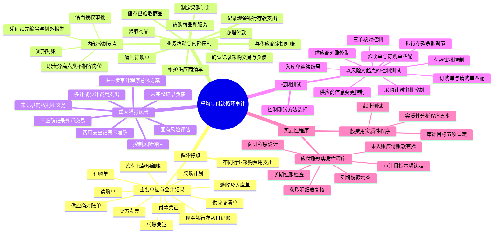

## 1. 章节定位

| 项目 | 信息 |
|------|------|
| 所属科目 | 审计 |
| 难度等级 | 3 |
| 历年分值 | 6-8 分 |
| 建议学时 | 8-10 小时 |
| 知识关联章节 | 第7章 风险评估、第8章 风险应对、第9章 信息技术对审计的影响、第10章 销售与收款循环的审计（控制设计类比）、第12章 生产与存货循环的审计（存货入库衔接）、第13章 货币资金的审计（付款衔接） |

## 2. 考情分析

本章是审计科目的业务循环审计章节之一，历年分值约 6-8 分，常以客观题、简答题形式出现，也会在综合题中与存货、货币资金等章节结合考查。本章与第十章销售与收款循环在内部控制设计思路上高度相似，命题时常作类比。

**命题规律**：本章主观题侧重考查采购与付款循环的重大错报风险识别、控制测试程序的设计以及应付账款实质性程序（尤其是未入账应付账款的查找）。客观题集中在职责分离、凭证流转、认定对应关系等知识点。未记录负债（完整性认定）是本章的核心高频考点，几乎每年涉及。

**高频考点分布**：

1. **采购与付款循环的特点**：不同行业的采购和费用支出差异、主要单据与会计记录（请购单、订购单、验收单、卖方发票、付款凭单、供应商对账单）及其与认定的对应关系。客观题常考单据的编制部门、流转顺序与支持的具体认定。
2. **主要业务活动和相关内部控制**：十项业务活动（制定采购计划、维护供应商清单、请购、编制订购单、验收商品、储存商品、确认记录采购负债、办理付款、记录支出、定期对账）的控制设计要点；职责分离的六类不相容岗位；授权审批的关键控制点；凭证预先编号与例外报告跟进。简答题常要求指出内部控制缺陷并提出改进建议。
3. **重大错报风险**：五类典型风险（未完整记录负债、多计或少计费用支出、费用支出记录不准确、不正确记录外币交易、未记录的权利和义务），以及各类风险对应的认定（完整性、发生、准确性、截止、分类、权利和义务）。固有风险和控制风险的评估方法是重点。
4. **控制测试**：以风险为起点的控制测试程序设计，特别是"三单核对"控制、入库单连续编号控制、供应商信息变更控制、银行存款余额调节控制等的具体测试方法。简答题常给出具体控制要求考生设计测试程序。
5. **应付账款实质性程序**：应付账款审计目标（六项认定）、函证程序的设计（从采购部门获取供应商清单以保证完整性、未回函的替代程序）、未入账应付账款的查找（五类程序，尤其截止测试和期后付款检查）、长期挂账应付账款的检查。
6. **一般费用实质性程序**：除折旧/摊销和人工费用以外的一般费用（差旅费、广告费等）的审计目标和实质性程序，实质性分析程序的五个步骤、截止测试。

**联动考查方式**：
- 与风险评估章节结合：识别采购循环重大错报风险并评估固有风险、控制风险；
- 与风险应对章节结合：设计进一步审计程序的总体方案（综合性方案 vs 实质性方案）；
- 与信息技术审计结合：自动化控制（系统生成例外报告、订单匹配逻辑）的测试；
- 与存货循环结合：存货入库与应付账款确认的衔接、存货监盘时检查负债入账期间；
- 与货币资金审计结合：付款控制的测试、银行存款余额调节表的复核。

**备考建议**：
- 紧扣"完整性"这一核心认定——采购循环最常见错报是低估负债，函证和未入账查找程序都围绕此展开；
- 牢记十项业务活动的顺序（请购→订货→验收→储存→记录负债→付款→记录支出→对账）及每项活动支持的具体认定；
- 对比销售循环学习：两个循环在职责分离、授权审批、凭证预先编号、定期对账等控制思路上高度对称，但方向相反（销售关注高估，采购关注低估）；
- 掌握"三单核对"（订购单、验收单、供应商发票）这一关键控制，它同时应对存在、发生、完整性、准确性多项认定；
- 未入账应付账款的查找程序要按"期后付款、期后入账发票、期末暂估、截止测试、对账单核对"五条路径记忆。

## 3. 知识框架

## 4. 核心精讲

### 4.1 采购与付款循环的特点

采购与付款循环包括购买商品和服务，以及企业在经营活动中为获取收入而发生的直接或间接的支出。采购业务是企业生产经营活动的起点，企业的支出从性质、数量和发生频率上看多种多样。本章主要关注与购买商品和服务、应付账款的支付有关的控制活动以及重大交易。固定资产的采购和管理通常由单独的资产管理部门负责，其风险考虑和相关控制与普通的原材料等商品采购有较大不同，因此在审计实务中一般单独考虑，不包含在本循环内。

#### 4.1.1 不同行业的采购和费用支出

不同的企业性质决定企业除了有一些共性的费用支出外，还会发生一些不同类型的支出。下表列示了不同行业通常会发生的一些支出情况（未包括经营用房产支出和人工费用支出）：

| 行业 | 典型的采购和费用支出 |
|------|------|
| 贸易业 | 商品的购买、运输和存储费用、广告促销费用、售后服务费用 |
| 一般制造业 | 生产过程所需的原材料、包装物、配件的购买与存储支出，市场经营费用，将产成品运达客户处发生的运输费用，管理费用、研发费用（不含研发人员工资） |
| 专业服务业 | 律师、会计师、财务顾问的费用支出，包括印刷、通信、差旅费，书籍资料和研究设施的费用 |
| 金融服务业 | 给付储户的存款利息，支付其他银行的资金拆借利息、手续费，现金存放、现金运送和网络银行设施的安全维护费用，客户关系维护费用 |
| 建筑业 | 建材支出，建筑设备和器材的租金或购置费用，支付给分包商的费用，保险支出和安保成本，建筑保证金和许可审批方面的支出，交通费、通讯费等；在外地施工时还会发生建筑工人的食宿费用 |

#### 4.1.2 涉及的主要单据与会计记录

采购与付款交易通常要经过"请购—订货—验收—付款"这样的流程。在内部控制比较健全的企业，处理采购与付款交易通常需要使用多种单据与会计记录。以一般制造业为例，常见的主要单据与会计记录如下：

| 单据/记录 | 编制/填写部门 | 作用与相关认定 |
|------|------|------|
| 采购计划 | 生产、仓库等部门编制，管理层审批 | 以销售和生产计划为基础制定，经适当管理层审批后执行 |
| 供应商清单 | 采购部门维护 | 通过文件审核及实地考察对供应商进行认证，及时更新；采购部门只能向通过审核的供应商采购 |
| 请购单 | 生产、仓库等部门填写 | 申请购买商品、服务或其他资产的书面凭据；证明采购交易"发生"认定的凭据之一，也是采购交易轨迹的起点 |
| 订购单 | 采购部门填写 | 向供应商购买商品的书面凭据；应预先顺序编号并经被授权人员签名；与采购交易"完整性"和"发生"认定有关 |
| 验收及入库单 | 验收部门编制验收单，仓库填写入库单 | 验收单列示通过质量检验的商品种类和数量；支持资产以及与采购有关的负债的"存在"认定的重要凭据；定期独立检查验收单顺序与"完整性"认定有关 |
| 卖方发票 | 供应商开具 | 载明发运的商品或提供的服务、应付款金额和付款条件等事项的凭证 |
| 转账凭证 | 财务部门编制 | 记录转账交易的记账凭证，根据不涉及现金、银行存款收付的各项交易的原始凭证编制 |
| 付款凭证 | 财务部门编制 | 包括现金付款凭证和银行存款付款凭证，记录现金和银行存款支出交易的记账凭证 |
| 应付账款明细账 | 财务部门 | 记录应付各供应商款项的明细账 |
| 现金日记账和银行存款日记账 | 财务部门 | 记录现金、银行存款收入和支出的日记账 |
| 供应商对账单 | 供应商编制 | 用于核对与采购企业往来款项的凭据，标明期初余额、本期购买、本期支付款项和期末余额；通常应与采购方相应的应付账款期末余额一致 |

### 4.2 采购与付款循环的主要业务活动和相关内部控制

以一般制造业的商品采购为例，采购与付款循环通常包含十项主要业务活动。制造业被审计单位的采购与付款循环涉及的主要财务报表项目包括存货、其他流动资产、销售费用、管理费用、研发费用、应付账款、其他应付款、预付款项、应付票据、货币资金等。

#### 4.2.1 制定采购计划

基于企业的生产经营计划，生产、仓库等部门定期编制采购计划，经部门负责人等适当的管理人员审批后提交采购部门，具体安排商品及服务采购。

#### 4.2.2 维护供应商清单

企业通常对于合作的供应商事先进行资质等审核，将通过审核的供应商信息录入系统，形成完整的供应商清单，并及时对其信息变更进行更新。采购部门只能向通过审核的供应商进行采购。

#### 4.2.3 请购商品和服务

生产部门根据采购计划，对需要购买的已列入存货清单的原材料等项目填写请购单，其他部门对所需要购买的商品或服务编制请购单。大多数企业对正常经营所需物资的购买均作一般授权。请购单可由人工编制或信息技术应用程序创建。由于企业内不少部门都可以填列请购单，可以按照部门分别设置请购单的连续编号，每张请购单必须经过对这类支出预算负责的主管人员签字批准。

请购单是证明有关采购交易的"发生"认定的凭据之一，也是采购交易轨迹的起点。

#### 4.2.4 编制订购单

采购部门在收到请购单后，只能对经过恰当批准的请购单发出订购单。对每张订购单，采购部门应确定最佳的供应来源，对一些大额、重要的采购项目，采用招标方式确定供应商。

订购单应正确填写所需要的商品品名、数量、价格、供应商名称和地址等，预先予以顺序编号并经过被授权的采购人员签名。其正联应送交供应商，副联则送至企业的验收部门、财务部门和编制请购单的部门。这项检查与采购交易的"完整性"和"发生"认定有关。

#### 4.2.5 验收商品

有效的订购单代表企业已授权验收部门接受供应商发运来的商品。验收部门首先应比较所收商品与订购单上的要求是否相符（如商品的品名、规格型号、数量和质量等），然后再盘点商品并检查商品有无损坏。

验收后，验收部门应对已收货的每张订购单编制一式多联、预先按顺序编号的验收单，作为验收和检验商品的依据。验收人员将商品送交仓库或其他请购部门时，应取得经过签字的收据，或要求其在验收单的副联上签收，以确立他们对所采购的资产应负的保管责任。验收人员还应将其中的一联验收单送交财务部门。

验收单是支持资产以及与采购有关的负债的"存在"认定的重要凭据。定期独立检查验收单的顺序以确定每笔采购交易都已编制凭单，则与采购交易的"完整性"认定有关。

#### 4.2.6 储存已验收的商品

将已验收商品的保管与采购职责相分离，可减少未经授权的采购和盗用商品的风险。存放商品的仓储区应相对独立，限制无关人员接近。这些控制与商品的"存在"认定有关。

#### 4.2.7 确认和记录采购交易与负债

正确确认已验收商品和已接受服务的债务，对企业财务报表和实际现金支出具有重大影响。在记录采购交易前，财务部门需要检查订购单、验收单和供应商发票的一致性，确定供应商发票的内容是否与相关的验收单、订购单一致，以及供应商发票的计算是否正确。在检查无误后，会计人员编制转账凭证/付款凭证，经会计主管审核后据以登记相关账簿。如果月末尚未收到供应商发票，财务部门需根据验收单和订购单暂估相关的负债。

这些控制与"存在""发生""完整性""权利和义务"和"准确性、计价和分摊"等认定有关。

#### 4.2.8 办理付款

企业通常根据国家有关支付结算的相关规定和企业生产经营的实际情况选择付款结算方式。以支票结算方式为例，编制和签发支票的有关控制包括：

1. 由被授权的财务部门的人员负责签发支票；
2. 被授权签发支票的人员应确定每张支票后附有已经适当批准的未付款凭单，并确定支票收款人姓名和金额与凭单内容一致；
3. 支票一经签发就应在其凭单和支持性凭证上用加盖印戳或打洞等方式将其注销，以免重复付款；
4. 不得签发无记名甚至空白的支票；
5. 支票应预先顺序编号，保证支出支票存根的完整性和作废支票处理的恰当性；
6. 应确保只有被授权的人员才能接近未经使用的空白支票。

#### 4.2.9 记录现金、银行存款支出

以支票结算方式为例，在人工系统下，会计人员应根据已签发的支票编制付款记账凭证，并据以登记银行存款日记账及其他相关账簿。以记录银行存款支出为例，有关控制包括：

1. 会计主管应独立检查记入银行存款日记账和应付账款明细账的金额的一致性，以及与支票汇总记录的一致性；
2. 通过定期比较银行存款日记账记录的日期与支票副本的日期，独立检查入账的及时性；
3. 独立编制银行存款余额调节表。

#### 4.2.10 与供应商定期对账

通过与供应商定期对账，就应付账款、预付款项等进行核对，能够及时发现双方存在的差异，对差异进行调查，如有必要作出相应调整。

#### 4.2.11 采购交易内部控制的特殊之处

采购与付款循环和销售与收款循环在内部控制的设置方面存在很多类似之处。采购交易内部控制的特殊之处主要体现在以下方面：

**1. 适当的职责分离。** 企业应当建立采购与付款交易的岗位责任制，明确相关部门和岗位的职责、权限，确保办理采购与付款交易的不相容岗位相互分离、制约和监督。采购与付款交易**不相容岗位**至少包括：

| 不相容岗位对 | 说明 |
|------|------|
| 请购与审批 | 请购部门不能自行审批请购单 |
| 询价与确定供应商 | 询价人员不能直接确定供应商 |
| 采购合同的订立与审批 | 合同订立人员不能审批合同 |
| 采购与验收 | 采购人员不能负责验收商品 |
| 采购、验收与相关会计记录 | 采购或验收人员不能负责相关会计记录 |
| 付款审批与付款执行 | 付款审批人员不能执行付款 |

**2. 恰当的授权审批。** 付款需要由经授权的人员审批，审批人员在审批前需检查相关支持文件，并对其发现的例外事项进行跟进处理。

**3. 凭证的预先编号及对例外报告的跟进处理。** 通过对入库单的预先编号以及对例外情况的汇总处理，被审计单位可以应对存货和负债记录方面的完整性风险。

- 如果该控制是**人工执行**的，被审计单位可以安排入库单编制人员以外的独立复核人员定期检查已经进行会计处理的入库单记录，确认是否存在遗漏或重复记录的入库单，并对例外情况予以跟进。
- 如果在**信息技术环境**下，则系统可以定期生成列明跳号或重号的人库单统计例外报告，由经授权的人员对例外报告进行复核和跟进，可以确认所有入库单都进行了处理，且没有重复处理。

### 4.3 采购与付款循环的重大错报风险

#### 4.3.1 采购与付款循环存在的重大错报风险

注册会计师识别出的采购与付款循环存在的重大错报风险，因被审计单位的性质和交易的具体情况而异。以一般制造业为例，注册会计师识别出的重大错报风险通常包括：

| 风险类型 | 具体表现 | 影响的认定 |
|------|------|------|
| 未完整记录负债的风险 | 在承受反映较高盈利水平和营运资本的压力下，管理层可能试图低估应付账款等负债；常体现在遗漏交易，如未记录已收取货物但尚未收到发票的与采购相关的负债，或未记录尚未付款的已经购买的服务支出 | 完整性 |
| 多计或少计费用支出的风险 | 通过多计或少计费用支出把损益控制在管理层希望的程度，或管理层把私人费用计入企业费用 | 发生/完整性 |
| 费用支出记录不准确的风险 | 以复杂的交易安排购买一定期间多种服务，管理层对服务收益与付款安排的复杂性缺乏足够了解，导致费用支出分配或计提错误 | 准确性 |
| 不正确地记录外币交易 | 进口用于出售的商品时，可能由于采用不恰当的外币汇率导致采购记录差错；未能将运费、保险费和关税等与存货相关的进口费用进行正确分摊 | 准确性、计价和分摊 |
| 存在未记录的权利和义务 | 可能导致资产负债表分类错误以及财务报表附注不正确或披露不充分 | 分类、权利和义务、列报 |

#### 4.3.2 评估固有风险和控制风险

**（1）评估固有风险**

针对识别出的相关交易类别、账户余额和披露存在的重大错报风险，注册会计师应当通过评估错报发生的可能性和严重程度来评估固有风险。在评估时，注册会计师运用职业判断确定错报发生的可能性和严重程度综合起来的影响程度。

例如，某被审计单位从事农产品加工业务，部分原材料系向农户个人采购。在评估固有风险时，注册会计师认为与该类交易相关的固有风险因素主要是复杂性（采购交易涉及多个农户，交易价格的季节性波动较大，导致核算较为复杂）。此外，由于与农户的交易多为现金交易，以往年度存在白条交易的情况，存在较高的舞弊风险。基于上述因素，注册会计师认为错报发生的可能性较高，并且由于采购金额重大，如果发生错报，其严重程度较高，因此，将与该类交易相关的风险的固有风险等级评估为最高级，即存在特别风险。

**（2）评估控制风险**

如果注册会计师计划测试采购与付款循环中相关控制的运行有效性，应当评估相关控制的控制风险。注册会计师可以根据自身偏好的审计技术或方法，以不同方式实施和体现对控制风险的评估。

例如，被审计单位每月由不负责应付账款核算的财务人员与供应商对账，就对账差异进行调查并编写说明，报经财务经理复核。注册会计师计划测试该项控制的运行有效性，考虑到该项控制属于常规性控制，不涉及重大判断，执行控制的人员具备相应的知识和技能并且保持了适当的职责分离，因此，注册会计师将该控制的控制风险等级评估为低水平。

**重要原则**：如果注册会计师拟不测试控制运行的有效性，则应当将固有风险的评估结果作为重大错报风险的评估结果。

#### 4.3.3 根据重大错报风险评估结果设计进一步审计程序

注册会计师根据对采购与付款循环存在重大错报风险的评估结果，制定实施进一步审计程序的总体方案，包括确定是采用综合性方案还是实质性方案，并考虑审计程序的性质、时间安排和范围，继而实施控制测试和实质性程序，以应对识别出的认定层次的重大错报风险。

下表为假定评估应付账款为相关账户，且相关认定包括存在/发生、完整性、准确性及截止的前提下，注册会计师计划实施的进一步审计程序的总体方案示例：

| 重大错报风险 | 受影响的财务报表项目及认定 | 固有风险等级 | 控制风险等级 | 总体方案 | 拟从控制测试获取的保证程度 | 拟从实质性程序获取的保证程度 |
|------|------|------|------|------|------|------|
| 确认的负债及采购并未实际发生 | 存货/应付账款/其他应付款：存在；营业成本/销售费用/管理费用/研发费用：发生 | 中 | 低 | 综合性方案 | 高 | 低 |
| 不确认与采购相关的负债，或与尚未付款但已经购买的服务支出相关的负债 | 存货/应付账款/其他应付款：完整性；营业成本/销售费用/管理费用/研发费用：完整性 | 最高 | 低 | 综合性方案 | 高 | 中 |
| 采用不正确的费用支出截止期，例如，将本期的支出延迟到下期确认 | 应付账款/其他应付款：存在/完整性；销售费用/管理费用/研发费用：截止 | 高 | 最高 | 实质性方案 | 无 | 高 |
| 发生的采购未能以正确的金额记录 | 存货/应付账款/其他应付款：准确性、计价和分摊；营业成本/销售费用/管理费用/研发费用：准确性 | 低 | 低 | 综合性方案 | 中 | 低 |

**重要说明**：
- 表中"控制风险等级"列所列示的"最高"，表示注册会计师拟不测试控制运行的有效性，而是将固有风险的评估结果作为重大错报风险的评估结果。因此，在"拟从控制测试中获取的保证程度"列的相应栏次中显示为"无"。
- 上面的示例是根据注册会计师对重大错报风险的初步评估安排的，如果在审计过程中注册会计师了解的情况或获取的证据导致其更新相关风险的评估，则注册会计师需要实施的进一步审计程序也需要相应更新。例如，如果注册会计师通过控制测试发现被审计单位针对"准确性、计价和分摊"认定的相关控制存在缺陷，导致其需要提高对相关控制风险的评估水平，则注册会计师可能需要提高相关重大错报风险的评估水平，并进一步修改实质性审计程序的性质、时间安排和范围。

### 4.4 采购与付款循环的控制测试

是否执行控制测试工作是注册会计师根据其风险评估确定的。在某些情况下，例如，被审计单位的采购是根据信息技术系统事先设定的规则（包括购买的商品及数量）自动发起的，付款也是根据收到商品后系统设置的付款期限自动确定的，该过程在信息技术系统之外没有其他相关凭据的情形下，注册会计师可能判断无法仅通过实施实质性程序获取充分、适当的审计证据；在其他情况下，是否执行控制测试工作则是注册会计师根据审计效率作出的总体判断。如果采取依赖于有效的内部控制减少实质性程序的方法，比仅依赖实质性程序更能够提高审计的总体效率，则选择实施控制测试就是适当的。

另外，有效的内部控制仅能降低而不能消除重大错报风险，因此仅依赖控制测试而不实施实质性程序也不能为相关的重要账户及其认定提供充分、适当的审计证据。注册会计师还需要设计和实施实质性程序。

#### 4.4.1 以风险为起点的控制测试

以一般制造业为例，注册会计师对采购与付款循环实施的以风险为起点的控制测试如下表所示。该表按"可发生错报的环节"组织，列示了每个环节存在的内部控制系统控制及相关控制测试程序：

| 可发生错报的环节 | 受影响的财务报表项目及认定 | 存在的内部控制 | 相关的控制测试程序 |
|------|------|------|------|
| 采购计划未经适当审批 | 存货：存在；营业成本/销售费用/管理费用/研发费用：发生；应付账款：存在 | 生产、仓储部门以生产需求为基础制定采购计划，经部门负责人审批后交采购部门执行 | 询问部门负责人审批采购计划的过程，检查采购计划是否经部门负责人恰当审批 |
| 新增供应商或供应商信息变更未经恰当的认证 | 存货：存在；营业成本/销售费用/管理费用/研发费用：发生；应付账款：存在 | 只有订购单上的供应商代码与系统供应商清单中的代码相匹配，订购单才能生效并发送供应商。复核人员对供应商数据的变更请求进行审核批准 | 询问复核人员审批供应商数据变更请求的过程，检查变更需求是否有相应的文件支持以及复核人员的确认。检查系统中采购订单的生成逻辑，确认是否存在供应商代码匹配的要求 |
| 录入系统的供应商信息可能未经恰当复核 | 存货：存在；营业成本/销售费用/管理费用/研发费用：发生；应付账款/其他应付款：存在 | 系统定期生成所有供应商信息新增变更的报告（包括新增供应商、更改银行账户等）。复核人员定期复核系统生成报告中的项目是否均经恰当授权 | 检查系统报告的生成逻辑及完整性。询问复核人员对报告的检查过程，确认其是否签署复核工作完成 |
| 订购单与有效的请购单不符 | 存货：存在/准确性、计价和分摊；营业成本/销售费用/管理费用/研发费用：发生/准确性；应付账款/其他应付款：存在/准确性、计价和分摊 | 复核人员复核每张订购单，包括复核订购单是否有经适当权限人员签署的请购单支持，采购价格是否与供应商协商一致且该供应商已通过审批 | 询问复核人员复核订购单的过程，包括复核人员提出的问题及其跟进记录。检查订购单是否有相应的请购单及经复核人员签署确认 |
| 未在系统中录入或重复录入订购单 | 存货：存在/完整性；营业成本/销售费用/管理费用/研发费用：发生/完整性；应付账款/其他应付款：存在/完整性 | 系统每月末生成列明编号跳码或重码的订购单的例外事项报告。复核人员定期复核例外事项报告，确定是否有遗漏、重复的记录 | 检查系统生成例外事项报告的生成逻辑。询问复核人员对例外事项报告的检查过程，确认发现的问题是否及时得到了跟进处理 |
| 接收缺乏有效订购单支持的商品/服务 | 应付账款：存在；存货：存在；营业成本/销售费用/管理费用/研发费用：发生 | 仓储人员只有在完成程序后才能在系统中确认商品入库；系统生成连续编号的人库单，并与订购单匹配 | 检查系统生成入库单的生成逻辑。询问生成仓储人员的收货过程，抽样检查入库单是否有对应一致的采购订单及验收单 |
| 临近会计期末的采购未被记录在正确的会计期间 | 应付账款：存在/完整性；存货：存在/完整性；营业成本/销售费用/管理费用/研发费用：发生/完整性/截止 | 系统每月末生成包含所有已经收货但相关发票信息未录入系统的例外事项报告。复核人员复核例外事项报告中的项目，确定采购是否被记录在正确的期间以及是否应确认负债 | 检查系统生成例外事项报告的生成逻辑。询问复核人员对报告的复核过程。检查报告中的项目是否确认了相应负债，检查复核人员的签署确认 |
| 对采购交易错误分类，导致成本和费用错误 | 存货：分类；营业成本/销售费用/管理费用/研发费用：分类 | 系统自动将相关发票归集入对应的账户。会计主管对会计人员编制的记账凭证进行审核 | 检查系统设置的规则。抽样检查记账凭证是否经会计主管审核 |
| 确认的负债存在价格/数量错误或商品/服务尚未提供的情形 | 应付账款：存在/准确性、计价和分摊；存货：存在/准确性、计价和分摊；营业成本/销售费用/管理费用/研发费用：发生/准确性 | 当发票息录入系统后，系统将其详细信息与订购单和入库单进行核对。如信息不符，系统生成例外事项报告 | 检查系统报告的生成逻辑，确认例外事项报告的完整性及准确性。与复核人员讨论其复核过程，抽样选取例外/差异情况报告。检查每一份报告并确定：①是否存在管理层复核的证据；②复核是否在合理的时间范围内完成；③复核人员提出问题的跟进是否适当、是否能使交易恰当记录于会计系统。抽样选取采购发票，检查是否与入库单和采购订单所记载的价格、供应商、日期、描述及数量一致 |
| 付款未记录、未记录在正确的供应商账户（串户）或记录金额不正确 | 应付账款：准确性、计价和分摊/存在；存货：准确性、计价和分摊；营业成本/销售费用/管理费用/研发费用：准确性 | 独立于负责现金交易处理的会计人员每月末编制银行存款余额调节表。所有重大差异由调节表编制人员跟进，并根据具体情形进行跟进处理。经授权的管理人员复核所编制的银行余额调节表 | 询问复核人员对银行存款余额调节表的复核过程。抽样检查银行余额调节表，检查其是否及时得到复核、复核的问题是否得到了恰当跟进处理、复核人员是否签署确认 |
| 付款未记录、未记录在正确的供应商账户（串户）或记录金额不正确（续） | 应付账款：存在/完整性/分类/准确性、计价和分摊；存货：存在/完整性/分类/准确性、计价和分摊；营业成本/销售费用/管理费用/研发费用：发生/完整性/准确性/分类 | 应付账款会计人员将供应商提供的对账单与应付账款明细表进行核对，并对差异进行跟进处理。复核人员定期复核供应商对账结果 | 询问复核人员对供应商对账结果的复核过程，抽样选取供应商对账单，检查其是否与应付账款明细账进行了核对，差异是否得到了恰当的跟进处理。检查复核人员的相关签署确认 |
| 员工具有不适当的访问权限，使其能够实施违规交易或隐瞒错误 | 应付账款：存在/完整性/准确性、计价和分摊；存货：存在/完整性/准确性、计价和分摊；营业成本/销售费用/管理费用/研发费用：发生/完整性/准确性、计价和分摊 | 管理层分离以下活动：①供应商主文档信息维护；②请购授权；③输入采购订单；④开具供应商发票；⑤按照订单收取货物；⑥存货盘点调整等。采购系统根据管理层的授权进行权限设置，以支持采购职能所要求的上述职责分离 | 检查系统中相关人员的访问权限。复核管理层的授权职责分配表，对不相容岗位（申请与审批等）是否设置了恰当的职责分离 |
| 总账与明细账中的记录不一致 | 应付账款：完整性/准确性、计价和分摊；营业成本/销售费用/管理费用/研发费用：完整性/准确性 | 应付账款/费用明细账的总余额与总账账户间的调节表会在每个期间末及时执行。任何差异会被调查，如恰当，将进行调整。复核人员会复核调节表及相关支持文档 | 核对总账与明细账的一致性，检查复核人员的复核及差异跟进记录 |

#### 4.4.2 对选择拟测试的控制和测试方法的考虑

注册会计师在实际工作中，并不需要对流程中的所有控制进行测试；而是应该针对识别的可能发生错报环节，选择足以应对评估的重大错报风险的控制进行测试。

**举例说明**：针对存货和应付账款的"存在"认定，企业制定的采购计划及审批主要是企业为提高经营效率效果设置的流程及控制，不能直接应对该认定，注册会计师可能不需要对其实施专门的控制测试；请购单的审批与存货和应付账款的"存在"认定相关，但如果企业存在将订购单、验收单和供应商发票的一致性进行核对的"三单核对"控制，该控制通常足以应对存货和应付账款"存在"认定的风险，则可以直接选择"三单核对"控制进行测试，以提高审计效率。

**控制测试的具体方法**需要根据具体控制的性质确定：

- 对于入库单连续编号的控制，如果该控制是**人工控制**，注册会计师可以根据样本量选取一定数量的经复核的入库单清单，检查入库单编号是否完整。如果入库单编号存在跳号情况，向企业的复核人员询问跳号原因，就其解释获取佐证并考虑对审计的影响。
- 如果该控制是**自动化控制**，则注册会计师可以选取系统生成的例外事项报告，检查报告并确定是否存在管理层复核的证据以及复核是否在合理的时间内完成；与复核人员讨论其复核和跟进过程，如适当，确定复核人员采取的行动以及这些行动在此环境下是否恰当。确认是否发现了任何调整，调整如何得以解决以及采取的行动是否恰当。同时，由专门的信息系统测试人员测试系统的相关控制，以确认例外事项报告生成的完整性和准确性。

### 4.5 采购与付款循环的实质性程序

#### 4.5.1 应付账款的实质性程序

应付账款是企业在正常经营过程中，因购买材料、商品和接受劳务供应等经营活动而应付给供应商的款项。注册会计师需要结合赊购交易进行应付账款的审计。

**（1）应付账款的审计目标**

应付账款的审计目标一般包括：

| 审计目标 | 对应认定 |
|------|------|
| 确定资产负债表中记录的应付账款是否存在 | 存在 |
| 确定所有应当记录的应付账款是否均已记录 | 完整性 |
| 确定资产负债表中记录的应付账款是否为被审计单位应当履行的偿还义务 | 权利和义务 |
| 确定应付账款是否以恰当的金额包括在财务报表中 | 准确性、计价和分摊 |
| 确定应付账款是否已记录于恰当的账户 | 分类 |
| 确定应付账款是否已被恰当地汇总或分解且表述清楚，按照企业会计准则的规定在财务报表中作出的相关披露是相关的、可理解的 | 列报 |

**（2）应付账款的实质性程序**

1. **获取应付账款明细表**，并执行以下工作：
   - 复核加计是否正确，并与报表数、总账数和明细账合计数核对是否相符；
   - 检查非记账本位币应付账款的折算汇率及折算是否正确；
   - 分析出现借方余额的项目，查明原因，必要时，建议作重分类调整；
   - 结合预付款项、其他应付款等往来项目的明细余额，检查有无针对同一交易在应付账款和预付款项同时记账的情况、异常余额或与购货无关的其他款项（如关联方账户或雇员账户）。

2. **对应付账款实施函证程序。** 由于采购与付款循环中较为常见的重大错报风险是低估应付账款（"完整性"认定），因此，注册会计师在实施函证程序时可能需要从非财务部门（如采购部门）获取适当的供应商清单，如本期采购清单、所有现存供应商名录等，在确定其完整性后，从中选取样本实施函证程序。

   对未回函的项目实施替代程序，例如，检查付款单据（如支票存根）、相关的采购单据（如订购单、验收单、发票和合同）或其他适当文件。

3. **检查应付账款是否计入正确的会计期间，是否存在未入账的应付账款。**
   - 对本期发生的应付账款增减变动，检查至相关支持性文件、确认会计处理是否正确。
   - 检查资产负债表日后应付账款明细账贷方发生额的相应凭证，关注其验收单、供应商发票的日期，确认其入账时间是否合理。
   - 获取并检查被审计单位与其供应商之间的对账单以及被审计单位编制的差异调节表，确定应付账款金额的准确性。
   - 针对资产负债表日后付款项目，检查银行对账单及有关付款凭证（如银行汇款通知、供应商收据等），询问被审计单位内部或外部的知情人员，查找有无未及时入账的应付账款。
   - 结合存货监盘程序，检查被审计单位在资产负债表日前后的存货入库资料（验收报告或入库单），检查相关负债是否计入了正确的会计期间。

   如果注册会计师通过这些审计程序发现某些未入账的应付账款，应将有关情况详细记入审计工作底稿，并根据其重要性确定是否需建议被审计单位进行相应的调整。

4. **寻找未入账负债的测试。** 获取期后收取、记录或支付的发票明细，包括获取支票登记簿/电汇报告/银行对账单（根据被审计单位情况不同）以及入账的发票和未入账的发票。从中选取项目（尽量接近审计报告日）进行测试并实施以下程序：
   - 检查支持性文件，如相关的发票、采购合同/申请、收货文件以及接受服务明细，以确定收到商品/接受服务的日期及应在期末之前入账的日期。
   - 追踪已选取项目至应付账款明细账、货到票未到的暂估入账和/或预提费用明细表，并关注费用所计入的会计期间。调查并跟进所有已识别的差异。
   - 评价费用是否被记录于正确的会计期间，并相应确定是否存在期末未入账负债。

5. **检查应付账款长期挂账的原因**并作出记录，对确实无需支付的应付账款的会计处理是否正确。

6. **检查应付账款是否已按照企业会计准则的规定在财务报表中作出恰当列报和披露。**

#### 4.5.2 除折旧/摊销、人工费用以外的一般费用的实质性程序

折旧/摊销和人工费用在其他循环中涵盖，此处提及的是除这些费用以外的一般费用，如差旅费、广告费。

**（1）一般费用的审计目标**

| 审计目标 | 对应认定 |
|------|------|
| 确定利润表中记录的一般费用是否确实发生 | 发生 |
| 确定所有应当记录的费用是否均已记录 | 完整性 |
| 确定一般费用是否以恰当的金额包括在财务报表中 | 准确性 |
| 确定费用是否已记录于恰当的账户 | 分类 |
| 确定费用是否已计入恰当的会计期间 | 截止 |

**（2）一般费用的实质性程序**

1. **获取一般费用明细表**，复核其加计数是否正确、并与总账和明细账合计数核对是否正确。

2. **实质性分析程序**（五个步骤）：
   - 考虑可获取信息的来源、可比性、性质和相关性以及与信息编制相关的控制，评价在对记录的金额或比率作出预期时使用数据的可靠性。
   - 将费用细化到适当层次，根据关键因素和相互关系（例如，本期预算、费用类别与销售数量、职工人数的变化之间的关系等）设定预期值，评价预期值是否足够精确以识别重大错报。
   - 确定已记录金额与预期值之间可接受的、无需作进一步调查的可接受的差异额。
   - 将已记录金额与预期值进行比较，识别需要进一步调查的差异。
   - 调查差异。询问管理层，针对管理层的答复获取适当的审计证据；根据具体情况在必要时实施其他审计程序。

3. **对本期发生的费用选取样本**，检查其支持性文件，确定原始凭证是否齐全，记账凭证与原始凭证是否相符以及账务处理是否正确。

4. **从资产负债表日后的银行对账单或付款凭证中选取项目进行测试**，检查支持性文件（如合同或发票），关注发票日期和支付日期，追踪已选取项目至相关费用明细表，检查费用所计入的会计期间，评价费用是否被记录于正确的会计期间。

5. **抽取资产负债表日前后的凭证，实施截止测试**，评价费用是否被记录于正确的会计期间。

6. **检查一般费用是否已按照企业会计准则及其他相关规定在财务报表中作出恰当的列报和披露。**

## 5. 典型例题

**【例题 1】（内部控制缺陷识别 — 职责分离）**

甲公司是一家制造企业，其采购与付款循环的相关内部控制如下：（1）采购部门根据生产部门提交的请购单编制订购单，并负责对所采购的商品进行验收；（2）财务部门根据收到的供应商发票登记应付账款，并负责签发支票支付货款；（3）出纳人员负责登记银行存款日记账，并每月编制银行存款余额调节表。

要求：分别指出上述内部控制是否存在缺陷，并说明理由及改进建议。

**答案**：

（1）存在缺陷。采购与验收属于不相容岗位，采购部门负责验收会导致无法有效防止未经授权的采购和盗用商品的风险。改进建议：将验收职能交由独立的验收部门或仓储部门执行，与采购职责相分离。

（2）存在缺陷。登记应付账款与签发支票付款属于付款审批与付款执行的不相容岗位，由财务部门同时负责会导致付款缺乏独立审核。改进建议：应付账款记账与付款审批执行应当分离，由不同人员分别负责。

（3）存在缺陷。出纳人员编制银行存款余额调节表违反了职责分离原则，出纳经手货币资金收支，不能独立编制银行存款余额调节表，否则调节表失去独立核对的作用。改进建议：应由独立于出纳的会计人员编制银行存款余额调节表。

**解析**：采购与付款循环的六类不相容岗位包括：请购与审批、询价与确定供应商、采购合同订立与审批、采购与验收、采购验收与会计记录、付款审批与付款执行。银行存款余额调节表应由出纳以外的人员编制，这是保证独立核对的关键控制。

**【例题 2】（应付账款函证 — 完整性认定）**

在审计乙公司财务报表时，注册会计师拟对应付账款实施函证程序。乙公司应付账款明细账共有 200 个供应商账户，财务部门提供的供应商清单包含 180 个账户。注册会计师从财务部门提供的供应商清单中选取 30 个账户实施函证。

要求：指出注册会计师在函证程序设计中存在的问题，并说明正确的做法。

**答案**：

存在的问题：注册会计师从财务部门获取供应商清单，可能导致函证样本无法覆盖完整性认定的风险。由于采购与付款循环中较为常见的重大错报风险是低估应付账款（完整性认定），财务部门提供的清单可能本身就不完整，从中选取样本进行函证无法发现未入账的应付账款。

正确做法：注册会计师应当从非财务部门（如采购部门）获取适当的供应商清单，如本期采购清单、所有现存供应商名录等，在确定其完整性后，从中选取样本实施函证程序。此外，还可以结合期后付款检查、存货入库资料检查、供应商对账单核对等程序来查找未入账的应付账款，以应对完整性认定的风险。

**解析**：应付账款函证的核心目的是应对完整性认定风险，因此供应商清单的来源至关重要。从采购部门获取清单可以避免财务部门清单本身的遗漏。同时应注意，函证应对完整性认定的效果有限，必须结合未入账应付账款的查找程序（五条路径）综合应对。

**【例题 3】（未入账应付账款的查找）**

注册会计师在审计丙公司 2×24 年度财务报表时，为查找未入账应付账款，拟实施以下程序：（1）检查资产负债表日后应付账款明细账贷方发生额的相应凭证；（2）针对资产负债表日后付款项目，检查银行对账单及有关付款凭证；（3）结合存货监盘程序，检查资产负债表日前后的存货入库资料。

要求：说明上述程序分别用于查找何种未入账应付账款，并补充至少两项其他查找未入账应付账款的程序。

**答案**：

（1）检查资产负债表日后应付账款明细账贷方发生额的相应凭证：用于查找在资产负债表日前已收到商品或接受服务，但未在期末入账，而在期后才入账的应付账款。关注其验收单、供应商发票的日期，确认其入账时间是否合理。

（2）针对资产负债表日后付款项目，检查银行对账单及有关付款凭证：用于查找在资产负债表日前已发生但未入账的应付账款，通过期后付款反推期末是否存在应计未计的负债。询问被审计单位内部或外部的知情人员，查找有无未及时入账的应付账款。

（3）结合存货监盘程序，检查资产负债表日前后的存货入库资料：用于查找已收到商品（验收报告或入库单）但尚未确认负债的情况，检查相关负债是否计入了正确的会计期间。

补充程序：
- 获取并检查被审计单位与其供应商之间的对账单以及被审计单位编制的差异调节表，确定应付账款金额的准确性，查找是否存在未入账的应付账款。
- 寻找未入账负债的测试：获取期后收取、记录或支付的发票明细，从中选取项目（尽量接近审计报告日）进行测试，检查支持性文件以确定收到商品/接受服务的日期及应在期末之前入账的日期，追踪已选取项目至应付账款明细账、货到票未到的暂估入账和/或预提费用明细表，评价费用是否被记录于正确的会计期间。

**解析**：未入账应付账款的查找是本章核心考点，主要有五条路径：期后贷方发生额检查、期后付款检查、存货入库资料检查、供应商对账单核对、期后发票明细测试。各路径针对不同情形的未入账负债，注册会计师应综合运用。

**【例题 4】（控制测试程序设计 — 三单核对）**

丁公司在记录采购交易前，财务部门对订购单、验收单和供应商发票进行核对（"三单核对"），确认三者一致性后编制记账凭证，经会计主管审核后登记入账。

要求：说明"三单核对"控制可以应对哪些认定的风险，并设计相应的控制测试程序。

**答案**：

"三单核对"控制可以应对的认定风险：
- 存在/发生认定：通过核对订购单和验收单，确认采购交易真实发生，防止虚构采购。
- 完整性认定：通过核对验收单，确认所有已验收商品的采购都已记录，防止遗漏。
- 准确性、计价和分摊认定：通过核对供应商发票的内容与验收单、订购单一致，以及检查发票计算是否正确，确保入账金额准确。
- 权利和义务认定：确认企业对已验收商品承担相应的付款义务。

控制测试程序设计：
- 询问复核人员（会计主管）复核三单核对的过程，包括复核人员提出的问题及其跟进记录。
- 抽样选取采购交易，检查记账凭证后是否附有订购单、验收单和供应商发票，三者记载的价格、供应商、日期、商品描述及数量是否一致。
- 检查记账凭证是否经会计主管审核签署确认。
- 检查对于三单不一致的例外情况，是否生成了例外报告并得到恰当跟进处理，复核人员是否在合理时间内完成复核。

**解析**："三单核对"是采购循环中一项关键控制，能同时应对多项认定风险。注册会计师可以选择该控制进行测试，而不必对采购计划审批等不能直接应对相关认定的控制进行专门测试，以提高审计效率。

## 6. 记忆口诀

**采购循环单据顺序**："计划清单请购订，验收入库记负债，付款记账再对账"——采购计划、供应商清单、请购单、订购单、验收及入库单、确认记录负债、办理付款、记录支出、定期对账。

**采购循环十项业务活动**："一计划二清单三请购四订货五验收六储存七记账八付款九记录十对账"——制定采购计划、维护供应商清单、请购商品服务、编制订购单、验收商品、储存商品、确认记录负债、办理付款、记录支出、定期对账。

**六类不相容岗位**："请购审批分，询价定商分，订立审批分，采购验收分，采购记账分，付款审批执行分"——请购与审批、询价与确定供应商、合同订立与审批、采购与验收、采购验收与会计记录、付款审批与付款执行。

**采购循环五大风险**："负债低估、费用多计少计、费用不准、外币错记、权利义务未记录"——未完整记录负债（完整性）、多计或少计费用支出（发生/完整性）、费用支出记录不准确（准确性）、不正确记录外币交易（准确性计价分摊）、未记录的权利和义务（分类权利义务列报）。

**应付账款审计目标六认定**："存在完整性，权利义务加计价，分类列报不能少"——存在、完整性、权利和义务、准确性计价和分摊、分类、列报。

**应付账款函证要点**："完整性风险最常见，清单来自采购部，未回函查替代程序"——采购循环常见低估负债，应从采购部门获取供应商清单以保证完整性，未回函检查付款单据和采购单据。

**未入账应付账款查找五路径**："期后贷方、期后付款、存货入库、对账单核对、期后发票"——检查期后应付账款贷方发生额、检查期后付款、结合存货监盘检查入库资料、获取供应商对账单及差异调节表、获取期后发票明细测试。

**三单核对**："订购验收加发票，三单一致才入账，存在发生完整性，准确计价权利义务"——订购单、验收单、供应商发票核对一致，同时应对存在/发生、完整性、准确性计价分摊、权利和义务多项认定。

**控制测试方法选择**："人工控制抽样查编号，自动控制查例外报告，系统测试需专人"——人工连续编号控制抽样检查编号完整性，自动化控制检查系统生成例外报告及管理层复核证据，信息系统控制由专门测试人员测试。

**一般费用实质性分析五步**："评价数据可靠性，细化层次设预期，确定可接受差异，比较识别需调查，询问管理层获证据"——评价数据可靠性、设定预期值、确定可接受差异额、比较识别差异、调查差异获取审计证据。

**采购循环 vs 销售循环**："销售防高估看发生，采购防低估看完整性，控制思路相对称，方向相反要分清"——销售循环关注高估风险（发生认定），采购循环关注低估风险（完整性认定），两者职责分离、授权审批、凭证编号、定期对账的控制思路对称但方向相反。

**进一步审计程序方案选择**："控制风险最高用实质性，控制风险低用综合性，不测试控制以固有风险为准"——控制风险等级最高时采用实质性方案不测试控制，控制风险低时采用综合性方案依赖控制测试，拟不测试控制时将固有风险评估结果作为重大错报风险评估结果。
