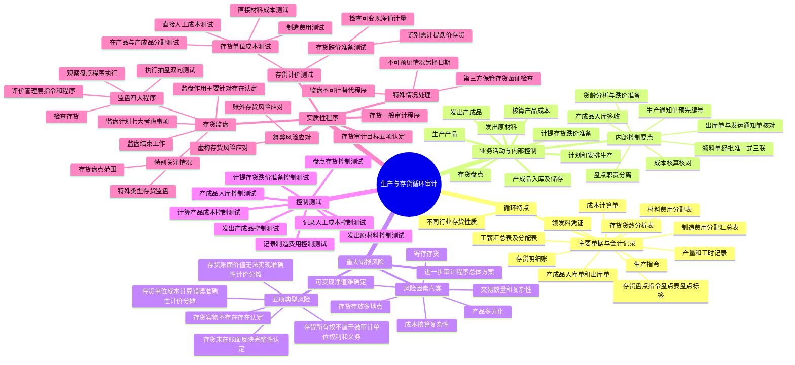

## 1. 章节定位

| 项目 | 信息 |
|------|------|
| 所属科目 | 审计 |
| 难度等级 | 4 |
| 历年分值 | 8-12 分 |
| 建议学时 | 10-12 小时 |
| 知识关联章节 | 第7章 风险评估、第8章 风险应对、第10章 销售与收款循环的审计（产成品出库与收入确认衔接）、第11章 采购与付款循环的审计（原材料入库衔接）、第13章 货币资金的审计、会计科目存货与收入章节 |

## 2. 考情分析

本章是审计科目的核心重难点章节，历年分值约 8-12 分，几乎是每年必考主观题的章节。存货监盘是本章绝对核心考点，常以简答题形式考查监盘程序的设计、特殊情况的处理；也会在综合题中结合存货跌价准备、成本核算等考查实质性程序。

**命题规律**：本章主观题侧重考查存货监盘的程序（评价指令、观察执行、检查存货、执行抽盘）、特殊情况的处理（监盘不可行、不可预见情况、第三方保管存货）、存货计价测试和存货跌价准备测试。客观题集中在存货审计目标与认定的对应、存货监盘计划的考虑因素、特殊类型存货的监盘程序。存货监盘相关程序几乎每年必考。

**高频考点分布**：

1. **生产与存货循环的特点**：不同行业的存货性质、主要单据与会计记录（生产指令、领发料凭证、产量和工时记录、工薪汇总表、材料费用分配表、制造费用分配汇总表、成本计算单、产成品入库单和出库单、存货明细账、存货盘点指令/盘点表/盘点标签、存货货龄分析表）。客观题常考单据的作用。
2. **主要业务活动和相关内部控制**：八项业务活动（计划和安排生产、发出原材料、生产产品、核算产品成本、产成品入库及储存、发出产成品、存货盘点、计提存货跌价准备）及其内部控制设计要点。简答题常要求评价内部控制是否存在缺陷。
3. **重大错报风险**：六类风险因素（交易数量和复杂性、成本核算复杂性、产品多元化、可变现净值难确定、存货存放多地点、寄存存货），五项典型风险（存货实物可能不存在、存货未在账面反映、存货所有权不属于被审计单位、存货单位成本计算错误、存货账面价值无法实现），以及各项风险对应的认定。
4. **存货监盘**：本章最高频考点。包括存货监盘的作用（针对存在认定，对完整性、准确性计价分摊、权利和义务提供部分证据）、监盘计划的考虑因素（七大事项）、监盘程序（评价管理层指令和程序、观察盘点程序执行、检查存货、执行抽盘）、特别关注情况（存货盘点范围、特殊类型存货的监盘程序表）、监盘结束时的工作、盘点日非资产负债表日的处理。
5. **特殊情况的处理**：存货监盘不可行（实施替代程序或发表非无保留意见）、不可预见情况导致无法监盘（另择日期监盘并对间隔期交易实施审计程序）、第三方保管或控制的存货（函证存货存在和状况、实施检查或其他审计程序）。
6. **存货计价测试**：存货单位成本测试（直接材料成本测试、直接人工成本测试、制造费用测试、生产成本在完工产品与在产品之间分配的测试）、存货跌价准备测试（识别需要计提跌价准备的存货项目、检查可变现净值的计量是否合理）。
7. **舞弊风险应对措施**：针对虚构存货的舞弊风险（设计和实施监盘程序、关注金额较大库龄较长的存货、严格实施分析程序、对异地或第三方保管存货实施函证或异地监盘）、针对账外存货的舞弊风险（关注转移资产形成账外存货、存货盘亏报废的内部控制、监盘中关注所有权及完整性、多结转成本多报耗用少报入库）。

**联动考查方式**：
- 与风险评估章节结合：识别存货循环重大错报风险并设计进一步审计程序总体方案；
- 与销售循环结合：产成品出库与收入确认、销售成本结转的衔接、收入截止与存货截止的联动；
- 与采购循环结合：原材料入库与应付账款确认的衔接、存货采购成本的测试；
- 与会计科目结合：存货可变现净值的确定、存货跌价准备的计提方法。

**备考建议**：
- 存货监盘是绝对核心，必须熟记四大程序（评价指令、观察执行、检查存货、执行抽盘）及抽盘的双向测试方法；
- 理解存货监盘主要针对"存在"认定，对其他认定仅提供部分证据，不能取代其他实质性程序；
- 牢记三类特殊情况的处理方法，特别是第三方保管存货的函证程序；
- 掌握特殊类型存货的监盘程序表（木材钢筋、堆积型存货、磅秤测量、散装物品、贵金属艺术品等）；
- 区分存货监盘用作控制测试还是实质性程序的情形；
- 存货计价测试要分清直接材料、直接人工、制造费用、在产品与产成品分配四个测试内容。

## 3. 知识框架

## 4. 核心精讲

### 4.1 生产与存货循环的特点

存货是企业的重要资产，存货的采购、使用和销售与企业的经营活动紧密相关，对企业的财务状况和经营成果具有重大而广泛的影响。注册会计师应当确认在财务报表中列示的存货是否存在（"存在"认定），是否归被审计单位所有（"权利和义务"认定），期末计价是否准确（"准确性、计价和分摊"认定），被审计单位的存货是否均已记录（"完整性"认定）。

原材料的采购入库在采购与付款循环中涉及，产成品的出库销售在销售与收款循环中涉及，本章侧重于原材料入库之后至产成品发出之间的业务活动。

#### 4.1.1 不同行业的存货性质

存货的性质由于被审计单位业务的不同而有很大的差别：

| 行业 | 存货性质 |
|------|------|
| 一般制造业 | 采购的原材料、低值易耗品和配件等、委托加工材料、生产的半成品和产成品 |
| 贸易业 | 从厂商、批发商或其他零售商处采购的商品 |
| 餐饮业 | 用于加工食品的食材、饮料等 |
| 建筑业 | 建筑材料、周转材料、在建项目成本（一般包括建造活动发生的直接材料、直接人工成本和间接费用，以及支付给分包商的建造成本等） |

#### 4.1.2 涉及的主要单据与会计记录

在内部控制比较健全的企业，处理生产和存货业务通常需要使用很多单据与会计记录。典型的生产与存货循环所涉及的主要单据与会计记录有以下几种：

| 单据/记录 | 说明 |
|------|------|
| 生产指令 | 又称"生产任务通知单"或"生产通知单"，是企业下达制造产品等生产任务的书面文件，用以通知供应部门组织材料发放，生产车间组织产品制造，财务部门组织成本计算 |
| 领发料凭证 | 企业为控制材料发出所采用的各种凭证，如材料发出汇总表、领料单、限额领料单、领料登记簿、退料单等 |
| 产量和工时记录 | 登记工人或生产班组在出勤时间内完成产品数量、质量和生产这些产品所耗费工时数量的原始记录，如工作通知单、工序进程单、工作班产量报告、产量通知单、产量明细表、废品通知单等 |
| 工薪汇总表及工薪费用分配表 | 工薪汇总表反映企业全部工薪的结算情况，是工薪费用分配的依据；工薪费用分配表反映各生产车间各产品应负担的生产工人工薪及福利费 |
| 材料费用分配表 | 汇总反映各生产车间各产品所耗费的材料费用的原始记录 |
| 制造费用分配汇总表 | 汇总反映各生产车间各产品所应负担的制造费用的原始记录 |
| 成本计算单 | 归集某一成本计算对象所应承担的生产费用，计算该成本计算对象的总成本和单位成本的记录 |
| 产成品入库单和出库单 | 产成品入库单是产品生产完成并经检验合格后从生产部门转入仓库的凭证；产成品出库单是根据经批准的销售单发出产成品的凭证 |
| 存货明细账 | 反映各种存货增减变动情况和期末库存数量及相关成本信息的会计记录 |
| 存货盘点指令、盘点表及盘点标签 | 存货盘点指令对盘点的时间、人员、流程及后续处理作出安排；盘点表记录盘点结果；盘点标签对已盘点存货及数量作出标识 |
| 存货货龄分析表 | 识别流动较慢或滞销的存货，并根据市场情况和经营预测，确定是否需要计提存货跌价准备 |

### 4.2 生产与存货循环的主要业务活动和相关内部控制

生产与存货循环涉及的主要业务活动包括：计划和安排生产；发出原材料；生产产品；核算产品成本；产成品入库及储存；发出产成品；存货盘点；计提存货跌价准备等。上述业务活动通常涉及以下部门：生产计划部门、仓储部门、生产部门、人事部门、销售部门、财务部门等。

#### 4.2.1 计划和安排生产

生产计划部门的职责是根据客户订购单或者销售部门对销售预测和产品需求的分析来决定生产授权。如决定授权生产，即签发预先顺序编号的生产通知单。该部门通常应将发出的所有生产通知单顺序编号并加以记录控制。此外，通常该部门还需编制一份材料需求报告，列示所需要的材料和零件及其库存。

**内部控制举例**：根据经审批的月度生产计划书，由生产计划经理签发预先按顺序编号的生产通知单。

#### 4.2.2 发出原材料

仓储部门的责任是根据从生产部门收到的领料单发出原材料。领料单上必须列示所需的材料数量和种类，以及领料部门的名称。领料单可以一料一单，也可以多料一单，通常需一式三联。仓库管理人员发料并签署后，将其中一联连同材料交给领料部门（生产部门存根联），一联留在仓库登记材料明细账（仓库联），一联交财务部门进行材料收发核算和成本核算（财务联）。

**内部控制举例**：
- 领料单应当经生产主管批准，仓库管理员凭经批准的领料单发料；领料单一式三联，分别作为生产部门存根联、仓库联和财务联。
- 仓库管理员应把领料单编号、领用数量、规格等信息输入计算机系统，经仓储经理复核并以电子签名方式确认后，系统自动更新材料明细台账。

#### 4.2.3 生产产品

生产部门在收到生产通知单及领取原材料后，便将生产任务分解到每一个生产工人，并将所领取的原材料交给生产工人，据以执行生产任务。生产工人在完成生产任务后，将完成的产品交生产部门统计人员查点，然后转交检验员验收并办理入库手续；或是将所完成的半成品移交下一个环节，作进一步加工。

#### 4.2.4 核算产品成本

为了正确核算并有效控制产品成本，必须建立健全成本会计制度，将生产控制和成本核算有机结合在一起。一方面，生产过程中的各种记录、生产通知单、领料单、计工单、产量统计记录表、生产统计报告、入库单等文件资料都要汇集到财务部门，由财务部门对其进行检查和核对，了解和控制生产过程中存货的实物流转；另一方面，财务部门要设置相应的会计账户，会同有关部门对生产过程中的成本进行核算和控制。

**内部控制举例**：
- 生产成本记账员应根据原材料领料单财务联，编制原材料领用日报表，与计算机系统自动生成的生产记录日报表核对材料耗用和流转信息；由会计主管审核无误后，生成记账凭证并过账至生产成本及原材料明细账和总分类账。
- 每月末，由生产车间与仓库核对原材料和产成品的转出和转入记录，如有差异，仓库管理员应编制差异分析报告，经仓储经理和生产经理签字确认后交财务部门进行调整。
- 每月末，由计算机系统对生产成本中各项组成部分进行归集，按照预设的分摊公式和方法，自动将当月发生的生产成本在完工产品和在产品之间按比例分配；同时，将完工产品成本在各不同产品类别之间分配，由此生成产品成本计算表和生产成本分配表；由生产成本记账员编制成生产成本结转凭证，经会计主管审核批准后进行账务处理。

#### 4.2.5 产成品入库及储存

产成品入库，须由仓储部门先行点验和检查，然后签收。签收后，将实际入库数量通知财务部门。据此，仓储部门确立了本身应承担的保管责任，并对验收部门的工作进行验证。除此之外，仓储部门还应根据产成品的品质特征分类存放，并填制标签。

**内部控制举例**：
- 产成品入库时，质量检验员应检查并签发预先按顺序编号的产成品验收单，由生产小组将产成品送交仓库，仓库管理员应检查产成品验收单，并清点产成品数量，填写预先顺序编号的产成品入库单，经质检经理、生产经理和仓储经理签字确认后，由仓库管理员将产成品入库单信息输入计算机系统，计算机系统自动更新产成品明细台账。
- 存货存放在安全的环境（如上锁、使用监控设备）中，只有经过授权的工作人员可以接触及处理存货。

#### 4.2.6 发出产成品

产成品的发出须由独立的发运部门进行。装运产成品时必须持有经有关部门核准的发运通知单，并据此编制出库单。出库单一般为一式四联，一联由仓储部门留存；一联交发运部门；一联送交客户；一联作为开具发票的依据。

**内部控制举例**：
- 产成品出库时，由仓库管理员填写预先顺序编号的出库单，并将产成品出库单信息输入计算机系统，经仓储经理复核并以电子签名方式确认后，计算机系统自动更新产成品明细台账并与发运通知单编号核对。
- 产成品装运发出前，由运输经理独立检查出库单、销售订购单和发运通知单，确定从仓库提取的商品附有经批准的销售订购单，并且，所提取商品的内容与销售订购单一致。
- 每月末，生产成本记账员根据计算机系统内状态为"已处理"的订购单数量，编制销售成本结转凭证，结转相应的销售成本，经会计主管审核批准后进行账务处理。

#### 4.2.7 存货盘点

管理人员编制盘点指令，安排适当人员对存货实物（包括原材料、在产品和产成品等所有存货类别）进行定期盘点，将盘点结果与存货账面数量进行核对，调查差异并进行适当调整。

**内部控制举例**：
- 生产部门和仓储部门在盘点日前对所有存货进行清理和归整，便于盘点顺利进行。
- 每一组盘点人员中应包括仓储部门以外的其他部门人员，即不能由负责保管存货的人员单独负责盘点存货；安排不同的工作人员分别负责初盘和复盘。
- 盘点表和盘点标签事先连续编号，发放给盘点人员时登记领用人员；盘点结束后回收并清点所有已使用和未使用的盘点表和盘点标签。
- 为防止存货被遗漏或重复盘点，所有盘点过的存货贴盘点标签，注明存货品名、数量和盘点人员，完成盘点前检查现场确认所有存货均已贴上盘点标签。
- 将不属于本单位的代其他方保管的存货单独堆放并作标识；将盘点期间需要领用的原材料或出库的产成品分开堆放并作标识。
- 汇总盘点结果，与存货账面数量进行比较，调查分析差异原因，并对认定的盘盈和盘亏提出账务调整建议，经仓储经理、生产经理、财务经理和总经理复核批准后入账。

#### 4.2.8 计提存货跌价准备

财务部门根据存货货龄分析表信息或相关部门提供的有关存货状况的其他信息，结合存货盘点过程中对存货状况的检查结果，对出现损毁、滞销、跌价等降低存货价值的情况进行分析计算，计提存货跌价准备。

**内部控制举例**：
- 定期编制存货货龄分析表，管理人员复核该分析表，确定是否有必要对滞销存货计提存货跌价准备，并计算存货可变现净值，据此计提存货跌价准备。
- 生产部门和仓储部门每月上报残冷背次存货明细，采购部门和销售部门每月上报原材料和产成品最新价格信息，财务部门据此分析存货跌价风险并计提跌价准备，由财务经理和总经理复核批准并入账。

### 4.3 生产与存货循环的重大错报风险

#### 4.3.1 影响生产与存货循环的风险因素

以一般制造类企业为例，影响生产与存货循环交易和余额的风险因素可能包括：

1. **交易的数量和复杂性**。制造类企业交易的数量庞大，业务复杂，这就增加了错误和舞弊的风险。
2. **成本核算的复杂性**。制造类企业的成本核算比较复杂。虽然原材料和直接人工等直接成本的归集和分配比较简单，但间接费用的分配可能较为复杂，并且，同一行业中的不同企业也可能采用不同的认定和计量基础。
3. **产品的多元化**。这可能要求聘请专家来验证其质量、状况或价值。另外，计算库存存货数量的方法也可能是不同的。例如，计量煤堆、筒仓里的谷物或糖、黄金或贵重宝石、化工品和药剂产品的存储量的方法都可能不一样。
4. **某些存货项目的可变现净值难以确定**。例如，价格受全球经济供求关系影响的存货，由于其可变现净值难以确定，会影响存货采购价格和销售价格的确定，并将影响注册会计师对与存货"准确性、计价和分摊"认定有关的风险进行的评估。
5. **将存货存放在很多地点**。大型企业可能将存货存放在很多地点，并且可以在不同的地点之间转移存货，这将增加商品途中毁损或遗失的风险，或者导致存货在两个地点被重复记录，也可能产生转移定价的错误或舞弊。
6. **寄存的存货**。有时候存货虽然还存放在企业，但可能已经不归企业所有。反之，企业的存货也可能被寄存在其他企业。

由于存货与企业各项经营活动的紧密联系，存货的重大错报风险往往与财务报表其他项目的重大错报风险紧密相关。例如，收入确认的错报风险往往与存货的错报风险共存；采购交易的错报风险与存货的错报风险共存，存货成本核算的错报风险与营业成本的错报风险共存等。

#### 4.3.2 生产与存货循环存在的重大错报风险

一般制造型企业的存货的重大错报风险通常包括：

| 重大错报风险 | 对应认定 |
|------|------|
| 存货实物可能不存在 | 存在 |
| 属于被审计单位的存货可能未在账面反映 | 完整性 |
| 存货的所有权可能不属于被审计单位 | 权利和义务 |
| 存货的单位成本可能存在计算错误 | 准确性、计价和分摊 |
| 存货的账面价值可能无法实现，即存货跌价准备的计提可能不充分 | 准确性、计价和分摊 |

此外，实务中，被审计单位管理层通过虚构存货，以及转移资产形成账外存货等方式实施舞弊的案例也屡见不鲜。注册会计师在实施风险评估程序时，也应考虑相关舞弊风险因素，识别和评估被审计单位是否存在与存货相关的舞弊风险。

#### 4.3.3 根据重大错报风险评估结果设计进一步审计程序

注册会计师基于生产与存货循环的重大错报风险评估结果，制定实施进一步审计程序的总体方案（包括综合性方案和实质性方案），继而实施控制测试和实质性程序，以应对识别出的认定层次的重大错报风险。

| 重大错报风险 | 受影响的财务报表项目及认定 | 固有风险等级 | 控制风险等级 | 总体方案 | 拟从控制测试获取的保证程度 | 拟从实质性程序获取的保证程度 |
|------|------|------|------|------|------|------|
| 存货实物可能不存在 | 存货：存在 | 最高 | 中 | 综合性方案 | 中 | 高 |
| 存货的单位成本可能存在计算错误 | 存货：准确性、计价和分摊；营业成本：准确性 | 中 | 低 | 综合性方案 | 高 | 低 |
| 已销售产品的成本可能没有准确结转至营业成本 | 存货：准确性、计价和分摊；营业成本：准确性 | 低 | 低 | 综合性方案 | 中 | 低 |
| 存货的账面价值可能无法实现 | 存货：准确性、计价和分摊 | 高 | 最高 | 实质性方案 | 无 | 高 |

注册会计师根据重大错报风险的评估结果初步确定实施进一步审计程序的具体审计计划。因为风险评估和审计计划都是贯穿审计全过程的动态的活动，而且控制测试的结果可能导致注册会计师改变对内部控制的信赖程度，因此，具体审计计划并非一成不变，可能需要在审计过程中进行调整。

无论是采用综合性方案还是实质性方案，获取的审计证据都应当能够从认定层次应对所识别的重大错报风险，直至针对该风险所涉及的全部相关认定均已获取了足够的保证程度。

### 4.4 生产与存货循环的控制测试

总体上看，生产与存货循环的内部控制主要包括存货数量的内部控制和存货单价的内部控制两方面。由于生产与存货循环与其他业务循环的紧密联系，生产与存货循环中某些审计程序，特别是对存货余额的审计程序，与其他相关业务循环的审计程序同时进行将更为有效。例如，原材料的采购和记录是作为采购与付款循环的一部分进行测试的，人工成本（包括直接人工成本和制造费用中的人工费用）是作为工薪循环的一部分进行测试的。因此，在对生产与存货循环的内部控制实施测试时，要考虑其他业务循环的控制测试是否与本循环相关，避免重复测试。

#### 4.4.1 以风险为起点的控制测试

以一般制造业为例，注册会计师对生产与存货循环实施的以风险为起点的控制测试如下表：

| 可发生错报的环节 | 受影响的财务报表项目及认定 | 存在的内部控制 | 相关的控制测试程序 |
|------|------|------|------|
| 发出原材料 | 存货：准确性、计价和分摊；营业成本：准确性 | 系统须输入对应的生产任务单编号和所生产的产品代码，每月末系统自动归集生成材料成本明细表 | 检查生产主管核对材料成本明细表的记录，并询问其核对过程及结果 |
| 记录人工成本 | 存货：准确性、计价和分摊；营业成本：准确性 | 所有员工有专属员工代码和部门代码，员工的考勤记录记入相应员工代码 | 检查系统中员工的部门代码设置是否与其实际职责相符。询问并检查财务经理复核工资费用分配表的过程和记录 |
| 记录制造费用 | 存货：准确性、计价和分摊/完整性；营业成本：准确性/完整性 | 系统根据输入的成本和费用代码自动识别制造费用并进行归集 | 检查系统的自动归集设置是否符合有关成本和费用的性质，是否合理。询问并检查成本会计复核制造费用明细表的过程和记录，检查财务经理对调整制造费用的分录的批准记录 |
| 计算产品成本 | 存货：准确性、计价和分摊；营业成本：准确性 | 成本会计执行产品成本核算日常成本核算，财务经理每月末审核产品成本计算表及相关资料，并调查异常项目 | 询问财务经理如何执行复核及调查。选取产品成本计算表及相关资料，检查财务经理的复核记录 |
| 产成品入库 | 存货：准确性、计价和分摊 | 系统根据当月输入的产成品入库单和出库单信息自动生成产成品收发存报表 | 询问和检查成本会计将产成品收发存报表与成本计算表进行核对的过程和记录 |
| 发出产成品 | 存货：准确性、计价和分摊；营业成本：准确性 | 系统根据确认的营业收入所对应的售出产品自动结转营业成本 | 检查系统设置的自动结转功能是否正常运行，成本结转方式是否符合公司成本核算政策。询问和检查财务经理和总经理进行毛利率分析的过程和记录，并对异常波动的调查和处理结果进行核实 |
| 盘点存货 | 存货：存在 | 仓库保管员每月末盘点存货并与仓库台账核对并调节一致；成本会计监督其盘点与核对，并抽查部分存货进行复盘。每年末盘点所有存货，根据盘点结果分析盘盈盘亏并进行账面调整 | 存货监盘 |
| 计提存货跌价准备 | 存货：准确性、计价和分摊；资产减值损失：完整性 | 系统根据存货入库日期自动统计货龄，每月末生成存货货龄分析表 | 询问财务经理识别减值风险并确定减值准备的过程，检查总经理的复核批准记录 |

**重要说明**：在上述控制测试中，如果人工控制在执行时依赖于信息技术系统生成的报告，注册会计师还应当针对系统生成报告的可靠性实施测试。例如与计提存货跌价准备相关的管理层控制中使用了系统生成的存货货龄分析表，其准确性影响管理层控制的有效性，因此，注册会计师需要同时测试存货货龄分析表的准确性。

有些被审计单位采用信息技术系统执行全程自动化成本核算。在这种情况下，注册会计师通常需要对信息技术系统中的成本核算流程和参数设置进行了解和测试（可能需要利用信息技术专家的工作），并测试相关信息技术一般控制的运行有效性。

### 4.5 生产与存货循环的实质性程序

在完成控制测试之后，注册会计师基于控制测试的结果（即控制运行是否有效），确定从控制测试中已获得的审计证据及其保证程度，确定是否需要对具体审计计划中设计的实质性程序的性质、时间安排和范围作出适当调整。例如，如果控制测试的结果表明内部控制未能有效运行，注册会计师需要从实质性程序中获取更多的相关审计证据，注册会计师可以修改实质性程序的性质，如采用细节测试而非实质性分析程序、获取更多的外部证据等，或修改实质性审计程序的范围，如扩大样本规模。

#### 4.5.1 存货的审计目标

存货审计，尤其是对年末存货余额的测试，通常是审计中最复杂也最费时的部分。导致存货审计复杂的主要原因包括：

1. 存货通常是资产负债表中的一个主要项目，而且通常是构成营运资本的最大项目。
2. 存货存放于不同的地点，这使得对它的实物控制和盘点都很困难。
3. 存货项目的多样性也给审计带来了困难。例如，化学制品、宝石、电子元件以及其他的高科技产品。
4. 存货本身的状况以及存货成本的分配也使得存货的估价存在困难。
5. 不同企业采用的存货计价方法存在多样性。

存货的审计目标一般包括：

| 审计目标 | 对应认定 |
|------|------|
| 账面存货余额对应的实物是否真实存在 | 存在 |
| 属于被审计单位的存货是否均已入账 | 完整性 |
| 存货是否属于被审计单位 | 权利和义务 |
| 存货单位成本的计量是否准确 | 准确性、计价和分摊 |
| 存货的账面价值是否可以实现 | 准确性、计价和分摊 |

存货审计涉及数量和单价两个方面。针对存货数量的实质性程序主要是存货监盘。此外，还包括对第三方保管的存货实施函证等程序，对在途存货检查相关凭证和期后入库记录等。针对存货单价的实质性程序包括对购买和生产成本的审计程序和对存货可变现净值的审计程序。

审计存货的另一个考虑就是其与采购、销售收入及销售成本间的相互关系，因为就存货认定取得的证据也同时为其对应项目的认定提供了证据。例如，通过存货监盘和对已收存货的截止测试取得的，与外购商品或原材料存货的"完整性"和"存在"认定相关的证据，自动为同一期间原材料和商品采购的完整性和发生提供了保证。类似地，销售收入的截止测试也为期末之前的销售成本已经从期末存货中扣除并正确计入销售成本提供了证据。

#### 4.5.2 存货的一般审计程序

获取年末存货余额明细表，并执行以下工作：
1. 复核单项存货金额的计算（单位成本×数量）和明细表的加总计算是否准确。
2. 将本年末存货余额与上年末存货余额进行比较，总体分析变动原因。

#### 4.5.3 存货监盘

**（1）存货监盘的作用**

如果存货对财务报表是重要的，注册会计师应当实施下列审计程序，对存货的存在和状况获取充分、适当的审计证据：
1. 在存货盘点现场实施监盘（除非不可行）；
2. 对期末存货记录实施审计程序，以确定其是否准确反映实际的存货盘点结果。

在存货盘点现场实施监盘时，注册会计师应当实施下列审计程序：
1. 评价管理层用以记录和控制存货盘点结果的指令和程序；
2. 观察管理层制定的盘点程序的执行情况；
3. 检查存货；
4. 执行抽盘。

存货监盘的相关程序可以用作控制测试或者实质性程序。注册会计师可以根据风险评估结果、审计方案和实施的特定程序作出判断。例如，如果只有少数项目构成了存货的主要部分，注册会计师可能选择将存货监盘用作实质性程序。

**重要原则**：存货监盘针对的主要是存货的"存在"认定，对存货的"完整性"认定及"准确性、计价和分摊"认定，也能提供部分审计证据。此外，注册会计师还可能在存货监盘中获取有关存货所有权的部分审计证据。但存货监盘本身并不足以供注册会计师确定存货的所有权，注册会计师可能需要实施其他实质性审计程序以应对"权利和义务"认定的相关风险。

**（2）存货监盘计划**

制定存货监盘计划应考虑的相关事项：

| 考虑事项 | 具体内容 |
|------|------|
| 与存货相关的重大错报风险 | 存货的数量和种类、成本归集的难易程度、陈旧过时的速度或易损坏程度、遭受失窃的难易程度。以下类别的存货可能增加审计的复杂性与风险：具有漫长制造过程的存货、具有固定价格合约的存货、与时装相关的服装行业存货、鲜活易腐商品存货、具有高科技含量的存货、单位价值高昂容易被盗窃的存货 |
| 与存货相关的内部控制的性质 | 涉及供、产、销各个环节，包括采购（购货订购单预先编号）、验收（验收报告单）、仓储（实物控制措施）、领用（存货领用单）、加工（生产报告）、装运出库（发运凭证预先编号）、实地盘点（盘点计划、独立验证、调节永续记录）等方面 |
| 对存货盘点是否制定了适当的程序，并下达了正确的指令 | 考虑盘点的：时间安排、盘点范围和场所、人员分工及胜任能力、盘点前会议及任务布置、存货整理排列、毁损陈旧过时残次及所有权不属于被审计单位存货的区分、计量工具和方法、在产品完工程度确定方法、存放在外单位的存货盘点安排、存货收发截止控制、盘点期间存货移动控制、盘点表单设计使用与控制、盘点结果汇总及盘盈盘亏分析调查处理 |
| 存货盘点的时间安排 | 如果存货盘点在财务报表日以外的其他日期进行，注册会计师除实施存货监盘相关审计程序外，还应当实施其他审计程序，确定存货盘点日与财务报表日之间的存货变动是否已得到恰当的记录 |
| 被审计单位是否一贯采用永续盘存制 | 如果采用实地盘存制确定存货数量，注册会计师要参加此种盘点；如果采用永续盘存制，注册会计师应在年度中一次或多次参加盘点 |
| 存货的存放地点 | 要求被审计单位提供完整的存货存放地点清单（包括期末库存量为零的仓库、租赁的仓库、第三方代保管仓库），考虑其完整性。可实施的程序：询问非财务人员、比较不同时期清单、检查出入库单、检查费用支出明细账和租赁合同、检查固定资产房屋建筑物明细 |
| 是否需要专家协助 | 在确定资产数量或实物状况（如矿石堆），或收集特殊类别存货（如艺术品、稀有玉石、房地产、电子器件、工程设计等）的审计证据时，可考虑利用专家工作。在产品完工程度评估也可利用专家 |

存货监盘计划的主要内容包括：存货监盘的目标、范围及时间安排；存货监盘的要点及关注事项；参加存货监盘人员的分工；抽盘存货的范围。

**（3）存货监盘程序**

在存货盘点现场实施监盘时，注册会计师应当实施下列审计程序：

**程序一：评价管理层用以记录和控制存货盘点结果的指令和程序。** 注册会计师需要考虑这些指令和程序是否包括：
- 适当控制活动的运用（如收集已使用的存货盘点记录，清点未使用的存货盘点表单，实施盘点和复盘程序）；
- 准确认定在产品的完工程度（如流动缓慢、过时或毁损的存货项目，以及第三方拥有的存货）；
- 在适用的情况下用于估计存货数量的方法（如估计煤堆的重量）；
- 对存货在不同存放地点之间的移动以及截止日前后出入库的控制。

一般而言，被审计单位在盘点过程中停止生产并关闭存货存放地点以确保停止存货的移动，有利于保证盘点的准确性。但特定情况下，被审计单位可能由于实际原因无法停止生产或收发货物。这种情况下，注册会计师可以通过询问管理层以及阅读被审计单位的盘点计划等方式，了解被审计单位对存货移动所采取的控制程序。例如，可以考虑在仓库内划分出独立的过渡区域，将预计在盘点期间领用的存货移至过渡区域、对盘点期间办理入库手续的存货暂时存放在过渡区域，以此确保相关存货只被盘点一次。

**程序二：观察管理层制定的盘点程序（如对盘点时及其前后的存货移动的控制程序）的执行情况。** 这有助于注册会计师获取有关管理层指令和程序是否得到适当设计和执行的审计证据。

注册会计师可以获取有关截止性信息（如存货移动的具体情况）的复印件，有助于日后对存货移动的会计处理实施审计程序。注册会计师一般应当获取盘点日前后存货收发及移动的凭证，检查库存记录与会计记录期末截止是否正确。注册会计师需要关注：所有在盘点日以前入库的存货项目是否均已包括在盘点范围内；所有已确认为销售但尚未装运出库的商品是否均未包括在盘点范围内；在途存货和被审计单位直接向顾客发运的存货是否均已得到了适当的会计处理。

**程序三：检查存货。** 在存货监盘过程中检查存货，虽然不一定能确定存货的所有权，但有助于确定存货的存在，以及识别过时、毁损或陈旧的存货。注册会计师应当把所有过时、毁损或陈旧存货的详细情况记录下来，这既便于进一步追查这些存货的处置情况，也能为测试被审计单位存货跌价准备计提的准确性提供证据。

**程序四：执行抽盘。** 在对存货盘点结果进行测试时，注册会计师应当实施**双向抽盘**：
- 从存货盘点记录中选取项目**追查至存货实物**（测试盘点记录的"存在"认定，即准确性）；
- 从存货实物中选取项目**追查至盘点记录**（测试盘点记录的"完整性"认定）。

需要说明的是，注册会计师应尽可能避免让被审计单位事先了解将抽盘的存货项目。

**抽盘差异的处理**：注册会计师在实施抽盘程序时发现差异，很可能表明被审计单位的存货盘点在准确性或完整性方面存在错误。由于检查的内容通常仅仅是已盘点存货中的一部分，所以在检查中发现错误很可能意味着被审计单位的存货盘点还存在着其他错误。一方面，注册会计师应当查明原因，并及时提请被审计单位更正；另一方面，注册会计师应当考虑错误的潜在范围和重大程度，在可能的情况下，扩大检查范围以减少错误的发生。注册会计师还可要求被审计单位重新盘点。重新盘点的范围可限于某一特殊领域的存货或特定盘点小组。

**（4）需要特别关注的情况**

**情况一：存货盘点范围。** 在被审计单位盘点存货前，注册会计师应当观察盘点现场，确定应纳入盘点范围的存货是否已经适当整理和排列，并附有盘点标识，防止遗漏或重复盘点。对未纳入盘点范围的存货，注册会计师应当查明未纳入的原因。

对所有权不属于被审计单位的存货，注册会计师应当取得其规格、数量等有关资料，确定是否已单独存放、标明，且未被纳入盘点范围。即使在被审计单位声明不存在受托代存存货的情形下，注册会计师在存货监盘时也应当关注是否存在某些存货不属于被审计单位的迹象。

**情况二：对特殊类型存货的监盘。** 对某些特殊类型的存货而言，被审计单位通常使用的盘点方法和控制程序并不完全适用。注册会计师需要运用职业判断，根据存货的实际情况，设计恰当的审计程序。下表列举了特殊存货的类型、通常采用的盘点方法与存在的潜在问题，以及可供注册会计师实施的监盘程序：

| 存货类型 | 通常采用的盘点方法与潜在问题 | 可供实施的监盘程序 |
|------|------|------|
| 木材、钢筋盘条、管子 | 通常无标签，但盘点时会做标记或用粉笔标识。难以确定存货的数量或等级 | 检查标记或标识。利用专家或被审计单位内部有经验人员的工作 |
| 堆积型存货（如糖、煤、钢废料） | 通常既无标签也不做标记。在估计存货数量时存在困难 | 运用工程估测、几何计算、高空勘测，并依赖详细的存货记录 |
| 使用磅秤测量的存货 | 在估计存货数量时存在困难 | 在监盘前和监盘过程中均应检验磅秤的精准度，并留意磅秤的位置移动与重新调校程序。将检查和重新称量程序相结合。检查称量尺度的换算问题 |
| 散装物品（如使用桶、箱、罐、槽等容器储存的液体、气体、谷类粮食、流体存货等） | 在盘点时通常难以识别和确定。在估计存货数量时存在困难。在确定存货质量时存在困难 | 使用容器进行监盘或通过预先编号的清单列表加以确定。使用测浸、测量棒、工程报告以及依赖永续存货记录。选择样品进行化验与分析，或利用专家的工作 |
| 贵金属、石器、艺术品与藏品 | 在存货辨认与质量确定方面存在困难 | 选择样品进行化验与分析，或利用专家的工作 |
| 生产纸浆用木材、牲畜 | 在存货辨认与数量确定方面存在困难。可能无法对此类存货的移动实施控制 | 通过高空摄影以确定其存在，对不同时点的数量进行比较，并依赖永续存货记录 |

**（5）存货监盘结束时的工作**

在被审计单位存货盘点结束前，注册会计师应当：
1. 再次观察盘点现场，以确定所有应纳入盘点范围的存货是否均已盘点。
2. 取得并检查已填用、作废及未使用盘点表单的号码记录，确定其是否连续编号，查明已发放的表单是否均已收回，并与存货盘点的汇总记录进行核对。注册会计师应当根据自己在存货监盘过程中获取的信息对被审计单位最终的存货盘点结果汇总记录进行复核，并评估其是否正确地反映了实际盘点结果。

**盘点日不是资产负债表日的处理**：如果存货盘点日不是资产负债表日，注册会计师应当实施适当的审计程序，确定盘点日与资产负债表日之间存货的变动是否已得到恰当的记录。在实质性程序方面，可以实施的程序示例包括：
- 比较盘点日和财务报表日之间的存货信息以识别异常项目，并对其实施适当的审计程序（例如实地查看等）；
- 对存货周转率或存货销售周转天数等实施实质性分析程序；
- 对盘点日至财务报表日之间的存货采购和存货销售分别实施双向检查；
- 测试存货销售和采购在盘点日和财务报表日的截止是否正确。

#### 4.5.4 特殊情况的处理

**（1）在存货盘点现场实施存货监盘不可行**

在某些情况下，实施存货监盘可能是不可行的。这可能是由存货性质和存放地点等因素造成的，例如，存货存放在对注册会计师的安全有威胁的地点。然而，对注册会计师带来不便的一般因素不足以支持注册会计师作出实施存货监盘不可行的决定。审计中的困难、时间或成本等事项本身，不能作为注册会计师省略不可替代的审计程序或满足于说服力不足的审计证据的正当理由。

如果在存货盘点现场实施存货监盘不可行，注册会计师应当实施替代审计程序（如检查盘点日后出售盘点日之前取得或购买的特定存货的文件记录），以获取有关存货的存在和状况的充分、适当的审计证据。

但在其他一些情况下，如果不能实施替代审计程序，或者实施替代审计程序可能无法获取有关存货的存在和状况的充分、适当的审计证据，注册会计师需要按照《中国注册会计师审计准则第1502号——在审计报告中发表非无保留意见》的规定发表非无保留意见。

**（2）因不可预见的情况导致无法在存货盘点现场实施监盘**

两种比较典型的情况包括：一是注册会计师无法亲临现场，即由于不可抗力导致其无法到达存货存放地实施存货监盘；二是气候因素，即由于恶劣的天气导致注册会计师无法实施存货监盘程序，或由于恶劣的天气无法观察存货，如木材被积雪覆盖。

如果由于不可预见的情况无法在存货盘点现场实施监盘，注册会计师应当另择日期实施监盘，并对间隔期内发生的交易实施审计程序。

**（3）由第三方保管或控制的存货**

如果由第三方保管或控制的存货对财务报表是重要的，注册会计师应当实施下列一项或两项审计程序，以获取有关该存货存在和状况的充分、适当的审计证据：

1. **向持有被审计单位存货的第三方函证存货的存在和状况。**
2. **实施检查或其他适合具体情况的审计程序。** 根据具体情况（如获取的信息使注册会计师对第三方的诚信和客观性产生疑虑），注册会计师可能认为实施其他审计程序是适当的。其他审计程序可以作为函证的替代程序，也可以作为追加的审计程序。

其他审计程序的示例包括：
- 实施或安排其他注册会计师实施对第三方的存货监盘（如可行）；
- 获取其他注册会计师或服务机构注册会计师针对用以保证存货得到恰当盘点和保管的内部控制的适当性而出具的报告；
- 检查与第三方持有的存货相关的文件记录，如仓储单；
- 当存货被作为抵押品时，要求其他机构或人员进行确认。

考虑到第三方仅在特定时点执行存货盘点工作，在实务中，注册会计师可以事先考虑实施函证的可行性。如果预期不能通过函证获取相关审计证据，可以事先计划和安排存货监盘等工作。此外，注册会计师可以考虑由第三方保管存货的商业理由的合理性，以进行存货相关风险（包括舞弊风险）的评估。

#### 4.5.5 存货计价测试

存货监盘程序主要是对存货的数量进行测试。为验证财务报表上存货余额的真实性，还应当对存货的计价进行审计。存货计价测试包括两个方面：一是被审计单位所使用的存货单位成本是否正确；二是是否恰当计提了存货跌价准备。

在对存货的计价实施细节测试之前，注册会计师通常先要了解被审计单位本年度的存货计价方法与以前年度是否保持一致。如发生变化，变化的理由是否合理，是否经过适当的审批。

**（1）存货单位成本测试**

针对原材料的单位成本，注册会计师通常基于企业的原材料计价方法（如先进先出法、加权平均法等），结合原材料的历史购买成本，测试其账面成本是否准确，测试程序包括核对原材料采购的相关凭证（主要是与价格相关的凭证，如合同、采购订单、发票等）以及验证原材料计价方法的运用是否正确。

针对产成品和在产品的单位成本，注册会计师需要对成本核算过程实施测试，包括四项内容：

**① 直接材料成本测试：**

| 计价方法 | 测试程序 |
|------|------|
| 定额单耗法 | 获取样本的生产指令或产量统计记录及直接材料单位消耗定额，根据材料明细账或采购业务测试工作底稿中各该直接材料的单位实际成本，计算直接材料的总消耗量和总成本，与该样本成本计算单中的直接材料成本核对 |
| 非定额单耗法 | 获取材料费用分配汇总表、材料发出汇总表（或领料单）、材料明细账中各该直接材料的单位成本，检查成本计算单中直接材料成本与材料费用分配汇总表中该产品负担的直接材料费用是否相符，分配标准是否合理 |
| 标准成本法 | 根据生产量、直接材料单位标准用量和标准单价计算的标准成本与成本计算单中的直接材料成本核对是否相符；直接材料成本差异的计算与账务处理是否正确；直接材料的标准成本在当年内有无重大变更 |

**② 直接人工成本测试：**

| 计价方法 | 测试程序 |
|------|------|
| 计时工资制 | 获取样本的实际工时统计记录、员工分类表和员工工薪手册（工资率）及人工费用分配汇总表，检查成本计算单中直接人工成本与人工费用分配汇总表中该样本的直接人工费用核对是否相符；样本的实际工时统计记录与人工费用分配汇总表中该样本的实际工时核对是否相符 |
| 计件工资制 | 获取样本的产量统计报告、个人（小组）产量记录和经批准的单位工薪标准或计件工资制度，根据样本的统计产量和单位工薪标准计算的人工费用与成本计算单中直接人工成本核对是否相符 |
| 标准成本法 | 根据产量和单位标准工时计算的标准工时总量与标准工时工资率之积同成本计算单中直接人工成本核对是否相符；直接人工成本差异的计算与账务处理是否正确；直接人工的标准成本在当年内有无重大变更 |

**③ 制造费用测试：** 获取样本的制造费用分配汇总表、按项目分列的制造费用明细账、与制造费用分配标准有关的统计报告及其相关原始记录，检查：制造费用分配汇总表中样本分担的制造费用与成本计算单中的制造费用核对是否相符；制造费用分配汇总表中的合计数与样本所属成本报告期的制造费用明细账总计数核对是否相符；制造费用分配汇总表选择的分配标准（机器工时数、直接人工工资、直接人工工时数、产量等）与相关的统计报告或原始记录核对是否相符，并对费用分配标准的合理性作出评估；如果企业采用预计费用分配率分配制造费用，则应针对制造费用分配过多或过少的差额，检查其是否作了适当的账务处理；如果企业采用标准成本法，则应检查样本中标准制造费用的确定是否合理，制造费用差异的计算与账务处理是否正确。

**④ 生产成本在当期完工产品与在产品之间分配的测试：** 检查成本计算单中在产品数量与生产统计报告或在产品盘存表中的数量是否一致；检查在产品约当产量计算或其他分配标准是否合理；计算复核样本的总成本和单位成本。

**（2）存货跌价准备的测试**

注册会计师在测试存货跌价准备时，需要从以下两个方面进行测试：

**① 识别需要计提存货跌价准备的存货项目。** 注册会计师可以通过询问管理层和相关部门（生产、仓储、财务、销售等）员工，了解被审计单位如何收集有关滞销、过时、陈旧、毁损、残次存货的信息并为之计提必要的存货跌价准备。如被审计单位编制存货货龄分析表，则可以通过审阅分析表识别滞销或陈旧的存货。此外，注册会计师还要结合存货监盘过程中检查存货状况而获取的信息，以判断被审计单位的存货跌价准备计算表是否有遗漏。

**② 检查可变现净值的计量是否合理。** 在存货计价审计中，由于被审计单位对期末存货采用成本与可变现净值孰低的方法计价，所以注册会计师应充分关注其对存货可变现净值的确定及存货跌价准备的计提。

可变现净值是指企业在日常活动中，存货的估计售价减去至完工时估计将要发生的成本、估计的销售费用以及相关税费后的金额。企业确定存货的可变现净值，应当以取得的确凿证据为基础，并且考虑持有存货的目的以及资产负债表日后事项的影响等因素。注册会计师应抽样检查可变现净值确定的依据，相关计算是否正确。

#### 4.5.6 针对与存货相关的舞弊风险采取的应对措施

存货领域属于财务舞弊的易发高发领域。如果识别出与存货相关的舞弊风险，注册会计师可以特别关注或考虑实施以下程序：

**（1）针对虚构存货相关舞弊风险：**
- 根据存货的特点、盘存制度和存货内部控制，设计和实施存货监盘程序；
- 关注是否存在金额较大且占比较高、库龄较长、周转率低于同行业可比公司等情形的存货，分析评价其合理性；
- 严格实施分析程序，检查存货结构波动情况，分析其与收入结构变动的匹配性，评价产成品存货与收入、成本之间变动的匹配性；
- 对异地存放或由第三方保管或控制的存货，严格实施函证或异地监盘等程序。

**（2）针对账外存货相关舞弊风险：**
- 在其他资产审计中，关注是否有转移资产形成账外存货的情况；
- 关注存货盘亏、报废的内部控制程序，关注是否有异常大额存货盘亏、报废的情况；
- 存货监盘中，关注存货的所有权及完整性；
- 关注是否存在通过多结转成本、多报耗用数量、少报产成品入库等方式，形成账外存货。

## 5. 典型例题

**【例题 1】（存货监盘程序 — 抽盘双向测试）**

注册会计师在对甲公司 2×24 年度财务报表进行审计时，对存货实施监盘程序。在执行抽盘时，注册会计师仅从存货盘点记录中选取项目追查至存货实物，以验证盘点记录的准确性。

要求：指出注册会计师在抽盘程序中存在的问题，并说明正确的做法。

**答案**：

存在的问题：注册会计师仅从存货盘点记录追查至存货实物（即"从账到实"），只能验证盘点记录的"存在"认定（准确性），无法发现未纳入盘点记录的存货（完整性认定）。

正确做法：注册会计师应当实施**双向抽盘**：
- 从存货盘点记录中选取项目追查至存货实物——测试盘点记录的准确性（存在认定）；
- 从存货实物中选取项目追查至盘点记录——测试盘点记录的完整性。

此外，注册会计师应尽可能避免让被审计单位事先了解将抽盘的存货项目。如果在抽盘中发现差异，应当查明原因并及时提请被审计单位更正，同时考虑错误的潜在范围和重大程度，扩大检查范围，必要时要求被审计单位重新盘点。

**解析**：双向抽盘是存货监盘的核心程序，"从账到实"验证存在认定，"从实到账"验证完整性认定。仅实施一个方向的抽盘会导致另一个方向的认定无法获得审计证据。

**【例题 2】（存货监盘 — 盘点日非资产负债表日）**

乙公司的存货盘点日为 2×24 年 11 月 30 日，而资产负债表日为 2×24 年 12 月 31 日。注册会计师在 11 月 30 日实施了存货监盘。

要求：说明注册会计师除实施存货监盘相关审计程序外，还应实施哪些审计程序，以确定盘点日与资产负债表日之间存货的变动是否已得到恰当记录。

**答案**：

注册会计师还应实施以下审计程序：

1. 比较盘点日（11 月 30 日）和财务报表日（12 月 31 日）之间的存货信息，以识别异常项目，并对其实施适当的审计程序（例如实地查看等）。
2. 对存货周转率或存货销售周转天数等实施实质性分析程序。
3. 对盘点日至财务报表日之间的存货采购和存货销售分别实施双向检查：
   - 对存货采购：从入库单查至其相应的永续盘存记录，以及从永续盘存记录查至其相应的入库单等支持性文件；
   - 对存货销售：从货运单据查至其相应的永续盘存记录，以及从永续盘存记录查至其相应的货运单据等支持性文件。
4. 测试存货销售和采购在盘点日和财务报表日的截止是否正确。

**解析**：当盘点日不是资产负债表日时，仅实施监盘不足以获取资产负债表日存货存在和状况的审计证据，必须通过滚轧程序（即对盘点日至资产负债表日期间的存货变动进行测试）将盘点日的存货数量调整为资产负债表日的存货数量。

**【例题 3】（第三方保管存货的审计程序）**

丙公司将部分存货委托丁公司（第三方仓储公司）保管，该部分存货对丙公司财务报表是重要的。丙公司财务报表资产负债表日为 2×24 年 12 月 31 日。

要求：说明注册会计师为获取该部分由第三方保管的存货的存在和状况的审计证据，应当实施哪些审计程序。

**答案**：

注册会计师应当实施下列一项或两项审计程序，以获取有关该存货存在和状况的充分、适当的审计证据：

1. 向持有被审计单位存货的第三方（丁公司）函证存货的存在和状况。函证的内容应包括存货的品名、数量、状况等信息，函证日应尽量接近资产负债表日。

2. 实施检查或其他适合具体情况的审计程序。其他审计程序可以作为函证的替代程序，也可以作为追加的审计程序，示例包括：
   - 实施或安排其他注册会计师实施对第三方（丁公司）的存货监盘（如可行）；
   - 获取其他注册会计师或服务机构注册会计师针对用以保证存货得到恰当盘点和保管的内部控制的适当性而出具的报告；
   - 检查与第三方持有的存货相关的文件记录，如仓储单；
   - 当存货被作为抵押品时，要求其他机构或人员进行确认。

此外，注册会计师可以考虑由第三方保管存货的商业理由的合理性，以进行存货相关风险（包括舞弊风险）的评估，并检查被审计单位和第三方所签署的存货保管协议的相关条款。

**解析**：第三方保管存货是高频考点。函证是首选程序，但如果预期不能通过函证获取相关审计证据，可以事先计划和安排存货监盘等工作。注册会计师不应仅依赖被审计单位提供的仓储单，应获取外部证据。

**【例题 4】（存货监盘特殊情况 — 监盘不可行）**

注册会计师在审计戊公司财务报表时，戊公司部分存货存放在地理环境恶劣、对注册会计师人身安全有威胁的偏远山区仓库。

要求：说明注册会计师针对该部分存货应如何处理。

**答案**：

这种情况可能构成"在存货盘点现场实施存货监盘不可行"的情形，因为存货存放在对注册会计师的安全有威胁的地点。但注册会计师需要注意，对注册会计师带来不便的一般因素不足以支持作出实施存货监盘不可行的决定，审计中的困难、时间或成本等事项本身不能作为省略不可替代的审计程序的正当理由。

注册会计师应当：
1. 首先评估该情况是否确实构成监盘不可行（而非仅仅是不便），考虑是否有其他方式可以实施监盘（如安排其他人员、采取安全措施等）。
2. 如果确实构成监盘不可行，应当实施替代审计程序，如检查盘点日后出售盘点日之前取得或购买的特定存货的文件记录，以获取有关存货的存在和状况的充分、适当的审计证据。
3. 如果不能实施替代审计程序，或者实施替代审计程序可能无法获取有关存货的存在和状况的充分、适当的审计证据，注册会计师需要按照《中国注册会计师审计准则第1502号——在审计报告中发表非无保留意见》的规定发表非无保留意见。

**解析**：监盘不可行必须有充分理由，不便、困难、成本不能作为理由。替代程序必须能获取充分适当的审计证据，否则应发表非无保留意见。

**【例题 5】（内部控制缺陷 — 存货盘点）**

己公司的存货盘点相关内部控制如下：（1）由仓库保管员独自负责存货的盘点工作；（2）盘点表和盘点标签未事先编号，盘点结束后也未清点回收；（3）盘点过程中，代其他方保管的存货与本企业存货混放，未作标识区分；（4）对盘点差异直接由仓库保管员调整账面记录。

要求：分别指出上述内部控制是否存在缺陷，并说明理由及改进建议。

**答案**：

（1）存在缺陷。由仓库保管员独自负责盘点违反了职责分离原则，负责保管存货的人员不能单独负责盘点。改进建议：每一组盘点人员中应包括仓储部门以外的其他部门人员，安排不同工作人员分别负责初盘和复盘。

（2）存在缺陷。盘点表和盘点标签未事先编号且未清点回收，无法防止盘点表单的遗漏或重复使用，也无法保证所有存货均已盘点。改进建议：盘点表和盘点标签应事先连续编号，发放时登记领用人员，盘点结束后回收并清点所有已使用和未使用的盘点表和盘点标签。

（3）存在缺陷。代其他方保管的存货与本企业存货混放且未区分，可能导致代管存货被纳入本企业存货盘点范围（虚增存货）或本企业存货被排除在外（少计存货）。改进建议：将不属于本单位的代其他方保管的存货单独堆放并作标识，且不纳入盘点范围。

（4）存在缺陷。盘点差异直接由仓库保管员调整账面记录，缺乏独立复核和适当授权，可能导致未经授权的账面调整。改进建议：对盘盈盘亏提出账务调整建议，经仓储经理、生产经理、财务经理和总经理复核批准后入账，不能由仓库保管员直接调整。

**解析**：存货盘点的内部控制是简答题高频考点，核心是职责分离（保管与盘点分离、初盘与复盘分离）、凭证控制（盘点表标签连续编号）、范围控制（代管存货单独存放标明）、调整授权（多层复核批准）。

## 6. 记忆口诀

**生产循环八项业务活动**："一计划二发料三生产四核算五入库六发出七盘点八跌价"——计划和安排生产、发出原材料、生产产品、核算产品成本、产成品入库及储存、发出产成品、存货盘点、计提存货跌价准备。

**存货五项审计目标**："存在完整性，权利义务加计价，账面价值能实现"——存在、完整性、权利和义务、单位成本准确性计价分摊、账面价值可实现（准确性计价分摊）。

**存货监盘四大程序**："评价指令、观察执行、检查存货、执行抽盘"——评价管理层用以记录和控制存货盘点结果的指令和程序、观察盘点程序的执行情况、检查存货、执行抽盘。

**抽盘双向测试**："从账到实查存在，从实到账查完整，避免事先告知被审计单位"——从盘点记录追查至实物验证存在认定，从实物追查至盘点记录验证完整性认定，避免被审计单位事先了解抽盘项目。

**存货监盘主要针对存在认定**："监盘主要查存在，完整计价部分证，权利义务需另查"——存货监盘针对的主要是存在认定，对完整性和准确性计价分摊提供部分证据，对权利和义务需实施其他实质性程序。

**存货监盘计划七大考虑**："风险内控程序指令，时间盘存制度存放地点，专家协助"——与存货相关的重大错报风险、内部控制的性质、盘点程序和指令、盘点时间安排、是否采用永续盘存制、存货存放地点、是否需要专家协助。

**三类特殊情况**："不可行用替代程序，不可预见另择日期，第三方保管函证检查"——监盘不可行实施替代审计程序否则非无保留意见、不可预见情况另择日期监盘并对间隔期交易实施审计程序、第三方保管存货函证存在和状况或实施检查等审计程序。

**盘点日非资产负债表日滚轧四程序**："比较信息识异常，周转率分析，采购销售双向查，截止测试不能少"——比较盘点日和报表日存货信息、存货周转率实质性分析、采购销售双向检查、截止测试。

**存货单位成本四项测试**："直接材料、直接人工、制造费用、在产品产成品分配"——直接材料成本测试、直接人工成本测试、制造费用测试、生产成本在完工产品与在产品之间分配的测试。

**直接材料三方法**："定额单耗核对总成本，非定额核对分配表，标准成本查差异"——定额单耗法计算总消耗量与成本计算单核对、非定额法核对材料费用分配汇总表、标准成本法核对标准成本及差异处理。

**存货跌价准备两测试**："识别项目查货龄，可变现净值查依据"——识别需要计提跌价准备的存货项目（审阅货龄分析表、结合监盘检查存货状况）、检查可变现净值计量是否合理（估计售价减完工成本销售费用相关税费）。

**舞弊风险两应对**："虚构存货查监盘分析函证，账外存货查转移盘亏耗用入库"——针对虚构存货（设计和实施监盘、关注金额大库龄长周转率低、严格分析程序、异地或第三方函证监盘），针对账外存货（关注转移资产、盘亏报废内部控制、监盘关注所有权完整性、多结转成本多报耗用少报入库）。

**特殊类型存货监盘**："木材钢筋查标记，堆积型用几何计算，磅秤测量验精准，散装物品用测浸，贵金属艺术品请专家"——木材钢筋盘条检查标记或标识、堆积型存货运用工程估测几何计算高空勘测、磅秤测量检验磅秤精准度、散装物品使用测浸测量棒工程报告、贵金属石器艺术品利用专家工作。

**存货监盘结束时**："再观察现场全盘点，检查表单连续编号已收回"——再次观察盘点现场确定所有应纳入盘点范围的存货均已盘点，取得并检查已填用作废及未使用盘点表单号码记录确定连续编号查明已发放表单均已收回。

**控制测试依赖系统报告**："人工控制依赖系统报告，需测试报告可靠性，自动化成本核算需测IT一般控制"——人工控制依赖信息技术系统生成的报告时需测试系统生成报告的可靠性，采用全程自动化成本核算需对IT系统成本核算流程参数设置了解测试并测试IT一般控制。

## 7. 同步练习

**226.（单选题）** 对于盘点存货这项业务活动，下列内部控制中，恰当的是（　）。

A. 生产部门和仓储部门在盘点日前对所有存货进行清理和规整
B. 每一组盘点人员中不应包括仓储部门以外的其他部门人员
C. 在盘点结束后，未使用的盘点表和盘点标签无需清点
D. 将不属于本单位的代其他方保管的存货和盘点期间需要领用的原材料堆放在一起盘点

**227.（单选题）** 下列有关存货审计的说法中，错误的是（　）。

A. 存货审计涉及数量和单价两个方面
B. 针对存货数量的实质性程序主要是存货监盘
C. 通过存货监盘和对已收存货的截止测试取得的证据，可以为同一期间原材料和商品采购的完整性和发生认定提供保证
D. 针对存货数量的实质性程序包括对存货可变现净值的审计程序

**228.（单选题）** 在对存货实施监盘程序时，难以实现的审计目标是（　）。

A. 存在
B. 完整性
C. 准确性、计价和分摊
D. 列报

**229.（单选题）** 如果注册会计师认为存货数量存在舞弊导致的重大错报风险，下列做法中，通常不能应对该风险的是（　）。

A. 扩大与存货相关的内部控制测试的样本规模
B. 要求被审计单位在报告期末或邻近期末的时点实施存货盘点
C. 利用专家的工作对特殊类型的存货实施更严格的检查
D. 在不预先通知的情况下对特定存放地点的存货实施监盘

**230.（单选题）** 下列有关存货监盘的说法中，错误的是（　）。

A. 如果存货对财务报表是重要的，注册会计师必须在存货盘点现场实施存货监盘，除非监盘不可行
B. 存货监盘可以用作控制测试或者实质性程序
C. 存货监盘的目的在于获取有关存货存在和状况的充分、适当的审计证据，主要针对的是存在认定，对存货的完整性以及准确性、计价和分摊认定也能提供部分证据
D. 当只有少数项目构成了存货的主要部分时，注册会计师应当选择将存货监盘用作控制测试

**231.（单选题）** 针对企业发生的制造费用可能没有得到完整归集的情况，企业可以设置的人工内部控制是（　）。

A. 生产主管每月末将其生产任务单及相关领料单存根联与材料成本明细表进行核对
B. 成本会计每月复核系统生成的制造费用明细表并调查异常波动
C. 成本会计将产成品收发存报表中的产品入库数量与当月成本计算表中结转的产成品成本对应的数量进行核对
D. 财务经理和总经理每月对毛利率进行比较分析，对异常波动进行调查和处理

**232.（单选题）** 如果在存货监盘中对存货实施检查发现了错误，注册会计师的下列做法中错误的是（　）。

A. 应当查明原因，并及时提请被审计单位更正
B. 考虑要求被审计单位重新盘点
C. 应当考虑错误的潜在范围和重大程度，在可能的情况下，扩大检查范围以减少错误的发生
D. 不管差异的大小，直接确定其对审计意见的影响

**233.（单选题）** 下列有关存货监盘的相关表述中，错误的是（　）。

A. 在对存货盘点结果进行测试时，注册会计师可以从存货盘点记录中选取项目追查至存货实物，以及从存货实物中选取项目追查至盘点记录，以获取有关盘点记录准确性和完整性的审计证据
B. 除记录注册会计师对存货盘点结果进行的测试情况外，获取管理层完成的存货盘点记录的复印件也有助于日后实施审计程序，以确定期末存货记录是否准确地反映了存货实际盘点结果
C. 针对煤炭类存货，可供实施的审计程序包括选择样品进行化验与分析，或利用专家的工作
D. 在某些情况下，管理层或注册会计师可能识别出被审计单位永续盘存记录和现有实际存货数量之间的差异，这可能表明对存货变动的控制没有有效运行

**234.（单选题）** 下列有关注册会计师在对期末存货进行截止测试实施的审计程序的说法中，错误的是（　）。

A. 观察存货的验收入库地点和装运出库地点以实施截止测试
B. 被审计单位在存货入库和装运出库过程中采用连续编号的单据，注册会计师应当关注截止日前的最后编号
C. 如果被审计单位使用运货车厢或拖车进行存储、运输或验收入库，注册会计师应当重点检查运货车厢或拖车的出入记录
D. 注册会计师重点检查在途存货和被审计单位直接向顾客发运的存货是否均已得到适当的会计处理

**235.（单选题）** 下列有关存货监盘的说法中，错误的是（　）。

A. 存货存放在对注册会计师的安全有威胁的地点，实施存货监盘可能是不可行的
B. 对注册会计师带来不便的一般因素不足以支持注册会计师作出实施存货监盘不可行的决定
C. 审计中的困难、时间或成本等事项本身，可以作为注册会计师省略不可替代的审计程序或满足于说服力不足的审计证据的正当理由
D. 如果在存货盘点现场实施存货监盘不可行，注册会计师应当实施替代审计程序，以获取有关存货的存在和状况的充分、适当的审计证据

**236.（单选题）** 当注册会计师实施存货监盘程序时，下列做法中处理正确的是（　）。

A. 通过检查存货相关文件记录以取代存货监盘程序
B. 当在存货盘点现场监盘存货不可行时，注册会计师应当考虑对审计报告意见类型的影响
C. 被审计单位管理层阻止注册会计师实施存货监盘程序，注册会计师可以通过检查被审计单位提供的文件记录获取存货的存在和状况的充分、适当的审计证据
D. 存货为对身体有害的物质，注册会计师无法实施监盘程序，可以通过检查与存货相关的文件记录获取存货的存在和状况的充分、适当的审计证据

**237.（单选题）** 注册会计师在对被审计单位的存货跌价准备进行审计时，下列情形中，对存货跌价准备直接构成影响的是（　）。

A. 受托代管的材料市价严重下跌
B. 当期购入的存货因意外完全毁损
C. 为获得银行贷款，已作抵押的存货
D. 委托其他单位代管的存货市价下跌

**238.（多选题）** 对于存放在外地的存货，注册会计师可以采取的方法有（　）。

A. 向寄销单位函证
B. 审查存货证明或寄销合同
C. 亲自前往外地监盘
D. 委托当地的注册会计师监盘

**239.（多选题）** 下列有关存货监盘结束时的工作的说法中，正确的有（　）。

A. 在被审计单位存货盘点结束前，注册会计师应当再次观察盘点现场，以确定所有存货均已盘点
B. 应查明所有已发放的表单是否均已收回，包括已填用、作废及未使用的盘点表单
C. 如果存货盘点日不是资产负债表日，注册会计师可以对存货周转率或存货销售周转天数等实施实质性分析程序
D. 如果存货盘点日不是资产负债表日，注册会计师应当实施适当的审计程序，确定盘点日与资产负债表日之间存货的变动是否已得到恰当的记录

**240.（多选题）** 下列有关注册会计师与被审计单位在存货盘点中的责任的说法中，正确的有（　）。

A. 定期盘点存货、合理确定存货的存在和状况是被审计单位管理层的责任
B. 获取有关存货存在和状况的充分、适当的审计证据是注册会计师的责任
C. 注册会计师无法通过存货监盘获取有关存货所有权的审计证据
D. 存货监盘不足以为注册会计师提供存货所有权的充分、适当的审计证据

**241.（多选题）** 注册会计师一般需要复核或与管理层讨论其存货盘点程序。在复核或与管理层讨论其存货盘点程序时，注册会计师评价其能否合理地确定存货的存在和状况，应当考虑的主要因素有（　）。

A. 盘点的时间安排
B. 存货盘点范围和场所的确定
C. 盘点人员的分工及胜任能力
D. 盘点前的会议及任务布置

**242.（多选题）** 下列有关存货监盘计划的内容的说法中，正确的有（　）。

A. 存货监盘范围的大小取决于存货的内容、性质以及与存货相关的内部控制的完善程度和重大错报风险的评估结果
B. 注册会计师应当与被审计单位就存货监盘与实施存货盘点的时间相协调
C. 被审计单位内部控制的评价结果不影响抽盘存货范围的确定
D. 注册会计师需要重点关注盘点期间的存货移动

**243.（多选题）** 注册会计师在制定存货监盘计划时，需要考虑存货的存放地点，以确定适当的监盘地点。下列有关说法中，正确的有（　）。

A. 如果被审计单位的存货存放在多个地点，注册会计师可以要求被审计单位提供一份完整的存货存放地点清单，但无需包括期末库存量为零的仓库和租赁的仓库
B. 注册会计师可以通过检查被审计单位固定资产——房屋建筑物的明细清单，了解被审计单位可用于存放存货的房屋建筑物
C. 注册会计师需要考虑被审计单位提供的存货存放地点清单的完整性
D. 存货存放地点清单中应该包括第三方代被审计单位保管存货的仓库

**244.（多选题）** 在存货盘点现场实施监盘时，注册会计师应当实施下列审计程序（　）。

A. 再次观察盘点现场，以确定所有应纳入盘点范围的存货是否均已盘点
B. 确定被审计单位是否一贯采用永续盘存制
C. 在存货监盘过程中检查存货，确定存货的存在，以及识别过时、毁损或陈旧的存货
D. 对已盘点的存货执行抽盘，将抽盘结果与被审计单位盘点记录相核对，并形成相应记录

**245.（多选题）** 下列有关存货监盘的说法中，正确的有（　）。

A. 注册会计师在制定监盘计划时，需要考虑是否在监盘中利用专家的工作
B. 如果存货盘点在财务报表日以外的其他日期进行，注册会计师除实施监盘相关审计程序外，还应当实施其他程序，以确定盘点日与财务报表日之间的存货变动已得到恰当记录
C. 如果存货存放在不同地点，注册会计师的监盘应当覆盖所有存放地点
D. 如果由于不可预见的情况，无法在存货盘点现场实施监盘，注册会计师应当实施替代审计程序

**246.（多选题）**（2021年）下列各项中，属于注册会计师在存货监盘现场执行的程序有（　）。

A. 评价管理层用以记录和控制存货盘点结果的指令和程序
B. 观察管理层制定的盘点程序的执行情况
C. 检查存货
D. 执行抽盘

**247.（简答题）**（2020年）制造业企业甲公司是ABC会计师事务所的常年审计客户，A注册会计师负责审计甲公司2019年度财务报表。与存货审计相关的部分事项如下：

(1) 在测试2019年度营业成本时，A注册会计师检查了成本信息系统中结转营业成本的设置，并检查了财务经理对营业成本计算表的复核审批记录，结果满意。据此认可了甲公司2019年的营业成本。
(2) A注册会计师取得了甲公司2019年末存货跌价准备明细表，测试了明细表中的存货数量、单位成本和可变现净值，并检查了明细表的计算准确性，结果满意，据此认可了甲公司年末存货跌价准备金额。
(3) 甲公司对生产工人采取计件工资制，在对直接人工成本实施实质性分析程序时，A注册会计师取得了生产部门提供的产量统计报告和人事部门提供的计价工资标准，并评价了相关信息的可靠性，据此计算了直接人工成本的预期值。
(4) A注册会计师于2019年12月31日对甲公司的存货盘点实施了监盘。因人手不足，管理层和A注册会计师分别执行了其中的八个和两个仓库的盘点，在管理层完成八个仓库的盘点后，A注册会计师取得了管理层编制的盘点表。从中选取了项目执行了抽盘，结果满意，据此认可了盘点结果。
(5) 甲公司年末存放在第三仓库的原材料金额重大，A注册会计师向第三方仓库函证了这些原材料的名称、规格和存在，并测试了其单价，结果满意。据此认可了这些原材料的年末账面价值。

要求：针对上述第(1)至(5)项，逐项指出A注册会计师的做法是否恰当。如不恰当，简要说明理由。

**248.（简答题）**（2018年）ABC会计师事务所的A注册会计师负责审计多家被审计单位2017年度财务报表。与存货审计相关的部分事项如下：

(1) 甲公司为制造型企业，采用信息系统进行成本核算。A注册会计师对信息系统一般控制和相关的自动化信息处理控制进行测试后结果满意，不再对成本核算实施实质性程序。
(2) 因乙公司存货不存在特别风险，且以前年度与存货相关的控制运行有效，A注册会计师因此减少了本年度存货细节测试的样本量。
(3) 丙公司采用连续编号的盘点标签记录盘点结果，并逐项录入盘点结果汇总表。A注册会计师将抽盘样本的数量与盘点标签记录的数量进行了核对，未发现差异，据此认可了盘点结果汇总表记录的存货数量。
(4) 丁公司从事进口贸易，年末存货均于2017年12月购入，金额重大。A注册会计师通过获取并检查采购合同、发票、进口报关单、验收入库单等支持性文件，认为获取了有关存货存在和状况的充分、适当的审计证据。
(5) 戊公司的存货存放在多个地点。A注册会计师取得了存货存放地点清单并检查了其完整性，根据各个地点存货余额的重要性及重大错报风险的评估结果，选取其中几个地点实施了监盘。
(6) A注册会计师在己公司盘点结束后、存货未开始流动前抵达盘点现场，对存货进行检查并实施了抽盘，与己公司盘点数量核对无误，据此认可了盘点结果。

要求：针对上述第(1)至(6)项，逐项指出A注册会计师的做法是否恰当。如不恰当，简要说明理由。

**249.（简答题）** ABC会计师事务所的A注册会计师负责审计甲公司2024年度财务报表，与存货审计相关的部分事项如下：

(1) 与材料入库相关的内部控制本年未发生变化，因该控制应对的风险不是特别风险，A注册会计师决定利用上年度审计获取的有关该控制运行有效性的审计证据。
(2) A注册会计师采用统计抽样测试领料单是否得到适当批准，发现一个样本对应的领料单因填写错误而作废，A注册会计师认为该事项不构成控制偏差，另选一个领料单替代。
(3) A注册会计师在对甲公司存货周转天数实施实质性分析程序时，直接将甲公司预算周转天数作为预期值，与存货实际周转天数比较，差异小于可接受的差异额。
(4) 因天气恶劣，A注册会计师无法在2024年12月31日到达甲公司某异地仓库现场对存货实施监盘，检查了甲公司的相关存货盘点报告，据此认可了盘点结果。
(5) A注册会计师在实施抽盘时，发现三个样本存在差异，系甲公司盘点人员疏忽所致。A注册会计师提请甲公司盘点人员重新盘点了这些项目并更正了盘点记录，结果满意。

要求：针对上述第(1)至(5)项，逐项指出A注册会计师的做法是否恰当。如不恰当，简要说明理由。

**250.（简答题）** 甲公司为ABC会计师事务所的常年审计客户，A注册会计师负责审计甲公司2024年度财务报表。与存货审计相关的部分事项如下：

(1) 甲公司的存货存在特别风险。因针对特别风险的控制有效性的审计证据必须来自当年的控制测试，故A注册会计师拟直接在本期审计中实施控制测试。
(2) 对于已经灌装完毕并装箱的饮料，A注册会计师按照包装箱标明的规格和数量进行抽盘，并辅以适当的开箱检查。
(3) 针对甲公司委托第三方保管的存货，A注册会计师决定向第三方函证存货的存在和状况。A注册会计师在寄发询证函前，将部分被询证方的名称、地址与甲公司提供的合同中的对应信息进行了核对，结果满意。
(4) 在存货监盘结束前，A注册会计师取得了所有已填用盘点表单的号码记录，并与存货盘点的汇总记录进行核对。
(5) 在对甲公司存货实施抽盘程序时发现差异，A注册会计师就此查明了原因，甲公司管理层及时进行了更正。A注册会计师认为存货盘点结果满意，未实施其他的审计程序。

要求：针对上述第(1)至(5)项，逐项指出A注册会计师的做法是否恰当。如不恰当，简要说明理由。

**251.（简答题）** ABC会计师事务所的A注册会计师负责审计多家被审计单位2024年度财务报表。与存货审计相关的部分事项如下：

(1) 甲公司的存货存放在多个地点，A注册会计师从甲公司提供的存货存放地点清单中选取部分仓库追查至仓库租赁合同，以此确定存货存放地点清单的完整性。
(2) A注册会计师在对乙公司的存货实施监盘程序时，与管理层提前协商了实地察看盘点现场、观察存货盘点以及对已盘点存货实施检查的时间。
(3) 丙公司为图书贸易企业，其图书存放在全国各地的机场或火车站店面中，由于店面均在安检区内，没有登机牌或火车票不能进入，为存货的监盘工作带来了极大的困难。A注册会计师认为在存货盘点现场实施存货监盘不可行，于是实施了替代审计程序，结果满意。
(4) 在对丁公司的存货实施监盘时，A注册会计师详细记录了存货监盘过程的测试情况，测试结果满意。同时获取了存货盘点记录的复印件，为确定丁公司的期末存货记录是否准确地反映了存货的实际盘点结果提供证据。
(5) 戊公司是ABC会计师事务所2024年2月新承接的客户，管理层于2023年12月31日进行了存货盘点，因年末存货余额重大，A注册会计师详细检查了戊公司的年末盘点记录以及期后的存货出入库记录及相关单据，结果满意，据此认可了年末存货数量。

要求：针对上述第(1)至(5)项，逐项指出A注册会计师的做法是否恰当。如不恰当，简要说明理由。

---

**练习答案**：

**单选题**：226.A（B每一组盘点人员中应包括仓储部门以外的其他部门人员，不能由负责保管存货的人员单独负责盘点；C盘点结束后应回收并清点所有已使用和未使用的盘点表和盘点标签；D代其他方保管的存货应单独堆放并作标识）　227.D（针对存货单价的实质性程序包括对存货可变现净值的审计程序，而非针对存货数量）　228.D（存货监盘主要针对存在认定，对完整性及准确性、计价和分摊认定也能提供部分证据，但监盘不涉及核对报表列报，难以发现列报问题）　229.A（存在舞弊风险时相关内部控制很可能无效，扩大控制测试样本规模难以应对舞弊导致的存货数量重大错报风险）　230.D（当只有少数项目构成存货的主要部分时，注册会计师可能选择将存货监盘用作实质性程序，此时控制测试可能不符合成本效益原则）　231.B（A针对发出原材料可能未正确记入产品生产成本；C针对已完工产品成本可能未转入产成品；D针对销售发出产品成本可能未准确转入营业成本；B针对制造费用可能未完整归集）　232.D（检查中发现错误，一方面应查明原因及时提请更正，另一方面应考虑错误的潜在范围和重大程度，可能扩大检查范围或要求重新盘点，不能直接确定对审计意见的影响）　233.C（针对煤炭类堆积型存货，应运用工程估测、几何计算、高空勘测并依赖详细的存货记录，而非选择样品化验分析）　234.C（使用运货车厢或拖车存储、运输或验收入库的，注册会计师应当详细列出存货场地上满载和空载的车厢或拖车，并记录各自的存货状况）　235.C（审计中的困难、时间或成本等事项本身，不能作为省略不可替代的审计程序或满足于说服力不足的审计证据的正当理由）　236.D（A存货监盘是必须的审计程序，除非不可行；B监盘不可行时应当实施替代审计程序；C管理层阻止监盘时应考虑是否存在舞弊迹象，仅检查其提供的文件记录可能无法获取充分、适当的审计证据）　237.D（A受托代管的材料不属于企业存货；B存货完全毁损应计入营业外支出，不影响跌价准备计提；C已抵押但未必发生跌价；D委托其他单位代管的存货属于企业存货，市价下跌直接影响跌价准备）

**多选题**：238.ABCD（对存放在外地的存货可采取函证、审查存货证明或寄销合同、亲自前往监盘、委托当地注册会计师监盘等方法）　239.BCD（A应为确定所有应纳入盘点范围的存货是否均已盘点）　240.ABD（C注册会计师可能在存货监盘中获取有关存货所有权的部分审计证据，如注意到某些存货已被法院查封，需要考虑其所有权是否受到限制）　241.ABCD（还应考虑存货的整理和排列、对毁损陈旧过时残次及所有权不属于被审计单位存货的区分、计量工具和方法、在产品完工程度确定方法、存放在外单位存货的盘点安排、收发截止控制、盘点期间存货移动控制、盘点表单设计使用控制、盘点结果汇总及盘盈盘亏分析调查处理等）　242.ABD（C注册会计师应当根据对被审计单位存货盘点和内部控制的评价结果确定抽盘存货的范围，内控设计良好且有效实施时可以相应缩小抽盘范围）　243.BCD（A完整的存货存放地点清单应包括期末库存量为零的仓库、租赁的仓库以及第三方代被审计单位保管存货的仓库）　244.ACD（B确定被审计单位是否一贯采用永续盘存制属于制定存货监盘计划时应考虑的事项，而非盘点现场实施的程序）　245.AB（C应将被审计单位所有存货纳入监盘范围，但并非对所有存货都实施监盘，应根据存货内容、性质、内控完善程度和重大错报风险评估结果确定适当的监盘范围；D不可预见情况无法实施监盘时应另择日期实施监盘，并对间隔期内发生的交易实施审计程序）　246.ABCD（在存货盘点现场实施监盘时，应当评价管理层用以记录和控制存货盘点结果的指令和程序、观察管理层制定的盘点程序的执行情况、检查存货、执行抽盘）

**简答题**：

**247.（简答题）** (1) 不恰当。仅检查对营业成本计算表的复核审批记录不够，还应当对营业成本实施实质性程序。(2) 不恰当。应考虑从被审计单位获取的存货跌价准备明细表的完整性。(3) 恰当。(4) 不恰当。存货盘点是被审计单位管理层的工作，注册会计师不应参与盘点。(5) 不恰当。还应当考虑原材料是否存在减值迹象/原材料的状况。

**248.（简答题）** (1) 不恰当。制造业的成本核算涉及重大交易类别或账户余额，应当实施实质性程序。(2) 不恰当。以前年度与存货相关的控制运行有效不构成减少本年度细节测试样本规模的充分理由，注册会计师还应当了解相关控制在本期是否发生变化。(3) 不恰当。A注册会计师应当对盘点结果汇总表进行复核，应当将抽盘数量与盘点结果汇总表核对，应当将盘点标签数量与盘点结果汇总表核对。(4) 不恰当。存货对财务报表是重要的，注册会计师应当实施监盘。(5) 恰当。(6) 不恰当。注册会计师没有观察己公司管理层制定的盘点程序的执行情况。

**249.（简答题）** (1) 恰当。(2) 恰当。(3) 不恰当。注册会计师未评价预期值的准确程度。(4) 不恰当。注册会计师应当另择日期实施监盘，并对间隔期内发生的交易实施审计程序。(5) 不恰当。注册会计师还应当考虑错误的潜在范围和重大程度。

**250.（简答题）** (1) 不恰当。应当先对内部控制进行了解，拟信赖针对特别风险的控制时，才执行控制测试。(2) 恰当。(3) 恰当。(4) 不恰当。注册会计师不仅应获取已填用盘点表单，还应取得作废及未使用盘点表单的号码记录，确定是否连续编号，查明已发放的表单是否均已收回。(5) 不恰当。实施抽盘程序发现的错误很可能意味着存货盘点还存在其他错误，注册会计师还应当考虑错误的潜在范围和重大程度，在可能的情况下扩大检查范围以减少错误的发生，还可要求被审计单位重新盘点。

**251.（简答题）** (1) 不恰当。从仓库清单追查至租赁合同，证实的是存货存放地点的真实性。(2) 恰当。(3) 不恰当。注册会计师可以采用视频监盘/可以与丙公司管理层沟通通过走员工通道对存货进行监盘。(4) 恰当。(5) 不恰当。应对戊公司存货执行监盘程序。
