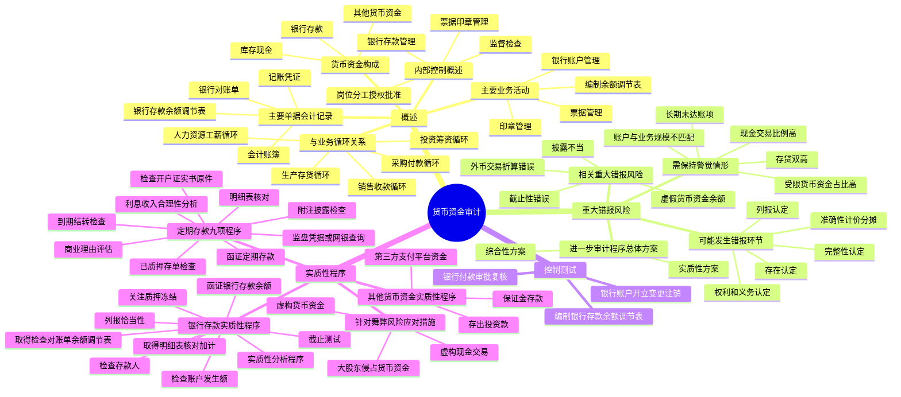

## 1. 章节定位

| 项目 | 信息 |
|------|------|
| 所属科目 | 审计 |
| 难度等级 | 3 |
| 历年分值 | 3-6 分 |
| 建议学时 | 4-6 小时 |
| 知识关联章节 | 第10章 销售与收款循环、第11章 采购与付款循环、第12章 生产与存货循环、第14章 舞弊与法律法规、第19章 完成审计工作 |

## 2. 考情分析

本章属于审计科目中的中等权重章节，历年分值约 3-6 分，主观题与客观题均有涉及。主观题常以综合题或简答题形式出现，重点考查银行存款余额调节表的编制与审查、银行函证程序、舞弊风险识别与应对；客观题则集中在内部控制要求、实质性程序的程序设计、需保持警觉的异常情形。

**命题规律**：货币资金是企业流动性最强的资产，也是财务舞弊的易发高发领域。命题人偏好以"存贷双高""大股东资金占用""虚构货币资金"等真实案例情境为载体，考查考生对重大错报风险的识别与应对程序的运用。近年来随着银行函证规范文件的更新，对函证程序的考查频率明显提高。

**高频考点分布**：

1. **货币资金与业务循环的关系**：货币资金与销售与收款、采购与付款、生产与存货、人力资源与工薪、投资与筹资等所有业务循环均直接相关，是连接各循环的纽带。
2. **货币资金内部控制要点**：岗位分工（出纳不得兼任稽核、会计档案保管和收入、支出、费用、债权债务账目登记）、授权批准四步骤（支付申请、支付审批、支付复核、办理支付）、银行存款管理（按月编制余额调节表）、票据与印章管理（严禁一人保管支付款项所需的全部印章）。
3. **货币资金的重大错报风险**：六类认定错报环节、需保持警觉的 17 项舞弊迹象（现金交易比例高、账户数量与业务规模不匹配、存贷双高、长期未达账项等）。
4. **银行存款控制测试**：账户开立变更注销、付款审批复核、银行存款余额调节表编制三类典型控制测试程序。
5. **银行存款实质性程序**：取得明细表、实质性分析程序、检查发生额、取得并检查银行对账单和余额调节表、函证银行存款余额、检查存款人、关注质押冻结、截止测试等。
6. **银行函证程序**：函证范围（包括零余额账户和本期注销的账户）、函证控制、银行询证函 14 项内容及附表资金归集信息、回函处理。
7. **定期存款审计程序**：九项专门程序，重点检查开户证实书原件、质押合同核对、利息收入合理性分析。
8. **其他货币资金审计**：保证金存款、存出投资款、第三方支付平台资金的检查要点。
9. **针对舞弊风险的应对措施**：针对虚构货币资金、大股东侵占货币资金、虚构现金交易三类舞弊风险的具体应对程序。

**联动考查方式**：

- 与第14章舞弊相结合：考查存贷双高、大股东占用资金等舞弊迹象的识别与应对；
- 与第10-12章业务循环相结合：货币资金与各业务循环的勾稽关系；
- 与第19章完成审计工作相结合：期后事项、或有事项中的银行借款和担保；
- 与第15章审计沟通相结合：发现舞弊时的沟通要求。

**备考建议**：

- 牢记"货币资金是企业流动性最强的资产"这一根本属性，所有控制要求均围绕防范侵占和舞弊展开；
- 区分"账面余额"与"调节后余额"的关系，掌握银行存款余额调节表四类未达账项的检查程序；
- 银行函证是必考点，须熟记 14 项内容、函证范围、函证控制要求；
- 关注"存贷双高"这一近年高频舞弊信号，能够从利息收入、存款规模、负债比例等多角度分析；
- 定期存款的九项审计程序是简答题高频考点，须逐条掌握。

## 3. 知识框架

## 4. 核心精讲

### 4.1 货币资金审计概述

货币资金是企业资产的重要组成部分，是企业资产中流动性最强的资产。任何企业进行生产经营活动都必须拥有一定数额的货币资金，持有货币资金是企业生产经营活动的基本条件。货币资金主要来源于股东投入、债权人借款和企业经营累积，主要用于资产的取得和费用的结付。只有保持健康的、正的现金流，企业才能够持续生存；如果出现现金流逆转迹象，产生不健康的、负的现金流，长此以往，企业将陷入财务困境，并对持续经营能力产生疑虑。

根据货币资金存放地点及用途的不同，货币资金分为库存现金、银行存款及其他货币资金。随着我国金融市场不断发展、支付工具不断革新，企业已基本实现电子化结算，库存现金管理不再是财务管理的核心工作。因此，本章主要讲述银行存款审计。

#### 4.1.1 货币资金与业务循环

企业资金营运过程，从资金流入企业形成货币资金开始，到通过销售收回货币资金、成本补偿确定利润、部分资金流出企业为止。企业资金的不断循环构成企业的资金周转。货币资金与各业务循环均直接相关：

| 业务循环 | 与货币资金的关系 |
|---------|-----------------|
| 销售与收款循环 | 现销收款、应收账款收回形成货币资金流入 |
| 采购与付款循环 | 预付款项支付、应付账款支付形成货币资金流出 |
| 生产与存货循环 | 现购存货形成货币资金流出 |
| 人力资源与工薪循环 | 应付职工薪酬支付形成货币资金流出 |
| 投资与筹资循环 | 借款收到、股权融资收到、投资支付、还本付息、分配股利等 |

#### 4.1.2 涉及的主要单据和会计记录

货币资金审计涉及的单据和会计记录主要有：银行对账单、银行存款余额调节表、有关科目的记账凭证、有关会计账簿。

#### 4.1.3 涉及的主要业务活动

注册会计师通常实施以下程序，以了解与货币资金相关的业务活动及内部控制：

1. 询问参与货币资金业务活动的被审计单位人员，如销售部门、采购部门和财务部门的员工和管理人员；
2. 观察货币资金业务流程中特定控制的运行；
3. 检查相关文件和报告，例如检查银行余额调节表是否恰当编制以及其中的调节项是否经会计主管的恰当复核等；
4. 实施穿行测试，即追踪货币资金业务在与财务报表编制相关的信息系统中的处理过程。穿行测试通常综合了询问、观察、检查等多种程序。

以一般制造型企业为例，与货币资金业务相关的主要业务活动包括：

**银行账户管理**：企业的银行账户的开立、变更或注销须经财务经理审核，报总经理审批。

**编制银行存款余额调节表**：每月末，会计主管指定出纳员以外的人员核对银行存款日记账和银行对账单，编制银行存款余额调节表，使银行存款账面余额与银行对账单调节相符。如调节不符，查明原因。会计主管复核银行存款余额调节表，对需要进行调整的调节项目及时进行处理。

**票据管理**：财务部门设置银行票据登记簿，防止票据遗失或盗用。出纳员登记银行票据的购买、领用、背书转让及注销等事项。空白票据存放在保险柜中。每月末，会计主管指定出纳员以外的人员对空白票据、未办理收款和承兑的票据进行盘点，编制银行票据盘点表，并与银行票据登记簿进行核对。

**印章管理**：企业的财务专用章由财务经理保管，办理相关业务中使用的个人名章由出纳员保管。严禁一人保管支付款项所需的全部印章。

#### 4.1.4 货币资金内部控制概述

一个良好的货币资金内部控制应该达到以下几点：

1. 货币资金收支与记账的岗位分离；
2. 货币资金收支要有合理、合法的凭据；
3. 全部收支及时准确入账，并且资金支付应严格履行审批、复核制度；
4. 对货币资金进行内部审计。

通常应当共同遵循的具体要求包括：

**（1）岗位分工及授权批准**

- 企业应当建立货币资金业务的岗位责任制，明确相关部门和岗位的职责权限，确保办理货币资金业务的不相容岗位相互分离、制约和监督。**出纳人员不得兼任稽核、会计档案保管和收入、支出、费用、债权债务账目的登记工作**。企业不得由一人办理货币资金业务的全过程。
- 企业应当对货币资金业务建立严格的授权审批制度，明确审批人对货币资金业务的授权批准方式、权限、程序、责任和相关控制措施。审批人在授权范围内进行审批，不得超越审批权限。对于审批人超越授权范围审批的货币资金业务，经办人员有权拒绝办理，并及时向审批人的上级授权部门报告。
- 企业应当按照规定的程序办理货币资金支付业务，具体包括四个步骤：

| 步骤 | 内容 |
|------|------|
| ①支付申请 | 有关部门或个人用款时，应当提前向审批人提交货币资金支付申请，注明款项的用途、金额、预算、支付方式等内容，并附有效经济合同或相关证明 |
| ②支付审批 | 审批人根据其职责、权限和相应程序对支付申请进行审批，审核付款业务的真实性、付款金额的准确性，以及申请人提交票据或者证明的合法性 |
| ③支付复核 | 财务部门收到经审批人审批签字的相关凭证或证明后，应再次复核业务的真实性、金额的准确性，以及相关票据的齐备性、相关手续的合法性和完整性，并签字认可 |
| ④办理支付 | 出纳人员应当根据复核无误的支付申请，按规定办理货币资金支付手续，及时登记银行存款日记账 |

- 企业对于重要货币资金支付业务，应当实行集体决策和审批，并建立责任追究制度，防范贪污、侵占、挪用货币资金等行为。
- 严禁未经授权的机构或人员办理货币资金业务或直接接触货币资金。

**（2）银行存款的管理**

- 企业取得的货币资金收入必须及时入账，不得私设"小金库"，不得账外设账，严禁收款不入账。
- 企业应当严格按照《支付结算办法》等国家有关规定，加强银行账户的管理，严格按照规定开立账户，办理存款、取款和结算。银行账户的开立应当符合企业经营管理实际需要，不得随意开立多个账户，禁止企业内设管理部门自行开立银行账户。
- 企业应当严格遵守银行结算纪律，不准签发没有资金保证的票据或远期支票，套取银行信用；不准签发、取得和转让没有真实交易和债权债务的票据；不准违反规定开立和使用银行账户。
- 企业应当指定专人定期核对银行账户（每月至少核对一次），编制银行存款余额调节表。**出纳人员一般不得同时从事银行对账单的获取、银行存款余额调节表的编制工作**。确需出纳人员办理上述工作的，应当指定其他人员定期进行审核、监督。
- 实行网上交易、电子支付等方式办理资金支付业务的企业，应当与承办银行签订网上银行操作协议，明确双方在资金安全方面的责任与义务、交易范围等。不应因支付方式的改变而随意简化、变更所必需的授权审批程序。
- 企业借出款项必须执行严格的授权批准程序，严禁擅自挪用、借出货币资金。

**（3）票据及有关印章的管理**

- 企业应当加强与货币资金相关的票据的管理，明确各种票据的购买、保管、领用、背书转让、注销等环节的职责权限和程序，并专设登记簿进行记录，防止空白票据的遗失和被盗用。对作废的法定票据应当按规定予以保存，不得随意处置或销毁。
- 企业应当加强银行预留印鉴的管理。**财务专用章应由专人保管，个人名章必须由本人或其授权人员保管。严禁一人保管支付款项所需的全部印章**。

**（4）监督检查**

企业应当建立对货币资金业务的监督检查制度，定期和不定期地进行检查。检查内容包括：货币资金业务相关岗位及人员的设置情况；货币资金授权批准制度的执行情况；支付款项印章的保管情况；票据的保管情况。

### 4.2 货币资金的重大错报风险

#### 4.2.1 货币资金可能发生错报的环节

货币资金主要包括库存现金、银行存款及其他货币资金。库存现金包括企业的人民币现金和外币现金。银行存款是指企业存放在银行或其他金融机构的各种款项。凡是独立核算的企业都必须在当地银行开设账户。企业在银行开设账户以后，除按核定的限额保留库存现金外，超过限额的现金必须存入银行；除在规定的范围内可以用现金直接支付款项外，在经营过程中所发生的一切货币收支业务，都必须通过银行存款账户进行结算。

以一般制造型企业为例，与货币资金有关的交易和余额可能发生错报的环节通常包括（括号内为相应的认定）：

1. 被审计单位资产负债表的货币资金在资产负债表日不存在（"存在"认定）；
2. 被审计单位所有应当记录的与货币资金相关的收支业务未得到完整记录，存在遗漏（"完整性"认定）；
3. 被审计单位的货币资金通过舞弊手段被侵占（"存在"认定）；
4. 记录的货币资金不是为被审计单位所拥有或控制（"权利和义务"认定）；
5. 货币资金金额未被恰当地列报于财务报表中，与之相关的计价调整未得到恰当记录（"准确性、计价和分摊"认定）；
6. 货币资金未按照企业会计准则的规定在财务报表中作出恰当列报（"列报"认定）。

#### 4.2.2 识别应对可能发生错报环节的内部控制

为评估与货币资金的交易、账户余额和披露相关的认定层次重大错报风险，注册会计师应了解与货币资金相关的业务活动和内部控制。需要强调的是，在识别与货币资金相关的认定层次重大错报风险时，注册会计师应当基于对相关业务活动等方面的了解，**仅考虑固有风险因素和固有风险等级**。在评估与货币资金相关的重大错报风险时，应分别评估固有风险和控制风险。

一个良好的银行存款的内部控制应达到：银行存款收支与记账的岗位分离；银行存款收支要有合理、合法的凭据；全部收支及时准确入账，全部支出要有核准手续；按月编制银行存款余额调节表，做到账实相符；加强对银行存款收支业务的内部审计。

注册会计师对银行存款内部控制的了解应当注意的内容包括：

1. 银行存款的收支是否按规定的程序和权限办理；
2. 银行账户的开立是否符合《人民币银行结算账户管理办法》等相关法律法规的要求；
3. 银行账户是否存在与本单位经营无关的款项收支情况；
4. 是否存在出租、出借银行账户的情况；
5. 出纳与会计的职责是否严格分离；
6. 是否定期取得银行对账单并编制银行存款余额调节表等。

#### 4.2.3 与货币资金相关的重大错报风险

在评价与货币资金相关的认定层次重大错报风险时，注册会计师通常运用职业判断，依据受相关固有风险因素影响的认定易于发生错报的可能性（即固有风险），以及风险评估是否考虑了与之相关的控制（即控制风险），形成对与货币资金相关的重大错报风险的评估。

与货币资金相关的认定层次重大错报风险可能包括：

1. 被审计单位存在虚假的货币资金余额或交易，因而导致银行存款余额的"存在"认定或交易的"发生"认定存在重大错报风险；
2. 被审计单位存在大额的外币交易和余额，可能存在外币交易或余额未被准确记录的风险。例如，外币银行存款的增减变动或年底余额可能因未采用正确的折算汇率而导致计价错误（"准确性、计价和分摊"认定）；
3. 银行存款的期末收支存在大额的截止性错误（"截止"认定）。例如，被审计单位期末存在金额重大且异常的银付企未付、企收银未收事项；
4. 被审计单位可能存在未能按照企业会计准则的规定对货币资金作出恰当披露的风险（"列报"认定）。例如，被审计单位期末持有使用受限制的大额银行存款，但未在财务报表附注中对其进行披露。

#### 4.2.4 货币资金舞弊风险迹象

货币资金领域是财务舞弊的易发高发领域。实践中的案例表明，一些被审计单位可能由于某些压力、动机和机会，通过虚构货币资金、大股东侵占货币资金和虚构现金交易等方式实施舞弊。在实施货币资金审计过程中，如果被审计单位存在以下事项或情形，注册会计师需要保持警觉：

1. 被审计单位的现金交易比例较高，并且与其所在行业的常用结算模式不同；
2. 库存现金规模明显超过业务周转所需资金；
3. 银行账户开立数量与企业实际业务规模不匹配，或存在多个零余额账户且长期不注销；
4. 在没有经营业务的地区开立银行账户，或将高额资金存放于其经营和注册地之外的异地；
5. 被审计单位资金存放于管理层或员工个人账户，或通过个人账户进行被审计单位交易的资金结算；
6. 货币资金收支金额与现金流量表中的经营活动、筹资活动、投资活动的现金流量不匹配，或经营活动现金流量净额与净利润不匹配；
7. 不能提供银行对账单或银行存款余额调节表，或提供的银行对账单没有银行印章、交易对方名称或摘要；
8. 存在长期或大量银行未达账项；
9. 银行存款明细账存在非正常转账。例如，短期内相同金额的一收一付或相同金额的分次转入转出等大额异常交易；
10. 存在期末余额为负数的银行账户；
11. 受限货币资金占比较高；
12. 存款收益金额与存款的规模明显不匹配；
13. 针对同一交易对方，在报告期内存在现金和其他结算方式并存的情形；
14. 违反货币资金存放和使用规定，如上市公司将募集资金违规用于质押、未经批准开立账户转移募集资金、未经许可将募集资金转作其他用途等；
15. 存在大额外币收付记录，而被审计单位并不涉足进出口业务；
16. 被审计单位以各种理由不配合注册会计师实施银行函证、不配合注册会计师至中国人民银行或基本户开户行打印《已开立银行结算账户清单》；
17. 与实际控制人（或控股股东）、银行（或财务公司）签订集团现金管理账户协议或类似协议。

此外，注册会计师在审计其他财务报表项目时，还可能关注到其他需保持警觉的事项或情形，例如：存在没有真实业务支持或与交易不相匹配的大额资金或汇票往来；存在长期挂账的大额预付款项等；存在大量货币资金的情况下仍高额或高息举债；付款方全称与销售客户名称不一致、收款方全称与供应商名称不一致；开具的银行承兑汇票没有银行承兑协议支持；银行承兑票据保证金余额与应付票据相应余额比例不合理；存在频繁的票据贴现；实际控制人（或控股股东）频繁进行股权质押（冻结）且累计被质押（冻结）的股权占其持有被审计单位总股本的比例较高；存在大量货币资金的情况下，频繁发生债务违约，或者无法按期支付股利或偿付债务本息；首次公开发行股票（IPO）公司申报期内持续现金分红；工程付款进度或结算周期异常等。

### 4.3 货币资金的控制测试

如果在评估认定层次重大错报风险时预期信赖控制，或仅实施实质性程序不能够提供认定层次充分、适当的审计证据，注册会计师应当实施控制测试。如果根据注册会计师的判断，决定对货币资金采取实质性审计方案，则无需实施控制测试。

#### 4.3.1 银行账户的开立、变更和注销

例如，被审计单位针对银行账户的开立、变更和注销作出以下内部控制要求：会计主管根据被审计单位的实际业务需要就银行账户的开立、变更和注销提出申请，经财务经理审核后报总经理审批。

针对该内部控制，注册会计师可以实施以下控制测试程序：

1. 询问会计主管被审计单位本年开户、变更、撤销的整体情况；
2. 取得本年度账户开立、变更、撤销申请项目清单，检查清单的完整性，并在选取适当样本的基础上检查账户的开立、变更、撤销项目是否已经财务经理和总经理审批。

#### 4.3.2 银行付款的审批和复核

例如，被审计单位针对银行付款审批作出以下内部控制要求：部门经理审批本部门的付款申请，审核付款业务是否真实发生、付款金额是否准确，以及后附票据是否齐备，并在复核无误后签字认可。财务部门在安排付款前，财务经理再次复核经审批的付款申请及后附相关凭据或证明，如核对一致，进行签字认可并安排付款。

针对该内部控制，注册会计师可以在选取适当样本的基础上实施以下控制测试程序：

1. 询问相关业务部门的部门经理和财务经理在日常银行付款业务中执行的内部控制，以确定其是否与被审计单位内部控制政策要求保持一致；
2. 观察财务经理复核付款申请的过程，是否核对了付款申请的用途、金额及后附相关凭据，以及在核对无误后是否进行了签字确认；
3. 重新核对经审批及复核的付款申请及其相关凭据，并检查是否经签字确认。

#### 4.3.3 编制银行存款余额调节表

例如，被审计单位为保证财务报表中银行存款余额的存在性、完整性和准确性作出了以下内部控制要求：每月末，会计主管指定应收账款会计核对银行存款日记账和银行对账单，编制银行存款余额调节表，使银行存款账面余额与银行对账单调节相符。如存在差异项，查明原因并进行差异调节说明。会计主管复核银行存款余额调节表，对需要进行调整的调节项目及时进行处理，并签字确认。

针对该内部控制，注册会计师可以实施以下控制测试程序：

1. 询问应收账款会计和会计主管，以确定其执行的内部控制是否与被审计单位内部控制政策要求保持一致，特别是针对未达账项的编制及审批流程；
2. 针对选取的样本，检查银行存款余额调节表，查看调节表中记录的企业银行存款日记账余额是否与银行存款日记账余额保持一致，调节表中记录的银行对账单余额是否与被审计单位提供的银行对账单中的余额保持一致；
3. 检查银行余额调节表是否经会计主管的签字复核；
4. 针对大额未达账项进行期后收付款的检查。

### 4.4 货币资金的实质性程序

#### 4.4.1 银行存款的实质性程序

根据重大错报风险的评估和从控制测试（如实施）中所获取的审计证据和保证程度，注册会计师就银行存款实施的实质性程序可能包括：

**（1）取得银行存款余额明细表**

获取银行存款余额明细表，复核加计是否正确，并与总账数和日记账合计数核对是否相符；检查非记账本位币银行存款的折算汇率及折算金额是否正确。如果不相符，应查明原因，必要时应建议作出适当调整。

如果对被审计单位银行账户的完整性存有疑虑，例如，当被审计单位可能存在账外账或资金体外循环时，注册会计师可以考虑额外实施以下实质性程序：

1. 注册会计师在企业人员陪同下到中国人民银行或基本存款账户开户行查询并打印《已开立银行结算账户清单》，观察银行办事人员的查询、打印过程，并检查被审计单位账面记录的银行人民币结算账户是否完整；
2. 结合其他相关细节测试，关注交易相关单据中被审计单位的收（付）款银行账户是否均包含在注册会计师已获取的开立银行账户清单内。

**（2）实施实质性分析程序**

计算银行存款累计余额应收利息收入，分析比较被审计单位银行存款应收利息收入与实际利息收入的差异是否恰当，评估利息收入的合理性，检查是否存在高息资金拆借，确认银行存款余额是否存在，利息收入是否已经完整记录。

**（3）检查银行存款账户发生额**

注册会计师还可以考虑对银行存款账户的发生额实施以下程序：

1. 结合银行账户性质，分析不同账户发生银行存款日记账漏记银行交易的可能性，获取相关账户相关期间的全部银行对账单；
2. 利用数据分析等技术，对比银行对账单上的收付款流水与被审计单位银行存款日记账的收付款信息是否一致，对银行对账单及被审计单位银行存款日记账记录进行双向核对。注册会计师通常可以考虑选择以下银行账户进行核对：基本户；余额较大的银行账户；发生额较大且收付频繁的银行账户；发生额较大但余额较小、零余额或当期注销的银行账户；募集资金账户等。

针对同一银行账户，注册会计师可以根据具体情况实施下列审计程序：

- 选定同一期间（月度、年度）的银行存款日记账、银行对账单的发生额合计数（借方及贷方）进行总体核对；
- 对银行对账单及被审计单位银行存款日记账记录进行双向核对，即在选定的账户和期间，从被审计单位银行存款日记账上选取样本，核对至银行对账单，以及自银行对账单中进一步选取样本，与被审计单位银行存款日记账记录进行核对。在运用数据分析技术时，可选择全部项目进行核对。核对内容包括日期、金额、借贷方向、收付款单位、摘要等；
- 对相同金额的一收一付、相同金额的多次转入转出等大额异常货币资金发生额，检查银行存款日记账和相应交易及资金划转的文件资料，关注有关交易及相应资金流转安排是否具有合理的商业理由；
3. 浏览资产负债表日前后的银行对账单和被审计单位银行存款账簿记录，关注是否存在大额、异常资金变动以及大量大额红字冲销或调整记录，如存在，需要实施进一步的审计程序。

**（4）取得并检查银行对账单和银行存款余额调节表**

取得并检查银行对账单和银行存款余额调节表是证实资产负债表中所列银行存款是否存在的重要程序。具体测试程序通常包括：

1. 取得并检查银行对账单：
   - 取得被审计单位加盖银行印章的银行对账单，注册会计师应对银行对账单的真实性保持警觉，必要时，亲自到银行获取对账单，并对获取过程保持控制。此外，注册会计师还可以观察被审计单位人员登录并操作网银系统导出信息的过程，核对网银界面的真实性，核对网银中显示或下载的信息与提供给注册会计师的对账单中信息的一致性；
   - 将获取的银行对账单余额与银行日记账余额进行核对，如存在差异，获取银行存款余额调节表；
   - 将被审计单位资产负债表日的银行对账单与银行询证函回函核对，确认是否一致。

2. 取得并检查银行存款余额调节表：
   - 检查调节表中加计数是否正确，调节后银行存款日记账余额与银行对账单余额是否一致；
   - 检查调节事项。对于企付银未付款项，检查被审计单位付款的原始凭证，并检查该项付款是否已在期后银行对账单上得以反映；对于企收银未收款项，检查被审计单位收款入账的原始凭证，检查其是否已在期后银行对账单上得以反映。对于银收企未收、银付企未付款项，检查收、付款项的内容及金额，确定是否为截止错报。如果企业的银行存款余额调节表存在大额或长期未达账项，注册会计师应追查原因并检查相应的支持文件，判断是否为错报事项，确定是否需要提请被审计单位进行调整；
   - 关注长期未达账项，查看是否存在挪用资金等事项；
   - 特别关注银付企未付、企付银未付中支付异常的领款事项，包括没有载明收款人、签字不全等支付事项，确认是否存在舞弊。

银行存款余额调节表的基本格式如下：

| 项目（企业账面） | 金额（元） | 项目（银行对账单） | 金额（元） |
|---|---|---|---|
| 企业银行存款日记账余额 |  | 银行对账单余额 |  |
| 加：银行已收、企业未收款项 |  | 加：企业已收、银行未收款项 |  |
| 减：银行已付、企业未付款项 |  | 减：企业已付、银行未付款项 |  |
| 调节后的存款余额 |  | 调节后的存款余额 |  |

**（5）函证银行存款余额**

银行函证程序是证实资产负债表所列银行存款是否存在的重要程序。通过向往来银行函证，注册会计师不仅可了解企业资产的存在，还可了解企业账面反映所欠银行债务的情况，并有助于发现企业未入账的银行借款和未披露的或有负债。

注册会计师应当对银行存款（包括零余额账户和在本期内注销的账户）、借款及与金融机构往来的其他重要信息实施函证程序，**除非有充分证据表明某一银行存款、借款及与金融机构往来的其他重要信息对财务报表不重要且与之相关的重大错报风险很低**。如果不对这些项目实施函证程序，注册会计师应当在审计工作底稿中说明理由。

当实施函证程序时，注册会计师应当对询证函保持控制，当函证信息与银行回函结果不符时，注册会计师应当调查不符事项，以确定是否表明存在错报。

根据《关于进一步规范银行函证及回函工作的通知》（财会〔2020〕12号）以及《银行函证工作操作指引》（财办会〔2024〕2号），在实施银行函证过程中，会计师事务所应当按要求安排专门部门或岗位集中发送、收回银行询证函，采用公示地址作为邮寄地址，直接发出银行询证函并直接从银行业金融机构获取回函。银行业金融机构应当自收到符合规定的询证函之日起 **10 个工作日内**，按照要求将回函直接回复会计师事务所或交付跟函注册会计师。

银行询证函（格式一）主要包括以下 14 项内容及附表资金归集信息：

| 序号 | 函证内容 |
|------|---------|
| 1 | 银行存款（包括余额为零的存款账户） |
| 2 | 银行借款 |
| 3 | 指定期间内注销的银行存款账户 |
| 4 | 本公司作为委托人的委托贷款 |
| 5 | 本公司作为借款人的委托贷款 |
| 6 | 担保（包括本公司为他人提供的以贵行为受益人的担保、贵行向本公司提供的担保） |
| 7 | 本公司为出票人且由贵行承兑而尚未支付的银行承兑汇票 |
| 8 | 本公司向贵行已贴现而尚未到期的商业汇票 |
| 9 | 本公司为持票人且由贵行托收（或由本公司提示付款）的商业汇票 |
| 10 | 本公司为申请人，由贵行开具的、未履行完毕的不可撤销信用证 |
| 11 | 本公司与贵行之间未履行完毕的外汇买卖合约 |
| 12 | 本公司存放于贵行托管的证券或其他产权文件 |
| 13 | 本公司购买的由贵行发行的未到期银行理财产品 |
| 14 | 其他 |
| 附表 | 资金归集（资金池或其他资金管理）账户具体信息 |

**（6）检查银行存款账户存款人**

检查银行存款账户存款人是否为被审计单位，若存款人非被审计单位，应获取该账户户主和被审计单位的书面声明，确认资产负债表日是否需要提请被审计单位进行调整。

**（7）关注是否存在质押、冻结等对变现有限制或存在境外的款项**

如果存在，是否已提请被审计单位作必要的调整和披露。

**（8）对不符合现金及现金等价物条件的银行存款**

在审计工作底稿中予以列明，以考虑对现金流量表的影响。

**（9）抽查大额银行存款收支的原始凭证**

检查原始凭证是否齐全、记账凭证与原始凭证是否相符、账务处理是否正确、是否记录于恰当的会计期间等项内容。检查是否存在非营业目的的大额货币资金转移，并核对相关账户的进账情况；如有与被审计单位生产经营无关的收支事项，应查明原因并作相应的记录。

**（10）检查银行存款收支的截止**

选取资产负债表日前后若干张、一定金额以上的凭证实施截止测试，关注业务内容及对应项目，如有跨期收支事项，应考虑是否提请被审计单位进行调整。

**（11）检查银行存款是否在财务报表中作出恰当列报**

如果企业的银行存款存在抵押、冻结等使用限制情况或者潜在回收风险，注册会计师应关注企业是否已经恰当披露有关情况。

#### 4.4.2 定期存款的审计程序

如果被审计单位有定期存款，注册会计师可以考虑实施以下审计程序：

1. 如果定期存款占银行存款的比例偏高，或同时负债比例偏高，注册会计师需要向管理层询问定期存款存在的商业理由并评估其合理性；
2. 获取定期存款明细表，检查是否与账面记录金额一致，存款人是否为被审计单位，定期存款是否被质押或限制使用；
3. 监盘定期存款凭据，或实地观察被审计单位登录网银系统查询定期存款信息，并将查询信息截屏保存。如果被审计单位在资产负债表日有大额定期存款，基于对风险的判断，考虑选择在资产负债表日实施监盘；
4. **对存款期限跨越资产负债表日的未质押定期存款，检查开户证实书原件而非复印件**，以防止被审计单位提供的复印件是未质押或未提现前原件的复印件，特别关注被审计单位在定期存单到期之前，是否存在先办理质押贷款或提前套现，再用质押贷款所得货币资金或套取的货币资金虚增收入、挪作他用或从事其他违规业务的情形；
5. 对已质押的定期存款，检查定期存单复印件，并与相应的质押合同核对，核对存款人、金额、期限等相关信息；对于用于质押借款的定期存单，关注定期存单对应的质押借款有无人账；对于超过借款期限但仍处于质押状态的定期存款，还需要关注相关借款的偿还情况，了解相关质权是否已被行使；对于为他人担保的定期存单，关注相关担保是否合规，担保是否逾期及相关质权是否已被行使；
6. 函证定期存款相关信息。按照《中国注册会计师审计准则第 1312 号——函证》的要求实施函证程序，关注银行回函是否对包括"是否用于担保或存在其他使用限制"在内的项目给予完整回复；
7. 结合财务费用和投资收益审计，分析利息收入的合理性，判断定期存款是否真实存在，或是否存在体外资金循环的情形。如果账面利息收入远大于根据定期存款计算的应得利息，很可能表明被审计单位存在账外定期存款。如果账面利息收入远小于根据定期存款计算的应得利息，很可能表明被审计单位存在转移利息收入或挪用、虚构定期存款的情况；
8. 对于在报告期内到期结转的定期存款、资产负债表日后已提取的定期存款，检查、核对相应的兑付凭证、银行对账单或网银记录等；
9. 关注被审计单位是否在财务报表附注中对定期存款及其受限情况（如有）给予充分披露。

#### 4.4.3 其他货币资金的实质性程序

注册会计师在对其他货币资金实施审计程序时，通常可能需要特别关注以下事项：

**（1）保证金存款的检查**

检查开立银行承兑汇票的协议或银行授信审批文件。可以将保证金账户对账单与相应的交易进行核对，根据被审计单位应付票据的规模合理推断保证金数额。检查信用证的开立协议与保证金是否相符，检查保证金与相关债务的比例是否与合同约定一致，特别关注是否存在有保证金发生而被审计单位无对应保证事项的情形。

**（2）存出投资款**

跟踪资金流向，并获取董事会决议等批准文件、开户资料、授权操作资料等。如果投资于证券交易业务，通常结合相应金融资产项目审计，核对证券账户户名是否与被审计单位相符，获取证券公司证券交易结算资金账户的交易流水，抽查大额的资金收支，关注资金收支的账面记录与资金流水是否相符。

**（3）第三方支付平台资金**

检查因互联网支付留存于第三方支付平台的资金。了解是否开立支付宝、微信等第三方支付账户，如是，获取相关开户信息资料，了解其用途和使用情况，获取与第三方支付平台签订的协议，了解第三方平台使用流程等内部控制，比照验证银行存款或银行交易的方式对第三方平台支付账户函证交易发生额和余额（如可行）。获取第三方支付平台发生额及余额明细，在验证这些明细信息可靠性的基础上（如观察被审计单位人员登录并操作相关支付平台导出信息的过程，核对界面的真实性，核对平台界面显示或下载的信息与提供给注册会计师的明细信息的一致性等），将其与账面记录进行核对，对大额交易考虑实施进一步的检查程序。

#### 4.4.4 针对与货币资金相关的舞弊风险采取的应对措施

货币资金领域是财务舞弊的易发高发领域。如果识别出与货币资金相关的舞弊风险，注册会计师应当设计和实施进一步审计程序，审计程序的性质、时间安排和范围应当能够应对评估的舞弊导致的认定层次重大错报风险。

**（1）针对虚构货币资金相关舞弊风险**

1. 严格实施银行函证程序，保持对函证全过程的控制，恰当评价回函可靠性，深入调查不符事项或函证程序中发现的异常情况；
2. 关注货币资金的真实性和巨额货币资金余额以及大额定期存单的合理性；
3. 了解企业开立银行账户的数量及分布，是否与企业实际经营需要相匹配且具有合理性，检查银行账户的完整性和银行对账单的真实性；
4. 分析利息收入和财务费用的合理性，关注存款规模与利息收入是否匹配，是否存在"存贷双高"现象；
5. 关注是否存在大额境外资金，是否存在缺少具体业务支持或与交易金额不相匹配的大额资金或汇票往来等异常情况。

**（2）针对大股东侵占货币资金相关舞弊风险**

1. 识别企业银行对账单中与实际控制人、控股股东或高级管理人员的大额资金往来交易，关注是否存在异常的大额资金流动，关注资金往来是否以真实、合理的交易为基础，关注利用无商业实质的购销业务进行资金占用的情况；
2. 分析企业的交易信息，识别交易异常的疑似关联方，检查企业银行对账单中与疑似关联方的大额资金往来交易，关注资金或商业汇票往来是否以真实、合理的交易为基础；
3. 关注期后货币资金重要账户的划转情况以及资金受限情况；
4. 通过公开信息等可获取的信息渠道了解实际控制人、控股股东财务状况，关注其是否存在资金紧张或长期占用企业资金等情况，检查大股东有无高比例股权质押的情况。

**（3）针对虚构现金交易相关舞弊风险**

1. 结合企业所在行业的特征恰当评价现金交易的合理性，检查相关的内部控制是否健全、运行是否有效，是否保留了充分的资料和证据；
2. 计算月现金销售收款、现金采购付款的占比，关注现金收、付款比例是否与企业业务性质相匹配，识别现金收、付款比例是否存在异常波动，并追查波动原因；
3. 了解现金交易对方的情况，关注使用现金结算的合理性和交易的真实性；
4. 检查大额现金收支，追踪来源和去向，核对至交易的原始单据，关注收付款方、收付款金额与合同、订单、出入库单相关信息是否一致；
5. 检查交易对象的相关外部证据，验证其交易真实性；
6. 检查是否存在洗钱等违法违规行为。

## 5. 典型例题

**【例题 1】（银行函证程序的判断）**

ABC 会计师事务所接受委托，对甲公司 2×24 年度财务报表进行审计。审计项目组在实施银行存款审计时，遇到下列事项：

（1）甲公司在 A 银行开立了一个账户，2×24 年末该账户余额为 0，审计项目组认为该账户余额为 0，对财务报表不重要，决定不实施函证程序。

（2）甲公司在 B 银行开立的账户于 2×24 年 5 月注销，审计项目组认为该账户已注销，决定不实施函证程序。

（3）甲公司在 C 银行的存款期末余额为 50 万元，占资产总额比例较小且风险较低，审计项目组决定不实施函证程序，但在审计工作底稿中未说明理由。

要求：分别判断审计项目组的做法是否恰当，并简要说明理由。

**答案**：

（1）不恰当。注册会计师应当对银行存款（包括零余额账户和在本期内注销的账户）、借款及与金融机构往来的其他重要信息实施函证程序，除非有充分证据表明某一银行存款、借款及与金融机构往来的其他重要信息对财务报表不重要且与之相关的重大错报风险很低。零余额账户也属于函证范围。

（2）不恰当。本期注销的账户也属于函证范围，除非有充分证据表明对财务报表不重要且与之相关的重大错报风险很低，否则应当实施函证程序。

（3）不恰当。即使决定不实施函证程序，也必须在审计工作底稿中说明理由。理由的判断标准是"对财务报表不重要且与之相关的重大错报风险很低"，两者须同时满足。

**解析**：银行函证的范围是高频考点。注意函证对象包括三类：银行存款（含零余额账户和本期注销账户）、借款、与金融机构往来的其他重要信息。豁免函证须同时满足两个条件（不重要且重大错报风险很低），并在工作底稿中说明理由。

**【例题 2】（银行存款余额调节表的审查）**

甲公司 2×24 年 12 月 31 日银行存款日记账余额为 1 200 000 元，银行对账单余额为 1 350 000 元。经核对，发现以下未达账项：

（1）12 月 28 日，企业送存转账支票一张，金额 80 000 元，企业已记银行存款增加，银行尚未入账；

（2）12 月 29 日，企业开出转账支票一张，金额 50 000 元，企业已记银行存款减少，持票人尚未到银行办理转账；

（3）12 月 30 日，银行代企业收取货款 200 000 元，银行已入账，企业尚未收到收款通知；

（4）12 月 31 日，银行代扣水电费 20 000 元，银行已入账，企业尚未收到付款通知。

要求：编制甲公司 2×24 年 12 月 31 日的银行存款余额调节表，并说明调节后余额的含义。

**答案**：

银行存款余额调节表（2×24 年 12 月 31 日）

| 项目 | 金额（元） | 项目 | 金额（元） |
|------|------|------|------|
| 企业银行存款日记账余额 | 1 200 000 | 银行对账单余额 | 1 350 000 |
| 加：银行已收、企业未收 | 200 000 | 加：企业已收、银行未收 | 80 000 |
| 减：银行已付、企业未付 | 20 000 | 减：企业已付、银行未付 | 50 000 |
| 调节后的存款余额 | 1 380 000 | 调节后的存款余额 | 1 380 000 |

调节后余额 1 380 000 元代表甲公司 2×24 年 12 月 31 日银行存款的真实余额，即资产负债表日银行存款实际可动用的金额。调节后两边余额相等，表明账簿记录基本正确；但调节表本身不能作为调整账面记录的依据，企业应在 2×25 年 1 月收到相关原始凭证后，根据实际发生的未达账项调整银行存款日记账。

**解析**：银行存款余额调节表四类未达账项要牢记：企收银未收（加在银行对账单侧）、企付银未付（减在银行对账单侧）、银收企未收（加在企业日记账侧）、银付企未付（减在企业日记账侧）。

**【例题 3】（舞弊风险迹象的识别与应对）**

审计项目组在对乙公司 2×24 年度财务报表进行审计时，注意到以下事项：

（1）乙公司期末货币资金余额为 50 亿元，短期借款和长期借款余额合计为 40 亿元；

（2）乙公司账面利息收入为 0.5 亿元，根据定期存款规模计算的应得利息约为 3 亿元；

（3）乙公司银行存款明细账中存在多笔相同金额的转入转出记录，且交易对方为关联方；

（4）乙公司拒绝配合审计项目组实施银行函证，理由是涉及商业机密。

要求：分别说明上述事项可能表明存在的舞弊风险，并提出相应的应对措施。

**答案**：

（1）"存贷双高"迹象。存在大量货币资金的同时高额举债，不符合商业逻辑，可能表明货币资金被挪用、受限或虚构。应对措施：严格实施银行函证程序；了解银行账户的完整性和真实性；关注货币资金是否存在质押、冻结等使用限制；分析利息收入和财务费用的合理性；询问管理层存贷双高的商业理由并评估合理性。

（2）账面利息收入远小于根据定期存款计算的应得利息，可能表明被审计单位存在转移利息收入或挪用、虚构定期存款的情况。应对措施：获取定期存款明细表；监盘定期存款凭据或观察网银查询；检查开户证实书原件而非复印件；函证定期存款信息，关注是否用于担保或存在其他使用限制；结合财务费用和投资收益审计分析利息收入合理性。

（3）短期内相同金额的转入转出，且交易对方为关联方，可能存在大股东侵占货币资金的舞弊风险。应对措施：识别银行对账单中与实际控制人、控股股东或高级管理人员的大额资金往来交易；关注资金往来是否以真实、合理的交易为基础；检查银行存款日记账和相应交易及资金划转的文件资料，关注是否具有合理的商业理由；关注期后货币资金重要账户的划转情况。

（4）被审计单位以各种理由不配合注册会计师实施银行函证，属于明确的舞弊风险迹象，可能表明银行存款余额虚假。应对措施：向治理层和管理层沟通该事项；要求被审计单位配合函证，说明拒绝函证的后果；考虑对审计意见的影响；如果仍无法实施函证，考虑实施替代程序（如亲自到银行获取对账单、查询已开立银行结算账户清单等），并评估审计证据的充分性和适当性，必要时考虑解除业务约定或出具非无保留意见。

**解析**：本例综合考查货币资金舞弊风险迹象的识别与应对。四个事项分别对应存贷双高、利息收入异常、关联方资金占用、拒绝函证四类典型舞弊迹象。应对措施要紧扣实质性程序的具体内容。

## 6. 记忆口诀

**货币资金三大类**："库存现金银行存款其他货币资金"——按存放地点和用途划分，本章重点银行存款。

**业务循环全覆盖**："销售采购生产工薪投资筹资"——货币资金与五大业务循环均直接相关，是连接各循环的纽带。

**内部控制四要点**："岗位分离凭据合法及时入账内部审计"——收支与记账岗位分离、收支有合法凭据、全部收支及时入账、内部审计。

**支付四步骤**："申请审批复核办理"——支付申请、支付审批、支付复核、办理支付，按顺序执行。

**出纳禁令**："不任稽核不档管不登收支费用债权债务账"——出纳不得兼任稽核、会计档案保管和收入、支出、费用、债权债务账目的登记工作。

**印章管理铁律**："财务章专人管个人章本人管严禁一人全管"——严禁一人保管支付款项所需的全部印章。

**对账单余额调节表编制**："出纳不编会计主管复核"——出纳一般不得编制余额调节表，由出纳员以外的人员编制，会计主管复核。

**六类认定错报环节**："存在完整侵占权利准确列报"——存在、完整性、存在（舞弊侵占）、权利义务、准确计价分摊、列报。

**17 项警觉情形核心**："现金高账户多存贷高长期未达账受限高利息不匹配拒绝函证"——重点识别虚构货币资金、大股东侵占、虚构现金交易三类舞弊。

**银行函证三要点**："零余额注销账户必函证除非不重要且风险低不函证须说明理由"——函证范围包括零余额账户和本期注销账户；豁免须同时满足两个条件；不函证须在工作底稿说明理由。

**银行函证 14 项**："存款借款注销账户委托贷委托借担保承兑贴现托收信用证外汇托管理财其他"——14 项核心内容加附表资金归集。

**函证回函时限**："10 个工作日"——银行业金融机构自收到符合规定的询证函之日起 10 个工作日内回函。

**余额调节表四类未达账项**："企收银未加银侧企付银未减银侧银收企未加企侧银付企未减企侧"——加在对方侧减在对方侧。

**定期存款九程序**："理由评估明细核对监盘凭据原件检查质押核对函证存款利息分析到期检查附注披露"——重点检查开户证实书原件而非复印件。

**存贷双高**："大量存款高息举债利息不匹配"——存款规模与利息收入不匹配，存在大量货币资金仍高额举债。

**三类舞弊应对**："虚构资金严函证查账户查利息大股东占用查关联查划转查受限虚构现金查内控查比例查来源查外部证据"——分别针对虚构货币资金、大股东侵占、虚构现金交易设计应对程序。

## 7. 同步练习

**252.（单选题）** 下列有关货币资金内部控制的说法中，错误的是（　）。

A. 企业不准内设管理部门自行开立银行账户
B. 对于可以销毁的票据，在履行审核手续后进行销毁，但应当建立销毁清册并由授权人员监销
C. 出纳人员不得从事银行对账单的获取
D. 企业严禁一人保管支付款项所需的全部印章

**253.（单选题）** 下列情形中，不违背货币资金内部控制的岗位分工原则的是（　）。

A. 由出纳人员负责会计档案的保管工作
B. 由出纳人员保管签发支票所需的全部印章
C. 由出纳人员负责收入总账和明细账的登记工作
D. 由出纳人员负责固定资产明细账的登记工作

**254.（单选题）** 下列有关注册会计师实施银行函证程序的说法中，正确的是（　）。

A. 注册会计师对银行存款的函证，可以采用积极式和消极式
B. 注册会计师审计银行存款时不需要对账户余额为零的进行函证
C. 注册会计师应向在本期内注销的银行存款账户发函
D. 向银行函证企业银行存款不能证实企业银行借款的完整性

**255.（单选题）** 下列有关监盘库存现金的说法中，错误的是（　）。

A. 监盘库存现金属于实质性程序
B. 现金出纳员和被审计单位会计主管人员必须参加，并由注册会计师进行监盘
C. 监盘库存现金的时间最好选择在上午上班前或下午下班时
D. 监盘范围一般包括被审计单位各部门经管的所有现金

**256.（单选题）** 2025年3月5日注册会计师对N公司全部现金进行监盘后，确认实有现金数额为1000元。N公司3月4日账面库存现金余额为2000元，3月5日发生的现金收支全部未登记入账，其中收入金额为3000元、支出金额为4000元，2025年1月1日至3月4日现金收入总额为165200元、现金支出总额为165500元，则推断2024年12月31日库存现金余额应为（　）元。

A. 1300
B. 2300
C. 700
D. 2700

**257.（单选题）** 下列关于票据及有关印章的管理的说法中，错误的是（　）。

A. 企业应当加强与货币资金相关的票据的管理，专设登记簿进行记录，防止空白票据的遗失和被盗用
B. 财务专用章应由财务经理保管，个人名章必须由本人保管
C. 严禁一人保管支付款项所需的全部印章
D. 按规定需要有关负责人签字或盖章的经济业务，必须严格履行签字或盖章手续

**258.（单选题）** 注册会计师应当注意检查库存现金内部控制的设计和运行情况，下列各项中，不需要重点关注的是（　）。

A. 库存现金的收支是否按规定的程序和权限办理
B. 是否存在与被审计单位经营无关的款项收支情况
C. 是否存在出租、出借银行账户的情况
D. 出纳与会计的职责是否严格分离

**259.（单选题）** 对相同金额的一收一付、相同金额的多次转入转出等大额异常货币资金发生额，注册会计师可以采取的较为有效的措施是（　）。

A. 函证银行存款
B. 检查银行存款日记账和相应交易及资金划转的文件资料，关注相关交易及相应资金流转安排是否具有合理的商业理由
C. 询问出纳人员
D. 编制或获取银行存款余额调节表

**260.（单选题）** 注册会计师在检查被审计单位2024年12月31日的银行存款余额调节表时，发现下述调节事项，其中有迹象表明性质或范围不合理的是（　）。

A. "银行已收、企业未收"项目包含一项2024年12月31日到账的应收账款，被审计单位尚未收到银行的收款通知
B. "企业已付、银行未付"项目包含一项被审计单位于2024年12月31日提交的转账支付申请，用于支付被审计单位2024年12月份的电费
C. "企业已收、银行未收"项目包含一项2024年12月30日收到的退货款，被审计单位已将供应商提供的支票提交银行
D. "银行已付、企业未付"项目包含一项2024年11月支付的销售返利，该笔付款已经总经理授权，但由于经办人员未提供相关单据，会计部门尚未入账

**261.（单选题）** 下列关于注册会计师实施银行函证的说法中，错误的是（　）。

A. 以会计师事务所的名义发往开户银行
B. 会计师事务所应当按要求安排专门部门或岗位集中发送、收回银行询证函
C. 银行业金融机构应当在其总行或总部网站、微信公众号等公开渠道就办理函证相关事项进行公示
D. 当函证信息与银行回函结果不符时，注册会计师应当调查不符事项

**262.（单选题）** 下列各项中，通常不能为定期存款的存在认定提供可靠的审计证据的是（　）。

A. 对于未质押的定期存款，检查开户证实书原件
B. 函证定期存款的相关信息
C. 对于在资产负债表日后已到期的定期存款，核对兑付凭证
D. 对于已质押的定期存款，检查定期存单复印件

**263.（多选题）** 下列审计程序中属于银行存款实质性程序的有（　）。

A. 核对银行存款日记账与总账的余额是否相符
B. 检查是否存在未入账的利息收入和利息支出
C. 抽取一定期间银行存款余额调节表，查验其是否按月正确编制并经复核
D. 对未质押的定期存款，检查开户证实书原件

**264.（多选题）** 注册会计师对其他货币资金实施审计程序时，需要特别关注的事项有（　）。

A. 了解被审计单位是否开立支付宝、微信等第三方支付账户
B. 保证金存款的检查，检查开立银行承兑汇票的协议或银行授信审批文件
C. 对于存出投资款，跟踪资金流向
D. 对于留存于第三方支付平台的资金，获取相关开户资料和协议

**265.（多选题）** 下列各项中，属于注册会计师对银行账户完整性认定实施的审计程序的有（　）。

A. 在企业人员陪同下到中国人民银行查询打印《已开立银行结算账户清单》
B. 关注交易相关单据中被审计单位收付款银行是否包含在注册会计师已获取的开立银行账户清单内
C. 检查被审计单位账面记录的银行人民币结算账户是否完整
D. 对银行账款余额进行函证

**266.（多选题）** 注册会计师对被审计单位的银行存款账户的发生额进行审计时，可能采取的审计程序有（　）。

A. 结合银行账户性质，分析不同账户发生银行日记账漏记银行交易的可能性，获取相关账户相关期间的全部银行对账单
B. 利用数据分析等技术，对比银行对账单上的收付款流水与被审计单位银行存款日记账的收付款信息是否一致
C. 对银行对账单及被审计单位银行存款日记账记录进行双向核对
D. 关注长期未达账项，查看是否存在挪用资金等事项

**267.（多选题）** 通过实施银行函证程序，可以获取的审计证据有（　）。

A. 资产负债表所列银行存款是否存在
B. 是否存在未入账的银行借款
C. 是否有未披露的或有负债
D. 银行存款应收利息的准确性

**268.（多选题）** 下列有关银行存款函证的说法中，错误的有（　）。

A. 注册会计师对银行存款的函证必须采用积极方式
B. 注册会计师审计银行存款时不需要对余额为零的账户进行函证
C. 银行函证程序是证实银行存款是否存在的重要程序
D. 向银行函证企业的银行存款不能证实企业银行借款的完整性

**269.（简答题）**（2022年）ABC会计师事务所的A注册会计师负责审计甲公司2021年度财务报表。与货币资金审计相关的部分事项如下：

(1) A注册会计师在测试甲公司与银行账户开立、变更和注销相关的内部控制时，获取了出纳编制的2021年度银行账户开立、变更和注销清单，从中选取样本进行测试，结果满意，据此认为该控制运行有效。
(2) A注册会计师在向某银行乙分行函证前，从甲公司获悉，受不可抗拒因素影响，乙分行无法接收函证，由该银行丙分行代为接收和处理函证。A注册会计师因此根据该银行官网公布的丙分行地址，向丙分行进行函证，回函相符，据此认可了函证结果。
(3) 甲公司银行存款余额调节表中存在一笔大额的企付银未付款项。A注册会计师检查了该笔付款入账的原始凭证，结果满意，据此认可了该调节事项。
(4) A注册会计师评估认为甲公司存在隐瞒关联方资金占用的风险。在了解了甲公司与关联方资金占用相关的内部控制后，A注册会计师认为内部控制设计有效并得到执行，因此该风险不构成特别风险。
(5) 为核实甲公司是否存在未被记录的借款及与金融机构往来的其他重要信息，A注册会计师亲自前往金融机构获得了加盖该金融机构公章的甲公司信用记录，并与甲公司会计记录、银行回函核对，结果满意。

要求：针对上述第(1)至(5)项，逐项指出A注册会计师的做法是否恰当。如不恰当，简要说明理由。

**270.（简答题）**（2021年）甲公司是ABC会计师事务所的常年审计客户，A注册会计师负责审计甲公司2020年度财务报表，确定的财务报表整体的重要性为300万元。与货币资金审计相关的部分内容摘录如下：

(1) 甲公司一笔1000万元的定期存款于2021年1月到期。A注册会计师于2020年末检查了相关的开户证实书原件，并于2021年2月检查了到期兑付的银行凭证及相关的银行对账单，据此认可了该笔定期存款的存在。
(2) A注册会计师实施实质性分析程序发现，甲公司2020年度账面记录的银行存款利息收入明显少于预期值，经调查是年内向关联方借出资金、甲公司账面未作记录导致。因借出资金已于年末收回，不影响银行存款余额，A注册会计师认为不存在错报。
(3) 甲公司与其子公司、乙银行签订的集团现金管理账户协议约定，子公司银行账户余额超过500万元的部分自动拨入甲公司的银行账户。A注册会计师检查了相关协议，并通过函证向乙银行确认了资金归集账户的具体信息，结果满意。
(4) 为验证银行对账单的真实性，A注册会计师要求甲公司财务人员提供相关的网银记录截屏，将网银截屏信息与银行对账单信息进行了核对，结果满意。
(5) 在测试银行存款余额调节表时，A注册会计师针对企付银未付和企收银未收调节事项，分别检查了相关的收付款原始凭证，据此确认了调节事项的适当性。

要求：针对上述第(1)至(5)项，逐项指出A注册会计师的做法是否恰当。如不恰当，简要说明理由。

---

**练习答案**：

**单选题**：252.C（出纳人员"一般不得"同时从事银行对账单的获取、银行存款余额调节表的编制工作，并非"不得"从事该类工作；确需办理的，应指定其他人员定期审核、监督）　253.D（出纳人员不得兼任稽核、会计档案保管和收入、支出、费用、债权债务账目的登记工作，A、C错误；严禁一人保管支付款项所需的全部印章，B错误）　254.C（A银行存款函证一律采用积极式；B余额为零但本期有发生额的账户也应函证；D函证可证实银行存款真实性并核实银行借款的完整性）　255.A（监盘库存现金可以用作实质性程序，也可以用作控制测试）　256.B（12月31日应结存数=2000-165200+165500=2300元，或=1000-(165200+3000)+(165500+4000)=2300元）　257.B（财务专用章应由专人保管，个人名章必须由本人或其授权人员保管）　258.C（是否存在出租、出借银行账户的情况是针对银行存款的，与库存现金无关）　259.B（对相同金额一收一付、多次转入转出等大额异常发生额，应检查银行存款日记账和相应交易及资金划转的文件资料，关注是否具有合理的商业理由）　260.D（未达账项是银行与企业间因凭证传递时间差形成的；D是因经办人员未提供单据使会计部门尚未入账，不属于银行与企业间的未达账项）　261.A（应以被审计单位的名义发往开户银行，而非以会计师事务所的名义）　262.D（对于已质押的定期存款，应检查定期存单复印件，并与相应的质押合同核对）

**多选题**：263.ABD（C抽取一定期间银行存款余额调节表查验其是否按月正确编制并经复核，属于控制测试）　264.ABCD　265.ABC（D对银行账款余额进行函证证实的是存在认定）　266.ABC（D关注长期未达账项、查看是否存在挪用资金等事项，不属于检查银行存款发生额的审计程序）　267.ABC（银行函证可证实银行存款存在、发现未入账银行借款和未披露的或有负债，但不能证实应收利息的准确性）　268.BD（B余额为零但存在本期发生额的账户也应函证；D函证不仅可以证实银行存款真实性，还可以核实银行借款的完整性；A、C说法正确）

**简答题**：

**269.（简答题）** (1) 不恰当。应检查清单/总体的完整性。(2) 不恰当。应核实被询证者的适当性/授权安排。(3) 不恰当。还应当检查该笔付款是否已在期后银行对账单上得以反映。(4) 不恰当。在判断特别风险时，不应考虑识别出的控制对相关风险的抵销效果。(5) 恰当。

**270.（简答题）** (1) 不恰当。定期存款期末余额重大，应当实施银行函证程序。(2) 不恰当。可能存在关联方交易的披露错报。(3) 恰当。(4) 不恰当。应核实网银截屏的真实性/亲自到银行获取对账单/观察甲公司人员登录并操作网银系统导出信息的过程。(5) 不恰当。还应检查期后银行对账单。
