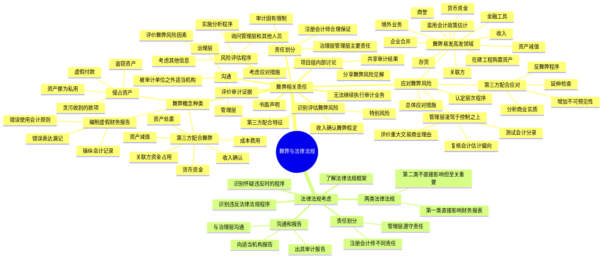

## 1. 章节定位

| 项目 | 信息 |
|------|------|
| 所属科目 | 审计 |
| 难度等级 | 4 |
| 历年分值 | 5-8 分 |
| 建议学时 | 6-8 小时 |
| 知识关联章节 | 第10章 销售与收款循环（收入舞弊）、第13章 货币资金审计（货币资金舞弊）、第15章 审计沟通（舞弊沟通）、第18章 其他特殊项目（关联方）、第20章 审计报告（舞弊对审计意见的影响） |

## 2. 考情分析

本章是审计科目的重要章节，历年分值约 5-8 分，主观题和客观题均有涉及。主观题常以简答题形式考查舞弊风险评估与应对、管理层凌驾于控制之上的程序、违反法律法规的沟通和报告；客观题则集中在舞弊的概念种类、舞弊三角、两类法律法规的区分、注册会计师的责任边界。

**命题规律**：舞弊是近年来命题热点，特别是随着第三方配合实施舞弊现象日益普遍，财政部发布《关于加大审计重点领域关注力度、控制审计风险、进一步有效识别财务舞弊的通知》（财会〔2022〕28号），对货币资金、存货、在建工程、资产减值、收入、境外业务、企业合并、商誉、金融工具、滥用会计政策、关联方等 11 个舞弊易发高发领域提出应对措施，是近年命题的重点方向。

**高频考点分布**：

1. **舞弊的概念和两类舞弊**：编制虚假财务报告导致的错报（三种方式）、侵占资产导致的错报（四种方式）。
2. **舞弊三角理论**：动机或压力、机会、借口三类风险因素。
3. **第三方配合实施舞弊**：六类主要领域（收入确认、成本费用、关联方资金占用和违规担保、货币资金、资产减值、资产处置）、第三方特征、应对措施（增加不可预见性、分析商业实质、反舞弊程序、延伸检查）。
4. **收入确认舞弊风险的假定**：注册会计师应当基于收入确认存在舞弊风险的假定评价哪些类型收入存在舞弊风险；不适用时须在工作底稿中记录理由。
5. **管理层凌驾于控制之上的风险**：三种应对程序——测试会计分录及其他调整、复核会计估计是否存在偏向、评价重大交易的商业理由。
6. **舞弊易发高发领域**：财会〔2022〕28号规定的 11 个领域的应对措施。
7. **无法继续执行审计业务**：三种异常情形、解除业务约定的措施。
8. **书面声明**：四项与舞弊相关的书面声明内容。
9. **舞弊的沟通**：与管理层、治理层、被审计单位之外适当机构的沟通要求。
10. **两类法律法规**：第一类（对财务报表有直接影响，注册会计师须获取充分适当审计证据）、第二类（无直接影响但遵守对经营活动至关重要，注册会计师仅实施特定程序）。
11. **违反法律法规的沟通和报告**：与治理层沟通、出具审计报告、向被审计单位之外适当机构报告。

**联动考查方式**：

- 与第10章销售与收款循环结合：收入确认舞弊风险的具体应对；
- 与第13章货币资金结合：货币资金舞弊的识别与应对；
- 与第18章其他特殊项目结合：关联方交易舞弊、会计估计舞弊；
- 与第20章审计报告结合：舞弊或违反法律法规对审计意见类型的影响。

**备考建议**：

- 牢记"舞弊导致的重大错报风险属于特别风险"这一核心定位；
- 区分两类舞弊（编制虚假财务报告 vs 侵占资产）的具体方式和风险因素；
- 掌握舞弊三角（动机/压力、机会、借口）的判断；
- 熟记管理层凌驾于控制之上的三种应对程序，这是简答题高频考点；
- 区分两类法律法规及注册会计师的不同责任；
- 关注收入确认舞弊风险的假定，理解"假定不适用须记录理由"的要求。

## 3. 知识框架

## 4. 核心精讲

### 4.1 舞弊的概念和种类

#### 4.1.1 舞弊的概念

舞弊是指被审计单位的管理层、治理层、员工或第三方使用欺骗手段获取不当或非法利益的故意行为。在财务报表审计中，注册会计师关注的是导致财务报表发生重大错报的舞弊。与财务报表审计相关的故意错报，包括编制虚假财务报告导致的错报和侵占资产导致的错报。

#### 4.1.2 编制虚假财务报告导致的错报

编制虚假财务报告涉及为欺骗财务报表使用者而作出的故意错报（包括对财务报表金额或披露的遗漏）。管理层可能通过以下方式编制虚假财务报告：

1. 对编制财务报表所依据的会计记录或支持性文件进行操纵、弄虚作假（包括伪造）或篡改；
2. 在财务报表中错误表达或故意漏记事项、交易或其他重要信息；
3. 故意地错误使用与金额、分类、列报或披露相关的会计原则。

#### 4.1.3 侵占资产导致的错报

侵占资产包括盗窃被审计单位资产，通常的做法是员工盗窃金额相对较小且不重要的资产。侵占资产也可能涉及管理层，管理层通常更能通过难以发现的手段掩饰或隐瞒侵占资产的行为。侵占资产可以通过以下方式实现：

1. 贪污收到的款项。例如，侵占收到的应收账款或将与已注销账户相关的收款转移至个人银行账户；
2. 盗窃实物资产或无形资产。例如，盗窃存货以自用或出售、盗窃废料以再销售、通过向被审计单位竞争者泄露技术资料与其串通以获取回报；
3. 使被审计单位对未收到的商品或未接受的劳务付款。例如，向虚构的供应商支付款项、供应商向采购人员提供回扣以作为其提高采购价格的回报、向虚构的员工支付工资；
4. 将被审计单位资产挪为私用。例如，将被审计单位资产作为个人或关联方贷款的抵押。

#### 4.1.4 第三方配合实施舞弊

在被审计单位实施舞弊时，可能存在第三方配合。相比被审计单位单独实施的舞弊，被审计单位在第三方配合下实施的舞弊更具隐蔽性和欺骗性，导致的重大错报未被注册会计师发现的风险更高。第三方配合实施财务舞弊的主要领域和常见手段包括：

| 领域 | 常见手段 |
|------|---------|
| 收入确认 | 第三方配合签订购销合同虚构收入、配合虚假销售涉及的存货实物交易单证票据和资金流转（资金闭环：被审计单位→过桥方→"客户"→被审计单位）、配合隐瞒"抽屉"协议、配合显失公允交易、构建不具有商业实质的贸易业务、配合高估履约进度 |
| 成本费用 | 虚增或虚减原材料采购单价套取资金、延迟或提前确认费用、第三方代为承担成本费用 |
| 关联方资金占用和违规担保 | 关联方直接占用资金、违规为关联方担保间接取得资金、通过虚增长期资产采购价格套取资金、通过投资私募基金后转出资金 |
| 货币资金 | 定期存款质押为关联方提供担保、现金管理账户协议实现资金归集、金融机构工作人员配合提供虚假回函 |
| 资产减值 | 第三方配合提供虚假订单支持高估未来现金流量、虚构交易实现资产终止确认避免计提减值 |
| 资产处置 | 第三方配合对资产进行虚假处置或虚增处置价格 |

### 4.2 治理层、管理层的责任与注册会计师的责任

#### 4.2.1 治理层、管理层的责任

被审计单位治理层和管理层对防止或发现舞弊负有主要责任。管理层在治理层的监督下，高度重视对舞弊的防范和遏制。对舞弊进行防范可以减少舞弊发生的机会；对舞弊进行遏制，即发现和惩罚舞弊行为，能够警示被审计单位人员不要实施舞弊。治理层的监督包括考虑管理层凌驾于控制之上或对财务报告过程施加其他不当影响的可能性。

#### 4.2.2 注册会计师的责任

对于注册会计师发现舞弊的责任，注册会计师职业界与社会公众之间存在期望差。注册会计师对于发现舞弊的责任可以从正反两个方面界定：

**正面责任**：在按照审计准则的规定执行审计工作时，注册会计师有责任对财务报表整体是否不存在舞弊或错误导致的重大错报获取合理保证。对可能导致财务报表产生重大错报的舞弊，无论是编制虚假财务报告，还是侵占资产，注册会计师均应当合理保证能够予以发现。注册会计师应当在整个审计过程中保持职业怀疑，认识到存在舞弊导致的重大错报的可能性，而不应受到以前对管理层、治理层正直和诚信形成的判断的影响，并认识到对发现错误有效的审计程序未必对发现舞弊有效。

**反面限制**：由于审计的固有限制，即使注册会计师按照审计准则的规定恰当计划和执行了审计工作，也不可避免地存在财务报表中的某些重大错报未被发现的风险。注册会计师不能对财务报表整体不存在重大错报获取绝对保证。

在舞弊导致错报的情况下，固有限制的潜在影响尤其重大。舞弊导致的重大错报未被发现的风险，大于错误导致的重大错报未被发现的风险。其原因是舞弊可能涉及精心策划和蓄意实施以进行隐瞒（如伪造证明或故意漏记交易），或者故意向注册会计师提供虚假陈述。如果涉及串通舞弊，注册会计师可能更加难以发现蓄意隐瞒的企图。

### 4.3 项目组内部的讨论

项目组成员之间应当进行讨论，并由项目合伙人确定将哪些事项向未参与讨论的项目组成员通报。项目组就舞弊导致财务报表发生重大错报的可能性进行的讨论可以达到以下目的：

1. 使经验较丰富的项目组成员有机会与其他成员分享关于财务报表易于发生舞弊导致的重大错报的方式和领域的见解；
2. 针对财务报表易于发生舞弊导致的重大错报的方式和领域考虑适当的应对措施，并确定分派哪些项目组成员实施特定的审计程序；
3. 确定如何在项目组成员中共享实施审计程序的结果，以及如何处理可能引起注册会计师关注的舞弊指控。

**在讨论过程中，项目组成员不应假定管理层和治理层是正直和诚信的。**

### 4.4 风险评估程序和相关活动

#### 4.4.1 询问

**询问对象**：注册会计师应当询问管理层和被审计单位内部的其他合适人员，以确定其是否知悉任何影响被审计单位的舞弊事实、舞弊嫌疑或舞弊指控。注册会计师可以就是否存在或可能存在舞弊，直接询问被审计单位内部除管理层以外的下列人员：

1. 不直接参与财务报告过程的业务人员；
2. 拥有不同级别权限的人员；
3. 参与生成、处理或记录复杂或异常交易的人员及对其进行监督的人员；
4. 内部法律顾问；
5. 负责道德事务的主管人员或承担类似职责的人员；
6. 负责处理舞弊指控的人员。

**询问内容**：注册会计师应当向管理层询问下列事项：管理层对财务报表可能存在舞弊导致的重大错报风险的评估；管理层对舞弊风险的识别和应对过程；管理层就其对舞弊风险的识别和应对过程向治理层的通报；管理层就其经营理念和道德观念向员工的通报。

除非治理层全部成员参与管理被审计单位，注册会计师应当了解治理层如何监督管理层对舞弊风险的识别和应对过程，并询问治理层是否知悉任何影响被审计单位的舞弊事实、舞弊嫌疑或舞弊指控。

#### 4.4.2 实施分析程序

注册会计师实施分析程序有助于识别异常的交易或事项，以及对财务报表产生影响的金额、比率和趋势。在实施分析程序以了解被审计单位及其环境等方面的情况时，注册会计师应当评价在实施分析程序时识别出的异常或偏离预期的关系（包括与收入账户有关的关系），是否表明存在舞弊导致的重大错报风险。

#### 4.4.3 评价舞弊风险因素

存在舞弊风险因素并不必然表明发生了舞弊，但在舞弊发生时通常存在舞弊风险因素。根据舞弊存在时通常伴随着的三种情况，这些风险因素可以分为以下三类，即"舞弊三角"：

| 风险因素 | 含义 |
|---------|------|
| 实施舞弊的动机或压力 | 舞弊者具有舞弊的动机是舞弊发生的首要条件。例如，高级管理人员的报酬与财务业绩或公司股票的市场表现挂钩、公司正在申请融资；控股股东融资需求迫切，股权质押风险突出 |
| 实施舞弊的机会 | 舞弊的机会一般源于内部控制在设计和运行上的缺陷。例如，公司对资产管理松懈，管理层能够凌驾于内部控制之上；控股股东凌驾于内部控制之上，个别客户、供应商、金融机构等配合控股股东资金占用 |
| 为舞弊行为寻找借口的能力 | 存在某种态度、性格或价值观念，使得管理层或员工能够作出不诚实的行为，或者管理层或员工所处的环境促使其能够将舞弊行为予以合理化。例如，侵占资产的员工可能认为单位对自身的待遇不公，编制虚假财务报告者可能认为造假不是出于个人私利而是出于公司集体利益 |

### 4.5 识别和评估舞弊导致的重大错报风险

舞弊导致的重大错报风险属于需要注册会计师特别考虑的重大错报风险，即**特别风险**。在识别和评估财务报表层次以及各类交易、账户余额、披露的认定层次的重大错报风险时，注册会计师应当识别和评估舞弊导致的重大错报风险。

**收入确认存在舞弊风险的假定**：在识别和评估舞弊导致的重大错报风险时，注册会计师应当基于收入确认存在舞弊风险的假定，评价哪些类型的收入、收入交易或认定导致舞弊风险。如果认为收入确认存在舞弊风险的假定不适用于业务的具体情况，从而未将收入确认作为舞弊导致的重大错报风险领域，注册会计师应当在审计工作底稿中记录得出该结论的理由。

**第三方配合实施财务舞弊的第三方特征**：当与被审计单位发生交易的第三方具有以下特征时，可能表明存在第三方配合实施财务舞弊的风险，注册会计师需要对此保持警觉：

1. 经营时间较短；
2. 缴纳社保人数较少；
3. 为个人或个体工商户；
4. 注册资本与交易规模不匹配；
5. 交易规模与第三方所处行业状况不匹配；
6. 经营范围与交易性质不匹配；
7. 注册地址与被审计单位地址较为接近；
8. 不同第三方（如客户和供应商）的工商登记信息相同或相近；
9. 既是客户又是供应商，或虽非同一客户和供应商，但受同一实际控制人控制；
10. 对被审计单位存在重大依赖；
11. 被审计单位向其销售的规模与其需求不匹配；
12. 在连续审计期间对常规审计程序配合度持续较高，均能提供正面审计证据；
13. 曾经配合其他方实施财务舞弊；
14. 法律意识淡薄，合规性较差；
15. 股东或关键管理人员与被审计单位或其相关人员存在特殊关系；
16. 存在实现特定目的的需求。

### 4.6 应对评估的舞弊导致的重大错报风险

#### 4.6.1 总体应对措施

在针对评估的舞弊导致的财务报表层次重大错报风险确定总体应对措施时，注册会计师应当：

1. 在分派和督导项目组成员时，考虑承担重要业务职责的项目组成员所具备的知识、技能和能力，并考虑舞弊导致的重大错报风险的评估结果；
2. 评价被审计单位对会计政策（特别是涉及主观计量和复杂交易的会计政策）的选择和运用，是否可能表明管理层通过操纵利润对财务信息作出虚假报告；
3. 在选择审计程序的性质、时间安排和范围时，增加审计程序的不可预见性。

#### 4.6.2 针对认定层次重大错报风险的审计程序

为应对评估的舞弊导致的认定层次重大错报风险，注册会计师可以采取的具体措施包括通过下列方式改变审计程序的性质、时间安排和范围：

1. **改变拟实施审计程序的性质**，以获取更可靠、相关的审计证据，或获取额外的佐证信息。例如，对特定资产进行实地观察或检查；设计询证函时增加交易日期、退货权、交货条款等销售协议的细节；向被审计单位的非财务人员询问销售协议和交货条款的变化；
2. **调整实施审计程序的时间安排**。例如，在期末或接近期末实施实质性程序；针对本期较早期间发生的交易或整个报告期内的交易实施实质性程序；
3. **调整实施审计程序的范围**。例如，扩大样本规模；在更详细的层次上实施分析程序；利用计算机辅助审计技术对电子交易和会计文档实施更广泛的测试。

#### 4.6.3 针对管理层凌驾于控制之上的风险实施的程序

管理层凌驾于控制之上的风险属于特别风险。无论对管理层凌驾于控制之上的风险的评估结果如何，注册会计师都应当设计和实施以下三类审计程序：

**（1）测试日常会计核算过程中作出的会计分录以及编制财务报表过程中作出的其他调整是否适当**

注册会计师应当：向参与财务报告过程的人员询问与处理会计分录和其他调整相关的不恰当或异常的活动；选择在报告期末作出的会计分录和其他调整；考虑是否有必要测试整个会计期间的会计分录和其他调整。

虚假会计分录或其他调整的常见特征包括：分录记录到不相关、异常或很少使用的账户；分录由平时不负责作出会计分录的人员作出；分录在期末或结账过程中编制，且没有或只有很少的解释或描述；分录在编制财务报表之前或编制过程中编制且没有账户编号；分录金额为约整数或尾数一致。

**（2）复核会计估计是否存在偏向，并评价产生这种偏向的环境是否表明存在舞弊导致的重大错报风险**

在复核会计估计是否存在偏向时，注册会计师应当：评价管理层作出会计估计时所作的判断和决策是否反映出管理层的某种偏向（即使判断和决策单独看起来是合理的），如果存在偏向，应当从整体上重新评价会计估计；追溯复核与以前年度财务报表反映的重大会计估计相关的管理层判断和假设。

**（3）评价重大交易的商业理由**

对于超出被审计单位正常经营过程的重大交易，或基于对被审计单位及其环境等方面情况的了解以及在审计过程中获取的其他信息而显得异常的重大交易，评价其商业理由（或缺乏商业理由）是否表明被审计单位从事交易的目的是为了对财务信息作出虚假报告或掩盖侵占资产的行为。

可能表明被审计单位从事异常重大交易的迹象包括：交易的形式显得过于复杂；管理层未与治理层就此类交易的性质和会计处理进行过讨论，且缺乏充分的记录；管理层更强调采用某种特定的会计处理的需要，而不是交易的经济实质；对于涉及不纳入合并范围的关联方的交易，治理层未进行适当的审核与批准；交易涉及以往未识别出的关联方，或涉及在没有被审计单位帮助的情况下不具备物质基础或财务能力完成交易的第三方。

#### 4.6.4 针对舞弊易发高发领域的重点应对措施

财政部发布的《关于加大审计重点领域关注力度、控制审计风险、进一步有效识别财务舞弊的通知》（财会〔2022〕28号）规定了 11 个舞弊易发高发领域的应对措施：

**（1）货币资金相关舞弊风险应对措施**

针对虚构货币资金风险：严格实施银行函证程序；关注货币资金真实性和巨额余额合理性；了解银行账户数量及分布；分析利息收入和财务费用合理性，关注"存贷双高"现象；关注大额境外资金。

针对大股东侵占货币资金风险：识别银行对账单中与实际控制人、控股股东或高级管理人员的大额资金往来；分析交易信息识别疑似关联方；关注期后货币资金重要账户的划转情况和资金受限情况；通过公开信息了解实际控制人、控股股东财务状况，检查大股东高比例股权质押情况。

针对虚构现金交易风险：结合行业特征评价现金交易合理性；计算月现金销售收款、现金采购付款占比；了解现金交易对方情况；检查大额现金收支追踪来源和去向；检查交易对象相关外部证据；检查是否存在洗钱等违法违规行为。

**（2）存货相关舞弊风险应对措施**

针对虚构存货风险：根据存货特点、盘存制度和内部控制设计和实施存货监盘程序；关注金额较大、占比较高、库龄较长、周转率低于同行业等情形的存货；严格实施分析性程序；对异地存放或由第三方保管或控制的存货，严格实施函证或异地监盘等程序。

针对账外存货风险：在其他资产审计中关注是否有转移资产形成账外存货；关注存货盘亏、报废的内部控制程序；存货监盘中关注存货的所有权及完整性；关注是否存在通过多结转成本、多报耗用数量、少报产成品入库等方式形成账外存货。

**（3）在建工程和购置资产相关舞弊风险应对措施**

针对利用在建工程掩盖舞弊风险：检查是否存在与企业整体生产经营规划不符或与预算不符的异常在建工程项目；检查是否存在非正常停工或长期未完工的工程项目。

针对通过购置固定资产实施舞弊风险：复核购置固定资产的理由及其合理性；检查采购合同、采购发票等判断固定资产计价准确性，关注是否存在混淆资本化和费用化支出来操纵利润；复核已入账固定资产的验收情况，观察固定资产是否确实存在。

**（4）资产减值相关舞弊风险应对措施**

针对不恰当计提减值准备人为调整资产账面价值：复核企业资产减值的测试过程和结果，评价管理层作出的与资产减值相关的重大判断和估计；对于持续存在减值迹象的资产，关注一次性大额计提减值的合理性。

针对不恰当计提坏账准备人为调整利润：复核企业对应收账款进行信用风险评估的相关考虑和客观证据；评价应收账款账龄与预期信用损失计算的合理性；检查应收账款的期后回款情况。

**（5）收入相关舞弊风险应对措施**

针对收入确认存在的舞弊风险因素：客观评价企业哪些类型的收入或收入认定可能存在重大舞弊风险；严格核查收入的交易背景；详细查阅是否存在股权激励等可能构成舞弊动机的事项；关注企业管理层变更后收入确认政策是否发生重大变化。

针对虚增或隐瞒收入舞弊风险：严格实施针对收入的分析程序；借助数据分析工具加强多维度分析；检查交易合同并综合运用函证、走访、实地调查等方法；将业务系统和财务系统纳入信息技术一般控制和信息处理控制进行评价和测试；分析收入确认政策的合规性。

针对提前或延迟确认收入舞弊风险：严格实施收入截止测试；检查临近期末执行的重要销售合同；复核重要合同的重要条款。

**（6）境外业务相关舞弊风险应对措施**

针对虚构境外经营风险：结合境外业务所在国家或地区的经济环境和企业自身发展情况，评价境外经营的合理性；检查境外业务供应链、交易流程、相关内部控制和财务报告编制流程。

针对虚构境外收入风险：分析境外销售毛利率是否存在异常；核查企业海关出口数据、出口退税金额、境外客户应收账款函证情况、物流运输记录、发货验收单据、出口信用保险数据等；检查企业汇兑损益的计算是否准确；关注境外业务的结算方式。

针对利用境外业务虚增虚构资产风险：对储存在境外银行的货币资金实施银行函证程序；对于源自境外客户的应收款项评估预期信用减值损失是否恰当；对于已通过海运或空运等方式发货但尚未到达海外客户的存货向货运公司函证；关注税收缴纳等特殊领域。

**（7）企业合并相关舞弊风险应对措施**

针对操纵合并范围实施舞弊风险：检查控制的判断依据；评估未纳入合并范围的子公司可能对财务会计报告整体产生的影响。

针对滥用企业合并实施舞弊风险：关注企业合并的商业实质；检查被合并企业的业绩真实性、财务数据合理性；关注被合并企业的内部控制情况。

**（8）商誉相关舞弊风险应对措施**

针对确认高额商誉风险：分析企业合并对价合理性、商誉金额的合理性；复核合并成本计量的准确性；检查企业是否以购买日公允价值重新确认和计量被购买方所有可辨认资产和负债。

针对商誉未被恰当分摊风险：评价管理层商誉分摊方法的恰当性；检查购买日后相关资产组或资产组组合发生了重组、处置等变化时是否对商誉进行重新分摊。

针对商誉减值测试过程风险：评价与管理层进行商誉减值测试相关的内部控制设计和运行有效性；复核管理层商誉减值测试方法的合理性及一致性；利用专家的工作。

针对商誉减值确认风险：复核企业以前年度商誉减值计提情况；关注企业是否存在与商誉有关的业绩承诺并分析其达标情况；检查商誉减值测试所依据的信息与管理层年度展望等相关信息的一致性。

**（9）金融工具相关舞弊风险应对措施**

针对金融工具分类和计量风险：检查金融工具分类的恰当性；检查金融工具计价的准确性。

针对金融工具终止确认风险：关注金融资产终止确认是否满足合同权利终止或满足规定的转移；关注金融负债现时义务是否解除、终止确认的时点是否恰当。

针对利用复杂金融产品实施舞弊风险：了解金融产品和服务的业务模式和盈利方式；关注是否存在"资金池"、刚性兑付、违规承诺收益或其他利用多层嵌套、通道业务等方式将表内信用风险表外化的迹象；关注保理业务的商业实质。

**（10）滥用会计政策和会计估计相关舞弊风险应对措施**

针对滥用会计政策和会计估计变更实施舞弊风险：结合企业经营状况充分了解变更会计政策和会计估计的意图及其合理性；评价会计政策和会计估计变更前后经营成果发生的重大变化。

针对混淆会计政策变更、会计估计变更和前期差错更正实施舞弊风险：关注是否正确划分会计政策变更、会计估计变更和前期差错更正，是否如实反映有关的交易和事项。

**（11）关联方相关舞弊风险应对措施**

针对通过未识别出或未披露的关联方实施舞弊风险：保持职业怀疑态度，关注交易金额重大、交易发生频次较少且交易时间集中、交易条件与其他对手方明显不同、交易规模和性质与对方的能力明显不匹配等不具有合理商业理由的交易；针对不具有合理商业理由的交易采取进一步审计程序。

针对通过关联方实施舞弊风险：加强关联交易舞弊风险的评估与控制；关注交易商业安排的合理性、资金资产交易的真实性、销售模式的合理性和公允性、关联交易金额上限的合规性等内部控制流程和控制措施的有效性。

#### 4.6.5 应对第三方配合实施财务舞弊的风险

**（1）增加审计程序的不可预见性**

在审计程序性质方面更加注重与审计目标的相关性；在时间安排方面考虑在不同于以往的时间实施审计程序，如突击检查被审计单位经销商的库存情况；在实施范围方面考虑扩大审计范围，必要时对总体进行测试而不是进行抽样测试。

**（2）重视分析交易的商业实质并取证**

如果识别出存在第三方配合实施财务舞弊的风险，注册会计师对于交易商业实质的分析需要更深入，并取得可靠的佐证信息。例如，被审计单位销售给某客户的产品数量大幅增加，管理层解释系该客户的下游客户需求激增，注册会计师就该信息询问了该客户并得到确认。但实际上，该客户配合被审计单位虚构了销售，并编造看似合理的商业理由瞒骗注册会计师。此时，注册会计师不应轻信于管理层和该客户的解释，而需要进一步获取佐证信息，如向该客户获取其下游客户的订单、对其下游客户进行实地走访等。

**（3）实施反舞弊程序**

如果识别出第三方配合被审计单位实施财务舞弊的风险，项目合伙人需要考虑亲自或委派专业能力较强的项目组成员更细致地设计和实施反舞弊程序，必要时增加反舞弊专家。"延伸检查"属于反舞弊程序，可以考虑实施的"延伸检查"程序以及其他反舞弊程序包括：

- **实地走访**：对被审计单位的交易对手（如客户、供应商）实施实地走访程序，包括观察走访对象的生产经营场所，以及对走访对象的相关人员实施询问程序。实施实地走访时可以考虑：选择多名或不同层级的人员访谈相同或类似问题进行相互印证；核实被询问人员是否与被审计单位存在特殊关系；对于被审计单位的客户，要求对被审计单位生产的产品实施观察、检查等程序；对于被审计单位的经销商客户，关注走访对象的库存量是否存在明显不合理；对于被审计单位的供应商，关注其产成品中是否有被审计单位采购的产品；
- **要求第三方就其向注册会计师提供的资料、信息以及作出的陈述的真实性和完整性进行承诺**；
- **采用跟函方式进行函证**，观察函证处理过程，评估回函可靠性。

**（4）会计师事务所内部的沟通与决策**

对于被评估确定为存在第三方配合实施财务舞弊风险的审计项目，会计师事务所需要考虑将该审计项目纳入高等级风险项目的管控范围，为项目组配备专业能力（包括反舞弊能力）较强的项目合伙人、项目组成员以及项目质量复核人员（如适用）。项目合伙人需要加强对项目组成员的督导，强调在执行审计工作整个过程中保持职业怀疑，并强化对审计项目的过程控制。

### 4.7 评价审计证据、无法继续执行审计业务与书面声明

#### 4.7.1 评价审计证据

在就财务报表与所了解的被审计单位的情况是否一致形成总体结论时，注册会计师应当评价在临近审计结束时实施的分析程序，是否表明存在此前尚未识别的舞弊导致的重大错报风险。涉及期末收入和利润的异常关系尤其值得关注。

如果识别出某项错报，注册会计师应当评价该项错报是否表明存在舞弊。如果存在舞弊的迹象，由于舞弊涉及实施舞弊的动机或压力、机会或借口，因此一个舞弊事项不太可能是孤立发生的事项，注册会计师应当评价该项错报对审计工作其他方面的影响，特别是对管理层声明可靠性的影响。

如果识别出某项错报，并有理由认为该项错报是或可能是舞弊导致的，且涉及管理层，特别是涉及较高层级的管理层，无论该项错报是否重大，注册会计师都应当重新评价对舞弊导致的重大错报风险的评估结果，以及该结果对旨在应对评估的风险的审计程序的性质、时间安排和范围的影响。

#### 4.7.2 无法继续执行审计业务

如果舞弊或舞弊嫌疑导致出现错报，致使注册会计师遇到对其继续执行审计业务的能力产生怀疑的异常情形，注册会计师应当：确定适用于具体情况的职业责任和法律责任，包括是否需要向审计业务委托人或监管机构报告；在相关法律法规允许的情况下，考虑是否需要解除业务约定。

注册会计师可能遇到的对其继续执行审计业务的能力产生怀疑的异常情形包括：

1. 被审计单位没有针对舞弊采取适当的、注册会计师根据具体情况认为必要的措施，即使该舞弊对财务报表并不重大；
2. 注册会计师对舞弊导致的重大错报风险的考虑以及实施审计测试的结果，表明存在重大且广泛的舞弊风险；
3. 注册会计师对管理层或治理层的胜任能力或诚信产生重大疑虑。

如果决定解除业务约定，注册会计师应当与适当层级的管理层和治理层讨论解除业务约定的决定和理由；考虑是否存在职业责任或法律责任，需要向审计业务委托人或监管机构报告解除业务约定的决定和理由。

#### 4.7.3 书面声明

注册会计师应当就下列事项向管理层和治理层（如适用）获取书面声明：

1. 管理层和治理层认可其设计、执行和维护内部控制以防止和发现舞弊的责任；
2. 管理层和治理层已向注册会计师披露了管理层对舞弊导致的财务报表重大错报风险的评估结果；
3. 管理层和治理层已向注册会计师披露了已知的涉及管理层、在内部控制中承担重要职责的员工以及其舞弊行为可能导致财务报表出现重大错报的其他人员的舞弊或舞弊嫌疑；
4. 管理层和治理层已向注册会计师披露了从现任和前任员工、分析师、监管机构等方面获知的、影响财务报表的舞弊指控或舞弊嫌疑。

#### 4.7.4 与管理层、治理层及被审计单位之外的适当机构的沟通

**与管理层的沟通**：当已获取的证据表明存在或可能存在舞弊时，除非法律法规禁止，注册会计师应当及时提请适当层级的管理层关注这一事项。即使该事项可能被认为不重要，注册会计师也应当这样做。通常情况下，适当层级的管理层至少要比涉嫌舞弊的人员高出一个级别。

**与治理层的沟通**：如果确定或怀疑舞弊涉及管理层、在内部控制中承担重要职责的员工以及其舞弊行为可能导致财务报表出现重大错报的其他人员，注册会计师应当及时就此类事项与治理层沟通，除非治理层全部成员参与管理被审计单位。

**与被审计单位之外的适当机构的沟通**：如果识别出舞弊或怀疑存在舞弊，注册会计师应当确定是否有责任向被审计单位以外的适当机构报告。

### 4.8 财务报表审计中对法律法规的考虑

#### 4.8.1 违反法律法规的概念

违反法律法规，是指被审计单位、治理层、管理层或者为被审计单位工作或受其指导的其他人，有意或无意违背除适用的财务报告编制基础以外的现行法律法规的行为。违反法律法规不包括与被审计单位经营活动无关的个人不当行为。

被审计单位需要遵守以下两类不同的法律法规：

| 类型 | 含义 | 举例 |
|------|------|------|
| 第一类 | 通常对决定财务报表中的重大金额和披露有直接影响的法律法规 | 税收和企业年金方面的法律法规 |
| 第二类 | 对决定财务报表中的金额和披露没有直接影响的其他法律法规，但遵守这些法律法规对被审计单位的经营活动、持续经营能力或避免大额罚款至关重要 | 经营许可条件、监管机构对偿债能力的规定或环境保护要求 |

#### 4.8.2 管理层遵守法律法规的责任与注册会计师的责任

**管理层的责任**：管理层有责任在治理层的监督下确保被审计单位的经营活动符合法律法规的规定。

**注册会计师的责任**：注册会计师有责任对财务报表整体不存在舞弊或错误导致的重大错报获取合理的保证。由于审计的固有限制，注册会计师没有责任防止被审计单位的违反法律法规行为，也不能期望其发现所有的违反法律法规行为。

针对两类不同的法律法规，注册会计师应当承担不同的责任：

1. 针对第一类法律法规，注册会计师的责任是就被审计单位遵守这些法律法规的规定获取充分、适当的审计证据；
2. 针对第二类法律法规，注册会计师的责任仅限于实施特定的审计程序，以有助于识别可能对财务报表产生重大影响的违反这些法律法规的行为。

#### 4.8.3 对被审计单位遵守法律法规的考虑

**了解法律法规框架**：注册会计师应当总体了解适用于被审计单位及其所处行业或领域的法律法规框架，以及被审计单位如何遵守这些法律法规框架。可以采取的措施包括：利用对被审计单位行业状况、监管环境以及其他外部因素的了解；更新对直接决定财务报表中的报告金额和列报的法律法规的了解；向管理层询问对被审计单位经营活动预期可能产生至关重要影响的其他法律法规；向管理层询问被审计单位制定的有关遵守法律法规的政策和程序；向管理层询问在识别、评价诉讼索赔并对其进行会计处理时采用的政策和程序。

**识别违反其他法律法规的行为的程序**：注册会计师应当实施下列审计程序，以有助于识别可能对财务报表产生重大影响的违反其他法律法规的行为：向管理层和治理层（如适用）询问被审计单位是否遵守了这些法律法规；检查被审计单位与许可证颁发机构或监管机构的往来函件。

#### 4.8.4 识别出或怀疑存在违反法律法规行为时实施的审计程序

**关注到相关信息时的审计程序**：如果注册会计师发现下列事项或相关信息，可能表明被审计单位存在违反法律法规行为：受到监管机构、政府部门的调查，或者支付罚金或受到处罚；向未指明的服务付款，或向顾问、关联方、员工或政府雇员提供贷款；与被审计单位或所处行业正常支付水平或实际收到的服务相比，支付过多的销售佣金或代理费用；采购价格显著高于或低于市场价格；异常的现金支付，以银行本票向持票人付款的方式采购；与在"避税天堂"注册的公司存在异常交易；向货物或服务原产地以外的国家或地区付款；在没有适当的交易控制记录的情况下付款；现有的信息系统不能提供适当的审计轨迹或充分的证据；交易未经授权或记录不当；负面的媒体评论。

如果关注到上述信息，注册会计师应当：了解违反法律法规行为的性质及其发生的环境；获取进一步的信息，以评价对财务报表可能产生的影响（包括识别出的或怀疑存在的违反法律法规行为对财务报表产生的潜在财务后果、潜在财务后果是否需要披露、潜在财务后果是否非常严重以致对财务报表的公允反映产生怀疑或导致财务报表产生误导）。

**怀疑存在违反法律法规行为时的审计程序**：如果怀疑被审计单位存在违反法律法规行为，注册会计师应当就此与适当层级的管理层和治理层（如适用）进行讨论。如果管理层或治理层不能向注册会计师提供充分的信息，注册会计师可以考虑向被审计单位内部或外部的法律顾问咨询。

#### 4.8.5 对识别出的或怀疑存在的违反法律法规行为的沟通和报告

**（1）与治理层沟通**

除非治理层全部成员参与管理被审计单位，注册会计师应当与治理层沟通审计过程中关注到的有关违反法律法规的事项（除非法律法规禁止），但不必沟通明显不重要的事项。沟通通常采用书面形式，注册会计师将文件副本作为审计工作底稿。

**违反法规行为情节严重时的沟通要求**：

- 对故意和重大的违反法律法规行为：如果根据判断认为需要沟通的违反法律法规行为是故意和重大的，注册会计师应当尽快与治理层沟通；
- 怀疑违反法律法规行为涉及管理层或治理层：注册会计师应当向被审计单位审计委员会或监事会等更高层级的机构通报。如果不存在更高层级的机构，或者注册会计师认为被审计单位可能不会对通报作出反应，或者注册会计师不能确定向谁报告，注册会计师应当考虑是否需要向外部监管机构（如有）报告或征询法律意见。

**（2）出具审计报告**

考虑违反法律法规行为的影响：如果认为识别出的或怀疑存在的违反法律法规行为对财务报表具有重大影响，注册会计师应当要求被审计单位在财务报表中予以恰当反映。如果认为对财务报表具有重大影响，且未能在财务报表中得到恰当反映，注册会计师应当出具保留意见或否定意见的审计报告。

考虑审计范围受到限制的影响：来自被审计单位的限制，如果因管理层或治理层阻挠而无法获取充分、适当的审计证据，注册会计师应当根据审计范围受到限制的程度，发表保留意见或无法表示意见；其他方面的限制，注册会计师应当评价这一情况对审计意见的影响。

**（3）向被审计单位之外的适当机构报告**

如果识别出或怀疑存在违反法律法规行为，注册会计师应当考虑是否有责任向被审计单位以外的适当机构报告。注册会计师考虑是否报告的是经注册会计师发现和确定的严重违反法律法规的行为。所谓"严重"主要是指有重大法律后果或涉及社会公众利益。

## 5. 典型例题

**【例题 1】（管理层凌驾于控制之上的应对程序）**

ABC 会计师事务所审计甲公司 2×24 年度财务报表，识别出管理层凌驾于控制之上的风险。审计项目组实施了以下程序：

（1）向参与财务报告过程的人员询问与处理会计分录相关的不恰当或异常活动；

（2）选择在报告期末作出的会计分录和其他调整进行测试；

（3）评价管理层作出会计估计时所作的判断和决策是否反映出管理层的某种偏向；

（4）对于超出被审计单位正常经营过程的重大交易，评价其商业理由是否表明存在对财务信息作出虚假报告的目的。

要求：说明上述程序是否恰当，并简要说明针对管理层凌驾于控制之上的风险注册会计师应当实施哪些程序。

**答案**：

上述程序均恰当。针对管理层凌驾于控制之上的风险（属于特别风险），无论对管理层凌驾于控制之上的风险的评估结果如何，注册会计师都应当设计和实施以下三类审计程序：

1. 测试日常会计核算过程中作出的会计分录以及编制财务报表过程中作出的其他调整是否适当。包括：（1）向参与财务报告过程的人员询问与处理会计分录和其他调整相关的不恰当或异常的活动；（2）选择在报告期末作出的会计分录和其他调整；（3）考虑是否有必要测试整个会计期间的会计分录和其他调整。程序（1）和（2）属于此类。

2. 复核会计估计是否存在偏向，并评价产生这种偏向的环境是否表明存在舞弊导致的重大错报风险。包括：评价管理层作出会计估计时所作的判断和决策是否反映出管理层的某种偏向（即使判断和决策单独看起来是合理的），如果存在偏向，应当从整体上重新评价会计估计；追溯复核与以前年度财务报表反映的重大会计估计相关的管理层判断和假设。程序（3）属于此类。

3. 对于超出被审计单位正常经营过程的重大交易，或基于对被审计单位及其环境等方面情况的了解以及在审计过程中获取的其他信息而显得异常的重大交易，评价其商业理由（或缺乏商业理由）是否表明被审计单位从事交易的目的是为了对财务信息作出虚假报告或掩盖侵占资产的行为。程序（4）属于此类。

**解析**：管理层凌驾于控制之上的风险属于特别风险，无论评估结果如何都应当实施三类程序，这是简答题高频考点。三类程序可简记为"测试分录、复核估计偏向、评价重大交易商业理由"。

**【例题 2】（收入确认舞弊风险的假定）**

审计项目组在对乙公司 2×24 年度财务报表进行审计时，识别出以下情况：

（1）乙公司主要从事传统制造业，收入确认政策为在客户取得商品控制权时点确认收入，审计项目组认为乙公司收入确认不存在舞弊风险，未将收入确认作为舞弊导致的重大错报风险领域，但未在审计工作底稿中记录理由。

（2）审计项目组在评价乙公司收入确认舞弊风险时，未区分哪些类型的收入或收入认定可能导致舞弊风险，直接将全部收入确认为舞弊风险领域。

要求：分别判断审计项目组的做法是否恰当，并简要说明理由。

**答案**：

（1）不恰当。审计准则规定，在识别和评估舞弊导致的重大错报风险时，注册会计师应当基于收入确认存在舞弊风险的假定，评价哪些类型的收入、收入交易或认定导致舞弊风险。如果认为收入确认存在舞弊风险的假定不适用于业务的具体情况，从而未将收入确认作为舞弊导致的重大错报风险领域，注册会计师应当在审计工作底稿中记录得出该结论的理由。审计项目组未在审计工作底稿中记录理由，违反了审计准则的要求。

（2）不恰当。审计准则要求注册会计师基于收入确认存在舞弊风险的假定，评价"哪些类型的收入、收入交易或认定"导致舞弊风险，即需要进行具体的识别和评价，而不是直接将全部收入确认为舞弊风险领域。审计项目组应当根据对被审计单位及其环境的了解，分析不同类型收入、不同收入交易、不同认定层次的舞弊风险，从而有针对性地设计和实施应对程序。

**解析**：收入确认舞弊风险的假定是高频考点。注意三点：一是"应当基于假定"，二是"评价哪些类型"，三是"不适用须记录理由"。

**【例题 3】（违反法律法规的沟通与报告）**

审计项目组在对丙公司 2×24 年度财务报表进行审计时，发现以下情况：

（1）丙公司因排放超标受到环保部门调查，可能面临重大罚款，但丙公司管理层未在财务报表中披露该事项。审计项目组认为该事项对财务报表具有重大影响，要求丙公司在财务报表中予以恰当反映。

（2）经进一步调查，审计项目组怀疑丙公司总经理（管理层）知情并授意了违规排放行为。

（3）丙公司未设立审计委员会或监事会。

要求：分别说明审计项目组针对上述情况应采取的沟通和报告措施。

**答案**：

（1）如果认为识别出的或怀疑存在的违反法律法规行为对财务报表具有重大影响，注册会计师应当要求被审计单位在财务报表中予以恰当反映。如果认为对财务报表具有重大影响，且未能在财务报表中得到恰当反映，注册会计师应当出具保留意见或否定意见的审计报告。本例中，丙公司管理层未在财务报表中披露该事项，如果丙公司拒绝在财务报表中予以恰当反映，审计项目组应当出具保留意见或否定意见的审计报告。

（2）如果怀疑违反法律法规行为涉及管理层，注册会计师应当向被审计单位审计委员会或监事会等更高层级的机构通报。如果不存在更高层级的机构，或者注册会计师认为被审计单位可能不会对通报作出反应，或者注册会计师不能确定向谁报告，注册会计师应当考虑是否需要向外部监管机构（如有）报告或征询法律意见。本例中，怀疑涉及总经理（管理层），审计项目组应当向更高层级的机构通报。

（3）丙公司未设立审计委员会或监事会，即不存在更高层级的机构。审计项目组应当考虑是否需要向外部监管机构（如有）报告或征询法律意见。同时，除非治理层全部成员参与管理被审计单位，注册会计师应当与治理层沟通审计过程中关注到的有关违反法律法规的事项（除非法律法规禁止），但不必沟通明显不重要的事项。由于该事项属于故意和重大的违反法律法规行为，注册会计师应当尽快与治理层沟通。

**解析**：违反法律法规的沟通和报告是简答题高频考点。注意区分：第一类违反（涉及管理层/治理层）须向审计委员会或监事会等更高层级机构通报；第二类无更高层级机构时考虑向外部监管机构报告或征询法律意见；对财务报表有重大影响未恰当反映的出具保留或否定意见。

## 6. 记忆口诀

**两类舞弊**："虚假报告三方式，侵占资产四方式"——虚假报告：操纵记录、错误表达漏记、错误使用会计原则；侵占资产：贪污款项、盗窃资产、虚假付款、资产挪私用。

**舞弊三角**："动机压力、机会、借口"——三类风险因素同时存在通常表明舞弊风险。

**舞弊风险属特别风险**："舞弊导致重大错报风险是特别风险"——需要特别考虑，无论评估结果如何，管理层凌驾于控制之上的风险都要实施三类程序。

**收入确认舞弊假定**："应当基于假定评价哪些类型，不适用须记录理由"——审计准则的硬性要求。

**管理层凌驾三程序**："测试分录、复核估计偏向、评价重大交易商业理由"——必考简答题。

**虚假分录五特征**："异常账户、非常人员、期末无说明、无账户编号、约整数尾数一致"——识别虚假会计分录的典型特征。

**第三方配合六领域**："收入成本资金占用货币资金资产减值资产处置"——第三方配合实施财务舞弊的主要领域。

**第三方特征十六项**："经营短社保少个体户资本不匹配规模不匹配经营范围不匹配地址接近信息相同既是客户又是供应商依赖大销售超需求配合度高曾舞弊合规差特殊关系特定目的"——识别第三方配合舞弊的第三方特征。

**第三方配合四应对**："不可预见性、商业实质、反舞弊程序、内部沟通决策"——四类应对措施。

**延伸检查内容**："实地走访、第三方承诺、跟函观察"——三类延伸检查程序。

**11 个舞弊易发高发领域**："货币资金存货在建工程资产减值收入境外业务企业合并商誉金融工具会计政策关联方"——财会〔2022〕28号规定的 11 个领域。

**两类法律法规**："第一类直接影响须获证据，第二类不直接影响仅实施特定程序"——注册会计师的责任不同。

**违反法规沟通三层级**："管理层沟通、治理层沟通、适当机构报告"——沟通的三个层级。

**故意重大违反**："尽快与治理层沟通"——故意和重大的违反法律法规行为的沟通要求。

**涉及管理层违反**："向审计委员会或监事会等更高层级机构通报"——怀疑违反涉及管理层或治理层时的沟通要求。

**审计意见影响**："重大影响未恰当反映出保留或否定，范围受限出保留或无法表示"——违反法律法规对审计意见的影响。

**四项书面声明**："认可内控责任、披露风险评估、披露已知舞弊、披露舞弊指控"——舞弊相关的四项书面声明内容。

**项目组讨论铁律**："不应假定管理层治理层正直诚信"——讨论过程中必须保持的职业怀疑态度。

## 7. 同步练习

**271.（单选题）** 下列各项中，属于舞弊发生的首要条件的是（　）。

A. 实施舞弊的动机或压力
B. 实施舞弊的机会
C. 为舞弊行为寻找借口的能力
D. 治理层和管理层对舞弊行为的态度

**272.（单选题）** 在评估舞弊导致的重大错报风险时，如果注册会计师注意到客户存在下列情况时，应当着重考虑该客户编制虚假财务报告导致的错报的风险大大增加的是（　）。

A. 存在大额现金被经手或处理的情形
B. 不相容职务的分离不充分，或独立审核不力
C. 对审计工作的完成或审计报告的出具提出不合理的时间限制
D. 对高层管理人员的差旅费、业务招待费等财务支出审查薄弱

**273.（单选题）** 下列关于舞弊导致的重大错报风险的表述中，错误的是（　）。

A. 编制虚假财务报告导致的重大错报风险，大于侵占资产导致的重大错报风险
B. 舞弊导致的重大错报未被发现的风险，大于错误导致的重大错报未被发现的风险
C. 所有被审计单位都可能存在管理层凌驾于控制之上的风险
D. 收入确认存在舞弊风险的假定可能不适用于所有审计项目

**274.（单选题）** 当怀疑被审计单位存在违反法律法规行为时，下列各项审计程序中，通常不能为注册会计师提供额外审计证据的是（　）。

A. 获取被审计单位管理层的书面声明
B. 与被审计单位治理层讨论
C. 向被审计单位内部法律顾问咨询
D. 向会计师事务所的法律顾问咨询

**275.（单选题）** 下列有关项目组内部讨论的说法中，错误的是（　）。

A. 安排经验较丰富的项目组成员（如项目合伙人）参与项目组内部的讨论，其他成员可以分享其见解和以往获取的被审计单位的经验
B. 讨论的内容和范围不受项目组成员的职位的影响
C. 项目组成员可以交流与被审计单位面临的经营风险、财务报表容易发生错报的领域以及发生错报的方式相关的信息
D. 项目合伙人应当确定向未参与讨论的项目组成员通报哪些事项

**276.（单选题）** 下列舞弊风险因素中，与侵占资产相关的是（　）。

A. 利用商业中介进行交易，但缺乏明显的商业理由
B. 在非所有者管理的主体中，管理层由一人或少数人控制，且缺乏补偿性控制
C. 会计系统和信息系统无效
D. 对高级管理人员支出的监督不足

**277.（单选题）** 下列舞弊风险因素中，与实施舞弊的动机或压力有关的是（　）。

A. 组织结构过于复杂，存在异常的法律实体或管理层级
B. 非财务管理人员过度参与会计政策的选择或重大会计估计的确定
C. 管理层在被审计单位中拥有重大经济利益
D. 职责分离或独立审核不充分

**278.（单选题）** 下列审计程序中，通常无法识别被审计单位违反法律法规行为的是（　）。

A. 阅读董事会和管理层的会议纪要
B. 向管理层、内部或外部法律顾问询问诉讼、索赔及评估情况
C. 对营业外支出中的罚款及滞纳金支出实施细节测试
D. 获取管理层关于被审计单位不存在违反法律法规行为的书面声明

**279.（单选题）** 下列有关违反法规行为的说法中，错误的是（　）。

A. 防止和发现违反法规行为是注册会计师的责任
B. 如果没有证据表明被审计单位存在违反法规行为，注册会计师可推定被审计单位遵守了相关法律法规
C. 如果治理层已获知管理层的违反法规行为，注册会计师可以不再与其进行沟通，但必须获取治理层已经获知该违反法规行为的有关审计证据
D. 如果认为违反法规行为是故意和重大的，注册会计师应当就发现的情况尽快与治理层沟通

**280.（单选题）** 注册会计师应当针对评估的舞弊导致的财务报表层次重大错报风险确定总体应对措施。下列各项措施中错误的是（　）。

A. 评价被审计单位对会计政策的选择和运用，是否可能表明管理层通过操纵利润对财务信息做出虚假报告
B. 在分派和督导项目组成员时，考虑承担重要业务职责的项目组成员所具备的知识、技能和能力，并考虑舞弊导致的重大错报风险的评估结果
C. 修改财务报表整体的重要性
D. 在选择审计程序的性质、时间安排和范围时，增加审计程序的不可预见性

**281.（单选题）** 针对提前或延迟确认收入舞弊风险，注册会计师的下列做法中，错误的是（　）。

A. 严格实施收入截止测试，关注收入是否被计入恰当的期间
B. 检查临近期末执行的重要销售合同，关注是否存在异常条款，关注期后是否存在退货以及改变或撤销合同条款的情况
C. 分析收入确认政策的合规性，关注是否存在不恰当地以总额法代替净额法核算等情形
D. 复核重要合同的重要条款，关注是否存在高估履约进度的情况

**282.（单选题）** 当被审计单位存在违反法律法规行为时，注册会计师的处理错误的是（　）。

A. 如果被审计单位存在的违反法律法规行为对财务报表具有重大影响，且未能在财务报表中得到恰当反映，注册会计师应当出具否定意见的审计报告
B. 被审计单位财务报表中恰当披露违反法律法规行为，注册会计师出具无保留意见的审计报告
C. 因管理层阻挠而无法获取充分、适当的审计证据以评价是否存在对财务报表产生重大影响的违反法律法规行为，注册会计师应当发表保留或无法表示意见的审计报告
D. 当识别出存在违反法律法规行为，注册会计师应当考虑是否有责任向被审计单位以外的适当机构报告

**283.（单选题）** 下列与舞弊责任相关的表述中恰当的是（　）。

A. 注册会计师对防止和发现被审计单位的舞弊行为负有主要责任
B. 注册会计师没有责任防止舞弊发生，但是有责任发现所有的舞弊
C. 注册会计师既没有责任防止舞弊发生，也没有责任发现舞弊行为
D. 注册会计师有责任对财务报表整体是否不存在舞弊或错误导致的重大错报获取合理保证

**284.（单选题）** 下列有关财务报表审计中对法律法规的考虑的说法中，错误的是（　）。

A. 注册会计师有责任实施特定的审计程序，以识别和应对可能对财务报表产生重大影响的违反法律法规行为
B. 注册会计师没有责任防止被审计单位违反法律法规
C. 如果被审计单位存在对财务报表有重大影响的违反法律法规行为，且未能在财务报表中得到充分反映，注册会计师应发表保留意见或否定意见
D. 注册会计师通常采用书面形式与被审计单位治理层沟通审计过程中注意到的有关违反法律法规的事项

**285.（单选题）**（2024年）如果已获取的证据表明可能存在舞弊，关于注册会计师与管理层、治理层和被审计单位以外的适当机构沟通的说法中正确的是（　）。

A. 如果认为该事项重大，除非法律法规禁止，应及时与最高层级的管理层沟通
B. 如果认为该事项涉及管理层，除非治理层全部成员参与管理被审计单位或法律法规禁止，应及时与治理层沟通
C. 除非法律法规禁止，应向被审计单位以外的适当机构报告
D. 如果认为该事项不重大，则无需与管理层沟通

**286.（单选题）**（2023年）在执行财务报表审计时，下列有关注册会计师对法律法规考虑的说法中，正确的是（　）。

A. 如果认为识别出的或怀疑存在的违反法律法规行为对财务报表具有重大影响，且未能在财务报表中得到恰当反映，注册会计师应当发表保留意见或无法表示意见
B. 除非法律法规禁止，注册会计师应当与治理层沟通审计过程中关注到的违反法律法规行为，但不必沟通明显不重要的事项
C. 某些法律法规对财务报表没有直接影响，但对经营活动至关重要，注册会计师有责任就被审计单位遵守这些法律法规获取充分、适当的审计证据
D. 违反法律法规是指被审计单位、治理层、管理层或为被审计单位工作或受其指导的其他人，有意或无意违背现行法规的行为

**287.（单选题）** 下列评估舞弊风险的说法中，正确的是（　）。

A. 注册会计师通过询问管理层可以获取有关管理层舞弊导致的财务报表层次重大错报风险的有用信息
B. 注册会计师应当评价通过风险评估程序和相关活动获得的信息是否表明存在舞弊风险因素
C. 存在舞弊风险因素必然表明发生了舞弊
D. 管理层未能及时纠正发现的值得关注的内部控制缺陷，属于舞弊发生的机会

**288.（多选题）** 在对编制虚假财务报告导致的错报的舞弊风险因素中，下列可能提供了管理层实施舞弊的便利机会的有（　）。

A. 被审计单位正在与外部独立第三方进行重大资产重组交易
B. 被审计单位大量通过代理商开展市场销售
C. 管理层拥有被审计单位10%股权
D. 被审计单位连续多年在所从事行业中占有重大份额

**289.（多选题）** 下列有关项目组内部就舞弊进行讨论的说法中，正确的有（　）。

A. 项目组内部讨论的内容可以包括可能表明管理层操纵利润的迹象
B. 项目组内部讨论的内容可以包括管理层凌驾于控制之上的风险
C. 应当由项目合伙人确定将哪些事项向未参与讨论的项目组成员通报
D. 在讨论过程中，项目组成员不应假定管理层和治理层是正直和诚信的

**290.（多选题）** 如果怀疑违反法律法规行为涉及管理层或治理层，注册会计师可能需要向外部监管机构（如有）报告或征询法律意见的情形有（　）。

A. 不存在更高层级的机构
B. 注册会计师认为被审计单位可能不会对通报作反应
C. 注册会计师不能确定向谁报告
D. 被审计单位对收到的通报每周进行处理并公示

**291.（多选题）** 下列各项中，属于注册会计师针对虚增或隐瞒收入舞弊风险而采取的措施有（　）。

A. 严格执行针对收入的分析程序，关注报告期毛利率明显异常或毛利率波动较大、经营活动现金流量与收入不匹配等情况
B. 分析收入确认政策的合规性，关注是否存在不恰当地以总额法代替净额法核算等情形
C. 检查交易合同，并综合运用函证、走访、实地调查等方法，关注商业背景的真实性、资金资产交易的真实性、销售模式的合理性和交易价格的公允性等
D. 评价应收账款账龄与预期信用损失计算的合理性，复核计提坏账准备的准确性，检查计提方法是否按照坏账政策执行

**292.（多选题）** 为应对管理层凌驾于控制之上的风险，下列各项审计程序中，注册会计师应当实施的有（　）。

A. 确认重大关联方交易是否得到适当授权
B. 测试编制财务报表过程中作出的会计分录和其他调整是否适当
C. 评价超出被审计单位正常经营过程的重大交易的商业理由
D. 复核会计估计是否存在偏向

**293.（多选题）** 由于舞弊的性质以及注册会计师在发现舞弊导致的财务报表重大错报时遇到的困难，注册会计师向管理层和治理层（如适用）获取书面声明，确认其已向注册会计师披露了下列信息是非常重要的。下列属于披露的信息的有（　）。

A. 管理层对财务报表可能存在舞弊导致的重大错报风险的评估结果
B. 对影响被审计单位的舞弊事实、舞弊嫌疑或舞弊指控的了解程度
C. 管理层和治理层已向注册会计师披露了从现任和前任员工、分析师、监管机构等方面获知的、影响财务报表的舞弊指控或舞弊嫌疑
D. 考虑是否存在职业责任或法律责任

**294.（多选题）** 下列各项中，通常对决定财务报表中的重大金额和披露有直接影响的法律法规的有（　）。

A. 税收方面的法律法规
B. 企业年金方面的法律法规
C. 经营许可条件
D. 监管机构对环境保护的要求

**295.（多选题）** 针对管理层凌驾于控制之上的风险，在识别和选择拟测试的会计分录和其他调整，并针对已选择项目的支持性文件确定适当的测试方法时，注册会计师可以考虑的因素有（　）。

A. 对由于舞弊导致的重大错报风险的评估
B. 对会计分录和其他调整已实施的控制
C. 虚假会计分录或其他调整的特征
D. 账户的性质和复杂程度

**296.（多选题）** 下列各项中，注册会计师可能对继续执行审计业务的能力产生怀疑的有（　）。

A. 对被审计单位治理层的胜任能力存有重大疑虑
B. 对被审计单位管理层的诚信存有重大疑虑
C. 被审计单位没有针对舞弊和侵占资产设置相关的控制
D. 注册会计师在审计过程中发现重大且广泛的舞弊

**297.（多选题）**（2024年）下列各项中，属于注册会计师为识别舞弊风险而应向治理层询问的有（　）。

A. 治理层是否就其经营理念和道德观念向员工通报
B. 治理层是否知悉任何影响被审计单位的舞弊事实、舞弊嫌疑或舞弊指控
C. 治理层如何监督管理层对舞弊风险的识别和应对过程
D. 治理层如何监督管理层降低舞弊风险而建立的内部控制

**298.（多选题）**（2023年）下列各项中，属于注册会计师为应对舞弊导致的财务报表层次的重大错报风险而应当实施的措施有（　）。

A. 在分派项目组成员时，考虑承担重要业务职责的项目组成员所具备的知识、技能和能力
B. 采用综合性方案以应对舞弊导致的重大错报风险
C. 评价被审计单位对会计政策的选择和运用是否可能表明管理层通过操纵利润对财务信息作出虚假报告
D. 增加审计程序的不可预见性

---

**练习答案**：

**单选题**：271.A（舞弊者具有舞弊的动机或压力是舞弊发生的首要条件）　272.C（C 表明管理层与现任或前任注册会计师之间关系紧张，属于编制虚假财务报告中的态度或借口因素；A、B、D 提示与侵占资产相关的舞弊风险）　273.A（编制虚假财务报告导致的重大错报风险并不必然大于侵占资产导致的重大错报风险，风险高低与具体情况相关）　274.A（书面声明本身不能为所涉及事项提供充分、适当的审计证据）　275.B（讨论的内容和范围受项目组成员职位、经验和所需要的信息的影响）　276.D（A、B、C 属于与编制虚假财务报告相关的舞弊风险因素）　277.C（管理层在被审计单位中拥有重大经济利益属于实施舞弊的动机或压力因素）　278.D（书面声明本身不能提供额外审计证据，无法识别违反法律法规行为）　279.A（防止和发现违反法规行为是被审计单位管理层的责任）　280.C（修改财务报表整体的重要性不属于应对舞弊导致的财务报表层次重大错报风险的总体应对措施）　281.C（C 属于针对虚增或隐瞒收入舞弊风险的应对措施，对提前或延迟确认收入无针对性）　282.A（未恰当反映时应出具保留意见或否定意见，而非仅否定意见）　283.D（注册会计师有责任对财务报表整体是否不存在舞弊或错误导致的重大错报获取合理保证）　284.A（注册会计师的责任仅限于实施特定的审计程序，以有助于识别可能对财务报表产生重大影响的违反法律法规行为，而非识别和应对）　285.B（如果认为该事项涉及管理层，除非治理层全部成员参与管理被审计单位或法律法规禁止，应及时与治理层沟通）　286.B（除非法律法规禁止，注册会计师应当与治理层沟通审计过程中关注到的违反法律法规行为，但不必沟通明显不重要的事项）　287.B（注册会计师应当评价通过风险评估程序和相关活动获得的信息是否表明存在舞弊风险因素）

**多选题**：288.ABD（C 管理层拥有被审计单位股权不属于提供舞弊便利机会的情形）　289.ABCD　290.ABC（D 被审计单位对收到的通报每周进行处理并公示，不属于需要向外部监管机构报告的情形）　291.ABC（D 属于针对通过不恰当计提坏账准备人为调整利润的舞弊风险而采取的措施）　292.BCD（管理层凌驾于控制之上的风险属于特别风险，无论评估结果如何均应测试会计分录和其他调整、复核会计估计偏向、评价异常重大交易的商业理由）　293.AB（C 属于书面声明的其他内容，不属于披露的信息）　294.AB（C、D 属于对决定财务报表金额和披露没有直接影响的第二类法律法规）　295.ABCD　296.ABCD　297.BCD（向治理层询问识别舞弊风险的内容包括治理层是否知悉舞弊事实、如何监督管理层对舞弊风险的识别和应对、如何监督管理层降低舞弊风险而建立的内部控制等）　298.ACD（B 采用综合性方案不属于针对舞弊导致的财务报表层次重大错报风险的总体应对措施）
