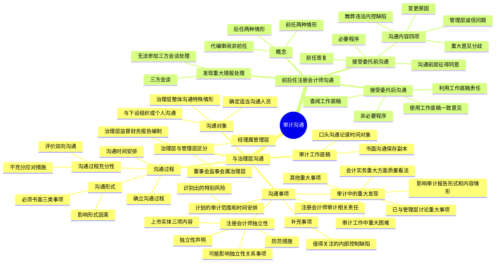

## 1. 章节定位

| 项目 | 信息 |
|------|------|
| 所属科目 | 审计 |
| 难度等级 | 3 |
| 历年分值 | 3-6 分 |
| 建议学时 | 3-5 小时 |
| 知识关联章节 | 第14章 舞弊与法律法规（舞弊沟通）、第18章 其他特殊项目（关联方沟通）、第19章 完成审计工作（总结性讨论）、第20章 审计报告（关键审计事项沟通）、第24章 质量管理（独立性） |

## 2. 考情分析

本章属于审计科目的中等权重章节，历年分值约 3-6 分。客观题主要考查沟通对象、沟通事项、沟通形式、前后任注册会计师沟通的要求和内容；主观题常以简答题形式考查与治理层沟通的事项、值得关注的内部控制缺陷的书面沟通、前后任注册会计师沟通的核心要求。

**命题规律**：本章内容相对清晰，命题点相对集中。与治理层沟通的事项是高频考点，特别是注册会计师的独立性沟通、值得关注的内部控制缺陷的书面沟通、审计中遇到的重大困难。前后任注册会计师沟通部分，"接受委托前的沟通是必要程序、接受委托后的沟通非必要程序"是核心区分点，购买审计意见的识别与应对也是高频考点。

**高频考点分布**：

1. **治理层与管理层的区分**：董事会和监事会属于治理层，经理属于管理层；治理层对财务报告编制过程负有监督职责。
2. **沟通对象**：确定适当沟通人员的考虑因素、与治理层下设组织或个人沟通的考虑因素、需要与治理层整体沟通的特殊情形（治理层全部成员参与管理）。
3. **沟通的事项**：注册会计师与财务报表审计相关的责任、计划的审计范围和时间安排（包括识别出的特别风险）、审计中的重大发现（会计实务重大方面质量的看法、审计工作中遇到的重大困难、已与管理层讨论或需要书面沟通的重大事项、影响审计报告形式和内容的情形、其他重大事项）、注册会计师的独立性（仅适用于上市实体）、补充事项（值得关注的内部控制缺陷）。
4. **值得关注的内部控制缺陷**：定义、书面沟通要求、书面沟通文件内容。
5. **沟通的形式**：必须采用书面形式的事项（审计中发现的重大问题如口头不适当、独立性、值得关注的内部控制缺陷）、影响沟通形式的因素。
6. **沟通的时间安排**：不同事项的沟通时点。
7. **沟通过程的充分性**：评价双向沟通是否充分、沟通不充分的应对措施。
8. **审计工作底稿**：口头沟通和书面沟通的记录要求。
9. **前后任注册会计师的概念**：两种情形（已对上期财务报表发表审计意见、接受委托但未完成审计工作）；上期财务报表仅经过代编或审阅的注册会计师不能视为前任注册会计师。
10. **接受委托前的沟通**：必要程序、沟通前提（征得被审计单位同意）、沟通内容（四项）、前任注册会计师的答复。
11. **接受委托后的沟通**：非必要程序、查阅工作底稿的前提和内容。
12. **发现前任注册会计师审计的财务报表可能存在重大错报时的处理**：三方会谈。

**联动考查方式**：

- 与第14章舞弊结合：舞弊涉及的沟通要求；
- 与第18章关联方结合：识别出的关联方应与治理层沟通；
- 与第19章完成审计工作结合：审计完成阶段的总结性讨论；
- 与第20章审计报告结合：关键审计事项、非无保留意见的沟通；
- 与第24章质量管理结合：独立性的沟通。

**备考建议**：

- 牢记"治理层对财务报告编制过程负有监督职责"这一根本定位，所有与治理层沟通的事项均围绕其监督职责展开；
- 区分必须采用书面形式沟通的事项（三类：重大问题如口头不适当、独立性、值得关注的内部控制缺陷）；
- 牢记"接受委托前沟通是必要程序，接受委托后沟通非必要程序"这一核心区分；
- 关注上市实体独立性的三项沟通内容（独立性声明、可能影响独立性的关系和其他事项、防范措施）。

## 3. 知识框架

## 4. 核心精讲

### 4.1 注册会计师与治理层的沟通概述

#### 4.1.1 治理层与管理层的区分

在公司治理所涉及的机构中，经理的主要职责是经营管理，因而属于管理层而非治理层（除了经理以外，管理层还包括副经理以及相当于副经理职位的财务总监、总会计师等其他高级管理人员）。董事会的主要职责是制定战略、进行重大决策、聘任经理并对经营管理活动进行监督；监事会的主要职责是对公司财务以及公司董事、经理的行为进行监督。因此，董事会和监事会属于治理层。

编制财务报告一般是企业管理层的责任，具体工作由管理层领导下的财务会计部门承担。对于财务报告的编制和披露过程，治理层负有监督职责。这种监督职责主要包括：审核或监督企业的重大会计政策；审核或监督企业财务报告和披露程序；审核或监督与财务报告相关的企业内部控制；组织和领导企业内部审计；审核和批准企业的财务报告和相关信息披露；聘任和解聘负责企业外部审计的注册会计师并与其进行沟通等。

在不同组织形式的主体中，治理层可能意味着不同的人员或组织：有限责任公司一般为董事会和监事会；一人有限责任公司一般为自然人股东本人或法人股东的代表；国有独资公司一般为董事会和监事会；股份有限公司一般为董事会和监事会。上市公司董事会一般设有若干专门委员会，其中审计委员会的职责通常包括与注册会计师的沟通。

#### 4.1.2 沟通的总体要求与目的

注册会计师应当就与财务报表审计相关且根据职业判断认为与治理层责任相关的重大事项，以适当的方式及时与治理层进行明晰的沟通。"明晰的沟通"指沟通内容、沟通目标、沟通方式、沟通结果均要清晰明了。

注册会计师与治理层沟通的主要目的是：

1. 就注册会计师与财务报表审计相关的责任、计划的审计范围和时间安排的总体情况，与治理层进行清晰的沟通；
2. 向治理层获取与审计相关的信息；
3. 及时向治理层通报审计中发现的与治理层对财务报告过程的监督责任相关的重大事项；
4. 推动注册会计师和治理层之间有效的双向沟通。

### 4.2 沟通的对象

#### 4.2.1 确定沟通对象的一般要求

1. **确定适当的沟通人员**：注册会计师应当确定与被审计单位治理结构中的哪些适当人员沟通；适当人员可能因拟沟通事项的不同而不同。例如，在上市公司审计中，有关注册会计师独立性问题的沟通，其沟通对象最好是被审计单位治理结构中有权决定聘任、解聘注册会计师的组织或人员；有关管理层的胜任能力和诚信问题方面的事项，就不宜与兼任高级管理职务的治理层成员沟通。

2. **确定适当的沟通人员时应当利用的信息**：注册会计师应当利用在了解被审计单位及其环境等方面的情况时获取的有关治理结构和治理过程的信息。

3. **需要商定沟通对象的特殊情形**：如果由于被审计单位的治理结构没有被清楚地界定，导致注册会计师无法清楚地识别适当的沟通对象，被审计单位也没有指定适当的沟通对象，注册会计师就应当尽早与审计委托人商定沟通对象，并就商定的结果形成备忘录或其他形式的书面记录。

#### 4.2.2 与治理层的下设组织或个人沟通

通常，注册会计师没有必要就全部沟通事项与治理层整体进行沟通。适当的沟通对象往往是治理层的下设组织和人员，如董事会下设的审计委员会、独立董事、监事会或者被审计单位特别指定的组织和人员等。在决定与治理层某下设组织或个人沟通时，注册会计师需要考虑下列事项：

1. 治理层的下设组织与治理层各自的责任；
2. 拟沟通事项的性质；
3. 相关法律法规的要求；
4. 下设组织是否有权就沟通的信息采取行动，以及是否能够提供注册会计师可能需要的进一步信息和解释。

被审计单位设有审计委员会的情形：良好的治理原则建议邀请注册会计师定期参加审计委员会会议；审计委员会主席和其他相关成员定期与注册会计师联系；审计委员会每年至少一次在管理层不在场的情况下会见注册会计师。

#### 4.2.3 需要与治理层整体沟通的特殊情形

在某些情况下，治理层全部成员参与管理被审计单位，例如在一家小企业中，仅有的一名业主管理该企业，并且没有其他人负有治理责任。此时，如果就审计准则要求沟通的事项已与负有管理责任的人员沟通，且这些人员同时负有治理责任，注册会计师无需就这些事项再次与负有治理责任的相同人员沟通。然而，注册会计师应当确信与负有管理责任人员的沟通能够向所有负有治理责任的人员充分传递应予沟通的内容。

### 4.3 沟通的事项

#### 4.3.1 注册会计师与财务报表审计相关的责任

注册会计师应当就其与财务报表审计相关的责任与治理层进行沟通，包括：

1. 注册会计师负责对管理层在治理层监督下编制的财务报表形成和发表意见；
2. 财务报表审计并不减轻管理层或治理层的责任。

注册会计师与财务报表审计相关的责任应当包含在审计业务约定书或记录审计业务约定条款的其他适当形式的书面协议中。

#### 4.3.2 计划的审计范围和时间安排

注册会计师应当与治理层沟通计划的审计范围和时间安排的总体情况，包括识别出的特别风险。沟通的事项可能包括：

1. 注册会计师拟如何应对舞弊或错误导致的特别风险以及重大错报风险评估水平较高的领域；
2. 注册会计师对与审计相关的内部控制采取的方案；
3. 在审计中对重要性概念的运用；
4. 实施计划的审计程序或评价审计结果需要的专门技术或知识的性质和程度，包括利用注册会计师的专家的工作；
5. 当《中国注册会计师审计准则第 1504 号——在审计报告中沟通关键审计事项》适用时，注册会计师对哪些事项可能需要重点关注因而可能构成关键审计事项所作的初步判断；
6. 针对适用的财务报告编制基础或者被审计单位所处的环境、财务状况或活动发生的重大变化对单一报表及披露产生的影响，注册会计师拟采取的应对措施。

在与治理层就计划的审计范围和时间安排进行沟通时，注册会计师需要保持职业谨慎，避免损害审计的有效性。例如，沟通具体审计程序的性质和时间安排，可能因这些程序易于被预见而降低其有效性。

#### 4.3.3 审计中的重大发现

注册会计师应当与治理层沟通审计中发现的下列事项：

**（1）注册会计师对被审计单位会计实务（包括会计政策、会计估计和财务报表披露）重大方面的质量的看法**

在适当的情况下，注册会计师应当向治理层解释为何某项在适用的财务报告编制基础下可以接受的重大会计实务，并不一定最适合被审计单位的具体情况。注册会计师对于财务报表主观方面的看法可能与治理层履行对财务报告过程的监督职责尤其相关。例如，注册会计师对与导致特别风险的会计估计相关的估计不确定性是否得到充分披露进行了评价，治理层可能对这一评价感兴趣。

**（2）审计工作中遇到的重大困难**

审计工作中遇到的重大困难可能包括：在提供审计所需信息时管理层严重拖延或不愿意提供，或者被审计单位的人员不予配合；不合理地要求缩短完成审计工作的时间；为获取充分、适当的审计证据需要付出的努力远远超过预期；无法获取预期的信息；管理层对注册会计师施加的限制；管理层不愿意按照要求对被审计单位持续经营能力进行评估，或不愿意延长评估期间。在某些情况下，这些困难可能构成对审计范围的限制，导致注册会计师发表非无保留意见。

**（3）已与管理层讨论或需要书面沟通的重大事项，以及注册会计师要求提供的书面声明**

除非治理层全部成员参与管理被审计单位。已与管理层讨论或需要书面沟通的重大事项可能包括：影响被审计单位的业务环境，以及可能影响重大错报风险的经营计划和战略；对管理层就会计或审计问题向其他专业人士进行咨询的关注；管理层在首次委托或连续委托注册会计师时，就会计实务、审计准则应用、审计或其他服务费用与注册会计师进行的讨论或书面沟通；当年发生的重大事项或交易；与管理层存在意见分歧的重大事项（但因事实不完整或初步信息造成并在随后通过进一步获取相关事实或信息得以解决的初始意见分歧除外）。

**（4）影响审计报告形式和内容的情形（如有）**

包括：预期在审计报告中发表非无保留意见；报告与持续经营相关的重大不确定性；沟通关键审计事项；增加强调事项段或其他事项段。

**（5）审计中出现的、根据职业判断认为与监督财务报告过程相关的所有其他重大事项**

例如已更正的其他信息存在的对事实的重大错报或重大不一致。

#### 4.3.4 注册会计师的独立性

注册会计师需要遵守与财务报表审计相关的职业道德要求，包括对独立性的要求。如果被审计单位是上市实体，注册会计师还应当与治理层沟通下列内容：

1. 就审计项目组成员、会计师事务所其他相关人员，以及会计师事务所和网络事务所按照相关职业道德要求保持了独立性作出声明；
2. 根据职业判断，注册会计师认为会计师事务所、网络事务所与被审计单位之间存在的可能影响独立性的所有关系和其他事项，包括会计师事务所和网络事务所在财务报表涵盖期间为被审计单位和受被审计单位控制的组成部分提供审计、非审计服务的收费总额；
3. 为消除对独立性的不利影响或将其降至可接受的水平，已经采取的相关防范措施。

通常包括的内容有：对独立性的不利影响（包括因自身利益、自我评价、过度推介、密切关系和外在压力产生的不利影响）；法律法规和职业规范规定的防范措施、被审计单位采取的防范措施，以及会计师事务所内部自身的防范措施。

适用于上市实体的有关注册会计师独立性的沟通要求，可能也适用于包括涉及重大公众利益在内的其他被审计单位，例如金融机构（如银行、保险公司和养老基金）以及慈善机构等。

#### 4.3.5 补充事项

注册会计师可能关注到一些补充事项，虽然这些事项不一定与监督财务报告流程有关，但对治理层监督被审计单位的战略方向或与被审计单位受托责任相关的义务很可能是重要的。

**值得关注的内部控制缺陷**：根据《中国注册会计师审计准则第 1152 号——向治理层和管理层通报内部控制缺陷》要求，注册会计师应当以书面形式及时向治理层通报审计过程中识别出的值得关注的内部控制缺陷。

| 概念 | 含义 |
|------|------|
| 内部控制缺陷 | 在下列任一情况下内部控制存在的缺陷：①某项控制的设计、执行或运行不能及时防止或发现并纠正财务报表错报；②缺少用以及时防止或发现并纠正财务报表错报的必要控制 |
| 值得关注的内部控制缺陷 | 注册会计师根据职业判断，认为足够重要从而值得治理层关注的内部控制的一个缺陷或多个缺陷的组合 |

内部控制的一个缺陷或多个缺陷的组合的重要性，不仅取决于是否实际发生了错报，而且取决于错报发生的可能性和错报的潜在重要程度。因此，即使注册会计师在审计过程中没有发现错报，也可能存在值得关注的内部控制缺陷。

值得关注的内部控制缺陷的书面沟通文件应当包括：①对缺陷的描述以及对其潜在影响的解释；②使治理层和管理层能够了解沟通背景的充分信息。

如果需要沟通补充事项，注册会计师提请治理层关注下列事项可能是适当的：识别和沟通这类事项对审计目的（旨在对财务报表形成意见）而言，只是附带的；除对财务报表形成审计意见所需实施的审计程序外，没有专门针对这些事项实施其他程序；没有实施程序来确定是否还存在其他的同类事项。

### 4.4 沟通过程

#### 4.4.1 确立沟通过程

清楚地沟通注册会计师的责任、计划的审计范围和时间安排以及期望沟通的大致内容，有助于为有效的双向沟通确立基础。通常，讨论下列事项可能有助于实现有效的双向沟通：沟通的目的；沟通拟采取的形式；由审计项目组和治理层中的哪些人员就特定事项进行沟通；注册会计师对沟通的期望；对注册会计师沟通的事项采取措施和进行反馈的过程；对治理层沟通的事项采取措施和进行反馈的过程。

**与管理层的沟通**：许多事项可以在正常的审计过程中与管理层讨论，包括审计准则要求与治理层沟通的事项。在与治理层沟通某些事项前，注册会计师可能就这些事项与管理层讨论，除非这种做法并不适当（例如，就管理层的胜任能力或诚信与其讨论可能是不适当的）。

**与第三方的沟通**：治理层可能希望向第三方（如银行或特定监管机构）提供注册会计师书面沟通文件的副本。在向第三方提供为治理层编制的书面沟通文件时，在书面沟通文件中声明以下内容可能是非常重要的：书面沟通文件仅为治理层的使用而编制，在适当的情况下也可供集团管理层和集团注册会计师使用，但不应被第三方依赖；注册会计师对第三方不承担责任；书面沟通文件向第三方披露或分发的任何限制。

#### 4.4.2 沟通的形式

有效的沟通可能包括结构化的陈述、书面报告以及不太正式的沟通（包括讨论）。

**必须采用书面形式沟通的事项**：

1. 对于审计中发现的重大问题，如果根据职业判断认为采用口头形式沟通不适当，注册会计师应当以书面形式与治理层沟通；
2. 对于审计准则要求的注册会计师的独立性，注册会计师应当以书面形式与治理层沟通；
3. 注册会计师应当以书面形式向治理层通报值得关注的内部控制缺陷。

除上述事项外，对于其他事项，注册会计师可以采取口头或书面的方式沟通。

影响沟通形式的因素包括：对该事项的讨论是否将包含在审计报告中；特定事项是否已经得到满意的解决；管理层是否已事先就该事项进行沟通；被审计单位的规模、经营结构、控制环境和法律结构；在特殊目的财务报表审计中，注册会计师是否还审计被审计单位的通用目的财务报表；法律法规要求；治理层的期望；注册会计师与治理层持续接触和对话的次数；治理机构的成员是否发生了重大变化。

#### 4.4.3 沟通的时间安排

注册会计师应当及时与治理层沟通。适当的沟通时间安排因业务环境的不同而不同：

1. 对于计划事项的沟通，通常在审计业务的早期阶段进行，如系首次接受委托，沟通可以随同就审计业务条款达成一致意见一并进行；
2. 对于审计中遇到的重大困难，如果治理层能够协助注册会计师克服这些困难，或者这些困难可能导致发表非无保留意见，可能需要尽快沟通；
3. 如果识别出值得关注的内部控制缺陷，注册会计师可能在进行书面沟通前，尽快向治理层口头沟通；
4. 当《中国注册会计师审计准则第 1504 号》适用时，注册会计师可以在讨论审计工作的计划范围及时间安排时沟通对关键审计事项的初步看法；
5. 无论何时（如承接一项非审计服务和在进行总结性讨论时）就对独立性的不利影响和相关防范措施作出了重要判断，就独立性进行沟通都可能是适当的；
6. 沟通审计中发现的问题，包括注册会计师对被审计单位会计实务质量的看法，也可能作为总结性讨论的一部分。

#### 4.4.4 沟通过程的充分性

注册会计师应当评价其与治理层之间的双向沟通对实现审计目的是否充分。如果认为双向沟通不充分，注册会计师应当评价其对重大错报风险评估以及获取充分、适当的审计证据的能力的影响，并采取适当的措施。

有助于评价沟通过程充分性的审计证据涉及的方面：针对注册会计师提出的沟通事项，治理层采取的措施的适当性和及时性；治理层在与注册会计师沟通的过程中表现出来的坦率程度；治理层在没有管理层在场的情况下与注册会计师会谈的意愿和能力；治理层表现出来的对注册会计师所提出的事项的全面理解能力；就拟沟通的形式、时间安排和期望的大致内容与治理层达成相互理解的难度；当治理层全部或部分成员参与管理被审计单位时，其表现出的对与注册会计师讨论的事项如何影响其治理责任和管理责任的了解；注册会计师与治理层之间的双向沟通是否符合法律法规的规定。

**沟通不充分的应对措施**：如果注册会计师与治理层之间的双向沟通不充分，并且这种情况得不到解决，注册会计师可以采取下列措施：根据范围受到的限制发表非无保留意见；就采取不同措施的后果征询法律意见；与第三方（如监管机构）、被审计单位外部的在治理结构中拥有更高权力的组织或人员（如企业的业主、股东大会中的股东）或对公共部门负责的政府部门进行沟通；在法律法规允许的情况下解除业务约定。

#### 4.4.5 审计工作底稿

注册会计师应当记录与治理层沟通的重大事项。如果审计准则要求沟通的事项是以口头形式沟通的，注册会计师应当将其包括在审计工作底稿中，并记录沟通的时间和对象；如果审计准则要求沟通的事项是以书面形式沟通的，注册会计师应当保存一份沟通文件的副本，作为审计工作底稿的一部分。

如果被审计单位编制的会议纪要是沟通的适当记录，注册会计师可以将其副本作为对口头沟通的记录，并作为审计工作底稿的一部分。如果发现这些记录不能恰当地反映沟通的内容，且有差别的事项比较重大，注册会计师一般会另行编制能恰当记录沟通内容的纪要。

### 4.5 前任注册会计师和后任注册会计师的沟通

#### 4.5.1 前任注册会计师和后任注册会计师的概念

**前任注册会计师**，是指已对被审计单位上期财务报表进行审计，但被现任注册会计师接替的其他会计师事务所的注册会计师。接受委托但未完成审计工作，已经或可能与委托人解除业务约定的注册会计师，也被视为前任注册会计师。

当被审计单位变更会计师事务所时，前任注册会计师通常包含两种情况：

1. 已对上期财务报表发表了审计意见的某会计师事务所的注册会计师；
2. 接受委托但未完成审计工作的某会计师事务所的注册会计师。

**需要特别说明的是，如果上期财务报表仅经过代编或审阅，执行代编或审阅业务的注册会计师不能被视为前任注册会计师。**

**后任注册会计师**，是指正在考虑接受委托或已经接受委托，接替前任注册会计师对被审计单位本期财务报表进行审计的注册会计师。如果被审计单位委托注册会计师对已审计财务报表进行重新审计，正在考虑接受委托或已经接受委托的注册会计师也被视为后任注册会计师。

**总体要求**：前后任注册会计师的沟通通常由后任注册会计师主动发起，但需征得被审计单位的同意。这一总体要求包括以下几层含义：

1. **沟通的发起方**：在前后任注册会计师的沟通过程中，后任注册会计师负有主动沟通的义务；
2. **沟通的前提**：前后任注册会计师的沟通通常由后任注册会计师主动发起，但需征得被审计单位的同意；
3. **沟通的方式**：沟通可以采用书面或口头的方式进行；
4. **对沟通情况的记录**：尽管沟通可以采用书面或口头的方式进行，但后任注册会计师应当将沟通的情况记录于审计工作底稿。

此外，前后任注册会计师应当对沟通过程中获知的信息保密。即使未接受委托，后任注册会计师仍应履行保密义务。

#### 4.5.2 接受委托前的沟通

**（1）沟通的要求**

在接受委托前，后任注册会计师应当与前任注册会计师进行必要沟通，并对沟通结果进行评价，以确定是否接受委托。这是审计准则对注册会计师接受委托前进行必要沟通的核心要求，包括以下三层含义：

1. **沟通的目的**：了解被审计单位更换会计师事务所的原因以及是否存在不应接受委托的情况，以确定是否接受委托；
2. **接受委托前的沟通是必要的审计程序**：与前任注册会计师进行沟通，是后任注册会计师在接受委托前应当实施的必要审计程序。如果没有进行必要沟通，则应视为后任注册会计师没有实施必要的审计程序；
3. **评价沟通结果**：在进行必要沟通后，后任注册会计师应当对沟通结果进行评价，以确定是否接受委托。如果前任注册会计师提供的信息与被审计单位提供的更换会计师事务所的原因不符，特别是当被审计单位与前任注册会计师在重大会计、审计问题上存在意见分歧时，被审计单位可能会试图通过后任注册会计师寻求有利于自己的审计意见（即"购买审计意见"），在这种情况下，后任注册会计师应慎重考虑是否接受委托，一般应拒绝接受委托。

**（2）沟通的前提**

后任注册会计师进行主动沟通的前提是征得被审计单位的同意。后任注册会计师应当提请被审计单位以书面方式同意前任注册会计师对其询问作出充分答复。如果被审计单位不同意前任注册会计师作出答复，或限制答复的范围，后任注册会计师应当向被审计单位询问原因，并考虑是否接受委托。当出现这种情况时，后任注册会计师一般需要拒绝接受委托，除非可以通过其他方式获知必要的事实，或有充分的证据表明审计风险水平非常低。

**（3）沟通的内容**

必要沟通过程中通常值得关注和询问的事项包括：

1. 是否发现被审计单位管理层存在诚信方面的问题；
2. 前任注册会计师与管理层在重大会计、审计等问题上存在的意见分歧；
3. 前任注册会计师向被审计单位治理层通报的管理层舞弊、违反法律法规行为以及值得关注的内部控制缺陷；
4. 前任注册会计师认为导致被审计单位变更会计师事务所的原因。

**（4）前任注册会计师的答复**

在被审计单位允许前任注册会计师对后任注册会计师的询问作出充分答复的情况下，前任注册会计师应当根据所了解的事实，对后任注册会计师的合理询问及时作出充分答复。当有多家会计师事务所正在考虑是否接受被审计单位的委托时，前任注册会计师应在被审计单位明确选定其中的一家会计师事务所作为后任注册会计师之后，才对该后任注册会计师的询问作出答复。

如果受到被审计单位的限制或存在法律诉讼的顾虑，决定不向后任注册会计师作出充分答复，前任注册会计师应当向后任注册会计师表明其答复是有限的，并说明原因。如果未得到答复，且没有理由认为变更会计师事务所的原因异常，后任注册会计师需要设法以其他方式与前任注册会计师再次进行沟通。如果仍得不到答复，后任注册会计师可以致函前任注册会计师，说明如果在适当的时间内得不到答复，将假设不存在专业方面的原因使其拒绝接受委托，并表明拟接受委托。

#### 4.5.3 接受委托后的沟通

接受委托后的沟通与接受委托前有所不同，**它不是必要程序，而是由后任注册会计师根据审计工作需要自行决定的**。这一阶段的沟通主要包括查阅前任注册会计师的工作底稿及询问有关事项等。沟通可以采用电话询问、举行会谈、致送审计问卷等方式，但最有效、最常用的方式是查阅前任注册会计师的工作底稿。

**（1）查阅前任注册会计师工作底稿的前提**

接受委托后，如果需要查阅前任注册会计师的工作底稿，后任注册会计师应当征得被审计单位同意，并与前任注册会计师进行沟通。如果上期财务报表由前任注册会计师审计，后任注册会计师可考虑通过查阅前任注册会计师的工作底稿获取有关期初余额的审计证据，并考虑前任注册会计师的独立性和专业胜任能力。

**（2）查阅相关工作底稿及其内容**

审计工作底稿的所有权属于会计师事务所，前任注册会计师所在的会计师事务所可自主决定是否允许后任注册会计师获取工作底稿部分内容，或摘录部分工作底稿。前任注册会计师应当自主决定可供后任注册会计师查阅、复印或摘录的工作底稿内容，这些内容通常可能包括有关审计计划、控制测试、审计结论的工作底稿，以及其他具有延续性的对本期审计产生重大影响的会计、审计事项（如有关资产负债表账户的分析和或有事项）的工作底稿。

**（3）前任注册会计师和后任注册会计师就使用工作底稿达成一致意见**

在允许查阅工作底稿之前，前任注册会计师应当向后任注册会计师获取确认函，就工作底稿的使用目的、范围和责任等与其达成一致意见。后任注册会计师可以考虑同意前任注册会计师在自己查阅工作底稿过程中可能作出的限制：不将查阅工作底稿获得的信息用于其他任何目的；在查阅工作底稿后，不对任何人作出关于前任注册会计师的审计是否遵循了审计准则的口头或书面评论；当涉及前任注册会计师的审计质量时，后任注册会计师不应提供任何专家证词、诉讼服务或承接关于前任注册会计师审计质量的评论业务。

**（4）利用工作底稿的责任**

查阅前任注册会计师工作底稿获取的信息可能影响后任注册会计师实施审计程序的性质、时间安排和范围，但**后任注册会计师应当对自身实施的审计程序和得出的审计结论负责**。后任注册会计师不应在审计报告中表明，其审计意见全部或部分地依赖前任注册会计师的审计报告或工作。

#### 4.5.4 发现前任注册会计师审计的财务报表可能存在重大错报时的处理

**（1）安排三方会谈**

如果发现前任注册会计师审计的财务报表可能存在重大错报，后任注册会计师应当提请被审计单位告知前任注册会计师。必要时，后任注册会计师应当要求被审计单位安排三方会谈。前后任注册会计师应当就在已审计财务报表报出后发现的、对已审计财务报表可能存在重大影响的任何信息进行沟通，以便双方按照有关审计准则作出妥善处理。

**（2）无法参加三方会谈的处理**

如果被审计单位拒绝告知前任注册会计师，或前任注册会计师拒绝参加三方会谈，或后任注册会计师对解决问题的方案不满意，后任注册会计师应当考虑对审计意见的影响或解除业务约定。具体讲，后任注册会计师应当考虑：这种情况对当前审计业务的潜在影响，并根据具体情况出具恰当的审计报告；是否退出当前审计业务。此外，后任注册会计师可考虑向其法律顾问咨询，以便决定如何采取进一步措施。

## 5. 典型例题

**【例题 1】（与治理层沟通的形式与事项）**

ABC 会计师事务所审计甲上市公司 2×24 年度财务报表，审计项目组就以下事项与治理层沟通：

（1）审计项目组以口头形式向治理层沟通了审计中发现的重大问题；

（2）审计项目组以口头形式向治理层沟通了注册会计师的独立性；

（3）审计项目组以书面形式向治理层通报了值得关注的内部控制缺陷；

（4）审计项目组以口头形式向治理层沟通了计划的审计范围和时间安排。

要求：分别判断上述沟通形式是否恰当，并简要说明理由。

**答案**：

（1）不一定恰当。对于审计中发现的重大问题，如果根据职业判断认为采用口头形式沟通不适当，注册会计师应当以书面形式与治理层沟通。如果根据职业判断认为采用口头形式沟通适当，则可以采用口头形式。因此需要根据具体重大问题的性质判断。

（2）不恰当。对于审计准则要求的注册会计师的独立性，注册会计师应当以书面形式与治理层沟通。甲公司为上市实体，独立性沟通必须采用书面形式。

（3）恰当。注册会计师应当以书面形式向治理层通报值得关注的内部控制缺陷。

（4）恰当。对于计划的审计范围和时间安排，注册会计师可以采取口头或书面的方式沟通，不属于必须采用书面形式沟通的事项。

**解析**：必须采用书面形式沟通的事项有三类：①审计中发现的重大问题（如口头不适当）；②注册会计师的独立性；③值得关注的内部控制缺陷。其他事项可以采用口头或书面形式。

**【例题 2】（前后任注册会计师沟通）**

乙公司拟变更会计师事务所，原审计机构为 B 会计师事务所（前任），拟聘请 ABC 会计师事务所（后任）担任 2×24 年度财务报表审计机构。ABC 会计师事务所项目组在承接业务过程中遇到以下情况：

（1）ABC 会计师事务所项目组未与 B 会计师事务所沟通，直接接受委托；

（2）乙公司不同意 B 会计师事务所对 ABC 会计师事务所的询问作出答复，ABC 会计师事务所项目组直接接受委托；

（3）ABC 会计师事务所在接受委托后，拟查阅 B 会计师事务所的工作底稿以获取期初余额的审计证据；

（4）ABC 会计师事务所在审计过程中发现 B 会计师事务所审计的 2×23 年度财务报表可能存在重大错报。

要求：分别说明 ABC 会计师事务所项目组的做法是否恰当，并简要说明理由或应对措施。

**答案**：

（1）不恰当。在接受委托前，后任注册会计师应当与前任注册会计师进行必要沟通，并对沟通结果进行评价，以确定是否接受委托。与前任注册会计师进行沟通是后任注册会计师在接受委托前应当实施的必要审计程序。如果没有进行必要沟通，则应视为后任注册会计师没有实施必要的审计程序。

（2）不恰当。如果被审计单位不同意前任注册会计师作出答复，或限制答复的范围，后任注册会计师应当向被审计单位询问原因，并考虑是否接受委托。当出现这种情况时，后任注册会计师一般需要拒绝接受委托，除非可以通过其他方式获知必要的事实，或有充分的证据表明审计风险水平非常低。ABC 会计师事务所项目组直接接受委托，未考虑拒绝接受委托或评估审计风险水平，做法不恰当。

（3）恰当。接受委托后的沟通不是必要程序，而是由后任注册会计师根据审计工作需要自行决定的。如果上期财务报表由前任注册会计师审计，后任注册会计师可考虑通过查阅前任注册会计师的工作底稿获取有关期初余额的审计证据。但查阅工作底稿应当征得被审计单位同意，并与前任注册会计师进行沟通，就工作底稿的使用目的、范围和责任等与其达成一致意见。

（4）ABC 会计师事务所应当提请乙公司告知 B 会计师事务所。必要时，应当要求乙公司安排三方会谈。如果乙公司拒绝告知 B 会计师事务所，或 B 会计师事务所拒绝参加三方会谈，或 ABC 会计师事务所对解决问题的方案不满意，应当考虑对审计意见的影响或解除业务约定，并可考虑向其法律顾问咨询。

**解析**：前后任注册会计师沟通是高频考点。核心区分：接受委托前的沟通是必要程序，接受委托后的沟通非必要程序。接受委托前沟通的四项内容、查阅工作底稿的前提、发现重大错报的三方会谈安排是必考点。

**【例题 3】（值得关注的内部控制缺陷）**

审计项目组在对丙公司 2×24 年度财务报表进行审计时，识别出以下内部控制缺陷：

（1）某项控制的设计不能及时防止或发现并纠正财务报表错报；

（2）缺少用以及时防止或发现并纠正财务报表错报的必要控制；

（3）审计过程中未发现实际错报，但项目组判断某项缺陷足够重要值得治理层关注；

（4）审计项目组以口头形式向治理层通报了上述缺陷。

要求：分别说明上述事项的处理是否恰当，并简要说明值得关注的内部控制缺陷的书面沟通文件应当包括哪些内容。

**答案**：

（1）属于内部控制缺陷。某项控制的设计、执行或运行不能及时防止或发现并纠正财务报表错报，属于内部控制缺陷。

（2）属于内部控制缺陷。缺少用以及时防止或发现并纠正财务报表错报的必要控制，属于内部控制缺陷。

（3）处理恰当。内部控制的一个缺陷或多个缺陷的组合的重要性，不仅取决于是否实际发生了错报，而且取决于错报发生的可能性和错报的潜在重要程度。因此，即使注册会计师在审计过程中没有发现错报，也可能存在值得关注的内部控制缺陷。

（4）不恰当。注册会计师应当以书面形式向治理层通报值得关注的内部控制缺陷，不能仅以口头形式通报。

值得关注的内部控制缺陷的书面沟通文件应当包括：①对缺陷的描述以及对其潜在影响的解释；②使治理层和管理层能够了解沟通背景的充分信息。

**解析**：值得关注的内部控制缺陷是高频考点。注意三点：①内部控制缺陷的两种情形；②值得关注的内部控制缺陷的判断（不一定发生错报，看可能性和潜在重要程度）；③必须以书面形式沟通，且书面沟通文件包括两项内容。

## 6. 记忆口诀

**治理层与管理层**："董事会监事会属治理层，经理属管理层"——治理层对财务报告编制过程负有监督职责。

**沟通总体要求**："重大事项适当方式及时明晰沟通"——明晰指沟通内容、目标、方式、结果均清晰明了。

**沟通四目的**："责任范围沟通清晰、获取审计相关信息、通报重大事项、推动双向沟通"——四个目的。

**沟通五事项**："审计责任、计划范围时间、重大发现、独立性、补充事项"——五类沟通事项。

**重大发现五内容**："会计实务质量看法、重大困难、已讨论重大事项、影响审计报告情形、其他重大事项"——审计中重大发现包括五项。

**上市实体独立性三内容**："独立性声明、可能影响独立性关系事项、防范措施"——上市实体必须沟通独立性。

**必须书面沟通三事项**："重大问题如口头不适当、独立性、值得关注内控缺陷"——必须采用书面形式沟通。

**值得关注的内部控制缺陷**："足够重要值得治理层关注"——不一定发生错报，看可能性和潜在重要程度。

**值得关注的内部控制缺陷书面沟通文件**："缺陷描述潜在影响、了解沟通背景充分信息"——两项内容。

**沟通过程不充分四应对**："非无保留意见、征询法律意见、与第三方或更高权力组织沟通、解除业务约定"——沟通不充分且无法解决时的应对措施。

**口头沟通记录**："记录时间和对象"——口头沟通应包括在审计工作底稿中，并记录沟通的时间和对象。

**书面沟通记录**："保存沟通文件副本"——书面沟通应保存一份沟通文件的副本作为审计工作底稿。

**前后任总体要求**："后任主动发起，征得被审计单位同意"——沟通发起方是后任，前提是征得被审计单位同意。

**接受委托前沟通是必要程序**："接受委托前必沟通，未沟通即未实施必要程序"——核心要求。

**接受委托后沟通非必要程序**："接受委托后非必要，由后任自行决定"——核心区分点。

**接受委托前沟通四内容**："管理层诚信问题、重大意见分歧、舞弊违法内控缺陷、变更原因"——四项询问内容。

**购买审计意见**："意见分歧变更事务所寻求有利意见"——后任一般应拒绝接受委托。

**被审计单位不同意答复**："询问原因考虑拒绝，除非其他方式获知事实或风险很低"——处理原则。

**前任两种情形**："已对上期发表意见、接受委托未完成工作"——两种情形均为前任。

**代编审阅非前任**："上期财务报表仅代编或审阅，不视为前任"——重要例外。

**查阅工作底稿责任**："后任对自身程序和结论负责，不应表明审计意见依赖前任"——后任的独立责任。

**发现重大错报处理**："提请被审计单位告知前任，必要时安排三方会谈"——三方会谈安排。

**无法参加三方会谈**："考虑对审计意见影响或解除业务约定，可征询法律意见"——应对措施。
