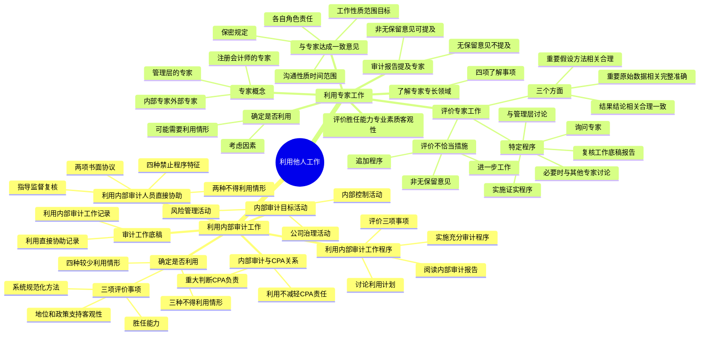

## 1. 章节定位

| 项目 | 信息 |
|------|------|
| 所属科目 | 审计 |
| 难度等级 | 3 |
| 历年分值 | 2-4 分 |
| 建议学时 | 2-4 小时 |
| 知识关联章节 | 第7章 风险评估（了解内部控制）、第15章 审计沟通（与治理层沟通利用内部审计工作）、第19章 完成审计工作（评价审计证据）、第20章 审计报告（提及专家） |

## 2. 考情分析

本章属于审计科目的次要权重章节，历年分值约 2-4 分。客观题主要考查内部审计与注册会计师审计的关系、利用内部审计工作的条件、不得利用内部审计工作的情形、专家的胜任能力和客观性评价、评价专家工作的程序；主观题偶尔以简答题形式考查利用内部审计人员提供直接协助的限制、评价专家工作的程序。

**命题规律**：本章内容相对集中，命题点相对固定。利用内部审计工作的"三项评价事项"和"三种不得利用情形"、利用内部审计人员提供直接协助的"四种禁止程序"、专家的"胜任能力、专业素质和客观性"评价、评价专家工作的"三个方面"是核心考点。近年来对利用内部审计人员提供直接协助的考查有所增加。

**高频考点分布**：

1. **内部审计的目标和活动**：与公司治理有关的活动、与风险管理有关的活动、与内部控制有关的活动（评价内部控制、检查财务和经营信息、复核经营活动、复核遵守法律法规情况）。
2. **内部审计与注册会计师审计的关系**：利用内部审计工作不能减轻注册会计师的责任；重大判断应由注册会计师负责执行。
3. **利用内部审计工作的三项评价事项**：内部审计在被审计单位中的地位及相关政策和程序支持内部审计人员客观性的程度、内部审计人员的胜任能力、内部审计是否采用系统规范化的方法（包括质量管理）。
4. **三种不得利用内部审计工作的情形**：地位和相关政策程序不足以支持客观性、缺乏足够胜任能力、没有采用系统规范化方法。
5. **应当较少利用内部审计工作的四种情形**：涉及较多判断、评估的重大错报风险较高（特别风险）、客观性支持程度较弱、胜任能力较低。
6. **利用内部审计人员提供直接协助的两种不得利用情形**：存在对客观性的重大不利影响、缺乏足够胜任能力。
7. **四种不得利用直接协助实施的程序**：涉及重大判断、涉及较高重大错报风险需较多判断、内部审计人员已经参与并报告的工作、涉及注册会计师就利用内部审计作出的决策。
8. **利用内部审计人员提供直接协助的两项书面协议**：从被审计单位代表处获取、从内部审计人员处获取。
9. **专家的概念**：注册会计师的专家，会计或审计以外某一领域具有专长；区分内部专家和外部专家、管理层的专家和注册会计师的专家。
10. **专家的胜任能力、专业素质和客观性**：评价要求。
11. **了解专家的专长领域**：四项了解事项。
12. **与专家达成一致意见**：五个方面（专家工作的性质范围和目标、各自角色和责任、沟通的性质时间安排和范围、保密规定）。
13. **评价专家工作的三个方面**：工作结果或结论的相关性和合理性及与其他审计证据的一致性、重要假设和方法的相关性和合理性、重要原始数据的相关性完整性和准确性。
14. **评价专家工作的特定程序**：询问专家、复核工作底稿和报告、实施用于证实的程序、必要时与具有相关专长的其他专家讨论、与管理层讨论专家的报告。
15. **评价结果为不恰当时的措施**：与专家达成一致意见实施进一步工作、实施追加的审计程序；仍不能解决时发表非无保留意见。
16. **在审计报告中提及专家**：不应在无保留意见审计报告中提及专家工作，除非法律法规另有规定。

**联动考查方式**：

- 与第15章审计沟通结合：与治理层沟通利用内部审计工作的计划；
- 与第20章审计报告结合：非无保留意见审计报告中提及专家工作；
- 与第7章风险评估结合：利用内部审计工作了解内部控制。

**备考建议**：

- 牢记"利用他人工作不减轻注册会计师责任"这一根本原则；
- 区分"利用内部审计工作"与"利用内部审计人员提供直接协助"两类不同的利用方式；
- 熟记不得利用内部审计工作的三种情形、不得利用直接协助实施程序的四种特征；
- 区分注册会计师的专家与管理层的专家、内部专家与外部专家；
- 掌握评价专家工作的三个方面（结果结论、假设方法、原始数据）。

## 3. 知识框架

## 4. 核心精讲

### 4.1 利用内部审计人员的工作

#### 4.1.1 内部审计的概念和目标

内部审计是指被审计单位负责执行鉴证和咨询活动，以评价和改进被审计单位的治理、风险管理和内部控制流程有效性的部门、岗位或人员。内部审计的职能包括检查、评价和监督内部控制的恰当性和有效性等。

被审计单位内部审计的目标由其管理层和治理层确定。内部审计可能包括下列一项或多项活动：

**（1）与公司治理有关的活动**：评估被审计单位的治理流程是否能够实现道德和价值观、绩效管理和问责机制、向组织内的适当范围传达风险和控制信息，以及治理层、注册会计师、内部审计人员和管理层之间的有效沟通等方面的目标。

**（2）与风险管理有关的活动**：有助于被审计单位识别和评价面临的重大风险，改善风险管理和内部控制（包括财务报告过程的有效性）；实施程序以有助于被审计单位发现舞弊情形。

**（3）与内部控制有关的活动**：

1. 评价内部控制：内部审计可能承担复核内部控制、评价内部控制的运行以及对内部控制提出改进建议等方面的特定责任，为管理层和治理层就内部控制的设计、执行和运行有效性提供鉴证；
2. 检查财务和经营信息：复核用以识别、确认、计量、分类和报告财务和经营信息的方法，并针对个别事项实施专门调查；
3. 复核经营活动：复核被审计单位经营活动（包括非财务活动）的经济性、效率和效果；
4. 复核遵守法律法规的情况：复核被审计单位对法律法规、其他外部要求以及管理层的政策、指令和其他内部要求的遵守情况。

#### 4.1.2 内部审计和注册会计师的关系

**内部审计与注册会计师审计的联系**：尽管内部审计与注册会计师审计存在诸多差异，但两者用以实现各自目标的方式通常相似。例如，为支持所得出的结论，审计人员都需要获取充分、适当的审计证据，都可以运用观察、询问、函证和分析程序等审计方法。注册会计师在审计中利用内部审计人员的工作包括两种方式：①在获取审计证据的过程中利用内部审计的工作；②在注册会计师的指导、监督和复核下利用内部审计人员提供直接协助。

**利用内部审计工作不能减轻注册会计师的责任**：考虑到内部审计是被审计单位的内设机构，其自主程度和客观性毕竟有限，无法达到注册会计师审计要求的水平。因此，尽管内部审计工作的某些部分或利用内部审计人员提供直接协助可能对注册会计师的工作有所帮助，但注册会计师必须对与财务报表审计相关的所有重大事项独立作出职业判断，而不应完全依赖内部审计工作。通常，审计过程中涉及的职业判断，如重大错报风险的评估、重要性水平的确定、样本规模的确定、对会计政策和会计估计的评估等，均应由注册会计师负责执行。注册会计师对发表的审计意见独立承担责任，这种责任并不因利用内部审计工作或利用内部审计人员对该项审计业务提供直接协助而减轻。

#### 4.1.3 确定是否利用、在哪些领域利用以及在多大程度上利用内部审计的工作

**（1）三项评价事项**

注册会计师应当通过评价下列事项，确定是否能够利用内部审计的工作以实现审计目的：

1. 内部审计在被审计单位中的地位，以及相关政策和程序支持内部审计人员客观性的程度；
2. 内部审计人员的胜任能力；
3. 内部审计是否采用系统、规范化的方法（包括质量管理）。

**（2）三种不得利用内部审计工作的情形**

如果存在下列情形之一，注册会计师不得利用内部审计的工作：

1. 内部审计在被审计单位的地位以及相关政策和程序不足以支持内部审计人员的客观性；
2. 内部审计人员缺乏足够的胜任能力；
3. 内部审计没有采用系统、规范化的方法（包括质量管理）。

**（3）四种应当较少利用内部审计工作的情形**

当存在下列情形之一时，注册会计师应当计划较少地利用内部审计工作，而更多地直接执行审计工作：

1. 在计划和实施相关的审计程序以及评价收集的审计证据时涉及较多判断；
2. 评估的认定层次重大错报风险较高，需要对识别出的特别风险予以特殊考虑；
3. 内部审计在被审计单位中的地位以及相关政策和程序对内部审计人员客观性的支持程度较弱；
4. 内部审计人员的胜任能力较低。

注册会计师应当评价从总体上而言，在计划的范围内利用内部审计工作是否仍然能够使注册会计师充分地参与审计工作。当注册会计师与治理层沟通计划的审计范围和时间安排的总体情况时，应当包括注册会计师计划如何利用内部审计工作。

#### 4.1.4 利用内部审计的工作

如果计划利用内部审计工作，注册会计师应当：

1. 与内部审计人员讨论利用其工作的计划，以作为协调各自工作的基础；
2. 阅读与拟利用的内部审计工作相关的内部审计报告，以了解其实施的审计程序的性质和范围以及相关发现；
3. 针对计划利用的全部内部审计工作实施充分的审计程序，以确定其对于实现审计目的是否适当。

注册会计师应当评价下列事项：①内部审计工作是否经过恰当的计划、实施、监督、复核和记录；②内部审计是否获取了充分、适当的证据，以使其能够得出合理的结论；③内部审计得出的结论在具体环境下是否适当，编制的报告与执行工作的结果是否一致。

注册会计师实施审计程序的性质和范围应当与其对涉及判断的程度、评估的重大错报风险、内部审计在被审计单位的地位以及相关政策和程序支持内部审计人员客观性的程度、内部审计人员的胜任能力等事项的评价相适应，并应当包括重新执行内部审计的部分工作。

#### 4.1.5 确定是否利用、在哪些领域利用以及在多大程度上利用内部审计人员提供直接协助

如果法律法规不禁止利用内部审计人员提供直接协助，并且注册会计师计划利用内部审计人员在审计中提供直接协助，注册会计师应当评价是否存在对内部审计人员客观性的不利影响及其严重程度，以及提供直接协助的内部审计人员的胜任能力。

**（1）两种不得利用内部审计人员提供直接协助的情形**

当存在下列情形之一时，注册会计师不得利用内部审计人员提供直接协助：

1. 存在对内部审计人员客观性的重大不利影响；
2. 内部审计人员对拟执行的工作缺乏足够的胜任能力。

**（2）四种不得利用直接协助实施的程序**

注册会计师不得利用内部审计人员提供直接协助以实施具有下列特征的程序：

1. 在审计中涉及作出重大判断；
2. 涉及较高的重大错报风险，在实施相关审计程序或评价收集的审计证据时需要作出较多的判断；
3. 涉及内部审计人员已经参与并且已经或将要由内部审计向管理层或治理层报告的工作；
4. 涉及注册会计师按照规定就内部审计，以及利用内部审计工作或利用内部审计人员提供直接协助作出的决策。

注册会计师在按照《中国注册会计师审计准则第 1151 号——与治理层的沟通》的规定与治理层沟通计划的审计范围和时间安排的总体情况时，应当沟通拟利用内部审计人员提供直接协助的性质和范围，以使双方就在业务的具体情形下并未过度利用内部审计人员提供直接协助达成共识。

#### 4.1.6 利用内部审计人员提供直接协助

**（1）两项书面协议**

在利用内部审计人员提供直接协助之前，注册会计师应当：

1. 从拥有相关权限的被审计单位代表人员处获取书面协议，允许内部审计人员遵循注册会计师的指令，并且被审计单位不干涉内部审计人员为注册会计师执行的工作；
2. 从内部审计人员处获取书面协议，表明其将按照注册会计师的指令对特定事项保密，并将对其客观性产生的任何不利影响告知注册会计师。

**（2）指导、监督和复核**

注册会计师应当按照《中国注册会计师审计准则第 1121 号——对财务报表审计实施的质量管理》的规定对内部审计人员执行的工作进行指导、监督和复核。在进行指导、监督和复核时：

1. 注册会计师在确定指导、监督和复核的性质、时间安排和范围时应当认识到内部审计人员并不独立于被审计单位，并且指导、监督和复核的性质、时间安排和范围应恰当应对注册会计师对涉及判断的程度、评估的重大错报风险、拟提供直接协助的内部审计人员客观性（包括产生的不利影响及其严重程度）和胜任能力的评价结果；
2. 复核程序应当包括由注册会计师检查内部审计人员执行的部分工作所获取的审计证据。

注册会计师对内部审计人员执行的工作的指导、监督和复核应当足以使注册会计师对内部审计人员就其执行的工作已获取充分、适当的审计证据以支持相关审计结论感到满意。

#### 4.1.7 审计工作底稿

**利用内部审计工作的记录**：注册会计师应当在审计工作底稿中记录对下列事项的评价（内部审计在被审计单位中的地位、相关政策和程序是否足以支持内部审计人员的客观性；内部审计人员的胜任能力；内部审计是否采用系统、规范化的方法包括质量管理）；利用内部审计工作的性质和范围以及作出该决策的基础；注册会计师为评价利用内部审计工作的适当性而实施的审计程序。

**利用内部审计人员提供直接协助的记录**：注册会计师应当在审计工作底稿中记录关于是否存在对内部审计人员客观性的不利影响及其严重程度的评价，以及关于提供直接协助的内部审计人员的胜任能力的评价；就内部审计人员执行工作的性质和范围作出决策的基础；根据《中国注册会计师审计准则第 1131 号——审计工作底稿》的规定，所执行工作的复核人员及复核的日期和范围；从拥有相关权限的被审计单位代表人员和内部审计人员处获取的书面协议；在审计业务中提供直接协助的内部审计人员编制的审计工作底稿。

### 4.2 利用专家的工作

#### 4.2.1 专家的概念

本节所称专家，即注册会计师的专家，是指在会计或审计以外的某一领域具有专长，并且其工作被注册会计师利用，以协助注册会计师获取充分、适当的审计证据的个人或组织。专家既可能是会计师事务所内部专家（如会计师事务所或网络事务所的合伙人或员工，包括临时员工），也可能是会计师事务所外部专家。

| 分类 | 含义 |
|------|------|
| 注册会计师的专家 | 在会计或审计以外的某一领域具有专长的个人或组织，其工作被注册会计师利用以协助获取充分、适当的审计证据 |
| 管理层的专家 | 在会计、审计以外的某一领域具有专长的个人或组织，其工作被管理层利用以协助编制财务报表 |
| 内部专家 | 会计师事务所或网络事务所的合伙人或员工（包括临时员工），需要遵守所在会计师事务所的质量管理政策和程序 |
| 外部专家 | 不是项目组成员，不受会计师事务所按照《会计师事务所质量管理准则第 5101 号》制定的质量管理政策和程序的约束 |

专长是指在某一特定领域中拥有的专门技能、知识和经验。例如：对复杂的金融工具、土地及建筑物、厂房和机器设备、珠宝、艺术品、古董、无形资产、企业合并中收购的资产和承担的负债，以及可能发生减值的资产进行估价；对与保险合同或员工福利计划相关的负债进行精算；对石油和天然气储量进行估算；对环境负债和场地清理费用进行估价；对合同、法律和法规进行解释；对复杂或异常的纳税问题进行分析。

注册会计师对发表的审计意见独立承担责任，这种责任并不因利用专家的工作而减轻。

#### 4.2.2 确定是否利用专家的工作

如果在会计或审计以外的某一领域的专长对获取充分、适当的审计证据是必要的，注册会计师应当确定是否利用专家的工作。

**可能需要利用专家工作的情形**：注册会计师在执行了解被审计单位及其环境等方面的情况、识别和评估重大错报风险、针对评估的财务报表层次风险确定并实施总体应对措施、针对评估的认定层次风险设计和实施进一步审计程序、在对财务报表形成审计意见时评价已获取的审计证据的充分性和适当性等工作时可能需要利用专家的工作。

**确定是否利用专家工作时可能考虑的因素**：

1. 管理层在编制财务报表时是否利用了管理层的专家的工作（如果管理层利用了管理层的专家的工作，可能意味着编制财务报表具有复杂性，重大错报风险可能增加）；
2. 事项的性质和重要性，包括复杂程度；
3. 事项存在的重大错报风险；
4. 应对识别出的风险的预期程序的性质，包括注册会计师对与这些事项相关的专家工作的了解和具有的经验，以及是否可以获得替代性的审计证据。

#### 4.2.3 专家的胜任能力、专业素质和客观性

| 要素 | 含义 |
|------|------|
| 胜任能力 | 与专家专长的性质和水平有关 |
| 专业素质 | 与在具体业务情形下对胜任能力的发挥相关。影响因素包括地理位置、可用的时间和资源等 |
| 客观性 | 与偏见、利益冲突及其他可能影响其职业判断或商业判断的因素相关 |

注册会计师应当评价专家是否具有实现审计目的所必需的胜任能力、专业素质和客观性。在评价外部专家的客观性时，注册会计师应当询问可能对外部专家客观性产生不利影响的利益和关系。

#### 4.2.4 了解专家的专长领域

注册会计师应当充分了解专家的专长领域，以能够为了实现审计目的确定专家工作的性质、范围和目标，以及评价专家的工作是否足以实现审计目的。注册会计师对专家的专长领域的了解可能包括下列方面：

1. 专家的专长领域是否与审计工作相关；
2. 职业准则或其他准则以及法律法规是否适用；
3. 专家使用哪些假设和方法（包括专家使用的模型，如适用），及其在专家的专长领域是否得到普遍认可，对实现财务报告目的是否适当；
4. 专家使用的内外部数据或信息的性质。

#### 4.2.5 与专家达成一致意见

无论是对外部专家还是内部专家，注册会计师应当就下列事项与其达成一致意见，并根据需要形成书面协议：

1. **专家工作的性质、范围和目标**：通常需要与专家讨论需要遵守的相关技术标准、其他职业准则或行业要求；
2. **注册会计师和专家各自的角色与责任**：包括由注册会计师还是专家对原始数据实施细节测试；同意注册会计师与被审计单位或其他人员讨论专家的工作结果或结论，必要时包括同意注册会计师将专家的工作结果或结论的细节作为注册会计师在审计报告中发表非无保留意见的基础；将注册会计师对专家工作形成的结论告知专家。就各自的工作底稿的使用和保管达成一致意见——当专家是项目组的成员时，专家的工作底稿是审计工作底稿的一部分；除非协议另作安排，外部专家的工作底稿属于外部专家，不是审计工作底稿的一部分；
3. **注册会计师和专家之间沟通的性质、时间安排和范围**：有效的双向沟通有利于将专家工作的性质、时间安排和范围与审计的其他工作整合在一起；
4. **对专家遵守保密规定的要求**：适用于注册会计师的相关职业道德要求中的保密条款同样也适用于专家。

#### 4.2.6 评价专家工作的恰当性

**（1）总体要求——评价三个方面**

注册会计师应当评价专家的工作是否足以实现审计目的，包括：

1. 专家的工作结果或结论的相关性和合理性，以及与其他审计证据的一致性；
2. 如果专家的工作涉及使用重要的假设和方法，这些假设和方法在具体情况下的相关性和合理性；
3. 如果专家的工作涉及使用重要的原始数据，这些原始数据的相关性、完整性和准确性。

**（2）评价专家工作是否足以实现审计目的所实施的特定程序**

1. 询问专家；
2. 复核专家的工作底稿和报告；
3. 实施用于证实的程序，包括：观察专家的工作；检查已公布的数据，如来源于信誉高、权威的渠道的统计报告；向第三方询证相关事项；执行详细的分析程序；重新计算；
4. 必要时（如当专家的工作结果或结论与其他审计证据不一致时）与具有相关专长的其他专家讨论；
5. 与管理层讨论专家的报告。

**（3）评价专家的工作结果或结论的相关性和合理性**

注册会计师可能需要考虑：专家提交其工作结果或结论的方式是否符合专家所在的职业或行业标准；专家的工作结果或结论是否得到清楚的表述；专家的工作结果或结论是否基于适当的期间，并考虑期后事项（如相关）；专家的工作结果或结论在使用方面是否有任何保留、限制或约束；专家的工作结果或结论是否适当考虑了专家遇到的错误或偏差情况。

**（4）评价专家工作涉及使用重要的假设和方法的相关性和合理性**

当专家的工作涉及使用重要的假设和方法时，注册会计师评价这些假设和方法时需要考虑：

1. 这些假设和方法在专家的专长领域是否得到普遍认可；
2. 这些假设和方法是否与适用的财务报告编制基础的要求相一致；
3. 这些假设和方法是否依赖某些专用模型的应用；
4. 这些假设和方法是否与管理层的假设、方法相一致，如果不一致，差异的原因及影响。

**（5）评价专家工作涉及使用重要的原始数据的相关性、完整性和准确性**

当专家的工作涉及使用对专家工作具有重要影响的原始数据时，注册会计师可以实施下列程序测试这些数据：核实数据的来源，包括了解和测试（适用时）针对数据的内部控制，以及向专家传送数据的方式（如相关）；复核数据的完整性和内在一致性。

如果专家使用的是其领域中高度专业化的原始数据，该专家可能会测试这些原始数据。如果专家已测试，注册会计师可以通过询问专家、监督或复核专家的测试来评价数据的相关性、完整性和准确性。

**（6）评价结果为不恰当时的措施**

如果确定专家的工作不足以实现审计目的，注册会计师应当采取下列措施之一：

1. 就专家拟执行的进一步工作的性质和范围，与专家达成一致意见；
2. 根据具体情况，实施追加的审计程序。

如果注册会计师认为专家的工作不足以实现审计目的，且注册会计师通过实施追加的审计程序（如专家和注册会计师执行进一步工作），或者通过雇用、聘请其他专家仍不能解决问题，则意味着没有获取充分、适当的审计证据，注册会计师有必要按照《中国注册会计师审计准则第 1502 号——在审计报告中发表非无保留意见》的规定发表非无保留意见。

#### 4.2.7 在审计报告中提及专家

| 情形 | 处理 |
|------|------|
| 无保留意见审计报告 | 注册会计师不应在无保留意见的审计报告中提及专家的工作，除非法律法规另有规定。如果法律法规要求提及专家的工作，注册会计师应当在审计报告中指明，这种提及并不减轻注册会计师对审计意见承担的责任 |
| 非无保留意见审计报告 | 如果注册会计师在审计报告中提及专家的工作，并且这种提及与理解审计报告中的非无保留意见相关，注册会计师仍应在审计报告中指明，这种提及并不减轻注册会计师对审计意见承担的责任 |

## 5. 典型例题

**【例题 1】（利用内部审计工作的条件）**

ABC 会计师事务所审计甲公司 2×24 年度财务报表，拟利用甲公司内部审计工作。审计项目组了解到以下情况：

（1）甲公司内部审计部门直接向财务总监汇报；

（2）内部审计人员大多为新入职员工，缺乏相关专业资格和经验；

（3）内部审计部门没有书面的审计手册，审计程序由审计人员根据经验自行确定；

（4）审计项目组拟将重大错报风险评估、重要性水平的确定交由内部审计人员执行。

要求：分别判断上述情况是否影响审计项目组利用内部审计工作，并简要说明理由。

**答案**：

（1）影响。内部审计在被审计单位中的地位以及相关政策和程序支持内部审计人员客观性的程度，是评价是否能够利用内部审计工作的三项事项之一。内部审计部门直接向财务总监汇报，可能影响内部审计人员的客观性（财务总监是被审计单位管理层，内部审计应当具有一定的独立性）。

（2）影响。内部审计人员的胜任能力是评价是否能够利用内部审计工作的三项事项之一。内部审计人员大多为新入职员工，缺乏相关专业资格和经验，说明内部审计人员缺乏足够的胜任能力。如果内部审计人员缺乏足够的胜任能力，注册会计师不得利用内部审计的工作。

（3）影响。内部审计是否采用系统、规范化的方法（包括质量管理）是评价是否能够利用内部审计工作的三项事项之一。没有书面的审计手册、审计程序由审计人员根据经验自行确定，说明内部审计没有采用系统、规范化的方法。如果内部审计没有采用系统、规范化的方法（包括质量管理），注册会计师不得利用内部审计的工作。

（4）不恰当。利用内部审计工作不能减轻注册会计师的责任。通常，审计过程中涉及的职业判断，如重大错报风险的评估、重要性水平的确定、样本规模的确定、对会计政策和会计估计的评估等，均应由注册会计师负责执行。审计项目组将重大错报风险评估和重要性水平的确定交由内部审计人员执行，违反了审计准则的要求。

**解析**：利用内部审计工作的三项评价事项（地位和客观性、胜任能力、系统规范化方法）是高频考点。三种情形任一不满足即不得利用内部审计工作。重大判断应由注册会计师负责执行。

**【例题 2】（利用内部审计人员提供直接协助的限制）**

审计项目组拟利用甲公司内部审计人员提供直接协助，准备将以下工作交由内部审计人员执行：

（1）评价管理层的会计估计；

（2）对识别出的特别风险实施相关审计程序；

（3）对内部审计人员已经参与并向管理层报告的工作再执行；

（4）评价是否利用内部审计工作的决策。

要求：分别判断上述工作能否交由内部审计人员提供直接协助执行，并简要说明理由。

**答案**：

（1）不能。注册会计师不得利用内部审计人员提供直接协助以实施在审计中涉及作出重大判断的程序。评价管理层的会计估计涉及重大判断，不得交由内部审计人员提供直接协助执行。

（2）不能。注册会计师不得利用内部审计人员提供直接协助以实施涉及较高的重大错报风险，在实施相关审计程序或评价收集的审计证据时需要作出较多的判断的程序。对识别出的特别风险实施相关审计程序属于涉及较高重大错报风险且需要较多判断的程序，不得交由内部审计人员提供直接协助执行。

（3）不能。注册会计师不得利用内部审计人员提供直接协助以实施涉及内部审计人员已经参与并且已经或将要由内部审计向管理层或治理层报告的工作的程序。

（4）不能。注册会计师不得利用内部审计人员提供直接协助以实施涉及注册会计师按照规定就内部审计，以及利用内部审计工作或利用内部审计人员提供直接协助作出的决策的程序。评价是否利用内部审计工作的决策属于注册会计师的决策，不得交由内部审计人员提供直接协助执行。

**解析**：四种不得利用直接协助实施的程序是高频考点。注意特征：①重大判断；②较高重大错报风险需较多判断；③内部审计人员已经参与并报告的工作；④注册会计师就利用内部审计作出的决策。

**【例题 3】（评价专家工作的程序）**

审计项目组在审计乙公司 2×24 年度财务报表时，利用了资产评估师（专家）对乙公司一项无形资产公允价值的评估工作。审计项目组实施了以下程序：

（1）评价资产评估师是否具有实现审计目的所必需的胜任能力、专业素质和客观性；

（2）了解资产评估师的专长领域；

（3）与资产评估师就专家工作的性质、范围和目标等达成一致意见；

（4）评价资产评估师的工作结果或结论的相关性和合理性，以及与其他审计证据的一致性；

（5）评价资产评估师使用的重要假设和方法的相关性和合理性；

（6）评价资产评估师使用的重要原始数据的相关性、完整性和准确性。

要求：说明审计项目组评价专家工作的程序是否恰当，并简要说明评价专家工作的三个方面。

**答案**：

审计项目组的程序均恰当。评价专家工作的三个方面为：

1. 专家的工作结果或结论的相关性和合理性，以及与其他审计证据的一致性。程序（4）属于此类。需要考虑专家提交其工作结果或结论的方式是否符合专家所在的职业或行业标准；专家的工作结果或结论是否得到清楚的表述；是否基于适当的期间并考虑期后事项；是否有任何保留、限制或约束；是否适当考虑了专家遇到的错误或偏差情况。

2. 如果专家的工作涉及使用重要的假设和方法，这些假设和方法在具体情况下的相关性和合理性。程序（5）属于此类。需要考虑这些假设和方法在专家的专长领域是否得到普遍认可；是否与适用的财务报告编制基础的要求相一致；是否依赖某些专用模型的应用；是否与管理层的假设、方法相一致，如果不一致，差异的原因及影响。

3. 如果专家的工作涉及使用重要的原始数据，这些原始数据的相关性、完整性和准确性。程序（6）属于此类。需要核实数据的来源，包括了解和测试针对数据的内部控制；复核数据的完整性和内在一致性。

如果确定专家的工作不足以实现审计目的，注册会计师应当采取下列措施之一：就专家拟执行的进一步工作的性质和范围，与专家达成一致意见；根据具体情况，实施追加的审计程序。如果仍不能解决问题，注册会计师有必要发表非无保留意见。

**解析**：评价专家工作的三个方面（结果结论、假设方法、原始数据）是高频考点。注意区分三个评价对象的侧重点：结果结论看相关性合理性一致性，假设方法看相关性和合理性（含普遍认可、与编制基础一致、专用模型、与管理层一致四项），原始数据看相关性完整性准确性。

## 6. 记忆口诀

**利用他人工作铁律**："利用不减轻CPA责任"——无论利用内部审计工作、内部审计人员直接协助还是专家工作，均不减轻注册会计师责任。

**内部审计三类活动**："公司治理、风险管理、内部控制"——内部审计目标的三类活动。

**利用内部审计工作三评价**："地位和客观性、胜任能力、系统规范化方法"——三项评价事项。

**不得利用内部审计工作三情形**："地位政策不支持客观性、缺乏胜任能力、未采用系统规范化方法"——三种禁止情形。

**较少利用内部审计工作四情形**："判断多、风险高特别风险、客观性弱、胜任能力低"——四种应当较少利用的情形。

**利用内部审计人员直接协助两不得**："重大不利影响客观性、缺乏足够胜任能力"——两种不得利用直接协助的情形。

**四种不得直接协助程序**："重大判断、高风险多判断、已参与已报告、CPA决策事项"——四种禁止程序特征。

**两项书面协议**："被审计单位代表允许遵循指令不干涉、内部审计人员保密告知不利影响"——两项书面协议。

**专家概念**："会计审计以外领域专长，被CPA利用获取证据"——注册会计师的专家。

**专家四种类型**："内部专家外部专家，管理层专家CPA专家"——四个概念区分。

**专家三评价**："胜任能力、专业素质、客观性"——评价专家的三个方面。

**了解专家专长领域四事项**："相关性、准则适用、假设方法普遍认可、数据性质"——四项了解事项。

**与专家达成一致四方面**："工作性质范围目标、各自角色责任、沟通性质时间范围、保密规定"——四个方面。

**外部专家工作底稿**："外部专家工作底稿不属于审计工作底稿，除非协议另作安排"——重要区分。

**评价专家工作三方面**："结果结论相关合理一致、假设方法相关合理、原始数据相关完整准确"——三个评价方面。

**评价专家工作特定程序**："询问、复核、证实程序、必要时与其他专家讨论、与管理层讨论"——五类程序。

**证实程序五种**："观察、检查已公布数据、向第三方询证、详细分析程序、重新计算"——五类证实程序。

**评价不恰当两措施**："与专家达成一致进一步工作、实施追加程序"——两种措施。

**仍不能解决**："发表非无保留意见"——最终措施。

**审计报告提及专家**："无保留意见不提及除非法律法规规定，非无保留意见可提及与理解相关"——提及专家的规则。

**提及专家都须指明**："提及不减轻CPA责任"——无论何种提及都须指明不减轻责任。

**重大判断CPA执行**："重大错报风险评估、重要性水平确定、样本规模确定、会计政策会计估计评估"——四项重大判断应由CPA执行。

**与治理层沟通**："沟通利用内部审计工作和直接协助的性质范围"——与治理层沟通的要求。
