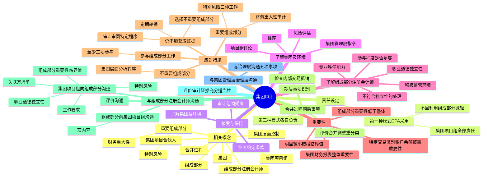

## 1. 章节定位

| 项目 | 信息 |
|------|------|
| 所属科目 | 审计 |
| 难度等级 | 4 |
| 历年分值 | 5-8 分 |
| 建议学时 | 5-7 小时 |
| 知识关联章节 | 第7章 风险评估、第8章 风险应对、第14章 舞弊与法律法规、第15章 审计沟通、第20章 审计报告 |

## 2. 考情分析

本章是审计科目的重要章节，历年分值约 5-8 分。主观题常以简答题形式考查重要组成部分的识别、对重要组成部分和不重要组成部分执行的工作类型、组成部分重要性的确定、集团项目组参与组成部分注册会计师工作的要求、与组成部分注册会计师的沟通内容；客观题则集中在集团审计相关概念、责任设定、了解组成部分注册会计师的事项。

**命题规律**：本章核心考点相对集中。重要组成部分的两种识别标准（财务重大性、特定性质或情况可能导致特别风险）、对重要组成部分执行工作的三种类型、对不重要组成部分在集团层面实施分析程序、组成部分重要性低于集团财务报表整体的重要性是高频考点。集团项目组参与组成部分注册会计师工作的内容、与组成部分注册会计师双向沟通的内容也是常考点。

**高频考点分布**：

1. **集团审计相关概念**：集团、组成部分、重要组成部分（两种特征）、集团项目合伙人、集团项目组、组成部分注册会计师。
2. **重要组成部分的识别**：①单个组成部分对集团具有财务重大性（通常以选定基准的 15% 作为参考）；②由于其特定性质或情况，可能存在导致集团财务报表发生重大错报的特别风险。
3. **集团审计中的责任设定**：我国采用第一种模式——集团项目组对整个集团审计工作及审计意见负全部责任，这一责任不因利用组成部分注册会计师的工作而减轻。
4. **审计范围受到限制**：集团管理层施加的限制、集团管理层无法克服的情况限制；对于重要组成部分的限制通常导致无法获取充分适当审计证据。
5. **了解组成部分注册会计师的四项事项**：职业道德要求（特别是独立性）、专业胜任能力、集团项目组参与程度是否足够、是否处于积极的监管环境中。
6. **重要性**：集团财务报表整体的重要性、特定交易类别账户余额或披露的重要性水平、组成部分重要性（低于集团财务报表整体的重要性，无需按比例分配）、明显微小错报的临界值。
7. **对重要组成部分需执行的工作**：具有财务重大性的——运用组成部分重要性对组成部分财务信息实施审计；特定性质或情况可能存在特别风险的——下列一项或多项：使用组成部分重要性实施审计、针对特别风险相关的账户余额交易或披露实施审计、针对特别风险实施特定的审计程序。
8. **对不重要组成部分需执行的工作**：在集团层面实施分析程序。
9. **已执行的工作仍不能提供充分、适当审计证据时的处理**：选择某些不重要的组成部分执行审计、审阅或特定程序；定期轮换选择的组成部分。
10. **参与组成部分注册会计师的工作**：至少包括三项（与组成部分注册会计师或组成部分管理层讨论对集团而言重要的组成部分业务活动、与组成部分注册会计师讨论舞弊或错误导致重大错报的可能性、复核组成部分注册会计师对特别风险形成的审计工作底稿）。
11. **合并过程**：评价合并调整和重分类事项的适当性完整性和准确性、检查集团内部交易和未实现内部交易损益是否核对一致并抵销。
12. **与组成部分注册会计师的沟通**：集团项目组向组成部分注册会计师通报工作要求的内容（5 项）、组成部分注册会计师向集团项目组沟通的内容（10 项）。
13. **与集团管理层和集团治理层的沟通**：与集团治理层沟通的 5 项事项。

**联动考查方式**：

- 与第14章舞弊结合：集团审计中的舞弊风险评估；
- 与第15章审计沟通结合：与集团治理层的沟通；
- 与第20章审计报告结合：审计范围受到限制对审计意见的影响、不应提及组成部分注册会计师。

**备考建议**：

- 牢记"集团项目组对整个集团审计工作及审计意见负全部责任"这一根本责任设定；
- 区分重要组成部分的两种识别标准（财务重大性、特别风险）；
- 熟记对重要组成部分执行工作的三种类型、对不重要组成部分在集团层面实施分析程序；
- 牢记组成部分重要性低于集团财务报表整体的重要性、无需按比例分配；
- 掌握集团项目组参与组成部分注册会计师工作的至少三项内容；
- 关注审计报告不应提及组成部分注册会计师的规则。

## 3. 知识框架

## 4. 核心精讲

### 4.1 与集团财务报表审计相关的概念

#### 4.1.1 集团、组成部分和重要组成部分

**集团**，是指由所有组成部分构成的整体，并且所有组成部分的财务信息包括在集团财务报表中。集团至少拥有一个以上的组成部分。

**组成部分**，是指某一实体或某项业务活动，其财务信息由集团或组成部分管理层编制并应包括在集团财务报表中。集团结构影响如何识别组成部分，例如母公司、子公司、合营企业以及按权益法或成本法核算的被投资实体，或者集团本部、分支机构可被视为组成部分；按职能部门、生产过程、单项产品或劳务或地区分布来组织财务报告系统的，这些职能部门、生产过程、单项产品或劳务或地区可被视为组成部分。

**重要组成部分**，是指集团项目组识别出的具有下列特征之一的组成部分：

1. 单个组成部分对集团具有财务重大性；
2. 单个组成部分由于其特定性质或情况，可能存在导致集团财务报表发生重大错报的特别风险。

集团项目组可以将选定的基准乘以某一百分比，以协助识别对集团具有财务重大性的单个组成部分。根据集团的性质和具体情况，适当的基准可能包括集团资产、负债、现金流量、利润总额或营业收入。例如，集团项目组可能认为超过选定基准 15% 的组成部分是重要组成部分，也可能根据具体情况确定更高或更低的百分比。

某些组成部分由于其特定性质或情况，可能存在导致集团财务报表发生重大错报的特别风险，集团项目组可能将其识别为重要组成部分。例如，某组成部分进行外汇交易，虽然其对集团并不具有财务重大性，但仍使集团面临导致重大错报的特别风险。

#### 4.1.2 集团审计相关主体

| 主体 | 含义 |
|------|------|
| 集团项目合伙人 | 会计师事务所中负责某项集团审计业务及其执行，并代表会计师事务所在对集团财务报表出具的审计报告上签字的合伙人 |
| 集团项目组 | 参与集团审计的，包括集团项目合伙人在内的所有合伙人和员工。负责制定集团总体审计策略，与组成部分注册会计师沟通，针对合并过程执行相关工作，并评价根据审计证据得出的结论，作为形成集团审计意见的基础 |
| 组成部分注册会计师 | 基于集团审计目的，按照集团项目组的要求，对组成部分财务信息执行相关工作的注册会计师 |
| 集团管理层 | 负责编制集团财务报表的管理层 |
| 组成部分管理层 | 负责编制组成部分财务信息的管理层 |

**集团层面控制**，是指集团管理层设计、执行和维护的与集团财务报告相关的控制。

**合并过程**，是指：①通过合并、比例合并、权益法或成本法，在集团财务报表中对组成部分财务信息进行确认、计量、列报与披露；②对没有母公司但处在同一控制下的各组成部分编制的财务信息进行汇总。

### 4.2 集团审计中的责任设定和注册会计师的目标

#### 4.2.1 集团审计中的责任设定

目前，各国对集团审计中的责任设定有两种模式：

| 模式 | 内容 |
|------|------|
| 第一种模式 | 集团项目组对整个集团审计工作及审计意见负全部责任，这一责任不因利用组成部分注册会计师的工作而减轻 |
| 第二种模式 | 集团项目组和组成部分注册会计师就各自执行的审计工作分别负责，集团项目组在执行集团审计时完全基于组成部分注册会计师的工作 |

我国《中国注册会计师审计准则第 1401 号——对集团财务报表审计的特殊考虑》采用了**第一种模式**。在这种模式下，尽管组成部分注册会计师基于集团审计目的对组成部分财务信息执行相关工作，并对所有发现的问题、得出的结论或形成的意见负责，集团项目合伙人及其所在的会计师事务所仍对集团审计意见负全部责任。

集团项目合伙人应当对集团审计项目的质量承担总体责任，应当确信执行集团审计业务的人员（包括组成部分注册会计师）从整体上具备适当的胜任能力和专业素质。

**审计报告中提及组成部分注册会计师**：注册会计师对集团财务报表出具的审计报告不应提及组成部分注册会计师，除非法律法规另有规定。如果法律法规要求在审计报告中提及组成部分注册会计师，审计报告应当指明，这种提及并不减轻集团项目合伙人及其所在的会计师事务所对集团审计意见承担的责任。

如果因未能就组成部分财务信息获取充分、适当的审计证据，导致集团项目组在对集团财务报表出具的审计报告中发表非无保留意见，集团项目组需要在审计报告中"形成保留/否定/无法表示意见的基础"部分说明不能获取充分、适当审计证据的原因。此时不应提及组成部分注册会计师，除非法律法规另有规定，并且这样做对充分说明情况是必要的。

#### 4.2.2 注册会计师的目标

在集团审计中，注册会计师的目标是：

1. 确定是否担任集团审计的注册会计师；
2. 如果担任集团审计的注册会计师，就组成部分注册会计师对组成部分财务信息执行工作的范围、时间安排和发现的问题，与组成部分注册会计师进行清晰的沟通；针对组成部分财务信息和合并过程，获取充分、适当的审计证据，以对集团财务报表是否在所有重大方面按照适用的财务报告编制基础编制发表审计意见。

### 4.3 集团审计业务的接受与保持

#### 4.3.1 在接受与保持阶段获取了解

集团项目合伙人应当确定是否能够合理预期获取与合并过程和组成部分财务信息相关的充分、适当的审计证据，以作为形成集团审计意见的基础。集团项目组应当了解集团及其环境、集团组成部分及其环境，以足以识别可能的重要组成部分。

如果是新业务，集团项目组可以通过下列途径了解集团及其环境：集团管理层提供的信息；与集团管理层的沟通；如适用，与前任集团项目组、组成部分管理层或组成部分注册会计师的沟通。

集团项目组可能需要对下列事项进行了解：集团结构；组成部分中对集团重要的业务活动；对服务机构的利用；对集团层面控制的描述；合并过程的复杂程度；是集团项目合伙人所在的会计师事务所还是网络以外的组成部分注册会计师对组成部分财务信息执行相关工作；集团项目组是否可以不受限制地接触集团治理层和管理层、组成部分治理层和管理层、组成部分信息和组成部分注册会计师。

#### 4.3.2 审计范围受到限制

**集团管理层施加的限制**：如果集团项目合伙人认为由于集团管理层施加的限制，使集团项目组不能获取充分、适当的审计证据，由此产生的影响可能导致对集团财务报表发表无法表示意见，集团项目合伙人应当视具体情况采取下列措施：如果是新业务，拒绝接受业务委托，如果是连续审计业务，在法律法规允许的情况下，解除业务约定；如果法律法规禁止注册会计师拒绝接受业务委托，或者注册会计师不能解除业务约定，在可能的范围内对集团财务报表实施审计，并对集团财务报表发表无法表示意见。

**集团管理层无法克服的情况限制**：集团项目组接触信息可能受到集团管理层无法克服的情况的限制，例如受到保密性或数据隐私有关的法律法规的限制，或组成部分注册会计师拒绝集团项目组接触相关审计工作底稿的要求。

即使接触信息受到限制，集团项目组仍有可能获取充分、适当的审计证据，然而这种可能性随着组成部分对集团重要程度的增加而降低。如果集团管理层限制集团项目组或组成部分注册会计师接触重要组成部分的信息，则集团项目组将无法获取充分、适当的审计证据。如果这类限制与不重要的组成部分有关，集团项目组仍有可能获取充分、适当的审计证据，但是受到限制的原因可能影响集团审计意见。

### 4.4 了解集团及其环境、集团组成部分及其环境

集团项目组应当对集团及其环境、集团组成部分及其环境获取充分的了解，以足以：①确认或修正最初识别的重要组成部分；②评估舞弊或错误导致集团财务报表发生重大错报的风险。

#### 4.4.1 集团管理层下达的指令

集团管理层下达的指令通常包括：运用的会计政策；适用于集团财务报表的法定和其他披露要求；报告的时间要求。

集团项目组对指令的了解可能包括：就完成报告文件包而言，指令是否清晰、实用；指令是否充分说明了适用的财务报告编制基础的特点；指令是否规定了为遵守适用的财务报告编制基础的要求而需要充分披露的事项；指令是否规定了如何确定合并调整事项；指令是否规定了组成部分管理层对财务信息的批准程序。

#### 4.4.2 集团项目组成员和组成部分注册会计师对重大错报风险的讨论

在集团审计中，参与讨论的成员还可能包括组成部分注册会计师。讨论可以提供下列机会：分享对组成部分及其环境的了解；交流有关组成部分或集团的经营风险的信息；交流对有关舞弊问题的看法；识别集团管理层或组成部分管理层可能采取的操纵利润的惯常手段；考虑已知的外部和内部因素；考虑集团或组成部分管理层可能凌驾于控制之上的风险；考虑是否采用统一的会计政策；讨论识别出的组成部分的舞弊；分享可能显示违反法律法规的信息。

### 4.5 了解组成部分注册会计师

只有当基于集团审计目的，计划要求由组成部分注册会计师执行组成部分财务信息的相关工作时，集团项目组才需要了解组成部分注册会计师。集团项目组应当了解的事项包括：

1. 组成部分注册会计师是否了解并将遵守与集团审计相关的职业道德要求，特别是独立性要求；
2. 组成部分注册会计师是否具备专业胜任能力；
3. 集团项目组参与组成部分注册会计师工作的程度是否足以获取充分、适当的审计证据；
4. 组成部分注册会计师是否处于积极的监管环境中。

#### 4.5.1 利用对组成部分注册会计师的了解

**如果组成部分注册会计师不符合与集团审计相关的独立性要求**：集团项目组不能通过参与组成部分注册会计师的工作、实施追加的风险评估程序或对组成部分财务信息实施进一步审计程序，消除组成部分注册会计师不具有独立性的影响。集团项目组应当就组成部分财务信息亲自获取充分、适当的审计证据，而不应要求组成部分注册会计师对组成部分财务信息执行相关工作。

**如果集团项目组对组成部分注册会计师专业胜任能力存在并非重大的疑虑**（如认为其缺乏行业专门知识），或组成部分注册会计师未处于积极有效的监管环境中：集团项目组可以通过参与组成部分注册会计师的工作、实施追加的风险评估程序或对组成部分财务信息实施进一步审计程序，消除这些影响。

### 4.6 重要性

在集团审计中，集团项目组应当确定与重要性相关的下列事项：

#### 4.6.1 集团财务报表整体的重要性

在制定集团总体审计策略时，集团项目组确定集团财务报表整体的重要性。

#### 4.6.2 适用于特定的交易类别、账户余额或披露的一个或多个重要性水平

如果集团财务报表中存在特定的交易类别、账户余额或披露，其发生的错报金额低于集团财务报表整体的重要性，但合理预期将影响财务报表使用者依据集团财务报表作出的经济决策，则确定适用于这些交易类别、账户余额或披露的一个或多个重要性水平。

#### 4.6.3 组成部分重要性

如果组成部分注册会计师对组成部分财务信息实施审计或审阅，集团项目组应当基于集团审计目的，为这些组成部分确定组成部分重要性。

| 要求 | 说明 |
|------|------|
| 低于集团财务报表整体的重要性 | 为将未更正和未发现错报的汇总数超过集团财务报表整体的重要性的可能性降至适当的低水平，集团项目组应当将组成部分重要性设定为低于集团财务报表整体的重要性 |
| 无需按比例分配 | 在确定组成部分重要性时，无需采用将集团财务报表整体重要性按比例分配的方式，因此，对不同组成部分确定的重要性的汇总数，有可能高于集团财务报表整体重要性 |
| 不同组成部分可能不同 | 针对不同的组成部分确定的重要性可能有所不同 |
| 组成部分层面实际执行的重要性 | 在审计组成部分财务信息时，组成部分注册会计师（或集团项目组）需要确定组成部分层面实际执行的重要性 |

#### 4.6.4 明显微小错报的临界值

注册会计师需要设定临界值，不能将超过该临界值的错报视为对集团财务报表明显微小的错报。组成部分注册会计师需要将在组成部分财务信息中识别出的超过临界值的错报通报给集团项目组。

### 4.7 针对评估的风险采取的应对措施

集团项目组确定对组成部分财务信息拟执行工作的类型以及参与组成部分注册会计师工作的程度，受下列因素影响：组成部分的重要程度；识别出的可能导致集团财务报表发生重大错报的特别风险；对集团层面控制的设计的评价，以及其是否得到执行的判断；集团项目组对组成部分注册会计师的了解。

#### 4.7.1 对重要组成部分需执行的工作

**（1）具有财务重大性的组成部分**

就集团而言，对于具有财务重大性的单个组成部分，集团项目组或代表集团项目组的组成部分注册会计师应当运用该组成部分的重要性，对组成部分财务信息实施审计。

**（2）特定性质或情况可能存在特别风险的重要组成部分**

对由于其特定性质或情况，可能存在导致集团财务报表发生重大错报的特别风险的重要组成部分，集团项目组或代表集团项目组的组成部分注册会计师应当执行下列一项或多项工作：

1. 使用组成部分重要性对组成部分财务信息实施审计；
2. 针对与可能导致集团财务报表发生重大错报的特别风险相关的一个或多个账户余额、一类或多类交易或披露实施审计；
3. 针对可能导致集团财务报表发生重大错报的特别风险实施特定的审计程序。

例如，某组成部分进行外汇交易，虽然其对集团并不具有财务重大性，但可能存在导致集团财务报表发生重大错报的特别风险，集团项目组将该组成部分识别为重要组成部分，对该组成部分财务信息执行的工作可能仅限于受外汇交易影响的账户余额、交易和披露的审计。

#### 4.7.2 对不重要组成部分需执行的工作

对于不重要的组成部分，集团项目组应当在集团层面实施分析程序。根据业务的具体情况，集团项目组可以将组成部分财务信息在不同层面进行汇总，用以实施分析程序。

#### 4.7.3 已执行的工作仍不能提供充分、适当审计证据时的处理

如果集团项目组认为对重要组成部分财务信息执行的工作、对集团层面控制和合并过程执行的工作以及在集团层面实施的分析程序还不能获取形成集团审计意见所需要的充分、适当的审计证据，集团项目组应当选择某些不重要的组成部分，并对已选择的组成部分财务信息执行或要求组成部分注册会计师执行下列一项或多项工作：

1. 使用组成部分重要性对组成部分财务信息实施审计；
2. 对一个或多个账户余额、一类或多类交易或披露实施审计；
3. 使用组成部分重要性对组成部分财务信息实施审阅；
4. 实施特定程序。

集团项目组应当在一段时间之后更换所选择的组成部分。选择不为被审计单位预见的同类其他组成部分，可以增加识别组成部分财务信息重大错报的可能性。对组成部分的选择通常实行定期轮换。

#### 4.7.4 参与组成部分注册会计师的工作

如果组成部分注册会计师对重要组成部分财务信息执行审计，集团项目组应当参与组成部分注册会计师实施的风险评估程序，以识别可能导致集团财务报表发生重大错报的特别风险。集团项目组参与的性质、时间安排和范围受其对组成部分注册会计师所了解情况的影响，**但至少应当包括**：

1. 与组成部分注册会计师或组成部分管理层讨论对集团而言重要的组成部分业务活动；
2. 与组成部分注册会计师讨论舞弊或错误导致组成部分财务信息发生重大错报的可能性；
3. 复核组成部分注册会计师对识别出的可能导致集团财务报表发生重大错报的特别风险形成的审计工作底稿。

集团项目组参与组成部分注册会计师工作的方式可能包括：与组成部分管理层或组成部分注册会计师会谈；复核组成部分注册会计师的总体审计策略和具体审计计划；实施风险评估程序；设计和实施进一步审计程序；参加组成部分注册会计师与组成部分管理层的总结会议和其他重要会议；复核组成部分注册会计师的审计工作底稿的其他相关部分。

### 4.8 合并过程及期后事项

#### 4.8.1 合并过程

集团项目组应当针对合并过程设计和实施进一步审计程序，以应对评估的、由合并过程导致的集团财务报表发生重大错报的风险。设计和实施的进一步审计程序应当包括评价所有组成部分是否均已包括在集团财务报表中。

集团项目组应当评价合并调整和重分类事项的适当性、完整性和准确性，并评价是否存在舞弊风险因素或可能存在管理层偏向的迹象。集团项目组对这类调整的适当性、完整性和准确性的评价可能包括：

1. 评价重大调整是否恰当反映了相关事项和交易；
2. 确定重大调整是否得到集团管理层和组成部分管理层（如适用）的正确计算、处理和授权；
3. 确定重大调整是否有适当的证据支持并得到充分的记录；
4. 检查集团内部交易、未实现内部交易损益以及集团内部往来余额是否核对一致并抵销。

如果组成部分财务信息没有按照集团财务报表采用的会计政策编制，集团项目组应当评价组成部分财务信息是否已得到适当调整。

#### 4.8.2 期后事项

如果集团项目组或组成部分注册会计师对组成部分财务信息实施审计，集团项目组或组成部分注册会计师应当实施审计程序，以识别组成部分自组成部分财务信息日至对集团财务报表出具审计报告日之间发生的、可能需要在集团财务报表中调整或披露的事项。

如果组成部分注册会计师执行组成部分财务信息审计以外的工作，集团项目组应当要求组成部分注册会计师告知其注意到的、可能需要在集团财务报表中调整或披露的期后事项。

### 4.9 与组成部分注册会计师的沟通

如果集团项目组与组成部分注册会计师之间未能建立有效的双向沟通关系，则存在集团项目组可能无法获取形成集团审计意见所依据的充分、适当的审计证据的风险。

#### 4.9.1 集团项目组向组成部分注册会计师通报工作要求

通报的内容应当明确组成部分注册会计师应执行的工作和集团项目组对其工作的利用，以及组成部分注册会计师与集团项目组沟通的形式和内容。通报的内容还应当包括：

1. 在组成部分注册会计师知悉集团项目组将利用其工作的前提下，要求组成部分注册会计师确认其将配合集团项目组的工作；
2. 与集团审计相关的职业道德要求，特别是独立性要求；
3. 在对组成部分财务信息实施审计或审阅的情况下，组成部分的重要性和针对特定的交易类别、账户余额或披露采用的一个或多个重要性水平（如适用）以及临界值，超过临界值的错报不能视为对集团财务报表明显微小的错报；
4. 识别出的与组成部分注册会计师工作相关的、舞弊或错误导致集团财务报表发生重大错报的特别风险；
5. 集团管理层编制的关联方清单和集团项目组知悉的任何其他关联方。

#### 4.9.2 组成部分注册会计师向集团项目组沟通

沟通的内容应当包括：

1. 组成部分注册会计师是否已遵守与集团审计相关的职业道德要求，包括对独立性和专业胜任能力的要求；
2. 组成部分注册会计师是否已遵守集团项目组的要求；
3. 指出作为组成部分注册会计师出具报告对象的组成部分财务信息；
4. 因违反法律法规而可能导致集团财务报表发生重大错报的信息；
5. 组成部分财务信息中未更正错报的清单（清单不必包括低于集团项目组通报的临界值且明显微小的错报）；
6. 表明可能存在管理层偏向的迹象；
7. 描述识别出的组成部分层面值得关注的内部控制缺陷；
8. 组成部分注册会计师向组成部分治理层已通报或拟通报的其他重大事项，包括涉及组成部分管理层、在组成部分层面内部控制中承担重要职责的员工以及其他人员的舞弊或舞弊嫌疑；
9. 可能与集团审计相关或者组成部分注册会计师期望集团项目组加以关注的其他事项；
10. 组成部分注册会计师的总体发现、得出的结论和形成的意见。

在配合集团项目组时，如果法律法规未予禁止，组成部分注册会计师可以允许集团项目组接触相关审计工作底稿。

#### 4.9.3 评价与组成部分注册会计师的沟通

集团项目组应当评价与组成部分注册会计师的沟通。集团项目组应当：与组成部分注册会计师、组成部分管理层或集团管理层（如适用）讨论在评价过程中发现的重大事项；确定是否有必要复核组成部分注册会计师审计工作底稿的相关部分。

如果认为组成部分注册会计师的工作不充分，集团项目组应当确定需要实施哪些追加的程序，以及这些程序是由组成部分注册会计师还是由集团项目组实施。

### 4.10 评价审计证据的充分性和适当性

在集团审计中，集团项目组应当评价，通过对合并过程实施的审计程序以及由集团项目组和组成部分注册会计师对组成部分财务信息执行的工作，是否已获取充分、适当的审计证据，作为形成集团审计意见的基础。

如果认为未能获取充分、适当的审计证据作为形成集团审计意见的基础，集团项目组可以要求组成部分注册会计师对组成部分财务信息实施追加的程序。如果不可行，集团项目组可以直接对组成部分财务信息实施程序。

集团项目合伙人应当评价未更正错报（无论该错报是由集团项目组识别出还是由组成部分注册会计师告知）和未能获取充分、适当审计证据的情况对集团审计意见的影响。

### 4.11 与集团管理层和集团治理层的沟通

#### 4.11.1 与集团管理层的沟通

如果集团项目组识别出舞弊或组成部分注册会计师提请集团项目组关注舞弊，或者有关信息表明可能存在舞弊，集团项目组应当及时向适当层级的集团管理层通报，以便管理层告知对防止和发现舞弊事项承担主要责任的人员。

因法律法规要求或其他原因，组成部分注册会计师可能需要对组成部分财务报表发表审计意见。在这种情况下，集团项目组应当要求集团管理层告知组成部分管理层其尚未知悉的、集团项目组注意到的可能对组成部分财务报表产生重要影响的事项。如果集团管理层拒绝向组成部分管理层通报该事项，集团项目组应当与集团治理层进行讨论。如果该事项仍未得到解决，集团项目组在遵守法律法规和职业准则有关保密要求的前提下，应当考虑是否建议组成部分注册会计师在该事项得到解决之前，不对组成部分财务报表出具审计报告。

#### 4.11.2 与集团治理层的沟通

除《中国注册会计师审计准则第 1151 号——与治理层的沟通》和其他审计准则要求沟通的事项外，集团项目组还应当与集团治理层沟通下列事项：

1. 对组成部分财务信息拟执行工作的类型的概述；
2. 在组成部分注册会计师对重要组成部分财务信息拟执行的工作中，集团项目组计划参与其工作的性质的概述；
3. 对组成部分注册会计师的工作作出的评价，引起集团项目组对其工作质量产生疑虑的情形；
4. 集团审计受到的限制，例如，集团项目组接触某些信息受到的限制；
5. 涉及集团管理层、组成部分管理层、在集团层面控制中承担重要职责的员工以及其他人员（在舞弊行为导致集团财务报表出现重大错报的情况下）的舞弊或舞弊嫌疑。

## 5. 典型例题

**【例题 1】（重要组成部分的识别与执行工作类型）**

ABC 会计师事务所担任甲集团 2×24 年度财务报表审计的集团审计机构。甲集团有以下组成部分：

（1）A 公司，资产总额占集团资产总额的 30%；

（2）B 公司，资产总额占集团资产总额的 8%，但从事大量外汇交易；

（3）C 公司，资产总额占集团资产总额的 5%，业务活动为常规销售；

（4）D 公司，资产总额占集团资产总额的 3%，业务活动为常规销售。

要求：分别说明上述组成部分是否属于重要组成部分，并说明集团项目组对每一组成部分拟执行工作的类型。

**答案**：

（1）A 公司：是重要组成部分。A 公司资产总额占集团资产总额的 30%，超过 15% 的参考百分比，对集团具有财务重大性。集团项目组或代表集团项目组的组成部分注册会计师应当运用该组成部分的重要性，对 A 公司财务信息实施审计。

（2）B 公司：是重要组成部分。虽然 B 公司资产总额占集团资产总额的 8%，未超过 15% 的参考百分比，对集团不具有财务重大性，但其从事大量外汇交易，由于其特定性质或情况，可能存在导致集团财务报表发生重大错报的特别风险。集团项目组或代表集团项目组的组成部分注册会计师应当执行下列一项或多项工作：①使用组成部分重要性对 B 公司财务信息实施审计；②针对与可能导致集团财务报表发生重大错报的特别风险相关的一个或多个账户余额、一类或多类交易或披露实施审计；③针对可能导致集团财务报表发生重大错报的特别风险实施特定的审计程序。

（3）C 公司和（4）D 公司：均不属于重要组成部分。C 公司和 D 公司资产总额占集团资产总额的比例较低（分别为 5% 和 3%），且业务活动为常规销售，不具有财务重大性，也不存在导致集团财务报表发生重大错报的特别风险。集团项目组应当在集团层面实施分析程序。

**解析**：重要组成部分的识别有两种标准（财务重大性、特别风险）。对重要组成部分中具有财务重大性的，应当运用组成部分重要性实施审计；对因特别风险识别为重要组成部分的，可以执行三项工作之一或多项。对不重要组成部分，在集团层面实施分析程序。

**【例题 2】（组成部分重要性）**

ABC 会计师事务所审计甲集团 2×24 年度财务报表，确定集团财务报表整体的重要性为 500 万元。审计项目组对组成部分重要性的确定有以下方案：

（1）将集团财务报表整体的重要性 500 万元按组成部分资产比例分配至各组成部分；

（2）将各组成部分重要性确定为集团财务报表整体的重要性 500 万元；

（3）将各组成部分重要性确定为低于集团财务报表整体的重要性 500 万元的金额；

（4）对不同组成部分确定不同的重要性水平，汇总数高于 500 万元。

要求：分别判断上述方案是否恰当，并简要说明理由。

**答案**：

（1）不恰当。在确定组成部分重要性时，无需采用将集团财务报表整体重要性按比例分配的方式。

（2）不恰当。集团项目组应当将组成部分重要性设定为低于集团财务报表整体的重要性，以将未更正和未发现错报的汇总数超过集团财务报表整体的重要性的可能性降至适当的低水平。

（3）恰当。集团项目组应当将组成部分重要性设定为低于集团财务报表整体的重要性。

（4）恰当。针对不同的组成部分确定的重要性可能有所不同，无需按比例分配，对不同组成部分确定的重要性的汇总数有可能高于集团财务报表整体重要性。

**解析**：组成部分重要性有三点要求：①低于集团财务报表整体的重要性；②无需按比例分配；③不同组成部分可能不同，汇总数可能高于集团财务报表整体重要性。

**【例题 3】（集团项目组参与组成部分注册会计师工作）**

审计项目组担任乙集团 2×24 年度财务报表审计的集团审计机构，由组成部分注册会计师对重要组成部分丙公司财务信息执行审计。审计项目组拟实施以下参与程序：

（1）与组成部分注册会计师或组成部分管理层讨论对集团而言重要的丙公司业务活动；

（2）与组成部分注册会计师讨论舞弊或错误导致丙公司财务信息发生重大错报的可能性；

（3）复核组成部分注册会计师对识别出的可能导致集团财务报表发生重大错报的特别风险形成的审计工作底稿；

（4）参加组成部分注册会计师与组成部分管理层的总结会议。

要求：说明集团项目组参与组成部分注册会计师工作的至少三项内容，并评价审计项目组的做法。

**答案**：

集团项目组参与组成部分注册会计师工作的至少三项内容为：

1. 与组成部分注册会计师或组成部分管理层讨论对集团而言重要的组成部分业务活动；
2. 与组成部分注册会计师讨论舞弊或错误导致组成部分财务信息发生重大错报的可能性；
3. 复核组成部分注册会计师对识别出的可能导致集团财务报表发生重大错报的特别风险形成的审计工作底稿。

审计项目组的做法均恰当。程序（1）（2）（3）属于集团项目组参与组成部分注册会计师工作至少应当包括的三项内容。程序（4）参加组成部分注册会计师与组成部分管理层的总结会议，也是集团项目组参与组成部分注册会计师工作的可能方式之一，有助于获取对组成部分及其环境的了解。

**解析**：集团项目组参与组成部分注册会计师工作的至少三项内容是高频考点。注意"至少应当包括"的含义——这三项是最低要求，集团项目组还可以采取其他参与方式。

## 6. 记忆口诀

**集团审计责任铁律**："集团项目组对整个集团审计工作及审计意见负全部责任，不因利用组成部分注册会计师工作而减轻"——我国采用第一种责任模式。

**重要组成部分两特征**："财务重大性、特别风险"——任一特征即为重要组成部分。

**财务重大性参考**："选定基准 15%"——通常以选定基准的 15% 作为识别具有财务重大性组成部分的参考百分比。

**组成部分重要性三要求**："低于整体重要性、无需按比例分配、不同组成部分可能不同汇总数可能高于整体"——三个核心要求。

**重要组成部分执行工作**："财务重大性实施审计，特别风险三项工作"——具有财务重大性的实施审计；因特别风险识别为重要组成部分的执行三项工作之一或多项（审计、针对特别风险账户余额交易披露审计、针对特别风险实施特定程序）。

**不重要组成部分**："集团层面实施分析程序"——不重要的组成部分在集团层面实施分析程序。

**仍不能获取证据**："选择不重要组成部分执行审计审阅特定程序，定期轮换"——选择某些不重要的组成部分执行一项或多项工作，并定期轮换。

**参与组成部分工作至少三项**："讨论重要业务活动、讨论舞弊错报可能性、复核特别风险工作底稿"——至少应当包括的三项内容。

**了解组成部分注册会计师四事项**："职业道德独立性、专业胜任能力、参与程度是否足够、积极监管环境"——四项了解事项。

**不符合独立性不能消除**："独立性不能通过参与程序消除，胜任能力非重大疑虑可通过参与程序消除"——重要区分。

**合并过程评价**："适当性完整性准确性、内部交易抵销"——评价合并调整和重分类事项的三个方面，检查集团内部交易和未实现内部交易损益是否核对一致并抵销。

**集团项目组向组成部分通报五项**："确认配合、职业道德独立性、组成部分重要性临界值、特别风险、关联方清单"——五项通报内容。

**组成部分向集团项目组沟通十项**："职业道德遵守、遵守集团要求、报告对象、违反法律法规、未更正错报清单、管理层偏向迹象、值得关注内控缺陷、向组成部分治理层通报重大事项、其他相关事项、总体发现结论意见"——十项沟通内容。

**与集团治理层沟通五项**："组成部分工作类型概述、参与性质概述、对组成部分评价疑虑、集团审计受到限制、舞弊或舞弊嫌疑"——五项与集团治理层沟通的事项。

**审计报告不提及组成部分注册会计师**："不应提及，除非法律法规另有规定"——审计报告提及规则。

**集团管理层限制**："新业务拒绝接受，连续审计解除业务约定，法律法规禁止拒绝则在可能范围内实施审计发表无法表示意见"——集团管理层限制的应对措施。

**组成部分重要性低于整体原因**："将未更正和未发现错报汇总数超过集团财务报表整体重要性的可能性降至适当的低水平"——设定为低于整体重要性的原因。

**组成部分层面实际执行的重要性**："组成部分注册会计师或集团项目组确定"——审计组成部分财务信息时需要确定。

**明显微小错报临界值**："超过临界值的错报不视为明显微小，组成部分注册会计师通报超过临界值的错报给集团项目组"——临界值的设定和使用。

## 7. 同步练习

**344.（单选题）** 在审计集团财务报表时，下列工作类型中，适用于具有财务重大性的重要组成部分的是（　）。

A. 对组成部分财务信息实施审计
B. 对组成部分财务信息实施审阅
C. 对一个或多个账户余额、一类或多类交易或披露实施审计
D. 实施特定审计程序

**345.（单选题）** 下列有关集团财务报表审计责任的说法中，正确的是（　）。

A. 组成部分注册会计师对组成部分注册会计师所有发现的问题、得出的结论或形成的意见负责
B. 集团项目合伙人有责任确认集团项目组从整体上具备适当的胜任能力，但不包括组成部分注册会计师的胜任能力
C. 如果法律法规要求在审计报告中提及组成部分注册会计师，则该提及会减轻集团项目合伙人及其所在的会计师事务所对集团审计意见承担的责任
D. 如果因组成部分财务信息导致集团项目组在对集团财务报表出具的审计报告中发表非无保留意见，集团项目组应当在审计报告中提及组成部分注册会计师

**346.（单选题）** 下列有关集团项目组与组成部分注册会计师的沟通的说法中，错误的是（　）。

A. 集团项目合伙人应当建立良好的信息沟通机制，及时与组成部分注册会计师就与集团审计项目质量有关的信息进行双向沟通
B. 如果认为组成部分注册会计师的工作不充分，集团项目组应当确定需要实施哪些追加程序，以及由组成部分注册会计师还是由集团项目组实施
C. 组成部分注册会计师的审计工作底稿已按其所在事务所的复核程序进行复核的事实，影响集团项目组对组成部分审计工作底稿的复核范围
D. 在配合集团项目组时，为遵守保密原则，组成部分注册会计师应当禁止集团项目组接触相关审计工作底稿

**347.（单选题）** 下列有关组成部分重要性的说法中，错误的是（　）。

A. 如果由组成部分注册会计师确定组成部分实际执行的重要性，集团项目组应当评价该实际执行的重要性的恰当性
B. 如果拟针对不重要组成部分的财务信息实施审阅程序，也需确定组成部分重要性
C. 如果仅计划在集团层面对某组成部分实施分析程序，无需为该组成部分确定重要性
D. 组成部分重要性需采用按比例分配的方式确定，其汇总数不能高于集团财务报表整体的重要性

**348.（单选题）** 在了解组成部分注册会计师后，下列情形中，集团项目组可以采取措施消除其疑虑或影响的是（　）。

A. 组成部分注册会计师不符合与集团审计相关的独立性要求
B. 集团项目组对组成部分注册会计师的专业胜任能力存有重大疑虑
C. 集团项目组对组成部分注册会计师的职业道德存有重大疑虑
D. 集团项目组认为组成部分注册会计师缺乏行业专门知识

**349.（单选题）** 在审计集团财务报表时，下列各项工作中，属于应当由集团项目组执行的是（　）。

A. 对不重要组成部分在集团层面执行分析程序
B. 确定组成部分实际执行的重要性
C. 对重要组成部分实施风险评估程序
D. 合并过程中预期集团层面控制有效运行，测试集团层面控制运行的有效性

**350.（单选题）** 对于集团财务报表审计，下列有关组成部分重要性的说法中，错误的是（　）。

A. 组成部分重要性应当小于集团财务报表整体的重要性
B. 组成部分注册会计师可以确定组成部分的实际执行的重要性
C. 集团项目组应当评价组成部分注册会计师确定的组成部分重要性的适当性
D. 并非所有组成部分都需要组成部分重要性

**351.（单选题）** 如果集团项目组对组成部分注册会计师的专业胜任能力存在非重大疑虑，注册会计师应当采取的措施不包括（　）。

A. 参与组成部分注册会计师的工作
B. 实施追加的风险评估程序
C. 对组成部分财务信息实施进一步审计程序
D. 获取组成部分注册会计师的书面声明

**352.（单选题）** 下列有关集团项目组与集团治理层的沟通内容的说法中，错误的是（　）。

A. 如果组成部分注册会计师需要对组成部分财务报表发表审计意见，此时集团管理层拒绝向组成部分管理层通报其尚未知悉的、集团项目组注意到的可能对组成部分财务报表产生重要影响的事项，集团项目组应当与集团治理层进行讨论
B. 如果集团项目组识别出舞弊，集团项目组应当及时向适当层级的集团管理层通报
C. 沟通内容应该包括对组成部分财务信息确定的实际执行的重要性水平
D. 如果集团项目组认为非集团管理层或组成部分管理层等重要职责的其他人员的舞弊行为不会导致集团财务报表发生重大错报，无需就该事项与集团治理层沟通

**353.（单选题）** 对于集团财务报表审计，下列有关组成部分重要性的说法中，错误的是（　）。

A. 不同组成部分确定的重要性的汇总数有可能高于集团财务报表整体的重要性
B. 组成部分重要性应当由集团项目组确定
C. 不重要的组成部分无需确定组成部分重要性
D. 不同组成部分的组成部分重要性可能不同

**354.（单选题）** 在审计集团财务报表时，下列各项工作中，应当由集团项目组执行的不包括（　）。

A. 确定对组成部分执行的工作类型
B. 了解合并过程
C. 对重要组成部分实施风险评估程序
D. 对不重要的组成部分在集团层面实施分析程序

**355.（单选题）**（2022年）下列各项中，集团项目组不能通过对组成部分财务信息实施追加审计程序消除其不利影响的是（　）。

A. 组成部分注册会计师未处于积极有效的监管环境中
B. 对组成部分注册会计师的专业胜任能力存在并非重大的疑虑
C. 组成部分注册会计师不符合与集团审计相关的独立性要求
D. 组成部分注册会计师的工作不充分

**356.（单选题）**（2022年）对于集团财务报表审计，下列有关组成部分重要性的说法中，正确的是（　）。

A. 组成部分重要性应当不超过集团财务报表整体的重要性
B. 不同组成部分的组成部分重要性可以相同
C. 集团项目组应当评价组成部分注册会计师确定的组成部分重要性是否适当
D. 集团项目组应当为所有重要组成部分确定组成部分重要性

**357.（多选题）** 下列各项中，可能属于集团财务报表审计中的组成部分的有（　）。

A. 集团内的母公司
B. 集团内子公司对外投资的联营企业
C. 集团的分支机构
D. 集团的职能部门

**358.（多选题）** 针对可能存在导致集团财务报表发生重大错报的特别风险的重要组成部分，属于集团项目组或代表集团项目组的组成部分注册会计师应当对其执行的工作的有（　）。

A. 使用组成部分重要性对组成部分财务信息实施审计
B. 针对可能导致集团财务报表重大错报的特别风险相关的一个或多个账户余额、一类或多类交易或披露事项实施审计
C. 针对可能导致集团财务报表发生重大错报的特别风险实施特定的审计程序
D. 集团项目组应当在集团层面实施分析程序

**359.（多选题）** 在集团财务报表审计业务中，如果集团项目组已执行的工作仍不能提供充分、适当审计证据时，集团项目组应选择不重要的组成部分执行的工作包括（　）。

A. 使用组成部分重要性对组成部分财务信息实施审计
B. 使用组成部分重要性对组成部分财务信息实施审阅
C. 对一个或多个账户余额实施审计
D. 实施特定程序

**360.（多选题）** 集团项目组应当要求组成部分注册会计师沟通与得出集团审计结论相关的事项。沟通的内容应当包括（　）。

A. 与集团审计相关的职业道德要求，特别是独立性要求
B. 描述识别出的组成部分层面值得关注的内部控制缺陷
C. 组成部分注册会计师的总体发现、得出的结论和形成的意见
D. 组成部分注册会计师是否已遵守集团审计相关的职业道德要求，包括对独立性和专业胜任能力的要求

**361.（多选题）** 下列有关重要组成部分的说法中，正确的有（　）。

A. 对集团具有财务重大性的组成部分属于重要组成部分
B. 可能存在导致集团财务报表发生重大错报的特别风险的组成部分属于重要组成部分
C. 集团项目组可以将选定的基准乘以某一百分比，以协助识别对集团具有财务重大性的单个组成部分
D. 对集团不具有财务重大性的组成部分不属于重要组成部分

**362.（多选题）** 下列各项中，属于集团项目组确定选择组成部分以及对所选择的每个组成部分财务信息执行工作的类型时可能受到的影响因素有（　）。

A. 组成部分是否发生重大变化
B. 组成部分是新设立的还是收购的
C. 与同类其他组成部分相比，某组成部分是否对集团具有财务重大性
D. 通过在集团层面实施分析程序识别出的异常波动

**363.（多选题）**（2022年）对于集团财务报表审计，下列事项中，集团项目组应当要求组成部分注册会计师与其沟通的有（　）。

A. 组成部分注册会计师的总体发现、得出的结论和形成的意见
B. 识别出的组成部分层面值得关注的内部控制缺陷
C. 组成部分注册会计师是否已遵守与集团审计相关的职业道德要求
D. 表明可能存在管理层偏向的迹象

**364.（多选题）** 下列各项中，属于集团项目组在了解组成部分注册会计师时应当了解的事项有（　）。

A. 组成部分注册会计师是否了解并将遵守与集团审计相关的职业道德要求，特别是独立性要求
B. 组成部分注册会计师是否具备专业胜任能力
C. 集团项目组参与组成部分注册会计师工作的程度是否足以获取充分、适当的审计证据
D. 组成部分注册会计师是否处于积极的监管环境中

**365.（多选题）** 对于集团财务报表审计，下列各项因素中，集团项目组在确定对组成部分财务信息拟执行的工作类型以及参与组成部分注册会计师工作的程度时，需考虑的因素有（　）。

A. 组成部分的重要程度
B. 是否识别出导致集团财务报表发生重大错报的特别风险
C. 集团项目组对组成部分注册会计师的了解
D. 对集团层面控制的设计的评价，以及其是否得到执行的判断

**366.（多选题）** 注册会计师需要识别和评估舞弊导致财务报表发生重大错报的风险，针对评估的风险设计和实施适当的应对措施。用以识别舞弊导致的集团财务报表重大错报风险所需的信息可能包括（　）。

A. 集团管理层对集团财务报表可能存在舞弊导致的重大错报风险的评估
B. 是否有特定组成部分可能存在舞弊风险
C. 集团治理层如何监督集团管理层识别和应对集团舞弊风险的过程，以及集团管理层为降低集团舞弊风险而建立的控制
D. 集团管理层对集团舞弊风险的识别和应对过程，包括集团管理层识别出的任何特定舞弊风险，或可能存在舞弊风险的账户余额、某类交易或披露

**367.（简答题）**（2021年）ABC会计师事务所的A注册会计师负责审计甲集团公司2020年度财务报表。与集团审计相关的部分事项如下：

（1）在确定组成部分重要性时，A注册会计师将集团财务报表整体的重要性乘以一定倍数，作为组成部分重要性的汇总数，并按照组成部分的规模在各组成部分之间进行分配，同时确保单个组成部分重要性不超过集团财务报表整体的重要性。
（2）在对所有不重要组成部分的汇总财务信息实施集团层面分析程序后，A注册会计师从中选取了一些组成部分，对这些组成部分的汇总财务信息实施了审阅。
（3）子公司乙公司可能存在导致集团财务报表发生重大错报的特别风险。A注册会计师评价后认为，组成部分注册会计师拟实施的进一步审计程序是恰当的。因该组成部分注册会计师具有足够的胜任能力，A注册会计师未参与其实施的进一步审计程序。
（4）A注册会计师对负责境外重要子公司丙公司审计的组成部分注册会计师进行了了解，认为该组成部分注册会计师了解并能够遵守与集团审计相关的职业道德要求，具有胜任能力，且所在地区监管环境严格，据此认为可以利用该组成部分注册会计师的工作。
（5）在确定需要向集团治理层和集团管理层通报的内部控制缺陷时，A注册会计师从集团项目组识别出的内部控制缺陷和组成部分注册会计师提请集团项目组关注的内部控制缺陷中选择了通报内容。

要求：针对上述第（1）至（5）项，逐项指出A注册会计师的做法是否恰当。如不恰当，简要说明理由。

**368.（简答题）**（2019年）ABC会计师事务所的A注册会计师负责审计甲集团公司2018年度财务报表。与集团审计相关的部分事项如下：

（1）A注册会计师将资产总额、营业收入或利润总额超过设定金额的组成部分识别为重要组成部分，其余作为不重要的组成部分。
（2）乙公司为重要组成部分，各项主要财务指标均占集团财务报表相关财务指标的50%以上。A注册会计师亲自担任组成部分注册会计师，选取乙公司财务报表中所有金额超过组成部分重要性的项目执行了审计工作，结果满意。
（3）A注册会计师对不重要组成部分的财务报表执行了集团层面分析程序，并对这些组成部分的年末银行存款、借款和与金融机构往来的其他信息实施了函证程序，结果满意。
（4）A注册会计师评估认为重要组成部分丙公司的组成部分注册会计师具备专业胜任能力，复核后认可了其确定的组成部分重要性和组成部分实际执行的重要性。
（5）A注册会计师要求所有组成部分注册会计师汇报组成部分的控制缺陷和超过组成部分实际执行重要性的未更正错报，将其与集团层面的控制缺陷和未更正错报汇总评估后认为：甲集团公司不存在值得关注的内部控制缺陷；集团财务报表不存在重大错报。

要求：针对上述第（1）至（5）项，逐项指出A注册会计师的做法是否恰当。如不恰当，简要说明理由。

**369.（简答题）** ABC会计师事务所负责审计甲集团公司2024年度财务报表。集团项目组在审计工作底稿中记录了集团审计策略，部分内容摘录如下：

（1）甲集团公司：初步预期集团层面控制运行有效，并拟实施控制测试。
（2）乙公司（子公司，非重要组成部分）：拟使用集团财务报表整体的重要性对乙公司财务信息实施审阅。
（3）丙公司（联营公司，非重要组成部分）：拟实施集团层面的分析程序，不利用丙公司注册会计师的工作，因此不对其进行了解。
（4）丁公司（子公司，重要组成部分）：经初步了解，负责丁公司审计的组成部分注册会计师不符合与集团审计相关的独立性要求。拟通过参与该注册会计师对丁公司实施的审计工作，消除其不具有独立性的影响。
（5）戊公司（子公司，重要组成部分）：拟要求组成部分注册会计师实施审计，并提交其出具的戊公司审计报告。对戊公司自2024年3月10日（戊公司财务报表审计报告日）至2024年3月31日（甲集团公司财务报表审计报告日）之间发生的、可能需要在甲集团公司财务报表中调整或披露的期后事项，拟要求组成部分注册会计师实施审阅予以识别。
（6）庚公司（子公司，重要组成部分）：庚公司从事大量衍生工具交易，可能存在导致集团财务报表发生重大错报的特别风险。拟要求组成部分注册会计师针对上述特别风险实施特定的审计程序。

要求：逐项指出上表所示的集团审计策略是否恰当。如不恰当，简要说明理由。

**370.（简答题）** ABC会计师事务所的A注册会计师负责审计甲集团公司2024年度财务报表，与集团审计相关的部分事项如下：

（1）乙公司为不重要的组成部分，A注册会计师对组成部分注册会计师的专业胜任能力存在重大疑虑，因此，对其审计工作底稿实施了详细复核，不再实施其他审计程序。
（2）丙公司为甲集团公司2024年新收购的子公司，存在导致集团财务报表发生重大错报的特别风险，A注册会计师要求组成部分注册会计师使用组成部分重要性对丙公司财务信息实施审阅。
（3）丁公司为海外子公司，A注册会计师要求担任丁公司组成部分注册会计师的境外会计师事务所确认其是否了解并遵守中国注册会计师职业道德守则的规定。
（4）联营公司戊公司为重要组成部分，因无法接触戊公司的管理层和注册会计师，A注册会计师取得了戊公司2024年度财务报表和审计报告、甲集团公司管理层拥有的戊公司财务信息及作出的与戊公司财务信息有关的书面声明，认为这些信息已构成与戊公司相关的充分、适当的审计证据。
（5）2025年2月15日，组成部分注册会计师对己公司2024年度财务信息出具了审计报告，A注册会计师对己公司2025年2月15日至集团审计报告日期间实施了期后事项审计程序，未发现需要调整或披露的事项。

要求：针对上述第（1）至（5）项，逐项指出A注册会计师的做法是否恰当。如不恰当，简要说明理由。

---

**练习答案**：

**单选题**：344.A（对于具有财务重大性的单个组成部分，应当运用该组成部分的重要性，对组成部分财务信息实施审计）　345.A（组成部分注册会计师对组成部分注册会计师所有发现的问题、得出的结论或形成的意见负责）　346.D（在配合集团项目组时，如果法律法规未予禁止，组成部分注册会计师可以允许集团项目组接触相关审计工作底稿）　347.D（在确定组成部分重要性时，无需采用将集团财务报表整体重要性按比例分配的方式，不同组成部分重要性的汇总数有可能高于集团财务报表整体重要性）　348.D（缺乏行业专门知识属于对专业胜任能力的非重大疑虑，可通过参与组成部分注册会计师的工作等方式消除）　349.A（对不重要组成部分在集团层面执行分析程序应当由集团项目组执行；B 组成部分实际执行的重要性可由组成部分注册会计师确定，C 由组成部分注册会计师实施而集团项目组参与，D 应测试或要求组成部分注册会计师代为测试）　350.C（如果组成部分注册会计师对组成部分财务信息实施审计或审阅，组成部分重要性应当由集团项目组确定，而非由组成部分注册会计师确定）　351.D（获取组成部分注册会计师的书面声明不属于消除非重大疑虑的措施；可通过参与其工作、实施追加的风险评估程序或对组成部分财务信息实施进一步审计程序消除）　352.C（与集团治理层沟通时不应沟通具体的重要性水平）　353.C（如果组成部分注册会计师对组成部分财务信息实施审计或审阅，即使是不重要的组成部分，集团项目组也应当为其确定组成部分重要性）　354.C（对重要组成部分实施风险评估程序由组成部分注册会计师执行，集团项目组应当参与而非亲自执行）　355.C（组成部分注册会计师不符合与集团审计相关的独立性要求，集团项目组不能通过对组成部分财务信息实施追加程序消除不利影响）　356.B（不同组成部分的组成部分重要性可以相同；A 应为"低于"，C 只有在组成部分注册会计师确定组成部分实际执行的重要性时才需评价，D 仅对实施审计或审阅的组成部分确定重要性）

**多选题**：357.ABCD　358.ABC（D 对不重要的组成部分才在集团层面实施分析程序）　359.ABCD（已执行工作仍不能提供充分、适当审计证据时，应选择某些不重要的组成部分执行审计、审阅、对特定账户余额实施审计或实施特定程序）　360.BCD（A 是集团项目组向组成部分注册会计师的通报内容，而非组成部分向集团项目组沟通的内容）　361.ABC（D 某些组成部分虽不具有财务重大性，但可能存在导致集团财务报表发生重大错报的特别风险，仍属于重要组成部分）　362.ABCD　363.ABCD　364.ABCD　365.ABCD　366.ABCD

**367.（简答题）**（1）不恰当。组成部分重要性应低于集团财务报表整体的重要性。（2）不恰当。应当对各组成部分财务信息单独实施审阅。（3）恰当。（4）不恰当。还应了解集团项目组参与组成部分注册会计师工作的程度是否足以获取充分、适当的审计证据。（5）恰当。

**368.（简答题）**（1）不恰当。重要组成部分的识别还需考虑可能存在导致集团财务报表发生重大错报的特别风险的组成部分。（2）不恰当。注册会计师应当对乙公司财务信息执行审计。（3）恰当。（4）不恰当。组成部分重要性应当由集团项目组确定。（5）不恰当。应当要求组成部分注册会计师汇报超过集团层面明显微小错报临界值的错报。

**369.（简答题）**（1）恰当。（2）不恰当。应当使用组成部分乙公司的重要性对乙公司财务信息实施审阅。（3）恰当。（4）不恰当。组成部分注册会计师不符合集团审计独立性要求，集团项目组应就该组成部分财务信息亲自获取充分、适当的审计证据。（5）不恰当。应要求戊公司组成部分注册会计师实施审计程序。（6）恰当。

**370.（简答题）**（1）不恰当。对组成部分注册会计师的专业胜任能力存在重大疑虑，不应由组成部分注册会计师执行工作，应当由集团项目组亲自获取审计证据。（2）不恰当。丙公司为重要组成部分，不应当执行审阅，应当对丙公司执行财务信息审计、对特定账户余额、披露或交易实施审计，或实施特定审计程序。（3）恰当。（4）不恰当。戊公司为重要组成部分，应当使用组成部分重要性对其财务信息实施审计，不能仅依赖已审计财务报表、财务信息和书面声明。（5）恰当。
