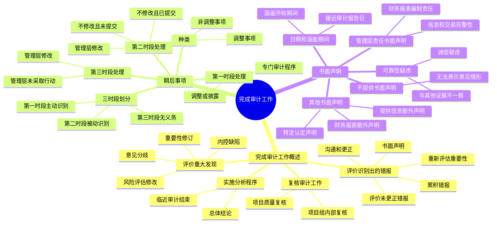

## 1. 章节定位

| 项目 | 信息 |
|------|------|
| 所属科目 | 审计 |
| 难度等级 | 3 |
| 历年分值 | 6-10 分 |
| 建议学时 | 5-7 小时 |
| 知识关联章节 | 第6章 审计计划、第7章 风险评估、第8章 风险应对、第18章 其他特殊项目审计、第20章 审计报告、第24章 业务质量管理 |

## 2. 考情分析

本章历年分值约 6-10 分，是审计完成阶段的核心章节，与第20章审计报告关系密切。内容由三部分构成：完成审计工作概述（评价重大发现、评价错报、实施分析程序、复核审计工作）、期后事项（三时段划分及注册会计师的不同责任）、书面声明（管理层责任书面声明、其他书面声明、日期与涵盖期间、可靠性疑虑及不提供的处理）。

**命题规律**：期后事项三时段划分及各时段注册会计师的责任和处理是历年必考内容，常以简答题或综合题形式出现；未更正错报的评价（含定性因素）和重要性重新评估是高频考点；书面声明的日期、涵盖期间及管理层不提供书面声明的处理是客观题和简答题的高频考点；项目质量复核与项目组内部复核的区别在近年命题中比例上升。

**联动考查方式**：

- 与第6章审计计划结合：未更正错报评价时重新评估重要性、实际执行的重要性；
- 与第7、8章风险评估和风险应对结合：评价重大发现可能修改重大错报风险评估结果及进一步审计程序；
- 与第18章特殊项目审计结合：会计估计、关联方、持续经营、期初余额相关书面声明；
- 与第20章审计报告结合：期后事项对审计报告日期的影响、书面声明不可靠导致的审计意见类型；
- 与第24章业务质量管理结合：项目质量复核的适用情形和复核内容。

**备考建议**：

- 牢记期后事项三时段划分的时间节点和注册会计师责任差异（主动识别、被动识别、无义务识别）；
- 掌握各时段管理层修改或不修改财务报表时注册会计师的处理程序；
- 熟悉未更正错报评价时应考虑的定性因素（11 项情形）；
- 牢记针对管理层责任的书面声明不可或缺，管理层不提供或不可靠时应发表无法表示意见；
- 区分项目组内部复核与项目质量复核的复核人员、范围和目的。

## 3. 知识框架

## 4. 核心精讲

### 4.1 完成审计工作概述

完成审计工作阶段是审计的最后一个阶段。注册会计师按业务循环完成各财务报表项目的审计测试和一些特殊项目的审计工作后，在完成审计工作阶段汇总审计测试结果，进行更具综合性的审计工作，包括评价审计中的重大发现、评价审计过程中识别出的错报、关注期后事项对财务报表的影响、复核审计工作底稿和财务报表、获取管理层书面声明、确定审计报告意见类型和措辞、编制并致送审计报告。实务中这些工作未必机械地按上述顺序依次进行。

#### 4.1.1 评价审计中的重大发现

**重大发现和事项的例子**：①期中复核中的重大发现及其对审计方法的影响；②涉及会计政策的选择、运用和一贯性的重大事项；③就识别出的特别风险，对总体审计策略和具体审计计划所作的重大修改；④在与管理层和其他人员讨论重大发现和事项时得到的信息；⑤与注册会计师的最终审计结论相矛盾或不一致的信息。

**对审计程序结果的评价可能揭示出的事项**：①是否有必要对重要性进行修订；②对总体审计策略和具体审计计划的重大修改（含重大错报风险评估结果的重要修改）；③对审计方法有重要影响的值得关注的内部控制缺陷和其他缺陷；④财务报表中存在的重大错报；⑤项目组内部、或项目组与项目质量复核人员或咨询人员之间，就重大会计和审计事项达成最终结论所存在的意见分歧；⑥审计工作中遇到的重大困难；⑦向事务所内部有经验的专业人士或外部专业顾问咨询的事项；⑧与管理层或其他人员就重大发现以及与最终审计结论相矛盾或不一致的信息进行的讨论。

#### 4.1.2 评价审计过程中识别出的错报

注册会计师的目标是：①评价识别出的错报对审计的影响；②评价未更正错报对财务报表的影响。**未更正错报**是指注册会计师在审计过程中累积的且被审计单位未予更正的错报。

**1. 累积识别出的错报**：注册会计师应当累积审计过程中识别出的错报，除非错报明显微小。

**2. 随着审计的推进考虑识别出的错报**：出现下列情形之一时，应当确定是否需要修改总体审计策略和具体审计计划：①识别出的错报的性质以及错报发生的环境表明可能存在其他错报，并且可能存在的其他错报与审计过程中累积的错报合计起来可能是重大的；②审计过程中累积的错报合计数接近按照审计准则第 1221 号规定确定的重要性。如果管理层应注册会计师的要求检查了某类交易、账户余额或披露并更正了已发现的错报，应当实施追加的审计程序，以确定错报是否仍然存在。

**3. 沟通和更正错报**：除非法律法规禁止，应当及时将审计过程中累积的所有错报（即超过明显微小错报临界值的所有错报）与适当层级的管理层进行沟通，并要求管理层更正这些错报。**适当层级的管理层**通常是指有责任和权限对错报进行评价并采取必要行动的人员。法律法规可能限制就某些错报与管理层沟通（如沟通可能不利于对违反法律法规行为进行调查）。管理层更正所有错报能够保持会计账簿和记录的准确性，降低由于与本期相关的、非重大的且尚未更正的错报的累积影响而导致未来期间财务报表出现重大错报的风险。如果管理层拒绝更正沟通的部分或全部错报，应当了解不更正错报的理由，并在评价财务报表整体是否不存在重大错报时考虑该理由（含考虑被审计单位会计实务的质量及表明管理层判断可能出现偏向的迹象）。

**4. 评价未更正错报的影响**：

（1）**重新评估重要性**。在评价未更正错报的影响之前，应当重新评估按照审计准则第 1221 号规定确定的重要性，以根据被审计单位的实际财务结果确认其是否适当。这是因为确定重要性时通常依据对财务结果的估计，此时可能尚不知道实际财务结果。如果重新评估导致需要确定较低的金额，则应重新考虑实际执行的重要性和进一步审计程序的性质、时间安排和范围的适当性。**举例**：计划阶段财务报表整体的重要性 100 万元（经常性业务的税前利润 2000 万元×5%），实际执行的重要性 50 万元。审计中识别出若干项重大错报，管理层同意调整，合计调减税前利润 800 万元。评价未更正错报之前，根据调整后的税前利润 1200 万元，重新计算财务报表整体的重要性 60 万元和实际执行的重要性 30 万元。需要考虑：①识别出的重大错报 800 万元远远超出计划阶段财务报表整体的重要性 100 万元，表明存在比可接受的低风险水平更大的风险，需要重新考虑对重大错报风险的评估结果及其应对措施；②基于调整后的实际执行的重要性，已经实施的审计程序是否充分（如实际执行的重要性降低可能意味着审计抽样实施细节测试时需要增加样本量）；③应当用调整后的财务报表整体的重要性 60 万元评价未更正错报是否重大。

（2）**确定未更正错报单独或汇总起来是否重大**。应当考虑：①相对特定的交易类别、账户余额或披露以及财务报表整体而言，错报的金额和性质以及错报发生的特定环境；②与以前期间相关的未更正错报对有关的交易类别、账户余额或披露以及财务报表整体的影响。

**定量与定性因素**：除考虑未更正错报单独或连同其他未更正错报的金额是否超过财务报表整体的重要性（定量因素）外，还需要考虑错报性质以及错报发生的特定环境（定性因素）。如果认为某一单项错报是重大的，则该项错报不太可能被其他错报抵销。例如，如果收入存在重大高估，即使这项错报对收益的影响完全可被相同金额的费用高估所抵销，仍认为财务报表整体存在重大错报。对于同一账户余额或同一交易类别内部的错报，这种抵销可能是适当的，但在得出抵销非重大错报是适当的这一结论之前，需要考虑可能存在其他未被发现的错报的风险。

**分类错报**：确定一项分类错报是否重大，需要进行定性评估。即使分类错报超过了在评价其他错报时运用的重要性水平，可能仍然认为该分类错报对财务报表整体不产生重大影响。例如，资产负债表项目之间的分类错报金额相对于所影响的资产负债表项目金额较小，并且对利润表或所有关键比率以及披露不产生影响。

**可能影响评估的情况（错报低于财务报表整体重要性但评价为重大错报的情形）**：①对遵守监管要求的影响程度；②对遵守债务合同或其他合同条款的影响程度；③与会计政策的不正确选择或运用相关，对当期不产生重大影响但可能对未来期间产生重大影响；④掩盖收益的变化或其他趋势的程度（结合宏观经济背景和行业状况）；⑤对评价财务状况、经营成果或现金流量的有关比率的影响程度；⑥对财务报表中列报的分部信息的影响程度；⑦对增加管理层薪酬的影响程度（如达到奖金或激励政策规定的要求）；⑧相对于以前向财务报表使用者传达的信息（如盈利预测），错报是重大的；⑨对涉及特定机构或人员的项目的相关程度（如外部机构或人员与管理层成员存在关联关系）；⑩涉及对某些信息的遗漏，尽管适用的财务报告编制基础未明确规定，但根据职业判断认为对使用者了解财务状况、经营成果或现金流量是重要的；⑪对其他信息（如"管理层讨论与分析"或"经营与财务回顾"中的信息）的影响程度，这些信息与已审计财务报表一同披露，并可能影响使用者作出的经济决策。

**与治理层沟通**：除非法律法规禁止，应当与治理层沟通未更正错报，以及这些错报单独或汇总起来可能对审计意见产生的影响。沟通时应当逐项指明重大的未更正错报。如果存在大量单项不重大的未更正错报，可能就未更正错报的笔数和总金额的影响进行沟通，而不是逐笔沟通单项细节。还应当与治理层沟通与以前期间相关的未更正错报对有关的交易类别、账户余额或披露以及财务报表整体的影响。

**5. 书面声明**：应当要求管理层和治理层（如适用）提供书面声明，说明其是否认为未更正错报单独或汇总起来对财务报表整体的影响不重大。这些错报项目的概要应当包含在书面声明中或附在其后。在某些情况下，管理层和治理层可能并不认为注册会计师提出的某些未更正的错报是错报，可能在书面声明中增加表述："因为[描述理由]，我们不同意……事项和……事项构成错报。"然而，即使获取了这一声明，注册会计师仍需要对未更正错报的影响形成结论。

#### 4.1.3 实施分析程序

在临近审计结束时，应当运用分析程序，帮助其对财务报表形成总体结论，以确定财务报表是否与其对被审计单位的了解一致。实施分析程序的结果可能有助于识别出以前未识别的重大错报风险，在这种情况下，需要修改重大错报风险的评估结果，并相应修改原计划实施的进一步审计程序。

**注意**：分析程序在审计的不同阶段有不同的用途。在风险评估阶段用作风险评估程序；在实质性程序阶段用作实质性程序（当其比细节测试更能将认定层次风险降至可接受低水平时）；在临近审计结束时用作总体复核。本章所述为总体复核用途。

#### 4.1.4 复核审计工作

对审计工作的复核包括项目组内部复核和作为会计师事务所业务质量管理措施而实施的项目质量复核（如适用）。

**1. 项目组内部复核**：

（1）**复核人员**：会计师事务所针对业务执行的质量目标应当包括由经验较为丰富的项目组成员对经验较为缺乏的项目组成员的工作进行指导、监督和复核。对一些较为复杂、审计风险较高的领域（如舞弊风险的评估与应对、重大会计估计及其他复杂的会计问题、审核会议记录和重大合同、关联方关系和交易、持续经营存在的问题等），需要指派经验丰富的项目组成员实施复核，必要时可以由项目合伙人实施复核。

（2）**复核范围**：实施复核时需要考虑的事项包括：①审计工作是否已按照职业准则和适用的法律法规的规定执行；②重大事项是否已提请进一步考虑；③相关事项是否已进行适当咨询，由此形成的结论是否已得到记录和执行；④是否需要修改已执行审计工作的性质、时间安排和范围；⑤已执行的审计工作是否支持形成的结论，并已得到适当记录；⑥已获取的审计证据是否充分、适当；⑦审计程序的目标是否已实现。

（3）**复核时间**：审计项目复核贯穿审计全过程。在审计计划阶段复核记录总体审计策略和具体审计计划的审计工作底稿；在审计执行阶段复核记录控制测试和实质性程序的审计工作底稿；在完成审计工作阶段复核记录重大事项、审计调整及未更正错报的审计工作底稿。

（4）**项目合伙人复核**：项目合伙人应当对管理和实现审计项目的高质量承担总体责任。应当在审计过程中的适当时点复核审计工作底稿，包括与下列方面相关的工作底稿：①重大事项；②重大判断，包括与在审计中遇到的困难或有争议事项相关的判断，以及得出的结论；③根据项目合伙人的职业判断，与项目合伙人的职责有关的其他事项。在审计报告日或审计报告日之前，项目合伙人应当通过复核审计工作底稿与项目组讨论，确信已获取充分、适当的审计证据，支持得出的结论和拟出具的审计报告。此外，项目合伙人应当在签署审计报告前复核财务报表、审计报告以及相关的审计工作底稿，包括对关键审计事项的描述（如适用）；还应当在与管理层、治理层或相关监管机构签署正式书面沟通文件之前对其进行复核。审计准则第 1131 号要求项目合伙人记录复核的范围和时间。

**2. 项目质量复核**：根据会计师事务所质量管理准则第 5101 号的规定，会计师事务所应当就项目质量复核制定政策和程序，并对下列业务实施项目质量复核：①上市实体财务报表审计业务；②法律法规要求实施项目质量复核的审计业务或其他业务；③会计师事务所认为，为应对一项或多项质量风险，有必要实施项目质量复核的审计业务或其他业务。详细内容将在第24章第二节阐述。

### 4.2 期后事项

企业的经营活动是连续不断、持续进行的，但财务报表的编制建立在"会计分期假设"基础之上。注册会计师在审计被审计单位某一会计年度的财务报表时，除了对所审会计年度内发生的交易和事项实施必要的审计程序外，还必须考虑所审会计年度之后发生和发现的事项对财务报表和审计报告的影响。

#### 4.2.1 期后事项的种类

**期后事项**是指财务报表日至审计报告日之间发生的事项，以及注册会计师在审计报告日后知悉的事实。适用的财务报告编制基础通常将期后事项区分为两类：

**1. 财务报表日后调整事项**：对财务报表日已经存在的情况提供证据的事项，影响财务报表金额，需提请管理层调整财务报表及与之相关的披露信息。诸如：①财务报表日后诉讼案件结案，法院判决证实了企业在财务报表日已经存在现时义务，需要调整原先确认的与该诉讼案件相关的预计负债，或确认一项新负债；②财务报表日后取得确凿证据，表明某项资产在财务报表日发生了减值或者需要调整该项资产原先确认的减值金额；③财务报表日后进一步确定了财务报表日前购入资产的成本或售出资产的收入；④财务报表日后发现了财务报表舞弊或差错。

**2. 财务报表日后非调整事项**：对财务报表日后发生的情况提供证据的事项，不影响财务报表金额，但可能影响对财务报表的正确理解，需提请管理层在财务报表附注中作适当披露。通常包括：①发生重大诉讼、仲裁、承诺；②资产价格、税收政策、外汇汇率发生重大变化；③因自然灾害导致资产发生重大损失；④发行股票和债券以及其他巨额举债；⑤资本公积转增资本；⑥发生巨额亏损；⑦发生企业合并或处置子公司；⑧企业利润分配方案中拟分配的以及经审议批准宣告发放的股利或利润。

**重要提示**：利用期后事项审计以确认被审计单位财务报表所列金额时，应对财务报表日已经存在的事项和财务报表日后出现的事项严加区分，不能混淆。如果确认发生变化的事项直到财务报表日后才发生，就不应将财务报表日后的信息并入财务报表中。

#### 4.2.2 期后事项的三个时段

根据期后事项的定义，期后事项可划分为三个时段：

| 时段 | 时间范围 | 注册会计师责任 |
|------|----------|----------------|
| 第一时段期后事项 | 财务报表日至审计报告日 | 主动识别 |
| 第二时段期后事项 | 审计报告日后至财务报表报出日 | 被动识别（无义务主动实施程序） |
| 第三时段期后事项 | 财务报表报出日后 | 没有义务识别（但知悉后需采取行动） |

**关键日期定义**：财务报表日是指财务报表涵盖的最近期间的截止日期；财务报表批准日是指构成整套财务报表的所有报表（含披露）已编制完成，并且被审计单位的董事会、管理层或类似机构已经认可其对财务报表负责的日期；财务报表报出日是指审计报告和已审计财务报表提供给第三方的日期。审计报告日不应早于注册会计师获取充分、适当的审计证据（包括管理层认可对财务报表的责任且已批准财务报表的证据），并在此基础上对财务报表形成审计意见的日期。实务中审计报告日与财务报表批准日通常是相同的日期。

#### 4.2.3 第一时段期后事项——主动识别

**1. 主动识别义务**：注册会计师应当设计和实施审计程序，获取充分、适当的审计证据，以确定所有在财务报表日至审计报告日之间发生的、需要在财务报表中调整或披露的事项均已得到识别。但不需要对之前已实施审计程序并已得出满意结论的事项实施追加的审计程序。对于第一时段的期后事项，注册会计师负有主动识别的义务，应当设计专门的审计程序来识别这些期后事项，并根据这些事项的性质判断其对财务报表的影响，进而确定是进行调整还是披露。

**2. 用以识别期后事项的审计程序**：应当使审计程序能够涵盖财务报表日至审计报告日（或尽可能接近审计报告日）之间的期间。通常针对期后事项的专门审计程序，实施时间越接近审计报告日越好——越接近审计报告日，距离财务报表日越远，被审计单位这段时间内累积的对财务报表日已经存在的情况提供的进一步证据也就越多，同时注册会计师遗漏期后事项的可能性也就越小。在确定审计程序的性质和范围时，应当考虑风险评估的结果。这些程序应当包括：①了解管理层为确保识别期后事项而建立的程序；②询问管理层和治理层（如适用），确定是否已发生可能影响财务报表的期后事项（可询问根据初步或尚无定论的数据作出会计处理的项目的现状，以及是否已发生新的承诺、借款或担保，是否计划出售或购置资产等）；③查阅被审计单位的所有者、管理层和治理层在财务报表日后举行会议的纪要，在不能获取会议纪要的情况下，询问此类会议讨论的事项；④查阅被审计单位最近的中期财务报表（如有）。

除上述程序外，可能认为实施下列一项或多项审计程序是必要和适当的：①查阅被审计单位在财务报表日后最近期间内的预算、现金流量预测和其他相关的管理报告；②就诉讼和索赔事项询问被审计单位的法律顾问，或扩大之前口头或书面查询的范围；③考虑是否有必要获取涵盖特定期后事项的书面声明以支持其他审计证据。

**3. 知悉对财务报表有重大影响的期后事项时的考虑**：识别出对财务报表有重大影响的期后事项，应当确定这些事项是否按照适用的财务报告编制基础的规定在财务报表中得到恰当反映。如果所知悉的期后事项属于调整事项，应当考虑被审计单位是否已对财务报表作出适当的调整；如果属于非调整事项，应当考虑被审计单位是否在财务报表附注中予以充分披露。

**4. 书面声明**：应当要求管理层和治理层（如适用）提供书面声明，确认所有在财务报表日后发生的、按照适用的财务报告编制基础的规定应予调整或披露的事项均已得到调整或披露。

#### 4.2.4 第二时段期后事项——被动识别

**1. 被动识别义务**：在审计报告日后，注册会计师没有义务针对财务报表实施任何审计程序。审计报告日后至财务报表报出日前发现的事实属于第二时段期后事项。注册会计师针对被审计单位的审计业务已经结束，要识别可能存在的期后事项比较困难，因而无法承担主动识别第二时段期后事项的审计责任。但管理层有责任将发现的可能影响财务报表的事实告知注册会计师，注册会计师还可能从媒体报道、举报信或者证券监管部门告知等途径获悉影响财务报表的期后事项。

**2. 知悉第二时段期后事项时的考虑**：在审计报告日后至财务报表报出日前，如果知悉了某事实，且若在审计报告日知悉可能导致修改审计报告，应当：①与管理层和治理层（如适用）讨论该事项；②确定财务报表是否需要修改；③如果需要修改，询问管理层将如何在财务报表中处理该事项。

（1）**管理层修改财务报表时的处理**：应当根据具体情况对有关修改实施必要的审计程序；同时，除非特定情形适用，应当将用以识别期后事项的上述审计程序延伸至新的审计报告日，并针对修改后的财务报表出具新的审计报告。新的审计报告日不应早于修改后的财务报表被批准的日期。需要获取充分、适当的审计证据，以验证管理层根据期后事项所作出的财务报表调整或披露是否符合适用的财务报告编制基础的规定。

**特定情形**：在有关法律法规或适用的财务报告编制基础未禁止的情况下，如果管理层对财务报表的修改仅限于反映导致修改的期后事项的影响，董事会、管理层或类似机构也仅对有关修改进行批准，可以仅针对有关修改将用以识别期后事项的审计程序延伸至新的审计报告日。此时应当选用下列处理方式之一：①修改审计报告，针对财务报表修改部分增加补充报告日期，从而表明对期后事项实施的审计程序仅限于财务报表相关附注所述的修改（原审计报告日期保持不变）；②出具新的或经修改的审计报告，在强调事项段或其他事项段中说明对期后事项实施的审计程序仅限于财务报表相关附注所述的修改。

（2）**管理层不修改财务报表且审计报告未提交时的处理**：如果认为管理层应当修改财务报表而没有修改，并且审计报告尚未提交给被审计单位，应当按照审计准则第 1502 号的规定发表非无保留意见，然后再提交审计报告。

（3）**管理层不修改财务报表且审计报告已提交时的处理**：如果认为管理层应当修改财务报表而没有修改，并且审计报告已经提交给被审计单位，应当通知管理层和治理层（除非治理层全部成员参与管理被审计单位）在财务报表作出必要修改前不要向第三方报出。如果财务报表在未经必要修改的情况下仍被报出，应当采取适当措施，以设法防止财务报表使用者信赖该审计报告。例如，针对上市公司，注册会计师可以利用证券传媒等刊登必要的声明，防止使用者信赖审计报告。采取的措施取决于自身的权利和义务以及所征询的法律意见。

#### 4.2.5 第三时段期后事项——无义务识别

**1. 没有义务识别第三时段的期后事项**：财务报表报出日后知悉的事实属于第三时段期后事项，注册会计师没有义务针对财务报表实施任何审计程序。但不排除通过媒体等其他途径获悉可能对财务报表产生重大影响的期后事项的可能性。

**2. 知悉第三时段期后事项时的考虑**：在财务报表报出后，如果知悉了某事实，且若在审计报告日知悉可能导致修改审计报告，应当：①与管理层和治理层（如适用）讨论该事项；②确定财务报表是否需要修改；③如果需要修改，询问管理层将如何在财务报表中处理该事项。

**需要采取行动的第三时段期后事项的严格限制**：①这类期后事项应当是在审计报告日已经存在的事实；②该事实如果在审计报告日前获知，可能影响审计报告。只有同时满足这两个条件，注册会计师才需要采取行动。

（1）**管理层修改财务报表时的处理**：应当采取下列措施：①根据具体情况对有关修改实施必要的审计程序（如查阅法院判决文件、复核会计处理或披露事项，确定修改是否恰当）；②复核管理层采取的措施能否确保所有收到原财务报表和审计报告的人士了解这一情况（如上市公司在证券类报纸、网站刊登公告重新公布，注册会计师需复核媒体是否为证监会指定媒体）；③延伸实施审计程序，并针对修改后的财务报表出具新的审计报告，新的审计报告日不应早于修改后的财务报表被批准的日期。除非特定情形适用，将用以识别期后事项的审计程序延伸至新的审计报告日。在特定情形下，可以修改审计报告或提供新的审计报告，并增加强调事项段或其他事项段，提醒财务报表使用者关注财务报表附注中有关修改原财务报表的详细原因和注册会计师提供的原审计报告。

（2）**管理层未采取任何行动时的处理**：如果管理层没有采取必要措施确保所有收到原财务报表的人士了解这一情况，也没有在注册会计师认为需要修改的情况下修改财务报表，应当通知管理层和治理层（除非治理层全部成员参与管理被审计单位），设法防止财务报表使用者信赖该审计报告。如果已经通知管理层或治理层，而管理层或治理层没有采取必要措施，应当采取适当措施，以设法防止财务报表使用者信赖该审计报告。采取的措施取决于自身的权利和义务，可能认为寻求法律意见是适当的。

### 4.3 书面声明

**书面声明**是指管理层向注册会计师提供的书面陈述，用以确认某些事项或支持其他审计证据。书面声明不包括财务报表及其认定，以及支持性账簿和相关记录。本节中单独提及管理层时，应当理解为管理层和治理层（如适用）。管理层负责按照适用的财务报告编制基础编制财务报表并使其实现公允反映。

**书面声明的作用与局限**：书面声明是审计证据的重要来源，是注册会计师在财务报表审计中需要获取的必要信息。如果管理层修改书面声明的内容或不提供要求的书面声明，可能使注册会计师警觉存在重大问题的可能性。要求管理层提供书面声明而非口头声明，可以促使管理层更加认真地考虑声明所涉及的事项，提高声明的质量。尽管书面声明提供了必要的审计证据，但其本身并不为所涉及的任何事项提供充分、适当的审计证据；管理层已提供可靠书面声明的事实，并不影响注册会计师就管理层责任履行情况或具体认定获取的其他审计证据的性质和范围。

#### 4.3.1 针对管理层责任的书面声明

**1. 针对财务报表编制的书面声明**：应当要求管理层提供书面声明，确认其根据审计业务约定条款，履行了按照适用的财务报告编制基础编制财务报表并使其实现公允反映（如适用）的责任。

**2. 针对提供的信息和交易完整性的书面声明**：应当要求管理层就下列事项提供书面声明：①按照审计业务约定条款，已向注册会计师提供所有相关信息，并允许注册会计师不受限制地接触所有相关信息以及被审计单位内部人员和其他相关人员；②所有交易均已记录并反映在财务报表中。

**重要原则**：如果未从管理层获取其确认已履行责任的书面声明，注册会计师在审计过程中获取的有关管理层已履行这些责任的其他审计证据是不充分的。这是因为，仅凭其他审计证据不能判断管理层是否在认可并理解其责任的基础上，编制和列报财务报表并向注册会计师提供了相关信息。

**再次确认管理层责任的情形**：基于管理层认可并理解在审计业务约定条款中提及的管理层的责任，可能还要求管理层在书面声明中再次确认其对自身责任的认可与理解。当存在下列情况时，这种确认尤为适当：①代表被审计单位签订审计业务约定条款的人员不再承担相关责任；②审计业务约定条款是在以前年度签订的；③有迹象表明管理层误解了其责任；④情况的改变需要管理层再次确认其责任。

#### 4.3.2 其他书面声明

除审计准则第 1341 号和其他审计准则要求的书面声明外，如果认为有必要获取一项或多项其他书面声明，以支持与财务报表或者一项或多项具体认定相关的其他审计证据，应当要求管理层提供这些书面声明。

**1. 关于财务报表的额外书面声明**：其他书面声明可能是对基本书面声明的补充，但不构成其组成部分。可能包括针对下列事项作出的声明：①会计政策的选择和运用是否适当；②是否按照适用的财务报告编制基础对下列事项（如相关）进行了确认、计量、列报或披露：可能影响资产和负债账面价值或分类的计划或意图；负债（包括实际负债和或有负债）；资产的所有权或控制权，资产的留置权或其他物权，用于担保的抵押资产；可能影响财务报表的法律法规及合同（包括违反法律法规及合同的行为）。

**2. 与向注册会计师提供信息有关的额外书面声明**：可能有必要要求管理层提供书面声明，确认其已将注意到的所有内部控制缺陷向注册会计师通报。

**3. 关于特定认定的书面声明**：在获取或评价有关管理层判断和意图的证据时，可能考虑：①被审计单位以前对声明的意图的实际实施情况；②选取特定措施的理由；③实施特定措施的能力；④是否存在审计过程中已获取的、可能与管理层判断或意图不一致的任何其他信息。此外，可能有必要要求管理层提供有关财务报表特定认定的书面声明，尤其是支持就管理层的判断或意图或者完整性认定从其他审计证据中获取的了解。例如，如果管理层的意图对投资的计价基础非常重要，但若不能从管理层获取有关该项投资意图的书面声明，就不可能获取充分、适当的审计证据。尽管这些书面声明能够提供必要的审计证据，但其本身并不能为财务报表特定认定提供充分、适当的审计证据。

#### 4.3.3 书面声明的日期和涵盖的期间

由于书面声明是必要的审计证据，在管理层签署书面声明前，注册会计师不能发表审计意见，也不能签署审计报告。由于注册会计师关注截至审计报告日发生的、可能需要在财务报表中作出相应调整或披露的事项，书面声明的日期应当尽量接近对财务报表出具审计报告的日期，但不得在其之后。书面声明应当涵盖审计报告针对的所有财务报表和期间。

**更新书面声明**：在某些情况下，在审计过程中获取有关财务报表特定认定的书面声明可能是适当的，可能有必要要求管理层更新书面声明。管理层有时需要再次确认以前期间作出的书面声明是否依然适当，因此书面声明需要涵盖审计报告中提及的所有期间。更新后的书面声明需要表明以前期间所作的声明是否发生了变化，以及发生了什么变化（如有）。

**现任管理层尚未就任的情形**：在审计报告中提及的所有期间内，现任管理层均尚未就任的，可能声称无法就上述期间提供部分或全部书面声明。然而，这一事实并不能减轻现任管理层对财务报表整体的责任，注册会计师仍然需要向现任管理层获取涵盖整个相关期间的书面声明。

#### 4.3.4 书面声明的形式

书面声明应当以声明书的形式致送注册会计师。声明书通常包含两大部分：①财务报表（确认履行编制和公允反映责任、会计估计方法和假设数据适当、关联方关系及交易恰当处理披露、所有需要调整或披露的资产负债表日后事项都已调整或披露、未更正错报汇总表附后等）；②提供的信息（允许接触所有相关信息、所有交易均已记录并反映在财务报表中、已披露舞弊导致的重大错报风险评估结果、已披露注意到的舞弊或舞弊嫌疑信息、已披露违反或涉嫌违反法律法规的行为、已披露关联方的名称和特征及关联方关系及其交易等）。

#### 4.3.5 对书面声明可靠性的疑虑以及管理层不提供要求的书面声明

**1. 对书面声明可靠性的疑虑**：

（1）**对管理层的胜任能力、诚信、道德价值观或勤勉尽责存在疑虑**：应当确定这些疑虑对书面或口头声明和审计证据总体的可靠性可能产生的影响。可能认为管理层在财务报表中作出不实陈述的风险很大，以至于审计工作无法进行。在这种情况下，除非治理层采取适当的纠正措施，否则可能需要考虑解除业务约定（如果法律法规允许）。很多时候，治理层采取的纠正措施可能并不足以使注册会计师发表无保留意见。

（2）**书面声明与其他审计证据不一致**：应当实施审计程序以设法解决这些问题。可能需要考虑风险评估结果是否仍然适当，如认为不适当，需要修改风险评估结果，并确定进一步审计程序的性质、时间安排和范围。如果问题仍未解决，应当重新考虑对管理层的胜任能力、诚信、道德价值观或勤勉尽责的评估，并确定不一致对书面或口头声明和审计证据总体的可靠性可能产生的影响。如果认为书面声明不可靠，应当采取适当措施，包括确定其对审计意见可能产生的影响。

**2. 管理层不提供要求的书面声明**：如果管理层不提供要求的一项或多项书面声明，应当：①与管理层讨论该事项；②重新评价管理层的诚信，并评价该事项对书面或口头声明和审计证据总体的可靠性可能产生的影响；③采取适当措施，包括确定该事项对审计意见可能产生的影响。

**无法表示意见的情形**：如果存在下列情形之一，应当对财务报表发表无法表示意见：①注册会计师对管理层的诚信产生重大疑虑，以至于认为其针对管理层责任作出的书面声明不可靠；②管理层不提供针对管理层责任的书面声明。

**针对管理层责任的书面声明包括**：①针对财务报表的编制，管理层确认其根据审计业务约定条款，履行了按照适用的财务报告编制基础编制财务报表并使其实现公允反映（如适用）的责任；②针对提供的信息和交易的完整性，管理层确认：按照审计业务约定条款，已向注册会计师提供所有相关信息，并允许不受限制地接触所有相关信息以及被审计单位内部人员和其他相关人员；所有交易均已记录并反映在财务报表中。

**理由**：仅凭其他审计证据，不能判断管理层是否履行了上述两方面的责任。因此，如果认为有关这些事项的书面声明不可靠，或者管理层不提供有关这些事项的书面声明，则无法获取充分、适当的审计证据，这对财务报表的影响可能是广泛的，并不局限于财务报表的特定要素、账户或项目。在这种情况下，应当按照审计准则第 1502 号的规定，对财务报表发表无法表示意见。

## 5. 典型例题

**【例题 1】（期后事项三时段的处理）**

ABC 会计师事务所审计甲公司 2×24 年度财务报表，财务报表日为 2×24 年 12 月 31 日，审计报告日为 2×25 年 3 月 5 日，财务报表报出日为 2×25 年 3 月 20 日。审计项目组在审计过程中遇到下列与期后事项相关的事项：（1）2×25 年 2 月 10 日，甲公司某一债务人突然破产，该笔应收账款账面价值 500 万元，已计提坏账准备 50 万元；（2）2×25 年 3 月 10 日，即审计报告日后，甲公司因 2×24 年之前发生的诉讼案件被法院判决赔偿 800 万元；（3）2×25 年 4 月 15 日，即财务报表报出日后，知悉甲公司在 2×24 年 11 月发生的一笔销售存在重大差错，少计收入 600 万元。要求：分别针对上述三种情形，指出属于哪一时段的期后事项，并说明注册会计师应采取的处理措施。

**答案**：

情形（1）属于第一时段期后事项。理由：发生在财务报表日至审计报告日之间。处理措施：注册会计师负有主动识别义务。由于债务人在 2×25 年 2 月 10 日破产，表明其在财务报表日 2×24 年 12 月 31 日财务状况已经恶化，属于财务报表日后调整事项。应当考虑提请甲公司计提或增加计提坏账准备，调整财务报表有关项目的金额。

情形（2）属于第二时段期后事项。理由：发生在审计报告日后至财务报表报出日前。处理措施：注册会计师没有义务主动实施审计程序识别，但知悉后应当：①与管理层和治理层讨论该事项；②确定财务报表是否需要修改；③如果需要修改，询问管理层将如何在财务报表中处理该事项。若管理层修改财务报表，应当对有关修改实施必要的审计程序，将用以识别期后事项的审计程序延伸至新的审计报告日，并针对修改后的财务报表出具新的审计报告；若管理层不修改且审计报告尚未提交，应当发表非无保留意见后再提交；若管理层不修改且审计报告已提交，应当通知管理层和治理层在财务报表作出必要修改前不要向第三方报出，如已报出应设法防止使用者信赖审计报告。

情形（3）属于第三时段期后事项。理由：发生在财务报表报出日后。处理措施：注册会计师没有义务针对财务报表实施任何审计程序。但知悉后应当：①与管理层和治理层讨论该事项；②确定财务报表是否需要修改；③如果需要修改，询问管理层将如何在财务报表中处理该事项。若管理层修改财务报表，应当实施必要的审计程序，复核管理层采取的措施能否确保所有收到原财务报表和审计报告的人士了解这一情况，延伸实施审计程序并针对修改后的财务报表出具新的审计报告；若管理层未采取行动，应当通知管理层和治理层，并设法防止财务报表使用者信赖该审计报告。

**解析**：期后事项三时段划分是高频考点。解题关键：①先判断时段（按时间节点）；②各时段注册会计师责任不同（主动识别、被动识别、无义务）；③调整事项与非调整事项的区分（财务报表日是否已存在）；④管理层修改与不修改的处理程序不同。

**【例题 2】（书面声明不可靠及不提供的处理）**

ABC 会计师事务所审计甲公司 2×24 年度财务报表。审计项目组在审计过程中遇到下列与书面声明相关的事项：（1）项目组对管理层的诚信产生重大疑虑，认为其针对管理层责任作出的书面声明不可靠；（2）管理层拒绝提供针对管理层责任的书面声明，但愿意提供其他书面声明；（3）管理层提供的书面声明与其他审计证据存在不一致。要求：分别针对上述三种情形，说明注册会计师应当采取的处理措施。

**答案**：

情形（1）：注册会计师对管理层的诚信产生重大疑虑，以至于认为其针对管理层责任作出的书面声明不可靠，应当对财务报表发表无法表示意见。在形成无法表示意见前，应当与管理层讨论该事项，重新评价管理层的诚信，并评价该事项对书面或口头声明和审计证据总体的可靠性可能产生的影响。如果认为管理层作出不实陈述的风险很大，以至于审计工作无法进行，除非治理层采取适当的纠正措施，否则可能需要考虑解除业务约定（如果法律法规允许）。

情形（2）：管理层不提供针对管理层责任的书面声明，应当对财务报表发表无法表示意见。理由：针对管理层责任的书面声明是不可或缺的，仅凭其他审计证据不能判断管理层是否履行了编制和列报财务报表并提供相关信息方面的责任。管理层愿意提供其他书面声明不能替代针对管理层责任的书面声明。在发表无法表示意见前，应当与管理层讨论该事项，重新评价管理层的诚信，并评价该事项对书面或口头声明和审计证据总体的可靠性可能产生的影响。

情形（3）：如果书面声明与其他审计证据不一致，应当实施审计程序以设法解决这些问题。可能需要考虑风险评估结果是否仍然适当，如认为不适当，需要修改风险评估结果，并确定进一步审计程序的性质、时间安排和范围。如果问题仍未解决，应当重新考虑对管理层的胜任能力、诚信、道德价值观或勤勉尽责的评估，并确定不一致对书面或口头声明和审计证据总体的可靠性可能产生的影响。如果认为书面声明不可靠，应当采取适当措施，包括确定其对审计意见可能产生的影响。

**解析**：书面声明的核心考点是针对管理层责任的书面声明不可或缺。情形（1）和（2）都应当发表无法表示意见，区别在于"声明不可靠"与"不提供声明"。情形（3）强调不一致时需先实施程序解决，问题仍未解决才需重新评估管理层诚信及对审计意见的影响。

**【例题 3】（未更正错报的评价及重要性重新评估）**

ABC 会计师事务所审计甲公司 2×24 年度财务报表，计划阶段确定的财务报表整体的重要性为 100 万元（经常性业务税前利润 2000 万元×5%），实际执行的重要性为 50 万元。审计过程中识别出若干项重大错报，管理层同意调整，合计调减税前利润 800 万元。审计完成阶段注册会计师识别出未更正错报合计 70 万元，其中收入高估 40 万元，费用低估 30 万元。要求：说明注册会计师在评价未更正错报前应当实施的工作，并评价未更正错报对审计意见的影响。

**答案**：

注册会计师在评价未更正错报前应当重新评估重要性。根据调整后的税前利润 1200 万元（2000-800），重新计算财务报表整体的重要性为 60 万元（1200×5%），实际执行的重要性为 30 万元。需要考虑：①识别出的重大错报 800 万元远远超出计划阶段财务报表整体的重要性 100 万元，表明存在比可接受的低风险水平更大的风险，需要重新考虑对重大错报风险的评估结果及其应对措施；②基于调整后的实际执行的重要性，已经实施的审计程序是否充分（如审计抽样时需要增加样本量）；③应当用调整后的财务报表整体的重要性 60 万元评价未更正错报是否重大。

评价未更正错报对审计意见的影响：未更正错报合计 70 万元，超过调整后的财务报表整体的重要性 60 万元。此外，收入高估 40 万元与费用低估 30 万元虽金额上可抵销，但收入存在重大高估，即使对收益的影响完全可被相同金额的费用高估所抵销，注册会计师仍认为财务报表整体存在重大错报，单项重大错报不太可能被其他错报抵销。因此，未更正错报单独或汇总起来对财务报表整体的影响是重大的，若管理层拒绝更正，应当根据审计准则第 1502 号的规定发表非无保留意见。同时应当与治理层沟通未更正错报，以及这些错报单独或汇总起来可能对审计意见产生的影响，逐项指明重大的未更正错报，并要求管理层更正。

**解析**：本题为综合考点，串联重要性重新评估、未更正错报评价（含定性因素）、抵销的局限性、与治理层沟通等知识点。关键点：①审计完成阶段必须根据实际财务结果重新评估重要性；②单项重大错报不可抵销；③收入高估与费用低估即使金额相等也不能抵销。

## 6. 记忆口诀

**完成审计工作概述**：评价重大发现八事项（重要性修订、风险评估修改、内控缺陷、报表重大错报、意见分歧、重大困难、咨询事项、与管理层讨论）；评价错报五环节（累积、随审计推进考虑、沟通和更正、评价未更正错报、书面声明）；未更正错报评价两步走（先重新评估重要性再确定是否重大）；定性因素十一情形（监管要求、债务合同、会计政策错误、掩盖收益趋势、关键比率、分部信息、管理层薪酬、盈利预测、关联关系、信息遗漏、其他信息）；分析程序三用途（风险评估程序、实质性程序、临近结束总体复核）；复核两类（项目组内部复核由经验丰富者复核经验缺乏者、项目质量复核适用上市实体等三类业务）。

**期后事项**：三时段三责任（第一时段主动识别、第二时段被动识别、第三时段无义务）；两类事项（调整事项影响金额提请调整、非调整事项不影响金额提请披露）；关键日期四概念（财务报表日、财务报表批准日、审计报告日、财务报表报出日）；第一时段四程序（了解管理层程序、询问管理层治理层、查阅会议纪要、查阅中期财务报表）+ 三追加（查阅预算预测、询问法律顾问、获取书面声明）；第二时段三情形（管理层修改延伸程序出具新报告、不修改未提交发表非无保留意见、不修改已提交通知不要报出）；第三时段两条件（审计报告日已存在+若获知可能影响报告）；第三时段管理层修改三措施（实施程序、复核措施确保知情、延伸程序出具新报告）。

**书面声明**：两基本（财务报表编制责任、信息和交易完整性责任）不可缺；其他书面声明三类（财务报表额外、提供信息额外、特定认定）；日期接近审计报告日不晚于；涵盖所有期间和报表；现任管理层未就任不减责；可靠性疑虑两情形（诚信疑虑可能解除业务约定、与其他证据不一致先解决再评估）；不提供或不可靠均无法表示意见；理由是仅凭其他证据不能判断管理层是否履行责任，影响广泛不局限于特定要素。

## 7. 同步练习

**405.（单选题）** 下列关于注册会计师评价审计过程中发现的错报的说法中，错误的是（　）。

A. 如果管理层拒绝更正沟通的部分或全部错报，注册会计师可能需要了解管理层不更正错报的理由
B. 即使某些错报低于财务报表整体的重要性，也可能评价为重大错报
C. 在评价汇总错报是否重大之前，注册会计师应当逐一评价每一单项错报是否重大
D. 即使分类错报超过了在评价其他错报时运用的重要性水平，注册会计师可能仍然认为该分类错报对财务报表整体不产生重大影响

**406.（单选题）** 下列有关审计工作底稿复核的说法中，错误的是（　）。

A. 审计工作底稿中应当记录复核人员姓名和复核时间
B. 项目合伙人应当复核所有审计工作底稿
C. 会计师事务所应当对上市实体财务报表审计业务实施项目质量复核
D. 应当由项目组内经验较为丰富的人员复核经验较为缺乏的人员编制的审计工作底稿

**407.（单选题）** 下列关于书面声明日期的说法中，错误的是（　）。

A. 书面声明的日期不得晚于审计报告日
B. 书面声明的日期不得早于财务报表报出日
C. 书面声明的日期可以早于审计报告日
D. 书面声明的日期可以和审计报告日是同一天

**408.（单选题）** 下列有关第一时段期后事项的说法中，正确的是（　）。

A. 财务报表日至审计报告日之间发现的期后事项属于第一时段期后事项
B. 通常情况下，针对期后事项的专门审计程序的实施时间越远离审计报告日越好
C. 针对这一时段的期后事项，注册会计师负有主动识别的义务
D. 如果所知悉的期后事项属于非调整事项，则注册会计师无需再继续关注

**409.（单选题）** 下列有关注册会计师对错报进行沟通的说法中，错误的是（　）。

A. 除非法律法规禁止，注册会计师应当及时将审计过程中发现的所有错报与适当层级的管理层进行沟通
B. 注册会计师应当要求管理层更正审计过程中发现的超过明显微小错报临界值的错报
C. 注册会计师应当与治理层沟通与以前期间相关的未更正错报对有关的交易类别、账户余额或披露以及财务报表整体的影响
D. 除非法律法规禁止，注册会计师应当与治理层沟通未更正错报

**410.（单选题）** 下列有关项目组内部复核的说法中，错误的是（　）。

A. 项目组内经验较为丰富的人员复核经验较为缺乏的人员的工作
B. 项目组内部复核在审计完成阶段开始实施
C. 在审计报告日或审计报告日前，项目合伙人应当通过复核审计工作底稿与项目组讨论，确信已获取充分、适当的审计证据，支持得出的结论和拟出具的报告
D. 对较为复杂、审计风险较高的领域，需要指派经验丰富的项目组成员实施复核，必要时可以由项目合伙人实施复核

**411.（单选题）** 下列关于注册会计师在财务报表审计中对期后事项的考虑中，错误的是（　）。

A. 期后事项是指财务报表日至财务报表报出日之间发生的事项
B. 在财务报表报出后，注册会计师没有义务针对财务报表实施任何审计程序
C. 通常情况下，针对第一时段期后事项的专门审计程序，其实施时间越接近审计报告日越好
D. 在审计报告日至财务报表报出日之间获知的在审计报告日已存在的、可能导致修改审计报告的事实，注册会计师应当考虑是否需要修改财务报表，并与被审计单位管理层讨论，必要时实施适当的审计程序

**412.（单选题）** 下列各项中，注册会计师可以不向被审计单位管理层和治理层获取书面声明的是（　）。

A. 管理层认可其设计、执行和维护内部控制以防止和发现舞弊的责任
B. 管理层已向注册会计师通报了财务报表日至审计报告日之间发生的所有期后事项
C. 被审计单位已向注册会计师披露了所有已知悉的、且在编制财务报表时应当考虑其影响的违反法律法规行为
D. 管理层是否认为未更正错报单独或汇总起来对财务报表整体的影响不重大

**413.（单选题）** 下列关于期后事项审计的表述中，错误的是（　）。

A. 在财务报表报出后，如果被审计单位管理层修改了财务报表，且注册会计师提供了新的审计报告或修改了原审计报告，注册会计师应当在新的或经修改的审计报告中增加强调事项段或其他事项段予以说明
B. 如果组成部分注册会计师对某组成部分实施审阅，集团项目组可以不要求该组成部分注册会计师实施审计程序以识别可能需要在集团财务报表中调整或披露的期后事项
C. 在设计用以识别期后事项的审计程序时，注册会计师应当考虑风险评估的结果，但无需考虑对之前已实施审计程序并已得出满意结论的事项实施追加的审计程序
D. 注册会计师应当设计和实施审计程序，以确定所有在财务报表日至审计报告日之间发生的事项均已得到识别

**414.（单选题）** 下列有关书面声明的说法中，正确的是（　）。

A. 书面声明的日期应当和审计报告日在同一天，且应当涵盖审计报告针对的所有财务报表和期间
B. 管理层已提供可靠书面声明的事实，影响注册会计师就管理层责任履行情况或具体认定获取的其他审计证据的性质和范围
C. 如果书面声明与其他审计证据不一致，注册会计师应当要求管理层修改书面声明
D. 如果对管理层的诚信产生重大疑虑，以至于认为其作出的书面声明不可靠，注册会计师在出具审计报告时应当对财务报表发表无法表示意见

**415.（单选题）**（2020年）下列有关书面声明的作用的说法中，错误的是（　）。

A. 书面声明是审计证据的重要来源
B. 要求管理层提供书面声明而非口头声明，可以提高管理层声明的质量
C. 在某些情况下，书面声明可能可以为相关事项提供充分、适当的审计证据
D. 书面声明可能影响注册会计师需要获取的审计证据的性质和范围

**416.（单选题）**（2022年）在审计报告日后至财务报表报出日前，如果注册会计师知悉了若在审计报告日知悉可能导致修改审计报告的事项，下列有关注册会计师采取的措施的说法中，错误的是（　）。

A. 如果认为管理层应当修改财务报表而没有修改，并且审计报告尚未提交给被审计单位，注册会计师应当修改审计意见类型，然后再提交审计报告
B. 如果审计报告已经提交给被审计单位，且管理层在财务报表未经必要修改的情况下仍将其报出，注册会计师应当采取适当措施，以设法防止财务报表使用者信赖该审计报告
C. 如果认为管理层应当修改财务报表而没有修改，并且审计报告已经提交给被审计单位，注册会计师应当通知管理层和治理层在财务报表作出必要修改前不要向第三方报出
D. 如果管理层修改了财务报表，注册会计师应当根据具体情况对有关修改实施必要的审计程序

**417.（多选题）** 下列有关对错报的沟通要求的说法中，正确的有（　）。

A. 如果存在大量单项不重大的未更正错报，注册会计师可能就未更正错报的笔数和总金额的影响与管理层进行沟通，而不是逐笔沟通单项未更正错报的细节
B. 在某些情况下，如果管理层和治理层不认可注册会计师提出的某些未更正错报，可以在书面声明中进行说明
C. 注册会计师应当与治理层沟通与以前期间相关的未更正错报对有关交易类别、账户余额或披露以及财务报表整体的影响
D. 除非法律法规禁止，注册会计师应当与治理层沟通未更正错报对审计意见的影响

**418.（多选题）** 下列有关未更正错报的说法中，正确的有（　）。

A. 在评价未更正错报时，注册会计师需要考虑每一项与金额相关的错报，以评价其对有关的交易类别、账户余额或披露的影响
B. 注册会计师应当考虑与以前期间相关的未更正错报对有关的交易类别、账户余额或披露以及财务报表整体的影响
C. 注册会计师与治理层沟通未更正错报时，应当逐项指明未更正错报的性质和金额
D. 注册会计师应当要求管理层提供书面声明，说明其是否认为未更正错报单独或汇总起来对财务报表整体的影响不重大

**419.（多选题）** 用以识别第一时段期后事项的审计程序通常包括（　）。

A. 了解管理层为确保识别期后事项而建立的程序
B. 查阅被审计单位的所有者、管理层和治理层在财务报表日后举行会议的纪要
C. 查阅被审计单位最近的中期财务报表（如有）
D. 就诉讼和索赔事项询问被审计单位的法律顾问

**420.（多选题）** 下列有关书面声明的说法中，正确的有（　）。

A. 书面声明提供了必要的审计证据，但其本身并不为所涉及的任何事项提供充分、适当的审计证据
B. 书面声明应当涵盖审计报告针对的所有财务报表和期间
C. 书面声明包括财务报表及其认定，以及支持性账簿和相关记录
D. 书面声明是指管理层向注册会计师提供的书面陈述，用以确认某些事项或支持其他审计证据

**421.（多选题）** 下列有关书面声明的说法中，错误的有（　）。

A. 书面声明是审计证据的重要来源，但不是财务报表审计中需要获取的必要信息
B. 如果未从管理层获取其确认已履行责任的书面声明，注册会计师应当实施足够的审计程序，获取充分、适当的审计证据证实管理层已经履行其责任
C. 如果管理层的意图对投资的计价基础非常重要，注册会计师应当从管理层获取有关该项投资意图的书面声明，否则注册会计师就不能获取充分、适当的审计证据
D. 书面声明的日期应当尽量接近对财务报表出具审计报告的日期，可以在审计报告日后

**422.（多选题）** 下列各项中，属于项目合伙人需要复核的内容有（　）。

A. 与重大事项相关的工作底稿
B. 与重大判断相关的工作底稿
C. 审计报告中对关键审计事项的描述
D. 已审计的财务报表

**423.（多选题）** 如果管理层不提供要求的一项或多项书面声明，下列说法中，正确的有（　）。

A. 注册会计师应当发表无法表示意见
B. 注册会计师应当重新评价管理层的诚信
C. 注册会计师应当评价该事项对审计证据总体的可靠性可能产生的影响
D. 注册会计师应当与管理层讨论该事项

**424.（多选题）** 下列有关期后事项审计的说法中，正确的有（　）。

A. 期后事项是指财务报表日至财务报表报出日之间发生的事项
B. 在审计报告日后至财务报表报出日前，如果知悉某事实，注册会计师认为应当修改财务报表而管理层没有修改，且审计报告尚未提交，注册会计师应考虑发表非无保留意见
C. 注册会计师仅需主动识别财务报表日至审计报告日之间发生的期后事项
D. 审计报告日后，如果注册会计师知悉某项若在审计报告日知悉将导致修改审计报告的事实，且管理层已就此修改了财务报表，应当对修改后的财务报表实施必要的审计程序，出具新的或经修改的审计报告

**425.（多选题）**（2024年）下列有关注册会计师知悉对财务报表有重大影响的期后事项的做法中，正确的有（　）。

A. 在财务报表报出日后知悉，且管理层修改财务报表，对管理层修改后的财务报表出具新的审计报告
B. 在审计报告日前知悉，且管理层不修改财务报表，出具非无保留意见审计报告
C. 在审计报告日后至财务报表报出日前知悉，管理层不修改财务报表且审计报告已提交，出具新的审计报告
D. 在审计报告日后至财务报表报出日前知悉，且管理层修改财务报表，对管理层修改后的财务报表出具新的审计报告

**426.（多选题）**（2022年）下列有关注册会计师与治理层沟通未更正错报的做法中，正确的有（　）。

A. 注册会计师与治理层沟通了未更正错报单独或汇总起来可能对审计意见产生的影响
B. 对存在的大量单项不重大的未更正错报，注册会计师就未更正错报的笔数和总金额的影响进行了沟通
C. 对单项重大的未更正错报，注册会计师逐笔进行了沟通
D. 注册会计师与治理层沟通了与以前期间相关的未更正错报的影响

**427.（综合题）**（2021年）上市公司甲公司是ABC会计师事务所的常年审计客户，主要从事医疗器械的生产和销售。A注册会计师负责审计甲公司2020年度财务报表，确定的财务报表整体的重要性为1000万元。

资料一：A注册会计师在审计工作底稿中记录了所了解的甲公司情况及其环境，部分内容摘录如下：

（1）为占领市场，甲公司2020年对a设备采取新的销售模式：将设备售价减半为每台50万元，设备销售合同约定客户必须向甲公司购买a设备使用的试剂，试剂采购合同根据需求另行签订。甲公司预期试剂销售的利润可以弥补设备降价的损失。2020年a设备销量增长20%。
（2）2020年6月，甲公司受乙公司委托为其生产1000台专用设备b，每台市场售价6万元。乙公司指定了b设备主要部件的供应商，并与该供应商确定了主要部件的规格和价格。
（3）甲公司采用经销模式销售2020年10月推出的新产品c设备，每台售价50万元。合同约定：经销商在实现终端销售后向甲公司支付设备款，在采购设备半年内未实现终端销售的可以退货。截至2020年末，甲公司累计销售c设备100台，与经销商对账显示这些设备均未实现终端销售。
（4）2020年5月，甲公司与丁大学合作研发一项新技术，预付研发经费3000万元。2020年末，该研发项目已进入开发阶段。
（5）2020年7月，甲公司收到当地政府支付的拆迁停工损失补助共计2000万元。

资料二：A注册会计师在审计工作底稿中记录了甲公司的财务数据，部分内容摘录如下（金额单位：万元）：

| 项目 | 2020年未审数 | 2019年已审数 |
|------|------|------|
| 营业收入——a设备 | 30000 | 50000 |
| 营业成本——a设备 | 36500 | 30000 |
| 营业收入——b设备 | 6000 | 0 |
| 营业成本——b设备 | 5500 | 0 |
| 营业收入——c设备 | 5000 | 0 |
| 营业成本——c设备 | 2800 | 0 |
| 其他收益——停工损失补助 | 2000 | 0 |
| 预付款项——丁大学 | 3000 | 0 |
| 存货——a设备 | 10000 | 8000 |
| 存货——a设备存货跌价准备 | 100 | 100 |
| 合同资产——c设备经销商 | 5000 | 0 |

资料三：A注册会计师在审计工作底稿中记录了审计计划，部分内容摘录如下：

（1）A注册会计师拟对甲公司2020年度新增的三家重要经销商进行实地走访，为便于工作的顺利进行，提前将访谈提纲发送给甲公司销售经理，由其转交给经销商。
（2）A注册会计师拟委托境外网络事务所的B注册会计师对甲公司境外仓库的存货执行现场监盘，并通过视频直播观察监盘过程。
（3）2020年11月，甲公司将一家严重亏损的子公司转让给关联方，确认处置收益3000万元。A注册会计师拟对该交易实施以下程序：①检查交易的授权审批情况；②检查相关合同并评价交易条款是否与管理层的解释一致；③检查该子公司的工商变更登记情况；④检查甲公司收到股权转让款的相关单据；⑤评价该交易会计处理和披露是否恰当。
（4）甲公司将部分设备无偿提供给医院使用，同时向医院销售这些设备使用的专用试剂。A注册会计师拟通过检查设备移交记录和试剂的销售情况，及选取部分设备实施现场检查，获取有关这些设备真实存在的审计证据。

资料四：A注册会计师在审计工作底稿中记录了实施进一步审计程序的情况，部分内容摘录如下：

（1）因航班临时取消，A注册会计师无法在甲公司重要异地仓库的存货盘点日到达现场，通过实施替代程序获取了有关该仓库存货存在和状况的审计证据。
（2）甲公司的直销设备在送达客户指定场所并安装验收后确认收入。在测试直销设备营业收入的完整性时，A注册会计师检查了仓储部门留存的出库单的完整性，从中选取样本，追查至营业收入明细账，结果满意。
（3）A注册会计师在对甲公司2020年度的职工薪酬实施实质性分析程序时，获取了人事部门提供的员工人数和平均薪酬数据，在评价了这些数据的可靠性后作出预期，预期值与已记录金额之间的差异低于可接受差异额，结果满意。
（4）2020年末，甲公司因一项重大的对外担保被起诉。A注册会计师认为甲公司聘请的外部律师不具有客观性，因此未与其沟通，直接征询了独立第三方律师的法律意见。

资料五：A注册会计师在审计工作底稿中记录了错报评价及重大事项的处理情况，部分内容摘录如下：

（1）A注册会计师发现甲公司2020年12月少结转营业成本5万元，系因系统中设置的成本差异分配参数有误所致。因该错报金额小于明显微小错报的临界值，A注册会计师未累积该项错报。
（2）甲公司2020年度财务报表存在一笔未更正错报，系销售推广费1200万元误计入管理费用。因该错报是分类错报，且不影响关键财务比率，A注册会计师认为该错报不重大，同意管理层不予调整。
（3）A注册会计师在出具审计报告前与甲公司的审计委员会进行了会议沟通。因甲公司编制的会议纪要与实际情况不符，A注册会计师另行编制了一份纪要，并将其副本连同甲公司编制的纪要一起致送审计委员会。

要求：（1）针对资料一第（1）至（5）项，结合资料二，假定不考虑其他条件，逐项指出资料一所列事项是否可能表明存在重大错报风险。如果认为可能表明存在重大错报风险，简要说明理由，并说明该风险主要与哪些财务报表项目的哪些认定相关（不考虑税务影响）。（2）针对资料三第（1）至（4）项，假定不考虑其他条件，逐项指出A注册会计师的做法是否恰当。如不恰当，简要说明理由。（3）针对资料四第（1）至（4）项，假定不考虑其他条件，逐项指出A注册会计师的做法是否恰当。如不恰当，简要说明理由。（4）针对资料五第（1）至（3）项，假定不考虑其他条件，逐项指出A注册会计师的做法是否恰当。如不恰当，简要说明理由。

**428.（综合题）** 甲公司是ABC会计师事务所的常年审计客户，主要从事高档服装的生产与销售。A注册会计师负责审计甲公司2024年度财务报表，确定财务报表整体的重要性为100万元，实际执行的重要性为75万元。

资料一：A注册会计师在审计工作底稿中记录了所了解的甲公司情况及其环境，部分内容摘录如下：

（1）为顺应时代发展潮流，甲公司于2024年初开始实行线上直播带货，使得销量较去年有了大幅度的提升。已知线上商品售价不变，成本有所降低。
（2）甲公司于2024年6月30日处置一套陈旧的生产设备，该套设备原值200万元，于2021年6月22日购买，按照直线法计提折旧，预计使用5年，残值率5%，处置过程中发生现金收入180万元，未发生相关税费和其他费用。除了该项固定资产处置，甲公司其他固定资产没有大的变动，与折旧相关的会计政策和会计估计未发生变更。
（3）甲公司于2024年初开始生产X产品，因部分产品存在严重的质量问题，第一批服装投放市场后受到广大消费者的投诉。为此，甲公司决定从2024年3月1日起停产X产品。
（4）为满足线上销售的需要，2024年10月初，甲公司以2000万元购入一块土地的使用权，当月开始在该土地上自行建造仓库，至2024年年末已投入1000万元，工程尚未完工。
（5）因乙公司未履行经济合同，给甲公司造成损失600万元，甲公司要求乙公司赔偿损失600万元，但乙公司未予同意。甲公司遂于2024年12月10日向法院提起诉讼，至12月31日法院尚未作出判决。甲公司预计胜诉的可能性为95%，可获得600万元赔偿的可能性为60%，可获得400万元赔偿的可能性为40%。

资料二：A注册会计师在审计工作底稿中记录了甲公司的财务数据，部分内容摘录如下（金额单位：万元）：

| 项目 | 2024年未审数 | 2023年已审数 |
|------|------|------|
| 营业收入 | 18000 | 10000 |
| 营业成本 | 16200 | 9000 |
| 存货——X产品 | 1000 | 0 |
| 存货跌价准备 | 0 | 0 |
| 在建工程——仓库 | 3000 | 0 |
| 其他应收款——乙公司 | 400 | 0 |
| 资产处置收益 | 0 | 0 |
| 营业外收入——固定资产处置 | 94 | 0 |

资料三：A注册会计师在审计工作底稿中记录了审计计划，部分事项如下：

（1）A注册会计师确定的明显微小错报临界值为5万元，甲公司治理层希望知悉审计过程中发现的金额超过3万元的错报，因此A注册会计师拟将明显微小错报临界值调整为3万元。
（2）因甲公司的业务招待费金额低于实际执行的重要性，A注册会计师拟不对其实施进一步审计程序。
（3）2024年，甲公司以3000万元的价格向关联方购买一批高档食品。A注册会计师认为该交易超出了甲公司的正常经营过程，很可能不存在相关的内部控制，拟采用实质性方案，不了解和测试相关内部控制，直接实施实质性程序。
（4）A注册会计师和项目组成员就甲公司财务报表存在重大错报的可能性以及如何根据甲公司的具体情况运用适用的财务报告编制基础等事项进行了讨论。因项目组某些关键成员无法参加项目组内部的讨论，项目经理确定并整理了需要通报的事项并向未参与讨论的项目组成员进行了通报。

资料四：A注册会计师在审计工作底稿中记录了实施进一步审计程序的情况，部分内容摘录如下：

（1）A注册会计师评估认为仓储费的重大错报风险较低，考虑到仓储费与存货量有稳定的预期关系，对其实施了实质性分析程序，结果满意，不再实施细节测试。
（2）A注册会计师在测试与销售收款相关的内部控制时识别出一项控制偏差，经查系销售经理对控制的理解有误所致。因追加样本进行测试后未再识别出控制偏差，A注册会计师认为相关控制运行有效。
（3）A注册会计师采用实质性分析程序测试了甲公司2024年度的长期借款利息，发现已记录金额与预期值之间存在200万元的差异，因可接受的差异额为50万元，A注册会计师要求管理层更正了150万元的错报。
（4）甲公司的内部控制规定，10万元以下的采购由采购经理审批，10万元至100万元的采购由采购总监审批，超过100万元的采购集体审批。A注册会计师在实施控制测试时，发现一笔20万元的采购申请被拆分为两笔由采购经理审批后办理。采购经理解释由于采购总监出差而车间急需采购原材料。A注册会计师询问了车间人员，结果满意。

资料五：A注册会计师在审计工作底稿中记录了重大事项的处理情况，部分内容摘录如下：

（1）A注册会计师发现在2024年末记录了一笔异常的小额支出。经查证，该支出系管理层舞弊所致。A注册会计师提请管理层对此进行更正，管理层积极配合，结果满意。
（2）A注册会计师识别出甲公司超出正常经营过程的重大关联方交易，对此A注册会计师获取了该交易已由管理层、股东授权和批准的审计证据，据此得出该重大关联方交易不存在由于舞弊或错误导致的重大错报风险的结论。
（3）A注册会计师发现甲公司将应付乙公司的款项错记成了应付丙公司，涉及金额为200万元。A注册会计师认为该错报不影响应付账款总额，同意管理层不予调整，同时针对是否存在其他未被发现的错报实施了进一步的程序。

要求：（1）针对资料一第（1）至（5）项，结合资料二，假定不考虑其他条件，逐项指出资料一所列事项是否可能表明存在重大错报风险。如果认为可能表明存在重大错报风险，简要说明理由，并说明该风险主要与哪些财务报表项目的哪些认定相关（不考虑税务影响）。（2）针对资料三第（1）至（4）项，假定不考虑其他条件，逐项指出A注册会计师的做法是否恰当。如不恰当，简要说明理由。（3）针对资料四第（1）至（4）项，假定不考虑其他条件，逐项指出A注册会计师的做法是否恰当。如不恰当，简要说明理由。（4）针对资料五第（1）至（3）项，假定不考虑其他条件，逐项指出A注册会计师的做法是否恰当。如不恰当，简要说明理由。

---

**练习答案**：

**单选题**：405.A（如果管理层拒绝更正沟通的部分或全部错报，注册会计师"应当"了解管理层不更正错报的理由，并在评价财务报表整体是否不存在重大错报时考虑该理由，而非"可能"）　406.B（项目合伙人无须复核所有审计工作底稿，只需复核与重大事项、重大判断以及根据职业判断与项目合伙人职责相关的其他事项相关的工作底稿）　407.B（书面声明的日期不得晚于审计报告日，在财务报表报出日之前，并非"不得早于财务报表报出日"）　408.C（A应为财务报表日至审计报告日之间"发生"的期后事项而非"发现"的；B实施时间越接近审计报告日越好；D非调整事项应考虑是否在财务报表附注中予以充分披露）　409.A（应当及时将审计过程中累积的所有错报（不包括明显微小的错报）与适当层级的管理层进行沟通，并非发现的所有错报）　410.B（项目组内部复核贯穿审计全过程，而非在审计完成阶段开始实施）　411.A（期后事项是指财务报表日至审计报告日之间发生的事项，以及注册会计师在审计报告日后知悉的事实，并非截至财务报表报出日）　412.B（管理层已向注册会计师通报财务报表日至审计报告日之间发生的所有期后事项不属于需要单独获取书面声明的事项）　413.D（应当确定所有在财务报表日至审计报告日之间"发生的、需要在财务报表中调整或披露的事项"均已得到识别，选项D表述不完整）　414.D（A书面声明日期不一定与审计报告日同一天，但不能晚于审计报告日；B管理层提供可靠书面声明的事实不影响其他审计证据的性质和范围；C应首先调查原因，之后再确定修改哪类审计证据）　415.C（书面声明本身并不为所涉及的任何事项提供充分、适当的审计证据）　416.A（如果认为管理层应当修改财务报表而没有修改，且审计报告尚未提交给被审计单位，注册会计师应当发表非无保留意见后再提交审计报告，并非一定是修改审计意见类型）

**多选题**：417.BCD（如果存在大量单项不重大的未更正错报，注册会计师可能就未更正错报的笔数和总金额的影响与治理层沟通，而不是逐笔沟通；与管理层沟通时应当逐笔沟通以便管理层更正，选项A错误）　418.ABD（与治理层沟通时应当逐项指明"重大的"未更正错报，并非所有的未更正错报，选项C错误）　419.ABCD（以上程序均可以获取关于第一时段期后事项的信息）　420.ABD（书面声明不包括财务报表及其认定，以及支持性账簿和相关记录，选项C错误）　421.ABD（选项A书面声明是财务报表审计中需要获取的必要信息；B如果未获取管理层确认已履行责任的书面声明，注册会计师在审计过程中获取的有关管理层已履行这些责任的其他审计证据是不充分的；D书面声明的日期应当尽量接近审计报告日，但不得在审计报告日后）　422.ABCD（项目合伙人应当复核与重大事项、重大判断相关的工作底稿、审计报告中对关键审计事项的描述以及已审计的财务报表）　423.BCD（管理层不提供书面声明不必然导致无法表示意见，应确定该事项对审计意见可能产生的影响，选项A错误）　424.BCD（选项A期后事项还包括注册会计师在审计报告日后知悉的事实；选项C正确，注册会计师仅需主动识别第一时段期后事项）　425.ABD（选项C在审计报告日后至财务报表报出日前知悉且管理层不修改财务报表、审计报告已提交的，应当通知管理层和治理层在财务报表作出必要修改前不要向第三方报出，而非出具新的审计报告）　426.ABCD

**427.（综合题）**（1）资料一：（1）是。新业务模式导致设备销售毛利出现负数，未来试剂销售情况存在不确定性，可能存在少计存货跌价准备的风险。与资产减值损失（完整性/准确性）、存货（准确性、计价和分摊）相关。（2）是。b设备的毛利率较低，主要部件的供应商及其价格由乙公司指定，可能是受托加工业务/可能需要按净额确认收入，可能存在多计收入和成本的风险。与营业收入（准确性/发生）、营业成本（准确性/发生）相关。（3）是。经销商在未实现终端销售前没有付款义务，且可以退货，该业务可能是委托代销/c设备的控制权可能没有转移给经销商，可能存在多计收入、少计存货的风险。与营业收入（发生）、合同资产（存在）、营业成本（发生）、存货（完整性）相关。（4）是。未确认研究阶段发生的费用/应根据研发进展情况确认已发生的研发费用，可能存在少计研发费用的风险。与研发费用（完整性）、预付款项（准确性、计价和分摊/存在）相关。（5）是。拆迁导致的停工损失为非常损失/收到的补助与日常活动无关，可能存在多计其他收益的风险。与其他收益（分类/发生）、营业外收入（分类/完整性）相关。

（2）资料三：（1）不恰当。在访谈前应注意对访谈提纲保密。（2）恰当。（3）不恰当。还应评价交易的商业理由是否合理。（4）恰当。

（3）资料四：（1）不恰当。应当另择日期实施监盘。（2）不恰当。应当从验收报告中选取样本。（3）恰当。（4）不恰当。应与甲公司的外部律师直接沟通/应向甲公司的外部律师寄发询证函。

（4）资料五：（1）不恰当。该错报可能是一项系统性错报/可能存在其他类似的错报。（2）恰当。（3）恰当。

**428.（综合题）**（1）资料一：（1）是。甲公司2023年及2024年的毛利率均为10%，但在2024年售价不变、成本降低的情况下，毛利率应大于10%，可能存在低估收入或高估成本的重大错报风险。与营业收入（完整性）、营业成本（发生）、存货（完整性）相关。（2）是。资产处置收益账户为0，与固定资产处置相关的营业外收入为94万元，存在记错账户的风险。与资产处置收益（分类/完整性）、营业外收入（分类/发生）相关。（3）是。X产品的减值风险很高，但没有计提存货跌价准备，可能存在少提存货跌价准备的风险。与存货（准确性、计价和分摊）、资产减值损失（完整性）相关。（4）是。用于自用仓库的土地使用权应作为无形资产核算，可能存在多计在建工程、少记无形资产的风险。与在建工程（存在、准确性、计价和分摊）、无形资产（完整性）相关。（5）是。此时不满足或有资产的确认条件，只需在报表附注中披露其形成原因和预计影响即可，存在高估其他应收款的风险。与其他应收款（存在）相关。

（2）资料三：（1）恰当。（2）不恰当。不能仅因为金额低于实际执行的重要性而不实施进一步审计程序，还应考虑错报的汇总结果、是否存在低估风险以及舞弊风险等因素。（3）不恰当。如果被审计单位建立了与关联方关系及其交易相关的控制，注册会计师应当了解相关的内部控制。（4）不恰当。项目合伙人应当确定向未参与讨论的项目组成员通报哪些事项。

（3）资料四：（1）恰当。（2）不恰当。控制偏差为系统性偏差，扩大样本规模通常无效/该内部控制无效。（3）不恰当。差异超过可接受的差异额，注册会计师应当调查该差异，而不是将超出部分直接作为错报。（4）不恰当。该控制运行无效/该控制未得到一贯执行。

（4）资料五：（1）不恰当。错报是由管理层舞弊导致的，无论错报金额是否重大，注册会计师都应当重新评价对由于舞弊导致的重大错报风险的评估结果，以及该结果对旨在应对评估的风险的审计程序的性质、时间安排和范围的影响。（2）不恰当。授权和批准本身不足以就是否不存在由于舞弊或错误导致的重大错报风险得出结论。（3）恰当。
