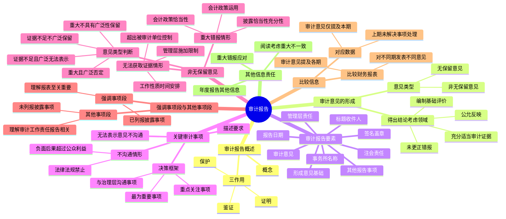

## 1. 章节定位

| 项目 | 信息 |
|------|------|
| 所属科目 | 审计 |
| 难度等级 | 5 |
| 历年分值 | 10-15 分 |
| 建议学时 | 8-10 小时 |
| 知识关联章节 | 第6章 审计计划、第8章 风险应对、第18章 其他特殊项目审计、第19章 完成审计工作、第22章 企业内部控制审计、第24章 业务质量管理 |

## 2. 考情分析

本章是审计科目的核心章节，历年分值约 10-15 分，是综合题和简答题的高频出题点。内容涵盖审计报告的基本概念、审计意见的形成、审计报告要素、关键审计事项、非无保留意见、强调事项段与其他事项段、比较信息、其他信息责任八大模块。

**命题规律**：非无保留意见类型的判断（保留意见、否定意见、无法表示意见的适用情形及"重大且具有广泛性"标准）是历年必考内容，常以综合题形式出现；关键审计事项的确定和描述是近年新增高频考点；审计报告要素的顺序和内容是客观题考点；强调事项段与其他事项段的区别和适用情形是简答题考点；对应数据下上期非无保留意见事项未解决时的处理是综合题高频考点；其他信息存在重大错报时的应对程序是简答题考点。

**联动考查方式**：

- 与第18章持续经营假设结合：持续经营假设重大不确定性对审计报告的影响（单独部分、保留或否定意见、否定意见、无法表示意见四种情形）；
- 与第19章完成审计工作结合：未更正错报评价对审计意见类型的影响、期后事项对审计报告日的影响、书面声明不可靠导致的无法表示意见；
- 与第22章内部控制审计结合：审计报告中"目的并非对内部控制的有效性发表意见"表述的删除；
- 与第24章业务质量管理结合：项目合伙人对审计报告的复核责任。

**备考建议**：

- 牢记非无保留意见类型判断矩阵（事项性质×广泛性）：重大错报+不具有广泛性=保留意见；重大错报+具有广泛性=否定意见；无法获取充分证据+不具有广泛性=保留意见；无法获取充分证据+具有广泛性=无法表示意见；
- 掌握"广泛性"的三种情形：不限于对特定要素产生影响；虽仅对特定要素产生影响但该要素是或可能是财务报表主要组成部分；与披露相关的影响对理解财务报表至关重要；
- 熟记关键审计事项的决策框架（与治理层沟通过的事项→重点关注过的事项→最为重要的事项）及不在审计报告中沟通的情形；
- 区分强调事项段（已在财务报表中列报或披露）与其他事项段（未在财务报表中列报或披露）；
- 掌握对应数据下上期非无保留意见事项已解决/未解决的报告处理。

## 3. 知识框架

## 4. 核心精讲

### 4.1 审计报告概述

**审计报告**是指注册会计师根据审计准则的规定，在执行审计工作的基础上，对财务报表发表审计意见的书面文件。审计报告是注册会计师在完成审计工作后向委托人提交的最终产品，具有以下特征：①应当按照审计准则的规定执行审计工作；②在实施审计工作的基础上才能出具审计报告；③通过对财务报表发表意见履行业务约定书约定的责任；④应当以书面形式出具审计报告。注册会计师一旦在审计报告上签名并盖章，就表明对其出具的审计报告负责。

**审计报告的三方面作用**：①**鉴证作用**——以超然独立的第三方身份，对被审计单位财务报表的合法性和公允性发表意见，得到政府、投资者和其他利益相关者的普遍认可；②**保护作用**——能够在一定程度上对被审计单位的债权人、股东以及其他利害关系人的利益起到保护作用；③**证明作用**——表明审计工作的质量并明确注册会计师的审计责任。

### 4.2 审计意见的形成

#### 4.2.1 得出审计结论时考虑的领域

注册会计师应当就财务报表是否在所有重大方面按照适用的财务报告编制基础编制并实现公允反映形成审计意见。在得出结论时，应当考虑下列方面：

**1. 是否已获取充分、适当的审计证据**：在得出总体结论之前，应当评价对认定层次重大错报风险的评估是否仍然适当。在形成审计意见时，应当考虑所有相关的审计证据，无论该证据与财务报表认定相互印证还是相互矛盾。如果对重大的财务报表认定没有获取充分、适当的审计证据，应当尽可能获取进一步的审计证据。

**2. 未更正错报单独或汇总起来是否构成重大错报**：应当考虑①相对特定的交易类别、账户余额或披露以及财务报表整体而言，错报的金额和性质以及错报发生的特定环境；②与以前期间相关的未更正错报对有关的交易类别、账户余额或披露以及财务报表整体的影响。

**3. 评价财务报表是否在所有重大方面按照适用的财务报告编制基础编制**：应当特别评价下列内容：①财务报表是否恰当披露了所选择和运用的重要会计政策；②选择和运用的会计政策是否符合适用的财务报告编制基础，并适合被审计单位的具体情况；③管理层作出的会计估计和相关披露是否合理；④财务报表列报的信息是否具有相关性、可靠性、可比性和可理解性；⑤财务报表是否作出充分披露，使预期使用者能够理解重大交易和事项对财务报表所传递信息的影响；⑥财务报表使用的术语（包括每一财务报表的标题）是否适当。**考虑被审计单位会计实务的质量**：包括表明管理层判断可能出现偏向的迹象。缺乏中立性的迹象包括：①管理层对注册会计师在审计期间提请其更正的错报进行选择性更正（如更正将增加盈利的错报，不予更正将减少盈利的错报）；②管理层在作出会计估计时可能存在偏向。

**4. 评价财务报表是否实现公允反映**：应当考虑①财务报表的整体列报（包括披露）、结构和内容是否合理；②财务报表是否公允地反映了相关交易和事项。

**5. 评价财务报表是否恰当提及或说明适用的财务报告编制基础**：只有当财务报表符合适用的财务报告编制基础的所有要求（在财务报表所涵盖的期间内有效）时，声明财务报表按照该编制基础编制才是恰当的。在使用不严密的修饰语或限定性的语言（如"财务报表实质上符合国际财务报告准则的要求"）是不恰当的，因为可能误导财务报表使用者。

#### 4.2.2 审计意见的类型

如果认为财务报表在所有重大方面按照适用的财务报告编制基础编制并实现公允反映，应当发表**无保留意见**。

当存在下列情形之一时，应当按照审计准则第 1502 号的规定发表**非无保留意见**：①根据获取的审计证据，得出财务报表整体存在重大错报的结论；②无法获取充分、适当的审计证据，不能得出财务报表整体不存在重大错报的结论。非无保留意见包括保留意见、否定意见或无法表示意见。

### 4.3 审计报告的基本内容

审计报告应当包括下列要素：①标题；②收件人；③审计意见；④形成审计意见的基础；⑤管理层对财务报表的责任；⑥注册会计师对财务报表审计的责任；⑦按照相关法律法规的要求报告的事项（如适用）；⑧注册会计师的签名和盖章；⑨会计师事务所的名称、地址和盖章；⑩报告日期。

**1. 标题**：统一规范为"审计报告"。

**2. 收件人**：按照审计业务的约定载明收件人，一般是被审计单位的股东或治理层。

**3. 审计意见**：由两部分构成。第一部分指出已审计财务报表（包括被审计单位名称、说明财务报表已经审计、指出构成整套财务报表的每一财务报表的名称、提及财务报表附注、指明每一财务报表的日期或涵盖的期间）；第二部分说明注册会计师发表的审计意见。无保留意见应当使用"我们认为，财务报表在所有重大方面按照[适用的财务报告编制基础]编制，公允反映了[……]"的措辞。

**4. 形成审计意见的基础**：应当紧接在审计意见部分之后，包括：①说明注册会计师按照审计准则的规定执行了审计工作；②提及审计报告中用于描述审计准则规定的注册会计师责任的部分；③声明注册会计师按照与审计相关的职业道德要求对被审计单位保持了独立性，并履行了职业道德方面的其他责任（指明适用的职业道德要求）；④说明注册会计师是否相信获取的审计证据是充分、适当的，为发表审计意见提供了基础。

**5. 管理层对财务报表的责任**：应当说明管理层负责：①按照适用的财务报告编制基础的规定编制财务报表，使其实现公允反映，并设计、执行和维护必要的内部控制；②评估被审计单位的持续经营能力和使用持续经营假设是否适当，并披露与持续经营相关的事项（如适用）。当对财务报告过程负有监督责任的人员与履行上述责任的人员不同时，还应当提及"治理层"。

**6. 注册会计师对财务报表审计的责任**：应当包括：①说明目标是合理保证并出具审计报告；②说明合理保证是高水平的保证但不能保证重大错报存在时总能发现；③说明错报可能由于舞弊或错误导致（从描述重大错报定义或提供重要性定义两种做法中选取一种）；④说明运用职业判断并保持职业怀疑；⑤通过说明注册会计师的责任对审计工作进行描述（识别评估重大错报风险并设计审计程序；了解与审计相关的内部控制以设计恰当审计程序，但目的并非对内部控制有效性发表意见；评价会计政策恰当性和会计估计合理性；对持续经营假设恰当性得出结论；评价财务报表总体列报结构内容和公允反映）；⑥说明与治理层就计划的审计范围、时间安排和重大审计发现等事项进行沟通；⑦对于上市实体财务报表审计，指出已遵守与独立性相关的职业道德要求向治理层提供声明；⑧对于上市实体财务报表审计，说明从已与治理层沟通的事项中确定关键审计事项。

**7. 按照相关法律法规的要求报告的事项（如适用）**：如果注册会计师在对财务报表出具的审计报告中履行其他报告责任，应当在审计报告中将其单独作为一部分，并以"按照相关法律法规的要求报告的事项"为标题。

**8. 注册会计师的签名和盖章**：应当由项目合伙人和另一名负责该项目的注册会计师签名和盖章。对上市实体整套通用目的财务报表出具的审计报告中应当注明项目合伙人。

**9. 会计师事务所的名称、地址和盖章**：应当载明会计师事务所的名称和地址，并加盖会计师事务所公章。标明会计师事务所所在的城市即可。

**10. 报告日期**：审计报告日不应早于注册会计师获取充分、适当的审计证据，并在此基础上对财务报表形成审计意见的日期。确定审计报告日时，应当确信已获取：①构成整套财务报表的所有报表（含披露）已编制完成；②被审计单位的董事会、管理层或类似机构已经认可其对财务报表负责。审计报告日是划分期后事项时段的关键时点。

### 4.4 在审计报告中沟通关键审计事项

**关键审计事项**是指注册会计师根据职业判断认为对当期财务报表审计最为重要的事项，从注册会计师与治理层沟通过的事项中选取。沟通关键审计事项旨在通过提高已执行审计工作的透明度增加审计报告的沟通价值。**适用范围**：对上市实体整套通用目的财务报表进行审计，以及注册会计师决定或委托方要求在审计报告中沟通关键审计事项的其他情形。

**重要提示**：在审计报告中沟通关键审计事项不能代替下列事项：①管理层按照适用的财务报告编制基础在财务报表中作出的披露；②注册会计师发表非无保留意见；③当存在持续经营重大不确定性时按规定进行的报告。关键审计事项不是注册会计师就单一事项单独发表意见。

#### 4.4.1 确定关键审计事项的决策框架

**1. 以"与治理层沟通过的事项"为起点**：注册会计师应当从与治理层沟通过的事项中选取关键审计事项。

**2. 从"与治理层沟通过的事项"中确定"在执行审计工作时重点关注过的事项"**：重点关注的概念基于风险导向审计。在确定重点关注过的事项时，应当考虑：①评估的重大错报风险较高的领域或识别出的特别风险；②与财务报表中涉及重大管理层判断（包括涉及高度估计不确定性的会计估计）的领域相关的重大审计判断；③本期重大交易或事项对审计的影响。重点关注过的事项通常影响总体审计策略以及对这些事项分配的审计资源和审计工作力度。

**3. 从"重点关注过的事项"中确定哪些事项对本期财务报表审计"最为重要"**：在确定相对重要程度时，下列考虑可能相关：①该事项对预期使用者理解财务报表整体的重要程度；②与该事项相关的会计政策的性质或管理层在选择时涉及的复杂程度或主观程度；③与该事项相关的已更正错报和累积未更正错报的性质和重要程度；④为应对该事项所需付出的审计努力的性质和程度（含特殊知识技能的运用、项目组外咨询的性质）；⑤在实施审计程序、评价结果、获取证据时遇到的困难的性质和严重程度；⑥识别出的与该事项相关的控制缺陷的严重程度；⑦该事项是否涉及数项可区分但又相互关联的审计考虑。

**"最为重要的事项"并不意味着只有一项**。最初确定为关键审计事项的事项越多，注册会计师越需要重新考虑每一事项是否符合定义。罗列大量关键审计事项可能与"最为重要"的概念相抵触。

#### 4.4.2 在审计报告中沟通关键审计事项

**1. 单设关键审计事项部分**：应当在审计报告中单设一部分，以"关键审计事项"为标题，并在该部分使用恰当的子标题逐项描述关键审计事项。引言应当说明：①关键审计事项是根据职业判断认为对本期财务报表审计最为重要的事项；②关键审计事项的应对以对财务报表整体进行审计并形成审计意见为背景，不对关键审计事项单独发表意见。

**2. 描述单一关键审计事项**：应当逐项描述每一关键审计事项，并分别索引至财务报表的相关披露（如有）。描述时应当说明：①该事项被认定为审计中最为重要的事项之一的原因；②该事项在审计中是如何应对的。可以描述的要素包括：审计应对措施或审计方法中与该事项最为相关的方面；对已实施审计程序的简要概述；实施审计程序的结果；对该事项的主要看法。

**避免提供原始信息**：原始信息是指与被审计单位相关、尚未由被审计单位公布的信息。注册会计师需要避免不恰当地提供与被审计单位相关的原始信息。可以鼓励管理层或治理层进一步披露信息，而不是在审计报告中提供原始信息。

#### 4.4.3 不在审计报告中沟通关键审计事项的情形

除非存在下列情形之一，应当在审计报告中逐项描述关键审计事项：①法律法规禁止公开披露某事项；②在极少数情况下，如果合理预期在审计报告中沟通某事项造成的负面后果超过在公众利益方面产生的益处，确定不应在审计报告中沟通该事项。

**其他情形下关键审计事项部分的形式和内容**：①确定不存在需要沟通的关键审计事项，可以表述为"我们确定不存在需要在审计报告中沟通的关键审计事项"；②仅有的需要沟通的关键审计事项是导致发表保留意见或否定意见的事项，或者是可能导致对持续经营能力产生重大疑虑的事项或情况存在重大不确定性，可以表述为"除形成保留（否定）意见的基础部分或与持续经营相关的重大不确定性部分所描述的事项外，我们确定不存在其他需要在审计报告中沟通的关键审计事项"；③如果确定对财务报表发表无法表示意见，**不得**在审计报告中沟通关键审计事项，除非法律法规要求沟通；④某事项被确定为关键审计事项，不能以强调事项或其他事项代替对关键审计事项的描述。

#### 4.4.4 就关键审计事项与治理层沟通及工作底稿记录

应当就下列事项与治理层沟通：①确定的关键审计事项；②确定不存在需要在审计报告中沟通的关键审计事项（如适用）。应当在审计工作底稿中记录：①确定的重点关注过的事项，以及针对每一事项是否将其确定为关键审计事项及其理由；②确定不存在需要在审计报告中沟通的关键审计事项的理由（如适用）；③确定不在审计报告中沟通某项关键审计事项的理由（如适用）。

### 4.5 非无保留意见审计报告

**非无保留意见**是指对财务报表发表的保留意见、否定意见或无法表示意见。

#### 4.5.1 发表非无保留意见的情形

**1. 根据获取的审计证据，得出财务报表整体存在重大错报的结论**：财务报表的重大错报可能源于：①选择的会计政策的恰当性（与适用的财务报告编制基础不一致；没有正确描述重大项目相关的会计政策；没有按照公允反映的方式列报交易和事项）；②对所选择的会计政策的运用（没有一贯运用；不当运用）；③财务报表披露的恰当性或充分性（没有包括适用的财务报告编制基础要求的所有披露；披露没有按照适用的财务报告编制基础列报；没有作出特定要求之外的其他必要披露以实现公允反映）。

**2. 无法获取充分、适当的审计证据，不能得出财务报表整体不存在重大错报的结论**（也称为审计范围受到限制）：①超出被审计单位控制的情形（如会计记录已被毁坏，或重要组成部分的会计记录已被政府有关机构无限期地查封）；②与注册会计师工作的性质或时间安排相关的情形（如无法获取联营企业财务信息评价权益法运用；接受审计委托的时间安排使无法实施存货监盘；确定仅实施实质性程序不充分但被审计单位控制无效）；③管理层对审计范围施加限制的情形（如管理层阻止实施存货监盘或函证）。

**重要提示**：如果注册会计师能够通过实施替代程序获取充分、适当的审计证据，则无法实施特定的程序并不构成对审计范围的限制。存在不确定性并不必然导致审计范围受到限制，管理层应当合理利用财务报表编制时已经存在且能够取得的可靠信息作出估计和判断，注册会计师应在获取充分、适当的审计证据的基础上评价管理层估计和判断的合理性，不应回避作出实质性判断。

#### 4.5.2 非无保留意见类型的判断

在确定恰当的非无保留意见类型时，需要考虑：①导致非无保留意见的事项的性质（是财务报表存在重大错报，还是无法获取充分、适当的审计证据）；②注册会计师就导致非无保留意见的事项对财务报表产生或可能产生影响的广泛性作出的判断。

**影响的重大性**：从定量和定性两个方面考虑错报对财务报表的影响或未发现的错报（如存在）对财务报表可能产生的影响是否重大。

**影响的广泛性**：根据注册会计师的判断，对财务报表的影响具有广泛性的情形包括三个方面：①不限于对财务报表的特定要素、账户或项目产生影响（如多项重大错报影响多个财务报表项目；无法对重要子公司执行审计工作影响合并财务报表大多数项目）；②虽然仅对财务报表的特定要素、账户或项目产生影响，但这些要素、账户或项目是或可能是财务报表的主要组成部分（如筹建期 80% 账面资产为在建工程；控股股东违规占用资金和违规担保余额为净资产数倍；某项资产占总资产 60% 以上）；③当与披露相关时，产生的影响对财务报表使用者理解财务报表至关重要（如遗漏与持续经营重大不确定性相关的必要披露）。

**非无保留意见类型判断矩阵**：

| 导致发表非无保留意见的事项的性质 | 重大但不具有广泛性 | 重大且具有广泛性 |
|----------------------------------|--------------------|------------------|
| 财务报表存在重大错报 | 保留意见 | 否定意见 |
| 无法获取充分、适当的审计证据 | 保留意见 | 无法表示意见 |

**1. 发表保留意见**：当存在下列情形之一时：①在获取充分、适当的审计证据后，认为错报单独或汇总起来对财务报表影响重大，但不具有广泛性；②无法获取充分、适当的审计证据以作为形成审计意见的基础，但认为未发现的错报（如存在）对财务报表可能产生的影响重大，但不具有广泛性。

**2. 发表否定意见**：在获取充分、适当的审计证据后，如果认为错报单独或汇总起来对财务报表的影响重大且具有广泛性。

**3. 发表无法表示意见**：无法获取充分、适当的审计证据以作为形成审计意见的基础，但认为未发现的错报（如存在）对财务报表可能产生的影响重大且具有广泛性。在少数情况下，可能存在多个不确定事项，尽管对每个单独的不确定事项获取了充分、适当的审计证据，但由于不确定事项之间可能存在相互影响以及可能对财务报表产生累积影响，不可能对财务报表形成审计意见，应当发表无法表示意见。

**注意事项**：①如果注意到管理层对审计范围施加了限制，应当要求管理层消除这些限制；如果管理层拒绝消除限制，应当与治理层沟通，并确定能否实施替代程序。如果未发现的错报可能的影响重大且具有广泛性，以至于发表保留意见不足以反映情况的严重性，应当在可行时解除业务约定（除非法律法规禁止），并在解除业务约定前与治理层沟通将会导致发表非无保留意见的所有错报事项；如果解除业务约定被禁止或不可行，应当发表无法表示意见。②如果认为有必要对财务报表整体发表否定意见或无法表示意见，**不应**在同一审计报告中对按照相同财务报告编制基础编制的单一财务报表或者财务报表特定要素、账户或项目发表无保留意见。

#### 4.5.3 非无保留意见审计报告的格式和内容

**1. 形成非无保留审计意见的基础**：①将"形成审计意见的基础"部分标题修改为"形成保留意见的基础""形成否定意见的基础""形成无法表示意见的基础"；②当发表无法表示意见时，不应提及审计报告中用于描述注册会计师责任的部分，也不应说明注册会计师是否已获取充分、适当的审计证据以作为形成审计意见的基础；③如果财务报表中存在与具体金额相关的重大错报，应当说明并量化该错报的财务影响；④如果存在与定性披露相关的重大错报，应当解释该错报错在何处；⑤如果存在与应披露而未披露信息相关的重大错报，应当与治理层讨论未披露信息的情况，在形成审计意见的基础部分描述未披露信息的性质，如果可行并且已针对未披露信息获取了充分、适当的审计证据，包含对未披露信息的披露（除非法律法规禁止）；⑥如果因无法获取充分、适当的审计证据而导致发表非无保留意见，应当说明无法获取审计证据的原因；⑦即使发表了否定意见或无法表示意见，也应当在形成审计意见的基础部分说明注意到的、将导致发表非无保留意见的所有其他事项及其影响。

**2. 审计意见部分**：①对审计意见部分使用恰当的标题（"保留意见""否定意见""无法表示意见"）；②发表保留意见时，由于财务报表存在重大错报使用"除'形成保留意见的基础'部分所述事项产生的影响外"措辞；由于无法获取充分、适当的审计证据使用"除……可能产生的影响外"措辞；③发表否定意见时，说明"由于'形成否定意见的基础'部分所述事项的重要性，后附的财务报表没有在所有重大方面按照适用的财务报告编制基础编制，未能公允反映[……]"；④发表无法表示意见时，说明注册会计师不对后附的财务报表发表审计意见，并说明由于"形成无法表示意见的基础"部分所述事项的重要性，无法获取充分、适当的审计证据以作为对财务报表发表审计意见的基础。同时，将"财务报表已经审计"的说明修改为"注册会计师接受委托审计财务报表"。

**3. 注册会计师对财务报表审计的责任部分**：当由于无法获取充分、适当的审计证据而发表无法表示意见时，应当对责任部分的表述进行修改，使之仅包含：①注册会计师的责任是按照审计准则的规定执行审计工作以出具审计报告；②由于形成无法表示意见的基础部分所述的事项，无法获取充分、适当的审计证据以作为发表审计意见的基础；③声明注册会计师在独立性和职业道德方面的其他责任。

### 4.6 在审计报告中增加强调事项段和其他事项段

#### 4.6.1 强调事项段

**强调事项段**是指审计报告中含有的一个段落，该段落提及已在财务报表中恰当列报或披露的事项，且根据注册会计师的职业判断，该事项对财务报表使用者理解财务报表至关重要。

**需要增加强调事项段的情形**：在同时满足下列条件时，应当在审计报告中增加强调事项段：①按照审计准则第 1502 号的规定，该事项不会导致注册会计师发表非无保留意见；②当审计准则第 1504 号适用时，该事项未被确定为在审计报告中沟通的关键审计事项。

**审计准则要求增加强调事项的情形**：①法律法规规定的财务报告编制基础不可接受，但其是基于法律或法规作出的规定；②提醒财务报表使用者注意财务报表按照特殊目的编制基础编制；③注册会计师在审计报告日后知悉了某些事实（即期后事项），并且出具了新的或经修改的审计报告。

**其他可能需要增加强调事项段的情形**：①异常诉讼或监管行动的未来结果存在不确定性；②在财务报表日至审计报告日之间发生的重大期后事项；③在允许的情况下，提前应用对财务报表有重大影响的新会计准则；④存在已经或持续对被审计单位财务状况产生重大影响的特大灾难。**过于广泛地使用强调事项段可能会降低沟通的有效性**。

**包含强调事项段时应采取的措施**：①将强调事项段作为单独的一部分置于审计报告中，并使用包含"强调事项"这一术语的适当标题；②明确提及被强调事项以及相关披露的位置，仅提及已在财务报表中列报或披露的信息；③指出审计意见没有因该强调事项而改变。**包含强调事项段不影响审计意见**，不能代替发表非无保留意见、管理层应作出的披露、持续经营重大不确定性的报告。

#### 4.6.2 其他事项段

**其他事项段**是指审计报告中含有的一个段落，该段落提及未在财务报表中列报或披露的事项，且根据注册会计师的职业判断，该事项与财务报表使用者理解审计工作、注册会计师的责任或审计报告相关。

**可能需要增加其他事项段的情形**：在同时满足下列条件时，应当在审计报告中增加其他事项段：①未被法律法规禁止；②当审计准则第 1504 号适用时，该事项未被确定为关键审计事项。具体情形包括：①与使用者理解审计工作相关的情形（如法律法规要求沟通与计划及范围相关的事项；极少数情况下管理层施加限制导致无法解除业务约定，解释为何不能解除）；②与使用者理解注册会计师的责任或审计报告相关的情形；③对两套以上财务报表出具审计报告的情形（说明根据另一个通用目的编制基础编制了另一套财务报表）；④限制审计报告分发和使用的情形（说明审计报告只是提供给财务报表预期使用者，不应被分发给其他机构或人员）。

**其他事项段不包括**：法律法规或其他职业准则禁止注册会计师提供的信息；要求管理层提供的信息。

**与治理层的沟通**：如果拟在审计报告中增加强调事项段或其他事项段，应当就该事项和拟使用的措辞与治理层沟通。

### 4.7 比较信息

**比较信息**是指包含于财务报表中的、符合适用的财务报告编制基础的、与一个或多个以前期间相关的金额和披露。比较信息包括**对应数据**和**比较财务报表**两种，采用的方法通常由法律法规规定。两种方法的主要差异：对于对应数据，审计意见仅提及本期；对于比较财务报表，审计意见提及列报的财务报表所属的各期。

#### 4.7.1 审计程序

**一般审计程序**：①确定财务报表中是否包括适用的财务报告编制基础要求的比较信息，以及比较信息是否得到恰当分类；②评价比较信息是否与上期财务报表列报的金额和相关披露一致，如果必要，比较信息是否已经重述；③在比较信息中反映的会计政策是否与本期采用的会计政策一致，如果会计政策已发生变更，这些变更是否得到恰当处理并得到充分列报与披露。

**注意到比较信息可能存在重大错报时的审计要求**：应当根据实际情况追加必要的审计程序。比较信息出现重大错报的情形通常包括：①上期财务报表存在重大错报，虽经审计但未发表非无保留意见，本期比较信息未作更正；②上期财务报表存在重大错报，未经审计，比较信息未作更正；③上期财务报表不存在重大错报，但比较信息与上期财务报表存在重大不一致；④上期财务报表不存在重大错报，但比较信息未按照适用的财务报告编制基础要求恰当重述。

**获取书面声明**：应当获取与审计意见中提及的所有期间相关的书面声明。对于管理层作出的、更正上期财务报表中影响比较信息的重大错报的任何重述，还应当获取特定书面声明。

#### 4.7.2 审计报告：对应数据

注册会计师发表的审计意见是针对包括对应数据的本期财务报表整体。当财务报表中列报对应数据时，如果以前针对上期财务报表发表了保留意见、无法表示意见或否定意见，首先需要判断导致对上期财务报表发表非无保留意见的事项是否已经解决。

**情形 1：导致对上期财务报表发表非无保留意见的事项在本期仍未解决**：在就未解决事项对本期财务报表的影响或可能产生的影响进行评价后，应当对本期财务报表发表恰当的非无保留意见。①对上期发表了否定意见或无法表示意见，且事项仍未解决，且对本期财务报表的影响或可能的影响仍然重大且具有广泛性，应当对本期财务报表发表否定意见或无法表示意见；如果未解决事项对本期财务报表的影响或可能的影响仍然重大，但影响程度降低或影响范围缩小，不再具有广泛性，应当对本期财务报表发表保留意见。②对上期发表了保留意见，且事项仍未解决，应当对本期财务报表发表非无保留意见。③未解决事项可能与本期数据无关，但由于对本期数据和对应数据的可比性存在影响或可能存在影响，仍需要对本期财务报表发表非无保留意见。

**情形 2：上期财务报表存在重大错报，而以前对该财务报表发表了无保留意见，且对应数据未经适当重述或恰当披露**：应当就包括在财务报表中的对应数据，在审计报告中对本期财务报表发表保留意见或否定意见。如果存在错报的上期财务报表尚未更正，并且没有重新出具审计报告，但对应数据已在本期财务报表中得到适当重述或恰当披露，可以在审计报告中增加强调事项段以描述这一情况。

**上期财务报表未经审计时的报告要求**：应当在审计报告的其他事项段中说明对应数据未经审计，但不减轻注册会计师获取充分、适当的审计证据以确定期初余额不含有对本期财务报表产生重大影响的错报的责任。

**上期财务报表已由前任注册会计师审计时的报告要求**：可以提及前任注册会计师对对应数据出具的审计报告。当决定提及时，应当在审计报告的其他事项段中说明：①上期财务报表已由前任注册会计师审计；②前任注册会计师发表的意见的类型（如果是非无保留意见，还应当说明发表非无保留意见的理由）；③前任注册会计师出具的审计报告的日期。

#### 4.7.3 审计报告：比较财务报表

当列报比较财务报表时，审计意见应当提及列报财务报表所属的各期，以及发表的审计意见涵盖的各期。注册会计师可以对一期或多期财务报表发表保留意见、否定意见或无法表示意见，或者在审计报告中增加强调事项段，而对其他期间的财务报表发表不同的审计意见。

**对上期财务报表发表的意见与以前发表的意见不同**：当因本期审计而对上期财务报表发表审计意见时，如果对上期财务报表发表的意见与以前发表的意见不同，应当按规定在其他事项段中披露导致不同意见的实质性原因。

**上期财务报表已由前任注册会计师审计**：除非前任注册会计师对上期财务报表出具的审计报告与财务报表一同对外提供，注册会计师除对本期财务报表发表意见外，还应当在其他事项段中说明：①上期财务报表已由前任注册会计师审计；②前任注册会计师发表的意见的类型（如果是非无保留意见，还应当说明理由）；③前任注册会计师出具的审计报告的日期。

### 4.8 注册会计师对其他信息的责任

审计准则第 1521 号规范了注册会计师对被审计单位年度报告中包含的除财务报表和审计报告之外的其他信息的责任。**年度报告**是指管理层或治理层根据法律法规的规定或惯例，一般以年度为基础编制的、旨在向所有者提供实体经营情况和财务业绩及财务状况信息的一个文件或系列文件组合。**其他信息**是指在被审计单位年度报告中包含的除财务报表和审计报告以外的财务信息和非财务信息。**其他信息的错报**是指对其他信息作出的不正确陈述或其他信息具有误导性，包括遗漏或掩饰对恰当理解其他信息披露的事项必要的信息。

**重要提示**：审计准则对注册会计师设定的责任不构成对其他信息的鉴证，也不要求注册会计师对其他信息提供一定程度的保证。

#### 4.8.1 获取其他信息

应当：①通过与管理层讨论，确定哪些文件组成年度报告，以及被审计单位计划公布这些文件的方式和时间安排；②就及时获取组成年度报告的文件的最终版本与管理层作出适当安排，如果可能，在审计报告日之前获取；③如果组成年度报告的部分或全部文件在审计报告日后才能取得，要求管理层提供书面声明，声明上述文件的最终版本将在可获取时并且在被审计单位公布前提供给注册会计师。

#### 4.8.2 阅读并考虑其他信息

应当阅读其他信息，在阅读时：①考虑其他信息和财务报表之间是否存在重大不一致（将其他信息中选取的金额或其他项目与财务报表中的相应金额或其他项目进行比较）；②在已获取审计证据并已得出审计结论的背景下，考虑其他信息与注册会计师在审计中了解到的情况是否存在重大不一致；③对与财务报表或注册会计师在审计中了解到的情况不相关的其他信息中似乎存在重大错报的迹象保持警觉。

#### 4.8.3 当似乎存在重大不一致或其他信息似乎存在重大错报时的应对

如果识别出似乎存在重大不一致，或者知悉其他信息似乎存在重大错报，应当与管理层讨论该事项，必要时实施其他程序以确定：①其他信息是否存在重大错报；②财务报表是否存在重大错报；③注册会计师对被审计单位及其环境等方面情况的了解是否需要更新。

#### 4.8.4 当注册会计师认为其他信息存在重大错报时的应对

应当要求管理层更正其他信息：①如果管理层同意作出更正，应当确定更正已经完成；②如果管理层拒绝作出更正，应当就该事项与治理层进行沟通，并要求作出更正。

**审计报告日前获取的其他信息存在重大错报且与治理层沟通后仍未得到更正**：应当采取恰当措施，包括：①考虑对审计报告的影响，并就注册会计师计划如何在审计报告中处理重大错报与治理层进行沟通。可在审计报告中指明其他信息存在重大错报。在少数情况下，当拒绝更正其他信息的重大错报导致对管理层和治理层的诚信产生怀疑，进而质疑审计证据总体上的可靠性时，对财务报表发表无法表示意见可能是恰当的；②在相关法律法规允许的情况下，解除业务约定。

**审计报告日后获取的其他信息存在重大错报**：应当与治理层沟通，要求管理层更正。如果管理层同意更正，应当确定更正已经完成。如果管理层拒绝更正，应当考虑以前向治理层沟通的情况、其他信息存在重大错报的程度、注册会计师获取的审计证据的充分性和适当性等因素，采取进一步措施。

## 5. 典型例题

**【例题 1】（非无保留意见类型的判断）**

ABC 会计师事务所审计甲公司 2×24 年度财务报表。审计项目组在审计过程中遇到下列事项：（1）甲公司 2×24 年 12 月 31 日资产负债表中存货的列示金额为 5000 万元，管理层根据成本计量存货，没有根据成本与可变现净值孰低计量，如果按后者计量，存货列示金额将减少 200 万元，资产减值损失将增加 200 万元，所得税、净利润和股东权益将分别减少 50 万元、150 万元和 150 万元（财务报表整体的重要性为 100 万元）；（2）甲公司某一重要子公司拒绝配合审计工作，注册会计师无法对该子公司执行审计程序，该子公司资产占合并资产总额的 40%，营业收入占合并营业收入的 35%；（3）甲公司未在财务报表附注中披露与持续经营相关的重大不确定性，且注册会计师认为存在重大不确定性。要求：分别针对上述三种情形，指出注册会计师应当发表的审计意见类型，并简要说明理由。

**答案**：

情形（1）：应当发表保留意见。理由：存货存在错报，影响重大（200 万元超过财务报表整体的重要性 100 万元），但仅影响存货、资产减值损失、所得税、净利润和股东权益等特定项目，不具有广泛性。根据非无保留意见类型判断矩阵，财务报表存在重大错报且重大但不具有广泛性，应当发表保留意见。

情形（2）：应当发表无法表示意见。理由：注册会计师无法获取充分、适当的审计证据，且该子公司资产占合并资产总额的 40%、营业收入占合并营业收入的 35%，未发现的错报（如存在）可能影响合并财务报表的大多数项目，影响重大且具有广泛性。根据判断矩阵，无法获取充分、适当的审计证据且重大且具有广泛性，应当发表无法表示意见。

情形（3）：应当发表保留意见或否定意见。理由：与持续经营相关的重大不确定性属于与披露相关的事项，管理层未在财务报表附注中披露，该遗漏对财务报表使用者理解财务报表至关重要，影响重大且具有广泛性。由于是财务报表存在重大错报（披露不充分）且重大且具有广泛性，应当发表否定意见；如果注册会计师认为影响重大但不具有广泛性，则发表保留意见。但根据"与披露相关时产生的影响对财务报表使用者理解财务报表至关重要即具有广泛性"的标准，本题应当发表否定意见。

**解析**：非无保留意见类型判断是高频考点。解题关键：①先判断事项性质（重大错报还是无法获取证据）；②再判断影响的广泛性（三种情形）；③套用判断矩阵。注意持续经营重大不确定性未披露通常具有广泛性。

**【例题 2】（关键审计事项的确定与描述）**

ABC 会计师事务所审计甲公司 2×24 年度财务报表（甲公司为上市实体）。审计项目组在审计过程中识别出下列事项：（1）甲公司商誉减值测试涉及重大管理层判断，评估的重大错报风险较高，项目组与治理层就该事项进行了深入沟通；（2）甲公司因一项重大诉讼案件被起诉，截至审计报告日尚未判决，该事项对财务报表使用者理解财务报表至关重要，但项目组在审计中未将其作为重点关注事项；（3）甲公司持续经营能力存在重大不确定性，财务报表已作出充分披露。要求：分别针对上述三种情形，说明是否构成关键审计事项，并说明在审计报告中如何处理。

**答案**：

情形（1）：构成关键审计事项。理由：商誉减值测试涉及重大管理层判断，评估的重大错报风险较高，且与治理层沟通过，属于在执行审计工作时重点关注过的事项，且对本期财务报表审计最为重要。处理：应当在审计报告中单设关键审计事项部分，使用恰当的子标题逐项描述，索引至财务报表相关披露，说明被认定为关键审计事项的原因以及该事项在审计中是如何应对的。

情形（2）：不构成关键审计事项，但可能需要在强调事项段中描述。理由：关键审计事项必须从在执行审计工作时重点关注过的事项中选取，该事项未被重点关注，因此不构成关键审计事项。但由于该事项对财务报表使用者理解财务报表至关重要，且不会导致发表非无保留意见，未被确定为关键审计事项，符合增加强调事项段的条件。处理：应当在审计报告中增加强调事项段，明确提及被强调事项以及相关披露的位置，指出审计意见没有因该强调事项而改变。

情形（3）：不构成关键审计事项。理由：可能导致对被审计单位持续经营能力产生重大疑虑的事项或情况存在重大不确定性，就其性质而言属于关键审计事项，但这些事项在审计报告中专门的部分（"与持续经营相关的重大不确定性"为标题的单独部分）披露，不在审计报告的关键审计事项部分进行描述。处理：在审计报告中增加以"与持续经营相关的重大不确定性"为标题的单独部分，不在关键审计事项部分描述该事项；如果仅有的需要沟通的关键审计事项是该持续经营事项，可以在关键审计事项部分表述为"除与持续经营相关的重大不确定性部分所描述的事项外，我们确定不存在其他需要在审计报告中沟通的关键审计事项"。

**解析**：关键审计事项的决策框架是近年高频考点。解题关键：①关键审计事项必须从与治理层沟通过的事项中选取，且必须是重点关注过的事项，且必须是最为重要的事项，三者缺一不可；②持续经营重大不确定性虽属于关键审计事项性质，但在单独部分披露，不在关键审计事项部分描述；③对理解财务报表至关重要但未重点关注的事项，可在强调事项段描述。

**【例题 3】（对应数据下上期非无保留意见事项未解决的处理）**

ABC 会计师事务所审计甲公司 2×24 年度财务报表。甲公司 2×23 年度财务报表由 ABC 会计师事务所审计，由于甲公司未对房屋建筑物和机器设备计提折旧，ABC 会计师事务所对 2×23 年度财务报表发表了保留意见。2×24 年度审计中，审计项目组发现甲公司仍未对房屋建筑物和机器设备计提折旧。要求：（1）说明注册会计师应当对 2×24 年度财务报表发表何种审计意见类型；（2）说明在审计报告中如何处理该未解决事项。

**答案**：

（1）应当对 2×24 年度财务报表发表保留意见。理由：导致对上期财务报表发表保留意见的事项（未计提折旧）在本期仍未解决。由于该事项仅影响房屋建筑物、机器设备净值、累计折旧、当期亏损等特定项目，影响重大但不具有广泛性，根据"对上期发表了保留意见，且事项仍未解决，应当对本期财务报表发表非无保留意见"的规定，应当对本期财务报表发表保留意见。

（2）在审计报告中的处理：①由于未解决事项对本期数据的影响或可能的影响是重大的，注册会计师应当在"形成保留意见的基础"部分同时提及本期数据和对应数据；②审计意见部分使用"除'形成保留意见的基础'部分所述事项产生的影响外"的措辞；③在"形成保留意见的基础"部分说明该事项导致对上期财务报表发表保留意见，以及该事项对本期数据和对应数据的影响（如按房屋建筑物 5%、机器设备 20% 年折旧率计提折旧，2×24 年度和 2×23 年度的当年亏损将分别增加×元和×元，2×24 年末和 2×23 年末的房屋建筑物和机器设备净值将因累计折旧而分别减少×元和×元）；④说明注册会计师获取的审计证据是充分、适当的，为发表保留意见提供了基础。

**解析**：对应数据下上期非无保留意见事项未解决的处理是综合题高频考点。解题关键：①先判断事项是否解决（本期是否更正）；②未解决的，根据上期意见类型和本期影响程度确定本期意见类型；③在形成非无保留意见的基础部分同时提及本期数据和对应数据（如果对本期数据影响重大）或说明对可比性的影响（如果对本期数据影响不重大）。

## 6. 记忆口诀

**审计报告概述**：三作用（鉴证、保护、证明）；审计意见两类型（无保留意见、非无保留意见含保留/否定/无法表示）；形成审计意见五考虑（充分适当证据、未更正错报、编制基础评价、公允反映、恰当提及编制基础）；管理层缺乏中立性两迹象（选择性更正错报、会计估计存在偏向）。

**审计报告要素**：十要素（标题、收件人、审计意见、形成审计意见的基础、管理层责任、注会责任、其他报告事项、签名盖章、事务所名称地址盖章、报告日期）；审计报告日不早于获取充分适当证据并形成审计意见的日期，是划分期后事项时段的关键时点。

**关键审计事项**：决策框架三层次（与治理层沟通过的事项→重点关注过的事项→最为重要的事项）；重点关注三考虑（重大错报风险较高领域或特别风险、重大管理层判断领域、本期重大交易或事项影响）；最为重要七考虑（对理解报表重要程度、会计政策复杂主观程度、错报性质重要程度、审计努力性质程度、审计困难性质严重程度、控制缺陷严重程度、相互关联审计考虑）；不沟通两情形（法律法规禁止、负面后果超过公众利益）；无法表示意见不得沟通关键审计事项；持续经营重大不确定性和导致非无保留意见的事项在专门部分披露不在关键审计事项部分描述。

**非无保留意见**：判断矩阵二乘二（重大错报+不广泛=保留、重大错报+广泛=否定、证据不足+不广泛=保留、证据不足+广泛=无法表示）；广泛性三情形（不限于特定要素影响、特定要素但是主要组成部分、与披露相关对理解报表至关重要）；无法表示意见责任部分仅含三内容（责任是执行审计出具报告、无法获取证据为基础、独立性职业道德声明）；无法表示意见不提及是否获取充分适当证据；同一审计报告不得对整体发表否定或无法表示意见同时对特定要素发表无保留意见。

**强调事项段与其他事项段**：强调事项段（已在报表列报披露、理解报表至关重要、不导致非无保留意见、未被确定为关键审计事项、不影响审计意见）；其他事项段（未在报表列报披露、理解审计工作责任报告相关、未被法律法规禁止、未被确定为关键审计事项）；两者均需与治理层沟通措辞。

**比较信息**：两方法（对应数据审计意见仅提及本期、比较财务报表审计意见提及各期）；对应数据未解决事项处理（上期否定或无法+仍重大广泛=本期否定或无法；上期否定或无法+影响降低缩小不广泛=本期保留；上期保留+未解决=本期非无保留；未解决事项与本期数据无关但影响可比性=本期非无保留）；上期未审计其他事项段说明；上期前任审计可提及前任意见类型和报告日期。

**其他信息责任**：不构成鉴证不提供保证；阅读考虑三方面（其他信息与财务报表重大不一致、与审计了解情况重大不一致、不相关信息似乎存在重大错报保持警觉）；重大错报应对（要求管理层更正、与治理层沟通、审计报告日前未更正考虑对审计报告影响或解除业务约定、审计报告日后未更正考虑进一步措施）。

## 7. 同步练习

**429.（单选题）** 下列有关审计报告的说法中，错误的是（　）。

A. 审计报告和已审计财务报表是注册会计师在完成审计工作后向委托人提交的最终产品
B. 注册会计师应当将已审计的财务报表附于审计报告之后，防止被审计单位替换、更改
C. 审计报告是注册会计师对财务报表是否在所有重大方面按照财务报告编制基础编制并实现公允反映发表审计意见的书面文件
D. 注册会计师一旦在审计报告上签字并盖章，就表明对其出具的审计报告负责

**430.（单选题）** 下列有关关键审计事项的说法中，错误的是（　）。

A. 从在执行审计工作时重点关注过的事项中确定哪些事项对本期财务报表审计最为重要，从而构成关键审计事项
B. 注册会计师审计中识别出的与该事项相关的控制缺陷的严重程度会影响其是否将该事项作为关键审计事项
C. 关键审计事项是对财务报表审计最为重要的事项，故只有一项
D. 在审计报告的关键审计事项部分沟通的事项，必须是已得到满意解决的事项

**431.（单选题）** 下列关于在审计报告中沟通关键审计事项的说法中，正确的是（　）。

A. 注册会计师拟从与治理层沟通过的事项中选择对当期财务报表影响最大的事项作为关键审计事项
B. 为便于财务报表预期使用者理解全部关键审计事项，注册会计师应当在审计报告中逐项描述每一关键审计事项
C. 考虑到审计过程中对重要性的运用较多地涉及重大审计判断，注册会计师拟将对重要性的运用作为关键审计事项之一
D. 由于审计项目组在评价甲公司与持续经营相关的重大不确定性方面耗费的审计资源最多，注册会计师拟在关键审计事项部分沟通与持续经营相关的重大不确定性

**432.（单选题）** 下列情形中，可能会增加其他事项段的是（　）。

A. 异常诉讼或监管行动的未来结果存在不确定性
B. 在允许的情况下，提前应用对财务报表有重大影响的新会计准则
C. 存在已经或持续对被审计单位财务状况产生重大影响的特大灾难
D. 对两套以上财务报表出具审计报告的情形

**433.（单选题）** 审计报告中对管理层责任的说明有助于（　）。

A. 向财务报表使用者解释执行审计工作的前提
B. 减轻注册会计师的责任
C. 管理层了解其责任
D. 注册会计师明确管理层职责

**434.（单选题）** 下列有关其他信息的说法中，错误的是（　）。

A. 注册会计师应当阅读和考虑被审计单位年度报告中的其他信息，但注册会计师对财务报表发表的审计意见不涵盖其他信息
B. 注册会计师应当考虑其他信息中的金额等信息与财务报表之间是否存在重大不一致
C. 当注册会计师对财务报表无法表示意见时，可以在审计报告中增加其他信息部分
D. 注册会计师应当通过与管理层讨论，确定哪些文件组成年度报告，以及被审计单位计划公布这些文件的方式和时间安排

**435.（单选题）** 注册会计师首次接受委托，发现上期财务报表存在错报但出具了无保留意见，如果上期财务报表未经更正，也未重新出具审计报告，且比较数据未经恰当重述和充分披露，注册会计师应当（　）。

A. 对本期财务报表出具非无保留意见的审计报告
B. 重新出具上期财务报表的审计报告
C. 由于本期数据不存在错报，因而对本期财务报表出具无保留意见的审计报告
D. 拒绝出具审计报告

**436.（单选题）** 如果已在财务报表中披露的某事项不会导致发表非无保留意见，也未被确定为将要在审计报告中沟通的关键审计事项，但根据职业判断认为对财务报表使用者理解财务报表至关重要的，注册会计师的下列做法中恰当的是（　）。

A. 在审计报告中增加强调事项段描述
B. 在审计报告中增加其他事项段描述
C. 在审计报告中"形成审计意见的基础"段描述
D. 在审计报告中"关键审计事项"段描述

**437.（单选题）** 下列有关审计报告的日期的说法中，错误的是（　）。

A. 审计报告的日期是审计报告的要素之一
B. 管理层签署已审计财务报表的日期通常与注册会计师签署审计报告的日期为同一天，或晚于注册会计师签署审计报告的日期
C. 在确定审计报告日时，注册会计师应当确信构成整套财务报表的所有报表已编制完成且被审计单位已经认可其对财务报表负责
D. 书面声明的日期应当尽量接近对财务报表出具审计报告的日期，但不得在审计报告日后

**438.（单选题）** 如果注册会计师识别出其他信息与财务报表似乎存在重大不一致，注册会计师的下列做法中，恰当的是（　）。

A. 要求管理层更正其他信息
B. 可以与治理层讨论该事项
C. 必要时，实施其他程序以确定财务报表或其他信息是否存在重大错报，对被审计单位及其环境的了解是否需要更新
D. 发表保留或否定意见的审计报告

**439.（单选题）**（2024年）下列选项中，不属于注册会计师认为可能需要在审计报告中增加强调事项段的是（　）。

A. 对被审计单位财务状况产生重大影响的特大灾难
B. 监管行动的未来结果存在不确定性
C. 说明与财务报告一同列示的补充信息未经审计
D. 提前应用对财务报表具有重大影响的新会计准则

**440.（单选题）**（2024年）下列各项中，不属于注册会计师认为可能需要在审计报告中增加其他事项段的是（　）。

A. 注册会计师对被审计单位按照通用目的编制基础编制的另一套财务报表同时出具审计报告
B. 注册会计师承担除对财务报告出具审计报告以外的其他报告责任
C. 限制审计报告分发和使用
D. 注册会计师不能解除业务约定

**441.（单选题）** 下列有关对应数据的说法中，错误的是（　）。

A. 如果上期财务报表未经审计，注册会计师应当在审计报告的其他事项段说明对应数据未经审计
B. 如果上期财务报表已由前任注册会计师审计，注册会计师不应在无保留意见审计报告中提及前任注册会计师的相关工作，除非法律法规另有规定
C. 如果存在错报的上期财务报表尚未更正，且未重新出具审计报告，但对应数据已在本期财务报表中得到适当重述或恰当披露，注册会计师可以增加强调事项段而非发表非无保留意见
D. 导致对上期财务报表发表非无保留意见的事项在本期仍未解决，注册会计师应当对本期财务报表发表非无保留意见

**442.（多选题）** 下列有关审计报告的说法中，恰当的有（　）。

A. 如果对被审计单位财务报表发表否定意见，注册会计师仅需要在"形成否定意见的基础"段落中说明导致发表否定意见的事项
B. 如果对被审计单位财务报表发表无法表示意见，注册会计师应当将有关财务报表已经审计的说明，修改为注册会计师接受委托审计财务报表
C. "注册会计师对财务报表审计的责任"段落在任何类型的审计报告中均存在
D. 如果对被审计单位财务报表发表无法表示意见，注册会计师应当在"注册会计师对财务报表审计的责任"段落提及"合理保证是高水平的保证，但并不能保证按照审计准则执行的审计在某一重大错报存在时总能发现"

**443.（多选题）** 下列有关强调事项段和其他事项段的说法中，正确的有（　）。

A. 强调事项段应提及已在财务报表中披露的事项
B. 在审计报告中包含的强调事项段不影响审计意见
C. 当审计范围受限对审计工作影响重大且广泛但不能解除业务约定时，可以增加强调事项段解释为何不能解除业务约定
D. 其他事项段不包括法律法规或其他职业准则禁止注册会计师提供的信息

**444.（多选题）** 下列有关关键审计事项的说法中，正确的有（　）。

A. 注册会计师应当在审计工作底稿中记录是否将在执行审计工作时重点关注过的事项确定为关键审计事项及其理由
B. 如果注册会计师确定不存在需要在审计报告中沟通的关键审计事项，则无须在审计工作底稿中记录
C. 在描述关键审计事项时，不对财务报表单一要素发表意见
D. 如果根据被审计单位和审计业务的具体情况，注册会计师确定不存在需要在审计报告中沟通的关键审计事项，则需要就该事项与治理层沟通

**445.（多选题）** 注册会计师执行财务报表审计遇到下列情形，其中涉及到在发表的审计报告中增加其他事项段的有（　）。

A. 审计报告日后知悉某事实，且若在审计报告日知悉可能导致修改审计报告，管理层同意修改财务报表
B. 在财务报表报出后知悉某事实，且若在审计报告日知悉可能导致修改审计报告，管理层同意修改财务报表
C. 上期财务报表由前任注册会计师审计，注册会计师决定在审计报告中提及前任注册会计师
D. 被审计单位运用持续经营假设适合具体情况，但存在重大不确定性，财务报表已作出充分披露

**446.（多选题）** 下列有关在审计报告中沟通关键审计事项的说法中，正确的有（　）。

A. 无法表示意见的审计报告中可以沟通关键审计事项
B. 如果注册会计师认为有必要在审计报告中增加强调事项段或其他事项段，应当与关键审计事项部分分开列示
C. 如果某事项被确定为关键审计事项，则不能以强调事项段或其他事项段代替对关键审计事项的描述
D. 注册会计师应当在关键审计事项部分提及形成保留/否定意见的基础部分（如有）

**447.（多选题）**（2024年）下列各项中，无需在审计报告增加强调事项段的有（　）。

A. 注册会计师对被审计单位按照通用目的编制基础编制的另一套财务报表同时出具审计报告
B. 限制审计报告分发和使用
C. 提醒财务报表使用者注意财务报表按照特殊目的编制基础编制
D. 注册会计师在审计报告日后知悉了某些事实，并且出具了新的或经修改的审计报告

**448.（多选题）** 下列有关审计报告中增加关键审计事项部分的说法中，错误的有（　）。

A. 上市实体审计报告以外，需要增加关键审计事项部分的情况由注册会计师自行决定
B. 对于上市实体审计报告，即使发表非无保留意见，也需要增加关键审计事项部分
C. 对于被审计单位资产负债表日后发生严重火灾相关事项，注册会计师可以在审计报告中关键审计事项部分予以描述
D. 注册会计师在关键审计事项部分描述其认为的最为重要的事项可能为两项

**449.（多选题）** 针对下列情况，注册会计师出具的意见类型中正确的有（　）。

A. 如果管理层拒绝调整财务报表，并且扩大审计程序范围的结果并不能使注册会计师认为尚未更正错报汇总数不重大，注册会计师应当出具非无保留意见的审计报告
B. 当被审计单位管理层不允许注册会计师观察存货盘点，注册会计师应当提请管理层放弃限制，如果管理层不配合，注册会计师应当直接根据审计范围受到限制的大小出具保留意见或无法表示意见的审计报告
C. 当存在已经或持续对被审计单位财务状况产生重大影响的特大灾难时，注册会计师应当增加强调事项段对此予以强调
D. 如果管理层拒绝调整财务报表，并且扩大审计程序范围的结果并不能使注册会计师认为尚未更正错报汇总数不重大，注册会计师应当出具无法表示意见的审计报告

**450.（多选题）** 注册会计师应当阅读其他信息，在阅读时，注册会计师应当（　）。

A. 考虑其他信息和财务报表之间是否存在重大不一致
B. 注册会计师应将其他信息中选定的金额和其他项目与财务报表中的相应金额和其他项目进行比较，以评价其一致性
C. 在已获取审计证据和已得出审计结论的背景下，考虑其他信息与注册会计师在审计中了解到的情况是否存在重大不一致
D. 对与财务报表或注册会计师在审计过程中了解到的情况不相关的其他信息中似乎存在重大错报的迹象保持警觉

**451.（简答题）**（2022年）ABC会计师事务所的A注册会计师负责审计多家上市公司2021年度财务报表，遇到下列与审计报告相关的事项：

（1）A注册会计师认为甲公司的商誉减值事项存在特别风险。经审计未发现重大错报，A注册会计师将该事项作为审计报告中关键审计事项。在将商誉减值事项作为审计中最为重要的事项与甲公司治理层进行了沟通后，在关键审计事项的审计应对部分说明了实施的审计程序和结果，并对商誉减值准备的计提是否符合企业会计准则发表了意见。

（2）2021年，乙公司一项大额应收款项的债务人申请破产清算。乙公司管理层认为损失金额无法可靠计量，未对该应收款项计提减值准备。A注册会计师与破产管理人沟通后认为该应收款项存在重大减值损失，因最终清偿金额难以准确估计，以审计范围受限为由对乙公司2021年度财务报表发表了保留意见。

（3）因丙公司出现债务逾期，管理层在财务报表中披露了导致对持续经营能力产生重大疑虑的事项、未来的应对计划，以及这些事项存在的重大不确定性。A注册会计师评价认为丙公司运用持续经营假设适当，且财务报表中的披露充分、恰当，因该披露事项对财务报表使用者理解财务报表至关重要，在审计报告中增加强调事项段说明了该事项。

（4）2022年初，丁公司管理层发生变动，新任管理层拒绝更正A注册会计师识别出的一项重大错报，也未就2021年度财务报表提供书面声明。A注册会计师以管理层未提供书面声明为由，对丁公司财务报表发表了无法表示意见，考虑到该未更正错报重大但不具有广泛性，不是导致发表无法表示意见的事项，未在审计报告中提及该错报。

（5）由于戊公司存在与持续经营相关的多个不确定事项，A注册会计师对戊公司2021年度财务报表发表了无法表示意见，并在其他信息部分指出，其他信息中的金额和其他项目因导致财务报表发表无法表示意见的事项可能存在重大错报。

要求：针对上述第（1）至（5）项，逐项指出A注册会计师的做法是否恰当。如不恰当，简要说明理由。

**452.（简答题）**（2020年）ABC会计师事务所的A注册会计师负责审计多家上市公司2019年度财务报表，遇到下列与审计报告相关的事项：

（1）A注册会计师在审计报告日后获取并阅读了甲公司2019年年度报告的最终版本，发现其他信息存在重大错报。因与管理层和治理层沟通后该错报未得到更正，A注册会计师拟在甲公司股东大会上通报该事项，但不重新出具审计报告。

（2）因受不可抗力影响，A注册会计师无法对乙公司某海外重要子公司执行审计工作，拟对乙公司财务报表发表无法表示意见。管理层在财务报表中充分披露了乙公司持续经营能力存在的重大不确定性和未来应对计划。A注册会计师拟在无法表示意见的审计报告中增加与持续经营相关的重大不确定性部分，提醒报表使用者关注这一情况。

（3）丙公司管理层以无法作出准确估计为由未对2019年末的长期股权投资、固定资产和无形资产计提减值准备。A注册会计师实施审计程序获取充分、适当审计证据后，认为上述事项导致的错报对财务报表具有重大且广泛的影响，拟对财务报表发表无法表示意见。

（4）丁公司2019年度营业收入和毛利率均大幅增长，A注册会计师评估认为存在较高的舞弊风险，将收入确认作为审计中最为重要的事项与治理层进行了沟通。A注册会计师实施审计程序后未发现收入确认存在重大错报，拟将收入确认作为审计报告中的关键审计事项，并在审计应对部分说明，丁公司的收入确认符合企业会计准则的规定，在所有重大方面公允反映了丁公司2019年度的营业收入。

（5）戊公司管理层在2019年度财务报表附注中充分披露了与持续经营相关的多项重大不确定性。因无法判断管理层采用持续经营假设编制财务报表是否适当，A注册会计师拟发表无法表示意见，并在审计报告中增加强调事项段，提醒报表使用者关注戊公司因连续亏损已触发证券交易所退市标准的风险提示公告。

要求：针对上述第（1）至（5）项，逐项指出A注册会计师的做法是否恰当。如不恰当，简要说明理由。

**453.（简答题）** ABC会计师事务所的A注册会计师负责审计多家上市公司2024年度财务报表，遇到下列与审计报告相关的事项：

（1）甲公司2024年通过向非关联方销售自用办公楼扭亏为盈。因该交易较为简单，不构成对本期财务报表审计最为重要的事项，但对财务报表使用者理解财务报表至关重要，A注册会计师拟在审计报告的关键审计事项部分进行沟通，并索引至相关财务报表附注。

（2）A注册会计师无法对乙公司对某联营企业投资的账面价值及投资收益获取充分、适当的审计证据，A注册会计师拟对乙公司财务报表发表保留意见，并在审计报告的其他信息部分说明，无法确定年度报告中与该联营企业投资相关的其他信息是否存在重大错报。

（3）丙公司2024年度财务报表中存在重大错报，丙公司管理层在编制2024年度财务报表时对对应数据进行了恰当重述和披露。A注册会计师未就2023年度财务报表重新出具审计报告，拟在2024年度审计报告中增加强调事项段，提醒财务报表使用者关注重述事项。

（4）A注册会计师实施审计程序后，认为丁公司管理层运用持续经营假设编制财务报表不适当，拟在审计报告中增加与持续经营相关的重大不确定性部分，提醒财务报表使用者关注。

（5）戊公司财务部多位关键人员离职，A注册会计师无法实施必要的审计程序就营业收入、营业成本、存货等多个重要财务报表项目获取充分、适当的审计证据，决定对2023年度财务报表发表保留意见。

要求：针对上述第（1）至（5）项，逐项指出A注册会计师的做法是否恰当。如不恰当，简要说明理由。

**454.（简答题）** ABC会计师事务所的A注册会计师负责审计多家上市公司2024年度财务报表，遇到下列与审计报告相关的事项：

（1）A注册会计师无法就甲公司重要子公司乙公司2024年末计提的存货跌价准备获取充分、适当的审计证据，因此对甲公司2023年度财务报表发表了保留意见。由于将存货跌价准备作为审计中最为重要的事项与甲公司治理层进行了沟通，A注册会计师将除乙公司相关部分之外的存货跌价准备作为审计报告中的关键审计事项。

（2）2024年6月，丙公司因对外担保被债权人起诉，一审败诉，很可能需要承担巨额赔偿责任。管理层以案件尚未终审判决为由未计提预计负债。A注册会计师认为该事项对财务报表使用者理解财务报表至关重要，在审计报告中增加了强调事项段，用以提醒财务报表使用者关注附注中的相关披露。

（3）2025年1月，丁公司原总经理及财务总监因涉嫌犯罪被批捕，新任管理层拒绝就2024年度财务报表签署书面声明。A注册会计师执行审计后未发现重大错报，认为未获取书面声明对财务报表可能产生的影响重大但不具有广泛性，因此对丁公司2024年度财务报表发表了保留意见。

（4）A注册会计师实施审计程序后，认为戊公司管理层运用持续经营假设编制财务报表不适当，拟在审计报告中增加与持续经营相关的重大不确定性部分，提醒财务报表使用者关注。

（5）庚公司的管理层对已公布的2024年度财务报表进行了更正。A注册会计师针对更正后的财务报表出具了新的审计报告，并在审计报告中增加强调事项段和其他事项段，提醒报表使用者关注附注中有关更正原财务报表的原因，并关注注册会计师提供的原审计报告。

要求：针对上述第（1）至（5）项，逐项指出A注册会计师的做法是否恰当。如不恰当，简要说明理由。

**455.（综合题）**（2022年）上市公司甲公司是ABC会计师事务所的常年审计客户，主要从事信息技术服务和智能产品的研发、生产与销售。A注册会计师负责审计甲公司2021年度财务报表，确定集团财务报表整体的重要性为800万元，实际执行的重要性为600万元。

资料一：A注册会计师在审计工作底稿中记录了所了解的甲公司情况及其环境，部分内容摘录如下：

（1）甲公司于2020年初以1亿元购入a专利技术，用于对智能学习机产品进行升级改造，于2021年初推出新版智能学习机，全面替代老版产品。因价格不变，产品销量增长了20%。

（2）2021年11月，甲公司承建乙公司安防系统集成业务，合同总价2000万元，工期3个月。合同约定客户按监理确认进度的70%付款，完工验收并试运行2个月后支付尾款，若客户违约，甲公司有权终止合同，已收取的款项不予返还。

（3）2021年，甲公司与丙公司签订合同为其开发定制化b智能业务管理系统。截至2021年底，该项目已发生支出1000万元，初步完成前期研发工作，系统方案通过丙公司评审，进入项目正式实施阶段。

（4）2020年，甲公司承担了一项国家重大课题研究项目，并于2021年6月收到科研经费2000万元。该课题研究成果归甲公司所有并将用于甲公司现有业务中，国家根据需要可以指定第三方使用。

（5）2020年12月，甲公司签订了一份办公室租赁合同，租赁开始日为2021年1月1日，年租金300万元，租期1年，且甲公司拥有4年的续租选择权。新办公室于2021年7月初完成装修后投入使用，装修支出共计500万元。

资料二：A注册会计师在审计工作底稿中记录了甲公司的财务数据，部分内容摘录如下（金额单位：万元）：

| 项目 | 2021年未审数 | 2020年已审数 |
|------|------|------|
| 营业收入——智能学习机 | 36000 | 30000 |
| 营业成本——智能学习机 | 24000 | 20000 |
| 营业收入——乙公司安防系统 | 1000 | 0 |
| 营业成本——乙公司安防系统 | 700 | 0 |
| 管理费用——新办公室租赁费用 | 300 | 0 |
| 研发费用——丙公司b系统 | 1000 | 0 |
| 其他收益——国家重大课题补助 | 2000 | 0 |
| 使用权资产 | 0 | 100 |
| 无形资产——a专利 | 6000 | 8000 |
| 开发支出——国家重大课题 | 5000 | 1000 |
| 长期待摊费用——新办公室装修 | 450 | 0 |

资料三：A注册会计师在审计工作底稿中记录了审计计划，部分内容摘录如下：

（1）A注册会计师拟在实施风险评估程序时了解以下内容，作为识别和评估会计估计重大错报风险的基础：①了解被审计单位及其环境、适用的财务报告编制基础和内部控制体系各要素；②确定是否需要专门技能和知识。

（2）2021年，为加强客户信用等级分类管理，甲公司修改了信息系统中有关客户信用评级的参数和模型。A注册会计师在了解相关控制后，认为该变化不影响以前审计所获取证据的相关性，拟信赖以前审计获取的有关客户信用管理的自动化控制运行有效性的证据，不再在本期审计中测试这些控制。

（3）因甲公司管理层要求不对应付账款实施函证，A注册会计师拟直接实施替代审计程序，以获取与应付账款余额相关的审计证据。

（4）甲公司智能产品的部分硬件委托丁公司加工。因丁公司未在年末执行存货盘点，A注册会计师预期不能通过函证获取有关委托加工物资存在和状况方面的审计证据，要求甲公司对存放在丁公司的存货进行盘点，并计划实施监盘程序。

资料四：A注册会计师在审计工作底稿中记录了实施进一步审计程序的情况，部分内容摘录如下：

（1）A注册会计师使用不同于甲公司管理层的假设，对甲公司一项权益工具投资的公允价值作出的区间估计为1000万元至1400万元。在充分了解管理层的假设后，A注册会计师确定在作出区间估计时已考虑了相关变量，据此认为管理层的点估计1200万元不存在重大错报。

（2）2021年初，甲公司向一新增供应商预付大额原材料采购款，期末审计时，尚未收到相关原材料。A注册会计师检查了采购合同、付款申请单、付款凭证等支持性文件，并向该供应商函证，结果满意，据此认可了该预付款项的年末余额。

（3）甲公司在将车载产品交付车厂时同时提供销售发票，在车厂完成产品安装后确认收入。A注册会计师在实施销售截止测试时，选取资产负债表日前后15天的明细账记录和销售发票，将发票日期与记账日期进行双向核对，未发现收入跨期的情况。

（4）A注册会计师在监盘甲公司未质押定期存款凭据时，检查了开户证实书原件，核对了存款人、金额、期限、利率等相关信息，未发现异常，结果满意。

资料五：A注册会计师在审计工作底稿中记录了错报评价及重大事项的处理情况，部分内容摘录如下：

（1）A注册会计师实施审计抽样检查采购交易，因样本结果不支持总体账面金额，要求甲公司管理层对错报进行调查。管理层更正了其在调查中发现的错报。因已更正错报金额与A注册会计师的推断错报接近，A注册会计师认可了管理层调整后的金额。

（2）A注册会计师根据经审计的财务结果对重要性作出修改，并确定了更低的实际执行的重要性。在使用修改后的重要性评估未更正错报后，A注册会计师认为未更正错报单独或汇总起来对财务报表整体的影响不重大，未实施进一步审计程序。

（3）A注册会计师获取并阅读了经甲公司治理层批准用于发布的甲公司年度报告最终版本，未发现其他信息存在不一致，在出具审计报告后未再核对甲公司网站上发布的年度报告的信息。

要求：（1）针对资料一第（1）至（5）项，结合资料二，假定不考虑其他条件，逐项指出资料一所列事项是否可能表明存在重大错报风险。如果认为可能表明存在重大错报风险，简要说明理由，并说明该风险主要与哪些财务报表项目的哪些认定相关（不考虑税务影响）。将答案直接填入答题区的相应表格内。（2）针对资料三第（1）至（4）项，假定不考虑其他条件，逐项指出A注册会计师的做法是否恰当。如不恰当，简要说明理由。将答案直接填入答题区的相应表格内。（3）针对资料四第（1）至（4）项，假定不考虑其他条件，逐项指出A注册会计师的做法是否恰当。如不恰当，简要说明理由。将答案直接填入答题区的相应表格内。（4）针对资料五第（1）至（3）项，假定不考虑其他条件，逐项指出A注册会计师的做法是否恰当。如不恰当，简要说明理由。将答案直接填入答题区的相应表格内。

**456.（综合题）** ABC会计师事务所首次接受委托，审计上市公司甲公司2024年财务报表，委派A注册会计师担任项目合伙人。A注册会计师确定财务报表整体重要性为1200万元，甲公司主要提供快递物流服务。

资料一：A注册会计师在审计工作底稿中记录了所了解的公司情况与环境，部分内容摘录如下：

（1）2024年3月，甲股东大会批准一项利润分享计划，如2024年实现净利润较上年度增长20%以上，按净利润增长部分的10%给予管理层奖励。

（2）2023年6月，甲公司开始经营航空快递业务，以经营租赁方式租入2架飞机，租期五年。管理层按实际飞行小时和预计每飞行小时维修费率计提租赁期满退租时的大修费用。2024年1月起，甲公司航空运输服务降价40%，业务出现爆发式增长。

（3）2024年9月，甲公司出资500万元与非关联乙公司共同投资设立丙公司，持有其45%股权，并按持股比例享有其净资产。丙公司的重大经营与财务决策由股东双方共同作出。甲公司将丙公司作为合营企业核算。

（4）2024年4月，甲公司推出加盟运营模式，一次性收取加盟费50万元，提供五年加盟期间的培训和网络服务。2024年度甲公司共收到加盟费3000万元。

（5）2024年6月，甲公司向丁公司预付1000万元用于某部电影拍摄，不享有收益权和版权。丁公司承诺在该电影中植入三分钟甲公司广告，如该电影不能上映，全额退款。2025年1月，该电影已取得发行放映许可证，将于2025年春节上映。

资料二：A注册会计师在审计工作底稿中记录了甲公司的财务数据，部分内容摘录如下（金额单位：万元）：

| 项目 | 2024年未审数 | 2023年已审数 |
|------|------|------|
| 营业收入——航空运输收入 | 32000 | 8000 |
| 营业收入——加盟费收入 | 3000 | 0 |
| 投资收益——丙公司 | 30 | 0 |
| 净利润 | 19500 | 16000 |
| 预付款项——丁公司 | 1000 | 0 |
| 应付职工薪酬——管理层利润分享 | 350 | 0 |
| 预计负债——退租大修费用 | 2400 | 600 |

资料三：A注册会计师在审计工作底稿中记录了审计计划，部分内容摘录如下：

（1）A注册会计师拟与治理层沟通计划的审计范围和时间安排，为避免损害审计的有效性，沟通内容不包括识别出的重大错报风险以及应对措施。

（2）A注册会计师评价认为前任注册会计师具备专业胜任能力，因此，拟通过查阅其审计工作底稿，获取与非流动资产和非流动负债期初余额相关的审计证据。

（3）甲公司应收账款会计每月末向排名前10的企业客户寄送对账单，并调查回函差异。因该控制仅涉及一小部分应收账款余额，A注册会计师拟不测试该控制，直接实施实质性程序。

（4）甲公司的个人快递业务交易量巨大，单笔金额较小。因无法通过实施细节测试获取充分、适当的审计证据，也无法有效实施实质性分析程序，A注册会计师拟审计该类收入时全部依赖控制测试。

资料四：A注册会计师在审计工作底稿中记录了实施的进一步审计程序，部分内容摘录如下：

（1）在采用审计抽样测试甲公司付款审批控制时，A注册会计师确定总体为2024年度的所有付款单据，抽样单元为单张付款单据，选取2024年12月26日至12月31日的全部付款单共计80张作为样本，测试结果满意。

（2）甲公司收入交易高度依赖信息系统。ABC会计师事务所的信息技术专家对甲公司信息技术一般控制和与收入相关的信息处理控制进行了测试，结果满意。

（3）甲公司2024年末应收票据余额重大。A注册会计师于2024年12月31日检查了这些票据的复印件，并核对了相关信息，结果满意。

（4）甲公司的某企业客户利用甲公司的快递业务，向A注册会计师寄回了询证函回函，A注册会计师认为回函可靠性受到影响，重新发函并要求该客户通过其他快递公司寄回询证函。

（5）A注册会计师发现甲公司未与部分快递员签订劳动合同及未缴纳社保金。管理层解释系快递员流动频繁所致。A注册会计师检查甲公司人事部门的员工入职和离职记录，认为解释合理，未再实施其他审计程序。

资料五：A注册会计师在审计工作底稿中记录了审计完成阶段工作，部分内容摘录如下：

（1）甲公司2024年末的一项重大未决诉讼在审计报告日前终审结案，管理层根据判决结果调整了2024年度财务报表。A注册会计师检查了法院判决书以及甲公司的账务处理和披露，结果满意，未再实施其他审计程序。

（2）因仅实施替代程序无法获取充分、适当的审计证据，A注册会计师就一份重要询证函通过电话与被询证方确认了函证信息并被告知回函已寄出，于当日出具了报告。A注册会计师于次日收到回函，结果满意。

（3）A注册会计师未能在审计报告日前获取甲公司2024年年度报告的最终版本，因此，未要求管理层提供有关其他信息的书面声明。

要求：（1）针对资料一第（1）至（5）项，结合资料二，假定不考虑其他条件，逐项指出资料一所列事项是否可能表明存在重大错报风险。如果认为可能表明存在重大错报风险，简要说明理由。如果认为该风险为认定层次重大错报风险，说明该风险主要与哪些财务报表项目的哪些认定相关（不考虑财务影响）。将答案直接填入答题区的相应表格内。（2）针对资料三第（1）至（4）项，假定不考虑其他条件，逐项指出审计计划内容是否恰当。如不恰当，简要说明理由。将答案直接填入答题区的相应表格内。（3）针对资料四第（1）至（5）项，假定不考虑其他条件，逐项指出A注册会计师的做法是否恰当。如不恰当，简要说明理由。将答案直接填入答题区的相应表格内。（4）针对资料五第（1）至（3）项，假定不考虑其他条件，逐项指出A注册会计师的做法是否恰当。如不恰当，简要说明理由。将答案直接填入答题区的相应表格内。

---

**练习答案**：

**单选题**：429.A（审计报告是注册会计师在完成审计工作后向委托人提交的最终产品，不包括已审计的财务报表）　430.C（"最为重要的事项"并不意味着只有一项，其数量受被审计单位规模和复杂程度、业务和经营环境的性质以及审计业务具体事实和情况的影响）　431.B（A关键审计事项是"最为重要"的事项，并非对当期财务报表"影响最大"的事项；C计划的审计范围或审计时对重要性的运用覆盖面广泛、不具有针对性，不太可能成为关键审计事项；D与持续经营相关的重大不确定性在审计报告中专门部分披露，不在关键审计事项部分披露）　432.D（A、B、C均属于可能需要增加强调事项段的情形，而非增加其他事项段）　433.A（对管理层责任的说明主要是让财务报表使用者了解执行审计工作的前提，并不能减轻注册会计师的责任）　434.C（当对财务报表发表无法表示意见时，无法表示意见的审计报告不包括其他信息部分）　435.A（上期财务报表存在错报且对应数据未经恰当重述和充分披露，应当对本期财务报表发表非无保留意见；上期财务报表由其他会计师事务所审计，注册会计师不能重新出具上期审计报告）　436.A（已在财务报表中列报或披露、对财务报表使用者理解财务报表至关重要、不会导致非无保留意见且未被确定为关键审计事项的事项，应增加强调事项段）　437.B（管理层签署已审计财务报表的日期只能早于或等于注册会计师签署审计报告的日期，而不能晚于）　438.C（此时只是识别出"似乎"存在重大不一致，应当首先与管理层讨论该事项，必要时实施其他程序确定财务报表或其他信息是否存在重大错报）　439.C（说明与财务报告一同列示的补充信息未经审计属于其他事项段的情形；A、B、D均属于可能增加强调事项段的情形）　440.B（注册会计师在对财务报表出具的审计报告中履行其他报告责任时，应当单独作为一部分并以"按照相关法律法规的要求报告的事项"为标题，不属于增加其他事项段的情形）　441.B（上期财务报表已由前任注册会计师审计的，注册会计师可以提及前任注册会计师对对应数据出具的审计报告，并在其他事项段中说明相关情况，并非"不应提及"）

**多选题**：442.BC（A即使发表否定意见，也应当在"形成否定意见的基础"部分说明注意到的、将导致发表非无保留意见的所有其他事项及其影响；D发表无法表示意见时，不应提及审计报告中用于描述注册会计师责任的部分，也不应说明注册会计师是否已获取充分、适当的审计证据）　443.ABD（C在极少数情况下，管理层施加的限制导致无法获取充分、适当的审计证据且影响具有广泛性而不能解除业务约定时，应当增加的是"其他事项段"而非强调事项段）　444.ACD（B如果确定不存在需要在审计报告中沟通的关键审计事项，也应当在审计工作底稿中记录理由）　445.ABC（D持续经营假设适当但存在重大不确定性且已充分披露的，应增加"与持续经营相关的重大不确定性"段，而非其他事项段）　446.BCD（A对财务报表发表无法表示意见时，不得在审计报告中沟通关键审计事项，除非法律法规要求）　447.AB（A、B属于可能增加其他事项段的情形）　448.ABC（A除上市实体外，法律法规要求的、业务委托人要求增加关键审计事项部分的情形，注册会计师也应当增加关键审计事项部分；B发表无法表示意见时无须增加关键审计事项部分；C资产负债表日后发生严重火灾属于期后事项，应提请被审计单位披露并增加强调事项段予以提醒，而非在关键审计事项部分描述）　449.AC（B管理层不允许观察存货盘点时，注册会计师应当首先考虑该事项对风险评估的影响以及是否可能实施替代审计程序，不能直接出具保留或无法表示意见的审计报告；D应当出具保留意见或否定意见的审计报告，而非无法表示意见）　450.ABCD（均为注册会计师阅读其他信息时应当考虑的事项）

**简答题**：

**451.（简答题）**（1）不恰当。关键审计事项不能包含对财务报表单一要素单独发表的意见。（2）不恰当。未计提减值准备属于不恰当的会计估计，表明财务报表存在重大错报，应以存在重大错报为由发表保留意见。（3）不恰当。应当增加以"与持续经营相关的重大不确定性"为标题的单独段落。（4）不恰当。即使发表了无法表示意见，注册会计师也应当在形成无法表示意见的基础部分说明注意到的、将导致发表非无保留意见的所有其他事项及其影响。（5）不恰当。无法表示意见的审计报告中不能包含其他信息部分。

**452.（简答题）**（1）恰当。（2）恰当。（3）不恰当。财务报表存在重大且广泛的错报，应当发表否定意见。（4）不恰当。关键审计事项不能包含对财务报表单一要素单独发表的意见。（5）不恰当。强调事项段应提及已在财务报表中披露的事项，该风险提示公告不符合强调事项段的定义。

**453.（简答题）**（1）不恰当。关键审计事项应当是对本期财务报表审计最为重要的事项。（2）恰当。（3）恰当。（4）不恰当。丁公司管理层运用持续经营假设编制财务报表不适当，应当对其财务报表发表否定意见。（5）不恰当。该限制对财务报表有广泛影响，应当发表无法表示意见。

**454.（简答题）**（1）恰当。（2）不恰当。财务报表存在重大错报，应发表保留或否定意见。（3）不恰当。未能获取管理层书面声明，应发表无法表示意见。（4）不恰当。丁公司管理层运用持续经营假设编制财务报表不适当，应当对其财务报表发表否定意见。（5）恰当。

**455.（综合题）**（1）资料一：（1）是。新版学习机价格不变的情况下，毛利率没有变化，产品成本中可能未包括外购专利的摊销，可能存在少计成本、多计费用的风险。与营业成本（完整性/分类）、管理费用（发生/分类）相关。（2）是。该系统集成业务很可能不属于某一时段内履行的履约义务，可能存在多计收入和成本的风险。与营业收入（发生）、合同资产/应收账款（存在）/合同负债（完整性）、营业成本（发生）、存货（完整性）相关。（3）是。前期研发工作可能是为客户提供的一项服务，而不是自身的研发支出，可能存在多计研发费用的风险。与存货/营业成本（完整性）、研发费用（发生）相关。（4）是。课题研发支出资本化，科研经费可能是与资产相关的政府补助，可能存在多计其他收益、少计递延收益的风险。与其他收益（发生）、递延收益（完整性）相关。（5）是。新办公室的租赁期很可能长于1年，可能不能作为短期租赁处理/可能需要确认使用权资产和租赁负债，存在少计使用权资产和租赁负债的风险。与使用权资产（完整性）、租赁负债（完整性）相关。

（2）资料三：（1）不恰当。还应复核以前期间会计估计的结果或管理层对以前期间估计作出的后续重新估计。（2）不恰当。相关控制已发生实质性变化，该变化会导致数据累积或计算发生变化，影响以前审计所获取证据的相关性，应当在本期测试相关控制。（3）不恰当。应当考虑管理层的要求是否合理，并获取审计证据予以支持。（4）恰当。

（3）资料四：（1）恰当。（2）不恰当。应当评价预付款项的商业合理性。（3）不恰当。发票日期与收入确认日期可能不一致，应当检查能够体现车厂完成安装日期的支持性文件。（4）恰当。

（4）资料五：（1）不恰当。还应当实施追加审计程序，以确定错报是否仍然存在。（2）不恰当。在审计完成阶段确定了更低的实际执行的重要性，注册会计师应当基于修改后的实际执行的重要性，重新考虑进一步审计程序的性质、时间安排和范围的适当性。（3）恰当。

**456.（综合题）**（1）资料一：（1）是。甲公司管理层为获得利润增长奖励，具有实施舞弊的动机和压力/2024年度的净利润勉强达到利润分享条件，可能表明财务报表存在舞弊导致的重大错报风险。（2）是。甲公司新业务收入增长迅猛且金额重大，可能存在多计收入的风险；甲公司按实际飞行小时计提退租大修费用，2024年度计提的该项费用较上年的增长比例远低于航空货运收入/实际飞行小时的增长比例，存在少计大修费用的风险。与应收账款（存在）、营业收入（发生）、营业成本（完整性/准确性）、预计负债（完整性/准确性、计价和分摊）相关。（3）否。（4）是。加盟费应当在整个加盟期间确认，不能一次性计入收入。与合同负债（完整性）、营业收入（发生）相关。（5）否。

（2）资料三：（1）不恰当。注册会计师应当与治理层沟通识别的特别风险。（2）不恰当。注册会计师应当评价前任注册会计师的独立性。（3）恰当。（4）不恰当。个人快递业务收入重大，注册会计师应当实施实质性程序。

（3）资料四：（1）不恰当。整群选样通常不适用于审计抽样/应从全年的付款单据中选取样本。（2）恰当。（3）不恰当。注册会计师应当检查应收票据原件/仅检查应收票据复印件不能获取充分、适当的审计证据，还应实施其他审计程序。（4）恰当。（5）不恰当。注册会计师应当评价违法违规行为对财务报表可能产生的影响/与治理层进行沟通。

（4）资料五：（1）恰当。（2）不恰当。口头回复不能作为可靠的审计证据/审计报告日前审计工作未完成/未获取充分、适当的审计证据。（3）不恰当。未能在审计报告日前获取年度报告的最终版本，应当要求管理层提供书面声明。
