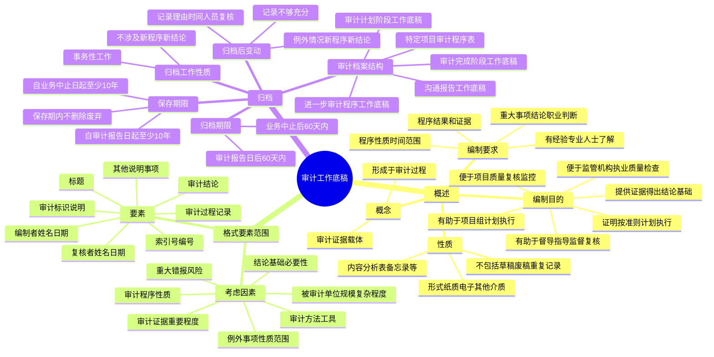

## 1. 章节定位

| 项目 | 信息 |
|------|------|
| 所属科目 | 审计 |
| 难度等级 | 2 |
| 历年分值 | 3-6 分 |
| 建议学时 | 3-4 小时 |
| 知识关联章节 | 第6章 审计计划、第8章 风险应对、第19章 完成审计工作、第20章 审计报告、第24章 业务质量管理 |

## 2. 考情分析

本章历年分值约 3-6 分，是审计科目中分值较低但考查稳定的章节，主要以客观题和简答题形式出现。内容由三部分构成：审计工作底稿概述（概念、编制目的、编制要求、性质）、审计工作底稿的格式要素和范围（考虑因素、要素）、审计工作底稿的归档（归档工作的性质、审计档案结构、归档期限、归档后变动、保存期限）。

**命题规律**：审计工作底稿的编制要求（使未曾接触该项审计工作的有经验的专业人士清楚地了解的内容）是客观题高频考点；识别特征的概念和各类审计程序的识别特征是简答题考点；重大事项的范围和记录要求是客观题考点；归档工作的性质（事务性工作，不涉及实施新程序或得出新结论）是高频考点；归档期限（审计报告日后 60 天内）和保存期限（自审计报告日起至少 10 年）是必考内容；归档后变动的情形和记录要求是简答题考点。

**联动考查方式**：

- 与第6章审计计划结合：总体审计策略和具体审计计划作为审计工作底稿的组成部分；
- 与第8章风险应对结合：进一步审计程序工作底稿（控制测试、实质性程序）；
- 与第19章完成审计工作结合：审计完成阶段工作底稿（重大事项概要、错报汇总表）；
- 与第20章审计报告结合：审计报告日后发现例外情况导致审计工作底稿变动；
- 与第24章业务质量管理结合：项目质量复核人员及复核日期的记录。

**备考建议**：

- 牢记审计工作底稿的编制要求（三项内容）和有经验的专业人士的定义（四方面了解）；
- 掌握识别特征的概念及不同审计程序下识别特征的具体表现；
- 熟记重大事项的四类情形和记录要求；
- 牢记归档期限（60 天）和保存期限（10 年）两个关键数字；
- 区分归档期间的事务性变动和归档后的变动情形及记录要求。

## 3. 知识框架

## 4. 核心精讲

### 4.1 审计工作底稿概述

#### 4.1.1 审计工作底稿的概念

**审计工作底稿**是指注册会计师对制定的审计计划、实施的审计程序、获取的相关审计证据，以及得出的审计结论作出的记录。审计工作底稿是审计证据的载体，是注册会计师在审计过程中形成的审计工作记录和获取的资料。审计工作底稿形成于审计过程，反映整个审计过程。

#### 4.1.2 审计工作底稿的编制目的

注册会计师应当及时编制审计工作底稿，以实现下列目的：①提供证据，作为注册会计师得出实现总体目标结论的基础；②提供证据，证明注册会计师按照审计准则和相关法律法规的规定计划和执行了审计工作。

除上述目的外，编制审计工作底稿还可以实现下列目的：①有助于项目组计划和执行审计工作；②有助于负责督导的项目组成员履行指导、监督与复核审计工作的责任；③便于项目组说明其执行审计工作的情况；④保留对未来审计工作持续产生重大影响的事项的记录；⑤便于会计师事务所实施项目质量复核、其他类型的项目复核以及质量管理体系中的监控活动；⑥便于监管机构和注册会计师协会对会计师事务所实施执业质量检查。

#### 4.1.3 审计工作底稿的编制要求

注册会计师编制的审计工作底稿，应当使未曾接触该项审计工作的有经验的专业人士清楚地了解：①按照审计准则和相关法律法规的规定实施的审计程序的性质、时间安排和范围；②实施审计程序的结果和获取的审计证据；③审计中遇到的重大事项和得出的结论，以及在得出结论时作出的重大职业判断。

**有经验的专业人士**是指会计师事务所内部或外部的具有审计实务经验，并且对下列方面有合理了解的人士：①审计过程；②审计准则和相关法律法规的规定；③被审计单位所处的经营环境；④与被审计单位所处行业相关的会计和审计问题。

#### 4.1.4 审计工作底稿的性质

**1. 审计工作底稿的形式**：可以以纸质、电子或其他介质形式存在。无论以哪种形式存在，会计师事务所都应当针对审计工作底稿设计和实施适当的控制，以实现下列目的：①使审计工作底稿清晰地显示其生成、修改及复核的时间和人员；②在审计业务的所有阶段，尤其是在项目组成员共享信息或通过互联网将信息传递给其他人员时，保护信息的完整性和安全性；③防止未经授权改动审计工作底稿；④允许项目组和其他经授权的人员为适当履行职责而接触审计工作底稿。以电子或其他介质形式存在的审计工作底稿，应与其他纸质形式的审计工作底稿一并归档，并应能通过打印等方式转换成纸质形式。

**2. 审计工作底稿的内容**：通常包括总体审计策略、具体审计计划、分析表、问题备忘录、重大事项概要、询证函回函和声明、核对表、有关重大事项的往来函件（包括电子邮件）。注册会计师还可以将被审计单位文件记录的摘要或复印件（如重大的或特定的合同和协议）作为审计工作底稿的一部分。此外，审计工作底稿通常还包括业务约定书、管理建议书、项目组内部或项目组与被审计单位举行的会议记录、与其他人士（如其他注册会计师、律师、专家等）的沟通文件及错报汇总表等。

**重要提示**：审计工作底稿并不能代替被审计单位的会计记录。审计工作底稿通常**不包括**已被取代的审计工作底稿的草稿或财务报表的草稿、反映不全面或初步思考的记录、存在印刷错误或其他错误而作废的文本，以及重复的文件记录等，因为这些草稿、错误的文本或重复的文件记录不直接构成审计结论和审计意见的支持性证据。

### 4.2 审计工作底稿的格式、要素和范围

#### 4.2.1 确定格式、要素和范围时考虑的因素

审计工作底稿的格式、要素和范围取决于诸多因素：①被审计单位的规模和复杂程度；②拟实施审计程序的性质；③识别出的重大错报风险；④已获取的审计证据的重要程度；⑤识别出的例外事项的性质和范围；⑥当从已执行审计工作或获取审计证据的记录中不易确定结论或结论的基础时，记录该结论或结论的基础的必要性；⑦审计方法和使用的工具。

#### 4.2.2 审计工作底稿的要素

通常，审计工作底稿包括下列全部或部分要素：①审计工作底稿的标题；②审计过程记录；③审计结论；④审计标识及其说明；⑤索引号及编号；⑥编制者姓名及编制日期；⑦复核者姓名及复核日期；⑧其他应说明事项。

**1. 审计工作底稿的标题**：每张审计工作底稿应当包括被审计单位的名称、审计项目的名称以及资产负债表日或审计工作底稿覆盖的会计期间（如果与交易相关）。

**2. 审计过程记录**：在记录审计过程时，应当特别注意以下几个重点方面：

（1）**测试的具体项目或事项的识别特征**：在记录实施审计程序的性质、时间安排和范围时，应当记录测试的具体项目或事项的识别特征。**识别特征**是指被测试的项目或事项表现出的征象或标志，因审计程序的性质和测试的项目或事项不同而不同。对某一个具体项目或事项而言，其识别特征通常具有唯一性，这种特性可以使其他人员根据识别特征在总体中识别该项目或事项并重新执行该测试。

**不同审计程序的识别特征举例**：①对被审计单位生成的订购单进行细节测试时，可以以订购单的日期和其唯一编号作为识别特征；②需要选取或复核既定总体内一定金额以上的所有项目的审计程序，可以记录实施程序的范围并指明该总体（如银行存款日记账中一定金额以上的所有会计分录）；③需要系统化抽样的审计程序，可以记录样本的来源、抽样的起点及抽样间隔（如从第 12345 号发运单开始每隔 125 号系统抽取）；④需要询问被审计单位中特定人员的审计程序，可以以询问的时间、被询问人的姓名及职位作为识别特征；⑤对于观察程序，可以以观察的对象或观察过程、相关被观察人员及其各自的责任、观察的地点和时间作为识别特征。

（2）**重大事项及相关重大职业判断**：重大事项通常包括：①引起特别风险的事项；②实施审计程序的结果，该结果表明财务信息可能存在重大错报，或需要修正以前对重大错报风险的评估和针对这些风险拟采取的应对措施；③导致注册会计师难以实施必要审计程序的情形；④可能导致在审计报告中发表非无保留意见或者增加强调事项段的事项。

应当记录与管理层、治理层和其他人员对重大事项的讨论，包括所讨论的重大事项的性质以及讨论的时间、地点和参加人员。**重大事项概要**包括审计过程中识别的重大事项及其如何得到解决，或对其他支持性审计工作底稿的交叉索引。将分散在审计工作底稿中的有关重大事项的记录汇总在重大事项概要中，不仅可以帮助注册会计师集中考虑重大事项对审计工作的影响，还便于审计工作的复核人员全面、快速地了解重大事项，提高复核工作的效率。

**重大职业判断的记录**：当涉及重大事项和重大职业判断时，需要编制与运用职业判断相关的审计工作底稿。例如：①如果审计准则要求注册会计师"应当考虑"某些信息或因素，并且这种考虑在特定业务情况下是重要的，记录得出结论的理由；②记录对某些方面主观判断的合理性（如某些重大会计估计的合理性）得出结论的基础；③如果针对审计过程中识别出的导致对某些文件记录的真实性产生怀疑的情况实施了进一步调查，记录对这些文件记录真实性得出结论的基础。

（3）**针对重大事项如何处理不一致的情况**：如果识别出的信息与针对某重大事项得出的最终结论不一致，应当记录如何处理不一致的情况。包括注册会计师针对该信息实施的审计程序、项目组成员对某事项的职业判断不同而向专业技术部门的咨询情况，以及项目组成员和被咨询人员不同意见的解决情况。**重要提示**：记录如何解决不一致的要求并不意味着需要保留不正确的或被取代的审计工作底稿。如果某些信息初步显示与针对某重大事项得出的最终结论不一致，注册会计师发现这些信息是错误的或不完整的，并且初步显示的不一致可以通过获取正确或完整的信息得到满意的解决，则无需保留这些错误的或不完整的信息。

**3. 审计结论**：审计工作的每一部分都应包含与已实施审计程序的结果及其是否实现既定审计目标相关的结论，还应包括审计程序识别出的例外情况和重大事项如何得到解决的结论。需要根据所实施的审计程序及获取的审计证据得出结论，并以此作为对财务报表发表审计意见的基础。在记录审计结论时需注意，审计工作底稿中记录的审计程序和审计证据是否足以支持所得出的审计结论。

**4. 审计标识及其说明**：审计标识被用于与已实施审计程序相关的底稿。每张审计工作底稿都应包含对已实施程序的性质和范围所作的解释，以支持每一个标识的含义。审计工作底稿中可使用各种审计标识，但应说明其含义，并保持前后一致。常见的审计标识包括：A（纵加核对）、<（横加核对）、B（与上年结转数核对一致）、T（与原始凭证核对一致）、G（与总分类账核对一致）、S（与明细账核对一致）、T/B（与试算平衡表核对一致）、C（已发询证函/已收回询证函）等。

**5. 索引号及编号**：通常，审计工作底稿需要注明索引号及顺序编号，相关审计工作底稿之间需要保持清晰的勾稽关系。每张表或记录都有一个索引号（如 A1、D6 等），以说明其在审计工作底稿中的放置位置。审计工作底稿中包含的信息通常需要与其他相关审计工作底稿中的相关信息进行交叉索引。

**6. 编制人员和复核人员及执行日期**：在各自完成与特定工作底稿相关的任务之后，编制者和复核者都应在工作底稿上签名并注明编制日期和复核日期。在记录已实施审计程序的性质、时间安排和范围时，应当记录：①测试的具体项目或事项的识别特征；②审计工作的执行人员及完成审计工作的日期；③审计工作的复核人员及复核的日期和范围。在需要项目质量复核的情况下，还需要注明项目质量复核人员及复核的日期。

**实务简化**：如果若干页的审计工作底稿记录同一性质的具体审计程序或事项，并且编制在同一个索引号中，可以仅在审计工作底稿的第一页上记录审计工作的执行人员和复核人员并注明日期。

### 4.3 审计工作底稿的归档

**审计档案**是指一个或多个文件夹或其他存储介质，以实物或电子形式存储构成某项具体业务的审计工作底稿的记录。

#### 4.3.1 审计工作底稿归档工作的性质

在出具审计报告前，注册会计师应完成所有必要的审计程序，取得充分、适当的审计证据并得出适当的审计结论。因此，在审计报告日后将审计工作底稿归整为最终审计档案是一项**事务性工作**，不涉及实施新的审计程序或得出新的结论。

**归档期间可以作出的变动**（事务性工作）：①删除或废弃被取代的审计工作底稿；②对审计工作底稿进行分类、整理和交叉索引；③对审计档案归整工作的完成核对表签字认可；④记录在审计报告日前获取的、与项目组相关成员进行讨论并达成一致意见的审计证据。

#### 4.3.2 审计档案的结构

典型的审计档案结构包括：①沟通和报告相关工作底稿（审计报告和经审计的财务报表、与集团项目组注册会计师的沟通和报告、与治理层的沟通和报告、与管理层的沟通和报告、管理建议书）；②审计完成阶段工作底稿（审计工作完成情况核对表、管理层书面声明原件、重大事项概要、错报汇总表、被审计单位财务报表和试算平衡表、有关列报的工作底稿、董事会会议纪要、总结会会议纪要）；③审计计划阶段工作底稿（总体审计策略和具体审计计划、对内部审计职能的评价、对外部专家的评价、对服务机构的评价、被审计单位提交资料清单、集团项目组的审计指令和沟通、前期审计报告和经审计的财务报表、预备会会议纪要）；④特定项目审计程序表（舞弊、持续经营、对法律法规的考虑、关联方）；⑤进一步审计程序工作底稿（控制测试工作底稿、实质性程序工作底稿，包括实质性分析程序和细节测试）。

#### 4.3.3 审计工作底稿归档的期限

会计师事务所应当制定有关及时完成最终业务档案归整工作的政策和程序。**审计工作底稿的归档期限为审计报告日后 60 天内**。如果注册会计师未能完成审计业务，审计工作底稿的归档期限为**审计业务中止后的 60 天内**。

如果针对客户的同一财务信息执行不同的委托业务，出具两个或多个不同的报告，会计师事务所应当将其视为不同的业务，在规定的归档期限内分别将审计工作底稿归整为最终审计档案。

#### 4.3.4 审计工作底稿归档后的变动

**1. 需要变动审计工作底稿的情形**：注册会计师发现有必要修改现有审计工作底稿或增加新的审计工作底稿的情形主要有以下两种：①注册会计师已实施了必要的审计程序，取得了充分、适当的审计证据并得出了恰当的审计结论，但审计工作底稿的记录不够充分；②审计报告日后，发现例外情况要求注册会计师实施新的或追加审计程序，或导致注册会计师得出新的结论。

**例外情况的例子**：注册会计师在审计报告日后获知，但在审计报告日已经存在的事实，并且如果注册会计师在审计报告日已获知该事实，可能导致财务报表需要作出修改或在审计报告中发表非无保留意见。例如，注册会计师在审计报告日后才获知法院在审计报告日前已对被审计单位的诉讼、索赔事项作出最终判决结果。例外情况可能在审计报告日后发现，也可能在财务报表报出日后发现，注册会计师应当按照审计准则第 1332 号（期后事项）有关"财务报表报出后知悉的事实"的相关规定，对例外事项实施新的或追加的审计程序。

**2. 变动审计工作底稿时的记录要求**：在完成最终审计档案的归整工作后，如果发现有必要修改现有审计工作底稿或增加新的审计工作底稿，无论修改或增加的性质如何，均应当记录下列事项：①修改或增加审计工作底稿的理由；②修改或增加审计工作底稿的时间和人员，以及复核的时间和人员。

#### 4.3.5 审计工作底稿的保存期限

会计师事务所应当**自审计报告日起，对审计工作底稿至少保存 10 年**。如果注册会计师未能完成审计业务，会计师事务所应当**自审计业务中止日起，对审计工作底稿至少保存 10 年**。

**重要提示**：在完成最终审计档案的归整工作后，注册会计师不应在规定的保存期届满前删除或废弃任何性质的审计工作底稿。

## 5. 典型例题

**【例题 1】（识别特征与重大事项）**

ABC 会计师事务所审计甲公司 2×24 年度财务报表。审计项目组在审计过程中实施下列审计程序：（1）对甲公司生成的订购单进行细节测试；（2）对甲公司 4 月 1 日至 9 月 30 日的发运单进行系统化抽样，从第 12345 号发运单开始每隔 125 号抽取；（3）观察甲公司存货盘点；（4）向甲公司财务经理询问重大关联方交易的情况。要求：分别针对上述四种审计程序，说明注册会计师应当记录的识别特征。

**答案**：

程序（1）：对订购单进行细节测试，可以以订购单的日期和其唯一编号作为测试订购单的识别特征。识别特征具有唯一性，可以使其他人员根据识别特征在总体中识别该项目或事项并重新执行该测试。

程序（2）：对发运单进行系统化抽样，应当记录样本的来源、抽样的起点及抽样间隔。具体识别特征为：4 月 1 日至 9 月 30 日的发运记录，从第 12345 号发运单开始每隔 125 号系统抽取的发运单。

程序（3）：观察存货盘点程序，可以以观察的对象或观察过程、相关被观察人员及其各自的责任、观察的地点和时间作为识别特征。如记录观察的盘点地点（如某仓库）、观察的日期、被观察的盘点人员及其职责等。

程序（4）：向财务经理询问重大关联方交易的情况，可以以询问的时间、被询问人的姓名及职位作为识别特征。如记录询问日期为 2×25 年 2 月 15 日，被询问人为财务经理张某。

**解析**：识别特征是高频考点。识别特征因审计程序的性质和测试的项目或事项不同而不同，但对某一个具体项目或事项而言通常具有唯一性。解题关键：把握"使其他人员能够根据识别特征在总体中识别该项目或事项并重新执行该测试"的本质。

**【例题 2】（归档后的变动）**

ABC 会计师事务所于 2×25 年 3 月 5 日对甲公司 2×24 年度财务报表出具了审计报告，并于 2×25 年 4 月 10 日完成审计工作底稿的归档工作。2×25 年 5 月 20 日，审计项目组获知法院在 2×25 年 2 月 28 日（审计报告日前）已对甲公司一项重大诉讼案件作出终审判决，判决甲公司赔偿对方 2000 万元，而甲公司财务报表中仅确认了 500 万元的预计负债。要求：（1）说明该事项属于何种情形；（2）说明注册会计师应当采取的措施；（3）说明在审计工作底稿中的记录要求。

**答案**：

（1）该事项属于审计报告日后发现的例外情况。理由：注册会计师在审计报告日后获知，但在审计报告日（2×25 年 3 月 5 日）已经存在的事实（法院于 2 月 25 日 2 月 28 日作出终审判决），并且如果注册会计师在审计报告日已获知该事实，可能导致财务报表需要作出修改或在审计报告中发表非无保留意见。这属于归档后变动审计工作底稿的第二种情形——审计报告日后，发现例外情况要求注册会计师实施新的或追加审计程序，或导致注册会计师得出新的结论。

（2）注册会计师应当采取的措施：①按照审计准则第 1332 号（期后事项）有关"财务报表报出后知悉的事实"的相关规定，对例外事项实施新的或追加的审计程序，如查阅法院判决文件、复核甲公司的会计处理或披露事项，确定管理层对财务报表的修改是否恰当；②复核管理层采取的措施能否确保所有收到原财务报表和审计报告的人士了解这一情况；③根据具体情况确定对审计报告的影响，必要时出具新的或经修改的审计报告。

（3）在审计工作底稿中的记录要求：由于已完成最终审计档案的归整工作（2×25 年 4 月 10 日），现发现有必要修改或增加审计工作底稿，无论修改或增加的性质如何，均应当记录下列事项：①修改或增加审计工作底稿的理由（即审计报告日后发现法院于审计报告日前已作出终审判决的例外情况）；②修改或增加审计工作底稿的时间和人员，以及复核的时间和人员。

**解析**：归档后变动是高频考点。解题关键：①判断是否属于例外情况（审计报告日已存在+若获知可能影响报告）；②归档后变动与归档期间事务性变动的区别（归档期间变动不涉及新程序新结论，归档后变动可能涉及新程序新结论）；③记录要求（理由+时间人员+复核时间人员）。

**【例题 3】（归档期限与保存期限）**

ABC 会计师事务所审计甲公司 2×24 年度财务报表，审计报告日为 2×25 年 3 月 5 日。因甲公司管理层与注册会计师在重大会计处理上存在分歧，注册会计师于 2×25 年 4 月 1 日中止了该项审计业务，未出具审计报告。要求：（1）说明审计工作底稿的归档期限；（2）说明审计工作底稿的保存期限；（3）说明归档工作的性质。

**答案**：

（1）归档期限：由于注册会计师未能完成审计业务（审计业务中止），审计工作底稿的归档期限为审计业务中止后的 60 天内，即自 2×25 年 4 月 1 日起 60 天内（至 2×25 年 5 月 31 日）完成归档工作。

（2）保存期限：由于注册会计师未能完成审计业务，会计师事务所应当自审计业务中止日（2×25 年 4 月 1 日）起，对审计工作底稿至少保存 10 年，即至少保存至 2×35 年 3 月 31 日。在完成最终审计档案的归整工作后，不应在规定的保存期届满前删除或废弃任何性质的审计工作底稿。

（3）归档工作的性质：在审计报告日前（本题中因业务中止未出具审计报告，则指审计业务中止前），注册会计师应完成所有必要的审计程序，取得充分、适当的审计证据并得出适当的审计结论。因此，在审计业务中止后将审计工作底稿归整为最终审计档案是一项事务性工作，不涉及实施新的审计程序或得出新的结论。归档期间可以作出的事务性变动包括：删除或废弃被取代的审计工作底稿；对审计工作底稿进行分类、整理和交叉索引；对审计档案归整工作的完成核对表签字认可；记录在审计业务中止日前获取的、与项目组相关成员进行讨论并达成一致意见的审计证据。

**解析**：归档期限和保存期限是必考内容。解题关键：①区分完成审计业务（审计报告日后 60 天归档，自审计报告日起保存 10 年）和未完成审计业务（业务中止后 60 天归档，自业务中止日起保存 10 年）两种情形；②归档工作性质为事务性工作，不涉及新程序新结论。

## 6. 记忆口诀

**审计工作底稿概述**：概念（审计证据载体，形成于审计过程，反映整个审计过程）；编制目的两主要（提供证据得出结论基础、证明按准则计划执行）+ 六次要（有助于项目组计划执行、有助于督导指导监督复核、便于项目组说明情况、保留对未来持续重大影响事项记录、便于项目质量复核监控、便于监管机构执业质量检查）；编制要求三了解（程序性质时间范围、程序结果和证据、重大事项结论职业判断）；有经验专业人士四了解（审计过程、审计准则法规、经营环境、行业会计审计问题）。

**格式要素范围**：考虑因素七项（规模复杂程度、程序性质、重大错报风险、证据重要程度、例外事项性质范围、结论基础必要性、审计方法工具）；要素八项（标题、审计过程记录、审计结论、审计标识说明、索引号编号、编制者姓名日期、复核者姓名日期、其他说明）；识别特征因程序不同而不同（细节测试用日期+编号、金额以上用范围+总体、系统抽样用来源+起点+间隔、询问用时间+姓名+职位、观察用对象+人员+地点+时间）；重大事项四类（特别风险、可能存在重大错报或修正风险评估、难以实施必要程序、可能导致非无保留意见或强调事项段）；审计工作底稿不包括草稿废稿重复记录。

**归档**：性质事务性工作（不涉及新程序新结论）；归档期间四变动（删除废弃被取代底稿、分类整理交叉索引、归档完成核对表签字、记录报告日前获取的讨论一致证据）；档案结构五部分（沟通报告、审计完成阶段、审计计划阶段、特定项目程序表、进一步审计程序）；归档期限 60 天（审计报告日后或业务中止后）；归档后变动两情形（记录不够充分、例外情况新程序新结论）+ 记录要求两事项（理由、时间人员复核时间人员）；保存期限 10 年（自审计报告日或业务中止日起）+ 保存期内不删除废弃。
