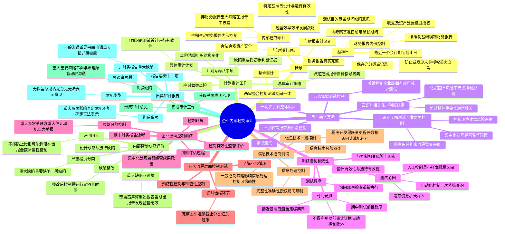

## 1. 章节定位

| 项目 | 信息 |
|------|------|
| 所属科目 | 审计 |
| 难度等级 | 4 |
| 历年分值 | 8-12 分 |
| 建议学时 | 8-10 小时 |
| 知识关联章节 | 第7章 风险评估、第8章 风险应对、第9章 销售与收款循环、第20章 审计报告、第21章 审计工作底稿 |

## 2. 考情分析

本章是审计科目的重要章节，历年分值约 8-12 分，主观题与客观题均有考查。主观题常以简答题形式考查自上而下方法的步骤、企业层面控制与业务流程层面控制的区分、控制测试程序的性质时间安排和范围、内部控制缺陷的评价（重大缺陷/重要缺陷/一般缺陷的判断）、内部控制审计报告的意见类型及内容；客观题集中在内部控制审计与财务报表审计的区别、整合审计、控制测试最小样本规模、控制缺陷的分类及严重程度评价、内部控制审计报告要素。

**命题规律**：本章核心考点较为集中。内部控制审计与财务报表审计的区别（尤其是测试范围、测试期间、缺陷评价、意见类型）、自上而下方法的五个步骤、企业层面控制的三种类型及其对其他控制测试的影响、控制设计有效性与运行有效性的区分、控制偏差处理、控制缺陷严重程度评价三步法、内部控制审计报告意见类型（无保留意见/否定意见/无法表示意见，注意无保留意见以外的意见类型中无保留意见和保留意见的区分）是高频考点。

**高频考点分布**：

1. **内部控制审计概念**：严格限定在财务报告内部控制审计；非财务报告内部控制重大缺陷在报告中增加描述段披露但不发表意见。
2. **内部控制审计基准日**：最近一个会计期间截止日；需获取基准日前足够长期间内有效运行的审计证据。
3. **与财务报表审计的区别**：测试目的、范围（所有相关认定 vs 部分认定）、期间（每年测试 vs 三年至少一次）、缺陷评价（重大/重要/一般缺陷 vs 值得关注缺陷）、意见类型（无保留/否定/无法表示 vs 四种意见）。
4. **整合审计**：控制测试涵盖期间应与财务报表审计拟信赖内部控制的期间保持一致。
5. **自上而下方法五步骤**：初步了解整体风险；识别了解测试企业层面控制；识别相关账户列报及相关认定；了解错报来源识别相应控制；选择拟测试控制。
6. **企业层面控制八类**：控制环境、凌驾风险控制、风险评估过程、内部信息传递和期末财务报告流程、控制有效性内部监督和内部控制评价、集中化处理和控制、监督经营成果控制、重大经营控制及风险管理实务政策。
7. **企业层面控制对其他控制测试的三种影响**：间接影响（调整程序性质时间范围）、监督有效（减少测试）、精确足够（不必测试其他控制）。
8. **控制有效性**：设计有效性（按规定程序执行能实现控制目标）和运行有效性（按设计运行、执行人员有授权和胜任能力）。
9. **测试程序**：询问、观察、检查、重新执行；仅询问不能提供充分适当证据。
10. **控制测试时间安排**：接近基准日测试，涵盖足够长期间；不得利用以前审计获取的审计证据（自动化信息处理控制的与基准相比较策略除外）；期中测试需前推程序。
11. **控制测试最小样本规模**：人工控制按运行频率确定区间（每年1次1个到每天多次25-60个）；自动化信息处理控制一般一次系统查询即可。
12. **控制偏差处理**：发现偏差需评价对风险评估、审计证据、控制运行有效性结论的影响；扩大样本规模测试，再次发现偏差则得出控制无效结论。
13. **控制缺陷分类**：设计缺陷和运行缺陷；按严重程度分为重大缺陷、重要缺陷、一般缺陷。
14. **控制缺陷严重程度评价**：考虑控制不能防止或发现并纠正错报的可能性和潜在错报金额大小；考虑补偿性控制的影响。
15. **重大缺陷四迹象**：董监高舞弊、重述已公布财务报表、当期重大错报未被内控发现、审计委员会和内部审计机构监督无效。
16. **内部控制审计报告要素**：标题、收件人、引言段、企业责任段、注册会计师责任段、固有局限性说明段、审计意见段、非财务报告内部控制重大缺陷描述段、签名盖章、事务所信息、报告日期。
17. **意见类型**：无保留意见、否定意见（存在重大缺陷）、无法表示意见（审计范围受限）；注意内控审计报告无保留意见类型。
18. **期后事项考虑**：知悉对基准日内控有效性有重大负面影响的期后事项发表否定意见；不能确定影响程度出具无法表示意见。

**联动考查方式**：与第7章风险评估结合（识别相关账户、列报及相关认定）；与第8章风险应对结合（控制测试的性质时间范围）；与第9-12章循环审计结合（业务流程层面控制的识别和测试）；与第20章审计报告结合（内控审计报告与财报审计报告关系）；与第21章审计工作底稿结合（内控审计工作底稿编制）。

**备考建议**：牢记内控审计严格限定在财务报告内部控制审计；区分内控审计与财报审计的五大区别（测试目的、范围、期间、缺陷评价、意见类型）；熟记自上而下方法的五个步骤；区分企业层面控制的三种类型及其对其他控制测试的不同影响；掌握控制测试最小样本规模区间表；掌握控制缺陷评价流程及补偿性控制的考虑；牢记内控审计报告无保留意见类型（无保留/否定/无法表示，无保留意见）。

## 3. 知识框架

## 4. 核心精讲

### 4.1 内部控制审计的概念

#### 4.1.1 内部控制的概念和目标

**内部控制**是指由企业董事会、监事会、管理层和全体员工实施的旨在实现控制目标的过程。

内部控制的目标是合理保证：
1. 企业经营管理合法合规；
2. 资产安全；
3. 财务报告及相关信息真实完整；
4. 提高经营效率和效果；
5. 促进企业实现发展战略。

#### 4.1.2 财务报告内部控制

**财务报告内部控制**是指公司的董事会、监事会、管理层及全体员工实施的旨在合理保证财务报告及相关信息真实、完整而设计和运行的内部控制，以及用于保护资产安全的内部控制中与财务报告可靠性目标相关的控制。具体包括下列方面的政策和程序：

1. 保存充分、适当的记录，准确、公允地反映企业的交易和事项；
2. 合理保证按照适用的财务报告编制基础的规定编制财务报告；
3. 合理保证收入和支出的发生以及资产的取得、使用或处置经过适当授权；
4. 合理保证及时防止或发现并纠正未经授权的、对财务报表有重大影响的交易和事项。

**财务报告内部控制与非财务报告内部控制的区分**：注册会计师考虑某项控制是否是财务报告内部控制的关键依据是控制目标。例如，与客户定期对账和差异处理相关的控制与应收账款的存在、权利和义务等认定相关，属于财务报告内部控制；为达到最佳库存经营目标而建立的对存货采购间隔时间进行监控的控制与经营效率效果相关，不直接与财务报表认定相关，属于非财务报告内部控制。

需要注意的是，相当一部分内部控制能够实现多种目标，主要与经营目标或合规性目标相关的控制可能同时也与财务报告可靠性目标相关。不能仅因为某一控制与经营目标或合规性目标相关而认定其属于非财务报告内部控制，注册会计师需要根据控制在特定企业环境中的目标、性质及作用作出职业判断。

#### 4.1.3 内部控制审计的概念和范围

**内部控制审计**是指会计师事务所接受委托，对特定基准日内部控制设计与运行的有效性进行审计。

注册会计师执行的内部控制审计严格限定在**财务报告内部控制审计**。这是因为从注册会计师的专业胜任能力、审计成本效益的约束，以及投资者对财务信息质量的需求来看，财务报告内部控制审计是服务的核心要求。因此：
- 针对财务报告内部控制，注册会计师对其有效性发表审计意见；
- 针对非财务报告内部控制，注册会计师对内部控制审计过程中注意到的非财务报告内部控制的重大缺陷，在内部控制审计报告中增加"非财务报告内部控制重大缺陷描述段"予以披露。

#### 4.1.4 内部控制审计基准日

**内部控制审计基准日**是指注册会计师评价内部控制在某一时日是否有效所涉及的基准日，也是被审计单位评价基准日，即**最近一个会计期间截止日**。

注册会计师对特定基准日内部控制的有效性发表意见，并不意味着只测试基准日这一天的内部控制，而是需要考察足够长一段时间内部控制设计和运行的情况。对控制有效性的测试涵盖的期间越长，提供的控制有效性的审计证据越多。在整合审计中，控制测试所涵盖的期间应当尽量与财务报表审计中拟信赖内部控制的期间保持一致。

#### 4.1.5 内部控制审计和财务报表审计的区别

| 项目 | 内部控制审计 | 财务报表审计 |
|------|--------------|--------------|
| 测试目的 | 对内部控制的有效性发表审计意见 | 识别、评估和应对重大错报风险，确定实质性程序性质时间范围，获取财务报表审计证据 |
| 测试范围 | 针对所有相关账户和列报的每一相关认定获取控制设计和运行有效性证据 | 当预期控制有效或仅实质性程序不能提供充分适当证据时测试，可能对部分认定不测试 |
| 测试期间 | 需获取基准日前足够长时间内有效运行的证据；不得采用"每三年至少测试一次"方法，每年测试 | 需获取整个拟信赖期间运行有效的证据；拟信赖控制未变化且非特别风险控制可利用以前审计证据，每三年至少测试一次 |
| 缺陷评价 | 评价缺陷是否构成一般缺陷、重要缺陷或重大缺陷 | 确定缺陷是否构成值得关注的内部控制缺陷 |
| 沟通缺陷 | 重大缺陷和重要缺陷书面与治理层和管理层沟通，其他缺陷书面与管理层沟通并告知治理层 | 值得关注缺陷书面及时向治理层通报，其他缺陷及时向相应层级管理层通报 |
| 报告意见类型 | 无保留意见、否定意见、无法表示意见 | 无保留意见、保留意见、否定意见、无法表示意见 |

#### 4.1.6 整合审计

内部控制审计和财务报表审计在技术层面和审计实务中存在共同之处，风险识别、评估和应对等大量工作内容相近，基础工作可以共享。为提高审计效果和效率，注册会计师可以单独进行内部控制审计，也可以将内部控制审计和财务报表审计整合进行（**整合审计**）。

### 4.2 计划内部控制审计工作

#### 4.2.1 计划审计工作时应当考虑的事项

在计划审计工作时，注册会计师应当评价下列事项对财务报告内部控制、财务报表及审计工作的影响：

1. **与企业相关的风险**：了解企业面临的风险可以帮助识别重大错报风险，继而帮助识别相关账户、列报和相关认定以及识别重大业务流程。
2. **相关法律法规和行业概况**：重点关注可能直接影响财务报表金额与披露的法律法规，了解行业因素对被审计单位经营环境的影响。
3. **企业组织结构、经营特点和资本结构等相关重要事项**：了解股权结构、子公司合营公司联营公司、组织机构、负债结构等。
4. **企业内部控制最近发生变化的程度**：新增业务流程、原有业务流程变更、内部控制执行人变更等将直接影响审计程序的性质时间范围。
5. **与企业沟通过的内部控制缺陷**：了解以前年度审计中发现的内部控制缺陷所采取的整改措施及整改结果。
6. **重要性、风险等与确定内部控制重大缺陷相关的因素**：对与确定内部控制重大缺陷相关的重要性、风险及其他因素进行初步判断。
7. **对内部控制有效性的初步判断**：综合上述考虑及以前年度审计经验形成初步判断。
8. **可获取的与内部控制有效性相关的证据的类型和范围**：了解证据是第三方还是内部证据，是书面还是口头证据，覆盖范围等。

#### 4.2.2 总体审计策略和具体审计计划

**总体审计策略**应当体现：确定审计业务的特征以界定审计范围；明确审计业务的报告目标以计划时间安排和所需沟通的性质；考虑用以指导项目组工作方向的重要因素；考虑初步业务活动的结果；确定执行业务所需资源的性质时间安排和范围。

**具体审计计划**应当体现：了解和识别内部控制的程序的性质时间安排和范围；测试控制设计有效性的程序的性质时间安排和范围；测试控制运行有效性的程序的性质时间安排和范围。

#### 4.2.3 对应对舞弊风险的考虑

在计划和实施内部控制审计工作时，注册会计师应当考虑财务报表审计中对舞弊风险的评估结果。在识别和测试企业层面控制以及选择其他控制进行测试时，应当评价被审计单位的内部控制是否足以应对识别出的、舞弊导致的重大错报风险，并评价为应对管理层和治理层凌驾于控制之上的风险而设计的控制。

### 4.3 自上而下的方法

注册会计师应当采用**自上而下的方法**选择拟测试的控制。该方法始于财务报表层次，从对财务报告内部控制整体风险的了解开始，然后将关注重点放在企业层面的控制上，并将工作逐渐下移至相关账户、列报及其相关认定，最后确认对业务流程中风险的了解，并选择能足以应对评估的每个相关认定的重大错报风险的控制进行测试。

自上而下方法的五个步骤：
1. 从财务报表层次初步了解内部控制整体风险；
2. 识别、了解和测试企业层面控制；
3. 识别相关账户、列报及其相关认定；
4. 了解潜在错报的来源并识别相应的控制；
5. 选择拟测试的控制。

#### 4.3.1 识别、了解和测试企业层面控制

企业层面控制通常为应对企业财务报表整体层面的风险而设计，或在比业务流程更高的层面上乃至整个企业范围内运行，作用比较广泛，通常不局限于某个具体认定。企业层面控制包括：
1. 与控制环境（即内部环境）相关的控制；
2. 针对管理层和治理层凌驾于控制之上的风险而设计的控制；
3. 被审计单位的风险评估过程；
4. 对内部信息传递和期末财务报告流程的控制；
5. 对控制有效性的内部监督和内部控制评价；
6. 集中化的处理和控制（包括共享的服务环境）；
7. 监控经营成果的控制；
8. 针对重大经营控制及风险管理实务的政策。

**企业层面控制对其他控制及其测试的影响**有三种情形：

1. **间接影响的企业层面控制**：如与控制环境相关的控制，对重大错报是否能够被及时防止或发现的可能性有重要影响，虽然影响是间接的，但可能影响注册会计师拟测试的其他控制及其对其他控制所实施程序的性质时间安排和范围。

2. **监督其他控制有效性的企业层面控制**：管理层设计这些控制是为了识别其他控制可能出现的失效情况，但本身并非精确到足以及时防止或发现相关认定的重大错报。当这些控制运行有效时，注册会计师可以减少原本拟对其他控制的有效性进行的测试，但不能完全替代。

3. **本身精确到足以防止或发现重大错报的企业层面控制**：如果一项企业层面控制足以应对已评估的重大错报风险，注册会计师可能可以不必测试与该风险相关的其他控制。

#### 4.3.2 识别相关账户、列报及其相关认定

如果某账户或列报可能存在一个错报，该错报单独或连同其他错报将导致财务报表发生重大错报，则该账户或列报为**相关账户或列报**。如果某财务报表认定可能存在一个或多个错报，这些错报将导致财务报表发生重大错报，则该认定为**相关认定**。

识别时的考虑：
- 超过财务报表整体重要性的账户通常被认定为相关账户；
- 定性因素也可能导致将低于财务报表整体重要性的账户认定为相关账户；
- 应当依据其固有风险，**不应考虑相关控制的影响**；
- 在内部控制审计中识别的相关账户、列报及其相关认定应当与财务报表审计中识别的相同。

#### 4.3.3 了解潜在错报的来源并识别相应的控制

注册会计师应当实现下列目标以了解潜在错报的来源：
1. 了解与相关认定有关的交易的处理流程；
2. 验证业务流程中可能发生重大错报（包括舞弊导致的错报）的环节；
3. 识别被审计单位用于应对这些错报或潜在错报的控制；
4. 识别被审计单位用于及时防止或发现并纠正未经授权的、导致重大错报的资产取得、使用或处置的控制。

**穿行测试**通常是实现上述目标和评价控制设计的有效性以及确定控制是否得到执行的有效方法。穿行测试是指追踪某笔交易从发生到最终被反映在财务报表中的整个处理过程。在存在较高固有风险的复杂领域、以前年度审计中识别出的缺陷、流程发生重大变化等情况下，通常实施穿行测试。一般而言，对每个重要流程选取一笔交易或事项实施穿行测试即可。

#### 4.3.4 选择拟测试的控制

注册会计师应当针对每一相关认定获取控制有效性的审计证据，但没有责任对单项控制的有效性发表意见。应当选择对形成评价结论具有重要影响的控制进行测试。

**选择关键控制**的考虑因素：
1. 哪些控制是不可缺少的；
2. 哪些控制直接针对相关认定；
3. 哪些控制可以应对错误或舞弊导致的重大错报风险；
4. 控制的运行是否足够精确。

每个相关账户、认定和重大错报风险至少应当有一个对应的关键控制。如果企业层面控制有效且得到精确执行，能够及时防止或发现并纠正影响一个或多个认定的重大错报，注册会计师可能不必就所有流程、交易或应用层面的控制的运行有效性获取审计证据。

### 4.4 测试控制的有效性

#### 4.4.1 内部控制的有效性

内部控制的有效性包括**设计有效性**和**运行有效性**：

- **设计有效性**：如果某项控制由拥有有效执行控制所需的授权和专业胜任能力的人员按规定程序和要求执行，能够实现控制目标，从而有效地防止或发现并纠正可能导致财务报表发生重大错报的错误或舞弊，则表明该项控制的设计是有效的。
- **运行有效性**：如果某项控制正在按照设计运行、执行人员拥有有效执行控制所需的授权和专业胜任能力，能够实现控制目标，则表明该项控制的运行是有效的。

#### 4.4.2 与控制相关的风险

与控制相关的风险包括一项控制可能无效的风险，以及如果该控制无效可能导致重大缺陷的风险。与控制相关的风险越高，注册会计师需要获取的审计证据就越多。

影响与控制相关风险的因素：
1. 该项控制拟防止或发现并纠正的错报的性质和重要程度；
2. 相关账户、列报及其认定的固有风险；
3. 交易的数量和性质是否发生变化；
4. 相关账户或列报是否曾经出现错报；
5. 企业层面控制（特别是监督其他控制的控制）的有效性；
6. 该项控制的性质及其执行频率；
7. 该项控制对其他控制有效性的依赖程度；
8. 执行该项控制或监督该项控制执行的人员的专业胜任能力及关键人员是否发生变化；
9. 该项控制是人工控制还是自动化控制；
10. 该项控制的复杂程度及依赖判断的程度。

连续审计中还应当考虑：以前审计所实施的审计程序的性质时间安排和范围；以前审计控制测试的结果；自上次审计以来控制或流程是否发生变化。

#### 4.4.3 测试控制有效性的程序

注册会计师测试控制有效性的程序通常为询问、观察、检查和重新执行：

1. **询问**：通过与被审计单位有关人员讨论取得与内部控制相关的信息。但仅实施询问程序不能为某一特定控制的有效性提供充分适当的证据，必须与其他测试手段结合使用。

2. **观察**：测试运行不留下书面记录的控制的有效方法，如职责分离相关控制、对实物的控制。观察提供的审计证据仅限于观察发生的时点，且被观察人员的行为可能因被观察而受到影响。

3. **检查**：通常用于确认控制是否得以执行。检查记录和文件可以提供可靠程度不同的审计证据，其可靠性取决于记录或文件的性质和来源。存在书面证据不一定表明控制一定有效，如签名不一定能证明审核人员认真审核了凭证。

4. **重新执行**：通常只有当综合运用询问、观察和检查程序仍无法获取充分适当的证据时才考虑使用。重新执行的目的是评价控制的有效性，而不是测试特定交易或余额的存在或准确性，即定性而非定量，一般不必选取大量项目。

#### 4.4.4 控制测试的时间安排

对控制有效性的测试涵盖的期间越长，提供的控制有效性的审计证据越多。注册会计师应当在两个因素之间作出平衡以确定测试的时间：尽量在接近基准日实施测试；实施的测试需要涵盖足够长的期间。

**期中测试的两种方法**：按照既定样本规模进行期中测试，然后对剩余期间实施前推测试；或将样本分成两部分，一部分在期中测试，另一部分在临近年末的期间测试。

**以前审计获取的审计证据**：对于内部控制审计，除考虑对自动化信息处理控制实施与基准相比较的策略外，注册会计师**不能利用以前审计中获取的有关控制运行有效性的审计证据**，需要每年获取有关控制有效性的审计证据。

**期中测试和前推程序**：如果已获取有关控制在期中运行有效性的审计证据，应当确定还需要获取哪些补充审计证据以证实剩余期间控制的运行情况。前推测试需考虑：基准日之前测试的特定控制；期中获取的有关审计证据的充分性和适当性；剩余期间的长短；期中测试之后内部控制发生重大变化的可能性；控制环境。

**信息技术一般控制和自动化信息处理控制的前推程序**：自动化信息处理控制一旦被证明运行有效，通常不会发生运行故障或质量下降，前提是存在适当且持续有效的信息技术一般控制。如果信息技术一般控制有效且关键的自动化信息处理控制未发生变化，不需要对该自动化控制实施前推测试。

#### 4.4.5 控制测试的范围

注册会计师在测试控制的运行有效性时，应当在考虑与控制相关风险的基础上确定测试的范围（样本规模），应当足以使其能够获取充分适当的审计证据，为基准日内部控制是否不存在重大缺陷提供合理保证。

**测试人工控制的最小样本规模区间**：

| 控制运行频率 | 控制运行的总次数 | 测试的最小样本规模区间 |
|--------------|------------------|------------------------|
| 每年1次 | 1 | 1 |
| 每季1次 | 4 | 2 |
| 每月1次 | 12 | 2-5 |
| 每周1次 | 52 | 5-15 |
| 每天1次 | 250 | 20-40 |
| 每天多次 | 大于250次 | 25-60 |

使用最低值的条件（无需全部具备）：固有风险和舞弊风险为低水平；是日常控制，执行时需要的判断很少；穿行测试和以前年度审计结果表明未发现控制缺陷；管理层针对该项控制的测试结果表明未发现控制缺陷；存在有效的补偿性控制且管理层测试结果为运行有效；拟更多地利用他人的工作。

**测试自动化信息处理控制的最小样本规模**：信息技术处理具有内在一贯性，除非系统发生变动，一项自动化信息处理控制应当一贯运行。一旦确定被审计单位正在执行该控制，通常无需扩大控制测试范围，但需要测试信息技术一般控制的运行有效性、确定系统是否发生变动、确定对交易的处理是否使用授权批准的软件版本。在信息技术一般控制有效的前提下，可能只需要对某项自动化信息处理控制的每一相关属性进行一次系统查询以检查其系统设置。

**发现控制偏差时的处理**：发现控制偏差时应当确定对下列事项的影响：与所测试控制相关的风险的评估；需要获取的审计证据；控制运行有效性的结论。如果发现的控制偏差是系统性偏差或人为有意造成的偏差，应当考虑舞弊的可能迹象。对每日发生多次的控制，如果初始样本规模为25个，当测试发现一项控制偏差且不是系统性偏差时，可以扩大样本规模进行测试；如果再次发现控制偏差，可以得出该控制无效的结论；如果扩大样本规模没有再次发现控制偏差，可以得出控制有效的结论。

#### 4.4.6 控制变更时的特殊考虑

对内部控制审计而言，如果新控制实现了相关控制目标且运行了足够长的时间，注册会计师能够通过对该控制进行测试评价其设计和运行的有效性，则无需测试被取代的控制。对财务报表审计而言，如果被取代控制的运行有效性对控制风险的评估有重大影响，应当测试被取代控制的设计和运行的有效性。

### 4.5 企业层面控制的测试

#### 4.5.1 与控制环境相关的控制

控制环境包括治理职能和管理职能，以及治理层和管理层对内部控制及其重要性的态度、认识和行动。在了解和测试控制环境时，需要考虑：管理层的理念和经营风格是否促进了有效的财务报告内部控制；管理层在治理层的监督下是否营造并保持了诚信和合乎道德的文化；治理层是否了解并监督财务报告过程和内部控制。

#### 4.5.2 针对管理层和治理层凌驾于控制之上的风险而设计的控制

针对凌驾风险采用的控制包括但不限于：

1. **针对重大的异常交易的控制**：重大的异常交易指不是在被审计单位正常业务过程中产生，并且对被审计单位而言较为重大的交易。
2. **针对关联方交易的控制**：关注关联方交易管理及业务流程，是否存在凌驾于内部控制之上的风险。
3. **与管理层的重大估计相关的控制**：关注管理层作出重大会计估计的过程，是否能防止因操纵重大会计估计而导致财务报表重大错报。
4. **能够减弱管理层伪造或不恰当操纵财务结果的动机及压力的控制**：关注薪酬委员会角色、预算编制合理性、内部审计部门检查等。
5. **建立内部举报投诉制度**：关注是否建立了举报热线、电子邮件、举报信箱等和举报人保护制度。

#### 4.5.3 被审计单位的风险评估过程

风险评估过程包括识别与财务报告相关的经营风险，以及针对这些风险所采取的措施。了解和测试时考虑：是否根据既定控制目标有计划地全面系统持续地收集内外部相关信息；是否识别并分类整理各类风险形成风险清单；是否采用定性和定量相结合的方法对风险进行分析和排序；是否综合运用控制措施将风险控制在可承受范围之内。

#### 4.5.4 对内部信息传递和期末财务报告流程的控制

期末财务报告流程包括：将交易总额登入总分类账的程序；与会计政策的选择和运用相关的程序；总分类账中会计分录的编制、批准等处理程序；对财务报表进行调整的程序；编制财务报表的程序。

评价期末财务报告流程应当从：财务报表的编制流程；运用信息技术的程度；参与期末财务报告流程的人员；纳入财务报表编制范围的组成部分；调整分录及合并分录的类型；管理层和治理层对期末财务报告流程进行监督的性质及范围。

#### 4.5.5 对控制有效性的内部监督和内部控制评价

特别考虑的因素：管理层是否定期将会计系统中记录的数额与实物资产进行核对；是否为保证内部审计活动的有效性而建立相应控制；是否建立相关控制保证自我评价或定期系统评价的有效性；是否建立相关控制保证监督性控制能够在一个集中的地点有效进行。

### 4.6 业务流程、应用系统或交易层面的控制的测试

#### 4.6.1 了解企业经营活动和业务流程

通常可以将被审计单位的整个经营活动划分为几个重要的业务循环（又称"业务流程"）。对制造业企业，可以划分为销售与收款循环、采购与付款循环、存货与生产循环、工资与人员循环、筹资与投资循环等。

在了解业务流程前需要考虑：该业务流程中的交易所影响的相关账户及其相关认定；已经识别的有关这些相关账户及其相关认定的经营风险和财务报表重大错报风险；交易生成、记录、处理和报告的过程以及相关的信息技术处理系统。

#### 4.6.2 识别可能发生错报的环节

设计控制的目的是为实现某些控制目标，这些控制目标与财务报表相关账户的相关认定相联系：

| 控制目标 | 说明 |
|----------|------|
| 完整性 | 必须有程序确保没有漏记实际发生的交易 |
| 发生 | 必须有程序确保会计记录中没有虚构的或重复入账的项目 |
| 准确性 | 必须有程序确保交易以准确的金额入账 |
| 截止 | 必须有程序确保交易在适当的会计期间内入账 |
| 分类 | 必须有程序确保将交易记入正确的总分类账和明细账 |
| 正确汇总和过账 | 必须有程序确保借贷方余额正确归集并过入总账和明细分类账 |

#### 4.6.3 识别和了解相关控制

**控制的类型**：

1. **预防性控制**：通常用于正常业务流程的每一项交易，以防止错报的发生。可能是人工的也可能是自动化的。如计算机程序自动生成收货报告同时更新采购档案、在更新采购档案之前必须先有收货报告、销货发票上的价格根据价格清单上的信息确定等。

2. **检查性控制**：目的是发现流程中可能发生的错报（尽管有预防性控制还是会发生的错报）。检查性控制通常是管理层用来监督实现流程目标的控制。如定期编制银行存款余额调节表并跟踪调查调节项目、计算机每天比较运出货物的数量和开票数量并产生报告、每季度复核应收账款贷方余额并找出原因等。

业务流程中相关交易类别的控制需同时包括预防性控制和检查性控制，因为没有相应的预防性控制，检查性控制也不能充分发挥作用。

### 4.7 信息技术控制的测试

#### 4.7.1 运用信息技术导致的风险

信息技术在改进企业控制的同时也产生了特定风险：
1. 信息系统或相关系统程序可能会对数据进行错误处理，也可能会去处理那些本身存在错误的数据；
2. 自动化信息系统、数据库及操作系统的相关安全控制如果无效，会增加对数据信息非授权访问的风险；
3. 数据丢失风险或数据无法访问风险，如系统瘫痪；
4. 不适当的人工干预，或人为绕过自动化控制。

#### 4.7.2 信息技术内部控制测试

信息技术内部控制分为信息技术一般控制和信息处理控制：

**信息技术一般控制**包括四个方面：
1. **程序开发**：确保系统的开发、配置和实施能够实现管理层的信息处理控制目标。
2. **程序变更**：确保对程序和相关基础组件的变更是经过申请、授权、执行、测试和实施的。
3. **程序和数据访问**：确保分配的访问程序和数据的权限是经过用户身份认证并经过授权的。
4. **计算机运行**：确保生产系统根据管理层的控制目标完整准确地运行。

由于程序变更控制、计算机运行控制及程序数据访问控制影响信息处理控制的持续有效运行，注册会计师需要对上述三个领域实施控制测试。

**信息处理控制**关注信息处理目标的四个要素：
1. **完整性**：顺序标号保证每笔日记账唯一；编辑检查确保无重复交易录入。
2. **准确性**：编辑检查（限制检查、合理性检查、存在性检查和格式检查）；将客户、供应商、发票和采购订单等信息与现有数据进行比较。
3. **授权**：交易流程中必须存在恰当的授权。
4. **访问限制**：对特殊会计记录的访问必须经过数据所有者的正式授权；访问控制必须满足适当的职责分离；密码定期更换。

**信息处理控制与信息技术一般控制之间的关系**：如果带有关键的编辑检查功能的应用系统所依赖的计算机环境存在信息技术一般控制的缺陷，注册会计师可能就不能信赖上述编辑检查功能按设计发挥作用。例如，程序变更控制缺陷可能导致未授权人员对编程逻辑进行修改，以至于系统接受不准确的录入数据。

### 4.8 内部控制缺陷评价

#### 4.8.1 控制缺陷的分类

内部控制存在的缺陷包括**设计缺陷**和**运行缺陷**：

- **设计缺陷**：缺少为实现控制目标所必需的控制，或现有控制设计不适当，即使正常运行也难以实现预期的控制目标。
- **运行缺陷**：现存设计适当的控制没有按设计意图运行，或执行人员没有获得必要授权或缺乏胜任能力，无法有效地实施内部控制。

内部控制存在的缺陷，按其严重程度分为：

| 缺陷类型 | 定义 |
|----------|------|
| **重大缺陷** | 内部控制中存在的、可能导致不能及时防止或发现并纠正财务报表出现重大错报的一项控制缺陷或多项控制缺陷的组合 |
| **重要缺陷** | 内部控制中存在的、其严重程度不如重大缺陷但足以引起负责监督被审计单位财务报告的人员（如审计委员会或类似机构）关注的一项控制缺陷或多项控制缺陷的组合 |
| **一般缺陷** | 内部控制中存在的、除重大缺陷和重要缺陷之外的控制缺陷 |

#### 4.8.2 评价控制缺陷的严重程度

控制缺陷的严重程度取决于：
1. 控制不能防止或发现并纠正账户或列报发生错报的可能性的大小；
2. 因一项或多项控制缺陷导致的潜在错报的金额大小。

控制缺陷的严重程度与错报是否发生无关，而取决于控制不能防止或发现并纠正错报的可能性的大小。

**评价控制缺陷是否可能导致错报时考虑的风险因素**：所涉及的账户、列报及其相关认定的性质；相关资产或负债易于发生损失或舞弊的可能性；确定相关金额时所需判断的主观程度、复杂程度和范围；该项控制与其他控制的相互作用或关系；控制缺陷之间的相互作用；控制缺陷在未来可能产生的影响。

**评价潜在错报金额大小时考虑的因素**：受控制缺陷影响的财务报表金额或交易总额；在本期或预计的未来期间受控制缺陷影响的账户余额或各类交易涉及的交易量。

**补偿性控制**：在确定一项控制缺陷或多项控制缺陷的组合是否构成重大缺陷时，应当评价补偿性控制的影响。在评价补偿性控制是否能够弥补控制缺陷时，应当考虑补偿性控制是否有足够的精确度以防止或发现并纠正可能发生的重大错报。

**控制缺陷评价流程**（七步法）：
1. 第一步：发现的缺陷是否与一个或多个财务报表认定直接相关？（否→无缺陷）
2. 第二步：该项缺陷或多项缺陷的组合是否可能不能防止或发现财务报表错报？（否→无缺陷）
3. 第三步：该缺陷可能导致财务报表潜在错报的金额大小，对财务报表的影响程度是否重大？（否→一般缺陷）
4. 第四步：是否存在补偿性控制，并有效运行，足以防止或发现财务报表重大错报？（是→重要缺陷）
5. 第五步：该缺陷的重要程度是否足以引起负责监督企业财务报告的相关人员的关注？（否→一般缺陷；是→进入第六步）
6. 第六步：一个足够知情、有胜任能力并且客观的管理人员是否会认为此缺陷（或缺陷组合）为重大缺陷？（是→重大缺陷；否→重要缺陷）
7. 第七步：在考虑所有事实情况（包括定性因素）后，重大审计调整、更正已经公布的财务报表等情况是否并不表明存在控制缺陷？（是→无缺陷；否→重大缺陷）

#### 4.8.3 表明可能存在重大缺陷的迹象

下列迹象可能表明内部控制存在重大缺陷：
1. 注册会计师发现董事、监事和高级管理人员的任何舞弊；
2. 被审计单位重述以前公布的财务报表，以更正舞弊或错误导致的重大错报；
3. 注册会计师发现当期财务报表存在重大错报，而被审计单位内部控制在运行过程中未能发现该错报；
4. 审计委员会和内部审计机构对内部控制的监督无效。

#### 4.8.4 内部控制缺陷整改

如果被审计单位在基准日前对存在缺陷的控制进行了整改，整改后的控制需要运行足够长的时间，才能使注册会计师得出其是否有效的审计结论。

**整改后控制运行的最短期间（或最少运行次数）和最少测试数量**：

| 控制运行频率 | 最短期间（或最少运行次数） | 最少测试数量 |
|--------------|----------------------------|--------------|
| 每季1次 | 2个季度 | 2 |
| 每月1次 | 2个月 | 2 |
| 每周1次 | 5周 | 5 |
| 每天1次 | 20天 | 20 |
| 每天多次 | 25次（分布于涵盖多天的期间，通常不少于15天） | 25 |

如果被审计单位在基准日前对存在重大缺陷的内部控制进行了整改，但新控制尚未运行足够长的时间，注册会计师应当将其视为内部控制在基准日存在重大缺陷。

### 4.9 完成内部控制审计工作

#### 4.9.1 形成内部控制审计意见

注册会计师应当评价从各种来源获取的审计证据，包括对控制的测试结果、财务报表审计中发现的错报以及已识别的所有控制缺陷，形成对内部控制有效性的意见。在对内部控制的有效性形成意见后，应当评价企业内部控制评价报告对相关法律法规规定的要素的列报是否完整和恰当。

#### 4.9.2 获取书面声明

注册会计师应当获取经被审计单位签署的书面声明。书面声明的内容应当包括：
1. 董事会认可其对建立健全和有效实施内部控制负责；
2. 已对内部控制进行评价并编制了内部控制评价报告；
3. 没有利用注册会计师在内部控制审计和财务报表审计中实施的程序及其结果作为评价的基础；
4. 根据内部控制标准评价内部控制有效性得出的结论；
5. 已向注册会计师披露识别出的所有内部控制缺陷，并单独披露其中的重大缺陷和重要缺陷；
6. 已向注册会计师披露导致财务报表发生重大错报的所有舞弊，以及其他不会导致财务报表发生重大错报但涉及管理层、治理层和其他在内部控制中具有重要作用员工的所有舞弊；
7. 注册会计师在以前年度审计中识别出的且已与被审计单位沟通的重大缺陷和重要缺陷是否已经得到解决，以及哪些缺陷尚未得到解决；
8. 在基准日后，内部控制是否发生变化，或是否存在对内部控制产生重要影响的其他因素。

如果被审计单位拒绝提供或以其他不当理由回避书面声明，注册会计师应当将其视为审计范围受到限制，解除业务约定或出具无法表示意见的内部控制审计报告。

#### 4.9.3 沟通相关事项

- 对于**重大缺陷和重要缺陷**，应当以书面形式与管理层和治理层沟通，书面沟通应当在注册会计师出具内部控制审计报告之前进行。如果认为审计委员会和内部审计机构对内部控制的监督无效，应当就此以书面形式直接与董事会沟通。
- 对于**其他缺陷**，应当以书面形式与管理层沟通在审计过程中识别的所有内部控制其他缺陷（包括注意到的非财务报告内部控制存在的非重大或重要缺陷），并在沟通完成后告知治理层。

### 4.10 出具内部控制审计报告

#### 4.10.1 内部控制审计报告要素

标准内部控制审计报告应当包括下列要素：
1. **标题**：统一规范为"内部控制审计报告"。
2. **收件人**：一般是指审计业务的委托人，需载明收件人全称。
3. **引言段**：说明企业的名称和内部控制已经过审计。
4. **企业对内部控制的责任段**：说明建立健全和有效实施内部控制，并评价其有效性是企业董事会的责任。
5. **注册会计师的责任段**：说明在实施审计工作基础上，对财务报告内部控制有效性发表审计意见，并对注意到的非财务报告内部控制重大缺陷进行披露是注册会计师的责任。
6. **内部控制固有局限性的说明段**：说明内部控制具有固有局限性，存在不能防止和发现错报的可能性。
7. **财务报告内部控制审计意见段**：说明企业是否按照《企业内部控制基本规范》和相关规定在所有重大方面保持了有效的财务报告内部控制。
8. **非财务报告内部控制重大缺陷描述段**：披露非财务报告内部控制重大缺陷的性质及其对实现相关控制目标的影响程度。
9. 注册会计师的签名和盖章。
10. 会计师事务所的名称、地址及盖章。
11. **报告日期**：不应早于注册会计师获取充分适当审计证据并在此基础上对内部控制有效性形成审计意见的日期。整合审计时，内控审计报告和财报审计报告签署相同日期。

#### 4.10.2 内部控制审计报告的意见类型

**（一）无保留意见**

符合下列所有条件时，应当对财务报告内部控制出具无保留意见的内部控制审计报告：
1. 在基准日，被审计单位按照适用的内部控制标准的要求，在所有重大方面保持了有效的内部控制；
2. 注册会计师已经按照《企业内部控制审计指引》的要求计划和实施审计工作，在审计过程中未受到限制。

**（二）否定意见**

如果认为财务报告内部控制存在一项或多项重大缺陷，除非审计范围受到限制，注册会计师应当对财务报告内部控制发表否定意见。否定意见的内部控制审计报告还应当包括重大缺陷的定义、重大缺陷的性质及其对内部控制的影响程度。

如果对财务报告内部控制的有效性发表否定意见，应当确定该意见对财务报表审计意见的影响，并在内部控制审计报告中予以说明。

**（三）无法表示意见**

如果审计范围受到限制，注册会计师应当解除业务约定或出具无法表示意见的内部控制审计报告。在出具无法表示意见的内部控制审计报告时，应当在报告中指明审计范围受到限制，无法对内部控制的有效性发表意见，并单设段落说明无法表示意见的实质性理由。注册会计师不应在内部控制审计报告中指明所实施的程序，也不应描述内部控制审计的特征。如果在已实施的有限程序中发现内部控制存在重大缺陷，应当在内部控制审计报告中对重大缺陷作出详细说明。

#### 4.10.3 强调事项

如果认为内部控制虽然不存在重大缺陷，但仍有一项或多项重大事项需要提请内部控制审计报告使用者注意，应当在内部控制审计报告中增加强调事项段予以说明。强调事项段中应当指明，该段内容仅用于提醒内部控制审计报告使用者关注，并不影响对内部控制发表的审计意见。

#### 4.10.4 对期后事项的考虑

在基准日后至审计报告日前（期后期间），内部控制可能发生变化，或出现其他可能对内部控制产生重要影响的因素。注册会计师应当询问是否存在这类变化或因素，并获取被审计单位关于这类变化或因素的书面声明。

- 如果知悉对基准日内部控制有效性有重大负面影响的期后事项，应当对内部控制发表**否定意见**；
- 如果不能确定期后事项对内部控制有效性的影响程度，应当出具**无法表示意见**的内部控制审计报告；
- 如果知悉在基准日并不存在、但在期后期间发生的事项对内部控制有重大影响，应当在内部控制审计报告中增加**强调事项段**。

#### 4.10.5 非财务报告内部控制重大缺陷

| 缺陷类型 | 处理方式 |
|----------|----------|
| 一般缺陷 | 与企业进行沟通，提醒企业改进，无需在内部控制审计报告中说明 |
| 重要缺陷 | 以书面形式与企业董事会和管理层沟通，提醒企业改进，无需在内部控制审计报告中说明 |
| 重大缺陷 | 以书面形式与企业董事会和管理层沟通，提醒企业改进；同时在内部控制审计报告中增加非财务报告内部控制重大缺陷描述段，对重大缺陷的性质及其对实现相关控制目标的影响程度进行披露，提示报告使用者注意相关风险，但无需对其发表审计意见 |

## 5. 典型例题

**【例题 1】（内部控制审计与财务报表审计的区别）**

ABC 会计师事务所承接甲公司 2×24 年度财务报表审计和内部控制审计业务。项目组成员存在不同观点：A 认为内控审计可利用以前审计获取的控制运行有效性证据；B 认为内控审计和财报审计的审计意见类型完全相同；C 认为内控审计应针对所有相关账户和列报的每一相关认定获取控制有效性证据；D 认为对识别出的内控缺陷，都应评价其是否构成值得关注的内控缺陷。要求：分别指出 A、B、C、D 的观点是否恰当，并简要说明理由。

**答案**：

A 不恰当。内控审计除考虑对自动化信息处理控制实施与基准相比较策略外，不能利用以前审计获取的控制运行有效性证据，需每年获取。而财报审计中，拟信赖控制未变化且非特别风险控制可利用以前审计证据，每三年至少测试一次。

B 不恰当。内控审计报告意见类型包括无保留意见、否定意见和无法表示意见三种，不包括保留意见；而财报审计报告意见类型包括无保留意见、保留意见、否定意见和无法表示意见四种。

C 恰当。内控审计应针对所有相关账户和列报的每一相关认定获取控制设计和运行有效性证据；而财报审计中，仅在预期控制运行有效或仅实施实质性程序不能提供充分适当证据时才实施控制测试。

D 不恰当。内控审计中应评价缺陷是否构成一般缺陷、重要缺陷或重大缺陷；而财报审计中应确定缺陷是否构成值得关注的内部控制缺陷。两者缺陷评价标准不同。

**【例题 2】（控制测试最小样本规模）**

ABC 会计师事务所审计甲公司 2×24 年度内部控制。注册会计师确定以下五项控制为关键控制，拟于 2×25 年 1 月实施测试：（1）每季末由财务经理复核季度财务报表，全年运行 4 次；（2）每月由出纳编制银行存款余额调节表，甲公司有 5 个银行账户，由 1 名出纳负责；（3）每天由应收账款会计将收款记录与银行收款记录进行核对；（4）每天由仓库管理员多次核对出库产品数量与销售订单；（5）由信息系统自动根据价格清单对销售发票进行计价。要求：针对上述五项控制，分别指出注册会计师测试的最小样本规模（或测试方法）。

**答案**：

控制（1）：每季1次运行 4 次，最小样本规模区间为 2，根据与控制相关风险确定具体样本规模，最少 2 个。

控制（2）：每月由 1 名出纳对 5 个银行账户编制余额调节表，运行总次数 60 次（12×5），属每月 1 次频率，最小样本规模区间 2-5。

控制（3）：每天运行 1 次，总次数 250 次，最小样本规模区间 20-40。

控制（4）：每天多次运行，总次数大于 250 次，最小样本规模区间 25-60。

控制（5）：属自动化信息处理控制。在信息技术一般控制有效前提下，通常只需对每一相关属性进行一次系统查询以检查其系统设置，即可得出控制是否运行有效的结论，无需扩大测试范围。

**【例题 3】（内部控制缺陷评价）**

ABC 会计师事务所审计甲公司 2×24 年度内部控制，财务报表整体重要性 2000 万元，实际执行重要性 1000 万元。发现以下事项：（1）发现 1 笔与维修相关的付款未经审批，该项控制与 1600 万元的交易相关；经了解和测试，维修环节存在职责分离控制有效、采购订单审批控制有效、每月实际成本费用与预算数据比较差异大于 100 万元的调查控制有效。（2）发现银行存款余额和银行对账单存在 200 万元的重大差异，余额调节表未对差异进行说明，且差异已超过 1 年；该项控制与 6000 万元的交易相关；财务经理每月复核余额调节表并签字确认，但财务经理没有发现这些重大差异。要求：分别针对事项（1）和事项（2），评价内部控制缺陷的类型，并简要说明理由。

**答案**：

事项（1）：一般缺陷。理由：①缺陷涉及支出直接影响财报认定；②付款未经审批可能导致错报；③涉及 1600 万元交易，大于实际执行的重要性；④但存在有效的补偿性控制（职责分离、采购订单审批、成本费用与预算比较调查均有效），足以防止或发现财报重大错报；⑤缺陷重要程度不足以引起负责监督企业财务报告的相关人员关注。

事项（2）：重大缺陷。理由：①缺陷涉及银行存款和收付款问题直接影响财报认定；②未对差异及时处理，对账未完成，可能导致错误不能及时发现；③控制与交易相关且所涉金额 6000 万元，大于实际执行的重要性；④补偿性控制运行无效——财务经理每月复核余额调节表并签字确认，但财务经理没有发现这些重大差异。

**【例题 4】（内部控制审计报告意见类型）**

ABC 会计师事务所承接甲公司 2×24 年 12 月 31 日财务报告内部控制审计业务。遇到下列情况：（1）注册会计师发现甲公司董事存在舞弊行为；（2）由于甲公司管理层施加限制，注册会计师无法对某重要组成部分的内部控制实施必要的审计程序；（3）注册会计师识别出甲公司存在一项财务报告内部控制重大缺陷，且该缺陷已包含在企业内部控制评价报告中并得到公允反映；（4）注册会计师在基准日后至审计报告日前知悉一项对基准日内部控制有效性有重大负面影响的期后事项。要求：分别针对情况（1）至（4），指出注册会计师应当发表何种类型的内部控制审计意见，并简要说明理由。

**答案**：

情况（1）：否定意见。理由：发现董事舞弊是表明内控存在重大缺陷的迹象，认为财报内控存在一项或多项重大缺陷，除非审计范围受到限制，应当发表否定意见。

情况（2）：解除业务约定或出具无法表示意见。理由：审计范围受到限制，注册会计师只有实施了必要的审计程序才能对内部控制有效性发表意见。审计范围受到限制时，应当解除业务约定或出具无法表示意见的内部控制审计报告。

情况（3）：否定意见。理由：识别出财报内控存在重大缺陷，应当对财报内控发表否定意见，否定意见报告还应包括重大缺陷的定义、性质及其对内控的影响程度。

情况（4）：否定意见。理由：知悉对基准日内控有效性有重大负面影响的期后事项，应当对内部控制发表否定意见。

## 6. 记忆口诀

**五大区别口诀**：目的范围期间缺，意见类型有差别；内控审计全认定每年测，财报审计部分定三年利用；重大重要一般缺陷分，无保否无两类型（无保留、否定、无法表示）。

**自上而下五步法**：初步了解整体险，企业层面控优先，相关账户认定别，错报来源控制连，选测试控关键点。

**企业层面控制八类**：控制环境凌驾险，风险评估信息传，期末流程监督评，集中处理经营监，重大经营政策完。

**企业层面控制三种影响**：间接影响调程序，监督有效减测试，精确足够替他控。

**控制测试四程序**：询问观察检查重新执行；询问不能单独用，观察限于某时点，检查签名未必真，重新执行最后用。

**控制测试时间两平衡**：接近基准测足够，两相平衡定时间；以前审计不能用每年测，期中测后要前推，自动控制例外外。

**人工控制最小样本**：年一季二每月五（2-5），周五十五天四（20-40），每天多次二十五起（25-60）。

**控制缺陷三类**：重大不能防错报，重要足以引起关注，一般此外其他缺。

**重大缺陷四迹象**：董监高舞弊，重述已公布，当期错报未发现，审计内审监督无效。

**意见类型**：无保留（有效未受限），否定（有重大缺陷），无法表示（范围受限）；注意内控审计无保留意见。

**报告要素十一项**：标题收件引言段，企业责任注会任，固有局限意见段，非财描述签名章，所名地址报告日。

**整改最短期间**：季二月二周五，天廿多次廿五（季2月2周5天20多次25次15天）。

## 7. 同步练习

**457.（单选题）** 下列关于内部控制审计基准日的说法中，错误的是（　）。

A. 内部控制审计基准日是指注册会计师评价内部控制在某一时日是否有效所涉及的基准日
B. 内部控制审计基准日即最近一个会计期间截止日
C. 注册会计师只需测试基准日这一天的内部控制
D. 注册会计师对特定基准日内部控制的有效性发表意见

**458.（单选题）** 下列有关财务报表审计和内部控制审计沟通控制缺陷的说法中，错误的是（　）。

A. 财务报表审计中，注册会计师应当以书面形式及时向治理层通报值得关注的内部控制缺陷
B. 财务报表审计中，注册会计师根据职业判断认为足够重要从而值得管理层关注的内部控制其他缺陷，可以采用书面或口头形式
C. 内部控制审计中，注册会计师应当以书面形式与治理层和管理层沟通重大缺陷和重要缺陷
D. 内部控制审计中，注册会计师可以口头形式与管理层沟通注意到的非财务报告内部控制缺陷

**459.（单选题）** 甲公司财务人员每月与前35名主要客户对账，如有差异进行调查。A注册会计师以与各主要客户的每次对账为抽样单元，采用非统计抽样测试该控制，确定最小样本规模区间是（　）。

A. 2~5
B. 5~15
C. 20~40
D. 25~60

**460.（单选题）** 下列有关财务报表审计和内部控制审计测试内部控制期间要求的说法中，错误的是（　）。

A. 财务报表审计需要获取内部控制在整个拟信赖期间运行有效的审计证据
B. 内部控制审计需要获取内部控制在基准日前足够长的时间内运行有效的审计证据
C. 财务报表审计应当每三年至少对控制进行一次测试
D. 内部控制审计应当在每一年度中测试内部控制

**461.（单选题）** 对于内部控制审计，下列有关内部控制缺陷整改的说法中，错误的是（　）。

A. 如果被审计单位在基准日前对存在缺陷的控制进行了整改，整改后的控制运行了足够长的时间，注册会计师即可将其视为内部控制在基准日不存在重大缺陷
B. 注册会计师需要根据控制的性质和与控制相关的风险，合理运用职业判断确定整改后控制运行的最短期间
C. 针对整改后控制运行频率为每天多次的情况，整改后控制的最少运行次数为25次
D. 如果被审计单位在基准日前对存在重大缺陷的内部控制进行了整改，但新控制尚没有运行足够长的时间，注册会计师应当将其视为内部控制在基准日存在重大缺陷

**462.（单选题）** 下列有关企业内部控制审计的说法中，错误的是（　）。

A. 重大缺陷是内部控制中存在的、可能导致不能及时防止或发现并纠正财务报表出现重大错报的一项控制缺陷或多项控制缺陷的组合
B. 如果以前年度发现的内部控制缺陷未得到有效整改，则注册会计师需要评价这些缺陷对当期的内部控制审计意见的影响
C. 即使信息技术一般控制有效且关键的自动化信息处理控制未发生任何变化，注册会计师仍需要对该自动化信息处理控制实施前推测试，以获取充分、适当的审计证据
D. 如果新控制实现了相关控制目标，且运行了足够长的时间，注册会计师能够通过对该控制进行测试评价其设计和运行的有效性，则无需测试被取代的控制

**463.（单选题）** 对于内部控制审计，在测试所选定控制的有效性时，注册会计师应当考虑与控制相关的风险，以下描述中错误的是（　）。

A. 与控制相关的风险越高，需要获取的审计证据就越多
B. 与控制相关的风险包括一项控制可能无效的风险
C. 审计证据的数量与控制相关的风险程度无关
D. 控制的复杂程度也影响与该项控制相关的风险

**464.（单选题）** 下列关于整合审计中识别重要账户、列报及相关认定的说法中，错误的是（　）。

A. 注册会计师都需要从定性和定量两个方面作出评价
B. 金额超过财务报表整体重要性的账户在两种审计中都应当被认定为重要账户
C. 在两种审计中识别的重要账户、列报及其相关认定应当相同
D. 在内部控制审计中，注册会计师识别重要账户、列报及相关认定不应考虑控制的影响

**465.（单选题）** 下列情形中，注册会计师可以在内部控制审计报告增加强调事项段予以说明的是（　）。

A. 注册会计师注意到非财务报告内部控制重大缺陷
B. 注册会计师知悉对基准日内部控制有效性有重大负面影响的期后事项
C. 被审计单位在基准日前对存在的财务报告内部控制重大缺陷进行了整改，但新控制尚未运行足够长的时间
D. 法律法规的相关豁免规定允许被审计单位不将某些实体纳入内部控制的评价范围，注册会计师拟不将这些实体纳入内部控制审计的范围

**466.（单选题）**（2023年）内部控制审计中，下列有关非财务报告内部控制缺陷的说法中，错误的是（　）。

A. 即使认为非财务报告内部控制缺陷为重大缺陷，注册会计师也无需对此发表审计意见
B. 如果认为非财务报告内部控制缺陷为重要缺陷，注册会计师无需在审计报告中说明
C. 如果认为非财务报告内部控制缺陷为一般缺陷，注册会计师无需在审计报告中说明
D. 如果认为非财务报告内部控制缺陷为重大缺陷，注册会计师应当在审计报告中增加强调事项段，提示内部控制审计报告使用者注意相关风险

**467.（单选题）**（2019年）执行内部控制审计时，下列有关注册会计师评价控制缺陷的说法中，错误的是（　）。

A. 在评价控制缺陷的严重程度时，注册会计师无需考虑错报是否发生
B. 在评价一项控制缺陷或多项控制缺陷组合是否构成重大缺陷时，注册会计师应当考虑补偿性控制的影响
C. 在评价控制缺陷是否可能导致错报时，注册会计师无需量化错报发生的概率
D. 如果被审计单位在基准日完成了对所有存在缺陷的内部控制的整改，注册会计师可以评价认为内部控制在基准日运行有效

**468.（多选题）** 下列各项中，可能表明内部控制存在重大缺陷的有（　）。

A. 注册会计师发现被审计单位财务经理存在侵占小额资产的行为
B. 被审计单位重述以前公布的财务报表，以更正由于错误导致的重大错报
C. 注册会计师识别出被审计单位未识别的重大错报
D. 审计委员会和内部审计机构对内部控制的监督无效

**469.（多选题）** 下列有关控制变更的说法中，正确的有（　）。

A. 如果被审计单位为了提高控制效果和效率或整改控制缺陷而对控制作出改变，注册会计师应当考虑这些变化并适当予以记录
B. 对财务报表审计而言，注册会计师应当测试新旧控制的设计和运行的有效性
C. 对内部控制审计而言，注册会计师可以不测试被取代的控制
D. 整改后的内部控制需要在基准日之前运行足够长的时间，注册会计师才能得出整改后的内部控制是否有效的结论

**470.（多选题）** 关于内部控制审计业务，下列关于控制测试时间安排的说法中，正确的有（　）。

A. 注册会计师应当获取内部控制在基准日之前一段足够长的期间内有效运行的审计证据
B. 注册会计师对控制有效性测试的实施越接近基准日，提供的控制有效性的审计证据越有力
C. 如果被审计单位在所审计年度内对控制作出改变，注册会计师应当对新的控制和被取代的控制分别实施控制测试
D. 如果已获取有关控制在期中运行有效性的审计证据，注册会计师应当确定还需要获取哪些补充审计证据，以证实剩余期间控制的运行情况

**471.（多选题）** 在执行内部控制审计时，如果审计范围受到限制，导致注册会计师无法获取充分、适当的审计证据，下列做法中，正确的有（　）。

A. 在内部控制审计报告中指明所执行的程序
B. 不再执行其他工作即可出具无法表示意见的内部控制审计报告
C. 在内部控制审计报告中描述内部控制审计的特征
D. 在内部控制审计报告中指明审计范围受到限制

**472.（多选题）** 下列有关对内部控制缺陷的沟通要求中，正确的有（　）。

A. 财务报表审计中，注册会计师应当以书面形式与治理层沟通值得关注的内部控制缺陷
B. 内部控制审计中，注册会计师可以以书面形式与企业董事会和管理层沟通非财务报告内部控制重大缺陷
C. 内部控制审计中，注册会计师应当在出具内部控制审计报告之前沟通内部控制缺陷
D. 内部控制审计中，注册会计师应当以书面形式与治理层和管理层沟通所有识别到的重大缺陷和重要缺陷

**473.（多选题）** 注册会计师执行内部控制审计时，下列有关识别重要账户、列报及其相关认定的说法中，正确的有（　）。

A. 在识别重要账户、列报及其相关认定时，注册会计师不需要确定重大错报的可能来源
B. 超过财务报表整体重要性的账户未必是重要账户
C. 低于实际执行重要性，但存在舞弊风险的账户，应当确定为重要账户
D. 在识别重要账户、列报及其相关认定时，注册会计师应当依据其固有风险，而不应考虑控制的影响

**474.（多选题）** 对于内部控制审计，在测试以下相关内部控制运行的情况时，不适宜采用抽样方法的有（　）。

A. 验收材料时验收人员是否认真核实所收材料的规格及数量，是否与购货发票写明的规格及数量一致，并在验证材料的品质符合规定后才填制验收单
B. 销售发票是否附有发货单和经批准的销售单
C. 仓库职员发出材料时是否核实在领料单上签字的领料人员姓名与实际持单领料的人员的一致性
D. 请购单是否有专职审批人员的签字

**475.（多选题）**（2023年）对于内部控制审计，下列各项风险因素中，注册会计师在评价控制缺陷严重程度时，应当考虑的有（　）。

A. 相关资产或负债易于发生损失或舞弊的可能性
B. 控制缺陷在未来可能产生的影响
C. 控制缺陷所涉及的账户、列报及其相关认定的性质
D. 控制缺陷之间的相互作用

**476.（多选题）**（2019年）在执行集团公司内部控制审计时，对于内部控制可能存在重大缺陷的业务流程，下列做法中正确的有（　）。

A. 在接近评价基准日的时间测试内部控制
B. 选择更多的子公司进行控制测试
C. 扩大相关内部控制的控制测试范围
D. 亲自进行相关测试而非利用他人的工作

**477.（多选题）**（2020年）下列情形中，注册会计师应当考虑在内部控制审计报告中增加强调事项段的有（　）。

A. 被审计单位的企业内部控制评价报告的要素的列报不完整
B. 被审计单位存在非财务报告内部控制重大缺陷
C. 注册会计师知悉在基准日并不存在、但在期后期间发生的事项，且这类期后事项对内部控制有重大影响
D. 上一年度存在的内部控制重大缺陷在本年度已得到整改

**478.（多选题）**（2018年）在执行内部控制审计时，如果审计范围受到限制，导致注册会计师无法获取充分、适当的审计证据，下列做法中，正确的有（　）。

A. 在内部控制审计报告中指明已执行的有限程序
B. 出具无法表示意见的内部控制审计报告
C. 在内部控制审计报告中对在已执行的有限程序中发现的内部控制重大缺陷进行详细说明
D. 在内部控制审计报告中指明审计范围受到限制

**479.（简答题）**（2022年）ABC会计师事务所的A注册会计师负责审计上市公司甲公司2021年度财务报表和2021年末财务报告内部控制，采用整合审计方法执行审计。与内部控制审计相关的部分事项摘录如下：

（1）因甲公司与成本核算相关的内部控制自2021年1月1日起发生重大变化，A注册会计师获取了甲公司更新后的内部控制手册，直接从中选取与成本核算相关的关键控制，测试了其运行有效性。

（2）A注册会计师采用审计抽样随机选取25个样本项目，对每日发生多次的原材料采购验收控制进行测试，发现1个样本项目存在控制偏差。经调查，该控制偏差不属于系统性偏差，也非人为有意造成，A注册会计师另外选取1个样本项目进行了测试，结果满意，据此认为该控制运行有效。

（3）A注册会计师测试了截至2021年11月30日甲公司与计提借款利息相关的关键控制，结果满意。A注册会计师在期末审计时询问了相关会计人员，了解到该控制在剩余期间得到一贯执行，且无异常，考虑到甲公司控制环境良好，且该控制不复杂，执行时不需要作出重大判断，未再实施其他前推程序，据此认为该控制在2021年末仍然运行有效。

（4）甲公司财务经理每月将仓储部门编制的产成品收发存明细表中的产成品出库记录与当月确认收入对应的产品信息进行核对，记录核对情况，调查识别出的任何不符事项，并记录差异调查和解决的过程及结果。A注册会计师选取3个月的样本项目，核对了产成品收发存明细表中的出库记录与当月确认收入对应的产品信息，结果相符，据此认为该项控制运行有效。

（5）应甲公司管理层的要求，A注册会计师向其提供了内部控制审计的部分工作底稿，作为管理层对甲公司内部控制进行自我评价的基础。

要求：针对上述第（1）至（5）项，逐项指出A注册会计师的做法是否恰当。如不恰当，简要说明理由。

**480.（简答题）**（2021年）ABC会计师事务所的A注册会计师负责审计上市公司甲公司2020年度财务报表和2020年末财务报告内部控制，采用整合审计方法执行审计。与内部控制审计相关的部分事项如下：

（1）2020年5月，甲公司对其部分业务信息系统和财务信息系统进行了升级，与采购业务相关的内部控制因此发生变化。考虑到审计效率，A注册会计师仅测试了变更之后的内部控制设计和运行的有效性。

（2）甲公司共有30个银行账户，A注册会计师将财务经理每月复核银行存款余额调节表识别为一项关键控制。因该控制执行频率为每月一次，A注册会计师选取5份银行存款余额调节表测试了该控制，测试结果满意。

（3）在执行期中审计时，A注册会计师发现甲公司某项每月执行一次的控制存在缺陷。甲公司于2020年12月完成整改。A注册会计师测试了整改后的控制，认为该控制在2020年12月31日是有效的。

（4）甲公司的实际控制人于2020年12月归还了其年内违规占用的甲公司大额资金，A注册会计师据此认为与资金占用相关的内部控制在2020年末不存在缺陷。

（5）因受不可抗力的影响无法对甲公司某境外重要联营企业执行审计工作，A注册会计师对甲公司2020年度财务报表发表了保留意见。考虑到内部控制审计范围不包括联营企业的内部控制，A注册会计师认为该事项不影响内部控制审计意见。

要求：针对上述第（1）至（5）项，逐项指出A注册会计师的做法是否恰当。如不恰当，简要说明理由。

---

**练习答案**：

**单选题**：457.C（注册会计师对特定基准日内部控制的有效性发表意见，并不意味着注册会计师只测试基准日这一天的内部控制，而是需要考察足够长一段时间内部控制设计和运行的情况）　458.D（内部控制审计中，注册会计师应以"书面"形式与管理层沟通注意到的非财务报告内部控制缺陷）　459.D（每月与前35名主要客户对账，每年对账次数为35×12=420次，大于250次，控制执行频率属于每日多次，对应的最小样本规模区间为25~60）　460.C（财务报表审计中，在拟信赖内部控制的前提下，控制自上次测试后未发生变化且不属于旨在减轻特别风险的控制，可以利用以前审计获取的证据，每三年至少对控制测试一次，并非"应当"每年测试）　461.A（如果被审计单位在基准日前对存在"重大缺陷"的内部控制进行了整改，整改后的控制需要运行足够长的时间，才能得出其"是否有效"的审计结论，并不一定会得出内部控制在基准日不存在重大缺陷的结论）　462.C（如果信息技术一般控制有效且关键的自动化信息处理控制未发生任何变化，注册会计师就不需要对该自动化信息处理控制实施前推测试）　463.C（审计证据的数量与控制相关的风险程度有关，风险程度越高，需要的证据越多；本题容易错选B，与控制相关的风险还包括如果该控制无效，可能导致重大缺陷的风险）　464.B（金额超过财务报表整体重要性并不必然表明其属于重要账户或列报，还需考虑定性的因素；本题容易错选D，识别重要账户、列报及其相关认定时应当依据其固有风险，不应考虑相关控制的影响）　465.D（选项A应增加的是"非财务报告内部控制重大缺陷"段；选项B、C应当发表否定意见；选项D不构成审计范围受到限制，应在内部控制审计报告中增加强调事项段或在注册会计师的责任段中作出恰当陈述）　466.D（如果非财务报告内部控制缺陷为重大缺陷，应当在内部控制审计报告中增加"非财务报告内部控制重大缺陷"描述段，提示报告使用者注意相关风险，但无须对其发表审计意见）　467.D（如果被审计单位在基准日前对存在缺陷的控制进行了整改，整改后的控制需要运行足够长的时间，才能得出其是否有效的审计结论）

**多选题**：468.ABCD（以上均属于可能表明内部控制存在重大缺陷的迹象：注册会计师发现董事、监事和高级管理人员的任何舞弊；被审计单位重述以前公布的财务报表，以更正由于舞弊或错误导致的重大错报；注册会计师发现当期财务报表存在重大错报，而被审计单位内部控制在运行过程中未能发现该错报；审计委员会和内部审计机构对内部控制的监督无效）　469.ACD（对财务报表审计而言，如果被取代控制的运行有效性对控制风险的评估有重大影响，注册会计师应当测试被取代控制的设计和运行的有效性）　470.ABD（选项C，对内部控制审计而言，如果新控制实现了相关控制目标，且运行了足够长的时间，注册会计师能够通过对该控制进行测试评价其设计和运行的有效性，则无须测试被取代的控制）　471.BD（注册会计师不应在内部控制审计报告中指明所执行的程序，也不应描述内部控制审计的特征，以避免对无法表示意见的误解；只要认为审计范围受到限制将导致无法获取发表审计意见所需的充分、适当的审计证据，注册会计师不必执行任何其他工作即可对内部控制出具无法表示意见的内部控制审计报告，但在财务报表审计中需要对审计范围未受限的部分执行程序）　472.ACD（选项B，如果认为非财务报告内部控制缺陷为重大缺陷，注册会计师"应当"以书面形式与企业董事会和管理层沟通，提醒企业加以改进）　473.BCD（在识别重要账户、列报及其相关认定时，注册会计师应当确定重大错报的可能来源）　474.AC（选项A、C所关心的是执行制度的过程和态度，并未留下轨迹，对这种不留轨迹的内部控制运行情况的测试一般通过询问、观察程序实施，不适宜采用抽样；选项B、D的运行情况留有轨迹，可以通过签字、是否附有凭证等有形痕迹证实相关运行情况）　475.ABCD（评价控制缺陷是否可能导致账户或列报发生错报时应当考虑的风险因素包括：所涉及的账户、列报及其相关认定的性质；相关资产或负债易于发生损失或舞弊的可能性；确定相关金额时所需判断的主观程度、复杂程度和范围；该项控制与其他控制的相互作用或关系；控制缺陷之间的相互作用；控制缺陷在未来可能产生的影响）　476.ABCD（对于内部控制可能存在重大缺陷的领域，注册会计师应给予充分关注：对相关的内部控制亲自进行测试而非利用他人工作；在接近内部控制评价基准日的时间测试内部控制；选择更多的组成部分进行测试；扩大相关内部控制的控制测试范围等）　477.AC（选项B，被审计单位存在非财务报告内部控制重大缺陷，应在内部控制审计报告中增加非财务报告内部控制重大缺陷描述段；选项D，上一年度存在的内部控制重大缺陷在本年度已得到整改，不需要添加强调事项段说明）　478.BCD（选项A，注册会计师不应在内部控制审计报告中指明所执行的程序，也不应描述内部控制审计的特征；如果在已执行的有限程序中发现内部控制存在重大缺陷，注册会计师应当在内部控制审计报告中对重大缺陷做出详细说明）

**简答题**：

**479.（简答题）**（1）不恰当。在选取关键控制进行测试前，应当评价相关控制设计的有效性，确定相关控制是否得到执行/执行穿行测试。（2）不恰当。应当扩大样本规模进行测试。（3）恰当。（4）不恰当。应检查证明该控制得到执行的证据/执行人审核时留下的记号或标记/针对控制偏差报告的书面说明等。（5）不恰当。管理层在对内部控制进行评价时，不能利用注册会计师在内部控制审计中执行的工作/可能涉及承担管理层职责，因此不应提供。

**480.（简答题）**（1）恰当。（2）不恰当。控制共发生360次/应采用控制频率为每天多次的样本量/应选取25至60份银行存款余额调节表。（3）不恰当。整改后的控制在基准日前没有运行足够长的时间/整改后的控制应至少运行2个月。（4）不恰当。归还资金无法证明不存在缺陷/违规占用大额资金表明存在控制缺陷。（5）恰当。

