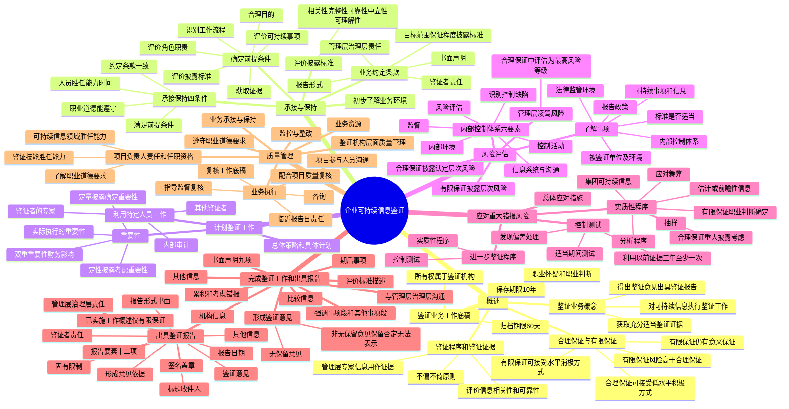

## 1. 章节定位

| 项目 | 信息 |
|------|------|
| 所属科目 | 审计 |
| 难度等级 | 3 |
| 历年分值 | 3-6 分 |
| 建议学时 | 4-5 小时 |
| 知识关联章节 | 第1章 审计概述、第2章 审计计划、第3章 审计证据、第7章 风险评估、第8章 风险应对、第20章 审计报告、第24章 会计师事务所业务质量管理 |

## 2. 考情分析

本章是 2024 年后新增的章节，内容基于 2024 年 11 月财政部等九部委联合印发的《企业可持续披露准则——基本准则（试行）》和 2026 年 1 月财政部印发的《可持续信息鉴证业务准则第6101号——基本准则（试行）》。历年分值约 3-6 分，以客观题为主，主观题可能考查合理保证与有限保证的区别、鉴证业务承接条件、鉴证意见类型、鉴证报告要素。

**命题规律**：作为新增章节，考查重点集中在基本概念辨析。合理保证与有限保证的区别（保证程度、鉴证业务风险、所需程序和证据、提出结论方式）、鉴证业务承接与保持的条件、重要性的确定（双重重要性）、利用其他鉴证者和专家的工作、鉴证意见类型（无保留意见和非无保留意见）、鉴证报告要素是高频考点。

**高频考点分布**：

1. **可持续信息鉴证业务概念**：鉴证者接受委托对被鉴证单位依据企业可持续信息披露准则等披露标准编制的可持续信息执行鉴证工作，获取充分适当的鉴证证据，得出鉴证意见并出具鉴证报告。
2. **合理保证与有限保证的区别**：合理保证将鉴证业务风险降至可接受的低水平，以积极方式提出鉴证意见；有限保证将鉴证业务风险降至可接受的水平，以消极方式提出鉴证意见。有限保证情形下鉴证业务风险高于合理保证，实施的程序和获取的证据较为有限，但仍应提供有意义的保证。
3. **鉴证业务工作底稿**：归档期限为鉴证报告日后 60 天内；保存期限自鉴证报告日起至少 10 年；工作底稿所有权属于鉴证机构。
4. **承接或保持业务的四项条件**：没有理由认为职业道德要求将无法得到遵守；执行业务人员具备必要胜任能力和专业素质且能投入足够时间；拟承接业务满足鉴证业务前提条件；已就业务约定条款达成一致意见。
5. **鉴证业务前提条件**：考虑被鉴证单位是否具备识别拟报告可持续信息的工作流程；评价管理层治理层角色职责是否适当；评价鉴证范围内可持续事项是否适当；评价披露标准是否适当；确定鉴证业务是否存在合理目的；确定预期是否能获取支持鉴证意见所需的鉴证证据。
6. **双重重要性**：某些可持续信息披露标准要求应用"双重重要性"，即同时应用财务重要性和影响重要性。
7. **利用其他鉴证者的工作**：需评价其他鉴证者是否具备必要胜任能力和专业素质；评价其工作是否足以实现业务目的；确定获取的鉴证证据是否足以实现业务目的。
8. **利用鉴证者的专家的工作**：评价专家胜任能力、专业素质和客观性；充分了解专家专长领域；与专家就工作内容范围目标达成一致。
9. **风险评估程序**：有限保证识别和评估披露层次重大错报风险；合理保证识别和评估披露认定层次重大错报风险。
10. **了解内部控制体系**：有限保证通常实施询问程序；合理保证除询问外还应考虑实施其他必要程序。
11. **控制测试**：利用以前获取的控制运行有效性证据时，每三年至少测试一次，每年测试部分控制。
12. **鉴证意见类型**：无保留意见和非无保留意见（保留意见、否定意见、无法表示意见）。
13. **鉴证报告要素**：标题、收件人、鉴证意见、形成鉴证意见的依据、其他信息、管理层或治理层责任、固有限制、鉴证者责任、已实施工作概述（仅有限保证）、签名盖章、机构信息、报告日期。
14. **书面声明**：管理层和治理层应就 9 项事项提供书面声明；如果拒绝提供书面声明，应当发表无法表示意见或解除业务约定。
15. **项目负责人的任职资格**：具备鉴证技能领域的胜任能力；了解适用于具体业务的职业道德要求；在可持续信息领域具备足够的胜任能力。

**联动考查方式**：

- 与第1章审计概述结合：鉴证业务与审计业务的联系与区别；
- 与第3章审计证据结合：鉴证证据的充分性和适当性；
- 与第7-8章风险评估与应对结合：风险评估程序和进一步程序；
- 与第20章审计报告结合：鉴证报告与审计报告要素的对比；
- 与第24章质量管理结合：项目质量管理。

**备考建议**：

- 重点掌握合理保证与有限保证的区别（保证程度、风险水平、程序证据、结论方式）；
- 熟记承接或保持业务的四项条件和前提条件；
- 理解双重重要性的概念；
- 区分利用其他鉴证者、鉴证者的专家、内部审计工作的不同要求；
- 掌握鉴证意见类型和鉴证报告要素；
- 了解项目负责人的任职资格要求和项目质量管理。

## 3. 知识框架

## 4. 核心精讲

### 4.1 可持续信息鉴证业务概述

#### 4.1.1 可持续信息鉴证业务的概念

**可持续信息鉴证业务**（本章有时简称"鉴证业务"）是指鉴证者接受委托，对被鉴证单位依据企业可持续信息披露准则等披露标准编制的可持续信息执行鉴证工作，获取充分、适当的鉴证证据，得出鉴证意见并出具鉴证报告，以增强可持续信息使用者对可持续信息信任程度的业务。

鉴证业务既可以对被鉴证单位拟报告的所有可持续信息进行鉴证，也可以对其中部分可持续信息进行鉴证。如果仅对部分可持续信息进行鉴证，鉴证者需要确定鉴证业务范围适当，不会误导信息使用者。

需要注意的是，企业会计准则等财务报告编制基础可能要求企业在财务报表中包含某些可持续信息，注册会计师对财务报表中可持续信息进行审计，不属于可持续信息鉴证业务。

#### 4.1.2 合理保证与有限保证

可持续信息鉴证业务的保证程度分为**合理保证**和**有限保证**：

| 项目 | 合理保证 | 有限保证 |
|------|----------|----------|
| 保证程度 | 较高 | 较低，但应当是有意义的保证程度 |
| 鉴证业务风险 | 可接受的低水平 | 可接受的水平（高于合理保证） |
| 所需实施的程序 | 较为充分 | 较为有限 |
| 所需获取的证据 | 充分、适当 | 较为有限 |
| 提出结论的方式 | 积极方式 | 消极方式 |

**积极方式**示例："我们认为，ABC公司的可持续信息在所有重大方面按照企业可持续信息披露准则的规定编制。"

**消极方式**示例："根据我们实施的程序和获取的证据，我们没有注意到任何事项，使我们认为ABC公司的可持续信息没有在所有重大方面按照企业可持续信息披露准则的规定编制。"

有限保证仍应提供**有意义的保证**，即该保证程度应当很可能能够将信息使用者对可持续信息的信任程度提高到明显高于无关紧要的水平。

需要注意的是，鉴证者既可以对鉴证范围内所有可持续信息均获取合理保证或有限保证，也可以对部分可持续信息获取合理保证，对部分可持续信息获取有限保证。

#### 4.1.3 职业怀疑和职业判断

与审计业务类似，鉴证者在计划和执行可持续信息鉴证业务时，应当保持职业怀疑并运用职业判断。

**职业怀疑**是指鉴证者执行业务的一种态度，包括采取质疑的思维方式，对可能表明存在舞弊或错误导致的错报的迹象保持警觉，以及对鉴证证据进行审慎评价。

**职业判断**是指鉴证者遵守企业可持续信息披露准则、鉴证业务准则和职业道德要求，综合运用相关知识、技能和经验，作出符合实际情况、有根据的行动决策。

#### 4.1.4 鉴证程序和鉴证证据

**设计和实施鉴证程序应遵循的原则**：
1. 既不偏向于获取支持性证据，也不排斥相矛盾的证据；
2. 鉴证程序的性质、时间安排和范围符合实际情况，且获取的鉴证证据能够满足实施鉴证程序的预期目的。

**评价信息的相关性和可靠性**：鉴证者应当评价拟用作鉴证证据的信息的相关性和可靠性，包括从被鉴证单位外部获取的信息。如果使用被鉴证单位生成的信息，应当评价该信息对实现鉴证目的是否足够可靠。

**拟将管理层专家编制的信息用作鉴证证据**：应当考虑管理层专家工作的重要程度，并在必要范围内：评价管理层专家的胜任能力、专业素质和客观性；了解管理层专家的工作；了解管理层在编制可持续信息时如何使用管理层专家编制的信息；评价拟用作鉴证证据的管理层专家工作的适当性。

#### 4.1.5 鉴证业务工作底稿

**编制原则**：鉴证者应当及时编制工作底稿，形成充分、适当的记录，作为出具鉴证报告的依据。工作底稿应当使未曾接触该项鉴证业务的、有经验的专业人士清楚了解：所实施的鉴证程序的性质时间安排和范围；实施鉴证程序的结果和获取的鉴证证据；业务执行中遇到的重大事项和得出的结论及重大职业判断。

**归档和保存**：
- 归档期限：鉴证报告日后 60 天内；未能完成业务的，业务中止后 60 天内。
- 保存期限：自鉴证报告日起至少 10 年；未能完成业务的，自业务中止日起至少 10 年。
- 完成归整后不得在保存期限届满前删除或废弃任何工作底稿。
- 修改或增加工作底稿应当记录修改或增加的理由、时间和人员及复核时间和人员。

**工作底稿的所有权**：工作底稿的所有权属于鉴证机构。鉴证机构可自主决定是否允许被鉴证单位获取工作底稿部分内容，但不得损害鉴证机构执行业务的有效性，也不得损害鉴证机构及其人员的独立性。

### 4.2 可持续信息鉴证业务的承接与保持

#### 4.2.1 承接或保持业务的条件

鉴证者承接或保持某项可持续信息鉴证业务，应当同时满足下列条件：
1. 没有理由认为职业道德要求（包括独立性要求）将无法得到遵守；
2. 确定执行鉴证业务的人员作为一个整体具备必要的胜任能力和专业素质，且能够投入足够的时间；
3. 确定拟承接或保持的业务满足鉴证业务的前提条件；
4. 已就业务约定条款达成一致意见。

#### 4.2.2 确定是否满足鉴证业务的前提条件

为确定是否满足前提条件，鉴证者应当执行下列程序：
1. 考虑被鉴证单位是否具备识别拟报告可持续信息的工作流程；
2. 评价管理层、治理层和委托方的角色和职责是否适当，以及管理层和治理层是否具备编制可持续信息的合理基础；
3. 评价鉴证范围内的可持续事项是否适当；
4. 评价编制可持续信息使用的披露标准是否适当，是否能够被信息使用者获取；
5. 确定鉴证业务是否存在合理目的；
6. 确定预期是否能够获取支持鉴证意见所需的鉴证证据，以及鉴证意见是否能够以恰当形式在鉴证报告中发表。

#### 4.2.3 评价披露标准

评价披露标准时应当执行：
1. 评价对于鉴证范围内所有可持续信息是否存在适用的披露标准；
2. 识别披露标准的来源（企业可持续信息披露准则、被鉴证单位内部制定的标准，或二者结合）；
3. 评价该披露标准是否具备**相关性、完整性、可靠性、中立性和可理解性**；
4. 评价信息使用者能否以及如何获取该披露标准。

#### 4.2.4 鉴证业务约定条款

鉴证业务约定条款应当包括：
1. 与鉴证业务目标和范围有关的事项（目标、鉴证范围、报告边界、保证程度、披露标准、说明按鉴证业务准则执行）；
2. 鉴证者的责任；
3. 管理层或治理层的责任（根据披露标准编制可持续信息、识别选择或制定披露标准、设计执行维护内部控制、提供工作条件）；
4. 鉴证报告的预期形式和内容；
5. 明确管理层和治理层同意在鉴证业务临近结束时提供书面声明。

如果委托方对鉴证工作范围施加限制，且鉴证者认为将导致发表无法表示意见，除非法律法规另有规定，不得将该业务作为可持续信息鉴证业务承接。

**业务约定条款的变更**：在缺乏合理理由的情况下，鉴证者不得同意变更鉴证业务约定条款，包括从合理保证业务变更为有限保证业务。

### 4.3 计划鉴证工作

#### 4.3.1 计划鉴证工作的基本要求

鉴证者应当制定**总体鉴证策略**和**具体鉴证计划**，包括确定计划实施程序的性质、时间安排和范围。项目负责人和项目组其他关键成员应当参与计划鉴证工作。

#### 4.3.2 重要性

为了计划和执行鉴证工作，以及评价可持续信息是否存在重大错报，鉴证者应当考虑定性披露的重要性并确定定量披露的重要性。

**双重重要性**：某些可持续信息披露标准可能要求被鉴证单位在编制可持续信息时应用"双重重要性"，即同时应用**财务重要性**和**影响重要性**，在对这些可持续信息进行鉴证时，鉴证者在考虑或确定重要性时也应当同时包括财务重要性和影响重要性。

针对定量披露，鉴证者还应当确定**实际执行的重要性**，即鉴证者为将可持续信息中未更正和未发现错报的汇总数超过定量披露重要性的可能性降至适当的低水平，而确定的低于定量披露重要性的一个或多个数值。

#### 4.3.3 利用特定人员的工作

**（一）利用其他鉴证者的工作**

其他鉴证者是指鉴证者所在鉴证机构以外的其他鉴证机构，鉴证者拟利用该机构实施的工作，但无法充分适当地参与其工作。如果拟利用其他鉴证者的工作，应当同时满足：遵守与利用其他鉴证者工作有关的职业道德要求；评价其他鉴证者是否具备必要胜任能力和专业素质；评价其工作是否足以实现业务目的；确定获取的鉴证证据是否足以实现业务目的。

**（二）利用鉴证者的专家的工作**

鉴证者的专家是指在鉴证以外的领域具有专长的个人或组织，其工作被鉴证者利用以协助获取充分适当的证据。如果拟利用鉴证者的专家的工作，应当：评价专家是否具备实现业务目的所必需的胜任能力、专业素质和客观性；在评价外部专家客观性时询问可能影响客观性的利益和关系；充分了解专家的专长领域；与专家就工作内容范围目标及各自角色责任达成一致意见。

评价鉴证者的专家的工作是否足以实现业务目的：评价专家工作结果或结论的相关性和合理性及与其他证据的一致性；评价重要假设和方法的相关性和合理性；评价重要原始数据的相关性、完整性和准确性。

**（三）利用内部审计的工作**

如果拟利用被鉴证单位内部审计工作，应当同时：评价内部审计在被鉴证单位中的地位以及相关政策程序能否保障内部审计人员的客观性；评价内部审计人员的胜任能力；评价内部审计工作是否采用系统化、规范化的方法；确定是否以及在多大程度上利用内部审计工作；确定内部审计工作是否足以实现业务目的。

### 4.4 风险评估

#### 4.4.1 设计和实施风险评估程序的一般要求

由于有限保证和合理保证的保证程度不同，其风险评估程序也存在区别：

- **有限保证业务**：识别和评估**披露层次**重大错报风险，包括舞弊和错误导致的重大错报风险。
- **合理保证业务**：识别和评估**披露认定层次**重大错报风险，包括舞弊和错误导致的重大错报风险。

无论有限保证还是合理保证，在设计和实施风险评估程序时都应当执行：了解可持续事项和可持续信息；确定编制可持续信息所使用的标准是否适当；了解和评价被鉴证单位的报告政策；了解被鉴证单位及其环境；了解法律和监管环境；了解被鉴证单位内部控制体系。

#### 4.4.2 了解被鉴证单位内部控制体系

无论有限保证还是合理保证，鉴证者都应当了解与可持续事项和可持续信息相关的内部控制体系各要素。在了解时，**有限保证**情形下通常实施询问程序，而**合理保证**情形下除询问程序外，还应当考虑实施其他必要的程序。

内部控制体系六要素：内部环境、风险评估、监督、信息系统与沟通、控制活动、识别控制缺陷。

#### 4.4.3 管理层凌驾于控制之上的风险

由于管理层凌驾于控制之上的方式具有不可预见性，在**合理保证业务**中，鉴证者应当将管理层凌驾于控制之上的风险作为舞弊导致的重大错报风险，并评估为**最高风险等级**。

### 4.5 应对重大错报风险

#### 4.5.1 总体应对措施

在有限保证业务中，识别出下列情形之一应当设计和实施总体应对措施：内部环境要素的控制缺陷削弱了内部控制体系其他要素；存在舞弊或舞弊嫌疑、违反法律法规行为或疑似违反法律法规行为；存在具有广泛影响的重大错报风险。

在合理保证业务中，除上述情形外，还包括：管理层未能营造诚实守信和遵守道德的组织文化；内部环境未能为内部控制体系的其他要素奠定适当的基础。

#### 4.5.2 进一步鉴证程序

- **有限保证业务**：针对评估的**披露层次**重大错报风险设计和实施进一步鉴证程序。
- **合理保证业务**：针对评估的**披露认定层次**重大错报风险设计和实施进一步鉴证程序。

进一步鉴证程序包括控制测试和实质性程序。

#### 4.5.3 控制测试

**利用以前获取的控制运行有效性的证据**：如果拟利用以前开展可持续信息鉴证业务时获取的有关控制运行有效性的鉴证证据，应当针对控制是否发生重大变化获取鉴证证据：
- 如果控制未发生重大变化，应当每三年至少对这些控制测试一次，并且每年测试部分控制；
- 如果控制已发生重大变化，且影响以前获取证据对本期业务的相关性，应当在本期测试这些控制。

#### 4.5.4 实质性程序

- **有限保证业务**：可以根据职业判断确定是否实施实质性程序。
- **合理保证业务**：如果认为某项披露是重大的，无论其是否存在重大错报风险，都应当考虑是否需要针对该披露设计和实施实质性程序；针对评估的接近最高等级的风险，应当实施实质性程序。

**应对与估计或前瞻性信息相关的重大错报风险**：被鉴证单位披露的可持续信息中可能存在大量估计或前瞻性信息，鉴证者应当采取适当措施予以应对。在合理保证业务中，应当评价管理层是否恰当遵守了披露标准中与估计或前瞻性信息有关的要求，并实施下列一项或多项程序：测试管理层如何生成估计或前瞻性信息及相关披露并测试所依据的信息；作出点估计或区间估计以评价管理层的估计；从截至鉴证报告日前发生的最新情况中获取鉴证证据。

### 4.6 完成鉴证工作和出具鉴证报告

#### 4.6.1 累积和考虑识别出的错报

鉴证者应当累积鉴证过程中识别出的错报，除非错报明显微小。应当及时与被鉴证单位管理层沟通鉴证过程中累积的所有错报，并要求管理层更正。

如果管理层拒绝更正部分或全部错报，应当了解其理由，并在形成鉴证意见时考虑该理由，同时就该事项与治理层沟通。

#### 4.6.2 期后事项

鉴证者应当实施程序以识别在鉴证报告日之前发生的、可能影响可持续信息和鉴证报告的事项。如果在鉴证报告日后知悉了某事项，且若在鉴证报告日或之前知悉可能导致修改鉴证报告，应当作出恰当应对。

#### 4.6.3 书面声明

鉴证者应当要求管理层和治理层（如适用）就下列事项提供书面声明：
1. 已履行了根据所使用的披露标准编制可持续信息的责任，使可持续信息实现公允反映（如适用），并确保可持续信息具备可验证性；
2. 已确保可持续信息与财务报表等对外披露的信息一致；
3. 已确保设计、执行和维护必要的内部控制体系；
4. 已按照业务约定向鉴证者提供所有相关信息；
5. 是否认为未更正错报单独或汇总起来对可持续信息的影响不重大；
6. 是否认为编制估计或前瞻性信息使用的重大假设是适当的；
7. 已就注意到的所有与鉴证业务相关且并非明显微小的内部控制缺陷与鉴证者进行了沟通；
8. 已向鉴证者披露其知悉的、可能会对可持续信息产生重大影响的舞弊或舞弊嫌疑、违反法律法规行为或疑似违反法律法规行为；
9. 所有在可持续信息报告日后发生的、所使用披露标准要求调整或披露的事项均已得到调整或披露。

书面声明的日期应当尽量接近鉴证报告日，但不得晚于鉴证报告日。

**不提供书面声明时的处理**：如果存在下列情形之一，应当对可持续信息发表无法表示意见或在法律法规不禁止的情况下解除业务约定：对提供书面声明人员的诚信水平存有疑虑，导致认为第1项和第4项声明不可靠；被鉴证单位拒绝提供第1项和第4项声明。

#### 4.6.4 其他信息

被鉴证单位可能将可持续信息与已审计财务报表一同报告，此时已审计财务报表属于其他信息。鉴证者应当在鉴证报告日前阅读其他信息，并考虑：其他信息与可持续信息是否存在重大不一致；其他信息与鉴证者已了解的情况、获取的鉴证证据和得出的结论是否存在重大不一致；对不相关的其他信息疑似存在重大错报的迹象保持警觉。

#### 4.6.5 形成鉴证意见

**评价鉴证证据**：鉴证者应当评价已获取的鉴证证据是否充分、适当，并在必要时获取进一步鉴证证据。应当考虑所有鉴证证据，无论这些鉴证证据之间是否能够相互印证，以及鉴证证据与可持续信息之间是否存在矛盾。

**无保留意见**：

- **有限保证业务**：如果根据已实施的鉴证程序和已获取的鉴证证据，鉴证者没有注意到任何事项使其认为可持续信息没有在所有重大方面按照披露标准编制（或得到公允反映），应当发表无保留有限保证鉴证意见。
- **合理保证业务**：如果鉴证者得出结论认为可持续信息已在所有重大方面按照披露标准编制（或得到公允反映），应当发表无保留合理保证鉴证意见。

**非无保留意见**：

当存在下列情形之一时，应当发表非无保留意见：
1. 鉴证范围受到限制，且这种限制的影响可能是重大的——发表**保留意见**或**无法表示意见**；
2. 可持续信息存在重大错报——发表**保留意见**或**否定意见**。

如果根据职业判断认为导致发表非无保留意见的事项影响并非特别重大且不具有广泛性，不至于发表否定意见或无法表示意见，应当发表**保留意见**。保留意见的措辞应当为"除与保留意见有关的事项产生或可能产生的影响外……"。

如果无法获取合理保证或有限保证，并且发表保留意见也不足以实现向信息使用者报告的目的，应当出具**无法表示意见**的报告，或在法律法规不禁止的情况下解除业务约定。

#### 4.6.6 出具鉴证报告

**鉴证报告的形式**：鉴证报告应当采用书面形式，并应当明确鉴证者对可持续信息发表的合理保证或有限保证鉴证意见。

**鉴证报告的要素**（至少应当包括）：
1. 标题；
2. 收件人；
3. 鉴证意见；
4. 形成鉴证意见的依据；
5. 其他信息（如适用）；
6. 管理层或治理层对可持续信息的责任；
7. 编制可持续信息的固有限制（如适用）；
8. 鉴证者的责任；
9. 已实施工作概述（仅适用于有限保证业务）；
10. 鉴证者的签名和盖章；
11. 鉴证机构的名称、地址和盖章；
12. 报告日期。

**标题**：应当明确其提供的保证程度，统一规范为"有限保证鉴证报告""合理保证鉴证报告"或"有限保证和合理保证鉴证报告"。

**鉴证意见**：
- 合理保证业务以**积极方式**发表鉴证意见；
- 有限保证业务以**消极方式**发表鉴证意见。

**报告日期**：不得早于下列日期：鉴证者已获取鉴证证据并在此基础上形成鉴证意见的日期；对于需要实施项目质量复核的项目，项目质量复核完成的日期。

#### 4.6.7 强调事项段和其他事项段

**强调事项段**：如果认为有必要提醒信息使用者注意已在可持续信息中列报或披露，但对信息使用者了解相关信息非常重要的事项，除非法律法规禁止，应当在鉴证报告中增加强调事项段。强调事项段应当以"强调事项"为标题，并明确说明该段落不影响鉴证意见。

**其他事项段**：如果认为有必要向信息使用者沟通未在可持续信息中列报或披露，但与信息使用者了解鉴证业务、鉴证者的责任和鉴证报告相关的事项，除非法律法规禁止，应当在鉴证报告中增加其他事项段。其他事项段应当以"其他事项"为标题，并明确说明该段落不影响鉴证意见。

#### 4.6.8 比较信息

鉴证者应当确定法律法规或编制可持续信息所使用的披露标准是否要求在可持续信息中提供比较信息。如果要求，应当确定比较信息是否得到恰当列报。

如果鉴证意见没有提及比较信息，并且比较信息也不属于上期鉴证范围，应当在鉴证报告中增加其他事项段说明该事实。

### 4.7 可持续信息鉴证业务的质量管理

#### 4.7.1 项目负责人的责任和任职资格要求

**项目负责人**是指鉴证机构中负责某项鉴证业务及其执行，并代表鉴证机构在鉴证报告上签字的合伙人或其他类似职位的人员。项目负责人负责在项目层面实施质量管理，对项目质量承担总体责任。

项目负责人应当同时满足以下任职资格条件：
1. 具备**鉴证技能领域**的胜任能力（制定鉴证计划、收集和评价鉴证证据、沟通和报告等方面的技术和能力）；
2. 了解适用于具体可持续信息鉴证业务的职业道德要求（包括独立性要求）；
3. 在**可持续信息领域**具备足够的胜任能力。

#### 4.7.2 鉴证业务执行

项目负责人应当对项目组成员进行指导、监督并复核其工作。应当在适当时间及时复核工作底稿，包括与重大事项、重大判断相关的工作底稿。

**项目负责人在临近鉴证报告日的责任**：
1. 确定职业道德要求包括独立性要求已得到恰当遵守；
2. 复核业务工作底稿并与项目组讨论，确保已获取充分适当的鉴证证据；
3. 复核可持续信息和拟出具的鉴证报告；
4. 确定其已充分适当地参与了鉴证业务全过程；
5. 确定项目组已遵守鉴证机构的相关政策和程序；
6. 对于需要实施项目质量复核的项目，确保项目质量复核已完成。

## 5. 典型例题

**【例题 1】（合理保证与有限保证的区别）**

ABC 会计师事务所承接甲公司 2×24 年度可持续信息鉴证业务。项目组成员对合理保证与有限保证的区别存在不同观点：A 认为有限保证不需要提供有意义的保证程度；B 认为合理保证以积极方式提出鉴证意见，有限保证以消极方式提出鉴证意见；C 认为有限保证情形下的鉴证业务风险高于合理保证；D 认为鉴证者只能对鉴证范围内所有可持续信息均获取合理保证或有限保证，不能混合使用。要求：分别指出 A、B、C、D 的观点是否恰当，并简要说明理由。

**答案**：

A 不恰当。有限保证仍应提供有意义的保证，即该保证程度应当很可能能够将信息使用者对可持续信息的信任程度提高到明显高于无关紧要的水平。

B 恰当。合理保证以积极方式提出鉴证意见，有限保证以消极方式提出鉴证意见。

C 恰当。有限保证将鉴证业务风险降至可接受的水平，合理保证将鉴证业务风险降至可接受的低水平，有限保证情形下的鉴证业务风险高于合理保证。

D 不恰当。鉴证者既可以对鉴证范围内所有可持续信息均获取合理保证或有限保证，也可以对部分可持续信息获取合理保证，对部分可持续信息获取有限保证。

**【例题 2】（鉴证意见类型）**

ABC 会计师事务所承接甲公司 2×24 年度可持续信息有限保证鉴证业务。在鉴证过程中遇到下列情况：（1）由于管理层施加限制，注册会计师无法获取充分适当的鉴证证据，且限制的影响重大但不具有广泛性；（2）注册会计师发现甲公司可持续信息存在重大错报，且错报的影响重大但不具有广泛性；（3）注册会计师根据已实施的鉴证程序和已获取的鉴证证据，没有注意到任何事项使其认为可持续信息没有在所有重大方面按照披露标准编制；（4）注册会计师发现甲公司可持续信息存在重大错报，且错报的影响重大且具有广泛性。要求：分别针对情况（1）至（4），指出注册会计师应当发表何种类型的鉴证意见，并简要说明理由。

**答案**：

情况（1）：保留意见。理由：鉴证范围受到限制，且限制的影响重大但不具有广泛性，应当发表保留意见。如果影响重大且具有广泛性，应当发表无法表示意见。

情况（2）：保留意见。理由：可持续信息存在重大错报，且错报的影响重大但不具有广泛性，应当发表保留意见。如果影响重大且具有广泛性，应当发表否定意见。

情况（3）：无保留意见。理由：根据已实施的鉴证程序和已获取的鉴证证据，没有注意到任何事项使其认为可持续信息没有在所有重大方面按照披露标准编制，应当发表无保留有限保证鉴证意见。

情况（4）：否定意见。理由：可持续信息存在重大错报，且错报的影响重大且具有广泛性，应当发表否定意见。

**【例题 3】（鉴证报告要素）**

ABC 会计师事务所承接甲公司 2×24 年度可持续信息有限保证鉴证业务，项目组成员对鉴证报告要素存在不同观点：A 认为鉴证报告应当包括已实施工作概述部分；B 认为鉴证报告标题应当统一规范为"鉴证报告"；C 认为鉴证报告的鉴证意见应当以积极方式发表；D 认为鉴证报告日期不得早于鉴证者已获取鉴证证据并在此基础上形成鉴证意见的日期。要求：分别指出 A、B、C、D 的观点是否恰当，并简要说明理由。

**答案**：

A 恰当。已实施工作概述仅适用于有限保证业务，用于总结鉴证者为得出有限保证鉴证意见而实施的工作。

B 不恰当。鉴证报告标题应当明确其提供的保证程度，统一规范为"有限保证鉴证报告""合理保证鉴证报告"或"有限保证和合理保证鉴证报告"。

C 不恰当。有限保证业务的鉴证意见应当以消极方式发表，明确基于已实施的鉴证程序和获取的鉴证证据，是否注意到某些事项使鉴证者认为可持续信息未能在所有重大方面按照所使用的披露标准编制或实现公允反映。合理保证业务才以积极方式发表。

D 恰当。鉴证报告日期不得早于鉴证者已获取鉴证证据并在此基础上形成鉴证意见的日期，对于需要实施项目质量复核的项目，不得早于项目质量复核完成的日期。

## 6. 记忆口诀

**合理保证与有限保证区别口诀**：合理低水平积极，有限可接受消极；有限风险高于理，程序证据较有限；有限仍有意义保，明显高于无关紧。

**承接保持四条件口诀**：职业道德能遵守，人员胜任有时间，前提条件都满足，约定条款达一致。

**披露标准五性口诀**：相关完整可靠中（中立），可理解性能获取。

**风险评估层次口诀**：有限保证披露层，合理保证认定层。

**内部控制了解口诀**：有限询问即可，合理加其他程序。

**控制测试以前证据口诀**：三年至少测一次，每年测部分控制。

**书面声明九项口诀**：编制责任信息一致，内部控制信息提供，未更正错报假设适当，内控缺陷舞弊违法，期后事项调整披露。

**鉴证意见类型口诀**：范围受限保留无法，重大错报保留否定；非特别重大不广泛，保留意见才恰当。

**鉴证报告要素十二项口诀**：标题收件鉴证意，形成依据其他信，管理责任固有限，鉴证责任已实施（仅有限），签名盖章机构名，报告日期最后定。

**标题口诀**：有限合理两保证，标题明确保证度。

**报告日期口诀**：不早于获证意见日，项目质量复核完成日。
