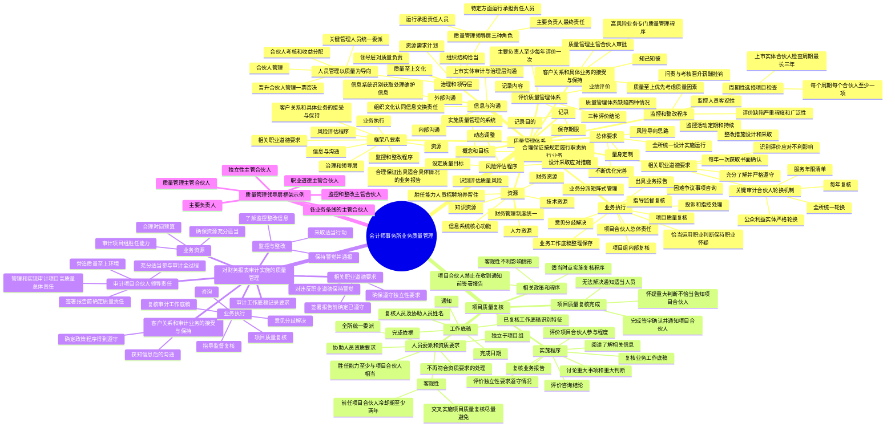

## 1. 章节定位

| 项目 | 信息 |
|------|------|
| 所属科目 | 审计 |
| 难度等级 | 4 |
| 历年分值 | 5-8 分 |
| 建议学时 | 6-8 小时 |
| 知识关联章节 | 第2章 职业道德、第3章 独立性、第15章 审计沟通、第20章 审计报告、第21章 审计工作底稿、第23章 企业可持续信息鉴证 |

## 2. 考情分析

本章是审计科目的重要章节，历年分值约 5-8 分。主观题常以简答题形式考查质量管理体系的八要素、项目质量复核与项目组内部复核的区别、项目质量复核人员的资质要求、审计项目合伙人的领导责任、监控和整改程序的内容；客观题则集中在质量管理体系的目标和总体要求、三种领导层角色的职责、关键审计合伙人轮换机制、业务执行的相关要求。

**命题规律**：本章核心考点相对集中。质量管理体系的八要素（风险评估程序、治理和领导层、相关职业道德要求、客户关系和具体业务的接受与保持、业务执行、资源、信息与沟通、监控和整改程序）、风险导向的三步骤（设定质量目标、识别评估质量风险、设计应对措施）、质量管理领导层的三种角色、项目质量复核与项目组内部复核的区别、审计项目合伙人对管理和实现审计项目高质量的总体责任是高频考点。关键审计合伙人轮换机制、监控活动的周期性检查要求、缺陷的评价和整改措施也是常考点。

**高频考点分布**：

1. **质量管理体系的概念和目标**：会计师事务所为实施质量管理而设计、实施和运行的系统，目标是在两个方面提供合理保证：会计师事务所及其人员按法律法规和职业准则履行职责并执行业务；会计师事务所和项目合伙人出具适合具体情况的业务报告。
2. **质量管理体系框架八要素**：风险评估程序、治理和领导层、相关职业道德要求、客户关系和具体业务的接受与保持、业务执行、资源、信息与沟通、监控和整改程序。
3. **总体要求四项**：全所范围内统一设计实施运行；风险导向思路；根据本所实际需要量身定制；不断优化和完善。
4. **风险导向三步骤**：针对质量管理体系的各个要素设定质量目标；识别和评估质量风险；设计和采取应对措施以应对质量风险。
5. **质量管理领导层三种角色**：主要负责人对质量管理体系承担最终责任；指定专门合伙人对质量管理体系运行承担责任；指定专门合伙人对质量管理体系特定方面的运行承担责任。
6. **人员管理以质量为导向**：合伙人晋升应建立质量"一票否决"制度；合伙人考核和收益分配不得以承接和执行业务的收入或利润作为首要指标。
7. **关键审计合伙人轮换机制**：对公众利益实体审计客户，关键审计合伙人应严格遵守轮换要求；会计师事务所应通过建立关键审计合伙人服务年限清单等方式管理轮换；每年对轮换情况实施复核；在全所范围内统一进行轮换。
8. **客户关系和具体业务的接受与保持**：基于"质量至上"原则，优先考虑质量因素而非商业利益；高风险业务应设计和实施专门的质量管理程序；经质量管理主管合伙人或其授权的人员审批。
9. **业务执行相关质量目标**：项目合伙人对项目管理和项目质量承担总体责任；由经验较丰富的项目组成员对经验较缺乏的成员工作进行指导监督复核；项目组对困难或有争议事项进行咨询；意见分歧得到关注和解决；业务工作底稿及时整理并妥善保存。
10. **项目质量复核与项目组内部复核的区别**：复核主体不同（独立于项目组 vs 项目组内部）；适用业务范围不同（仅适用于上市实体等特定业务 vs 适用于所有业务）；复核内容不同（聚焦重大判断及结论 vs 涉及项目各个方面）。
11. **项目质量复核人员的资质要求**：独立于项目组；具备适当胜任能力（至少与项目合伙人相当）；遵守相关职业道德要求并保持独立客观公正；遵守相关法律法规。客观性可能受影响的情况：项目之间交叉实施项目质量复核；某一项目的前任项目合伙人被委任为该项目的项目质量复核人员（冷却期至少两年）。
12. **项目质量复核实施程序**：阅读了解相关信息；与项目合伙人及项目组讨论重大事项和重大判断；选取部分与重大判断相关的业务工作底稿进行复核；评价独立性要求遵守情况；评价咨询结论；评价项目合伙人参与程度；复核业务报告。
13. **监控活动要求**：包括定期实施的监控活动和持续实施的监控活动；每个周期内对每个项目合伙人至少选择一项已完成的项目进行检查；对承接上市实体审计业务的每个项目合伙人，检查周期最长不得超过三年。
14. **质量管理体系缺陷的四种情况**：未能设定必要的质量目标；未能识别或恰当评估质量风险；应对措施未能有效发挥作用；质量管理体系某些方面缺失或未得到恰当设计实施或有效运行。
15. **审计项目合伙人的领导责任**：对管理和实现审计项目的高质量承担总体责任；充分适当参与整个审计过程；在签署审计报告前确定已对管理和实现审计项目的高质量承担责任。
16. **审计项目合伙人在业务执行中的责任**：对项目组成员进行指导监督并复核其工作；在审计报告日或之前复核审计工作底稿；就困难或有争议事项进行咨询；配合项目质量复核；处理意见分歧（在所有意见分歧得到解决之前不得签署审计报告）。
17. **审计工作底稿记录要求**：相关职业道德要求和客户关系接受保持方面识别出的事项及讨论结论；咨询的性质范围结论及执行情况；项目质量复核完成情况。

**联动考查方式**：

- 与第2章职业道德结合：相关职业道德要求要素的内容；
- 与第3章独立性结合：关键审计合伙人轮换机制；
- 与第15章审计沟通结合：与治理层沟通质量管理体系；
- 与第20章审计报告结合：审计项目合伙人签署报告前的责任；
- 与第21章审计工作底稿结合：项目质量复核工作底稿的内容。

**备考建议**：

- 牢记质量管理体系八要素的名称和顺序；
- 区分风险导向三步骤的内容；
- 熟记质量管理领导层三种角色及各自的职责；
- 重点掌握项目质量复核与项目组内部复核的三大区别；
- 理解审计项目合伙人对管理和实现审计项目高质量的总体责任；
- 关注监控活动的周期性检查要求（每个周期至少一项、上市实体最长三年）；
- 掌握缺陷评价和整改措施的内容。

## 3. 知识框架

## 4. 核心精讲

### 4.1 会计师事务所质量管理体系

#### 4.1.1 质量管理体系的概念和目标

**质量管理体系**是会计师事务所为实施质量管理而设计、实施和运行的系统，其目标是在以下两个方面提供合理保证：

1. 会计师事务所及其人员按照适用的法律法规和职业准则的规定履行职责，并根据这些规定执行业务；
2. 会计师事务所和项目合伙人出具适合具体情况的业务报告。

#### 4.1.2 质量管理体系的框架

会计师事务所质量管理体系的框架包括八个要素：

1. 会计师事务所的风险评估程序；
2. 治理和领导层；
3. 相关职业道德要求；
4. 客户关系和具体业务的接受与保持；
5. 业务执行；
6. 资源；
7. 信息与沟通；
8. 监控和整改程序。

上述各要素应当有效衔接、互相支撑、协同运行，以保障会计师事务所能够积极有效地实施质量管理。

#### 4.1.3 质量管理体系的总体要求

会计师事务所质量管理体系应当满足以下总体要求：

| 总体要求 | 内容 |
|----------|------|
| 全所范围内统一设计、实施和运行 | 在全所范围内（包括分所或分部）统一设计、实施和运行质量管理体系，实现人事、财务、业务、技术标准和信息管理五方面的统一管理 |
| 风险导向的思路 | 采取三个步骤：设定质量目标、识别和评估质量风险、设计和采取应对措施 |
| 量身定制 | 根据本所及业务的性质和具体情况，以及本所质量管理的实际需要，量身定制适合本所的质量管理体系，不机械执行准则，不盲目照搬照抄 |
| 不断优化和完善 | 质量管理体系是动态的，应根据本所及其业务在性质和具体情况方面的变化，对质量管理体系进行动态调整 |

**风险导向思路的三步骤**：

1. **设定质量目标**：针对质量管理体系的各个要素设定质量目标，即为了确保实现质量管理体系的目标，质量管理体系的各个要素需要达到的目标。质量目标可以进一步细化为若干子目标。
2. **识别和评估质量风险**：质量风险是一种具有合理可能性会发生的风险，这种风险一旦发生，将单独或连同其他风险对质量目标的实现产生不利影响。
3. **设计和采取应对措施**：应对措施通常是指会计师事务所为应对质量风险而设计和实施的政策和程序，应对措施的性质、时间安排和范围取决于相关质量风险的评估结果及得出该评估结果的理由。

#### 4.1.4 会计师事务所的风险评估程序

会计师事务所在识别和评估质量风险时，应当了解可能对实现质量目标产生不利影响的事项或情况，包括相关人员的作为或不作为。这些事项或情况包括：

1. **会计师事务所的性质和具体情况**：复杂程度和经营特征；战略和运营方面的决策与行动、业务流程及业务模式；领导层的特征和管理风格；资源（内部资源和可获得的外部资源）；法律法规、职业准则的规定；运营所处的环境；所在网络向其成员组织统一提出的要求或统一提供的服务。
2. **会计师事务所业务的性质和具体情况**：执行业务的类型和出具报告的类型（如是否是审计等要求提供保证程度较高的业务）；业务执行对象的实体类型（如是否为上市公司）。

**对风险评估程序的动态调整**：如果识别出会计师事务所或其业务的性质和具体情况发生变化，会计师事务所应当考虑调整之前实施风险评估程序的结果，并在适当时采取下列措施：设定额外的质量目标或调整之前设定的额外质量目标；识别和评估额外的质量风险、调整之前评估的质量风险或重新评估质量风险；设计和采取额外的应对措施，或调整已采取的应对措施。

### 4.2 治理和领导层

#### 4.2.1 相关质量目标

针对"治理和领导层"要素，会计师事务所应当设定下列质量目标：

1. 会计师事务所在全所范围内形成一种"质量至上"的文化，树立质量意识。这种"质量至上"的文化应当认可并强调：会计师事务所及其人员有责任持续高质量地执行业务，从而更好地服务于公众利益；会计师事务所人员树立正确的职业价值观、职业道德和职业态度；所有人员都对其执行业务的质量承担责任；所有战略决策和行动都应当坚持质量优先，不能以牺牲质量为代价。
2. 会计师事务所的领导层对质量负责，并通过实际行动展示出其对质量的重视。
3. 会计师事务所领导层向会计师事务所人员传递"质量至上"的执业理念，培育以质量为导向的文化。
4. 会计师事务所的组织结构以及对相关人员角色、职责、权限的分配是恰当的。
5. 会计师事务所的资源（包括财务资源）需求得到恰当的计划，并且资源的取得和分配能够为会计师事务所持续高质量地执行业务提供保障。

#### 4.2.2 会计师事务所质量管理领导层

会计师事务所应当在其质量管理领导层中设定以下三种角色：

| 角色 | 职责 |
|------|------|
| 主要负责人 | 如首席合伙人、主任会计师或者同等职位的人员，应当对质量管理体系承担最终责任 |
| 对质量管理体系运行承担责任的人员 | 会计师事务所应当指定专门的合伙人（或类似职位的人员）对质量管理体系的运行承担责任 |
| 对质量管理体系特定方面的运行承担责任的人员 | 会计师事务所应当指定专门的合伙人（或类似职位的人员）对质量管理体系特定方面的运行承担责任，如特定要素或特定要素细分出来的特定方面 |

会计师事务所应当确保上述三类人员同时满足下列条件：具备适当的知识、经验和资质；在会计师事务所内具有履行其责任所需要的权威性和影响力；具有充足的时间和资源履行其责任；充分理解其应负的责任并接受对这些责任履行情况的问责。

会计师事务所应当确保对质量管理体系的运行承担责任的人员、对质量管理体系特定方面的运行承担责任的人员，能够直接与对质量管理体系承担最终责任的人员（即主要负责人）沟通。

会计师事务所领导层应当建立健全一体化管理制度体系并确保有效实施，在合伙协议中明确一体化管理要求。会计师事务所主要负责人应当对一体化管理负主要责任。会计师事务所领导层成员应当以身作则、率先垂范，带头遵守质量管理体系中的各项政策和程序，不得干扰项目组按照职业准则的要求执行业务、作出职业判断。

#### 4.2.3 人员管理

会计师事务所应当建立实施统一的人员管理制度，制定统一的人员聘用、定级、晋升、业绩考核、薪酬、培训等方面的政策与程序并确保有效执行。会计师事务所的人员业绩考核、晋升和薪酬政策应当坚持以质量为导向；将质量因素作为人员考评、晋升和薪酬的重要因素。

**合伙人管理**：每一个合伙人的执业质量，以及其对执业质量的重视和追求，对会计师事务所的整体质量和声誉都至关重要。会计师事务所有必要加强对合伙人晋升、培训、考核、分配、转入、退出的管理，体现以质量为导向的文化。

**晋升合伙人的管理**：会计师事务所应当加强对其员工（包括外部转入人员）晋升合伙人的管理，在晋升时应当综合考虑拟晋升人员的执业理念、职业价值观、职业道德、专业胜任能力和执业诚信记录，建立以质量为导向的晋升机制，不得以承接和执行业务的收入或利润作为晋升合伙人的首要指标。会计师事务所应当针对合伙人的晋升建立和实施质量"一票否决"制度。

**合伙人考核和收益分配**：会计师事务所应当在全所范围内统一进行合伙人考核和收益分配。应当综合考虑合伙人的执业质量、管理能力、经营业绩、社会声誉等指标，不得以承接和执行业务的收入或利润作为首要指标，不应直接或变相以分所、部门、合伙人所在团队作为利润中心进行收益分配。

**关键管理人员的调度和配置**：会计师事务所应当对分所（或分部）的负责人、质量管理负责人、财务负责人等关键管理人员实施统一委派、监督和考核，在全所范围内实施统一的调度和配置。

### 4.3 相关职业道德要求

#### 4.3.1 相关质量目标

为确保会计师事务所执业人员按照相关职业道德要求（包括独立性要求）履行职责，会计师事务所应当设定下列质量目标：

1. 会计师事务所及其人员充分了解相关职业道德要求，并严格按照这些职业道德要求履行职责；
2. 受相关职业道德要求约束的其他组织或人员（例如网络事务所及其人员），充分了解与其相关的职业道德要求，并严格按照这些职业道德要求履行职责。

为此，会计师事务所应当制定下列政策和程序：

1. 识别、评价和应对对遵守相关职业道德要求的不利影响；
2. 识别、沟通、评价和报告任何违反相关职业道德要求的情况，并针对这些情况的原因和后果及时作出适当应对；
3. 至少每年一次向所有需要按照相关职业道德要求保持独立性的人员获取其已遵守独立性要求的书面确认。

#### 4.3.2 关键审计合伙人轮换机制

如果注册会计师长期连续执行同一审计客户的审计业务，将会因密切关系和自身利益对独立性产生不利影响。因此，《中国注册会计师职业道德守则》明确规定，对于公众利益实体审计客户，关键审计合伙人应当严格遵守轮换要求。

会计师事务所应当对本所关键审计合伙人轮换情况进行监督和管理。会计师事务所应当按照相关职业道德要求，建立并完善与公众利益实体审计业务有关的关键审计合伙人轮换机制，明确轮换要求，确保做到实质性轮换，防止流于形式。

针对公众利益实体审计业务，会计师事务所应当：

1. 对关键审计合伙人的轮换情况进行实时监控；
2. 通过建立关键审计合伙人服务年限清单等方式，管理关键审计合伙人相关信息；
3. 每年对轮换情况实施复核；
4. 在全所范围内统一进行轮换。

会计师事务所应当完善利益分配机制，保证全所的人力资源和客户资源实现一体化统筹管理。会计师事务所应当定期评价利益分配机制的设计和执行情况。这样做是为了避免某合伙人或项目组的利益与特定客户长期直接挂钩，从根源上解决关键审计合伙人轮换机制"流于形式"的问题。

### 4.4 客户关系和具体业务的接受与保持

#### 4.4.1 相关质量目标

会计师事务所在作出是否承接与保持某项客户关系和具体业务的决策时，应当"知己知彼"。"知彼"是指这种决策应当建立在对客户及其管理层和治理层充分了解的基础之上；"知己"是指应当充分了解本所自己的专业胜任能力。基于"质量至上"的原则，会计师事务所在作出相关决策时，应当优先考虑的是质量方面的因素，而非商业利益。

针对客户关系和具体业务的接受与保持，会计师事务所应当设定下列质量目标：

1. 会计师事务所就是否接受或保持某项客户关系或具体业务所作出的判断是适当的，充分考虑了：是否针对业务的性质和具体情况以及客户（包括客户的管理层和治理层）的诚信和道德价值观获取了足以支持上述判断的充分信息；是否具备按照适用的法律法规和职业准则的规定执行业务的能力。
2. 会计师事务所在财务和运营方面对优先事项的安排，并不会导致对是否接受或保持客户关系或具体业务作出不恰当的判断。

会计师事务所应当制定相关政策和程序以应对以下情形：

1. 会计师事务所在接受或保持某一客户关系或具体业务后知悉了某些信息，而这些信息如果在接受或保持该客户关系或具体业务之前知悉，将会导致其拒绝接受该客户关系或业务；
2. 根据法律法规的规定，会计师事务所有义务接受某项客户关系或具体业务。

#### 4.4.2 树立风险意识

会计师事务所应当在客户关系和具体业务的接受与保持方面树立风险意识，确保对拟承接项目的风险评估真实、到位，并制定相关政策和程序；在全所范围内统一决策。在决策时，会计师事务所应当充分考虑相关职业道德要求、管理层和治理层的诚信状况、业务风险以及是否具备执行业务所必需的时间和资源，审慎作出承接与保持的决策。

对于会计师事务所认定存在高风险的业务，应当设计和实施专门的质量管理程序，如加强与前任注册会计师的沟通、与相关监管机构沟通、访谈拟承接客户以了解有关情况、加强内部质量复核等，并应当经质量管理主管合伙人（或类似职位的人员）或其授权的人员审批。

### 4.5 业务执行

#### 4.5.1 相关质量目标

针对业务执行，会计师事务所应当设定下列质量目标：

1. 项目组了解并履行其与所执行业务相关的责任，包括项目合伙人对项目管理和项目质量承担总体责任，并充分、适当地参与项目全过程；
2. 对项目组进行的指导和监督以及对项目组已执行的工作进行的复核是恰当的，并且由经验较为丰富的项目组成员对经验较为缺乏的项目组成员的工作进行指导、监督和复核；
3. 项目组恰当运用职业判断并保持职业怀疑；
4. 项目组对困难或有争议的事项进行了咨询，并已按照达成的一致意见执行业务；
5. 项目组内部、项目组与项目质量复核人员之间（如适用），以及项目组与会计师事务所内负责执行质量管理体系相关活动的人员之间存在的意见分歧，能够得到会计师事务所的关注并予以解决；
6. 业务工作底稿能够在业务报告日之后及时得到整理，并得到妥善的保存和维护。

#### 4.5.2 业务分派

会计师事务所应当实行矩阵式管理，即结合所服务客户的行业特点和业务性质，以及本会计师事务所分所（或分部）的地域分布，对业务团队进行专业化设置，以团队专业能力的匹配度为依据分派业务。

#### 4.5.3 对项目合伙人的要求

**项目合伙人**，是指会计师事务所中负责某项业务及其执行，并代表会计师事务所在出具的报告上签字的合伙人。

会计师事务所应当制定政策和程序，在全所范围内统一委派具有足够专业胜任能力、时间，并且无不良执业诚信记录的项目合伙人执行业务。对专业胜任能力的评价应当包括：是否充分了解相关法律法规和监管要求；是否能够熟练掌握和运用相关职业准则的规定；是否充分了解客户所在行业的业务特点、发展趋势、重大风险，以及该行业对信息技术的运用情况等。

#### 4.5.4 项目组内部复核

**项目组**是指执行某项业务的所有合伙人和员工，以及为该项业务实施程序的所有其他人员，但不包括外部专家，也不包括为项目组提供直接协助的内部审计人员。

**项目组内部复核**是指在项目组内部实施的复核。会计师事务所应当制定与内部复核相关的政策和程序，对内部复核的层级、各层级的复核范围、实施复核的具体要求以及对复核的记录要求等作出规定。

#### 4.5.5 项目质量复核

**项目质量复核**，是指在报告日或报告日之前，项目质量复核人员对项目组作出的重大判断及据此得出的结论作出的客观评价。

**项目质量复核人员**，是指会计师事务所中实施项目质量复核的合伙人或其他类似职位的人员，或者由会计师事务所委派实施项目质量复核的外部人员。

会计师事务所应当就项目质量复核制定政策和程序，并对下列业务实施项目质量复核：

1. 上市实体财务报表审计业务；
2. 法律法规要求实施项目质量复核的审计业务或其他业务；
3. 会计师事务所认为，为应对一项或多项质量风险，有必要实施项目质量复核的审计业务或其他业务。

**项目质量复核与项目组内部复核的区别**：

| 区别点 | 项目质量复核 | 项目组内部复核 |
|--------|--------------|----------------|
| 复核主体 | 独立于项目组的项目质量复核人员实施 | 项目组内部人员实施，通常包括多个复核层级 |
| 适用业务范围 | 仅适用于上市实体财务报表审计业务、法律法规要求实施项目质量复核的业务、事务所政策和程序要求实施项目质量复核的业务 | 适用于所有业务 |
| 复核内容 | 主要聚焦于项目组作出的重大判断和根据重大判断得出的结论 | 内容比较宽泛，涉及项目的各个方面 |

#### 4.5.6 意见分歧

会计师事务所应当制定与解决意见分歧相关的政策和程序，包括下列方面：

1. 明确要求项目合伙人和项目质量复核人员（如有）复核并评价项目组是否已就疑难问题或涉及意见分歧的事项进行适当咨询，以及咨询得出的结论是否得到执行；
2. 明确要求在业务工作底稿中适当记录意见分歧的解决过程和结论；
3. 确保所执行的项目在意见分歧解决后才能出具业务报告。

#### 4.5.7 出具业务报告

会计师事务所应当按照本所统一的技术标准执行业务并出具报告。业务报告在出具前，应当经项目合伙人、项目质量复核人员（如有）复核确认，确保其内容、格式符合职业准则的规定，并由项目合伙人及其他适当的人员（如适用）签署。会计师事务所应当加强对业务报告签发过程的控制，委派专门人员负责对报告的签章进行严格管理。

#### 4.5.8 投诉和指控

投诉和指控可能来自会计师事务所内部，也可能来自外部。会计师事务所应当制定政策和程序，以接收、调查、解决由于未能按照适用的法律法规、职业准则的要求执行业务，或由于未能遵守会计师事务所制定的政策和程序，而引发的投诉和指控。会计师事务所领导层需要重视并妥善处理与会计师事务所执业质量相关的投诉和指控。

### 4.6 资源

#### 4.6.1 相关质量目标

会计师事务所应当设定下列质量目标，以及时且适当地获取、开发、利用、维护和分配资源，支持质量管理体系的设计、实施和运行：

1. 会计师事务所招聘、培养和住在具备与执行的业务相关的知识和经验、能够持续高质量地执行业务的人员，以及执行与质量管理体系运行相关的活动或承担与质量管理体系相关的责任的人员；
2. 会计师事务所人员通过其行为展示出对质量的重视，不断培养和保持适当的胜任能力以履行其职责；
3. 当会计师事务所在质量管理体系的运行方面缺乏充分、适当的人员时，能够从外部（如网络、网络事务所或服务提供商）获取必要的人力资源支持；
4. 会计师事务所为每项业务分派具有适当胜任能力的项目合伙人和其他项目组成员，并保证其有充足的时间持续高质量地执行业务；
5. 会计师事务所分派具有适当胜任能力的人员执行质量管理体系内的各项活动，并保证其有充足的时间执行这些活动；
6. 会计师事务所获取、开发、维护、利用适当的技术资源，以支持质量管理体系的运行和业务的执行；
7. 会计师事务所获取、开发、维护、利用适当的知识资源，为质量管理体系的运行和高质量业务的持续执行提供支持；
8. 从服务提供商获取的人力资源、技术资源或知识资源能够适用于质量管理体系的运行和业务的执行。

#### 4.6.2 与资源相关的政策和程序

会计师事务所需要投入足够资源，建立与下列方面相关的政策和程序：

1. 组建一支专业性强、经验丰富、运作规范的质量管理体系团队，以维持质量管理体系的日常运行；
2. 与专业技术支持相关的政策和程序，配备具备相应专业胜任能力、时间和权威性的技术支持人员；
3. 统一开展信息系统的规划、建设、运行与维护；
4. 会计师事务所信息系统核心功能或子系统包括但不限于：审计作业管理、工时管理、客户管理、人力资源管理、独立性与职业道德管理、电子邮件、会计核算与财务管理等，会计师事务所的系统服务器应当架设在境内，数据信息应当在境内存储；
5. 与业务操作规程、业务软件等有关的指引；
6. 实施统一的财务管理制度，制定统一的业务收费、预算管理、资金管理、费用和支出管理、会计核算、利润分配、职业风险补偿机制并确保有效执行。业务收费应当以项目工时预算和人员级差费率为基础，严禁不正当低价竞争。

### 4.7 信息与沟通

#### 4.7.1 相关质量目标

会计师事务所应当设定下列质量目标，以支持质量管理体系的设计、实施和运行，确保相关方能够及时获取、生成和利用与质量管理体系有关的信息，并及时在会计师事务所内部或与外部各方沟通信息：

1. 会计师事务所的信息系统能够识别、获取、处理和维护来自内部或外部的相关、可靠的信息，为质量管理体系提供支持；
2. 会计师事务所的组织文化认同并强调会计师事务所人员与会计师事务所之间，以及这些人员彼此之间交换信息的责任；
3. 会计师事务所内部以及各项目组之间能够交换相关、可靠的信息；
4. 会计师事务所向外部各方传递相关、可靠的信息。

#### 4.7.2 与信息与沟通相关的政策和程序

会计师事务所应当针对下列方面制定政策和程序：

1. 会计师事务所在执行上市实体财务报表审计业务时，应当与治理层沟通质量管理体系是如何为持续高质量地执行业务提供支撑的；
2. 会计师事务所在何种情况下向外部各方沟通与质量管理体系相关的信息是适当的；
3. 会计师事务所进行外部沟通时应当沟通哪些信息，以及沟通的性质、时间安排、范围和适当形式。

### 4.8 监控和整改程序

#### 4.8.1 相关质量目标

会计师事务所应当建立在全所范围内统一的监控和整改程序，并开展实质性监控，以实现下列质量目标：

1. 就质量管理体系的设计、实施和运行情况提供相关、可靠、及时的信息；
2. 采取适当的行动以应对识别出的质量管理体系的缺陷，以使该缺陷能够及时得到整改。

#### 4.8.2 监控活动

会计师事务所应当设计和实施监控活动，既包括定期实施的监控活动，又包括持续实施的监控活动。

在确定监控活动的性质、时间安排和范围时，会计师事务所应当考虑：对相关质量风险的评估结果以及得出该评估结果的理由；针对质量风险的评估结果设计和采取的应对措施；会计师事务所的风险评估程序以及监控和整改程序的设计；质量管理体系发生的变化；以前实施监控活动的结果，包括以前实施的监控活动是否仍然与评价质量管理体系相关，以及为应对以前识别出的缺陷所采取的整改措施是否有效；其他相关信息。

会计师事务所的监控活动应当包括从会计师事务所已经完成的项目中周期性地选择部分项目进行检查。会计师事务所应当统一安排质量检查抽取的项目和执行检查工作的人员。在每个周期内，对每个项目合伙人，至少选择一项已完成的项目进行检查。对承接上市实体审计业务的每个项目合伙人，检查周期最长不得超过三年。

会计师事务所执行监控活动的人员应当符合以下要求：具备有效执行监控活动所必需的胜任能力、时间和权威性；具有客观性，项目组成员和项目质量复核人员不得参与对其项目的监控活动。

#### 4.8.3 会计师事务所质量管理体系的缺陷

会计师事务所质量管理体系的缺陷，是指会计师事务所质量管理体系的设计、实施或运行无法合理保证实现其目标。当存在下列情况之一时，表明会计师事务所质量管理体系存在缺陷：

1. 未能设定某些质量目标，而这些质量目标对实现质量管理体系的目标是必要的；
2. 未能识别或恰当评估一项或多项质量风险；
3. 未能恰当设计和采取应对措施，或者应对措施未能有效发挥作用，导致一项应对措施或者多项应对措施的组合未能将相关质量风险发生的可能性降低至可接受的低水平；
4. 质量管理体系的某些方面缺失，或者某些方面未能得到恰当的设计、实施或有效运行。

针对识别出的缺陷，会计师事务所应当通过下列方法评价缺陷的严重程度和广泛性：调查缺陷的根本原因；评价这些缺陷单独或累积起来对质量管理体系的影响。

#### 4.8.4 整改措施

会计师事务所应当根据对根本原因的调查结果，设计和采取整改措施，以应对识别出的缺陷。对监控和整改程序的运行承担责任的人员应当评价整改措施是否得到恰当的设计，以应对识别出的缺陷及其根本原因，并确定这些措施是否已得到实施。该人员还应当评价针对以前识别出的缺陷采取的整改措施是否有效。

如果监控发现某项业务在执行过程中遗漏了应当实施的程序，或者出具的报告可能不适当，会计师事务所应当采取以下应对措施：采取适当行动，以遵守适用的法律法规和职业准则的规定；当认为出具的报告不适当时，考虑其影响并采取适当的行动，包括考虑是否需要征询法律意见。

对监控和整改程序的运行承担责任的人员，应当及时与会计师事务所主要负责人以及对质量管理体系的运行承担责任的人员沟通下列事项：已执行的监控活动；识别出的缺陷，包括缺陷的严重程度和广泛性；针对识别出的缺陷采取的整改措施。

针对缺陷的性质和影响程度，会计师事务所应当对相关人员进行问责。这种问责应当与相关责任人员的考核、晋升和薪酬挂钩。对执业中存在重大缺陷的项目合伙人，会计师事务所应当对其是否具备从事相关业务的职业道德水平和专业胜任能力作出评价。

### 4.9 评价质量管理体系和记录

#### 4.9.1 对质量管理体系的评价

会计师事务所主要负责人应当代表会计师事务所对质量管理体系进行评价。这种评价应当以某一时点为基准，并且应当至少每年一次。

作为评价的结果，主要负责人可能得出下列结论中的一项：

1. 质量管理体系能够向会计师事务所合理保证该体系的目标得以实现；
2. 质量管理体系的设计、实施和运行存在严重但不具有广泛影响的缺陷，除与这些缺陷相关的事项外，质量管理体系能够向会计师事务所合理保证该体系的目标得以实现；
3. 质量管理体系不能向会计师事务所合理保证该体系的目标得以实现。

如果得出上述第2项或第3项结论，会计师事务所应当采取下列措施：迅速采取适当行动；与各项目组以及在质量管理体系中承担相关责任的其他人员就与其责任相关的事项进行沟通；按照会计师事务所的政策和程序与外部各方沟通。

#### 4.9.2 对相关人员的业绩评价

会计师事务所应当定期对下列人员进行业绩评价：主要负责人；对质量管理体系承担运行责任的人员；对质量管理体系特定方面承担运行责任的人员。在进行业绩评价时，会计师事务所应当考虑对质量管理体系的评价结果。

#### 4.9.3 会计师事务所对质量管理体系的记录

**记录的目的**：

1. 为会计师事务所人员对质量管理体系的一致理解提供支持，包括理解其在质量管理体系和业务执行中的角色和责任；
2. 为质量管理体系的持续实施和运行提供支持；
3. 为应对措施的设计、实施和运行提供证据，以支持主要负责人对质量管理体系进行评价。

**记录的内容**：

1. 主要负责人和对质量管理体系承担运行责任的人员各自的身份；
2. 会计师事务所的质量目标和质量风险；
3. 对应对措施的描述以及这些措施是如何应对质量风险的；
4. 实施的监控和整改程序，具体包括：已执行监控活动的证据；对监控发现的情况、识别出的缺陷、缺陷的根本原因作出的评价；为应对识别出的缺陷而采取的整改措施，以及对这些整改措施在设计和执行方面的评价；与监控和整改程序相关的沟通；
5. 主要负责人对质量管理体系作出的评价及其依据。

**记录的保存期限**：会计师事务所应当规定质量管理体系工作记录的保存期限，该期限应当涵盖足够长的期间，以使会计师事务所能够监控质量管理体系的设计、实施和运行情况。如果法律法规要求更长的期限，应当遵守法律法规的要求。

### 4.10 项目质量复核

#### 4.10.1 项目质量复核人员的委派和资质要求

**项目质量复核人员的委派**：会计师事务所应当在全所范围内（包括分所或分部）统一委派项目质量复核人员，并确保负责实施委派工作的人员具有必要的胜任能力和权威性。负责委派项目质量复核人员的人员需要独立于项目组。因此，对于接受项目质量复核的项目，其项目组成员不能负责委派本项目的项目质量复核人员。

为确保项目质量复核人员能够独立、客观、公正地实施项目质量复核，该人员的业绩考评、晋升与薪酬不应受到被复核的项目组的干预或影响。

**项目质量复核人员的资质要求**：由于项目质量复核人员应当独立于执行业务的项目组，因此，项目合伙人和项目组其他成员不得成为本项目的项目质量复核人员。除此之外，项目质量复核人员还应当同时符合下列要求：

1. 具备适当的胜任能力，包括充足的时间和适当的权威性以实施项目质量复核。项目质量复核人员的胜任能力应当至少与项目合伙人相当；
2. 遵守相关职业道德要求，并在实施项目质量复核时保持独立、客观、公正；
3. 遵守与项目质量复核人员任职资质要求相关的法律法规（如有）。

为了确保项目质量复核人员的权威性和客观性，会计师事务所应当委派合伙人或类似职位的人员，或者会计师事务所外部的人员担任项目质量复核人员。实务中，拟委派项目质量复核人员的客观性可能受到以下情况的影响：

1. **项目之间交叉实施项目质量复核**：例如，在同一年度内，由A项目的项目合伙人对B项目实施项目质量复核，同时由B项目的项目合伙人对A项目实施项目质量复核。除非出现特殊情况（如具有适当胜任能力和权威性的人员不足），否则会计师事务所应当尽量避免在同一年度内交叉实施项目质量复核。对于在特殊情况下出现的交叉实施项目质量复核的情况，会计师事务所可以制定相关政策和程序，例如要求取得质量管理主管合伙人和业务主管合伙人的批准，并至少每年重新评估和批准一次。
2. **某一项目的前任项目合伙人被委任为该项目的项目质量复核人员**：会计师事务所应当规定一段冷却期，要求在冷却期结束之前，前任项目合伙人不得担任该项目的项目质量复核人员。这段冷却期至少应当为两年。

**为项目质量复核提供协助的人员的资质要求**：为了确保协助人员的客观性，项目合伙人和项目组其他成员也不得为本项目的项目质量复核提供协助。除此之外，为项目质量复核提供协助的人员还应当同时满足下列条件：具备适当的胜任能力，包括充足的时间，以履行对其分配的职责；遵守相关法律法规的规定（如有）和相关职业道德要求。

尽管在实施项目质量复核的过程中可以利用相关人员提供协助，项目质量复核人员仍然应当对项目质量复核的实施承担总体责任，并负责确定对协助人员进行指导、监督和复核的性质、时间安排和范围。

**项目质量复核人员不再符合任职资质要求的情况**：会计师事务所应当对项目质量复核人员符合资质要求的情况进行实时监控，以及时识别出项目质量复核人员不再符合任职资质要求的情况，并采取适当措施，包括委任一位新的项目质量复核人员。当项目质量复核人员意识到其不再符合任职资质要求时，应当通知会计师事务所适当人员，并采取下列措施：如果项目质量复核尚未开始，不再承担项目质量复核责任；如果项目质量复核已经开始实施，立即停止实施项目质量复核。

#### 4.10.2 项目质量复核的实施

**复核程序**：在实施项目质量复核时，项目质量复核人员应当实施下列程序：

1. 阅读并了解相关信息，这些信息包括：与项目组就项目和客户的性质和具体情况进行沟通获取的信息；与会计师事务所就监控和整改程序进行沟通获取的信息，特别是针对可能与项目组的重大判断相关或影响该重大判断的领域识别出的缺陷进行的沟通。
2. 与项目合伙人及项目组其他成员讨论重大事项，以及在项目计划、实施和报告时作出的重大判断。
3. 基于实施上述第1项和第2项程序获取的信息，选取部分与项目组作出的重大判断相关的业务工作底稿进行复核，并评价：作出这些重大判断的依据，包括项目组对职业怀疑的运用（如适用）；业务工作底稿能否支持得出的结论；得出的结论是否恰当。
4. 对于财务报表审计业务，评价项目合伙人确定独立性要求已得到遵守的依据。
5. 评价是否已就疑难问题或争议事项、涉及意见分歧的事项进行适当咨询，并评价咨询得出的结论。
6. 对于财务报表审计业务，评价项目合伙人得出下列结论的依据：项目合伙人对整个审计过程的参与程度是充分且适当的；项目合伙人能够确定作出的重大判断和得出的结论适合项目的性质和具体情况。
7. 针对下列方面实施复核：针对财务报表审计业务，复核被审计财务报表和审计报告，以及审计报告中对关键审计事项的描述（如适用）；针对财务报表审阅业务，复核被审阅财务报表或财务信息，以及拟出具的审阅报告；针对财务报表审计和审阅以外的其他鉴证业务或相关服务业务，复核业务报告和鉴证对象信息（如适用）。

**与项目质量复核相关的政策和程序**：

1. 项目质量复核人员有责任在项目的适当时点实施复核程序，为客观评价项目组作出的重大判断和据此得出的结论奠定适当基础；
2. 项目合伙人与项目质量复核相关的责任，包括禁止项目合伙人在收到项目质量复核人员就已完成项目质量复核发出的通知之前签署业务报告；
3. 对项目质量复核人员的客观性产生不利影响的情形，以及在这些情形下需要采取的适当行动。

**项目质量复核的完成**：如果项目质量复核人员怀疑项目组作出的重大判断或据此得出的结论不恰当，应当告知项目合伙人。如果这一怀疑不能得到满意的解决，项目质量复核人员应当通知会计师事务所适当人员项目质量复核无法完成。如果项目质量复核人员确定项目质量复核已经完成，应当签字确认并通知项目合伙人。

#### 4.10.3 与项目质量复核有关的工作底稿

项目质量复核人员应当负责就项目质量复核的实施情况形成工作底稿。项目质量复核工作底稿应当包括下列方面的内容：

1. 项目质量复核人员及协助人员的姓名；
2. 已复核的业务工作底稿的识别特征；
3. 项目质量复核人员确定项目质量复核已经完成的依据；
4. 项目质量复核人员就无法完成项目质量复核或项目质量复核已完成所发出的通知；
5. 完成项目质量复核的日期。

### 4.11 对财务报表审计实施的质量管理

#### 4.11.1 审计项目合伙人管理和实现审计质量的领导责任

**审计项目合伙人**，是指会计师事务所中负责某项审计项目及其执行，并代表会计师事务所在出具的审计报告上签字的合伙人。

审计项目合伙人应当对管理和实现审计项目的高质量承担总体责任，这种责任包括为审计项目组营造一个良好的环境，强调会计师事务所对诚信和高质量的重视，明确对审计项目组成员的行为期望。审计项目合伙人应当向审计项目组强调以下执业理念：

1. 审计项目组所有成员都有责任为在项目层面管理和实现业务的高质量作出贡献；
2. 审计项目组成员的职业价值观、职业道德和职业态度至关重要；
3. 在审计项目组内部进行开放、顺畅、深入的沟通非常重要，这种沟通应当能够使每位审计项目组成员都能够提出自己的质疑，而不怕遭受报复；
4. 审计项目组成员在整个审计项目中保持职业怀疑非常重要。

审计项目合伙人应当充分、适当地参与整个审计过程，从而能够根据审计项目的性质和具体情况，确定审计项目组作出的重大判断和据此得出的结论是否适当。

在签署审计报告前，审计项目合伙人应当确定其已经对管理和实现审计项目的高质量承担责任。审计项目合伙人应当确定下列事项：

1. 审计项目合伙人已经充分、适当地参与了审计项目的全过程，能够确定审计项目组作出的重大判断和据此得出的结论是适当的；
2. 考虑了审计项目的性质和具体情况、发生的任何变化，以及会计师事务所与之相关的政策和程序。

#### 4.11.2 相关职业道德要求

审计项目合伙人应当了解与本审计项目相关的职业道德要求，包括独立性要求。审计项目合伙人应当负责确保审计项目组其他成员了解与本审计项目相关的职业道德要求，以及会计师事务所相关的政策和程序。

审计项目合伙人应当通过观察和必要的询问，在整个审计过程中对审计项目组成员违反相关职业道德要求或会计师事务所相关政策和程序的情形保持警觉。如果审计项目合伙人注意到某些事项可能对遵守相关职业道德要求产生不利影响，应当对照会计师事务所的政策和程序，利用来自会计师事务所、审计项目组或其他来源的相关信息，对这些不利影响作出评价，并采取适当行动。

在签署审计报告之前，审计项目合伙人应当负责确定相关职业道德要求（包括独立性要求）已经得到遵守。

#### 4.11.3 客户关系和审计业务的接受与保持

审计项目合伙人应当确定会计师事务所就客户关系和审计业务的接受与保持制定的政策和程序已得到遵守，并且得出的相关结论是适当的。下列信息可能有助于审计项目合伙人确定针对客户关系和审计业务的接受与保持得出的结论是否适当：

1. 被审计单位的主要所有者、实际控制人、关键管理层、治理层的诚信状况和道德价值观；
2. 是否具备充分、适当的资源以执行该审计项目；
3. 被审计单位管理层和治理层是否认可其与该审计项目相关的责任；
4. 审计项目组是否具备足够的胜任能力，包括充足的时间以执行该审计项目；
5. 本期或以前期间审计中发现的重大事项是否影响该审计业务的保持。

如果审计项目组在接受或保持某项客户关系或审计业务后获知了某些信息，并且这些信息在接受或保持之前获知可能会导致会计师事务所拒绝接受或保持该客户关系或审计业务，则审计项目合伙人应当立即与会计师事务所沟通该信息。

#### 4.11.4 业务资源

审计项目合伙人应当结合会计师事务所的政策和程序、审计项目的性质和具体情况，以及在执行审计项目过程中可能发生的任何变化，确定充分、适当的资源已被及时分配给审计项目组用于执行审计项目，或审计项目组能够及时获取这些资源。

在确定审计项目组是否具备适当的胜任能力时，审计项目合伙人可以考虑下列因素：审计项目组通过适当的培训并依赖执业经历，是否能够理解具有相似性质和复杂程度的审计业务，以及是否拥有相关实务经验；审计项目组是否理解适用的法律法规和职业准则的要求；审计项目组是否具备会计或审计特殊领域的专长；针对被审计单位所使用的信息技术，以及审计项目组在计划和执行审计工作时拟使用的自动化工具或技术，审计项目组是否具备专长；审计项目组是否了解被审计单位所处的行业；审计项目组是否能够运用职业判断并保持职业怀疑；审计项目组是否理解会计师事务所的政策和程序。

#### 4.11.5 业务执行

**对项目组成员的指导、监督和复核**：审计项目合伙人应当负责对审计项目组成员进行指导、监督并复核其工作，并确定指导、监督和复核的性质、时间安排和范围符合下列要求：按照适用的法律法规和职业准则的规定，以及会计师事务所的政策和程序进行计划和执行；符合审计项目的性质和具体情况，并与会计师事务所向审计项目组分配或提供的资源相匹配。

**复核审计工作底稿**：审计项目合伙人应当在审计过程中的适当时点复核审计工作底稿，包括与下列方面相关的工作底稿：重大事项；重大判断，包括与在审计中遇到的困难或有争议事项相关的判断，以及得出的结论；根据审计项目合伙人的职业判断，与审计项目合伙人的职责有关的其他事项。

在审计报告日或审计报告日之前，审计项目合伙人应当通过复核审计工作底稿以及与审计项目组讨论，确保已获取充分、适当的审计证据，以支持得出的结论和拟出具的审计报告。在签署审计报告前，审计项目合伙人应当复核财务报表、审计报告以及相关的审计工作底稿，包括对关键审计事项的描述（如适用）。

**咨询**：审计项目组通常针对以下方面进行咨询：复杂或不熟悉的事项（如某项具有高度估计不确定性的会计估计）；存在特别风险的事项；被审计单位超出正常经营过程的重大交易或重大异常交易；被审计单位管理层施加限制的情况；与违反法律法规有关的情况。

针对审计项目中需要咨询的事项，审计项目合伙人应当承担下列责任：对审计项目组就困难或有争议的事项以及会计师事务所政策和程序要求咨询的事项进行咨询承担责任；确定审计项目组成员已在审计过程中就相关事项进行了适当咨询；确定已与被咨询者就咨询的性质、范围以及形成的结论达成一致意见；确定咨询形成的结论已得到执行。

**项目质量复核**：针对需要实施项目质量复核的审计项目，审计项目合伙人应当承担下列责任：确定会计师事务所已委派项目质量复核人员；配合项目质量复核人员的工作，并要求审计项目组其他成员配合项目质量复核人员的工作；与项目质量复核人员讨论在审计中遇到的重大事项和重大判断，包括在项目质量复核过程中识别出的重大事项和重大判断；只有在项目质量复核完成后，才签署审计报告。

**意见分歧**：针对意见分歧，审计项目合伙人应当承担下列责任：对按照会计师事务所的政策和程序处理和解决意见分歧承担责任；确定咨询得出的结论已经记录并得到执行；在所有意见分歧得到解决之前，不得签署审计报告。

#### 4.11.6 监控与整改

针对监控与整改，审计项目合伙人应当对下列方面承担责任：

1. 了解从会计师事务所的监控和整改程序获取的信息，这些信息可能是由会计师事务所提供的，也可能来自网络和网络事务所的监控和整改程序（如适用）；
2. 确定上述第1项提及的信息与审计项目的相关性及其对审计项目的影响，并采取适当行动；
3. 在整个审计过程中，对可能与会计师事务所的监控和整改程序相关的信息保持警觉，并将此类信息通报给对监控和整改程序负责的人员。

#### 4.11.7 审计工作底稿

针对财务报表审计的质量管理，注册会计师应当在审计工作底稿中记录下列事项：

1. 针对相关职业道德要求（包括独立性要求）、客户关系和审计业务的接受与保持等方面识别出的事项、与相关人员进行的讨论，以及讨论得出的结论；
2. 在审计过程中进行咨询的性质、范围、得出的结论，以及这些结论是如何得到执行的；
3. 如果审计项目需要实施项目质量复核，则应当记录项目质量复核已经在审计报告日或之前完成。

### 4.12 质量管理领导层框架示例

本示例旨在为会计师事务所建立健全质量管理领导层框架提供参考，并不强制要求会计师事务所按照本示例设计其质量管理领导层框架。

#### 4.12.1 主要负责人

会计师事务所主要负责人（如首席合伙人、主任会计师或者同等职位的人员）对会计师事务所的质量管理体系承担最终责任，并履行下列职责：

1. 提名或委任会计师事务所质量管理领导层的其他成员，保障其具备充分的时间、资源、胜任能力和权限履行职责，并对其进行指导、监督、评价和问责；
2. 建立并有效运行以质量为导向的合伙人管理机制；
3. 合理保证质量管理体系健全并在会计师事务所全所范围内有效运行；
4. 通过审核与监控和整改程序相关的报告等方式，每年至少一次对质量管理体系作出评价，并定期评价相关人员的业绩，落实问责和整改措施；
5. 领导并决定对质量管理具有重大影响的其他事项。

#### 4.12.2 质量管理主管合伙人

质量管理主管合伙人（或同等职位的人员）具体负责质量管理体系的设计、实施和运行，并履行下列职责：

1. 建立、完善并有效运行会计师事务所质量管理政策和程序，确保会计师事务所持续满足法律法规、职业准则和监管要求；
2. 全面参与业务质量管理决策，形成工作记录；
3. 对监控和整改程序的运行提供督导，就质量管理存在的问题提出整改措施，并向主要负责人报告；
4. 就与重大风险相关的事项提供咨询；
5. 会计师事务所其他质量管理职责。

#### 4.12.3 职业道德主管合伙人

职业道德主管合伙人（或同等职位的人员）具体负责会计师事务所与职业道德有关的事务，并履行下列职责：

1. 制定与职业道德相关的工作计划以及与该计划相关的年度绩效目标；
2. 根据相关职业道德要求，建立、完善并有效运行与职业道德相关的政策和程序；
3. 计划和组织针对全体合伙人、执业人员以及其他人员的职业道德培训；
4. 建立专门的渠道，供会计师事务所所有人员就职业道德相关问题进行咨询和报告；
5. 建立与解决具体职业道德问题相关的流程；
6. 向主要负责人报告所有与职业道德相关的重大事项；
7. 获取会计师事务所所有人员就其遵守职业道德情况的确认；
8. 至少每年一次向主要负责人报告与职业道德相关的政策和程序、事件和结果，以及后续计划。

#### 4.12.4 独立性主管合伙人

独立性主管合伙人（或同等职位的人员）具体负责会计师事务所与审计、审阅和其他鉴证业务独立性有关的事务，并履行下列职责：

1. 统筹会计师事务所所有与独立性相关的重大事项，包括设计、实施、运行、监督与维护与独立性相关的监控程序；
2. 建立和完善与独立性相关的咨询机制；
3. 建立和维护相关信息系统，以提供会计师事务所人员禁止投资清单、受限制实体清单、关键审计合伙人执业年限清单等信息；
4. 指导、监督和复核会计师事务所独立性相关政策和程序的运行情况；
5. 就独立性相关事务开展监控活动；
6. 至少每年一次向主要负责人报告与独立性相关的重大事项；
7. 及时识别法律法规、职业准则、监管机构对适用的独立性要求作出的修订，并考虑是否更新会计师事务所相关流程。

会计师事务所可以根据本所的实际需要，将职业道德主管合伙人和独立性主管合伙人的职责进行合并。

#### 4.12.5 各业务条线的主管合伙人

会计师事务所可以根据本所业务的实际情况和质量管理的需要划分业务条线，例如根据业务的性质、客户所处行业或地区等划分业务条线。各业务条线的主管合伙人负责所主管业务的总体质量，并履行以下职责：

1. 确定本业务条线相关计划，包括资源的需求、获取和分配计划，并合理地获取和分配资源；
2. 督导项目合伙人有效执行质量管理体系中的政策和程序，并遵守相关职业道德要求；
3. 委派或授权他人委派具有足够专业胜任能力、时间与良好诚信记录的项目合伙人执行业务；
4. 按照会计师事务所内部规定参与本业务条线中有关业务质量的重大事项的讨论以及意见分歧的解决，发表意见并形成工作记录；
5. 会计师事务所其他质量管理职责。

#### 4.12.6 监控和整改主管合伙人

监控和整改主管合伙人（或同等职位的人员）对质量管理体系"监控和整改"要素的运行承担责任，包括下列职责：

1. 领导与监控和整改相关的政策和程序的设计、实施和运行，并提供适当督导；
2. 领导业务检查和其他监控活动的设计、实施和运行工作，并提供适当督导；
3. 就业务检查和其他监控活动的结果与主要负责人和质量管理体系中的相关负责人进行及时沟通；
4. 会计师事务所其他监控和整改管理职责。

## 5. 典型例题

### 例题1（单项选择题）

根据会计师事务所质量管理准则，下列关于质量管理体系总体要求的说法中，错误的是（ ）。

A. 会计师事务所应当在全所范围内统一设计、实施和运行质量管理体系
B. 会计师事务所应当采用风险导向的思路设计、实施和运行质量管理体系
C. 会计师事务所应当根据本所及业务的性质和具体情况量身定制质量管理体系
D. 会计师事务所应当机械执行会计师事务所质量管理准则的各项规定

**答案**：D

**解析**：会计师事务所质量管理体系的总体要求包括四项：在全所范围内统一设计、实施和运行；风险导向的思路；根据本所实际需要量身定制；不断优化和完善。选项D错误，会计师事务所应当根据本所及业务的性质和具体情况，以及本所质量管理的实际需要，"量身定制"适合本所的质量管理体系，而不应当机械执行会计师事务所质量管理准则，也不应当盲目地"照搬照抄"其他事务所的政策和程序。

### 例题2（单项选择题）

下列关于项目质量复核的说法中，正确的是（ ）。

A. 项目质量复核适用于所有业务
B. 项目质量复核由项目组内部人员实施
C. 项目质量复核主要聚焦于项目组作出的重大判断及据此得出的结论
D. 项目合伙人可以在项目质量复核完成前签署业务报告

**答案**：C

**解析**：项目质量复核与项目组内部复核的区别主要体现在三个方面：复核主体不同（项目质量复核由独立于项目组的项目质量复核人员实施，项目组内部复核由项目组内部人员实施）；适用业务范围不同（项目质量复核仅适用于上市实体财务报表审计业务等特定业务，项目组内部复核适用于所有业务）；复核内容不同（项目质量复核主要聚焦于项目组作出的重大判断和根据重大判断得出的结论，项目组内部复核内容比较宽泛，涉及项目各个方面）。选项A、B错误，选项C正确。选项D错误，项目合伙人在收到项目质量复核人员就已完成项目质量复核发出的通知之前禁止签署业务报告。

### 例题3（单项选择题）

根据会计师事务所质量管理准则，对承接上市实体审计业务的每个项目合伙人，检查周期最长不得超过（ ）。

A. 一年
B. 两年
C. 三年
D. 五年

**答案**：C

**解析**：会计师事务所的监控活动应当包括从会计师事务所已经完成的项目中周期性地选择部分项目进行检查。在每个周期内，对每个项目合伙人，至少选择一项已完成的项目进行检查。对承接上市实体审计业务的每个项目合伙人，检查周期最长不得超过三年。

### 例题4（多项选择题）

下列各项中，属于会计师事务所质量管理体系框架要素的有（ ）。

A. 风险评估程序
B. 治理和领导层
C. 业务执行
D. 监控和整改程序

**答案**：ABCD

**解析**：会计师事务所质量管理体系的框架包括八个要素：会计师事务所的风险评估程序；治理和领导层；相关职业道德要求；客户关系和具体业务的接受与保持；业务执行；资源；信息与沟通；监控和整改程序。选项A、B、C、D均属于质量管理体系的框架要素。

### 例题5（多项选择题）

下列关于项目质量复核人员资质要求的说法中，正确的有（ ）。

A. 项目质量复核人员应当独立于项目组
B. 项目质量复核人员的胜任能力应当至少与项目合伙人相当
C. 项目合伙人和项目组其他成员不得成为本项目的项目质量复核人员
D. 某一项目的前任项目合伙人被委任为该项目的项目质量复核人员时，冷却期至少应当为两年

**答案**：ABCD

**解析**：项目质量复核人员应当独立于执行业务的项目组，因此项目合伙人和项目组其他成员不得成为本项目的项目质量复核人员。项目质量复核人员应当具备适当的胜任能力，包括充足的时间和适当的权威性以实施项目质量复核，其胜任能力应当至少与项目合伙人相当。拟委派项目质量复核人员的客观性可能受到某些情况的影响，如某一项目的前任项目合伙人被委任为该项目的项目质量复核人员，会计师事务所应当规定一段冷却期，要求在冷却期结束之前，前任项目合伙人不得担任该项目的项目质量复核人员，这段冷却期至少应当为两年。

### 例题6（简答题）

简述会计师事务所质量管理领导层中三种角色的职责。

**参考答案**：

会计师事务所应当在其质量管理领导层中设定以下三种角色：

1. **主要负责人**（如首席合伙人、主任会计师或者同等职位的人员）应当对质量管理体系承担最终责任。主要负责人应当代表会计师事务所对质量管理体系进行评价，这种评价应当以某一时点为基准，并且应当至少每年一次。

2. **对质量管理体系的运行承担责任的人员**：会计师事务所应当指定专门的合伙人（或类似职位的人员）对质量管理体系的运行承担责任。该人员具体负责质量管理体系的设计、实施和运行。

3. **对质量管理体系特定方面的运行承担责任的人员**：会计师事务所应当指定专门的合伙人（或类似职位的人员）对质量管理体系特定方面的运行承担责任。这里的"特定方面"可以是质量管理体系的特定要素，也可以是特定要素进一步细分出来的特定方面。例如，会计师事务所可以指定专门的合伙人对相关职业道德要求、监控和整改等要素的运行承担责任，也可以指定专门的合伙人对独立性要求的履行承担责任。

会计师事务所应当确保上述三类人员同时满足下列条件：具备适当的知识、经验和资质；在会计师事务所内具有履行其责任所需要的权威性和影响力；具有充足的时间和资源履行其责任；充分理解其应负的责任并接受对这些责任履行情况的问责。

### 例题7（简答题）

简述审计项目合伙人在业务执行中应承担的责任。

**参考答案**：

审计项目合伙人在业务执行中应承担下列责任：

1. **对项目组成员的指导、监督和复核**：审计项目合伙人应当负责对审计项目组成员进行指导、监督并复核其工作，并确定指导、监督和复核的性质、时间安排和范围符合相关要求。

2. **复核审计工作底稿**：审计项目合伙人应当在审计过程中的适当时点复核审计工作底稿，包括与重大事项、重大判断相关的工作底稿。在审计报告日或之前，审计项目合伙人应当通过复核审计工作底稿以及与审计项目组讨论，确保已获取充分、适当的审计证据。在签署审计报告前，审计项目合伙人应当复核财务报表、审计报告以及相关的审计工作底稿。

3. **咨询**：审计项目合伙人应当对审计项目组就困难或有争议的事项以及会计师事务所政策和程序要求咨询的事项进行咨询承担责任；确定审计项目组成员已在审计过程中就相关事项进行了适当咨询；确定已与被咨询者就咨询的性质、范围以及形成的结论达成一致意见；确定咨询形成的结论已得到执行。

4. **项目质量复核**：针对需要实施项目质量复核的审计项目，审计项目合伙人应当确定会计师事务所已委派项目质量复核人员；配合项目质量复核人员的工作；与项目质量复核人员讨论在审计中遇到的重大事项和重大判断；只有在项目质量复核完成后，才签署审计报告。

5. **意见分歧**：审计项目合伙人应当对按照会计师事务所的政策和程序处理和解决意见分歧承担责任；确定咨询得出的结论已经记录并得到执行；在所有意见分歧得到解决之前，不得签署审计报告。

## 6. 记忆口诀

### 6.1 质量管理体系八要素口诀

**"风治道，客业资，信监整"**

- 风险评估程序
- 治理和领导层
- 相关职业道德要求
- 客户关系和具体业务的接受与保持
- 业务执行
- 资源
- 信息与沟通
- 监控和整改程序

### 6.2 总体要求四项口诀

**"统风身优"**

- 全所统一设计实施运行
- 风险导向思路
- 量身定制
- 不断优化完善

### 6.3 风险导向三步骤口诀

**"设、识、应"**

- 设定质量目标
- 识别和评估质量风险
- 设计和采取应对措施

### 6.4 质量管理领导层三种角色口诀

**"主运特"**

- 主要负责人（最终责任）
- 运行承担责任的人员
- 特定方面运行承担责任的人员

### 6.5 项目质量复核与项目组内部复核区别口诀

**"主、范、内"**

- 复核主体不同（独立 vs 内部）
- 适用业务范围不同（特定业务 vs 所有业务）
- 复核内容不同（重大判断 vs 各个方面）

### 6.6 项目质量复核人员资质要求口诀

**"独、胜、道、法"**

- 独立于项目组
- 胜任能力至少与项目合伙人相当
- 遵守职业道德要求保持独立客观公正
- 遵守相关法律法规

### 6.7 项目质量复核实施程序口诀

**"读、讨、复、评、评、评、复"**

- 阅读了解相关信息
- 讨论重大事项和重大判断
- 复核业务工作底稿
- 评价独立性要求遵守情况
- 评价咨询结论
- 评价项目合伙人参与程度
- 复核业务报告

### 6.8 监控活动周期性检查口诀

**"每期一项，上市三年"**

- 每个周期内对每个项目合伙人至少选择一项已完成的项目进行检查
- 对承接上市实体审计业务的每个项目合伙人，检查周期最长不得超过三年

### 6.9 质量管理体系缺陷四种情况口诀

**"未设、未识、未应、缺失"**

- 未能设定必要的质量目标
- 未能识别或恰当评估质量风险
- 应对措施未能有效发挥作用
- 质量管理体系某些方面缺失或未得到恰当设计实施或有效运行

### 6.10 审计项目合伙人业务执行责任口诀

**"指、复、咨、项、意"**

- 指导监督复核项目组成员工作
- 复核审计工作底稿
- 咨询困难或有争议事项
- 项目质量复核配合
- 意见分歧解决

### 6.11 质量管理领导层框架六角色口诀

**"主、质、职、独、业、监"**

- 主要负责人
- 质量管理主管合伙人
- 职业道德主管合伙人
- 独立性主管合伙人
- 各业务条线的主管合伙人
- 监控和整改主管合伙人

### 6.12 关键审计合伙人轮换口诀

**"实时监控、年限清单、每年复核、全所轮换"**

- 对关键审计合伙人的轮换情况进行实时监控
- 通过建立关键审计合伙人服务年限清单等方式管理相关信息
- 每年对轮换情况实施复核
- 在全所范围内统一进行轮换

## 7. 同步练习

**481.（单选题）** 下列有关质量管理体系的总体要求的说法中，错误的是（　）。

A. 实务中，会计师事务所应当根据本所及其业务在性质和具体情况方面的变化，对质量管理体系的设计、实施和运行进行动态调整
B. 会计师事务所在设计质量管理体系时，要考虑事务所的规模、组织结构、业务类型、业务风险等方面
C. 如果会计师事务所通过合并、新设等方式成立分所，该分所可单独制定适合具体情况的质量管理体系
D. 如果一个会计师事务所规模较大，组织结构较为复杂，业务类型较多，并且执行上市实体审计业务，则该事务所很可能需要更加复杂和规范的质量管理体系和支撑性工作记录

**482.（单选题）** 下列有关会计师事务所质量管理体系应满足的总体要求的相关说法中，错误的是（　）。

A. 会计师事务所应在全所范围内统一设计、实施和运行质量管理体系
B. 不同的会计师事务所，其设计的质量管理体系是基本相同的
C. 会计师事务所的质量管理体系是动态调整的，不是一成不变的
D. 会计师事务所在设计、实施和运行质量管理体系时，应当采用风险导向的思路

**483.（单选题）** 下列关于合伙人管理的说法中，错误的是（　）。

A. 会计师事务所有必要加强对合伙人晋升、培训、考核、分配、转入、退出的管理，体现以质量为导向的文化
B. 在晋升时，应当综合考虑拟晋升人员的执业理念、职业价值观、职业道德、专业胜任能力和执业诚信记录
C. 不得以承接和执行业务的收入或利润作为晋升合伙人的首要指标
D. 会计师事务所应当针对合伙人的晋升建立和实施业绩一票否决制度

**484.（单选题）** 下列各项中，会计师事务所在执行员工业绩评价时，应当作为首要考虑因素的是（　）。

A. 保证业务质量并遵守职业道德基本原则
B. 达到收入指标并遵守职业道德基本原则
C. 保证业务质量并达到收入指标
D. 遵守职业道德基本原则并完成必要的后续教育培训

**485.（单选题）** 下列关于项目质量复核的说法中，错误的是（　）。

A. 会计师事务所应当在全所范围内（包括分所或分部）统一委派项目质量复核人员，并确保负责实施委派工作的人员具有必要的胜任能力和权威性
B. 项目合伙人、项目组其他成员以及对项目实施监控的人员不得成为本项目的项目质量复核人员
C. 为确保项目质量复核人员能够独立、客观、公正地实施项目质量复核，该人员的业绩考评、晋升与薪酬不应受到被复核的项目组的干预或影响
D. 为了达到相互制约的目的，会计师事务所应当尽量安排同一年度内项目之间交叉实施项目质量复核

**486.（单选题）** 对承接上市实体审计业务的每个项目合伙人，会计师事务所应当周期性地选取已完成的业务进行检查，周期最长不得超过（　）。

A. 1年
B. 2年
C. 3年
D. 4年

**487.（单选题）** 下列关于业务资源分配的说法中，错误的是（　）。

A. 项目合伙人应当确定充分、适当的资源已被及时分配给审计项目组用于执行审计项目
B. 审计项目合伙人应当确保审计项目组成员拥有适当的胜任能力，包括充足的时间执行审计项目，但无需考虑提供直接协助的外部专家或内部审计人员
C. 项目合伙人应当负责根据审计项目的性质和具体情况，适当使用向审计项目组分配或提供的资源
D. 项目合伙人应当在考虑审计项目的性质和具体情况的基础上，制定合理的时间预算

**488.（单选题）** 下列有关项目质量复核人员的委派的说法中，错误的是（　）。

A. 会计师事务所应当在全所范围内（包括分所或分部）统一委派项目质量复核人员
B. 项目质量复核人员需要独立于执行业务的项目组
C. 会计师事务所不得委派外部人员担任项目质量复核人员
D. 为了确保协助人员的客观性，项目合伙人和项目组其他成员也不得为本项目的项目质量复核提供协助

**489.（单选题）** 下列有关项目质量复核的说法中正确的是（　）。

A. 项目质量复核人员是指由会计师事务所委派实施项目质量复核的外部人员
B. 项目质量复核是项目组内部复核的最高级别的复核
C. 在项目质量复核中，如果出现没有解决的意见分歧，应当在审计报告中予以充分说明
D. 项目质量复核需在出具报告前完成

**490.（单选题）** 下列选项中，不会影响项目质量复核人员的客观性的是（　）。

A. 由项目合伙人挑选本项目的项目质量复核人员
B. 项目之间交叉实施项目质量复核
C. 某一项目的前任项目合伙人被委任为该项目的项目质量复核人员
D. 审计项目合伙人确定会计师事务所已委派项目质量复核人员

**491.（单选题）** 下列有关咨询的说法中，错误的是（　）。

A. 为保证独立性，咨询只在会计师事务所内部进行
B. 审计项目组可以针对具有高度估计不确定性的会计估计向项目组之外的适当人员咨询
C. 审计项目合伙人应确定已与被咨询者就咨询的性质、范围及形成的结论达成一致意见
D. 审计项目合伙人应当确定咨询形成的结论已得到执行

**492.（单选题）** 下列有关会计师事务所质量管理的说法中，错误的是（　）。

A. 会计师事务所主要负责人应当对一体化管理负主要责任
B. 会计师事务所应当在全所范围内统一进行合伙人考核和收益分配
C. 会计师事务所不应直接或变相以分所、部门、合伙人所在团队作为利润中心进行收益分配
D. 会计师事务所不得以承接和执行业务的收入或利润作为晋升合伙人的指标

**493.（单选题）** 下列关于会计师事务所的质量管理体系的说法中，错误的是（　）。

A. 会计师事务所项目质量复核人员应当代表会计师事务所对质量管理体系进行评价
B. 对质量管理体系的评价，应当以某一时点为基准，并且应当至少每年一次
C. 会计师事务所应当定期对主要负责人进行业绩评价
D. 针对缺陷的性质和影响程度，会计师事务所应当对相关人员进行问责，这种问责应当与相关责任人员的考核、晋升和薪酬挂钩

**494.（单选题）** 关于会计师事务所质量管理体系的下列说法中，错误的是（　）。

A. 审计项目合伙人对项目管理和项目质量承担总体责任，并充分、适当地参与项目全过程
B. 应当实施项目质量复核的审计业务范围是所有上市公司的财务报表审计业务
C. 会计师事务所应当统一安排质量检查抽取的项目和执行检查工作的人员
D. 审计项目组成员不能负责委派本项目的项目质量复核人员

**495.（单选题）** 下列关于业务执行的相关表述中，错误的是（　）。

A. 项目组内部复核适用于所有业务
B. 在所有意见分歧得到解决之前，不得签署审计报告
C. 审计项目合伙人应当确定会计师事务所已委派项目质量复核人员
D. 考虑到审计项目合伙人对项目总体质量承担责任，若意见分歧最终未得到解决，应按照审计项目合伙人的观点执行并发表审计意见

**496.（多选题）** 下列选项中，属于会计师事务所质量管理体系的组成要素的有（　）。

A. 会计师事务所的风险评估程序
B. 控制环境
C. 相关职业道德要求
D. 信息与沟通

**497.（多选题）** 下列有关会计师事务所质量管理领导层的说法中，正确的有（　）。

A. 会计师事务所首席合伙人应当对质量管理体系承担最终责任
B. 会计师事务所应当指定专门的合伙人（或类似职位的人员）对质量管理体系特定方面的运行承担责任
C. 会计师事务所可以指定专门的合伙人对相关职业道德要求、监控和整改等要素的运行承担责任，也可以指定专门的合伙人对独立性要求的履行承担责任
D. 会计师事务所应当指定专门的合伙人（或类似职位的人员）对质量管理体系的运行承担责任

**498.（多选题）** 会计师事务所应当对业务质量实施监控，包括对已完成的业务进行检查。下列说法中，错误的有（　）。

A. 会计师事务所应当实行周期性的检查，周期最长不得超过4年
B. 在每个周期内，对每个项目合伙人的业务至少选取一项已完成的项目进行检查
C. 会计师事务所设计和实施的监控活动，既包括定期实施的监控活动，又包括持续实施的监控活动
D. 参与某业务执行或该项目质量复核的人员应参与该项目的监控，以确保熟悉该项业务

**499.（多选题）** 下列注册会计师的专家中，应当遵守会计师事务所根据质量管理准则制定的政策和程序的有（　）。

A. 会计师事务所的合伙人和员工
B. 网络事务所的合伙人
C. 网络事务所的临时员工
D. 外部专家

**500.（多选题）** 在实施项目质量复核时，项目质量复核人员应当实施的程序有（　）。

A. 与项目合伙人及项目组其他成员讨论重大事项
B. 评价是否已就疑难问题或争议事项、涉及意见分歧的事项进行适当咨询，并评价咨询得出的结论
C. 对于财务报表审计业务，评价项目合伙人确定独立性要求已得到遵守的依据
D. 复核与重大错报风险相关的所有审计工作底稿

**501.（多选题）** 下列选项中，属于会计师事务所执行监控活动的人员应当符合的要求的有（　）。

A. 具备有效执行监控活动所必需的胜任能力、时间和权威性
B. 具有客观性，项目组成员和项目质量复核人员不得参与对其项目的监控活动
C. 具有合伙人及以上的职位
D. 能够遵守与项目质量复核人员任职资格要求相关的法律法规

**502.（多选题）** 下列关于项目质量复核对象的说法中，正确的有（　）。

A. 要对所有上市实体财务报表的审计业务进行复核
B. 会计师事务所认为，为应对一项或多项质量风险，有必要实施项目质量复核的审计业务或其他业务
C. 法律法规要求实施项目质量复核的审计业务或其他业务
D. 除上市实体财务报表的审计外，其他实体的审计业务均不需要进行复核

**503.（多选题）**（2020年）下列有关项目合伙人和项目质量复核人员的责任的说法中，错误的有（　）。

A. 项目质量复核人员的复核不能替代但可以减轻项目合伙人的责任
B. 项目合伙人和项目质量复核人员对审计业务的总体质量共同负责
C. 项目合伙人对审计业务的复核承担总体责任，包括对项目质量复核人员实施的复核工作负责
D. 项目合伙人对审计业务的总体质量承担主要责任，项目质量复核人员对审计业务的总体质量承担次要责任

**504.（简答题）**（2024年）ABC会计师事务所的质量管理体系部分内容摘录如下：

（1）为兼顾质量管理制度的稳定性和适应性，除非相关法律法规发生变动，对质量管理制度每3年修订一次。

（2）合伙人管理委员会负责对分所负责人考核，质量管理主管合伙人负责对分所质量负责人考核，分所负责人负责对分所财务负责人考核。

（3）如果某项用于应对质量风险的措施未能有效发挥作用，应认定质量管理体系存在缺陷。

（4）首席合伙人或监控与整改主管合伙人应当代表事务所，以12月31日为基准，每年对质量管理体系进行评价。

（5）审计项目合伙人对管理和实现审计项目的高质量承担总体责任，应确保审计项目组成员、提供直接协助的内部审计人员、外部专家以及项目质量复核人员作为一个集体，具备适当的胜任能力。

要求：针对上述第（1）至（5）项，逐项指出ABC会计师事务所的质量管理体系的内容是否恰当。如不恰当，简要说明理由。

**505.（简答题）**（2022年）ABC会计师事务所的质量管理制度部分内容摘录如下：

（1）职业道德主管合伙人、监控与整改合伙人对质量管理体系特定方面的运行承担责任，并定期与质量管理主管合伙人沟通，由质量管理主管合伙人统一向首席合伙人进行报告。

（2）项目合伙人在执行上市实体财务报表审计业务时，应当与被审计单位管理层或治理层沟通质量管理体系是如何为持续高质量地执行业务提供支撑的。

（3）事务所定期对每个项目合伙人选取一项已完成的项目进行业务质量检查。对于承接上市实体审计业务的项目合伙人，检查周期为两年；对于其他项目合伙人，检查周期为四年。

（4）审计分部主管合伙人在本分部范围内统一分派项目质量复核人员。审计分部主管合伙人担任项目合伙人的项目，由质量管理主管合伙人负责分派项目质量复核人员。

（5）在特殊情形下，如具有适当胜任能力和权威性的人员不足，经质量管理主管合伙人和业务主管合伙人批准，项目之间可以在同一年度内交叉实施项目质量复核。该安排应当每年重新评估和批准。

要求：针对上述第（1）至（5）项，逐项指出ABC会计师事务所的质量管理制度的内容是否违反《会计师事务所质量管理准则第5101号——业务质量管理》和《会计师事务所质量管理准则第5102号——项目质量复核》的相关规定。如违反，简要说明理由。

**506.（简答题）**（2021年）ABC会计师事务所的质量管理制度部分内容摘录如下：

（1）合伙人的收益以各业务部门为单位进行分配，具体分配方案由各业务部门制定，原则上以执业质量为首要考核指标。

（2）事务所质量管理部对上市实体审计业务的关键审计合伙人轮换进行实时监控，并每年对轮换情况实施复核，其他审计合伙人轮换由各业务部门自行监控及复核。

（3）项目合伙人对项目管理和项目质量承担总体责任，项目质量复核人员对项目质量复核的实施承担总体责任。

（4）事务所对项目实施内部质量检查时，该项目的项目组成员及项目质量复核人员均不得参与检查。

（5）项目合伙人和项目组其他成员不得担任本项目的项目质量复核人员，但可以为本项目质量复核提供协助。

要求：针对上述第（1）至（5）项，逐项指出ABC会计师事务所业务质量管理体系是否恰当。如不恰当，简要说明理由。

**507.（简答题）** ABC会计师事务所是一家新成立的会计师事务所，其质量管理体系部分内容摘录如下：

（1）会计师事务所的主任会计师指定专门合伙人对质量管理体系的运行承担责任，并由该合伙人对质量管理体系承担最终责任。

（2）实施项目质量复核的范围为上市公司审计项目中被评估为高风险的审计项目。

（3）如果项目组成员与项目质量复核人员发生意见分歧，应就分歧事项进行适当咨询。在分歧尚未解决前，不得出具审计报告。

（4）对承接上市实体审计业务的项目合伙人，以三年为周期，选取其已完成的一个项目进行检查。如果合伙人在连续两次的检查中均被评为优秀，以后可每隔五年检查一次。

（5）项目组就困难或有争议的事项向事务所其他部门进行了咨询，考虑到属于事务所内部咨询，无需记录于审计工作底稿。

要求：针对上述第（1）至（5）项，逐项指出ABC会计师事务所的质量管理体系的内容是否恰当。如不恰当，简要说明理由。

**508.（简答题）** ABC会计师事务所的质量管理体系部分内容摘录如下：

（1）负责委派项目质量复核的人员应具有必要的胜任能力和权威性，并独立于项目组。

（2）项目质量复核人员应当在项目组出具审计报告之后开始实施复核。

（3）会计师事务所每年末对员工的业绩进行评价，以参与项目的数量为衡量指标，数量排名在前10%的员工晋升高一级的职务。

（4）审计项目合伙人应当复核与重大错报风险相关的所有审计工作底稿。

（5）在三年的周期内对负责上市实体审计业务的项目合伙人完成至少一个项目的检查。

要求：针对上述第（1）至（5）项，逐项指出ABC会计师事务所的质量管理体系的内容是否恰当。如不恰当，简要说明理由。

---

**练习答案**：

**单选题**：481.C（如果会计师事务所通过合并、新设等方式成立分所（或分部），应当将该分所（或分部）纳入质量管理体系中统一实施质量管理）　482.B（由于不同会计师事务所的规模、组织结构、业务类型、业务风险等方面不同，质量管理体系在设计上会存在差异，特别是其复杂程度和规范程度也会存在差异）　483.D（会计师事务所应当针对合伙人的晋升建立和实施"质量"一票否决制度，而不是"业绩"一票否决制度）　484.A（会计师事务所在全所范围内形成一种"质量至上"的文化，树立质量意识，保证业务质量并遵守职业道德基本原则应作为业绩评价的首要考虑因素）　485.D（除非出现特殊情况，如具有适当胜任能力和权威的人员不足，否则，会计师事务所应当尽量避免在同一年度内交叉实施项目质量复核）　486.C（对承接上市实体审计业务的每个项目合伙人，检查周期最长不得超过三年）　487.B（项目合伙人应当确保审计项目组成员以及审计项目组成员以外提供直接协助的外部专家或内部审计人员作为一个集体，拥有适当的胜任能力，包括充足的时间执行审计项目）　488.C（为了确保项目质量复核人员的权威性和客观性，会计师事务所应当委派合伙人或类似职位的人员，或者会计师事务所外部的人员担任项目质量复核人员）　489.D（项目质量复核人员包括会计师事务所中实施项目质量复核的合伙人或其他类似职位的人员，或者由会计师事务所委派实施项目质量复核的外部人员，选项A不正确；项目质量复核是在报告日或报告日之前对项目组作出的重大判断和在准备报告时形成的结论作出客观评价的过程，不同于项目组内部复核，选项B不正确；只有意见分歧问题得到解决后，项目合伙人才能出具报告，选项C不正确）　490.D（选项D属于审计项目合伙人的责任，审计项目合伙人只是确定事务所确实已经委派项目质量复核人员，避免未及时委派，并非由项目合伙人亲自委派项目质量复核人员，因此不影响客观性）　491.A（咨询可以在会计师事务所内部，也可以在外部）　492.D（会计师事务所不得以承接和执行业务的收入或利润作为晋升合伙人的"首要"指标，但可以作为"次要"指标）　493.A（会计师事务所主要负责人应当代表会计师事务所对质量管理体系进行评价）　494.B（应当实施项目质量复核的业务包括：上市实体财务报表审计业务；法律法规要求实施项目质量复核的审计业务或其他业务；会计师事务所认为，为应对一项或多项质量风险，有必要实施项目质量复核的审计业务或其他业务）　495.D（意见分歧最终未得到解决，不得签署审计报告）

**多选题**：496.ACD（控制环境属于内部控制要素的内容，而不是会计师事务所管理体系的组成要素）　497.ABCD（质量管理领导层三种角色：主要负责人（如首席合伙人、主任会计师或同等职位）对质量管理体系承担最终责任；指定专门的合伙人对质量管理体系的运行承担责任；指定专门的合伙人对质量管理体系特定方面的运行承担责任）　498.AD（选项A，对承接上市实体审计业务的每个项目合伙人，检查周期最长不得超过三年；选项D，项目组成员和项目质量复核人员不得参与对其项目的监控活动）　499.ABC（外部专家不是项目组成员，不受会计师事务所按照质量管理准则制定的质量管理政策和程序的约束）　500.ABC（选项D，并不需要复核所有与重大错报风险相关的审计工作底稿）　501.AB（执行监控活动的人员应当具备有效执行监控活动所必需的胜任能力、时间和权威性，并具有客观性，项目组成员和项目质量复核人员不得参与对其项目的监控活动；选项C为迷惑选项，并没有此要求；选项D为项目质量复核人员的委派要求）　502.ABC（对所有符合标准的业务都需要进行复核，并不是仅仅包括上市实体财务报表的审计业务）　503.ABCD（项目质量复核并不减轻项目合伙人的责任，更不能替代项目合伙人的责任，选项A错误；项目合伙人应当对会计师事务所分派的每项审计业务的总体质量负责，选项B、D错误；项目合伙人应当对"项目组"按照会计师事务所复核政策和程序实施的复核负责，即对项目组内部复核负责，项目质量复核人员对项目质量复核负责，选项C错误）

**简答题**：

**504.（简答题）**（1）不恰当。会计师事务所应当根据本所及其业务在性质和具体情况方面的变化，对质量管理体系的设计、实施和运行进行动态调整。（2）不恰当。会计师事务所应当对分所（或分部）的负责人、质量管理负责人、财务负责人等关键管理人员实施统一委派、监督和考核，在全所范围内实施统一的调度和配置。（3）恰当。（4）不恰当。会计师事务所主要负责人应当至少每年一次对质量管理体系进行评价。（5）不恰当。审计项目合伙人应当确保审计项目组成员以及审计项目组成员以外提供直接协助的外部专家或内部审计人员作为一个集体，拥有适当的胜任能力。/项目质量复核人应独立于项目组。

**505.（简答题）**（1）违反。事务所应确保对质量管理体系特定方面的运行承担责任的人员，能够直接与对质量管理体系承担最终责任的人员/主要负责人/首席合伙人沟通。（2）违反。应当与治理层沟通/不能只与管理层沟通。（3）不违反。（4）违反。应在全所范围内统一委派项目质量复核人员。（5）不违反。

**506.（简答题）**（1）不恰当。会计师事务所应当在全所范围内统一进行合伙人考核和收益分配。（2）不恰当。针对公众利益实体审计业务，会计师事务所应当对关键审计合伙人的轮换情况进行实时监控，每年对轮换情况实施复核，并在全所范围内统一进行轮换。（3）恰当。（4）恰当。（5）不恰当。为了确保协助人员的客观性，项目合伙人和项目组其他成员也不得为本项目的项目质量复核提供协助。

**507.（简答题）**（1）不恰当。会计师事务所主要负责人对质量管理体系承担最终责任。（2）不恰当。所有上市公司审计项目均应执行项目质量复核。（3）恰当。（4）不恰当。对承接上市实体审计业务的每个项目合伙人，检查周期最长不得超过三年。（5）不恰当。应将审计过程中进行的咨询记录于工作底稿。

**508.（简答题）**（1）恰当。（2）不恰当。项目质量复核应当在审计报告日或之前完成。（3）不恰当。会计师事务所的业绩评价应当以质量为导向。（4）不恰当。审计项目合伙人应复核与重大事项、重大判断以及与合伙人职责有关事项的工作底稿。（5）恰当。

