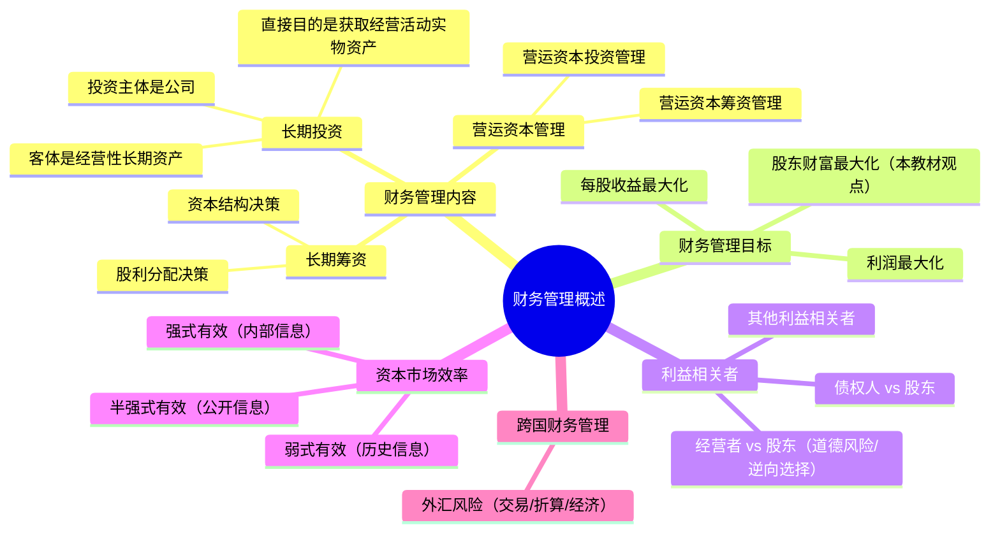

## 📍 章节定位

| 项目 | 信息 |
|------|------|
| **所属科目** | 📊 财务成本管理 |
| **难度等级** | ⭐ |
| **历年分值** | 2-3分 |
| **建议学时** | 3-4h |

## 📝 考情分析

本章是财务成本管理整本教材的入门章，分值占比不高，主要以客观题形式考查。重点考查内容包括：财务管理目标三种观点的比较、股东财富最大化与股价最大化、公司价值最大化的关系、利益相关者之间的利益冲突与协调机制、资本市场效率的三种层次及其特征。

近年来考查趋势倾向于将资本市场效率与后续章节（资本成本、投资项目估值）结合，因此对弱式、半强式、强式有效市场的含义和检验方法必须准确掌握。本章概念多、公式少，重在理解框架，是后续学习筹资、投资、估值等章节的逻辑起点。

## 🧠 知识框架

## 📖 核心精讲

### 一、财务管理的主要内容

财务管理是对资金的管理，主要包括投资和筹资两大领域。投资可分为长期投资和短期投资，筹资可分为长期筹资和短期筹资。因此财务管理的内容分为三部分。

#### （一）长期投资

长期投资指公司对经营性长期资产的直接投资，特征如下：

1. **投资主体是公司**：公司直接投资于经营性（生产性）资产，用以开展经营活动，可以直接控制生产经营活动；而间接投资者（债权人、股东）不直接控制经营性资产。
2. **投资客体是经营性长期资产**：包括厂房、建筑物、机器设备等。经营性资产投资有别于金融资产投资（证券投资）。
3. **直接目的是获取经营活动所需的固定资产**，而非再出售收益。

长期投资的程序包括：项目提出、项目评价、项目决策、项目执行、项目再评价。其核心问题是现金流量的规模（期望回收多少）、时间（何时回收）和风险（回收的可能性）。

#### （二）长期筹资

长期筹资指公司筹集生产经营所需的长期资本，具有以下特征：

1. **筹资主体是公司**：公司可在资本市场上直接筹资（发行股票、债券），也可通过金融机构间接筹资（银行借款）。
2. **筹资客体是长期资本**：包括权益资本（不需归还）和长期债务资本（期限1年以上）。
3. **长期筹资还涉及股利分配**：股利分配决策同时也是内部筹资决策——留存利润实际上是向股东筹集权益资本。

长期筹资的核心问题是**资本结构决策**（债务资本与权益资本的比例）和**股利分配决策**。

#### （三）营运资本管理

营运资本是流动资产与流动负债的差额。营运资本管理分为两部分：

- **营运资本投资管理**（短期投资管理）：制定营运资本投资政策，决定分配多少资金用于应收账款和存货、保留多少现金等。
- **营运资本筹资管理**（短期筹资管理）：制定营运资本筹资政策，决定向谁借入多少短期资金、是否采用赊购筹资等。

营运资本管理的目标有三个：
1. 有效地运用流动资产，力求其边际收益大于边际成本；
2. 选择最合理的流动负债，最大限度地降低营运资本的资本成本；
3. 加速营运资本周转，以尽可能少的营运资本支持尽可能大的经营规模并保持公司支付债务的能力。

### 二、财务管理的目标与利益相关者的要求

#### （一）财务管理目标的三种观点

| 观点 | 优点 | 局限性 |
|------|------|--------|
| **利润最大化** | 利润代表新创造的财富 | (1) 没有考虑利润取得时间；(2) 没有考虑所获利润与投入资本额的关系；(3) 没有考虑获取利润和所承担风险的关系 |
| **每股收益最大化** | 把利润与股东投入资本联系起来 | (1) 仍没考虑每股收益取得时间；(2) 仍没考虑每股收益风险；(3) 不同公司每股股票投入资本差别大，不可比 |
| **股东财富最大化**（本教材采用） | 考虑了时间价值、风险、投入资本；股价反映市场评价 | 难以准确计量非上市公司股东财富；股价受多种因素影响 |

**股东财富最大化**的衡量指标是"股东权益的市场增加值"，即股东权益的市场价值与股东投资资本的差额，也就是公司为股东创造的价值。

在资本市场有效的情况下，如果股东投资资本不变，**股价最大化**与股东财富最大化具有同等意义；如果股东投资资本和债务价值不变，**公司价值最大化**与股东财富最大化具有同等意义。三者关系需准确区分。

#### （二）利益相关者的利益要求与协调

**1. 债权人与股东的利益冲突**

股东可能通过以下方式损害债权人利益：
- 不经债权人同意投资于比债权人预期风险更高的新项目；
- 不经债权人同意发行新债，使旧债价值下降。

债权人的保护措施：
- 在借款合同中加入限制性条款（规定借款用途、限制发行新债等）；
- 拒绝进一步合作，不再提供新借款或提前收回贷款。

**2. 经营者与股东的利益冲突**

经营者目标：（1）增加报酬；（2）增加闲暇时间；（3）避免风险。

经营者背离股东目标的表现：
- **道德风险**：不尽最大努力实现股东目标，只做道德问题，不构成法律责任；
- **逆向选择**：经营者为了自身目标，背离股东目标，甚至损害股东利益。

股东的协调措施：
- **监督**：通过审计、定期报告等监督经营者，但受成本限制，不可能事事监督；
- **激励**：通过股票期权、绩效股等使经营者分享企业增加的财富。

通常股东同时采用监督和激励两种措施。最佳解决办法是使监督成本、激励成本与偏离股东目标的损失之和最小。

### 三、金融工具与金融市场

#### （一）金融工具的类型

| 类型 | 特征 | 举例 |
|------|------|------|
| **固定收益证券** | 提供固定或按固定公式计算的现金流 | 固定利率债券、优先股 |
| **权益证券** | 收益不固定，享有公司剩余权益 | 普通股 |
| **衍生证券** | 价值派生于基础资产 | 期权、期货、互换 |

#### （二）金融市场的类型

- **按期限分**：货币市场（短期，≤1年）和资本市场（长期，>1年）；
- **按证券是否首次发行分**：一级市场（发行市场）和二级市场（流通市场）。

#### （三）资本市场效率

**有效资本市场**指证券价格完全反映可获得信息的市场。

| 效率层次 | 反映的信息 | 含义 | 检验方法 |
|----------|-----------|------|---------|
| **弱式有效** | 历史信息 | 技术分析无效，股价随机游走 | 随机游走模型、过滤检验 |
| **半强式有效** | 历史信息+公开信息 | 基本面分析无效，不能获超额收益 | 事件研究法、投资基金表现研究法 |
| **强式有效** | 所有信息（含内部信息） | 内幕信息无用，无人能获超额收益 | 考察内幕信息获得者交易收益 |

**有效市场对财务管理的意义**：
- 在半强式有效市场中，公司不能通过粉饰财务报表误导市场；
- 公司可以通过发行新股、债券等筹资决策影响资本结构；
- 资本市场有效时，股价能反映公司价值，管理者应以股东财富最大化为目标。

### 四、跨国财务管理（简要）

跨国财务管理是财务管理的一个子领域，研究国际企业进行财务管理决策时遇到的特殊问题。其特点包括：
1. 财务管理环境更复杂（涉及多国政治、经济、法律、文化）；
2. 筹资渠道更多元；
3. 跨国投资风险更高。

**外汇风险的三种类型**：

| 类型 | 含义 | 影响对象 |
|------|------|---------|
| **交易风险** | 交易发生日与结算日汇率不一致导致收入或支出变动 | 现金流量 |
| **折算风险**（会计风险） | 外币项目折算为本币时汇率变动导致金额变动 | 会计报表 |
| **经济风险** | 汇率变动影响产销量、价格、成本等 | 长期现金流量 |

外汇风险管理方法分为自然对冲（内部管理）和外部金融工具对冲（远期、期货、期权、互换等）。

## 💡 典型例题

**【例题 1】（单选题）**

在股东投资资本不变的前提下，下列各项中，能够体现股东财富最大化目标的是（　）。

A. 利润最大化
B. 每股收益最大化
C. 股价最大化
D. 公司价值最大化

**答案**：C

**解析**：在股东投资资本不变的前提下，股价上升反映股东财富增加，因此股价最大化与股东财富最大化具有同等意义。利润最大化、每股收益最大化均未考虑时间价值和风险；公司价值最大化只有在股东投资资本和债务价值都不变时才与股东财富最大化等同。

---

**【例题 2】（单选题）**

下列关于资本市场效率的说法中，正确的是（　）。

A. 弱式有效市场中，基本面分析能获得超额收益
B. 半强式有效市场中，技术分析无效但基本面分析有效
C. 强式有效市场中，内幕信息获得者也无法获得超额收益
D. 半强式有效市场中，投资人可以通过分析公开信息获得超额收益

**答案**：C

**解析**：弱式有效市场中技术分析无效，但基本面分析可能有效，A错误；半强式有效市场中技术分析和基本面分析均无效，B、D错误；强式有效市场反映所有信息（含内部信息），无人能获得超额收益，C正确。

## 🎯 记忆口诀

**三种目标的递进**：
> 利润最最大缺陷——没时没本没风险；
> 每股收益补一本——时间风险仍不全；
> 股东财富最全面——时、风、资本都体现。

**有效市场三层级**（信息范围递增）：
> 弱式——历史信息（技术分析无用）；
> 半强式——加公开信息（基本面也无效）；
> 强式——加内部信息（内幕也无用）。

**经营者背离股东两表现**：
> 道德风险"不尽力"，逆向选择"乱伸手"。

## ✅ 同步练习

**1.（单选题）** 下列关于财务管理"长期投资"与"长期筹资"的说法中，错误的是（　）。

A. 长期投资的主体是公司，客体是经营性长期资产
B. 长期筹资的核心问题是资本结构决策和股利分配决策
C. 长期投资的直接目的是获取固定资产再出售收益
D. 股利分配决策同时也是内部筹资决策

**2.（单选题）** 债权人为了防止其利益被损害，通常采取的措施不包括（　）。

A. 在借款合同中加入限制性条款
B. 发现公司有损害其权利意图时拒绝进一步合作
C. 提前收回贷款
D. 主动提高对公司的投资比例以取得控制权

**3.（多选题）** 下列关于股东财富最大化目标的说法中，正确的有（　）。

A. 股东财富最大化考虑了时间价值、风险和投入资本
B. 在资本市场有效且股东投资资本不变时，股价最大化与股东财富最大化等价
C. 在股东投资资本和债务价值都不变时，公司价值最大化与股东财富最大化等价
D. 股东权益的市场增加值等于公司为股东创造的价值

**4.（单选题）** 某公司股价的随机游走检验表明股价前后两日的相关系数接近于0，则该市场可能属于（　）。

A. 非有效市场
B. 弱式有效市场
C. 半强式有效市场
D. 强式有效市场

**5.（单选题）** 跨国公司由于资产负债表日汇率与交易发生日汇率不同，导致外币项目折算金额变动，这种外汇风险属于（　）。

A. 交易风险
B. 折算风险
C. 经济风险
D. 经营风险

---

**练习答案**：1.C　2.D　3.ABCD　4.B　5.B
