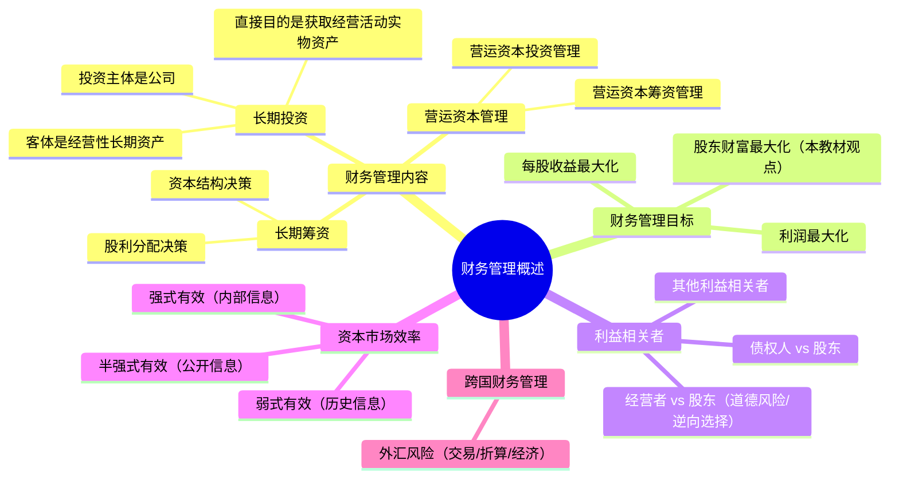

## 1. 章节定位

| 项目 | 信息 |
|------|------|
| 所属科目 | 财务成本管理 |
| 难度等级 | 1 |
| 历年分值 | 2-3分 |
| 建议学时 | 3-4h |

## 2. 考情分析

本章是财务成本管理整本教材的入门章，分值占比不高，主要以客观题形式考查，分值通常 2-3 分。重点考查内容包括：财务管理目标三种观点的比较、股东财富最大化与股价最大化、公司价值最大化的关系、利益相关者之间的利益冲突与协调机制、资本市场效率的三种层次及其特征。

**命题规律**：
1. 概念辨析型题目占主导，如三种财务管理目标的优缺点比较、三种有效市场层次的区分；
2. 利益相关者冲突与协调机制是高频考点，特别区分"道德风险"与"逆向选择"；
3. 资本市场效率层次与检验方法的对应关系是近五年高频考点；
4. 营运资本管理的基本概念（投资 vs 筹资、稳定性 vs 波动性流动资产）常作为客观题切入点。

近年来考查趋势倾向于将资本市场效率与后续章节（资本成本、投资项目估值）结合，因此对弱式、半强式、强式有效市场的含义和检验方法必须准确掌握。本章概念多、公式少，重在理解框架，是后续学习筹资、投资、估值等章节的逻辑起点。本章学习虽不计入高分章节，但概念理解不到位会直接影响后续章节的学习效果，必须重视。

## 3. 知识框架



## 4. 核心精讲

### 一、财务管理的主要内容

财务管理是对资金的管理，主要包括投资和筹资两大领域。投资可分为长期投资和短期投资，筹资可分为长期筹资和短期筹资。因此财务管理的内容分为三部分。

#### （一）长期投资

长期投资指公司对经营性长期资产的直接投资，特征如下：

1. **投资主体是公司**：公司直接投资于经营性（生产性）资产，用以开展经营活动，可以直接控制生产经营活动；而间接投资者（债权人、股东）不直接控制经营性资产。
2. **投资客体是经营性长期资产**：包括厂房、建筑物、机器设备等。经营性资产投资有别于金融资产投资（证券投资）。
3. **直接目的是获取经营活动所需的固定资产**，而非再出售收益。

长期投资的程序包括：项目提出、项目评价、项目决策、项目执行、项目再评价。其核心问题是现金流量的规模（期望回收多少）、时间（何时回收）和风险（回收的可能性）。

**长期投资与短期投资的关键区别**：

| 项目 | 长期投资 | 短期投资（营运资本投资） |
|------|----------|--------------------------|
| 投资对象 | 固定资产、无形资产等经营性长期资产 | 应收账款、存货、现金等流动资产 |
| 投资期限 | 超过一年或一个营业周期 | 一年以内或一个营业周期内 |
| 决策方法 | NPV、IRR、PI 等折现指标 | 周转率、EOQ、信用政策等 |
| 风险性质 | 长期现金流不确定性 | 短期流动性风险 |
| 资本来源 | 长期筹资（权益+长期债务） | 短期筹资（自发性+短期金融负债） |

**经营性资产投资与金融资产投资的区别**：经营性资产投资是公司直接投资于实物资产以开展经营活动，公司可控制经营性资产；金融资产投资是投资者通过资本市场购买证券间接投资，投资者不直接控制实物资产，仅获取投资报酬。两者在决策方法上也有差异：经营性资产投资用 NPV/IRR 等，金融资产投资用证券估值模型（如 CAPM、戈登模型）。

#### （二）长期筹资

长期筹资指公司筹集生产经营所需的长期资本，具有以下特征：

1. **筹资主体是公司**：公司可在资本市场上直接筹资（发行股票、债券），也可通过金融机构间接筹资（银行借款）。
2. **筹资客体是长期资本**：包括权益资本（不需归还）和长期债务资本（期限1年以上）。
3. **长期筹资还涉及股利分配**：股利分配决策同时也是内部筹资决策——留存利润实际上是向股东筹集权益资本。

长期筹资的核心问题是**资本结构决策**（债务资本与权益资本的比例）和**股利分配决策**。

#### （三）营运资本管理

营运资本是流动资产与流动负债的差额。营运资本管理分为两部分：

- **营运资本投资管理**（短期投资管理）：制定营运资本投资政策，决定分配多少资金用于应收账款和存货、保留多少现金等。
- **营运资本筹资管理**（短期筹资管理）：制定营运资本筹资政策，决定向谁借入多少短期资金、是否采用赊购筹资等。

营运资本管理的目标有三个：
1. 有效地运用流动资产，力求其边际收益大于边际成本；
2. 选择最合理的流动负债，最大限度地降低营运资本的资本成本；
3. 加速营运资本周转，以尽可能少的营运资本支持尽可能大的经营规模并保持公司支付债务的能力。

**营运资本的公式与含义**：

$$\text{营运资本} = \text{流动资产} - \text{流动负债} = (\text{稳定性流动资产} + \text{波动性流动资产}) - (\text{自发性流动负债} + \text{短期金融负债})$$

- **稳定性流动资产**：即使经营淡季仍需保留的最低流动资产（如安全存货、最低现金余额）；
- **波动性流动资产**：随季节性、周期性变化的流动资产（旺季增加、淡季减少）；
- **自发性流动负债**：经营中自然产生的流动负债（如应付账款、应付职工薪酬）；
- **短期金融负债**：为筹集资金而主动借入的短期债务（如短期借款）。

营运资本为正数表示公司用长期资金支持部分流动资产，财务状况较为稳健；为负数则表示部分长期资产由短期资金支持，财务风险较高。这部分内容详见第十二章"营运资本管理"。

### 二、财务管理的目标与利益相关者的要求

#### （一）财务管理目标的三种观点

| 观点 | 优点 | 局限性 |
|------|------|--------|
| 利润最大化 | 利润代表新创造的财富 | (1) 没有考虑利润取得时间；(2) 没有考虑所获利润与投入资本额的关系；(3) 没有考虑获取利润和所承担风险的关系 |
| 每股收益最大化 | 把利润与股东投入资本联系起来 | (1) 仍没考虑每股收益取得时间；(2) 仍没考虑每股收益风险；(3) 不同公司每股股票投入资本差别大，不可比 |
| **股东财富最大化**（本教材采用） | 考虑了时间价值、风险、投入资本；股价反映市场评价 | 难以准确计量非上市公司股东财富；股价受多种因素影响 |

**股东财富最大化**的衡量指标是"股东权益的市场增加值"，即股东权益的市场价值与股东投资资本的差额，也就是公司为股东创造的价值。

$$\text{股东财富增加额} = \text{股东权益市场价值} - \text{股东投资资本}$$

在资本市场有效的情况下，如果股东投资资本不变，**股价最大化**与股东财富最大化具有同等意义；如果股东投资资本和债务价值不变，**公司价值最大化**与股东财富最大化具有同等意义。三者关系需准确区分。

**三个目标的等价关系图解**：

| 目标 | 等价条件 | 含义 |
|------|----------|------|
| 股价最大化 | 股东投资资本不变 | 股价上升反映股东财富增加 |
| 公司价值最大化 | 股东投资资本和债务价值都不变 | 实体价值上升反映股东财富增加 |
| 股东财富最大化 | —（基础目标） | 股东权益市场增加值最大 |

**判断要点**：股东投资资本变化（如增发新股、回购股票）会改变股价但不一定增加股东财富；债务价值变化（如利率变动导致债务市值变化）会改变公司价值但不一定影响股东财富。考试常以"假设条件"形式考查三者的等价性，必须准确识别前提条件。

**补充：利益相关者理论的扩展视角**

除了股东、债权人、经营者三类核心利益相关者外，广义利益相关者还包括员工、客户、供应商、政府、社区等。现代公司治理强调在股东财富最大化基础上兼顾其他利益相关者利益，但财管教材仍以**股东财富最大化**为基础目标。

#### （二）利益相关者的利益要求与协调

**1. 债权人与股东的利益冲突**

股东可能通过以下方式损害债权人利益：
- 不经债权人同意投资于比债权人预期风险更高的新项目；
- 不经债权人同意发行新债，使旧债价值下降。

债权人的保护措施：
- 在借款合同中加入限制性条款（规定借款用途、限制发行新债等）；
- 拒绝进一步合作，不再提供新借款或提前收回贷款。

**2. 经营者与股东的利益冲突**

经营者目标：（1）增加报酬；（2）增加闲暇时间；（3）避免风险。

经营者背离股东目标的表现：
- **道德风险**：不尽最大努力实现股东目标，只做道德问题，不构成法律责任；
- **逆向选择**：经营者为了自身目标，背离股东目标，甚至损害股东利益。

股东的协调措施：
- **监督**：通过审计、定期报告等监督经营者，但受成本限制，不可能事事监督；
- **激励**：通过股票期权、绩效股等使经营者分享企业增加的财富。

通常股东同时采用监督和激励两种措施。最佳解决办法是使监督成本、激励成本与偏离股东目标的损失之和最小。

**监督、激励与偏离成本的关系**：

$$\text{总代理成本} = \text{监督成本} + \text{激励成本} + \text{偏离股东目标的损失}$$

最佳协调机制是使上述总代理成本最小化。监督越多，偏离损失越小，但监督成本越高；激励越多，偏离损失越小，但激励成本越高。两者存在此消彼长的关系，需找到平衡点。

**3. 其他利益相关者的利益协调**

| 利益相关者 | 利益诉求 | 协调机制 |
|-----------|----------|---------|
| 员工 | 薪酬福利、职业发展 | 劳动合同、工会、员工持股计划 |
| 客户 | 产品质量、售后服务 | 质量保证、品牌承诺 |
| 供应商 | 货款及时收回 | 长期合作合同、供应链管理 |
| 政府 | 税收、就业、合规 | 法律法规、税收政策 |

**4. 商业道德与社会责任**

公司在追求股东财富最大化时，应遵守商业道德、承担社会责任（如环保、公益、员工权益保护）。虽然短期内承担社会责任可能增加成本，但长期看有助于维护公司声誉、降低经营风险，从而间接增加股东财富。

### 三、金融工具与金融市场

#### （一）金融工具的类型

| 类型 | 特征 | 举例 |
|------|------|------|
| 固定收益证券 | 提供固定或按固定公式计算的现金流 | 固定利率债券、优先股 |
| 权益证券 | 收益不固定，享有公司剩余权益 | 普通股 |
| 衍生证券 | 价值派生于基础资产 | 期权、期货、互换 |

#### （二）金融市场的类型

- **按期限分**：货币市场（短期，≤1年）和资本市场（长期，>1年）；
- **按证券是否首次发行分**：一级市场（发行市场）和二级市场（流通市场）；
- **按交易程序分**：场内市场（交易所）和场外市场（OTC）；
- **按交割方式分**：现货市场、期货市场、期权市场。

**货币市场 vs 资本市场**：

| 类型 | 期限 | 工具 | 风险 | 收益 |
|------|------|------|------|------|
| 货币市场 | ≤1年 | 国库券、商业票据、银行承兑汇票、可转让存单 | 低 | 低 |
| 资本市场 | >1年 | 股票、长期债券、基金 | 高 | 高 |

**一级市场与二级市场的关系**：一级市场是新证券首次发行的市场，二级市场是已发行证券流通转让的市场。二级市场为一级市场提供流动性，没有活跃的二级市场，一级市场难以持续发行。两者相互依存。

#### （三）资本市场效率

**有效资本市场**指证券价格完全反映可获得信息的市场。有效市场假设（EMH）由法玛（Fama）提出，根据价格反映的信息集范围分为三种层次。

| 效率层次 | 反映的信息 | 含义 | 检验方法 |
|----------|-----------|------|---------|
| 弱式有效 | 历史信息 | 技术分析无效，股价随机游走 | 随机游走模型、过滤检验 |
| 半强式有效 | 历史信息+公开信息 | 基本面分析无效，不能获超额收益 | 事件研究法、投资基金表现研究法 |
| 强式有效 | 所有信息（含内部信息） | 内幕信息无用，无人能获超额收益 | 考察内幕信息获得者交易收益 |

**三种层次的递进关系**：

```
强式有效（所有信息） ⊃ 半强式有效（公开信息） ⊃ 弱式有效（历史信息）
```

即强式有效市场必然是半强式有效和弱式有效；半强式有效市场必然是弱式有效；反之不成立。投资者可获取的信息范围越广，市场越有效。

**检验方法详解**：

1. **随机游走模型**：检验股价序列是否随机游走（前后期收益率相关系数接近0）。若股价随机游走，则历史信息已被完全反映，市场弱式有效。
2. **过滤检验**：设定过滤规则（如股价上涨5%后买入、下跌5%后卖出），若按规则交易无法获得超额收益，则市场弱式有效。
3. **事件研究法**：考察特定事件（如年报公告、并购宣告）发生后股价是否迅速调整。若事件公布后无法获得超额收益，则市场半强式有效。
4. **投资基金表现研究法**：比较投资基金的收益率与市场指数收益率。若基金长期无法持续战胜市场，则市场半强式有效。
5. **内幕交易检验**：考察内幕信息获得者（如董事、高管）的股票交易收益。若内幕交易无法获得超额收益，则市场强式有效。

**有效市场对财务管理的意义**：
- 在半强式有效市场中，公司不能通过粉饰财务报表误导市场；
- 公司可以通过发行新股、债券等筹资决策影响资本结构；
- 资本市场有效时，股价能反映公司价值，管理者应以股东财富最大化为目标；
- 实证研究表明，多数发达国家的资本市场至少达到弱式有效，半强式有效较多，强式有效很少。

**有效市场与公司财务决策的对应关系**：

| 决策类型 | 弱式有效 | 半强式有效 | 强式有效 |
|---------|----------|-----------|---------|
| 技术分析 | 无效 | 无效 | 无效 |
| 基本面分析 | 有效 | 无效 | 无效 |
| 内幕信息 | 有效 | 有效 | 无效 |
| 粉饰报表 | 可误导市场 | 无法误导 | 无法误导 |

### 四、跨国财务管理（简要）

跨国财务管理是财务管理的一个子领域，研究国际企业进行财务管理决策时遇到的特殊问题。其特点包括：
1. 财务管理环境更复杂（涉及多国政治、经济、法律、文化）；
2. 筹资渠道更多元；
3. 跨国投资风险更高。

**外汇风险的三种类型**：

| 类型 | 含义 | 影响对象 |
|------|------|---------|
| 交易风险 | 交易发生日与结算日汇率不一致导致收入或支出变动 | 现金流量 |
| **折算风险**（会计风险） | 外币项目折算为本币时汇率变动导致金额变动 | 会计报表 |
| 经济风险 | 汇率变动影响产销量、价格、成本等 | 长期现金流量 |

外汇风险管理方法分为自然对冲（内部管理）和外部金融工具对冲（远期、期货、期权、互换等）。

**三种外汇风险的对比**：

| 类型 | 影响期限 | 衡量方式 | 管理难度 |
|------|---------|---------|---------|
| 交易风险 | 短期（已发生未结算交易） | 汇率变动 × 外币应收应付 | 较易管理（用金融工具对冲） |
| 折算风险 | 报表日（会计折算） | 资产负债表外币项目 × 汇率变动 | 仅影响账面，可不强管理 |
| 经济风险 | 长期（未来现金流） | 未来各期现金流变动现值 | 最难管理（涉及经营调整） |

### 五、财务管理与其他学科的关系

| 学科 | 关系 |
|------|------|
| 会计学 | 提供财务报表数据，是财务分析的基础 |
| 经济学 | 提供市场理论、供需分析、效用理论 |
| 统计学 | 提供概率论、回归分析等工具 |
| 数学 | 提供微积分、矩阵代数等计算工具 |
| 管理学 | 提供组织行为、决策理论 |

**财务管理与会计学的关键区别**：

| 维度 | 财务管理 | 会计学 |
|------|---------|--------|
| 核心 | 资金管理决策 | 信息记录与报告 |
| 时间导向 | 面向未来（预测、决策） | 面向过去（核算、报告） |
| 资产计价 | 市场价值 | 历史成本 |
| 风险态度 | 关注风险与报酬权衡 | 谨慎原则 |
| 现金观 | 现金流量 | 权责发生制 |

## 5. 典型例题

**【例题 1】（单选题）**

在股东投资资本不变的前提下，下列各项中，能够体现股东财富最大化目标的是（　）。

A. 利润最大化
B. 每股收益最大化
C. 股价最大化
D. 公司价值最大化

**答案**：C

**解析**：在股东投资资本不变的前提下，股价上升反映股东财富增加，因此股价最大化与股东财富最大化具有同等意义。利润最大化、每股收益最大化均未考虑时间价值和风险；公司价值最大化只有在股东投资资本和债务价值都不变时才与股东财富最大化等同。

---

**【例题 2】（单选题）**

下列关于资本市场效率的说法中，正确的是（　）。

A. 弱式有效市场中，基本面分析能获得超额收益
B. 半强式有效市场中，技术分析无效但基本面分析有效
C. 强式有效市场中，内幕信息获得者也无法获得超额收益
D. 半强式有效市场中，投资人可以通过分析公开信息获得超额收益

**答案**：C

**解析**：弱式有效市场中技术分析无效，但基本面分析可能有效，A错误；半强式有效市场中技术分析和基本面分析均无效，B、D错误；强式有效市场反映所有信息（含内部信息），无人能获得超额收益，C正确。

---

**【例题 3】（多选题）**

下列关于利益相关者冲突与协调的说法中，正确的有（　）。

A. 股东通过投资高风险项目损害债权人利益，属于"资产替代"问题
B. 股东不经债权人同意发行新债，会使旧债价值下降
C. 经营者背离股东目标的"道德风险"是指经营者为了自身目标损害股东利益
D. 股东同时采用监督和激励措施以最小化总代理成本

**答案**：ABD

**解析**：A正确，股东投资比债权人预期风险更高的新项目即"资产替代"问题；B正确，发行新债使公司负债率上升、风险加大，旧债价值下降；C错误，"道德风险"是经营者不尽最大努力，"逆向选择"才是经营者为了自身目标背离股东目标甚至损害股东利益；D正确，最佳协调是使监督成本、激励成本与偏离损失之和最小。

---

**【例题 4】（单选题）**

下列关于财务管理内容的说法中，正确的是（　）。

A. 长期投资的主体是公司，客体是金融资产
B. 营运资本管理包括营运资本投资管理和营运资本筹资管理
C. 长期筹资的核心问题是短期借款决策
D. 股利分配决策不属于长期筹资决策

**答案**：B

**解析**：A错误，长期投资客体是经营性长期资产；B正确，营运资本管理分为投资管理和筹资管理两部分；C错误，长期筹资的核心问题是资本结构决策和股利分配决策；D错误，股利分配决策同时也是内部筹资决策。

---

**【例题 5】（计算概念题·外汇风险）**

某中国公司向美国出口商品，3 个月后将收到 100 万美元货款，签约时汇率 1 美元 = 7.0 元人民币。3 个月后汇率变为 1 美元 = 6.8 元人民币。要求：说明该公司面临的外汇风险类型及其损失金额。

**答案**：

该公司面临**交易风险**（已发生交易，未来结算，期间汇率变动）。

- 签约时应收金额：100 万美元 × 7.0 = 700 万元人民币
- 实际收到金额：100 万美元 × 6.8 = 680 万元人民币
- 损失金额 = 700 - 680 = 20 万元人民币

**解析**：交易风险源于交易发生日与结算日汇率不一致。可通过远期结汇、期权等金融工具对冲。

## 6. 记忆口诀

**三种目标的递进**：
> 利润最最大缺陷——没时没本没风险；
> 每股收益补一本——时间风险仍不全；
> 股东财富最全面——时、风、资本都体现。

**三个目标等价条件**：
> 股价最大 = 股东财富，前提是"股东投资资本不变"；
> 公司价值最大 = 股东财富，前提是"股东投资资本 + 债务价值都不变"；
> 一变股东资本、二变债务价值——三重前提须辨清。

**有效市场三层级**（信息范围递增）：
> 弱式——历史信息（技术分析无用）；
> 半强式——加公开信息（基本面也无效）；
> 强式——加内部信息（内幕也无用）。
> 三层递进：强式必为半强式，半强式必为弱式，反之不然。

**检验方法速记**：
> 弱式用随机游走、过滤检验；
> 半强式用事件研究、基金表现；
> 强式查内幕交易收益。

**经营者背离股东两表现**：
> 道德风险"不尽力"，逆向选择"乱伸手"。
> 监督加激励，总成本最低。

**债权人保护两招**：
> 限制条款入合同，拒绝合作或提前收回。

**外汇风险三类型**：
> 交易风险已发生，折算风险会计表，经济风险长期现。
> 交易易管理，折算仅账面，经济最难缠。

**金融工具三类型**：
> 固定收益现金流，权益证券享剩余，衍生派生基础资产。

**营运资本四要素**：
> 稳定性流动资产 + 波动性流动资产 − 自发性流动负债 − 短期金融负债 = 营运资本。

## 7. 同步练习

**1.（单选题）** 下列关于财务管理"长期投资"与"长期筹资"的说法中，错误的是（　）。

A. 长期投资的主体是公司，客体是经营性长期资产
B. 长期筹资的核心问题是资本结构决策和股利分配决策
C. 长期投资的直接目的是获取固定资产再出售收益
D. 股利分配决策同时也是内部筹资决策

**2.（单选题）** 债权人为了防止其利益被损害，通常采取的措施不包括（　）。

A. 在借款合同中加入限制性条款
B. 发现公司有损害其权利意图时拒绝进一步合作
C. 提前收回贷款
D. 主动提高对公司的投资比例以取得控制权

**3.（多选题）** 下列关于股东财富最大化目标的说法中，正确的有（　）。

A. 股东财富最大化考虑了时间价值、风险和投入资本
B. 在资本市场有效且股东投资资本不变时，股价最大化与股东财富最大化等价
C. 在股东投资资本和债务价值都不变时，公司价值最大化与股东财富最大化等价
D. 股东权益的市场增加值等于公司为股东创造的价值

**4.（单选题）** 某公司股价的随机游走检验表明股价前后两日的相关系数接近于0，则该市场可能属于（　）。

A. 非有效市场
B. 弱式有效市场
C. 半强式有效市场
D. 强式有效市场

**5.（单选题）** 跨国公司由于资产负债表日汇率与交易发生日汇率不同，导致外币项目折算金额变动，这种外汇风险属于（　）。

A. 交易风险
B. 折算风险
C. 经济风险
D. 经营风险

**6.（多选题）** 下列关于股东财富最大化的说法中，正确的有（　）。

A. 股东财富最大化考虑了时间价值、风险和投入资本
B. 在资本市场有效且股东投资资本不变时，股价最大化与股东财富最大化等价
C. 在股东投资资本和债务价值都不变时，公司价值最大化与股东财富最大化等价
D. 股东权益的市场增加值等于公司为股东创造的价值

**7.（单选题）** 下列关于有效市场假设检验方法的对应关系中，错误的是（　）。

A. 弱式有效——随机游走模型
B. 弱式有效——过滤检验
C. 半强式有效——事件研究法
D. 强式有效——投资基金表现研究法

**8.（单选题）** 经营者为了自身目标背离股东目标，甚至损害股东利益，这种行为属于（　）。

A. 道德风险
B. 逆向选择
C. 监督成本
D. 激励成本

**9.（多选题）** 下列属于金融性资产的有（　）。

A. 交易性金融资产
B. 应收账款
C. 短期借款
D. 应付债券

**10.（判断题）** 在半强式有效市场中，公司可以通过粉饰财务报表误导市场，使股价短期上升。（　）

**11.（单选题）** 与普通合伙企业相比，下列各项中，属于公司制企业局限性的是（　）。

A. 承担无限责任
B. 存在代理问题
C. 股权转移困难
D. 企业寿命有限

**12.（单选题）** 下列关于财务管理目标的说法中，不正确的是（　）。

A. 利润最大化和每股收益最大化均没有考虑时间因素和风险因素
B. 在债务价值不变的情况下，股价最大化意味着股东财富最大化
C. 股东财富的增加可以用股东权益的市场增加值来衡量
D. 股东财富可以用股东权益的市场价值来衡量

**13.（单选题）** 下列属于债权人为防止其利益被伤害可采取的措施的是（　）。

A. 激励经营者
B. 监督经营者
C. 授予经营者股票期权
D. 破产时先行接管

**14.（单选题）** 下列有关资本市场有效性检验的说法中，正确的是（　）。

A. 对强式有效资本市场的检验，主要考察价格是否充分地反映历史的、公开的信息
B. 检验半强式有效市场的方法主要是考察内幕信息获得者参与交易时能否获得超常盈利
C. 验证弱式有效资本市场的方法是考察股价是否是随机变动，不受历史价格的影响
D. 对强式有效资本市场的检验，主要考察股价是否是随机变动，不受历史价格的影响

**15.（单选题）** 公司的下列财务活动中，不符合债权人目标的是（　）。

A. 提高利润留存比率
B. 降低财务杠杆比率
C. 非公开增发新股
D. 发行公司债券

**16.（单选题）** 下列关于财务管理的基本理论的说法中，不正确的是（　）。

A. 现金流量理论是财务管理最基础性的理论
B. 价值评估理论是财务管理的一个核心理论
C. 投资组合理论认为，投资组合的风险是组合内各证券风险的加权平均风险
D. 资本结构理论是关于资本结构与财务风险、资本成本以及公司价值之间关系的理论

**17.（单选题）** 如果有关证券的历史信息与现在和未来的证券价格无关，说明资本市场至少是（　）。

A. 弱式有效
B. 无效
C. 半强式有效
D. 强式有效

**18.（单选题）** 在资本市场有效的情况下，假设股东投资资本不变，在下列各项财务指标中，最能够反映上市公司财务管理目标实现程度的是（　）。

A. 股东财富
B. 每股净资产
C. 每股市价
D. 每股股利

**19.（单选题）** (2021年) 下列关于有限合伙企业与公司制企业共同点的说法中，正确的是（　）。

A. 都是独立法人
B. 都需要缴纳企业所得税
C. 都需要两个或两个以上出资人
D. 都可以有法人作为企业的出资人

**20.（单选题）** (2020年) 下列各项中，属于资本市场工具的是（　）。

A. 商业票据
B. 短期国债
C. 长期公司债券
D. 大额可转让定期存单

**21.（单选题）** (2018年) 如果当前资本市场弱式有效，下列说法正确的是（　）。

A. 投资者不能通过投资证券获取超额收益
B. 投资者不能通过获取证券非公开信息进行投资获取超额收益
C. 投资者不能通过分析证券历史信息进行投资获取超额收益
D. 投资者不能通过分析证券公开信息进行投资获取超额收益

**22.（单选题）** (2018年) 如果投资基金经理根据公开信息选择股票，投资基金的平均业绩与市场整体收益大体一致，说明该资本市场至少是（　）。

A. 半强式有效
B. 弱式有效
C. 完全无效
D. 强式有效

**23.（多选题）** 下列各项中，属于常见的财务管理目标的有（　）。

A. 利润最大化
B. 公司价值最大化
C. 每股收益最大化
D. 股东财富最大化

**24.（多选题）** 下列证券中，属于固定收益证券的有（　）。

A. 甲公司发行的利率为5%、每年付息一次、期限为3年的公司债券
B. 乙公司发行的利率按照国库券利率上浮2个百分点确定的浮动利率债券
C. 丙公司发行的利率固定，到期一次还本付息的债券
D. 丁公司发行的利率固定，到期按面值还本的债券

**25.（多选题）** 下列关于金融市场的说法中，正确的有（　）。

A. 货币市场的主要功能是保持金融资产的流动性
B. 资本市场的主要功能是进行长期资本的融通
C. 股票的风险小于债务工具
D. 按照证券的资金来源不同，金融市场分为债务市场和股权市场

**26.（多选题）** 如果资本市场弱式有效，下列说法中不正确的有（　）。

A. 基本面分析无效
B. 技术分析无效
C. 各种估值模型无效
D. 有关证券的历史信息对证券的价格变动有影响

**27.（多选题）** 下列关于可持续发展目标的说法中，正确的有（　）。

A. 可持续发展目标不仅关注经济增长，还强调社会包容性和环境保护
B. 可持续发展目标的基本原则是公平性、持续性
C. 可持续发展目标在企业中体现的是ESG理念
D. ESG理念强调的是企业要注重生态环境保护、履行社会责任

**28.（多选题）** (2023年) 在场内交易市场进行证券交易的特点有（　）。

A. 有约定的交易对手
B. 有固定的交易时间
C. 有协商的交易价格
D. 有规范的交易规则

**29.（多选题）** (2023年) 关于股东或合伙人承担有限责任的表述中正确的有（　）。

A. 有限责任公司的大股东只承担有限责任
B. 特殊合伙制企业中无过失的合伙人只承担有限责任
C. 股份制公司的股东只承担有限责任
D. 合伙制企业的普通合伙人只承担有限责任

**30.（多选题）** (2022年) 下列关于公司财务管理目标的说法中，正确的有（　）。

A. 每股收益最大化目标没有考虑每股收益的风险
B. 公司价值最大化目标没有考虑债权人的利益
C. 利润最大化目标没有考虑利润的取得时间
D. 股价最大化目标没有考虑股东投入的资本

**31.（多选题）** (2022年) 某投资者利用内幕信息在市场上交易甲公司股票并获得了超额收益。下列有效性不同的资本市场中，会出现上述情况的有（　）。

A. 弱式有效市场
B. 强式有效市场
C. 无效市场
D. 半强式有效市场

**32.（多选题）** (2021年) 下列关于公司制企业的表述正确的有（　）。

A. 公司是独立的法人
B. 公司的债务与股东自身债务无关
C. 公司股权可以转让
D. 公司最初的投资者退出后仍然可以继续存在

**33.（多选题）** (2017年) 甲投资基金利用市场公开信息进行价值分析和投资。在下列有效程度不同的资本市场中，该投资基金可获取超额收益的有（　）。

A. 无效市场
B. 弱式有效市场
C. 半强式有效市场
D. 强式有效市场

---

**练习答案**：1.C　2.D　3.ABCD　4.B　5.B　6.ABCD　7.D（投资基金表现研究法是检验半强式有效的方法）　8.B　9.ACD（应收账款是经营性资产）　10.错误（半强式有效市场中粉饰报表无法误导市场）　11.B（公司制企业存在代理问题，这是其局限性）　12.B（在资本市场有效且股东投资资本不变时，股价最大化才意味着股东财富最大化，而非债务价值不变）　13.D（选项ABC属于协调股东和经营者利益冲突的措施）　14.C（强式有效的检验考察内幕信息获得者能否获超常盈利；半强式用事件研究法和基金表现研究法）　15.D（发行公司债券举借新债，增加原有债务风险，不符合债权人目标）　16.C（投资组合的风险不是各证券风险的加权平均，组合能降低非系统性风险）　17.A（历史信息对股价无影响，说明资本市场至少弱式有效）　18.C（资本市场有效且股东投资资本不变时，股价上升反映股东财富增加，股价最大化与股东财富最大化具有同等意义）　19.D（有限合伙企业不是独立法人，不缴企业所得税；国有独资公司只有一个出资人）　20.C（资本市场工具包括股票、长期公司债券、长期政府债券等；商业票据、短期国债、大额可转让定期存单属于货币市场工具）　21.C（弱式有效市场股价只反映历史信息，不能通过分析历史信息获取超额收益）　22.A（基金业绩与市场整体一致，说明股价反映公开信息，市场至少半强式有效）　23.ACD（公司价值最大化不属于教材所列常见财务管理目标）　24.ABCD（固定收益证券是能提供固定或按固定公式计算现金流量的证券，浮动利率债券也属于）　25.AB（股票风险高于债务工具；金融市场按交易工具属性分为债务市场和股权市场）　26.ACD（弱式有效下技术分析无效，但基本面分析和估值模型有效；历史信息已被反映，对价格变动无影响）　27.AC（可持续发展目标的基本原则是公平性、持续性、共同性；ESG还强调治理水平）　28.BD（场内交易市场有固定交易场所、固定交易时间和规范的交易规则）　29.AC（公司制企业股东承担有限责任；普通合伙人承担无限连带责任，特殊合伙制无过失合伙人仍对合伙企业债务承担无限连带责任）　30.ACD（公司价值最大化考虑了债权人的利益，公司价值=股东权益价值+债务价值）　31.ACD（内幕信息能获超额收益说明股价未反映内幕信息，市场未达到强式有效）　32.ABCD（公司是独立法人、无限存续、股权可转让、有限责任）　33.AB（无效市场和弱式有效市场股价未反映公开信息，利用公开信息可获超额收益）
