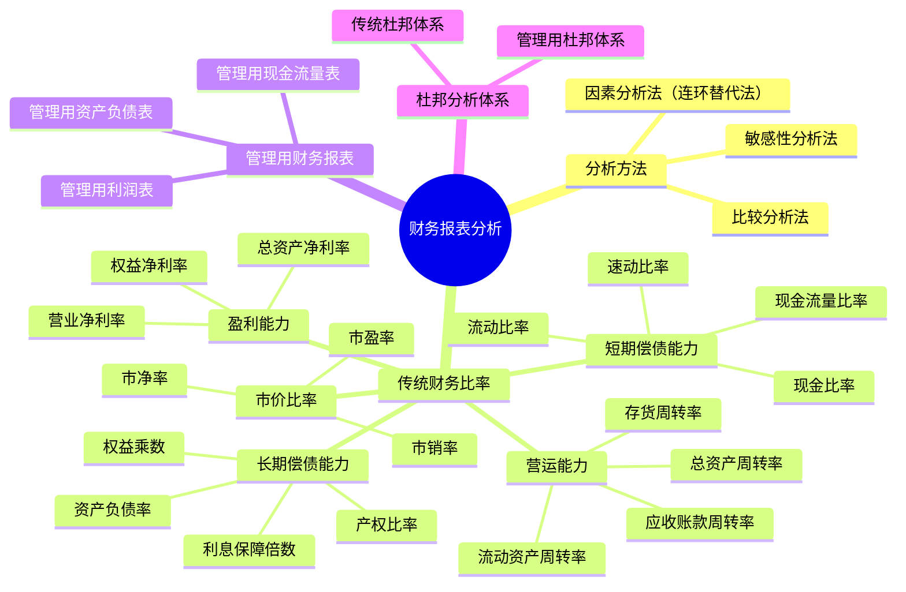

## 1. 章节定位

| 项目 | 信息 |
|------|------|
| 所属科目 | 财务成本管理 |
| 难度等级 | 3 |
| 历年分值 | 6-8分 |
| 建议学时 | 6-8h |

## 2. 考情分析

本章是财务成本管理的基础章，也是历年考试的重点章，分值约 6-8 分。题型涵盖客观题与主观题，主观题常与第三章财务预测、第九章企业价值评估结合出综合题。核心考点集中于五大类财务比率的计算与含义、管理用财务报表的调整、杜邦分析体系与管理用杜邦体系、因素分析法的连环替代计算。

**命题规律**：
1. 五大类财务比率（短期偿债、长期偿债、营运、盈利、市价）每年必考 2-3 个客观题，重点是公式口径与含义；
2. 管理用财务报表的调整（经营性 vs 金融性）是主观题核心考点，几乎每年综合题都涉及；
3. 杜邦分析体系与管理用杜邦体系的连环替代分析是计算题高频考点；
4. 财务比率的同向变动关系（资产负债率、产权比率、权益乘数）是常见陷阱。

近年趋势强调管理用财务报表分析（区别于传统财务报表），考生必须熟练掌握经营性资产/负债与金融性资产/负债的划分、经营性损益与金融性损益的区分，以及管理用资产负债表等式：净经营资产 = 净负债 + 股东权益。本章学习是后续财务预测（第三章）、企业价值评估（第九章）的前提，必须扎实掌握。

## 3. 知识框架



## 4. 核心精讲

### 一、财务报表分析的目的与方法

#### （一）分析目的

财务报表分析的目的是将财务报表数据转换成有用的信息，帮助报表使用人改善决策。不同的使用人分析目的不同：
- **股权投资人**：决定是否投资、评估企业价值、考察经营者业绩；
- **债权人**：决定是否贷款、评估短期偿债能力和长期偿债能力；
- **管理者**：进行经营决策、改善财务状况；
- **政府**：监管、征税等。

#### （二）分析方法

**1. 比较分析法**：对两个或几个有关的可比数据进行对比，揭示差异和矛盾。按比较对象分为趋势分析、横向比较、预算差异分析。

**2. 因素分析法（连环替代法）**：依据财务指标与其驱动因素的关系，从数量上确定各因素对指标影响程度的方法。

设综合指标 $F$ 受因素 $A, B, C$ 影响，关系为 $F = A \times B \times C$，则：
- 基期（计划）值：$F_0 = A_0 \times B_0 \times C_0$
- 第一次替代：$F_1 = A_1 \times B_0 \times C_0$，因素 $A$ 影响 = $F_1 - F_0$
- 第二次替代：$F_2 = A_1 \times B_1 \times C_0$，因素 $B$ 影响 = $F_2 - F_1$
- 第三次替代：$F_3 = A_1 \times B_1 \times C_1$，因素 $C$ 影响 = $F_3 - F_2$
- 各因素影响合计 = $F_3 - F_0$

**注意**：替代必须按确定的顺序依次进行（通常先数量后价格、先实物后价值），不能随意颠倒。

**连环替代法实例**：设某产品材料成本由产量、单耗、单价三因素影响，关系为：材料成本 = 产量 × 单耗 × 单价。

| 项目 | 产量 | 单耗 | 单价 | 材料成本 |
|------|------|------|------|----------|
| 基期 | 1000 | 5 | 8 | 40000 |
| 实际 | 1200 | 4.5 | 9 | 48600 |

差异 = 48600 − 40000 = 8600（元）

连环替代分析：
- 基期：$F_0 = 1000 \times 5 \times 8 = 40000$
- 替代产量：$F_1 = 1200 \times 5 \times 8 = 48000$，产量影响 = 48000 − 40000 = **+8000**
- 替代单耗：$F_2 = 1200 \times 4.5 \times 8 = 43200$，单耗影响 = 43200 − 48000 = **−4800**
- 替代单价：$F_3 = 1200 \times 4.5 \times 9 = 48600$，单价影响 = 48600 − 43200 = **+5400**
- 合计影响 = 8000 − 4800 + 5400 = **+8600**

**差额分析法**（连环替代的简化形式）：直接计算各因素实际与基期差额对总差异的贡献。
- 产量影响 = (1200−1000) × 5 × 8 = +8000
- 单耗影响 = 1200 × (4.5−5) × 8 = −4800
- 单价影响 = 1200 × 4.5 × (9−8) = +5400

**3. 敏感性分析法**：分析影响因素变动对目标变量的影响程度。常用方法包括最大最小法和敏感程度法。

$$\text{敏感系数} = \frac{\text{目标变量变动百分比}}{\text{影响因素变动百分比}}$$

敏感系数绝对值大于1为敏感因素，小于1为非敏感因素。

**最大最小法**：令目标变量（如 NPV）等于临界值（如0），反推某因素的最大可接受值或最小可接受值。例如，当其他条件不变时，使 NPV = 0 的最低销售量即为该项目的"最小销售量"。

#### （三）财务报表分析的局限性

1. **财务报表信息披露的局限性**：历史成本计价、币值不变假设、谨慎原则、年度分期报告等导致信息不完全。
2. **财务报表信息的可靠性问题**：需关注"危险信号"（财务报告失范、数据异常、关联方交易异常、资本利得金额大、审计报告异常）。
3. **比较基础问题**：同业平均数只具一般参考价值；历史数据代表过去未必合理；预算本身可能不合理。

### 二、财务比率分析

#### （一）短期偿债能力比率

| 指标 | 公式 | 含义 |
|------|------|------|
| 营运资本 | $= \text{流动资产} - \text{流动负债}$ | 正数说明流动资产大于流动负债 |
| 流动比率 | $= \text{流动资产} \div \text{流动负债}$ | 短期偿债能力，一般≥2较安全 |
| 速动比率 | $= \text{速动资产} \div \text{流动负债}$ | 剔除存货后的偿债能力，一般≥1 |
| 现金比率 | $= \text{货币资金} \div \text{流动负债}$ | 立即偿债能力 |
| 现金流量比率 | $= \text{经营活动现金流量净额} \div \text{流动负债}$ | 用经营现金流偿债能力 |

其中速动资产 = 流动资产 - 存货 - 预付款项 - 一年内到期的非流动资产 - 其他流动资产（按教材口径，主要是剔除变现能力差的项目）。

**短期偿债能力比率的层次递进**：

```
流动比率 = 流动资产 / 流动负债        （含存货、预付等变现慢项目）
    ↓ 剔除存货、预付
速动比率 = 速动资产 / 流动负债        （变现较快项目）
    ↓ 仅保留变现最快项目
现金比率 = 货币资金 / 流动负债        （立即可偿付）
    ↓ 用经营现金流衡量
现金流量比率 = 经营现金流 / 流动负债  （从现金流角度）
```

**存货影响分析**：存货是流动资产中变现能力最弱的项目之一，可能存在滞销、跌价等问题。剔除存货后的速动比率更能反映短期偿债能力。

**例**：某公司流动资产 500 万元，其中存货 200 万元，流动负债 250 万元。则：
- 流动比率 = 500 / 250 = 2.0
- 速动比率 = (500 − 200) / 250 = 1.2
- 若存货中 50 万元为滞销品（难以变现），调整后速动比率 = (300 − 50) / 250 = 1.0

#### （二）长期偿债能力比率

| 指标 | 公式 | 含义 |
|------|------|------|
| 资产负债率 | $= \text{总负债} \div \text{总资产}$ | 总资产中负债占比 |
| 产权比率 | $= \text{总负债} \div \text{股东权益}$ | 负债与权益的关系 |
| 权益乘数 | $= \text{总资产} \div \text{股东权益}$ | 权益的杠杆倍数 |
| 长期资本负债率 | $= \text{非流动负债} \div (\text{非流动负债}+\text{股东权益})$ | 长期资本中负债占比 |
| 利息保障倍数 | $= (\text{净利润}+\text{所得税}+\text{利息费用}) \div \text{利息费用}$ | 用息税前利润保障利息 |
| 现金流量利息保障倍数 | $= \text{经营活动现金流量净额} \div \text{利息费用}$ | 用现金流保障利息 |
| 现金流量与负债比率 | $= \text{经营活动现金流量净额} \div \text{总负债}$ | 用现金流偿债能力 |

**重要关系**：资产负债率、产权比率、权益乘数三者同向变动：
$$\text{权益乘数} = 1 + \text{产权比率} = \frac{1}{1 - \text{资产负债率}}$$

**三者关系的推导**：

设总资产 = A，总负债 = D，股东权益 = E，则 A = D + E。

- 资产负债率 = D / A
- 产权比率 = D / E
- 权益乘数 = A / E = (D + E) / E = D/E + 1 = 产权比率 + 1
- 又 A/E = 1 / (E/A) = 1 / [(A−D)/A] = 1 / (1 − D/A) = 1 / (1 − 资产负债率)

**例**：某公司资产负债率 40%，则：
- 产权比率 = 40% / (1 − 40%) = 40% / 60% = 0.667
- 权益乘数 = 1 / (1 − 40%) = 1 / 60% = 1.667（或 = 1 + 0.667 = 1.667）

**利息保障倍数的含义**：息税前利润（EBIT）相对利息费用的倍数。倍数越高，公司用经营利润偿付利息的能力越强。一般认为该比率应至少大于 1，否则公司无法用经营利润偿付利息，存在偿债风险。

$$\text{利息保障倍数} = \frac{\text{息税前利润}}{\text{利息费用}} = \frac{\text{净利润} + \text{所得税} + \text{利息费用}}{\text{利息费用}}$$

注意：分子中的"利息费用"与分母相同，包括资本化和费用化的全部利息。

#### （三）营运能力比率

| 指标 | 公式 | 注意 |
|------|------|------|
| 应收账款周转率 | $= \text{营业收入} \div \text{应收账款}$ | 应收账款用未扣减坏账准备的平均余额；实务中也可用赊销额 |
| 存货周转率 | $= \text{营业成本（营业收入）} \div \text{存货}$ | 评估存货管理效率，注意周转天数并非越短越好 |
| 流动资产周转率 | $= \text{营业收入} \div \text{流动资产}$ | — |
| 营运资本周转率 | $= \text{营业收入} \div \text{营运资本}$ | — |
| 非流动资产周转率 | $= \text{营业收入} \div \text{非流动资产}$ | — |
| 总资产周转率 | $= \text{营业收入} \div \text{总资产}$ | 综合反映资产使用效率 |

周转天数 = 365 ÷ 周转率。计算周转率时分子分母口径要匹配，资产用平均余额（期初+期末）÷2。

**应收账款周转率的注意要点**：
1. 应收账款用未扣减坏账准备的平均余额（即账面原值，而非净值）；
2. 实务中也可用赊销额替代营业收入（但外部人难以获取赊销数据，故多用营业收入）；
3. 应收票据一般并入应收账款计算；
4. 周转率并非越高越好——过高的周转率可能意味着信用政策过严，影响销售。

**存货周转率的注意要点**：
1. 分子可用营业成本（更准确，因存货与成本对应）或营业收入（便于综合比较）；
2. 周转天数并非越短越好——过短可能意味着存货不足、频繁缺货；
3. 季节性企业用平均余额更能反映实际情况。

**例**：某公司营业收入 6000 万元，营业成本 4800 万元；年初存货 800 万元，年末存货 1200 万元；年初应收账款 600 万元，年末应收账款 1000 万元（未扣减坏账准备）。

- 存货周转率（按营业成本）= 4800 / [(800+1200)/2] = 4800 / 1000 = 4.8（次）
- 存货周转天数 = 365 / 4.8 = 76（天）
- 应收账款周转率 = 6000 / [(600+1000)/2] = 6000 / 800 = 7.5（次）
- 应收账款周转天数 = 365 / 7.5 = 48.67（天）

#### （四）盈利能力比率

| 指标 | 公式 | 含义 |
|------|------|------|
| 营业净利率 | $= \text{净利润} \div \text{营业收入}$ | 每1元营业收入创造的净利润 |
| 总资产净利率 | $= \text{净利润} \div \text{总资产}$ | 资产获利能力 |
| 权益净利率（ROE） | $= \text{净利润} \div \text{股东权益}$ | 股东投资回报率，核心指标 |

#### （五）市价比率

| 指标 | 公式 | 含义 |
|------|------|------|
| 市盈率 | $= \text{每股市价} \div \text{每股收益}$ | 投资者愿为1元净利润支付的价格 |
| 市净率 | $= \text{每股市价} \div \text{每股净资产}$ | 投资者愿为1元净资产支付的价格 |
| 市销率 | $= \text{每股市价} \div \text{每股营业收入}$ | 投资者愿为1元营业收入支付的价格 |

其中：
- 每股收益（EPS）$= \text{净利润} \div \text{流通在外普通股加权平均股数}$
- 每股净资产 $= \text{普通股股东权益} \div \text{流通在外普通股期末股数}$
- 每股营业收入 $= \text{营业收入} \div \text{流通在外普通股加权平均股数}$

**注意要点**：
1. 每股收益用净利润（归属普通股股东）除以加权平均股数（年内股数变动用时间加权）；
2. 每股净资产用期末股数（因净资产是时点数）；
3. 三种市价比率分别反映市场对公司盈利能力、净资产规模、销售规模的估值。

**例**：某公司净利润 1500 万元，年末股东权益 10000 万元，营业收入 12000 万元，加权平均流通股 3000 万股，期末流通股 3200 万股，每股市价 15 元。则：
- EPS = 1500 / 3000 = 0.5（元/股）
- 每股净资产 = 10000 / 3200 = 3.125（元/股）
- 每股营业收入 = 12000 / 3000 = 4（元/股）
- 市盈率 = 15 / 0.5 = 30（倍）
- 市净率 = 15 / 3.125 = 4.8（倍）
- 市销率 = 15 / 4 = 3.75（倍）

**三种市价比率的使用场景**：
- 市盈率适用于连续盈利的公司；
- 市净率适用于资产规模大、净资产为正的公司（如银行、保险、房地产）；
- 市销率适用于销售稳定但盈利波动的公司（如初创企业、周期性行业亏损期）。

### 三、传统杜邦分析体系

杜邦体系以**权益净利率（ROE）**为核心，分解为：

$$\text{权益净利率} = \text{总资产净利率} \times \text{权益乘数} = \text{营业净利率} \times \text{总资产周转率} \times \text{权益乘数}$$

三个驱动因素分别反映企业盈利能力、营运能力和财务杠杆。通过连环替代分析各因素对 ROE 变动的影响。

**杜邦分解示例**：

某公司本年与上年数据如下：

| 指标 | 上年 | 本年 |
|------|------|------|
| 营业净利率 | 5% | 4.5% |
| 总资产周转率 | 2.0 | 2.2 |
| 权益乘数 | 1.5 | 1.8 |
| 权益净利率 | 15% | 17.82% |

差异 = 17.82% − 15% = +2.82%

连环替代分析：
- 上年：5% × 2.0 × 1.5 = 15%
- 替代营业净利率：4.5% × 2.0 × 1.5 = 13.5%，影响 = 13.5% − 15% = **−1.5%**
- 替代总资产周转率：4.5% × 2.2 × 1.5 = 14.85%，影响 = 14.85% − 13.5% = **+1.35%**
- 替代权益乘数：4.5% × 2.2 × 1.8 = 17.82%，影响 = 17.82% − 14.85% = **+2.97%**
- 合计 = −1.5% + 1.35% + 2.97% = **+2.82%**

**结论**：本年权益净利率上升主要受权益乘数（财务杠杆）上升驱动；营业净利率下降拖累了 ROE。

**传统杜邦体系的局限性**：
1. 计算总资产净利率的"总资产"与"净利润"不匹配，总资产由全部投资者提供，而净利润只属于股东；
2. 没有区分经营活动损益与金融活动损益；
3. 没有区分经营资产与金融资产。

这些局限催生了管理用财务报表分析体系（改进的杜邦体系）。

### 四、管理用财务报表分析

为克服传统杜邦体系的局限，将资产、负债、损益均区分为**经营性**和**金融性**两类。

#### （一）管理用资产负债表

基本等式：
$$\text{净经营资产} = \text{净负债} + \text{股东权益}$$

其中：
- **净经营资产（NOA）** = 经营性资产 - 经营性负债
- **净负债（Net Debt）** = 金融性负债 - 金融性资产

**区分原则**：
- **经营性资产/负债**：在销售商品或提供劳务过程中涉及的资产/负债，如应收账款、存货、预付款项、应付账款、预收账款等；
- **金融性资产/负债**：筹资活动形成的资产/负债，如交易性金融资产、短期借款、长期借款、应付债券等。
- 货币资金通常列为金融资产（部分教材按经营性需要划分）。

**经营项目 vs 金融项目判定要点**：

| 项目 | 通常归类 | 判定依据 |
|------|----------|---------|
| 货币资金 | 金融资产 | 一般列为金融资产（扣除经营所需部分） |
| 应收账款、应收票据 | 经营资产 | 销售商品产生 |
| 存货、预付款项 | 经营资产 | 经营活动必需 |
| 长期股权投资 | 经营资产 | 通常视为经营性 |
| 交易性金融资产 | 金融资产 | 短期投资获利 |
| 其他应收款 | 视情况 | 一般列为经营性 |
| 短期借款、长期借款 | 金融负债 | 筹资活动 |
| 应付账款、预收账款 | 经营负债 | 采购或销售产生 |
| 应付债券 | 金融负债 | 筹资活动 |
| 优先股 | 金融负债 | 筹资活动（教材视作金融负债） |

**管理用资产负债表的结构**：

| 净经营资产 | 净负债 + 股东权益 |
|-----------|-------------------|
| 经营性流动资产 | 金融性流动负债（短期借款等） |
| 减：经营性流动负债 | 金融性非流动负债（长期借款、应付债券等） |
| = 净经营性营运资本 | 减：金融性资产（交易性金融资产等） |
| 经营性长期资产 | = 净负债 |
| 减：经营性长期负债 | 股东权益 |
| = 净经营性长期资产 | |
| 净经营资产合计 | **净负债及股东权益合计** |

其中：
- **净经营性营运资本** = 经营性流动资产 − 经营性流动负债
- **净经营性长期资产** = 经营性长期资产 − 经营性长期负债

#### （二）管理用利润表

基本等式：
$$\text{净利润} = \text{税后经营净利润} - \text{税后利息费用}$$

其中：
- **税后经营净利润（NOPAT）** $= \text{税前经营利润} \times (1 - \text{所得税税率})$
- **税后利息费用** $= \text{利息费用} \times (1 - \text{所得税税率})$
- 平均所得税税率 $= \text{所得税费用} \div \text{利润总额}$

**管理用利润表结构**：

| 项目 | 金额 |
|------|------|
| 营业收入 | ××× |
| 减：营业成本、税金、销售费用、管理费用等 | (×××) |
| = 税前经营利润 | ××× |
| 减：经营利润所得税 | (×××) |
| = 税后经营净利润（NOPAT） | ××× |
| 减：税后利息费用 | (×××) |
| = 净利润 | ××× |

**关键点**：
1. 经营利润所得税 = 税前经营利润 × 平均所得税税率
2. 利息费用抵税 = 利息费用 × 平均所得税税率，故税后利息 = 利息费用 × (1 − T)
3. 税后经营净利润 + 税后利息费用 = 净利润 + 所得税 + 利息费用 × (1 − T) 中的"利息费用 × (1−T)" 部分错配，要小心

**例**：某公司利润表数据：营业收入 10000 万元，营业成本及费用 8000 万元，财务费用（利息）400 万元，利润总额 1600 万元，所得税 400 万元，净利润 1200 万元。

- 平均所得税率 = 400 / 1600 = 25%
- 税前经营利润 = 10000 − 8000 = 2000（万元）（不含利息费用）
- 税后经营净利润 = 2000 × (1 − 25%) = 1500（万元）
- 税后利息费用 = 400 × (1 − 25%) = 300（万元）
- 净利润 = 1500 − 300 = 1200（万元）

#### （三）管理用现金流量表

$$\text{实体现金流量} = \text{营业现金毛流量} - \text{营业现金净流量} - \text{资本支出}$$

即：

$$\text{实体现金流量} = \text{税后经营净利润} + \text{折旧摊销} - \text{营业流动资产增加} + \text{营业流动负债增加} - \text{资本支出}$$

简化为：

$$\text{实体现金流量} = \text{税后经营净利润} - \text{净经营资产增加}$$

实体现金流量是企业全部现金流入扣除成本费用和必要投资后剩余的可提供给所有投资人（股东和债权人）的现金流量。

**融资现金流量**：
$$\text{债务现金流量} + \text{股权现金流量} = \text{实体现金流量}$$

- **债务现金流量** $= \text{税后利息费用} - \text{净负债增加}$
- **股权现金流量** $= \text{股利分配} - \text{股权资本发行} + \text{股权回购} = \text{净利润} - \text{股东权益增加}$

#### （四）管理用杜邦分析体系

$$\text{权益净利率} = \text{净经营资产净利率} + (\text{净经营资产净利率} - \text{税后利息率}) \times \text{净财务杠杆}$$

即：

$$\text{ROE} = r_{NOA} + (r_{NOA} - r_d^{after}) \times \frac{\text{净负债}}{\text{股东权益}}$$

其中：
- **净经营资产净利率** $= \text{税后经营净利润} \div \text{净经营资产}$
- **税后利息率** $= \text{税后利息费用} \div \text{净负债}$
- **净财务杠杆** $= \text{净负债} \div \text{股东权益}$
- **经营差异率** $= \text{净经营资产净利率} - \text{税后利息率}$
- **杠杆贡献率** $= \text{经营差异率} \times \text{净财务杠杆}$

**推导过程**：

$$\text{ROE} = \frac{\text{净利润}}{\text{股东权益}} = \frac{\text{税后经营净利润} - \text{税后利息费用}}{\text{股东权益}}$$

$$= \frac{\text{税后经营净利润}}{\text{净经营资产}} \times \frac{\text{净经营资产}}{\text{股东权益}} - \frac{\text{税后利息费用}}{\text{净负债}} \times \frac{\text{净负债}}{\text{股东权益}}$$

利用 $\text{净经营资产} = \text{净负债} + \text{股东权益}$，故 $\text{净经营资产}/\text{股东权益} = 1 + \text{净财务杠杆}$，代入整理即得公式。

**关键结论**：只有当净经营资产净利率高于税后利息率（经营差异率为正）时，借款才会增加股东报酬；否则借款会损害股东利益。

**管理用杜邦体系 vs 传统杜邦体系对比**：

| 项目 | 传统杜邦体系 | 管理用杜邦体系 |
|------|-------------|----------------|
| 核心 | 权益净利率 | 权益净利率 |
| 分解 | 营业净利率 × 总资产周转率 × 权益乘数 | 净经营资产净利率 + 杠杆贡献率 |
| 资产口径 | 全部资产 | 净经营资产（剔除金融资产） |
| 杠杆衡量 | 权益乘数 = 总资产/股东权益 | 净财务杠杆 = 净负债/股东权益 |
| 利润口径 | 净利润 | 税后经营净利润 vs 税后利息费用 |
| 优点 | 简单直观 | 区分经营与金融，更准确 |
| 缺点 | 总资产与净利润不匹配 | 调整复杂，依赖项目划分 |

**例**：某公司税后经营净利润 600 万元，净负债 1000 万元，股东权益 2000 万元，税后利息费用 50 万元。则：
- 净经营资产 = 1000 + 2000 = 3000（万元）
- 净经营资产净利率 = 600 / 3000 = 20%
- 税后利息率 = 50 / 1000 = 5%
- 经营差异率 = 20% − 5% = 15%（>0，借款有利）
- 净财务杠杆 = 1000 / 2000 = 0.5
- 杠杆贡献率 = 15% × 0.5 = 7.5%
- 权益净利率 = 20% + 7.5% = 27.5%

若净经营资产净利率降至 4%（低于税后利息率 5%），则：
- 经营差异率 = 4% − 5% = −1%（<0，借款不利）
- 杠杆贡献率 = −1% × 0.5 = −0.5%
- 权益净利率 = 4% + (−0.5%) = 3.5%

借款越多，权益净利率越低。

## 5. 典型例题

**【例题 1】（计算题）**

ABC 公司 20×1 年有关数据如下：营业收入 3000 万元，营业成本 2644 万元，净利润 136 万元，年末总资产 2000 万元（年初 1680 万元），年末股东权益 960 万元（年初 880 万元）。

要求：计算营业净利率、总资产周转率、权益乘数和权益净利率（资产负债表按平均数计算）。

**答案**：

- 营业净利率 $= 136 \div 3000 = 4.53\%$
- 总资产平均余额 $= (1680 + 2000) \div 2 = 1840$（万元）
- 总资产周转率 $= 3000 \div 1840 = 1.63$（次）
- 权益乘数 $= 1840 \div [(880 + 960) \div 2] = 1840 \div 920 = 2.0$
- 权益净利率 $= 4.53\% \times 1.63 \times 2.0 = 14.78\%$

**解析**：杜邦体系核心是权益净利率 = 营业净利率 × 总资产周转率 × 权益乘数。注意资产负债表项目用平均余额。

---

**【例题 2】（计算题）**

某公司税后经营净利润 600 万元，净负债 1000 万元，股东权益 2000 万元，税后利息费用 50 万元。计算净经营资产净利率、税后利息率、经营差异率、净财务杠杆、杠杆贡献率、权益净利率。

**答案**：

- 净经营资产 $= 1000 + 2000 = 3000$（万元）
- 净经营资产净利率 $= 600 \div 3000 = 20\%$
- 税后利息率 $= 50 \div 1000 = 5\%$
- 经营差异率 $= 20\% - 5\% = 15\%$
- 净财务杠杆 $= 1000 \div 2000 = 0.5$
- 杠杆贡献率 $= 15\% \times 0.5 = 7.5\%$
- 权益净利率 $= 20\% + 7.5\% = 27.5\%$

**解析**：管理用杜邦体系核心公式：权益净利率 = 净经营资产净利率 + (净经营资产净利率 - 税后利息率) × 净财务杠杆。

---

**【例题 3】（计算题·连环替代）**

某公司上年与本年权益净利率相关数据如下：

| 指标 | 上年 | 本年 |
|------|------|------|
| 营业净利率 | 8% | 10% |
| 总资产周转率 | 1.5 | 1.6 |
| 权益乘数 | 2.0 | 1.8 |

要求：用连环替代法分析各因素对权益净利率变动的影响。

**答案**：

上年权益净利率 = 8% × 1.5 × 2.0 = 24%
本年权益净利率 = 10% × 1.6 × 1.8 = 28.8%
差异 = 28.8% − 24% = +4.8%

连环替代：
- 替代营业净利率：10% × 1.5 × 2.0 = 30%，影响 = 30% − 24% = **+6%**
- 替代总资产周转率：10% × 1.6 × 2.0 = 32%，影响 = 32% − 30% = **+2%**
- 替代权益乘数：10% × 1.6 × 1.8 = 28.8%，影响 = 28.8% − 32% = **−3.2%**
- 合计 = 6% + 2% − 3.2% = **+4.8%**

**解析**：营业净利率上升是权益净利率提升的主要驱动因素；权益乘数下降（财务杠杆降低）拖累了权益净利率。

---

**【例题 4】（计算题·管理用利润表调整）**

某公司利润表数据：营业收入 8000 万元，营业成本 5000 万元，销售费用 800 万元，管理费用 600 万元，财务费用（利息）300 万元，投资收益（经营性）200 万元，利润总额 1500 万元，所得税 375 万元。

要求：计算税后经营净利润、税后利息费用、净利润。

**答案**：

- 平均所得税率 = 375 / 1500 = 25%
- 税前经营利润 = 8000 − 5000 − 800 − 600 + 200 = 1800（万元）（不含利息费用）
- 税后经营净利润 = 1800 × (1 − 25%) = **1350（万元）**
- 税后利息费用 = 300 × (1 − 25%) = **225（万元）**
- 净利润 = 1350 − 225 = **1125（万元）**（验证：1500 − 375 = 1125）

---

**【例题 5】（计算题·实体现金流量）**

某公司本年税后经营净利润 500 万元，年末净经营资产 4000 万元（年初 3800 万元），税后利息费用 80 万元，年末净负债 1500 万元（年初 1400 万元）。

要求：计算实体现金流量、债务现金流量、股权现金流量。

**答案**：

- 实体现金流量 = 税后经营净利润 − 净经营资产增加 = 500 − (4000 − 3800) = 500 − 200 = **300（万元）**
- 债务现金流量 = 税后利息费用 − 净负债增加 = 80 − (1500 − 1400) = 80 − 100 = **−20（万元）**
- 股权现金流量 = 实体现金流量 − 债务现金流量 = 300 − (−20) = **320（万元）**

**验证**：股权现金流量 = 净利润 − 股东权益增加
- 净利润 = 500 − 80 = 420（万元）
- 股东权益增加 = (4000 − 1500) − (3800 − 1400) = 2500 − 2400 = 100（万元）
- 股权现金流量 = 420 − 100 = 320（万元）

## 6. 记忆口诀

**短期偿债"流、速、现"**：流动比率扣存货得速动，再扣应收得现金。

**三大杠杆关系**：
> 权益乘数 = 1 + 产权比率 = 1 / (1 - 资产负债率)。
> 三者同向变动，资产负债率上升，三者都上升。

**管理用杜邦"三件套"**：
> 净经营资产净利率 减 税后利息率 = 经营差异率；
> 经营差异率 乘 净财务杠杆 = 杠杆贡献率；
> 净经营资产净利率 加 杠杆贡献率 = 权益净利率。

**经营差异率为正才借债**：借款增值的前提是经营报酬高于利息。

**管理用三表等式**：
> 净经营资产 = 净负债 + 股东权益；
> 净利润 = 税后经营净利润 − 税后利息费用；
> 实体现金流量 = 债务现金流量 + 股权现金流量。

**三种现金流量计算**：
> 实体现金流量 = 税后经营净利润 − 净经营资产增加；
> 债务现金流量 = 税后利息费用 − 净负债增加；
> 股权现金流量 = 净利润 − 股东权益增加。

**经营 vs 金融划分要点**：
> 应收、存货、应付是经营；借款、债券、交易性金融资产是金融；
> 货币资金一般归金融（除非明示为经营所需）。

**连环替代"顺序"**：先数量后价格，先实物后价值，依次替代，差异合计等于总差异。

**市价比率三件套**：
> 市盈率用净利润（盈利估值）；
> 市净率用净资产（资产估值）；
> 市销率用营业收入（销售估值）。

**利息保障倍数**：
> EBIT ÷ 利息费用 = 利息保障倍数；
> 倍数 > 1 才安全，等于 1 是临界。

## 7. 同步练习

**1.（单选题）** 下列指标中，属于短期偿债能力比率的是（　）。

A. 资产负债率
B. 利息保障倍数
C. 现金流量比率
D. 权益乘数

**2.（单选题）** 在其他条件不变的情况下，下列会引起权益乘数提高的是（　）。

A. 赊购原材料一批
B. 用银行存款偿还短期借款
C. 接受投资者投入货币资金
D. 发行债券回购股票

**3.（多选题）** 下列关于管理用财务报表的说法中，正确的有（　）。

A. 净经营资产 = 净负债 + 股东权益
B. 实体现金流量 = 债务现金流量 + 股权现金流量
C. 净利润 = 税后经营净利润 - 税后利息费用
D. 货币资金一律列为经营性资产

**4.（计算题）** 某公司管理用资产负债表数据：年末净经营资产 5000 万元，净负债 2000 万元；管理用利润表数据：税后经营净利润 800 万元，税后利息费用 100 万元。要求计算净经营资产净利率、税后利息率、经营差异率、净财务杠杆、杠杆贡献率和权益净利率。

**5.（单选题）** 在管理用杜邦分析体系中，下列因素变动不会影响杠杆贡献率的是（　）。

A. 净经营资产净利率
B. 税后利息率
C. 净财务杠杆
D. 营业净利率

**6.（多选题）** 下列关于管理用财务报表调整的说法中，正确的有（　）。

A. 短期借款属于金融负债
B. 应付账款属于经营负债
C. 交易性金融资产属于金融资产
D. 长期股权投资属于金融资产

**7.（单选题）** 某公司资产负债率 60%，则其权益乘数为（　）。

A. 1.5
B. 2.0
C. 2.5
D. 3.0

**8.（计算题）** 某公司本年营业收入 12000 万元，营业成本 9000 万元，管理费用 800 万元，销售费用 600 万元，财务费用（利息）200 万元，利润总额 1400 万元，所得税 350 万元。要求：计算平均所得税率、税前经营利润、税后经营净利润、税后利息费用、净利润。

**9.（单选题）** 下列关于应收账款周转率的说法中，错误的是（　）。

A. 应收账款应用未扣减坏账准备的余额
B. 周转率越高，说明收账速度越快
C. 周转率越高越好
D. 应收票据一般并入应收账款计算

**10.（多选题）** 下列属于市价比率的有（　）。

A. 市盈率
B. 市净率
C. 权益乘数
D. 市销率

---

**练习答案**：1.C　2.A　3.ABC　4. 净经营资产净利率16%、税后利息率5%、经营差异率11%、净财务杠杆0.67、杠杆贡献率7.33%、权益净利率23.33%　5.D　6.ABC（长期股权投资属于经营性资产）　7.C（1/(1−60%) = 2.5）　8. 平均所得税率25%；税前经营利润 = 12000 − 9000 − 800 − 600 = 1600万元；税后经营净利润 = 1200万元；税后利息费用 = 150万元；净利润 = 1050万元　9.C（周转率并非越高越好，过高可能意味着信用政策过严）　10.ABD（权益乘数是长期偿债能力比率）
