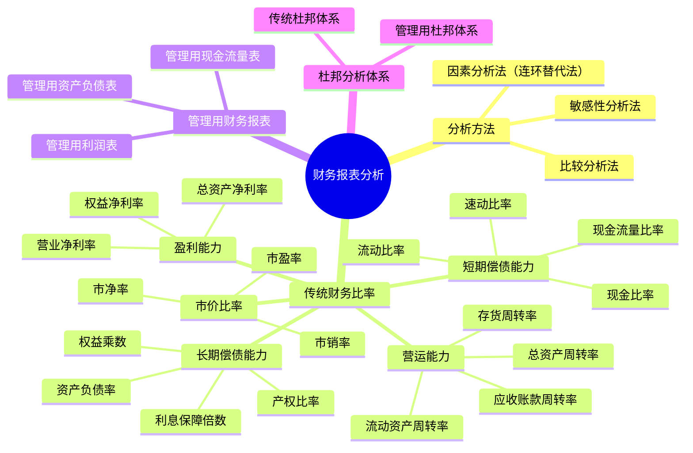

## 📍 章节定位

| 项目 | 信息 |
|------|------|
| **所属科目** | 📊 财务成本管理 |
| **难度等级** | ⭐⭐⭐ |
| **历年分值** | 6-8分 |
| **建议学时** | 6-8h |

## 📝 考情分析

本章是财务成本管理的基础章，也是历年考试的重点章。题型涵盖客观题与主观题，主观题常与第三章财务预测、第九章企业价值评估结合出综合题。核心考点集中于五大类财务比率的计算与含义、管理用财务报表的调整、杜邦分析体系与管理用杜邦体系、因素分析法的连环替代计算。

近年趋势强调管理用财务报表分析（区别于传统财务报表），考生必须熟练掌握经营性资产/负债与金融性资产/负债的划分、经营性损益与金融性损益的区分，以及管理用资产负债表等式：净经营资产 = 净负债 + 股东权益。

## 🧠 知识框架

## 📖 核心精讲

### 一、财务报表分析的目的与方法

#### （一）分析目的

财务报表分析的目的是将财务报表数据转换成有用的信息，帮助报表使用人改善决策。不同的使用人分析目的不同：
- **股权投资人**：决定是否投资、评估企业价值、考察经营者业绩；
- **债权人**：决定是否贷款、评估短期偿债能力和长期偿债能力；
- **管理者**：进行经营决策、改善财务状况；
- **政府**：监管、征税等。

#### （二）分析方法

**1. 比较分析法**：对两个或几个有关的可比数据进行对比，揭示差异和矛盾。按比较对象分为趋势分析、横向比较、预算差异分析。

**2. 因素分析法（连环替代法）**：依据财务指标与其驱动因素的关系，从数量上确定各因素对指标影响程度的方法。

设综合指标 $F$ 受因素 $A, B, C$ 影响，关系为 $F = A \times B \times C$，则：
- 基期（计划）值：$F_0 = A_0 \times B_0 \times C_0$
- 第一次替代：$F_1 = A_1 \times B_0 \times C_0$，因素 $A$ 影响 = $F_1 - F_0$
- 第二次替代：$F_2 = A_1 \times B_1 \times C_0$，因素 $B$ 影响 = $F_2 - F_1$
- 第三次替代：$F_3 = A_1 \times B_1 \times C_1$，因素 $C$ 影响 = $F_3 - F_2$
- 各因素影响合计 = $F_3 - F_0$

**注意**：替代必须按确定的顺序依次进行（通常先数量后价格、先实物后价值），不能随意颠倒。

**3. 敏感性分析法**：分析影响因素变动对目标变量的影响程度。常用方法包括最大最小法和敏感程度法。

$$\text{敏感系数} = \frac{\text{目标变量变动百分比}}{\text{影响因素变动百分比}}$$

敏感系数绝对值大于1为敏感因素，小于1为非敏感因素。

#### （三）财务报表分析的局限性

1. **财务报表信息披露的局限性**：历史成本计价、币值不变假设、谨慎原则、年度分期报告等导致信息不完全。
2. **财务报表信息的可靠性问题**：需关注"危险信号"（财务报告失范、数据异常、关联方交易异常、资本利得金额大、审计报告异常）。
3. **比较基础问题**：同业平均数只具一般参考价值；历史数据代表过去未必合理；预算本身可能不合理。

### 二、财务比率分析

#### （一）短期偿债能力比率

| 指标 | 公式 | 含义 |
|------|------|------|
| 营运资本 | $= \text{流动资产} - \text{流动负债}$ | 正数说明流动资产大于流动负债 |
| 流动比率 | $= \text{流动资产} \div \text{流动负债}$ | 短期偿债能力，一般≥2较安全 |
| 速动比率 | $= \text{速动资产} \div \text{流动负债}$ | 剔除存货后的偿债能力，一般≥1 |
| 现金比率 | $= \text{货币资金} \div \text{流动负债}$ | 立即偿债能力 |
| 现金流量比率 | $= \text{经营活动现金流量净额} \div \text{流动负债}$ | 用经营现金流偿债能力 |

其中速动资产 = 流动资产 - 存货 - 预付款项 - 一年内到期的非流动资产 - 其他流动资产（按教材口径，主要是剔除变现能力差的项目）。

#### （二）长期偿债能力比率

| 指标 | 公式 | 含义 |
|------|------|------|
| 资产负债率 | $= \text{总负债} \div \text{总资产}$ | 总资产中负债占比 |
| 产权比率 | $= \text{总负债} \div \text{股东权益}$ | 负债与权益的关系 |
| 权益乘数 | $= \text{总资产} \div \text{股东权益}$ | 权益的杠杆倍数 |
| 长期资本负债率 | $= \text{非流动负债} \div (\text{非流动负债}+\text{股东权益})$ | 长期资本中负债占比 |
| 利息保障倍数 | $= (\text{净利润}+\text{所得税}+\text{利息费用}) \div \text{利息费用}$ | 用息税前利润保障利息 |
| 现金流量利息保障倍数 | $= \text{经营活动现金流量净额} \div \text{利息费用}$ | 用现金流保障利息 |
| 现金流量与负债比率 | $= \text{经营活动现金流量净额} \div \text{总负债}$ | 用现金流偿债能力 |

**重要关系**：资产负债率、产权比率、权益乘数三者同向变动：
$$\text{权益乘数} = 1 + \text{产权比率} = \frac{1}{1 - \text{资产负债率}}$$

#### （三）营运能力比率

| 指标 | 公式 | 注意 |
|------|------|------|
| 应收账款周转率 | $= \text{营业收入} \div \text{应收账款}$ | 应收账款用未扣减坏账准备的平均余额；实务中也可用赊销额 |
| 存货周转率 | $= \text{营业成本（营业收入）} \div \text{存货}$ | 评估存货管理效率，注意周转天数并非越短越好 |
| 流动资产周转率 | $= \text{营业收入} \div \text{流动资产}$ | — |
| 营运资本周转率 | $= \text{营业收入} \div \text{营运资本}$ | — |
| 非流动资产周转率 | $= \text{营业收入} \div \text{非流动资产}$ | — |
| 总资产周转率 | $= \text{营业收入} \div \text{总资产}$ | 综合反映资产使用效率 |

周转天数 = 365 ÷ 周转率。计算周转率时分子分母口径要匹配，资产用平均余额（期初+期末）÷2。

#### （四）盈利能力比率

| 指标 | 公式 | 含义 |
|------|------|------|
| 营业净利率 | $= \text{净利润} \div \text{营业收入}$ | 每1元营业收入创造的净利润 |
| 总资产净利率 | $= \text{净利润} \div \text{总资产}$ | 资产获利能力 |
| 权益净利率（ROE） | $= \text{净利润} \div \text{股东权益}$ | 股东投资回报率，核心指标 |

#### （五）市价比率

| 指标 | 公式 | 含义 |
|------|------|------|
| 市盈率 | $= \text{每股市价} \div \text{每股收益}$ | 投资者愿为1元净利润支付的价格 |
| 市净率 | $= \text{每股市价} \div \text{每股净资产}$ | — |
| 市销率 | $= \text{每股市价} \div \text{每股营业收入}$ | — |

其中：
- 每股收益（EPS）$= \text{净利润} \div \text{流通在外普通股加权平均股数}$
- 每股净资产 $= \text{普通股股东权益} \div \text{流通在外普通股期末股数}$

### 三、传统杜邦分析体系

杜邦体系以**权益净利率（ROE）**为核心，分解为：

$$\text{权益净利率} = \text{总资产净利率} \times \text{权益乘数} = \text{营业净利率} \times \text{总资产周转率} \times \text{权益乘数}$$

三个驱动因素分别反映企业盈利能力、营运能力和财务杠杆。通过连环替代分析各因素对 ROE 变动的影响。

**传统杜邦体系的局限性**：
1. 计算总资产净利率的"总资产"与"净利润"不匹配，总资产由全部投资者提供，而净利润只属于股东；
2. 没有区分经营活动损益与金融活动损益；
3. 没有区分经营资产与金融资产。

### 四、管理用财务报表分析

为克服传统杜邦体系的局限，将资产、负债、损益均区分为**经营性**和**金融性**两类。

#### （一）管理用资产负债表

基本等式：
$$\text{净经营资产} = \text{净负债} + \text{股东权益}$$

其中：
- **净经营资产（NOA）** = 经营性资产 - 经营性负债
- **净负债（Net Debt）** = 金融性负债 - 金融性资产

**区分原则**：
- **经营性资产/负债**：在销售商品或提供劳务过程中涉及的资产/负债，如应收账款、存货、应付账款等；
- **金融性资产/负债**：筹资活动形成的资产/负债，如交易性金融资产、短期借款、长期借款、应付债券等。
- 货币资金通常列为金融资产（部分教材按经营性需要划分）。

#### （二）管理用利润表

基本等式：
$$\text{净利润} = \text{税后经营净利润} - \text{税后利息费用}$$

其中：
- **税后经营净利润（NOPAT）** $= \text{税前经营利润} \times (1 - \text{所得税税率})$
- **税后利息费用** $= \text{利息费用} \times (1 - \text{所得税税率})$
- 平均所得税税率 $= \text{所得税费用} \div \text{利润总额}$

#### （三）管理用现金流量表

$$\text{实体现金流量} = \text{营业现金毛流量} - \text{营业现金净流量} - \text{资本支出}$$

即：

$$\text{实体现金流量} = \text{税后经营净利润} + \text{折旧摊销} - \text{营业流动资产增加} + \text{营业流动负债增加} - \text{资本支出}$$

简化为：

$$\text{实体现金流量} = \text{税后经营净利润} - \text{净经营资产增加}$$

实体现金流量是企业全部现金流入扣除成本费用和必要投资后剩余的可提供给所有投资人（股东和债权人）的现金流量。

**融资现金流量**：
$$\text{债务现金流量} + \text{股权现金流量} = \text{实体现金流量}$$

- **债务现金流量** $= \text{税后利息费用} - \text{净负债增加}$
- **股权现金流量** $= \text{股利分配} - \text{股权资本发行} + \text{股权回购} = \text{净利润} - \text{股东权益增加}$

#### （四）管理用杜邦分析体系

$$\text{权益净利率} = \text{净经营资产净利率} + (\text{净经营资产净利率} - \text{税后利息率}) \times \text{净财务杠杆}$$

即：

$$\text{ROE} = r_{NOA} + (r_{NOA} - r_d^{after}) \times \frac{\text{净负债}}{\text{股东权益}}$$

其中：
- **净经营资产净利率** $= \text{税后经营净利润} \div \text{净经营资产}$
- **税后利息率** $= \text{税后利息费用} \div \text{净负债}$
- **净财务杠杆** $= \text{净负债} \div \text{股东权益}$
- **经营差异率** $= \text{净经营资产净利率} - \text{税后利息率}$
- **杠杆贡献率** $= \text{经营差异率} \times \text{净财务杠杆}$

**关键结论**：只有当净经营资产净利率高于税后利息率（经营差异率为正）时，借款才会增加股东报酬；否则借款会损害股东利益。

## 💡 典型例题

**【例题 1】（计算题）**

ABC 公司 20×1 年有关数据如下：营业收入 3000 万元，营业成本 2644 万元，净利润 136 万元，年末总资产 2000 万元（年初 1680 万元），年末股东权益 960 万元（年初 880 万元）。

要求：计算营业净利率、总资产周转率、权益乘数和权益净利率（资产负债表按平均数计算）。

**答案**：

- 营业净利率 $= 136 \div 3000 = 4.53\%$
- 总资产平均余额 $= (1680 + 2000) \div 2 = 1840$（万元）
- 总资产周转率 $= 3000 \div 1840 = 1.63$（次）
- 权益乘数 $= 1840 \div [(880 + 960) \div 2] = 1840 \div 920 = 2.0$
- 权益净利率 $= 4.53\% \times 1.63 \times 2.0 = 14.78\%$

**解析**：杜邦体系核心是权益净利率 = 营业净利率 × 总资产周转率 × 权益乘数。注意资产负债表项目用平均余额。

---

**【例题 2】（计算题）**

某公司税后经营净利润 600 万元，净负债 1000 万元，股东权益 2000 万元，税后利息费用 50 万元。计算净经营资产净利率、税后利息率、经营差异率、净财务杠杆、杠杆贡献率、权益净利率。

**答案**：

- 净经营资产 $= 1000 + 2000 = 3000$（万元）
- 净经营资产净利率 $= 600 \div 3000 = 20\%$
- 税后利息率 $= 50 \div 1000 = 5\%$
- 经营差异率 $= 20\% - 5\% = 15\%$
- 净财务杠杆 $= 1000 \div 2000 = 0.5$
- 杠杆贡献率 $= 15\% \times 0.5 = 7.5\%$
- 权益净利率 $= 20\% + 7.5\% = 27.5\%$

**解析**：管理用杜邦体系核心公式：权益净利率 = 净经营资产净利率 + (净经营资产净利率 - 税后利息率) × 净财务杠杆。

## 🎯 记忆口诀

**短期偿债"流、速、现"**：流动比率扣存货得速动，再扣应收得现金。

**三大杠杆关系**：
> 权益乘数 = 1 + 产权比率 = 1 / (1 - 资产负债率)。

**管理用杜邦"三件套"**：
> 净经营资产净利率 减 税后利息率 = 经营差异率；
> 经营差异率 乘 净财务杠杆 = 杠杆贡献率；
> 净经营资产净利率 加 杠杆贡献率 = 权益净利率。

**经营差异率为正才借债**：借款增值的前提是经营报酬高于利息。

## ✅ 同步练习

**1.（单选题）** 下列指标中，属于短期偿债能力比率的是（　）。

A. 资产负债率
B. 利息保障倍数
C. 现金流量比率
D. 权益乘数

**2.（单选题）** 在其他条件不变的情况下，下列会引起权益乘数提高的是（　）。

A. 赊购原材料一批
B. 用银行存款偿还短期借款
C. 接受投资者投入货币资金
D. 发行债券回购股票

**3.（多选题）** 下列关于管理用财务报表的说法中，正确的有（　）。

A. 净经营资产 = 净负债 + 股东权益
B. 实体现金流量 = 债务现金流量 + 股权现金流量
C. 净利润 = 税后经营净利润 - 税后利息费用
D. 货币资金一律列为经营性资产

**4.（计算题）** 某公司管理用资产负债表数据：年末净经营资产 5000 万元，净负债 2000 万元；管理用利润表数据：税后经营净利润 800 万元，税后利息费用 100 万元。要求计算净经营资产净利率、税后利息率、经营差异率、净财务杠杆、杠杆贡献率和权益净利率。

**5.（单选题）** 在管理用杜邦分析体系中，下列因素变动不会影响杠杆贡献率的是（　）。

A. 净经营资产净利率
B. 税后利息率
C. 净财务杠杆
D. 营业净利率

---

**练习答案**：1.C　2.A　3.ABC　4. 净经营资产净利率16%、税后利息率5%、经营差异率11%、净财务杠杆0.67、杠杆贡献率7.33%、权益净利率23.33%　5.D
