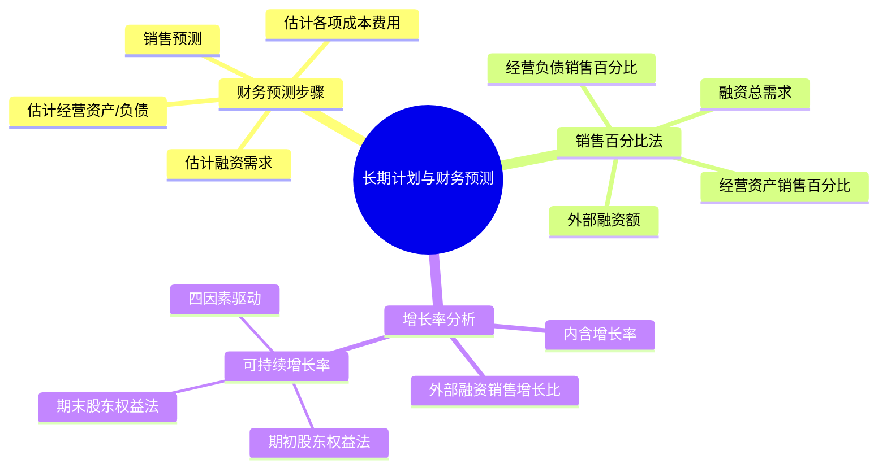

## 1. 章节定位

| 项目 | 信息 |
|------|------|
| 所属科目 | 财务成本管理 |
| 难度等级 | 3 |
| 历年分值 | 5-7分 |
| 建议学时 | 5-6h |

## 2. 考情分析

本章核心考点为销售百分比法预测外部融资需求、外部融资销售增长比、内含增长率和可持续增长率两大增长率的计算，分值约 5-7 分。题型以主观计算题为主，常与人价值评估、资本成本结合出综合题。

**命题规律**：
1. 销售百分比法预测外部融资额是高频考点，常以综合题形式出现；
2. 可持续增长率与内含增长率的区分与计算几乎每年必考；
3. 可持续增长率四因素分解与连环替代分析是难点；
4. 超常增长（实际增长率高于可持续增长率）的财务含义常以概念题考查。

近年考查重点放在可持续增长率的两种计算口径（期初权益法与期末权益法）、可持续增长条件下各项财务政策变化对增长率的影响、以及实际增长率与可持续增长率的差异分析。考生须熟练掌握四个驱动因素（营业净利率、期末总资产周转次数、期末总资产权益乘数、利润留存率）的分解与连环替代。

本章学习与第二章财务报表分析（管理用财务报表）紧密相关，是第三章企业价值评估（现金流量预测）和第九章企业价值评估的输入。

## 3. 知识框架

## 4. 核心精讲

### 一、长期计划与财务预测概述

**长期计划**是指一年以上的计划，通常 5 年或更长，是企业战略规划的具体化。长期计划包括：
- **经营计划**：以市场份额、销售增长、产品开发等为核心；
- **财务计划**：以资本支出、筹资计划、股利分配等为核心。

**财务预测**是财务计划的核心环节，目的是预测企业未来所需的资金，为筹资决策提供依据。财务预测的步骤：
1. **销售预测**：财务预测的起点，决定后续所有预测；
2. **估计经营资产和经营负债**：根据销售百分比或回归分析预测；
3. **估计各项成本费用**：根据历史成本率预测；
4. **估计融资需求**：根据资产、负债、利润预测外部融资额。

**财务预测的方法**：
- **销售百分比法**：最常用，假设各项经营资产/负债与营业收入保持稳定百分比；
- **回归分析法**：利用历史数据建立资产/负债与销售收入的回归方程，更精确；
- **计算机预测**：通过财务模型（如 Excel）模拟多种情景。

### 二、财务预测的销售百分比法

#### （一）基本假设

销售百分比法假设各项经营资产和经营负债与营业收入保持稳定的百分比关系。预测步骤如下：

1. **确定资产和负债的销售百分比**：根据基期数据计算各项经营资产/负债占营业收入的百分比。
2. **预计各项经营资产和经营负债**：
   $$\text{预计某项经营资产} = \text{预计营业收入} \times \text{该资产销售百分比}$$
3. **计算融资总需求（预计净经营资产增加）**：
   $$\text{融资总需求} = \text{预计经营资产合计} - \text{预计经营负债合计} - (\text{基期经营资产合计} - \text{基期经营负债合计})$$
   即：
   $$\text{融资总需求} = \text{预计净经营资产} - \text{基期净经营资产}$$
4. **预计可动用金融资产**：从融资需求中扣减可动用的金融资产。
5. **预计增加的留存收益**：
   $$\text{留存收益增加} = \text{预计营业收入} \times \text{预计营业净利率} \times (1 - \text{预计股利支付率})$$
6. **预计外部融资额**：
   $$\text{外部融资额} = \text{融资总需求} - \text{可动用金融资产} - \text{留存收益增加}$$

#### （二）销售百分比法的局限

1. 假设各项经营资产和经营负债与营业收入保持稳定百分比，可能与事实不符；
2. 若不采用迭代法，假设预计营业净利率可以覆盖借款利息的增加，未必合理。

#### （三）销售百分比法的完整示例

**例**：ABC 公司 20×1 年实际数据如下：
- 营业收入 3000 万元；
- 年末经营资产 2000 万元（其中：应收账款 600、存货 800、固定资产 600）；
- 年末经营负债 200 万元（应付账款）；
- 营业净利率 10%，股利支付率 40%；
- 年末可动用金融资产 50 万元。

预计 20×2 年营业收入增长 20%（即达到 3600 万元），各项经营资产/负债与营业收入的百分比保持不变。

**计算步骤**：

1. **经营资产销售百分比** = 2000 / 3000 = 66.67%
2. **经营负债销售百分比** = 200 / 3000 = 6.67%
3. **预计 20×2 年经营资产** = 3600 × 66.67% = 2400（万元）
4. **预计 20×2 年经营负债** = 3600 × 6.67% = 240（万元）
5. **基期净经营资产** = 2000 − 200 = 1800（万元）
6. **预计净经营资产** = 2400 − 240 = 2160（万元）
7. **融资总需求** = 2160 − 1800 = 360（万元）
8. **预计留存收益增加** = 3600 × 10% × (1 − 40%) = 216（万元）
9. **外部融资额** = 360 − 50（可动用金融资产） − 216 = **94（万元）**

**结论**：ABC 公司 20×2 年需要外部融资 94 万元。

### 三、外部融资销售增长比

外部融资销售增长比指外部融资额与营业收入增加额的比值。在可动用金融资产为0的假设下：

$$\text{外部融资销售增长比} = \frac{\text{经营资产}}{\text{销售百分比}} - \frac{\text{经营负债}}{\text{销售百分比}} - \left[\frac{1 + g}{g}\right] \times \text{预计营业净利率} \times (1 - \text{预计股利支付率})$$

其中 $g$ 为销售增长率。

**公式推导**：

外部融资额 = 融资总需求 − 留存收益增加
= (经营资产销售百分比 − 经营负债销售百分比) × 营业收入增加 − 营业收入 × (1+g) × 营业净利率 × 利润留存率

外部融资销售增长比 = 外部融资额 / 营业收入增加
= (经营资产销售百分比 − 经营负债销售百分比) − [(1+g)/g] × 营业净利率 × 利润留存率

**重要结论**：
- 外部融资销售增长比 > 0，说明需要外部融资；
- 外部融资销售增长比 = 0，说明仅靠内部留存收益即可支持增长，此时增长率即为**内含增长率**；
- 外部融资销售增长比 < 0，说明资金有结余，可用于增加股利、回购股票或偿还债务。

**外部融资销售增长比与增长率的关系**：
- 增长率较低时，留存收益增加较多，外部融资需求较低（甚至为负）；
- 增长率较高时，留存收益增加不足以支持资产扩张，外部融资需求为正；
- 增长率与外部融资销售增长比同向变动（在其他因素不变时）。

**例**：某公司经营资产销售百分比 60%，经营负债销售百分比 10%，预计营业净利率 8%，股利支付率 50%（利润留存率 50%）。计算销售增长率分别为 5%、10%、20% 时的外部融资销售增长比。

- g = 5%：外部融资销售增长比 = (60% − 10%) − [(1+5%)/5%] × 8% × 50% = 50% − 21 × 4% = 50% − 84% = −34%（资金结余）
- g = 10%：外部融资销售增长比 = 50% − [(1+10%)/10%] × 4% = 50% − 11 × 4% = 50% − 44% = 6%（需外部融资）
- g = 20%：外部融资销售增长比 = 50% − [(1+20%)/20%] × 4% = 50% − 6 × 4% = 50% − 24% = 26%（需外部融资更多）

可见，增长率越高，外部融资销售增长比越大，外部融资需求越多。

### 四、内含增长率

内含增长率是指只靠内部积累（即增加留存收益）实现的销售增长率，即外部融资额为0时的销售增长率。

令外部融资销售增长比 = 0，可解得：

$$g_{\text{内含}} = \frac{\text{预计营业净利率} \times \text{利润留存率} \times \frac{\text{净经营资产}}{\text{营业收入}}}{1 - \text{预计营业净利率} \times \text{利润留存率} \times \frac{\text{净经营资产}}{\text{营业收入}}}$$

或写成（记 $\frac{\text{净经营资产}}{\text{营业收入}} = \frac{1}{\text{净经营资产周转率}}$）：

$$g_{\text{内含}} = \frac{\text{营业净利率} \times \text{利润留存率} \times \text{净经营资产周转次数}}{1 - \text{营业净利率} \times \text{利润留存率} \times \text{净经营资产周转次数}}$$

**含义**：在内含增长率下，企业不发行新股、不增加借款（指金融性负债），仅靠经营负债自然增长和留存收益增长支持销售增长。

**例**：某公司净经营资产周转次数为 2 次（即净经营资产/营业收入 = 50%），营业净利率 8%，利润留存率 60%。计算内含增长率。

$$g_{\text{内含}} = \frac{8\% \times 60\% \times 2}{1 - 8\% \times 60\% \times 2} = \frac{9.6\%}{1 - 9.6\%} = \frac{9.6\%}{90.4\%} = 10.62\%$$

即公司仅靠内部积累，最高可支持 10.62% 的销售增长率。

**内含增长率 vs 可持续增长率**：

| 项目 | 内含增长率 | 可持续增长率 |
|------|-----------|--------------|
| 是否发行新股 | 不发行 | 不发行 |
| 是否增加借款 | 不增加 | 增加（保持负债权益比不变） |
| 经营效率 | 可变 | 不变（净利率、周转率不变） |
| 财务政策 | 利润留存率不变 | 利润留存率、权益乘数不变 |
| 大小关系 | 通常小于可持续增长率 | 通常大于内含增长率 |

**关键理解**：内含增长率是"不借债"的增长上限，可持续增长率是"借债但保持资本结构"的增长上限。可持续增长率允许公司按比例增加借款，故通常高于内含增长率。

### 五、可持续增长率

#### （一）概念

**可持续增长率**是指不发行新股、不改变经营效率（盈利能力和资产周转率不变）和财务政策（负债权益比和利润留存率不变）时，销售所能达到的最大增长率。

可持续增长率的假设条件：
1. 不发行新股；
2. 营业净利率不变；
3. 资产周转率不变；
4. 权益乘数（或总资产/期末权益）不变；
5. 利润留存率不变。

在上述假设下，可持续增长率等于股东权益增长率，也等于销售增长率。

#### （二）期初股东权益法

$$g_{\text{可持续}} = \frac{\text{本期净利润} \times \text{本期利润留存率}}{\text{期初股东权益}}$$

分解为四个驱动因素：

$$g_{\text{可持续}} = \text{营业净利率} \times \text{期末总资产周转次数} \times \text{期末总资产} \div \text{期初股东权益} \times \text{利润留存率}$$

#### （三）期末股东权益法

全部用期末数和本期发生额计算，分子分母同除以期末股东权益：

$$g_{\text{可持续}} = \frac{\text{营业净利率} \times \text{期末总资产周转次数} \times \text{期末总资产权益乘数} \times \text{利润留存率}}{1 - \text{营业净利率} \times \text{期末总资产周转次数} \times \text{期末总资产权益乘数} \times \text{利润留存率}}$$

记四个驱动因素的乘积为 $R$：

$$R = \text{营业净利率} \times \text{期末总资产周转次数} \times \text{期末总资产权益乘数} \times \text{利润留存率}$$

则：

$$g_{\text{可持续}} = \frac{R}{1 - R}$$

注意：这里的"期末总资产权益乘数"用期末股东权益计算。

#### （四）可持续增长率与实际增长率的关系

| 条件 | 实际增长率与可持续增长率关系 |
|------|------------------------------|
| 四个比率均不变，不发行新股 | 实际增长率 = 可持续增长率（本年与上年均等于本年可持续增长率） |
| 四个比率中某一个或多个比上年提高 | 本年实际增长率 > 本年可持续增长率 > 上年可持续增长率 |
| 四个比率中某一个或多个比上年下降 | 本年实际增长率 < 本年可持续增长率 < 上年可持续增长率 |
| 四个比率中某一个或多个比上年提高，但本年发行新股 | 本年可持续增长率 = 上年可持续增长率（因为发行新股使权益增加，但其他比率不变时本期权益增长率不变） |

**关键结论**：超常增长（实际增长率高于可持续增长率）的代价是必须改变财务政策或经营效率，或发行新股，否则无法持续。

**超常增长的财务含义**：

如果公司希望实际增长率持续高于可持续增长率，必须采取以下措施之一或组合：
1. **提高营业净利率**：通过提价、降本增效；
2. **提高总资产周转率**：加快资产周转，提高资产使用效率；
3. **提高权益乘数**：增加负债比例（但会提高财务风险）；
4. **提高利润留存率**：减少股利分配，增加内部筹资；
5. **发行新股**：增加权益资本（但教材可持续增长率假设不发行新股）。

如果以上措施均不采取，超常增长将导致资金短缺，最终无法持续。

#### （五）可持续增长率的完整示例

**例**：某公司本年数据如下：
- 营业收入 5000 万元；
- 年末总资产 4000 万元；
- 年末股东权益 2000 万元；
- 净利润 400 万元；
- 利润留存率 50%。

要求：用期末股东权益法计算可持续增长率，并分析各因素影响。

**答案**：

(1) 计算四个驱动因素：
- 营业净利率 = 400 / 5000 = 8%
- 期末总资产周转次数 = 5000 / 4000 = 1.25（次）
- 期末总资产权益乘数 = 4000 / 2000 = 2
- 利润留存率 = 50%

(2) 计算四因素乘积：
$$R = 8\% \times 1.25 \times 2 \times 50\% = 10\%$$

(3) 计算可持续增长率：
$$g = \frac{R}{1 - R} = \frac{10\%}{1 - 10\%} = \frac{10\%}{90\%} = 11.11\%$$

(4) **验证**（期初权益法）：
- 本期留存收益 = 400 × 50% = 200（万元）
- 期初股东权益 = 2000 − 200 = 1800（万元）
- 可持续增长率 = 200 / 1800 = 11.11%

(5) **如果希望下年增长率提高至 20%**，需通过改变经营效率或财务政策实现。例如，若其他因素不变，提高利润留存率至 $r$：

$$20\% = \frac{8\% \times 1.25 \times 2 \times r}{1 - 8\% \times 1.25 \times 2 \times r}$$

$$0.2 \times (1 - 0.2r) = 0.2r$$
$$0.2 - 0.04r = 0.2r$$
$$0.2 = 0.24r$$
$$r = 83.33\%$$

即需将利润留存率从 50% 提高至 83.33%，股利支付率从 50% 降至 16.67%。

### 六、增长率的影响因素分析

通过连环替代分析四个驱动因素对可持续增长率变动的影响：

1. **营业净利率**：反映盈利能力；
2. **总资产周转次数**：反映营运能力；
3. **权益乘数**：反映财务杠杆；
4. **利润留存率**：反映股利政策。

这四个因素与可持续增长率同向变动。

**连环替代示例**：

某公司上年与本年四因素数据如下（假设无发行新股）：

| 因素 | 上年 | 本年 |
|------|------|------|
| 营业净利率 | 5% | 6% |
| 总资产周转次数 | 2.0 | 2.0 |
| 权益乘数 | 2.0 | 2.0 |
| 利润留存率 | 50% | 50% |

- 上年 R = 5% × 2 × 2 × 50% = 10%，g₀ = 10% / 90% = 11.11%
- 本年 R = 6% × 2 × 2 × 50% = 12%，g₁ = 12% / 88% = 13.64%
- 差异 = 13.64% − 11.11% = +2.53%

仅营业净利率变化：
- 替代营业净利率：R' = 6% × 2 × 2 × 50% = 12%
- g' = 12% / 88% = 13.64%
- 影响 = 13.64% − 11.11% = **+2.53%**（与总差异一致，因其他因素未变）

**结论**：营业净利率从 5% 提高至 6%，使可持续增长率从 11.11% 提高至 13.64%，提升了 2.53 个百分点。

### 七、财务预测的局限与改进

**销售百分比法的局限**：
1. 假设各项经营资产和经营负债与营业收入保持稳定百分比，但实际中存在规模经济、批量采购等因素，可能使百分比变化；
2. 假设预计营业净利率可以覆盖借款利息的增加，但实际中若大量增加借款，利息费用上升会降低净利率，需用迭代法求解；
3. 未考虑资产产能瓶颈——当生产能力饱和时，销售增长需要大额固定资产投资，资产销售百分比会跳跃式变化。

**改进方法**：
- **回归分析法**：用历史数据建立资产/负债与销售收入的回归方程，更精确反映非线性关系；
- **迭代法**：考虑借款增加对利息、净利润的影响，多次迭代直至收敛；
- **情景分析**：分别预测乐观、正常、悲观三种情景下的融资需求；
- **敏感性分析**：分析关键变量（销售增长率、营业净利率）变动对融资需求的影响。

**可持续增长率的局限**：
1. 假设过于严格——现实中经营效率和财务政策很难长期保持不变；
2. 仅适用于稳定增长的企业，初创期或衰退期企业不适用；
3. 忽略外部环境变化（如经济周期、行业竞争）对企业增长的影响。

**实务应用**：可持续增长率作为"参考基准"使用，管理者应对比实际增长率与可持续增长率的差异，分析超常增长或低增长的财务原因，并据此调整经营和财务策略。

## 5. 典型例题

**【例题 1】（计算题）**

某公司 20×1 年营业收入 3000 万元，年末净经营资产 2000 万元，预计 20×2 年营业收入增长率为 20%，营业净利率 10%，股利支付率 40%。假设经营资产销售百分比为 66.67%，经营负债销售百分比为 9.27%，可动用金融资产为0。

要求：计算 20×2 年外部融资额。

**答案**：

- 营业收入增加 $= 3000 \times 20\% = 600$（万元）
- 融资总需求 $= (66.67\% - 9.27\%) \times 600 = 57.40\% \times 600 = 344.4$（万元）
- 留存收益增加 $= 3000 \times (1 + 20\%) \times 10\% \times (1 - 40\%) = 3600 \times 6\% = 216$（万元）
- 外部融资额 $= 344.4 - 0 - 216 = 128.4$（万元）

**解析**：销售百分比法的核心是融资总需求 = 预计净经营资产增加 = (经营资产销售百分比 - 经营负债销售百分比) × 营业收入增加。

---

**【例题 2】（计算题）**

某公司本年营业净利率 5%，期末总资产周转次数 2.5 次，期末总资产权益乘数 2，利润留存率 60%。计算可持续增长率。

**答案**：

四个驱动因素乘积：

$$R = 5\% \times 2.5 \times 2 \times 60\% = 15\%$$

可持续增长率：

$$g = \frac{R}{1 - R} = \frac{15\%}{1 - 15\%} = \frac{15\%}{85\%} = 17.65\%$$

**解析**：使用期末股东权益法，先计算四因素乘积 R，再用 g = R/(1-R) 求解。

---

**【例题 3】（计算题·内含增长率）**

某公司净经营资产 1500 万元，营业收入 3000 万元，营业净利率 6%，利润留存率 70%。要求：计算内含增长率。

**答案**：

净经营资产周转次数 = 3000 / 1500 = 2（次）

$$g_{\text{内含}} = \frac{6\% \times 70\% \times 2}{1 - 6\% \times 70\% \times 2} = \frac{8.4\%}{1 - 8.4\%} = \frac{8.4\%}{91.6\%} = 9.17\%$$

**解析**：内含增长率公式中只涉及三个因素：营业净利率、利润留存率、净经营资产周转次数（注意不是权益乘数）。这是因为内含增长率假设不增加借款，故不涉及权益乘数。

---

**【例题 4】（计算题·超常增长分析）**

某公司本年可持续增长率为 10%，下年实际希望达到 20% 的销售增长率，不发行新股。要求：分析若仅通过提高权益乘数实现超常增长，需将权益乘数提高多少？

假设本年四因素为：营业净利率 5%，总资产周转率 2，权益乘数 1.5，利润留存率 60%。

**答案**：

本年可持续增长率：
$$R_0 = 5\% \times 2 \times 1.5 \times 60\% = 9\%$$
$$g_0 = 9\% / (1 - 9\%) = 9.89\%$$

（题中给定 10%，差异源于数据简化，按公式计算）

下年希望 g = 20%，即 R = 20% / (1 + 20%) = 16.67%

设新权益乘数为 $E$，其他三因素不变：

$$5\% \times 2 \times E \times 60\% = 16.67\%$$
$$0.06 \times E = 16.67\%$$
$$E = 2.78$$

即需将权益乘数从 1.5 提高至 2.78，意味着大幅增加负债。

**解析**：超常增长需要改变财务政策。提高权益乘数（增加负债）会同时提高财务风险，可能不可持续。

---

**【例题 5】（计算题·外部融资销售增长比）**

某公司经营资产销售百分比 70%，经营负债销售百分比 15%，预计营业净利率 10%，股利支付率 40%。要求：计算销售增长率 15% 时的外部融资销售增长比和外部融资额（基期营业收入 5000 万元）。

**答案**：

(1) 外部融资销售增长比：
$$= (70\% - 15\%) - \frac{1+15\%}{15\%} \times 10\% \times (1-40\%)$$
$$= 55\% - \frac{1.15}{0.15} \times 6\%$$
$$= 55\% - 7.667 \times 6\%$$
$$= 55\% - 46\% = 9\%$$

(2) 外部融资额：
- 营业收入增加 = 5000 × 15% = 750（万元）
- 外部融资额 = 750 × 9% = **67.5（万元）**

**解析**：外部融资销售增长比乘以营业收入增加额即得外部融资额（在可动用金融资产为0时）。

## 6. 记忆口诀

**内含增长率 vs 可持续增长率**：
> 内含不借不发股，仅靠留存和经营负债自然增长；
> 可持续不发股，效率政策都不变，权益同速长。
> 内含三因素：净利、留存、周转；
> 可持续四因素：加权益乘数。
> 内含小于可持续（不借债自然低于借债）。

**可持续四因素**：
> 净利、周转、权益乘、留存——四个比率连乘 R；
> g = R / (1 - R)；
> 期初权益法：g = 留存收益 / 期初权益。

**超常增长"三选一"**：要超常，要么改经营效率（净利率、周转率），要么改财务政策（负债率、留存率），要么发新股。

**销售百分比法步骤**：
> 一算销售百分比，二估资产和负债；
> 三算融资总需求（净经营资产增加）；
> 四扣可动用金融资产和留存收益，得外部融资额。

**外部融资销售增长比**：
> (经营资产% − 经营负债%) − [(1+g)/g] × 净利率 × 留存率；
> 等于零时增长率即为内含增长率。

**实际增长率与可持续增长率关系**：
> 四因素不变且不发股，实际 = 可持续；
> 四因素提高不发股，实际 > 可持续 > 上年可持续；
> 四因素下降不发股，实际 < 可持续 < 上年可持续；
> 发股则本年可持续 = 上年可持续（其他不变时）。

**两法验证**：
> 期末法 g = R/(1−R)；
> 期初法 g = 本期留存 / 期初权益；
> 两种方法结果应一致。

## 7. 同步练习

**1.（单选题）** 在其他条件不变的情况下，下列会使外部融资销售增长比下降的是（　）。

A. 提高股利支付率
B. 提高预计营业净利率
C. 提高经营资产销售百分比
D. 降低经营负债销售百分比

**2.（单选题）** 某公司经营资产销售百分比为 60%，经营负债销售百分比为 10%，预计营业净利率 8%，股利支付率 50%，可动用金融资产为0，则内含增长率为（　）。

A. 6.38%
B. 7.14%
C. 8.70%
D. 9.41%

**3.（多选题）** 下列关于可持续增长率的说法中，正确的有（　）。

A. 在可持续增长条件下，本年实际增长率等于本年可持续增长率
B. 可持续增长率等于股东权益增长率
C. 若四个驱动因素之一提高且不发行新股，则本年实际增长率高于本年可持续增长率
D. 若本年发行新股，则本年可持续增长率高于上年可持续增长率

**4.（计算题）** 某公司本年营业收入 5000 万元，年末总资产 4000 万元，年末股东权益 2000 万元，营业净利率 8%，利润留存率 50%。计算期末总资产周转次数、期末总资产权益乘数、可持续增长率。

**5.（单选题）** 下列各项中，能够支持企业销售增长且不增加财务风险、不消耗财务资源的是（　）。

A. 完全依靠内部资本增长
B. 主要依靠外部资本增长
C. 平衡增长（可持续增长）
D. 发行新股筹资增长

**6.（多选题）** 下列关于可持续增长率假设条件的说法中，正确的有（　）。

A. 不发行新股
B. 营业净利率不变
C. 资产周转率不变
D. 利润留存率不变

**7.（单选题）** 在其他条件不变的情况下，下列会使可持续增长率提高的是（　）。

A. 提高股利支付率
B. 降低营业净利率
C. 提高权益乘数
D. 降低总资产周转率

**8.（计算题）** 某公司本年净利润 600 万元，年初股东权益 4000 万元，年末股东权益 4600 万元，利润留存率 50%。要求：分别用期初权益法和期末权益法计算可持续增长率。

**9.（判断题）** 在可持续增长条件下，若四个驱动因素之一提高且不发行新股，则本年实际增长率高于本年可持续增长率。（　）

**10.（单选题）** 下列关于内含增长率的说法中，错误的是（　）。

A. 内含增长率是外部融资额为0时的销售增长率
B. 内含增长率假设不发行新股、不增加金融性负债
C. 内含增长率通常高于可持续增长率
D. 内含增长率仅靠经营负债自然增长和留存收益增长支持

**11.（单选题）** (2019年) 甲公司处于可持续增长状态，2019年初总资产为1000万元，总负债为200万元，预计2019年净利润为100万元，股利支付率为20%，则甲公司2019年可持续增长率为（　）。

A. 2.5%
B. 8%
C. 10%
D. 11.1%

**12.（多选题）** 在企业可持续增长的情况下，下列计算各相关项目的本期增加额的公式中，正确的有（　）。

A. 本期资产增加 = (本期营业收入增加/基期营业收入) × 基期期末总资产
B. 本期负债增加 = 基期营业收入 × 营业净利率 × 利润留存率 × (基期期末负债/基期期末股东权益)
C. 本期股东权益增加 = 基期营业收入 × 营业净利率 × 利润留存率
D. 本期营业收入增加 = 基期营业收入 × (基期净利润/基期期初股东权益) × 利润留存率

**13.（多选题）** (2022年) 假设其他因素不变，下列变动中会导致企业内含增长率提高的有（　）。

A. 预计营业净利率的增加
B. 预计股利支付率的增加
C. 经营负债销售百分比的增加
D. 经营资产销售百分比的增加

**14.（多选题）** (2021年) 甲公司2021年保持2020年的经营效率（营业净利率、总资产周转率）和财务政策（权益乘数、股利支付率）不变，不增发新股或回购股票。那么下列关于2020年、2021年的可持续增长率和实际增长率之间关系的表述正确的有（　）。

A. 2021年可持续增长率等于2021年实际增长率
B. 2020年可持续增长率等于2021年实际增长率
C. 2020年实际增长率等于2020年可持续增长率
D. 2020年实际增长率等于2021年可持续增长率

**15.（单选题）** (2024年) 某贸易公司物流费用为混合成本，公司按照弹性预算法编制预算，当物流运输量为基准量的80%、100%、110%、120%时，对应的物流费用分别为896万元、920万元、932万元、944万元，当物流运输量为基准量的107%时，预计物流费用为（　）万元。

A. 930.4
B. 927.4
C. 929.4
D. 928.4

**16.（单选题）** (2024年) 下列关于弹性预算的表述中错误的是（　）。

A. 实际成本与当期实际业务水平下应发生成本的差额称为支出差异
B. 实际收入与当期实际业务水平下应实现收入的差额称为作业量差异
C. 编制弹性预算应选用最能代表生产经营活动水平的业务量计量单位
D. 成本性态分析是编制弹性预算的基础

**17.（单选题）** (2023年) 甲公司编制直接材料预算，各季度末的材料存量是下一季度生产需要量的10%，单位产品材料用量6千克/件。第二季度生产2000件，材料采购量12600千克。则第三季度生产的材料需要量为（　）千克。

A. 6000
B. 16000
C. 11000
D. 18000

**18.（单选题）** (2022年) 甲公司正在编制2023年各季度销售预算。销售货款当季度收回70%，下季度收回25%，下下季度收回5%。2023年初应收账款余额3000万元，其中，2022年第三季度的销售形成的应收账款为600万元，第四季度销售形成的应收账款为2400万元。2023年第一季度预计销售收入6000万元。2023年第一季度预计现金收入是（　）万元。

A. 6600
B. 6800
C. 5400
D. 7200

**19.（单选题）** (2020年) 甲公司正在编制直接材料预算，预计采购货款第一季度5000元，第二季度8000元，第三季度9000元，第四季度10000元。采购货款的60%在本季度内付清，另外40%在下季度付清。假设年初应付账款2000元，预计全年直接材料采购现金支出是（　）元。

A. 30000
B. 28000
C. 32000
D. 34000

**20.（单选题）** (2019年) 甲公司正在编制直接材料预算，预计单位产成品材料消耗量10千克；材料价格50元/千克，第一季度期初、期末材料存货分别为500千克和550千克；第一季度、第二季度产成品销量分别为200件和250件；期末产成品存货按下季度销量10%安排。预计第一季度材料采购金额是（　）元。

A. 102500
B. 105000
C. 130000
D. 100000

**21.（多选题）** (2024年) 甲公司预计生产销售新产品，一月、二月、三月生产量分别是5万件、6万件、7万件，单价为10元/件。当月销售的当月收现60%，次月收现40%，销量分别是当月生产量的70%、上月生产量的20%、上上月生产量的10%。则下列说法正确的有（　）。

A. 3月预计收取现金60.4万元
B. 3月末预计应收账款余额为26.4万元
C. 3月末预计产成品库存数量为3.8万件
D. 3月的销售额为66万元

**22.（多选题）** (2024年) 甲公司预算和实际情况如下（数量单位：万件，单价单位：元，成本单位：元）：预算数量90、单价60、成本90×60；实际数量100、单价50、成本100×80。下列说法中正确的有（　）。

A. 收入差异为-1000万元
B. 税前经营利润的作业量差异为零
C. 税前经营利润收入支出差异为负的300万元
D. 成本费用的作业量差异为600万元

**23.（多选题）** (2023年) 下列关于弹性预算差异的表述中，正确的有（　）。

A. 收入差异是实际收入与实际业务量预算收入的差异
B. 弹性预算反映的是实际业务量水平下应发生的金额
C. 支出差异是固定预算成本与实际业务量应发生成本的差异
D. 作业量差异是由实际业务量与固定预算业务量不同形成的差异

**24.（多选题）** (2020年) 企业在编制直接材料预算时，需要估计各季度材料采购的现金支出额，影响该金额的因素有（　）。

A. 材料采购单价
B. 预计材料库存量
C. 供货商提供的信用政策
D. 预计产量

**25.（多选题）** (2019年) 编制直接人工预算时，影响直接人工总成本的因素有（　）。

A. 预计直接人工工资率
B. 预计车间辅助人员工资
C. 预计单位产品直接人工工时
D. 预计产量

**26.（多选题）** (2017年) 甲公司正在编制全面预算。下列各项中，以生产预算为编制基础的有（　）。

A. 销售预算
B. 直接材料预算
C. 直接人工预算
D. 变动制造费用预算

---

**练习答案**：1.B　2.B　3.ABC　4. 周转次数1.25、权益乘数2、可持续增长率11.11%　5.C　6.ABCD　7.C（提高权益乘数即增加负债比例，可提高可持续增长率）　8. 期初法 = 600×50% / 4000 = 7.5%；期末法：R = (600/5000) × (5000/4600) × (4600/4600) × 50% ×... 假设营业收入 5000 万元，则 R = (600/5000) × (5000/4600) × (4600/4600) × 50% ≈ 0.0652，g ≈ 6.97%（注意两法需营业数据齐备才一致，本题若仅给权益数据则期初法更直接）　9.正确　10.C（内含增长率通常低于可持续增长率，因为可持续增长率允许增加借款）　11.C（期初股东权益 = 1000−200 = 800万元；可持续增长率 = 100×(1−20%)/800 = 10%）　12.AD（本期负债增加 = 基期期末负债 × 本期利润留存/基期期末股东权益，应使用"本期营业收入"而非基期；C同理应使用本期营业收入）　13.AC（营业净利率增加或经营负债销售百分比增加，内含增长率提高；股利支付率增加或经营资产销售百分比增加，内含增长率下降）　14.AB（2021年实现可持续增长，则2021年实际增长率 = 2020年可持续增长率 = 2021年可持续增长率；由于不知道2020年实际增长率，CD无法判断）　15.D（线性内插：(A−920)/(932−920) = (107%−100%)/(110%−100%)，解得 A = 928.4万元）　16.B（实际收入与当期实际业务水平下应实现收入的差额称为收入差异，不是作业量差异）　17.D（第二季度生产需要量 = 2000×6 = 12000千克；12600 = 12000 + 期末存量 − 12000×10%，期末存量 = 1800千克；第三季度材料需要量 = 1800/10% = 18000千克）　18.B（2022年Q3销售 = 600/5% = 12000万元；Q4销售 = 2400/30% = 8000万元；2023Q1现金收入 = 12000×5% + 8000×25% + 6000×70% = 6800万元）　19.A（全年现金支出 = (5000+8000+9000+10000) + 2000 − 10000×40% = 30000元）　20.B（Q1末产成品 = 250×10% = 25件，Q1初 = 200×10% = 20件，Q1生产量 = 200+25−20 = 205件；材料需要量 = 2050千克；采购量 = 2050+550−500 = 2100千克；采购金额 = 2100×50 = 105000元）　21.ABD（3月销量 = 7×70%+6×20%+5×10% = 6.6万件，销售额 = 66万元；3月现金收入 = 66×60% + 5.2×10×40% = 60.4万元；3月末应收账款 = 66×40% = 26.4万元；3月末产成品库存 = 6×10% + 7×30% = 2.7万件而非3.8万件，C错）　22.AD（收入差异 = 100×80 − 100×90 = −1000万元；作业量差异 = 100×30 − 90×30 = 300万元≠0；收入支出差异 = 100×(80−50) − 100×(90−60) = 0；成本作业量差异 = 100×60 − 90×60 = 600万元）　23.ABD（支出差异 = 实际成本 − 当期实际业务量水平下应发生成本，C错）　24.ABCD（材料采购现金支出受采购量、单价及付款政策影响；采购量由生产需用量和材料存量决定）　25.ACD（直接人工预算含预计产量、单位产品直接人工工时、直接人工工资率；车间辅助人员工资属于制造费用预算）　26.BCD（生产预算以销售预算为基础编制，是直接材料、直接人工、变动制造费用预算的编制基础；销售预算不是）
