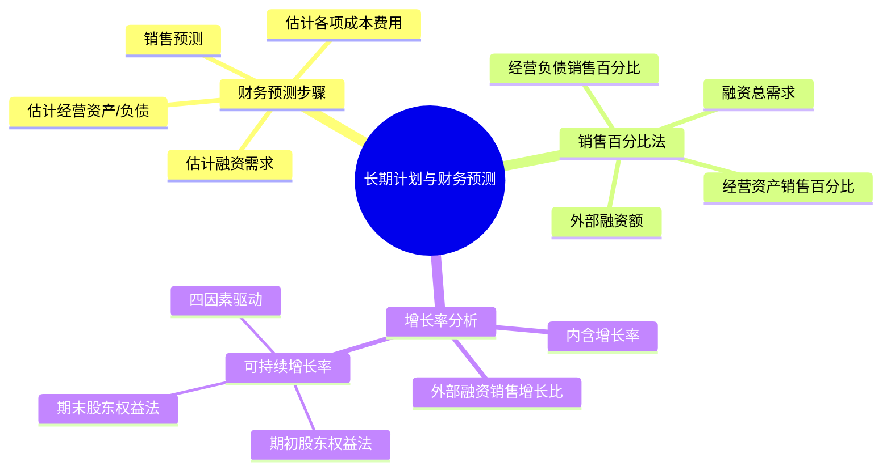

## 📍 章节定位

| 项目 | 信息 |
|------|------|
| **所属科目** | 📊 财务成本管理 |
| **难度等级** | ⭐⭐⭐ |
| **历年分值** | 5-7分 |
| **建议学时** | 5-6h |

## 📝 考情分析

本章核心考点为销售百分比法预测外部融资需求、外部融资销售增长比、内含增长率和可持续增长率两大增长率的计算。题型以主观计算题为主，常与企业价值评估、资本成本结合出综合题。

近年考查重点放在可持续增长率的两种计算口径（期初权益法与期末权益法）、可持续增长条件下各项财务政策变化对增长率的影响、以及实际增长率与可持续增长率的差异分析。考生须熟练掌握四个驱动因素（营业净利率、期末总资产周转次数、期末总资产权益乘数、利润留存率）的分解与连环替代。

## 🧠 知识框架

## 📖 核心精讲

### 一、财务预测的销售百分比法

#### （一）基本假设

销售百分比法假设各项经营资产和经营负债与营业收入保持稳定的百分比关系。预测步骤如下：

1. **确定资产和负债的销售百分比**：根据基期数据计算各项经营资产/负债占营业收入的百分比。
2. **预计各项经营资产和经营负债**：
   $$\text{预计某项经营资产} = \text{预计营业收入} \times \text{该资产销售百分比}$$
3. **计算融资总需求（预计净经营资产增加）**：
   $$\text{融资总需求} = \text{预计经营资产合计} - \text{预计经营负债合计} - (\text{基期经营资产合计} - \text{基期经营负债合计})$$
   即：
   $$\text{融资总需求} = \text{预计净经营资产} - \text{基期净经营资产}$$
4. **预计可动用金融资产**：从融资需求中扣减可动用的金融资产。
5. **预计增加的留存收益**：
   $$\text{留存收益增加} = \text{预计营业收入} \times \text{预计营业净利率} \times (1 - \text{预计股利支付率})$$
6. **预计外部融资额**：
   $$\text{外部融资额} = \text{融资总需求} - \text{可动用金融资产} - \text{留存收益增加}$$

#### （二）销售百分比法的局限

1. 假设各项经营资产和经营负债与营业收入保持稳定百分比，可能与事实不符；
2. 若不采用迭代法，假设预计营业净利率可以覆盖借款利息的增加，未必合理。

### 二、外部融资销售增长比

外部融资销售增长比指外部融资额与营业收入增加额的比值。在可动用金融资产为0的假设下：

$$\text{外部融资销售增长比} = \frac{\text{经营资产}}{\text{销售百分比}} - \frac{\text{经营负债}}{\text{销售百分比}} - \left[\frac{1 + g}{g}\right] \times \text{预计营业净利率} \times (1 - \text{预计股利支付率})$$

其中 $g$ 为销售增长率。

**重要结论**：
- 外部融资销售增长比 > 0，说明需要外部融资；
- 外部融资销售增长比 = 0，说明仅靠内部留存收益即可支持增长，此时增长率即为**内含增长率**；
- 外部融资销售增长比 < 0，说明资金有结余，可用于增加股利、回购股票或偿还债务。

### 三、内含增长率

内含增长率是指只靠内部积累（即增加留存收益）实现的销售增长率，即外部融资额为0时的销售增长率。

令外部融资销售增长比 = 0，可解得：

$$g_{\text{内含}} = \frac{\text{预计营业净利率} \times \text{利润留存率} \times \frac{\text{净经营资产}}{\text{营业收入}}}{1 - \text{预计营业净利率} \times \text{利润留存率} \times \frac{\text{净经营资产}}{\text{营业收入}}}$$

或写成（记 $\frac{\text{净经营资产}}{\text{营业收入}} = \frac{1}{\text{净经营资产周转率}}$）：

$$g_{\text{内含}} = \frac{\text{营业净利率} \times \text{利润留存率} \times \text{净经营资产周转次数}}{1 - \text{营业净利率} \times \text{利润留存率} \times \text{净经营资产周转次数}}$$

**含义**：在内含增长率下，企业不发行新股、不增加借款（指金融性负债），仅靠经营负债自然增长和留存收益增长支持销售增长。

### 四、可持续增长率

#### （一）概念

**可持续增长率**是指不发行新股、不改变经营效率（盈利能力和资产周转率不变）和财务政策（负债权益比和利润留存率不变）时，销售所能达到的最大增长率。

可持续增长率的假设条件：
1. 不发行新股；
2. 营业净利率不变；
3. 资产周转率不变；
4. 权益乘数（或总资产/期末权益）不变；
5. 利润留存率不变。

在上述假设下，可持续增长率等于股东权益增长率，也等于销售增长率。

#### （二）期初股东权益法

$$g_{\text{可持续}} = \frac{\text{本期净利润} \times \text{本期利润留存率}}{\text{期初股东权益}}$$

分解为四个驱动因素：

$$g_{\text{可持续}} = \text{营业净利率} \times \text{期末总资产周转次数} \times \text{期末总资产} \div \text{期初股东权益} \times \text{利润留存率}$$

#### （三）期末股东权益法

全部用期末数和本期发生额计算，分子分母同除以期末股东权益：

$$g_{\text{可持续}} = \frac{\text{营业净利率} \times \text{期末总资产周转次数} \times \text{期末总资产权益乘数} \times \text{利润留存率}}{1 - \text{营业净利率} \times \text{期末总资产周转次数} \times \text{期末总资产权益乘数} \times \text{利润留存率}}$$

记四个驱动因素的乘积为 $R$：

$$R = \text{营业净利率} \times \text{期末总资产周转次数} \times \text{期末总资产权益乘数} \times \text{利润留存率}$$

则：

$$g_{\text{可持续}} = \frac{R}{1 - R}$$

注意：这里的"期末总资产权益乘数"用期末股东权益计算。

#### （四）可持续增长率与实际增长率的关系

| 条件 | 实际增长率与可持续增长率关系 |
|------|------------------------------|
| 四个比率均不变，不发行新股 | 实际增长率 = 可持续增长率（本年与上年均等于本年可持续增长率） |
| 四个比率中某一个或多个比上年提高 | 本年实际增长率 > 本年可持续增长率 > 上年可持续增长率 |
| 四个比率中某一个或多个比上年下降 | 本年实际增长率 < 本年可持续增长率 < 上年可持续增长率 |
| 四个比率中某一个或多个比上年提高，但本年发行新股 | 本年可持续增长率 = 上年可持续增长率（因为发行新股使权益增加，但其他比率不变时本期权益增长率不变） |

**关键结论**：超常增长（实际增长率高于可持续增长率）的代价是必须改变财务政策或经营效率，或发行新股，否则无法持续。

### 五、增长率的影响因素分析

通过连环替代分析四个驱动因素对可持续增长率变动的影响：

1. **营业净利率**：反映盈利能力；
2. **总资产周转次数**：反映营运能力；
3. **权益乘数**：反映财务杠杆；
4. **利润留存率**：反映股利政策。

这四个因素与可持续增长率同向变动。

## 💡 典型例题

**【例题 1】（计算题）**

某公司 20×1 年营业收入 3000 万元，年末净经营资产 2000 万元，预计 20×2 年营业收入增长率为 20%，营业净利率 10%，股利支付率 40%。假设经营资产销售百分比为 66.67%，经营负债销售百分比为 9.27%，可动用金融资产为0。

要求：计算 20×2 年外部融资额。

**答案**：

- 营业收入增加 $= 3000 \times 20\% = 600$（万元）
- 融资总需求 $= (66.67\% - 9.27\%) \times 600 = 57.40\% \times 600 = 344.4$（万元）
- 留存收益增加 $= 3000 \times (1 + 20\%) \times 10\% \times (1 - 40\%) = 3600 \times 6\% = 216$（万元）
- 外部融资额 $= 344.4 - 0 - 216 = 128.4$（万元）

**解析**：销售百分比法的核心是融资总需求 = 预计净经营资产增加 = (经营资产销售百分比 - 经营负债销售百分比) × 营业收入增加。

---

**【例题 2】（计算题）**

某公司本年营业净利率 5%，期末总资产周转次数 2.5 次，期末总资产权益乘数 2，利润留存率 60%。计算可持续增长率。

**答案**：

四个驱动因素乘积：

$$R = 5\% \times 2.5 \times 2 \times 60\% = 15\%$$

可持续增长率：

$$g = \frac{R}{1 - R} = \frac{15\%}{1 - 15\%} = \frac{15\%}{85\%} = 17.65\%$$

**解析**：使用期末股东权益法，先计算四因素乘积 R，再用 g = R/(1-R) 求解。

## 🎯 记忆口诀

**内含增长率 vs 可持续增长率**：
> 内含不借不发股，仅靠留存和经营负债自然增长；
> 可持续不发股，效率政策都不变，权益同速长。

**可持续四因素**：
> 净利、周转、权益乘、留存——四个比率连乘 R；
> g = R / (1 - R)。

**超常增长"三选一"**：要超常，要么改经营效率（净利率、周转率），要么改财务政策（负债率、留存率），要么发新股。

## ✅ 同步练习

**1.（单选题）** 在其他条件不变的情况下，下列会使外部融资销售增长比下降的是（　）。

A. 提高股利支付率
B. 提高预计营业净利率
C. 提高经营资产销售百分比
D. 降低经营负债销售百分比

**2.（单选题）** 某公司经营资产销售百分比为 60%，经营负债销售百分比为 10%，预计营业净利率 8%，股利支付率 50%，可动用金融资产为0，则内含增长率为（　）。

A. 6.38%
B. 7.14%
C. 8.70%
D. 9.41%

**3.（多选题）** 下列关于可持续增长率的说法中，正确的有（　）。

A. 在可持续增长条件下，本年实际增长率等于本年可持续增长率
B. 可持续增长率等于股东权益增长率
C. 若四个驱动因素之一提高且不发行新股，则本年实际增长率高于本年可持续增长率
D. 若本年发行新股，则本年可持续增长率高于上年可持续增长率

**4.（计算题）** 某公司本年营业收入 5000 万元，年末总资产 4000 万元，年末股东权益 2000 万元，营业净利率 8%，利润留存率 50%。计算期末总资产周转次数、期末总资产权益乘数、可持续增长率。

**5.（单选题）** 下列各项中，能够支持企业销售增长且不增加财务风险、不消耗财务资源的是（　）。

A. 完全依靠内部资本增长
B. 主要依靠外部资本增长
C. 平衡增长（可持续增长）
D. 发行新股筹资增长

---

**练习答案**：1.B　2.B　3.ABC　4. 周转次数1.25、权益乘数2、可持续增长率11.11%　5.C
