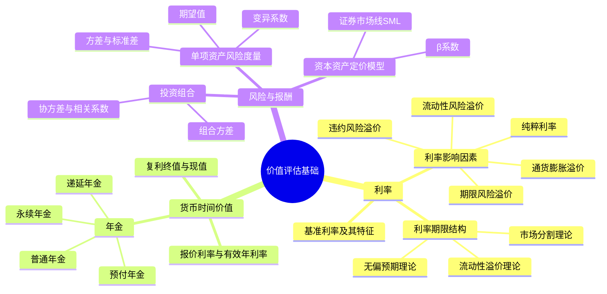

## 📍 章节定位

| 项目 | 信息 |
|------|------|
| **所属科目** | 📊 财务成本管理 |
| **难度等级** | ⭐⭐⭐ |
| **历年分值** | 6-8分 |
| **建议学时** | 6-8h |

## 📝 考情分析

本章是整本财管的"工具箱"章节，货币时间价值与风险报酬是后续资本成本、资本预算、企业价值评估等章节的计算基础。本章题型以客观题与小型计算题为主，公式密集，必须熟练掌握。

核心考点集中于：复利终值现值系数、四种年金（普通年金、预付年金、递延年金、永续年金）的计算、报价利率与有效年利率的换算、利率期限结构三种理论的比较、单项资产与投资组合的风险度量、β系数的含义、资本资产定价模型（CAPM）的应用。其中 CAPM 公式 $E(R_i) = R_f + \beta_i \times [E(R_m) - R_f]$ 在后续各章反复使用，必须熟练掌握。

## 🧠 知识框架

## 📖 核心精讲

### 一、利率

#### （一）基准利率及其特征

利率（利息率）是资金的价格，由各种因素综合决定。基准利率是利率市场化机制形成的核心，央行通过基准利率实现货币政策目标。基准利率具有市场化、基础性、传递性三大特征。

#### （二）利率的影响因素

利率的一般表达式：

$$r = r^* + RP = r^* + IP + DRP + LRP + MRP$$

其中各变量含义：

| 符号 | 含义 | 说明 |
|------|------|------|
| $r$ | 利率 | 名义利率 |
| $r^*$ | 纯粹利率 | 无通胀、无风险情况下资金市场平均利率 |
| $IP$ | 通货膨胀溢价 | 弥补通货膨胀带来的购买力下降 |
| $DRP$ | 违约风险溢价 | 弥补债务人违约风险 |
| $LRP$ | 流动性风险溢价 | 弥补流动性差的风险 |
| $MRP$ | 期限风险溢价 | 又称市场利率风险溢价 |

**名义无风险利率** $r_f$：

$$r_f = r^* + IP$$

政府债券通常被视为无违约风险，其利率即名义无风险利率。

#### （三）利率的期限结构

利率期限结构指某一时点不同期限债券的即期收益率与期限之间的关系，用收益率曲线表示。三种理论解释：

| 理论 | 核心观点 | 解释力 |
|------|----------|--------|
| **无偏预期理论**（预期理论） | 长期即期利率是未来短期利率的几何平均，预期是唯一因素 | 无法解释收益率曲线通常向上倾斜 |
| **市场分割理论** | 不同期限市场由供求独立决定，互不影响 | 无法解释不同期限利率同步波动 |
| **流动性溢价理论** | 长期利率 = 预期短期利率平均 + 流动性溢价 | 综合两者，解释力最强 |

**即期利率与远期利率关系**（无偏预期理论下）：

$$(1 + r_2)^2 = (1 + r_1) \times (1 + f_2)$$

其中 $r_1$ 为1年期即期利率，$r_2$ 为2年期即期利率，$f_2$ 为第2年的预期短期利率（远期利率）。

### 二、货币的时间价值

货币时间价值是指货币经历一定时间的投资和再投资所增加的价值。理论上，货币时间价值率是没有风险、没有通货膨胀下的社会平均利润率。

#### （一）复利终值和现值

**复利终值**（已知 $P$ 求 $F$）：

$$F = P \times (1 + i)^n = P \times (F/P, i, n)$$

**复利现值**（已知 $F$ 求 $P$）：

$$P = \frac{F}{(1 + i)^n} = F \times (1 + i)^{-n} = F \times (P/F, i, n)$$

其中 $(F/P, i, n)$ 为复利终值系数，$(P/F, i, n)$ 为复利现值系数，二者互为倒数。

#### （二）报价利率与有效年利率

当一年内复利多次时，需区分：

- **报价利率（名义利率）**：金融机构报价的年利率；
- **计息期利率** $=$ 报价利率 $\div$ 每年复利次数 $m$；
- **有效年利率（EAR）**：与按计息期利率复利计算产生相同结果的每年计息一次的年利率。

$$\text{有效年利率} = \left(1 + \frac{\text{报价利率}}{m}\right)^m - 1$$

**连续复利**（$m \to \infty$）：

$$\text{有效年利率} = e^{\text{报价利率}} - 1$$

连续复利终值：$F = P \times e^{rn}$

#### （三）年金

年金是指等额、定期的系列收付款项。按发生时点分为四类：

**1. 普通年金（后付年金）**：收付发生在每期期末。

- 普通年金终值：
$$F = A \times \frac{(1+i)^n - 1}{i} = A \times (F/A, i, n)$$
- 普通年金现值：
$$P = A \times \frac{1 - (1+i)^{-n}}{i} = A \times (P/A, i, n)$$

**2. 预付年金（即付年金）**：收付发生在每期期初。

- 预付年金终值 = 普通年金终值 × $(1+i)$：
$$F = A \times (F/A, i, n) \times (1+i) = A \times [(F/A, i, n+1) - 1]$$
- 预付年金现值 = 普通年金现值 × $(1+i)$：
$$P = A \times (P/A, i, n) \times (1+i) = A \times [(P/A, i, n-1) + 1]$$

**3. 递延年金**：第一次收付发生在第二期或第二期以后。

设递延 $m$ 期，连续收付 $n$ 期。

- 递延年金现值（两次折现法）：
$$P = A \times (P/A, i, n) \times (P/F, i, m)$$
- 递延年金现值（扣除法）：
$$P = A \times [(P/A, i, m+n) - (P/A, i, m)]$$

**4. 永续年金**：无限期等额收付的年金，无终值。

$$P = \frac{A}{i}$$

### 三、风险与报酬

#### （一）单项资产的风险度量

**1. 期望报酬率**（概率加权）：

$$E(R) = \sum_{i=1}^{n} p_i \times R_i$$

其中 $p_i$ 为第 $i$ 种经济状态的概率，$R_i$ 为该状态下的报酬率。

**2. 方差与标准差**（衡量绝对风险）：

$$\sigma^2 = \sum_{i=1}^{n} p_i \times [R_i - E(R)]^2$$

$$\sigma = \sqrt{\sigma^2}$$

标准差 $\sigma$ 越大，风险越大。当期望报酬率相同时，可直接比较标准差。

**3. 变异系数**（衡量相对风险，便于不同期望报酬率项目比较）：

$$CV = \frac{\sigma}{E(R)}$$

变异系数表示每单位期望报酬率所承担的风险，数值越小越好。

#### （二）投资组合的风险与报酬

**1. 组合的期望报酬率**：

$$E(R_p) = \sum_{j=1}^{m} w_j \times E(R_j)$$

其中 $w_j$ 为第 $j$ 种资产的权重，组合期望报酬率是各资产期望报酬率的加权平均。

**2. 组合的标准差**：

$$\sigma_p = \sqrt{\sum_{j=1}^{m}\sum_{k=1}^{m} w_j w_k \sigma_{jk}}$$

其中 $\sigma_{jk}$ 为资产 $j$ 与资产 $k$ 的协方差：

$$\sigma_{jk} = \rho_{jk} \times \sigma_j \times \sigma_k$$

$\rho_{jk}$ 为相关系数，取值范围 $[-1, 1]$。

**关键结论**：
- 相关系数 = +1 时，组合不能降低风险（风险加权平均）；
- 相关系数 = -1 时，组合可完全消除风险（存在适当比例）；
- 相关系数介于 -1 与 +1 之间时，组合可降低部分风险（非系统风险），但不能消除系统风险。

**3. 系统风险与非系统风险**

| 类型 | 含义 | 能否分散 |
|------|------|----------|
| **非系统风险**（公司风险、特有风险） | 个别公司特有事件引发 | 通过分散投资可消除 |
| **系统风险**（市场风险、不可分散风险） | 影响所有公司的因素引发 | 无法通过分散投资消除 |

#### （三）资本资产定价模型（CAPM）

**1. β系数**

β系数衡量单项资产相对于市场组合的系统风险：

$$\beta_j = \frac{\sigma_{jm}}{\sigma_m^2} = \frac{\rho_{jm} \times \sigma_j}{\sigma_m}$$

其中 $\sigma_{jm}$ 为资产 $j$ 与市场组合 $m$ 的协方差，$\sigma_m$ 为市场组合标准差。

- $\beta = 1$：资产风险与市场组合相同；
- $\beta > 1$：资产风险高于市场组合（进取型）；
- $\beta < 1$：资产风险低于市场组合（防守型）；
- $\beta = 0$：无系统风险（如无风险资产）。

**组合的β系数**：

$$\beta_p = \sum_{j=1}^{m} w_j \times \beta_j$$

**2. 资本资产定价模型**

$$E(R_i) = R_f + \beta_i \times [E(R_m) - R_f]$$

其中：
- $E(R_i)$：第 $i$ 项资产（或组合）的期望报酬率；
- $R_f$：无风险利率；
- $\beta_i$：第 $i$ 项资产的系统风险系数；
- $E(R_m)$：市场组合的期望报酬率；
- $[E(R_m) - R_f]$：市场风险溢价。

**证券市场线（SML）**：以 $\beta$ 为横轴、期望报酬率为纵轴的直线，截距为 $R_f$，斜率为市场风险溢价。SML 描述了系统风险与期望报酬率的关系。

**资本市场线（CML）**：以组合标准差 $\sigma_p$ 为横轴，描述有效组合（无风险资产与市场组合的不同比例）的期望报酬率与总风险的关系。

## 💡 典型例题

**【例题 1】（计算题）**

某人现在存入银行 10000 元，年利率 6%，按季度复利计息，5 年后可取出多少元？有效年利率是多少？

**答案**：

- 计息期利率 $= 6\% \div 4 = 1.5\%$
- 复利次数 $= 4 \times 5 = 20$
- 终值 $F = 10000 \times (1 + 1.5\%)^{20} = 10000 \times 1.3469 = 13469$（元）
- 有效年利率 $= (1 + 1.5\%)^4 - 1 = 1.0614 - 1 = 6.14\%$

**解析**：年内多次复利时，用计息期利率 = 报价利率 / 复利次数，再乘以总期数。

---

**【例题 2】（计算题）**

某股票的 β 系数为 1.5，市场组合期望报酬率为 12%，无风险利率为 4%。计算该股票的期望报酬率。

**答案**：

$$E(R_i) = R_f + \beta_i \times [E(R_m) - R_f] = 4\% + 1.5 \times (12\% - 4\%) = 4\% + 12\% = 16\%$$

**解析**：CAPM 模型直接套用，注意市场风险溢价是 $E(R_m) - R_f$ 而非 $E(R_m)$。

---

**【例题 3】（计算题）**

某项目各状态概率及报酬率如下：繁荣（概率0.3，报酬率20%）、正常（概率0.5，报酬率10%）、衰退（概率0.2，报酬率-5%）。计算期望报酬率、标准差和变异系数。

**答案**：

- 期望报酬率 $E(R) = 0.3 \times 20\% + 0.5 \times 10\% + 0.2 \times (-5\%) = 6\% + 5\% - 1\% = 10\%$
- 方差 $\sigma^2 = 0.3 \times (20\%-10\%)^2 + 0.5 \times (10\%-10\%)^2 + 0.2 \times (-5\%-10\%)^2 = 0.003 + 0 + 0.0045 = 0.0075$
- 标准差 $\sigma = \sqrt{0.0075} = 8.66\%$
- 变异系数 $CV = 8.66\% \div 10\% = 0.866$

## 🎯 记忆口诀

**利率构成五件套**：
> 纯粹利率 + 通胀溢价 + 违约 + 流动性 + 期限 = 名义利率；
> 前两项合并 = 无风险利率。

**年金四类型**：
> 普通期末、预付期初、递延延后、永续无终值；
> 预付 = 普通 × (1+i)。

**CAPM 三要素**：
> 无风险利率 + β × 市场风险溢价；
> β=1 跟大盘，β>1 进取型，β<1 防守型。

**有效年利率口诀**：
> 一年复利 m 次，有效年利率 = (1 + r/m)^m - 1；
> 连续复利取极限，e^r - 1。

## ✅ 同步练习

**1.（单选题）** 某人拟在第 5 年末取出 10000 元，年利率 8%，按年复利计息，则现在应存入（　）元。

A. 6806
B. 6758
C. 7350
D. 6756

**2.（单选题）** 报价利率为 12%，按月复利计息，则有效年利率为（　）。

A. 12%
B. 12.36%
C. 12.55%
D. 12.68%

**3.（单选题）** 某股票 β 系数为 0.8，无风险利率 5%，市场组合期望报酬率 15%，则该股票期望报酬率为（　）。

A. 12%
B. 13%
C. 14%
D. 17%

**4.（多选题）** 下列关于资本资产定价模型的说法中，正确的有（　）。

A. β系数衡量的是系统风险
B. 证券市场线（SML）以β为横轴
C. 资本市场线（CML）以总风险（标准差）为横轴
D. 任何资产的期望报酬率都应落在SML上

**5.（计算题）** 某公司拟购买一台设备，分 5 年每年末支付 10000 元，年利率 10%。计算该设备购置的现值。

---

**练习答案**：1.D（$10000 \times (P/F, 8\%, 5) = 10000 \times 0.6806$）　2.D（$(1+1\%)^{12}-1=12.68\%$）　3.B（$5\% + 0.8 \times (15\%-5\%) = 13\%$）　4.ABCD　5. 37908元（$10000 \times (P/A, 10\%, 5) = 10000 \times 3.7908$）
