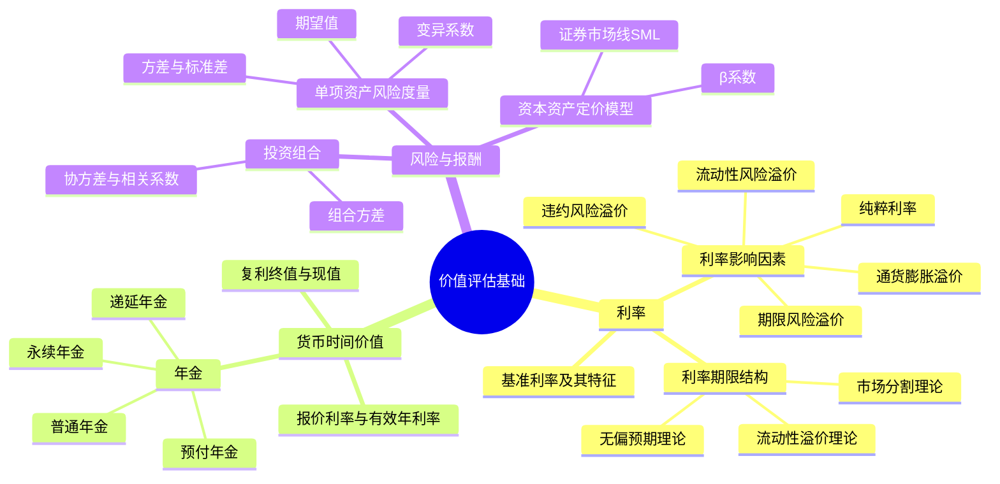

## 1. 章节定位

| 项目 | 信息 |
|------|------|
| 所属科目 | 财务成本管理 |
| 难度等级 | 3 |
| 历年分值 | 6-8分 |
| 建议学时 | 6-8h |

## 2. 考情分析

本章是整本财管的"工具箱"章节，货币时间价值与风险报酬是后续资本成本、资本预算、企业价值评估等章节的计算基础，分值约 6-8 分。本章题型以客观题与小型计算题为主，公式密集，必须熟练掌握。

**命题规律**：
1. 货币时间价值的计算几乎每年必考——年金现值/终值、有效年利率换算是高频考点；
2. CAPM 公式 $E(R_i) = R_f + \beta_i \times [E(R_m) - R_f]$ 在后续各章反复使用，必须熟练掌握；
3. 利率期限结构三种理论的比较是常见客观题；
4. β系数的含义、组合β的计算、相关系数与风险分散的关系是难点。

核心考点集中于：复利终值现值系数、四种年金（普通年金、预付年金、递延年金、永续年金）的计算、报价利率与有效年利率的换算、利率期限结构三种理论的比较、单项资产与投资组合的风险度量、β系数的含义、资本资产定价模型（CAPM）的应用。

**学习提示**：本章公式多但逻辑清晰，关键在于理解"时间价值"和"风险溢价"两个核心思想。建议通过大量练习巩固公式应用，特别关注计息期与有效年利率的换算、组合风险分散的边界条件。

## 3. 知识框架

## 4. 核心精讲

### 一、利率

#### （一）基准利率及其特征

利率（利息率）是资金的价格，由各种因素综合决定。基准利率是利率市场化机制形成的核心，央行通过基准利率实现货币政策目标。基准利率具有市场化、基础性、传递性三大特征。

#### （二）利率的影响因素

利率的一般表达式：

$$r = r^* + RP = r^* + IP + DRP + LRP + MRP$$

其中各变量含义：

| 符号 | 含义 | 说明 |
|------|------|------|
| $r$ | 利率 | 名义利率 |
| $r^*$ | 纯粹利率 | 无通胀、无风险情况下资金市场平均利率 |
| $IP$ | 通货膨胀溢价 | 弥补通货膨胀带来的购买力下降 |
| $DRP$ | 违约风险溢价 | 弥补债务人违约风险 |
| $LRP$ | 流动性风险溢价 | 弥补流动性差的风险 |
| $MRP$ | 期限风险溢价 | 又称市场利率风险溢价 |

**名义无风险利率** $r_f$：

$$r_f = r^* + IP$$

政府债券通常被视为无违约风险，其利率即名义无风险利率。

#### （三）利率的期限结构

利率期限结构指某一时点不同期限债券的即期收益率与期限之间的关系，用收益率曲线表示。三种理论解释：

| 理论 | 核心观点 | 解释力 |
|------|----------|--------|
| **无偏预期理论**（预期理论） | 长期即期利率是未来短期利率的几何平均，预期是唯一因素 | 无法解释收益率曲线通常向上倾斜 |
| 市场分割理论 | 不同期限市场由供求独立决定，互不影响 | 无法解释不同期限利率同步波动 |
| 流动性溢价理论 | 长期利率 = 预期短期利率平均 + 流动性溢价 | 综合两者，解释力最强 |

**三种理论的对比要点**：

| 对比维度 | 无偏预期理论 | 市场分割理论 | 流动性溢价理论 |
|---------|--------------|--------------|----------------|
| 长期利率决定因素 | 未来短期利率预期 | 各期限市场供求 | 预期 + 流动性溢价 |
| 投资者期限偏好 | 无偏好（替代性强） | 强偏好特定期限 | 弱偏好，要求溢价 |
| 收益率曲线通常形状 | 不确定（取决于预期） | 不确定（取决于各市场供求） | 通常向上倾斜 |
| 解释曲线向上倾斜 | 需假设预期未来利率上升 | 长期债券需求少、供给多 | 长期债券有流动性溢价 |
| 解释曲线向下倾斜 | 预期未来利率下降 | 长期债券需求多、供给少 | 流动性溢价不足以抵消预期下降 |
| 不同期限利率同步性 | 同步（受同一预期影响） | 不同步（市场独立） | 部分同步 |

**即期利率与远期利率关系**（无偏预期理论下）：

$$(1 + r_2)^2 = (1 + r_1) \times (1 + f_2)$$

其中 $r_1$ 为1年期即期利率，$r_2$ 为2年期即期利率，$f_2$ 为第2年的预期短期利率（远期利率）。

**例**：1 年期即期利率 5%，2 年期即期利率 6%。求第 2 年的远期利率 $f_2$。

$$(1 + 6\%)^2 = (1 + 5\%) \times (1 + f_2)$$
$$1.1236 = 1.05 \times (1 + f_2)$$
$$1 + f_2 = 1.1236 / 1.05 = 1.0701$$
$$f_2 \approx 7.01\%$$

即市场预期第 2 年的 1 年期利率约为 7.01%（高于当前 1 年期利率 5%）。

**收益率曲线的形态及经济含义**：

| 曲线形态 | 含义 | 经济解读 |
|---------|------|----------|
| 向上倾斜 | 长期利率 > 短期利率 | 市场预期未来利率上升（经济扩张期） |
| 水平 | 长期利率 = 短期利率 | 市场预期未来利率不变 |
| 向下倾斜（倒挂） | 长期利率 < 短期利率 | 市场预期未来利率下降（经济衰退信号） |
| 驼峰形 | 中期利率最高 | 短期流动性紧张、长期预期下降 |

**经验规律**：收益率曲线倒挂常被视为经济衰退的前兆信号。例如美债 10 年期与 2 年期国债利差倒挂历史上多次领先经济衰退。

### 二、货币的时间价值

货币时间价值是指货币经历一定时间的投资和再投资所增加的价值。理论上，货币时间价值率是没有风险、没有通货膨胀下的社会平均利润率。

#### （一）复利终值和现值

**复利终值**（已知 $P$ 求 $F$）：

$$F = P \times (1 + i)^n = P \times (F/P, i, n)$$

**复利现值**（已知 $F$ 求 $P$）：

$$P = \frac{F}{(1 + i)^n} = F \times (1 + i)^{-n} = F \times (P/F, i, n)$$

其中 $(F/P, i, n)$ 为复利终值系数，$(P/F, i, n)$ 为复利现值系数，二者互为倒数。

#### （二）报价利率与有效年利率

当一年内复利多次时，需区分：

- **报价利率（名义利率）**：金融机构报价的年利率；
- **计息期利率** $=$ 报价利率 $\div$ 每年复利次数 $m$；
- **有效年利率（EAR）**：与按计息期利率复利计算产生相同结果的每年计息一次的年利率。

$$\text{有效年利率} = \left(1 + \frac{\text{报价利率}}{m}\right)^m - 1$$

**连续复利**（$m \to \infty$）：

$$\text{有效年利率} = e^{\text{报价利率}} - 1$$

连续复利终值：$F = P \times e^{rn}$

#### （三）年金

年金是指等额、定期的系列收付款项。按发生时点分为四类：

**1. 普通年金（后付年金）**：收付发生在每期期末。

- 普通年金终值：
$$F = A \times \frac{(1+i)^n - 1}{i} = A \times (F/A, i, n)$$
- 普通年金现值：
$$P = A \times \frac{1 - (1+i)^{-n}}{i} = A \times (P/A, i, n)$$

**2. 预付年金（即付年金）**：收付发生在每期期初。

- 预付年金终值 = 普通年金终值 × $(1+i)$：
$$F = A \times (F/A, i, n) \times (1+i) = A \times [(F/A, i, n+1) - 1]$$
- 预付年金现值 = 普通年金现值 × $(1+i)$：
$$P = A \times (P/A, i, n) \times (1+i) = A \times [(P/A, i, n-1) + 1]$$

**3. 递延年金**：第一次收付发生在第二期或第二期以后。

设递延 $m$ 期，连续收付 $n$ 期。

- 递延年金现值（两次折现法）：
$$P = A \times (P/A, i, n) \times (P/F, i, m)$$
- 递延年金现值（扣除法）：
$$P = A \times [(P/A, i, m+n) - (P/A, i, m)]$$

**4. 永续年金**：无限期等额收付的年金，无终值。

$$P = \frac{A}{i}$$

**例**：某人希望设立一项永久性奖学金，每年末发放 10000 元，年利率 5%。问现在需存入多少元？

$$P = 10000 / 5\% = 200000 \text{（元）}$$

**永续增长年金**（股利增长模型的基础）：

$$P = \frac{A_1}{i - g} = \frac{A_0 \times (1+g)}{i - g}$$

其中 $A_1$ 为下一期收付额，$g$ 为增长率，要求 $i > g$。

**四种年金对比表**：

| 年金类型 | 收付时点 | 终值公式 | 现值公式 | 特点 |
|---------|---------|---------|---------|------|
| 普通年金 | 期末 | $A \times (F/A, i, n)$ | $A \times (P/A, i, n)$ | 最常用 |
| 预付年金 | 期初 | $A \times (F/A, i, n) \times (1+i)$ | $A \times (P/A, i, n) \times (1+i)$ | = 普通 × (1+i) |
| 递延年金 | 期末（递延 m 期后） | （较少考） | $A \times (P/A, i, n) \times (P/F, i, m)$ | 两次折现 |
| 永续年金 | 期末（无限期） | 无 | $A / i$ | 无终值 |

**递延年金现值的两种方法对比**：

**例**：某项年金从第 4 年末开始，连续 5 年每年支付 1000 元，年利率 10%。求现值。

方法一（两次折现法）：
- 5 期普通年金现值（折到第 3 年末）：$P_3 = 1000 \times (P/A, 10\%, 5) = 1000 \times 3.7908 = 3790.8$
- 再折现 3 期到当前：$P_0 = 3790.8 \times (P/F, 10\%, 3) = 3790.8 \times 0.7513 = 2847.95$

方法二（扣除法）：
- 8 期普通年金现值：$P_{0-8} = 1000 \times (P/A, 10\%, 8) = 1000 \times 5.3349 = 5334.9$
- 3 期普通年金现值：$P_{0-3} = 1000 \times (P/A, 10\%, 3) = 1000 \times 2.4869 = 2486.9$
- 递延年金现值：$P_0 = 5334.9 − 2486.9 = 2848.0$（与第一种方法一致，差异源于四舍五入）

#### （四）偿债基金与资本回收

**偿债基金**（已知终值 F 求年金 A，为未来偿还一笔债务而每年等额提取的基金）：

$$A = F \times \frac{i}{(1+i)^n - 1} = F \times (A/F, i, n)$$

其中 $(A/F, i, n)$ 为偿债基金系数，是普通年金终值系数 $(F/A, i, n)$ 的倒数。

**资本回收**（已知现值 P 求年金 A，初始投资在 n 年内等额回收）：

$$A = P \times \frac{i(1+i)^n}{(1+i)^n - 1} = P \times (A/P, i, n)$$

其中 $(A/P, i, n)$ 为资本回收系数，是普通年金现值系数 $(P/A, i, n)$ 的倒数。

**例**：某企业借款 100 万元，年利率 8%，分 5 年每年末等额偿还，每年应还多少？

$$A = 100 \times (A/P, 8\%, 5) = 100 \div (P/A, 8\%, 5) = 100 \div 5.8666 = 25.05 \text{（万元）}$$

**系数倒数关系汇总**：

| 系数对 | 关系 |
|--------|------|
| $(F/P, i, n)$ 与 $(P/F, i, n)$ | 互为倒数 |
| $(F/A, i, n)$ 与 $(A/F, i, n)$ | 互为倒数 |
| $(P/A, i, n)$ 与 $(A/P, i, n)$ | 互为倒数 |

### 三、风险与报酬

#### （一）单项资产的风险度量

**1. 期望报酬率**（概率加权）：

$$E(R) = \sum_{i=1}^{n} p_i \times R_i$$

其中 $p_i$ 为第 $i$ 种经济状态的概率，$R_i$ 为该状态下的报酬率。

**2. 方差与标准差**（衡量绝对风险）：

$$\sigma^2 = \sum_{i=1}^{n} p_i \times [R_i - E(R)]^2$$

$$\sigma = \sqrt{\sigma^2}$$

标准差 $\sigma$ 越大，风险越大。当期望报酬率相同时，可直接比较标准差。

**3. 变异系数**（衡量相对风险，便于不同期望报酬率项目比较）：

$$CV = \frac{\sigma}{E(R)}$$

变异系数表示每单位期望报酬率所承担的风险，数值越小越好。

#### （二）投资组合的风险与报酬

**1. 组合的期望报酬率**：

$$E(R_p) = \sum_{j=1}^{m} w_j \times E(R_j)$$

其中 $w_j$ 为第 $j$ 种资产的权重，组合期望报酬率是各资产期望报酬率的加权平均。

**2. 组合的标准差**：

$$\sigma_p = \sqrt{\sum_{j=1}^{m}\sum_{k=1}^{m} w_j w_k \sigma_{jk}}$$

其中 $\sigma_{jk}$ 为资产 $j$ 与资产 $k$ 的协方差：

$$\sigma_{jk} = \rho_{jk} \times \sigma_j \times \sigma_k$$

$\rho_{jk}$ 为相关系数，取值范围 $[-1, 1]$。

**关键结论**：
- 相关系数 = +1 时，组合不能降低风险（风险加权平均）；
- 相关系数 = -1 时，组合可完全消除风险（存在适当比例）；
- 相关系数介于 -1 与 +1 之间时，组合可降低部分风险（非系统风险），但不能消除系统风险。

**风险分散的图示理解**：

随着组合中资产数目增加，组合的总风险（标准差）逐渐下降，但下降速度递减，最终趋近于一个不可消除的下限——系统风险。这是因为：

$$\sigma_p^2 = \sum_{j=1}^{m} w_j^2 \sigma_j^2 + \sum_{j \neq k} w_j w_k \sigma_{jk}$$

当 $m$ 足够大且各资产权重相近（$w_j \approx 1/m$）时，第一项（各项资产方差之和）趋近于0，但第二项（协方差之和）不消失——这就是系统风险的来源。

**例**：两项资产 A、B，期望报酬率分别为 10% 和 15%，标准差分别为 20% 和 30%，相关系数 0.5，等权重（各 50%）组合。求组合期望报酬率和标准差。

- 组合期望报酬率 $= 0.5 \times 10\% + 0.5 \times 15\% = 12.5\%$
- 协方差 $\sigma_{AB} = 0.5 \times 20\% \times 30\% = 0.03$（即 300‱）
- 组合方差 $\sigma_p^2 = 0.5^2 \times 0.04 + 0.5^2 \times 0.09 + 2 \times 0.5 \times 0.5 \times 0.03 = 0.01 + 0.0225 + 0.015 = 0.0475$
- 组合标准差 $\sigma_p = \sqrt{0.0475} = 21.79\%$

对比加权平均风险 $0.5 \times 20\% + 0.5 \times 30\% = 25\%$，组合风险 21.79% < 25%，说明组合降低了风险（相关系数 < 1）。

**若相关系数 = +1**：组合标准差 = 0.5 × 20% + 0.5 × 30% = 25%（无法降低）
**若相关系数 = -1**：组合标准差 = |0.5 × 20% − 0.5 × 30%| = 5%（最大降低）
**若相关系数 = 0**：组合标准差 = √(0.01 + 0.0225) = √0.0325 = 18.03%（部分降低）

**相关系数对组合风险的影响规律**：

| 相关系数 $\rho$ | 组合标准差 | 风险分散效果 | 说明 |
|----------------|-----------|-------------|------|
| $+1$ | 加权平均 $\sum w_j \sigma_j$ | 完全无分散 | 两资产完全同向变动 |
| $0$ | $\sqrt{\sum w_j^2 \sigma_j^2}$ | 部分分散 | 两资产变动无关 |
| $-1$ | $|\sum w_j \sigma_j|$（可抵消） | 完全分散（存在比例） | 两资产完全反向变动 |

**最小方差组合**（两资产情形）：当 $\rho = -1$ 时，可找到使组合方差为 0 的权重配比。

设资产 A、B 权重分别为 $w_A, w_B$（$w_B = 1 - w_A$），令组合标准差为 0：

$$w_A = \frac{\sigma_B}{\sigma_A + \sigma_B}$$

以上例 A($\sigma_A=20\%$)、B($\sigma_B=30\%$) 为例，$\rho=-1$ 时：

$$w_A = \frac{30\%}{20\%+30\%} = 60\%, \quad w_B = 40\%$$

即 A 投 60%、B 投 40% 时组合风险为 0。

**3. 系统风险与非系统风险**

| 类型 | 含义 | 能否分散 |
|------|------|----------|
| **非系统风险**（公司风险、特有风险） | 个别公司特有事件引发 | 通过分散投资可消除 |
| **系统风险**（市场风险、不可分散风险） | 影响所有公司的因素引发 | 无法通过分散投资消除 |

#### （三）资本资产定价模型（CAPM）

**1. β系数**

β系数衡量单项资产相对于市场组合的系统风险：

$$\beta_j = \frac{\sigma_{jm}}{\sigma_m^2} = \frac{\rho_{jm} \times \sigma_j}{\sigma_m}$$

其中 $\sigma_{jm}$ 为资产 $j$ 与市场组合 $m$ 的协方差，$\sigma_m$ 为市场组合标准差。

- $\beta = 1$：资产风险与市场组合相同；
- $\beta > 1$：资产风险高于市场组合（进取型）；
- $\beta < 1$：资产风险低于市场组合（防守型）；
- $\beta = 0$：无系统风险（如无风险资产）。

**组合的β系数**：

$$\beta_p = \sum_{j=1}^{m} w_j \times \beta_j$$

**2. 资本资产定价模型**

$$E(R_i) = R_f + \beta_i \times [E(R_m) - R_f]$$

其中：
- $E(R_i)$：第 $i$ 项资产（或组合）的期望报酬率；
- $R_f$：无风险利率；
- $\beta_i$：第 $i$ 项资产的系统风险系数；
- $E(R_m)$：市场组合的期望报酬率；
- $[E(R_m) - R_f]$：市场风险溢价。

**证券市场线（SML）**：以 $\beta$ 为横轴、期望报酬率为纵轴的直线，截距为 $R_f$，斜率为市场风险溢价。SML 描述了系统风险与期望报酬率的关系。

**资本市场线（CML）**：以组合标准差 $\sigma_p$ 为横轴，描述有效组合（无风险资产与市场组合的不同比例）的期望报酬率与总风险的关系。

**SML vs CML 对比**：

| 项目 | 证券市场线 SML | 资本市场线 CML |
|------|---------------|----------------|
| 横轴 | β系数（系统风险） | 标准差（总风险） |
| 纵轴 | 期望报酬率 | 期望报酬率 |
| 适用对象 | 所有资产（含单只证券） | 仅有效组合 |
| 截距 | 无风险利率 $R_f$ | 无风险利率 $R_f$ |
| 斜率 | 市场风险溢价 $E(R_m) − R_f$ | 市场组合夏普比率 $(E(R_m) − R_f)/\sigma_m$ |
| 衡量风险 | 系统风险 | 总风险 |
| 应用 | 资产定价（CAPM） | 资本配置决策 |

**关键区分**：SML 用于衡量单只资产或组合的合理定价（落在 SML 上为合理定价），CML 用于描述有效组合（无风险资产 + 市场组合）的风险报酬权衡。任何资产都应落在 SML 上；只有有效组合才落在 CML 上。

**CAPM 的假设条件**：
1. 投资者是风险厌恶者，追求效用最大化；
2. 资本市场完美（无税、无交易成本、无信息不对称）；
3. 所有投资者具有相同预期（齐次预期）；
4. 单期投资决策；
5. 所有投资者均可按无风险利率自由借贷；
6. 资产可无限细分。

**CAPM 的局限**：
1. 假设过于严格，现实市场难以满足；
2. β系数的估计依赖历史数据，可能不代表未来；
3. 市场组合难以界定和测量（实务中常用股票指数替代）；
4. 无法解释"规模效应"、"价值效应"等市场异象。

## 5. 典型例题

**【例题 1】（计算题）**

某人现在存入银行 10000 元，年利率 6%，按季度复利计息，5 年后可取出多少元？有效年利率是多少？

**答案**：

- 计息期利率 $= 6\% \div 4 = 1.5\%$
- 复利次数 $= 4 \times 5 = 20$
- 终值 $F = 10000 \times (1 + 1.5\%)^{20} = 10000 \times 1.3469 = 13469$（元）
- 有效年利率 $= (1 + 1.5\%)^4 - 1 = 1.0614 - 1 = 6.14\%$

**解析**：年内多次复利时，用计息期利率 = 报价利率 / 复利次数，再乘以总期数。

---

**【例题 2】（计算题）**

某股票的 β 系数为 1.5，市场组合期望报酬率为 12%，无风险利率为 4%。计算该股票的期望报酬率。

**答案**：

$$E(R_i) = R_f + \beta_i \times [E(R_m) - R_f] = 4\% + 1.5 \times (12\% - 4\%) = 4\% + 12\% = 16\%$$

**解析**：CAPM 模型直接套用，注意市场风险溢价是 $E(R_m) - R_f$ 而非 $E(R_m)$。

---

**【例题 3】（计算题）**

某项目各状态概率及报酬率如下：繁荣（概率0.3，报酬率20%）、正常（概率0.5，报酬率10%）、衰退（概率0.2，报酬率-5%）。计算期望报酬率、标准差和变异系数。

**答案**：

- 期望报酬率 $E(R) = 0.3 \times 20\% + 0.5 \times 10\% + 0.2 \times (-5\%) = 6\% + 5\% - 1\% = 10\%$
- 方差 $\sigma^2 = 0.3 \times (20\%-10\%)^2 + 0.5 \times (10\%-10\%)^2 + 0.2 \times (-5\%-10\%)^2 = 0.003 + 0 + 0.0045 = 0.0075$
- 标准差 $\sigma = \sqrt{0.0075} = 8.66\%$
- 变异系数 $CV = 8.66\% \div 10\% = 0.866$

---

**【例题 4】（计算题·预付年金）**

某人连续 5 年每年初存入 10000 元，年利率 8%。求 5 年后的终值和现值。

**答案**：

(1) 终值（预付年金终值 = 普通年金终值 × (1+i)）：
$$F = 10000 \times (F/A, 8\%, 5) \times (1+8\%) = 10000 \times 5.8666 \times 1.08 = 63359.33 \text{（元）}$$

或用另一公式：$F = 10000 \times [(F/A, 8\%, 6) - 1] = 10000 \times (7.3359 - 1) = 63359 \text{（元）}$

(2) 现值（预付年金现值 = 普通年金现值 × (1+i)）：
$$P = 10000 \times (P/A, 8\%, 5) \times (1+8\%) = 10000 \times 3.9927 \times 1.08 = 43121.16 \text{（元）}$$

或用另一公式：$P = 10000 \times [(P/A, 8\%, 4) + 1] = 10000 \times (3.3121 + 1) = 43121 \text{（元）}$

---

**【例题 5】（计算题·组合β与CAPM）**

某投资组合由三只股票组成，数据如下：

| 股票 | 投资比例 | β系数 |
|------|---------|------|
| A | 30% | 0.8 |
| B | 50% | 1.2 |
| C | 20% | 1.5 |

无风险利率 4%，市场组合期望报酬率 12%。要求：(1) 计算组合β系数；(2) 计算组合期望报酬率（CAPM）。

**答案**：

(1) 组合β系数：
$$\beta_p = 0.3 \times 0.8 + 0.5 \times 1.2 + 0.2 \times 1.5 = 0.24 + 0.60 + 0.30 = 1.14$$

(2) 组合期望报酬率（CAPM）：
$$E(R_p) = 4\% + 1.14 \times (12\% - 4\%) = 4\% + 1.14 \times 8\% = 4\% + 9.12\% = 13.12\%$$

**解析**：组合β是各资产β的加权平均；用 CAPM 计算组合期望报酬率时，将组合β代入公式即可。

---

**【例题 6】（计算题·递延年金）**

某公司拟购置一台设备，有两种付款方案。方案一：现在一次性付 30 万元。方案二：从第 4 年初（即第 3 年末）开始，连续 5 年每年末付 8 万元。年利率 8%。问哪种方案更优？

**答案**：

方案一现值 $= 30$ 万元

方案二（递延年金，递延期 $m=2$，收付期 $n=5$，注意"第4年初"="第3年末"是第1次付款时点）：
- 用两次折现法：$P = 8 \times (P/A, 8\%, 5) \times (P/F, 8\%, 2)$
- $P = 8 \times 3.9927 \times 0.8573 = 27.38$（万元）

因方案二现值 27.38 万元 < 方案一 30 万元，选方案二（分期付款更划算）。

**解析**：递延年金的关键是确定递延期 m。注意"第4年初"即"第3年末"，从当前看递延了 2 期。

---

**【例题 7】（计算题·永续增长年金）**

某股票刚发放股利 $D_0 = 2$ 元，预计股利每年增长 5%，投资者要求报酬率 12%。计算该股票价值。

**答案**：

$$P = \frac{D_1}{r - g} = \frac{D_0 \times (1+g)}{r - g} = \frac{2 \times 1.05}{12\% - 5\%} = \frac{2.10}{7\%} = 30 \text{（元）}$$

**解析**：永续增长年金公式 $P = A_1/(i-g)$ 中分子是下一期收付额 $A_1$，不是本期 $A_0$。这是戈登增长模型（股利贴现模型）的基础。

---

**【例题 8】（计算题·连续复利）**

某项投资按连续复利计息，年报价利率 6%，投资 1000 元，3 年后的终值是多少？与按年复利相比差异多少？

**答案**：

连续复利终值：
$$F = P \times e^{rn} = 1000 \times e^{0.06 \times 3} = 1000 \times e^{0.18} = 1000 \times 1.1972 = 1197.22 \text{（元）}$$

按年复利终值：
$$F = 1000 \times (1+6\%)^3 = 1000 \times 1.1910 = 1191.02 \text{（元）}$$

差异 $= 1197.22 - 1191.02 = 6.20$（元），连续复利终值更高。

**解析**：连续复利是复利次数趋于无穷大的极限情形，终值最大。期权定价模型（如 B-S 模型）中使用连续复利。

## 6. 记忆口诀

**利率构成五件套**：
> 纯粹利率 + 通胀溢价 + 违约 + 流动性 + 期限 = 名义利率；
> 前两项合并 = 无风险利率。

**年金四类型**：
> 普通期末、预付期初、递延延后、永续无终值；
> 预付 = 普通 × (1+i)。

**CAPM 三要素**：
> 无风险利率 + β × 市场风险溢价；
> β=1 跟大盘，β>1 进取型，β<1 防守型。

**有效年利率口诀**：
> 一年复利 m 次，有效年利率 = (1 + r/m)^m - 1；
> 连续复利取极限，e^r - 1。

**系数倒数关系**：
> 终值现值互为倒数（F/P ↔ P/F）；
> 年金终值与偿债基金互为倒数（F/A ↔ A/F）；
> 年金现值与资本回收互为倒数（P/A ↔ A/P）。

**风险分散三结论**：
> ρ=+1 无法分散（加权平均）；
> ρ=-1 完全分散（可抵消）；
> ρ介于之间部分分散，系统风险不可消除。

**SML 与 CML 区分**：
> SML 横轴是 β（系统风险），适用所有资产；
> CML 横轴是 σ（总风险），仅适用有效组合。

## 7. 同步练习

**1.（单选题）** 某人拟在第 5 年末取出 10000 元，年利率 8%，按年复利计息，则现在应存入（　）元。

A. 6806
B. 6758
C. 7350
D. 6756

**2.（单选题）** 报价利率为 12%，按月复利计息，则有效年利率为（　）。

A. 12%
B. 12.36%
C. 12.55%
D. 12.68%

**3.（单选题）** 某股票 β 系数为 0.8，无风险利率 5%，市场组合期望报酬率 15%，则该股票期望报酬率为（　）。

A. 12%
B. 13%
C. 14%
D. 17%

**4.（多选题）** 下列关于资本资产定价模型的说法中，正确的有（　）。

A. β系数衡量的是系统风险
B. 证券市场线（SML）以β为横轴
C. 资本市场线（CML）以总风险（标准差）为横轴
D. 任何资产的期望报酬率都应落在SML上

**5.（计算题）** 某公司拟购买一台设备，分 5 年每年末支付 10000 元，年利率 10%。计算该设备购置的现值。

**6.（计算题）** 某人从第 3 年末开始，连续 4 年每年末收取 5000 元，年利率 8%。计算该递延年金的现值。

**7.（单选题）** 某投资组合中 A、B 两资产相关系数为 -1，A 标准差 15%，B 标准差 25%。要使组合风险为 0，A 的投资比例应为（　）。

A. 37.5%
B. 62.5%
C. 60%
D. 40%

**8.（单选题）** 下列关于利率期限结构的说法中，正确的是（　）。

A. 无偏预期理论认为长期利率由各期限市场供求决定
B. 市场分割理论认为投资者无期限偏好
C. 流动性溢价理论认为长期利率包含流动性溢价
D. 三种理论都能解释收益率曲线通常向上倾斜

**9.（计算题）** 某股票 β=1.3，无风险利率 3%，市场组合期望报酬率 11%。计算该股票的期望报酬率，并判断该股票是进取型还是防守型。

**10.（多选题）** 下列关于 β 系数的说法中，正确的有（　）。

A. β 系数衡量的是系统风险
B. β 系数可以通过资产与市场组合的协方差除以市场方差计算
C. 组合的 β 系数是各资产 β 的加权平均
D. β 系数为 0 的资产无任何风险

---

**练习答案**：1.D（$10000 \times (P/F, 8\%, 5) = 10000 \times 0.6806$）　2.D（$(1+1\%)^{12}-1=12.68\%$）　3.B（$5\% + 0.8 \times (15\%-5\%) = 13\%$）　4.ABCD　5. 37908元（$10000 \times (P/A, 10\%, 5) = 10000 \times 3.7908$）　6. $P = 5000 \times (P/A, 8\%, 4) \times (P/F, 8\%, 2) = 5000 \times 3.3121 \times 0.8573 = 14193$元　7.B（$w_A = \sigma_B/(\sigma_A+\sigma_B) = 25\%/(15\%+25\%) = 62.5\%$）　8.C　9. $E(R) = 3\% + 1.3 \times (11\%-3\%) = 3\% + 10.4\% = 13.4\%$；β>1 为进取型　10.ABC（β=0 只是无系统风险，仍可能有非系统风险，D错）
