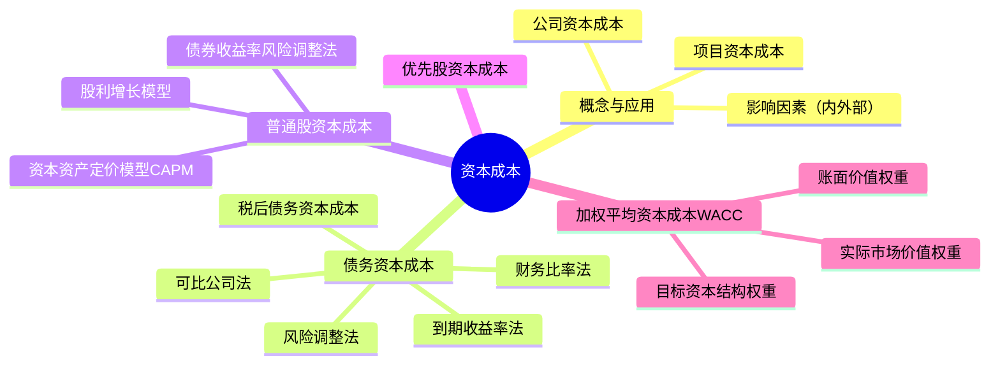

## 📍 章节定位

| 项目 | 信息 |
|------|------|
| **所属科目** | 📊 财务成本管理 |
| **难度等级** | ⭐⭐⭐⭐ |
| **历年分值** | 5-6分 |
| **建议学时** | 6-8h |

## 📝 考情分析

资本成本是连接投资决策与筹资决策的纽带，是财管的核心概念之一。本章题型涵盖客观题与计算综合题，几乎每年必考。重点考点包括：债务资本成本的到期收益率法、税后债务资本成本的计算、普通股资本成本的三种估计方法（CAPM、股利增长模型、债券收益率风险调整法）、加权平均资本成本（WACC）的计算及权重选择、优先股资本成本等。

近年趋势强调主观题综合应用，常与资本预算（第五章）、企业价值评估（第九章）结合出大题。考生必须熟练掌握 WACC 公式的运用及各组成部分的估计方法，并理解目标资本结构、市场价值权重的含义。

**命题规律**：
1. 债务资本成本的到期收益率法（内插法）几乎每年必考；
2. CAPM 估计普通股资本成本是高频考点，常结合β值调整（哈马达公式）出综合题；
3. WACC 计算常作为企业价值评估、资本预算的折现率基础；
4. 权重选择（目标资本结构 vs 市场价值 vs 账面价值）是常见客观题。

**与其他章节的关联**：本章是财管"计算枢纽"——向上承接第四章价值评估基础（CAPM、货币时间价值），向下连接第六章资本预算（WACC 作为折现率）、第十章资本结构（WACC 最小化决策）、第九章企业价值评估（WACC 折现实体现金流量）。

## 🧠 知识框架

## 📖 核心精讲

### 一、资本成本的概念、应用和影响因素

#### （一）资本成本的概念

资本成本是指运用资金投资特定项目的机会成本。这种成本不是实际支付的成本，而是失去的收益，是将资本用于本项目投资所放弃的其他所有等风险投资机会的最高收益，因此被称为**机会成本**。

资本成本的概念包括两方面：
- **筹资角度**：公司筹集和使用资金的成本；
- **投资角度**：投资的必要报酬率。

资本成本分为两类：
- **公司资本成本**：投资者针对整个公司要求的报酬率，是各种资本要素成本的加权平均数；
- **项目资本成本**：公司投资于资本支出项目所要求的报酬率。

**关键理解**：在不考虑所得税、交易费用等因素时，投资者的税前必要报酬率等于筹资者的税前资本成本。

**公司资本成本与项目资本成本的区分**：

| 维度 | 公司资本成本 | 项目资本成本 |
|------|------------|------------|
| 含义 | 投资者针对整个公司要求的报酬率 | 公司投资于特定项目所要求的报酬率 |
| 决定因素 | 公司整体风险 | 项目自身风险 |
| 用途 | 公司整体平均折现率 | 单个项目投资决策的折现率 |
| 关系 | 当项目风险 = 公司现有资产平均风险时，项目资本成本 = 公司资本成本 |

**重要原则**：
- 若项目风险与公司现有资产平均风险相同，可用公司资本成本作为项目折现率；
- 若项目风险高于公司平均，项目折现率应高于公司资本成本（反之亦然）；
- 不能用公司资本成本评估所有项目，否则会错误接受高风险项目、拒绝低风险项目。

#### （二）资本成本的应用

公司资本成本主要用于：
1. **投资决策**：作为投资项目折现率（当项目风险与公司现有资产平均风险相同时）；
2. **筹资决策**：WACC 最小的资本结构即公司价值最大的资本结构；
3. **营运资本管理**：评估营运资本投资和筹资决策；
4. **企业价值评估**：作为现金流量的折现率；
5. **业绩评价**：计算经济增加值（EVA）。

#### （三）资本成本的影响因素

**外部因素**（公司无法控制）：
1. **无风险利率**：上升则债务资本成本和股权资本成本均上升；
2. **市场风险溢价**：影响股权资本成本；
3. **税率**：影响税后债务资本成本及 WACC。

**内部因素**（公司可控制）：
1. **资本结构**：增加债务比重可能降低平均资本成本，但会增加财务风险；
2. **投资政策**：投资于高风险项目会提高公司资产平均风险，进而提高资本成本。

### 二、债务资本成本的估计

#### （一）债务资本成本的概念

债务筹资的特征：
1. 债务筹资产生合同义务（还本付息）；
2. 债权人本息的请求权优先于股东股利；
3. 提供债务资本的投资者没有权利获得高于合同约定利息之外的任何收益。

**重要区分**：
- **历史成本 vs 未来成本**：作为决策依据的资本成本只能是未来借入新债务的成本（未来成本），历史成本是沉没成本；
- **承诺收益 vs 期望收益**：实务中通常以承诺收益率作为税前债务资本成本（理论上应使用期望收益率，但违约风险不大时两者差异小）；
- **长期债务 vs 短期债务**：通常只考虑长期债务，忽略短期债务（因 WACC 主要用于资本预算）。

#### （二）税前债务资本成本的估计方法

**1. 到期收益率法**（公司有上市长期债券时）

求使下式成立的 $r_d$：

$$P_0 = \sum_{t=1}^{n} \frac{I}{(1 + r_d)^t} + \frac{M}{(1 + r_d)^n} = I \times (P/A, r_d, n) + M \times (P/F, r_d, n)$$

其中：$P_0$ 为债券市价；$I$ 为年利息；$M$ 为面值；$r_d$ 为到期收益率（即税前债务资本成本）；$n$ 为剩余期限。

若每年付息 $m$ 次，则计息期利率 $r_d^{period} = r_d / m$，有效年利率 $= (1 + r_d^{period})^m - 1$。

**2. 可比公司法**（公司无上市债券时）

寻找拥有上市债券的可比公司，要求：
- 相同行业、类似商业模式；
- 规模、财务状况相当；
- 现金流量特性类似。

**3. 风险调整法**（公司无上市债券且无可比公司时）

$$r_d = \text{政府债券市场收益率} + \text{信用风险补偿率}$$

信用风险补偿率通过若干信用级别相同的公司债券与政府债券的收益率差平均求得。

**4. 财务比率法**（公司无上市债券且无可比公司时）

根据关键财务比率判断公司的信用级别，再用风险调整法。

**四种方法的选择顺序**：

| 优先级 | 方法 | 适用条件 | 数据可得性 |
|--------|------|----------|-----------|
| 1 | 到期收益率法 | 公司有上市长期债券 | 直接取市价计算 |
| 2 | 可比公司法 | 无上市债券但有可比公司 | 需找同行业类似公司 |
| 3 | 风险调整法 | 无上市债券且无可比公司 | 需政府债收益率+信用补偿 |
| 4 | 财务比率法 | 同上，且无信用评级 | 需先估算信用级别 |

#### （三）税后债务资本成本

因债务利息可在税前扣除，有抵税效应：

$$r_d^{after} = r_d \times (1 - T)$$

其中 $T$ 为企业所得税税率。

**发行费用对债务资本成本的影响**：

若债务筹资发生发行费用 $F$，则需调整债券的初始现金流入（实际筹资净额 = 发行价 - 发行费用），使到期收益率上升：

$$P_0 \times (1 - F) = \sum_{t=1}^{n} \frac{I}{(1 + r_d)^t} + \frac{M}{(1 + r_d)^n}$$

发行费用使实际筹资额减少，从而提高了债务资本成本。

### 三、普通股资本成本的估计

普通股资本成本估计有三种方法。

#### （一）资本资产定价模型（CAPM）

$$r_s = r_f + \beta \times (r_m - r_f)$$

其中：
- $r_s$：普通股资本成本；
- $r_f$：无风险利率；
- $\beta$：股票的贝塔系数；
- $r_m$：市场组合的期望报酬率；
- $(r_m - r_f)$：市场风险溢价。

**估计要点**：
1. **无风险利率估计**：通常选10年期政府债券到期收益率；期限应与现金流量期限匹配。
2. **β值的估计**：选择历史期长度（一般5年或更长，风险特征变化时用变化后年份）；选择收益计量时间间隔（一般用月或周报酬率）；注意历史β值能否代表未来。
3. **市场风险溢价的估计**：选择较长时间跨度；算术平均数适合短期预测，几何平均数适合长期预测，多数人倾向几何平均。

**CAPM 估计的详细说明**：

| 要素 | 估计方法 | 注意事项 |
|------|---------|---------|
| 无风险利率 $r_f$ | 10年期政府债券到期收益率 | 期限匹配；用名义利率（含通胀）或实际利率需与现金流一致 |
| β值 | 回归股票超额收益与市场超额收益 | 历史期5年以上；注意公司业务变化后β可能变化 |
| 市场风险溢价 $(r_m - r_f)$ | 长期历史数据平均 | 几何平均 vs 算术平均的选择；不同市场差异大 |

**β值调整**（哈马达公式，考虑资本结构变化时）：

当公司改变资本结构时，β值会变化。利用哈马达公式可将无负债β转为有负债β：

$$\beta_L = \beta_U \times \left[1 + (1-T) \times \frac{D}{E}\right]$$

其中 $\beta_L$ 为有负债β，$\beta_U$ 为无负债β（经营风险），$D/E$ 为债务与权益市值比。

#### （二）股利增长模型

假设股利以固定增长率 $g$ 增长：

$$r_s = \frac{D_1}{P_0} + g = \frac{D_0 \times (1 + g)}{P_0} + g$$

其中：
- $D_1$：预期下年现金股利额；
- $D_0$：当前刚支付的股利；
- $P_0$：普通股当前市价；
- $g$：股利增长率。

**增长率 $g$ 的三种估计方法**：

1. **历史增长率**：按几何平均数计算（更适合长期持有）：

$$g = \sqrt[n]{\frac{D_n}{D_0}} - 1$$

2. **可持续增长率**（假设不发行新股、经营效率和财务政策不变）：

$$g = \text{期初权益预期净利率} \times \text{预计利润留存率}$$

3. **证券分析师预测**：将不同分析师预测值加权平均。

**三种增长率估计方法比较**：

| 方法 | 公式 | 优点 | 局限 |
|------|------|------|------|
| 历史增长率 | $g = \sqrt[n]{D_n/D_0} - 1$ | 客观、数据可得 | 假设未来延续过去，可能失真 |
| 可持续增长率 | $g = ROE_{期初} \times 留存率$ | 符合财务逻辑 | 假设条件严格（不增发、效率不变） |
| 分析师预测 | 加权平均各机构预测 | 反映前瞻信息 | 主观、各机构可能差异大 |

**发行费用对普通股资本成本的影响**：

若发行新股发生发行费用率 $F$，则股利增长模型调整为：

$$r_s = \frac{D_1}{P_0 \times (1 - F)} + g$$

发行费用使实际筹资额减少，提高了普通股资本成本。

**例**：某公司普通股市价 20 元，刚支付股利 1.5 元，预计增长率 4%，发行费用率 5%。则考虑发行费用后的普通股资本成本为：

$$r_s = \frac{1.5 \times 1.04}{20 \times (1-5\%)} + 4\% = \frac{1.56}{19} + 4\% = 8.21\% + 4\% = 12.21\%$$

不考虑发行费用时：$r_s = 1.56/20 + 4\% = 7.8\% + 4\% = 11.8\%$。发行费用使成本上升 0.41 个百分点。

#### （三）债券收益率风险调整法

根据"风险越大，要求报酬率越高"原理：

$$r_s = r_d^{after} + RP_c$$

其中 $RP_c$ 为普通股风险溢价（通常凭经验估计，约3%～5%）。

**注意**：此处使用的是税后债务资本成本 $r_d^{after}$，而非税前。

**三种普通股资本成本估计方法比较**：

| 方法 | 公式 | 优点 | 局限 |
|------|------|------|------|
| CAPM | $r_s = r_f + \beta(r_m - r_f)$ | 理论严谨、考虑系统风险 | 依赖β和市场风险溢价估计 |
| 股利增长模型 | $r_s = D_1/P_0 + g$ | 简便直观 | 仅适用于稳定分红公司，g难以准确估计 |
| 债券收益风险调整 | $r_s = r_d^{after} + RP_c$ | 计算简单 | 风险溢价凭经验，主观性强 |

### 四、优先股资本成本的估计

优先股股利固定且无到期日，类似永续年金：

$$r_p = \frac{D_p}{P_p \times (1 - F)}$$

其中：$D_p$ 为优先股年股息；$P_p$ 为优先股发行价格；$F$ 为发行费用率。

注意：优先股股利不能税前扣除，无抵税效应。

**优先股与债务、普通股的对比**：

| 特征 | 债务 | 优先股 | 普通股 |
|------|------|--------|--------|
| 收益固定性 | 固定利息 | 固定股息 | 不固定股利 |
| 税前抵扣 | 可抵税 | 不可抵税 | 不可抵税 |
| 到期还本 | 有 | 无（永续） | 无 |
| 剩余索取权 | 优先 | 次于债务 | 最后 |
| 资本成本 | 最低（税后更低） | 居中 | 最高 |

### 五、加权平均资本成本（WACC）

#### （一）WACC 的计算

$$\text{WACC} = w_d \times r_d \times (1 - T) + w_p \times r_p + w_s \times r_s$$

其中：
- $w_d, w_p, w_s$：债务、优先股、普通股的权重；
- $r_d$：税前债务资本成本；
- $r_p$：优先股资本成本；
- $r_s$：普通股资本成本；
- $T$：所得税税率。

#### （二）权重的三种选择

| 权重类型 | 含义 | 评价 |
|----------|------|------|
| **账面价值权重** | 以资产负债表账面价值为基础 | 简便易得，但与市场价值可能差异大，反映过去 |
| **实际市场价值权重** | 以当前市场价格为基础 | 反映当前状况，但市场价格经常变动 |
| **目标资本结构权重** | 以公司目标资本结构为基础 | 反映未来期望结构，适合长期决策，是最佳选择 |

**关键结论**：用于决策的加权平均资本成本应使用目标资本结构权重，因其反映公司未来长期的资本结构计划，避免市场价值波动的影响。

**权重的具体计算**：

设公司目标资本结构为债务 : 优先股 : 普通股 = 30% : 10% : 60%，则：

$$\text{WACC} = 30\% \times r_d \times (1-T) + 10\% \times r_p + 60\% \times r_s$$

**注意**：权重之和必须等于100%。若已知各资本要素的市场价值，可按市场价值计算权重：

$$w_i = \frac{V_i}{\sum V_i}$$

其中 $V_i$ 为第 $i$ 种资本要素的市场价值。

### 六、影响资本成本的因素综合分析

| 因素 | 性质 | 对资本成本的影响 |
|------|------|------------------|
| 无风险利率 | 外部 | 上升 → 资本成本上升 |
| 市场风险溢价 | 外部 | 上升 → 股权资本成本上升 |
| 税率 | 外部 | 上升 → 税后债务成本下降 → WACC下降 |
| 资本结构 | 内部 | 增加债务（适度）→ WACC下降；过度 → 财务风险上升 |
| 投资政策 | 内部 | 高风险项目 → 平均风险上升 → 资本成本上升 |

## 💡 典型例题

**【例题 1】（计算题）**

A 公司 8 年前发行了面值 1000 元、期限 30 年的长期债券，票面利率 7%，每年付息一次，刚支付上年利息，目前市价 900 元。计算该债券的到期收益率（税前债务资本成本）。

**答案**：

设到期收益率为 $r_d$，则：

$$900 = 1000 \times 7\% \times (P/A, r_d, 22) + 1000 \times (P/F, r_d, 22)$$

即：$900 = 70 \times (P/A, r_d, 22) + 1000 \times (P/F, r_d, 22)$

用内插法求解。剩余期限 $= 30 - 8 = 22$ 年。

试 $r_d = 8\%$：$70 \times 10.2007 + 1000 \times 0.1839 = 714.05 + 183.9 = 897.95 \approx 898$

试 $r_d = 7.9\%$：略大于 900

最终 $r_d \approx 7.98\%$

若所得税率 25%，税后债务资本成本 $= 7.98\% \times (1 - 25\%) = 5.99\%$。

**解析**：到期收益率法是求债券市价等于未来现金流现值时的折现率，需用内插法。

---

**【例题 2】（计算题）**

B 公司普通股当前市价 23 元，刚支付股利 $D_0 = 2$ 元/股，预计股利增长率 $g = 5\%$。公司β系数 1.2，无风险利率 4%，市场组合期望报酬率 12%，所得税率 25%。

要求：(1) 用 CAPM 计算普通股资本成本；(2) 用股利增长模型计算普通股资本成本。

**答案**：

(1) CAPM 法：
$$r_s = 4\% + 1.2 \times (12\% - 4\%) = 4\% + 9.6\% = 13.6\%$$

(2) 股利增长模型法：
$$r_s = \frac{D_0 \times (1+g)}{P_0} + g = \frac{2 \times 1.05}{23} + 5\% = \frac{2.1}{23} + 5\% = 9.13\% + 5\% = 14.13\%$$

**解析**：两种方法结果可能不一致，实务中常取平均值或选择更可靠的方法。

---

**【例题 3】（综合题）**

C 公司目标资本结构为：债务 40%，普通股 60%。税前债务资本成本 8%，普通股资本成本 14%，所得税率 25%。

要求：计算 WACC。

**答案**：

$$\text{WACC} = 40\% \times 8\% \times (1 - 25\%) + 60\% \times 14\% = 40\% \times 6\% + 60\% \times 14\% = 2.4\% + 8.4\% = 10.8\%$$

---

**【例题 4】（计算题·到期收益率法+内插法）**

某公司发行的长期债券面值 1000 元，票面利率 8%，每年付息一次，剩余期限 10 年，当前市价 1050 元。所得税率 25%。

要求：用内插法计算税前和税后债务资本成本。

**答案**：

设到期收益率为 $r_d$：

$$1050 = 80 \times (P/A, r_d, 10) + 1000 \times (P/F, r_d, 10)$$

试 $r_d = 7\%$：$80 \times 7.0236 + 1000 \times 0.5083 = 561.89 + 508.3 = 1070.19$（偏高）

试 $r_d = 8\%$：$80 \times 6.7101 + 1000 \times 0.4632 = 536.81 + 463.2 = 1000.01$（偏低）

内插法：

$$r_d = 7\% + \frac{1070.19 - 1050}{1070.19 - 1000.01} \times (8\% - 7\%) = 7\% + \frac{20.19}{70.18} \times 1\% = 7\% + 0.29\% = 7.29\%$$

税后债务资本成本 $= 7.29\% \times (1 - 25\%) = 5.47\%$

**解析**：市价高于面值时（溢价债券），到期收益率低于票面利率。内插法在两个相邻折现率间线性插值。

---

**【例题 5】（计算题·优先股资本成本）**

某公司发行优先股，发行价 50 元/股，年股息 4 元/股，发行费用率 3%。计算优先股资本成本。

**答案**：

$$r_p = \frac{D_p}{P_p \times (1 - F)} = \frac{4}{50 \times (1 - 3\%)} = \frac{4}{48.5} = 8.25\%$$

**解析**：优先股无抵税效应，发行费用使分母减小（实际筹资净额），从而提高资本成本。

---

**【例题 6】（综合计算题·WACC全要素）**

D 公司资本结构及相关数据如下：

| 资本要素 | 市场价值（万元） | 资本成本（税前） |
|---------|----------------|----------------|
| 长期债券 | 3000 | 6% |
| 优先股 | 1000 | 8% |
| 普通股 | 6000 | 13% |

所得税率 25%。

要求：按市场价值权重计算 WACC。

**答案**：

总市场价值 $= 3000 + 1000 + 6000 = 10000$（万元）

权重：
- 债务 $w_d = 3000/10000 = 30\%$
- 优先股 $w_p = 1000/10000 = 10\%$
- 普通股 $w_s = 6000/10000 = 60\%$

税后债务成本 $= 6\% \times (1-25\%) = 4.5\%$

$$\text{WACC} = 30\% \times 4.5\% + 10\% \times 8\% + 60\% \times 13\% = 1.35\% + 0.8\% + 7.8\% = 9.95\%$$

**解析**：WACC 计算时，债务用税后成本，优先股和普通股用税前成本（不抵税）。权重按市场价值计算。

---

**【例题 7】（综合题·β调整与CAPM）**

某公司拟调整资本结构。当前无负债，β值为 1.2，无风险利率 4%，市场组合期望报酬率 12%，所得税率 25%。公司拟发行债务使债务/权益比（D/E）达到 0.5，债务税前成本 6%。

要求：(1) 计算调整前普通股资本成本和 WACC；(2) 用哈马达公式计算调整后的β值；(3) 计算调整后普通股资本成本；(4) 计算调整后 WACC。

**答案**：

(1) 调整前（无负债）：
- 普通股资本成本 $r_s = 4\% + 1.2 \times (12\% - 4\%) = 4\% + 9.6\% = 13.6\%$
- WACC $= 13.6\%$（全权益）

(2) 调整后β值（哈马达公式）：
- 当前β即为无负债β $\beta_U = 1.2$
- $\beta_L = 1.2 \times [1 + (1-25\%) \times 0.5] = 1.2 \times [1 + 0.375] = 1.2 \times 1.375 = 1.65$

(3) 调整后普通股资本成本：
$$r_s = 4\% + 1.65 \times (12\% - 4\%) = 4\% + 13.2\% = 17.2\%$$

(4) 调整后 WACC：
- D/E = 0.5，即 D/(D+E) = 0.5/1.5 = 33.33%，E/(D+E) = 1/1.5 = 66.67%
$$\text{WACC} = 33.33\% \times 6\% \times (1-25\%) + 66.67\% \times 17.2\% = 33.33\% \times 4.5\% + 66.67\% \times 17.2\%$$
$$= 1.5\% + 11.47\% = 12.97\%$$

**解析**：增加债务后，财务风险上升导致β值增大、普通股资本成本上升；但债务抵税效应使 WACC 从 13.6% 降至 12.97%，体现了债务抵税的价值。这是有税MM理论的核心结论。

## 🎯 记忆口诀

**WACC 三要素**：
> 债务税后（抵税）+ 优先股（不抵税）+ 普通股（不抵税）；
> 权重用目标结构，市场价值最相关。

**普通股成本三方法**：
> CAPM 用β和市场风险溢价；
> 股利增长用 $D_1/P_0 + g$；
> 债券收益加风险溢价（3-5%）。

**债务成本四方法**：
> 有债券用到期收益率；
> 无债券找可比公司；
> 无可比用风险调整（政府债+信用补偿）；
> 再无可比用财务比率估信用级别。

**抵税只看债务**：债务利息税前扣除，税后成本 = 税前 × (1-T)；优先股和普通股均无抵税。

**到期收益率法口诀**：
> 市价 = 利息年金现值 + 面值复利现值；
> 溢价债券 YTM < 票面利率，折价债券 YTM > 票面利率。

**发行费用影响**：
> 债务：$P_0(1-F)$ 替代 $P_0$，YTM 上升；
> 普通股：$P_0(1-F)$ 替代 $P_0$，成本上升。

**权重选择三层次**：
> 账面反映过去（不推荐）；
> 市场反映当前（可用但波动）；
> 目标反映未来（最佳选择）。

**哈马达公式**：
> $\beta_L = \beta_U \times [1 + (1-T) \times D/E]$；
> 加债升β升股权成本，抵税降 WACC。

**溢价/折价与 YTM 关系**：
> 溢价债券（市价>面值）：YTM < 票面利率；
> 折价债券（市价<面值）：YTM > 票面利率；
> 平价债券（市价=面值）：YTM = 票面利率。

**资本成本五大应用**：
> 投资折现、筹资比较、营运资本、价值评估、业绩评价（EVA）。

## ✅ 同步练习

**1.（单选题）** 下列关于公司资本成本的说法中，错误的是（　）。

A. 公司资本成本是各种资本要素成本的加权平均数
B. 公司资本成本是投资者要求的必要报酬率
C. 公司资本成本等于投资项目的资本成本
D. 公司资本成本是维持公司股价不变的报酬率

**2.（单选题）** 某公司发行的长期债券面值 1000 元，票面利率 6%，每年付息一次，剩余期限 10 年，当前市价 950 元。若所得税率 25%，则税后债务资本成本约为（　）。

A. 4.5%
B. 5.0%
C. 6.0%
D. 6.7%

**3.（计算题）** 某公司普通股当前市价 20 元，刚支付股利 1.5 元，预计股利年增长率 4%。无风险利率 3%，市场组合期望报酬率 11%，公司β系数 1.1。

要求：(1) 用 CAPM 计算普通股资本成本；(2) 用股利增长模型计算普通股资本成本。

**4.（计算题）** 某公司目标资本结构：债务 30%，优先股 10%，普通股 60%。税前债务资本成本 6%，优先股资本成本 9%，普通股资本成本 13%，所得税率 25%。计算 WACC。

**5.（多选题）** 下列关于加权平均资本成本权重选择的说法中，正确的有（　）。

A. 账面价值权重反映过去，与市场价值差异可能较大
B. 实际市场价值权重反映当前状况，但市场价格经常变动
C. 目标资本结构权重适合长期决策
D. 实务中优先选择账面价值权重

**6.（计算题）** 某公司发行优先股，发行价 100 元，年股息 7 元，发行费用率 4%。计算优先股资本成本。

**7.（单选题）** 某债券面值 1000 元，票面利率 8%，市价 950 元。下列说法正确的是（　）。

A. 到期收益率等于 8%
B. 到期收益率大于 8%
C. 到期收益率小于 8%
D. 无法判断

**8.（计算题）** 某公司普通股市价 25 元，刚支付股利 2 元，预计股利年增长率 6%，发行费用率 4%。计算考虑发行费用后的普通股资本成本。

**9.（单选题）** 下列关于债务资本成本估计的说法中，错误的是（　）。

A. 应使用未来成本而非历史成本
B. 实务中通常以承诺收益率作为税前债务资本成本
C. 通常只考虑长期债务，忽略短期债务
D. 债务资本成本不受所得税影响

**10.（综合计算题）** E 公司目标资本结构：债务 40%，普通股 60%（无优先股）。税前债务资本成本 7%，普通股资本成本 12%（CAPM 估计），所得税率 25%。公司拟投资一个与现有资产风险相同的新项目，项目初始投资 500 万元，预计未来 5 年每年产生现金净流量 130 万元。计算 WACC 并用净现值法判断项目是否可行。

---

**练习答案**：1.C　2.B（税前 $r_d \approx 6.7\%$，税后 $6.7\% \times 0.75 \approx 5.0\%$）　3. (1) $r_s = 3\% + 1.1 \times (11\%-3\%) = 11.8\%$；(2) $r_s = 1.5 \times 1.04/20 + 4\% = 7.8\% + 4\% = 11.8\%$　4. WACC $= 30\% \times 6\% \times 0.75 + 10\% \times 9\% + 60\% \times 13\% = 1.35\% + 0.9\% + 7.8\% = 10.05\%$　5.ABC　6. $r_p = 7/(100 \times 0.96) = 7/96 = 7.29\%$　7.B（折价债券 YTM > 票面利率）　8. $r_s = 2 \times 1.06/(25 \times 0.96) + 6\% = 2.12/24 + 6\% = 8.83\% + 6\% = 14.83\%$　9.D（债务资本成本受所得税影响，税后 = 税前 × (1-T)）　10. WACC $= 40\% \times 7\% \times 0.75 + 60\% \times 12\% = 2.1\% + 7.2\% = 9.3\%$；NPV $= 130 \times (P/A, 9.3\%, 5) - 500 = 130 \times 3.8397 - 500 = 499.16 - 500 = -0.84$ 万元 < 0，项目不可行。
