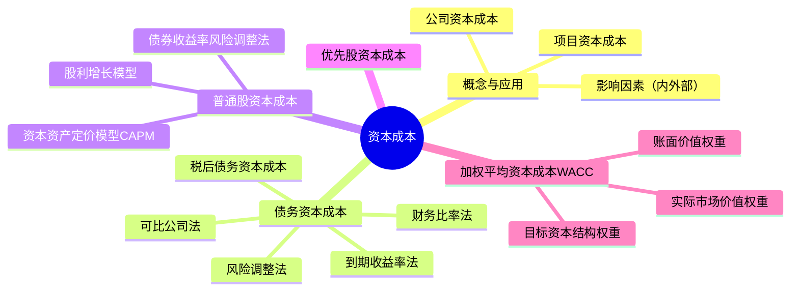

## 📍 章节定位

| 项目 | 信息 |
|------|------|
| **所属科目** | 📊 财务成本管理 |
| **难度等级** | ⭐⭐⭐⭐ |
| **历年分值** | 5-6分 |
| **建议学时** | 6-8h |

## 📝 考情分析

资本成本是连接投资决策与筹资决策的纽带，是财管的核心概念之一。本章题型涵盖客观题与计算综合题，几乎每年必考。重点考点包括：债务资本成本的到期收益率法、税后债务资本成本的计算、普通股资本成本的三种估计方法（CAPM、股利增长模型、债券收益率风险调整法）、加权平均资本成本（WACC）的计算及权重选择、优先股资本成本等。

近年趋势强调主观题综合应用，常与资本预算（第五章）、企业价值评估（第九章）结合出大题。考生必须熟练掌握 WACC 公式的运用及各组成部分的估计方法，并理解目标资本结构、市场价值权重的含义。

## 🧠 知识框架

## 📖 核心精讲

### 一、资本成本的概念、应用和影响因素

#### （一）资本成本的概念

资本成本是指运用资金投资特定项目的机会成本。这种成本不是实际支付的成本，而是失去的收益，是将资本用于本项目投资所放弃的其他所有等风险投资机会的最高收益，因此被称为**机会成本**。

资本成本的概念包括两方面：
- **筹资角度**：公司筹集和使用资金的成本；
- **投资角度**：投资的必要报酬率。

资本成本分为两类：
- **公司资本成本**：投资者针对整个公司要求的报酬率，是各种资本要素成本的加权平均数；
- **项目资本成本**：公司投资于资本支出项目所要求的报酬率。

**关键理解**：在不考虑所得税、交易费用等因素时，投资者的税前必要报酬率等于筹资者的税前资本成本。

#### （二）资本成本的应用

公司资本成本主要用于：
1. **投资决策**：作为投资项目折现率（当项目风险与公司现有资产平均风险相同时）；
2. **筹资决策**：WACC 最小的资本结构即公司价值最大的资本结构；
3. **营运资本管理**：评估营运资本投资和筹资决策；
4. **企业价值评估**：作为现金流量的折现率；
5. **业绩评价**：计算经济增加值（EVA）。

#### （三）资本成本的影响因素

**外部因素**（公司无法控制）：
1. **无风险利率**：上升则债务资本成本和股权资本成本均上升；
2. **市场风险溢价**：影响股权资本成本；
3. **税率**：影响税后债务资本成本及 WACC。

**内部因素**（公司可控制）：
1. **资本结构**：增加债务比重可能降低平均资本成本，但会增加财务风险；
2. **投资政策**：投资于高风险项目会提高公司资产平均风险，进而提高资本成本。

### 二、债务资本成本的估计

#### （一）债务资本成本的概念

债务筹资的特征：
1. 债务筹资产生合同义务（还本付息）；
2. 债权人本息的请求权优先于股东股利；
3. 提供债务资本的投资者没有权利获得高于合同约定利息之外的任何收益。

**重要区分**：
- **历史成本 vs 未来成本**：作为决策依据的资本成本只能是未来借入新债务的成本（未来成本），历史成本是沉没成本；
- **承诺收益 vs 期望收益**：实务中通常以承诺收益率作为税前债务资本成本（理论上应使用期望收益率，但违约风险不大时两者差异小）；
- **长期债务 vs 短期债务**：通常只考虑长期债务，忽略短期债务（因 WACC 主要用于资本预算）。

#### （二）税前债务资本成本的估计方法

**1. 到期收益率法**（公司有上市长期债券时）

求使下式成立的 $r_d$：

$$P_0 = \sum_{t=1}^{n} \frac{I}{(1 + r_d)^t} + \frac{M}{(1 + r_d)^n} = I \times (P/A, r_d, n) + M \times (P/F, r_d, n)$$

其中：$P_0$ 为债券市价；$I$ 为年利息；$M$ 为面值；$r_d$ 为到期收益率（即税前债务资本成本）；$n$ 为剩余期限。

若每年付息 $m$ 次，则计息期利率 $r_d^{period} = r_d / m$，有效年利率 $= (1 + r_d^{period})^m - 1$。

**2. 可比公司法**（公司无上市债券时）

寻找拥有上市债券的可比公司，要求：
- 相同行业、类似商业模式；
- 规模、财务状况相当；
- 现金流量特性类似。

**3. 风险调整法**（公司无上市债券且无可比公司时）

$$r_d = \text{政府债券市场收益率} + \text{信用风险补偿率}$$

信用风险补偿率通过若干信用级别相同的公司债券与政府债券的收益率差平均求得。

**4. 财务比率法**（公司无上市债券且无可比公司时）

根据关键财务比率判断公司的信用级别，再用风险调整法。

#### （三）税后债务资本成本

因债务利息可在税前扣除，有抵税效应：

$$r_d^{after} = r_d \times (1 - T)$$

其中 $T$ 为企业所得税税率。

### 三、普通股资本成本的估计

普通股资本成本估计有三种方法。

#### （一）资本资产定价模型（CAPM）

$$r_s = r_f + \beta \times (r_m - r_f)$$

其中：
- $r_s$：普通股资本成本；
- $r_f$：无风险利率；
- $\beta$：股票的贝塔系数；
- $r_m$：市场组合的期望报酬率；
- $(r_m - r_f)$：市场风险溢价。

**估计要点**：
1. **无风险利率估计**：通常选10年期政府债券到期收益率；期限应与现金流量期限匹配。
2. **β值的估计**：选择历史期长度（一般5年或更长，风险特征变化时用变化后年份）；选择收益计量时间间隔（一般用月或周报酬率）；注意历史β值能否代表未来。
3. **市场风险溢价的估计**：选择较长时间跨度；算术平均数适合短期预测，几何平均数适合长期预测，多数人倾向几何平均。

#### （二）股利增长模型

假设股利以固定增长率 $g$ 增长：

$$r_s = \frac{D_1}{P_0} + g = \frac{D_0 \times (1 + g)}{P_0} + g$$

其中：
- $D_1$：预期下年现金股利额；
- $D_0$：当前刚支付的股利；
- $P_0$：普通股当前市价；
- $g$：股利增长率。

**增长率 $g$ 的三种估计方法**：

1. **历史增长率**：按几何平均数计算（更适合长期持有）：

$$g = \sqrt[n]{\frac{D_n}{D_0}} - 1$$

2. **可持续增长率**（假设不发行新股、经营效率和财务政策不变）：

$$g = \text{期初权益预期净利率} \times \text{预计利润留存率}$$

3. **证券分析师预测**：将不同分析师预测值加权平均。

#### （三）债券收益率风险调整法

根据"风险越大，要求报酬率越高"原理：

$$r_s = r_d^{after} + RP_c$$

其中 $RP_c$ 为普通股风险溢价（通常凭经验估计，约3%～5%）。

### 四、优先股资本成本的估计

优先股股利固定且无到期日，类似永续年金：

$$r_p = \frac{D_p}{P_p \times (1 - F)}$$

其中：$D_p$ 为优先股年股息；$P_p$ 为优先股发行价格；$F$ 为发行费用率。

注意：优先股股利不能税前扣除，无抵税效应。

### 五、加权平均资本成本（WACC）

#### （一）WACC 的计算

$$\text{WACC} = w_d \times r_d \times (1 - T) + w_p \times r_p + w_s \times r_s$$

其中：
- $w_d, w_p, w_s$：债务、优先股、普通股的权重；
- $r_d$：税前债务资本成本；
- $r_p$：优先股资本成本；
- $r_s$：普通股资本成本；
- $T$：所得税税率。

#### （二）权重的三种选择

| 权重类型 | 含义 | 评价 |
|----------|------|------|
| **账面价值权重** | 以资产负债表账面价值为基础 | 简便易得，但与市场价值可能差异大，反映过去 |
| **实际市场价值权重** | 以当前市场价格为基础 | 反映当前状况，但市场价格经常变动 |
| **目标资本结构权重** | 以公司目标资本结构为基础 | 反映未来期望结构，适合长期决策，是最佳选择 |

**关键结论**：用于决策的加权平均资本成本应使用目标资本结构权重，因其反映公司未来长期的资本结构计划，避免市场价值波动的影响。

### 六、影响资本成本的因素综合分析

| 因素 | 性质 | 对资本成本的影响 |
|------|------|------------------|
| 无风险利率 | 外部 | 上升 → 资本成本上升 |
| 市场风险溢价 | 外部 | 上升 → 股权资本成本上升 |
| 税率 | 外部 | 上升 → 税后债务成本下降 → WACC下降 |
| 资本结构 | 内部 | 增加债务（适度）→ WACC下降；过度 → 财务风险上升 |
| 投资政策 | 内部 | 高风险项目 → 平均风险上升 → 资本成本上升 |

## 💡 典型例题

**【例题 1】（计算题）**

A 公司 8 年前发行了面值 1000 元、期限 30 年的长期债券，票面利率 7%，每年付息一次，刚支付上年利息，目前市价 900 元。计算该债券的到期收益率（税前债务资本成本）。

**答案**：

设到期收益率为 $r_d$，则：

$$900 = 1000 \times 7\% \times (P/A, r_d, 22) + 1000 \times (P/F, r_d, 22)$$

即：$900 = 70 \times (P/A, r_d, 22) + 1000 \times (P/F, r_d, 22)$

用内插法求解。剩余期限 $= 30 - 8 = 22$ 年。

试 $r_d = 8\%$：$70 \times 10.2007 + 1000 \times 0.1839 = 714.05 + 183.9 = 897.95 \approx 898$

试 $r_d = 7.9\%$：略大于 900

最终 $r_d \approx 7.98\%$

若所得税率 25%，税后债务资本成本 $= 7.98\% \times (1 - 25\%) = 5.99\%$。

**解析**：到期收益率法是求债券市价等于未来现金流现值时的折现率，需用内插法。

---

**【例题 2】（计算题）**

B 公司普通股当前市价 23 元，刚支付股利 $D_0 = 2$ 元/股，预计股利增长率 $g = 5\%$。公司β系数 1.2，无风险利率 4%，市场组合期望报酬率 12%，所得税率 25%。

要求：(1) 用 CAPM 计算普通股资本成本；(2) 用股利增长模型计算普通股资本成本。

**答案**：

(1) CAPM 法：
$$r_s = 4\% + 1.2 \times (12\% - 4\%) = 4\% + 9.6\% = 13.6\%$$

(2) 股利增长模型法：
$$r_s = \frac{D_0 \times (1+g)}{P_0} + g = \frac{2 \times 1.05}{23} + 5\% = \frac{2.1}{23} + 5\% = 9.13\% + 5\% = 14.13\%$$

**解析**：两种方法结果可能不一致，实务中常取平均值或选择更可靠的方法。

---

**【例题 3】（综合题）**

C 公司目标资本结构为：债务 40%，普通股 60%。税前债务资本成本 8%，普通股资本成本 14%，所得税率 25%。

要求：计算 WACC。

**答案**：

$$\text{WACC} = 40\% \times 8\% \times (1 - 25\%) + 60\% \times 14\% = 40\% \times 6\% + 60\% \times 14\% = 2.4\% + 8.4\% = 10.8\%$$

## 🎯 记忆口诀

**WACC 三要素**：
> 债务税后（抵税）+ 优先股（不抵税）+ 普通股（不抵税）；
> 权重用目标结构，市场价值最相关。

**普通股成本三方法**：
> CAPM 用β和市场风险溢价；
> 股利增长用 $D_1/P_0 + g$；
> 债券收益加风险溢价（3-5%）。

**债务成本四方法**：
> 有债券用到期收益率；
> 无债券找可比公司；
> 无可比用风险调整（政府债+信用补偿）；
> 再无可比用财务比率估信用级别。

**抵税只看债务**：债务利息税前扣除，税后成本 = 税前 × (1-T)；优先股和普通股均无抵税。

## ✅ 同步练习

**1.（单选题）** 下列关于公司资本成本的说法中，错误的是（　）。

A. 公司资本成本是各种资本要素成本的加权平均数
B. 公司资本成本是投资者要求的必要报酬率
C. 公司资本成本等于投资项目的资本成本
D. 公司资本成本是维持公司股价不变的报酬率

**2.（单选题）** 某公司发行的长期债券面值 1000 元，票面利率 6%，每年付息一次，剩余期限 10 年，当前市价 950 元。若所得税率 25%，则税后债务资本成本约为（　）。

A. 4.5%
B. 5.0%
C. 6.0%
D. 6.7%

**3.（计算题）** 某公司普通股当前市价 20 元，刚支付股利 1.5 元，预计股利年增长率 4%。无风险利率 3%，市场组合期望报酬率 11%，公司β系数 1.1。

要求：(1) 用 CAPM 计算普通股资本成本；(2) 用股利增长模型计算普通股资本成本。

**4.（计算题）** 某公司目标资本结构：债务 30%，优先股 10%，普通股 60%。税前债务资本成本 6%，优先股资本成本 9%，普通股资本成本 13%，所得税率 25%。计算 WACC。

**5.（多选题）** 下列关于加权平均资本成本权重选择的说法中，正确的有（　）。

A. 账面价值权重反映过去，与市场价值差异可能较大
B. 实际市场价值权重反映当前状况，但市场价格经常变动
C. 目标资本结构权重适合长期决策
D. 实务中优先选择账面价值权重

---

**练习答案**：1.C　2.D（$r_d \approx 6.7\%$，税后 $6.7\% \times 0.75 \approx 5.0\%$，注意题问税后则选 B；若问税前则选 D。此处问税后，答案为 B）　3. (1) 11.8%；(2) 11.8%　4. WACC = 10.5%　5.ABC
