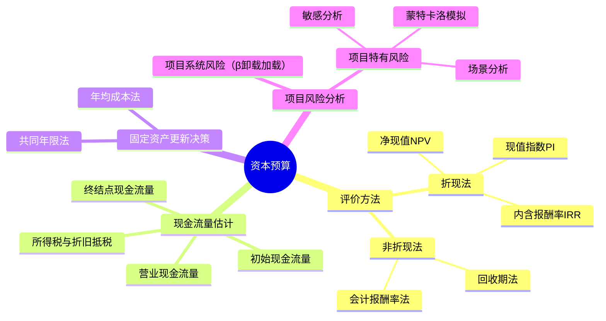

## 1. 章节定位

| 项目 | 信息 |
|------|------|
| 所属科目 | 财务成本管理 |
| 难度等级 | 4 |
| 历年分值 | 8-10分 |
| 建议学时 | 8-10h |

## 2. 考情分析

投资项目资本预算是财管最重要的章节之一，几乎每年必出一道综合大题，分值高、综合性强。核心考点集中于净现值（NPV）、内含报酬率（IRR）、现值指数（PI）的计算与互斥项目决策、投资项目现金流量的估计（特别是初始期、营业期、终结点现金流量的构成）、固定资产更新决策（年均成本法）、项目系统风险的衡量（β卸载与加载）以及敏感分析。

近年趋势强调综合应用，常结合资本成本（确定折现率）、企业价值评估出综合题。考生必须熟练掌握现金流量估计中的所得税影响、折旧抵税、营运资本投资回收等细节，以及β卸载加载公式在项目风险调整中的应用。

**命题规律**：
1. 现金流量估计是必考内容，尤其是折旧抵税、残值变现损益的涉税处理、营运资本回收；
2. 固定资产更新决策（年均成本法）几乎每年必考，需注意旧设备机会成本的处理；
3. β卸载加载是难点，常结合CAPM出综合题；
4. 互斥项目决策（共同年限法、年均净现值法）是高频考点；
5. 敏感分析（最大最小法）近年考查频率上升。

**学习提示**：本章是财管综合度最高的章节，建议通过大量练习掌握现金流量估计的每个细节。特别注意：折旧抵税的计算、旧设备变现损失抵税的处理、营运资本在项目结束时全额回收、利息费用不作为现金流出（已在折现率中体现）。

**与其他章节的关联**：本章向上承接第四章（货币时间价值计算）、第五章（WACC 作为折现率），向下连接第九章（企业价值评估的现金流量折现逻辑类似）、第十章（资本结构影响 WACC 进而影响项目折现率）。

## 3. 知识框架

## 4. 核心精讲

### 一、投资项目评价方法

#### （一）净现值法（NPV）

净现值是特定项目未来现金净流量现值与原始投资额现值的差额：

$$NPV = \sum_{t=0}^{n} \frac{CF_t}{(1 + r)^t}$$

其中 $CF_t$ 为第 $t$ 年现金净流量，$r$ 为资本成本（折现率）。

**决策规则**：
- NPV > 0，项目应予采纳（增加股东财富）；
- NPV = 0，可选择采纳或不采纳（不改变股东财富）；
- NPV < 0，项目应予放弃（减损股东财富）。

**特点**：NPV 是绝对数指标，反映投资效益；具有广泛适用性，理论上最完善；但比较期限、投资额不同的项目时存在局限。

#### （二）现值指数法（PI）

现值指数是未来现金净流量现值与原始投资额现值的比值：

$$PI = \frac{\sum_{t=1}^{n} \frac{CF_t}{(1+r)^t}}{\sum_{t=0}^{n} \frac{I_t}{(1+r)^t}}$$

**决策规则**：PI > 1，项目可行；PI < 1，项目不可行。

**特点**：PI 是相对数指标，反映投资效率，便于比较投资额不同的项目。

#### （三）内含报酬率法（IRR）

内含报酬率是使项目净现值为 0 的折现率：

$$\sum_{t=0}^{n} \frac{CF_t}{(1 + IRR)^t} = 0$$

**决策规则**：IRR > 资本成本，项目可行；IRR < 资本成本，项目不可行。

**IRR 的特点与局限**：
- IRR 是项目本身的投资报酬率，与资本成本无关；
- **互斥项目可能给出与 NPV 矛盾的结论**（规模差异或时间分布差异导致）；
- 对于非常规现金流（多次符号变化）可能存在多个 IRR 或无 IRR。

**修正的内含报酬率（MIRR）**：假设现金流入以资本成本再投资，可解决多 IRR 问题。

#### （四）回收期法

回收期是投资引起的现金流入累计到与投资额相等所需的时间。

**静态回收期**（不考虑时间价值）：

$$\text{回收期} = \frac{\text{原始投资额}}{\text{每年现金净流量}}$$

（每年现金净流量相等时）

**动态回收期**（考虑时间价值）：累计折现现金净流量等于原始投资额的时间。

**特点**：计算简便，便于理解；但忽视了回收期以后的现金流量，且静态回收期未考虑时间价值。

**动态回收期与静态回收期比较**：

| 项目 | 静态回收期 | 动态回收期 |
|------|-----------|-----------|
| 是否折现 | 否 | 是 |
| 计算基础 | 累计现金净流量 | 累计折现现金净流量 |
| 数值大小 | 较小 | 较大（因折现后现金流入变小） |
| 优点 | 计算简便 | 考虑时间价值 |
| 局限 | 忽视时间价值和回收期后现金流 | 仍忽视回收期后现金流 |

#### （五）会计报酬率法

$$\text{会计报酬率} = \frac{\text{年平均净利润}}{\text{原始投资额}}$$

使用账面利润而非现金流量，未考虑时间价值。

### 各评价方法综合比较

| 方法 | 指标类型 | 是否考虑时间价值 | 是否考虑全部现金流 | 适用性 |
|------|---------|----------------|-------------------|--------|
| NPV | 绝对数 | 是 | 是 | 最完善，互斥项目首选 |
| PI | 相对数 | 是 | 是 | 独立项目，资本限量决策 |
| IRR | 相对数 | 是 | 是 | 独立项目，但有局限 |
| 静态回收期 | 时间 | 否 | 否（忽视回收期后） | 辅助参考 |
| 动态回收期 | 时间 | 是 | 否（忽视回收期后） | 辅助参考 |
| 会计报酬率 | 相对数 | 否 | 是（但用利润非现金流） | 辅助参考 |

### 二、各评价方法比较与互斥项目决策

#### （一）独立项目决策

NPV、PI、IRR 给出相同的接受/拒绝结论。

#### （二）互斥项目决策

当 NPV 与 IRR 结论矛盾时，应**以 NPV 为准**，因为 NPV 反映项目对企业价值的绝对贡献。

| 情形 | NPV 与 IRR 矛盾原因 | 决策方法 |
|------|---------------------|----------|
| 规模差异 | 投资额不同 | 用 NPV 或差额 IRR 法 |
| 时间分布差异 | 现金流发生时点不同 | 用 NPV 或共同年限法 |

#### （三）共同年限法与年均净现值法（等额年金法）

用于比较期限不同的互斥项目：

**共同年限法**：将各项目重复投资至相同年限（最小公倍数），计算总 NPV。

**年均净现值法**（等额年金法）：

$$\text{年均净现值} = \frac{NPV}{(P/A, r, n)}$$

选择年均净现值最大的项目。

**共同年限法 vs 年均净现值法比较**：

| 维度 | 共同年限法 | 年均净现值法 |
|------|-----------|------------|
| 基本思路 | 将各项目重复至相同年限 | 将 NPV 转为年均等额年金 |
| 计算复杂度 | 较高（需重复投资） | 较低（一次除法） |
| 假设 | 项目可重复投资 | 项目年金化 |
| 适用 | 项目可无限重复 | 一般情形 |
| 结论 | 两者通常一致 | 两者通常一致 |

**差额 IRR 法**（用于规模不同的互斥项目）：

计算两项目现金流量差额的 IRR，若差额 IRR > 资本成本，选投资额大的项目；反之选投资额小的。

### 三、投资项目现金流量的估计

#### （一）现金流量估计的原则

1. **只考虑增量现金流量**：因采纳项目而新增的现金流量；
2. **区分相关成本与非相关成本**：沉没成本是非相关成本，机会成本是相关成本；
3. **考虑对其他项目的影响**（侵蚀效应/副作用）；
4. **考虑营运资本投资**：项目开始时垫支，结束时回收；
5. **不考虑筹资费用和利息支出**（已在折现率中体现，避免重复计算）。

#### （二）三类现金流量

**1. 初始现金流量**（$t=0$）：
- 固定资产投资（购置、安装、运输等）；
- 垫支营运资本；
- 旧设备变现收入（更新决策时）；
- 旧设备变现损失抵税（或变现收益纳税）。

**2. 营业现金流量**（$t=1$ 到 $n$）：

营业现金流量 = 税后净利润 + 折旧

展开为：

$$CF = (\text{收入} - \text{付现成本} - \text{折旧}) \times (1 - T) + \text{折旧}$$

或：

$$CF = (\text{收入} - \text{付现成本}) \times (1 - T) + \text{折旧} \times T$$

**关键点**：折旧本身是非付现成本，但有"折旧抵税"作用，即 $\text{折旧} \times T$。

**折旧抵税的详细解释**：

折旧减少账面利润，从而减少所得税支出，相当于一项现金流入。设折旧为 $D$，所得税率为 $T$：

- 无折旧时：税后利润 $= (\text{收入} - \text{付现成本}) \times (1-T)$
- 有折旧时：税后利润 $= (\text{收入} - \text{付现成本} - D) \times (1-T)$
- 差异（折旧带来的税后影响）$= D \times (1-T) - 0 = D \times T$... 

实际上，折旧使净利润减少 $D$，但所得税减少 $D \times T$，所以净利润净减少 $D \times (1-T)$，而折旧本身不付现，加回后现金流量净影响 $= -D \times (1-T) + D = D \times T$（即折旧抵税）。

**营业现金流量三种等价公式汇总**：

| 公式 | 表达式 | 适用场景 |
|------|--------|---------|
| 公式一 | 税后净利润 + 折旧 | 已知利润表数据 |
| 公式二 | (收入-付现成本)×(1-T) + 折旧×T | 已知收入、付现成本、折旧 |
| 公式三 | 收入×(1-T) - 付现成本×(1-T) + 折旧×T | 公式二的展开形式 |

**3. 终结点现金流量**（$t=n$）：
- 营业现金流量（最后一年）；
- 固定资产残值变现收入；
- 残值变现损失抵税（或收益纳税）；
- 营运资本回收。

**残值变现的涉税处理**（重要考点）：

| 情形 | 变现损益 | 涉税影响 | 现金流 |
|------|---------|---------|--------|
| 变现价 > 账面价值 | 变现收益 | 纳税（现金流出） | 变现收入 - 收益纳税 |
| 变现价 = 账面价值 | 无损益 | 无涉税 | 变现收入 |
| 变现价 < 账面价值 | 变现损失 | 抵税（现金流入） | 变现收入 + 损失抵税 |

**公式**：终结点设备现金流 $= \text{变现收入} + (\text{账面价值} - \text{变现收入}) \times T$

- 变现收入 < 账面价值时，$(\text{账面价值} - \text{变现收入}) > 0$，抵税增加现金流；
- 变现收入 > 账面价值时，$(\text{账面价值} - \text{变现收入}) < 0$，纳税减少现金流。

**营运资本的处理**：
- 项目初始（$t=0$）：垫支营运资本（现金流出）；
- 项目期间：若销售收入变化导致营运资本需求变化，需追加或释放营运资本；
- 项目终结（$t=n$）：全额回收垫支的营运资本（现金流入）。

**注意**：营运资本本身不涉税，回收金额等于垫支金额（不考虑价格变动）。

#### （三）固定资产更新决策

更新决策的特殊性在于：新旧设备产生的收入相同（或收入难以分离），通常只比较成本。

**方法一：年均成本法**

当新旧设备使用寿命不同时：

$$\text{固定资产年均成本} = \frac{\text{总成本现值}}{(P/A, r, n)}$$

总成本现值 = 原始投资 + 各年付现成本现值 - 折旧抵税现值 - 残值现值 - 营运资本回收现值（含税影响）

选择年均成本较低的方案。

**关键点**：继续使用旧设备时，旧设备的"原始投资"是旧设备的当前变现价值（机会成本），而非历史成本；同时要考虑旧设备变现损失抵税（相当于继续使用的"投资"）。

继续使用旧设备的初始现金流量 = -（旧设备变现价值 + 变现损失抵税）

（负号表示放弃变现而继续使用的机会成本）

### 四、项目系统风险的衡量

当项目风险与公司现有资产平均风险不同时，不能直接用公司 WACC 作为折现率，需调整。

#### （一）β卸载（卸载财务杠杆）

找到可比公司的β，卸载其财务杠杆得到只反映经营风险的β：

$$\beta_{\text{资产}} = \beta_{\text{权益}} \div \left[1 + (1 - T_c) \times \frac{\text{负债}}{\text{权益}}\right]$$

其中 $T_c$ 为可比公司的所得税税率，负债/权益为可比公司的资本结构。

#### （二）β加载（加载目标公司财务杠杆）

将卸载后的β加载目标公司的财务杠杆：

$$\beta_{\text{权益}} = \beta_{\text{资产}} \times \left[1 + (1 - T) \times \frac{\text{负债}}{\text{权益}}\right]$$

其中 $T$ 和负债/权益为目标公司（项目所在公司）的参数。

#### （三）计算项目资本成本

用加载后的β权益，通过 CAPM 计算项目股权资本成本，再结合项目资本结构计算项目 WACC，作为折现率。

### 五、项目特有风险的衡量

#### （一）敏感分析

分析某一因素变动对 NPV 的影响程度。

**最大最小法**：令 NPV = 0，求某因素的最大（或最小）可接受值。

**敏感程度法**：

$$\text{敏感系数} = \frac{\text{NPV变动百分比}}{\text{因素变动百分比}}$$

绝对值越大，NPV对该因素越敏感。

#### （二）场景分析

设定不同场景（如乐观、正常、悲观），分别计算各场景下 NPV。场景分析考虑了多个因素同时变动的影响。

#### （三）蒙特卡洛模拟

通过计算机模拟大量可能的现金流量组合，得出 NPV 的概率分布。

**三种风险分析方法比较**：

| 方法 | 考虑因素数 | 因素变动方式 | 输出结果 | 复杂度 |
|------|-----------|------------|---------|--------|
| 敏感分析 | 单一因素 | 逐一变动 | NPV 对各因素的敏感度 | 低 |
| 场景分析 | 多因素 | 设定场景同时变动 | 各场景下 NPV | 中 |
| 蒙特卡洛模拟 | 多因素 | 随机抽样大量组合 | NPV 的概率分布 | 高 |

## 5. 典型例题

**【例题 1】（计算题）**

某项目原始投资 12000 万元，预计 3 年每年的税后经营现金净流量均为 4600 万元，公司资本成本 10%。

要求：计算 NPV、现值指数、静态回收期，并判断项目是否可行。

**答案**：

- $NPV = 4600 \times (P/A, 10\%, 3) - 12000 = 4600 \times 2.4869 - 12000 = 11440 - 12000 = -560$（万元）
- 现值指数 $PI = 11440 \div 12000 = 0.95$
- 静态回收期 $= 12000 \div 4600 = 2.61$（年）

因 NPV < 0、PI < 1，项目不可行。

---

**【例题 2】（综合题·固定资产更新）**

某公司拟用新设备替换旧设备。旧设备当前账面价值 3000 万元，尚可使用 5 年，预计 5 年后残值为0，当前变现价值 2400 万元，每年付现成本 1000 万元。新设备购置成本 5000 万元，使用 5 年，预计残值 500 万元，每年付现成本 600 万元。新旧设备均按直线法折旧，所得税率 25%，公司资本成本 10%。

要求：判断是否应更新。

**答案**：

继续使用旧设备：
- 初始（机会成本） $= -(2400 + (3000-2400) \times 25\%) = -(2400 + 150) = -2550$（万元）
  （放弃变现价值 2400 万元及变现损失抵税 150 万元）
- 年折旧 $= 3000 \div 5 = 600$（万元）
- 各年营业现金流量 $= -1000 \times (1-25\%) + 600 \times 25\% = -750 + 150 = -600$（万元）
- 总成本现值 $= 2550 + 600 \times (P/A, 10\%, 5) = 2550 + 600 \times 3.7908 = 2550 + 2274.5 = 4824.5$（万元）

更换新设备：
- 初始 $= -5000$（万元）
- 年折旧 $= (5000 - 500) \div 5 = 900$（万元）
- 各年营业现金流量 $= -600 \times (1-25\%) + 900 \times 25\% = -450 + 225 = -225$（万元）
- 残值回收 $= 500$（万元）（残值等于账面价值，无涉税）
- 总成本现值 $= 5000 + 225 \times (P/A, 10\%, 5) - 500 \times (P/F, 10\%, 5) = 5000 + 225 \times 3.7908 - 500 \times 0.6209 = 5000 + 852.9 - 310.5 = 5542.4$（万元）

**年均成本法**（期限相同可直接比较总成本现值）：

- 继续使用旧设备总成本现值 4824.5 万元
- 更换新设备总成本现值 5542.4 万元

继续使用旧设备成本更低，不应更新。

**解析**：更新决策中，旧设备的"投资"是放弃的变现价值加变现损失抵税（机会成本）；折旧抵税是营业现金流量的重要组成部分。

---

**【例题 3】（β卸载加载）**

某公司拟投资一新项目，目标资本结构为负债/权益 = 0.5，所得税率 25%。找到一家可比公司，其β权益为 1.5，资本结构负债/权益 = 0.6，所得税率 20%。无风险利率 4%，市场风险溢价 6%。

要求：计算项目的股权资本成本。

**答案**：

(1) 卸载可比公司财务杠杆：

$$\beta_{\text{资产}} = \frac{1.5}{1 + (1 - 20\%) \times 0.6} = \frac{1.5}{1 + 0.48} = \frac{1.5}{1.48} = 1.014$$

(2) 加载目标公司财务杠杆：

$$\beta_{\text{权益}} = 1.014 \times [1 + (1 - 25\%) \times 0.5] = 1.014 \times [1 + 0.375] = 1.014 \times 1.375 = 1.394$$

(3) 用 CAPM 计算股权资本成本：

$$r_s = 4\% + 1.394 \times 6\% = 4\% + 8.36\% = 12.36\%$$

---

**【例题 4】（计算题·IRR内插法）**

某项目原始投资 10000 万元，预计 3 年每年现金净流量分别为 4000、5000、6000 万元。

要求：用内插法计算 IRR。

**答案**：

设 $IRR = r$，令 $NPV = 0$：

$$-10000 + \frac{4000}{(1+r)} + \frac{5000}{(1+r)^2} + \frac{6000}{(1+r)^3} = 0$$

试 $r = 20\%$：$-10000 + 4000/1.2 + 5000/1.44 + 6000/1.728 = -10000 + 3333.3 + 3472.2 + 3472.2 = 277.7$（偏高）

试 $r = 24\%$：$-10000 + 4000/1.24 + 5000/1.5376 + 6000/1.9066 = -10000 + 3225.8 + 3252.0 + 3147.3 = -374.9$（偏低）

内插法：

$$IRR = 20\% + \frac{277.7 - 0}{277.7 - (-374.9)} \times (24\% - 20\%) = 20\% + \frac{277.7}{652.6} \times 4\% = 20\% + 1.70\% = 21.70\%$$

若公司资本成本 < 21.70%，项目可行。

**解析**：IRR 是令 NPV=0 的折现率，需用内插法在两个相邻折现率间线性插值。

---

**【例题 5】（计算题·共同年限法）**

有 A、B 两个互斥项目。A 项目期限 3 年，NPV = 100 万元；B 项目期限 6 年，NPV = 150 万元。资本成本 10%。

要求：用共同年限法判断应选哪个项目。

**答案**：

最小公倍数为 6 年。A 项目重复 2 次（6÷3=2）。

A 项目 6 年总 NPV $= 100 + 100 \times (P/F, 10\%, 3) = 100 + 100 \times 0.7513 = 100 + 75.13 = 175.13$（万元）

B 项目 6 年总 NPV $= 150$（万元，无需重复）

因 A 项目 6 年总 NPV (175.13) > B 项目 (150)，选 A 项目。

**用年均净现值法验证**：
- A：$100 \div (P/A, 10\%, 3) = 100 \div 2.4869 = 40.21$（万元）
- B：$150 \div (P/A, 10\%, 6) = 150 \div 4.3553 = 34.44$（万元）

A 年均净现值更大，结论一致，选 A。

**解析**：共同年限法将短寿命项目重复投资至与长寿命项目相同的年限，注意重复投资的 NPV 要折现到当前。

---

**【例题 6】（计算题·敏感分析）**

某项目初始投资 10000 万元，预计每年收入 5000 万元，付现成本 3000 万元，折旧 2000 万元（直线法，5年，残值0），所得税率 25%，资本成本 10%，项目期限 5 年。

要求：(1) 计算 NPV；(2) 用最大最小法求年收入的最大可接受下降幅度（即令 NPV=0 时的年收入）。

**答案**：

(1) 年营业现金流量 $= (5000-3000) \times (1-25\%) + 2000 \times 25\% = 1500 + 500 = 2000$（万元）

$$NPV = 2000 \times (P/A, 10\%, 5) - 10000 = 2000 \times 3.7908 - 10000 = 7581.6 - 10000 = -2418.4$$

NPV < 0，项目不可行。

(2) 设年收入为 $X$，令 NPV = 0：

$$[(X - 3000) \times 0.75 + 500] \times 3.7908 = 10000$$

$$0.75X - 2250 + 500 = 10000 / 3.7908 = 2638.1$$

$$0.75X = 2638.1 + 1750 = 4388.1$$

$$X = 5850.8 \text{（万元）}$$

即年收入至少需达到 5850.8 万元（比当前 5000 万元高 850.8 万元）项目才可行。

**解析**：最大最小法令 NPV=0 求某因素的临界值。本题当前收入 5000 低于临界值 5850.8，故 NPV<0。

## 6. 记忆口诀

**NPV/PI/IRR 决策规则**：
> NPV > 0 必采纳，PI > 1 同步走；
> IRR 高于资本成本，独立项目三一致。

**互斥项目决策**：
> 期限不同用共同年限或年均净现值；
> 规模不同用差额 IRR；
> NPV 与 IRR 矛盾，**NPV 说了算**。

**营业现金流量三公式**：
> = 税后净利润 + 折旧
> = (收入-付现成本)×(1-T) + 折旧×T
> = 收入×(1-T) - 付现成本×(1-T) + 折旧×T
> 记住：折旧抵税是关键。

**β卸载加载**：
> 卸载用可比公司：β资产 = β权益 / [1+(1-T可比)×(负债/权益)可比]；
> 加载用目标公司：β权益 = β资产 × [1+(1-T目标)×(负债/权益)目标]。

**更新决策旧设备"投资"**：
> 继续使用旧设备的初始投资 = 变现价值 + 变现损失抵税；
> 机会成本思维，放弃的现金流就是投资。

**现金流量估计五原则**：
> 只看增量（沉没成本不算）；
> 机会成本要算（占用资源的机会成本）；
> 侵蚀效应要算（对其他项目的影响）；
> 营运资本要算（开始垫支、结束回收）；
> 利息费用不算（已在折现率中体现）。

**敏感分析两方法**：
> 最大最小法：令 NPV=0 求因素临界值；
> 敏感程度法：NPV 变动% / 因素变动%。

**残值变现涉税**：
> 变现价 > 账面价值：收益纳税（现金流出）；
> 变现价 < 账面价值：损失抵税（现金流入）；
> 终结点现金流 = 变现收入 + (账面价值 - 变现收入) × T。

**IRR 与 NPV 矛盾原因**：
> 规模不同：大项目 NPV 高但 IRR 低；
> 时间分布不同：前期回款项目 IRR 高但 NPV 低；
> 矛盾时 NPV 说了算。

## 7. 同步练习

**1.（单选题）** 下列关于投资项目评价方法的说法中，错误的是（　）。

A. 净现值法在理论上比其他方法更完善
B. 现值指数是相对数，反映投资效率
C. 内含报酬率法与净现值法对独立项目给出的结论总是一致
D. 回收期法考虑了回收期以后的所有现金流量

**2.（单选题）** 某项目原始投资 10000 万元，预计 4 年每年现金净流量 3500 万元，资本成本 10%。则动态回收期约为（　）年。

A. 2.86
B. 3.21
C. 3.50
D. 4.00

**3.（计算题）** 某项目原始投资 8000 万元，预计 5 年每年税后经营现金净流量 2200 万元，第5年末设备残值 1000 万元，资本成本 10%。计算 NPV 并判断是否可行。

**4.（综合题）** 某公司拟更新设备，旧设备当前变现价值 2000 万元，账面价值 1600 万元，尚可使用 4 年，4 年后残值为0，每年付现成本 1200 万元；新设备购置成本 6000 万元，使用 4 年，4 年后残值 1000 万元，每年付现成本 800 万元。两设备均按直线法折旧，所得税率 25%，资本成本 10%。判断是否更新。

**5.（单选题）** 在项目系统风险衡量中，将可比公司β权益转换为β资产的过程称为（　）。

A. 加载财务杠杆
B. 卸载财务杠杆
C. 风险调整
D. 敏感分析

**6.（计算题）** 某项目原始投资 20000 万元，预计 4 年每年税后经营现金净流量 7000 万元，第4年末设备残值 2000 万元，资本成本 12%。计算 NPV、PI 和静态回收期，并判断是否可行。

**7.（单选题）** 下列关于固定资产更新决策的说法中，正确的是（　）。

A. 继续使用旧设备的初始投资为0
B. 继续使用旧设备的初始投资为旧设备的历史成本
C. 继续使用旧设备的初始投资为旧设备的当前变现价值
D. 继续使用旧设备的初始投资为旧设备的账面价值

**8.（计算题）** A、B 两个互斥项目，资本成本 10%。A 项目期限 2 年，NPV=80 万元；B 项目期限 4 年，NPV=120 万元。用年均净现值法判断应选哪个项目。

**9.（多选题）** 下列关于内含报酬率（IRR）的说法中，正确的有（　）。

A. IRR 是使项目净现值为0的折现率
B. 独立项目中，IRR > 资本成本时项目可行
C. 互斥项目中，IRR 最大的项目一定最优
D. 非常规现金流可能存在多个 IRR

**10.（计算题）** 某可比公司β权益=1.6，负债/权益=0.8，所得税率20%。目标公司拟投资新项目，负债/权益=0.5，所得税率25%。无风险利率3%，市场风险溢价7%。求项目股权资本成本。

**11.（单选题）** (2024年) 甲公司有两个互斥的投资项目M和N，项目M期限为4年，资本成本10%，净现值120万元。项目N期限为3年，资本成本13%，净现值100万元。两个项目均可重置，下列表述中正确的是（　）。已知：(P/A, 10%, 4) = 3.1699，(P/A, 13%, 3) = 2.3612。

A. 项目M永续净现值高于项目N，因此选择项目M
B. 项目M等额年金低于项目N，但永续净现值高于项目N，无法决策
C. 项目M净现值高于项目N，因此选择项目M
D. 项目M等额年金低于项目N，因此选择项目N

**12.（单选题）** (2023年) 某公司拟新建一车间用以生产受市场欢迎的甲产品，据预测甲产品投产后每年可创造100万元的收入；但公司原生产的A产品会因此受到影响，使其年收入由原来的200万元降低到180万元。假设不考虑所得税，则与新建车间相关的现金流量为（　）万元。

A. 20
B. 120
C. 100
D. 80

**13.（单选题）** (2023年) 甲公司拟投资某项目，初始投资额1000万元，建设期为0，经营期限5年，经营期每年现金净流量均为500万元，项目资本成本8%。已知(P/A, 8%, 5) = 3.9927，则该项目净现值对经营期每年现金净流量的敏感系数为（　）。

A. 3.52
B. 2.31
C. -2.31
D. 2

**14.（单选题）** (2023年) 甲公司计划将耗能大、使用年限短的M设备，更换为节能环保、使用年限长的N设备，假设两设备能生产同品种和数量的产品且均能无限重置，甲公司应选择的决策方法是（　）。

A. 动态回收期法
B. 净现值法
C. 平均年成本法
D. 内含报酬率法

**15.（单选题）** (2020年) 甲公司拟投资某项目，一年前花费10万元做过市场调查，后因故中止。现重启该项目，拟使用闲置的一间厂房，厂房购入时价格2000万元，当前市价2500万元，项目还需要投资500万元购入新设备，在进行该项目投资决策时，原始投资额是（　）万元。

A. 2510
B. 2500
C. 3000
D. 3010

**16.（多选题）** (2023年) 现有甲和乙两个互斥投资项目，均可重置，甲项目期限10年，乙项目期限6年，甲项目净现值2000万元，折现率10%。已知(P/A, 10%, 10) = 6.1446，(P/F, 10%, 10) = 0.3855，(P/F, 10%, 20) = 0.1486。下列表述中正确的有（　）。

A. 根据等额年金法，甲项目永续净现值为3254.89万元
B. 根据等额年金法，甲项目等额年金为200万元
C. 根据共同年限法，以最小公倍数确定共同年限甲项目重置的净现值为3068.2万元
D. 根据共同年限法，以最小公倍数确定共同年限甲项目需要重置5次

**17.（多选题）** (2022年) 甲企业计划生产M产品。现有旧设备一台，原值5000万元，已提折旧3500万元，账面价值1500万元。如使用旧设备生产M产品，需对其进行技术改造，追加支出1000万元。企业也可购入新设备生产M产品，新设备市价2000万元，可将旧设备作价1200万元以旧换新。假设不考虑所得税等相关税费的影响，下列关于企业改造旧设备或购买新设备的决策中，正确的有（　）。

A. 旧设备的已提折旧与决策无关
B. 旧设备的以旧换新作价与决策无关
C. 旧设备的账面价值属无关成本
D. 改造旧设备比购买新设备多支出200万元

**18.（多选题）** (2021年) 在进行期限不同的互斥项目选择时，共同年限法和等额年金法的共同缺点有（　）。

A. 忽视了货币的时间价值
B. 无法用于投资额不同项目的优选决策
C. 未考虑通货膨胀严重时的重置成本上升问题
D. 未考虑技术进步快的投资领域的项目投资不可重复问题

**19.（多选题）** (2019年) 甲公司拟在华东地区建立一家专卖店，寿命期6年，资本成本8%，初始现金流量是一次性投入的。该投资现值指数小于1。下列关于该投资的说法中，正确的有（　）。

A. 内含报酬率小于8%
B. 动态回收期小于6年
C. 会计报酬率小于8%
D. 净现值小于0

---

**练习答案**：1.D　2.B　3. NPV = 2200×3.7908 + 1000×0.6209 - 8000 = 8339.8 + 620.9 - 8000 = 960.7万元，可行　4. 继续使用旧设备总成本现值 = 2100 + 850×3.1699 = 4793.4万元；更换新设备总成本现值 = 6000 + 350×3.1699 - 1000×0.6830 = 6421.5万元；不应更新　5.B　6. NPV = 7000×3.0373 + 2000×0.6355 - 20000 = 21261.1 + 1271.0 - 20000 = 2532.1万元；PI = (21261.1+1271.0)/20000 = 1.13；静态回收期 = 20000/7000 = 2.86年；NPV>0且PI>1，可行　7.C　8. A年均=80/1.7355=46.10万元；B年均=120/3.1699=37.86万元；选A　9.ABD（互斥项目IRR最大不一定最优，规模和时间差异可能导致与NPV矛盾）　10. β资产=1.6/[1+(1-20%)×0.8]=1.6/1.64=0.976；β权益=0.976×[1+(1-25%)×0.5]=0.976×1.375=1.342；r_s=3%+1.342×7%=3%+9.39%=12.39%　11.A（M永续净现值 = (120/3.1699)/10% = 37.86/10% = 378.56万元；N永续净现值 = (100/2.3612)/13% = 42.35/13% = 325.78万元，M更高，选M）　12.D（相关现金流量 = 100 − 20 = 80万元，减少的原有收入属于机会成本要扣除）　13.D（原NPV = 500×3.9927−1000 = 996.35万元；现金净流量提高10%增加的NPV = 50×3.9927 = 199.635万元；敏感系数 = 199.635/996.35/10% = 2）　14.C（使用寿命不同且能无限重置的设备更新决策，采用平均年成本法）　15.C（市场调查费和厂房购置成本均为沉没成本，原始投资额 = 2500 + 500 = 3000万元）　16.AC（等额年金 = 2000/6.1446 = 325.489万元；永续净现值 = 325.489/10% = 3254.89万元；10和6的最小公倍数为30，甲项目重置2次，重置净现值 = 2000 + 2000×0.3855 + 2000×0.1486 = 3068.2万元；B错在等额年金应为325.489万元，D错在重置2次而非5次）　17.ACD（旧设备已提折旧和账面价值是沉没成本，与决策无关；以旧换新作价1200万元是机会成本，与决策有关，B错；改造支出1000万元 > 新设备净支出(2000−1200) = 800万元，多支出200万元）　18.CD（共同年限法和等额年金法都考虑了货币时间价值，也能用于投资额不同的项目；其共同缺点是未考虑通货膨胀严重时的重置成本上升和技术进步快的领域项目不可重复问题）　19.AD（现值指数<1 → 净现值<0、内含报酬率<资本成本8%；此时动态回收期>6年，B错；会计报酬率无法确定，C错）
