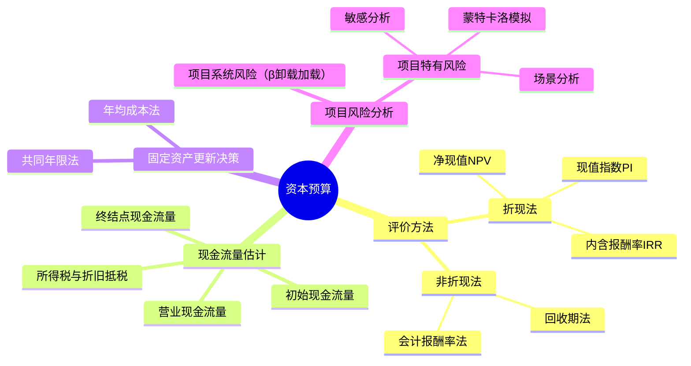

## 📍 章节定位

| 项目 | 信息 |
|------|------|
| **所属科目** | 📊 财务成本管理 |
| **难度等级** | ⭐⭐⭐⭐ |
| **历年分值** | 8-10分 |
| **建议学时** | 8-10h |

## 📝 考情分析

投资项目资本预算是财管最重要的章节之一，几乎每年必出一道综合大题，分值高、综合性强。核心考点集中于净现值（NPV）、内含报酬率（IRR）、现值指数（PI）的计算与互斥项目决策、投资项目现金流量的估计（特别是初始期、营业期、终结点现金流量的构成）、固定资产更新决策（年均成本法）、项目系统风险的衡量（β卸载与加载）以及敏感分析。

近年趋势强调综合应用，常结合资本成本（确定折现率）、企业价值评估出综合题。考生必须熟练掌握现金流量估计中的所得税影响、折旧抵税、营运资本投资回收等细节，以及β卸载加载公式在项目风险调整中的应用。

## 🧠 知识框架

## 📖 核心精讲

### 一、投资项目评价方法

#### （一）净现值法（NPV）

净现值是特定项目未来现金净流量现值与原始投资额现值的差额：

$$NPV = \sum_{t=0}^{n} \frac{CF_t}{(1 + r)^t}$$

其中 $CF_t$ 为第 $t$ 年现金净流量，$r$ 为资本成本（折现率）。

**决策规则**：
- NPV > 0，项目应予采纳（增加股东财富）；
- NPV = 0，可选择采纳或不采纳（不改变股东财富）；
- NPV < 0，项目应予放弃（减损股东财富）。

**特点**：NPV 是绝对数指标，反映投资效益；具有广泛适用性，理论上最完善；但比较期限、投资额不同的项目时存在局限。

#### （二）现值指数法（PI）

现值指数是未来现金净流量现值与原始投资额现值的比值：

$$PI = \frac{\sum_{t=1}^{n} \frac{CF_t}{(1+r)^t}}{\sum_{t=0}^{n} \frac{I_t}{(1+r)^t}}$$

**决策规则**：PI > 1，项目可行；PI < 1，项目不可行。

**特点**：PI 是相对数指标，反映投资效率，便于比较投资额不同的项目。

#### （三）内含报酬率法（IRR）

内含报酬率是使项目净现值为 0 的折现率：

$$\sum_{t=0}^{n} \frac{CF_t}{(1 + IRR)^t} = 0$$

**决策规则**：IRR > 资本成本，项目可行；IRR < 资本成本，项目不可行。

**IRR 的特点与局限**：
- IRR 是项目本身的投资报酬率，与资本成本无关；
- **互斥项目可能给出与 NPV 矛盾的结论**（规模差异或时间分布差异导致）；
- 对于非常规现金流（多次符号变化）可能存在多个 IRR 或无 IRR。

**修正的内含报酬率（MIRR）**：假设现金流入以资本成本再投资，可解决多 IRR 问题。

#### （四）回收期法

回收期是投资引起的现金流入累计到与投资额相等所需的时间。

**静态回收期**（不考虑时间价值）：

$$\text{回收期} = \frac{\text{原始投资额}}{\text{每年现金净流量}}$$

（每年现金净流量相等时）

**动态回收期**（考虑时间价值）：累计折现现金净流量等于原始投资额的时间。

**特点**：计算简便，便于理解；但忽视了回收期以后的现金流量，且静态回收期未考虑时间价值。

#### （五）会计报酬率法

$$\text{会计报酬率} = \frac{\text{年平均净利润}}{\text{原始投资额}}$$

使用账面利润而非现金流量，未考虑时间价值。

### 二、各评价方法比较与互斥项目决策

#### （一）独立项目决策

NPV、PI、IRR 给出相同的接受/拒绝结论。

#### （二）互斥项目决策

当 NPV 与 IRR 结论矛盾时，应**以 NPV 为准**，因为 NPV 反映项目对企业价值的绝对贡献。

| 情形 | NPV 与 IRR 矛盾原因 | 决策方法 |
|------|---------------------|----------|
| **规模差异** | 投资额不同 | 用 NPV 或差额 IRR 法 |
| **时间分布差异** | 现金流发生时点不同 | 用 NPV 或共同年限法 |

#### （三）共同年限法与年均净现值法（等额年金法）

用于比较期限不同的互斥项目：

**共同年限法**：将各项目重复投资至相同年限（最小公倍数），计算总 NPV。

**年均净现值法**（等额年金法）：

$$\text{年均净现值} = \frac{NPV}{(P/A, r, n)}$$

选择年均净现值最大的项目。

### 三、投资项目现金流量的估计

#### （一）现金流量估计的原则

1. **只考虑增量现金流量**：因采纳项目而新增的现金流量；
2. **区分相关成本与非相关成本**：沉没成本是非相关成本，机会成本是相关成本；
3. **考虑对其他项目的影响**（侵蚀效应/副作用）；
4. **考虑营运资本投资**：项目开始时垫支，结束时回收；
5. **不考虑筹资费用和利息支出**（已在折现率中体现，避免重复计算）。

#### （二）三类现金流量

**1. 初始现金流量**（$t=0$）：
- 固定资产投资（购置、安装、运输等）；
- 垫支营运资本；
- 旧设备变现收入（更新决策时）；
- 旧设备变现损失抵税（或变现收益纳税）。

**2. 营业现金流量**（$t=1$ 到 $n$）：

营业现金流量 = 税后净利润 + 折旧

展开为：

$$CF = (\text{收入} - \text{付现成本} - \text{折旧}) \times (1 - T) + \text{折旧}$$

或：

$$CF = (\text{收入} - \text{付现成本}) \times (1 - T) + \text{折旧} \times T$$

**关键点**：折旧本身是非付现成本，但有"折旧抵税"作用，即 $\text{折旧} \times T$。

**3. 终结点现金流量**（$t=n$）：
- 营业现金流量（最后一年）；
- 固定资产残值变现收入；
- 残值变现损失抵税（或收益纳税）；
- 营运资本回收。

#### （三）固定资产更新决策

更新决策的特殊性在于：新旧设备产生的收入相同（或收入难以分离），通常只比较成本。

**方法一：年均成本法**

当新旧设备使用寿命不同时：

$$\text{固定资产年均成本} = \frac{\text{总成本现值}}{(P/A, r, n)}$$

总成本现值 = 原始投资 + 各年付现成本现值 - 折旧抵税现值 - 残值现值 - 营运资本回收现值（含税影响）

选择年均成本较低的方案。

**关键点**：继续使用旧设备时，旧设备的"原始投资"是旧设备的当前变现价值（机会成本），而非历史成本；同时要考虑旧设备变现损失抵税（相当于继续使用的"投资"）。

继续使用旧设备的初始现金流量 = -（旧设备变现价值 + 变现损失抵税）

（负号表示放弃变现而继续使用的机会成本）

### 四、项目系统风险的衡量

当项目风险与公司现有资产平均风险不同时，不能直接用公司 WACC 作为折现率，需调整。

#### （一）β卸载（卸载财务杠杆）

找到可比公司的β，卸载其财务杠杆得到只反映经营风险的β：

$$\beta_{\text{资产}} = \beta_{\text{权益}} \div \left[1 + (1 - T_c) \times \frac{\text{负债}}{\text{权益}}\right]$$

其中 $T_c$ 为可比公司的所得税税率，负债/权益为可比公司的资本结构。

#### （二）β加载（加载目标公司财务杠杆）

将卸载后的β加载目标公司的财务杠杆：

$$\beta_{\text{权益}} = \beta_{\text{资产}} \times \left[1 + (1 - T) \times \frac{\text{负债}}{\text{权益}}\right]$$

其中 $T$ 和负债/权益为目标公司（项目所在公司）的参数。

#### （三）计算项目资本成本

用加载后的β权益，通过 CAPM 计算项目股权资本成本，再结合项目资本结构计算项目 WACC，作为折现率。

### 五、项目特有风险的衡量

#### （一）敏感分析

分析某一因素变动对 NPV 的影响程度。

**最大最小法**：令 NPV = 0，求某因素的最大（或最小）可接受值。

**敏感程度法**：

$$\text{敏感系数} = \frac{\text{NPV变动百分比}}{\text{因素变动百分比}}$$

绝对值越大，NPV对该因素越敏感。

#### （二）场景分析

设定不同场景（如乐观、正常、悲观），分别计算各场景下 NPV。场景分析考虑了多个因素同时变动的影响。

#### （三）蒙特卡洛模拟

通过计算机模拟大量可能的现金流量组合，得出 NPV 的概率分布。

## 💡 典型例题

**【例题 1】（计算题）**

某项目原始投资 12000 万元，预计 3 年每年的税后经营现金净流量均为 4600 万元，公司资本成本 10%。

要求：计算 NPV、现值指数、静态回收期，并判断项目是否可行。

**答案**：

- $NPV = 4600 \times (P/A, 10\%, 3) - 12000 = 4600 \times 2.4869 - 12000 = 11440 - 12000 = -560$（万元）
- 现值指数 $PI = 11440 \div 12000 = 0.95$
- 静态回收期 $= 12000 \div 4600 = 2.61$（年）

因 NPV < 0、PI < 1，项目不可行。

---

**【例题 2】（综合题·固定资产更新）**

某公司拟用新设备替换旧设备。旧设备当前账面价值 3000 万元，尚可使用 5 年，预计 5 年后残值为0，当前变现价值 2400 万元，每年付现成本 1000 万元。新设备购置成本 5000 万元，使用 5 年，预计残值 500 万元，每年付现成本 600 万元。新旧设备均按直线法折旧，所得税率 25%，公司资本成本 10%。

要求：判断是否应更新。

**答案**：

继续使用旧设备：
- 初始（机会成本） $= -(2400 + (3000-2400) \times 25\%) = -(2400 + 150) = -2550$（万元）
  （放弃变现价值 2400 万元及变现损失抵税 150 万元）
- 年折旧 $= 3000 \div 5 = 600$（万元）
- 各年营业现金流量 $= -1000 \times (1-25\%) + 600 \times 25\% = -750 + 150 = -600$（万元）
- 总成本现值 $= 2550 + 600 \times (P/A, 10\%, 5) = 2550 + 600 \times 3.7908 = 2550 + 2274.5 = 4824.5$（万元）

更换新设备：
- 初始 $= -5000$（万元）
- 年折旧 $= (5000 - 500) \div 5 = 900$（万元）
- 各年营业现金流量 $= -600 \times (1-25\%) + 900 \times 25\% = -450 + 225 = -225$（万元）
- 残值回收 $= 500$（万元）（残值等于账面价值，无涉税）
- 总成本现值 $= 5000 + 225 \times (P/A, 10\%, 5) - 500 \times (P/F, 10\%, 5) = 5000 + 225 \times 3.7908 - 500 \times 0.6209 = 5000 + 852.9 - 310.5 = 5542.4$（万元）

**年均成本法**（期限相同可直接比较总成本现值）：

- 继续使用旧设备总成本现值 4824.5 万元
- 更换新设备总成本现值 5542.4 万元

继续使用旧设备成本更低，不应更新。

**解析**：更新决策中，旧设备的"投资"是放弃的变现价值加变现损失抵税（机会成本）；折旧抵税是营业现金流量的重要组成部分。

---

**【例题 3】（β卸载加载）**

某公司拟投资一新项目，目标资本结构为负债/权益 = 0.5，所得税率 25%。找到一家可比公司，其β权益为 1.5，资本结构负债/权益 = 0.6，所得税率 20%。无风险利率 4%，市场风险溢价 6%。

要求：计算项目的股权资本成本。

**答案**：

(1) 卸载可比公司财务杠杆：

$$\beta_{\text{资产}} = \frac{1.5}{1 + (1 - 20\%) \times 0.6} = \frac{1.5}{1 + 0.48} = \frac{1.5}{1.48} = 1.014$$

(2) 加载目标公司财务杠杆：

$$\beta_{\text{权益}} = 1.014 \times [1 + (1 - 25\%) \times 0.5] = 1.014 \times [1 + 0.375] = 1.014 \times 1.375 = 1.394$$

(3) 用 CAPM 计算股权资本成本：

$$r_s = 4\% + 1.394 \times 6\% = 4\% + 8.36\% = 12.36\%$$

## 🎯 记忆口诀

**NPV/PI/IRR 决策规则**：
> NPV > 0 必采纳，PI > 1 同步走；
> IRR 高于资本成本，独立项目三一致。

**互斥项目决策**：
> 期限不同用共同年限或年均净现值；
> 规模不同用差额 IRR；
> NPV 与 IRR 矛盾，**NPV 说了算**。

**营业现金流量三公式**：
> = 税后净利润 + 折旧
> = (收入-付现成本)×(1-T) + 折旧×T
> = 收入×(1-T) - 付现成本×(1-T) + 折旧×T
> 记住：折旧抵税是关键。

**β卸载加载**：
> 卸载用可比公司：β资产 = β权益 / [1+(1-T可比)×(负债/权益)可比]；
> 加载用目标公司：β权益 = β资产 × [1+(1-T目标)×(负债/权益)目标]。

## ✅ 同步练习

**1.（单选题）** 下列关于投资项目评价方法的说法中，错误的是（　）。

A. 净现值法在理论上比其他方法更完善
B. 现值指数是相对数，反映投资效率
C. 内含报酬率法与净现值法对独立项目给出的结论总是一致
D. 回收期法考虑了回收期以后的所有现金流量

**2.（单选题）** 某项目原始投资 10000 万元，预计 4 年每年现金净流量 3500 万元，资本成本 10%。则动态回收期约为（　）年。

A. 2.86
B. 3.21
C. 3.50
D. 4.00

**3.（计算题）** 某项目原始投资 8000 万元，预计 5 年每年税后经营现金净流量 2200 万元，第5年末设备残值 1000 万元，资本成本 10%。计算 NPV 并判断是否可行。

**4.（综合题）** 某公司拟更新设备，旧设备当前变现价值 2000 万元，账面价值 1600 万元，尚可使用 4 年，4 年后残值为0，每年付现成本 1200 万元；新设备购置成本 6000 万元，使用 4 年，4 年后残值 1000 万元，每年付现成本 800 万元。两设备均按直线法折旧，所得税率 25%，资本成本 10%。判断是否更新。

**5.（单选题）** 在项目系统风险衡量中，将可比公司β权益转换为β资产的过程称为（　）。

A. 加载财务杠杆
B. 卸载财务杠杆
C. 风险调整
D. 敏感分析

---

**练习答案**：1.D　2.B　3. NPV = 2200×3.7908 + 1000×0.6209 - 8000 = 8339.8 + 620.9 - 8000 = 960.7万元，可行　4. 继续使用旧设备总成本现值 = 2100 + 850×3.1699 = 4793.4万元；更换新设备总成本现值 = 6000 + 350×3.1699 - 1000×0.6830 = 6421.5万元；不应更新　5.B
