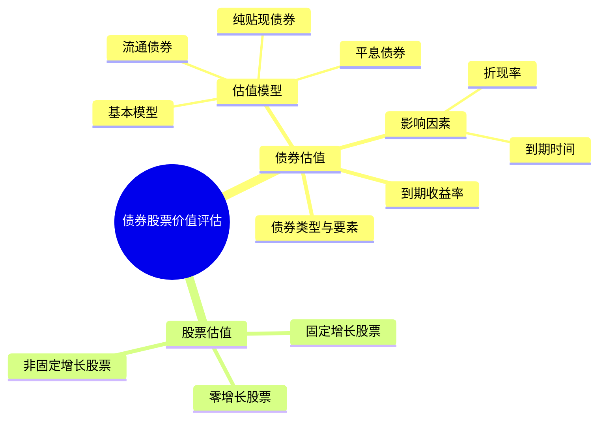

## 📍 章节定位

| 项目 | 信息 |
|------|------|
| **所属科目** | 📊 财务成本管理 |
| **难度等级** | ⭐⭐⭐ |
| **历年分值** | 4-6分 |
| **建议学时** | 4-5h |

## 📝 考情分析

本章是价值评估原理在债券和股票上的应用，题型以客观题与小型计算题为主。核心考点包括：债券估值基本模型、平息债券（年内多次付息）估值、纯贴现债券（零息债券）估值、流通债券估值（非整数计息期）、债券价值与折现率及到期时间的关系、到期收益率的计算、股票估值的三种模型（零增长、固定增长、非固定增长）。

近年趋势强调与资本成本、企业价值评估的结合。考生须熟练掌握债券估值公式中折现率与票面利率的比较结论（溢价/平价/折价发行）、有效年利率与计息期利率的换算、固定增长股票估值模型 $P_0 = D_1/(r_s - g)$ 的应用条件。

## 🧠 知识框架

## 📖 核心精讲

### 一、债券价值评估

#### （一）债券的要素与分类

**债券要素**：
1. **面值（M）**：到期偿还的本金；
2. **票面利率（coupon rate）**：按面值计算的年利息比率；
3. **付息频率**：一年一次、半年一次、季度一次等；
4. **到期日**：偿还本金的日期。

**债券分类**：按是否记名、能否转换股票、能否提前赎回、有无财产抵押、能否上市、偿还方式等分类。

#### （二）债券估值模型

**1. 债券估值基本模型**（每年付息一次、到期还本）

$$V_d = \sum_{t=1}^{n} \frac{I}{(1 + r_d)^t} + \frac{M}{(1 + r_d)^n} = I \times (P/A, r_d, n) + M \times (P/F, r_d, n)$$

其中：
- $V_d$：债券价值；
- $I$：每年利息 $= M \times \text{票面利率}$；
- $M$：面值；
- $r_d$：年折现率（当前等风险投资的市场利率）；
- $n$：到期前的年数。

**2. 平息债券估值**（年内多次付息）

$$V_d = \sum_{t=1}^{m \times n} \frac{I/m}{(1 + r_d/m)^t} + \frac{M}{(1 + r_d/m)^{m \times n}} = \frac{I}{m} \times (P/A, r_d/m, m \times n) + M \times (P/F, r_d/m, m \times n)$$

其中 $m$ 为每年付息次数，$r_d/m$ 为计息期折现率。

注意：当给出的折现率是有效年利率时，需先换算为计息期折现率：

$$r_d^{period} = (1 + \text{有效年利率})^{1/m} - 1$$

**3. 纯贴现债券（零息债券）估值**

承诺在未来某一确定日期按面值支付，期间无利息支付：

$$V_d = \frac{F}{(1 + r_d)^n}$$

到期一次还本付息债券（单利计息）也属此类，到期日支付额 $F = M + M \times \text{票面利率} \times n$。

**4. 流通债券估值**

流通债券是已发行并在二级市场流通的债券，估值时点可以是任何时点，会产生"非整数计息期"问题。

**两种计算方法**：
- 方法一：以现在（估值日）为折算时点，分别计算各次现金流量现值（注意非整数期折现）；
- 方法二：先计算下一次付息日的债券价值，再折算到现在。

**流通债券价值变动特点**：在折现率不变的情况下，流通债券价值在两个付息日之间呈周期性波动。折价发行债券价值随时间波动上升，溢价发行债券价值随时间波动下降，付息日价值发生跳跃。

#### （三）债券价值的影响因素

**1. 债券价值与折现率**

| 折现率 vs 票面利率 | 债券价值 vs 面值 | 发行方式 |
|-------------------|-----------------|----------|
| 折现率 = 票面利率 | 债券价值 = 面值 | 平价发行 |
| 折现率 > 票面利率 | 债券价值 < 面值 | 折价发行 |
| 折现率 < 票面利率 | 债券价值 > 面值 | 溢价发行 |

**计息期的影响**：票面利率和计息期必须同时报价，不能分割。溢价债券付息频率加快会使其价值更高，折价债券付息频率加快会使其价值更低。

**2. 债券价值与到期时间**

在折现率不变的情况下，随到期日临近，债券价值逐渐趋向面值：
- 折价发行债券：价值随时间逐渐升高（趋向面值）；
- 平价发行债券：价值一直等于面值；
- 溢价发行债券：价值随时间逐渐下降（趋向面值）。

到期日债券价值等于面值加上最后一次利息。

#### （四）到期收益率（YTM）

到期收益率是使债券未来现金流量现值等于债券购入价格的折现率，即投资者持有到期的实际报酬率。

$$P_0 = \sum_{t=1}^{n} \frac{I}{(1 + r_d)^t} + \frac{M}{(1 + r_d)^n}$$

求 $r_d$（用内插法求解）。到期收益率是选购债券的重要依据。

### 二、股票价值评估

#### （一）股票估值的基本模型

股票价值是股票未来现金流量（股利和售价）的现值。

$$P_0 = \sum_{t=1}^{\infty} \frac{D_t}{(1 + r_s)^t}$$

其中 $D_t$ 为第 $t$ 年股利，$r_s$ 为股权资本成本（折现率）。

#### （二）零增长股票估值

假设股利永远保持不变 $D$：

$$P_0 = \frac{D}{r_s}$$

类似永续年金。

#### （三）固定增长股票估值（戈登模型）

假设股利以固定增长率 $g$ 增长：

$$P_0 = \frac{D_1}{r_s - g} = \frac{D_0 \times (1 + g)}{r_s - g}$$

**应用条件**：
1. $r_s > g$（否则公式无意义）；
2. 增长率 $g$ 长期保持不变；
3. 增长率 $g$ 的估计应合理（可用可持续增长率或历史几何平均增长率）。

**关键理解**：该公式假设第一期股利为 $D_1$（下一年股利），而非 $D_0$（刚支付的股利）。

#### （四）非固定增长股票估值

分两阶段：详细预测期 + 后续期（固定增长）

**步骤**：
1. 计算详细预测期内各年股利的现值；
2. 计算详细预测期末股价的现值（用固定增长模型）：

$$P_n = \frac{D_{n+1}}{r_s - g}$$

3. 股票价值 = 详细预测期股利现值 + 期末股价现值：

$$P_0 = \sum_{t=1}^{n} \frac{D_t}{(1 + r_s)^t} + \frac{P_n}{(1 + r_s)^n}$$

#### （五）股票的期望报酬率

假设股票当前价格 $P_0$ 已知，求期望报酬率 $r_s$：

**固定增长模型下**：

$$r_s = \frac{D_1}{P_0} + g$$

即：期望报酬率 = 股利收益率 + 资本利得收益率。

## 💡 典型例题

**【例题 1】（计算题）**

ABC 公司拟发行面值 1000 元、票面利率 8%、每年付息一次、5 年到期的债券。当前等风险投资的市场利率为 10%。计算债券价值并判断发行方式。

**答案**：

$$V_d = 80 \times (P/A, 10\%, 5) + 1000 \times (P/F, 10\%, 5)$$

$$= 80 \times 3.7908 + 1000 \times 0.6209 = 303.26 + 620.9 = 924.16 \text{（元）}$$

因折现率（10%）高于票面利率（8%），债券折价发行，价值低于面值。

---

**【例题 2】（计算题）**

某债券面值 1000 元，票面利率 8%，每半年付息一次，5 年到期。年折现率（有效年利率）为 10.25%。

要求：计算债券价值。

**答案**：

- 半年计息期利率 $= (1 + 10.25\%)^{1/2} - 1 = 5\%$
- 半年利息 $= 1000 \times 8\% \div 2 = 40$（元）
- 计息期数 $= 5 \times 2 = 10$（期）
- 债券价值 $= 40 \times (P/A, 5\%, 10) + 1000 \times (P/F, 5\%, 10)$

$$= 40 \times 7.7217 + 1000 \times 0.6139 = 308.87 + 613.9 = 922.77 \text{（元）}$$

**解析**：年内多次付息时，须将有效年利率换算为计息期利率，再按计息期数计算。

---

**【例题 3】（计算题）**

某股票刚支付股利 $D_0 = 2$ 元，预计股利年增长率 5%，股权资本成本 12%。计算股票价值。若当前市价为 30 元，计算期望报酬率。

**答案**：

(1) 股票价值：

$$P_0 = \frac{D_0 \times (1 + g)}{r_s - g} = \frac{2 \times 1.05}{12\% - 5\%} = \frac{2.1}{7\%} = 30 \text{（元）}$$

(2) 期望报酬率：

$$r_s = \frac{D_1}{P_0} + g = \frac{2.1}{30} + 5\% = 7\% + 5\% = 12\%$$

即股利收益率 7% + 资本利得收益率 5% = 12%。

---

**【例题 4】（非固定增长）**

某股票预计未来 3 年股利高速增长，增长率 20%，之后转为固定增长 5%。刚支付股利 $D_0 = 1$ 元，股权资本成本 12%。计算股票价值。

**答案**：

- $D_1 = 1 \times 1.2 = 1.2$（元）
- $D_2 = 1.2 \times 1.2 = 1.44$（元）
- $D_3 = 1.44 \times 1.2 = 1.728$（元）
- $D_4 = 1.728 \times 1.05 = 1.8144$（元）

第3年末股价：$P_3 = D_4 / (r_s - g) = 1.8144 / (12\% - 5\%) = 1.8144 / 7\% = 25.92$（元）

股票价值：

$$P_0 = \frac{1.2}{1.12} + \frac{1.44}{1.12^2} + \frac{1.728}{1.12^3} + \frac{25.92}{1.12^3}$$

$$= 1.071 + 1.148 + 1.229 + 18.438 = 21.89 \text{（元）}$$

## 🎯 记忆口诀

**债券估值三要素**：
> 利息年金、本金复利、折现率用市场利率。

**折现率 vs 票面利率**：
> 折现高 → 折价；折现低 → 溢价；相等 → 平价。

**到期时间影响**：
> 折价升、溢价降、平价不变，最终都到面值。

**股票固定增长**：
> $P_0 = D_1 / (r_s - g)$，注意是 $D_1$ 不是 $D_0$；
> 期望报酬率 = 股利收益率 + 资本利得收益率。

## ✅ 同步练习

**1.（单选题）** 某债券面值 1000 元，票面利率 6%，每年付息一次，5 年到期，当前市场利率 8%。则该债券（　）。

A. 平价发行
B. 折价发行
C. 溢价发行
D. 无法判断

**2.（单选题）** 某零息债券面值 1000 元，期限 10 年，市场利率 8%，则其价值为（　）元。

A. 463.19
B. 500.00
C. 675.56
D. 925.93

**3.（计算题）** 某债券面值 1000 元，票面利率 10%，每年付息一次，3 年到期，当前市场利率 12%。计算债券价值。

**4.（计算题）** 某股票刚支付股利 1.5 元，预计股利年增长率 4%，股权资本成本 10%。计算股票价值。若当前市价 25 元，计算期望报酬率。

**5.（单选题）** 下列关于平息债券的说法中，正确的是（　）。

A. 溢价债券付息频率加快会使其价值降低
B. 折价债券付息频率加快会使其价值降低
C. 平价债券付息频率不影响其价值
D. 平息债券价值与付息频率无关

---

**练习答案**：1.B　2.A（$1000 \times (P/F, 8\%, 10) = 1000 \times 0.4632$）　3. 951.96元（$100 \times 2.4018 + 1000 \times 0.7118$）　4. 股票价值26元；期望报酬率10.24%　5.B
