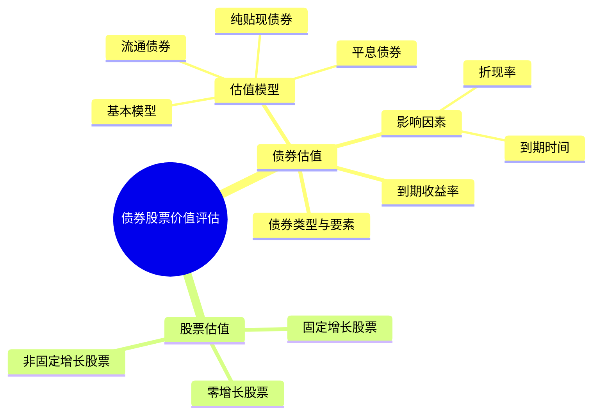

## 📍 章节定位

| 项目 | 信息 |
|------|------|
| **所属科目** | 📊 财务成本管理 |
| **难度等级** | ⭐⭐⭐ |
| **历年分值** | 4-6分 |
| **建议学时** | 4-5h |

## 📝 考情分析

本章是价值评估原理在债券和股票上的应用，题型以客观题与小型计算题为主。核心考点包括：债券估值基本模型、平息债券（年内多次付息）估值、纯贴现债券（零息债券）估值、流通债券估值（非整数计息期）、债券价值与折现率及到期时间的关系、到期收益率的计算、股票估值的三种模型（零增长、固定增长、非固定增长）。

近年趋势强调与资本成本、企业价值评估的结合。考生须熟练掌握债券估值公式中折现率与票面利率的比较结论（溢价/平价/折价发行）、有效年利率与计息期利率的换算、固定增长股票估值模型 $P_0 = D_1/(r_s - g)$ 的应用条件。

**命题规律**：
1. 债券价值计算几乎每年必考，尤其关注平息债券（年内多次付息）和流通债券（非整数计息期）；
2. 折现率与票面利率的关系（溢价/平价/折价）是高频客观题；
3. 到期收益率的内插法计算常与资本成本结合；
4. 固定增长股票估值模型 $P_0 = D_1/(r_s - g)$ 是核心公式，反复考查；
5. 非固定增长股票的两阶段估值是综合题常考内容。

**与其他章节的关联**：本章是第四章（货币时间价值）的直接应用，向下连接第五章（债务资本成本的到期收益率法即债券 YTM）、第九章（企业价值评估的现金流量折现与股票估值逻辑一致）。

## 🧠 知识框架



## 📖 核心精讲

### 一、债券价值评估

#### （一）债券的要素与分类

**债券要素**：
1. **面值（M）**：到期偿还的本金；
2. **票面利率（coupon rate）**：按面值计算的年利息比率；
3. **付息频率**：一年一次、半年一次、季度一次等；
4. **到期日**：偿还本金的日期。

**债券与股票的特征对比**：

| 特征 | 债券 | 股票 |
|------|------|------|
| 现金流 | 固定利息 + 到期还本 | 不固定股利，无到期 |
| 风险 | 较低（优先受偿） | 较高（剩余索取权） |
| 收益 | 利息收益 | 股利收益 + 资本利得 |
| 到期 | 有到期日 | 无到期日（永久） |
| 估值 | 利息年金 + 面值现值 | 股利折现 |

**债券分类**：按是否记名、能否转换股票、能否提前赎回、有无财产抵押、能否上市、偿还方式等分类。

**按计息方式分类**：

| 类型 | 特点 | 估值方式 |
|------|------|---------|
| **平息债券** | 每年/半年/季度付息，到期还本 | 利息年金现值 + 面值复利现值 |
| **纯贴现债券（零息债券）** | 期间无利息，到期按面值偿还 | 面值复利现值 |
| **到期一次还本付息债券** | 到期日一次支付本金和全部利息（单利计息） | 到期支付额复利现值 |
| **永久债券** | 无到期日，永远定期付息 | 利息/折现率（永续年金） |

**按发行主体分类**：政府债券（国债、地方债）、金融债券、公司债券。政府债券通常被视为无违约风险，其利率作为无风险利率基准。

**按利率特征分类**：
- **固定利率债券**：票面利率在整个期限内不变；
- **浮动利率债券**：票面利率随基准利率定期调整；
- **可转换债券**：持有人有权在特定期限内按约定价格转换为股票；
- **可赎回债券**：发行人有权在到期前按约定价格提前赎回。

#### （二）债券估值模型

**1. 债券估值基本模型**（每年付息一次、到期还本）

$$V_d = \sum_{t=1}^{n} \frac{I}{(1 + r_d)^t} + \frac{M}{(1 + r_d)^n} = I \times (P/A, r_d, n) + M \times (P/F, r_d, n)$$

其中：
- $V_d$：债券价值；
- $I$：每年利息 $= M \times \text{票面利率}$；
- $M$：面值；
- $r_d$：年折现率（当前等风险投资的市场利率）；
- $n$：到期前的年数。

**2. 平息债券估值**（年内多次付息）

$$V_d = \sum_{t=1}^{m \times n} \frac{I/m}{(1 + r_d/m)^t} + \frac{M}{(1 + r_d/m)^{m \times n}} = \frac{I}{m} \times (P/A, r_d/m, m \times n) + M \times (P/F, r_d/m, m \times n)$$

其中 $m$ 为每年付息次数，$r_d/m$ 为计息期折现率。

注意：当给出的折现率是有效年利率时，需先换算为计息期折现率：

$$r_d^{period} = (1 + \text{有效年利率})^{1/m} - 1$$

**平息债券计算的注意事项**：
1. 票面利率是年利率，半年付息时每期利息 $= M \times 票面利率 / 2$；
2. 折现率也要换算为计息期折现率（若给出的是有效年利率）；
3. 计息期数 $= 年数 \times 每年付息次数$；
4. 若给出的是报价利率（名义年利率），则计息期折现率 $= 报价利率 / m$。

**报价利率 vs 有效年利率的换算**：
- 报价利率 $\to$ 计息期利率：$r_{period} = r_{报价} / m$
- 有效年利率 $\to$ 计息期利率：$r_{period} = (1 + r_{有效})^{1/m} - 1$
- 报价利率 $\to$ 有效年利率：$r_{有效} = (1 + r_{报价}/m)^m - 1$"

**3. 纯贴现债券（零息债券）估值**

承诺在未来某一确定日期按面值支付，期间无利息支付：

$$V_d = \frac{F}{(1 + r_d)^n}$$

到期一次还本付息债券（单利计息）也属此类，到期日支付额 $F = M + M \times \text{票面利率} \times n$。

**纯贴现债券的特点**：
- 发行时折价发行（低于面值），到期按面值偿还；
- 期间无利息支付，"利息"体现在面值与发行价的差额上；
- 零息债券是典型的纯贴现债券；
- 国库券的短期发行常采用纯贴现形式。

**例**：某零息债券面值 1000 元，期限 5 年，市场利率 8%。其价值为：

$$V = 1000 \times (P/F, 8\%, 5) = 1000 \times 0.6806 = 680.6 \text{（元）}$$

即投资者以 680.6 元买入，5 年后收回 1000 元，差额 319.4 元即为5年的"利息"（时间价值）。

**4. 流通债券估值**

流通债券是已发行并在二级市场流通的债券，估值时点可以是任何时点，会产生"非整数计息期"问题。

**两种计算方法**：
- 方法一：以现在（估值日）为折算时点，分别计算各次现金流量现值（注意非整数期折现）；
- 方法二：先计算下一次付息日的债券价值，再折算到现在。

**流通债券价值变动特点**：在折现率不变的情况下，流通债券价值在两个付息日之间呈周期性波动。折价发行债券价值随时间波动上升，溢价发行债券价值随时间波动下降，付息日价值发生跳跃。

**流通债券计算示例**：

某债券面值 1000 元，票面利率 8%，每年付息一次，到期日为 2028 年 12 月 31 日。现在是 2026 年 3 月 1 日（距上次付息已过 2 个月，距下次付息还有 10 个月），市场利率 10%。

方法一（逐笔折现，非整数期）：
- 下次付息日（2026 年 12 月 31 日）距现在 10/12 年
- 该日债券价值 $= 80 \times (P/A, 10\%, 2) + 1000 \times (P/F, 10\%, 2) = 80 \times 1.7355 + 1000 \times 0.8264 = 138.84 + 826.4 = 965.24$（元）
- 加上该日利息 80 元：$965.24 + 80 = 1045.24$（元）
- 折现到现在（10/12 年）：$V = 1045.24 / (1+10\%)^{10/12} = 1045.24 / 1.0834 = 964.77$（元）

方法二（先算下次付息日价值，再折回）：
- 下次付息日（不含当日利息）债券价值 $= 965.24$ 元
- 加利息后折现：同方法一

**付息频率对债券价值的影响**：

| 债券类型 | 付息频率加快 | 原因 |
|---------|------------|------|
| 溢价债券 | 价值上升 | 高频付息使利息现值增加更多 |
| 折价债券 | 价值下降 | 高频付息使利息现值增加，但本金现值也变化，净效应使价值下降 |
| 平价债券 | 价值不变 | 利息现值增加与本金现值变化恰好抵消 |

#### （三）债券价值的影响因素

**1. 债券价值与折现率**

| 折现率 vs 票面利率 | 债券价值 vs 面值 | 发行方式 |
|-------------------|-----------------|----------|
| 折现率 = 票面利率 | 债券价值 = 面值 | 平价发行 |
| 折现率 > 票面利率 | 债券价值 < 面值 | 折价发行 |
| 折现率 < 票面利率 | 债券价值 > 面值 | 溢价发行 |

**计息期的影响**：票面利率和计息期必须同时报价，不能分割。溢价债券付息频率加快会使其价值更高，折价债券付息频率加快会使其价值更低。

**2. 债券价值与到期时间**

在折现率不变的情况下，随到期日临近，债券价值逐渐趋向面值：
- 折价发行债券：价值随时间逐渐升高（趋向面值）；
- 平价发行债券：价值一直等于面值；
- 溢价发行债券：价值随时间逐渐下降（趋向面值）。

到期日债券价值等于面值加上最后一次利息。

**债券价值随时间变化的图示理解**：

```
债券价值
  |  溢价债券（折现率<票面利率）
  |  ╱‾‾‾‾‾‾‾‾‾‾‾‾╲
  | ╱               ╲
  |╱  平价债券        ╲  折价债券（折现率>票面利率）
  |─────────────────────╲────────
  |                      ╲
  |                       ╲
  └──────────────────────────────到期时间
         到期日（价值=面值+利息）
```

**关键规律**：随到期日临近，溢价债券和折价债券的价值都趋向面值（平价债券始终等于面值），但变化路径不同——溢价债券"下降"至面值，折价债券"上升"至面值。这是因为在到期日，无论发行方式如何，债券持有人都能获得面值加最后一次利息。

**3. 债券价值与利息支付频率**

利息支付频率（每年付息 $m$ 次）对债券价值的影响：

- **溢价债券**：付息频率加快→价值上升（因为高频付息使投资者更快收到利息，时间价值更高）；
- **折价债券**：付息频率加快→价值下降（因为高频付息使低息债券的"利息劣势"更突出）；
- **平价债券**：付息频率不影响价值（票面利率=折现率时，频率变化恰好抵消）。

#### （四）到期收益率（YTM）

到期收益率是使债券未来现金流量现值等于债券购入价格的折现率，即投资者持有到期的实际报酬率。

$$P_0 = \sum_{t=1}^{n} \frac{I}{(1 + r_d)^t} + \frac{M}{(1 + r_d)^n}$$

求 $r_d$（用内插法求解）。到期收益率是选购债券的重要依据。

**到期收益率与债券价格的倒数关系**：

| 债券价格 | 到期收益率 | 与票面利率关系 |
|---------|-----------|--------------|
| 价格 > 面值（溢价） | YTM < 票面利率 | 投资者高价买入，实际报酬率降低 |
| 价格 = 面值（平价） | YTM = 票面利率 | 买入价等于面值，报酬率等于票面利率 |
| 价格 < 面值（折价） | YTM > 票面利率 | 投资者低价买入，实际报酬率升高 |

**到期收益率的决策意义**：
- 若 YTM ≥ 投资者要求的报酬率，债券值得投资；
- 若 YTM < 投资者要求的报酬率，不值得投资。

**注意**：到期收益率是持有到期的报酬率。若投资者在到期前出售债券，实际报酬率可能不同于 YTM（取决于出售时的债券价格）。

### 二、股票价值评估

#### （一）股票估值的基本模型

股票价值是股票未来现金流量（股利和售价）的现值。

$$P_0 = \sum_{t=1}^{\infty} \frac{D_t}{(1 + r_s)^t}$$

其中 $D_t$ 为第 $t$ 年股利，$r_s$ 为股权资本成本（折现率）。

#### （二）零增长股票估值

假设股利永远保持不变 $D$：

$$P_0 = \frac{D}{r_s}$$

类似永续年金。

#### （三）固定增长股票估值（戈登模型）

假设股利以固定增长率 $g$ 增长：

$$P_0 = \frac{D_1}{r_s - g} = \frac{D_0 \times (1 + g)}{r_s - g}$$

**应用条件**：
1. $r_s > g$（否则公式无意义）；
2. 增长率 $g$ 长期保持不变；
3. 增长率 $g$ 的估计应合理（可用可持续增长率或历史几何平均增长率）。

**关键理解**：该公式假设第一期股利为 $D_1$（下一年股利），而非 $D_0$（刚支付的股利）。

**增长率 $g$ 的含义**：

$g$ 既是股利增长率，也是股价增长率（资本利得收益率）。证明：

$$P_1 = \frac{D_2}{r_s - g} = \frac{D_1 \times (1+g)}{r_s - g} = P_0 \times (1+g)$$

即股价从 $P_0$ 增长到 $P_1 = P_0 \times (1+g)$，股价增长率 $= (P_1 - P_0)/P_0 = g$。

**固定增长模型的假设条件**：
1. 股利以固定增长率 $g$ 永续增长；
2. 增长率 $g$ 小于股权资本成本 $r_s$（否则公式无意义）；
3. $g$ 长期保持不变（企业处于稳定增长阶段）；
4. 当前股利 $D_0$ 已支付，下期股利 $D_1 = D_0 \times (1+g)$。

**$g$ 的估计方法**：
- **历史几何平均增长率**：$g = \sqrt[n]{D_n / D_0} - 1$
- **可持续增长率**：$g = ROE \times 留存率$（假设不发行新股、经营效率不变）
- **分析师预测**：取各机构预测的加权平均值

#### （四）非固定增长股票估值

分两阶段：详细预测期 + 后续期（固定增长）

**步骤**：
1. 计算详细预测期内各年股利的现值；
2. 计算详细预测期末股价的现值（用固定增长模型）：

$$P_n = \frac{D_{n+1}}{r_s - g}$$

3. 股票价值 = 详细预测期股利现值 + 期末股价现值：

$$P_0 = \sum_{t=1}^{n} \frac{D_t}{(1 + r_s)^t} + \frac{P_n}{(1 + r_s)^n}$$

**非固定增长模型的计算要点**：
1. 详细预测期通常为3-7年，逐年预测股利；
2. 后续期假设股利以稳定增长率 $g$ 永续增长；
3. 后续期股价 $P_n$ 在预测期末计算，再折现到现在；
4. 注意 $D_{n+1} = D_n \times (1+g)$，后续期第一期股利是预测期最后一年股利的下一期。

**三种股票估值模型比较**：

| 模型 | 假设 | 公式 | 适用条件 |
|------|------|------|---------|
| 零增长模型 | 股利永远不变 | $P_0 = D / r_s$ | 优先股、股利政策稳定的成熟公司 |
| 固定增长模型 | 股利以固定 $g$ 增长 | $P_0 = D_1 / (r_s - g)$ | 稳定增长的公司，$r_s > g$ |
| 非固定增长模型 | 分两阶段（高速+稳定） | 预测期现值 + 期末股价现值 | 高增长后转入稳定增长的公司 |

**选择建议**：
- 成熟稳定公司（如公用事业）：用固定增长模型；
- 高增长公司（如科技企业）：用非固定增长模型；
- 不分红或分红不规律的公司：股利贴现模型不适用，可考虑用相对价值法（市盈率、市净率等）。

#### （五）股票的期望报酬率

假设股票当前价格 $P_0$ 已知，求期望报酬率 $r_s$：

**固定增长模型下**：

$$r_s = \frac{D_1}{P_0} + g$$

即：期望报酬率 = 股利收益率 + 资本利得收益率。

**期望报酬率的分解**：

| 组成部分 | 公式 | 含义 |
|---------|------|------|
| 股利收益率 | $D_1/P_0$ | 本期股利除以当前股价 |
| 资本利得收益率 | $g$ | 股价增长率（等于股利增长率） |
| 期望报酬率 | $D_1/P_0 + g$ | 两者之和 |

#### （六）优先股估值

优先股股利固定，类似永续年金：

$$P_p = \frac{D_p}{r_p}$$

其中 $D_p$ 为优先股年股息，$r_p$ 为优先股资本成本（折现率）。

**优先股与债券、普通股的估值对比**：

| 类型 | 现金流特征 | 估值公式 | 折现率 |
|------|-----------|---------|--------|
| 债券 | 固定利息 + 到期还本 | 利息年金现值 + 面值复利现值 | 债务资本成本 |
| 优先股 | 固定股息，无到期 | $D_p / r_p$（永续年金） | 优先股资本成本 |
| 零增长普通股 | 固定股利，无到期 | $D / r_s$（永续年金） | 股权资本成本 |
| 固定增长普通股 | 股利固定增长 | $D_1 / (r_s - g)$ | 股权资本成本 |

## 💡 典型例题

**【例题 1】（计算题）**

ABC 公司拟发行面值 1000 元、票面利率 8%、每年付息一次、5 年到期的债券。当前等风险投资的市场利率为 10%。计算债券价值并判断发行方式。

**答案**：

$$V_d = 80 \times (P/A, 10\%, 5) + 1000 \times (P/F, 10\%, 5)$$

$$= 80 \times 3.7908 + 1000 \times 0.6209 = 303.26 + 620.9 = 924.16 \text{（元）}$$

因折现率（10%）高于票面利率（8%），债券折价发行，价值低于面值。

---

**【例题 2】（计算题）**

某债券面值 1000 元，票面利率 8%，每半年付息一次，5 年到期。年折现率（有效年利率）为 10.25%。

要求：计算债券价值。

**答案**：

- 半年计息期利率 $= (1 + 10.25\%)^{1/2} - 1 = 5\%$
- 半年利息 $= 1000 \times 8\% \div 2 = 40$（元）
- 计息期数 $= 5 \times 2 = 10$（期）
- 债券价值 $= 40 \times (P/A, 5\%, 10) + 1000 \times (P/F, 5\%, 10)$

$$= 40 \times 7.7217 + 1000 \times 0.6139 = 308.87 + 613.9 = 922.77 \text{（元）}$$

**解析**：年内多次付息时，须将有效年利率换算为计息期利率，再按计息期数计算。

---

**【例题 3】（计算题）**

某股票刚支付股利 $D_0 = 2$ 元，预计股利年增长率 5%，股权资本成本 12%。计算股票价值。若当前市价为 30 元，计算期望报酬率。

**答案**：

(1) 股票价值：

$$P_0 = \frac{D_0 \times (1 + g)}{r_s - g} = \frac{2 \times 1.05}{12\% - 5\%} = \frac{2.1}{7\%} = 30 \text{（元）}$$

(2) 期望报酬率：

$$r_s = \frac{D_1}{P_0} + g = \frac{2.1}{30} + 5\% = 7\% + 5\% = 12\%$$

即股利收益率 7% + 资本利得收益率 5% = 12%。

---

**【例题 4】（非固定增长）**

某股票预计未来 3 年股利高速增长，增长率 20%，之后转为固定增长 5%。刚支付股利 $D_0 = 1$ 元，股权资本成本 12%。计算股票价值。

**答案**：

- $D_1 = 1 \times 1.2 = 1.2$（元）
- $D_2 = 1.2 \times 1.2 = 1.44$（元）
- $D_3 = 1.44 \times 1.2 = 1.728$（元）
- $D_4 = 1.728 \times 1.05 = 1.8144$（元）

第3年末股价：$P_3 = D_4 / (r_s - g) = 1.8144 / (12\% - 5\%) = 1.8144 / 7\% = 25.92$（元）

股票价值：

$$P_0 = \frac{1.2}{1.12} + \frac{1.44}{1.12^2} + \frac{1.728}{1.12^3} + \frac{25.92}{1.12^3}$$

$$= 1.071 + 1.148 + 1.229 + 18.438 = 21.89 \text{（元）}$$

---

**【例题 5】（计算题·到期收益率内插法）**

某债券面值 1000 元，票面利率 9%，每年付息一次，剩余期限 5 年，当前市价 1080 元。

要求：用内插法计算到期收益率。

**答案**：

设 YTM $= r$：

$$1080 = 90 \times (P/A, r, 5) + 1000 \times (P/F, r, 5)$$

试 $r = 7\%$：$90 \times 4.1002 + 1000 \times 0.7130 = 369.02 + 713.0 = 1082.02$（略高于1080）

试 $r = 8\%$：$90 \times 3.9927 + 1000 \times 0.6806 = 359.34 + 680.6 = 1039.94$（低于1080）

内插法：

$$r = 7\% + \frac{1082.02 - 1080}{1082.02 - 1039.94} \times (8\% - 7\%) = 7\% + \frac{2.02}{42.08} \times 1\% = 7\% + 0.05\% = 7.05\%$$

**解析**：市价高于面值（溢价债券），YTM 低于票面利率（9%），计算结果 7.05% 符合预期。

---

**【例题 6】（计算题·零息债券）**

某零息债券面值 1000 元，期限 8 年，市场利率 7%。计算债券价值。若投资者要求报酬率为 9%，该债券是否值得投资（市价为 550 元）？

**答案**：

(1) 市场利率 7% 时：
$$V = 1000 \times (P/F, 7\%, 8) = 1000 \times 0.5820 = 582.0 \text{（元）}$$

(2) 投资者要求报酬率 9% 时：
$$V = 1000 \times (P/F, 9\%, 8) = 1000 \times 0.5019 = 501.9 \text{（元）}$$

因市价 550 元 > 投资者估值 501.9 元，不值得投资（价格高于价值，报酬率不达标）。

**解析**：零息债券无利息支付，价值仅为面值的复利现值。投资者要求的报酬率越高，估值越低。

---

**【例题 7】（计算题·优先股估值）**

某优先股年股息 5 元/股，投资者要求报酬率 8%。计算该优先股价值。

**答案**：

$$P_p = \frac{D_p}{r_p} = \frac{5}{8\%} = 62.5 \text{（元）}$$

**解析**：优先股股利固定、无到期日，估值公式同永续年金。

---

**【例题 8】（计算题·到期一次还本付息债券）**

某债券面值 1000 元，票面利率 6%（单利计息），期限 5 年，到期一次还本付息，市场利率 8%。

要求：计算债券价值。

**答案**：

到期支付额 $= 1000 + 1000 \times 6\% \times 5 = 1000 + 300 = 1300$（元）

$$V = \frac{1300}{(1+8\%)^5} = 1300 \times (P/F, 8\%, 5) = 1300 \times 0.6806 = 884.78 \text{（元）}$$

**解析**：到期一次还本付息债券（单利计息）类似纯贴现债券，到期日一次性支付本息和，按复利折现到现在。注意利息按单利计算，但折现按复利。

## 🎯 记忆口诀

**债券估值三要素**：
> 利息年金、本金复利、折现率用市场利率。

**折现率 vs 票面利率**：
> 折现高 → 折价；折现低 → 溢价；相等 → 平价。

**到期时间影响**：
> 折价升、溢价降、平价不变，最终都到面值。

**股票固定增长**：
> $P_0 = D_1 / (r_s - g)$，注意是 $D_1$ 不是 $D_0$；
> 期望报酬率 = 股利收益率 + 资本利得收益率。

**付息频率影响**：
> 溢价债券频率加快→价值升；
> 折价债券频率加快→价值降；
> 平价债券不受影响。

**流通债券特点**：
> 非整数计息期，两种方法算；
> 先算下次付息日价值，再折回现在。

**优先股估值**：
> 固定股息无到期，$P = D_p / r_p$，同永续年金。

**到期收益率口诀**：
> 溢价债券 YTM < 票面利率；
> 折价债券 YTM > 票面利率；
> YTM 是令市价=未来现金流现值的折现率。

**非固定增长模型步骤**：
> 先算预测期各年股利现值；
> 再算期末股价（固定增长模型）并折现；
> 两者相加得股票价值。

**债券类型速记**：
> 平息：定期付息+到期还本（最常见）；
> 纯贴现：零息，到期按面值还（折价发行）；
> 到期一次还本付息：单利计息，到期一次付清；
> 永久债券：无到期，永续付息。

**期望报酬率分解**：
> $r_s = D_1/P_0 + g$；
> 股利收益率 + 资本利得收益率；
> $g$ 既是股利增长率也是股价增长率。

## ✅ 同步练习

**1.（单选题）** 某债券面值 1000 元，票面利率 6%，每年付息一次，5 年到期，当前市场利率 8%。则该债券（　）。

A. 平价发行
B. 折价发行
C. 溢价发行
D. 无法判断

**2.（单选题）** 某零息债券面值 1000 元，期限 10 年，市场利率 8%，则其价值为（　）元。

A. 463.19
B. 500.00
C. 675.56
D. 925.93

**3.（计算题）** 某债券面值 1000 元，票面利率 10%，每年付息一次，3 年到期，当前市场利率 12%。计算债券价值。

**4.（计算题）** 某股票刚支付股利 1.5 元，预计股利年增长率 4%，股权资本成本 10%。计算股票价值。若当前市价 25 元，计算期望报酬率。

**5.（单选题）** 下列关于平息债券的说法中，正确的是（　）。

A. 溢价债券付息频率加快会使其价值降低
B. 折价债券付息频率加快会使其价值降低
C. 平价债券付息频率不影响其价值
D. 平息债券价值与付息频率无关

**6.（计算题）** 某债券面值 1000 元，票面利率 10%，每半年付息一次，4 年到期。有效年利率为 10.25%。计算债券价值。

**7.（单选题）** 某溢价债券随着到期日临近，其价值将（　）。

A. 逐渐上升
B. 逐渐下降
C. 保持不变
D. 先升后降

**8.（计算题）** 某股票预计未来 2 年股利增长率为 15%，之后转为固定增长 6%。刚支付股利 $D_0=1.5$ 元，股权资本成本 11%。计算股票价值。

**9.（单选题）** 某优先股年股息 8 元，投资者要求报酬率 10%，则优先股价值为（　）元。

A. 60
B. 70
C. 80
D. 90

**10.（多选题）** 下列关于债券价值与折现率关系的说法中，正确的有（　）。

A. 折现率等于票面利率时，债券平价发行
B. 折现率高于票面利率时，债券折价发行
C. 折现率上升时，债券价值下降
D. 折现率下降时，溢价债券价值上升幅度大于折价债券

---

**练习答案**：1.B　2.A（$1000 \times (P/F, 8\%, 10) = 1000 \times 0.4632$）　3. 951.96元（$100 \times 2.4018 + 1000 \times 0.7118$）　4. 股票价值26元；期望报酬率10.24%　5.B　6. 半年利率=$(1+10.25\%)^{0.5}-1=5\%$；$V=50\times(P/A,5\%,8)+1000\times(P/F,5\%,8)=50\times6.4632+1000\times0.6768=323.16+676.8=999.96\approx1000$元（接近平价，因有效年利率接近票面利率）　7.B（溢价债券随到期临近价值下降趋向面值）　8. $D_1=1.5\times1.15=1.725$；$D_2=1.725\times1.15=1.984$；$D_3=1.984\times1.06=2.103$；$P_2=D_3/(11\%-6\%)=2.103/5\%=42.06$；$P_0=1.725/1.11+1.984/1.11^2+42.06/1.11^2=1.554+1.610+34.102=37.27$元　9.C（$8/10\%=80$）　10.ABCD
