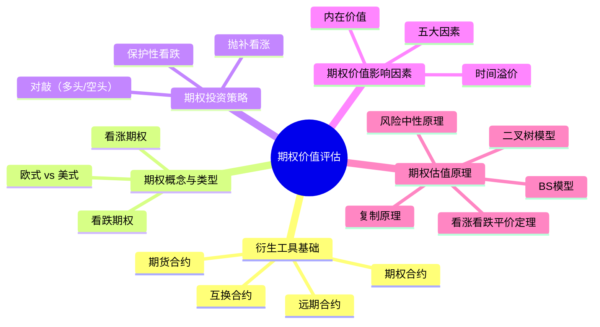

## 📍 章节定位

| 项目 | 信息 |
|------|------|
| **所属科目** | 📊 财务成本管理 |
| **难度等级** | ⭐⭐⭐⭐⭐ |
| **历年分值** | 6-8分 |
| **建议学时** | 8-10h |

## 📝 考情分析

期权价值评估是财管难度最高的章节，概念抽象、公式复杂。题型以客观题和计算综合题为主。核心考点包括：看涨/看跌期权到期日价值的计算、期权投资策略（保护性看跌、抛补看涨、对敲）的构建与损益分析、期权价值的影响因素（内在价值与时间溢价）、期权估值原理（复制原理、风险中性原理、二叉树模型、BS模型）。

近年趋势重点考查期权估值原理的理解与应用，特别是风险中性概率的计算、复制组合的构建、看涨看跌平价定理（put-call parity）。考生须准确区分期权价值（含时间溢价）与到期日价值（仅含内在价值），并理解买权和卖权价值上下限。

**命题规律**：
1. 期权到期日价值与损益计算是基础必考内容；
2. 期权投资策略（保护性看跌、抛补看涨、对敲）的构建与损益分析是高频考点；
3. 风险中性原理和复制原理几乎每年必考，需熟练掌握计算步骤；
4. 看涨-看跌平价定理常用于计算或验证期权价格；
5. 影响期权价值的因素是客观题高频考点。

**学习提示**：本章是财管最难章节，概念抽象。建议先理解"期权是权利而非义务"这一核心，再掌握四种基本头寸的到期日价值，最后深入复制原理和风险中性原理的推导逻辑。BS 模型公式虽复杂，但重点在于理解各参数的含义，而非手工计算。

**与其他章节的关联**：本章向下连接第九章（企业价值评估中的期权思维，如实物期权）、第十章（资本结构中的权益可视为看涨期权）。

## 🧠 知识框架

## 📖 核心精讲

### 一、衍生工具基础

**衍生工具**是从原生工具（基础资产或标的资产）衍生出来的合同，其价值随基础资产价格的波动而变化。常见类型：

| 类型 | 含义 | 特点 |
|------|------|------|
| **远期合约** | 双方约定在未来某日按约定价格交换资产 | 场外交易，非标准化，必须履行 |
| **期货合约** | 交易所统一制定的标准化远期合约 | 集中交易，标准化，必须履行 |
| **互换合约** | 双方约定在未来定期交换现金流 | 利率互换、货币互换等 |
| **期权合约** | 赋予持有人以固定价格买卖资产的权利 | 买方有权利无义务，卖方有义务无权利 |

衍生工具交易特点：未来性、灵活性、杠杆性、风险性、虚拟性。用途包括套期保值、投机获利等。

### 二、期权的概念与类型

#### （一）期权的概念

期权是一种合约，赋予持有人在某一特定日期或该日之前以固定价格购进或售出约定数量某种资产的**权利**。

**关键要素**：
1. **期权是权利而非义务**：持有人可选择执行或不执行；
2. **标的资产**：股票、债券、货币、商品等；
3. **执行价格（X）**：约定买卖价格；
4. **到期日**：期权失效日；
5. **期权费（C 或 P）**：购买期权的成本。

#### （二）期权类型

按持有人权利分为两类：

**1. 看涨期权（Call Option，买入期权）**

赋予持有人以执行价格**购进**标的资产的权利。
- 当标的资产价格 $S_T > X$ 时，持有人执行，获利 $S_T - X$；
- 当 $S_T \leq X$ 时，持有人不执行，期权价值为 0。

看涨期权买方到期日价值：$C_T = \max(S_T - X, 0)$

**2. 看跌期权（Put Option，卖出期权）**

赋予持有人以执行价格**售出**标的资产的权利。
- 当 $S_T < X$ 时，持有人执行，获利 $X - S_T$；
- 当 $S_T \geq X$ 时，持有人不执行，期权价值为 0。

看跌期权买方到期日价值：$P_T = \max(X - S_T, 0)$

按执行时间分为：
- **欧式期权**：只能在到期日执行；
- **美式期权**：可在到期日或之前任何时间执行。

**美式 vs 欧式期权比较**：

| 维度 | 欧式期权 | 美式期权 |
|------|---------|---------|
| 执行时间 | 仅到期日 | 到期日及之前任一时间 |
| 灵活性 | 低 | 高 |
| 价值 | 较低 | 较高（≥欧式） |
| 适用模型 | BS 模型 | 二叉树模型 |
| 实务中常见地区 | 欧洲、亚洲 | 美国 |

**关键结论**：美式期权价值 ≥ 欧式期权价值（因美式期权包含欧式期权的所有权利，还可提前执行）。但不发放股利时，美式看涨期权提前执行不是最优选择（时间溢价为正），此时美式看涨 = 欧式看涨。

**期权状态详解**：

| 状态 | 看涨期权 | 看跌期权 | 内在价值 |
|------|---------|---------|---------|
| **实值（ITM）** | $S > X$ | $S < X$ | $> 0$ |
| **平值（ATM）** | $S = X$ | $S = X$ | $= 0$ |
| **虚值（OTM）** | $S < X$ | $S > X$ | $= 0$ |

**注意**：
- 虚值期权内在价值为0（不取负值），但期权价值仍可能>0（时间溢价）；
- 实值期权不一定应该立即执行（时间溢价可能使持有更划算）；
- 到期日时间溢价为0，期权价值=内在价值。

#### （三）期权头寸的到期日价值与损益

| 头寸 | 到期日价值 | 损益 |
|------|-----------|------|
| 看涨期权买方（多头看涨） | $\max(S_T - X, 0)$ | $\max(S_T - X, 0) - C_0$ |
| 看涨期权卖方（空头看涨） | $-\max(S_T - X, 0)$ | $C_0 - \max(S_T - X, 0)$ |
| 看跌期权买方（多头看跌） | $\max(X - S_T, 0)$ | $\max(X - S_T, 0) - P_0$ |
| 看跌期权卖方（空头看跌） | $-\max(X - S_T, 0)$ | $P_0 - \max(X - S_T, 0)$ |

**关键结论**：
- 买方亏损有限（最多损失期权费），盈利理论上无限（看涨）或有限（看跌）；
- 卖方盈利有限（最多赚期权费），亏损理论上无限（看涨）或有限（看跌）；
- 期权交易是零和博弈：买方盈利 = 卖方亏损。

### 三、期权投资策略

通过期权与标的资产的组合，可构建不同风险收益特征的投资策略。

#### （一）保护性看跌期权（Protective Put）

**组合**：买入股票 + 买入看跌期权（标的股票相同、执行价格 X）

**到期日价值**：

$$V = S_T + \max(X - S_T, 0) = \max(S_T, X)$$

**损益**：$\max(S_T, X) - S_0 - P_0$

**特点**：当股价下跌时，看跌期权提供保护，锁定最低收益为 $X - S_0 - P_0$；当股价上涨时，仍可获益。类似于"买了保险"。

#### （二）抛补看涨期权（Covered Call）

**组合**：买入股票 + 卖出看涨期权

**到期日价值**：

$$V = S_T - \max(S_T - X, 0) = \min(S_T, X)$$

**损益**：$\min(S_T, X) - S_0 + C_0$

**特点**：当股价上涨超过执行价格时，股票被按执行价格"叫走"，收益封顶为 $X - S_0 + C_0$；当股价下跌时承担损失，但期权费提供部分缓冲。

#### （三）对敲（Straddle）

**多头对敲**：同时买入相同执行价格、相同到期日的看涨期权和看跌期权

**到期日价值**：$\max(S_T - X, 0) + \max(X - S_T, 0) = |S_T - X|$

**损益**：$|S_T - X| - (C_0 + P_0)$

**特点**：预期股价大幅波动但方向不确定时使用。当 $S_T$ 与 $X$ 偏离超过 $C_0 + P_0$ 时盈利；股价接近执行价格时亏损，最大亏损为 $C_0 + P_0$。

**空头对敲**：同时卖出看涨和看跌期权

**特点**：预期股价稳定时使用。最大盈利为 $C_0 + P_0$，股价大幅波动时亏损可能无限。

**四种期权投资策略对比**：

| 策略 | 组合 | 适用预期 | 最大盈利 | 最大亏损 |
|------|------|---------|---------|---------|
| 保护性看跌 | 买股 + 买看跌 | 股价上涨但防跌 | 无限（股价上涨时） | $X - S_0 - P_0$（有限） |
| 抛补看涨 | 买股 + 卖看涨 | 股价稳定或小涨 | $X - S_0 + C_0$（有限） | $S_0 - C_0$（股价跌至0时） |
| 多头对敲 | 买看涨 + 买看跌 | 股价大幅波动 | 无限 | $C_0 + P_0$（有限） |
| 空头对敲 | 卖看涨 + 卖看跌 | 股价稳定 | $C_0 + P_0$（有限） | 无限 |

**期权策略的损益临界点**：

| 策略 | 盈亏平衡点（损益=0时的 $S_T$） |
|------|----------------------------|
| 保护性看跌 | $S_0 + P_0$（股价上涨超过此点盈利） |
| 抛补看涨 | $S_0 - C_0$（股价下跌低于此点亏损） |
| 多头对敲 | $X \pm (C_0 + P_0)$（偏离执行价格超过期权费之和盈利） |
| 空头对敲 | $X \pm (C_0 + P_0)$（偏离执行价格超过期权费之和亏损） |

### 四、期权价值的影响因素

#### （一）期权的内在价值与时间溢价

**期权价值** = 内在价值 + 时间溢价

- **内在价值**：期权立即执行可获得的收益。
  - 看涨期权内在价值 $= \max(S - X, 0)$
  - 看跌期权内在价值 $= \max(X - S, 0)$
- **时间溢价**：期权价值超过内在价值的部分，反映到期前可能增值的期待。

$$\text{时间溢价} = \text{期权价值} - \text{内在价值}$$

**期权状态**：
- **实值期权**：内在价值 > 0（看涨 $S > X$，看跌 $S < X$）；
- **平价期权**：内在价值 = 0（$S = X$）；
- **虚值期权**：内在价值 = 0（看涨 $S < X$，看跌 $S > X$）。

注意：虚值期权内在价值为0，但期权价值（含时间溢价）可能大于0。

#### （二）影响期权价值的因素

| 因素 | 看涨期权价值 | 看跌期权价值 |
|------|-------------|-------------|
| 股票价格 $S$ ↑ | ↑ | ↓ |
| 执行价格 $X$ ↑ | ↓ | ↑ |
| 到期期限 $T$ ↑（美式） | ↑ | ↑ |
| 股价波动率 $\sigma$ ↑ | ↑ | ↑ |
| 无风险利率 $r_f$ ↑ | ↑ | ↓ |
| 股利预期 ↑ | ↓ | ↑ |

**记忆要点**：
- 股价波动率上升，看涨和看跌期权价值均上升（波动越大，期权越有价值）；
- 美式期权期限越长，价值越高（时间溢价增加）；
- 欧式期权期限与价值关系不确定。

#### （三）期权价值的上下限

**看涨期权价值上下限**（不发放股利时）：
- 上限：$C \leq S$（期权价值不可能超过股价）
- 下限：$C \geq \max(S - PV(X), 0) = \max(S - X/(1+r_f)^T, 0)$

**看跌期权价值上下限**（不发放股利时）：
- 上限：$P \leq X/(1+r_f)^T$（不可能超过执行价格现值）
- 下限：$P \geq \max(X/(1+r_f)^T - S, 0)$

### 五、期权估值原理

#### （一）复制原理（套期保值原理）

**基本思想**：构造一个由股票和无风险借款组成的投资组合，使其到期日的支付与期权相同，则该组合的当前价值即为期权价值。

**步骤**（以看涨期权为例）：

设股票当前价格 $S_0$，到期日价格可能上升至 $S_u$ 或下降至 $S_d$，期权到期日价值相应为 $C_u = \max(S_u - X, 0)$ 或 $C_d = \max(S_d - X, 0)$。

构造复制组合：买入 $H$ 股股票，借入 $B$ 元无风险借款。

到期日（上行）：$H \times S_u - B \times (1+r) = C_u$
到期日（下行）：$H \times S_d - B \times (1+r) = C_d$

**套期保值比率（H）**：

$$H = \frac{C_u - C_d}{S_u - S_d}$$

**借款金额**：

$$B = \frac{H \times S_d - C_d}{1 + r}$$

**期权价值（当前）**：

$$C_0 = H \times S_0 - B$$

#### （二）风险中性原理

**基本思想**：假设投资者对待风险是中性的，所有证券的期望报酬率均等于无风险利率。

**风险中性概率**：

设上行乘数 $u = S_u / S_0$，下行乘数 $d = S_d / S_0$，无风险利率 $r$。

上行概率（风险中性概率）：

$$p = \frac{(1 + r) - d}{u - d}$$

下行概率：$1 - p$

**期权价值**：

$$C_0 = \frac{p \times C_u + (1 - p) \times C_d}{1 + r}$$

其中 $C_u = \max(S_0 \times u - X, 0)$，$C_d = \max(S_0 \times d - X, 0)$。

#### （三）二叉树期权定价模型

将期间细分，每个节点用单期二叉树模型递推，多期模型从到期日向前倒推计算期权价值。

**单期二叉树**：

$$C_0 = \frac{p \times C_u + (1 - p) \times C_d}{1 + r}$$

**两期二叉树**：

$$C_0 = \frac{p^2 \times C_{uu} + 2p(1-p) \times C_{ud} + (1-p)^2 \times C_{dd}}{(1+r)^2}$$

多期二叉树可类比扩展，期数越多结果越接近 BS 模型。

#### （四）看涨-看跌平价定理（Put-Call Parity）

对于欧式期权（不发放股利）：

$$C_0 + \frac{X}{(1+r_f)^T} = P_0 + S_0$$

即：看涨期权价值 + 执行价格现值 = 看跌期权价值 + 股票当前价格

**变形**：
- $C_0 - P_0 = S_0 - X/(1+r_f)^T$
- $P_0 = C_0 + X/(1+r_f)^T - S_0$

该定理说明：已知三个变量可求第四个，常用于验证期权价格是否合理。

#### （五）BS 期权定价模型（Black-Scholes）

适用于欧式看涨期权（不发放股利）：

$$C_0 = S_0 \times N(d_1) - X \times e^{-r_f T} \times N(d_2)$$

其中：

$$d_1 = \frac{\ln(S_0 / X) + (r_f + \sigma^2 / 2) \times T}{\sigma \sqrt{T}}$$

$$d_2 = d_1 - \sigma \sqrt{T}$$

变量含义：
- $S_0$：股票当前价格；
- $X$：执行价格；
- $r_f$：无风险利率（连续复利）；
- $T$：到期时间（年）；
- $\sigma$：股价连续复利报酬率的标准差；
- $N(d)$：标准正态分布累积概率。

通过看涨-看跌平价定理可由 $C_0$ 求出 $P_0$：

$$P_0 = C_0 - S_0 + X \times e^{-r_f T}$$

**BS 模型的假设条件**：
1. 股票价格服从对数正态分布（连续复利报酬率服从正态分布）；
2. 证券交易连续进行，无交易成本和税；
3. 投资者可按无风险利率自由借贷；
4. 期权为欧式期权，到期前不执行；
5. 标的股票不发放股利；
6. 无风险利率和股价波动率在期权有效期内恒定。

**BS 模型参数的经济含义**：
- $N(d_1)$：对冲比率（Delta），即股价每变动1元时期权价值变动的金额；
- $N(d_2)$：风险中性下期权被执行的概率；
- $S_0 \times N(d_1)$：期望股票价值的现值；
- $X \times e^{-r_f T} \times N(d_2)$：执行价格现值 × 执行概率。

**BS 模型的局限**：
1. 假设过于理想化（无税、无交易成本、连续交易等）；
2. 假设波动率恒定，但实际波动率会变化（"波动率微笑"现象）；
3. 不适用于美式期权（需用二叉树等数值方法）；
4. 不适用于发放股利的股票（需调整模型）。

## 💡 典型例题

**【例题 1】（计算题）**

某投资者买入执行价格 50 元的看涨期权，期权费 4 元，同时卖出相同执行价格的看跌期权，期权费 3 元。计算到期日股价分别为 60 元、45 元、50 元时的组合损益。

**答案**：

到期日组合价值 $= \max(S_T - 50, 0) - \max(50 - S_T, 0)$
组合成本 $= 4 - 3 = 1$（元）

- $S_T = 60$：组合价值 $= 10 - 0 = 10$，损益 $= 10 - 1 = 9$（元）
- $S_T = 45$：组合价值 $= 0 - 5 = -5$，损益 $= -5 - 1 = -6$（元）
- $S_T = 50$：组合价值 $= 0 - 0 = 0$，损益 $= 0 - 1 = -1$（元）

**解析**：买入看涨+卖出看跌的组合相当于"买入股票"（到期日价值 $= S_T - X$），损益 = $S_T - 50 - 1$。

---

**【例题 2】（风险中性原理）**

某股票当前价格 50 元，6 个月后股价可能上升至 60 元（上行乘数 $u=1.2$）或下降至 40 元（下行乘数 $d=0.8$）。6 个月无风险利率 4%（单期）。计算执行价格 50 元、6 个月到期的欧式看涨期权价值。

**答案**：

(1) 计算到期日期权价值：
- $C_u = \max(60 - 50, 0) = 10$（元）
- $C_d = \max(40 - 50, 0) = 0$（元）

(2) 计算风险中性概率：
$$p = \frac{(1 + r) - d}{u - d} = \frac{1.04 - 0.8}{1.2 - 0.8} = \frac{0.24}{0.4} = 0.6$$

(3) 计算期权价值：
$$C_0 = \frac{0.6 \times 10 + 0.4 \times 0}{1.04} = \frac{6}{1.04} = 5.77 \text{（元）}$$

**解析**：风险中性原理关键是用无风险利率替代实际期望报酬率，求出风险中性概率后折现期权期望价值。

---

**【例题 3】（看涨-看跌平价）**

某股票当前价格 30 元，执行价格 30 元、1 年到期的欧式看涨期权价格 4 元，无风险利率 5%。利用看涨-看跌平价定理计算相同条件的看跌期权价格。

**答案**：

根据平价定理：

$$C_0 + \frac{X}{(1+r_f)^T} = P_0 + S_0$$

$$P_0 = C_0 + \frac{X}{(1+r_f)^T} - S_0 = 4 + \frac{30}{1.05} - 30 = 4 + 28.57 - 30 = 2.57 \text{（元）}$$

---

**【例题 4】（复制原理）**

沿用例2数据，用复制原理计算看涨期权价值。

**答案**：

(1) 计算套期保值比率：
$$H = \frac{C_u - C_d}{S_u - S_d} = \frac{10 - 0}{60 - 40} = 0.5$$

(2) 计算借款金额：
$$B = \frac{H \times S_d - C_d}{1 + r} = \frac{0.5 \times 40 - 0}{1.04} = \frac{20}{1.04} = 19.23 \text{（元）}$$

(3) 计算期权价值：
$$C_0 = H \times S_0 - B = 0.5 \times 50 - 19.23 = 25 - 19.23 = 5.77 \text{（元）}$$

与风险中性原理结果一致。

---

**【例题 5】（保护性看跌期权）**

某投资者以 40 元买入股票，同时以 2 元买入执行价格 38 元的看跌期权。计算到期日股价分别为 50 元、38 元、30 元时的组合损益。

**答案**：

组合到期日价值 $= S_T + \max(38 - S_T, 0) = \max(S_T, 38)$
组合成本 $= 40 + 2 = 42$（元）

- $S_T = 50$：组合价值 $= \max(50, 38) = 50$，损益 $= 50 - 42 = 8$（元）
- $S_T = 38$：组合价值 $= \max(38, 38) = 38$，损益 $= 38 - 42 = -4$（元）
- $S_T = 30$：组合价值 $= \max(30, 38) = 38$，损益 $= 38 - 42 = -4$（元）

**解析**：保护性看跌期权锁定了最低价值为执行价格 38 元，最大亏损 $= 38 - 42 = -4$ 元。股价低于 38 元时损益不变（-4元），股价高于 38 元时损益随股价上升。

---

**【例题 6】（抛补看涨期权）**

某投资者以 40 元买入股票，同时以 3 元卖出执行价格 45 元的看涨期权。计算到期日股价分别为 50 元、45 元、35 元时的组合损益。

**答案**：

组合到期日价值 $= S_T - \max(S_T - 45, 0) = \min(S_T, 45)$
组合成本 $= 40 - 3 = 37$（元）（卖出期权收入3元抵减成本）

- $S_T = 50$：组合价值 $= \min(50, 45) = 45$，损益 $= 45 - 37 = 8$（元）
- $S_T = 45$：组合价值 $= \min(45, 45) = 45$，损益 $= 45 - 37 = 8$（元）
- $S_T = 35$：组合价值 $= \min(35, 45) = 35$，损益 $= 35 - 37 = -2$（元）

**解析**：抛补看涨期权锁定了最高价值为执行价格 45 元，最大盈利 $= 45 - 37 = 8$ 元。股价超过 45 元时收益封顶，股价下跌时承担损失但期权费提供缓冲。

---

**【例题 7】（两期二叉树模型）**

某股票当前价格 50 元，每期股价上行乘数 $u=1.1$，下行乘数 $d=0.9$，每期无风险利率 5%。计算执行价格 50 元、两期到期的欧式看涨期权价值。

**答案**：

(1) 计算各节点股价：
- $S_{uu} = 50 \times 1.1^2 = 60.5$
- $S_{ud} = 50 \times 1.1 \times 0.9 = 49.5$
- $S_{dd} = 50 \times 0.9^2 = 40.5$

(2) 计算到期日期权价值：
- $C_{uu} = \max(60.5 - 50, 0) = 10.5$
- $C_{ud} = \max(49.5 - 50, 0) = 0$
- $C_{dd} = \max(40.5 - 50, 0) = 0$

(3) 风险中性概率：
$$p = \frac{1.05 - 0.9}{1.1 - 0.9} = \frac{0.15}{0.2} = 0.75$$

(4) 两期二叉树：
$$C_0 = \frac{0.75^2 \times 10.5 + 2 \times 0.75 \times 0.25 \times 0 + 0.25^2 \times 0}{1.05^2}$$
$$= \frac{0.5625 \times 10.5}{1.1025} = \frac{5.90625}{1.1025} = 5.36 \text{（元）}$$

**解析**：两期二叉树从到期日各节点向前倒推，用风险中性概率加权后折现。中间节点 $C_{ud}=0$ 因股价 49.5 低于执行价 50。

## 🎯 记忆口诀

**期权四头寸**：
> 买看涨：股价涨才赚，亏有限；
> 卖看涨：股价涨才亏，赚有限；
> 买看跌：股价跌才赚，亏有限；
> 卖看跌：股价跌才亏，赚有限。

**三种策略**：
> 保护性看跌 = 股票 + 买看跌（买保险）；
> 抛补看涨 = 股票 + 卖看涨（卖保险，封顶收益）；
> 多头对敲 = 买看涨 + 买看跌（赌波动）。

**风险中性概率**：
> $p = [(1+r) - d] / (u - d)$；
> 上行概率加下行概率等于1。

**看涨看跌平价**：
> $C + PV(X) = P + S$；
> 已知三求一，验证价格合理性。

**影响因素口诀**：
> 股价涨看涨涨、看跌跌；
> 波动涨两权都涨；
> 利率涨看涨涨看跌跌；
> 美式期限长两权都涨。

**复制原理三步走**：
> 第一步：求 H（套期保值比率）$= (C_u - C_d)/(S_u - S_d)$；
> 第二步：求 B（借款）$= (H \times S_d - C_d)/(1+r)$；
> 第三步：求 $C_0 = H \times S_0 - B$。

**内在价值与时间溢价**：
> 期权价值 = 内在价值 + 时间溢价；
> 实值（内在>0）、平值（内在=0，S=X）、虚值（内在=0，不会为负）；
> 虚值期权仍有价值（时间溢价>0）。

**期权价值上下限**：
> 看涨上限：$C \leq S$（不超股价）；
> 看涨下限：$C \geq \max(S - PV(X), 0)$；
> 看跌上限：$P \leq PV(X)$（不超执行价现值）；
> 看跌下限：$P \geq \max(PV(X) - S, 0)$。

**BS 模型关键参数**：
> $C = S \times N(d_1) - X \times e^{-rT} \times N(d_2)$；
> $d_1 = [\ln(S/X) + (r + \sigma^2/2)T] / (\sigma\sqrt{T})$；
> $d_2 = d_1 - \sigma\sqrt{T}$；
> 连续复利、欧式期权、不发放股利。

## ✅ 同步练习

**1.（单选题）** 某看跌期权执行价格 40 元，期权费 3 元，到期日股票价格 35 元。则该看跌期权买方的损益为（　）元。

A. -5
B. 2
C. 5
D. -3

**2.（单选题）** 下列关于期权价值影响因素的说法中，正确的是（　）。

A. 股票价格上升，看跌期权价值上升
B. 股价波动率上升，看涨和看跌期权价值均上升
C. 无风险利率上升，看跌期权价值上升
D. 执行价格上升，看涨期权价值上升

**3.（计算题）** 某股票当前价格 20 元，6 个月后股价上行至 24 元（$u=1.2$）或下行至 16 元（$d=0.8$），6 个月无风险利率 5%。计算执行价格 22 元、6 个月到期的欧式看涨期权价值（用风险中性原理）。

**4.（计算题）** 某股票当前价格 50 元，执行价格 50 元、1 年到期的欧式看涨期权价格 6 元，无风险利率 8%。利用看涨-看跌平价定理计算相同条件的看跌期权价格。

**5.（多选题）** 下列关于保护性看跌期权的说法中，正确的有（　）。

A. 保护性看跌期权由买入股票和买入看跌期权组成
B. 保护性看跌期权的最低收益为 $X - S_0 - P_0$
C. 保护性看跌期权锁定了股价下跌的风险
D. 保护性看跌期权的最高收益无限

**6.（计算题）** 某投资者以 50 元买入股票，同时以 4 元买入执行价格 48 元的看跌期权。计算到期日股价分别为 60 元、48 元、40 元时的组合损益，并指出最大亏损。

**7.（单选题）** 某看涨期权执行价格 30 元，当前股价 35 元，期权价值 6 元。则该期权的内在价值和时间溢价分别为（　）元。

A. 5 和 1
B. 6 和 0
C. 5 和 6
D. 0 和 6

**8.（计算题）** 某股票当前价格 40 元，3 个月后股价上行至 48 元（$u=1.2$）或下行至 32 元（$d=0.8$），3 个月无风险利率 2%。计算执行价格 40 元、3 个月到期的欧式看涨期权价值（用复制原理）。

**9.（单选题）** 下列关于美式期权和欧式期权的说法中，正确的是（　）。

A. 美式期权只能在到期日执行
B. 欧式期权可在到期日前任何时间执行
C. 美式期权价值通常不低于相同条件的欧式期权
D. 欧式期权价值通常高于相同条件的美式期权

**10.（计算题）** 某股票当前价格 60 元，执行价格 60 元、1 年到期的欧式看涨期权价格 8 元，无风险利率 6%。利用看涨-看跌平价定理计算相同条件的看跌期权价格。若市场上看跌期权报价 5 元，是否存在套利机会？

---

**练习答案**：1.B（$\max(40-35,0) - 3 = 5 - 3 = 2$）　2.B　3. $C_u=2, C_d=0, p=(1.05-0.8)/(1.2-0.8)=0.625, C_0=(0.625\times2+0.375\times0)/1.05=1.19$元　4. $P_0 = 6 + 50/1.08 - 50 = 6 + 46.30 - 50 = 2.30$元　5.ABCD　6. 组合价值$=\max(S_T, 48)$，成本$=54$元；$S_T=60$: 损益$=60-54=6$元；$S_T=48$: 损益$=48-54=-6$元；$S_T=40$: 损益$=48-54=-6$元；最大亏损$=48-54=-6$元　7.A（内在价值$=\max(35-30,0)=5$，时间溢价$=6-5=1$）　8. $C_u=8, C_d=0$；$H=(8-0)/(48-32)=0.5$；$B=(0.5\times32-0)/1.02=15.69$；$C_0=0.5\times40-15.69=20-15.69=4.31$元　9.C（美式期权可在到期日前执行，灵活性更高，价值通常≥欧式）　10. $P_0=8+60/1.06-60=8+56.60-60=4.60$元；市场报价5元>理论价值4.60元，存在套利机会（卖出看跌期权获利）
