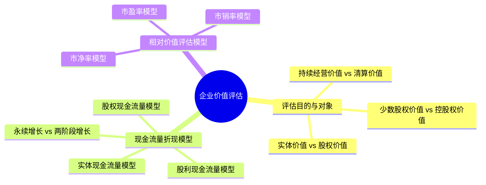

## 📍 章节定位

| 项目 | 信息 |
|------|------|
| **所属科目** | 📊 财务成本管理 |
| **难度等级** | ⭐⭐⭐⭐ |
| **历年分值** | 8-10分 |
| **建议学时** | 8-10h |

## 📝 考情分析

企业价值评估是财管最重要的综合章节之一，几乎每年必出大题，分值高、综合性强。核心考点包括：企业价值评估的对象（实体价值与股权价值的区分）、三种现金流量折现模型（实体现金流量、股权现金流量、股利现金流量）的计算、相对价值评估模型（市盈率、市净率、市销率模型）的应用与适用条件。

近年趋势强调与第二章财务报表分析（管理用财务报表）、第三章财务预测（可持续增长率）、第五章资本成本（WACC）的综合。考生必须熟练掌握管理用财务报表下实体现金流量、股权现金流量的计算口径，以及永续增长模型、两阶段增长模型的应用。

## 🧠 知识框架

## 📖 核心精讲

### 一、企业价值评估的目的和对象

#### （一）评估目的

企业价值评估的目的是帮助投资者和管理当局改善决策，体现在三方面：
1. **投资分析**：寻找被市场低估的股票或企业；
2. **战略分析**：评价企业目前和今后增加股东财富的关键因素；
3. **以价值为基础的管理**：依据价值最大化原则制定和执行经营计划。

价值评估提供的是"公平市场价值"信息。公平市场价值即公允价值，不同于会计价值（账面价值）和现时市场价值。

#### （二）评估对象

企业价值评估的一般对象是**企业整体的经济价值**，即企业作为一个整体的公平市场价值。

**企业整体经济价值的类别**：

| 类别 | 含义 |
|------|------|
| **实体价值 vs 股权价值** | 实体价值 = 股权价值 + 净负债价值 |
| **持续经营价值 vs 清算价值** | 公平市场价值 = max(持续经营价值, 清算价值) |
| **少数股权价值 vs 控股权价值** | 控股权价值 = 少数股权价值 + 控股权溢价 |

**关键关系**：

$$\text{企业实体价值} = \text{股权价值} + \text{净债务价值}$$

注意：这里的股权价值和净债务价值都是公平市场价值，不是账面价值。收购整个企业实体的成本等于股权价值加上所承接的净债务价值。

### 二、现金流量折现模型

现金流量折现模型是企业价值评估的主流方法，基本思想：任何资产的价值等于其未来现金流量按适当折现率折现的现值。

#### （一）三种现金流量模型

| 模型 | 现金流量 | 折现率 | 评估对象 |
|------|----------|--------|----------|
| **股利现金流量模型** | 股利 | 股权资本成本 $r_s$ | 股权价值 |
| **股权现金流量模型** | 股权现金流量（FCFE） | 股权资本成本 $r_s$ | 股权价值 |
| **实体现金流量模型** | 实体现金流量（FCFF） | 加权平均资本成本 WACC | 实体价值 |

**三种模型的关系**：
- 在数据假设一致时，三种模型评估结果相同；
- 股利现金流量模型适用于稳定分红公司，但很多公司不分红，故实务中常用后两者；
- 实体现金流量模型最常用，因其实体现金流量不受资本结构影响。

#### （二）现金流量计算

**1. 实体现金流量（FCFF）**

实体现金流量是企业全部现金流入扣除成本费用和必要投资后剩余的可提供给所有投资人的现金流量。

$$\text{实体现金流量} = \text{税后经营净利润} - \text{净经营资产增加}$$

或：

$$\text{实体现金流量} = \text{营业现金毛流量} - \text{营业现金净流量} - \text{资本支出}$$

展开：

$$\text{实体现金流量} = \text{税后经营净利润} + \text{折旧摊销} - \text{经营营运资本增加} - \text{资本支出}$$

**2. 股权现金流量（FCFE）**

股权现金流量是企业实体现金流量扣除对债权人支付后剩余的可提供给股东的现金流量。

$$\text{股权现金流量} = \text{实体现金流量} - \text{债务现金流量}$$

$$\text{股权现金流量} = \text{税后经营净利润} - \text{净经营资产增加} - \text{税后利息费用} + \text{净负债增加}$$

或简化为：

$$\text{股权现金流量} = \text{净利润} - \text{股东权益增加}$$

**3. 债务现金流量**

$$\text{债务现金流量} = \text{税后利息费用} - \text{净负债增加}$$

#### （三）折现率匹配原则

**关键原则**：现金流量与折现率必须匹配。
- 实体现金流量用 WACC 折现；
- 股权现金流量用股权资本成本 $r_s$ 折现；
- 股利现金流量用股权资本成本 $r_s$ 折现。

若用 WACC 折现股权现金流量，会高估股权价值；用股权资本成本折现实体现金流量，会低估实体价值。

#### （四）预测期与后续期

企业价值分为两部分：

$$\text{企业价值} = \text{预测期价值} + \text{后续期价值}$$

- **预测期**（详细预测期）：通常5-7年，逐年预测现金流量；
- **后续期**（永续期）：假设现金流量以稳定增长率 $g$ 永续增长。

#### （五）永续增长模型

假设现金流量以增长率 $g$ 永续增长：

$$\text{价值} = \frac{\text{下期现金流量}}{\text{折现率} - g} = \frac{CF_1}{r - g}$$

应用条件：$r > g$；增长率长期保持不变；企业处于稳定状态。

#### （六）两阶段增长模型

预测期（$n$ 年）+ 后续期（永续增长 $g$）：

$$\text{价值} = \sum_{t=1}^{n} \frac{CF_t}{(1+r)^t} + \frac{CF_{n+1} / (r - g)}{(1+r)^n}$$

其中后续期价值在预测期末计算，再折现到当前。

**后续期终值（第 $n$ 年末价值）**：

$$TV_n = \frac{CF_{n+1}}{r - g} = \frac{CF_n \times (1+g)}{r - g}$$

**例：实体现金流量模型**

某公司预计未来 5 年实体现金流量分别为 100、120、140、160、180 万元，第 5 年后以 4% 永续增长。WACC = 10%。

- 预测期价值 $= 100/1.1 + 120/1.1^2 + 140/1.1^3 + 160/1.1^4 + 180/1.1^5 = 90.9 + 99.2 + 105.2 + 109.3 + 111.8 = 516.4$（万元）
- 后续期终值 $= 180 \times 1.04 / (10\% - 4\%) = 187.2 / 6\% = 3120$（万元）
- 后续期价值 $= 3120 / 1.1^5 = 3120 / 1.6105 = 1937.2$（万元）
- 实体价值 $= 516.4 + 1937.2 = 2453.6$（万元）

### 三、相对价值评估模型

相对价值法（价格乘数法）是利用类似企业的市场定价来估计目标企业价值的方法。

#### （一）市盈率模型（P/E）

**模型**：

$$\text{目标企业每股价值} = \text{可比企业市盈率} \times \text{目标企业每股收益}$$

**内在市盈率**（本期市盈率）：

$$P/E = \frac{P_0}{EPS_0} = \frac{股利支付率}{r_s - g}$$

**预期市盈率**（内在市盈率，以下期收益为基础）：

$$P/E_1 = \frac{P_0}{EPS_1} = \frac{股利支付率 \times (1+g)}{r_s - g} \div (1+g) = \frac{股利支付率}{r_s - g}$$

**适用条件**：企业连续盈利，β接近1（风险类似）。

**优点**：计算简便；反映市场对公司未来盈利的预期；数据易得。

**局限**：亏损企业无法使用；受经济周期影响大；会计政策差异影响可比性。

#### （二）市净率模型（P/B）

**模型**：

$$\text{目标企业每股价值} = \text{可比企业市净率} \times \text{目标企业每股净资产}$$

**内在市净率**：

$$P/B = \frac{P_0}{B_0} = \frac{权益净利率 \times 股利支付率}{r_s - g}$$

**适用条件**：拥有大量资产、净资产为正的企业。

**优点**：净资产为正，可用于亏损企业；净资产账面价值稳定，不易被操纵；便于比较资产规模不同的企业。

**局限**：账面价值受会计政策影响；不适用于固定资产少的服务型企业。

#### （三）市销率模型（P/S）

**模型**：

$$\text{目标企业每股价值} = \text{可比企业市销率} \times \text{目标企业每股营业收入}$$

**内在市销率**：

$$P/S = \frac{P_0}{S_0} = \text{营业净利率} \times \frac{股利支付率}{r_s - g}$$

**适用条件**：销售成本率较低的服务型企业，或成本率稳定的传统企业。

**优点**：营业收入不会为负，可用于亏损企业；营业收入不受会计政策影响；稳定可靠。

**局限**：不能反映成本变化；只能反映销售规模，不能反映盈利能力。

#### （四）三种模型比较

| 模型 | 关键驱动因素 | 适用企业 | 局限 |
|------|-------------|----------|------|
| 市盈率 | 股利支付率、增长率、风险 | 连续盈利、β≈1 | 亏损企业无效 |
| 市净率 | 权益净利率、股利支付率、增长率 | 资产密集型、金融企业 | 服务型不适用 |
| 市销率 | 营业净利率、股利支付率、增长率 | 销售稳定、成本率稳定 | 不能反映成本 |

#### （五）可比企业的选择

相对价值法的关键是选择可比企业，要求：
1. 处于相同行业；
2. 商业模式类似；
3. 规模、成长性、风险相当；
4. 财务政策类似。

实务中通常选取一组可比企业，取其价格乘数的平均值或中位数作为基准。

## 💡 典型例题

**【例题 1】（计算题·实体现金流量模型）**

某公司本年税后经营净利润 500 万元，年末净经营资产 4000 万元（年初 3800 万元）。预计下年税后经营净利润增长 10%，净经营资产增长 8%，此后进入永续增长，永续增长率 4%。WACC = 10%。

要求：计算公司实体价值。

**答案**：

(1) 本年实体现金流量 $= 500 - (4000 - 3800) = 500 - 200 = 300$（万元）

(2) 下年实体现金流量：
- 下年税后经营净利润 $= 500 \times 1.10 = 550$（万元）
- 下年净经营资产 $= 4000 \times 1.08 = 4320$（万元）
- 下年净经营资产增加 $= 4320 - 4000 = 320$（万元）
- 下年实体现金流量 $= 550 - 320 = 230$（万元）

(3) 永续增长模型（下年即为永续期第一期）：

$$\text{实体价值} = \frac{230}{10\% - 4\%} = \frac{230}{6\%} = 3833.33 \text{（万元）}$$

**解析**：实体现金流量 = 税后经营净利润 - 净经营资产增加；永续增长模型价值 = 下期现金流量 / (WACC - g)。

---

**【例题 2】（市盈率模型）**

某可比企业市盈率为 20 倍，目标企业预计下年每股收益 1.2 元。计算目标企业每股价值。

**答案**：

$$\text{每股价值} = 20 \times 1.2 = 24 \text{（元）}$$

---

**【例题 3】（两阶段股权现金流量模型）**

某公司当前股利 $D_0 = 2$ 元，预计未来 3 年股利增长率 20%，之后转为永续增长 5%。股权资本成本 12%。

要求：计算股票价值。

**答案**：

- $D_1 = 2 \times 1.2 = 2.4$ 元
- $D_2 = 2.4 \times 1.2 = 2.88$ 元
- $D_3 = 2.88 \times 1.2 = 3.456$ 元
- $D_4 = 3.456 \times 1.05 = 3.629$ 元

第3年末股价 $= D_4 / (r_s - g) = 3.629 / (12\% - 5\%) = 3.629 / 7\% = 51.84$（元）

股票价值 $= 2.4/1.12 + 2.88/1.12^2 + 3.456/1.12^3 + 51.84/1.12^3$

$= 2.143 + 2.296 + 2.458 + 36.87 = 43.77$（元）

**解析**：两阶段模型价值 = 预测期股利现值 + 后续期股价现值。注意后续期股价用永续增长模型计算后，需折现到当前。

---

**【例题 4】（内在市净率）**

某公司权益净利率 15%，股利支付率 40%，股权资本成本 10%，股利增长率 5%。计算该公司内在市净率。若每股净资产 8 元，计算每股价值。

**答案**：

$$\text{内在市净率} = \frac{15\% \times 40\%}{10\% - 5\%} = \frac{6\%}{5\%} = 1.2$$

$$\text{每股价值} = 1.2 \times 8 = 9.6 \text{（元）}$$

## 🎯 记忆口诀

**三种现金流量对应三种折现率**：
> 股利现金流量配股权成本 → 股权价值；
> 股权现金流量配股权成本 → 股权价值；
> 实体现金流量配 WACC → 实体价值。

**实体现金流量计算**：
> 税后经营净利润 - 净经营资产增加 = 实体现金流量；
> 或：营业现金毛流量 - 经营营运资本增加 - 资本支出。

**永续增长模型**：
> 价值 = 下期现金流量 / (折现率 - g)；
> 注意是下期，不是本期。

**相对价值三模型驱动**：
> 市盈率 = 股利支付率 / (r-g)；
> 市净率 = 权益净利率 × 股利支付率 / (r-g)；
> 市销率 = 营业净利率 × 股利支付率 / (r-g)。

**实体与股权价值关系**：
> 实体价值 = 股权价值 + 净债务价值；
> 求股权价值 = 实体价值 - 净债务价值。

## ✅ 同步练习

**1.（单选题）** 下列关于企业价值评估对象的说法中，错误的是（　）。

A. 企业实体价值等于股权价值与净债务价值之和
B. 企业的公平市场价值是其持续经营价值与清算价值中较高者
C. 控股权价值等于少数股权价值
D. 企业价值评估的对象是企业整体的经济价值

**2.（单选题）** 在现金流量折现模型中，下列匹配关系正确的是（　）。

A. 股权现金流量用WACC折现
B. 实体现金流量用股权资本成本折现
C. 股利现金流量用股权资本成本折现
D. 实体现金流量用税后债务资本成本折现

**3.（计算题）** 某公司本年税后经营净利润 800 万元，年末净经营资产 5000 万元（年初 4600 万元）。预计下年税后经营净利润增长 5%，净经营资产增长 4%，此后永续增长 3%。WACC = 9%。计算公司实体价值。

**4.（计算题）** 某可比企业市盈率为 15 倍，目标企业预计下年净利润 2000 万元，流通在外普通股 1000 万股。计算目标企业每股价值和股权价值。

**5.（多选题）** 下列关于相对价值评估模型的说法中，正确的有（　）。

A. 市盈率模型适用于连续盈利的企业
B. 市净率模型适用于固定资产较少的服务型企业
C. 市销率模型适用于销售成本率较低的服务型企业
D. 三种模型都可用于亏损企业

---

**练习答案**：1.C　2.C　3. 本年FCFF=800-400=400万元；下年FCFF=840-200=640万元；实体价值=640/(9%-3%)=10666.67万元　4. 每股价值=15×2=30元；股权价值=30000万元　5.AC
