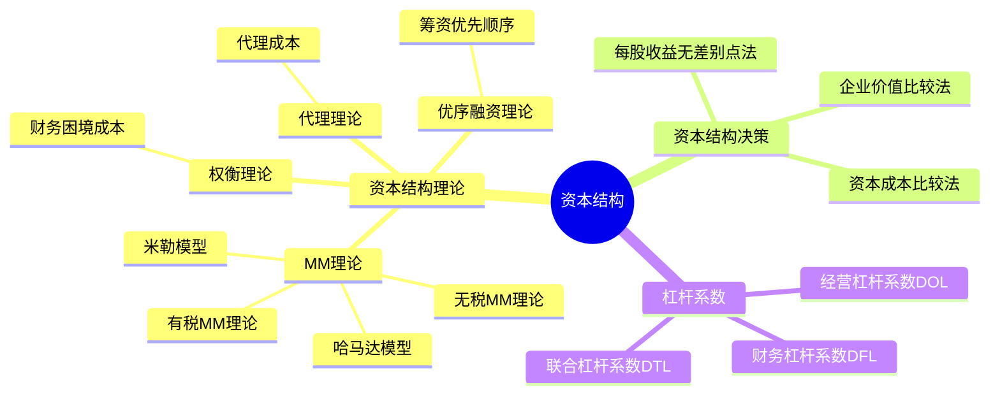

## 📍 章节定位

| 项目 | 信息 |
|------|------|
| **所属科目** | 📊 财务成本管理 |
| **难度等级** | ⭐⭐⭐ |
| **历年分值** | 4-6分 |
| **建议学时** | 4-5h |

## 📝 考情分析

资本结构是连接筹资决策与价值评估的桥梁，题型以客观题与计算题为主。核心考点包括：MM理论（无税和有税）的命题与结论、权衡理论与财务困境成本、代理理论与优序融资理论、每股收益无差别点法、资本结构决策的三种方法（资本成本比较法、每股收益无差别点法、企业价值比较法）。

近年趋势强调理论理解与计算结合，特别是无税MM理论与有税MM理论的对比、财务杠杆系数（DFL）的计算、每股收益无差别点的求解。考生须准确理解债务抵税效应对企业价值的影响。

## 🧠 知识框架

## 📖 核心精讲

### 一、资本结构理论

资本结构是指企业各种长期资本来源的构成和比例关系，通常指长期债务资本与权益资本的比例（不含短期负债）。

#### （一）MM理论

MM理论由莫迪格利安尼和米勒提出，基于完善资本市场等假设，是现代资本结构理论的起点。

**假设条件**：
1. 经营风险相同的企业处于同一风险等级；
2. 投资者预期相同；
3. 资本市场完善，无交易成本；
4. 投资者与企业同等利率借款；
5. 负债无风险，利率为无风险利率；
6. EBIT 不变，增长率为零，现金流量为永续年金。

**1. 无税MM理论**（不考虑企业所得税）

**命题Ⅰ**：无负债企业价值 = 有负债企业价值

$$V_L = V_U = \frac{EBIT}{r_{WACC}} = \frac{EBIT}{r_{sU}}$$

含义：在无税情况下，企业价值与资本结构无关。加权平均资本成本 $r_{WACC}$ 不随债务比例变化，等于无负债企业的权益资本成本 $r_{sU}$。

**命题Ⅱ**：有负债企业的权益资本成本随财务杠杆提高而增加：

$$r_{sL} = r_{sU} + (r_{sU} - r_d) \times \frac{D}{E}$$

其中 $r_{sL}$ 为有负债企业权益资本成本，$r_{sU}$ 为无负债企业权益资本成本，$r_d$ 为债务资本成本（无风险利率），$D/E$ 为债务与权益市值比。

含义：负债增加带来的低成本利益被权益成本上升完全抵消，故企业价值不变。

**2. 有税MM理论**（考虑企业所得税）

**命题Ⅰ**：有负债企业价值 = 无负债企业价值 + 利息抵税现值

$$V_L = V_U + D \times T = V_U + PV(\text{利息抵税})$$

其中 $D \times T$ 为债务抵税价值（杠杆收益），是债务利息抵税的永续年金现值（折现率为债务利率）。

含义：因债务利息可在税前扣除，负债增加了企业价值，负债越多企业价值越大（100%负债时价值最大）。

**命题Ⅱ**：有负债企业权益资本成本：

$$r_{sL} = r_{sU} + (r_{sU} - r_d) \times (1 - T) \times \frac{D}{E}$$

与无税相比，风险溢价乘以 $(1-T)$，因抵税效应使风险溢价降低。

**哈马达模型**（结合CAPM）：

$$\beta_L = \beta_U \times \left[1 + (1 - T) \times \frac{D}{E}\right]$$

将权益β分为经营风险（$\beta_U$）和财务风险两部分。

#### （二）权衡理论

权衡理论强调在平衡债务利息抵税收益与财务困境成本的基础上，企业价值最大化时的资本结构即为最佳资本结构。

$$V_L = V_U + PV(\text{利息抵税}) - PV(\text{财务困境成本})$$

**财务困境成本**：
- **直接成本**：破产、清算、重组的法律费用和管理费用；
- **间接成本**：客户流失、供应商信用收紧、员工流失、融资成本上升等，通常比直接成本大得多。

**最佳资本结构**：债务抵税收益的边际价值 = 增加的财务困境成本的现值时，企业价值最大。

#### （三）代理理论

代理理论考虑债务筹资带来的代理成本。

$$V_L = V_U + PV(\text{利息抵税}) - PV(\text{财务困境成本}) - PV(\text{代理成本})$$

**代理成本**：
- **过度投资问题**：股东可能投资于净现值为负的高风险项目（损害债权人利益）；
- **投资不足问题**：当项目收益主要归债权人时，股东可能放弃净现值为正的项目；
- **债务代理收益**：债务约束管理层过度投资，减少自由现金流代理成本。

#### （四）优序融资理论

优序融资理论认为，考虑信息不对称和筹资成本，企业筹资有优先顺序：

1. **内部筹资**（留存收益）——最优先；
2. **债务筹资**（借款、债券）——其次；
3. **股权筹资**（发行新股）——最后。

原因：内部筹资无筹资成本、无信息不对称；债务筹资成本低于股权，且不会传递不利信号；发行新股被市场解读为股价高估信号。

### 二、资本结构决策分析

#### （一）资本成本比较法

计算各筹资方案的加权平均资本成本（WACC），选择 WACC 最小的方案。

**注意**：WACC 最小的资本结构即公司价值最大的资本结构（在假设资本结构不改变现金流量的前提下）。

#### （二）每股收益无差别点法

计算两种筹资方案下每股收益（EPS）相等时的息税前利润（EBIT），即无差别点。

$$\frac{(EBIT - I_1)(1 - T)}{N_1} = \frac{(EBIT - I_2)(1 - T)}{N_2}$$

其中 $I_1, I_2$ 为两方案的利息，$N_1, N_2$ 为两方案的普通股股数。

**决策规则**：
- 预期 EBIT > 无差别点 EBIT，选择债务筹资（利息多但股数少，EPS高）；
- 预期 EBIT < 无差别点 EBIT，选择股权筹资（利息少但股数多，EPS高）。

#### （三）企业价值比较法

计算各方案的企业总价值（实体价值），选择企业价值最大的方案。

$$\text{企业总价值} = \text{股票市场价值} + \text{债务市场价值}$$

其中股票市场价值 $= (\text{EBIT} - I)(1 - T) / r_s$。

选择企业价值最大、同时 WACC 最小的方案。

### 三、杠杆系数

#### （一）经营杠杆系数（DOL）

经营杠杆衡量固定成本对息税前利润波动的影响。

$$DOL = \frac{\Delta EBIT / EBIT}{\Delta Q / Q} = \frac{Q(P - V)}{Q(P - V) - F} = \frac{\text{边际贡献}}{\text{息税前利润}}$$

其中 $P$ 为单价，$V$ 为单位变动成本，$F$ 为固定成本。

#### （二）财务杠杆系数（DFL）

财务杠杆衡量固定利息费用对每股收益波动的影响。

$$DFL = \frac{\Delta EPS / EPS}{\Delta EBIT / EBIT} = \frac{EBIT}{EBIT - I}$$

#### （三）联合杠杆系数（DTL）

联合杠杆衡量销量变动对每股收益的总影响。

$$DTL = DOL \times DFL = \frac{\text{边际贡献}}{\text{息税前利润} - \text{利息}} = \frac{Q(P-V)}{Q(P-V) - F - I}$$

## 💡 典型例题

**【例题 1】（计算题·每股收益无差别点）**

某公司目前资本结构为：长期借款 1000 万元，利率 6%；普通股 1000 万股，每股面值 1 元。公司拟新增筹资 2000 万元，方案一：发行债券 2000 万元，利率 8%；方案二：增发普通股 2000 万股，每股 1 元。所得税率 25%。

要求：计算每股收益无差别点。

**答案**：

方案一（增发债券）：
- 利息 $I_1 = 1000 \times 6\% + 2000 \times 8\% = 60 + 160 = 220$（万元）
- 股数 $N_1 = 1000$（万股）

方案二（增发股票）：
- 利息 $I_2 = 1000 \times 6\% = 60$（万元）
- 股数 $N_2 = 1000 + 2000 = 3000$（万股）

设无差别点 EBIT：

$$\frac{(EBIT - 220)(1 - 25\%)}{1000} = \frac{(EBIT - 60)(1 - 25\%)}{3000}$$

化简：

$$\frac{EBIT - 220}{1000} = \frac{EBIT - 60}{3000}$$

$$3(EBIT - 220) = EBIT - 60$$

$$3 EBIT - 660 = EBIT - 60$$

$$2 EBIT = 600$$

$$EBIT = 300 \text{（万元）}$$

**决策**：若预期 EBIT > 300 万元，选方案一（债务筹资）；若 < 300 万元，选方案二（股权筹资）。

---

**【例题 2】（杠杆系数）**

某公司销售产品单价 100 元，单位变动成本 60 元，固定成本 200 万元，利息 50 万元。计算销售量为 10 万件时的 DOL、DFL、DTL。

**答案**：

- 边际贡献 $= 10 \times (100 - 60) = 400$（万元）
- EBIT $= 400 - 200 = 200$（万元）

- $DOL = 400 / 200 = 2$
- $DFL = 200 / (200 - 50) = 200 / 150 = 1.33$
- $DTL = 2 \times 1.33 = 2.67$（或 $= 400 / (200 - 50) = 400 / 150 = 2.67$）

**解析**：DTL = DOL × DFL = 边际贡献 / (EBIT - 利息)。

---

**【例题 3】（MM理论判断）**

下列关于MM理论的说法中，正确的是？

A. 无税MM理论认为企业价值随负债增加而增加
B. 有税MM理论认为企业价值与资本结构无关
C. 有税MM理论认为负债越多企业价值越大
D. 无税MM理论认为有负债企业权益成本不变

**答案**：C

**解析**：无税MM理论认为企业价值与资本结构无关（A、D错误）；有税MM理论认为负债带来抵税收益，负债越多企业价值越大（B错误，C正确）。

## 🎯 记忆口诀

**MM理论两命题**：
> 无税：价值不变（命题Ⅰ），权益成本随杠杆上升（命题Ⅱ）；
> 有税：价值随负债增加（命题Ⅰ，加 DT），权益成本上升幅度减小（命题Ⅱ，乘 (1-T)）。

**权衡理论"加减法"**：
> $V_L = V_U + 抵税现值 - 财务困境成本现值$；
> 最佳点：边际抵税收益 = 边际困境成本。

**优序融资三顺序**：
> 内部 → 债务 → 股权；
> 信息不对称是关键，发新股是坏信号。

**无差别点决策**：
> EBIT 高于无差别点，借钱（债务）更划算；
> EBIT 低于无差别点，发股更稳妥。

**杠杆系数三公式**：
> DOL = 边际贡献 / EBIT；
> DFL = EBIT / (EBIT - I)；
> DTL = 边际贡献 / (EBIT - I) = DOL × DFL。

## ✅ 同步练习

**1.（单选题）** 下列关于资本结构理论的说法中，错误的是（　）。

A. 无税MM理论认为企业价值与资本结构无关
B. 有税MM理论认为负债越多企业价值越大
C. 权衡理论认为最佳资本结构是抵税收益与财务困境成本平衡的点
D. 优序融资理论认为企业应优先选择股权筹资

**2.（单选题）** 某公司边际贡献 400 万元，固定成本 200 万元，利息 50 万元，则联合杠杆系数为（　）。

A. 1.33
B. 2.00
C. 2.67
D. 4.00

**3.（计算题）** 某公司目前无负债，权益资本 5000 万元，权益资本成本 10%，EBIT 500 万元。拟调整资本结构，发行 2000 万元债券（利率 6%）回购股票，所得税率 25%。用有税MM理论计算调整后企业实体价值。

**4.（计算题）** 某公司现有长期借款 800 万元，利率 5%；普通股 800 万股。拟筹资 1000 万元，方案一：增发债券 1000 万元，利率 7%；方案二：增发普通股 1000 万股。所得税率 25%。计算每股收益无差别点 EBIT。

**5.（多选题）** 下列关于财务杠杆系数的说法中，正确的有（　）。

A. 财务杠杆系数衡量息税前利润变动对每股收益的影响
B. 利息越大，财务杠杆系数越大
C. 财务杠杆系数等于1时，说明无固定利息费用
D. 财务杠杆系数越大，财务风险越小

---

**练习答案**：1.D　2.C（$400/(400-200-50) = 400/150 = 2.67$）　3. 无负债企业价值 $V_U = 500 \times 0.75 / 10\% = 3750$万元；调整后 $V_L = 3750 + 2000 \times 25\% = 3750 + 500 = 4250$万元　4. $I_1=40+70=110, N_1=800; I_2=40, N_2=1800$；无差别点：$(EBIT-110)/800 = (EBIT-40)/1800$，解得 $EBIT=170$万元　5.ABC
