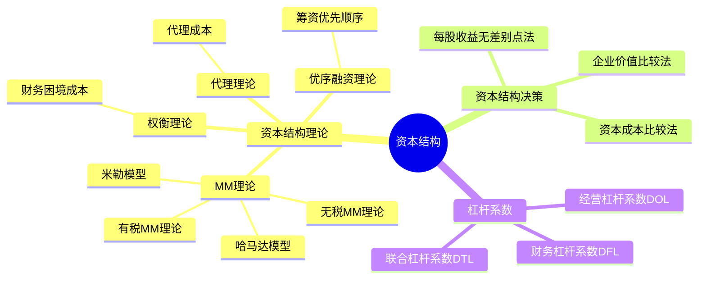

## 1. 章节定位

| 项目 | 信息 |
|------|------|
| 所属科目 | 财务成本管理 |
| 难度等级 | 3 |
| 历年分值 | 4-6分 |
| 建议学时 | 4-5h |

## 2. 考情分析

资本结构是连接筹资决策与价值评估的桥梁，题型以客观题与计算题为主。核心考点包括：MM理论（无税和有税）的命题与结论、权衡理论与财务困境成本、代理理论与优序融资理论、每股收益无差别点法、资本结构决策的三种方法（资本成本比较法、每股收益无差别点法、企业价值比较法）。

近年趋势强调理论理解与计算结合，特别是无税MM理论与有税MM理论的对比、财务杠杆系数（DFL）的计算、每股收益无差别点的求解。考生须准确理解债务抵税效应对企业价值的影响。

**命题规律**：
1. MM理论（无税与有税）的命题含义与公式推导是高频客观题，几乎每年必考；
2. 四大资本结构理论（MM、权衡、代理、优序融资）的观点对比是客观题常考点；
3. 每股收益无差别点的计算与决策是计算题核心，常结合筹资方案选择出题；
4. 三大杠杆系数（DOL、DFL、DTL）的计算与含义是必考内容；
5. 资本结构决策三种方法的适用条件与比较偶有考查。

**学习提示**：本章的理论部分较为抽象，建议先理解"资本结构是否影响企业价值"这一核心问题，再依次学习各理论的回答。MM理论是基础（无税：不影响；有税：负债越多越好），权衡理论加入财务困境成本修正，代理理论再加入代理成本，优序融资理论则从信息不对称角度解释筹资顺序。计算部分重点掌握每股收益无差别点的列方程求解，以及杠杆系数的三个公式。

**与其他章节的关联**：本章向上承接第五章（资本成本的计算是本章资本结构决策的基础）、第八章（期权思维：股权可视为看涨期权），向下连接第九章（资本结构影响WACC进而影响企业价值评估）、第十一章（股利政策影响留存收益进而影响资本结构）。

## 3. 知识框架



## 4. 核心精讲

### 一、资本结构理论

资本结构是指企业各种长期资本来源的构成和比例关系，通常指长期债务资本与权益资本的比例（不含短期负债）。

#### （一）MM理论

MM理论由莫迪格利安尼和米勒提出，基于完善资本市场等假设，是现代资本结构理论的起点。

**假设条件**：
1. 经营风险相同的企业处于同一风险等级；
2. 投资者预期相同；
3. 资本市场完善，无交易成本；
4. 投资者与企业同等利率借款；
5. 负债无风险，利率为无风险利率；
6. EBIT 不变，增长率为零，现金流量为永续年金。

**1. 无税MM理论**（不考虑企业所得税）

**命题Ⅰ**：无负债企业价值 = 有负债企业价值

$$V_L = V_U = \frac{EBIT}{r_{WACC}} = \frac{EBIT}{r_{sU}}$$

含义：在无税情况下，企业价值与资本结构无关。加权平均资本成本 $r_{WACC}$ 不随债务比例变化，等于无负债企业的权益资本成本 $r_{sU}$。

**命题Ⅱ**：有负债企业的权益资本成本随财务杠杆提高而增加：

$$r_{sL} = r_{sU} + (r_{sU} - r_d) \times \frac{D}{E}$$

其中 $r_{sL}$ 为有负债企业权益资本成本，$r_{sU}$ 为无负债企业权益资本成本，$r_d$ 为债务资本成本（无风险利率），$D/E$ 为债务与权益市值比。

含义：负债增加带来的低成本利益被权益成本上升完全抵消，故企业价值不变。

**2. 有税MM理论**（考虑企业所得税）

**命题Ⅰ**：有负债企业价值 = 无负债企业价值 + 利息抵税现值

$$V_L = V_U + D \times T = V_U + PV(\text{利息抵税})$$

其中 $D \times T$ 为债务抵税价值（杠杆收益），是债务利息抵税的永续年金现值（折现率为债务利率）。

含义：因债务利息可在税前扣除，负债增加了企业价值，负债越多企业价值越大（100%负债时价值最大）。

**命题Ⅱ**：有负债企业权益资本成本：

$$r_{sL} = r_{sU} + (r_{sU} - r_d) \times (1 - T) \times \frac{D}{E}$$

与无税相比，风险溢价乘以 $(1-T)$，因抵税效应使风险溢价降低。

**哈马达模型**（结合CAPM）：

$$\beta_L = \beta_U \times \left[1 + (1 - T) \times \frac{D}{E}\right]$$

将权益β分为经营风险（$\beta_U$）和财务风险两部分。

**米勒模型**（考虑个人所得税）：

$$V_L = V_U + \left[1 - \frac{(1 - T_c)(1 - T_s)}{(1 - T_d)}\right] \times D$$

其中 $T_c$ 为企业所得税率，$T_s$ 为个人股票所得税率，$T_d$ 为个人债券所得税率。若 $T_s = T_d$，则退化为有税MM理论。

**无税MM理论与有税MM理论的系统对比**：

| 对比维度 | 无税MM理论 | 有税MM理论 |
|---------|-----------|-----------|
| 企业价值 | $V_L = V_U$（与资本结构无关） | $V_L = V_U + D \times T$（负债增加价值） |
| 最优资本结构 | 不存在（任何结构等价） | 100%负债（负债越多价值越大） |
| 权益资本成本 | $r_{sL} = r_{sU} + (r_{sU} - r_d) \times D/E$ | $r_{sL} = r_{sU} + (r_{sU} - r_d) \times (1-T) \times D/E$ |
| WACC | 不随杠杆变化 | 随负债增加而下降 |
| 抵税效应 | 无 | 有（利息税前扣除） |
| 命题Ⅱ风险溢价 | 较大 | 较小（乘以 $(1-T)$） |

**MM理论命题Ⅱ的直观理解**：

权益资本成本随杠杆上升的原因：负债增加使股东承担的财务风险增大（破产概率上升、收益波动加剧），股东要求更高的报酬率作为补偿。无税时，低成本债务的利益恰好被权益成本上升抵消，企业价值不变；有税时，债务的抵税收益未被完全抵消，故企业价值随负债增加。

**WACC随杠杆变化的推导**（有税MM理论下）：

$$r_{WACC} = r_{sL} \times \frac{E}{V} + r_d \times (1 - T) \times \frac{D}{V}$$

随 $D/V$ 增加，低成本的税后债务权重增大，WACC 下降，企业价值上升。这就是有税MM理论主张100%负债的逻辑。

#### （二）权衡理论

权衡理论强调在平衡债务利息抵税收益与财务困境成本的基础上，企业价值最大化时的资本结构即为最佳资本结构。

$$V_L = V_U + PV(\text{利息抵税}) - PV(\text{财务困境成本})$$

**财务困境成本**：
- **直接成本**：破产、清算、重组的法律费用和管理费用；
- **间接成本**：客户流失、供应商信用收紧、员工流失、融资成本上升等，通常比直接成本大得多。

**财务困境成本的预测因素**：
- **资产类型**：有形资产多的企业财务困境成本低（资产可变现），无形资产多的企业成本高；
- **行业特征**：基础设施、公用事业等稳定行业困境成本低，高科技、服务业等波动行业成本高；
- **产品类型**：耐用品、需售后服务的商品困境成本高（客户担心企业倒闭无法服务）。

**最佳资本结构**：债务抵税收益的边际价值 = 增加的财务困境成本的现值时，企业价值最大。

**权衡理论的图形理解**：

```
企业价值
  |        权衡理论最佳点
  |           ╱╲
  |          ╱  ╲  有税MM理论（忽略困境成本）
  |         ╱    ╲╱‾‾‾‾╲
  |        ╱          抵税收益递减
  |       ╱     ╲       ╲
  |      ╱       ╲       ╲ 财务困境成本急剧上升
  |     ╱         ╲       ╲
  |    ╱           ╲       ╲
  |  V_U────────────╲───────╲────
  |                  ╲       ╲
  └──────────────────────────────负债比例
              最佳负债比例
```

随负债比例增加，抵税收益先快速增加后递减，财务困境成本起初很小后急剧上升。两者之差最大处即为最佳资本结构。

#### （三）代理理论

代理理论考虑债务筹资带来的代理成本。

$$V_L = V_U + PV(\text{利息抵税}) - PV(\text{财务困境成本}) - PV(\text{代理成本})$$

**代理成本**：
- **过度投资问题**：股东可能投资于净现值为负的高风险项目（损害债权人利益）；
- **投资不足问题**：当项目收益主要归债权人时，股东可能放弃净现值为正的项目；
- **债务代理收益**：债务约束管理层过度投资，减少自由现金流代理成本。

**过度投资与投资不足的对比**：

| 问题类型 | 产生条件 | 行为表现 | 后果 |
|---------|---------|---------|------|
| 过度投资 | 负债比例高，项目风险大 | 股东倾向投资高风险项目（即使NPV<0） | 高风险收益归股东，损失由债权人承担 |
| 投资不足 | 负债比例高，项目稳健 | 股东放弃低风险正NPV项目 | 项目收益多归债权人，股东不愿"为他人作嫁" |

**代理收益与代理成本的权衡**：适度负债可约束管理层（减少自由现金流被滥用），但过度负债引发代理成本。最佳资本结构下，代理收益与代理成本之差最大。

#### （四）优序融资理论

优序融资理论认为，考虑信息不对称和筹资成本，企业筹资有优先顺序：

1. **内部筹资**（留存收益）——最优先；
2. **债务筹资**（借款、债券）——其次；
3. **股权筹资**（发行新股）——最后。

原因：内部筹资无筹资成本、无信息不对称；债务筹资成本低于股权，且不会传递不利信号；发行新股被市场解读为股价高估信号。

**信息不对称的信号效应**：
- **发行新股**：管理层认为股价被高估时才发股，市场解读为利空信号，股价下跌；
- **发行债券**：管理层对未来现金流有信心（能还本付息），市场解读为偏正面信号；
- **内部筹资**：无信号传递，最优选择。

**四大资本结构理论系统对比**：

| 理论 | 核心观点 | 最佳资本结构 | 关键因素 |
|------|---------|------------|---------|
| 无税MM理论 | 资本结构不影响企业价值 | 不存在 | 无（完善市场假设） |
| 有税MM理论 | 负债抵税增加企业价值 | 100%负债 | 利息抵税 |
| 权衡理论 | 抵税收益与困境成本权衡 | 存在最佳点 | 抵税收益 vs 财务困境成本 |
| 代理理论 | 加入代理成本与收益 | 存在最佳点 | 抵税-困境成本-代理成本权衡 |
| 优序融资理论 | 信息不对称决定筹资顺序 | 不存在明确最优 | 内部→债务→股权 |

### 二、资本结构决策分析

资本结构决策是在若干可行的筹资方案中选择使企业价值最大或资本成本最低的方案。常用三种方法：

#### （一）资本成本比较法

计算各筹资方案的加权平均资本成本（WACC），选择 WACC 最小的方案。

$$r_{WACC} = r_d \times (1 - T) \times \frac{D}{V} + r_s \times \frac{E}{V}$$

**注意**：WACC 最小的资本结构即公司价值最大的资本结构（在假设资本结构不改变现金流量的前提下）。

**优点**：计算简单，易于理解。
**缺点**：只考虑资本成本，未考虑风险变化；假设 EBIT 不随资本结构变化，可能不符合实际。

#### （二）每股收益无差别点法

计算两种筹资方案下每股收益（EPS）相等时的息税前利润（EBIT），即无差别点。

$$\frac{(EBIT - I_1)(1 - T)}{N_1} = \frac{(EBIT - I_2)(1 - T)}{N_2}$$

其中 $I_1, I_2$ 为两方案的利息，$N_1, N_2$ 为两方案的普通股股数。

**决策规则**：
- 预期 EBIT > 无差别点 EBIT，选择债务筹资（利息多但股数少，EPS高）；
- 预期 EBIT < 无差别点 EBIT，选择股权筹资（利息少但股数多，EPS高）。

**直观理解**：债务筹资的优势是"不增发股票"（股数少），劣势是"利息高"（利润少）。当 EBIT 足够大时，利息负担可承受，股数少使 EPS 更高；当 EBIT 较小时，利息负担过重，不如增发股票分担风险。

**每股收益无差别点法的局限**：只考虑 EPS 最大化，未考虑风险。债务筹资虽 EPS 高，但财务风险也大。故该方法适合"以盈利能力为决策依据"的场景，风险中性者偏好。

#### （三）企业价值比较法

计算各方案的企业总价值（实体价值），选择企业价值最大的方案。

$$\text{企业总价值} = \text{股票市场价值} + \text{债务市场价值}$$

其中股票市场价值 $= (\text{EBIT} - I)(1 - T) / r_s$。

选择企业价值最大、同时 WACC 最小的方案。

**股票市场价值的计算逻辑**：假设企业永续经营，净利润全部作为股利发放，则股票价值 $= \text{净利润} / r_s = (\text{EBIT} - I)(1 - T) / r_s$。注意不同方案的 $r_s$ 不同（财务风险不同），需根据哈马达模型调整 $\beta$ 后重新计算。

**三种决策方法比较**：

| 方法 | 决策标准 | 优点 | 缺点 | 适用场景 |
|------|---------|------|------|---------|
| 资本成本比较法 | WACC 最小 | 简单直观 | 忽略风险变化 | 初步筛选 |
| 每股收益无差别点法 | EPS 最大 | 考虑盈利能力 | 忽略风险 | 盈利导向决策 |
| 企业价值比较法 | 企业价值最大 | 综合考虑收益与风险 | 计算复杂 | 最严谨，推荐 |

**重要结论**：企业价值比较法是最优方法，因为它同时考虑了收益（通过 EBIT）和风险（通过 $r_s$ 随杠杆调整）。当企业价值最大时，WACC 必然最小，两者等价。

### 三、杠杆系数

杠杆系数衡量某一变量（如销量）变动对另一变量（如每股收益）的放大效应，是风险管理的重要工具。

#### （一）经营杠杆系数（DOL）

经营杠杆衡量固定成本对息税前利润波动的影响。

$$DOL = \frac{\Delta EBIT / EBIT}{\Delta Q / Q} = \frac{Q(P - V)}{Q(P - V) - F} = \frac{\text{边际贡献}}{\text{息税前利润}}$$

其中 $P$ 为单价，$V$ 为单位变动成本，$F$ 为固定成本。

**经营杠杆的成因**：固定成本的存在使 EBIT 的变动率大于销量的变动率。当销量增加时，固定成本总额不变，单位固定成本下降，利润加速增长；反之亦然。

**DOL 的特点**：
- $DOL \geq 1$（恒成立，因固定成本 $F \geq 0$）；
- $F$ 越大，DOL 越大，经营风险越高；
- $F = 0$ 时，$DOL = 1$（无经营杠杆）；
- EBIT 越接近 0（盈亏平衡点附近），DOL 趋向无穷大。

**经营杠杆与经营风险的关系**：DOL 是经营风险的度量指标。DOL 越大，销量波动引起的 EBIT 波动越剧烈，经营风险越高。重资产、高固定成本的行业（如钢铁、航空）DOL 大；轻资产、低固定成本的行业（如咨询、软件）DOL 小。

#### （二）财务杠杆系数（DFL）

财务杠杆衡量固定利息费用对每股收益波动的影响。

$$DFL = \frac{\Delta EPS / EPS}{\Delta EBIT / EBIT} = \frac{EBIT}{EBIT - I}$$

**财务杠杆的成因**：固定利息的存在使 EPS 的变动率大于 EBIT 的变动率。当 EBIT 增加时，利息不变，净利润加速增长，EPS 放大；反之亦然。

**DFL 的特点**：
- $DFL \geq 1$（恒成立，因利息 $I \geq 0$）；
- $I$ 越大，DFL 越大，财务风险越高；
- $I = 0$ 时，$DFL = 1$（无财务杠杆）；
- EBIT 越接近 I（利息保障倍数接近1），DFL 趋向无穷大，财务风险极高。

**财务杠杆与财务风险的关系**：DFL 是财务风险的度量指标。负债越多，利息越大，DFL 越大，财务风险越高。但财务杠杆也能放大股东收益（EBIT 上升时），故适度负债可提高股东回报。

#### （三）联合杠杆系数（DTL）

联合杠杆衡量销量变动对每股收益的总影响。

$$DTL = DOL \times DFL = \frac{\text{边际贡献}}{\text{息税前利润} - \text{利息}} = \frac{Q(P-V)}{Q(P-V) - F - I}$$

**联合杠杆的含义**：DTL 反映从销量到 EPS 的总放大效应，是经营杠杆与财务杠杆的乘积。企业通过经营杠杆和财务杠杆共同影响股东收益的波动性。

**三大杠杆系数的关系**：

| 杠杆类型 | 起因 | 放大效应 | 风险类型 | 公式 |
|---------|------|---------|---------|------|
| DOL | 固定成本 F | Q → EBIT | 经营风险 | 边际贡献 / EBIT |
| DFL | 固定利息 I | EBIT → EPS | 财务风险 | EBIT / (EBIT - I) |
| DTL | F + I 共同 | Q → EPS | 总风险 | 边际贡献 / (EBIT - I) |

**杠杆管理策略**：企业可根据经营风险调整财务风险，使总风险可控。例如：
- **高经营风险企业**（DOL 大，如高科技）：应低负债（DFL 小），避免总风险过高；
- **低经营风险企业**（DOL 小，如公用事业）：可高负债（DFL 大），利用抵税收益。

## 5. 典型例题

**【例题 1】（计算题·每股收益无差别点）**

某公司目前资本结构为：长期借款 1000 万元，利率 6%；普通股 1000 万股，每股面值 1 元。公司拟新增筹资 2000 万元，方案一：发行债券 2000 万元，利率 8%；方案二：增发普通股 2000 万股，每股 1 元。所得税率 25%。

要求：计算每股收益无差别点。

**答案**：

方案一（增发债券）：
- 利息 $I_1 = 1000 \times 6\% + 2000 \times 8\% = 60 + 160 = 220$（万元）
- 股数 $N_1 = 1000$（万股）

方案二（增发股票）：
- 利息 $I_2 = 1000 \times 6\% = 60$（万元）
- 股数 $N_2 = 1000 + 2000 = 3000$（万股）

设无差别点 EBIT：

$$\frac{(EBIT - 220)(1 - 25\%)}{1000} = \frac{(EBIT - 60)(1 - 25\%)}{3000}$$

化简：

$$\frac{EBIT - 220}{1000} = \frac{EBIT - 60}{3000}$$

$$3(EBIT - 220) = EBIT - 60$$

$$3 EBIT - 660 = EBIT - 60$$

$$2 EBIT = 600$$

$$EBIT = 300 \text{（万元）}$$

**决策**：若预期 EBIT > 300 万元，选方案一（债务筹资）；若 < 300 万元，选方案二（股权筹资）。

---

**【例题 2】（杠杆系数）**

某公司销售产品单价 100 元，单位变动成本 60 元，固定成本 200 万元，利息 50 万元。计算销售量为 10 万件时的 DOL、DFL、DTL。

**答案**：

- 边际贡献 $= 10 \times (100 - 60) = 400$（万元）
- EBIT $= 400 - 200 = 200$（万元）

- $DOL = 400 / 200 = 2$
- $DFL = 200 / (200 - 50) = 200 / 150 = 1.33$
- $DTL = 2 \times 1.33 = 2.67$（或 $= 400 / (200 - 50) = 400 / 150 = 2.67$）

**解析**：DTL = DOL × DFL = 边际贡献 / (EBIT - 利息)。

---

**【例题 3】（MM理论判断）**

下列关于MM理论的说法中，正确的是？

A. 无税MM理论认为企业价值随负债增加而增加
B. 有税MM理论认为企业价值与资本结构无关
C. 有税MM理论认为负债越多企业价值越大
D. 无税MM理论认为有负债企业权益成本不变

**答案**：C

**解析**：无税MM理论认为企业价值与资本结构无关（A、D错误）；有税MM理论认为负债带来抵税收益，负债越多企业价值越大（B错误，C正确）。

---

**【例题 4】（有税MM理论计算）**

某公司无负债，权益资本成本 12%，EBIT 600 万元，所得税率 25%。公司拟发行 2000 万元债券（利率 8%）回购股票。

要求：(1) 计算无负债企业价值；(2) 计算有负债企业价值（有税MM理论）；(3) 计算有负债企业权益资本成本。

**答案**：

(1) 无负债企业价值：

$$V_U = \frac{EBIT \times (1 - T)}{r_{sU}} = \frac{600 \times 0.75}{12\%} = \frac{450}{0.12} = 3750 \text{（万元）}$$

(2) 有负债企业价值：

$$V_L = V_U + D \times T = 3750 + 2000 \times 25\% = 3750 + 500 = 4250 \text{（万元）}$$

(3) 有负债企业权益价值 $E = V_L - D = 4250 - 2000 = 2250$（万元），有负债企业权益资本成本：

$$r_{sL} = r_{sU} + (r_{sU} - r_d) \times (1 - T) \times \frac{D}{E} = 12\% + (12\% - 8\%) \times 0.75 \times \frac{2000}{2250}$$

$$= 12\% + 4\% \times 0.75 \times 0.889 = 12\% + 2.67\% = 14.67\%$$

**解析**：有税MM理论下，企业价值 = 无负债价值 + 抵税价值；权益成本因财务杠杆上升，但上升幅度因 $(1-T)$ 而减小。

---

**【例题 5】（哈马达模型）**

某公司无负债时 $\beta_U = 1.2$，现拟将资本结构调整为债务占 40%、权益占 60%（按市值计），所得税率 25%。

要求：计算有负债企业的 $\beta_L$。

**答案**：

$$\beta_L = \beta_U \times \left[1 + (1 - T) \times \frac{D}{E}\right] = 1.2 \times \left[1 + 0.75 \times \frac{40}{60}\right] = 1.2 \times (1 + 0.5) = 1.2 \times 1.5 = 1.8$$

**解析**：哈马达模型将权益β分解为经营风险（$\beta_U$）和财务风险两部分。负债比例越高，$\beta_L$ 越大，权益资本成本越高。

---

**【例题 6】（企业价值比较法）**

某公司 EBIT 800 万元，所得税率 25%，目前无负债。拟比较两种方案：
- 方案A：发行 3000 万元债券，利率 6%，$r_s = 14\%$
- 方案B：发行 5000 万元债券，利率 8%，$r_s = 18\%$

要求：用企业价值比较法选择最优方案。

**答案**：

方案A：
- 股票价值 $= (800 - 3000 \times 6\%) \times 0.75 / 14\% = (800 - 180) \times 0.75 / 0.14 = 465 / 0.14 = 3321.43$（万元）
- 企业总价值 $= 3321.43 + 3000 = 6321.43$（万元）

方案B：
- 股票价值 $= (800 - 5000 \times 8\%) \times 0.75 / 18\% = (800 - 400) \times 0.75 / 0.18 = 300 / 0.18 = 1666.67$（万元）
- 企业总价值 $= 1666.67 + 5000 = 6666.67$（万元）

**决策**：方案B企业价值（6666.67万元）> 方案A（6321.43万元），选方案B。

**解析**：企业价值比较法计算各方案股票价值与债务价值之和，选总价值最大者。注意 $r_s$ 随负债增加而上升，反映财务风险增大。

---

**【例题 7】（杠杆系数综合计算）**

某公司产销单一产品，单价 200 元，单位变动成本 120 元，固定成本 80 万元，利息 20 万元，优先股股利 15 万元，所得税率 25%，当前销量 2 万件。

要求：计算 DOL、DFL、DTL。

**答案**：

- 边际贡献 $= 2 \times (200 - 120) = 160$（万元）
- EBIT $= 160 - 80 = 80$（万元）

(1) $DOL = 160 / 80 = 2$

(2) 优先股股利需还原为税前：$I_{优先股} = 15 / (1 - 25\%) = 20$（万元）

$$DFL = \frac{EBIT}{EBIT - I - \frac{D_p}{1 - T}} = \frac{80}{80 - 20 - 20} = \frac{80}{40} = 2$$

(3) $DTL = DOL \times DFL = 2 \times 2 = 4$

**解析**：优先股股利是税后支付，计算DFL时需还原为税前等值 $D_p / (1 - T)$。DTL = DOL × DFL，本题销量每变动1%，EPS变动4%。

---

**【例题 8】（四大理论观点判断）**

下列关于资本结构理论的说法中，正确的有（　）。

A. 权衡理论认为最佳资本结构是抵税收益与财务困境成本平衡的点
B. 代理理论认为债务筹资只有代理成本，没有代理收益
C. 优序融资理论认为企业应优先内部筹资，最后股权筹资
D. 有税MM理论认为100%负债时企业价值最大

**答案**：ACD

**解析**：
- A正确：权衡理论核心是抵税收益与财务困境成本的权衡；
- B错误：代理理论认为债务既有代理成本（过度投资、投资不足），也有代理收益（约束管理层）；
- C正确：优序融资顺序为内部→债务→股权；
- D正确：有税MM理论忽略财务困境成本，认为负债越多价值越大，100%负债最优。

## 6. 记忆口诀

**MM理论两命题**：
> 无税：价值不变（命题Ⅰ），权益成本随杠杆上升（命题Ⅱ）；
> 有税：价值随负债增加（命题Ⅰ，加 DT），权益成本上升幅度减小（命题Ⅱ，乘 (1-T)）。

**权衡理论"加减法"**：
> $V_L = V_U + 抵税现值 - 财务困境成本现值$；
> 最佳点：边际抵税收益 = 边际困境成本。

**优序融资三顺序**：
> 内部 → 债务 → 股权；
> 信息不对称是关键，发新股是坏信号。

**无差别点决策**：
> EBIT 高于无差别点，借钱（债务）更划算；
> EBIT 低于无差别点，发股更稳妥。

**杠杆系数三公式**：
> DOL = 边际贡献 / EBIT；
> DFL = EBIT / (EBIT - I)；
> DTL = 边际贡献 / (EBIT - I) = DOL × DFL。

## 7. 同步练习

**1.（单选题）** 下列关于资本结构理论的说法中，错误的是（　）。

A. 无税MM理论认为企业价值与资本结构无关
B. 有税MM理论认为负债越多企业价值越大
C. 权衡理论认为最佳资本结构是抵税收益与财务困境成本平衡的点
D. 优序融资理论认为企业应优先选择股权筹资

**2.（单选题）** 某公司边际贡献 400 万元，固定成本 200 万元，利息 50 万元，则联合杠杆系数为（　）。

A. 1.33
B. 2.00
C. 2.67
D. 4.00

**3.（计算题）** 某公司目前无负债，权益资本 5000 万元，权益资本成本 10%，EBIT 500 万元。拟调整资本结构，发行 2000 万元债券（利率 6%）回购股票，所得税率 25%。用有税MM理论计算调整后企业实体价值。

**4.（计算题）** 某公司现有长期借款 800 万元，利率 5%；普通股 800 万股。拟筹资 1000 万元，方案一：增发债券 1000 万元，利率 7%；方案二：增发普通股 1000 万股。所得税率 25%。计算每股收益无差别点 EBIT。

**5.（多选题）** 下列关于财务杠杆系数的说法中，正确的有（　）。

A. 财务杠杆系数衡量息税前利润变动对每股收益的影响
B. 利息越大，财务杠杆系数越大
C. 财务杠杆系数等于1时，说明无固定利息费用
D. 财务杠杆系数越大，财务风险越小

---

**练习答案**：1.D　2.C（$400/(400-200-50) = 400/150 = 2.67$）　3. 无负债企业价值 $V_U = 500 \times 0.75 / 10\% = 3750$万元；调整后 $V_L = 3750 + 2000 \times 25\% = 3750 + 500 = 4250$万元　4. $I_1=40+70=110, N_1=800; I_2=40, N_2=1800$；无差别点：$(EBIT-110)/800 = (EBIT-40)/1800$，解得 $EBIT=170$万元　5.ABC
