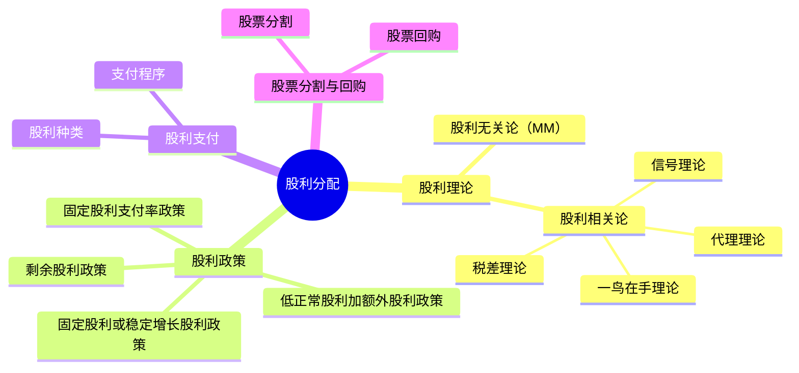

## 📍 章节定位

| 项目 | 信息 |
|------|------|
| **所属科目** | 📊 财务成本管理 |
| **难度等级** | ⭐⭐ |
| **历年分值** | 3-5分 |
| **建议学时** | 3-4h |

## 📝 考情分析

本章是次重点章节，题型以客观题为主，偶有计算题。核心考点包括：股利理论（股利无关论、股利相关论）、四种股利政策的特点与比较、剩余股利政策的计算、股票股利与股票分割的影响、股票回购的财务影响。

近年趋势强调剩余股利政策的计算（结合目标资本结构）和股票回购对每股收益、每股市价的影响。考生须准确区分股票股利与股票分割的异同，以及现金股利与股票回购在所有者权益变动上的差异。

## 🧠 知识框架

## 📖 核心精讲

### 一、股利理论与股利政策

#### （一）股利理论

| 理论 | 核心观点 |
|------|----------|
| **股利无关论**（MM理论） | 股利政策不影响企业价值，只取决于投资政策 |
| **一鸟在手理论** | 股东偏好确定的股利，股利支付率越高，企业价值越大 |
| **信号理论** | 股利变化传递公司未来盈利信息，增发股利是利好信号 |
| **税差理论** | 资本利得税率低于股利所得税率时，低股利支付率增加企业价值 |
| **代理理论** | 股利支付可减少自由现金流，约束管理层过度投资 |

#### （二）四种股利政策

**1. 剩余股利政策**

**核心思想**：公司设定目标资本结构，先满足投资所需权益资本，剩余盈余作为股利分配。

**步骤**：
1. 设定目标资本结构（权益与债务比率）；
2. 确定目标资本结构下投资所需的股东权益数额；
3. 最大限度地使用保留盈余满足投资所需权益资本；
4. 投资所需权益资本满足后，剩余盈余作为股利发放。

**计算公式**：

$$\text{股利分配额} = \text{净利润} - \text{投资所需权益资本}$$

其中：投资所需权益资本 $= \text{总投资额} \times \text{目标权益比例}$

**优点**：保持目标资本结构，使加权平均资本成本最低。
**缺点**：股利支付额随投资机会波动，不稳定。

**例**：某公司本年净利润 600 万元，下年需增加长期资本 800 万元，目标资本结构权益占 60%。按法律至少提取 10% 公积金。则：
- 投资所需权益资本 $= 800 \times 60\% = 480$（万元）
- 股利分配 $= 600 - 480 = 120$（万元）

注意：法律规定的 10% 公积金（60 万元）包含在 480 万元的留存中，未构成额外限制。

**2. 固定股利或稳定增长股利政策**

将每年股利固定在特定水平或按固定增长率稳定增长。

**理论依据**：一鸟在手理论和信号理论。

**优点**：传递稳定信号，增强投资者信心；有利于股东安排收支。
**缺点**：股利与盈余脱节，盈余低时仍支付固定股利可能导致资金短缺；不能像剩余股利政策那样保持较低资本成本。

**适用**：成熟的、盈利充分且获利能力稳定的公司。

**3. 固定股利支付率政策**

确定一个股利占净利润的比率，长期按此比率支付股利。

**优点**：股利与盈余紧密配合，体现"多盈多分、少盈少分"。
**缺点**：各年股利波动大，易造成公司不稳定的感觉。

**4. 低正常股利加额外股利政策**

一般情况下支付固定的、较低的正常股利；盈余多的年份再发放额外股利。

**优点**：灵活性强；保证股东获得稳定较低收入。
**缺点**：额外股利不能经常化，否则失去"额外"意义。

### 二、股利政策的影响因素

| 类别 | 具体因素 |
|------|----------|
| **法律限制** | 资本保全限制、企业积累限制、净利润限制、超额累积利润限制、无力偿付限制 |
| **股东因素** | 稳定收入与避税、控制权稀释 |
| **公司因素** | 盈余稳定性、流动性、举债能力、投资机会、资本成本、债务需要 |
| **其他限制** | 债务合同约束、通货膨胀 |

### 三、股利的种类与支付程序

#### （一）股利种类

1. **现金股利**：以现金支付股利，是最常见的形式；
2. **股票股利**：以增发股票方式支付股利；
3. **财产股利**：以现金以外的资产支付；
4. **负债股利**：以负债方式支付（应付票据等）。

#### （二）股票股利的影响

发放股票股利后，公司所有者权益总额不变，但内部结构发生变化：未分配利润减少，股本和资本公积增加。

| 项目 | 现金股利 | 股票股利 |
|------|----------|----------|
| 资产 | 减少 | 不变 |
| 所有者权益总额 | 减少 | 不变 |
| 每股收益 | 减少 | 减少（股数增加） |
| 每股市价 | 可能下降 | 下降（除权效应） |
| 股东持股比例 | 不变 | 不变 |

#### （三）股利支付程序

重要日期：
1. **股利宣告日**：董事会公告股利发放的日期；
2. **股权登记日**：有权领取股利的股东登记截止日；
3. **除息日**（除权日）：股票所有权与股利权分离的日期，除息日当天买入股票无权领取本次股利；
4. **股利发放日**：实际支付股利的日期。

### 四、股票分割与股票回购

#### （一）股票分割

**股票分割**是指将一股面额较高的股票拆分为数股面额较低股票的行为。

**影响**：
- 股数增加，每股面值按比例减少；
- 股本总额、资本公积、未分配利润均不变；
- 所有者权益总额不变；
- 每股收益、每股市价按比例下降。

| 项目 | 股票股利 | 股票分割 |
|------|----------|----------|
| 每股面值 | 不变 | 减少 |
| 股本总额 | 增加 | 不变 |
| 所有者权益内部结构 | 变化 | 不变 |
| 所有者权益总额 | 不变 | 不变 |
| 每股收益 | 减少 | 减少 |
| 每股市价 | 下降 | 下降 |

**股票分割的目的**：
1. 降低股票市价，便于散户交易；
2. 传递公司良好发展前景的信号。

**反向分割（合股）**：将多股合并为一股，提高股价。

#### （二）股票回购

**股票回购**是指公司出资购回自身发行在外的股票。

**回购方式**：
1. 公开市场回购；
2. 现金要约回购；
3. 协议回购。

**股票回购的影响**：
- 流通在外股数减少；
- 每股收益上升；
- 每股净资产上升；
- 股价可能上升；
- 现金减少；
- 所有者权益减少。

**股票回购与现金股利的比较**：
- 相同点：都减少公司现金和所有者权益；
- 不同点：股票回购减少股数，提高每股收益；现金股利不减少股数。

**股票回购的动机**：
1. 现金股利的替代；
2. 改善资本结构（提高负债比例）；
3. 满足认股权、可转债的行使；
4. 防止被收购；
5. 传递股价被低估的信号。

## 💡 典型例题

**【例题 1】（计算题·剩余股利政策）**

某公司本年净利润 800 万元，下年需增加长期资本 1000 万元，目标资本结构为权益占 70%、债务占 30%。按法律规定至少提取 10% 法定公积金。

要求：计算股利分配额。

**答案**：

- 投资所需权益资本 $= 1000 \times 70\% = 700$（万元）
- 法定公积金 $= 800 \times 10\% = 80$（万元）（包含在留存700万元内）
- 股利分配额 $= 800 - 700 = 100$（万元）

**解析**：剩余股利政策先满足投资所需权益资本（700 万元），剩余 100 万元作为股利。法定公积金 80 万元是留存 700 万元的一部分，未构成额外限制。

---

**【例题 2】（计算题·股票回购）**

某公司流通在外普通股 1000 万股，每股市价 20 元，公司拟以 2000 万元回购股票。回购后公司净利润 2000 万元不变。

要求：计算回购后每股收益和每股市价。

**答案**：

- 回购股数 $= 2000 / 20 = 100$（万股）
- 回购后流通股数 $= 1000 - 100 = 900$（万股）
- 回购前每股收益 $= 2000 / 1000 = 2$（元）
- 回购后每股收益 $= 2000 / 900 = 2.22$（元）
- 回购后市价 $= 20 \times (2.22 / 2) = 22.22$（元）

**解析**：股票回购减少流通股数，提高每股收益，进而推高每股市价。

---

**【例题 3】（概念题）**

下列关于股票股利和股票分割的说法中，正确的是？

A. 股票股利使每股面值减少
B. 股票分割使股本总额增加
C. 两者都使所有者权益总额不变
D. 股票分割改变所有者权益内部结构

**答案**：C

**解析**：股票股利每股面值不变（A错）；股票分割股本总额不变（B错）；股票分割不改变所有者权益内部结构（D错）；两者都使所有者权益总额不变（C正确）。

## 🎯 记忆口诀

**四种股利政策特点**：
> 剩余：先投资后分利，资本成本最低；
> 固定/稳定增长：信号好但脱节盈余；
> 固定支付率：随盈余波动，不稳定；
> 低正常+额外：灵活又保底。

**股票股利 vs 股票分割**：
> 股利改结构（未分配转股本），面值不变；
> 分割只改面值，结构全不变；
> 两者总额都不变，EPS和市价都下降。

**股票回购"四减一增"**：
> 减股数、减现金、减权益、减市价（除权效应）；
> 增每股收益。

## ✅ 同步练习

**1.（单选题）** 下列股利政策中，能够保持目标资本结构、使加权平均资本成本最低的是（　）。

A. 剩余股利政策
B. 固定股利政策
C. 固定股利支付率政策
D. 低正常股利加额外股利政策

**2.（单选题）** 某公司本年净利润 500 万元，下年投资需求 800 万元，目标资本结构权益占 60%。采用剩余股利政策，则股利分配额为（　）万元。

A. 20
B. 80
C. 200
D. 300

**3.（单选题）** 发放股票股利后，下列项目中发生变化的是（　）。

A. 每股面值
B. 股本总额
C. 所有者权益总额
D. 股东持股比例

**4.（计算题）** 某公司流通在外普通股 2000 万股，每股市价 15 元，公司拟以 3000 万元回购股票，回购后净利润 4000 万元不变。计算回购后每股收益和每股市价。

**5.（多选题）** 下列关于股票回购的说法中，正确的有（　）。

A. 股票回购会减少流通在外股数
B. 股票回购会提高每股收益
C. 股票回购会减少所有者权益
D. 股票回购与现金股利对所有者权益的影响相同

---

**练习答案**：1.A　2.A（$500 - 800 \times 60\% = 500 - 480 = 20$）　3.B　4. 回购股数200万股，回购后股数1800万股；EPS = 4000/1800 = 2.22元；市价 = 15 × (2.22/2) = 16.67元　5.ABCD
