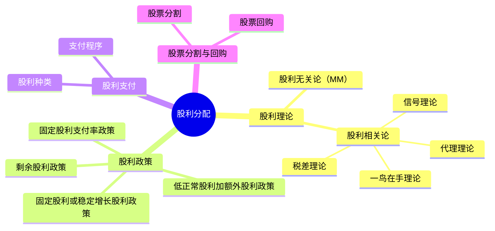

## 1. 章节定位

| 项目 | 信息 |
|------|------|
| 所属科目 | 财务成本管理 |
| 难度等级 | 2 |
| 历年分值 | 3-5分 |
| 建议学时 | 3-4h |

## 2. 考情分析

本章是次重点章节，题型以客观题为主，偶有计算题。核心考点包括：股利理论（股利无关论、股利相关论）、四种股利政策的特点与比较、剩余股利政策的计算、股票股利与股票分割的影响、股票回购的财务影响。

近年趋势强调剩余股利政策的计算（结合目标资本结构）和股票回购对每股收益、每股市价的影响。考生须准确区分股票股利与股票分割的异同，以及现金股利与股票回购在所有者权益变动上的差异。

**命题规律**：
1. 剩余股利政策的计算几乎每年必考，常结合目标资本结构和法定公积金出题；
2. 四种股利政策的特点、优缺点、适用条件是客观题高频考点；
3. 股票股利与股票分割的异同是客观题常考点，需准确区分对每股面值、股本、权益结构的影响；
4. 股票回购对每股收益、每股市价的影响是计算题常考点；
5. 股利理论的观点辨析偶有考查。

**学习提示**：本章概念性内容多，计算集中在剩余股利政策和股票回购两处。建议先理解"股利政策是否影响企业价值"这一理论争论，再记忆四种政策的特点，最后重点掌握剩余股利政策的计算步骤（先满足投资所需权益，剩余分配）和股票回购的每股收益影响。

**与其他章节的关联**：本章向上承接第十章（资本结构理论中的MM理论延伸到股利理论）、第四章（货币时间价值用于股利折现），向下连接第九章（股利政策影响股权现金流量）。

## 3. 知识框架

## 4. 核心精讲

### 一、股利理论与股利政策

#### （一）股利理论

股利理论研究的核心问题是：股利政策是否影响企业价值？

| 理论 | 核心观点 | 理论归属 |
|------|----------|---------|
| **股利无关论**（MM理论） | 股利政策不影响企业价值，只取决于投资政策 | 无关论 |
| 一鸟在手理论 | 股东偏好确定的股利，股利支付率越高，企业价值越大 | 相关论 |
| 信号理论 | 股利变化传递公司未来盈利信息，增发股利是利好信号 | 相关论 |
| 税差理论 | 资本利得税率低于股利所得税率时，低股利支付率增加企业价值 | 相关论 |
| 代理理论 | 股利支付可减少自由现金流，约束管理层过度投资 | 相关论 |

**1. 股利无关论（MM理论）**

莫迪格利安尼和米勒提出，在完善资本市场条件下，股利政策不影响企业价值。企业价值完全由投资决策决定的获利能力决定，而非利润分配方式。

**假设条件**（与资本结构MM理论类似）：
- 完善资本市场，无交易成本和税；
- 投资者理性，对未来投资、利润和股利预期相同；
- 无信息不对称；
- 无发行成本。

**核心逻辑**：若企业留存利润投资，股东通过股价上涨获利；若企业发放股利，股东直接获得现金。两种方式下股东财富相同（在完善市场下），故股利政策不影响企业价值。

**2. 一鸟在手理论**

"双鸟在林不如一鸟在手"。该理论认为，股利是确定的（"一鸟在手"），而资本利得是不确定的（"双鸟在林"）。股东是风险厌恶者，偏好确定的股利胜过不确定的资本利得。

**结论**：股利支付率越高，股东 perceived 风险越低，要求的报酬率越低，企业价值越大。故高股利支付率增加企业价值。

**3. 信号理论**

该理论基于信息不对称，管理层比投资者掌握更多内部信息。股利变化是管理层向市场传递信号的手段：
- **增加股利**：传递未来盈利向好的信号，股价上升；
- **减少股利**：传递未来盈利恶化的信号，股价下跌。

**结论**：股利政策通过信号效应影响企业价值。

**4. 税差理论**

该理论考虑税收差异对股利政策的影响。在很多国家（包括历史上的中国），股利所得税率高于资本利得税率。

**结论**：
- 当股利所得税率 > 资本利得税率时，低股利支付率（多留存、少分配）增加企业价值；
- 当两者税率相同时，股利政策不影响企业价值（退化为MM理论）；
- 当股利所得税率 < 资本利得税率时，高股利支付率增加企业价值。

**5. 代理理论**

该理论认为股利支付可缓解股东与管理层之间的代理冲突：
- 发放股利减少管理层可支配的自由现金流，降低过度投资风险；
- 高股利支付迫使企业外部融资，接受市场监督。

**结论**：适度股利支付可降低代理成本，增加企业价值。

**股利理论的综合比较**：

| 理论 | 是否影响企业价值 | 高股利支付率的影响 | 关键逻辑 |
|------|----------------|------------------|---------|
| MM理论 | 不影响 | 无影响 | 完善市场，分配方式无关 |
| 一鸟在手 | 影响 | 增加价值 | 股东偏好确定性 |
| 信号理论 | 影响 | 增加价值（传递利好） | 信息不对称下的信号传递 |
| 税差理论 | 影响 | 减少价值（股利税高时） | 税收差异使留存更优 |
| 代理理论 | 影响 | 增加价值（降低代理成本） | 约束管理层过度投资 |

#### （二）四种股利政策

**1. 剩余股利政策**

**核心思想**：公司设定目标资本结构，先满足投资所需权益资本，剩余盈余作为股利分配。

**步骤**：
1. 设定目标资本结构（权益与债务比率）；
2. 确定目标资本结构下投资所需的股东权益数额；
3. 最大限度地使用保留盈余满足投资所需权益资本；
4. 投资所需权益资本满足后，剩余盈余作为股利发放。

**计算公式**：

$$\text{股利分配额} = \text{净利润} - \text{投资所需权益资本}$$

其中：投资所需权益资本 $= \text{总投资额} \times \text{目标权益比例}$

**优点**：保持目标资本结构，使加权平均资本成本最低。
**缺点**：股利支付额随投资机会波动，不稳定。

**例**：某公司本年净利润 600 万元，下年需增加长期资本 800 万元，目标资本结构权益占 60%。按法律至少提取 10% 公积金。则：
- 投资所需权益资本 $= 800 \times 60\% = 480$（万元）
- 股利分配 $= 600 - 480 = 120$（万元）

注意：法律规定的 10% 公积金（60 万元）包含在 480 万元的留存中，未构成额外限制。

**2. 固定股利或稳定增长股利政策**

将每年股利固定在特定水平或按固定增长率稳定增长。

**理论依据**：一鸟在手理论和信号理论。

**优点**：传递稳定信号，增强投资者信心；有利于股东安排收支。
**缺点**：股利与盈余脱节，盈余低时仍支付固定股利可能导致资金短缺；不能像剩余股利政策那样保持较低资本成本。

**适用**：成熟的、盈利充分且获利能力稳定的公司。

**3. 固定股利支付率政策**

确定一个股利占净利润的比率，长期按此比率支付股利。

**优点**：股利与盈余紧密配合，体现"多盈多分、少盈少分"。
**缺点**：各年股利波动大，易造成公司不稳定的感觉。

**4. 低正常股利加额外股利政策**

一般情况下支付固定的、较低的正常股利；盈余多的年份再发放额外股利。

**优点**：灵活性强；保证股东获得稳定较低收入。
**缺点**：额外股利不能经常化，否则失去"额外"意义。

**四种股利政策系统比较**：

| 股利政策 | 股利稳定性 | 与盈余关系 | 优点 | 缺点 | 适用公司 |
|---------|-----------|-----------|------|------|---------|
| 剩余股利政策 | 不稳定（随投资机会波动） | 弱相关 | 保持目标资本结构，WACC最低 | 股利波动大，信号差 | 新兴、成长型企业 |
| 固定/稳定增长股利政策 | 稳定 | 弱相关 | 信号好，增强信心 | 与盈余脱节，可能资金紧张 | 成熟、盈利稳定企业 |
| 固定股利支付率政策 | 不稳定（随盈余波动） | 强相关 | 多盈多分，公平 | 股利波动大，不稳定 | 盈余稳定的企业 |
| 低正常+额外股利政策 | 较稳定（正常部分稳定） | 部分相关 | 灵活+保底 | 额外股利不能经常化 | 盈余波动较大的企业 |

**选择建议**：
- 成长型企业（投资机会多）：剩余股利政策，优先满足投资；
- 成熟企业（盈利稳定）：固定或稳定增长股利政策，传递稳定信号；
- 周期性企业（盈余波动大）：低正常+额外股利政策，灵活应对。

### 二、股利政策的影响因素

股利政策的制定受多种因素制约，可分为四类：

| 类别 | 具体因素 | 影响方向 |
|------|----------|---------|
| 法律限制 | 资本保全限制、企业积累限制、净利润限制、超额累积利润限制、无力偿付限制 | 限制过度分配，保护债权人 |
| 股东因素 | 稳定收入与避税、控制权稀释 | 部分股东偏好高股利，部分偏好资本利得 |
| 公司因素 | 盈余稳定性、流动性、举债能力、投资机会、资本成本、债务需要 | 盈余稳定、流动性好可高分配 |
| 其他限制 | 债务合同约束、通货膨胀 | 合同可能限制股利，通胀时名义股利需调整 |

**法律限制详解**：
- **资本保全限制**：不能用股本（实收资本）发放股利，保护债权人；
- **企业积累限制**：必须先提取10%法定公积金，累计达注册资本50%后可不提；
- **净利润限制**：只能用累计净利润（弥补亏损后）支付股利；
- **超额累积利润限制**：为防止企业通过累积利润帮股东避税，部分国家征收超额累积利润税；
- **无力偿付限制**：资不抵债或不能清偿到期债务时不得支付股利。

**股东因素详解**：
- **稳定收入需求**：退休基金、低收入股东偏好高现金股利（"在手"）；
- **避税需求**：高收入股东偏好低股利（资本利得税率通常较低）；
- **控制权稀释**：高股利支付率迫使企业外部融资（增发新股），稀释现有股东控制权。

### 三、股利的种类与支付程序

#### （一）股利种类

1. **现金股利**：以现金支付股利，是最常见的形式；
2. **股票股利**：以增发股票方式支付股利；
3. **财产股利**：以现金以外的资产支付；
4. **负债股利**：以负债方式支付（应付票据等）。

#### （二）股票股利的影响

发放股票股利后，公司所有者权益总额不变，但内部结构发生变化：未分配利润减少，股本和资本公积增加。

**股票股利的会计处理**（以10送2为例，面值1元，市价10元，送200万股）：
- 未分配利润减少：$200 \times 10 = 2000$（万元）（按市价转出）
- 股本增加：$200 \times 1 = 200$（万元）（按面值计入）
- 资本公积增加：$200 \times (10 - 1) = 1800$（万元）（差额计入资本公积）

**关键结论**：股票股利按市价从未分配利润转出，按面值计入股本，差额计入资本公积。

| 项目 | 现金股利 | 股票股利 |
|------|----------|----------|
| 资产 | 减少 | 不变 |
| 所有者权益总额 | 减少 | 不变 |
| 所有者权益内部结构 | 不变（未分配利润减少） | 变化（未分配利润转股本+资本公积） |
| 每股面值 | 不变 | 不变 |
| 股本总额 | 不变 | 增加 |
| 每股收益 | 减少（权益减少） | 减少（股数增加） |
| 每股市价 | 可能下降 | 下降（除权效应） |
| 股东持股比例 | 不变 | 不变 |

#### （三）股利支付程序

重要日期：
1. **股利宣告日**：董事会公告股利发放的日期；
2. **股权登记日**：有权领取股利的股东登记截止日；
3. **除息日**（除权日）：股票所有权与股利权分离的日期，除息日当天买入股票无权领取本次股利；
4. **股利发放日**：实际支付股利的日期。

### 四、股票分割与股票回购

#### （一）股票分割

**股票分割**是指将一股面额较高的股票拆分为数股面额较低股票的行为。

**影响**：
- 股数增加，每股面值按比例减少；
- 股本总额、资本公积、未分配利润均不变；
- 所有者权益总额不变；
- 每股收益、每股市价按比例下降。

| 项目 | 股票股利 | 股票分割 |
|------|----------|----------|
| 每股面值 | 不变 | 减少 |
| 股本总额 | 增加 | 不变 |
| 所有者权益内部结构 | 变化 | 不变 |
| 所有者权益总额 | 不变 | 不变 |
| 每股收益 | 减少 | 减少 |
| 每股市价 | 下降 | 下降 |

**股票分割的目的**：
1. 降低股票市价，便于散户交易；
2. 传递公司良好发展前景的信号。

**反向分割（合股）**：将多股合并为一股，提高股价。

#### （二）股票回购

**股票回购**是指公司出资购回自身发行在外的股票。

**回购方式**：
1. **公开市场回购**：在二级市场按市价买入，灵活但可能推高股价；
2. **现金要约回购**：向所有股东发出固定价格、固定数量的回购要约，公平透明；
3. **协议回购**：与大股东协议回购，针对性强但可能损害小股东利益。

**股票回购的财务影响**：

| 项目 | 影响 | 原因 |
|------|------|------|
| 流通股数 | 减少 | 回购注销 |
| 每股收益 | 上升 | 净利润不变，股数减少 |
| 每股净资产 | 上升 | 净资产减少比例小于股数减少比例 |
| 每股市价 | 上升 | EPS上升推高股价 |
| 现金 | 减少 | 回购支付现金 |
| 所有者权益 | 减少 | 库存股注销减少权益 |

**股票回购后每股收益的计算**：

$$\text{回购后EPS} = \frac{\text{净利润}}{\text{回购后股数}} = \frac{\text{净利润}}{\text{原股数} - \text{回购股数}}$$

**回购股数** $= \text{回购金额} / \text{回购价格}$

**回购后每股市价的估算**：

$$\text{回购后市价} = \text{回购前市价} \times \frac{\text{回购后EPS}}{\text{回购前EPS}}$$

（假设市盈率不变）

**股票回购与现金股利的比较**：

| 维度 | 股票回购 | 现金股利 |
|------|----------|----------|
| 现金流出 | 有 | 有 |
| 所有者权益 | 减少 | 减少 |
| 流通股数 | 减少 | 不变 |
| 每股收益 | 上升 | 不变（或下降，因权益减少） |
| 每股市价 | 上升 | 下降（除息） |
| 股东税收 | 资本利得税（通常较低） | 股利所得税（通常较高） |
| 信号效应 | 传递股价低估信号 | 传递稳定盈利信号 |
| 灵活性 | 一次性，灵活 | 定期，稳定 |

**相同点**：都减少公司现金和所有者权益。
**不同点**：股票回购减少股数，提高每股收益；现金股利不减少股数。股票回购对股东更有利（税收、EPS提升）。

**股票回购的动机**：
1. **现金股利的替代**：向股东返还现金，同时避免股利刚性；
2. **改善资本结构**：减少权益、提高负债比例，增加财务杠杆；
3. **满足认股权、可转债的行使**：回购股票用于期权、可转债转股，避免增发稀释；
4. **防止被收购**：减少流通股，提高股价，增加收购成本；
5. **传递股价被低估的信号**：管理层认为股价低于内在价值时回购。

## 5. 典型例题

**【例题 1】（计算题·剩余股利政策）**

某公司本年净利润 800 万元，下年需增加长期资本 1000 万元，目标资本结构为权益占 70%、债务占 30%。按法律规定至少提取 10% 法定公积金。

要求：计算股利分配额。

**答案**：

- 投资所需权益资本 $= 1000 \times 70\% = 700$（万元）
- 法定公积金 $= 800 \times 10\% = 80$（万元）（包含在留存700万元内）
- 股利分配额 $= 800 - 700 = 100$（万元）

**解析**：剩余股利政策先满足投资所需权益资本（700 万元），剩余 100 万元作为股利。法定公积金 80 万元是留存 700 万元的一部分，未构成额外限制。

---

**【例题 2】（计算题·股票回购）**

某公司流通在外普通股 1000 万股，每股市价 20 元，公司拟以 2000 万元回购股票。回购后公司净利润 2000 万元不变。

要求：计算回购后每股收益和每股市价。

**答案**：

- 回购股数 $= 2000 / 20 = 100$（万股）
- 回购后流通股数 $= 1000 - 100 = 900$（万股）
- 回购前每股收益 $= 2000 / 1000 = 2$（元）
- 回购后每股收益 $= 2000 / 900 = 2.22$（元）
- 回购后市价 $= 20 \times (2.22 / 2) = 22.22$（元）

**解析**：股票回购减少流通股数，提高每股收益，进而推高每股市价。

---

**【例题 3】（概念题）**

下列关于股票股利和股票分割的说法中，正确的是？

A. 股票股利使每股面值减少
B. 股票分割使股本总额增加
C. 两者都使所有者权益总额不变
D. 股票分割改变所有者权益内部结构

**答案**：C

**解析**：股票股利每股面值不变（A错）；股票分割股本总额不变（B错）；股票分割不改变所有者权益内部结构（D错）；两者都使所有者权益总额不变（C正确）。

---

**【例题 4】（剩余股利政策综合）**

某公司本年净利润 1200 万元，年初未分配利润 500 万元，法定公积金已提足。下年需增加长期资本 1500 万元，目标资本结构为权益占 60%、债务占 40%。按法律规定至少提取 10% 法定公积金。

要求：计算本年股利分配额和年末未分配利润。

**答案**：

(1) 投资所需权益资本 $= 1500 \times 60\% = 900$（万元）

(2) 法定公积金 $= 1200 \times 10\% = 120$（万元）（包含在留存900万元内，因900>120）

(3) 股利分配额 $= 1200 - 900 = 300$（万元）

(4) 年末未分配利润 $= 500 + 1200 - 300 - 120 = 1280$（万元）

**解析**：剩余股利政策下，先满足投资所需权益900万元（含公积金120万元），剩余300万元分配。年末未分配利润 = 年初未分配 + 本年净利润 - 股利 - 公积金。

---

**【例题 5】（股票股利会计处理）**

某公司所有者权益结构：股本（面值1元，1000万股）1000万元，资本公积4000万元，未分配利润5000万元，合计10000万元。公司宣布10送3股票股利，当日每股市价8元。

要求：计算发放股票股利后的所有者权益结构。

**答案**：

送股数 $= 1000 \times 3 / 10 = 300$（万股）

- 未分配利润减少 $= 300 \times 8 = 2400$（万元）（按市价转出）
- 股本增加 $= 300 \times 1 = 300$（万元）（按面值计入）
- 资本公积增加 $= 300 \times (8 - 1) = 2100$（万元）（差额计入）

发放后所有者权益结构：
- 股本 $= 1000 + 300 = 1300$（万元）
- 资本公积 $= 4000 + 2100 = 6100$（万元）
- 未分配利润 $= 5000 - 2400 = 2600$（万元）
- 合计 $= 1300 + 6100 + 2600 = 10000$（万元）（不变）

**解析**：股票股利按市价从未分配利润转出，面值计入股本，差额计入资本公积，权益总额不变。

---

**【例题 6】（股票回购综合计算）**

某公司流通在外普通股 2000 万股，每股市价 12 元，净利润 4000 万元。公司拟以 2400 万元回购股票。

要求：(1) 计算回购前后每股收益；(2) 计算回购后每股市价（市盈率不变）；(3) 计算回购后每股净资产（回购前每股净资产6元）。

**答案**：

(1) 每股收益：
- 回购前 EPS $= 4000 / 2000 = 2$（元）
- 回购股数 $= 2400 / 12 = 200$（万股）
- 回购后股数 $= 2000 - 200 = 1800$（万股）
- 回购后 EPS $= 4000 / 1800 = 2.22$（元）

(2) 回购后每股市价（市盈率不变）：
- 回购前市盈率 $= 12 / 2 = 6$
- 回购后市价 $= 6 \times 2.22 = 13.33$（元）

(3) 每股净资产：
- 回购前净资产 $= 2000 \times 6 = 12000$（万元）
- 回购后净资产 $= 12000 - 2400 = 9600$（万元）
- 回购后每股净资产 $= 9600 / 1800 = 5.33$（元）

**解析**：股票回购减少股数，EPS和市价上升；净资产减少，但每股净资产变化取决于回购价格与原每股净资产的关系。本题回购价12元 > 原每股净资产6元，故每股净资产下降（5.33 < 6）。

---

**【例题 7】（股利理论辨析）**

下列关于股利理论的说法中，正确的有（　）。

A. 股利无关论认为股利政策不影响企业价值
B. 一鸟在手理论认为高股利支付率增加企业价值
C. 税差理论认为当股利税率低于资本利得税率时，高股利支付率增加企业价值
D. 信号理论认为减少股利是利好信号

**答案**：ABC

**解析**：
- A正确：MM理论（股利无关论）核心观点；
- B正确：一鸟在手理论认为股东偏好确定股利，高支付率增价值；
- C正确：税差理论下，若股利税率低于资本利得税率，高股利更优；
- D错误：信号理论中减少股利是利空信号（传递盈利恶化）。

---

**【例题 8】（股票分割计算）**

某公司流通在外普通股 1000 万股，每股面值 2 元，每股市价 20 元。公司宣布1股拆分为2股的股票分割。

要求：计算分割后的每股面值、股本总额、每股市价、每股收益（分割前EPS=2元）。

**答案**：

- 分割后股数 $= 1000 \times 2 = 2000$（万股）
- 分割后每股面值 $= 2 / 2 = 1$（元）
- 股本总额 $= 2000 \times 1 = 2000$（万元）（与分割前 $1000 \times 2 = 2000$ 相同，不变）
- 分割后每股市价 $= 20 / 2 = 10$（元）
- 分割后每股收益 $= 2 / 2 = 1$（元）

**解析**：股票分割按比例调整面值、市价、EPS，股本总额和所有者权益结构均不变。

## 6. 记忆口诀

**四种股利政策特点**：
> 剩余：先投资后分利，资本成本最低；
> 固定/稳定增长：信号好但脱节盈余；
> 固定支付率：随盈余波动，不稳定；
> 低正常+额外：灵活又保底。

**剩余股利政策计算步骤**：
> 一设目标资本结构；
> 二算投资所需权益；
> 三留存满足投资；
> 四剩余分配股利；
> 公积金包含在留存内，不额外扣。

**股票股利 vs 股票分割**：
> 股利改结构（未分配转股本+资本公积），面值不变；
> 分割只改面值，结构全不变；
> 两者总额都不变，EPS和市价都下降；
> 区别：股利股本增，分割股本不变。

**股票股利会计处理**：
> 按市价转出未分配；
> 按面值计入股本；
> 差额计入资本公积；
> 权益总额一厘不变。

**股票回购"四减一增"**：
> 减股数、减现金、减权益、减市价（除权效应）；
> 增每股收益。

**股票回购 vs 现金股利**：
> 同：都减现金、减权益；
> 异：回购减股数、升EPS、升市价；
> 股利不增股数、降市价（除息）。

**股利理论五观点**：
> MM无关论：分配方式不影响价值；
> 一鸟在手：高股利增价值（偏好确定）；
> 信号理论：增股利利好，减股利利空；
> 税差理论：股利税高则低股利优；
> 代理理论：股利约束管理层，降代理成本。

**股利支付四日期**：
> 宣告日：董事会公告；
> 登记日：截止登记；
> 除息日：除权分离（买入无股利）；
> 发放日：实际支付。

## 7. 同步练习

**1.（单选题）** 下列股利政策中，能够保持目标资本结构、使加权平均资本成本最低的是（　）。

A. 剩余股利政策
B. 固定股利政策
C. 固定股利支付率政策
D. 低正常股利加额外股利政策

**2.（单选题）** 某公司本年净利润 500 万元，下年投资需求 800 万元，目标资本结构权益占 60%。采用剩余股利政策，则股利分配额为（　）万元。

A. 20
B. 80
C. 200
D. 300

**3.（单选题）** 发放股票股利后，下列项目中发生变化的是（　）。

A. 每股面值
B. 股本总额
C. 所有者权益总额
D. 股东持股比例

**4.（计算题）** 某公司流通在外普通股 2000 万股，每股市价 15 元，公司拟以 3000 万元回购股票，回购后净利润 4000 万元不变。计算回购后每股收益和每股市价。

**5.（多选题）** 下列关于股票回购的说法中，正确的有（　）。

A. 股票回购会减少流通在外股数
B. 股票回购会提高每股收益
C. 股票回购会减少所有者权益
D. 股票回购与现金股利对所有者权益的影响相同

**6.（单选题）** 下列关于股利理论的说法中，错误的是（　）。

A. 股利无关论认为股利政策不影响企业价值
B. 一鸟在手理论认为高股利支付率增加企业价值
C. 信号理论认为减少股利是利好信号
D. 税差理论认为股利税率高于资本利得税率时，低股利支付率增加企业价值

**7.（计算题）** 某公司本年净利润 1000 万元，年初未分配利润 300 万元，法定公积金已提足。下年需增加长期资本 1200 万元，目标资本结构为权益占 50%。按法律规定至少提取 10% 法定公积金。采用剩余股利政策，计算股利分配额。

**8.（单选题）** 某公司流通在外普通股 1000 万股，每股面值 2 元。公司宣布1股拆分为4股的股票分割。分割后每股面值为（　）元。

A. 0.5
B. 1
C. 2
D. 4

**9.（计算题）** 某公司所有者权益：股本（面值1元，1000万股）1000万元，资本公积2000万元，未分配利润4000万元。公司宣布10送2股票股利，当日每股市价6元。计算发放后股本、资本公积、未分配利润。

**10.（多选题）** 下列关于股票股利和股票分割的说法中，正确的有（　）。

A. 股票股利使股本总额增加
B. 股票分割使每股面值减少
C. 两者都使所有者权益总额不变
D. 股票分割改变所有者权益内部结构

**11.（单选题）** (2023年) 甲公司采用剩余股利政策，年初未分配利润400万元，用当年利润发股利。当年实现净利润580万元，法定盈余公积按10%提取。预计新增投资资本900万元，目标资本结构（净负债/权益）为2/3。则甲公司应发放的现金股利为（　）万元。

A. 36
B. 40
C. 382
D. 0

**12.（单选题）** (2021年) 甲公司2020年度利润分配方案：向全体股东每10股送2股转增4股并派发现金股利2元。2021年5月12日是股利宣告日，当日收盘价108元；5月18日是股权登记日，当日收盘价107元。甲公司股票的除权参考价为（　）元。

A. 66.75
B. 67.38
C. 76.29
D. 77

**13.（单选题）** (2020年) 下列各项股利理论中，认为股利政策不影响公司市场价值的是（　）。

A. 客户效应理论
B. 信号理论
C. "一鸟在手"理论
D. 无税MM理论

**14.（单选题）** (2020年) 根据"一鸟在手"股利理论，公司的股利政策应采用（　）。

A. 低股利支付率
B. 高股利支付率
C. 用股票股利代替现金股利
D. 不分配股利

**15.（单选题）** (2017年) 实施股票分割和股票股利产生的效果相似，它们都会（　）。

A. 降低股票每股面值
B. 降低股票每股价格
C. 减少股东权益总额
D. 改变股东权益结构

**16.（多选题）** (2022年) 根据税差理论，下列情形会导致股东偏好高现金股利政策的有（　）。

A. 不考虑股票交易成本，资本利得税小于股利收益税
B. 考虑股票交易成本，资本利得税与交易成本之和大于股利收益税
C. 考虑货币时间价值，资本利得税小于股利收益税
D. 不考虑货币时间价值，资本利得税大于股利收益税

**17.（多选题）** (2020年) 甲持有乙公司股票，乙公司2020年利润分配方案是每10股送10股股票股利。假设分红后股价等于除权参考价，下列关于利润分配结果的说法中，正确的有（　）。

A. 乙公司股价不变
B. 甲财富不变
C. 甲持有乙的股数不变
D. 甲持有乙的股份比例不变

**18.（多选题）** (2018年) 在其他条件相同的情况下，下列关于公司股利政策的说法中，正确的有（　）。

A. 成长中的公司倾向于采取高股利支付率政策
B. 股东边际税率较高的公司倾向于采取高股利支付率政策
C. 盈余稳定的公司倾向于采取高股利支付率政策
D. 举债能力强的公司倾向于采取高股利支付率政策

**19.（多选题）** (2018年) 甲公司拟按1股换2股的比例进行股票分割，分割前后其下列项目中保持不变的有（　）。

A. 每股收益
B. 股权结构
C. 净资产
D. 资本结构

---

**练习答案**：1.A　2.A（$500 - 800 \times 60\% = 500 - 480 = 20$）　3.B　4. 回购股数200万股，回购后股数1800万股；EPS = 4000/1800 = 2.22元；市价 = 15 × (2.22/2) = 16.67元　5.ABCD　6.C（减少股利是利空信号）　7. 投资所需权益$=1200\times50\%=600$万元；公积金$=1000\times10\%=100$万元（含在600内）；股利$=1000-600=400$万元　8.A（$2/4=0.5$元）　9. 送股$=1000\times2/10=200$万股；未分配减少$=200\times6=1200$万元；股本增加$=200\times1=200$万元；资本公积增加$=200\times(6-1)=1000$万元；发放后：股本$=1200$万元，资本公积$=3000$万元，未分配利润$=2800$万元　10.ABC（股票分割不改变所有者权益内部结构，D错）　11.B（目标资本结构净负债/权益$=2/3$，权益占$3/5$；现金股利$=580-900\times3/5=580-540=40$万元）　12.A（除权参考价$=(107-2/10)/(1+2/10+4/10)=66.75$元）　13.D（股利无关论即MM理论，认为股利分配不影响公司市场价值，无税MM理论是其中一种；客户效应理论、信号理论、"一鸟在手"理论均为股利相关论）　14.B（"一鸟在手"理论认为股东更偏好现金股利而非资本利得，公司应采用高股利支付率政策）　15.B（股票股利和股票分割都使股数增加、每股市价降低；股票股利不降低每股面值，两者都不减少股东权益总额，股票分割不改变股东权益结构）　16.BD（税差理论下，考虑交易成本时若资本利得税与交易成本之和大于股利收益税，则股东偏好现金股利；不考虑货币时间价值时若资本利得税大于股利收益税，也偏好现金股利；A、C情形下资本利得更有利，股东偏好低股利）　17.BD（每10股送10股后股数翻倍、除权参考价减半，股价下降而甲的财富不变、持股比例不变）　18.CD（成长中的公司需留存资金，倾向低股利，A错；边际税率高的股东偏好资本利得，倾向低股利，B错；盈余稳定的公司对维持高股利更有信心，举债能力强的公司能及时筹措现金，均倾向于高股利政策）　19.BCD（1股换2股分割后股数翻倍，每股收益减半，A错；股权结构、净资产、资本结构均保持不变）
